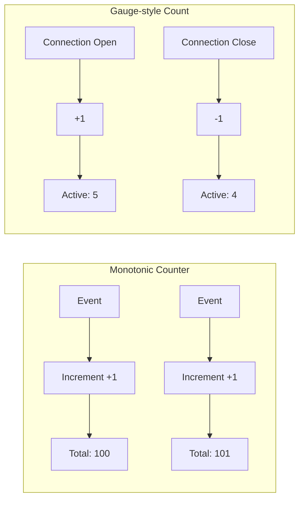
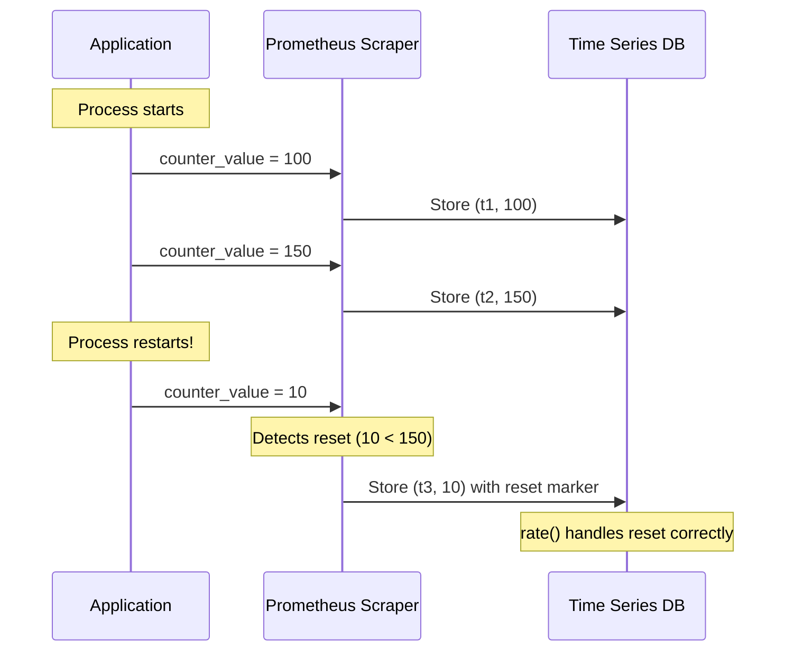
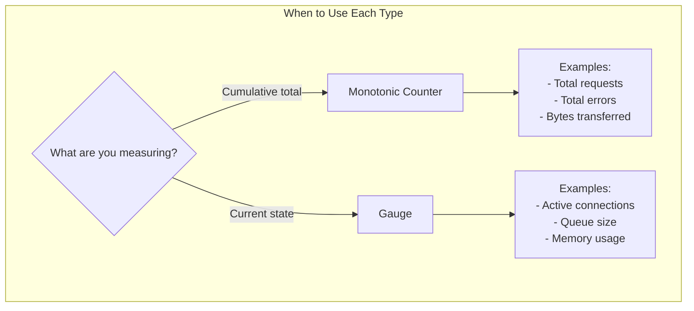
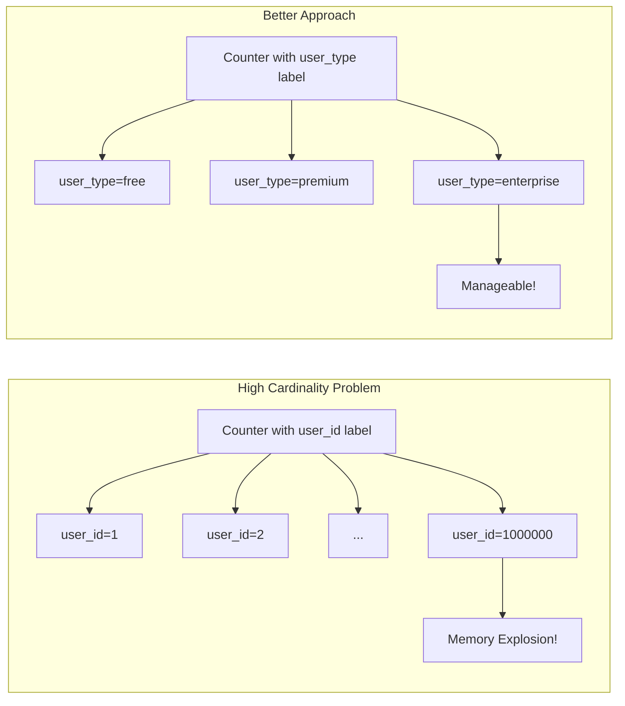
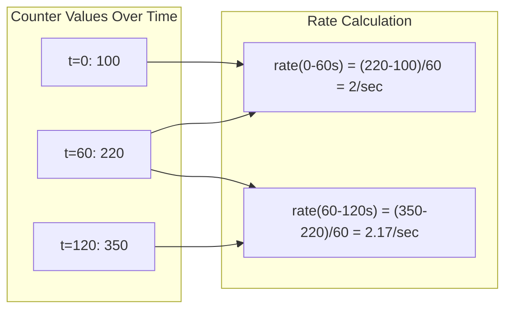

# How to Implement Count Metrics

Author: [nawazdhandala](https://github.com/nawazdhandala)

Tags: Observability, Metrics, Monitoring, SRE

Description: Learn how to implement counter metrics for tracking cumulative totals, request counts, and event occurrences.

---

Count metrics are fundamental building blocks of observability. They help you track how many times something has happened, whether that is HTTP requests, errors, database queries, or any other event in your system. In this guide, we will explore how to implement count metrics effectively, covering counter resets, monotonic counters, gauge-style counts, and Prometheus best practices.

## Understanding Count Metrics

Count metrics represent cumulative totals that typically only increase over time. They answer questions like:

- How many requests has my service handled?
- How many errors have occurred?
- How many messages have been processed?

There are two primary types of count metrics:

1. **Monotonic Counters**: Values that only increase (or reset to zero)
2. **Gauge-style Counts**: Values that can increase or decrease



## Monotonic Counters

Monotonic counters are the most common type of count metric. They start at zero and only ever increase. When the process restarts, the counter resets to zero.

### Basic Implementation in Go

```go
package metrics

import (
    "sync/atomic"
)

// Counter represents a monotonic counter that only increases.
// It is safe for concurrent use across multiple goroutines.
type Counter struct {
    // value stores the current count using atomic operations
    value uint64
}

// NewCounter creates and initializes a new Counter starting at zero.
func NewCounter() *Counter {
    return &Counter{value: 0}
}

// Inc increments the counter by 1.
// This operation is atomic and safe for concurrent access.
func (c *Counter) Inc() {
    atomic.AddUint64(&c.value, 1)
}

// Add increments the counter by the given delta.
// The delta must be non-negative for monotonic behavior.
func (c *Counter) Add(delta uint64) {
    atomic.AddUint64(&c.value, delta)
}

// Value returns the current counter value.
// This provides a point-in-time snapshot of the count.
func (c *Counter) Value() uint64 {
    return atomic.LoadUint64(&c.value)
}
```

### Basic Implementation in Python

```python
import threading
from typing import Optional

class Counter:
    """
    A thread-safe monotonic counter for tracking cumulative totals.

    This counter only increases and resets to zero on process restart.
    It is suitable for tracking events like requests, errors, or completions.
    """

    def __init__(self, name: str, description: Optional[str] = None):
        # Counter name for identification in metrics systems
        self._name = name
        # Human-readable description of what this counter tracks
        self._description = description or ""
        # Current value, starts at zero
        self._value: float = 0.0
        # Lock for thread-safe operations
        self._lock = threading.Lock()

    def inc(self, amount: float = 1.0) -> None:
        """
        Increment the counter by the specified amount.

        Args:
            amount: The value to add (must be non-negative, default is 1.0)

        Raises:
            ValueError: If amount is negative
        """
        if amount < 0:
            raise ValueError("Counter increment amount must be non-negative")

        with self._lock:
            self._value += amount

    def get(self) -> float:
        """
        Return the current counter value.

        Returns:
            The current cumulative count
        """
        with self._lock:
            return self._value

    @property
    def name(self) -> str:
        """Return the counter name."""
        return self._name
```

### Tracking Requests with Labels

Real-world applications need to track counts with dimensions (labels) for better granularity:

```python
from collections import defaultdict
import threading
from typing import Dict, Tuple

class LabeledCounter:
    """
    A counter that supports labels for multi-dimensional metrics.

    Labels allow you to break down counts by attributes like
    HTTP method, status code, endpoint, or service name.
    """

    def __init__(self, name: str, label_names: Tuple[str, ...]):
        self._name = name
        # Store the expected label names for validation
        self._label_names = label_names
        # Dictionary mapping label values to counts
        self._values: Dict[Tuple[str, ...], float] = defaultdict(float)
        self._lock = threading.Lock()

    def labels(self, **kwargs) -> "LabeledCounterChild":
        """
        Return a child counter for the specified label values.

        Args:
            **kwargs: Label name-value pairs matching label_names

        Returns:
            A LabeledCounterChild that can be incremented

        Example:
            counter.labels(method="GET", status="200").inc()
        """
        # Validate that all required labels are provided
        label_values = tuple(kwargs.get(name, "") for name in self._label_names)
        return LabeledCounterChild(self, label_values)

    def _inc(self, label_values: Tuple[str, ...], amount: float) -> None:
        """Internal method to increment a specific label combination."""
        with self._lock:
            self._values[label_values] += amount


class LabeledCounterChild:
    """
    A child counter bound to specific label values.

    This allows for cleaner syntax when incrementing the same
    label combination multiple times.
    """

    def __init__(self, parent: LabeledCounter, label_values: Tuple[str, ...]):
        self._parent = parent
        self._label_values = label_values

    def inc(self, amount: float = 1.0) -> None:
        """Increment this labeled counter by the specified amount."""
        self._parent._inc(self._label_values, amount)


# Usage example
http_requests = LabeledCounter(
    name="http_requests_total",
    label_names=("method", "endpoint", "status_code")
)

# Track a successful GET request
http_requests.labels(method="GET", endpoint="/api/users", status_code="200").inc()

# Track a failed POST request
http_requests.labels(method="POST", endpoint="/api/orders", status_code="500").inc()
```

## Handling Counter Resets

Counter resets occur when a process restarts or when the counter value exceeds its maximum. Monitoring systems like Prometheus handle resets automatically, but understanding how they work is crucial.



### Detecting Resets in Custom Code

```go
package metrics

import (
    "sync"
    "time"
)

// CounterWithResetDetection wraps a counter and tracks resets.
// This is useful when you need to detect and handle resets explicitly.
type CounterWithResetDetection struct {
    mu            sync.RWMutex
    currentValue  uint64
    previousValue uint64
    totalResets   uint64
    lastResetTime time.Time
}

// NewCounterWithResetDetection creates a new counter with reset tracking.
func NewCounterWithResetDetection() *CounterWithResetDetection {
    return &CounterWithResetDetection{
        lastResetTime: time.Now(),
    }
}

// Update records a new counter value from an external source.
// If the new value is less than the previous value, a reset is detected.
func (c *CounterWithResetDetection) Update(newValue uint64) {
    c.mu.Lock()
    defer c.mu.Unlock()

    // Detect reset: new value is less than the previous value
    if newValue < c.currentValue {
        c.totalResets++
        c.lastResetTime = time.Now()
        // Log or alert on reset detection
    }

    c.previousValue = c.currentValue
    c.currentValue = newValue
}

// GetRate calculates the rate of change, handling resets.
// Returns the increase since the last reading, accounting for any reset.
func (c *CounterWithResetDetection) GetRate() uint64 {
    c.mu.RLock()
    defer c.mu.RUnlock()

    // If a reset occurred, the rate is just the current value
    // (we assume it went from 0 to current since the reset)
    if c.currentValue < c.previousValue {
        return c.currentValue
    }

    return c.currentValue - c.previousValue
}

// GetTotalResets returns how many times the counter has reset.
func (c *CounterWithResetDetection) GetTotalResets() uint64 {
    c.mu.RLock()
    defer c.mu.RUnlock()
    return c.totalResets
}
```

## Gauge-style Counts

While monotonic counters only increase, gauge-style counts can go up and down. Use these for tracking current quantities like active connections, queue depth, or in-progress requests.



### Gauge Implementation

```python
import threading
from typing import Optional

class Gauge:
    """
    A metric that represents a single numerical value that can go up and down.

    Gauges are used for values that fluctuate, such as:
    - Current memory usage
    - Number of active connections
    - Queue depth
    - Temperature readings
    """

    def __init__(self, name: str, description: Optional[str] = None):
        self._name = name
        self._description = description or ""
        self._value: float = 0.0
        self._lock = threading.Lock()

    def set(self, value: float) -> None:
        """
        Set the gauge to an arbitrary value.

        Args:
            value: The new value for the gauge
        """
        with self._lock:
            self._value = value

    def inc(self, amount: float = 1.0) -> None:
        """
        Increment the gauge by the specified amount.

        Args:
            amount: The value to add (can be negative)
        """
        with self._lock:
            self._value += amount

    def dec(self, amount: float = 1.0) -> None:
        """
        Decrement the gauge by the specified amount.

        Args:
            amount: The value to subtract
        """
        with self._lock:
            self._value -= amount

    def get(self) -> float:
        """Return the current gauge value."""
        with self._lock:
            return self._value


class GaugeContextManager:
    """
    Context manager for tracking in-progress operations with a gauge.

    Automatically increments on entry and decrements on exit,
    ensuring accurate tracking even if exceptions occur.
    """

    def __init__(self, gauge: Gauge):
        self._gauge = gauge

    def __enter__(self):
        """Increment gauge when entering the context."""
        self._gauge.inc()
        return self

    def __exit__(self, exc_type, exc_val, exc_tb):
        """Decrement gauge when exiting the context, even on exception."""
        self._gauge.dec()
        return False  # Do not suppress exceptions


# Usage example
active_requests = Gauge("http_active_requests", "Number of HTTP requests in progress")

def handle_request(request):
    """Process an HTTP request while tracking it in the gauge."""
    with GaugeContextManager(active_requests):
        # Process the request
        # The gauge is automatically decremented when done
        process(request)
```

## Prometheus Counter Best Practices

Prometheus is the industry standard for metrics collection. Here are best practices for implementing counters with Prometheus:

### 1. Naming Conventions

```python
from prometheus_client import Counter, Gauge

# GOOD: Clear, descriptive names with units and _total suffix for counters
http_requests_total = Counter(
    'http_requests_total',
    'Total number of HTTP requests',
    ['method', 'endpoint', 'status_code']
)

http_request_duration_seconds = Counter(
    'http_request_duration_seconds_total',
    'Total time spent processing HTTP requests in seconds',
    ['method', 'endpoint']
)

# BAD: Vague names, missing units, missing _total suffix
# requests = Counter('requests', 'requests')  # Don't do this
```

### 2. Label Cardinality



```python
from prometheus_client import Counter

# GOOD: Low cardinality labels with bounded values
api_calls = Counter(
    'api_calls_total',
    'Total API calls',
    [
        'method',      # GET, POST, PUT, DELETE (4 values)
        'status',      # 2xx, 4xx, 5xx (3 values)
        'endpoint'     # /users, /orders, /products (bounded list)
    ]
)

# BAD: High cardinality labels that can explode
# api_calls_bad = Counter(
#     'api_calls_total',
#     'Total API calls',
#     [
#         'user_id',     # Millions of unique values!
#         'request_id',  # Unique per request!
#         'timestamp'    # Infinite values!
#     ]
# )
```

### 3. Using Counters Correctly

```python
from prometheus_client import Counter, generate_latest, REGISTRY
from functools import wraps
import time

# Define counters at module level (they are singletons)
REQUEST_COUNT = Counter(
    'myapp_http_requests_total',
    'Total HTTP requests by method, endpoint, and status',
    ['method', 'endpoint', 'status_code']
)

REQUEST_EXCEPTIONS = Counter(
    'myapp_http_request_exceptions_total',
    'Total exceptions during HTTP request processing',
    ['method', 'endpoint', 'exception_type']
)


def track_requests(endpoint: str):
    """
    Decorator to automatically track request counts and exceptions.

    Args:
        endpoint: The endpoint name for labeling
    """
    def decorator(func):
        @wraps(func)
        def wrapper(*args, **kwargs):
            method = kwargs.get('method', 'GET')
            try:
                # Execute the handler
                result = func(*args, **kwargs)

                # Increment success counter
                status_code = getattr(result, 'status_code', 200)
                REQUEST_COUNT.labels(
                    method=method,
                    endpoint=endpoint,
                    status_code=str(status_code)
                ).inc()

                return result

            except Exception as e:
                # Increment exception counter
                REQUEST_EXCEPTIONS.labels(
                    method=method,
                    endpoint=endpoint,
                    exception_type=type(e).__name__
                ).inc()

                # Increment request counter with 500 status
                REQUEST_COUNT.labels(
                    method=method,
                    endpoint=endpoint,
                    status_code='500'
                ).inc()

                raise

        return wrapper
    return decorator


# Usage
@track_requests('/api/users')
def get_users(method='GET'):
    """Fetch and return users from the database."""
    return fetch_users_from_db()
```

### 4. Exposing Metrics Endpoint

```python
from prometheus_client import Counter, generate_latest, CONTENT_TYPE_LATEST
from flask import Flask, Response

app = Flask(__name__)

# Define your counters
page_views = Counter(
    'page_views_total',
    'Total page views',
    ['page']
)

@app.route('/')
def index():
    """Serve the index page and track the view."""
    page_views.labels(page='index').inc()
    return "Welcome!"

@app.route('/metrics')
def metrics():
    """
    Expose Prometheus metrics endpoint.

    This endpoint is scraped by Prometheus to collect metrics.
    It should be accessible but may need authentication in production.
    """
    return Response(
        generate_latest(),
        mimetype=CONTENT_TYPE_LATEST
    )
```

## Rate Calculations with Counters

The real power of counters comes from calculating rates. Here is how to calculate rates from counter values:



### PromQL Queries for Counters

```promql
# Request rate over the last 5 minutes
rate(http_requests_total[5m])

# Request rate by endpoint
sum by (endpoint) (rate(http_requests_total[5m]))

# Error rate as a percentage
sum(rate(http_requests_total{status_code=~"5.."}[5m]))
/
sum(rate(http_requests_total[5m])) * 100

# Increase in requests over the last hour
increase(http_requests_total[1h])

# Requests per second, aggregated across all instances
sum(rate(http_requests_total[5m]))
```

## Common Patterns and Anti-patterns

### Pattern: Request Duration Counter

```python
from prometheus_client import Counter
import time

# Track total time spent processing requests
request_duration_total = Counter(
    'request_processing_seconds_total',
    'Total time spent processing requests',
    ['endpoint']
)

request_count = Counter(
    'requests_total',
    'Total requests processed',
    ['endpoint']
)

def process_request(endpoint: str, handler):
    """
    Process a request and track both count and duration.

    By tracking total duration as a counter, you can calculate
    average request duration using rate(duration) / rate(count).
    """
    start_time = time.time()

    try:
        return handler()
    finally:
        duration = time.time() - start_time

        # Increment both counters
        request_duration_total.labels(endpoint=endpoint).inc(duration)
        request_count.labels(endpoint=endpoint).inc()


# Calculate average duration in PromQL:
# rate(request_processing_seconds_total[5m]) / rate(requests_total[5m])
```

### Anti-pattern: Using Gauge for Cumulative Values

```python
from prometheus_client import Gauge, Counter

# BAD: Using a gauge for cumulative values
# total_requests_bad = Gauge('total_requests', 'Total requests')
# total_requests_bad.inc()  # This loses data on restart!

# GOOD: Use a counter for cumulative values
total_requests_good = Counter(
    'requests_total',
    'Total number of requests processed'
)
total_requests_good.inc()  # Prometheus handles resets correctly
```

## Testing Count Metrics

```python
import unittest
from unittest.mock import patch
from prometheus_client import Counter, REGISTRY

class TestCounterMetrics(unittest.TestCase):
    """Test suite for counter metric implementations."""

    def setUp(self):
        """Reset the registry before each test."""
        # Create a new counter for testing
        # In production, use a separate registry for tests
        self.test_counter = Counter(
            'test_requests_total',
            'Test counter',
            ['status'],
            registry=REGISTRY
        )

    def test_counter_increment(self):
        """Test that counter increments correctly."""
        initial_value = self.test_counter.labels(status='200')._value.get()

        self.test_counter.labels(status='200').inc()

        new_value = self.test_counter.labels(status='200')._value.get()
        self.assertEqual(new_value, initial_value + 1)

    def test_counter_add_custom_amount(self):
        """Test adding a custom amount to the counter."""
        initial_value = self.test_counter.labels(status='200')._value.get()

        self.test_counter.labels(status='200').inc(5)

        new_value = self.test_counter.labels(status='200')._value.get()
        self.assertEqual(new_value, initial_value + 5)

    def test_counter_labels_isolation(self):
        """Test that different label values are tracked separately."""
        self.test_counter.labels(status='200').inc(10)
        self.test_counter.labels(status='500').inc(2)

        value_200 = self.test_counter.labels(status='200')._value.get()
        value_500 = self.test_counter.labels(status='500')._value.get()

        # Values should be independent
        self.assertNotEqual(value_200, value_500)
```

## Summary

Count metrics are essential for observability. Here are the key takeaways:

1. **Use monotonic counters** for cumulative totals that only increase
2. **Use gauges** for values that can go up and down
3. **Handle counter resets** by letting your monitoring system manage them
4. **Follow naming conventions** with clear names and the `_total` suffix
5. **Keep label cardinality low** to avoid memory issues
6. **Calculate rates** using `rate()` or `increase()` functions
7. **Test your metrics** to ensure they are recording correctly

By following these practices, you will build a solid foundation for monitoring your applications and understanding their behavior over time.
