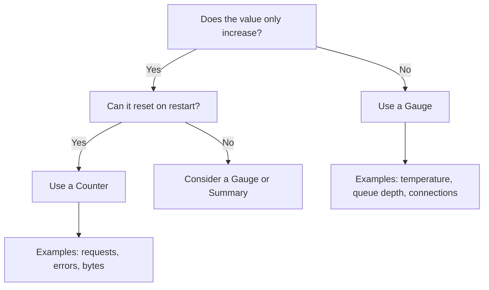
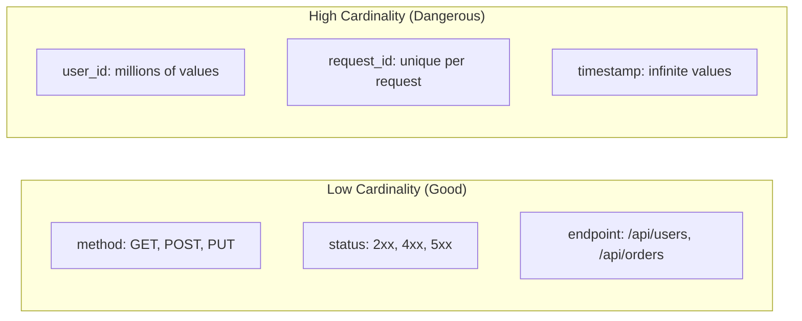
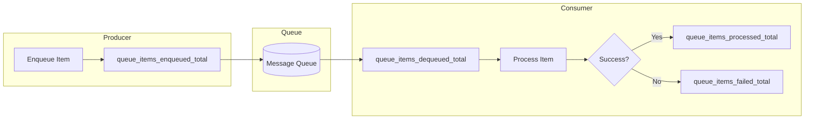
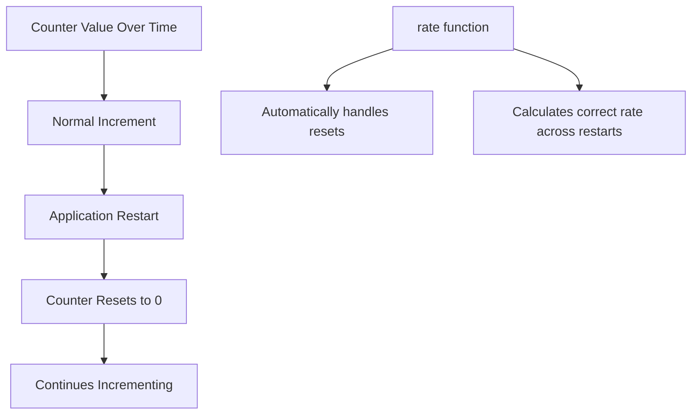

# How to Build Counter Metrics Design

Author: [nawazdhandala](https://github.com/nawazdhandala)

Tags: Metrics, Counters, Prometheus, Monitoring

Description: Learn to build counter metrics design for tracking cumulative values.

---

Counter metrics are the workhorse of observability. They track cumulative values that only go up: requests served, errors thrown, bytes transferred, jobs completed. Unlike gauges that fluctuate, counters give you a monotonically increasing signal that you can derive rates and totals from.

This guide covers how to design counter metrics properly, when to use them, and how to implement them in production systems.

---

## What is a Counter Metric?

A counter is a cumulative metric that represents a single numerical value that only ever goes up (or resets to zero on restart). You use counters for things you want to count over time.

| Use Case | Counter Name Example |
|----------|---------------------|
| HTTP requests received | `http_requests_total` |
| Errors encountered | `errors_total` |
| Bytes sent over network | `network_bytes_sent_total` |
| Queue items processed | `queue_items_processed_total` |
| Cache hits | `cache_hits_total` |

The key insight: you never query a counter's raw value directly. Instead, you apply functions like `rate()` or `increase()` to derive meaningful information.

---

## Counter vs Gauge: When to Use Which



Quick rules:

- **Counter**: Events that accumulate (requests, errors, completions)
- **Gauge**: Point-in-time measurements (memory usage, active connections, temperature)
- **Histogram**: Distribution of values (latency, request size)

---

## Anatomy of a Well-Designed Counter

A counter metric has three parts: the name, labels, and the value itself.

### Naming Conventions

Follow the pattern: `<namespace>_<name>_<unit>_total`

```
# Good names
http_requests_total
payment_transactions_processed_total
email_sends_total
cache_evictions_total

# Bad names
requests           # Missing namespace and _total suffix
httpRequests       # CamelCase instead of snake_case
request_count      # Use _total, not _count for counters
```

### Labels (Dimensions)

Labels let you slice and dice your counter data. But be careful with cardinality.



**Good labels**: HTTP method, status code class, service name, region
**Bad labels**: User ID, request ID, email address, timestamps

High cardinality labels will explode your metric storage and query times.

---

## Implementation in Code

### Node.js with Prometheus Client

```typescript
// metrics.ts
import { Counter, Registry } from 'prom-client';

// Create a registry to hold all metrics
const registry = new Registry();

// Define the counter with labels
const httpRequestsTotal = new Counter({
  name: 'http_requests_total',
  help: 'Total number of HTTP requests received',
  labelNames: ['method', 'route', 'status_code'],
  registers: [registry],
});

// Increment the counter when a request completes
export function recordRequest(
  method: string,
  route: string,
  statusCode: number
): void {
  // Bucket status codes to reduce cardinality
  const statusClass = `${Math.floor(statusCode / 100)}xx`;

  httpRequestsTotal.inc({
    method: method.toUpperCase(),
    route: route,
    status_code: statusClass,
  });
}

// Export registry for the /metrics endpoint
export { registry };
```

### Express Middleware Example

```typescript
// middleware.ts
import { Request, Response, NextFunction } from 'express';
import { recordRequest } from './metrics';

export function metricsMiddleware(
  req: Request,
  res: Response,
  next: NextFunction
): void {
  // Capture the original end function
  const originalEnd = res.end;

  // Override res.end to record metrics after response
  res.end = function(...args: any[]): Response {
    // Get the matched route pattern, not the actual URL
    // This prevents high cardinality from path parameters
    const route = req.route?.path || req.path;

    recordRequest(req.method, route, res.statusCode);

    // Call the original end function
    return originalEnd.apply(this, args);
  };

  next();
}
```

### Python with Prometheus Client

```python
# metrics.py
from prometheus_client import Counter, CollectorRegistry, generate_latest

# Create a registry
registry = CollectorRegistry()

# Define the counter
http_requests_total = Counter(
    'http_requests_total',
    'Total number of HTTP requests received',
    ['method', 'route', 'status_code'],
    registry=registry
)

def record_request(method: str, route: str, status_code: int) -> None:
    """Record an HTTP request in the counter."""
    # Bucket status codes to reduce cardinality
    status_class = f"{status_code // 100}xx"

    http_requests_total.labels(
        method=method.upper(),
        route=route,
        status_code=status_class
    ).inc()
```

---

## Counter Patterns in Production

### Pattern 1: Error Tracking with Context

Track errors with enough context to debug, but not so much that you create cardinality issues.

```typescript
// error-metrics.ts
import { Counter } from 'prom-client';

const errorsTotal = new Counter({
  name: 'application_errors_total',
  help: 'Total application errors by type and severity',
  labelNames: ['error_type', 'severity', 'service'],
});

// Use error type categories, not specific error messages
export function recordError(
  errorType: 'validation' | 'database' | 'network' | 'internal',
  severity: 'warning' | 'error' | 'critical',
  service: string
): void {
  errorsTotal.inc({ error_type: errorType, severity, service });
}
```

### Pattern 2: Business Metrics

Track business events alongside technical metrics.

```typescript
// business-metrics.ts
import { Counter } from 'prom-client';

const ordersProcessed = new Counter({
  name: 'orders_processed_total',
  help: 'Total orders processed',
  labelNames: ['payment_method', 'outcome'],
});

const revenueTotal = new Counter({
  name: 'revenue_cents_total',
  help: 'Total revenue in cents',
  labelNames: ['payment_method', 'currency'],
});

export function recordOrderCompletion(
  paymentMethod: string,
  outcome: 'success' | 'failed' | 'refunded',
  amountCents: number,
  currency: string
): void {
  ordersProcessed.inc({ payment_method: paymentMethod, outcome });

  // Only count revenue for successful orders
  if (outcome === 'success') {
    revenueTotal.inc(
      { payment_method: paymentMethod, currency },
      amountCents
    );
  }
}
```

### Pattern 3: Queue Processing Metrics

Track work going in and out of queues.



```typescript
// queue-metrics.ts
import { Counter } from 'prom-client';

const itemsEnqueued = new Counter({
  name: 'queue_items_enqueued_total',
  help: 'Items added to the queue',
  labelNames: ['queue_name'],
});

const itemsProcessed = new Counter({
  name: 'queue_items_processed_total',
  help: 'Items successfully processed from the queue',
  labelNames: ['queue_name'],
});

const itemsFailed = new Counter({
  name: 'queue_items_failed_total',
  help: 'Items that failed processing',
  labelNames: ['queue_name', 'failure_reason'],
});
```

---

## Querying Counter Metrics

Counters become useful when you apply rate functions.

### Calculate Request Rate

```promql
# Requests per second over the last 5 minutes
rate(http_requests_total[5m])

# Requests per second by endpoint
sum by (route) (rate(http_requests_total[5m]))
```

### Calculate Error Rate

```promql
# Error percentage over the last 5 minutes
sum(rate(http_requests_total{status_code="5xx"}[5m]))
/
sum(rate(http_requests_total[5m]))
* 100
```

### Track Increase Over Time

```promql
# Total new orders in the last hour
increase(orders_processed_total{outcome="success"}[1h])
```

---

## Common Mistakes to Avoid

### 1. Decrementing Counters

Counters only go up. If you need a value that goes down, use a gauge.

```typescript
// Wrong: trying to decrement a counter
counter.dec();  // This will throw an error

// Right: use a gauge for bidirectional values
gauge.inc();
gauge.dec();
```

### 2. Storing Timestamps in Labels

```typescript
// Wrong: timestamp creates infinite cardinality
counter.inc({ timestamp: Date.now() });

// Right: let the metric system handle timestamps
counter.inc();
```

### 3. Using Raw Counter Values

```promql
# Wrong: raw counter value is meaningless
http_requests_total

# Right: use rate() to get requests per second
rate(http_requests_total[5m])
```

### 4. Ignoring Counter Resets

Counters reset to zero when your application restarts. The `rate()` and `increase()` functions handle this automatically, but if you're doing manual calculations, you need to account for resets.

---

## Counter Reset Handling



Prometheus and most monitoring systems detect counter resets by observing when a counter value is lower than the previous scrape. They adjust calculations accordingly.

---

## Testing Counter Metrics

```typescript
// metrics.test.ts
import { Counter, Registry } from 'prom-client';

describe('Counter Metrics', () => {
  let registry: Registry;
  let counter: Counter;

  beforeEach(() => {
    registry = new Registry();
    counter = new Counter({
      name: 'test_counter_total',
      help: 'Test counter',
      labelNames: ['status'],
      registers: [registry],
    });
  });

  it('should increment counter', async () => {
    counter.inc({ status: 'success' });
    counter.inc({ status: 'success' });
    counter.inc({ status: 'failure' });

    const metrics = await registry.getMetricsAsJSON();
    const testCounter = metrics.find(m => m.name === 'test_counter_total');

    expect(testCounter?.values).toContainEqual(
      expect.objectContaining({
        labels: { status: 'success' },
        value: 2,
      })
    );
  });
});
```

---

## Summary

Counter metrics are foundational to observability. Design them with these principles:

1. **Name clearly**: Use the `namespace_name_unit_total` pattern
2. **Label carefully**: Keep cardinality low by using categories, not unique values
3. **Query properly**: Always use `rate()` or `increase()`, never raw values
4. **Track what matters**: Business events alongside technical metrics
5. **Test thoroughly**: Validate your counters increment correctly

When designed well, counters give you reliable signals about the health and behavior of your systems. They form the basis for alerting, SLOs, and capacity planning.

---

**Related Reading:**

- [What are Metrics in OpenTelemetry](/blog/post/2025-08-26-what-are-metrics-in-opentelemetry/view)
- [SRE Metrics Worth Tracking](/blog/post/2025-11-28-sre-metrics-to-track/view)
- [Three Pillars of Observability](/blog/post/2025-08-20-three-pillars-of-observability-logs-metrics-traces/view)
