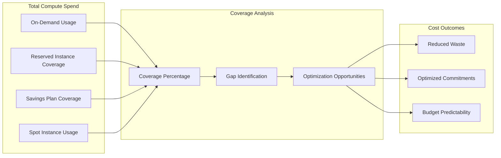
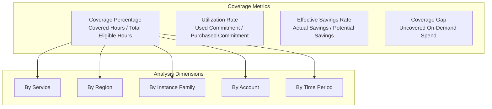
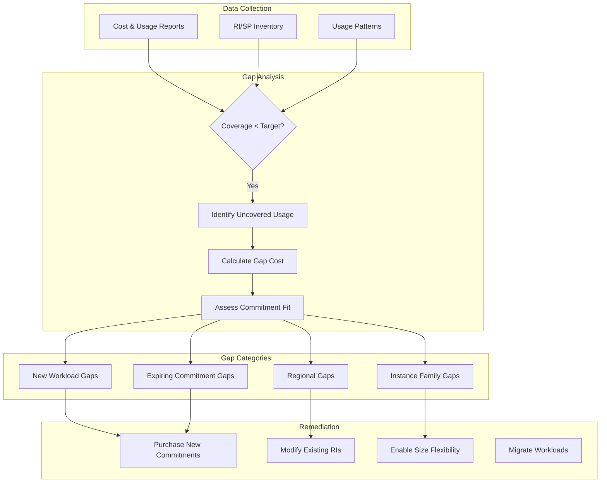
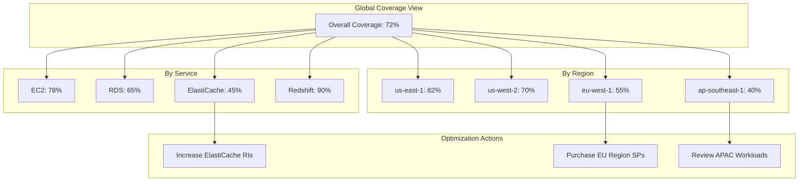
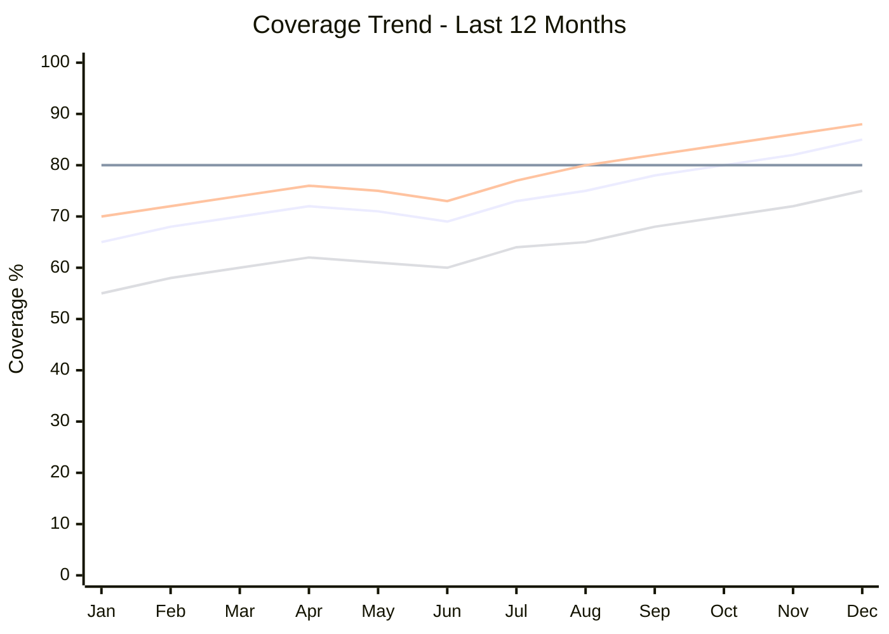
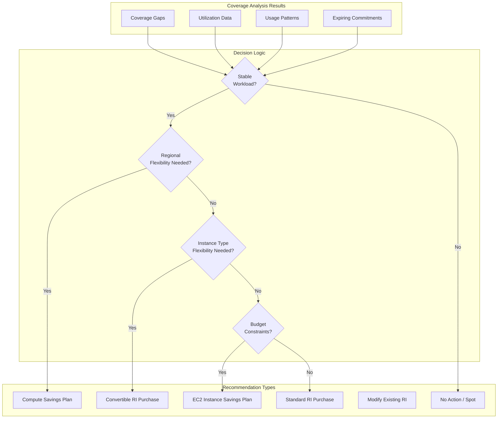
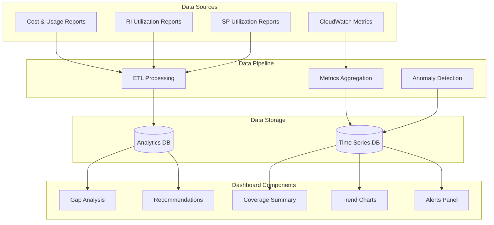

# How to Implement Coverage Analysis

Author: [nawazdhandala](https://github.com/nawazdhandala)

Tags: Cloud, Cost Optimization, FinOps, Analysis

Description: Learn how to analyze reserved instance and savings plan coverage.

---

## What Is Coverage Analysis?

Coverage analysis measures how much of your on-demand cloud spend is protected by committed discount mechanisms like Reserved Instances (RIs) and Savings Plans (SPs). If you are running workloads on AWS, Azure, or GCP without understanding your coverage, you are likely overpaying by 30-60%.

The core question coverage analysis answers: "What percentage of my eligible compute hours are covered by commitments, and where are the gaps?"



---

## 1. Coverage Metrics Definition

Before diving into analysis, establish clear metrics that define what coverage means for your organization.

### Core Coverage Metrics



### Coverage Calculation Framework

```python
#!/usr/bin/env python3
"""
Coverage Analysis Calculator
Calculates RI/SP coverage metrics across your cloud infrastructure.
"""

from dataclasses import dataclass, field
from typing import Optional
from datetime import datetime, timedelta
from collections import defaultdict
import json


@dataclass
class UsageRecord:
    timestamp: datetime
    account_id: str
    region: str
    service: str
    instance_type: str
    usage_hours: float
    on_demand_cost: float
    covered_hours: float = 0.0
    coverage_type: Optional[str] = None  # 'RI', 'SP', 'Spot', None


@dataclass
class Commitment:
    commitment_id: str
    commitment_type: str  # 'RI' or 'SP'
    service: str
    region: str
    instance_family: Optional[str]  # None for Compute SP
    purchased_hours: float
    hourly_rate: float
    start_date: datetime
    end_date: datetime
    flexibility: str  # 'regional', 'zonal', 'size-flexible'


@dataclass
class CoverageMetrics:
    total_eligible_hours: float = 0.0
    covered_hours: float = 0.0
    ri_covered_hours: float = 0.0
    sp_covered_hours: float = 0.0
    spot_hours: float = 0.0
    on_demand_hours: float = 0.0
    total_cost: float = 0.0
    covered_cost: float = 0.0
    potential_savings: float = 0.0
    actual_savings: float = 0.0

    @property
    def coverage_percentage(self) -> float:
        if self.total_eligible_hours == 0:
            return 0.0
        return (self.covered_hours / self.total_eligible_hours) * 100

    @property
    def effective_savings_rate(self) -> float:
        if self.potential_savings == 0:
            return 0.0
        return (self.actual_savings / self.potential_savings) * 100

    @property
    def on_demand_percentage(self) -> float:
        if self.total_eligible_hours == 0:
            return 0.0
        return (self.on_demand_hours / self.total_eligible_hours) * 100


class CoverageAnalyzer:
    """Analyzes cloud spend coverage by RIs and Savings Plans."""

    # Typical discount rates for reference
    DISCOUNT_RATES = {
        "RI_1yr_no_upfront": 0.30,
        "RI_1yr_partial_upfront": 0.35,
        "RI_1yr_all_upfront": 0.40,
        "RI_3yr_no_upfront": 0.45,
        "RI_3yr_partial_upfront": 0.55,
        "RI_3yr_all_upfront": 0.60,
        "SP_1yr_no_upfront": 0.28,
        "SP_1yr_partial_upfront": 0.33,
        "SP_3yr_all_upfront": 0.52,
    }

    def __init__(self):
        self.usage_records: list[UsageRecord] = []
        self.commitments: list[Commitment] = []
        self.metrics_by_dimension: dict[str, dict] = defaultdict(
            lambda: defaultdict(CoverageMetrics)
        )

    def load_usage_data(self, usage_data: list[dict]) -> None:
        """Load usage records from cost and usage reports."""
        for record in usage_data:
            self.usage_records.append(
                UsageRecord(
                    timestamp=datetime.fromisoformat(record["timestamp"]),
                    account_id=record["account_id"],
                    region=record["region"],
                    service=record["service"],
                    instance_type=record["instance_type"],
                    usage_hours=record["usage_hours"],
                    on_demand_cost=record["on_demand_cost"],
                    covered_hours=record.get("covered_hours", 0),
                    coverage_type=record.get("coverage_type"),
                )
            )

    def load_commitments(self, commitment_data: list[dict]) -> None:
        """Load RI and SP commitment data."""
        for commit in commitment_data:
            self.commitments.append(
                Commitment(
                    commitment_id=commit["commitment_id"],
                    commitment_type=commit["type"],
                    service=commit["service"],
                    region=commit["region"],
                    instance_family=commit.get("instance_family"),
                    purchased_hours=commit["purchased_hours"],
                    hourly_rate=commit["hourly_rate"],
                    start_date=datetime.fromisoformat(commit["start_date"]),
                    end_date=datetime.fromisoformat(commit["end_date"]),
                    flexibility=commit.get("flexibility", "regional"),
                )
            )

    def calculate_coverage(
        self, start_date: datetime, end_date: datetime
    ) -> CoverageMetrics:
        """Calculate overall coverage metrics for a time period."""
        metrics = CoverageMetrics()

        filtered_usage = [
            r
            for r in self.usage_records
            if start_date <= r.timestamp <= end_date
        ]

        for record in filtered_usage:
            metrics.total_eligible_hours += record.usage_hours
            metrics.total_cost += record.on_demand_cost

            if record.coverage_type == "RI":
                metrics.ri_covered_hours += record.covered_hours
                metrics.covered_hours += record.covered_hours
            elif record.coverage_type == "SP":
                metrics.sp_covered_hours += record.covered_hours
                metrics.covered_hours += record.covered_hours
            elif record.coverage_type == "Spot":
                metrics.spot_hours += record.usage_hours
            else:
                metrics.on_demand_hours += record.usage_hours

            # Calculate savings
            if record.covered_hours > 0:
                on_demand_rate = record.on_demand_cost / record.usage_hours
                covered_cost = record.covered_hours * (on_demand_rate * 0.6)
                metrics.actual_savings += (
                    record.covered_hours * on_demand_rate - covered_cost
                )
                metrics.covered_cost += covered_cost

        # Potential savings assumes 100% coverage at 40% discount
        metrics.potential_savings = metrics.total_cost * 0.40

        return metrics

    def analyze_by_dimension(
        self,
        dimension: str,
        start_date: datetime,
        end_date: datetime,
    ) -> dict[str, CoverageMetrics]:
        """Analyze coverage broken down by a specific dimension."""
        results = defaultdict(CoverageMetrics)

        filtered_usage = [
            r
            for r in self.usage_records
            if start_date <= r.timestamp <= end_date
        ]

        for record in filtered_usage:
            key = getattr(record, dimension, "unknown")
            metrics = results[key]

            metrics.total_eligible_hours += record.usage_hours
            metrics.total_cost += record.on_demand_cost

            if record.coverage_type == "RI":
                metrics.ri_covered_hours += record.covered_hours
                metrics.covered_hours += record.covered_hours
            elif record.coverage_type == "SP":
                metrics.sp_covered_hours += record.covered_hours
                metrics.covered_hours += record.covered_hours
            elif record.coverage_type == "Spot":
                metrics.spot_hours += record.usage_hours
            else:
                metrics.on_demand_hours += record.usage_hours

        return dict(results)

    def identify_coverage_gaps(
        self,
        start_date: datetime,
        end_date: datetime,
        threshold: float = 80.0,
    ) -> list[dict]:
        """Identify areas with coverage below threshold."""
        gaps = []

        # Analyze by multiple dimensions
        for dimension in ["region", "service", "instance_type", "account_id"]:
            by_dim = self.analyze_by_dimension(dimension, start_date, end_date)

            for key, metrics in by_dim.items():
                if metrics.coverage_percentage < threshold:
                    gaps.append(
                        {
                            "dimension": dimension,
                            "value": key,
                            "coverage_percentage": round(
                                metrics.coverage_percentage, 2
                            ),
                            "on_demand_hours": metrics.on_demand_hours,
                            "on_demand_cost": round(
                                metrics.on_demand_hours
                                * (metrics.total_cost / metrics.total_eligible_hours)
                                if metrics.total_eligible_hours > 0
                                else 0,
                                2,
                            ),
                            "potential_monthly_savings": round(
                                metrics.on_demand_hours * 0.4 * 730 / 24,
                                2,
                            ),
                        }
                    )

        # Sort by potential savings
        gaps.sort(key=lambda x: x["potential_monthly_savings"], reverse=True)
        return gaps


def generate_coverage_report(analyzer: CoverageAnalyzer) -> dict:
    """Generate a comprehensive coverage analysis report."""
    end_date = datetime.now()
    start_date = end_date - timedelta(days=30)

    overall = analyzer.calculate_coverage(start_date, end_date)
    by_region = analyzer.analyze_by_dimension("region", start_date, end_date)
    by_service = analyzer.analyze_by_dimension("service", start_date, end_date)
    gaps = analyzer.identify_coverage_gaps(start_date, end_date)

    report = {
        "period": {
            "start": start_date.isoformat(),
            "end": end_date.isoformat(),
        },
        "summary": {
            "total_eligible_hours": overall.total_eligible_hours,
            "coverage_percentage": round(overall.coverage_percentage, 2),
            "ri_coverage": round(
                (overall.ri_covered_hours / overall.total_eligible_hours * 100)
                if overall.total_eligible_hours > 0
                else 0,
                2,
            ),
            "sp_coverage": round(
                (overall.sp_covered_hours / overall.total_eligible_hours * 100)
                if overall.total_eligible_hours > 0
                else 0,
                2,
            ),
            "on_demand_percentage": round(overall.on_demand_percentage, 2),
            "effective_savings_rate": round(overall.effective_savings_rate, 2),
            "actual_savings": round(overall.actual_savings, 2),
        },
        "by_region": {
            k: {
                "coverage": round(v.coverage_percentage, 2),
                "on_demand_pct": round(v.on_demand_percentage, 2),
            }
            for k, v in by_region.items()
        },
        "by_service": {
            k: {
                "coverage": round(v.coverage_percentage, 2),
                "on_demand_pct": round(v.on_demand_percentage, 2),
            }
            for k, v in by_service.items()
        },
        "top_gaps": gaps[:10],
    }

    return report


# Example usage
if __name__ == "__main__":
    analyzer = CoverageAnalyzer()

    # Sample usage data
    sample_usage = [
        {
            "timestamp": "2026-01-15T00:00:00",
            "account_id": "111111111111",
            "region": "us-east-1",
            "service": "EC2",
            "instance_type": "m5.xlarge",
            "usage_hours": 744,
            "on_demand_cost": 142.08,
            "covered_hours": 600,
            "coverage_type": "RI",
        },
        {
            "timestamp": "2026-01-15T00:00:00",
            "account_id": "111111111111",
            "region": "us-west-2",
            "service": "EC2",
            "instance_type": "c5.2xlarge",
            "usage_hours": 500,
            "on_demand_cost": 170.00,
            "covered_hours": 200,
            "coverage_type": "SP",
        },
        {
            "timestamp": "2026-01-15T00:00:00",
            "account_id": "222222222222",
            "region": "eu-west-1",
            "service": "RDS",
            "instance_type": "db.r5.large",
            "usage_hours": 744,
            "on_demand_cost": 178.56,
            "covered_hours": 0,
            "coverage_type": None,
        },
    ]

    analyzer.load_usage_data(sample_usage)
    report = generate_coverage_report(analyzer)
    print(json.dumps(report, indent=2))
```

---

## 2. Gap Identification

Once you understand your coverage metrics, the next step is identifying where gaps exist and quantifying their cost impact.

### Gap Analysis Framework



### Gap Detection Implementation

```python
"""
Coverage Gap Detector
Identifies and categorizes coverage gaps in cloud infrastructure.
"""

from dataclasses import dataclass
from datetime import datetime, timedelta
from typing import Optional
from collections import defaultdict
import json


@dataclass
class CoverageGap:
    gap_type: str
    dimension: str
    value: str
    uncovered_hours: float
    uncovered_cost: float
    potential_savings: float
    confidence: str  # high, medium, low
    recommendation: str
    priority: int


class GapDetector:
    """Detects and categorizes coverage gaps."""

    # Target coverage thresholds
    COVERAGE_TARGETS = {
        "production": 85,
        "staging": 60,
        "development": 40,
        "default": 70,
    }

    # Minimum usage threshold for commitment consideration
    MIN_USAGE_HOURS = 500  # hours per month

    def __init__(self):
        self.usage_by_dimension: dict = defaultdict(lambda: defaultdict(float))
        self.coverage_by_dimension: dict = defaultdict(lambda: defaultdict(float))

    def analyze_usage_patterns(
        self, usage_records: list[dict]
    ) -> dict[str, dict]:
        """Analyze usage patterns to identify stable vs variable workloads."""
        patterns = defaultdict(
            lambda: {
                "daily_usage": [],
                "weekly_usage": [],
                "peak_usage": 0,
                "avg_usage": 0,
                "min_usage": float("inf"),
                "variance": 0,
                "stability_score": 0,
            }
        )

        # Group by instance type and calculate patterns
        for record in usage_records:
            key = f"{record['service']}:{record['instance_type']}"
            patterns[key]["daily_usage"].append(record["usage_hours"])

        # Calculate pattern metrics
        for key, data in patterns.items():
            usage = data["daily_usage"]
            if usage:
                data["avg_usage"] = sum(usage) / len(usage)
                data["peak_usage"] = max(usage)
                data["min_usage"] = min(usage)
                variance = sum((x - data["avg_usage"]) ** 2 for x in usage) / len(
                    usage
                )
                data["variance"] = variance
                # Stability score: higher = more stable (good for commitments)
                if data["avg_usage"] > 0:
                    data["stability_score"] = (
                        data["min_usage"] / data["avg_usage"]
                    ) * 100

        return dict(patterns)

    def detect_gaps(
        self,
        usage_records: list[dict],
        commitments: list[dict],
        environment: str = "default",
    ) -> list[CoverageGap]:
        """Detect all coverage gaps and categorize them."""
        gaps = []
        target = self.COVERAGE_TARGETS.get(environment, 70)

        # Analyze by multiple dimensions
        dimensions = ["region", "service", "instance_type", "account_id"]

        for dimension in dimensions:
            dim_gaps = self._detect_dimension_gaps(
                usage_records, commitments, dimension, target
            )
            gaps.extend(dim_gaps)

        # Detect expiring commitment gaps
        expiring_gaps = self._detect_expiring_commitment_gaps(commitments)
        gaps.extend(expiring_gaps)

        # Detect new workload gaps (usage without any prior commitment)
        new_workload_gaps = self._detect_new_workload_gaps(
            usage_records, commitments
        )
        gaps.extend(new_workload_gaps)

        # Sort by priority and potential savings
        gaps.sort(key=lambda g: (g.priority, -g.potential_savings))

        return gaps

    def _detect_dimension_gaps(
        self,
        usage_records: list[dict],
        commitments: list[dict],
        dimension: str,
        target: float,
    ) -> list[CoverageGap]:
        """Detect gaps for a specific dimension."""
        gaps = []

        # Aggregate usage and coverage by dimension
        usage_totals = defaultdict(float)
        coverage_totals = defaultdict(float)
        cost_totals = defaultdict(float)

        for record in usage_records:
            key = record.get(dimension, "unknown")
            usage_totals[key] += record["usage_hours"]
            coverage_totals[key] += record.get("covered_hours", 0)
            cost_totals[key] += record["on_demand_cost"]

        # Identify gaps below target
        for key in usage_totals:
            total_hours = usage_totals[key]
            covered_hours = coverage_totals[key]
            total_cost = cost_totals[key]

            if total_hours < self.MIN_USAGE_HOURS:
                continue  # Skip low-usage items

            coverage_pct = (covered_hours / total_hours * 100) if total_hours > 0 else 0

            if coverage_pct < target:
                uncovered_hours = total_hours - covered_hours
                hourly_rate = total_cost / total_hours if total_hours > 0 else 0
                uncovered_cost = uncovered_hours * hourly_rate

                # Estimate savings at 40% discount
                potential_savings = uncovered_cost * 0.40

                gap = CoverageGap(
                    gap_type="coverage_below_target",
                    dimension=dimension,
                    value=key,
                    uncovered_hours=uncovered_hours,
                    uncovered_cost=round(uncovered_cost, 2),
                    potential_savings=round(potential_savings, 2),
                    confidence="high" if total_hours > 2000 else "medium",
                    recommendation=self._generate_recommendation(
                        dimension, key, coverage_pct, total_hours
                    ),
                    priority=1 if potential_savings > 1000 else 2,
                )
                gaps.append(gap)

        return gaps

    def _detect_expiring_commitment_gaps(
        self, commitments: list[dict]
    ) -> list[CoverageGap]:
        """Detect commitments expiring within 60 days."""
        gaps = []
        now = datetime.now()
        warning_window = timedelta(days=60)

        for commit in commitments:
            end_date = datetime.fromisoformat(commit["end_date"])
            if now < end_date <= now + warning_window:
                days_until_expiry = (end_date - now).days
                monthly_value = commit["purchased_hours"] * commit["hourly_rate"]

                gap = CoverageGap(
                    gap_type="expiring_commitment",
                    dimension="commitment",
                    value=commit["commitment_id"],
                    uncovered_hours=commit["purchased_hours"],
                    uncovered_cost=0,  # No immediate cost, future impact
                    potential_savings=monthly_value * 0.40,
                    confidence="high",
                    recommendation=f"Commitment expires in {days_until_expiry} days. "
                    f"Review utilization and consider renewal.",
                    priority=0 if days_until_expiry < 30 else 1,
                )
                gaps.append(gap)

        return gaps

    def _detect_new_workload_gaps(
        self,
        usage_records: list[dict],
        commitments: list[dict],
    ) -> list[CoverageGap]:
        """Detect new workloads without any commitment coverage."""
        gaps = []

        # Get all committed instance types/services
        committed_items = set()
        for commit in commitments:
            if commit.get("instance_family"):
                committed_items.add(
                    f"{commit['service']}:{commit['instance_family']}"
                )
            committed_items.add(commit["service"])

        # Find usage without any matching commitment
        usage_by_type = defaultdict(lambda: {"hours": 0, "cost": 0})

        for record in usage_records:
            service = record["service"]
            instance_type = record["instance_type"]
            instance_family = instance_type.rsplit(".", 1)[0] if "." in instance_type else instance_type

            # Check if this is a new workload
            has_commitment = (
                service in committed_items
                or f"{service}:{instance_family}" in committed_items
            )

            if not has_commitment and record.get("covered_hours", 0) == 0:
                key = f"{service}:{instance_type}"
                usage_by_type[key]["hours"] += record["usage_hours"]
                usage_by_type[key]["cost"] += record["on_demand_cost"]

        for key, data in usage_by_type.items():
            if data["hours"] >= self.MIN_USAGE_HOURS:
                gap = CoverageGap(
                    gap_type="new_workload",
                    dimension="instance_type",
                    value=key,
                    uncovered_hours=data["hours"],
                    uncovered_cost=round(data["cost"], 2),
                    potential_savings=round(data["cost"] * 0.40, 2),
                    confidence="medium",
                    recommendation=f"New workload detected: {key}. "
                    "Assess stability before purchasing commitments.",
                    priority=2,
                )
                gaps.append(gap)

        return gaps

    def _generate_recommendation(
        self,
        dimension: str,
        value: str,
        current_coverage: float,
        total_hours: float,
    ) -> str:
        """Generate a specific recommendation based on gap characteristics."""
        coverage_gap = 80 - current_coverage

        if dimension == "region":
            return (
                f"Region {value} has {current_coverage:.1f}% coverage. "
                f"Consider purchasing regional RIs or enabling SP regional flexibility."
            )
        elif dimension == "service":
            return (
                f"Service {value} has {current_coverage:.1f}% coverage. "
                f"Evaluate Compute Savings Plan vs service-specific RIs."
            )
        elif dimension == "instance_type":
            return (
                f"Instance type {value} has {current_coverage:.1f}% coverage. "
                f"Consider size-flexible RIs for the instance family."
            )
        elif dimension == "account_id":
            return (
                f"Account {value} has {current_coverage:.1f}% coverage. "
                f"Review if RIs should be shared across organization."
            )

        return f"Coverage at {current_coverage:.1f}% is below target. Gap: {coverage_gap:.1f}%"


# Example usage
if __name__ == "__main__":
    detector = GapDetector()

    sample_usage = [
        {
            "region": "us-east-1",
            "service": "EC2",
            "instance_type": "m5.xlarge",
            "account_id": "111111111111",
            "usage_hours": 2000,
            "covered_hours": 1200,
            "on_demand_cost": 400.00,
        },
        {
            "region": "us-west-2",
            "service": "EC2",
            "instance_type": "c5.2xlarge",
            "account_id": "111111111111",
            "usage_hours": 1500,
            "covered_hours": 300,
            "on_demand_cost": 510.00,
        },
        {
            "region": "eu-west-1",
            "service": "RDS",
            "instance_type": "db.r5.large",
            "account_id": "222222222222",
            "usage_hours": 744,
            "covered_hours": 0,
            "on_demand_cost": 178.56,
        },
    ]

    sample_commitments = [
        {
            "commitment_id": "ri-001",
            "type": "RI",
            "service": "EC2",
            "region": "us-east-1",
            "instance_family": "m5",
            "purchased_hours": 744,
            "hourly_rate": 0.12,
            "start_date": "2025-02-01T00:00:00",
            "end_date": "2026-02-15T00:00:00",
            "flexibility": "size-flexible",
        }
    ]

    gaps = detector.detect_gaps(sample_usage, sample_commitments)
    for gap in gaps:
        print(f"[P{gap.priority}] {gap.gap_type}: {gap.dimension}={gap.value}")
        print(f"    Uncovered: {gap.uncovered_hours}h, ${gap.uncovered_cost}")
        print(f"    Potential Savings: ${gap.potential_savings}")
        print(f"    Recommendation: {gap.recommendation}")
        print()
```

---

## 3. Coverage by Service and Region

Understanding coverage distribution across services and regions reveals optimization opportunities and helps balance commitment portfolios.

### Multi-Dimensional Coverage View



### Coverage Breakdown Analysis

```python
"""
Multi-dimensional Coverage Analyzer
Provides coverage breakdowns by service, region, and instance family.
"""

from dataclasses import dataclass
from collections import defaultdict
from typing import Optional
import json


@dataclass
class DimensionCoverage:
    dimension_name: str
    dimension_value: str
    total_hours: float
    covered_hours: float
    on_demand_cost: float
    committed_cost: float
    coverage_percentage: float
    savings_achieved: float
    savings_opportunity: float


class MultiDimensionalAnalyzer:
    """Analyzes coverage across multiple dimensions simultaneously."""

    def __init__(self):
        self.coverage_data: dict = {}

    def analyze(
        self, usage_records: list[dict]
    ) -> dict[str, list[DimensionCoverage]]:
        """Perform multi-dimensional coverage analysis."""
        results = {
            "by_service": self._analyze_dimension(usage_records, "service"),
            "by_region": self._analyze_dimension(usage_records, "region"),
            "by_instance_family": self._analyze_instance_families(usage_records),
            "by_account": self._analyze_dimension(usage_records, "account_id"),
            "service_region_matrix": self._analyze_matrix(
                usage_records, "service", "region"
            ),
        }
        return results

    def _analyze_dimension(
        self, records: list[dict], dimension: str
    ) -> list[DimensionCoverage]:
        """Analyze coverage for a single dimension."""
        aggregates = defaultdict(
            lambda: {
                "total_hours": 0,
                "covered_hours": 0,
                "on_demand_cost": 0,
                "committed_cost": 0,
            }
        )

        for record in records:
            key = record.get(dimension, "unknown")
            aggregates[key]["total_hours"] += record.get("usage_hours", 0)
            aggregates[key]["covered_hours"] += record.get("covered_hours", 0)
            aggregates[key]["on_demand_cost"] += record.get("on_demand_cost", 0)
            aggregates[key]["committed_cost"] += record.get("committed_cost", 0)

        results = []
        for key, data in aggregates.items():
            coverage_pct = (
                (data["covered_hours"] / data["total_hours"] * 100)
                if data["total_hours"] > 0
                else 0
            )
            uncovered_cost = data["on_demand_cost"] * (
                1 - data["covered_hours"] / data["total_hours"]
                if data["total_hours"] > 0
                else 1
            )

            results.append(
                DimensionCoverage(
                    dimension_name=dimension,
                    dimension_value=key,
                    total_hours=data["total_hours"],
                    covered_hours=data["covered_hours"],
                    on_demand_cost=data["on_demand_cost"],
                    committed_cost=data["committed_cost"],
                    coverage_percentage=round(coverage_pct, 2),
                    savings_achieved=round(
                        data["on_demand_cost"] - data["committed_cost"], 2
                    ),
                    savings_opportunity=round(uncovered_cost * 0.40, 2),
                )
            )

        # Sort by savings opportunity descending
        results.sort(key=lambda x: x.savings_opportunity, reverse=True)
        return results

    def _analyze_instance_families(
        self, records: list[dict]
    ) -> list[DimensionCoverage]:
        """Analyze coverage by instance family (for size-flexible RI analysis)."""
        # Extract instance family from instance type
        family_records = []
        for record in records:
            instance_type = record.get("instance_type", "")
            # Extract family (e.g., m5 from m5.xlarge)
            family = instance_type.rsplit(".", 1)[0] if "." in instance_type else instance_type
            family_record = record.copy()
            family_record["instance_family"] = family
            family_records.append(family_record)

        return self._analyze_dimension(family_records, "instance_family")

    def _analyze_matrix(
        self, records: list[dict], dim1: str, dim2: str
    ) -> dict[str, dict]:
        """Create a coverage matrix for two dimensions."""
        matrix = defaultdict(lambda: defaultdict(lambda: {
            "total_hours": 0,
            "covered_hours": 0,
            "coverage_pct": 0,
        }))

        for record in records:
            key1 = record.get(dim1, "unknown")
            key2 = record.get(dim2, "unknown")
            matrix[key1][key2]["total_hours"] += record.get("usage_hours", 0)
            matrix[key1][key2]["covered_hours"] += record.get("covered_hours", 0)

        # Calculate percentages
        for key1 in matrix:
            for key2 in matrix[key1]:
                data = matrix[key1][key2]
                data["coverage_pct"] = round(
                    (data["covered_hours"] / data["total_hours"] * 100)
                    if data["total_hours"] > 0
                    else 0,
                    2,
                )

        return {k: dict(v) for k, v in matrix.items()}

    def generate_heatmap_data(
        self, matrix: dict[str, dict]
    ) -> list[dict]:
        """Generate data suitable for heatmap visualization."""
        heatmap_data = []
        for service, regions in matrix.items():
            for region, metrics in regions.items():
                heatmap_data.append({
                    "service": service,
                    "region": region,
                    "coverage": metrics["coverage_pct"],
                    "total_hours": metrics["total_hours"],
                })
        return heatmap_data


def generate_regional_recommendations(
    analysis: dict[str, list[DimensionCoverage]]
) -> list[dict]:
    """Generate region-specific coverage recommendations."""
    recommendations = []

    for coverage in analysis.get("by_region", []):
        if coverage.coverage_percentage < 70:
            rec = {
                "region": coverage.dimension_value,
                "current_coverage": coverage.coverage_percentage,
                "target_coverage": 80,
                "action": "increase_commitments",
                "details": [],
            }

            if coverage.savings_opportunity > 5000:
                rec["details"].append(
                    f"High savings opportunity: ${coverage.savings_opportunity:.2f}/month"
                )
                rec["priority"] = "high"
            else:
                rec["priority"] = "medium"

            if coverage.total_hours > 10000:
                rec["details"].append(
                    "Stable workload pattern suggests RI purchase"
                )
                rec["recommendation"] = "Purchase regional RIs"
            else:
                rec["details"].append(
                    "Consider Compute Savings Plan for flexibility"
                )
                rec["recommendation"] = "Purchase Compute Savings Plan"

            recommendations.append(rec)

    return recommendations


# Example usage
if __name__ == "__main__":
    analyzer = MultiDimensionalAnalyzer()

    sample_records = [
        {
            "service": "EC2",
            "region": "us-east-1",
            "instance_type": "m5.xlarge",
            "account_id": "111111111111",
            "usage_hours": 2000,
            "covered_hours": 1600,
            "on_demand_cost": 384.00,
            "committed_cost": 230.40,
        },
        {
            "service": "EC2",
            "region": "us-west-2",
            "instance_type": "m5.2xlarge",
            "account_id": "111111111111",
            "usage_hours": 1500,
            "covered_hours": 600,
            "on_demand_cost": 576.00,
            "committed_cost": 138.24,
        },
        {
            "service": "RDS",
            "region": "us-east-1",
            "instance_type": "db.r5.large",
            "account_id": "222222222222",
            "usage_hours": 744,
            "covered_hours": 400,
            "on_demand_cost": 178.56,
            "committed_cost": 64.00,
        },
        {
            "service": "RDS",
            "region": "eu-west-1",
            "instance_type": "db.r5.xlarge",
            "account_id": "222222222222",
            "usage_hours": 744,
            "covered_hours": 0,
            "on_demand_cost": 357.12,
            "committed_cost": 0,
        },
        {
            "service": "ElastiCache",
            "region": "us-east-1",
            "instance_type": "cache.r5.large",
            "account_id": "111111111111",
            "usage_hours": 1488,
            "covered_hours": 500,
            "on_demand_cost": 312.48,
            "committed_cost": 75.00,
        },
    ]

    results = analyzer.analyze(sample_records)

    print("Coverage by Service:")
    for cov in results["by_service"]:
        print(f"  {cov.dimension_value}: {cov.coverage_percentage}% "
              f"(Savings Opportunity: ${cov.savings_opportunity})")

    print("\nCoverage by Region:")
    for cov in results["by_region"]:
        print(f"  {cov.dimension_value}: {cov.coverage_percentage}% "
              f"(Savings Opportunity: ${cov.savings_opportunity})")

    print("\nService-Region Matrix:")
    for service, regions in results["service_region_matrix"].items():
        print(f"  {service}:")
        for region, data in regions.items():
            print(f"    {region}: {data['coverage_pct']}%")

    recommendations = generate_regional_recommendations(results)
    print("\nRecommendations:")
    for rec in recommendations:
        print(f"  [{rec['priority'].upper()}] {rec['region']}: {rec['recommendation']}")
```

---

## 4. Trend Analysis

Understanding how coverage changes over time helps predict future gaps and plan commitment purchases proactively.

### Coverage Trend Visualization



### Trend Analysis Implementation

```python
"""
Coverage Trend Analyzer
Tracks coverage metrics over time and forecasts future coverage.
"""

from dataclasses import dataclass
from datetime import datetime, timedelta
from collections import defaultdict
from typing import Optional
import json


@dataclass
class TrendPoint:
    date: datetime
    coverage_percentage: float
    total_spend: float
    covered_spend: float
    on_demand_spend: float
    commitment_utilization: float


@dataclass
class TrendAnalysis:
    dimension: str
    dimension_value: str
    trend_direction: str  # improving, declining, stable
    avg_coverage: float
    min_coverage: float
    max_coverage: float
    coverage_volatility: float
    forecast_30d: float
    forecast_60d: float
    forecast_90d: float


class CoverageTrendAnalyzer:
    """Analyzes coverage trends over time."""

    def __init__(self):
        self.trend_data: dict[str, list[TrendPoint]] = defaultdict(list)

    def load_historical_data(
        self, historical_records: list[dict]
    ) -> None:
        """Load historical coverage data points."""
        for record in historical_records:
            key = f"{record.get('dimension', 'overall')}:{record.get('value', 'all')}"
            point = TrendPoint(
                date=datetime.fromisoformat(record["date"]),
                coverage_percentage=record["coverage_percentage"],
                total_spend=record.get("total_spend", 0),
                covered_spend=record.get("covered_spend", 0),
                on_demand_spend=record.get("on_demand_spend", 0),
                commitment_utilization=record.get("utilization", 0),
            )
            self.trend_data[key].append(point)

        # Sort by date
        for key in self.trend_data:
            self.trend_data[key].sort(key=lambda x: x.date)

    def analyze_trend(
        self, dimension: str, value: str, lookback_days: int = 90
    ) -> TrendAnalysis:
        """Analyze coverage trend for a specific dimension."""
        key = f"{dimension}:{value}"
        points = self.trend_data.get(key, [])

        if not points:
            return TrendAnalysis(
                dimension=dimension,
                dimension_value=value,
                trend_direction="unknown",
                avg_coverage=0,
                min_coverage=0,
                max_coverage=0,
                coverage_volatility=0,
                forecast_30d=0,
                forecast_60d=0,
                forecast_90d=0,
            )

        # Filter to lookback period
        cutoff = datetime.now() - timedelta(days=lookback_days)
        filtered = [p for p in points if p.date >= cutoff]

        if not filtered:
            filtered = points[-30:]  # Use last 30 points if no data in range

        coverage_values = [p.coverage_percentage for p in filtered]

        # Calculate statistics
        avg_coverage = sum(coverage_values) / len(coverage_values)
        min_coverage = min(coverage_values)
        max_coverage = max(coverage_values)
        variance = sum((x - avg_coverage) ** 2 for x in coverage_values) / len(
            coverage_values
        )
        volatility = variance ** 0.5

        # Determine trend direction using linear regression
        trend_direction = self._calculate_trend_direction(coverage_values)

        # Simple forecast using trend
        slope = self._calculate_slope(coverage_values)
        last_coverage = coverage_values[-1]

        forecast_30d = max(0, min(100, last_coverage + slope * 30))
        forecast_60d = max(0, min(100, last_coverage + slope * 60))
        forecast_90d = max(0, min(100, last_coverage + slope * 90))

        return TrendAnalysis(
            dimension=dimension,
            dimension_value=value,
            trend_direction=trend_direction,
            avg_coverage=round(avg_coverage, 2),
            min_coverage=round(min_coverage, 2),
            max_coverage=round(max_coverage, 2),
            coverage_volatility=round(volatility, 2),
            forecast_30d=round(forecast_30d, 2),
            forecast_60d=round(forecast_60d, 2),
            forecast_90d=round(forecast_90d, 2),
        )

    def _calculate_trend_direction(self, values: list[float]) -> str:
        """Determine if coverage is improving, declining, or stable."""
        if len(values) < 7:
            return "insufficient_data"

        # Compare first third to last third
        n = len(values)
        third = n // 3

        first_avg = sum(values[:third]) / third
        last_avg = sum(values[-third:]) / third

        diff = last_avg - first_avg

        if diff > 3:
            return "improving"
        elif diff < -3:
            return "declining"
        else:
            return "stable"

    def _calculate_slope(self, values: list[float]) -> float:
        """Calculate daily change rate using simple linear regression."""
        n = len(values)
        if n < 2:
            return 0

        x_mean = (n - 1) / 2
        y_mean = sum(values) / n

        numerator = sum((i - x_mean) * (values[i] - y_mean) for i in range(n))
        denominator = sum((i - x_mean) ** 2 for i in range(n))

        if denominator == 0:
            return 0

        return numerator / denominator

    def detect_anomalies(
        self, dimension: str, value: str, threshold_std: float = 2.0
    ) -> list[dict]:
        """Detect anomalous coverage changes."""
        key = f"{dimension}:{value}"
        points = self.trend_data.get(key, [])

        if len(points) < 14:
            return []

        coverage_values = [p.coverage_percentage for p in points]
        anomalies = []

        # Calculate rolling statistics
        for i in range(7, len(coverage_values)):
            window = coverage_values[i - 7 : i]
            avg = sum(window) / len(window)
            std = (sum((x - avg) ** 2 for x in window) / len(window)) ** 0.5

            current = coverage_values[i]

            if std > 0 and abs(current - avg) > threshold_std * std:
                anomalies.append({
                    "date": points[i].date.isoformat(),
                    "coverage": current,
                    "expected_range": [
                        round(avg - threshold_std * std, 2),
                        round(avg + threshold_std * std, 2),
                    ],
                    "deviation": round(current - avg, 2),
                    "type": "coverage_spike" if current > avg else "coverage_drop",
                })

        return anomalies

    def identify_expiring_coverage(
        self, commitments: list[dict], horizon_days: int = 90
    ) -> list[dict]:
        """Identify coverage that will expire soon and its impact."""
        now = datetime.now()
        horizon = now + timedelta(days=horizon_days)

        expiring = []
        for commit in commitments:
            end_date = datetime.fromisoformat(commit["end_date"])
            if now < end_date <= horizon:
                days_remaining = (end_date - now).days
                monthly_impact = commit["purchased_hours"] * commit["hourly_rate"]

                expiring.append({
                    "commitment_id": commit["commitment_id"],
                    "service": commit["service"],
                    "region": commit["region"],
                    "end_date": end_date.isoformat(),
                    "days_remaining": days_remaining,
                    "hours_covered": commit["purchased_hours"],
                    "monthly_impact": round(monthly_impact, 2),
                    "action_required": "renew" if days_remaining < 30 else "plan",
                })

        expiring.sort(key=lambda x: x["days_remaining"])
        return expiring


def generate_trend_report(
    analyzer: CoverageTrendAnalyzer,
    dimensions: list[tuple[str, str]],
) -> dict:
    """Generate a comprehensive trend report."""
    report = {
        "generated_at": datetime.now().isoformat(),
        "trends": [],
        "alerts": [],
    }

    for dim, value in dimensions:
        trend = analyzer.analyze_trend(dim, value)
        anomalies = analyzer.detect_anomalies(dim, value)

        report["trends"].append({
            "dimension": trend.dimension,
            "value": trend.dimension_value,
            "direction": trend.trend_direction,
            "current_avg": trend.avg_coverage,
            "volatility": trend.coverage_volatility,
            "forecast": {
                "30_day": trend.forecast_30d,
                "60_day": trend.forecast_60d,
                "90_day": trend.forecast_90d,
            },
        })

        # Generate alerts
        if trend.trend_direction == "declining":
            report["alerts"].append({
                "type": "declining_coverage",
                "dimension": f"{dim}:{value}",
                "message": f"Coverage declining. Forecast: {trend.forecast_30d}% in 30 days",
                "severity": "warning" if trend.forecast_30d > 60 else "critical",
            })

        if trend.forecast_30d < 70:
            report["alerts"].append({
                "type": "low_coverage_forecast",
                "dimension": f"{dim}:{value}",
                "message": f"Coverage forecast below 70% in 30 days: {trend.forecast_30d}%",
                "severity": "critical",
            })

        if anomalies:
            report["alerts"].append({
                "type": "anomaly_detected",
                "dimension": f"{dim}:{value}",
                "message": f"{len(anomalies)} coverage anomalies detected",
                "severity": "warning",
                "details": anomalies[-3:],  # Last 3 anomalies
            })

    return report


# Example usage
if __name__ == "__main__":
    analyzer = CoverageTrendAnalyzer()

    # Sample historical data
    base_date = datetime.now() - timedelta(days=90)
    historical = []

    for i in range(90):
        date = base_date + timedelta(days=i)
        # Simulate improving coverage with some volatility
        coverage = 65 + i * 0.2 + (i % 7 - 3) * 2

        historical.append({
            "date": date.isoformat(),
            "dimension": "overall",
            "value": "all",
            "coverage_percentage": min(95, max(50, coverage)),
            "total_spend": 10000 + i * 50,
            "covered_spend": 10000 * (coverage / 100),
        })

    analyzer.load_historical_data(historical)

    trend = analyzer.analyze_trend("overall", "all")
    print(f"Trend Analysis:")
    print(f"  Direction: {trend.trend_direction}")
    print(f"  Average Coverage: {trend.avg_coverage}%")
    print(f"  Volatility: {trend.coverage_volatility}")
    print(f"  30-day Forecast: {trend.forecast_30d}%")
    print(f"  60-day Forecast: {trend.forecast_60d}%")
    print(f"  90-day Forecast: {trend.forecast_90d}%")

    anomalies = analyzer.detect_anomalies("overall", "all")
    if anomalies:
        print(f"\nAnomalies Detected: {len(anomalies)}")
```

---

## 5. Optimization Recommendations

Based on coverage analysis, generate actionable recommendations to improve coverage and reduce costs.

### Recommendation Framework



### Recommendation Engine

```python
"""
Coverage Optimization Recommendation Engine
Generates actionable recommendations based on coverage analysis.
"""

from dataclasses import dataclass
from enum import Enum
from typing import Optional
from datetime import datetime, timedelta
import json


class RecommendationType(Enum):
    PURCHASE_RI = "purchase_ri"
    PURCHASE_SP = "purchase_savings_plan"
    MODIFY_RI = "modify_ri"
    EXCHANGE_RI = "exchange_ri"
    SELL_RI = "sell_ri_marketplace"
    ENABLE_SHARING = "enable_ri_sharing"
    USE_SPOT = "use_spot_instances"
    RIGHTSIZE_FIRST = "rightsize_before_commit"
    NO_ACTION = "no_action"


@dataclass
class Recommendation:
    rec_id: str
    rec_type: RecommendationType
    dimension: str
    value: str
    current_coverage: float
    target_coverage: float
    estimated_savings: float
    confidence: str
    risk_level: str
    implementation_steps: list[str]
    prerequisites: list[str]
    payback_period_months: float


class RecommendationEngine:
    """Generates coverage optimization recommendations."""

    # Commitment type decision thresholds
    STABILITY_THRESHOLD = 0.85  # 85% minimum usage stability
    REGIONAL_FLEXIBILITY_THRESHOLD = 0.7  # 70% if usage spans regions
    MIN_SAVINGS_THRESHOLD = 100  # Minimum monthly savings to recommend

    def __init__(self):
        self.pricing_data = self._load_default_pricing()

    def _load_default_pricing(self) -> dict:
        """Load default pricing/discount data."""
        return {
            "standard_ri_1yr": {"discount": 0.40, "flexibility": "none"},
            "convertible_ri_1yr": {"discount": 0.35, "flexibility": "high"},
            "standard_ri_3yr": {"discount": 0.60, "flexibility": "none"},
            "convertible_ri_3yr": {"discount": 0.55, "flexibility": "high"},
            "compute_sp_1yr": {"discount": 0.37, "flexibility": "highest"},
            "compute_sp_3yr": {"discount": 0.52, "flexibility": "highest"},
            "ec2_sp_1yr": {"discount": 0.40, "flexibility": "medium"},
            "ec2_sp_3yr": {"discount": 0.55, "flexibility": "medium"},
        }

    def generate_recommendations(
        self,
        coverage_gaps: list[dict],
        usage_patterns: dict,
        existing_commitments: list[dict],
        preferences: Optional[dict] = None,
    ) -> list[Recommendation]:
        """Generate recommendations based on coverage analysis."""
        recommendations = []
        preferences = preferences or {}

        for gap in coverage_gaps:
            rec = self._analyze_gap(gap, usage_patterns, preferences)
            if rec and rec.estimated_savings >= self.MIN_SAVINGS_THRESHOLD:
                recommendations.append(rec)

        # Check for RI modification opportunities
        mod_recs = self._check_modification_opportunities(
            existing_commitments, usage_patterns
        )
        recommendations.extend(mod_recs)

        # Check for sharing opportunities
        share_recs = self._check_sharing_opportunities(existing_commitments)
        recommendations.extend(share_recs)

        # Sort by estimated savings
        recommendations.sort(key=lambda r: r.estimated_savings, reverse=True)

        return recommendations

    def _analyze_gap(
        self,
        gap: dict,
        usage_patterns: dict,
        preferences: dict,
    ) -> Optional[Recommendation]:
        """Analyze a specific coverage gap and recommend action."""
        dimension = gap.get("dimension", "unknown")
        value = gap.get("value", "unknown")
        uncovered_cost = gap.get("uncovered_cost", 0)
        uncovered_hours = gap.get("uncovered_hours", 0)

        if uncovered_hours == 0:
            return None

        # Get usage pattern for this dimension
        pattern_key = f"{dimension}:{value}"
        pattern = usage_patterns.get(pattern_key, {})
        stability = pattern.get("stability_score", 0.5)
        regional_spread = pattern.get("regional_spread", 1)

        # Determine recommendation type based on patterns
        rec_type, commitment_type = self._select_commitment_type(
            stability, regional_spread, preferences
        )

        if rec_type == RecommendationType.NO_ACTION:
            return None

        # Calculate estimated savings
        discount = self.pricing_data.get(commitment_type, {}).get("discount", 0.30)
        estimated_savings = uncovered_cost * discount

        # Calculate payback (for upfront costs)
        upfront_cost = uncovered_cost * (1 - discount) * 12
        payback_months = (
            upfront_cost / estimated_savings if estimated_savings > 0 else 0
        )

        # Generate implementation steps
        steps = self._generate_implementation_steps(
            rec_type, commitment_type, dimension, value
        )

        # Identify prerequisites
        prerequisites = self._identify_prerequisites(
            rec_type, stability, pattern
        )

        return Recommendation(
            rec_id=f"REC-{dimension[:3].upper()}-{value[:8]}",
            rec_type=rec_type,
            dimension=dimension,
            value=value,
            current_coverage=gap.get("coverage_percentage", 0),
            target_coverage=80.0,
            estimated_savings=round(estimated_savings, 2),
            confidence="high" if stability > 0.85 else "medium",
            risk_level="low" if stability > 0.85 else "medium",
            implementation_steps=steps,
            prerequisites=prerequisites,
            payback_period_months=round(payback_months, 1),
        )

    def _select_commitment_type(
        self,
        stability: float,
        regional_spread: int,
        preferences: dict,
    ) -> tuple[RecommendationType, str]:
        """Select the best commitment type based on usage characteristics."""
        prefer_flexibility = preferences.get("prefer_flexibility", False)
        max_term_years = preferences.get("max_term_years", 3)

        # Unstable workloads should not get commitments
        if stability < 0.6:
            return RecommendationType.USE_SPOT, "spot"

        # Multi-region needs Compute SP
        if regional_spread > 2:
            term = "1yr" if max_term_years < 3 else "3yr"
            return RecommendationType.PURCHASE_SP, f"compute_sp_{term}"

        # Stable, single region
        if stability >= self.STABILITY_THRESHOLD:
            if prefer_flexibility:
                term = "1yr" if max_term_years < 3 else "3yr"
                return RecommendationType.PURCHASE_SP, f"ec2_sp_{term}"
            else:
                term = "1yr" if max_term_years < 3 else "3yr"
                return RecommendationType.PURCHASE_RI, f"standard_ri_{term}"

        # Moderate stability, prefer flexibility
        term = "1yr" if max_term_years < 3 else "3yr"
        return RecommendationType.PURCHASE_RI, f"convertible_ri_{term}"

    def _generate_implementation_steps(
        self,
        rec_type: RecommendationType,
        commitment_type: str,
        dimension: str,
        value: str,
    ) -> list[str]:
        """Generate step-by-step implementation guide."""
        if rec_type == RecommendationType.PURCHASE_RI:
            return [
                f"1. Navigate to EC2 > Reserved Instances > Purchase Reserved Instances",
                f"2. Select instance type matching {value}",
                f"3. Choose {commitment_type.replace('_', ' ')} term",
                "4. Select 'All Upfront' for maximum discount",
                "5. Review pricing and confirm purchase",
                "6. Enable RI utilization alerts in Cost Explorer",
            ]
        elif rec_type == RecommendationType.PURCHASE_SP:
            return [
                "1. Navigate to AWS Cost Explorer > Savings Plans > Purchase Savings Plans",
                "2. Use the recommendations tool to see suggested commitment",
                f"3. Select Compute Savings Plan for {value}",
                f"4. Choose {commitment_type.replace('_', ' ')} term",
                "5. Enter hourly commitment amount",
                "6. Review and purchase",
                "7. Monitor utilization in Savings Plans inventory",
            ]
        elif rec_type == RecommendationType.USE_SPOT:
            return [
                "1. Identify fault-tolerant workloads in this category",
                "2. Implement Spot Instance interruption handling",
                "3. Use EC2 Fleet or Spot Fleet for capacity",
                "4. Set up diversified instance type strategy",
                "5. Monitor Spot pricing and interruption rates",
            ]

        return ["Review the coverage gap and determine appropriate action"]

    def _identify_prerequisites(
        self,
        rec_type: RecommendationType,
        stability: float,
        pattern: dict,
    ) -> list[str]:
        """Identify prerequisites before implementing recommendation."""
        prerequisites = []

        if stability < 0.9:
            prerequisites.append(
                "Analyze 30-day usage trend to confirm stability"
            )

        if rec_type == RecommendationType.PURCHASE_RI:
            prerequisites.append(
                "Verify instance types are not planned for migration"
            )
            prerequisites.append(
                "Check for planned rightsizing that may change requirements"
            )

        if rec_type == RecommendationType.PURCHASE_SP:
            prerequisites.append(
                "Confirm multi-region or multi-instance-family usage pattern"
            )

        prerequisites.append("Get finance approval for commitment purchase")

        return prerequisites

    def _check_modification_opportunities(
        self,
        commitments: list[dict],
        usage_patterns: dict,
    ) -> list[Recommendation]:
        """Check if existing RIs should be modified."""
        recommendations = []

        for commit in commitments:
            if commit.get("type") != "RI":
                continue

            utilization = commit.get("utilization", 100)
            if utilization < 70:
                recommendations.append(
                    Recommendation(
                        rec_id=f"MOD-{commit['commitment_id'][:8]}",
                        rec_type=RecommendationType.MODIFY_RI,
                        dimension="commitment",
                        value=commit["commitment_id"],
                        current_coverage=utilization,
                        target_coverage=90,
                        estimated_savings=commit.get("monthly_cost", 0)
                        * (1 - utilization / 100)
                        * 0.5,
                        confidence="medium",
                        risk_level="low",
                        implementation_steps=[
                            "1. Analyze which workloads are not using the RI",
                            "2. Consider modifying to a different AZ",
                            "3. Enable size flexibility if not already",
                            "4. Consider exchanging for a different instance type",
                        ],
                        prerequisites=[
                            "Understand why utilization is low",
                            "Check if workloads were migrated or terminated",
                        ],
                        payback_period_months=0,
                    )
                )

        return recommendations

    def _check_sharing_opportunities(
        self,
        commitments: list[dict],
    ) -> list[Recommendation]:
        """Check if RI sharing should be enabled."""
        recommendations = []

        # Group commitments by account
        by_account = {}
        for commit in commitments:
            acct = commit.get("account_id", "unknown")
            if acct not in by_account:
                by_account[acct] = []
            by_account[acct].append(commit)

        # If multiple accounts, suggest sharing
        if len(by_account) > 1:
            total_underutilized = sum(
                c.get("monthly_cost", 0) * (1 - c.get("utilization", 100) / 100)
                for commits in by_account.values()
                for c in commits
            )

            if total_underutilized > 500:
                recommendations.append(
                    Recommendation(
                        rec_id="SHARE-ORG",
                        rec_type=RecommendationType.ENABLE_SHARING,
                        dimension="organization",
                        value="all_accounts",
                        current_coverage=0,
                        target_coverage=0,
                        estimated_savings=total_underutilized * 0.5,
                        confidence="high",
                        risk_level="low",
                        implementation_steps=[
                            "1. Go to AWS Organizations management account",
                            "2. Navigate to AWS Cost Explorer > Preferences",
                            "3. Enable 'RI Sharing' across the organization",
                            "4. RIs will automatically apply to matching usage in any account",
                        ],
                        prerequisites=[
                            "Ensure AWS Organizations is set up",
                            "Have management account access",
                        ],
                        payback_period_months=0,
                    )
                )

        return recommendations


def format_recommendations_report(recommendations: list[Recommendation]) -> str:
    """Format recommendations as a readable report."""
    lines = [
        "# Coverage Optimization Recommendations\n",
        f"Generated: {datetime.now().isoformat()}\n",
        f"Total Recommendations: {len(recommendations)}\n",
        f"Total Estimated Savings: ${sum(r.estimated_savings for r in recommendations):,.2f}/month\n",
        "\n---\n",
    ]

    for i, rec in enumerate(recommendations, 1):
        lines.append(f"\n## {i}. {rec.rec_type.value.replace('_', ' ').title()}\n")
        lines.append(f"**ID:** {rec.rec_id}\n")
        lines.append(f"**Dimension:** {rec.dimension} = {rec.value}\n")
        lines.append(
            f"**Coverage:** {rec.current_coverage}% -> {rec.target_coverage}%\n"
        )
        lines.append(f"**Estimated Savings:** ${rec.estimated_savings:,.2f}/month\n")
        lines.append(f"**Confidence:** {rec.confidence}\n")
        lines.append(f"**Risk Level:** {rec.risk_level}\n")

        if rec.payback_period_months > 0:
            lines.append(f"**Payback Period:** {rec.payback_period_months} months\n")

        lines.append("\n### Prerequisites\n")
        for prereq in rec.prerequisites:
            lines.append(f"- {prereq}\n")

        lines.append("\n### Implementation Steps\n")
        for step in rec.implementation_steps:
            lines.append(f"{step}\n")

    return "".join(lines)


# Example usage
if __name__ == "__main__":
    engine = RecommendationEngine()

    gaps = [
        {
            "dimension": "region",
            "value": "us-west-2",
            "coverage_percentage": 45,
            "uncovered_hours": 5000,
            "uncovered_cost": 1700,
        },
        {
            "dimension": "service",
            "value": "RDS",
            "coverage_percentage": 30,
            "uncovered_hours": 3000,
            "uncovered_cost": 1200,
        },
    ]

    patterns = {
        "region:us-west-2": {"stability_score": 0.92, "regional_spread": 1},
        "service:RDS": {"stability_score": 0.88, "regional_spread": 2},
    }

    commitments = [
        {
            "commitment_id": "ri-abc123",
            "type": "RI",
            "account_id": "111111111111",
            "utilization": 55,
            "monthly_cost": 500,
        }
    ]

    recommendations = engine.generate_recommendations(
        gaps, patterns, commitments, {"prefer_flexibility": True}
    )

    print(format_recommendations_report(recommendations))
```

---

## 6. Coverage Monitoring Dashboards

Effective coverage analysis requires continuous monitoring through dashboards that surface insights and alerts.

### Dashboard Architecture



### Dashboard Metrics Configuration

```yaml
# coverage-dashboard-config.yaml
dashboard:
  name: "RI/SP Coverage Analysis"
  refresh_interval: 1h

panels:
  - name: "Coverage Summary"
    type: "stat"
    metrics:
      - name: "overall_coverage"
        query: |
          sum(covered_hours) / sum(total_hours) * 100
        thresholds:
          - value: 70
            color: "red"
          - value: 80
            color: "yellow"
          - value: 90
            color: "green"
        unit: "percent"

      - name: "ri_coverage"
        query: |
          sum(ri_covered_hours) / sum(total_eligible_hours) * 100
        unit: "percent"

      - name: "sp_coverage"
        query: |
          sum(sp_covered_hours) / sum(total_eligible_hours) * 100
        unit: "percent"

      - name: "on_demand_spend"
        query: |
          sum(on_demand_cost)
        unit: "currency"
        format: "$,.2f"

  - name: "Coverage Trend"
    type: "time_series"
    metrics:
      - name: "coverage_over_time"
        query: |
          sum(covered_hours) / sum(total_hours) * 100
          by (date)
        legend: "Coverage %"

      - name: "target_line"
        query: "80"
        legend: "Target (80%)"
        style: "dashed"

    time_range: "90d"
    granularity: "1d"

  - name: "Coverage by Service"
    type: "bar_chart"
    metrics:
      - name: "service_coverage"
        query: |
          sum(covered_hours) / sum(total_hours) * 100
          by (service)
        sort: "asc"
        limit: 10

  - name: "Coverage by Region"
    type: "heatmap"
    metrics:
      - name: "region_coverage"
        query: |
          sum(covered_hours) / sum(total_hours) * 100
          by (region, service)
        color_scale:
          min: 0
          max: 100
          colors: ["#ff0000", "#ffff00", "#00ff00"]

  - name: "Coverage Gaps"
    type: "table"
    metrics:
      - name: "gaps"
        query: |
          SELECT
            dimension,
            value,
            coverage_percentage,
            uncovered_cost,
            potential_savings
          FROM coverage_gaps
          WHERE coverage_percentage < 80
          ORDER BY potential_savings DESC
          LIMIT 20
    columns:
      - field: "dimension"
        header: "Dimension"
      - field: "value"
        header: "Value"
      - field: "coverage_percentage"
        header: "Coverage"
        format: "percent"
      - field: "uncovered_cost"
        header: "Uncovered Cost"
        format: "currency"
      - field: "potential_savings"
        header: "Savings Opportunity"
        format: "currency"

  - name: "Expiring Commitments"
    type: "table"
    metrics:
      - name: "expiring"
        query: |
          SELECT
            commitment_id,
            type,
            service,
            region,
            end_date,
            days_remaining,
            monthly_impact
          FROM commitments
          WHERE end_date <= NOW() + INTERVAL '90 days'
          ORDER BY end_date
    alert_threshold:
      field: "days_remaining"
      value: 30
      message: "Commitment expiring soon"

  - name: "Utilization Efficiency"
    type: "gauge"
    metrics:
      - name: "ri_utilization"
        query: |
          sum(ri_used_hours) / sum(ri_purchased_hours) * 100
        thresholds:
          - value: 80
            color: "red"
          - value: 90
            color: "yellow"
          - value: 95
            color: "green"
        target: 95

      - name: "sp_utilization"
        query: |
          sum(sp_used_commitment) / sum(sp_purchased_commitment) * 100
        thresholds:
          - value: 80
            color: "red"
          - value: 90
            color: "yellow"
          - value: 95
            color: "green"
        target: 95

alerts:
  - name: "coverage_drop"
    condition: |
      avg(coverage_percentage) over 7d < 70
    severity: "critical"
    channels: ["slack", "email"]
    message: "Coverage has dropped below 70% over the past 7 days"

  - name: "commitment_expiring"
    condition: |
      days_until_expiry < 30
    severity: "warning"
    channels: ["slack"]
    message: "Commitment {{ commitment_id }} expires in {{ days_remaining }} days"

  - name: "low_utilization"
    condition: |
      utilization < 80 for 7d
    severity: "warning"
    channels: ["slack"]
    message: "Commitment {{ commitment_id }} utilization below 80%"

  - name: "savings_opportunity"
    condition: |
      sum(potential_savings) > 10000
    severity: "info"
    channels: ["email"]
    message: "Potential monthly savings of ${{ potential_savings }} identified"
```

### Dashboard Implementation

```python
"""
Coverage Dashboard Data Provider
Provides data for coverage monitoring dashboards.
"""

from dataclasses import dataclass
from datetime import datetime, timedelta
from typing import Optional
from collections import defaultdict
import json


@dataclass
class DashboardMetric:
    name: str
    value: float
    unit: str
    trend: str  # up, down, stable
    trend_value: float
    status: str  # good, warning, critical


@dataclass
class Alert:
    alert_id: str
    name: str
    severity: str
    message: str
    triggered_at: datetime
    dimension: str
    value: str


class DashboardDataProvider:
    """Provides data for coverage monitoring dashboards."""

    def __init__(self):
        self.coverage_data: list[dict] = []
        self.commitment_data: list[dict] = []
        self.alerts: list[Alert] = []

    def load_data(
        self,
        coverage_records: list[dict],
        commitments: list[dict],
    ) -> None:
        """Load coverage and commitment data."""
        self.coverage_data = coverage_records
        self.commitment_data = commitments

    def get_summary_metrics(self) -> list[DashboardMetric]:
        """Get summary metrics for dashboard header."""
        metrics = []

        # Calculate overall coverage
        total_hours = sum(r.get("total_hours", 0) for r in self.coverage_data)
        covered_hours = sum(r.get("covered_hours", 0) for r in self.coverage_data)
        coverage_pct = (covered_hours / total_hours * 100) if total_hours > 0 else 0

        # Calculate trend (compare to previous period)
        prev_coverage = self._calculate_previous_period_coverage()
        trend_value = coverage_pct - prev_coverage

        metrics.append(
            DashboardMetric(
                name="Overall Coverage",
                value=round(coverage_pct, 1),
                unit="%",
                trend="up" if trend_value > 0 else "down" if trend_value < 0 else "stable",
                trend_value=round(trend_value, 1),
                status=self._get_status(coverage_pct, [70, 80]),
            )
        )

        # RI Coverage
        ri_hours = sum(r.get("ri_covered_hours", 0) for r in self.coverage_data)
        ri_pct = (ri_hours / total_hours * 100) if total_hours > 0 else 0
        metrics.append(
            DashboardMetric(
                name="RI Coverage",
                value=round(ri_pct, 1),
                unit="%",
                trend="stable",
                trend_value=0,
                status=self._get_status(ri_pct, [40, 50]),
            )
        )

        # SP Coverage
        sp_hours = sum(r.get("sp_covered_hours", 0) for r in self.coverage_data)
        sp_pct = (sp_hours / total_hours * 100) if total_hours > 0 else 0
        metrics.append(
            DashboardMetric(
                name="SP Coverage",
                value=round(sp_pct, 1),
                unit="%",
                trend="stable",
                trend_value=0,
                status=self._get_status(sp_pct, [20, 30]),
            )
        )

        # On-Demand Spend
        od_cost = sum(r.get("on_demand_cost", 0) for r in self.coverage_data)
        metrics.append(
            DashboardMetric(
                name="On-Demand Spend",
                value=round(od_cost, 2),
                unit="$",
                trend="stable",
                trend_value=0,
                status="warning" if od_cost > 10000 else "good",
            )
        )

        # Total Savings
        total_cost = sum(r.get("total_cost", 0) for r in self.coverage_data)
        committed_cost = sum(r.get("committed_cost", 0) for r in self.coverage_data)
        savings = total_cost - committed_cost - od_cost
        metrics.append(
            DashboardMetric(
                name="Total Savings",
                value=round(savings, 2),
                unit="$",
                trend="stable",
                trend_value=0,
                status="good" if savings > 0 else "warning",
            )
        )

        return metrics

    def get_trend_data(
        self, days: int = 90, granularity: str = "day"
    ) -> list[dict]:
        """Get time series data for trend charts."""
        # Group by date
        by_date = defaultdict(lambda: {"total": 0, "covered": 0})

        for record in self.coverage_data:
            date_key = record.get("date", datetime.now().isoformat())[:10]
            by_date[date_key]["total"] += record.get("total_hours", 0)
            by_date[date_key]["covered"] += record.get("covered_hours", 0)

        # Generate trend data
        trend = []
        for date_key in sorted(by_date.keys()):
            data = by_date[date_key]
            coverage = (
                (data["covered"] / data["total"] * 100) if data["total"] > 0 else 0
            )
            trend.append({
                "date": date_key,
                "coverage": round(coverage, 2),
                "target": 80,
            })

        return trend

    def get_coverage_by_dimension(
        self, dimension: str
    ) -> list[dict]:
        """Get coverage breakdown by a specific dimension."""
        by_dim = defaultdict(lambda: {"total": 0, "covered": 0, "cost": 0})

        for record in self.coverage_data:
            key = record.get(dimension, "unknown")
            by_dim[key]["total"] += record.get("total_hours", 0)
            by_dim[key]["covered"] += record.get("covered_hours", 0)
            by_dim[key]["cost"] += record.get("on_demand_cost", 0)

        results = []
        for key, data in by_dim.items():
            coverage = (
                (data["covered"] / data["total"] * 100) if data["total"] > 0 else 0
            )
            results.append({
                "name": key,
                "coverage": round(coverage, 2),
                "uncovered_cost": round(
                    data["cost"] * (1 - coverage / 100), 2
                ),
                "status": self._get_status(coverage, [70, 80]),
            })

        results.sort(key=lambda x: x["coverage"])
        return results

    def get_coverage_heatmap(self) -> list[dict]:
        """Get service-region coverage matrix for heatmap."""
        matrix = defaultdict(lambda: defaultdict(lambda: {"total": 0, "covered": 0}))

        for record in self.coverage_data:
            service = record.get("service", "unknown")
            region = record.get("region", "unknown")
            matrix[service][region]["total"] += record.get("total_hours", 0)
            matrix[service][region]["covered"] += record.get("covered_hours", 0)

        heatmap = []
        for service, regions in matrix.items():
            for region, data in regions.items():
                coverage = (
                    (data["covered"] / data["total"] * 100)
                    if data["total"] > 0
                    else 0
                )
                heatmap.append({
                    "service": service,
                    "region": region,
                    "coverage": round(coverage, 2),
                })

        return heatmap

    def get_expiring_commitments(
        self, horizon_days: int = 90
    ) -> list[dict]:
        """Get list of commitments expiring within horizon."""
        now = datetime.now()
        horizon = now + timedelta(days=horizon_days)

        expiring = []
        for commit in self.commitment_data:
            end_date = datetime.fromisoformat(commit.get("end_date", "2099-12-31"))
            if now < end_date <= horizon:
                days_remaining = (end_date - now).days
                expiring.append({
                    "commitment_id": commit.get("commitment_id"),
                    "type": commit.get("type"),
                    "service": commit.get("service"),
                    "region": commit.get("region"),
                    "end_date": end_date.strftime("%Y-%m-%d"),
                    "days_remaining": days_remaining,
                    "monthly_value": commit.get("purchased_hours", 0)
                    * commit.get("hourly_rate", 0),
                    "status": "critical" if days_remaining < 30 else "warning",
                })

        expiring.sort(key=lambda x: x["days_remaining"])
        return expiring

    def check_alerts(self) -> list[Alert]:
        """Check for alert conditions and return triggered alerts."""
        alerts = []

        # Check overall coverage
        total_hours = sum(r.get("total_hours", 0) for r in self.coverage_data)
        covered_hours = sum(r.get("covered_hours", 0) for r in self.coverage_data)
        coverage = (covered_hours / total_hours * 100) if total_hours > 0 else 0

        if coverage < 70:
            alerts.append(
                Alert(
                    alert_id="ALERT-COV-001",
                    name="Low Coverage Alert",
                    severity="critical",
                    message=f"Overall coverage ({coverage:.1f}%) is below 70% threshold",
                    triggered_at=datetime.now(),
                    dimension="overall",
                    value=f"{coverage:.1f}%",
                )
            )

        # Check expiring commitments
        for commit in self.get_expiring_commitments(30):
            alerts.append(
                Alert(
                    alert_id=f"ALERT-EXP-{commit['commitment_id'][:8]}",
                    name="Commitment Expiring",
                    severity="warning",
                    message=f"Commitment {commit['commitment_id']} expires in {commit['days_remaining']} days",
                    triggered_at=datetime.now(),
                    dimension="commitment",
                    value=commit["commitment_id"],
                )
            )

        # Check low utilization
        for commit in self.commitment_data:
            util = commit.get("utilization", 100)
            if util < 80:
                alerts.append(
                    Alert(
                        alert_id=f"ALERT-UTIL-{commit.get('commitment_id', 'unknown')[:8]}",
                        name="Low Utilization",
                        severity="warning",
                        message=f"Commitment utilization at {util}%",
                        triggered_at=datetime.now(),
                        dimension="commitment",
                        value=commit.get("commitment_id", "unknown"),
                    )
                )

        return alerts

    def _calculate_previous_period_coverage(self) -> float:
        """Calculate coverage for previous period (mock implementation)."""
        # In production, this would query historical data
        return 75.0

    def _get_status(self, value: float, thresholds: list[float]) -> str:
        """Determine status based on thresholds."""
        if value < thresholds[0]:
            return "critical"
        elif value < thresholds[1]:
            return "warning"
        return "good"


def generate_dashboard_json(provider: DashboardDataProvider) -> dict:
    """Generate complete dashboard data as JSON."""
    return {
        "generated_at": datetime.now().isoformat(),
        "summary": [
            {
                "name": m.name,
                "value": m.value,
                "unit": m.unit,
                "trend": m.trend,
                "trend_value": m.trend_value,
                "status": m.status,
            }
            for m in provider.get_summary_metrics()
        ],
        "trend": provider.get_trend_data(),
        "by_service": provider.get_coverage_by_dimension("service"),
        "by_region": provider.get_coverage_by_dimension("region"),
        "heatmap": provider.get_coverage_heatmap(),
        "expiring_commitments": provider.get_expiring_commitments(),
        "alerts": [
            {
                "alert_id": a.alert_id,
                "name": a.name,
                "severity": a.severity,
                "message": a.message,
                "triggered_at": a.triggered_at.isoformat(),
            }
            for a in provider.check_alerts()
        ],
    }


# Example usage
if __name__ == "__main__":
    provider = DashboardDataProvider()

    sample_coverage = [
        {
            "date": "2026-01-15",
            "service": "EC2",
            "region": "us-east-1",
            "total_hours": 2000,
            "covered_hours": 1600,
            "ri_covered_hours": 1000,
            "sp_covered_hours": 600,
            "total_cost": 400,
            "committed_cost": 240,
            "on_demand_cost": 80,
        },
        {
            "date": "2026-01-15",
            "service": "RDS",
            "region": "us-east-1",
            "total_hours": 744,
            "covered_hours": 400,
            "ri_covered_hours": 400,
            "sp_covered_hours": 0,
            "total_cost": 180,
            "committed_cost": 96,
            "on_demand_cost": 46,
        },
    ]

    sample_commitments = [
        {
            "commitment_id": "ri-abc12345",
            "type": "RI",
            "service": "EC2",
            "region": "us-east-1",
            "purchased_hours": 744,
            "hourly_rate": 0.10,
            "end_date": "2026-02-15T00:00:00",
            "utilization": 75,
        }
    ]

    provider.load_data(sample_coverage, sample_commitments)
    dashboard = generate_dashboard_json(provider)
    print(json.dumps(dashboard, indent=2))
```

---

## Conclusion

Coverage analysis is a fundamental practice for cloud cost optimization. By systematically measuring, tracking, and optimizing your RI and Savings Plan coverage, organizations can achieve significant cost reductions while maintaining workload flexibility.

Key takeaways:

1. **Define clear metrics** - Coverage percentage, utilization rate, and effective savings rate are your north stars
2. **Identify gaps systematically** - Analyze by service, region, instance family, and account to find optimization opportunities
3. **Track trends over time** - Coverage changes as workloads evolve; continuous monitoring prevents drift
4. **Generate actionable recommendations** - Not all gaps are equal; prioritize by impact and stability
5. **Build monitoring dashboards** - Real-time visibility enables proactive management
6. **Review regularly** - Monthly coverage reviews should be part of your FinOps practice

A platform like OneUptime can help centralize your cost data, monitor coverage trends, and alert you to optimization opportunities before they become expensive problems.

Start with one service or region. Map your current coverage, identify the largest gap, and implement one recommendation this week. Small improvements compound into significant savings over time.

**Related Reading:**

- [What Is FinOps and Why It Matters](https://oneuptime.com/blog/post/2026-01-30-finops-fundamentals/view)
- [How to Right-Size Your Cloud Resources](https://oneuptime.com/blog/post/2026-01-30-rightsizing-guide/view)
- [Understanding Reserved Instances vs Savings Plans](https://oneuptime.com/blog/post/2026-01-30-ri-vs-sp/view)
