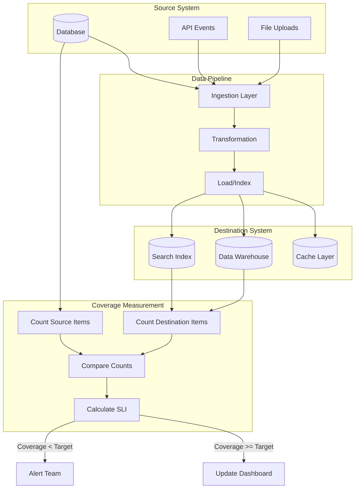

# How to Create Coverage SLOs

Author: [nawazdhandala](https://github.com/nawazdhandala)

Tags: SRE, SLO, Coverage, Completeness

Description: Learn how to define and measure Coverage SLOs to ensure your data pipelines and systems maintain completeness objectives.

---

## What is a Coverage SLO?

Most SRE teams focus on availability and latency SLOs. But what happens when your system is up and fast, yet missing data? A Coverage SLO addresses this gap by measuring data completeness.

Coverage SLOs answer the question: "Did we process all the data we were supposed to?"

Consider a search engine that indexes product listings. The API might respond in milliseconds with zero errors, yet if 20% of products never made it into the index, users searching for those items will find nothing. Traditional SLOs would show green dashboards while customers experience silent failures.

## The Coverage SLI Definition

A Service Level Indicator (SLI) for coverage measures the ratio of successfully processed items to expected items:

```
Coverage SLI = (Items Successfully Processed / Total Expected Items) * 100
```

Unlike availability SLIs that measure request success rates, coverage SLIs measure data completeness over time windows. The key difference is that coverage gaps often go unnoticed because no request explicitly fails.

### Key Properties of a Coverage SLI

1. **Countable Units**: You need a clear definition of what constitutes an "item" (documents, records, events, users)
2. **Source of Truth**: You need a reference count of expected items
3. **Time Window**: Coverage is measured over a period (hourly, daily, weekly)
4. **Reconciliation Method**: A way to compare actual vs expected counts

## Measuring Data Completeness

Measuring coverage requires knowing what you should have versus what you actually have. Here are three common approaches:

### Approach 1: Source Count Comparison

Compare counts between source and destination systems.

```python
# Compare source database count with search index count
# This validates that all records made it through the pipeline

def calculate_coverage_sli(source_db, search_index, time_window):
    # Get count of active products from source database
    source_count = source_db.query(
        "SELECT COUNT(*) FROM products WHERE status = 'active' AND updated_at >= ?",
        time_window.start
    )

    # Get count of indexed products in search system
    indexed_count = search_index.count_documents(
        filter={"indexed_at": {"$gte": time_window.start}}
    )

    # Calculate coverage as percentage
    if source_count == 0:
        return 100.0  # No items expected means full coverage

    coverage_percentage = (indexed_count / source_count) * 100
    return min(coverage_percentage, 100.0)  # Cap at 100%
```

### Approach 2: Watermark Tracking

Track high watermarks to detect gaps in sequential data.

```python
# Track sequence numbers to detect missing events
# Gaps in sequence indicate dropped or delayed messages

class WatermarkTracker:
    def __init__(self, storage):
        self.storage = storage
        self.expected_sequence = 0
        self.gaps = []

    def record_event(self, sequence_number, event_data):
        # Check if we skipped any sequence numbers
        if sequence_number > self.expected_sequence:
            # Record the gap for later reconciliation
            gap = {
                "start": self.expected_sequence,
                "end": sequence_number - 1,
                "detected_at": datetime.now()
            }
            self.gaps.append(gap)

        # Update expected sequence for next event
        self.expected_sequence = sequence_number + 1
        self.storage.save(event_data)

    def calculate_coverage(self, window_start, window_end):
        # Count total expected events in window
        total_expected = window_end - window_start + 1

        # Sum up all gaps within the window
        total_gaps = sum(
            min(gap["end"], window_end) - max(gap["start"], window_start) + 1
            for gap in self.gaps
            if gap["start"] <= window_end and gap["end"] >= window_start
        )

        # Coverage is what we received vs what we expected
        items_received = total_expected - total_gaps
        return (items_received / total_expected) * 100
```

### Approach 3: Sampling Validation

For large datasets, validate a statistical sample rather than the full set.

```python
# Sample-based coverage validation
# Useful when full reconciliation is too expensive

import random

def sample_coverage_check(source_ids, destination_lookup, sample_size=1000):
    # Take a random sample of source IDs
    sample = random.sample(source_ids, min(sample_size, len(source_ids)))

    # Check how many exist in destination
    found_count = 0
    missing_ids = []

    for item_id in sample:
        if destination_lookup.exists(item_id):
            found_count += 1
        else:
            missing_ids.append(item_id)

    # Calculate coverage from sample
    coverage = (found_count / len(sample)) * 100

    # Return coverage estimate and missing examples for debugging
    return {
        "coverage_percentage": coverage,
        "sample_size": len(sample),
        "missing_count": len(missing_ids),
        "missing_examples": missing_ids[:10]  # First 10 for investigation
    }
```

## Coverage Measurement Flow

The following diagram shows how coverage measurement flows through a typical data pipeline:



## Index Coverage and Search Coverage

Two specific types of coverage SLOs are particularly important for search and discovery systems:

### Index Coverage

Index coverage measures what percentage of your source data exists in the search index.

```python
# Index coverage SLO implementation
# Ensures all products are searchable within expected time

class IndexCoverageSLO:
    def __init__(self, target=99.5, max_lag_minutes=15):
        self.target = target  # 99.5% of items should be indexed
        self.max_lag = timedelta(minutes=max_lag_minutes)

    def check_coverage(self, product_db, search_index):
        # Get products that should be indexed by now
        cutoff_time = datetime.now() - self.max_lag

        # Count products updated before the cutoff
        expected_count = product_db.count(
            "SELECT COUNT(*) FROM products "
            "WHERE is_active = true AND updated_at < ?",
            cutoff_time
        )

        # Count products in search index
        indexed_count = search_index.count(
            filter={"indexed": True}
        )

        # Calculate and evaluate against target
        coverage = (indexed_count / expected_count) * 100 if expected_count > 0 else 100

        return {
            "coverage_sli": coverage,
            "target": self.target,
            "is_meeting_slo": coverage >= self.target,
            "expected_items": expected_count,
            "indexed_items": indexed_count,
            "gap": expected_count - indexed_count
        }
```

### Search Coverage

Search coverage measures whether searches return results that actually exist. This catches cases where items are indexed but not retrievable.

```python
# Search coverage validates that indexed items are actually findable
# This catches issues like bad field mappings or query bugs

class SearchCoverageSLO:
    def __init__(self, target=99.0, sample_size=500):
        self.target = target
        self.sample_size = sample_size

    def validate_search_coverage(self, product_db, search_client):
        # Get a sample of known products
        products = product_db.query(
            "SELECT id, name, sku FROM products "
            "WHERE is_active = true ORDER BY RANDOM() LIMIT ?",
            self.sample_size
        )

        findable_count = 0
        unfindable = []

        for product in products:
            # Try to find each product by its exact SKU
            results = search_client.search(
                query=product.sku,
                field="sku",
                exact_match=True
            )

            if any(r.id == product.id for r in results):
                findable_count += 1
            else:
                unfindable.append({
                    "id": product.id,
                    "sku": product.sku,
                    "name": product.name
                })

        coverage = (findable_count / len(products)) * 100

        return {
            "search_coverage_sli": coverage,
            "target": self.target,
            "is_meeting_slo": coverage >= self.target,
            "sample_size": len(products),
            "findable": findable_count,
            "unfindable_examples": unfindable[:5]
        }
```

## Error Budget for Coverage Gaps

Just like availability SLOs, coverage SLOs should have error budgets. An error budget defines how much coverage loss you can tolerate before taking action.

### Calculating Coverage Error Budget

```python
# Coverage error budget calculation
# Tracks how much incompleteness you can afford

class CoverageErrorBudget:
    def __init__(self, slo_target=99.5, window_days=30):
        self.slo_target = slo_target
        self.window = timedelta(days=window_days)
        self.measurements = []

    def record_measurement(self, timestamp, coverage_percentage):
        # Store each coverage measurement
        self.measurements.append({
            "timestamp": timestamp,
            "coverage": coverage_percentage
        })
        # Remove measurements outside the window
        cutoff = datetime.now() - self.window
        self.measurements = [
            m for m in self.measurements
            if m["timestamp"] > cutoff
        ]

    def calculate_budget(self):
        if not self.measurements:
            return {"error": "No measurements recorded"}

        # Calculate average coverage over the window
        avg_coverage = sum(m["coverage"] for m in self.measurements) / len(self.measurements)

        # Error budget is the gap between target and 100%
        total_budget = 100 - self.slo_target  # e.g., 0.5% for 99.5% target

        # Consumed budget is the gap between actual and target
        consumed = max(0, self.slo_target - avg_coverage)

        # Remaining budget
        remaining = total_budget - consumed
        remaining_percentage = (remaining / total_budget) * 100 if total_budget > 0 else 0

        return {
            "slo_target": self.slo_target,
            "current_coverage": avg_coverage,
            "total_budget_percent": total_budget,
            "consumed_percent": consumed,
            "remaining_percent": remaining,
            "budget_health": remaining_percentage,
            "measurements_count": len(self.measurements)
        }
```

### Coverage Burn Rate Alerts

Monitor how fast you are consuming your coverage error budget.

```python
# Burn rate alerting for coverage SLOs
# Detects when coverage is degrading faster than acceptable

class CoverageBurnRateMonitor:
    def __init__(self, error_budget, alert_thresholds=None):
        self.error_budget = error_budget
        # Default thresholds: 2x burn rate for 1 hour, 10x for 5 minutes
        self.thresholds = alert_thresholds or [
            {"window_minutes": 60, "burn_rate": 2.0, "severity": "warning"},
            {"window_minutes": 5, "burn_rate": 10.0, "severity": "critical"}
        ]

    def check_burn_rate(self, recent_measurements):
        alerts = []

        for threshold in self.thresholds:
            window = timedelta(minutes=threshold["window_minutes"])
            cutoff = datetime.now() - window

            # Get measurements within this window
            window_measurements = [
                m for m in recent_measurements
                if m["timestamp"] > cutoff
            ]

            if len(window_measurements) < 2:
                continue

            # Calculate coverage drop in this window
            start_coverage = window_measurements[0]["coverage"]
            end_coverage = window_measurements[-1]["coverage"]
            coverage_drop = start_coverage - end_coverage

            # Calculate expected drop rate based on error budget
            # If we have 0.5% budget over 30 days, normal hourly drop is tiny
            budget_per_minute = (100 - self.error_budget.slo_target) / (30 * 24 * 60)
            expected_drop = budget_per_minute * threshold["window_minutes"]

            # Burn rate is actual drop vs expected drop
            burn_rate = coverage_drop / expected_drop if expected_drop > 0 else 0

            if burn_rate >= threshold["burn_rate"]:
                alerts.append({
                    "severity": threshold["severity"],
                    "burn_rate": burn_rate,
                    "window_minutes": threshold["window_minutes"],
                    "coverage_drop": coverage_drop,
                    "message": f"Coverage dropping {burn_rate:.1f}x faster than budget allows"
                })

        return alerts
```

## Practical Implementation Example

Here is a complete example that ties everything together:

```python
# Complete coverage SLO implementation for a product indexing system
# This runs as a scheduled job to continuously monitor coverage

import logging
from datetime import datetime, timedelta

class ProductIndexCoverageSLO:
    """
    Monitors coverage of products from the catalog database
    to the search index with a 99.5% SLO target.
    """

    def __init__(self, catalog_db, search_index, metrics_client):
        self.catalog_db = catalog_db
        self.search_index = search_index
        self.metrics = metrics_client

        # SLO configuration
        self.coverage_target = 99.5
        self.freshness_lag = timedelta(minutes=15)
        self.error_budget = CoverageErrorBudget(
            slo_target=self.coverage_target,
            window_days=30
        )
        self.burn_monitor = CoverageBurnRateMonitor(self.error_budget)

        self.logger = logging.getLogger(__name__)

    def run_coverage_check(self):
        """Execute a coverage check and record results."""
        timestamp = datetime.now()

        # Step 1: Count expected items from catalog
        cutoff = timestamp - self.freshness_lag
        expected = self.catalog_db.count(
            "SELECT COUNT(*) FROM products "
            "WHERE is_active = true AND updated_at < %s",
            cutoff
        )

        # Step 2: Count indexed items
        indexed = self.search_index.count(
            query={"match_all": {}},
            filter={"term": {"is_active": True}}
        )

        # Step 3: Calculate coverage SLI
        coverage_sli = (indexed / expected * 100) if expected > 0 else 100.0

        # Step 4: Record measurement for error budget tracking
        self.error_budget.record_measurement(timestamp, coverage_sli)

        # Step 5: Calculate error budget status
        budget_status = self.error_budget.calculate_budget()

        # Step 6: Check for burn rate alerts
        alerts = self.burn_monitor.check_burn_rate(
            self.error_budget.measurements
        )

        # Step 7: Emit metrics for dashboards
        self.metrics.gauge("coverage.sli", coverage_sli)
        self.metrics.gauge("coverage.expected_items", expected)
        self.metrics.gauge("coverage.indexed_items", indexed)
        self.metrics.gauge("coverage.gap", expected - indexed)
        self.metrics.gauge("coverage.error_budget_remaining",
                          budget_status["remaining_percent"])

        # Step 8: Log results
        self.logger.info(
            f"Coverage check: {coverage_sli:.2f}% "
            f"({indexed}/{expected} items), "
            f"Budget remaining: {budget_status['budget_health']:.1f}%"
        )

        # Step 9: Handle alerts
        for alert in alerts:
            self.logger.warning(
                f"Coverage burn rate alert: {alert['message']} "
                f"(severity: {alert['severity']})"
            )
            self.metrics.increment(
                "coverage.burn_rate_alert",
                tags={"severity": alert["severity"]}
            )

        return {
            "timestamp": timestamp,
            "coverage_sli": coverage_sli,
            "is_meeting_slo": coverage_sli >= self.coverage_target,
            "expected_items": expected,
            "indexed_items": indexed,
            "error_budget": budget_status,
            "alerts": alerts
        }

    def investigate_gaps(self, limit=100):
        """Find specific items missing from the index for debugging."""

        # Get sample of catalog items
        catalog_ids = self.catalog_db.query(
            "SELECT id FROM products "
            "WHERE is_active = true "
            "ORDER BY updated_at DESC LIMIT %s",
            limit
        )

        missing = []
        for row in catalog_ids:
            product_id = row["id"]
            # Check if exists in index
            exists = self.search_index.exists(
                index="products",
                id=product_id
            )
            if not exists:
                # Get details for investigation
                product = self.catalog_db.query_one(
                    "SELECT id, name, updated_at, category "
                    "FROM products WHERE id = %s",
                    product_id
                )
                missing.append(product)

        return {
            "checked": len(catalog_ids),
            "missing_count": len(missing),
            "missing_items": missing,
            "patterns": self._analyze_patterns(missing)
        }

    def _analyze_patterns(self, missing_items):
        """Look for patterns in missing items to identify root cause."""
        if not missing_items:
            return {"status": "no_missing_items"}

        # Check for category patterns
        categories = {}
        for item in missing_items:
            cat = item.get("category", "unknown")
            categories[cat] = categories.get(cat, 0) + 1

        # Check for time patterns
        recent = sum(
            1 for item in missing_items
            if item["updated_at"] > datetime.now() - timedelta(hours=1)
        )

        return {
            "by_category": categories,
            "updated_last_hour": recent,
            "total_missing": len(missing_items)
        }


# Usage example
if __name__ == "__main__":
    from database import CatalogDB
    from search import SearchIndex
    from metrics import MetricsClient

    # Initialize connections
    catalog = CatalogDB(host="catalog.internal", database="products")
    search = SearchIndex(hosts=["search1.internal", "search2.internal"])
    metrics = MetricsClient(endpoint="metrics.internal:8125")

    # Create SLO monitor
    slo = ProductIndexCoverageSLO(catalog, search, metrics)

    # Run check (typically called by scheduler every 5 minutes)
    result = slo.run_coverage_check()

    # If coverage is below target, investigate
    if not result["is_meeting_slo"]:
        gaps = slo.investigate_gaps()
        print(f"Found {gaps['missing_count']} missing items")
        print(f"Patterns: {gaps['patterns']}")
```

## Summary

Coverage SLOs fill a critical gap in reliability measurement. While availability tells you if requests succeed and latency tells you how fast they succeed, coverage tells you if all your data made it through. For search engines, data pipelines, and synchronization systems, coverage is often the most important metric to track.

Key takeaways:

1. Define your coverage SLI with clear countable units and a source of truth
2. Measure coverage through source/destination comparison, watermark tracking, or sampling
3. Set realistic targets based on business requirements (99.5% is a common starting point)
4. Implement error budgets and burn rate monitoring to catch degradation early
5. Build investigation tools to quickly identify patterns when coverage drops

Coverage SLOs transform invisible data loss into measurable, actionable metrics. Start with one critical data flow, establish a baseline, and iterate from there.

**Related Reading:**

- [18 SRE Metrics Worth Tracking](https://oneuptime.com/blog/post/2025-11-28-sre-metrics-to-track/view)
- [The Five Stages of SRE Maturity](https://oneuptime.com/blog/post/2025-09-01-the-five-stages-of-sre-maturity/view)
- [What is SLA, SLI and SLO?](https://oneuptime.com/blog/post/2023-06-12-sli-sla-slo/view)
