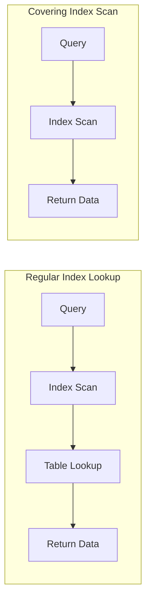
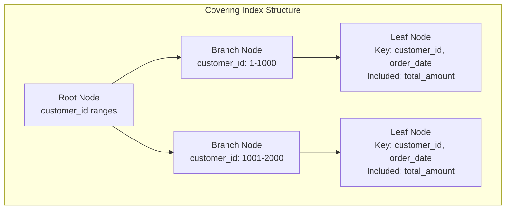

# How to Implement Covering Index Design

Author: [nawazdhandala](https://github.com/nawazdhandala)

Tags: Database, Indexing, Performance, Query Optimization

Description: Learn to implement covering index design for index-only scans and maximum query performance.

---

A covering index is one of the most effective ways to speed up database queries. When an index contains all the columns needed to satisfy a query, the database can retrieve results directly from the index without accessing the table data. This technique, known as an index-only scan, can dramatically reduce I/O operations and improve query performance.

## What Makes an Index "Covering"?

A covering index includes all columns referenced in a query: the columns in the SELECT clause, WHERE clause, JOIN conditions, and ORDER BY clause. When every column needed exists in the index, the database engine skips the expensive table lookup entirely.

The following diagram illustrates the difference between a regular index lookup and a covering index scan.



Notice how the covering index eliminates the table lookup step. This single optimization can reduce query time by 50% or more on large tables.

## Understanding the Performance Impact

Before diving into implementation, consider why covering indexes matter. The table below compares performance characteristics.

| Aspect | Regular Index | Covering Index |
|--------|---------------|----------------|
| I/O Operations | Index + Table | Index Only |
| Random Reads | High | Low |
| Buffer Pool Usage | Higher | Lower |
| Query Latency | Variable | Consistent |
| Best For | Filtered Queries | Read-Heavy Workloads |

## Basic Covering Index Implementation

Let's start with a practical example. Suppose you have an orders table and frequently run queries to fetch order summaries by customer.

First, examine a typical query pattern that would benefit from a covering index.

```sql
-- This query runs thousands of times per day
-- We need customer_id for filtering and order_date, total_amount for display
SELECT order_date, total_amount
FROM orders
WHERE customer_id = 12345
ORDER BY order_date DESC;
```

Without a covering index, this query performs an index seek on customer_id, then makes separate trips to the table to fetch order_date and total_amount. Here is how to create a covering index that eliminates those extra lookups.

```sql
-- Create a covering index for the order summary query
-- The key column (customer_id) comes first for filtering
-- INCLUDE adds non-key columns needed by SELECT and ORDER BY
CREATE INDEX idx_orders_customer_covering
ON orders (customer_id, order_date DESC)
INCLUDE (total_amount);
```

## The INCLUDE Clause Strategy

PostgreSQL, SQL Server, and other databases support the INCLUDE clause for adding non-key columns to an index. These included columns are stored in the leaf nodes but not used for sorting or filtering.

The following diagram shows how data is organized in a covering index with included columns.



Use INCLUDE for columns that appear only in SELECT but not in WHERE or ORDER BY. This keeps the index smaller while still enabling index-only scans.

## Composite Key Design for Complex Queries

When queries filter on multiple columns, the order of columns in your covering index matters significantly. Follow the ESR rule: Equality, Sort, Range.

```sql
-- Complex query with multiple filter conditions
-- status = 'active' is an equality check
-- created_at range filter
-- Results sorted by priority
SELECT id, title, priority
FROM tickets
WHERE status = 'active'
  AND created_at > '2026-01-01'
ORDER BY priority DESC;
```

Design the covering index following the ESR pattern.

```sql
-- ESR Pattern: Equality columns first, then Sort, then Range
-- status (equality) -> priority (sort) -> created_at (range)
-- Include remaining SELECT columns
CREATE INDEX idx_tickets_covering
ON tickets (status, priority DESC, created_at)
INCLUDE (id, title);
```

## Verifying Index-Only Scans

After creating a covering index, confirm the database uses an index-only scan. Run EXPLAIN to check the query plan.

```sql
-- PostgreSQL: Look for "Index Only Scan" in output
EXPLAIN (ANALYZE, BUFFERS)
SELECT order_date, total_amount
FROM orders
WHERE customer_id = 12345
ORDER BY order_date DESC;
```

The output should show "Index Only Scan" rather than "Index Scan" followed by a table access. If you see "Heap Fetches" in PostgreSQL, run VACUUM to update the visibility map.

```sql
-- Run VACUUM to enable index-only scans on recently modified tables
VACUUM orders;
```

## Trade-offs and Considerations

Covering indexes are not free. Each additional column increases index size and slows down write operations. Consider these factors before implementation.

| Factor | Recommendation |
|--------|----------------|
| Write Frequency | Avoid wide covering indexes on write-heavy tables |
| Column Size | Do not include TEXT or BLOB columns |
| Query Frequency | Only create for frequently executed queries |
| Index Count | Consolidate similar queries into one covering index |

## Multi-Query Covering Index Design

A well-designed covering index can serve multiple queries. Analyze your query patterns and find commonalities.

```sql
-- Query 1: List active users with email
SELECT email, created_at FROM users WHERE status = 'active';

-- Query 2: Find users by status ordered by creation date
SELECT id, email FROM users WHERE status = 'active' ORDER BY created_at;

-- Query 3: Count users by status
SELECT COUNT(*) FROM users WHERE status = 'active';

-- One covering index serves all three queries
CREATE INDEX idx_users_status_covering
ON users (status, created_at)
INCLUDE (id, email);
```

## Monitoring and Maintenance

Track index usage to ensure your covering indexes provide value. Unused indexes waste storage and slow down writes.

```sql
-- PostgreSQL: Check index usage statistics
SELECT
    schemaname,
    tablename,
    indexname,
    idx_scan as index_scans,
    idx_tup_read as tuples_read,
    idx_tup_fetch as tuples_fetched
FROM pg_stat_user_indexes
WHERE indexname LIKE '%covering%'
ORDER BY idx_scan DESC;
```

## Summary

Covering index design is a powerful optimization technique that eliminates table lookups by storing all required columns in the index itself. The key principles to remember are: include all columns referenced in your query, follow the ESR rule for column ordering, use the INCLUDE clause for non-filtering columns, and verify index-only scans with EXPLAIN. Monitor your indexes regularly and drop any that go unused. When implemented correctly, covering indexes can transform slow queries into fast, consistent operations that scale with your data.
