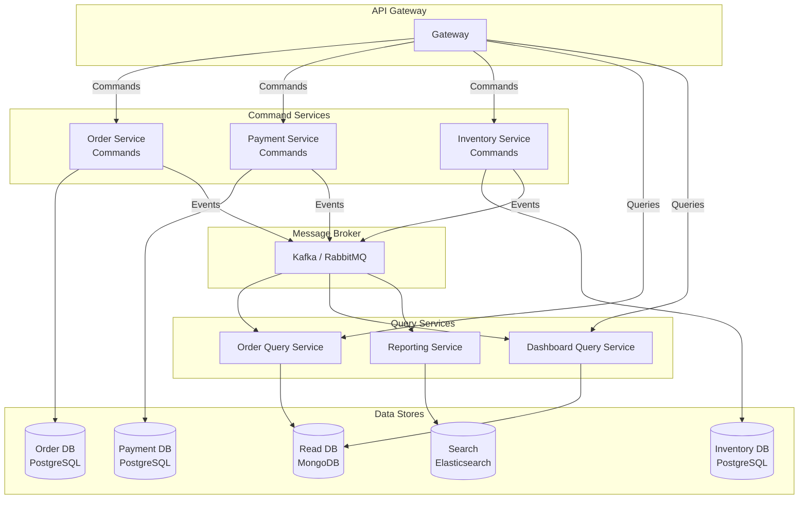
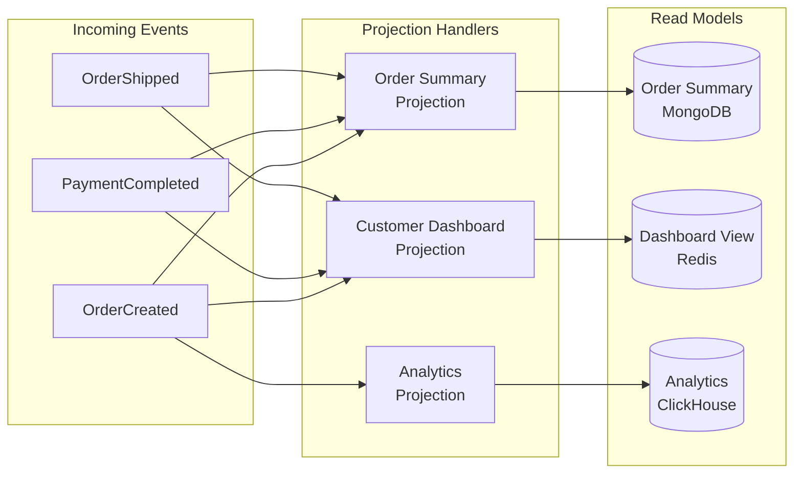
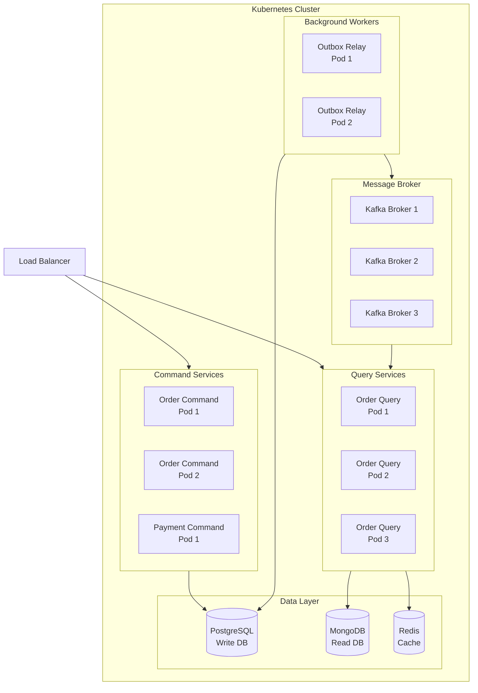

# How to Implement CQRS Pattern in Microservices

Author: [nawazdhandala](https://github.com/nawazdhandala)

Tags: CQRS, Microservices, Event-Driven Architecture, Distributed Systems, Node.js, TypeScript, Domain-Driven Design, System Design

Description: A production-ready guide to implementing Command Query Responsibility Segregation (CQRS) across microservices, covering inter-service communication, event synchronization, eventual consistency handling, and deployment strategies.

---

CQRS (Command Query Responsibility Segregation) splits your application into separate command (write) and query (read) paths. In a microservices architecture, this separation becomes even more powerful because each service can optimize its data storage and access patterns independently. This guide walks through building a production-ready CQRS system across multiple services.

---

## CQRS in a Microservices Context

In a monolithic CQRS setup, commands and queries live in the same process. In microservices, they often span multiple services, each with its own database and deployment lifecycle.



---

## Core Components

### Event Definitions

Events are the backbone of CQRS in microservices. They communicate state changes between services. Define a shared event schema that all services understand.

```typescript
// shared/events/base-event.ts
// Base event interface that all domain events extend
// Includes metadata for tracing and idempotency handling
export interface BaseEvent {
  eventId: string;          // Unique identifier for idempotency
  eventType: string;        // Type discriminator for routing
  aggregateId: string;      // ID of the entity that changed
  aggregateType: string;    // Type of entity (Order, Payment, etc.)
  timestamp: string;        // ISO 8601 timestamp
  version: number;          // Event schema version for evolution
  correlationId: string;    // Links related events across services
  causationId: string;      // ID of the event that caused this one
  metadata: EventMetadata;
}

export interface EventMetadata {
  userId?: string;
  tenantId?: string;
  source: string;           // Service that produced the event
  traceId?: string;         // Distributed tracing ID
}

// shared/events/order-events.ts
// Order domain events used across the system
export interface OrderCreatedEvent extends BaseEvent {
  eventType: 'OrderCreated';
  payload: {
    customerId: string;
    items: Array<{
      productId: string;
      quantity: number;
      unitPrice: number;
    }>;
    totalAmount: number;
    currency: string;
    shippingAddress: Address;
  };
}

export interface OrderConfirmedEvent extends BaseEvent {
  eventType: 'OrderConfirmed';
  payload: {
    confirmedAt: string;
    estimatedDelivery: string;
  };
}

export interface OrderCancelledEvent extends BaseEvent {
  eventType: 'OrderCancelled';
  payload: {
    reason: string;
    cancelledBy: string;
    refundInitiated: boolean;
  };
}

// Union type for type-safe event handling
export type OrderEvent =
  | OrderCreatedEvent
  | OrderConfirmedEvent
  | OrderCancelledEvent;
```

### Command Service Implementation

The command service handles write operations and publishes events. Each command goes through validation, execution, and event publishing.

```typescript
// order-service/src/commands/handlers/create-order.handler.ts
import { Injectable } from '@nestjs/common';
import { v4 as uuidv4 } from 'uuid';
import { OrderRepository } from '../../repositories/order.repository';
import { EventPublisher } from '../../events/event-publisher';
import { CreateOrderCommand } from '../create-order.command';
import { Order, OrderStatus } from '../../domain/order.entity';

@Injectable()
export class CreateOrderHandler {
  constructor(
    private readonly orderRepository: OrderRepository,
    private readonly eventPublisher: EventPublisher,
  ) {}

  // Handle the create order command
  // Validates input, creates the order, and publishes the event
  async execute(command: CreateOrderCommand): Promise<string> {
    // Generate IDs for tracing
    const orderId = uuidv4();
    const eventId = uuidv4();

    // Calculate order total
    const totalAmount = command.items.reduce(
      (sum, item) => sum + item.unitPrice * item.quantity,
      0
    );

    // Create order aggregate
    const order = new Order({
      id: orderId,
      customerId: command.customerId,
      items: command.items,
      totalAmount,
      currency: command.currency,
      status: OrderStatus.PENDING,
      shippingAddress: command.shippingAddress,
      createdAt: new Date(),
    });

    // Persist to write database within a transaction
    // The outbox pattern ensures event publishing is atomic
    await this.orderRepository.createWithOutbox(order, {
      eventId,
      eventType: 'OrderCreated',
      aggregateId: orderId,
      aggregateType: 'Order',
      timestamp: new Date().toISOString(),
      version: 1,
      correlationId: command.correlationId,
      causationId: command.causationId || eventId,
      metadata: {
        userId: command.userId,
        tenantId: command.tenantId,
        source: 'order-service',
        traceId: command.traceId,
      },
      payload: {
        customerId: command.customerId,
        items: command.items,
        totalAmount,
        currency: command.currency,
        shippingAddress: command.shippingAddress,
      },
    });

    return orderId;
  }
}
```

### Outbox Pattern for Reliable Event Publishing

The outbox pattern ensures events are published reliably by storing them in the same transaction as the domain changes.

```typescript
// order-service/src/repositories/order.repository.ts
import { Injectable } from '@nestjs/common';
import { DataSource, QueryRunner } from 'typeorm';
import { Order } from '../domain/order.entity';
import { OutboxEvent } from '../domain/outbox-event.entity';

@Injectable()
export class OrderRepository {
  constructor(private readonly dataSource: DataSource) {}

  // Create order and outbox event in a single transaction
  // This guarantees both succeed or both fail together
  async createWithOutbox(order: Order, event: OutboxEvent): Promise<void> {
    const queryRunner = this.dataSource.createQueryRunner();
    await queryRunner.connect();
    await queryRunner.startTransaction();

    try {
      // Insert the order
      await queryRunner.manager.save(Order, order);

      // Insert the event into the outbox table
      await queryRunner.manager.save(OutboxEvent, {
        ...event,
        published: false,
        createdAt: new Date(),
      });

      await queryRunner.commitTransaction();
    } catch (error) {
      await queryRunner.rollbackTransaction();
      throw error;
    } finally {
      await queryRunner.release();
    }
  }

  // Find orders with optimistic locking for updates
  async findByIdForUpdate(
    queryRunner: QueryRunner,
    orderId: string
  ): Promise<Order | null> {
    return queryRunner.manager.findOne(Order, {
      where: { id: orderId },
      lock: { mode: 'pessimistic_write' },
    });
  }
}
```

### Outbox Relay Worker

A separate process polls the outbox table and publishes events to the message broker.

```typescript
// order-service/src/workers/outbox-relay.worker.ts
import { Injectable, Logger } from '@nestjs/common';
import { Cron, CronExpression } from '@nestjs/schedule';
import { DataSource } from 'typeorm';
import { KafkaProducer } from '../messaging/kafka-producer';
import { OutboxEvent } from '../domain/outbox-event.entity';

@Injectable()
export class OutboxRelayWorker {
  private readonly logger = new Logger(OutboxRelayWorker.name);
  private isProcessing = false;

  constructor(
    private readonly dataSource: DataSource,
    private readonly kafkaProducer: KafkaProducer,
  ) {}

  // Run every 100ms to minimize event publishing latency
  // Uses SELECT FOR UPDATE SKIP LOCKED for concurrent workers
  @Cron(CronExpression.EVERY_SECOND)
  async processOutbox(): Promise<void> {
    // Prevent concurrent processing in same instance
    if (this.isProcessing) return;
    this.isProcessing = true;

    const queryRunner = this.dataSource.createQueryRunner();
    await queryRunner.connect();

    try {
      await queryRunner.startTransaction();

      // Fetch unpublished events with row-level locking
      // SKIP LOCKED allows multiple workers to process different events
      const events = await queryRunner.manager
        .createQueryBuilder(OutboxEvent, 'outbox')
        .where('outbox.published = :published', { published: false })
        .orderBy('outbox.createdAt', 'ASC')
        .limit(100)
        .setLock('pessimistic_write_or_fail')
        .getMany();

      for (const event of events) {
        try {
          // Publish to Kafka with the aggregate ID as the partition key
          // This ensures events for the same aggregate are ordered
          await this.kafkaProducer.send({
            topic: `${event.aggregateType.toLowerCase()}-events`,
            messages: [{
              key: event.aggregateId,
              value: JSON.stringify({
                eventId: event.eventId,
                eventType: event.eventType,
                aggregateId: event.aggregateId,
                aggregateType: event.aggregateType,
                timestamp: event.timestamp,
                version: event.version,
                correlationId: event.correlationId,
                causationId: event.causationId,
                metadata: event.metadata,
                payload: event.payload,
              }),
              headers: {
                'event-type': event.eventType,
                'correlation-id': event.correlationId,
              },
            }],
          });

          // Mark as published
          event.published = true;
          event.publishedAt = new Date();
          await queryRunner.manager.save(OutboxEvent, event);

        } catch (publishError) {
          this.logger.error(
            `Failed to publish event ${event.eventId}: ${publishError.message}`
          );
          // Continue with next event, this one will be retried
        }
      }

      await queryRunner.commitTransaction();
    } catch (error) {
      await queryRunner.rollbackTransaction();
      this.logger.error(`Outbox processing failed: ${error.message}`);
    } finally {
      await queryRunner.release();
      this.isProcessing = false;
    }
  }
}
```

---

## Query Service Implementation

The query service consumes events and builds optimized read models. Each read model is tailored to specific query patterns.



### Event Consumer and Projection Handler

```typescript
// query-service/src/consumers/order-events.consumer.ts
import { Injectable, Logger } from '@nestjs/common';
import { KafkaConsumer, KafkaMessage } from '../messaging/kafka-consumer';
import { ProjectionManager } from '../projections/projection-manager';
import { IdempotencyService } from '../services/idempotency.service';
import { OrderEvent } from '@shared/events/order-events';

@Injectable()
export class OrderEventsConsumer {
  private readonly logger = new Logger(OrderEventsConsumer.name);

  constructor(
    private readonly kafkaConsumer: KafkaConsumer,
    private readonly projectionManager: ProjectionManager,
    private readonly idempotencyService: IdempotencyService,
  ) {}

  async onModuleInit(): Promise<void> {
    await this.kafkaConsumer.subscribe({
      topic: 'order-events',
      groupId: 'order-query-service',
      handler: this.handleEvent.bind(this),
    });
  }

  // Process incoming events with idempotency checks
  // Events may be delivered multiple times due to consumer rebalances
  private async handleEvent(message: KafkaMessage): Promise<void> {
    const event: OrderEvent = JSON.parse(message.value.toString());

    // Check if this event was already processed
    // Prevents duplicate projections during redelivery
    const isProcessed = await this.idempotencyService.isProcessed(
      event.eventId,
      'order-query-service'
    );

    if (isProcessed) {
      this.logger.debug(`Skipping duplicate event: ${event.eventId}`);
      return;
    }

    try {
      // Route event to all registered projections
      await this.projectionManager.project(event);

      // Mark event as processed
      await this.idempotencyService.markProcessed(
        event.eventId,
        'order-query-service',
        { processedAt: new Date().toISOString() }
      );

    } catch (error) {
      this.logger.error(
        `Failed to project event ${event.eventId}: ${error.message}`
      );
      // Throw to trigger Kafka retry mechanism
      throw error;
    }
  }
}
```

### Order Summary Projection

```typescript
// query-service/src/projections/order-summary.projection.ts
import { Injectable } from '@nestjs/common';
import { InjectModel } from '@nestjs/mongoose';
import { Model } from 'mongoose';
import { Projection } from './projection.interface';
import { OrderSummaryDocument } from '../schemas/order-summary.schema';
import { OrderEvent } from '@shared/events/order-events';
import { PaymentEvent } from '@shared/events/payment-events';

@Injectable()
export class OrderSummaryProjection implements Projection {
  // Event types this projection handles
  readonly supportedEvents = [
    'OrderCreated',
    'OrderConfirmed',
    'OrderCancelled',
    'PaymentCompleted',
    'PaymentFailed',
    'ShipmentCreated',
    'ShipmentDelivered',
  ];

  constructor(
    @InjectModel('OrderSummary')
    private readonly orderSummaryModel: Model<OrderSummaryDocument>,
  ) {}

  // Route events to specific handlers based on event type
  async apply(event: OrderEvent | PaymentEvent): Promise<void> {
    switch (event.eventType) {
      case 'OrderCreated':
        await this.onOrderCreated(event);
        break;
      case 'OrderConfirmed':
        await this.onOrderConfirmed(event);
        break;
      case 'OrderCancelled':
        await this.onOrderCancelled(event);
        break;
      case 'PaymentCompleted':
        await this.onPaymentCompleted(event);
        break;
      case 'ShipmentDelivered':
        await this.onShipmentDelivered(event);
        break;
    }
  }

  // Create initial order summary when order is placed
  private async onOrderCreated(event: OrderEvent): Promise<void> {
    if (event.eventType !== 'OrderCreated') return;

    const summary = new this.orderSummaryModel({
      orderId: event.aggregateId,
      customerId: event.payload.customerId,
      status: 'pending',
      itemCount: event.payload.items.reduce((sum, i) => sum + i.quantity, 0),
      totalAmount: event.payload.totalAmount,
      currency: event.payload.currency,
      items: event.payload.items.map(item => ({
        productId: item.productId,
        quantity: item.quantity,
        unitPrice: item.unitPrice,
      })),
      shippingAddress: event.payload.shippingAddress,
      paymentStatus: 'pending',
      createdAt: new Date(event.timestamp),
      updatedAt: new Date(event.timestamp),
      lastEventId: event.eventId,
      lastEventTimestamp: event.timestamp,
    });

    await summary.save();
  }

  // Update status when order is confirmed
  private async onOrderConfirmed(event: OrderEvent): Promise<void> {
    if (event.eventType !== 'OrderConfirmed') return;

    await this.orderSummaryModel.updateOne(
      { orderId: event.aggregateId },
      {
        $set: {
          status: 'confirmed',
          confirmedAt: event.payload.confirmedAt,
          estimatedDelivery: event.payload.estimatedDelivery,
          updatedAt: new Date(event.timestamp),
          lastEventId: event.eventId,
          lastEventTimestamp: event.timestamp,
        },
      }
    );
  }

  // Handle order cancellation
  private async onOrderCancelled(event: OrderEvent): Promise<void> {
    if (event.eventType !== 'OrderCancelled') return;

    await this.orderSummaryModel.updateOne(
      { orderId: event.aggregateId },
      {
        $set: {
          status: 'cancelled',
          cancellationReason: event.payload.reason,
          cancelledBy: event.payload.cancelledBy,
          refundInitiated: event.payload.refundInitiated,
          updatedAt: new Date(event.timestamp),
          lastEventId: event.eventId,
          lastEventTimestamp: event.timestamp,
        },
      }
    );
  }

  // Update payment status from payment service events
  private async onPaymentCompleted(event: PaymentEvent): Promise<void> {
    await this.orderSummaryModel.updateOne(
      { orderId: event.payload.orderId },
      {
        $set: {
          paymentStatus: 'completed',
          paymentId: event.aggregateId,
          paidAt: event.payload.completedAt,
          updatedAt: new Date(event.timestamp),
          lastEventId: event.eventId,
          lastEventTimestamp: event.timestamp,
        },
      }
    );
  }

  // Mark order as delivered
  private async onShipmentDelivered(event: any): Promise<void> {
    await this.orderSummaryModel.updateOne(
      { orderId: event.payload.orderId },
      {
        $set: {
          status: 'delivered',
          deliveredAt: event.payload.deliveredAt,
          updatedAt: new Date(event.timestamp),
          lastEventId: event.eventId,
          lastEventTimestamp: event.timestamp,
        },
      }
    );
  }
}
```

### Query Handlers

```typescript
// query-service/src/queries/handlers/get-order-summary.handler.ts
import { Injectable, NotFoundException } from '@nestjs/common';
import { InjectModel } from '@nestjs/mongoose';
import { Model } from 'mongoose';
import { OrderSummaryDocument } from '../../schemas/order-summary.schema';
import { GetOrderSummaryQuery } from '../get-order-summary.query';
import { OrderSummaryDto } from '../../dto/order-summary.dto';

@Injectable()
export class GetOrderSummaryHandler {
  constructor(
    @InjectModel('OrderSummary')
    private readonly orderSummaryModel: Model<OrderSummaryDocument>,
  ) {}

  // Fetch a single order summary by ID
  async execute(query: GetOrderSummaryQuery): Promise<OrderSummaryDto> {
    const summary = await this.orderSummaryModel
      .findOne({ orderId: query.orderId })
      .lean()
      .exec();

    if (!summary) {
      throw new NotFoundException(`Order ${query.orderId} not found`);
    }

    return this.mapToDto(summary);
  }

  private mapToDto(doc: OrderSummaryDocument): OrderSummaryDto {
    return {
      orderId: doc.orderId,
      customerId: doc.customerId,
      status: doc.status,
      itemCount: doc.itemCount,
      totalAmount: doc.totalAmount,
      currency: doc.currency,
      paymentStatus: doc.paymentStatus,
      createdAt: doc.createdAt.toISOString(),
      updatedAt: doc.updatedAt.toISOString(),
    };
  }
}

// query-service/src/queries/handlers/search-orders.handler.ts
import { Injectable } from '@nestjs/common';
import { InjectModel } from '@nestjs/mongoose';
import { Model, FilterQuery } from 'mongoose';
import { OrderSummaryDocument } from '../../schemas/order-summary.schema';
import { SearchOrdersQuery } from '../search-orders.query';
import { PaginatedResult } from '../../dto/paginated-result.dto';

@Injectable()
export class SearchOrdersHandler {
  constructor(
    @InjectModel('OrderSummary')
    private readonly orderSummaryModel: Model<OrderSummaryDocument>,
  ) {}

  // Search orders with filters and pagination
  // Optimized for common query patterns
  async execute(query: SearchOrdersQuery): Promise<PaginatedResult<any>> {
    const filter: FilterQuery<OrderSummaryDocument> = {};

    // Build filter based on query parameters
    if (query.customerId) {
      filter.customerId = query.customerId;
    }

    if (query.status) {
      filter.status = { $in: Array.isArray(query.status) ? query.status : [query.status] };
    }

    if (query.minAmount !== undefined || query.maxAmount !== undefined) {
      filter.totalAmount = {};
      if (query.minAmount !== undefined) {
        filter.totalAmount.$gte = query.minAmount;
      }
      if (query.maxAmount !== undefined) {
        filter.totalAmount.$lte = query.maxAmount;
      }
    }

    if (query.dateFrom || query.dateTo) {
      filter.createdAt = {};
      if (query.dateFrom) {
        filter.createdAt.$gte = new Date(query.dateFrom);
      }
      if (query.dateTo) {
        filter.createdAt.$lte = new Date(query.dateTo);
      }
    }

    // Execute count and find in parallel for better performance
    const [total, items] = await Promise.all([
      this.orderSummaryModel.countDocuments(filter),
      this.orderSummaryModel
        .find(filter)
        .sort({ createdAt: -1 })
        .skip((query.page - 1) * query.pageSize)
        .limit(query.pageSize)
        .lean()
        .exec(),
    ]);

    return {
      items,
      total,
      page: query.page,
      pageSize: query.pageSize,
      totalPages: Math.ceil(total / query.pageSize),
    };
  }
}
```

---

## Handling Eventual Consistency

In a distributed CQRS system, the read model may lag behind the write model. Here are strategies to handle this gracefully.

### Read-After-Write Consistency

```typescript
// order-service/src/controllers/order.controller.ts
import { Controller, Post, Get, Body, Param, Query } from '@nestjs/common';
import { CommandBus } from '../commands/command-bus';
import { CreateOrderCommand } from '../commands/create-order.command';

@Controller('orders')
export class OrderController {
  constructor(
    private readonly commandBus: CommandBus,
  ) {}

  // Return the created resource directly from the command
  // This provides immediate consistency for the creating client
  @Post()
  async createOrder(@Body() request: CreateOrderRequest) {
    const command = new CreateOrderCommand({
      customerId: request.customerId,
      items: request.items,
      currency: request.currency,
      shippingAddress: request.shippingAddress,
      correlationId: request.correlationId,
      userId: request.userId,
      tenantId: request.tenantId,
    });

    const orderId = await this.commandBus.execute(command);

    // Return the order data directly rather than querying the read model
    // The read model may not have processed the event yet
    return {
      orderId,
      status: 'pending',
      message: 'Order created successfully',
      items: request.items,
      totalAmount: request.items.reduce(
        (sum, item) => sum + item.unitPrice * item.quantity,
        0
      ),
      _links: {
        self: `/orders/${orderId}`,
        status: `/orders/${orderId}/status`,
      },
    };
  }
}
```

### Polling with Version Check

```typescript
// query-service/src/controllers/order-query.controller.ts
import { Controller, Get, Param, Query, HttpException, HttpStatus } from '@nestjs/common';
import { GetOrderSummaryHandler } from '../queries/handlers/get-order-summary.handler';
import { EventVersionService } from '../services/event-version.service';

@Controller('orders')
export class OrderQueryController {
  constructor(
    private readonly getOrderSummaryHandler: GetOrderSummaryHandler,
    private readonly eventVersionService: EventVersionService,
  ) {}

  // Support conditional fetching based on expected version
  // Client can retry until the expected version is available
  @Get(':orderId')
  async getOrder(
    @Param('orderId') orderId: string,
    @Query('minVersion') minVersion?: number,
    @Query('timeout') timeout?: number,
  ) {
    const maxWait = Math.min(timeout || 5000, 30000);
    const startTime = Date.now();

    // Poll until version is available or timeout
    while (Date.now() - startTime < maxWait) {
      const order = await this.getOrderSummaryHandler.execute({ orderId });

      if (!minVersion || order.version >= minVersion) {
        return order;
      }

      // Wait 100ms before retrying
      await new Promise(resolve => setTimeout(resolve, 100));
    }

    // Return stale data with warning header if timeout exceeded
    const order = await this.getOrderSummaryHandler.execute({ orderId });

    if (minVersion && order.version < minVersion) {
      throw new HttpException(
        {
          statusCode: HttpStatus.CONFLICT,
          message: 'Read model not yet updated',
          currentVersion: order.version,
          requestedVersion: minVersion,
        },
        HttpStatus.CONFLICT
      );
    }

    return order;
  }
}
```

---

## Service Communication Patterns

### API Gateway Configuration

```typescript
// api-gateway/src/gateway.config.ts
// Route configuration for CQRS-aware API gateway
export const gatewayConfig = {
  routes: [
    // Command routes go to write services
    {
      path: '/api/orders',
      methods: ['POST', 'PUT', 'PATCH', 'DELETE'],
      target: 'http://order-command-service:3000',
      loadBalancer: 'round-robin',
      timeout: 30000,
      retries: 0,  // Don't retry commands automatically
    },
    // Query routes go to read services
    {
      path: '/api/orders',
      methods: ['GET'],
      target: 'http://order-query-service:3000',
      loadBalancer: 'round-robin',
      timeout: 10000,
      retries: 2,  // Safe to retry queries
      cache: {
        enabled: true,
        ttl: 60,
        varyBy: ['authorization', 'accept'],
      },
    },
    // Similar patterns for other services
    {
      path: '/api/payments',
      methods: ['POST'],
      target: 'http://payment-command-service:3000',
      timeout: 60000,
    },
    {
      path: '/api/payments',
      methods: ['GET'],
      target: 'http://payment-query-service:3000',
      cache: { enabled: true, ttl: 30 },
    },
  ],
};
```

### Health Checks and Circuit Breakers

```typescript
// shared/health/cqrs-health.service.ts
import { Injectable, Logger } from '@nestjs/common';
import { HealthIndicator, HealthIndicatorResult } from '@nestjs/terminus';
import { KafkaConsumer } from '../messaging/kafka-consumer';

@Injectable()
export class CQRSHealthIndicator extends HealthIndicator {
  private readonly logger = new Logger(CQRSHealthIndicator.name);

  constructor(
    private readonly kafkaConsumer: KafkaConsumer,
  ) {
    super();
  }

  // Check if event processing is healthy
  // Monitors consumer lag and processing rate
  async checkEventProcessing(): Promise<HealthIndicatorResult> {
    const lag = await this.kafkaConsumer.getConsumerLag();
    const isHealthy = lag < 10000;  // Threshold: 10k messages

    return this.getStatus('event-processing', isHealthy, {
      consumerLag: lag,
      status: isHealthy ? 'healthy' : 'degraded',
    });
  }

  // Check read model freshness
  async checkReadModelFreshness(
    latestEventTimestamp: Date
  ): Promise<HealthIndicatorResult> {
    const now = new Date();
    const lagMs = now.getTime() - latestEventTimestamp.getTime();
    const isHealthy = lagMs < 30000;  // 30 second threshold

    return this.getStatus('read-model-freshness', isHealthy, {
      lagMs,
      latestEvent: latestEventTimestamp.toISOString(),
      status: isHealthy ? 'healthy' : 'stale',
    });
  }
}
```

---

## Deployment Architecture



### Kubernetes Deployment

```yaml
# kubernetes/order-command-deployment.yaml
apiVersion: apps/v1
kind: Deployment
metadata:
  name: order-command-service
  labels:
    app: order-command
    tier: command
spec:
  replicas: 2
  selector:
    matchLabels:
      app: order-command
  template:
    metadata:
      labels:
        app: order-command
        tier: command
    spec:
      containers:
        - name: order-command
          image: myregistry/order-command:latest
          ports:
            - containerPort: 3000
          env:
            - name: DATABASE_URL
              valueFrom:
                secretKeyRef:
                  name: order-db-credentials
                  key: url
            - name: KAFKA_BROKERS
              value: "kafka-0.kafka:9092,kafka-1.kafka:9092,kafka-2.kafka:9092"
          resources:
            requests:
              memory: "256Mi"
              cpu: "250m"
            limits:
              memory: "512Mi"
              cpu: "500m"
          livenessProbe:
            httpGet:
              path: /health/live
              port: 3000
            initialDelaySeconds: 10
            periodSeconds: 10
          readinessProbe:
            httpGet:
              path: /health/ready
              port: 3000
            initialDelaySeconds: 5
            periodSeconds: 5
---
# Query service scales independently based on read load
apiVersion: apps/v1
kind: Deployment
metadata:
  name: order-query-service
  labels:
    app: order-query
    tier: query
spec:
  replicas: 3
  selector:
    matchLabels:
      app: order-query
  template:
    metadata:
      labels:
        app: order-query
        tier: query
    spec:
      containers:
        - name: order-query
          image: myregistry/order-query:latest
          ports:
            - containerPort: 3000
          env:
            - name: MONGODB_URL
              valueFrom:
                secretKeyRef:
                  name: order-read-db-credentials
                  key: url
            - name: KAFKA_BROKERS
              value: "kafka-0.kafka:9092,kafka-1.kafka:9092,kafka-2.kafka:9092"
            - name: KAFKA_CONSUMER_GROUP
              value: "order-query-service"
          resources:
            requests:
              memory: "256Mi"
              cpu: "250m"
            limits:
              memory: "512Mi"
              cpu: "500m"
---
# HPA for automatic scaling based on CPU/memory
apiVersion: autoscaling/v2
kind: HorizontalPodAutoscaler
metadata:
  name: order-query-hpa
spec:
  scaleTargetRef:
    apiVersion: apps/v1
    kind: Deployment
    name: order-query-service
  minReplicas: 3
  maxReplicas: 10
  metrics:
    - type: Resource
      resource:
        name: cpu
        target:
          type: Utilization
          averageUtilization: 70
    - type: Resource
      resource:
        name: memory
        target:
          type: Utilization
          averageUtilization: 80
```

---

## Monitoring and Observability

### Key Metrics to Track

```typescript
// shared/metrics/cqrs-metrics.service.ts
import { Injectable } from '@nestjs/common';
import { Counter, Histogram, Gauge } from 'prom-client';

@Injectable()
export class CQRSMetricsService {
  // Command metrics
  private readonly commandsTotal = new Counter({
    name: 'cqrs_commands_total',
    help: 'Total number of commands processed',
    labelNames: ['command_type', 'status'],
  });

  private readonly commandDuration = new Histogram({
    name: 'cqrs_command_duration_seconds',
    help: 'Command processing duration',
    labelNames: ['command_type'],
    buckets: [0.01, 0.05, 0.1, 0.5, 1, 5],
  });

  // Query metrics
  private readonly queriesTotal = new Counter({
    name: 'cqrs_queries_total',
    help: 'Total number of queries processed',
    labelNames: ['query_type', 'status'],
  });

  private readonly queryDuration = new Histogram({
    name: 'cqrs_query_duration_seconds',
    help: 'Query processing duration',
    labelNames: ['query_type'],
    buckets: [0.001, 0.005, 0.01, 0.05, 0.1, 0.5],
  });

  // Event processing metrics
  private readonly eventsProcessed = new Counter({
    name: 'cqrs_events_processed_total',
    help: 'Total events processed by projections',
    labelNames: ['event_type', 'projection'],
  });

  private readonly eventLag = new Gauge({
    name: 'cqrs_event_processing_lag_seconds',
    help: 'Time between event timestamp and processing time',
    labelNames: ['projection'],
  });

  private readonly outboxPending = new Gauge({
    name: 'cqrs_outbox_pending_events',
    help: 'Number of unpublished events in outbox',
  });

  // Record command execution
  recordCommand(commandType: string, status: string, durationMs: number): void {
    this.commandsTotal.inc({ command_type: commandType, status });
    this.commandDuration.observe(
      { command_type: commandType },
      durationMs / 1000
    );
  }

  // Record query execution
  recordQuery(queryType: string, status: string, durationMs: number): void {
    this.queriesTotal.inc({ query_type: queryType, status });
    this.queryDuration.observe(
      { query_type: queryType },
      durationMs / 1000
    );
  }

  // Record event processing
  recordEventProcessed(
    eventType: string,
    projection: string,
    lagMs: number
  ): void {
    this.eventsProcessed.inc({ event_type: eventType, projection });
    this.eventLag.set({ projection }, lagMs / 1000);
  }

  // Update outbox queue size
  setOutboxPending(count: number): void {
    this.outboxPending.set(count);
  }
}
```

---

## Testing Strategies

### Integration Tests for Event Flow

```typescript
// tests/integration/order-cqrs.spec.ts
import { Test, TestingModule } from '@nestjs/testing';
import { INestApplication } from '@nestjs/common';
import * as request from 'supertest';
import { KafkaContainer, StartedKafkaContainer } from '@testcontainers/kafka';
import { MongoDBContainer, StartedMongoDBContainer } from '@testcontainers/mongodb';
import { PostgreSqlContainer, StartedPostgreSqlContainer } from '@testcontainers/postgresql';

describe('Order CQRS Flow', () => {
  let app: INestApplication;
  let kafkaContainer: StartedKafkaContainer;
  let mongoContainer: StartedMongoDBContainer;
  let postgresContainer: StartedPostgreSqlContainer;

  // Start test containers before all tests
  beforeAll(async () => {
    // Start containers in parallel
    [kafkaContainer, mongoContainer, postgresContainer] = await Promise.all([
      new KafkaContainer().start(),
      new MongoDBContainer().start(),
      new PostgreSqlContainer().start(),
    ]);

    const moduleFixture: TestingModule = await Test.createTestingModule({
      imports: [AppModule],
    })
      .overrideProvider('KAFKA_CONFIG')
      .useValue({ brokers: [kafkaContainer.getBootstrapServers()] })
      .overrideProvider('MONGODB_URL')
      .useValue(mongoContainer.getConnectionString())
      .overrideProvider('POSTGRES_URL')
      .useValue(postgresContainer.getConnectionUri())
      .compile();

    app = moduleFixture.createNestApplication();
    await app.init();
  }, 120000);

  afterAll(async () => {
    await app.close();
    await Promise.all([
      kafkaContainer.stop(),
      mongoContainer.stop(),
      postgresContainer.stop(),
    ]);
  });

  it('should create order and update read model', async () => {
    // Create order via command endpoint
    const createResponse = await request(app.getHttpServer())
      .post('/api/orders')
      .send({
        customerId: 'customer-123',
        items: [
          { productId: 'prod-1', quantity: 2, unitPrice: 29.99 },
        ],
        currency: 'USD',
        shippingAddress: {
          street: '123 Main St',
          city: 'New York',
          country: 'US',
        },
      })
      .expect(201);

    const orderId = createResponse.body.orderId;
    expect(orderId).toBeDefined();

    // Wait for event to be processed by query service
    // Use polling with timeout for eventual consistency
    let order = null;
    const maxAttempts = 50;
    for (let i = 0; i < maxAttempts; i++) {
      try {
        const queryResponse = await request(app.getHttpServer())
          .get(`/api/orders/${orderId}`)
          .expect(200);
        order = queryResponse.body;
        break;
      } catch {
        await new Promise(resolve => setTimeout(resolve, 100));
      }
    }

    expect(order).toBeDefined();
    expect(order.orderId).toBe(orderId);
    expect(order.status).toBe('pending');
    expect(order.totalAmount).toBe(59.98);
  });

  it('should handle duplicate events idempotently', async () => {
    // This test verifies that replaying events does not corrupt the read model
    const orderId = 'test-order-idempotent';

    // Manually publish the same event twice
    const event = {
      eventId: 'event-123',
      eventType: 'OrderCreated',
      aggregateId: orderId,
      // ... event details
    };

    await publishEvent(event);
    await publishEvent(event);  // Duplicate

    // Verify only one order exists
    const orders = await queryOrders({ orderId });
    expect(orders.length).toBe(1);
  });
});
```

---

## Best Practices Summary

| Area | Recommendation |
|------|----------------|
| Event Publishing | Use outbox pattern for atomic writes and event publishing |
| Idempotency | Track processed event IDs to handle redelivery safely |
| Consistency | Return command results directly for immediate feedback |
| Scaling | Scale query services independently based on read load |
| Partitioning | Use aggregate ID as Kafka partition key for ordering |
| Schema Evolution | Include version in events and handle multiple versions |
| Monitoring | Track command/query latency, event lag, and outbox size |
| Testing | Use testcontainers for realistic integration tests |

---

## Conclusion

Implementing CQRS in microservices provides significant benefits for systems with different read and write patterns. The key principles to follow are:

- **Separate write and read paths**: Each can scale and optimize independently
- **Use events for synchronization**: Events are the source of truth between services
- **Handle eventual consistency**: Design your APIs to communicate async updates gracefully
- **Implement idempotency everywhere**: Events will be delivered multiple times
- **Monitor the lag**: Track how far behind your read models are from writes

The outbox pattern combined with event sourcing creates a reliable foundation for distributed CQRS systems that can handle failures gracefully.

---

*Building microservices with CQRS? [OneUptime](https://oneuptime.com) helps you monitor event processing, track read model freshness, and alert on consistency issues across your distributed architecture.*
