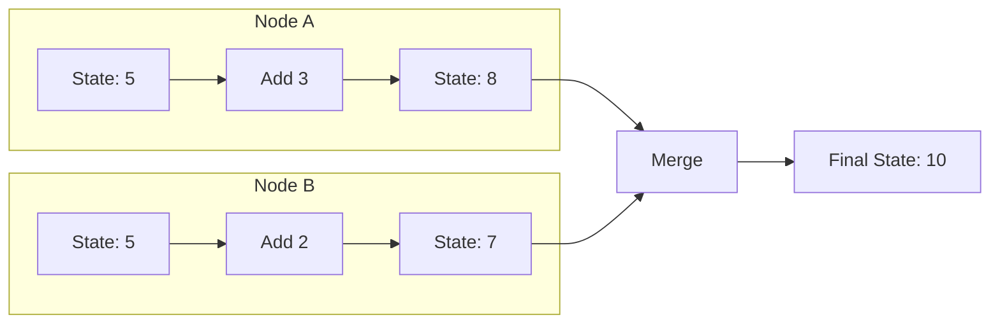
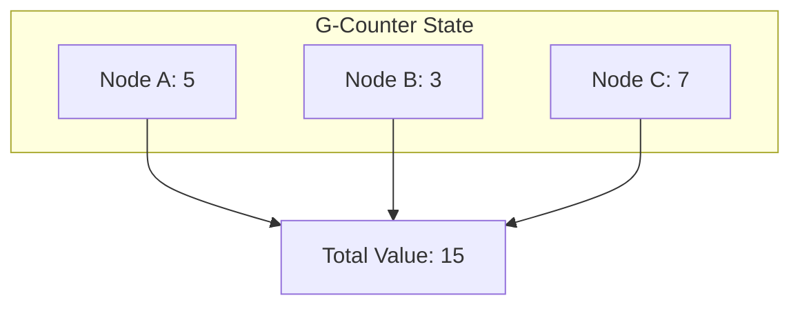
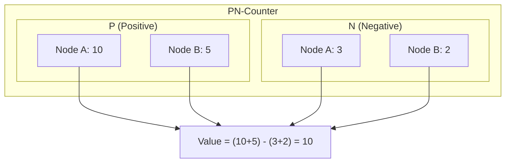
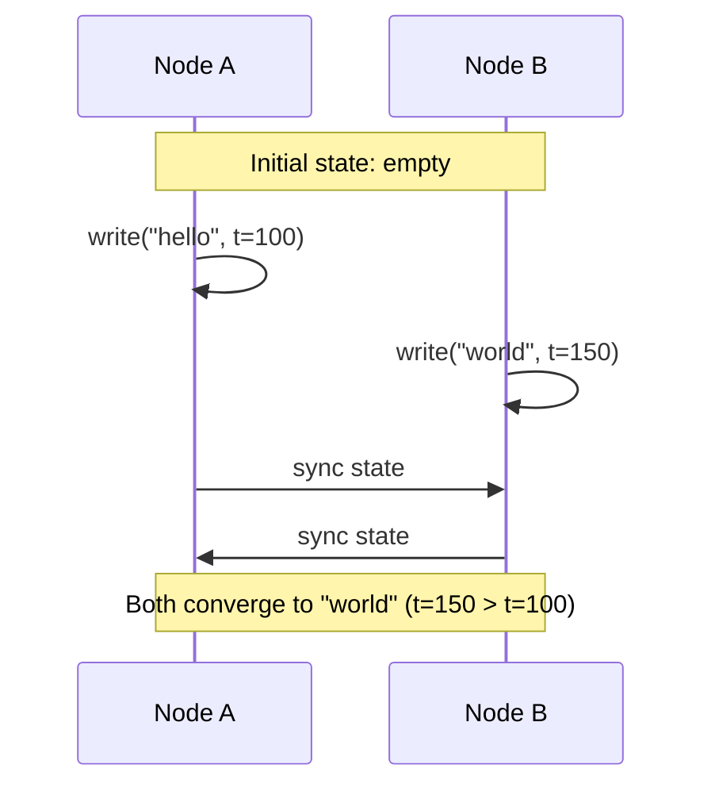
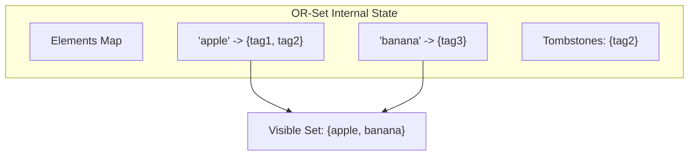
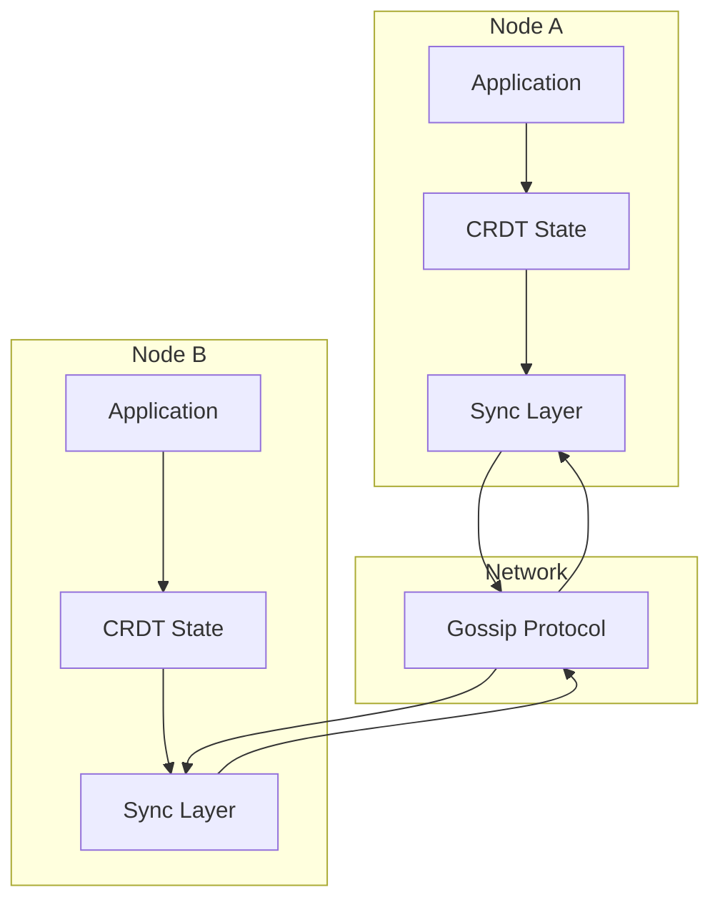

# How to Build CRDT Implementation

Author: [nawazdhandala](https://github.com/nawazdhandala)

Tags: Distributed Systems, Data Structures, Consistency, DevOps

Description: A practical guide to implementing Conflict-free Replicated Data Types (CRDTs) for building distributed systems that achieve eventual consistency without coordination.

---

Building distributed systems that work correctly is hard. Network partitions happen, nodes fail, and data gets out of sync. Traditional approaches rely on consensus protocols or locking mechanisms, but these introduce latency and reduce availability. CRDTs offer a different path: data structures that can be modified concurrently on different nodes and automatically merge without conflicts.

## What Are CRDTs?

CRDT stands for Conflict-free Replicated Data Type. The core idea is simple: design your data structures so that concurrent modifications always produce the same result when merged, regardless of the order in which updates arrive.



When Node A adds 3 and Node B adds 2 to the same initial value, the final merged state is 10 regardless of which update arrives first.

## Two Types of CRDTs

| Type | Name | How It Works | Use Case |
|------|------|--------------|----------|
| CvRDT | Convergent (State-based) | Send full state, merge with mathematical join | Lower message frequency, higher bandwidth per message |
| CmRDT | Commutative (Operation-based) | Send operations, apply in any order | Lower bandwidth, requires reliable delivery |

### Mathematical Foundation

For a CRDT to work correctly, the merge operation must satisfy three properties:

1. **Commutativity**: `merge(a, b) = merge(b, a)`
2. **Associativity**: `merge(merge(a, b), c) = merge(a, merge(b, c))`
3. **Idempotency**: `merge(a, a) = a`

These properties guarantee that no matter what order updates arrive, or how many times the same update is applied, all replicas converge to the same state.

## Implementing a G-Counter (Grow-only Counter)

The simplest CRDT is a G-Counter, where each node maintains its own count. The total is the sum of all node counts.



### TypeScript Implementation

This implementation tracks increments per node using a map. The value is computed by summing all node counts.

```typescript
// g-counter.ts
// A Grow-only Counter that supports increment operations across distributed nodes

interface GCounterState {
  // Maps node ID to that node's count
  counts: Map<string, number>;
}

class GCounter {
  private state: GCounterState;
  private nodeId: string;

  constructor(nodeId: string) {
    this.nodeId = nodeId;
    this.state = { counts: new Map() };
  }

  // Increment the counter for this node
  increment(amount: number = 1): void {
    if (amount < 0) {
      throw new Error('G-Counter only supports positive increments');
    }
    const current = this.state.counts.get(this.nodeId) || 0;
    this.state.counts.set(this.nodeId, current + amount);
  }

  // Get the total value across all nodes
  value(): number {
    let total = 0;
    for (const count of this.state.counts.values()) {
      total += count;
    }
    return total;
  }

  // Merge another G-Counter's state into this one
  // Takes the maximum count for each node (idempotent merge)
  merge(other: GCounter): void {
    for (const [nodeId, count] of other.state.counts) {
      const current = this.state.counts.get(nodeId) || 0;
      this.state.counts.set(nodeId, Math.max(current, count));
    }
  }

  // Export state for network transfer
  getState(): Record<string, number> {
    return Object.fromEntries(this.state.counts);
  }

  // Import state from network transfer
  setState(state: Record<string, number>): void {
    this.state.counts = new Map(Object.entries(state));
  }
}
```

### Usage Example

Here is how two nodes can independently increment and then merge their states.

```typescript
// Node A increments
const counterA = new GCounter('node-a');
counterA.increment(5);
counterA.increment(3);
console.log(counterA.value()); // 8

// Node B increments independently
const counterB = new GCounter('node-b');
counterB.increment(4);
console.log(counterB.value()); // 4

// Merge states (can happen in any order)
counterA.merge(counterB);
console.log(counterA.value()); // 12

counterB.merge(counterA);
console.log(counterB.value()); // 12

// Both nodes now have the same value
```

## Implementing a PN-Counter (Positive-Negative Counter)

A PN-Counter supports both increments and decrements by using two G-Counters internally.



### TypeScript Implementation

The PN-Counter composes two G-Counters: one for increments and one for decrements.

```typescript
// pn-counter.ts
// A Counter that supports both increment and decrement operations

class PNCounter {
  private positive: GCounter;
  private negative: GCounter;
  private nodeId: string;

  constructor(nodeId: string) {
    this.nodeId = nodeId;
    this.positive = new GCounter(nodeId);
    this.negative = new GCounter(nodeId);
  }

  increment(amount: number = 1): void {
    this.positive.increment(amount);
  }

  decrement(amount: number = 1): void {
    this.negative.increment(amount);
  }

  value(): number {
    return this.positive.value() - this.negative.value();
  }

  merge(other: PNCounter): void {
    this.positive.merge(other.positive);
    this.negative.merge(other.negative);
  }

  getState(): { positive: Record<string, number>; negative: Record<string, number> } {
    return {
      positive: this.positive.getState(),
      negative: this.negative.getState(),
    };
  }
}
```

## Implementing an LWW-Register (Last-Writer-Wins Register)

An LWW-Register stores a single value where the most recent write wins based on timestamps.



### TypeScript Implementation

The register stores a value with a timestamp. On merge, the value with the higher timestamp wins.

```typescript
// lww-register.ts
// A Last-Writer-Wins Register for storing single values

interface LWWRegisterState<T> {
  value: T | null;
  timestamp: number;
  nodeId: string;
}

class LWWRegister<T> {
  private state: LWWRegisterState<T>;
  private nodeId: string;

  constructor(nodeId: string) {
    this.nodeId = nodeId;
    this.state = {
      value: null,
      timestamp: 0,
      nodeId: nodeId,
    };
  }

  // Write a new value with current timestamp
  write(value: T, timestamp?: number): void {
    const ts = timestamp || Date.now();
    // Only update if new timestamp is greater
    // Use node ID as tiebreaker for equal timestamps
    if (this.shouldUpdate(ts, this.nodeId)) {
      this.state = {
        value,
        timestamp: ts,
        nodeId: this.nodeId,
      };
    }
  }

  read(): T | null {
    return this.state.value;
  }

  private shouldUpdate(newTimestamp: number, newNodeId: string): boolean {
    if (newTimestamp > this.state.timestamp) {
      return true;
    }
    if (newTimestamp === this.state.timestamp) {
      // Tiebreaker: use lexicographic comparison of node IDs
      return newNodeId > this.state.nodeId;
    }
    return false;
  }

  merge(other: LWWRegister<T>): void {
    if (this.shouldUpdate(other.state.timestamp, other.state.nodeId)) {
      this.state = { ...other.state };
    }
  }

  getState(): LWWRegisterState<T> {
    return { ...this.state };
  }
}
```

### Handling Clock Skew

In real distributed systems, clocks can drift. Here are strategies to handle this.

```typescript
// hybrid-logical-clock.ts
// A Hybrid Logical Clock combines physical time with logical counters

class HybridLogicalClock {
  private physicalTime: number;
  private logicalCounter: number;
  private nodeId: string;

  constructor(nodeId: string) {
    this.nodeId = nodeId;
    this.physicalTime = 0;
    this.logicalCounter = 0;
  }

  // Generate a new timestamp
  now(): { physical: number; logical: number; node: string } {
    const currentPhysical = Date.now();

    if (currentPhysical > this.physicalTime) {
      this.physicalTime = currentPhysical;
      this.logicalCounter = 0;
    } else {
      this.logicalCounter++;
    }

    return {
      physical: this.physicalTime,
      logical: this.logicalCounter,
      node: this.nodeId,
    };
  }

  // Update clock based on received message
  receive(received: { physical: number; logical: number }): void {
    const currentPhysical = Date.now();
    const maxPhysical = Math.max(currentPhysical, this.physicalTime, received.physical);

    if (maxPhysical === this.physicalTime && maxPhysical === received.physical) {
      this.logicalCounter = Math.max(this.logicalCounter, received.logical) + 1;
    } else if (maxPhysical === this.physicalTime) {
      this.logicalCounter++;
    } else if (maxPhysical === received.physical) {
      this.logicalCounter = received.logical + 1;
    } else {
      this.logicalCounter = 0;
    }

    this.physicalTime = maxPhysical;
  }

  // Compare two timestamps
  static compare(
    a: { physical: number; logical: number; node: string },
    b: { physical: number; logical: number; node: string }
  ): number {
    if (a.physical !== b.physical) {
      return a.physical - b.physical;
    }
    if (a.logical !== b.logical) {
      return a.logical - b.logical;
    }
    return a.node.localeCompare(b.node);
  }
}
```

## Implementing an OR-Set (Observed-Remove Set)

The OR-Set is a set CRDT that supports both add and remove operations without the anomalies of simpler set CRDTs.



### TypeScript Implementation

Each add operation creates a unique tag. Remove operations only affect tags that exist at the time of removal.

```typescript
// or-set.ts
// An Observed-Remove Set that handles concurrent add/remove operations

import { v4 as uuidv4 } from 'uuid';

interface ORSetState<T> {
  // Maps element to set of unique tags
  elements: Map<T, Set<string>>;
  // Set of removed tags (tombstones)
  tombstones: Set<string>;
}

class ORSet<T> {
  private state: ORSetState<T>;
  private nodeId: string;

  constructor(nodeId: string) {
    this.nodeId = nodeId;
    this.state = {
      elements: new Map(),
      tombstones: new Set(),
    };
  }

  // Add an element with a unique tag
  add(element: T): void {
    const tag = `${this.nodeId}-${uuidv4()}`;

    if (!this.state.elements.has(element)) {
      this.state.elements.set(element, new Set());
    }
    this.state.elements.get(element)!.add(tag);
  }

  // Remove all currently visible instances of an element
  remove(element: T): void {
    const tags = this.state.elements.get(element);
    if (tags) {
      for (const tag of tags) {
        this.state.tombstones.add(tag);
      }
      this.state.elements.delete(element);
    }
  }

  // Check if element exists (has at least one non-tombstoned tag)
  has(element: T): boolean {
    const tags = this.state.elements.get(element);
    if (!tags) return false;

    for (const tag of tags) {
      if (!this.state.tombstones.has(tag)) {
        return true;
      }
    }
    return false;
  }

  // Get all visible elements
  values(): T[] {
    const result: T[] = [];
    for (const [element, tags] of this.state.elements) {
      for (const tag of tags) {
        if (!this.state.tombstones.has(tag)) {
          result.push(element);
          break;
        }
      }
    }
    return result;
  }

  // Merge another OR-Set's state
  merge(other: ORSet<T>): void {
    // Merge elements
    for (const [element, tags] of other.state.elements) {
      if (!this.state.elements.has(element)) {
        this.state.elements.set(element, new Set());
      }
      for (const tag of tags) {
        this.state.elements.get(element)!.add(tag);
      }
    }

    // Merge tombstones
    for (const tag of other.state.tombstones) {
      this.state.tombstones.add(tag);
    }

    // Clean up elements where all tags are tombstoned
    for (const [element, tags] of this.state.elements) {
      let hasLiveTag = false;
      for (const tag of tags) {
        if (!this.state.tombstones.has(tag)) {
          hasLiveTag = true;
          break;
        }
      }
      if (!hasLiveTag) {
        this.state.elements.delete(element);
      }
    }
  }
}
```

### Usage Example

Demonstrating how concurrent add and remove operations resolve.

```typescript
// Scenario: User A adds "item", User B removes "item" concurrently
const setA = new ORSet<string>('node-a');
const setB = new ORSet<string>('node-b');

// Initial state: both have "item"
setA.add('item');
setA.merge(setB);
setB.merge(setA);

// Concurrent operations
setA.add('item');      // A adds again
setB.remove('item');   // B removes

// After merge: "item" exists because A's add happened after B saw the state
setA.merge(setB);
setB.merge(setA);

console.log(setA.has('item')); // true - A's concurrent add wins
console.log(setB.has('item')); // true - same state after merge
```

## Implementing an LWW-Map (Last-Writer-Wins Map)

An LWW-Map combines LWW-Registers for a key-value store where each key can be independently updated.

```typescript
// lww-map.ts
// A Last-Writer-Wins Map for key-value storage

interface MapEntry<V> {
  value: V;
  timestamp: number;
  nodeId: string;
  deleted: boolean;
}

class LWWMap<K, V> {
  private entries: Map<K, MapEntry<V>>;
  private nodeId: string;

  constructor(nodeId: string) {
    this.nodeId = nodeId;
    this.entries = new Map();
  }

  set(key: K, value: V, timestamp?: number): void {
    const ts = timestamp || Date.now();
    const existing = this.entries.get(key);

    if (!existing || this.isNewer(ts, this.nodeId, existing)) {
      this.entries.set(key, {
        value,
        timestamp: ts,
        nodeId: this.nodeId,
        deleted: false,
      });
    }
  }

  get(key: K): V | undefined {
    const entry = this.entries.get(key);
    if (entry && !entry.deleted) {
      return entry.value;
    }
    return undefined;
  }

  delete(key: K, timestamp?: number): void {
    const ts = timestamp || Date.now();
    const existing = this.entries.get(key);

    if (!existing || this.isNewer(ts, this.nodeId, existing)) {
      this.entries.set(key, {
        value: existing?.value as V,
        timestamp: ts,
        nodeId: this.nodeId,
        deleted: true,
      });
    }
  }

  private isNewer(timestamp: number, nodeId: string, existing: MapEntry<V>): boolean {
    if (timestamp > existing.timestamp) return true;
    if (timestamp === existing.timestamp) {
      return nodeId > existing.nodeId;
    }
    return false;
  }

  merge(other: LWWMap<K, V>): void {
    for (const [key, entry] of other.entries) {
      const existing = this.entries.get(key);

      if (!existing || this.isNewer(entry.timestamp, entry.nodeId, existing)) {
        this.entries.set(key, { ...entry });
      }
    }
  }

  keys(): K[] {
    const result: K[] = [];
    for (const [key, entry] of this.entries) {
      if (!entry.deleted) {
        result.push(key);
      }
    }
    return result;
  }

  toObject(): Record<string, V> {
    const result: Record<string, V> = {};
    for (const [key, entry] of this.entries) {
      if (!entry.deleted) {
        result[String(key)] = entry.value;
      }
    }
    return result;
  }
}
```

## Building a CRDT Sync Layer

To use CRDTs in production, you need a synchronization layer that handles state transfer between nodes.



### Sync Protocol Implementation

This sync layer uses a simple push-based gossip protocol with version vectors for efficient state transfer.

```typescript
// sync-layer.ts
// A synchronization layer for CRDT state replication

interface SyncMessage {
  sourceNode: string;
  crdtId: string;
  state: unknown;
  vectorClock: Record<string, number>;
}

interface CRDTInstance {
  getState(): unknown;
  setState(state: unknown): void;
  merge(other: CRDTInstance): void;
}

class SyncLayer {
  private nodeId: string;
  private crdts: Map<string, CRDTInstance>;
  private vectorClocks: Map<string, Record<string, number>>;
  private peers: Set<string>;
  private sendCallback: (peer: string, message: SyncMessage) => void;

  constructor(
    nodeId: string,
    sendCallback: (peer: string, message: SyncMessage) => void
  ) {
    this.nodeId = nodeId;
    this.crdts = new Map();
    this.vectorClocks = new Map();
    this.peers = new Set();
    this.sendCallback = sendCallback;
  }

  // Register a CRDT instance for synchronization
  register(crdtId: string, crdt: CRDTInstance): void {
    this.crdts.set(crdtId, crdt);
    this.vectorClocks.set(crdtId, { [this.nodeId]: 0 });
  }

  // Add a peer node
  addPeer(peerId: string): void {
    this.peers.add(peerId);
  }

  // Called when local CRDT is modified
  onLocalChange(crdtId: string): void {
    const vectorClock = this.vectorClocks.get(crdtId);
    if (vectorClock) {
      vectorClock[this.nodeId] = (vectorClock[this.nodeId] || 0) + 1;
    }

    // Broadcast to all peers
    this.broadcast(crdtId);
  }

  // Broadcast state to all peers
  private broadcast(crdtId: string): void {
    const crdt = this.crdts.get(crdtId);
    const vectorClock = this.vectorClocks.get(crdtId);

    if (!crdt || !vectorClock) return;

    const message: SyncMessage = {
      sourceNode: this.nodeId,
      crdtId,
      state: crdt.getState(),
      vectorClock: { ...vectorClock },
    };

    for (const peer of this.peers) {
      this.sendCallback(peer, message);
    }
  }

  // Handle incoming sync message
  onReceive(message: SyncMessage): void {
    const { crdtId, state, vectorClock } = message;

    const localCrdt = this.crdts.get(crdtId);
    const localVectorClock = this.vectorClocks.get(crdtId);

    if (!localCrdt || !localVectorClock) {
      console.warn(`Unknown CRDT: ${crdtId}`);
      return;
    }

    // Check if we need this update using vector clock comparison
    if (this.isNewerState(vectorClock, localVectorClock)) {
      // Create temporary CRDT to merge
      const tempCrdt = Object.create(Object.getPrototypeOf(localCrdt));
      tempCrdt.setState(state);
      localCrdt.merge(tempCrdt);

      // Update vector clock
      this.mergeVectorClocks(localVectorClock, vectorClock);
    }
  }

  private isNewerState(
    remote: Record<string, number>,
    local: Record<string, number>
  ): boolean {
    // Return true if remote has any entry newer than local
    for (const [nodeId, count] of Object.entries(remote)) {
      if (count > (local[nodeId] || 0)) {
        return true;
      }
    }
    return false;
  }

  private mergeVectorClocks(
    local: Record<string, number>,
    remote: Record<string, number>
  ): void {
    for (const [nodeId, count] of Object.entries(remote)) {
      local[nodeId] = Math.max(local[nodeId] || 0, count);
    }
  }

  // Periodic sync (anti-entropy)
  periodicSync(): void {
    for (const crdtId of this.crdts.keys()) {
      this.broadcast(crdtId);
    }
  }
}
```

## Real-World Use Cases

### Collaborative Text Editing

CRDTs power real-time collaborative editors. Here is a simplified sequence CRDT for text.

```typescript
// sequence-crdt.ts
// A simplified sequence CRDT for collaborative text editing

interface SequenceElement {
  id: string;
  value: string;
  deleted: boolean;
  // Position is determined by comparing IDs
}

class SequenceCRDT {
  private elements: SequenceElement[];
  private nodeId: string;
  private counter: number;

  constructor(nodeId: string) {
    this.nodeId = nodeId;
    this.elements = [];
    this.counter = 0;
  }

  // Generate a unique ID between two positions
  private generateId(before: string | null, after: string | null): string {
    this.counter++;
    const timestamp = Date.now();

    // Simplified: in production, use fractional indexing
    // like Yjs or Automerge algorithms
    return `${timestamp}-${this.counter}-${this.nodeId}`;
  }

  insert(index: number, char: string): void {
    const before = index > 0 ? this.elements[index - 1]?.id : null;
    const after = this.elements[index]?.id || null;

    const newElement: SequenceElement = {
      id: this.generateId(before, after),
      value: char,
      deleted: false,
    };

    this.elements.splice(index, 0, newElement);
  }

  delete(index: number): void {
    if (this.elements[index]) {
      this.elements[index].deleted = true;
    }
  }

  getText(): string {
    return this.elements
      .filter(e => !e.deleted)
      .map(e => e.value)
      .join('');
  }

  merge(other: SequenceCRDT): void {
    // Merge elements by ID, keeping deletions
    const merged = new Map<string, SequenceElement>();

    for (const el of this.elements) {
      merged.set(el.id, el);
    }

    for (const el of other.elements) {
      const existing = merged.get(el.id);
      if (!existing) {
        merged.set(el.id, el);
      } else if (el.deleted) {
        existing.deleted = true;
      }
    }

    // Sort by ID to maintain consistent order
    this.elements = Array.from(merged.values()).sort((a, b) =>
      a.id.localeCompare(b.id)
    );
  }
}
```

### Shopping Cart

An e-commerce shopping cart using an OR-Set for items and PN-Counters for quantities.

```typescript
// shopping-cart.ts
// A CRDT-based shopping cart for e-commerce

interface CartItem {
  productId: string;
  quantity: PNCounter;
}

class ShoppingCart {
  private items: ORSet<string>;
  private quantities: Map<string, PNCounter>;
  private nodeId: string;

  constructor(nodeId: string) {
    this.nodeId = nodeId;
    this.items = new ORSet<string>(nodeId);
    this.quantities = new Map();
  }

  addItem(productId: string, quantity: number = 1): void {
    this.items.add(productId);

    if (!this.quantities.has(productId)) {
      this.quantities.set(productId, new PNCounter(this.nodeId));
    }
    this.quantities.get(productId)!.increment(quantity);
  }

  removeItem(productId: string): void {
    this.items.remove(productId);
  }

  updateQuantity(productId: string, delta: number): void {
    if (!this.quantities.has(productId)) {
      this.quantities.set(productId, new PNCounter(this.nodeId));
    }

    if (delta > 0) {
      this.quantities.get(productId)!.increment(delta);
    } else {
      this.quantities.get(productId)!.decrement(Math.abs(delta));
    }
  }

  getContents(): Array<{ productId: string; quantity: number }> {
    const result: Array<{ productId: string; quantity: number }> = [];

    for (const productId of this.items.values()) {
      const quantity = this.quantities.get(productId)?.value() || 0;
      if (quantity > 0) {
        result.push({ productId, quantity });
      }
    }

    return result;
  }

  merge(other: ShoppingCart): void {
    this.items.merge(other.items);

    for (const [productId, counter] of other.quantities) {
      if (!this.quantities.has(productId)) {
        this.quantities.set(productId, new PNCounter(this.nodeId));
      }
      this.quantities.get(productId)!.merge(counter);
    }
  }
}
```

## Performance Considerations

### State Size Management

CRDTs can grow unbounded. Here are strategies to manage state size.

| Strategy | Description | Trade-off |
|----------|-------------|-----------|
| Tombstone GC | Periodically remove old tombstones | Requires coordination window |
| Compaction | Merge old entries | May lose audit trail |
| Checkpointing | Snapshot and truncate history | Requires all nodes to acknowledge |
| Delta-state | Only send changes, not full state | More complex implementation |

### Delta-State CRDT Example

Instead of sending full state, send only the changes since the last sync.

```typescript
// delta-counter.ts
// A delta-state G-Counter that only transmits changes

class DeltaGCounter {
  private state: Map<string, number>;
  private delta: Map<string, number>;
  private nodeId: string;

  constructor(nodeId: string) {
    this.nodeId = nodeId;
    this.state = new Map();
    this.delta = new Map();
  }

  increment(amount: number = 1): void {
    const current = this.state.get(this.nodeId) || 0;
    const newValue = current + amount;

    this.state.set(this.nodeId, newValue);

    // Track delta for this increment
    const deltaCurrent = this.delta.get(this.nodeId) || 0;
    this.delta.set(this.nodeId, deltaCurrent + amount);
  }

  value(): number {
    let total = 0;
    for (const count of this.state.values()) {
      total += count;
    }
    return total;
  }

  // Get accumulated delta since last sync
  getDelta(): Map<string, number> {
    return new Map(this.delta);
  }

  // Clear delta after successful sync
  clearDelta(): void {
    this.delta.clear();
  }

  // Apply delta from another node
  applyDelta(delta: Map<string, number>): void {
    for (const [nodeId, count] of delta) {
      const current = this.state.get(nodeId) || 0;
      this.state.set(nodeId, Math.max(current, count));
    }
  }

  // Full state merge (for recovery or initial sync)
  merge(other: DeltaGCounter): void {
    for (const [nodeId, count] of other.state) {
      const current = this.state.get(nodeId) || 0;
      this.state.set(nodeId, Math.max(current, count));
    }
  }
}
```

## Testing CRDTs

CRDTs should be tested for convergence under various merge orderings.

```typescript
// crdt-test.ts
// Property-based testing for CRDT convergence

function testConvergence<T extends { merge: (other: T) => void; value: () => unknown }>(
  createCRDT: (nodeId: string) => T,
  operations: Array<(crdt: T) => void>
): boolean {
  // Create multiple replicas
  const replicas = [
    createCRDT('node-a'),
    createCRDT('node-b'),
    createCRDT('node-c'),
  ];

  // Apply different operations to different replicas
  for (let i = 0; i < operations.length; i++) {
    const replicaIndex = i % replicas.length;
    operations[i](replicas[replicaIndex]);
  }

  // Merge all replicas in different orders
  const orders = [
    [0, 1, 2],
    [2, 1, 0],
    [1, 0, 2],
  ];

  const finalValues: unknown[] = [];

  for (const order of orders) {
    // Create fresh copies
    const copies = replicas.map((r, i) => {
      const copy = createCRDT(`node-${String.fromCharCode(97 + i)}`);
      copy.merge(r);
      return copy;
    });

    // Merge in specified order
    for (let i = 1; i < order.length; i++) {
      copies[order[i]].merge(copies[order[i - 1]]);
    }
    for (let i = order.length - 2; i >= 0; i--) {
      copies[order[i]].merge(copies[order[i + 1]]);
    }

    finalValues.push(copies[0].value());
  }

  // All merge orders should produce the same value
  return finalValues.every(v => JSON.stringify(v) === JSON.stringify(finalValues[0]));
}

// Example test
const converges = testConvergence(
  (nodeId) => new GCounter(nodeId),
  [
    (c) => c.increment(5),
    (c) => c.increment(3),
    (c) => c.increment(7),
    (c) => c.increment(2),
  ]
);

console.log(`Convergence test passed: ${converges}`);
```

## When to Use CRDTs

CRDTs are a good fit when:

- You need offline-first functionality
- Low latency is critical (no consensus overhead)
- Network partitions are expected
- You can tolerate eventual consistency
- Operations are naturally commutative

CRDTs may not be ideal when:

- Strong consistency is required
- Operations have complex dependencies
- State size would grow unboundedly
- Conflict resolution needs human intervention

## Summary

| CRDT Type | Operations | Use Case |
|-----------|------------|----------|
| G-Counter | Increment | Page views, likes |
| PN-Counter | Increment, Decrement | Inventory, votes |
| LWW-Register | Read, Write | User profile, settings |
| OR-Set | Add, Remove | Tags, bookmarks |
| LWW-Map | Get, Set, Delete | Key-value store |
| Sequence | Insert, Delete | Collaborative text |

CRDTs provide a principled approach to building distributed systems that work correctly under network partitions and concurrent modifications. Start with simple CRDTs like counters and registers, then compose them into more complex structures as needed.

---

*Building distributed systems that need to stay in sync across regions? [OneUptime](https://oneuptime.com) helps you monitor the consistency and performance of your distributed infrastructure with real-time observability.*
