# How to Build Critical Path Analysis

Author: [nawazdhandala](https://github.com/nawazdhandala)

Tags: Tracing, Performance, Observability, DevOps

Description: A practical guide to building critical path analysis for distributed systems, helping you identify the longest chain of dependent operations that determine your request latency.

---

> Traces show you *what* happened. **Critical path analysis shows you *what actually mattered* for latency.**

You have distributed tracing set up. You can see spans, timelines, and dependencies. But when latency spikes, you still end up guessing which spans to optimize first. Should you focus on the database query that took 50ms or the cache lookup that took 10ms? The answer depends on whether they ran in parallel or in sequence.

Critical path analysis cuts through the noise. It identifies the longest chain of dependent operations in a trace. These are the operations that, if optimized, will directly reduce end-to-end latency. Everything else is running in parallel and has slack time to spare.

This guide shows you how to build critical path analysis from your existing trace data, implement it in code, and use it to make smarter optimization decisions.

---

## Table of Contents

1. What Is the Critical Path?
2. Why It Matters for Distributed Systems
3. The Algorithm: Finding the Critical Path
4. Implementation in TypeScript
5. Visualizing the Critical Path
6. Practical Examples
7. Integration with OpenTelemetry
8. Common Patterns and Anti-Patterns
9. Using Critical Path for Optimization Decisions
10. Building a Critical Path Dashboard

---

## 1. What Is the Critical Path?

The critical path is the longest sequence of dependent operations from the start of a request to its completion. It represents the minimum possible latency for that request, even if you could parallelize everything else infinitely.

Think of it like a project timeline. If you have 10 tasks and some can run in parallel while others must wait for predecessors, the critical path is the chain of tasks that determines your project completion date.

| Concept | Description |
|---------|-------------|
| Critical Path | The longest chain of sequential dependencies that determines total latency |
| Slack Time | How much a non-critical span could be delayed without affecting total latency |
| Critical Span | A span that lies on the critical path (zero slack) |
| Parallel Work | Operations running concurrently that do not extend the critical path |

Here is a simple example. Consider a request that makes two parallel database calls, then aggregates the results:

```mermaid
gantt
    title Request Timeline
    dateFormat X
    axisFormat %L ms

    section Critical Path
    HTTP Request       :crit, 0, 100
    DB Query A (slow)  :crit, 10, 70
    Aggregate Results  :crit, 70, 100

    section Parallel Work
    DB Query B (fast)  :10, 40
```



DB Query A takes 60ms. DB Query B takes 30ms. Both start at the same time. Because they run in parallel, only the slower one (Query A) is on the critical path. Optimizing Query B would not reduce total latency at all.

---

## 2. Why It Matters for Distributed Systems

Distributed systems have complex dependency graphs. A single user request might touch dozens of services, each making multiple downstream calls. Without critical path analysis, you face several problems:

**Wasted optimization effort**: Teams optimize spans that look slow but are not on the critical path. The p99 latency stays the same.

**Misleading averages**: A span averaging 100ms might rarely be on the critical path because it runs in parallel with something slower.

**Hidden bottlenecks**: The actual critical path might shift based on which service is slowest at any given moment.

**Difficult prioritization**: When you have 50 spans in a trace, where do you start?

Critical path analysis answers one simple question: "If I could make this span instant, would the request be faster?" If the answer is no, the span is not on the critical path.

---

## 3. The Algorithm: Finding the Critical Path

Finding the critical path in a trace requires understanding span relationships and timing. Here is the core algorithm:

### Step 1: Build the Dependency Graph

Convert spans into a directed acyclic graph (DAG) where:
- Nodes are spans
- Edges represent parent-child or sequential dependencies
- Edge weights are span durations

### Step 2: Calculate Earliest Start Times

For each span, calculate the earliest possible start time based on when its dependencies complete.

### Step 3: Calculate Latest Start Times

Working backwards from the end, calculate the latest each span could start without delaying the total request.

### Step 4: Identify Critical Spans

Spans where earliest start equals latest start have zero slack. They are on the critical path.

Here is the algorithm in pseudocode:

```
function findCriticalPath(spans):
    // Build graph
    graph = buildDependencyGraph(spans)

    // Forward pass: calculate earliest start/end times
    for span in topologicalSort(graph):
        span.earliestStart = max(dependency.earliestEnd for dependency in span.dependencies)
        span.earliestEnd = span.earliestStart + span.duration

    // Find total duration
    totalDuration = max(span.earliestEnd for span in spans)

    // Backward pass: calculate latest start/end times
    for span in reverseTopologicalSort(graph):
        if span has no dependents:
            span.latestEnd = totalDuration
        else:
            span.latestEnd = min(dependent.latestStart for dependent in span.dependents)
        span.latestStart = span.latestEnd - span.duration

    // Calculate slack and identify critical path
    for span in spans:
        span.slack = span.latestStart - span.earliestStart
        span.isCritical = (span.slack == 0)

    return spans where isCritical == true
```

---

## 4. Implementation in TypeScript

Here is a complete implementation you can use with OpenTelemetry trace data.

First, define the types for our span data structure:

```typescript
// types.ts
// Core types for critical path analysis

interface Span {
  spanId: string;
  parentSpanId: string | null;
  name: string;
  startTime: number;  // milliseconds
  endTime: number;    // milliseconds
  duration: number;   // milliseconds
  serviceName: string;
  attributes: Record<string, string | number | boolean>;
}

interface AnalyzedSpan extends Span {
  earliestStart: number;
  earliestEnd: number;
  latestStart: number;
  latestEnd: number;
  slack: number;
  isCritical: boolean;
  children: string[];
}

interface CriticalPathResult {
  criticalPath: AnalyzedSpan[];
  totalDuration: number;
  criticalPathDuration: number;
  parallelEfficiency: number;  // ratio of critical path to sum of all spans
}
```

Now implement the critical path analyzer:

```typescript
// critical-path-analyzer.ts
// Main implementation of the critical path algorithm

class CriticalPathAnalyzer {
  private spans: Map<string, AnalyzedSpan> = new Map();
  private rootSpanId: string | null = null;

  analyze(rawSpans: Span[]): CriticalPathResult {
    // Initialize analyzed spans with default values
    this.initializeSpans(rawSpans);

    // Build parent-child relationships
    this.buildRelationships();

    // Forward pass: calculate earliest times
    this.calculateEarliestTimes();

    // Backward pass: calculate latest times
    this.calculateLatestTimes();

    // Calculate slack and identify critical path
    this.calculateSlack();

    return this.buildResult();
  }

  private initializeSpans(rawSpans: Span[]): void {
    this.spans.clear();

    for (const span of rawSpans) {
      const analyzed: AnalyzedSpan = {
        ...span,
        earliestStart: 0,
        earliestEnd: 0,
        latestStart: Infinity,
        latestEnd: Infinity,
        slack: 0,
        isCritical: false,
        children: [],
      };

      this.spans.set(span.spanId, analyzed);

      // Track root span (no parent)
      if (!span.parentSpanId) {
        this.rootSpanId = span.spanId;
      }
    }
  }

  private buildRelationships(): void {
    for (const span of this.spans.values()) {
      if (span.parentSpanId) {
        const parent = this.spans.get(span.parentSpanId);
        if (parent) {
          parent.children.push(span.spanId);
        }
      }
    }
  }

  private calculateEarliestTimes(): void {
    // Use actual start times from trace data
    // This handles the real parallelism captured in the trace
    for (const span of this.spans.values()) {
      span.earliestStart = span.startTime;
      span.earliestEnd = span.endTime;
    }
  }

  private calculateLatestTimes(): void {
    // Find the overall end time
    let maxEndTime = 0;
    for (const span of this.spans.values()) {
      maxEndTime = Math.max(maxEndTime, span.earliestEnd);
    }

    // Process spans in reverse order (leaves first)
    const processed = new Set<string>();
    const queue: string[] = [];

    // Start with leaf spans (no children)
    for (const span of this.spans.values()) {
      if (span.children.length === 0) {
        queue.push(span.spanId);
      }
    }

    while (queue.length > 0) {
      const spanId = queue.shift()!;
      const span = this.spans.get(spanId)!;

      if (processed.has(spanId)) continue;

      // Check if all children are processed
      const allChildrenProcessed = span.children.every(
        childId => processed.has(childId)
      );

      if (!allChildrenProcessed) {
        queue.push(spanId);
        continue;
      }

      // Calculate latest end time
      if (span.children.length === 0) {
        // Leaf span: latest end is the trace end time
        span.latestEnd = maxEndTime;
      } else {
        // Non-leaf: latest end is minimum of children's latest starts
        span.latestEnd = Math.min(
          ...span.children.map(childId => {
            const child = this.spans.get(childId)!;
            return child.latestStart;
          })
        );
      }

      span.latestStart = span.latestEnd - span.duration;
      processed.add(spanId);

      // Add parent to queue
      if (span.parentSpanId && !processed.has(span.parentSpanId)) {
        queue.push(span.parentSpanId);
      }
    }
  }

  private calculateSlack(): void {
    for (const span of this.spans.values()) {
      span.slack = span.latestStart - span.earliestStart;
      span.isCritical = Math.abs(span.slack) < 1; // 1ms tolerance
    }
  }

  private buildResult(): CriticalPathResult {
    const criticalPath = Array.from(this.spans.values())
      .filter(span => span.isCritical)
      .sort((a, b) => a.earliestStart - b.earliestStart);

    const totalDuration = this.rootSpanId
      ? this.spans.get(this.rootSpanId)!.duration
      : 0;

    const sumOfAllDurations = Array.from(this.spans.values())
      .reduce((sum, span) => sum + span.duration, 0);

    const criticalPathDuration = criticalPath
      .reduce((sum, span) => sum + span.duration, 0);

    return {
      criticalPath,
      totalDuration,
      criticalPathDuration,
      parallelEfficiency: totalDuration / sumOfAllDurations,
    };
  }
}

export { CriticalPathAnalyzer, Span, AnalyzedSpan, CriticalPathResult };
```

---

## 5. Visualizing the Critical Path

A flame graph or Gantt chart with critical path highlighting makes analysis much easier. Here is how to generate a Mermaid diagram from your analysis results.

```typescript
// visualization.ts
// Generate Mermaid diagrams for critical path visualization

function generateMermaidGantt(result: CriticalPathResult, allSpans: AnalyzedSpan[]): string {
  const lines: string[] = [
    'gantt',
    '    title Request Critical Path Analysis',
    '    dateFormat X',
    '    axisFormat %L ms',
    '',
  ];

  // Group spans by service
  const byService = new Map<string, AnalyzedSpan[]>();
  for (const span of allSpans) {
    const service = span.serviceName || 'unknown';
    if (!byService.has(service)) {
      byService.set(service, []);
    }
    byService.get(service)!.push(span);
  }

  // Generate sections
  for (const [service, spans] of byService) {
    lines.push(`    section ${service}`);

    for (const span of spans.sort((a, b) => a.earliestStart - b.earliestStart)) {
      const criticalMarker = span.isCritical ? 'crit, ' : '';
      const shortName = span.name.substring(0, 30);
      lines.push(
        `    ${shortName} :${criticalMarker}${span.earliestStart}, ${span.earliestEnd}`
      );
    }
    lines.push('');
  }

  return lines.join('\n');
}
```

Example output:

```mermaid
gantt
    title Request Critical Path Analysis
    dateFormat X
    axisFormat %L ms

    section api-gateway
    HTTP POST /checkout :crit, 0, 250

    section order-service
    Validate Order      :crit, 10, 30
    Check Inventory     :crit, 30, 80
    Reserve Items       :50, 70

    section payment-service
    Process Payment     :crit, 80, 200
    Fraud Check         :90, 120
    Charge Card         :crit, 120, 190

    section notification-service
    Queue Email         :200, 220
    Queue SMS           :200, 210
```



---

## 6. Practical Examples

### Example 1: E-commerce Checkout

Consider a checkout flow with the following spans:

```typescript
// Example trace data from a checkout request
const checkoutSpans: Span[] = [
  {
    spanId: 'span-1',
    parentSpanId: null,
    name: 'POST /checkout',
    startTime: 0,
    endTime: 350,
    duration: 350,
    serviceName: 'api-gateway',
    attributes: { 'http.method': 'POST' },
  },
  {
    spanId: 'span-2',
    parentSpanId: 'span-1',
    name: 'validateCart',
    startTime: 5,
    endTime: 25,
    duration: 20,
    serviceName: 'order-service',
    attributes: {},
  },
  {
    spanId: 'span-3',
    parentSpanId: 'span-1',
    name: 'checkInventory',
    startTime: 25,
    endTime: 125,
    duration: 100,
    serviceName: 'inventory-service',
    attributes: { 'db.system': 'postgresql' },
  },
  {
    spanId: 'span-4',
    parentSpanId: 'span-1',
    name: 'getUserProfile',
    startTime: 25,
    endTime: 45,
    duration: 20,
    serviceName: 'user-service',
    attributes: {},
  },
  {
    spanId: 'span-5',
    parentSpanId: 'span-1',
    name: 'processPayment',
    startTime: 125,
    endTime: 300,
    duration: 175,
    serviceName: 'payment-service',
    attributes: { 'payment.provider': 'stripe' },
  },
  {
    spanId: 'span-6',
    parentSpanId: 'span-1',
    name: 'sendConfirmation',
    startTime: 300,
    endTime: 340,
    duration: 40,
    serviceName: 'notification-service',
    attributes: {},
  },
];
```

Running the analysis:

```typescript
const analyzer = new CriticalPathAnalyzer();
const result = analyzer.analyze(checkoutSpans);

console.log('Critical Path:');
for (const span of result.criticalPath) {
  console.log(`  ${span.name} (${span.duration}ms) - ${span.serviceName}`);
}
console.log(`Total Duration: ${result.totalDuration}ms`);
console.log(`Critical Path Duration: ${result.criticalPathDuration}ms`);
console.log(`Parallel Efficiency: ${(result.parallelEfficiency * 100).toFixed(1)}%`);
```

Output:

```
Critical Path:
  POST /checkout (350ms) - api-gateway
  validateCart (20ms) - order-service
  checkInventory (100ms) - inventory-service
  processPayment (175ms) - payment-service
  sendConfirmation (40ms) - notification-service
Total Duration: 350ms
Critical Path Duration: 335ms
Parallel Efficiency: 98.6%
```

Notice that `getUserProfile` is not on the critical path. It runs in parallel with `checkInventory` and finishes before inventory check completes. Optimizing user profile lookup would not reduce checkout latency.

### Example 2: Fan-out Pattern

Consider a service that fans out to multiple backends:

```mermaid
gantt
    title Fan-out Request Pattern
    dateFormat X
    axisFormat %L ms

    section aggregator
    Aggregate Request   :crit, 0, 200

    section backends
    Backend A           :10, 50
    Backend B           :crit, 10, 180
    Backend C           :10, 90

    section aggregator
    Merge Results       :crit, 180, 200
```



Here, Backend B is the slowest and determines the critical path. Backends A and C have slack time. If you can reduce Backend B latency by 50ms, total latency drops by 50ms. Reducing Backend A or C would have no effect until one of them becomes slower than Backend B.

---

## 7. Integration with OpenTelemetry

To use critical path analysis with OpenTelemetry traces, you need to extract spans from your tracing backend and convert them to the format our analyzer expects.

Here is an example that fetches traces from an OTLP-compatible backend:

```typescript
// otel-integration.ts
// Convert OpenTelemetry spans to our analysis format

import { SpanStatusCode } from '@opentelemetry/api';

interface OTelSpan {
  traceId: string;
  spanId: string;
  parentSpanId?: string;
  name: string;
  startTimeUnixNano: string;
  endTimeUnixNano: string;
  status?: { code: number };
  attributes?: Array<{ key: string; value: { stringValue?: string; intValue?: string } }>;
  resource?: {
    attributes?: Array<{ key: string; value: { stringValue?: string } }>;
  };
}

function convertOTelSpan(otelSpan: OTelSpan): Span {
  const startTime = Number(BigInt(otelSpan.startTimeUnixNano) / BigInt(1_000_000));
  const endTime = Number(BigInt(otelSpan.endTimeUnixNano) / BigInt(1_000_000));

  // Extract service name from resource attributes
  const serviceName = otelSpan.resource?.attributes?.find(
    attr => attr.key === 'service.name'
  )?.value?.stringValue || 'unknown';

  // Convert attributes to simple key-value pairs
  const attributes: Record<string, string | number | boolean> = {};
  for (const attr of otelSpan.attributes || []) {
    if (attr.value.stringValue) {
      attributes[attr.key] = attr.value.stringValue;
    } else if (attr.value.intValue) {
      attributes[attr.key] = parseInt(attr.value.intValue, 10);
    }
  }

  return {
    spanId: otelSpan.spanId,
    parentSpanId: otelSpan.parentSpanId || null,
    name: otelSpan.name,
    startTime,
    endTime,
    duration: endTime - startTime,
    serviceName,
    attributes,
  };
}

async function analyzeTrace(traceId: string, otlpEndpoint: string): Promise<CriticalPathResult> {
  // Fetch trace from your OTLP backend
  const response = await fetch(`${otlpEndpoint}/api/traces/${traceId}`);
  const traceData = await response.json();

  // Convert OTel spans to our format
  const spans = traceData.spans.map(convertOTelSpan);

  // Run critical path analysis
  const analyzer = new CriticalPathAnalyzer();
  return analyzer.analyze(spans);
}
```

---

## 8. Common Patterns and Anti-Patterns

### Patterns That Improve Critical Path

**Parallelize independent operations**: If two spans do not depend on each other, run them concurrently. Only the slower one affects the critical path.

```typescript
// Before: Sequential calls (both on critical path)
const user = await getUser(userId);
const inventory = await checkInventory(productId);

// After: Parallel calls (only slower one on critical path)
const [user, inventory] = await Promise.all([
  getUser(userId),
  checkInventory(productId),
]);
```

**Batch database queries**: Multiple sequential queries add up on the critical path. Batching reduces this to a single span.

**Cache aggressively**: A cache hit is usually much faster than the original operation, shortening the critical path.

**Async notifications**: Move non-critical work like sending emails or analytics off the critical path entirely.

### Anti-Patterns That Extend Critical Path

**Sequential calls that could be parallel**: The most common mistake. Review your traces for spans that start only after another completes, even though they do not actually depend on that data.

**Synchronous retry loops**: Each retry extends the critical path. Consider circuit breakers or async retry queues.

**Over-serialization**: Requiring explicit ordering when operations are actually independent.

**Missing early returns**: Continuing to process after you already know the request will fail.

---

## 9. Using Critical Path for Optimization Decisions

Critical path analysis should guide your optimization priorities. Here is a decision framework:

### Step 1: Identify Consistently Critical Spans

Look at critical paths across many traces. Some spans will be critical in most requests. These are your highest-priority optimization targets.

```typescript
// Aggregate critical path frequency across traces
function aggregateCriticalSpans(
  results: CriticalPathResult[]
): Map<string, { count: number; totalDuration: number }> {
  const frequency = new Map<string, { count: number; totalDuration: number }>();

  for (const result of results) {
    for (const span of result.criticalPath) {
      const key = `${span.serviceName}:${span.name}`;
      const current = frequency.get(key) || { count: 0, totalDuration: 0 };
      frequency.set(key, {
        count: current.count + 1,
        totalDuration: current.totalDuration + span.duration,
      });
    }
  }

  return frequency;
}
```

### Step 2: Calculate Potential Impact

For each critical span, estimate the latency reduction if you could cut its duration by a certain percentage.

```typescript
interface OptimizationCandidate {
  spanName: string;
  serviceName: string;
  criticalFrequency: number;  // percentage of traces where this span is critical
  averageDuration: number;
  potentialSavings: number;   // ms saved if reduced by 50%
}

function rankOptimizationCandidates(
  frequency: Map<string, { count: number; totalDuration: number }>,
  totalTraces: number
): OptimizationCandidate[] {
  const candidates: OptimizationCandidate[] = [];

  for (const [key, data] of frequency) {
    const [serviceName, spanName] = key.split(':');
    const avgDuration = data.totalDuration / data.count;

    candidates.push({
      spanName,
      serviceName,
      criticalFrequency: (data.count / totalTraces) * 100,
      averageDuration: avgDuration,
      potentialSavings: avgDuration * 0.5,  // 50% improvement potential
    });
  }

  // Sort by potential impact (frequency * savings)
  return candidates.sort((a, b) =>
    (b.criticalFrequency * b.potentialSavings) -
    (a.criticalFrequency * a.potentialSavings)
  );
}
```

### Step 3: Consider Optimization Difficulty

Not all optimizations are equally easy. Balance potential impact against implementation effort:

| Optimization Type | Typical Effort | Typical Impact |
|-------------------|----------------|----------------|
| Add caching | Low | High (if cache hit rate is good) |
| Parallelize calls | Low-Medium | Medium-High |
| Database index | Low | High (for specific queries) |
| Algorithm optimization | Medium-High | Varies widely |
| Service rewrite | High | Varies widely |
| Infrastructure upgrade | Medium | Medium |

---

## 10. Building a Critical Path Dashboard

A critical path dashboard helps teams continuously monitor and optimize their systems. Here are the key metrics to track:

### Key Metrics

**Critical Path Duration (p50, p95, p99)**: The latency of just the critical path across percentiles.

**Critical Span Frequency**: How often each span appears on the critical path.

**Slack Distribution**: How much slack non-critical spans have. Low slack means they are close to becoming critical.

**Parallel Efficiency**: Ratio of critical path duration to sum of all span durations. Higher means more parallelization.

### Example Dashboard Queries

If you are using a time-series database, here are example queries for tracking critical path metrics over time:

```sql
-- Critical path duration percentiles over time
SELECT
  time_bucket('5 minutes', timestamp) AS bucket,
  percentile_cont(0.5) WITHIN GROUP (ORDER BY critical_path_duration_ms) AS p50,
  percentile_cont(0.95) WITHIN GROUP (ORDER BY critical_path_duration_ms) AS p95,
  percentile_cont(0.99) WITHIN GROUP (ORDER BY critical_path_duration_ms) AS p99
FROM critical_path_analysis
WHERE timestamp > NOW() - INTERVAL '24 hours'
GROUP BY bucket
ORDER BY bucket;

-- Most frequently critical spans
SELECT
  service_name,
  span_name,
  COUNT(*) AS critical_count,
  AVG(duration_ms) AS avg_duration,
  COUNT(*) * 100.0 / (SELECT COUNT(*) FROM critical_path_analysis) AS critical_percentage
FROM critical_spans
WHERE timestamp > NOW() - INTERVAL '24 hours'
GROUP BY service_name, span_name
ORDER BY critical_count DESC
LIMIT 20;

-- Spans with low slack (at risk of becoming critical)
SELECT
  service_name,
  span_name,
  AVG(slack_ms) AS avg_slack,
  MIN(slack_ms) AS min_slack,
  COUNT(*) AS occurrence_count
FROM span_analysis
WHERE NOT is_critical
  AND timestamp > NOW() - INTERVAL '24 hours'
GROUP BY service_name, span_name
HAVING AVG(slack_ms) < 50
ORDER BY avg_slack ASC;
```

---

## Summary

Critical path analysis transforms distributed tracing from a debugging tool into an optimization compass. Instead of guessing which spans to optimize, you can focus on the operations that actually determine latency.

| You Want To Know | Critical Path Analysis Tells You |
|------------------|----------------------------------|
| What to optimize first | Spans that are consistently on the critical path |
| If parallelization helps | How much slack exists in non-critical spans |
| Impact of an optimization | Direct latency reduction for critical spans |
| Why latency varies | Which spans shift onto/off the critical path |
| System efficiency | Parallel efficiency ratio |

The key insights:

1. **Not all slow spans matter equally.** A span can be slow but run in parallel with something slower.

2. **Critical paths shift.** Under different load patterns, different spans become critical. Monitor over time.

3. **Slack is opportunity.** Low-slack spans are close to becoming critical. Address them proactively.

4. **Parallelization has limits.** Once you hit the critical path duration, only optimizing critical spans helps.

Start by running critical path analysis on your slowest traces. Identify patterns. Build it into your performance review process. Over time, it becomes a powerful tool for systematic latency reduction.

---

*Want to visualize critical paths in your traces? Send your OpenTelemetry data to [OneUptime](https://oneuptime.com) for unified tracing, metrics, and logs with built-in performance analysis tools.*

---

**Related Reading:**

- [What are Traces and Spans in OpenTelemetry: A Practical Guide](https://oneuptime.com/blog/post/2025-08-27-traces-and-spans-in-opentelemetry/view)
- [Basics of Profiling: Turning CPU & Memory Hotspots into Action](https://oneuptime.com/blog/post/2025-09-09-basics-of-profiling/view)
- [Logs, Metrics & Traces: Turning Three Noisy Streams into One Story](https://oneuptime.com/blog/post/2025-08-20-three-pillars-of-observability-logs-metrics-traces/view)
