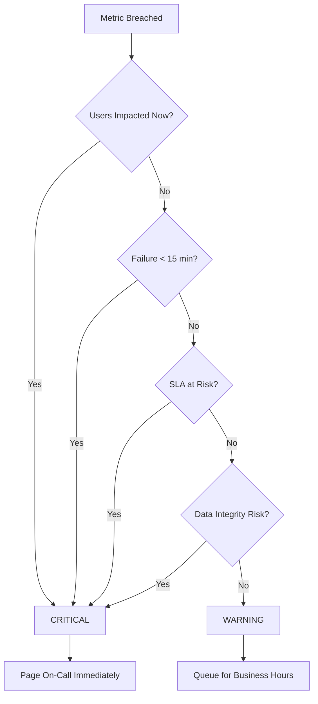
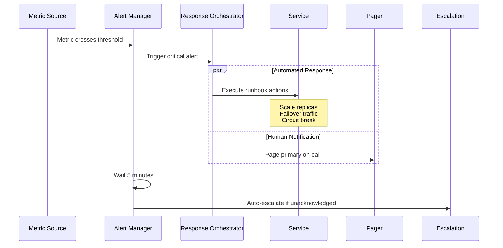
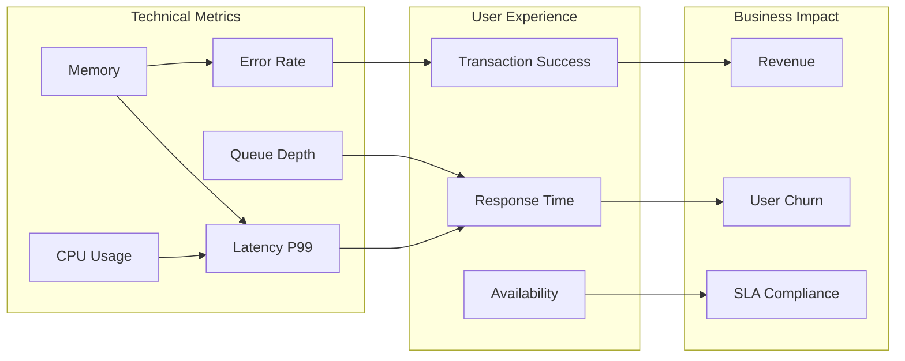
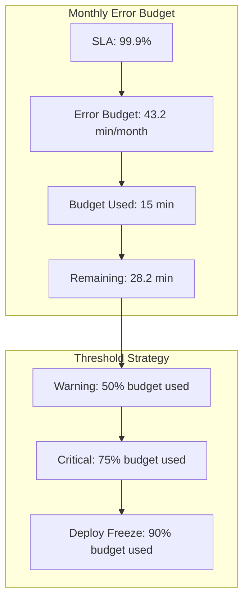
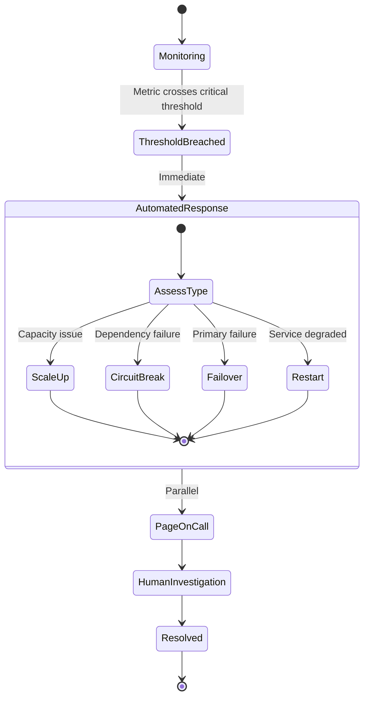
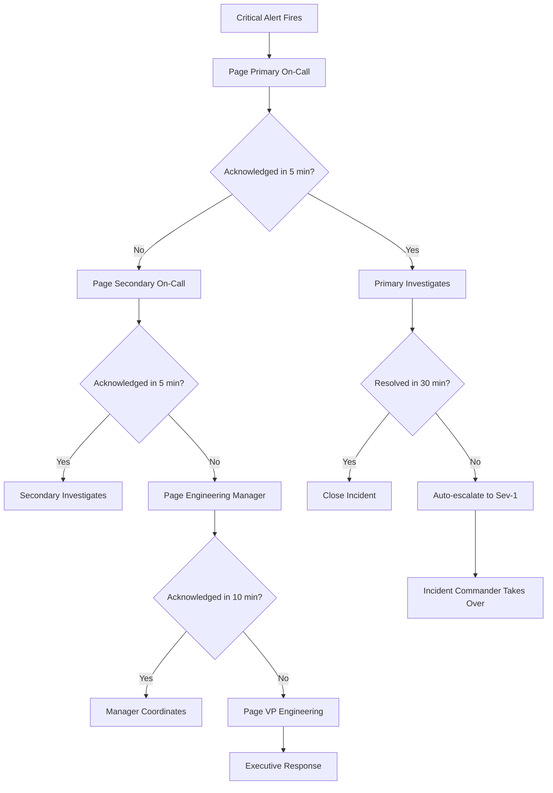

# How to Implement Critical Thresholds

Author: [nawazdhandala](https://github.com/nawazdhandala)

Tags: Monitoring, Thresholds, SRE, Alerting

Description: Learn how to set critical thresholds for immediate action requirements.

---

Critical thresholds are the tripwires that demand immediate human intervention. Unlike warning thresholds that signal emerging problems, critical thresholds indicate conditions that will cause user impact within minutes if left unaddressed. Getting these right means the difference between proactive incident response and explaining outages in postmortems.

## What Makes a Threshold Critical?

A threshold becomes critical when crossing it means one of these conditions exists:

1. **Active user impact**: Users are experiencing degraded service right now
2. **Imminent failure**: System will fail within minutes without intervention
3. **SLA violation**: Continued operation breaches contractual commitments
4. **Data integrity risk**: Risk of data loss or corruption is present

The decision flow for threshold severity looks like this.



## Immediate Action Requirements

Critical thresholds must trigger automated responses. Human reaction time is measured in minutes; systems can respond in seconds. Design your critical alerts to kick off immediate mitigations.

### Automated Response Architecture



Here is a practical implementation of automated response handlers.

```typescript
// critical-alert-handler.ts
import { AlertManager, AlertSeverity } from './alerting';
import { ServiceOrchestrator } from './orchestrator';
import { Pager } from './pager';

interface CriticalThreshold {
  metric: string;
  threshold: number;
  comparison: 'gt' | 'lt' | 'eq';
  duration: string;
  automatedActions: AutomatedAction[];
  escalationMinutes: number;
}

interface AutomatedAction {
  type: 'scale' | 'failover' | 'circuit_break' | 'restart';
  params: Record<string, unknown>;
}

const CRITICAL_THRESHOLDS: CriticalThreshold[] = [
  {
    metric: 'http_error_rate',
    threshold: 0.05, // 5% error rate
    comparison: 'gt',
    duration: '2m',
    automatedActions: [
      { type: 'circuit_break', params: { service: 'payment-gateway' } }
    ],
    escalationMinutes: 5
  },
  {
    metric: 'pod_memory_percent',
    threshold: 95,
    comparison: 'gt',
    duration: '3m',
    automatedActions: [
      { type: 'restart', params: { strategy: 'rolling' } },
      { type: 'scale', params: { replicas: '+2' } }
    ],
    escalationMinutes: 10
  },
  {
    metric: 'request_latency_p99',
    threshold: 5000, // 5 seconds
    comparison: 'gt',
    duration: '5m',
    automatedActions: [
      { type: 'scale', params: { replicas: '+50%' } }
    ],
    escalationMinutes: 15
  }
];

export class CriticalAlertHandler {
  constructor(
    private alertManager: AlertManager,
    private orchestrator: ServiceOrchestrator,
    private pager: Pager
  ) {}

  async handleAlert(alertName: string, currentValue: number): Promise<void> {
    const threshold = CRITICAL_THRESHOLDS.find(t => t.metric === alertName);

    if (!threshold) {
      console.warn(`No threshold config for ${alertName}`);
      return;
    }

    // Execute automated actions immediately
    for (const action of threshold.automatedActions) {
      await this.executeAction(action, alertName);
    }

    // Page on-call
    await this.pager.sendCriticalPage({
      alert: alertName,
      value: currentValue,
      threshold: threshold.threshold,
      automatedActionsExecuted: threshold.automatedActions.map(a => a.type)
    });

    // Schedule escalation
    this.scheduleEscalation(alertName, threshold.escalationMinutes);
  }

  private async executeAction(
    action: AutomatedAction,
    alertName: string
  ): Promise<void> {
    console.log(`Executing ${action.type} for ${alertName}`);

    switch (action.type) {
      case 'scale':
        await this.orchestrator.scaleService(action.params);
        break;
      case 'circuit_break':
        await this.orchestrator.enableCircuitBreaker(action.params);
        break;
      case 'restart':
        await this.orchestrator.rollingRestart(action.params);
        break;
      case 'failover':
        await this.orchestrator.initiateFailover(action.params);
        break;
    }
  }

  private scheduleEscalation(alertName: string, minutes: number): void {
    setTimeout(async () => {
      const isAcknowledged = await this.alertManager.isAcknowledged(alertName);
      if (!isAcknowledged) {
        await this.pager.escalateToSecondary(alertName);
      }
    }, minutes * 60 * 1000);
  }
}
```

## User Impact Correlation

Critical thresholds should correlate directly with user experience metrics. A high CPU alert means nothing if users are happy. A 2% error rate might be catastrophic for a payment system but acceptable for a logging endpoint.

### Mapping Technical Metrics to User Impact



Implement user impact scoring to prioritize alerts.

```typescript
// user-impact-scorer.ts
interface ServiceConfig {
  name: string;
  userFacing: boolean;
  revenueImpactPerMinute: number;
  activeUserPercent: number;
  dependencies: string[];
}

interface ImpactScore {
  score: number;  // 0-100
  classification: 'critical' | 'high' | 'medium' | 'low';
  reasoning: string[];
}

const SERVICE_CONFIGS: Record<string, ServiceConfig> = {
  'checkout-api': {
    name: 'Checkout API',
    userFacing: true,
    revenueImpactPerMinute: 5000,
    activeUserPercent: 15,
    dependencies: ['payment-service', 'inventory-service']
  },
  'search-service': {
    name: 'Search Service',
    userFacing: true,
    revenueImpactPerMinute: 1000,
    activeUserPercent: 40,
    dependencies: ['elasticsearch', 'cache']
  },
  'analytics-worker': {
    name: 'Analytics Worker',
    userFacing: false,
    revenueImpactPerMinute: 0,
    activeUserPercent: 0,
    dependencies: ['kafka', 'clickhouse']
  }
};

export function calculateImpactScore(
  service: string,
  errorRate: number,
  latencyP99Ms: number
): ImpactScore {
  const config = SERVICE_CONFIGS[service];
  const reasoning: string[] = [];

  if (!config) {
    return {
      score: 50,
      classification: 'medium',
      reasoning: ['Unknown service, defaulting to medium impact']
    };
  }

  let score = 0;

  // User-facing services get base score
  if (config.userFacing) {
    score += 30;
    reasoning.push('User-facing service (+30)');
  }

  // Revenue impact factor
  if (config.revenueImpactPerMinute > 1000) {
    score += 25;
    reasoning.push(`High revenue impact: $${config.revenueImpactPerMinute}/min (+25)`);
  } else if (config.revenueImpactPerMinute > 100) {
    score += 15;
    reasoning.push(`Moderate revenue impact: $${config.revenueImpactPerMinute}/min (+15)`);
  }

  // Error rate factor
  if (errorRate > 0.1) {
    score += 30;
    reasoning.push(`Critical error rate: ${(errorRate * 100).toFixed(1)}% (+30)`);
  } else if (errorRate > 0.05) {
    score += 20;
    reasoning.push(`High error rate: ${(errorRate * 100).toFixed(1)}% (+20)`);
  } else if (errorRate > 0.01) {
    score += 10;
    reasoning.push(`Elevated error rate: ${(errorRate * 100).toFixed(1)}% (+10)`);
  }

  // Latency factor
  if (latencyP99Ms > 5000) {
    score += 15;
    reasoning.push(`Severe latency: ${latencyP99Ms}ms p99 (+15)`);
  } else if (latencyP99Ms > 2000) {
    score += 10;
    reasoning.push(`High latency: ${latencyP99Ms}ms p99 (+10)`);
  }

  // Determine classification
  let classification: ImpactScore['classification'];
  if (score >= 70) {
    classification = 'critical';
  } else if (score >= 50) {
    classification = 'high';
  } else if (score >= 30) {
    classification = 'medium';
  } else {
    classification = 'low';
  }

  return { score: Math.min(score, 100), classification, reasoning };
}
```

## SLA-Based Thresholds

Your SLA commitments should directly inform critical thresholds. If you promise 99.9% availability, your thresholds must trigger before you burn through your error budget.

### Error Budget Calculation



Implement SLA-driven threshold management.

```typescript
// sla-threshold-manager.ts
interface SLAConfig {
  target: number;           // e.g., 0.999 for 99.9%
  measurementWindow: number; // in days, typically 30
  services: string[];
}

interface ErrorBudgetStatus {
  slaTarget: number;
  totalBudgetMinutes: number;
  consumedMinutes: number;
  remainingMinutes: number;
  burnRate: number;          // minutes consumed per hour
  projectedExhaustion: Date | null;
  thresholdRecommendation: ThresholdRecommendation;
}

interface ThresholdRecommendation {
  errorRateThreshold: number;
  latencyThresholdMs: number;
  alertSeverity: 'warning' | 'critical';
  reason: string;
}

export class SLAThresholdManager {
  private slaConfig: SLAConfig;

  constructor(config: SLAConfig) {
    this.slaConfig = config;
  }

  calculateErrorBudget(
    downtimeMinutesThisPeriod: number,
    currentHourIndex: number // hours into measurement window
  ): ErrorBudgetStatus {
    const windowMinutes = this.slaConfig.measurementWindow * 24 * 60;
    const allowedDowntimeMinutes = windowMinutes * (1 - this.slaConfig.target);
    const remainingMinutes = allowedDowntimeMinutes - downtimeMinutesThisPeriod;

    // Calculate burn rate (minutes of budget consumed per hour)
    const burnRate = currentHourIndex > 0
      ? downtimeMinutesThisPeriod / currentHourIndex
      : 0;

    // Project when budget will exhaust
    let projectedExhaustion: Date | null = null;
    if (burnRate > 0 && remainingMinutes > 0) {
      const hoursUntilExhaustion = remainingMinutes / burnRate;
      projectedExhaustion = new Date(Date.now() + hoursUntilExhaustion * 60 * 60 * 1000);
    }

    // Determine threshold recommendation based on budget status
    const budgetPercentUsed = (downtimeMinutesThisPeriod / allowedDowntimeMinutes) * 100;
    const recommendation = this.getThresholdRecommendation(budgetPercentUsed, burnRate);

    return {
      slaTarget: this.slaConfig.target,
      totalBudgetMinutes: allowedDowntimeMinutes,
      consumedMinutes: downtimeMinutesThisPeriod,
      remainingMinutes,
      burnRate,
      projectedExhaustion,
      thresholdRecommendation: recommendation
    };
  }

  private getThresholdRecommendation(
    budgetPercentUsed: number,
    burnRate: number
  ): ThresholdRecommendation {
    // Aggressive thresholds when budget is low
    if (budgetPercentUsed >= 75) {
      return {
        errorRateThreshold: 0.001,  // 0.1%
        latencyThresholdMs: 1000,
        alertSeverity: 'critical',
        reason: `Error budget ${budgetPercentUsed.toFixed(1)}% consumed. Tightening thresholds to preserve remaining budget.`
      };
    }

    if (budgetPercentUsed >= 50) {
      return {
        errorRateThreshold: 0.005,  // 0.5%
        latencyThresholdMs: 2000,
        alertSeverity: 'critical',
        reason: `Error budget ${budgetPercentUsed.toFixed(1)}% consumed. Using moderate thresholds.`
      };
    }

    // Fast burn rate warrants tighter thresholds
    if (burnRate > 0.5) {  // More than 30 minutes per hour
      return {
        errorRateThreshold: 0.01,  // 1%
        latencyThresholdMs: 2000,
        alertSeverity: 'critical',
        reason: `High burn rate detected (${burnRate.toFixed(2)} min/hr). Tightening thresholds.`
      };
    }

    // Standard thresholds when budget is healthy
    return {
      errorRateThreshold: 0.05,  // 5%
      latencyThresholdMs: 5000,
      alertSeverity: 'warning',
      reason: 'Budget healthy. Using standard thresholds.'
    };
  }
}

// Usage example
const manager = new SLAThresholdManager({
  target: 0.999,
  measurementWindow: 30,
  services: ['api-gateway', 'checkout-service', 'payment-service']
});

const status = manager.calculateErrorBudget(
  downtimeMinutesThisPeriod: 25,
  currentHourIndex: 360  // 15 days into the month
);

console.log(`Budget status: ${status.remainingMinutes.toFixed(1)} minutes remaining`);
console.log(`Recommendation: ${status.thresholdRecommendation.reason}`);
```

## Automated Responses

Critical thresholds should trigger automated remediation before humans even see the alert. The goal is to buy time, not to solve the problem completely.

### Response Automation Flow



Implement a response orchestrator.

```typescript
// response-orchestrator.ts
import { KubernetesClient } from './k8s-client';
import { CircuitBreakerManager } from './circuit-breaker';
import { TrafficManager } from './traffic-manager';
import { logger } from './logger';

interface ResponseConfig {
  maxScaleMultiplier: number;
  circuitBreakerDuration: number;
  failoverCooldown: number;
}

interface ResponseResult {
  action: string;
  success: boolean;
  details: string;
  timestamp: Date;
}

export class ResponseOrchestrator {
  private k8s: KubernetesClient;
  private circuitBreaker: CircuitBreakerManager;
  private traffic: TrafficManager;
  private config: ResponseConfig;
  private responseHistory: ResponseResult[] = [];

  constructor(
    k8s: KubernetesClient,
    circuitBreaker: CircuitBreakerManager,
    traffic: TrafficManager,
    config: ResponseConfig
  ) {
    this.k8s = k8s;
    this.circuitBreaker = circuitBreaker;
    this.traffic = traffic;
    this.config = config;
  }

  async handleHighLatency(service: string, currentLatencyMs: number): Promise<ResponseResult> {
    logger.info('Handling high latency', { service, currentLatencyMs });

    // Strategy: Scale horizontally to handle load
    const currentReplicas = await this.k8s.getReplicaCount(service);
    const targetReplicas = Math.min(
      currentReplicas * 2,
      currentReplicas * this.config.maxScaleMultiplier
    );

    try {
      await this.k8s.scaleDeployment(service, targetReplicas);

      const result: ResponseResult = {
        action: 'scale_up',
        success: true,
        details: `Scaled ${service} from ${currentReplicas} to ${targetReplicas} replicas`,
        timestamp: new Date()
      };

      this.responseHistory.push(result);
      return result;
    } catch (error) {
      return {
        action: 'scale_up',
        success: false,
        details: `Failed to scale ${service}: ${(error as Error).message}`,
        timestamp: new Date()
      };
    }
  }

  async handleHighErrorRate(
    service: string,
    dependency: string,
    errorRate: number
  ): Promise<ResponseResult> {
    logger.info('Handling high error rate', { service, dependency, errorRate });

    // Strategy: Circuit break the failing dependency
    try {
      await this.circuitBreaker.open(service, dependency, {
        duration: this.config.circuitBreakerDuration,
        fallbackEnabled: true
      });

      return {
        action: 'circuit_break',
        success: true,
        details: `Circuit breaker opened for ${service} -> ${dependency} for ${this.config.circuitBreakerDuration}s`,
        timestamp: new Date()
      };
    } catch (error) {
      return {
        action: 'circuit_break',
        success: false,
        details: `Failed to open circuit breaker: ${(error as Error).message}`,
        timestamp: new Date()
      };
    }
  }

  async handleServiceDown(service: string): Promise<ResponseResult> {
    logger.info('Handling service down', { service });

    // Check if we recently attempted failover
    const recentFailover = this.responseHistory.find(
      r => r.action === 'failover' &&
           r.timestamp > new Date(Date.now() - this.config.failoverCooldown * 1000)
    );

    if (recentFailover) {
      return {
        action: 'failover_skipped',
        success: false,
        details: 'Failover skipped due to cooldown period',
        timestamp: new Date()
      };
    }

    try {
      // Attempt rolling restart first
      await this.k8s.rollingRestart(service);

      // If restart doesn't help within 2 minutes, failover
      const healthCheckDelay = 120000;
      setTimeout(async () => {
        const isHealthy = await this.k8s.checkServiceHealth(service);
        if (!isHealthy) {
          await this.traffic.failoverToSecondary(service);
          logger.warn('Initiated failover after restart failed', { service });
        }
      }, healthCheckDelay);

      return {
        action: 'rolling_restart',
        success: true,
        details: `Initiated rolling restart for ${service}`,
        timestamp: new Date()
      };
    } catch (error) {
      return {
        action: 'rolling_restart',
        success: false,
        details: `Failed to restart ${service}: ${(error as Error).message}`,
        timestamp: new Date()
      };
    }
  }

  async handleMemoryPressure(service: string, memoryPercent: number): Promise<ResponseResult> {
    logger.info('Handling memory pressure', { service, memoryPercent });

    try {
      // Increase memory limits and trigger restart
      const currentLimits = await this.k8s.getResourceLimits(service);
      const newMemoryLimit = Math.ceil(currentLimits.memory * 1.5);

      await this.k8s.updateResourceLimits(service, {
        memory: newMemoryLimit,
        cpu: currentLimits.cpu
      });

      await this.k8s.rollingRestart(service);

      return {
        action: 'increase_memory',
        success: true,
        details: `Increased memory limit to ${newMemoryLimit}Mi and restarted ${service}`,
        timestamp: new Date()
      };
    } catch (error) {
      return {
        action: 'increase_memory',
        success: false,
        details: `Failed to adjust memory for ${service}: ${(error as Error).message}`,
        timestamp: new Date()
      };
    }
  }
}
```

## Escalation Triggers

Critical alerts that go unacknowledged must escalate automatically. Define clear escalation paths and timing.

### Escalation Path Design



Implement escalation logic.

```typescript
// escalation-manager.ts
interface EscalationLevel {
  name: string;
  contacts: string[];
  waitMinutes: number;
  notificationMethod: 'page' | 'sms' | 'call' | 'all';
}

interface EscalationPolicy {
  name: string;
  levels: EscalationLevel[];
  autoResolveMinutes: number;
}

interface ActiveIncident {
  id: string;
  alertName: string;
  startedAt: Date;
  currentLevel: number;
  acknowledgedBy: string | null;
  acknowledgedAt: Date | null;
}

const ESCALATION_POLICIES: Record<string, EscalationPolicy> = {
  critical: {
    name: 'Critical Service Alert',
    levels: [
      {
        name: 'Primary On-Call',
        contacts: ['primary-oncall@company.com'],
        waitMinutes: 5,
        notificationMethod: 'page'
      },
      {
        name: 'Secondary On-Call',
        contacts: ['secondary-oncall@company.com'],
        waitMinutes: 5,
        notificationMethod: 'page'
      },
      {
        name: 'Engineering Manager',
        contacts: ['eng-manager@company.com'],
        waitMinutes: 10,
        notificationMethod: 'call'
      },
      {
        name: 'VP Engineering',
        contacts: ['vp-eng@company.com'],
        waitMinutes: 15,
        notificationMethod: 'all'
      }
    ],
    autoResolveMinutes: 120
  }
};

export class EscalationManager {
  private activeIncidents: Map<string, ActiveIncident> = new Map();
  private pager: PagerClient;

  constructor(pager: PagerClient) {
    this.pager = pager;
  }

  async startEscalation(
    incidentId: string,
    alertName: string,
    policyName: string
  ): Promise<void> {
    const policy = ESCALATION_POLICIES[policyName];
    if (!policy) {
      throw new Error(`Unknown escalation policy: ${policyName}`);
    }

    const incident: ActiveIncident = {
      id: incidentId,
      alertName,
      startedAt: new Date(),
      currentLevel: 0,
      acknowledgedBy: null,
      acknowledgedAt: null
    };

    this.activeIncidents.set(incidentId, incident);

    // Start escalation chain
    await this.escalateToLevel(incidentId, policy, 0);
  }

  private async escalateToLevel(
    incidentId: string,
    policy: EscalationPolicy,
    level: number
  ): Promise<void> {
    const incident = this.activeIncidents.get(incidentId);
    if (!incident || incident.acknowledgedBy) {
      return; // Incident resolved or acknowledged
    }

    if (level >= policy.levels.length) {
      console.error(`Escalation exhausted for incident ${incidentId}`);
      return;
    }

    const escalationLevel = policy.levels[level];
    incident.currentLevel = level;

    // Send notifications
    for (const contact of escalationLevel.contacts) {
      await this.pager.notify({
        contact,
        method: escalationLevel.notificationMethod,
        message: `[${policy.name}] ${incident.alertName} - Escalation Level: ${escalationLevel.name}`,
        incidentId
      });
    }

    // Schedule next escalation
    setTimeout(() => {
      this.escalateToLevel(incidentId, policy, level + 1);
    }, escalationLevel.waitMinutes * 60 * 1000);
  }

  async acknowledge(incidentId: string, responder: string): Promise<boolean> {
    const incident = this.activeIncidents.get(incidentId);
    if (!incident) {
      return false;
    }

    incident.acknowledgedBy = responder;
    incident.acknowledgedAt = new Date();

    console.log(`Incident ${incidentId} acknowledged by ${responder}`);
    return true;
  }

  async resolve(incidentId: string): Promise<void> {
    this.activeIncidents.delete(incidentId);
    console.log(`Incident ${incidentId} resolved`);
  }

  getIncidentStatus(incidentId: string): ActiveIncident | undefined {
    return this.activeIncidents.get(incidentId);
  }
}

interface PagerClient {
  notify(params: {
    contact: string;
    method: string;
    message: string;
    incidentId: string;
  }): Promise<void>;
}
```

## Putting It All Together

Here is a complete example of a critical threshold monitoring system.

```yaml
# prometheus-rules.yaml
groups:
  - name: critical-thresholds
    rules:
      # Error rate critical threshold
      - alert: HighErrorRateCritical
        expr: |
          sum(rate(http_requests_total{status=~"5.."}[5m])) by (service)
          /
          sum(rate(http_requests_total[5m])) by (service)
          > 0.05
        for: 2m
        labels:
          severity: critical
          impact: user_facing
        annotations:
          summary: "Critical error rate on {{ $labels.service }}"
          description: "Error rate is {{ $value | humanizePercentage }}"
          runbook_url: "https://wiki.company.com/runbooks/high-error-rate"
          automated_action: "circuit_breaker"

      # Latency critical threshold
      - alert: HighLatencyCritical
        expr: |
          histogram_quantile(0.99,
            sum(rate(http_request_duration_seconds_bucket[5m])) by (service, le)
          ) > 5
        for: 3m
        labels:
          severity: critical
          impact: user_facing
        annotations:
          summary: "Critical latency on {{ $labels.service }}"
          description: "P99 latency is {{ $value | humanizeDuration }}"
          runbook_url: "https://wiki.company.com/runbooks/high-latency"
          automated_action: "scale_up"

      # Memory critical threshold
      - alert: MemoryPressureCritical
        expr: |
          container_memory_usage_bytes / container_spec_memory_limit_bytes
          > 0.95
        for: 3m
        labels:
          severity: critical
          impact: service_stability
        annotations:
          summary: "Critical memory pressure on {{ $labels.pod }}"
          description: "Memory usage at {{ $value | humanizePercentage }}"
          automated_action: "restart_and_scale"

      # SLA burn rate critical threshold
      - alert: ErrorBudgetBurnRateCritical
        expr: |
          slo:error_budget_remaining:ratio < 0.25
          and
          slo:burn_rate:1h > 0.5
        for: 5m
        labels:
          severity: critical
          impact: sla_violation
        annotations:
          summary: "Error budget critically low for {{ $labels.slo }}"
          description: "Only {{ $value | humanizePercentage }} budget remaining"
          automated_action: "deploy_freeze"
```

## Best Practices

**Set thresholds based on data, not intuition**: Analyze historical patterns to find the point where metrics correlate with user complaints. A threshold that never fires is too high; one that fires constantly is too low.

**Implement hysteresis**: Add a recovery threshold lower than the alert threshold to prevent flapping. If critical fires at 95%, consider clearing at 85%.

**Document automated responses**: Every automated action should have a corresponding runbook explaining what it does and when it might make things worse.

**Test escalation paths monthly**: Run tabletop exercises to verify contacts are current and notifications work.

**Review thresholds quarterly**: Business changes, traffic patterns evolve, and systems scale. Yesterday's critical threshold might be tomorrow's noise.

---

Critical thresholds are your production safety net. Set them thoughtfully based on user impact and SLA requirements. Automate immediate responses to buy time for human investigation. Ensure escalation paths are clear and tested. When done right, critical alerts become rare, actionable, and respected rather than ignored noise.
