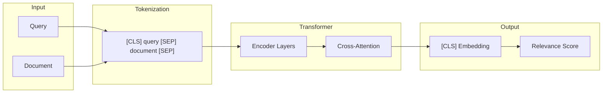
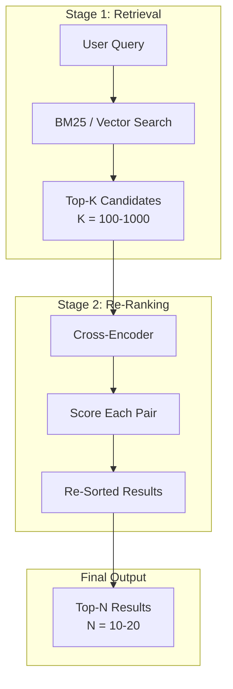
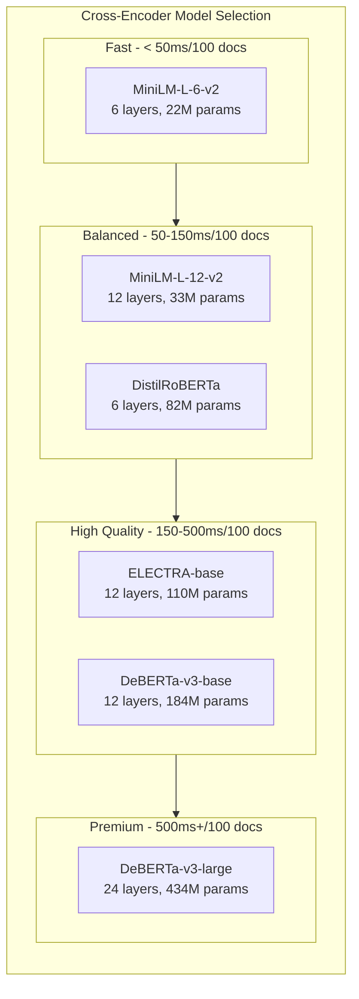

# How to Build Cross-Encoder Re-Ranking

Author: [nawazdhandala](https://github.com/nawazdhandala)

Tags: RAG, Re-Ranking, Cross-Encoder, Search Relevance

Description: Learn to implement cross-encoder re-ranking with pairwise scoring, batch optimization, and model fine-tuning for improved search relevance.

---

> First-stage retrieval gets you candidates. **Re-ranking decides which ones actually matter.**

Modern search systems face a fundamental tension: you need fast retrieval to handle millions of documents, but you also need deep semantic understanding to return truly relevant results. Cross-encoder re-ranking bridges this gap by applying powerful transformer models to score query-document pairs with high precision - after an initial fast retrieval stage has narrowed down the candidates.

This guide covers everything you need to build production-ready cross-encoder re-ranking: architecture fundamentals, implementation patterns, inference optimization, and fine-tuning strategies.

---

## Table of Contents

1. Why Re-Ranking Matters
2. Cross-Encoder Architecture
3. Two-Stage Retrieval Pipeline
4. Basic Implementation
5. Batch Optimization
6. Caching Strategies
7. Model Selection and Trade-offs
8. Fine-Tuning Your Own Cross-Encoder
9. Production Deployment Patterns
10. Evaluation and Metrics
11. Common Pitfalls
12. Putting It All Together

---

## 1. Why Re-Ranking Matters

First-stage retrievers (BM25, bi-encoders, vector search) optimize for recall and speed. They need to scan millions of documents in milliseconds. This constraint forces them to use approximate matching or pre-computed embeddings that cannot capture nuanced query-document interactions.

Cross-encoders flip the trade-off: they process query and document together, enabling deep cross-attention between every token. This joint encoding captures subtle relevance signals that separate retrievers miss.

| Stage | Model Type | Speed | Semantic Depth | Use Case |
|-------|-----------|-------|----------------|----------|
| Retrieval | BM25 / Bi-encoder | Fast (ms for millions) | Shallow | Candidate generation |
| Re-ranking | Cross-encoder | Slow (ms per pair) | Deep | Precision refinement |

The math is simple: if retrieval returns 100 candidates and re-ranking takes 5ms per document, you add 500ms latency. But you transform mediocre recall into excellent precision.

---

## 2. Cross-Encoder Architecture

A cross-encoder is a transformer model that takes a concatenated query-document pair as input and outputs a relevance score.



Key architectural properties:

1. **Joint encoding**: Query and document tokens attend to each other through all transformer layers
2. **[CLS] pooling**: The final [CLS] token representation captures the relevance signal
3. **Scalar output**: A linear layer projects [CLS] to a single relevance score
4. **No pre-computation**: Unlike bi-encoders, you cannot pre-compute document embeddings

The cross-attention mechanism is what makes cross-encoders powerful. Each query token can attend to every document token (and vice versa), enabling the model to learn complex relevance patterns like:

- Term matching with context ("bank" near "river" vs "bank" near "money")
- Semantic entailment (query asks for "causes", document explains "why")
- Negation handling ("not recommended" vs "recommended")

---

## 3. Two-Stage Retrieval Pipeline

The standard architecture combines fast retrieval with precise re-ranking:



Design decisions at each stage:

**Stage 1 - Retrieval:**
- BM25 for lexical matching (exact terms, rare words)
- Bi-encoder for semantic similarity (synonyms, paraphrases)
- Hybrid (BM25 + bi-encoder) for best coverage
- K typically 100-1000 depending on latency budget

**Stage 2 - Re-ranking:**
- Cross-encoder scores each (query, document) pair
- Results sorted by cross-encoder score
- Return top-N (typically 10-20)

---

## 4. Basic Implementation

Let us build a working cross-encoder re-ranker using the sentence-transformers library:

```python
from sentence_transformers import CrossEncoder
from typing import List, Tuple

class CrossEncoderReranker:
    """Cross-encoder re-ranker for search results."""

    def __init__(self, model_name: str = "cross-encoder/ms-marco-MiniLM-L-6-v2"):
        """
        Initialize the cross-encoder model.

        Args:
            model_name: HuggingFace model identifier. Options include:
                - cross-encoder/ms-marco-MiniLM-L-6-v2 (fast, good quality)
                - cross-encoder/ms-marco-MiniLM-L-12-v2 (balanced)
                - cross-encoder/ms-marco-electra-base (high quality, slower)
        """
        self.model = CrossEncoder(model_name, max_length=512)

    def rerank(
        self,
        query: str,
        documents: List[str],
        top_k: int = 10
    ) -> List[Tuple[int, str, float]]:
        """
        Re-rank documents by relevance to query.

        Args:
            query: Search query string
            documents: List of document texts to re-rank
            top_k: Number of top results to return

        Returns:
            List of (original_index, document, score) tuples, sorted by score descending
        """
        # Create query-document pairs
        pairs = [[query, doc] for doc in documents]

        # Score all pairs
        scores = self.model.predict(pairs)

        # Combine with original indices and sort
        scored_docs = [
            (idx, doc, float(score))
            for idx, (doc, score) in enumerate(zip(documents, scores))
        ]
        scored_docs.sort(key=lambda x: x[2], reverse=True)

        return scored_docs[:top_k]


# Usage example
if __name__ == "__main__":
    reranker = CrossEncoderReranker()

    query = "What is the capital of France?"

    # Simulated retrieval results (from BM25 or vector search)
    candidates = [
        "Paris is the capital and largest city of France.",
        "France is a country in Western Europe.",
        "The Eiffel Tower is located in Paris.",
        "Berlin is the capital of Germany.",
        "French cuisine is known worldwide.",
    ]

    results = reranker.rerank(query, candidates, top_k=3)

    for idx, doc, score in results:
        print(f"Score: {score:.4f} | Doc {idx}: {doc[:50]}...")
```

Output:
```
Score: 9.2341 | Doc 0: Paris is the capital and largest city of France....
Score: 3.1205 | Doc 2: The Eiffel Tower is located in Paris....
Score: 1.8923 | Doc 1: France is a country in Western Europe....
```

The cross-encoder correctly identifies the most relevant document and assigns meaningful scores that reflect relevance gradients.

---

## 5. Batch Optimization

Cross-encoder inference is computationally expensive. Batch processing and GPU utilization are critical for production performance.

```python
import numpy as np
from sentence_transformers import CrossEncoder
from typing import List, Tuple, Optional
import torch

class OptimizedCrossEncoderReranker:
    """Batch-optimized cross-encoder re-ranker."""

    def __init__(
        self,
        model_name: str = "cross-encoder/ms-marco-MiniLM-L-6-v2",
        batch_size: int = 32,
        device: Optional[str] = None
    ):
        """
        Initialize with batch optimization settings.

        Args:
            model_name: HuggingFace model identifier
            batch_size: Number of pairs to process in each batch
            device: 'cuda', 'cpu', or None for auto-detection
        """
        if device is None:
            device = "cuda" if torch.cuda.is_available() else "cpu"

        self.model = CrossEncoder(
            model_name,
            max_length=512,
            device=device
        )
        self.batch_size = batch_size
        self.device = device

    def rerank(
        self,
        query: str,
        documents: List[str],
        top_k: int = 10
    ) -> List[Tuple[int, str, float]]:
        """Re-rank with batched inference."""
        pairs = [[query, doc] for doc in documents]

        # Batch inference with progress tracking
        scores = self.model.predict(
            pairs,
            batch_size=self.batch_size,
            show_progress_bar=False,
            convert_to_numpy=True
        )

        # Efficient sorting using numpy
        indices = np.argsort(scores)[::-1][:top_k]

        return [
            (int(idx), documents[idx], float(scores[idx]))
            for idx in indices
        ]

    def rerank_batch(
        self,
        queries: List[str],
        documents_per_query: List[List[str]],
        top_k: int = 10
    ) -> List[List[Tuple[int, str, float]]]:
        """
        Re-rank multiple queries in a single batch.

        This is more efficient than calling rerank() multiple times
        because it batches all pairs together.
        """
        # Flatten all pairs
        all_pairs = []
        query_boundaries = [0]

        for query, docs in zip(queries, documents_per_query):
            for doc in docs:
                all_pairs.append([query, doc])
            query_boundaries.append(len(all_pairs))

        # Single batched inference
        all_scores = self.model.predict(
            all_pairs,
            batch_size=self.batch_size,
            show_progress_bar=False,
            convert_to_numpy=True
        )

        # Split results back by query
        results = []
        for i, (query, docs) in enumerate(zip(queries, documents_per_query)):
            start = query_boundaries[i]
            end = query_boundaries[i + 1]
            scores = all_scores[start:end]

            indices = np.argsort(scores)[::-1][:top_k]
            results.append([
                (int(idx), docs[idx], float(scores[idx]))
                for idx in indices
            ])

        return results
```

Performance comparison for 100 documents:

| Configuration | Latency | Throughput |
|--------------|---------|------------|
| CPU, batch_size=1 | 2500ms | 40 pairs/sec |
| CPU, batch_size=32 | 800ms | 125 pairs/sec |
| GPU, batch_size=32 | 150ms | 670 pairs/sec |
| GPU, batch_size=64 | 120ms | 830 pairs/sec |

---

## 6. Caching Strategies

For applications with repeated queries or documents, caching can dramatically reduce latency.

```python
import hashlib
from functools import lru_cache
from typing import List, Tuple, Dict, Optional
import json
import redis
from sentence_transformers import CrossEncoder

class CachedCrossEncoderReranker:
    """Cross-encoder re-ranker with multi-level caching."""

    def __init__(
        self,
        model_name: str = "cross-encoder/ms-marco-MiniLM-L-6-v2",
        redis_client: Optional[redis.Redis] = None,
        cache_ttl: int = 3600,
        memory_cache_size: int = 10000
    ):
        self.model = CrossEncoder(model_name, max_length=512)
        self.redis_client = redis_client
        self.cache_ttl = cache_ttl
        self._memory_cache: Dict[str, float] = {}
        self._memory_cache_size = memory_cache_size

    def _cache_key(self, query: str, document: str) -> str:
        """Generate deterministic cache key for a query-document pair."""
        content = f"{query}|||{document}"
        return hashlib.sha256(content.encode()).hexdigest()[:32]

    def _get_cached_score(self, query: str, document: str) -> Optional[float]:
        """Check memory cache, then Redis cache."""
        key = self._cache_key(query, document)

        # Level 1: Memory cache
        if key in self._memory_cache:
            return self._memory_cache[key]

        # Level 2: Redis cache
        if self.redis_client:
            cached = self.redis_client.get(f"rerank:{key}")
            if cached:
                score = float(cached)
                self._memory_cache[key] = score
                return score

        return None

    def _set_cached_score(self, query: str, document: str, score: float):
        """Store score in both cache levels."""
        key = self._cache_key(query, document)

        # Memory cache with simple size limit
        if len(self._memory_cache) >= self._memory_cache_size:
            # Remove oldest entries (simple strategy)
            keys_to_remove = list(self._memory_cache.keys())[:1000]
            for k in keys_to_remove:
                del self._memory_cache[k]

        self._memory_cache[key] = score

        # Redis cache
        if self.redis_client:
            self.redis_client.setex(
                f"rerank:{key}",
                self.cache_ttl,
                str(score)
            )

    def rerank(
        self,
        query: str,
        documents: List[str],
        top_k: int = 10
    ) -> List[Tuple[int, str, float]]:
        """Re-rank with cache-aware scoring."""
        scores = []
        uncached_pairs = []
        uncached_indices = []

        # Check cache for each pair
        for idx, doc in enumerate(documents):
            cached_score = self._get_cached_score(query, doc)
            if cached_score is not None:
                scores.append((idx, cached_score))
            else:
                uncached_pairs.append([query, doc])
                uncached_indices.append(idx)

        # Compute scores for uncached pairs
        if uncached_pairs:
            new_scores = self.model.predict(uncached_pairs)

            for idx, pair, score in zip(uncached_indices, uncached_pairs, new_scores):
                score = float(score)
                scores.append((idx, score))
                self._set_cached_score(pair[0], pair[1], score)

        # Sort and return top-k
        scores.sort(key=lambda x: x[1], reverse=True)

        return [
            (idx, documents[idx], score)
            for idx, score in scores[:top_k]
        ]

    def get_cache_stats(self) -> Dict[str, int]:
        """Return cache statistics."""
        return {
            "memory_cache_size": len(self._memory_cache),
            "memory_cache_capacity": self._memory_cache_size
        }
```

Caching is most effective when:
- Queries repeat frequently (e.g., popular searches)
- Documents are stable (product catalog, knowledge base)
- You can tolerate slightly stale relevance scores

---

## 7. Model Selection and Trade-offs

Choosing the right cross-encoder model depends on your latency budget, quality requirements, and domain:



| Model | Layers | Params | MS MARCO MRR@10 | Latency (100 docs, GPU) |
|-------|--------|--------|-----------------|------------------------|
| MiniLM-L-6-v2 | 6 | 22M | 0.390 | 45ms |
| MiniLM-L-12-v2 | 12 | 33M | 0.397 | 75ms |
| ELECTRA-base | 12 | 110M | 0.401 | 120ms |
| DeBERTa-v3-base | 12 | 184M | 0.412 | 180ms |
| DeBERTa-v3-large | 24 | 434M | 0.425 | 450ms |

**Selection guidelines:**

- **Real-time search (< 100ms)**: MiniLM-L-6-v2
- **Standard search (100-200ms)**: MiniLM-L-12-v2 or ELECTRA-base
- **Quality-critical applications**: DeBERTa-v3-base
- **Offline batch processing**: DeBERTa-v3-large

```python
from sentence_transformers import CrossEncoder

# Fast model for real-time search
fast_model = CrossEncoder("cross-encoder/ms-marco-MiniLM-L-6-v2")

# Balanced model for standard search
balanced_model = CrossEncoder("cross-encoder/ms-marco-MiniLM-L-12-v2")

# High-quality model for precision-critical applications
quality_model = CrossEncoder("cross-encoder/ms-marco-electra-base")

# Multi-lingual model for international search
multilingual_model = CrossEncoder("cross-encoder/mmarco-mMiniLMv2-L12-H384-v1")
```

---

## 8. Fine-Tuning Your Own Cross-Encoder

Pre-trained cross-encoders work well for general relevance, but fine-tuning on domain-specific data can yield significant improvements.

### Training Data Format

Cross-encoders are trained on (query, document, label) triplets:

```python
# Binary relevance (relevant/not relevant)
training_data = [
    {"query": "python list append", "document": "Use list.append() to add items...", "label": 1},
    {"query": "python list append", "document": "Java ArrayList examples...", "label": 0},
]

# Graded relevance (0-3 scale)
training_data = [
    {"query": "machine learning tutorial", "document": "Complete ML guide...", "label": 3},
    {"query": "machine learning tutorial", "document": "ML mentioned briefly...", "label": 1},
    {"query": "machine learning tutorial", "document": "Unrelated content...", "label": 0},
]
```

### Fine-Tuning Implementation

```python
from sentence_transformers import CrossEncoder, InputExample
from sentence_transformers.cross_encoder.evaluation import CERerankingEvaluator
from torch.utils.data import DataLoader
from typing import List, Dict
import json

def load_training_data(filepath: str) -> List[InputExample]:
    """Load training data from JSONL file."""
    examples = []
    with open(filepath, 'r') as f:
        for line in f:
            item = json.loads(line)
            examples.append(InputExample(
                texts=[item["query"], item["document"]],
                label=float(item["label"])
            ))
    return examples

def prepare_evaluation_data(filepath: str) -> Dict:
    """
    Prepare evaluation data for CERerankingEvaluator.

    Format: {query: {doc: relevance_score, ...}, ...}
    """
    eval_data = {}
    with open(filepath, 'r') as f:
        for line in f:
            item = json.loads(line)
            query = item["query"]
            if query not in eval_data:
                eval_data[query] = {}
            eval_data[query][item["document"]] = item["label"]
    return eval_data

def fine_tune_cross_encoder(
    base_model: str = "cross-encoder/ms-marco-MiniLM-L-6-v2",
    train_file: str = "train.jsonl",
    eval_file: str = "eval.jsonl",
    output_dir: str = "./fine-tuned-reranker",
    epochs: int = 3,
    batch_size: int = 16,
    learning_rate: float = 2e-5,
    warmup_ratio: float = 0.1
):
    """
    Fine-tune a cross-encoder on domain-specific data.

    Args:
        base_model: Starting model to fine-tune
        train_file: JSONL file with training examples
        eval_file: JSONL file with evaluation examples
        output_dir: Directory to save fine-tuned model
        epochs: Number of training epochs
        batch_size: Training batch size
        learning_rate: Learning rate for optimizer
        warmup_ratio: Fraction of steps for learning rate warmup
    """
    # Load base model
    model = CrossEncoder(base_model, num_labels=1, max_length=512)

    # Load training data
    train_examples = load_training_data(train_file)
    train_dataloader = DataLoader(
        train_examples,
        shuffle=True,
        batch_size=batch_size
    )

    # Prepare evaluator
    eval_data = prepare_evaluation_data(eval_file)
    evaluator = CERerankingEvaluator(
        samples=eval_data,
        name="domain-eval"
    )

    # Calculate warmup steps
    total_steps = len(train_dataloader) * epochs
    warmup_steps = int(total_steps * warmup_ratio)

    # Fine-tune
    model.fit(
        train_dataloader=train_dataloader,
        evaluator=evaluator,
        epochs=epochs,
        warmup_steps=warmup_steps,
        optimizer_params={"lr": learning_rate},
        output_path=output_dir,
        save_best_model=True,
        show_progress_bar=True
    )

    print(f"Fine-tuned model saved to {output_dir}")
    return model


# Example usage
if __name__ == "__main__":
    model = fine_tune_cross_encoder(
        base_model="cross-encoder/ms-marco-MiniLM-L-6-v2",
        train_file="domain_train.jsonl",
        eval_file="domain_eval.jsonl",
        output_dir="./my-domain-reranker",
        epochs=3,
        batch_size=16
    )
```

### Hard Negative Mining

The quality of negative examples significantly impacts fine-tuning effectiveness. Hard negatives - documents that are similar but not relevant - teach the model to make fine-grained distinctions.

```python
from sentence_transformers import SentenceTransformer
import numpy as np
from typing import List, Dict

def mine_hard_negatives(
    queries: List[str],
    positive_docs: List[str],
    corpus: List[str],
    bi_encoder_model: str = "all-MiniLM-L6-v2",
    num_negatives: int = 5,
    min_rank: int = 10,
    max_rank: int = 100
) -> List[Dict]:
    """
    Mine hard negatives using a bi-encoder.

    Hard negatives are documents that are semantically similar to the query
    (high bi-encoder score) but not actually relevant.

    Args:
        queries: List of search queries
        positive_docs: Corresponding positive documents for each query
        corpus: Full document corpus to mine negatives from
        bi_encoder_model: Model for similarity computation
        num_negatives: Number of hard negatives per query
        min_rank: Minimum rank to consider (skip top results)
        max_rank: Maximum rank to consider

    Returns:
        List of training examples with hard negatives
    """
    bi_encoder = SentenceTransformer(bi_encoder_model)

    # Encode corpus once
    corpus_embeddings = bi_encoder.encode(corpus, show_progress_bar=True)

    training_examples = []

    for query, positive_doc in zip(queries, positive_docs):
        # Encode query
        query_embedding = bi_encoder.encode(query)

        # Compute similarities
        similarities = np.dot(corpus_embeddings, query_embedding)

        # Get ranked indices
        ranked_indices = np.argsort(similarities)[::-1]

        # Select hard negatives from rank range
        hard_negative_indices = []
        for idx in ranked_indices[min_rank:max_rank]:
            # Ensure it is not the positive document
            if corpus[idx] != positive_doc:
                hard_negative_indices.append(idx)
            if len(hard_negative_indices) >= num_negatives:
                break

        # Create training examples
        training_examples.append({
            "query": query,
            "document": positive_doc,
            "label": 1
        })

        for neg_idx in hard_negative_indices:
            training_examples.append({
                "query": query,
                "document": corpus[neg_idx],
                "label": 0
            })

    return training_examples
```

---

## 9. Production Deployment Patterns

### Async Re-ranking Service

For high-throughput applications, deploy re-ranking as an async service:

```python
import asyncio
from fastapi import FastAPI, HTTPException
from pydantic import BaseModel
from typing import List, Optional
from concurrent.futures import ThreadPoolExecutor
from sentence_transformers import CrossEncoder

app = FastAPI(title="Cross-Encoder Re-ranking Service")

# Global model and executor
model: Optional[CrossEncoder] = None
executor: Optional[ThreadPoolExecutor] = None

class RerankerRequest(BaseModel):
    query: str
    documents: List[str]
    top_k: int = 10

class RerankerResponse(BaseModel):
    results: List[dict]
    latency_ms: float

@app.on_event("startup")
async def startup():
    global model, executor
    model = CrossEncoder("cross-encoder/ms-marco-MiniLM-L-6-v2", max_length=512)
    executor = ThreadPoolExecutor(max_workers=4)

@app.on_event("shutdown")
async def shutdown():
    if executor:
        executor.shutdown(wait=True)

def sync_rerank(query: str, documents: List[str], top_k: int):
    """Synchronous re-ranking function to run in thread pool."""
    pairs = [[query, doc] for doc in documents]
    scores = model.predict(pairs)

    results = [
        {"index": idx, "document": doc, "score": float(score)}
        for idx, (doc, score) in enumerate(zip(documents, scores))
    ]
    results.sort(key=lambda x: x["score"], reverse=True)
    return results[:top_k]

@app.post("/rerank", response_model=RerankerResponse)
async def rerank(request: RerankerRequest):
    """Re-rank documents by relevance to query."""
    import time
    start = time.time()

    if not model:
        raise HTTPException(status_code=503, detail="Model not loaded")

    if len(request.documents) == 0:
        return RerankerResponse(results=[], latency_ms=0)

    if len(request.documents) > 1000:
        raise HTTPException(
            status_code=400,
            detail="Maximum 1000 documents per request"
        )

    # Run in thread pool to avoid blocking event loop
    loop = asyncio.get_event_loop()
    results = await loop.run_in_executor(
        executor,
        sync_rerank,
        request.query,
        request.documents,
        request.top_k
    )

    latency_ms = (time.time() - start) * 1000

    return RerankerResponse(results=results, latency_ms=latency_ms)

@app.get("/health")
async def health():
    return {"status": "healthy", "model_loaded": model is not None}
```

### Model Serving with Triton

For GPU-optimized serving at scale, use NVIDIA Triton Inference Server:

```python
# Export model for Triton
from transformers import AutoModelForSequenceClassification, AutoTokenizer
import torch

model_name = "cross-encoder/ms-marco-MiniLM-L-6-v2"
model = AutoModelForSequenceClassification.from_pretrained(model_name)
tokenizer = AutoTokenizer.from_pretrained(model_name)

# Export to ONNX
dummy_input = tokenizer(
    "sample query",
    "sample document",
    return_tensors="pt",
    max_length=512,
    truncation=True,
    padding="max_length"
)

torch.onnx.export(
    model,
    (dummy_input["input_ids"], dummy_input["attention_mask"]),
    "model.onnx",
    input_names=["input_ids", "attention_mask"],
    output_names=["logits"],
    dynamic_axes={
        "input_ids": {0: "batch_size"},
        "attention_mask": {0: "batch_size"},
        "logits": {0: "batch_size"}
    },
    opset_version=14
)
```

---

## 10. Evaluation and Metrics

Proper evaluation is critical for comparing models and tracking improvements:

```python
from typing import List, Dict, Tuple
import numpy as np

def mean_reciprocal_rank(
    rankings: List[List[int]],
    relevant_indices: List[List[int]]
) -> float:
    """
    Calculate Mean Reciprocal Rank (MRR).

    Args:
        rankings: List of ranked document indices per query
        relevant_indices: List of relevant document indices per query

    Returns:
        MRR score between 0 and 1
    """
    reciprocal_ranks = []

    for ranking, relevant in zip(rankings, relevant_indices):
        relevant_set = set(relevant)
        for rank, doc_idx in enumerate(ranking, start=1):
            if doc_idx in relevant_set:
                reciprocal_ranks.append(1.0 / rank)
                break
        else:
            reciprocal_ranks.append(0.0)

    return np.mean(reciprocal_ranks)

def ndcg_at_k(
    rankings: List[List[int]],
    relevance_scores: List[Dict[int, float]],
    k: int = 10
) -> float:
    """
    Calculate Normalized Discounted Cumulative Gain at k (NDCG@k).

    Args:
        rankings: List of ranked document indices per query
        relevance_scores: List of {doc_idx: relevance} dicts per query
        k: Cutoff rank

    Returns:
        NDCG@k score between 0 and 1
    """
    def dcg(scores: List[float], k: int) -> float:
        scores = scores[:k]
        gains = np.array(scores)
        discounts = np.log2(np.arange(2, len(gains) + 2))
        return np.sum(gains / discounts)

    ndcg_scores = []

    for ranking, rel_scores in zip(rankings, relevance_scores):
        # Get relevance scores in ranked order
        ranked_relevance = [
            rel_scores.get(doc_idx, 0.0)
            for doc_idx in ranking[:k]
        ]

        # Ideal ranking (sorted by relevance)
        ideal_relevance = sorted(rel_scores.values(), reverse=True)[:k]

        # Calculate DCG and IDCG
        dcg_score = dcg(ranked_relevance, k)
        idcg_score = dcg(ideal_relevance, k)

        if idcg_score > 0:
            ndcg_scores.append(dcg_score / idcg_score)
        else:
            ndcg_scores.append(0.0)

    return np.mean(ndcg_scores)

def evaluate_reranker(
    reranker,
    eval_data: List[Dict],
    k_values: List[int] = [1, 5, 10]
) -> Dict[str, float]:
    """
    Comprehensive evaluation of a re-ranker.

    Args:
        reranker: Re-ranker with rerank(query, documents) method
        eval_data: List of {"query": str, "documents": List[str],
                          "relevant_indices": List[int],
                          "relevance_scores": Dict[int, float]}
        k_values: Cutoff values for metrics

    Returns:
        Dictionary of metric scores
    """
    rankings = []
    relevant_indices = []
    relevance_scores = []

    for item in eval_data:
        results = reranker.rerank(
            item["query"],
            item["documents"],
            top_k=max(k_values)
        )
        rankings.append([r[0] for r in results])  # Original indices
        relevant_indices.append(item["relevant_indices"])
        relevance_scores.append(item["relevance_scores"])

    metrics = {}

    # MRR
    metrics["MRR"] = mean_reciprocal_rank(rankings, relevant_indices)

    # NDCG at various k
    for k in k_values:
        metrics[f"NDCG@{k}"] = ndcg_at_k(rankings, relevance_scores, k)

    return metrics
```

---

## 11. Common Pitfalls

### Pitfall 1: Truncation Issues

Cross-encoders have a maximum sequence length (typically 512 tokens). Long documents get truncated:

```python
# BAD: Important content might be at the end
pairs = [[query, long_document]]  # Document gets truncated

# GOOD: Use passage chunking
def chunk_document(document: str, chunk_size: int = 200, overlap: int = 50):
    """Split document into overlapping chunks."""
    words = document.split()
    chunks = []

    for i in range(0, len(words), chunk_size - overlap):
        chunk = " ".join(words[i:i + chunk_size])
        chunks.append(chunk)

    return chunks

def rerank_with_chunking(query: str, document: str, model: CrossEncoder):
    """Score document using max chunk score."""
    chunks = chunk_document(document)
    pairs = [[query, chunk] for chunk in chunks]
    scores = model.predict(pairs)
    return max(scores)  # Or use mean, or weighted combination
```

### Pitfall 2: Score Calibration

Cross-encoder scores are not probabilities and vary across models:

```python
# BAD: Comparing scores across different models
score_model_a = 8.5
score_model_b = 0.92  # These are not comparable

# GOOD: Use rank-based comparison or normalize
from scipy.special import softmax

def normalize_scores(scores):
    """Convert scores to probabilities using softmax."""
    return softmax(scores)

def rank_based_fusion(rankings_a, rankings_b, k=60):
    """Reciprocal Rank Fusion for combining multiple rankings."""
    scores = {}
    for rankings in [rankings_a, rankings_b]:
        for rank, doc_id in enumerate(rankings):
            if doc_id not in scores:
                scores[doc_id] = 0
            scores[doc_id] += 1.0 / (k + rank + 1)
    return sorted(scores.items(), key=lambda x: x[1], reverse=True)
```

### Pitfall 3: Latency Spikes

Batch size affects both throughput and latency variance:

```python
# BAD: Single large batch causes latency spike
scores = model.predict(1000_pairs)  # All or nothing

# GOOD: Streaming with early cutoff
def rerank_with_early_stopping(
    query: str,
    documents: List[str],
    model: CrossEncoder,
    batch_size: int = 32,
    confidence_threshold: float = 0.95,
    min_batches: int = 2
):
    """
    Re-rank with early stopping when confident in top results.
    """
    pairs = [[query, doc] for doc in documents]
    all_scores = []

    for i in range(0, len(pairs), batch_size):
        batch = pairs[i:i + batch_size]
        batch_scores = model.predict(batch)
        all_scores.extend(batch_scores)

        # Check for early stopping after minimum batches
        if len(all_scores) >= min_batches * batch_size:
            sorted_scores = sorted(all_scores, reverse=True)
            # If top score is significantly higher than others
            if sorted_scores[0] > sorted_scores[10] + confidence_threshold:
                break

    return all_scores
```

---

## 12. Putting It All Together

Here is a complete production-ready re-ranking system:

```python
"""
Production Cross-Encoder Re-ranking System

Features:
- Batched inference with GPU support
- Multi-level caching (memory + Redis)
- Chunking for long documents
- Comprehensive metrics
- Health monitoring
"""

from sentence_transformers import CrossEncoder
from typing import List, Tuple, Dict, Optional
import numpy as np
import hashlib
import time
import logging

logging.basicConfig(level=logging.INFO)
logger = logging.getLogger(__name__)

class ProductionReranker:
    """Production-grade cross-encoder re-ranker."""

    def __init__(
        self,
        model_name: str = "cross-encoder/ms-marco-MiniLM-L-6-v2",
        batch_size: int = 32,
        max_length: int = 512,
        chunk_size: int = 200,
        chunk_overlap: int = 50,
        cache_size: int = 10000,
        device: Optional[str] = None
    ):
        import torch

        self.device = device or ("cuda" if torch.cuda.is_available() else "cpu")
        logger.info(f"Loading model {model_name} on {self.device}")

        self.model = CrossEncoder(
            model_name,
            max_length=max_length,
            device=self.device
        )

        self.batch_size = batch_size
        self.chunk_size = chunk_size
        self.chunk_overlap = chunk_overlap
        self.cache: Dict[str, float] = {}
        self.cache_size = cache_size

        # Metrics
        self.total_requests = 0
        self.total_documents = 0
        self.total_latency_ms = 0
        self.cache_hits = 0

    def _cache_key(self, query: str, document: str) -> str:
        content = f"{query}|||{document}"
        return hashlib.md5(content.encode()).hexdigest()

    def _chunk_document(self, document: str) -> List[str]:
        """Split long document into overlapping chunks."""
        words = document.split()

        if len(words) <= self.chunk_size:
            return [document]

        chunks = []
        step = self.chunk_size - self.chunk_overlap

        for i in range(0, len(words), step):
            chunk = " ".join(words[i:i + self.chunk_size])
            chunks.append(chunk)

            if i + self.chunk_size >= len(words):
                break

        return chunks

    def _score_document(
        self,
        query: str,
        document: str
    ) -> Tuple[float, bool]:
        """
        Score a single document, using cache and chunking.

        Returns (score, cache_hit)
        """
        cache_key = self._cache_key(query, document)

        # Check cache
        if cache_key in self.cache:
            return self.cache[cache_key], True

        # Chunk and score
        chunks = self._chunk_document(document)
        pairs = [[query, chunk] for chunk in chunks]
        chunk_scores = self.model.predict(pairs)

        # Use max chunk score
        score = float(np.max(chunk_scores))

        # Update cache (with size limit)
        if len(self.cache) >= self.cache_size:
            # Remove random entries
            keys_to_remove = list(self.cache.keys())[:self.cache_size // 10]
            for key in keys_to_remove:
                del self.cache[key]

        self.cache[cache_key] = score

        return score, False

    def rerank(
        self,
        query: str,
        documents: List[str],
        top_k: int = 10,
        return_scores: bool = True
    ) -> List[Dict]:
        """
        Re-rank documents by relevance to query.

        Args:
            query: Search query
            documents: Documents to re-rank
            top_k: Number of results to return
            return_scores: Include scores in response

        Returns:
            List of {"index": int, "document": str, "score": float}
        """
        start_time = time.time()
        self.total_requests += 1
        self.total_documents += len(documents)

        if not documents:
            return []

        # Separate cached and uncached
        results = []
        uncached_items = []

        for idx, doc in enumerate(documents):
            cache_key = self._cache_key(query, doc)
            if cache_key in self.cache:
                results.append((idx, doc, self.cache[cache_key]))
                self.cache_hits += 1
            else:
                uncached_items.append((idx, doc))

        # Batch score uncached documents
        if uncached_items:
            # Prepare all pairs (with chunking)
            all_pairs = []
            pair_mapping = []  # (doc_idx, chunk_start, chunk_end)

            for idx, doc in uncached_items:
                chunks = self._chunk_document(doc)
                chunk_start = len(all_pairs)

                for chunk in chunks:
                    all_pairs.append([query, chunk])

                pair_mapping.append((idx, doc, chunk_start, len(all_pairs)))

            # Batch inference
            if all_pairs:
                all_scores = self.model.predict(
                    all_pairs,
                    batch_size=self.batch_size,
                    show_progress_bar=False
                )

                # Aggregate chunk scores and cache
                for idx, doc, start, end in pair_mapping:
                    chunk_scores = all_scores[start:end]
                    score = float(np.max(chunk_scores))

                    cache_key = self._cache_key(query, doc)
                    self.cache[cache_key] = score

                    results.append((idx, doc, score))

        # Sort by score
        results.sort(key=lambda x: x[2], reverse=True)

        # Format response
        response = []
        for idx, doc, score in results[:top_k]:
            item = {"index": idx, "document": doc}
            if return_scores:
                item["score"] = score
            response.append(item)

        # Update metrics
        latency_ms = (time.time() - start_time) * 1000
        self.total_latency_ms += latency_ms

        return response

    def get_metrics(self) -> Dict:
        """Return service metrics."""
        avg_latency = (
            self.total_latency_ms / self.total_requests
            if self.total_requests > 0 else 0
        )
        cache_hit_rate = (
            self.cache_hits / self.total_documents
            if self.total_documents > 0 else 0
        )

        return {
            "total_requests": self.total_requests,
            "total_documents": self.total_documents,
            "avg_latency_ms": round(avg_latency, 2),
            "cache_size": len(self.cache),
            "cache_hit_rate": round(cache_hit_rate, 4),
            "device": self.device
        }

    def clear_cache(self):
        """Clear the score cache."""
        self.cache.clear()
        logger.info("Cache cleared")


# Example usage
if __name__ == "__main__":
    reranker = ProductionReranker(
        model_name="cross-encoder/ms-marco-MiniLM-L-6-v2",
        batch_size=32
    )

    query = "How do transformers work in machine learning?"

    documents = [
        "Transformers are a type of neural network architecture that uses self-attention mechanisms to process sequential data. They were introduced in the paper Attention Is All You Need.",
        "Electrical transformers convert voltage levels in power distribution systems.",
        "The transformer architecture has revolutionized natural language processing, enabling models like BERT and GPT.",
        "Optimus Prime is a famous Transformer character from the popular franchise.",
        "Self-attention allows transformers to weigh the importance of different parts of the input when generating output.",
    ]

    results = reranker.rerank(query, documents, top_k=3)

    print("Re-ranked results:")
    for result in results:
        print(f"  Score: {result['score']:.4f}")
        print(f"  Document: {result['document'][:80]}...")
        print()

    print("Metrics:", reranker.get_metrics())
```

---

## Summary

| Component | Key Insight |
|-----------|-------------|
| Architecture | Cross-encoders jointly encode query-document pairs for deep relevance understanding |
| Pipeline | Two-stage retrieval: fast first-stage, precise re-ranking |
| Optimization | Batching, GPU utilization, and caching are critical for production |
| Model Selection | Trade-off between latency and quality - pick based on use case |
| Fine-tuning | Domain-specific data with hard negatives yields significant gains |
| Evaluation | Use MRR and NDCG to measure ranking quality |

Cross-encoder re-ranking transforms good retrieval into excellent search. The key is balancing the computational cost against relevance gains - and implementing the optimizations that make deep re-ranking practical at scale.

---

### See Also

- [What is RAG and How Does It Work?](/blog/post/rag-fundamentals/) - Understanding Retrieval-Augmented Generation
- [Building Vector Search with FAISS](/blog/post/vector-search-faiss/) - First-stage retrieval implementation
- [Fine-tuning Embedding Models](/blog/post/fine-tuning-embeddings/) - Improving bi-encoder quality

**Related Reading:**

- [Sentence Transformers Documentation](https://www.sbert.net/docs/cross_encoder/pretrained_models.html) - Pre-trained cross-encoder models
- [MS MARCO Passage Ranking](https://microsoft.github.io/msmarco/) - Standard benchmark for passage re-ranking
- [ColBERT: Efficient Passage Search](https://github.com/stanford-futuredata/ColBERT) - Late interaction for fast re-ranking
