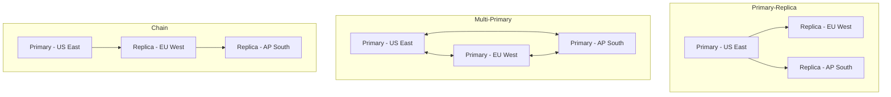
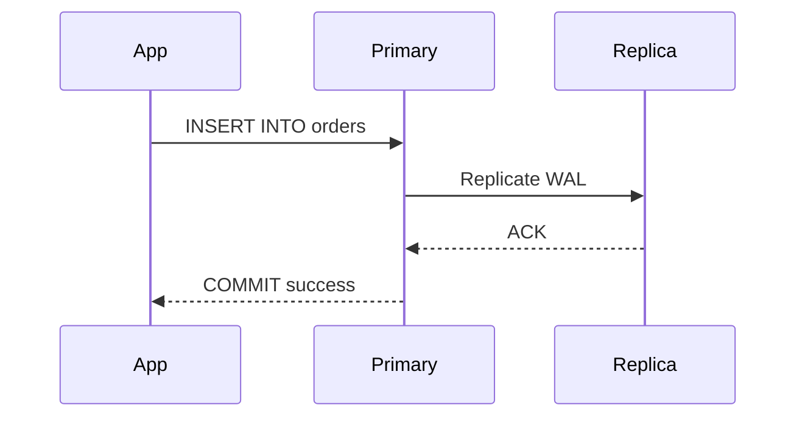
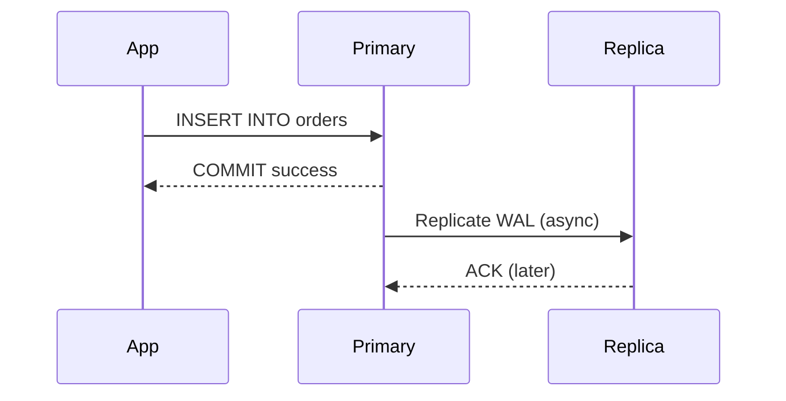
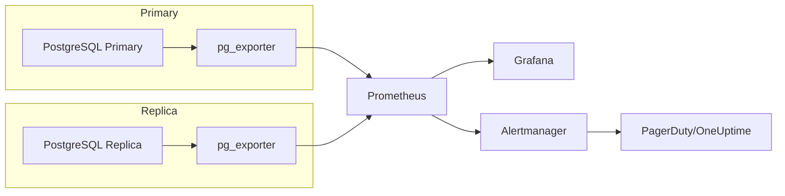

# How to Implement Cross-Region Replication

Author: [nawazdhandala](https://github.com/nawazdhandala)

Tags: Replication, Multi-Region, High Availability, Database

Description: A practical guide to setting up cross-region database replication with configuration examples, conflict resolution strategies, and lag monitoring techniques.

---

Your data lives in one region until it does not. Cross-region replication keeps copies of your data in multiple geographic locations, protecting against regional outages and reducing latency for distributed users. The tradeoff is complexity: you need to choose between consistency and availability, handle conflicts, and monitor replication lag.

## Replication Topology Patterns



### Topology Comparison

| Pattern | Write Availability | Read Latency | Conflict Risk | Complexity |
|---------|-------------------|--------------|---------------|------------|
| Primary-Replica | Single region | Low (local reads) | None | Low |
| Multi-Primary | All regions | Low | High | High |
| Chain/Cascade | Single region | Low | None | Medium |

## Synchronous vs Asynchronous Replication

The fundamental choice in cross-region replication is whether to wait for acknowledgment from remote replicas before confirming writes.

### Synchronous Replication



**Pros:**
- Zero data loss (RPO = 0)
- Read-your-writes consistency on replicas
- No conflict resolution needed

**Cons:**
- Write latency increases by network round-trip (50-200ms cross-region)
- Write availability depends on replica health
- Throughput limited by slowest replica

### Asynchronous Replication



**Pros:**
- Write latency unaffected by replica distance
- Primary remains available if replica fails
- Higher throughput

**Cons:**
- Potential data loss during failover (RPO > 0)
- Stale reads on replicas
- Need conflict handling for multi-primary setups

## PostgreSQL Cross-Region Replication

### Streaming Replication Setup

**Primary Configuration (postgresql.conf)**

```ini
# Enable WAL archiving
wal_level = replica
max_wal_senders = 10
wal_keep_size = 1GB

# For synchronous replication (optional)
synchronous_commit = remote_apply
synchronous_standby_names = 'replica_eu'
```

**Primary pg_hba.conf**

```
# Allow replication connections from replica
host replication replicator 10.0.0.0/8 scram-sha-256
host replication replicator replica-eu.example.com scram-sha-256
```

**Create Replication User**

```sql
CREATE USER replicator WITH REPLICATION ENCRYPTED PASSWORD 'secure_password';
```

**Replica Setup**

```bash
# Stop PostgreSQL on replica
sudo systemctl stop postgresql

# Clear data directory
rm -rf /var/lib/postgresql/15/main/*

# Base backup from primary
pg_basebackup -h primary.example.com -U replicator -D /var/lib/postgresql/15/main -Fp -Xs -P -R

# Start replica
sudo systemctl start postgresql
```

The `-R` flag creates `standby.signal` and configures `primary_conninfo` automatically.

**Replica Configuration (postgresql.conf)**

```ini
# Replica identity for synchronous replication
primary_conninfo = 'host=primary.example.com port=5432 user=replicator password=secure_password application_name=replica_eu'

# Hot standby allows read queries
hot_standby = on

# Feedback to primary about replay position
hot_standby_feedback = on
```

### Kubernetes PostgreSQL Replication with CloudNativePG

```yaml
apiVersion: postgresql.cnpg.io/v1
kind: Cluster
metadata:
  name: postgres-primary
  namespace: database
spec:
  instances: 3
  imageName: ghcr.io/cloudnative-pg/postgresql:15.4

  postgresql:
    parameters:
      wal_level: replica
      max_wal_senders: "10"
      synchronous_commit: remote_apply

  bootstrap:
    initdb:
      database: production
      owner: app

  storage:
    size: 100Gi
    storageClass: fast-ssd

---
apiVersion: postgresql.cnpg.io/v1
kind: Cluster
metadata:
  name: postgres-replica-eu
  namespace: database
spec:
  instances: 2
  imageName: ghcr.io/cloudnative-pg/postgresql:15.4

  replica:
    enabled: true
    source: postgres-primary

  externalClusters:
    - name: postgres-primary
      connectionParameters:
        host: postgres-primary-rw.us-east.example.com
        user: streaming_replica
        sslmode: verify-full
      sslKey:
        name: replica-tls
        key: tls.key
      sslCert:
        name: replica-tls
        key: tls.crt
      sslRootCert:
        name: replica-tls
        key: ca.crt
      password:
        name: replica-credentials
        key: password

  storage:
    size: 100Gi
    storageClass: fast-ssd
```

## MySQL Cross-Region Replication

### GTID-Based Replication

**Primary Configuration (my.cnf)**

```ini
[mysqld]
server-id = 1
log_bin = mysql-bin
binlog_format = ROW
gtid_mode = ON
enforce_gtid_consistency = ON

# Semi-synchronous replication
plugin-load = "rpl_semi_sync_master=semisync_master.so"
rpl_semi_sync_master_enabled = 1
rpl_semi_sync_master_timeout = 10000
```

**Create Replication User**

```sql
CREATE USER 'replicator'@'%' IDENTIFIED BY 'secure_password';
GRANT REPLICATION SLAVE ON *.* TO 'replicator'@'%';
FLUSH PRIVILEGES;
```

**Replica Configuration (my.cnf)**

```ini
[mysqld]
server-id = 2
log_bin = mysql-bin
binlog_format = ROW
gtid_mode = ON
enforce_gtid_consistency = ON
read_only = ON
super_read_only = ON

# Semi-synchronous replication
plugin-load = "rpl_semi_sync_slave=semisync_slave.so"
rpl_semi_sync_slave_enabled = 1
```

**Start Replication on Replica**

```sql
CHANGE REPLICATION SOURCE TO
  SOURCE_HOST = 'primary.example.com',
  SOURCE_USER = 'replicator',
  SOURCE_PASSWORD = 'secure_password',
  SOURCE_AUTO_POSITION = 1,
  SOURCE_SSL = 1;

START REPLICA;
```

### Group Replication for Multi-Primary

```ini
[mysqld]
# Group replication settings
plugin-load-add = group_replication.so
group_replication_group_name = "aaaaaaaa-bbbb-cccc-dddd-eeeeeeeeeeee"
group_replication_start_on_boot = OFF
group_replication_local_address = "node1.example.com:33061"
group_replication_group_seeds = "node1.example.com:33061,node2.example.com:33061,node3.example.com:33061"
group_replication_bootstrap_group = OFF

# Multi-primary mode
group_replication_single_primary_mode = OFF
group_replication_enforce_update_everywhere_checks = ON
```

## Conflict Resolution Strategies

When running multi-primary replication, conflicts are inevitable. Two users in different regions might update the same row simultaneously.

### Last-Write-Wins (LWW)

The simplest strategy: the write with the latest timestamp wins.

```sql
-- Add timestamp column for conflict resolution
ALTER TABLE orders ADD COLUMN updated_at TIMESTAMP DEFAULT CURRENT_TIMESTAMP ON UPDATE CURRENT_TIMESTAMP;

-- Conflict resolution trigger
CREATE TRIGGER resolve_conflict
BEFORE UPDATE ON orders
FOR EACH ROW
BEGIN
  IF NEW.updated_at < OLD.updated_at THEN
    SIGNAL SQLSTATE '45000' SET MESSAGE_TEXT = 'Conflict: newer version exists';
  END IF;
END;
```

**Problem:** Clock skew between regions can cause unexpected results.

### Application-Level Conflict Resolution

```python
# Python example with conflict detection
import hashlib
from datetime import datetime

class ConflictResolver:
    def merge_order(self, local_order, remote_order):
        # Version vector comparison
        if remote_order['version'] <= local_order['version']:
            return local_order  # Local is newer or equal

        # Check for true conflict (concurrent updates)
        if self.is_concurrent(local_order, remote_order):
            return self.resolve_conflict(local_order, remote_order)

        return remote_order  # Remote is strictly newer

    def is_concurrent(self, order1, order2):
        # Neither version dominates the other
        return (order1['version'] != order2['version'] and
                order1['parent_version'] == order2['parent_version'])

    def resolve_conflict(self, order1, order2):
        # Business logic: merge or choose winner
        merged = {
            'id': order1['id'],
            'version': max(order1['version'], order2['version']) + 1,
            # Take higher quantity (additive merge)
            'quantity': max(order1['quantity'], order2['quantity']),
            # Take latest status
            'status': order1['status'] if order1['updated_at'] > order2['updated_at'] else order2['status'],
            'updated_at': datetime.utcnow()
        }
        return merged
```

### CRDT-Based Resolution

Conflict-free Replicated Data Types (CRDTs) are data structures that can be merged without conflicts.

```python
# G-Counter CRDT for distributed counting
class GCounter:
    def __init__(self, node_id):
        self.node_id = node_id
        self.counts = {}

    def increment(self, amount=1):
        self.counts[self.node_id] = self.counts.get(self.node_id, 0) + amount

    def value(self):
        return sum(self.counts.values())

    def merge(self, other):
        # Take max of each node's count
        merged = GCounter(self.node_id)
        all_nodes = set(self.counts.keys()) | set(other.counts.keys())
        for node in all_nodes:
            merged.counts[node] = max(
                self.counts.get(node, 0),
                other.counts.get(node, 0)
            )
        return merged

# Usage across regions
us_counter = GCounter('us-east')
eu_counter = GCounter('eu-west')

us_counter.increment(5)
eu_counter.increment(3)

# After sync, both converge to 8
merged = us_counter.merge(eu_counter)
print(merged.value())  # 8
```

## Monitoring Replication Lag

Replication lag is the delay between a write on the primary and its application on the replica. High lag means stale reads and potential data loss during failover.

### PostgreSQL Lag Monitoring

```sql
-- On primary: check replication status
SELECT
  client_addr,
  application_name,
  state,
  sent_lsn,
  write_lsn,
  flush_lsn,
  replay_lsn,
  pg_wal_lsn_diff(sent_lsn, replay_lsn) AS lag_bytes,
  pg_wal_lsn_diff(sent_lsn, replay_lsn) / 1024 / 1024 AS lag_mb
FROM pg_stat_replication;

-- On replica: check lag in seconds
SELECT
  CASE
    WHEN pg_last_wal_receive_lsn() = pg_last_wal_replay_lsn() THEN 0
    ELSE EXTRACT(EPOCH FROM now() - pg_last_xact_replay_timestamp())
  END AS lag_seconds;
```

### MySQL Lag Monitoring

```sql
-- Check replica status
SHOW REPLICA STATUS\G

-- Key fields:
-- Seconds_Behind_Source: replication lag in seconds
-- Replica_IO_Running: should be Yes
-- Replica_SQL_Running: should be Yes
-- Retrieved_Gtid_Set: GTIDs received from primary
-- Executed_Gtid_Set: GTIDs applied locally
```

### Prometheus Metrics Export

```yaml
# PostgreSQL exporter queries
pg_replication_lag:
  query: |
    SELECT
      application_name,
      pg_wal_lsn_diff(sent_lsn, replay_lsn) as lag_bytes
    FROM pg_stat_replication
  metrics:
    - application_name:
        usage: "LABEL"
    - lag_bytes:
        usage: "GAUGE"
        description: "Replication lag in bytes"
```

### Alerting Rules

```yaml
# Prometheus alerting rules
groups:
  - name: replication
    rules:
      - alert: HighReplicationLag
        expr: pg_replication_lag_bytes > 104857600  # 100MB
        for: 5m
        labels:
          severity: warning
        annotations:
          summary: "High replication lag on {{ $labels.application_name }}"
          description: "Replica {{ $labels.application_name }} is {{ $value | humanize1024 }} behind"

      - alert: ReplicationStopped
        expr: pg_replication_is_replica == 1 and changes(pg_replication_lag_bytes[5m]) == 0
        for: 10m
        labels:
          severity: critical
        annotations:
          summary: "Replication appears stalled"
          description: "No change in replication lag for 10 minutes"

      - alert: ReplicaNotConnected
        expr: pg_stat_replication_count < 2
        for: 5m
        labels:
          severity: critical
        annotations:
          summary: "Missing replica connections"
          description: "Expected 2 replicas but only {{ $value }} connected"
```

### Lag Monitoring Dashboard



## Handling Network Partitions

Network partitions between regions are inevitable. Your replication strategy must handle them gracefully.

### Split-Brain Prevention

```yaml
# PostgreSQL Patroni configuration for split-brain prevention
bootstrap:
  dcs:
    ttl: 30
    loop_wait: 10
    retry_timeout: 10
    maximum_lag_on_failover: 1048576  # 1MB max lag for failover
    postgresql:
      parameters:
        synchronous_commit: remote_apply
        synchronous_standby_names: '*'

# Require quorum for writes
postgresql:
  parameters:
    # Fail writes if sync replica unavailable
    synchronous_commit: remote_apply
```

### Graceful Degradation

```python
# Application-level handling of replica unavailability
class DatabaseRouter:
    def __init__(self, primary_dsn, replica_dsns):
        self.primary = create_connection(primary_dsn)
        self.replicas = [create_connection(dsn) for dsn in replica_dsns]
        self.healthy_replicas = list(self.replicas)

    def read(self, query, params=None, max_lag_seconds=5):
        # Try healthy replicas first
        for replica in self.healthy_replicas:
            try:
                lag = self.check_lag(replica)
                if lag <= max_lag_seconds:
                    return replica.execute(query, params)
            except ConnectionError:
                self.healthy_replicas.remove(replica)
                self.schedule_health_check(replica)

        # Fallback to primary for reads
        return self.primary.execute(query, params)

    def write(self, query, params=None):
        return self.primary.execute(query, params)

    def check_lag(self, replica):
        result = replica.execute(
            "SELECT EXTRACT(EPOCH FROM now() - pg_last_xact_replay_timestamp())"
        )
        return result[0][0] or 0
```

## Failover Procedures

### Automated Failover with Patroni

```yaml
# Patroni REST API for controlled failover
# Trigger failover to specific node
curl -X POST http://patroni-leader:8008/failover \
  -H "Content-Type: application/json" \
  -d '{"leader": "node1", "candidate": "node2"}'

# Switchover (graceful, waits for sync)
curl -X POST http://patroni-leader:8008/switchover \
  -H "Content-Type: application/json" \
  -d '{"leader": "node1", "candidate": "node2", "scheduled_at": "2026-01-30T10:00:00"}'
```

### Manual Failover Runbook

```bash
#!/bin/bash
# PostgreSQL manual failover script

PRIMARY_HOST="primary.us-east.example.com"
REPLICA_HOST="replica.eu-west.example.com"

echo "Step 1: Verify replication lag"
psql -h $REPLICA_HOST -c "SELECT pg_last_xact_replay_timestamp(), now() - pg_last_xact_replay_timestamp() as lag;"

echo "Step 2: Stop writes to primary"
psql -h $PRIMARY_HOST -c "ALTER SYSTEM SET default_transaction_read_only = on;"
psql -h $PRIMARY_HOST -c "SELECT pg_reload_conf();"

echo "Step 3: Wait for replica to catch up"
while true; do
  LAG=$(psql -h $REPLICA_HOST -t -c "SELECT pg_wal_lsn_diff(pg_last_wal_receive_lsn(), pg_last_wal_replay_lsn());")
  if [ "$LAG" -eq 0 ]; then
    echo "Replica caught up"
    break
  fi
  echo "Lag: $LAG bytes, waiting..."
  sleep 1
done

echo "Step 4: Promote replica"
psql -h $REPLICA_HOST -c "SELECT pg_promote();"

echo "Step 5: Update DNS/connection strings"
# Update DNS or load balancer to point to new primary

echo "Step 6: Verify new primary accepts writes"
psql -h $REPLICA_HOST -c "CREATE TABLE failover_test (id serial); DROP TABLE failover_test;"

echo "Failover complete"
```

## Best Practices

1. **Start with async replication** until you understand your latency budget. Sync replication across continents adds 100-300ms per write.

2. **Monitor lag continuously.** Set alerts at 1 second for warning, 10 seconds for critical. Investigate any sustained lag.

3. **Test failover monthly.** Automated or manual, you need to know your actual RTO. Document every step.

4. **Use connection pooling.** PgBouncer or ProxySQL reduce connection overhead and can route reads to replicas automatically.

5. **Encrypt replication traffic.** Cross-region traffic traverses the public internet or third-party networks. Use TLS for replication connections.

6. **Plan for conflict resolution before going multi-primary.** If you cannot design a deterministic merge strategy, stick with single-primary.

7. **Size your WAL retention.** If a replica disconnects for maintenance, it needs WAL segments to catch up. Keep at least 24 hours of WAL on the primary.

8. **Use logical replication for schema flexibility.** Streaming replication requires identical schemas. Logical replication allows different indexes or partial replication.

---

Cross-region replication protects your data from regional failures and brings it closer to your users. The key decisions are synchronous vs asynchronous (trading latency for consistency) and single-primary vs multi-primary (trading simplicity for write availability). Whatever you choose, instrument your replication pipeline thoroughly. The lag metric you ignore today becomes the data loss you explain tomorrow.
