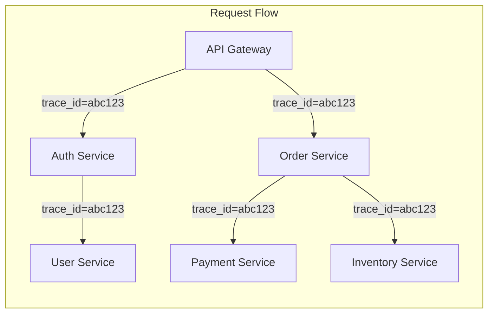
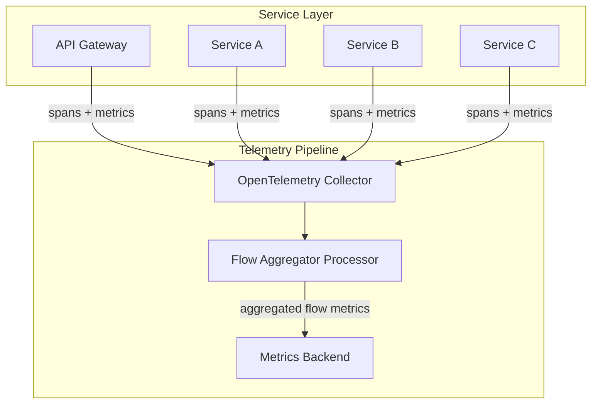
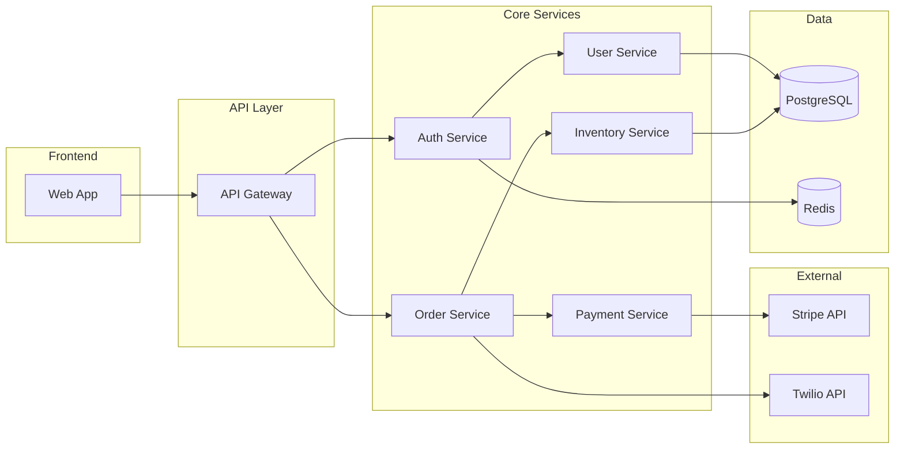
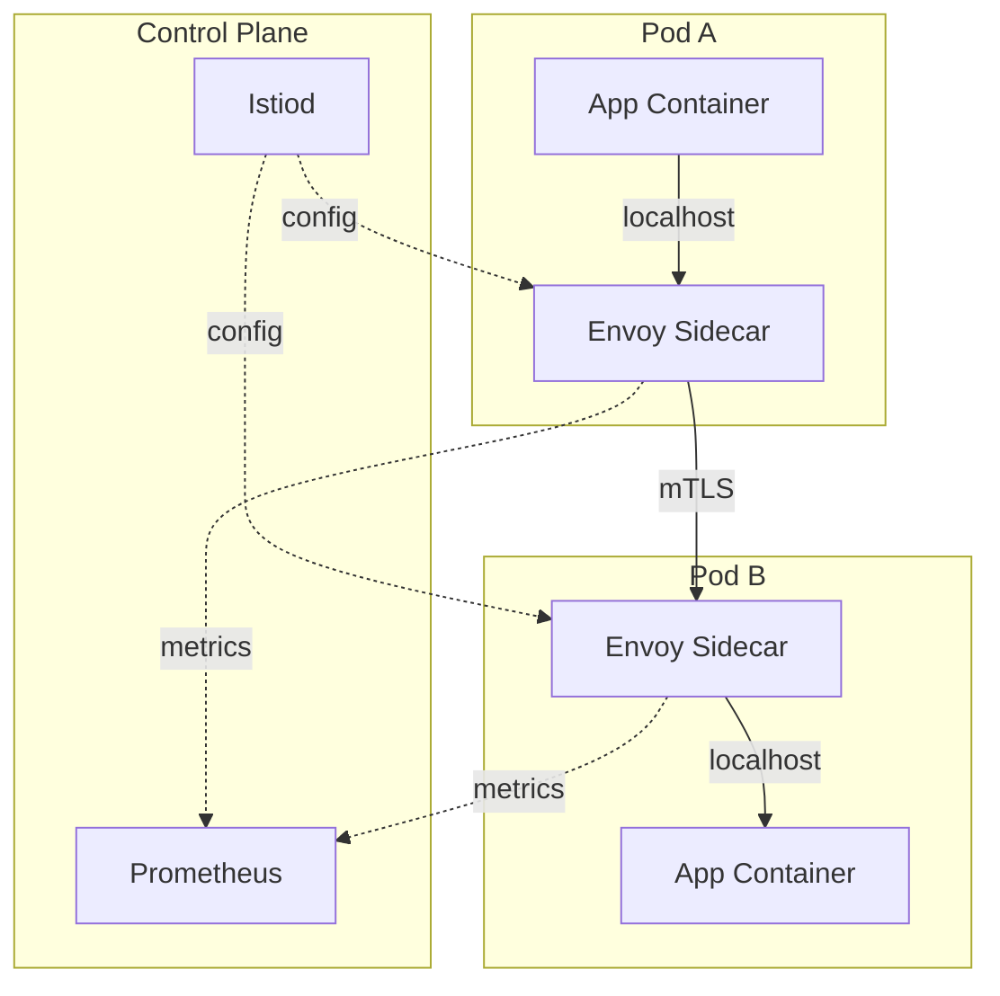
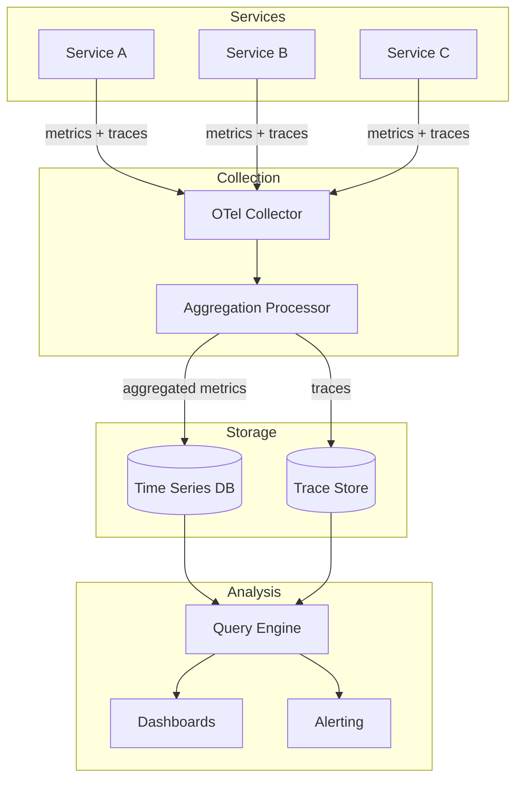
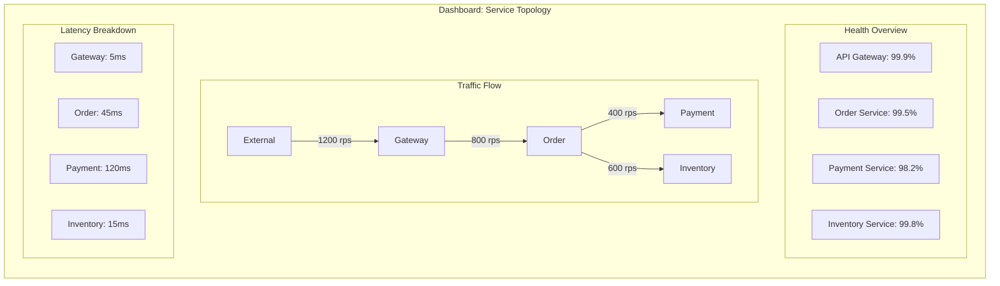
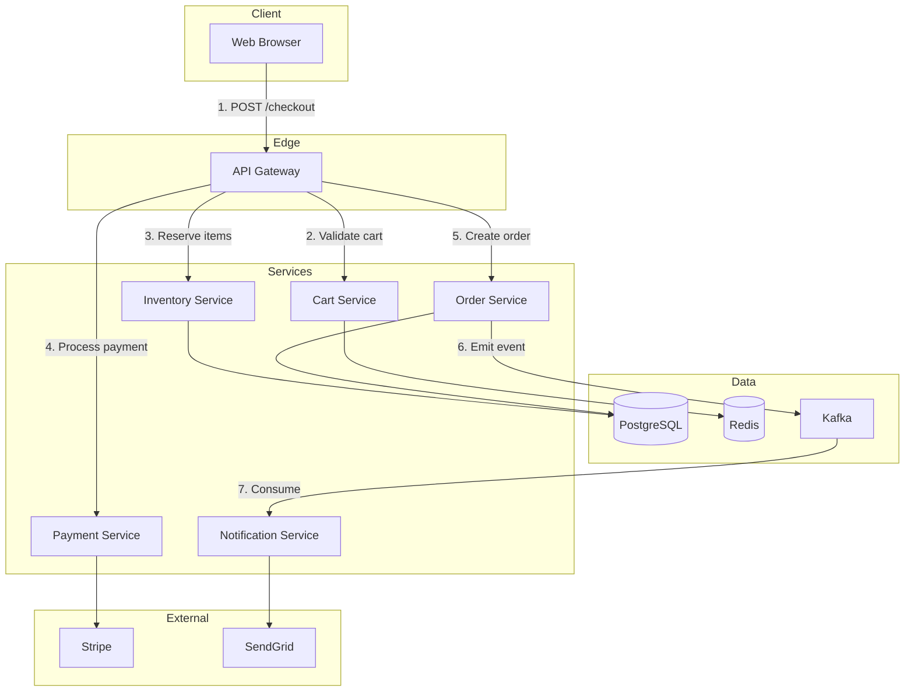

# How to Build Cross-Service Metrics

Author: [nawazdhandala](https://github.com/nawazdhandala)

Tags: Observability, Metrics, Microservices, SRE

Description: Learn how to design metrics that span multiple services for end-to-end visibility.

---

Microservices give you flexibility and independent deployments, but they scatter critical data across dozens of services. When a checkout flow spans the API gateway, inventory service, payment service, and notification service, a single latency metric from one service tells you almost nothing.

Cross-service metrics solve this problem. They aggregate, correlate, and unify telemetry so you can answer questions like:

- What is the end-to-end latency for a checkout request?
- Which downstream dependency is causing errors?
- How does Service A's slowdown affect Service B's throughput?

This guide walks through the patterns, instrumentation strategies, and practical code examples you need to build cross-service metrics that actually work.

---

## Table of Contents

1. Why Single-Service Metrics Fall Short
2. Core Concepts for Cross-Service Metrics
3. Request Flow Metrics
4. Dependency Metrics
5. Service Mesh Metrics
6. Implementing Cross-Service Metrics with OpenTelemetry
7. Aggregation and Correlation Strategies
8. Dashboard Design Patterns
9. Common Pitfalls and How to Avoid Them
10. Putting It All Together

---

## 1. Why Single-Service Metrics Fall Short

Traditional metrics focus on a single service: its CPU, memory, request count, and error rate. This approach breaks down in distributed systems because:

| Problem | Impact |
|---------|--------|
| No visibility into upstream/downstream | You see a spike in errors but cannot tell if your service caused it or inherited it |
| Latency attribution is impossible | A slow response might be your code, a database, or three hops away |
| Cascading failures are invisible | Service A slows down, causing timeouts in B, C, and D, but each looks like an isolated issue |
| Business transactions span services | A "checkout" or "user signup" involves multiple services, but you cannot measure its total health |

Cross-service metrics give you the holistic view that single-service metrics cannot.

---

## 2. Core Concepts for Cross-Service Metrics

### 2.1 Metric Types for Distributed Systems

| Metric Type | What It Measures | Example |
|-------------|------------------|---------|
| Request flow metrics | End-to-end latency and success rate for a business transaction | Checkout P99 latency across all services |
| Dependency metrics | Health of connections between services | Payment service to Stripe API error rate |
| Service mesh metrics | Infrastructure-level traffic patterns | Requests per second between Service A and Service B |
| Aggregate metrics | Rolled-up views across service boundaries | Total error rate for all services in the checkout path |

### 2.2 The Correlation Problem

The fundamental challenge is correlation. How do you connect a metric emitted by Service A to a metric emitted by Service B when they are part of the same user request?

Solutions include:

- **Trace ID propagation**: Attach a unique trace ID to every request and include it in metric labels
- **Service graph construction**: Build a dependency graph and aggregate metrics along edges
- **Semantic conventions**: Use consistent naming (e.g., `operation.name`, `service.name`) so metrics from different services can be joined



---

## 3. Request Flow Metrics

Request flow metrics track a business transaction from start to finish, regardless of how many services it touches.

### 3.1 What to Measure

| Metric | Description | Labels |
|--------|-------------|--------|
| `request_flow_duration_seconds` | Total time from first service to final response | `flow_name`, `status`, `entry_point` |
| `request_flow_service_count` | Number of services involved in the request | `flow_name` |
| `request_flow_error_total` | Count of failed flows | `flow_name`, `error_service`, `error_type` |
| `request_flow_stage_duration_seconds` | Time spent in each stage of the flow | `flow_name`, `stage`, `service` |

### 3.2 Architecture for Request Flow Metrics



### 3.3 Implementation: Flow Duration Tracking

The key insight is that you already have trace data with timing information. You can derive request flow metrics from spans.

```typescript
// flow-metrics-processor.ts
// This processor runs in your OpenTelemetry Collector or a dedicated aggregator

import { Span, SpanStatusCode } from '@opentelemetry/api';

interface FlowMetrics {
  flowName: string;
  totalDuration: number;
  serviceCount: number;
  stages: Map<string, number>;
  hasError: boolean;
  errorService?: string;
}

// Aggregate spans belonging to the same trace into flow metrics
function aggregateTraceToFlowMetrics(spans: Span[]): FlowMetrics {
  // Sort spans by start time to find the root
  const sortedSpans = [...spans].sort((a, b) =>
    a.startTime[0] - b.startTime[0]
  );

  const rootSpan = sortedSpans[0];
  const lastSpan = sortedSpans.reduce((latest, span) => {
    const spanEnd = span.endTime[0];
    const latestEnd = latest.endTime[0];
    return spanEnd > latestEnd ? span : latest;
  }, sortedSpans[0]);

  // Calculate total duration from first span start to last span end
  const totalDuration = lastSpan.endTime[0] - rootSpan.startTime[0];

  // Count unique services
  const services = new Set(spans.map(s => s.attributes['service.name']));

  // Build stage durations
  const stages = new Map<string, number>();
  spans.forEach(span => {
    const stageName = `${span.attributes['service.name']}.${span.name}`;
    const duration = span.endTime[0] - span.startTime[0];
    stages.set(stageName, (stages.get(stageName) || 0) + duration);
  });

  // Check for errors
  const errorSpan = spans.find(s => s.status.code === SpanStatusCode.ERROR);

  return {
    flowName: rootSpan.attributes['flow.name'] as string || rootSpan.name,
    totalDuration,
    serviceCount: services.size,
    stages,
    hasError: !!errorSpan,
    errorService: errorSpan?.attributes['service.name'] as string,
  };
}
```

### 3.4 Instrumenting Services to Support Flow Metrics

Each service must propagate context and add consistent attributes:

```typescript
// instrumentation.ts
// Add this to each service in the request flow

import { trace, context, SpanStatusCode } from '@opentelemetry/api';
import { SemanticAttributes } from '@opentelemetry/semantic-conventions';

const tracer = trace.getTracer('checkout-service', '1.0.0');

// Middleware that extracts flow metadata and ensures propagation
export function flowTrackingMiddleware(req: Request, res: Response, next: Function) {
  const activeSpan = trace.getSpan(context.active());

  if (activeSpan) {
    // Add flow-level attributes that will be used for aggregation
    activeSpan.setAttribute('flow.name', determineFlowName(req));
    activeSpan.setAttribute('flow.entry_point', req.headers['x-flow-entry'] || 'direct');
    activeSpan.setAttribute('flow.stage', 'checkout-service');

    // Add service identity for cross-service correlation
    activeSpan.setAttribute(SemanticAttributes.SERVICE_NAME, 'checkout-service');
    activeSpan.setAttribute(SemanticAttributes.SERVICE_VERSION, process.env.VERSION || '1.0.0');
  }

  next();
}

// Determine the business flow based on the request
function determineFlowName(req: Request): string {
  const flowMappings: Record<string, string> = {
    '/api/checkout': 'checkout_flow',
    '/api/cart/add': 'add_to_cart_flow',
    '/api/user/signup': 'user_registration_flow',
    '/api/order/status': 'order_status_flow',
  };

  // Match the most specific path
  for (const [path, flow] of Object.entries(flowMappings)) {
    if (req.path.startsWith(path)) {
      return flow;
    }
  }

  return 'unknown_flow';
}
```

---

## 4. Dependency Metrics

Dependency metrics track the health of connections between services. They answer: "Is my downstream dependency healthy, and how is it affecting my service?"

### 4.1 What to Measure

| Metric | Description | Labels |
|--------|-------------|--------|
| `dependency_request_duration_seconds` | Latency of calls to dependencies | `caller`, `callee`, `method`, `status` |
| `dependency_request_total` | Count of calls to dependencies | `caller`, `callee`, `method`, `status` |
| `dependency_error_total` | Count of failed dependency calls | `caller`, `callee`, `error_type` |
| `dependency_circuit_breaker_state` | Current state of circuit breakers | `caller`, `callee`, `state` |
| `dependency_retry_total` | Count of retried requests | `caller`, `callee`, `attempt` |

### 4.2 Dependency Graph Visualization



### 4.3 Implementation: Dependency Tracking Wrapper

Wrap all outbound calls to automatically collect dependency metrics:

```typescript
// dependency-tracker.ts
// Wraps HTTP clients and other outbound calls to collect dependency metrics

import { trace, SpanKind, SpanStatusCode, context } from '@opentelemetry/api';
import { Counter, Histogram, Registry } from 'prom-client';

// Initialize metrics
const dependencyDuration = new Histogram({
  name: 'dependency_request_duration_seconds',
  help: 'Duration of dependency requests in seconds',
  labelNames: ['caller', 'callee', 'method', 'status'],
  buckets: [0.01, 0.05, 0.1, 0.25, 0.5, 1, 2.5, 5, 10],
});

const dependencyRequests = new Counter({
  name: 'dependency_request_total',
  help: 'Total number of dependency requests',
  labelNames: ['caller', 'callee', 'method', 'status'],
});

const dependencyErrors = new Counter({
  name: 'dependency_error_total',
  help: 'Total number of dependency errors',
  labelNames: ['caller', 'callee', 'error_type'],
});

const dependencyRetries = new Counter({
  name: 'dependency_retry_total',
  help: 'Total number of dependency retries',
  labelNames: ['caller', 'callee', 'attempt'],
});

interface DependencyCallOptions {
  callee: string;
  method: string;
  maxRetries?: number;
  timeout?: number;
}

const tracer = trace.getTracer('dependency-tracker');
const SERVICE_NAME = process.env.SERVICE_NAME || 'unknown-service';

// Generic wrapper for any async dependency call
export async function trackDependencyCall<T>(
  options: DependencyCallOptions,
  fn: () => Promise<T>
): Promise<T> {
  const { callee, method, maxRetries = 0 } = options;
  const startTime = Date.now();
  let lastError: Error | null = null;

  // Create a span for the dependency call
  return tracer.startActiveSpan(
    `dependency.${callee}.${method}`,
    { kind: SpanKind.CLIENT },
    async (span) => {
      span.setAttribute('dependency.caller', SERVICE_NAME);
      span.setAttribute('dependency.callee', callee);
      span.setAttribute('dependency.method', method);

      for (let attempt = 0; attempt <= maxRetries; attempt++) {
        if (attempt > 0) {
          // Track retry
          dependencyRetries.inc({
            caller: SERVICE_NAME,
            callee,
            attempt: String(attempt),
          });
          span.addEvent('retry', { attempt });

          // Exponential backoff
          await sleep(Math.pow(2, attempt) * 100);
        }

        try {
          const result = await fn();
          const duration = (Date.now() - startTime) / 1000;

          // Record success metrics
          dependencyDuration.observe(
            { caller: SERVICE_NAME, callee, method, status: 'success' },
            duration
          );
          dependencyRequests.inc({
            caller: SERVICE_NAME,
            callee,
            method,
            status: 'success',
          });

          span.setAttribute('dependency.duration_ms', duration * 1000);
          span.setAttribute('dependency.attempts', attempt + 1);
          span.setStatus({ code: SpanStatusCode.OK });
          span.end();

          return result;
        } catch (error: any) {
          lastError = error;
          span.addEvent('error', {
            attempt,
            error_type: error.name,
            error_message: error.message,
          });
        }
      }

      // All retries exhausted
      const duration = (Date.now() - startTime) / 1000;
      const errorType = lastError?.name || 'UnknownError';

      dependencyDuration.observe(
        { caller: SERVICE_NAME, callee, method, status: 'error' },
        duration
      );
      dependencyRequests.inc({
        caller: SERVICE_NAME,
        callee,
        method,
        status: 'error',
      });
      dependencyErrors.inc({
        caller: SERVICE_NAME,
        callee,
        error_type: errorType,
      });

      span.recordException(lastError!);
      span.setStatus({ code: SpanStatusCode.ERROR, message: lastError?.message });
      span.end();

      throw lastError;
    }
  );
}

function sleep(ms: number): Promise<void> {
  return new Promise(resolve => setTimeout(resolve, ms));
}
```

### 4.4 Using the Dependency Tracker

```typescript
// payment-service.ts
// Example of using the dependency tracker for external API calls

import { trackDependencyCall } from './dependency-tracker';
import fetch from 'node-fetch';

interface ChargeResult {
  id: string;
  status: 'succeeded' | 'failed';
  amount: number;
}

export async function chargeCustomer(
  customerId: string,
  amount: number
): Promise<ChargeResult> {
  return trackDependencyCall(
    {
      callee: 'stripe-api',
      method: 'charges.create',
      maxRetries: 2,
      timeout: 5000,
    },
    async () => {
      const response = await fetch('https://api.stripe.com/v1/charges', {
        method: 'POST',
        headers: {
          'Authorization': `Bearer ${process.env.STRIPE_SECRET_KEY}`,
          'Content-Type': 'application/x-www-form-urlencoded',
        },
        body: new URLSearchParams({
          customer: customerId,
          amount: String(amount),
          currency: 'usd',
        }),
      });

      if (!response.ok) {
        const error = await response.json();
        throw new Error(`Stripe error: ${error.message}`);
      }

      return response.json() as Promise<ChargeResult>;
    }
  );
}

// Example: calling an internal service
export async function reserveInventory(
  productId: string,
  quantity: number
): Promise<boolean> {
  return trackDependencyCall(
    {
      callee: 'inventory-service',
      method: 'reserve',
      maxRetries: 1,
    },
    async () => {
      const response = await fetch(
        `${process.env.INVENTORY_SERVICE_URL}/api/reserve`,
        {
          method: 'POST',
          headers: { 'Content-Type': 'application/json' },
          body: JSON.stringify({ productId, quantity }),
        }
      );

      if (!response.ok) {
        throw new Error(`Inventory service error: ${response.status}`);
      }

      const result = await response.json();
      return result.reserved;
    }
  );
}
```

---

## 5. Service Mesh Metrics

If you are running a service mesh like Istio, Linkerd, or Cilium, you get cross-service metrics automatically at the infrastructure level. These metrics are invaluable because they capture all traffic without requiring application-level instrumentation.

### 5.1 Key Service Mesh Metrics

| Metric | Description | Source |
|--------|-------------|--------|
| `istio_requests_total` | Total requests between services | Envoy sidecar |
| `istio_request_duration_milliseconds` | Request latency distribution | Envoy sidecar |
| `istio_tcp_connections_opened_total` | TCP connections established | Envoy sidecar |
| `linkerd_request_total` | Total requests (Linkerd) | Linkerd proxy |
| `linkerd_response_latency_ms` | Response latency (Linkerd) | Linkerd proxy |

### 5.2 Service Mesh Architecture



### 5.3 Istio Metrics Configuration

Configure Istio to expose detailed cross-service metrics:

```yaml
# istio-telemetry.yaml
# Apply with: kubectl apply -f istio-telemetry.yaml

apiVersion: telemetry.istio.io/v1alpha1
kind: Telemetry
metadata:
  name: mesh-default
  namespace: istio-system
spec:
  # Enable access logging for debugging
  accessLogging:
    - providers:
        - name: envoy

  # Configure metrics with additional labels
  metrics:
    - providers:
        - name: prometheus
      overrides:
        # Add custom dimensions to request metrics
        - match:
            metric: REQUEST_COUNT
            mode: CLIENT_AND_SERVER
          tagOverrides:
            # Include the full destination service name
            destination_service:
              operation: UPSERT
              value: "destination.service.name"
            # Include source workload for caller identification
            source_workload:
              operation: UPSERT
              value: "source.workload.name"
            # Include response flags for error categorization
            response_flags:
              operation: UPSERT
              value: "response.flags"

        # Add latency buckets for detailed percentile analysis
        - match:
            metric: REQUEST_DURATION
            mode: CLIENT_AND_SERVER
          tagOverrides:
            destination_service:
              operation: UPSERT
              value: "destination.service.name"
```

### 5.4 Querying Service Mesh Metrics

Example PromQL queries for cross-service visibility:

```promql
# Request rate between services
# Shows requests per second from source to destination
sum(rate(istio_requests_total{
  reporter="source",
  source_workload="order-service",
  destination_service=~".*"
}[5m])) by (destination_service)

# Error rate by service pair
# Shows the percentage of failed requests between any two services
sum(rate(istio_requests_total{
  response_code!~"2..",
  reporter="source"
}[5m])) by (source_workload, destination_service)
/
sum(rate(istio_requests_total{
  reporter="source"
}[5m])) by (source_workload, destination_service)

# P99 latency for cross-service calls
# Shows tail latency for requests between services
histogram_quantile(0.99,
  sum(rate(istio_request_duration_milliseconds_bucket{
    reporter="source",
    source_workload="api-gateway"
  }[5m])) by (destination_service, le)
)

# Service dependency graph data
# Returns all service pairs with their request rates
sum(rate(istio_requests_total{
  reporter="source"
}[5m])) by (source_workload, destination_service) > 0
```

### 5.5 Combining Mesh Metrics with Application Metrics

Service mesh metrics show what is happening at the network level. Application metrics show what is happening at the business logic level. Combine them for complete visibility:

```typescript
// combined-metrics-dashboard.ts
// Example of combining mesh and application metrics in a dashboard config

interface DashboardPanel {
  title: string;
  type: 'graph' | 'stat' | 'table';
  queries: string[];
}

const crossServiceDashboard: DashboardPanel[] = [
  {
    // Infrastructure view from service mesh
    title: 'Request Rate by Service Pair (Mesh)',
    type: 'graph',
    queries: [
      `sum(rate(istio_requests_total{reporter="source"}[5m])) by (source_workload, destination_service)`,
    ],
  },
  {
    // Application view from custom instrumentation
    title: 'Business Flow Success Rate',
    type: 'stat',
    queries: [
      `sum(rate(request_flow_error_total{flow_name="checkout_flow"}[5m])) / sum(rate(request_flow_duration_seconds_count{flow_name="checkout_flow"}[5m]))`,
    ],
  },
  {
    // Combined view: mesh latency with application context
    title: 'Checkout Flow Latency Breakdown',
    type: 'graph',
    queries: [
      // Mesh-level latency
      `histogram_quantile(0.95, sum(rate(istio_request_duration_milliseconds_bucket{destination_service=~"checkout.*|payment.*|inventory.*"}[5m])) by (destination_service, le))`,
      // Application-level stage timing
      `histogram_quantile(0.95, sum(rate(request_flow_stage_duration_seconds_bucket{flow_name="checkout_flow"}[5m])) by (stage, le))`,
    ],
  },
  {
    // Dependency health from application metrics
    title: 'Dependency Error Rates',
    type: 'table',
    queries: [
      `sum(rate(dependency_error_total[5m])) by (caller, callee, error_type)`,
    ],
  },
];
```

---

## 6. Implementing Cross-Service Metrics with OpenTelemetry

OpenTelemetry provides the foundation for cross-service metrics through context propagation and semantic conventions.

### 6.1 Unified Telemetry Setup

```typescript
// telemetry-config.ts
// Shared configuration for all services in the system

import { NodeSDK } from '@opentelemetry/sdk-node';
import { getNodeAutoInstrumentations } from '@opentelemetry/auto-instrumentations-node';
import { OTLPTraceExporter } from '@opentelemetry/exporter-otlp-http';
import { OTLPMetricExporter } from '@opentelemetry/exporter-metrics-otlp-http';
import { PeriodicExportingMetricReader } from '@opentelemetry/sdk-metrics';
import { Resource } from '@opentelemetry/resources';
import {
  SEMRESATTRS_SERVICE_NAME,
  SEMRESATTRS_SERVICE_VERSION,
  SEMRESATTRS_DEPLOYMENT_ENVIRONMENT,
} from '@opentelemetry/semantic-conventions';

interface TelemetryConfig {
  serviceName: string;
  serviceVersion: string;
  environment: string;
  otlpEndpoint: string;
  otlpToken: string;
}

export function initializeTelemetry(config: TelemetryConfig): NodeSDK {
  // Configure trace exporter
  const traceExporter = new OTLPTraceExporter({
    url: `${config.otlpEndpoint}/v1/traces`,
    headers: { 'x-oneuptime-token': config.otlpToken },
  });

  // Configure metrics exporter
  const metricExporter = new OTLPMetricExporter({
    url: `${config.otlpEndpoint}/v1/metrics`,
    headers: { 'x-oneuptime-token': config.otlpToken },
  });

  const metricReader = new PeriodicExportingMetricReader({
    exporter: metricExporter,
    exportIntervalMillis: 15000, // Export every 15 seconds
  });

  // Create SDK with shared resource attributes
  // These attributes will be attached to all telemetry
  const sdk = new NodeSDK({
    resource: new Resource({
      [SEMRESATTRS_SERVICE_NAME]: config.serviceName,
      [SEMRESATTRS_SERVICE_VERSION]: config.serviceVersion,
      [SEMRESATTRS_DEPLOYMENT_ENVIRONMENT]: config.environment,
      // Custom attributes for cross-service correlation
      'service.team': process.env.TEAM_NAME || 'platform',
      'service.tier': process.env.SERVICE_TIER || 'standard',
    }),
    traceExporter,
    metricReader,
    instrumentations: [
      getNodeAutoInstrumentations({
        // Configure HTTP instrumentation to propagate context
        '@opentelemetry/instrumentation-http': {
          requestHook: (span, request) => {
            // Add cross-service correlation attributes
            span.setAttribute('http.request.id', request.headers['x-request-id'] || '');
            span.setAttribute('flow.name', request.headers['x-flow-name'] || 'unknown');
          },
        },
      }),
    ],
  });

  return sdk;
}

// Usage in each service:
// const sdk = initializeTelemetry({
//   serviceName: 'order-service',
//   serviceVersion: '2.1.0',
//   environment: 'production',
//   otlpEndpoint: 'https://oneuptime.com/otlp',
//   otlpToken: process.env.ONEUPTIME_TOKEN,
// });
// sdk.start();
```

### 6.2 Cross-Service Metric Instrumentation

```typescript
// cross-service-metrics.ts
// Metrics that are designed for cross-service aggregation

import {
  metrics,
  ValueType,
  ObservableResult,
} from '@opentelemetry/api';

const meter = metrics.getMeter('cross-service-metrics', '1.0.0');

// Histogram for tracking request duration across service boundaries
// The combination of labels enables cross-service queries
const requestDuration = meter.createHistogram('cross_service_request_duration', {
  description: 'Duration of requests that may span multiple services',
  unit: 'ms',
  valueType: ValueType.DOUBLE,
});

// Counter for tracking requests with full context
const requestCounter = meter.createCounter('cross_service_request_total', {
  description: 'Total cross-service requests',
  valueType: ValueType.INT,
});

// Gauge for tracking in-flight requests (useful for detecting backlogs)
const inFlightRequests = meter.createUpDownCounter('cross_service_in_flight', {
  description: 'Number of in-flight cross-service requests',
  valueType: ValueType.INT,
});

interface CrossServiceContext {
  // Caller information
  sourceService: string;
  sourceOperation: string;

  // Callee information
  targetService: string;
  targetOperation: string;

  // Flow context
  flowName: string;
  flowStage: string;

  // Result
  status: 'success' | 'error' | 'timeout';
  errorType?: string;
}

export function recordCrossServiceRequest(
  ctx: CrossServiceContext,
  durationMs: number
): void {
  const labels = {
    'source.service': ctx.sourceService,
    'source.operation': ctx.sourceOperation,
    'target.service': ctx.targetService,
    'target.operation': ctx.targetOperation,
    'flow.name': ctx.flowName,
    'flow.stage': ctx.flowStage,
    'status': ctx.status,
    'error.type': ctx.errorType || '',
  };

  requestDuration.record(durationMs, labels);
  requestCounter.add(1, labels);
}

export function trackInFlight(ctx: Partial<CrossServiceContext>, delta: number): void {
  inFlightRequests.add(delta, {
    'source.service': ctx.sourceService || 'unknown',
    'target.service': ctx.targetService || 'unknown',
    'flow.name': ctx.flowName || 'unknown',
  });
}

// Middleware that automatically records cross-service metrics
export function crossServiceMetricsMiddleware(serviceName: string) {
  return async (req: any, res: any, next: Function) => {
    const startTime = Date.now();

    const ctx: Partial<CrossServiceContext> = {
      sourceService: req.headers['x-source-service'] || 'external',
      sourceOperation: req.headers['x-source-operation'] || 'unknown',
      targetService: serviceName,
      targetOperation: `${req.method} ${req.route?.path || req.path}`,
      flowName: req.headers['x-flow-name'] || 'unknown',
      flowStage: req.headers['x-flow-stage'] || 'unknown',
    };

    // Track in-flight
    trackInFlight(ctx, 1);

    // Capture response
    const originalEnd = res.end;
    res.end = function(...args: any[]) {
      const durationMs = Date.now() - startTime;

      recordCrossServiceRequest(
        {
          ...ctx,
          status: res.statusCode < 400 ? 'success' : 'error',
          errorType: res.statusCode >= 400 ? `http_${res.statusCode}` : undefined,
        } as CrossServiceContext,
        durationMs
      );

      trackInFlight(ctx, -1);

      return originalEnd.apply(this, args);
    };

    next();
  };
}
```

### 6.3 Propagating Flow Context

For metrics to be correlatable across services, you must propagate flow context:

```typescript
// context-propagation.ts
// Utilities for propagating cross-service context

import { context, propagation, trace } from '@opentelemetry/api';

interface FlowContext {
  flowName: string;
  flowId: string;
  flowStage: string;
  entryService: string;
  entryTime: number;
}

const FLOW_HEADER_PREFIX = 'x-flow-';

// Inject flow context into outbound request headers
export function injectFlowContext(
  headers: Record<string, string>,
  flowCtx: FlowContext
): Record<string, string> {
  // Inject standard OpenTelemetry context (trace ID, span ID)
  propagation.inject(context.active(), headers);

  // Inject flow-specific context
  headers[`${FLOW_HEADER_PREFIX}name`] = flowCtx.flowName;
  headers[`${FLOW_HEADER_PREFIX}id`] = flowCtx.flowId;
  headers[`${FLOW_HEADER_PREFIX}stage`] = flowCtx.flowStage;
  headers[`${FLOW_HEADER_PREFIX}entry-service`] = flowCtx.entryService;
  headers[`${FLOW_HEADER_PREFIX}entry-time`] = String(flowCtx.entryTime);

  // Add source information for dependency tracking
  headers['x-source-service'] = process.env.SERVICE_NAME || 'unknown';
  headers['x-source-operation'] = trace.getSpan(context.active())?.name || 'unknown';

  return headers;
}

// Extract flow context from inbound request headers
export function extractFlowContext(
  headers: Record<string, string | string[] | undefined>
): FlowContext | null {
  const flowName = getHeader(headers, `${FLOW_HEADER_PREFIX}name`);

  if (!flowName) {
    return null;
  }

  return {
    flowName,
    flowId: getHeader(headers, `${FLOW_HEADER_PREFIX}id`) || generateFlowId(),
    flowStage: getHeader(headers, `${FLOW_HEADER_PREFIX}stage`) || 'unknown',
    entryService: getHeader(headers, `${FLOW_HEADER_PREFIX}entry-service`) || 'unknown',
    entryTime: parseInt(getHeader(headers, `${FLOW_HEADER_PREFIX}entry-time`) || '0', 10),
  };
}

function getHeader(
  headers: Record<string, string | string[] | undefined>,
  key: string
): string {
  const value = headers[key.toLowerCase()];
  return Array.isArray(value) ? value[0] : value || '';
}

function generateFlowId(): string {
  return `flow_${Date.now()}_${Math.random().toString(36).substr(2, 9)}`;
}

// Example: Making an outbound call with context
export async function callWithFlowContext(
  url: string,
  flowCtx: FlowContext,
  options: RequestInit = {}
): Promise<Response> {
  const headers: Record<string, string> = {
    ...(options.headers as Record<string, string> || {}),
  };

  injectFlowContext(headers, {
    ...flowCtx,
    flowStage: `${flowCtx.flowStage}>${process.env.SERVICE_NAME}`,
  });

  return fetch(url, {
    ...options,
    headers,
  });
}
```

---

## 7. Aggregation and Correlation Strategies

Raw metrics from individual services need to be aggregated and correlated to provide cross-service insights.

### 7.1 Aggregation Architecture



### 7.2 OpenTelemetry Collector Configuration

Configure the collector to aggregate cross-service metrics:

```yaml
# otel-collector-config.yaml
# OpenTelemetry Collector configuration for cross-service metrics

receivers:
  otlp:
    protocols:
      grpc:
        endpoint: 0.0.0.0:4317
      http:
        endpoint: 0.0.0.0:4318

processors:
  # Batch processing for efficiency
  batch:
    timeout: 10s
    send_batch_size: 1000

  # Memory limiter to prevent OOM
  memory_limiter:
    check_interval: 1s
    limit_mib: 2048
    spike_limit_mib: 512

  # Attributes processor to normalize service names
  attributes:
    actions:
      # Ensure consistent service naming
      - key: service.name
        action: upsert
        from_attribute: service.name
      # Add cluster context
      - key: k8s.cluster.name
        action: insert
        value: "${K8S_CLUSTER_NAME}"

  # Group by trace to enable flow aggregation
  groupbytrace:
    wait_duration: 10s
    num_traces: 10000

  # Transform processor for metric aggregation
  transform:
    metric_statements:
      - context: datapoint
        statements:
          # Add derived labels for cross-service analysis
          - set(attributes["service_pair"], Concat([attributes["source.service"], "->", attributes["target.service"]], ""))

exporters:
  # Export to OneUptime
  otlphttp:
    endpoint: "https://oneuptime.com/otlp"
    headers:
      x-oneuptime-token: "${ONEUPTIME_TOKEN}"

  # Also export to local Prometheus for real-time queries
  prometheus:
    endpoint: "0.0.0.0:8889"
    namespace: "crossservice"

service:
  pipelines:
    traces:
      receivers: [otlp]
      processors: [memory_limiter, batch, attributes, groupbytrace]
      exporters: [otlphttp]

    metrics:
      receivers: [otlp]
      processors: [memory_limiter, batch, attributes, transform]
      exporters: [otlphttp, prometheus]
```

### 7.3 PromQL Queries for Cross-Service Analysis

```promql
# 1. End-to-end latency for a business flow
# Aggregates timing across all services in the checkout flow
histogram_quantile(0.95,
  sum(rate(cross_service_request_duration_bucket{
    flow_name="checkout_flow"
  }[5m])) by (le)
)

# 2. Error rate contribution by service
# Shows which service contributes most errors to the flow
sum(rate(cross_service_request_total{
  flow_name="checkout_flow",
  status="error"
}[5m])) by (target_service)
/
sum(rate(cross_service_request_total{
  flow_name="checkout_flow"
}[5m]))

# 3. Service dependency health matrix
# Creates a matrix of caller-callee error rates
sum(rate(dependency_error_total[5m])) by (caller, callee)
/
sum(rate(dependency_request_total[5m])) by (caller, callee)

# 4. Slowest service pairs
# Identifies which service-to-service calls are slowest
topk(10,
  histogram_quantile(0.95,
    sum(rate(cross_service_request_duration_bucket[5m])) by (source_service, target_service, le)
  )
)

# 5. Flow bottleneck detection
# Shows which stage adds the most latency to the flow
sum(rate(request_flow_stage_duration_seconds_sum{
  flow_name="checkout_flow"
}[5m])) by (stage)
/
sum(rate(request_flow_stage_duration_seconds_count{
  flow_name="checkout_flow"
}[5m])) by (stage)

# 6. Cascade failure detection
# Identifies services with correlated error rate increases
# (High correlation between upstream and downstream errors)
sum(rate(cross_service_request_total{status="error"}[5m])) by (source_service)
and
sum(rate(cross_service_request_total{status="error"}[5m])) by (target_service)
```

---

## 8. Dashboard Design Patterns

### 8.1 Service Topology View



### 8.2 Dashboard Configuration

```typescript
// dashboard-config.ts
// Configuration for a cross-service metrics dashboard

interface Panel {
  title: string;
  type: 'graph' | 'stat' | 'heatmap' | 'table' | 'nodeGraph';
  gridPos: { x: number; y: number; w: number; h: number };
  queries: Query[];
}

interface Query {
  expr: string;
  legendFormat?: string;
}

const crossServiceDashboard = {
  title: 'Cross-Service Metrics',
  refresh: '30s',
  panels: [
    // Row 1: High-level health
    {
      title: 'End-to-End Success Rate',
      type: 'stat',
      gridPos: { x: 0, y: 0, w: 6, h: 4 },
      queries: [{
        expr: `
          1 - (
            sum(rate(cross_service_request_total{status="error",flow_name="checkout_flow"}[5m]))
            /
            sum(rate(cross_service_request_total{flow_name="checkout_flow"}[5m]))
          )
        `,
      }],
    },
    {
      title: 'P95 End-to-End Latency',
      type: 'stat',
      gridPos: { x: 6, y: 0, w: 6, h: 4 },
      queries: [{
        expr: `
          histogram_quantile(0.95,
            sum(rate(request_flow_duration_seconds_bucket{flow_name="checkout_flow"}[5m])) by (le)
          )
        `,
      }],
    },
    {
      title: 'Services Involved in Flow',
      type: 'stat',
      gridPos: { x: 12, y: 0, w: 6, h: 4 },
      queries: [{
        expr: `count(count by (target_service) (cross_service_request_total{flow_name="checkout_flow"}))`,
      }],
    },
    {
      title: 'Current In-Flight Requests',
      type: 'stat',
      gridPos: { x: 18, y: 0, w: 6, h: 4 },
      queries: [{
        expr: `sum(cross_service_in_flight{flow_name="checkout_flow"})`,
      }],
    },

    // Row 2: Service topology
    {
      title: 'Service Dependency Graph',
      type: 'nodeGraph',
      gridPos: { x: 0, y: 4, w: 12, h: 10 },
      queries: [{
        // Nodes: services
        expr: `sum by (target_service) (rate(cross_service_request_total[5m]))`,
      }, {
        // Edges: request rates between services
        expr: `sum by (source_service, target_service) (rate(cross_service_request_total[5m]))`,
      }],
    },
    {
      title: 'Latency by Service Pair',
      type: 'heatmap',
      gridPos: { x: 12, y: 4, w: 12, h: 10 },
      queries: [{
        expr: `
          sum(rate(cross_service_request_duration_bucket[5m])) by (source_service, target_service, le)
        `,
      }],
    },

    // Row 3: Detailed breakdown
    {
      title: 'Error Rate by Service',
      type: 'graph',
      gridPos: { x: 0, y: 14, w: 12, h: 8 },
      queries: [{
        expr: `
          sum(rate(cross_service_request_total{status="error"}[5m])) by (target_service)
          /
          sum(rate(cross_service_request_total[5m])) by (target_service)
        `,
        legendFormat: '{{target_service}}',
      }],
    },
    {
      title: 'Latency by Flow Stage',
      type: 'graph',
      gridPos: { x: 12, y: 14, w: 12, h: 8 },
      queries: [{
        expr: `
          histogram_quantile(0.95,
            sum(rate(request_flow_stage_duration_seconds_bucket{flow_name="checkout_flow"}[5m])) by (stage, le)
          )
        `,
        legendFormat: '{{stage}}',
      }],
    },

    // Row 4: Dependency details
    {
      title: 'Dependency Health Table',
      type: 'table',
      gridPos: { x: 0, y: 22, w: 24, h: 8 },
      queries: [{
        expr: `
          sum(rate(dependency_request_total[5m])) by (caller, callee)
        `,
      }, {
        expr: `
          sum(rate(dependency_error_total[5m])) by (caller, callee)
        `,
      }, {
        expr: `
          histogram_quantile(0.95,
            sum(rate(dependency_request_duration_seconds_bucket[5m])) by (caller, callee, le)
          )
        `,
      }],
    },
  ] as Panel[],
};
```

---

## 9. Common Pitfalls and How to Avoid Them

### 9.1 Pitfall: Label Cardinality Explosion

**Problem**: Using high-cardinality labels like `user_id`, `request_id`, or `trace_id` in metrics causes storage to explode.

**Solution**: Keep labels low-cardinality. Use traces for high-cardinality correlation.

```typescript
// Bad: High cardinality labels
requestCounter.add(1, {
  user_id: user.id,           // Millions of unique values
  request_id: req.id,         // Unique per request
  timestamp: Date.now(),      // Unique per millisecond
});

// Good: Low cardinality labels
requestCounter.add(1, {
  user_tier: user.tier,       // 3-5 values: free, pro, enterprise
  endpoint: req.route,        // Tens of values
  status_class: '2xx',        // 5 values: 1xx, 2xx, 3xx, 4xx, 5xx
});
```

### 9.2 Pitfall: Missing Context Propagation

**Problem**: Services do not propagate trace context, breaking the correlation chain.

**Solution**: Use OpenTelemetry auto-instrumentation and verify propagation in staging.

```typescript
// Verification: Check that context is propagating
import { trace, context } from '@opentelemetry/api';

export function verifyContextPropagation(req: Request): void {
  const activeSpan = trace.getSpan(context.active());

  if (!activeSpan) {
    console.warn('No active span found. Context may not be propagating.');
    return;
  }

  const spanContext = activeSpan.spanContext();

  console.log('Context verification:', {
    traceId: spanContext.traceId,
    spanId: spanContext.spanId,
    incomingTraceParent: req.headers['traceparent'],
    match: req.headers['traceparent']?.includes(spanContext.traceId),
  });
}
```

### 9.3 Pitfall: Inconsistent Naming Across Services

**Problem**: Service A calls it `checkout_flow`, Service B calls it `purchase_flow`, making aggregation impossible.

**Solution**: Define a shared schema and enforce it.

```typescript
// shared-schema.ts
// Shared constants that all services import

export const FlowNames = {
  CHECKOUT: 'checkout_flow',
  USER_REGISTRATION: 'user_registration_flow',
  ORDER_STATUS: 'order_status_flow',
  PRODUCT_SEARCH: 'product_search_flow',
} as const;

export const StageNames = {
  GATEWAY: 'gateway',
  AUTH: 'auth',
  VALIDATION: 'validation',
  PROCESSING: 'processing',
  PERSISTENCE: 'persistence',
  NOTIFICATION: 'notification',
} as const;

export const StatusValues = {
  SUCCESS: 'success',
  ERROR: 'error',
  TIMEOUT: 'timeout',
} as const;

// Type safety ensures services use the same values
export type FlowName = typeof FlowNames[keyof typeof FlowNames];
export type StageName = typeof StageNames[keyof typeof StageNames];
export type StatusValue = typeof StatusValues[keyof typeof StatusValues];
```

### 9.4 Pitfall: Not Accounting for Async Flows

**Problem**: Message queues break direct request-response correlation.

**Solution**: Use span links and explicit flow IDs for async boundaries.

```typescript
// async-flow-tracking.ts
// Handling async flows like message queues

import { trace, SpanKind, Link } from '@opentelemetry/api';

const tracer = trace.getTracer('async-flow');

interface QueueMessage {
  payload: any;
  metadata: {
    flowId: string;
    flowName: string;
    producerTraceId: string;
    producerSpanId: string;
    producedAt: number;
  };
}

// Producer: Include flow context in message
export function produceMessage(
  queue: string,
  payload: any,
  flowContext: { flowId: string; flowName: string }
): QueueMessage {
  const currentSpan = trace.getSpan(trace.getActiveSpan()?.spanContext() ? undefined : undefined);
  const spanContext = currentSpan?.spanContext();

  return {
    payload,
    metadata: {
      flowId: flowContext.flowId,
      flowName: flowContext.flowName,
      producerTraceId: spanContext?.traceId || '',
      producerSpanId: spanContext?.spanId || '',
      producedAt: Date.now(),
    },
  };
}

// Consumer: Link back to producer span
export function consumeMessage(message: QueueMessage): void {
  const { metadata } = message;

  // Create a link to the producer span
  const links: Link[] = [];
  if (metadata.producerTraceId && metadata.producerSpanId) {
    links.push({
      context: {
        traceId: metadata.producerTraceId,
        spanId: metadata.producerSpanId,
        traceFlags: 1,
      },
      attributes: {
        'link.type': 'async_producer',
        'queue.delay_ms': Date.now() - metadata.producedAt,
      },
    });
  }

  // Start a new span with the link
  const span = tracer.startSpan('queue.process', {
    kind: SpanKind.CONSUMER,
    links,
    attributes: {
      'flow.id': metadata.flowId,
      'flow.name': metadata.flowName,
      'queue.delay_ms': Date.now() - metadata.producedAt,
    },
  });

  try {
    // Process message
  } finally {
    span.end();
  }
}
```

---

## 10. Putting It All Together

Here is a complete example of a checkout flow with cross-service metrics.

### 10.1 System Architecture



### 10.2 Gateway Service Implementation

```typescript
// api-gateway/checkout.ts
// Entry point for the checkout flow

import express from 'express';
import { trace, context, SpanStatusCode } from '@opentelemetry/api';
import {
  recordCrossServiceRequest,
  trackInFlight,
  crossServiceMetricsMiddleware
} from '../lib/cross-service-metrics';
import { injectFlowContext, FlowContext } from '../lib/context-propagation';
import { FlowNames, StageNames } from '../shared/schema';

const router = express.Router();
const tracer = trace.getTracer('api-gateway');

// Apply cross-service metrics middleware
router.use(crossServiceMetricsMiddleware('api-gateway'));

router.post('/checkout', async (req, res) => {
  // Initialize flow context at the entry point
  const flowContext: FlowContext = {
    flowName: FlowNames.CHECKOUT,
    flowId: `checkout_${Date.now()}_${Math.random().toString(36).substr(2, 9)}`,
    flowStage: StageNames.GATEWAY,
    entryService: 'api-gateway',
    entryTime: Date.now(),
  };

  const span = trace.getSpan(context.active());
  span?.setAttribute('flow.id', flowContext.flowId);
  span?.setAttribute('flow.name', flowContext.flowName);

  try {
    // Step 1: Validate cart
    span?.addEvent('stage.start', { stage: 'cart_validation' });
    const cart = await callService(
      `${process.env.CART_SERVICE_URL}/api/validate`,
      { cartId: req.body.cartId },
      flowContext
    );

    // Step 2: Reserve inventory
    span?.addEvent('stage.start', { stage: 'inventory_reservation' });
    const reservation = await callService(
      `${process.env.INVENTORY_SERVICE_URL}/api/reserve`,
      { items: cart.items },
      flowContext
    );

    // Step 3: Process payment
    span?.addEvent('stage.start', { stage: 'payment_processing' });
    const payment = await callService(
      `${process.env.PAYMENT_SERVICE_URL}/api/charge`,
      {
        amount: cart.total,
        customerId: req.body.customerId,
        reservationId: reservation.id,
      },
      flowContext
    );

    // Step 4: Create order
    span?.addEvent('stage.start', { stage: 'order_creation' });
    const order = await callService(
      `${process.env.ORDER_SERVICE_URL}/api/create`,
      {
        cartId: req.body.cartId,
        paymentId: payment.id,
        reservationId: reservation.id,
        customerId: req.body.customerId,
      },
      flowContext
    );

    span?.addEvent('flow.complete', { orderId: order.id });

    res.json({
      success: true,
      orderId: order.id,
      flowId: flowContext.flowId,
    });

  } catch (error: any) {
    span?.recordException(error);
    span?.setStatus({ code: SpanStatusCode.ERROR, message: error.message });

    res.status(500).json({
      success: false,
      error: error.message,
      flowId: flowContext.flowId,
    });
  }
});

// Helper to call downstream services with context propagation
async function callService(
  url: string,
  body: any,
  flowContext: FlowContext
): Promise<any> {
  const headers: Record<string, string> = {
    'Content-Type': 'application/json',
  };

  // Inject trace context and flow context
  injectFlowContext(headers, flowContext);

  const response = await fetch(url, {
    method: 'POST',
    headers,
    body: JSON.stringify(body),
  });

  if (!response.ok) {
    const error = await response.text();
    throw new Error(`Service call failed: ${response.status} ${error}`);
  }

  return response.json();
}

export default router;
```

### 10.3 Downstream Service Implementation

```typescript
// payment-service/charge.ts
// Payment service with cross-service metrics

import express from 'express';
import { trace, context, SpanStatusCode, SpanKind } from '@opentelemetry/api';
import { trackDependencyCall } from '../lib/dependency-tracker';
import { extractFlowContext } from '../lib/context-propagation';
import { crossServiceMetricsMiddleware } from '../lib/cross-service-metrics';

const router = express.Router();
const tracer = trace.getTracer('payment-service');

router.use(crossServiceMetricsMiddleware('payment-service'));

router.post('/charge', async (req, res) => {
  const flowContext = extractFlowContext(req.headers as Record<string, string>);
  const span = trace.getSpan(context.active());

  // Enrich span with flow context
  if (flowContext) {
    span?.setAttribute('flow.id', flowContext.flowId);
    span?.setAttribute('flow.name', flowContext.flowName);
    span?.setAttribute('flow.stage', 'payment_processing');
    span?.setAttribute('flow.latency_from_entry_ms', Date.now() - flowContext.entryTime);
  }

  try {
    const { amount, customerId, reservationId } = req.body;

    // Validate input
    span?.addEvent('validation.start');
    if (!amount || amount <= 0) {
      throw new Error('Invalid amount');
    }
    span?.addEvent('validation.complete');

    // Call Stripe with dependency tracking
    span?.addEvent('stripe.charge.start');
    const charge = await trackDependencyCall(
      {
        callee: 'stripe-api',
        method: 'charges.create',
        maxRetries: 2,
      },
      async () => {
        // Actual Stripe API call
        const response = await fetch('https://api.stripe.com/v1/charges', {
          method: 'POST',
          headers: {
            'Authorization': `Bearer ${process.env.STRIPE_SECRET_KEY}`,
            'Content-Type': 'application/x-www-form-urlencoded',
          },
          body: new URLSearchParams({
            amount: String(Math.round(amount * 100)),
            currency: 'usd',
            customer: customerId,
            metadata: JSON.stringify({
              reservationId,
              flowId: flowContext?.flowId,
            }),
          }),
        });

        if (!response.ok) {
          const error = await response.json();
          throw new Error(error.message);
        }

        return response.json();
      }
    );

    span?.addEvent('stripe.charge.complete', { chargeId: charge.id });
    span?.setAttribute('payment.charge_id', charge.id);
    span?.setAttribute('payment.amount', amount);

    res.json({
      id: charge.id,
      status: 'succeeded',
      amount,
    });

  } catch (error: any) {
    span?.recordException(error);
    span?.setStatus({ code: SpanStatusCode.ERROR, message: error.message });

    res.status(500).json({
      error: error.message,
    });
  }
});

export default router;
```

### 10.4 Resulting Metrics

With this setup, you can query:

```promql
# End-to-end checkout success rate
1 - (
  sum(rate(cross_service_request_total{flow_name="checkout_flow",status="error"}[5m]))
  /
  sum(rate(cross_service_request_total{flow_name="checkout_flow"}[5m]))
)

# Time spent in each service
avg(rate(cross_service_request_duration_sum{flow_name="checkout_flow"}[5m])) by (target_service)
/
avg(rate(cross_service_request_duration_count{flow_name="checkout_flow"}[5m])) by (target_service)

# Stripe dependency health
sum(rate(dependency_error_total{callee="stripe-api"}[5m]))
/
sum(rate(dependency_request_total{callee="stripe-api"}[5m]))

# Flow completion time from entry to order creation
histogram_quantile(0.95,
  sum(rate(request_flow_duration_seconds_bucket{flow_name="checkout_flow"}[5m])) by (le)
)
```

---

## Summary

Building cross-service metrics requires:

| Requirement | Implementation |
|-------------|----------------|
| Context propagation | OpenTelemetry trace context + custom flow headers |
| Consistent naming | Shared schema for flow names, stages, and labels |
| Dependency tracking | Wrapped HTTP clients with automatic metric collection |
| Flow aggregation | Collector-level processing or trace-to-metric derivation |
| Service mesh integration | Leverage Istio/Linkerd metrics for infrastructure view |
| Dashboard design | Topology views, latency breakdowns, and dependency matrices |

Cross-service metrics transform your observability from isolated service health checks into true end-to-end visibility. When you can see the entire request flow, you can debug faster, identify bottlenecks earlier, and deliver better reliability to your users.

---

*Need to implement cross-service metrics? [OneUptime](https://oneuptime.com) provides unified observability with automatic service topology mapping, cross-service latency analysis, and integrated alerting. Send your OpenTelemetry data via OTLP and get end-to-end visibility out of the box.*

---

### Related Reading

- [What are Traces and Spans in OpenTelemetry](/blog/post/2025-08-27-traces-and-spans-in-opentelemetry)
- [18 SRE Metrics Worth Tracking](/blog/post/2025-11-28-sre-metrics-to-track)
- [Three Pillars of Observability: Logs, Metrics, Traces](/blog/post/2025-08-20-three-pillars-of-observability-logs-metrics-traces)
