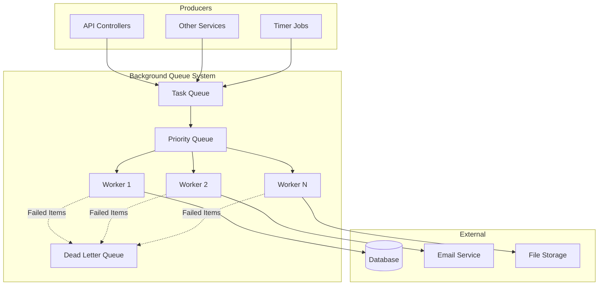
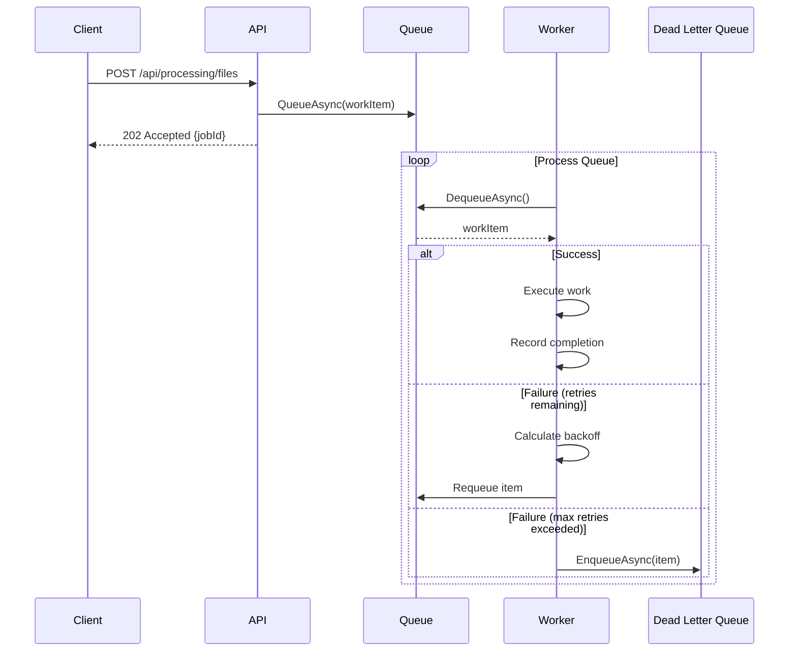
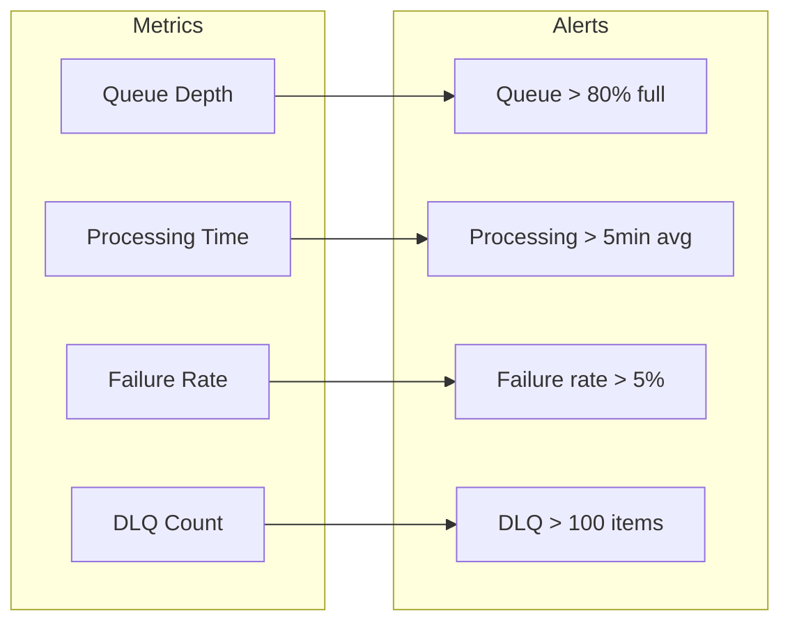

# How to Implement Custom Background Queue in .NET

Author: [nawazdhandala](https://github.com/nawazdhandala)

Tags: .NET, C#, Background Queue, Async Processing, Channels, BackgroundService

Description: Build a production-ready background queue in .NET with priority support, retry policies, dead letter handling, and monitoring. Learn to process tasks asynchronously without external dependencies.

---

Background queues let you offload work from your request handling path, improving response times and system resilience. While message brokers like RabbitMQ or Azure Service Bus are excellent for distributed systems, sometimes you need an in-process queue that is simple to deploy and has no external dependencies. This post walks through building a custom background queue in .NET that handles the complexities of production workloads.

## Why Build a Custom Queue?

Before reaching for an external message broker, consider whether an in-process queue meets your needs:

| Scenario | In-Process Queue | External Broker |
|----------|------------------|-----------------|
| Single service deployment | Good fit | Overkill |
| Work survives process restart | No | Yes |
| Distributed consumers | No | Yes |
| Simple setup, no ops overhead | Yes | Requires infrastructure |
| Latency sensitive | Lower latency | Network hop overhead |
| Horizontal scaling | Limited | Built-in support |

If your workload runs on a single instance and you can accept that queued items are lost on restart (or you add persistence), an in-process queue works well.

## Architecture Overview

The queue system consists of several components working together. Here is the high-level design:



## Building the Queue Interface

Start by defining the contract for your background queue. This interface supports both simple task queuing and typed work items with metadata.

The interface below defines three key operations: queuing a simple function, queuing a typed work item, and dequeuing items for processing.

```csharp
using System.Threading.Channels;

namespace BackgroundQueue;

// Represents a unit of work with metadata for tracking and prioritization
public class BackgroundWorkItem
{
    public string Id { get; init; } = Guid.NewGuid().ToString();
    public string Type { get; init; } = string.Empty;
    public int Priority { get; init; } = 0;
    public int RetryCount { get; set; } = 0;
    public int MaxRetries { get; init; } = 3;
    public DateTime CreatedAt { get; init; } = DateTime.UtcNow;
    public DateTime? StartedAt { get; set; }
    public DateTime? CompletedAt { get; set; }
    public string? ErrorMessage { get; set; }
    public Func<IServiceProvider, CancellationToken, Task> WorkAction { get; init; } = null!;
}

// The main interface for the background queue
public interface IBackgroundQueue
{
    // Queue a simple action to run in the background
    ValueTask QueueAsync(
        Func<IServiceProvider, CancellationToken, Task> workItem,
        CancellationToken cancellationToken = default);

    // Queue a work item with priority and metadata
    ValueTask QueueAsync(
        BackgroundWorkItem workItem,
        CancellationToken cancellationToken = default);

    // Dequeue the next item for processing (blocks until available)
    ValueTask<BackgroundWorkItem> DequeueAsync(
        CancellationToken cancellationToken);

    // Get current queue statistics
    QueueStatistics GetStatistics();
}

// Statistics for monitoring the queue health
public class QueueStatistics
{
    public int QueuedCount { get; init; }
    public int ProcessingCount { get; init; }
    public int CompletedCount { get; init; }
    public int FailedCount { get; init; }
    public int DeadLetterCount { get; init; }
}
```

## Implementing the Queue with Channels

The `System.Threading.Channels` namespace provides a high-performance, thread-safe queue implementation. Use a bounded channel to apply backpressure when the queue fills up.

The implementation below uses a `PriorityQueue` internally to ensure high-priority items are processed first. A semaphore coordinates access between the channel reader and the priority queue.

```csharp
using System.Threading.Channels;

namespace BackgroundQueue;

public class BackgroundQueue : IBackgroundQueue
{
    private readonly Channel<BackgroundWorkItem> _channel;
    private readonly PriorityQueue<BackgroundWorkItem, int> _priorityQueue;
    private readonly SemaphoreSlim _priorityLock = new(1, 1);
    private readonly ILogger<BackgroundQueue> _logger;

    // Counters for statistics
    private int _completedCount;
    private int _failedCount;
    private int _processingCount;

    public BackgroundQueue(
        ILogger<BackgroundQueue> logger,
        IOptions<BackgroundQueueOptions> options)
    {
        _logger = logger;

        // Create a bounded channel with backpressure
        // When the queue is full, QueueAsync will wait
        var channelOptions = new BoundedChannelOptions(options.Value.Capacity)
        {
            FullMode = BoundedChannelFullMode.Wait,
            SingleReader = false,
            SingleWriter = false
        };

        _channel = Channel.CreateBounded<BackgroundWorkItem>(channelOptions);
        _priorityQueue = new PriorityQueue<BackgroundWorkItem, int>();
    }

    public async ValueTask QueueAsync(
        Func<IServiceProvider, CancellationToken, Task> workItem,
        CancellationToken cancellationToken = default)
    {
        var item = new BackgroundWorkItem
        {
            WorkAction = workItem,
            Type = "Anonymous"
        };

        await QueueAsync(item, cancellationToken);
    }

    public async ValueTask QueueAsync(
        BackgroundWorkItem workItem,
        CancellationToken cancellationToken = default)
    {
        ArgumentNullException.ThrowIfNull(workItem);
        ArgumentNullException.ThrowIfNull(workItem.WorkAction);

        await _channel.Writer.WriteAsync(workItem, cancellationToken);

        _logger.LogDebug(
            "Queued work item {ItemId} with priority {Priority}",
            workItem.Id,
            workItem.Priority);
    }

    public async ValueTask<BackgroundWorkItem> DequeueAsync(
        CancellationToken cancellationToken)
    {
        // First, drain the channel into the priority queue
        await _priorityLock.WaitAsync(cancellationToken);
        try
        {
            // Move all available items from channel to priority queue
            while (_channel.Reader.TryRead(out var item))
            {
                // Use negative priority so higher priority values come first
                _priorityQueue.Enqueue(item, -item.Priority);
            }

            // If priority queue has items, return the highest priority one
            if (_priorityQueue.TryDequeue(out var priorityItem, out _))
            {
                Interlocked.Increment(ref _processingCount);
                return priorityItem;
            }
        }
        finally
        {
            _priorityLock.Release();
        }

        // No items available, wait for one from the channel
        var newItem = await _channel.Reader.ReadAsync(cancellationToken);
        Interlocked.Increment(ref _processingCount);
        return newItem;
    }

    public void RecordCompletion(bool success)
    {
        Interlocked.Decrement(ref _processingCount);

        if (success)
        {
            Interlocked.Increment(ref _completedCount);
        }
        else
        {
            Interlocked.Increment(ref _failedCount);
        }
    }

    public QueueStatistics GetStatistics()
    {
        return new QueueStatistics
        {
            QueuedCount = _channel.Reader.Count + _priorityQueue.Count,
            ProcessingCount = _processingCount,
            CompletedCount = _completedCount,
            FailedCount = _failedCount
        };
    }
}

// Configuration options for the queue
public class BackgroundQueueOptions
{
    public int Capacity { get; set; } = 1000;
    public int WorkerCount { get; set; } = 4;
    public int MaxRetries { get; set; } = 3;
    public TimeSpan ProcessingTimeout { get; set; } = TimeSpan.FromMinutes(5);
}
```

## Building the Queue Processor

The queue processor is a `BackgroundService` that continuously dequeues and processes work items. It runs multiple worker tasks in parallel for throughput.

The processor handles retries with exponential backoff and sends permanently failed items to a dead letter queue for investigation.

```csharp
using Microsoft.Extensions.Hosting;

namespace BackgroundQueue;

public class BackgroundQueueProcessor : BackgroundService
{
    private readonly IBackgroundQueue _queue;
    private readonly IDeadLetterQueue _deadLetterQueue;
    private readonly IServiceProvider _serviceProvider;
    private readonly ILogger<BackgroundQueueProcessor> _logger;
    private readonly BackgroundQueueOptions _options;

    public BackgroundQueueProcessor(
        IBackgroundQueue queue,
        IDeadLetterQueue deadLetterQueue,
        IServiceProvider serviceProvider,
        ILogger<BackgroundQueueProcessor> logger,
        IOptions<BackgroundQueueOptions> options)
    {
        _queue = queue;
        _deadLetterQueue = deadLetterQueue;
        _serviceProvider = serviceProvider;
        _logger = logger;
        _options = options.Value;
    }

    protected override async Task ExecuteAsync(CancellationToken stoppingToken)
    {
        _logger.LogInformation(
            "Background queue processor starting with {WorkerCount} workers",
            _options.WorkerCount);

        // Start multiple worker tasks for parallel processing
        var workers = Enumerable
            .Range(0, _options.WorkerCount)
            .Select(id => ProcessQueueAsync(id, stoppingToken))
            .ToArray();

        await Task.WhenAll(workers);

        _logger.LogInformation("Background queue processor stopped");
    }

    private async Task ProcessQueueAsync(int workerId, CancellationToken stoppingToken)
    {
        _logger.LogDebug("Worker {WorkerId} starting", workerId);

        while (!stoppingToken.IsCancellationRequested)
        {
            BackgroundWorkItem? workItem = null;

            try
            {
                // Wait for and dequeue the next item
                workItem = await _queue.DequeueAsync(stoppingToken);
                workItem.StartedAt = DateTime.UtcNow;

                _logger.LogInformation(
                    "Worker {WorkerId} processing item {ItemId} (attempt {Attempt}/{MaxRetries})",
                    workerId,
                    workItem.Id,
                    workItem.RetryCount + 1,
                    workItem.MaxRetries);

                // Create a timeout for this work item
                using var timeoutCts = CancellationTokenSource
                    .CreateLinkedTokenSource(stoppingToken);
                timeoutCts.CancelAfter(_options.ProcessingTimeout);

                // Execute the work with a scoped service provider
                using var scope = _serviceProvider.CreateScope();
                await workItem.WorkAction(scope.ServiceProvider, timeoutCts.Token);

                workItem.CompletedAt = DateTime.UtcNow;
                RecordCompletion(true);

                _logger.LogInformation(
                    "Worker {WorkerId} completed item {ItemId} in {Duration}ms",
                    workerId,
                    workItem.Id,
                    (workItem.CompletedAt - workItem.StartedAt)?.TotalMilliseconds);
            }
            catch (OperationCanceledException) when (stoppingToken.IsCancellationRequested)
            {
                // Shutdown requested, exit cleanly
                _logger.LogDebug("Worker {WorkerId} received shutdown signal", workerId);
                break;
            }
            catch (OperationCanceledException) when (workItem != null)
            {
                // Work item timed out
                _logger.LogWarning(
                    "Work item {ItemId} timed out after {Timeout}",
                    workItem.Id,
                    _options.ProcessingTimeout);

                await HandleFailureAsync(workItem, "Processing timeout exceeded");
            }
            catch (Exception ex) when (workItem != null)
            {
                _logger.LogError(
                    ex,
                    "Worker {WorkerId} failed processing item {ItemId}",
                    workerId,
                    workItem.Id);

                await HandleFailureAsync(workItem, ex.Message);
            }
        }

        _logger.LogDebug("Worker {WorkerId} stopped", workerId);
    }

    private async Task HandleFailureAsync(BackgroundWorkItem workItem, string errorMessage)
    {
        workItem.RetryCount++;
        workItem.ErrorMessage = errorMessage;

        if (workItem.RetryCount < workItem.MaxRetries)
        {
            // Calculate exponential backoff delay
            var delay = TimeSpan.FromSeconds(Math.Pow(2, workItem.RetryCount));

            _logger.LogWarning(
                "Retrying item {ItemId} in {Delay}s (attempt {Attempt}/{MaxRetries})",
                workItem.Id,
                delay.TotalSeconds,
                workItem.RetryCount + 1,
                workItem.MaxRetries);

            // Wait before requeuing
            await Task.Delay(delay);

            // Requeue for retry
            await _queue.QueueAsync(workItem);
        }
        else
        {
            // Max retries exceeded, send to dead letter queue
            _logger.LogError(
                "Work item {ItemId} failed permanently after {MaxRetries} attempts: {Error}",
                workItem.Id,
                workItem.MaxRetries,
                errorMessage);

            await _deadLetterQueue.EnqueueAsync(workItem);
            RecordCompletion(false);
        }
    }

    private void RecordCompletion(bool success)
    {
        if (_queue is BackgroundQueue bgQueue)
        {
            bgQueue.RecordCompletion(success);
        }
    }
}
```

## Implementing a Dead Letter Queue

Failed items need a place to go for investigation and potential reprocessing. The dead letter queue stores items that exceeded their retry limit.

This implementation stores dead letters in memory, but you can extend it to persist to a database for durability.

```csharp
namespace BackgroundQueue;

public interface IDeadLetterQueue
{
    ValueTask EnqueueAsync(BackgroundWorkItem item);
    IReadOnlyList<DeadLetterItem> GetItems(int limit = 100);
    bool TryRemove(string itemId);
    int Count { get; }
}

public class DeadLetterItem
{
    public BackgroundWorkItem OriginalItem { get; init; } = null!;
    public DateTime FailedAt { get; init; }
    public string Reason { get; init; } = string.Empty;
}

public class InMemoryDeadLetterQueue : IDeadLetterQueue
{
    private readonly ConcurrentDictionary<string, DeadLetterItem> _items = new();
    private readonly ILogger<InMemoryDeadLetterQueue> _logger;
    private readonly int _maxItems;

    public InMemoryDeadLetterQueue(
        ILogger<InMemoryDeadLetterQueue> logger,
        IOptions<DeadLetterQueueOptions>? options = null)
    {
        _logger = logger;
        _maxItems = options?.Value.MaxItems ?? 10000;
    }

    public int Count => _items.Count;

    public ValueTask EnqueueAsync(BackgroundWorkItem item)
    {
        // Evict oldest items if at capacity
        while (_items.Count >= _maxItems)
        {
            var oldest = _items
                .OrderBy(x => x.Value.FailedAt)
                .FirstOrDefault();

            if (oldest.Key != null)
            {
                _items.TryRemove(oldest.Key, out _);
            }
        }

        var deadLetterItem = new DeadLetterItem
        {
            OriginalItem = item,
            FailedAt = DateTime.UtcNow,
            Reason = item.ErrorMessage ?? "Unknown error"
        };

        _items.TryAdd(item.Id, deadLetterItem);

        _logger.LogWarning(
            "Added item {ItemId} to dead letter queue. Total items: {Count}",
            item.Id,
            _items.Count);

        return ValueTask.CompletedTask;
    }

    public IReadOnlyList<DeadLetterItem> GetItems(int limit = 100)
    {
        return _items.Values
            .OrderByDescending(x => x.FailedAt)
            .Take(limit)
            .ToList();
    }

    public bool TryRemove(string itemId)
    {
        return _items.TryRemove(itemId, out _);
    }
}

public class DeadLetterQueueOptions
{
    public int MaxItems { get; set; } = 10000;
}
```

## Using the Queue from Controllers

With the queue infrastructure in place, you can easily offload work from your API endpoints. The controller returns immediately while processing happens in the background.

The example below shows an API that accepts file processing requests and queues them for background handling.

```csharp
using Microsoft.AspNetCore.Mvc;

namespace BackgroundQueue.Controllers;

[ApiController]
[Route("api/[controller]")]
public class ProcessingController : ControllerBase
{
    private readonly IBackgroundQueue _queue;
    private readonly ILogger<ProcessingController> _logger;

    public ProcessingController(
        IBackgroundQueue queue,
        ILogger<ProcessingController> logger)
    {
        _queue = queue;
        _logger = logger;
    }

    [HttpPost("files")]
    public async Task<IActionResult> ProcessFile([FromBody] FileProcessingRequest request)
    {
        var jobId = Guid.NewGuid().ToString();

        // Capture the file path to use in the background work
        var filePath = request.FilePath;

        await _queue.QueueAsync(new BackgroundWorkItem
        {
            Id = jobId,
            Type = "FileProcessing",
            Priority = request.Priority,
            MaxRetries = 3,
            WorkAction = async (services, cancellationToken) =>
            {
                var processor = services.GetRequiredService<IFileProcessor>();
                await processor.ProcessAsync(filePath, cancellationToken);
            }
        });

        _logger.LogInformation(
            "Queued file processing job {JobId} for {FilePath}",
            jobId,
            filePath);

        return Accepted(new
        {
            JobId = jobId,
            Status = "Queued",
            Message = "File processing has been queued"
        });
    }

    [HttpPost("emails")]
    public async Task<IActionResult> SendEmail([FromBody] EmailRequest request)
    {
        var jobId = Guid.NewGuid().ToString();

        await _queue.QueueAsync(new BackgroundWorkItem
        {
            Id = jobId,
            Type = "EmailSending",
            Priority = 10, // Higher priority for emails
            MaxRetries = 5,
            WorkAction = async (services, cancellationToken) =>
            {
                var emailService = services.GetRequiredService<IEmailService>();
                await emailService.SendAsync(
                    request.To,
                    request.Subject,
                    request.Body,
                    cancellationToken);
            }
        });

        return Accepted(new { JobId = jobId, Status = "Queued" });
    }

    [HttpGet("stats")]
    public IActionResult GetStatistics()
    {
        var stats = _queue.GetStatistics();
        return Ok(stats);
    }
}

public record FileProcessingRequest(string FilePath, int Priority = 0);
public record EmailRequest(string To, string Subject, string Body);
```

## Adding Health Checks

Monitor queue health with custom health checks that alert when the queue is backing up or workers are failing.

The health check reports degraded status when the queue grows too large and unhealthy when processing has stalled completely.

```csharp
using Microsoft.Extensions.Diagnostics.HealthChecks;

namespace BackgroundQueue;

public class BackgroundQueueHealthCheck : IHealthCheck
{
    private readonly IBackgroundQueue _queue;
    private readonly IDeadLetterQueue _deadLetterQueue;
    private readonly BackgroundQueueOptions _options;

    public BackgroundQueueHealthCheck(
        IBackgroundQueue queue,
        IDeadLetterQueue deadLetterQueue,
        IOptions<BackgroundQueueOptions> options)
    {
        _queue = queue;
        _deadLetterQueue = deadLetterQueue;
        _options = options.Value;
    }

    public Task<HealthCheckResult> CheckHealthAsync(
        HealthCheckContext context,
        CancellationToken cancellationToken = default)
    {
        var stats = _queue.GetStatistics();
        var data = new Dictionary<string, object>
        {
            ["queued"] = stats.QueuedCount,
            ["processing"] = stats.ProcessingCount,
            ["completed"] = stats.CompletedCount,
            ["failed"] = stats.FailedCount,
            ["deadLetterCount"] = _deadLetterQueue.Count
        };

        // Check if queue is backing up (more than 80% full)
        var queueUtilization = (double)stats.QueuedCount / _options.Capacity;
        if (queueUtilization > 0.8)
        {
            return Task.FromResult(HealthCheckResult.Degraded(
                $"Queue is {queueUtilization:P0} full ({stats.QueuedCount}/{_options.Capacity})",
                data: data));
        }

        // Check dead letter queue
        if (_deadLetterQueue.Count > 100)
        {
            return Task.FromResult(HealthCheckResult.Degraded(
                $"Dead letter queue has {_deadLetterQueue.Count} items",
                data: data));
        }

        // Check if processing is stalled (items queued but none processing)
        if (stats.QueuedCount > 10 && stats.ProcessingCount == 0)
        {
            return Task.FromResult(HealthCheckResult.Unhealthy(
                "Queue has items but no workers are processing",
                data: data));
        }

        return Task.FromResult(HealthCheckResult.Healthy(
            "Queue is operating normally",
            data: data));
    }
}
```

## Wiring Everything Up

Register all the queue components in your `Program.cs`. The configuration supports customizing capacity, worker count, and retry behavior.

```csharp
using BackgroundQueue;

var builder = WebApplication.CreateBuilder(args);

// Configure queue options from appsettings.json
builder.Services.Configure<BackgroundQueueOptions>(
    builder.Configuration.GetSection("BackgroundQueue"));

builder.Services.Configure<DeadLetterQueueOptions>(
    builder.Configuration.GetSection("DeadLetterQueue"));

// Register the queue as a singleton (shared across the application)
builder.Services.AddSingleton<IBackgroundQueue, BackgroundQueue.BackgroundQueue>();
builder.Services.AddSingleton<IDeadLetterQueue, InMemoryDeadLetterQueue>();

// Register the background processor
builder.Services.AddHostedService<BackgroundQueueProcessor>();

// Register your work item processors
builder.Services.AddScoped<IFileProcessor, FileProcessor>();
builder.Services.AddScoped<IEmailService, EmailService>();

// Add health checks
builder.Services.AddHealthChecks()
    .AddCheck<BackgroundQueueHealthCheck>("background-queue");

builder.Services.AddControllers();

var app = builder.Build();

app.MapControllers();
app.MapHealthChecks("/health");

app.Run();
```

Add the configuration to `appsettings.json`:

```json
{
  "BackgroundQueue": {
    "Capacity": 1000,
    "WorkerCount": 4,
    "MaxRetries": 3,
    "ProcessingTimeout": "00:05:00"
  },
  "DeadLetterQueue": {
    "MaxItems": 10000
  }
}
```

## Processing Flow Visualization

Here is how a work item flows through the system from submission to completion:



## Adding Persistence for Durability

For scenarios where you cannot lose queued items during restarts, add persistence to the queue. This extension stores items in a database before they enter the in-memory queue.

The persistent queue writes items to the database immediately, ensuring they survive process restarts. A recovery service requeues any unprocessed items on startup.

```csharp
using Microsoft.EntityFrameworkCore;

namespace BackgroundQueue.Persistence;

// Entity for storing queued items
public class PersistedWorkItem
{
    public string Id { get; set; } = string.Empty;
    public string Type { get; set; } = string.Empty;
    public int Priority { get; set; }
    public int RetryCount { get; set; }
    public int MaxRetries { get; set; }
    public DateTime CreatedAt { get; set; }
    public DateTime? StartedAt { get; set; }
    public DateTime? CompletedAt { get; set; }
    public string? ErrorMessage { get; set; }
    public string SerializedPayload { get; set; } = string.Empty;
    public WorkItemStatus Status { get; set; }
}

public enum WorkItemStatus
{
    Queued,
    Processing,
    Completed,
    Failed
}

// DbContext for work items
public class WorkItemDbContext : DbContext
{
    public WorkItemDbContext(DbContextOptions<WorkItemDbContext> options)
        : base(options)
    {
    }

    public DbSet<PersistedWorkItem> WorkItems => Set<PersistedWorkItem>();

    protected override void OnModelCreating(ModelBuilder modelBuilder)
    {
        modelBuilder.Entity<PersistedWorkItem>(entity =>
        {
            entity.HasKey(e => e.Id);
            entity.HasIndex(e => e.Status);
            entity.HasIndex(e => new { e.Status, e.Priority });
        });
    }
}

// Service to recover items on startup
public class QueueRecoveryService : IHostedService
{
    private readonly IServiceProvider _serviceProvider;
    private readonly IBackgroundQueue _queue;
    private readonly ILogger<QueueRecoveryService> _logger;

    public QueueRecoveryService(
        IServiceProvider serviceProvider,
        IBackgroundQueue queue,
        ILogger<QueueRecoveryService> logger)
    {
        _serviceProvider = serviceProvider;
        _queue = queue;
        _logger = logger;
    }

    public async Task StartAsync(CancellationToken cancellationToken)
    {
        _logger.LogInformation("Starting queue recovery");

        using var scope = _serviceProvider.CreateScope();
        var dbContext = scope.ServiceProvider.GetRequiredService<WorkItemDbContext>();

        // Find items that were queued or processing when the app shut down
        var pendingItems = await dbContext.WorkItems
            .Where(x => x.Status == WorkItemStatus.Queued ||
                        x.Status == WorkItemStatus.Processing)
            .OrderByDescending(x => x.Priority)
            .ThenBy(x => x.CreatedAt)
            .ToListAsync(cancellationToken);

        _logger.LogInformation("Found {Count} items to recover", pendingItems.Count);

        foreach (var item in pendingItems)
        {
            // Reset processing items back to queued
            item.Status = WorkItemStatus.Queued;
            item.StartedAt = null;

            // Note: You'll need a way to reconstruct the WorkAction
            // This typically involves storing the work type and parameters
            // and using a factory to recreate the action

            _logger.LogDebug("Recovered item {ItemId}", item.Id);
        }

        await dbContext.SaveChangesAsync(cancellationToken);

        _logger.LogInformation("Queue recovery complete");
    }

    public Task StopAsync(CancellationToken cancellationToken) => Task.CompletedTask;
}
```

## Testing the Queue

Write integration tests to verify your queue behaves correctly under load and handles failures gracefully.

```csharp
using Microsoft.Extensions.DependencyInjection;
using Microsoft.Extensions.Hosting;

namespace BackgroundQueue.Tests;

public class BackgroundQueueTests
{
    [Fact]
    public async Task Queue_ProcessesItemsInPriorityOrder()
    {
        // Arrange
        var services = new ServiceCollection();
        services.AddLogging();
        services.Configure<BackgroundQueueOptions>(opt =>
        {
            opt.Capacity = 100;
            opt.WorkerCount = 1;
        });
        services.AddSingleton<IBackgroundQueue, BackgroundQueue>();

        var provider = services.BuildServiceProvider();
        var queue = provider.GetRequiredService<IBackgroundQueue>();

        var processedOrder = new List<int>();
        var completionSource = new TaskCompletionSource();

        // Act - Queue items with different priorities
        await queue.QueueAsync(new BackgroundWorkItem
        {
            Priority = 1,
            WorkAction = async (sp, ct) =>
            {
                processedOrder.Add(1);
                await Task.Delay(10, ct);
            }
        });

        await queue.QueueAsync(new BackgroundWorkItem
        {
            Priority = 3, // Highest priority
            WorkAction = async (sp, ct) =>
            {
                processedOrder.Add(3);
                await Task.Delay(10, ct);
            }
        });

        await queue.QueueAsync(new BackgroundWorkItem
        {
            Priority = 2,
            WorkAction = async (sp, ct) =>
            {
                processedOrder.Add(2);
                await Task.Delay(10, ct);
                completionSource.SetResult();
            }
        });

        // Process items
        for (int i = 0; i < 3; i++)
        {
            var item = await queue.DequeueAsync(CancellationToken.None);
            await item.WorkAction(provider, CancellationToken.None);
        }

        // Assert - Higher priority items should be processed first
        Assert.Equal(new[] { 3, 2, 1 }, processedOrder);
    }

    [Fact]
    public async Task Queue_AppliesBackpressureWhenFull()
    {
        // Arrange
        var services = new ServiceCollection();
        services.AddLogging();
        services.Configure<BackgroundQueueOptions>(opt =>
        {
            opt.Capacity = 2; // Very small queue
        });
        services.AddSingleton<IBackgroundQueue, BackgroundQueue>();

        var provider = services.BuildServiceProvider();
        var queue = provider.GetRequiredService<IBackgroundQueue>();

        // Act - Fill the queue
        await queue.QueueAsync(new BackgroundWorkItem
        {
            WorkAction = (sp, ct) => Task.CompletedTask
        });

        await queue.QueueAsync(new BackgroundWorkItem
        {
            WorkAction = (sp, ct) => Task.CompletedTask
        });

        // This should block (or timeout)
        var queueTask = queue.QueueAsync(new BackgroundWorkItem
        {
            WorkAction = (sp, ct) => Task.CompletedTask
        }, new CancellationTokenSource(100).Token);

        // Assert
        await Assert.ThrowsAsync<OperationCanceledException>(
            async () => await queueTask);
    }
}
```

## Performance Considerations

When deploying to production, keep these performance factors in mind:

| Factor | Recommendation |
|--------|----------------|
| Worker count | Start with CPU core count, adjust based on I/O patterns |
| Queue capacity | Size based on peak load and acceptable memory usage |
| Timeout duration | Long enough for legitimate work, short enough to detect hangs |
| Retry delays | Use exponential backoff to avoid thundering herd |
| Dead letter limit | Cap to prevent unbounded memory growth |

## Monitoring Recommendations

Track these metrics to understand queue health:



Expose metrics through your health check endpoint or integrate with your observability platform.

## Summary

Building a custom background queue in .NET gives you fine-grained control over async processing without external dependencies. Key takeaways:

- Use `System.Threading.Channels` for the underlying queue implementation
- Implement priority processing with `PriorityQueue<T, TPriority>`
- Add retry logic with exponential backoff for transient failures
- Route permanently failed items to a dead letter queue
- Monitor queue depth, processing time, and failure rates
- Consider persistence if you cannot afford to lose queued items

This approach works well for single-instance deployments and moderate workloads. For distributed systems or high availability requirements, consider message brokers like RabbitMQ or Azure Service Bus.
