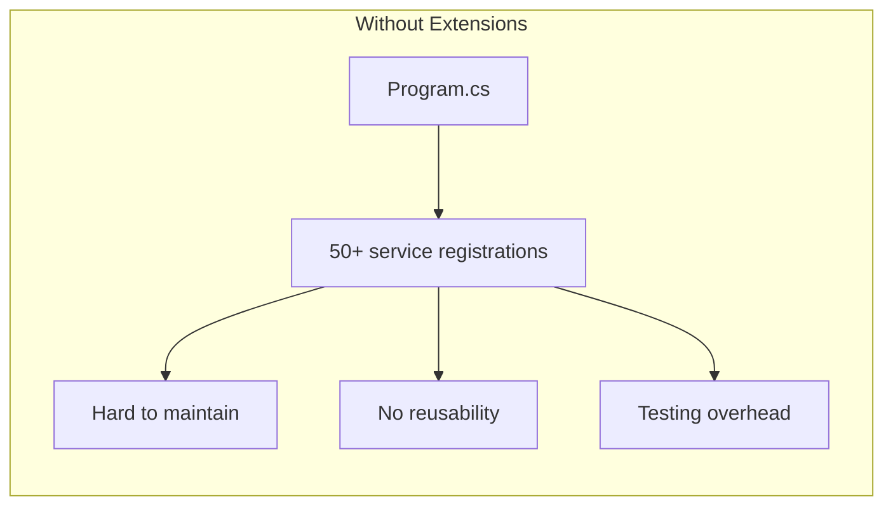
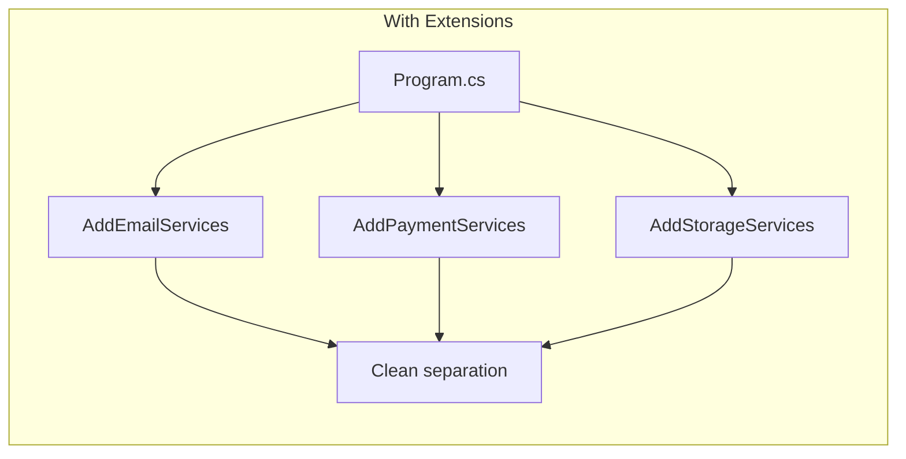
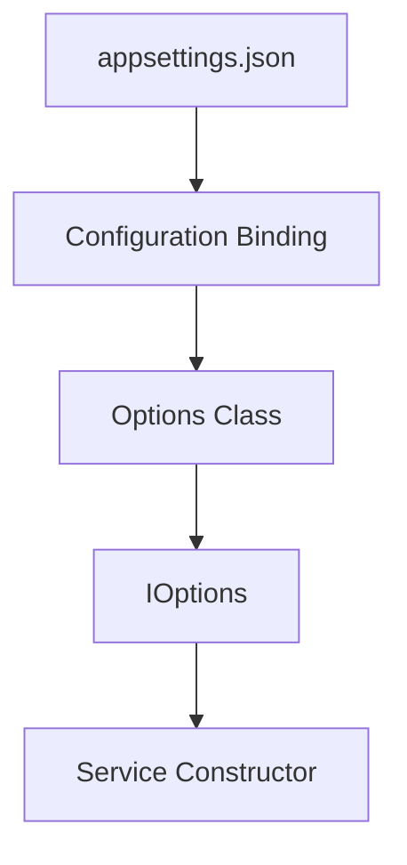
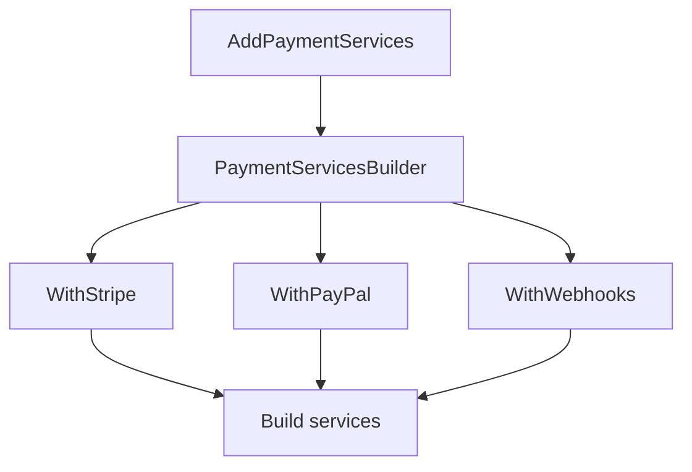

# How to Create Custom DI Extensions in .NET

Author: [nawazdhandala](https://github.com/nawazdhandala)

Tags: .NET, C#, Dependency Injection, IServiceCollection, ASP.NET Core, Extensions, Architecture

Description: Learn how to build production-ready custom dependency injection extensions in .NET. This guide covers extension method patterns, service registration conventions, configuration binding, and validation techniques.

---

Extension methods on `IServiceCollection` are the standard way to package and distribute service registrations in .NET. Every library you use, from Entity Framework to MediatR, provides these extensions. Building your own makes your code modular, testable, and easy to maintain.

## Why Build Custom DI Extensions?

Before diving into code, let us understand why this pattern matters.





The pattern provides several benefits:

1. **Encapsulation**: All related services registered in one place
2. **Reusability**: Extensions can be shared across projects or packaged as NuGet packages
3. **Configuration**: Bind options and validate settings at startup
4. **Testability**: Swap entire subsystems in integration tests

## Basic Extension Method Pattern

The foundation of every DI extension is an extension method on `IServiceCollection`. Here is the simplest form.

This extension registers a notification service with its dependencies. The method returns the service collection to enable method chaining.

```csharp
// Extensions/NotificationServiceExtensions.cs
using Microsoft.Extensions.DependencyInjection;

namespace MyApp.Extensions;

public static class NotificationServiceExtensions
{
    // Extension method that registers all notification-related services
    public static IServiceCollection AddNotificationServices(
        this IServiceCollection services)
    {
        // Register the main notification service as scoped
        // Scoped lifetime ensures one instance per request
        services.AddScoped<INotificationService, NotificationService>();

        // Register channel implementations
        services.AddTransient<IEmailChannel, SmtpEmailChannel>();
        services.AddTransient<ISmsChannel, TwilioSmsChannel>();
        services.AddTransient<IPushChannel, FirebasePushChannel>();

        // Return services to enable method chaining
        return services;
    }
}
```

Usage in Program.cs becomes simple and readable.

```csharp
// Program.cs
var builder = WebApplication.CreateBuilder(args);

// One line replaces multiple service registrations
builder.Services.AddNotificationServices();

var app = builder.Build();
```

## Adding Configuration Support

Production extensions need configuration. The Options pattern provides type-safe settings binding.



First, define your options class. This class represents the configuration schema.

```csharp
// Options/EmailOptions.cs
namespace MyApp.Options;

public class EmailOptions
{
    // The configuration section name in appsettings.json
    public const string SectionName = "Email";

    public string SmtpHost { get; set; } = "localhost";
    public int SmtpPort { get; set; } = 587;
    public string FromAddress { get; set; } = string.Empty;
    public string FromName { get; set; } = "MyApp";
    public bool UseSsl { get; set; } = true;

    // Credentials stored separately for security
    public string? Username { get; set; }
    public string? Password { get; set; }
}
```

Now create an extension that binds configuration to the options class.

```csharp
// Extensions/EmailServiceExtensions.cs
using Microsoft.Extensions.Configuration;
using Microsoft.Extensions.DependencyInjection;
using MyApp.Options;
using MyApp.Services;

namespace MyApp.Extensions;

public static class EmailServiceExtensions
{
    // Extension accepts IConfiguration to bind options
    public static IServiceCollection AddEmailServices(
        this IServiceCollection services,
        IConfiguration configuration)
    {
        // Bind the Email section from appsettings.json to EmailOptions
        services.Configure<EmailOptions>(
            configuration.GetSection(EmailOptions.SectionName));

        // Register the email service that will consume these options
        services.AddTransient<IEmailService, SmtpEmailService>();

        return services;
    }
}
```

The service consumes options through constructor injection.

```csharp
// Services/SmtpEmailService.cs
using Microsoft.Extensions.Options;
using MyApp.Options;

namespace MyApp.Services;

public class SmtpEmailService : IEmailService
{
    private readonly EmailOptions _options;

    // IOptions<T> provides access to the configured values
    public SmtpEmailService(IOptions<EmailOptions> options)
    {
        _options = options.Value;
    }

    public async Task SendEmailAsync(string to, string subject, string body)
    {
        using var client = new SmtpClient(_options.SmtpHost, _options.SmtpPort);
        client.EnableSsl = _options.UseSsl;

        if (!string.IsNullOrEmpty(_options.Username))
        {
            client.Credentials = new NetworkCredential(
                _options.Username,
                _options.Password);
        }

        var message = new MailMessage(
            new MailAddress(_options.FromAddress, _options.FromName),
            new MailAddress(to))
        {
            Subject = subject,
            Body = body,
            IsBodyHtml = true
        };

        await client.SendMailAsync(message);
    }
}
```

Your appsettings.json provides the configuration values.

```json
{
  "Email": {
    "SmtpHost": "smtp.sendgrid.net",
    "SmtpPort": 587,
    "FromAddress": "notifications@myapp.com",
    "FromName": "MyApp Notifications",
    "UseSsl": true,
    "Username": "apikey",
    "Password": "your-sendgrid-api-key"
  }
}
```

## Action-Based Configuration

Sometimes you want to configure options programmatically without configuration files. The Action pattern provides this flexibility.

```csharp
// Extensions/EmailServiceExtensions.cs
public static class EmailServiceExtensions
{
    // Overload that accepts an Action for programmatic configuration
    public static IServiceCollection AddEmailServices(
        this IServiceCollection services,
        Action<EmailOptions> configureOptions)
    {
        // Configure options using the provided action
        services.Configure(configureOptions);

        services.AddTransient<IEmailService, SmtpEmailService>();

        return services;
    }

    // Overload for configuration file binding
    public static IServiceCollection AddEmailServices(
        this IServiceCollection services,
        IConfiguration configuration)
    {
        services.Configure<EmailOptions>(
            configuration.GetSection(EmailOptions.SectionName));

        services.AddTransient<IEmailService, SmtpEmailService>();

        return services;
    }
}
```

Consumers can choose their preferred configuration style.

```csharp
// Option 1: From configuration file
builder.Services.AddEmailServices(builder.Configuration);

// Option 2: Programmatic configuration
builder.Services.AddEmailServices(options =>
{
    options.SmtpHost = "smtp.example.com";
    options.SmtpPort = 587;
    options.FromAddress = "noreply@example.com";
    options.UseSsl = true;
});
```

## Options Validation

Invalid configuration should fail fast at startup, not at runtime. .NET provides built-in validation support.

```csharp
// Options/EmailOptions.cs
using System.ComponentModel.DataAnnotations;

namespace MyApp.Options;

public class EmailOptions
{
    public const string SectionName = "Email";

    // Data annotations provide validation rules
    [Required(ErrorMessage = "SMTP host is required")]
    public string SmtpHost { get; set; } = string.Empty;

    [Range(1, 65535, ErrorMessage = "Port must be between 1 and 65535")]
    public int SmtpPort { get; set; } = 587;

    [Required(ErrorMessage = "From address is required")]
    [EmailAddress(ErrorMessage = "From address must be a valid email")]
    public string FromAddress { get; set; } = string.Empty;

    public string FromName { get; set; } = "MyApp";

    public bool UseSsl { get; set; } = true;

    public string? Username { get; set; }
    public string? Password { get; set; }
}
```

Update the extension to validate options at startup.

```csharp
// Extensions/EmailServiceExtensions.cs
public static IServiceCollection AddEmailServices(
    this IServiceCollection services,
    IConfiguration configuration)
{
    // AddOptions returns an OptionsBuilder for fluent configuration
    services.AddOptions<EmailOptions>()
        // Bind to configuration section
        .Bind(configuration.GetSection(EmailOptions.SectionName))
        // Validate using data annotations
        .ValidateDataAnnotations()
        // Validate immediately on startup instead of first use
        .ValidateOnStart();

    services.AddTransient<IEmailService, SmtpEmailService>();

    return services;
}
```

For complex validation logic, implement `IValidateOptions<T>`.

```csharp
// Validation/EmailOptionsValidator.cs
using Microsoft.Extensions.Options;
using MyApp.Options;

namespace MyApp.Validation;

public class EmailOptionsValidator : IValidateOptions<EmailOptions>
{
    public ValidateOptionsResult Validate(string? name, EmailOptions options)
    {
        var failures = new List<string>();

        // Custom validation: if username provided, password required
        if (!string.IsNullOrEmpty(options.Username) &&
            string.IsNullOrEmpty(options.Password))
        {
            failures.Add("Password is required when Username is provided");
        }

        // Validate SSL requirement for production ports
        if (options.SmtpPort == 465 && !options.UseSsl)
        {
            failures.Add("SSL must be enabled when using port 465");
        }

        // Validate from address domain matches expected patterns
        if (!string.IsNullOrEmpty(options.FromAddress))
        {
            var domain = options.FromAddress.Split('@').LastOrDefault();
            if (domain != null && domain.EndsWith(".local"))
            {
                failures.Add("Production email cannot use .local domain");
            }
        }

        return failures.Count > 0
            ? ValidateOptionsResult.Fail(failures)
            : ValidateOptionsResult.Success;
    }
}
```

Register the validator in your extension.

```csharp
public static IServiceCollection AddEmailServices(
    this IServiceCollection services,
    IConfiguration configuration)
{
    // Register the custom validator
    services.AddSingleton<IValidateOptions<EmailOptions>, EmailOptionsValidator>();

    services.AddOptions<EmailOptions>()
        .Bind(configuration.GetSection(EmailOptions.SectionName))
        .ValidateDataAnnotations()
        .ValidateOnStart();

    services.AddTransient<IEmailService, SmtpEmailService>();

    return services;
}
```

## Builder Pattern for Complex Extensions

When extensions have many options and dependencies, use the builder pattern for better ergonomics.



First, create the builder class.

```csharp
// Extensions/PaymentServicesBuilder.cs
using Microsoft.Extensions.DependencyInjection;
using Microsoft.Extensions.Configuration;
using MyApp.Services.Payment;

namespace MyApp.Extensions;

public class PaymentServicesBuilder
{
    private readonly IServiceCollection _services;
    private readonly IConfiguration _configuration;

    // Track which providers are enabled
    private bool _stripeEnabled;
    private bool _paypalEnabled;
    private bool _webhooksEnabled;

    internal PaymentServicesBuilder(
        IServiceCollection services,
        IConfiguration configuration)
    {
        _services = services;
        _configuration = configuration;

        // Always register the core payment service
        _services.AddScoped<IPaymentService, PaymentService>();
    }

    // Enable Stripe payment processing
    public PaymentServicesBuilder WithStripe()
    {
        _services.AddOptions<StripeOptions>()
            .Bind(_configuration.GetSection("Payment:Stripe"))
            .ValidateDataAnnotations()
            .ValidateOnStart();

        _services.AddScoped<IPaymentProvider, StripePaymentProvider>();
        _stripeEnabled = true;

        return this;
    }

    // Enable PayPal payment processing
    public PaymentServicesBuilder WithPayPal()
    {
        _services.AddOptions<PayPalOptions>()
            .Bind(_configuration.GetSection("Payment:PayPal"))
            .ValidateDataAnnotations()
            .ValidateOnStart();

        _services.AddScoped<IPaymentProvider, PayPalPaymentProvider>();
        _paypalEnabled = true;

        return this;
    }

    // Enable webhook handling for payment events
    public PaymentServicesBuilder WithWebhooks(Action<WebhookOptions>? configure = null)
    {
        if (configure != null)
        {
            _services.Configure(configure);
        }
        else
        {
            _services.AddOptions<WebhookOptions>()
                .Bind(_configuration.GetSection("Payment:Webhooks"))
                .ValidateDataAnnotations();
        }

        _services.AddScoped<IWebhookHandler, PaymentWebhookHandler>();
        _webhooksEnabled = true;

        return this;
    }

    // Configure retry policy for failed payments
    public PaymentServicesBuilder WithRetryPolicy(int maxRetries = 3)
    {
        _services.Configure<PaymentRetryOptions>(options =>
        {
            options.MaxRetries = maxRetries;
            options.RetryDelaySeconds = 5;
        });

        _services.Decorate<IPaymentService, RetryingPaymentService>();

        return this;
    }
}
```

Create the entry point extension method.

```csharp
// Extensions/PaymentServiceExtensions.cs
using Microsoft.Extensions.Configuration;
using Microsoft.Extensions.DependencyInjection;

namespace MyApp.Extensions;

public static class PaymentServiceExtensions
{
    // Returns builder for fluent configuration
    public static PaymentServicesBuilder AddPaymentServices(
        this IServiceCollection services,
        IConfiguration configuration)
    {
        return new PaymentServicesBuilder(services, configuration);
    }
}
```

Usage is clean and expressive.

```csharp
// Program.cs
builder.Services
    .AddPaymentServices(builder.Configuration)
    .WithStripe()
    .WithPayPal()
    .WithWebhooks()
    .WithRetryPolicy(maxRetries: 5);
```

## Conditional Service Registration

Sometimes you need to register services based on configuration or environment.

```csharp
// Extensions/StorageServiceExtensions.cs
public static class StorageServiceExtensions
{
    public static IServiceCollection AddStorageServices(
        this IServiceCollection services,
        IConfiguration configuration,
        IWebHostEnvironment environment)
    {
        var storageType = configuration.GetValue<string>("Storage:Type");

        // Register different implementations based on configuration
        switch (storageType?.ToLowerInvariant())
        {
            case "azure":
                services.AddOptions<AzureBlobOptions>()
                    .Bind(configuration.GetSection("Storage:Azure"))
                    .ValidateDataAnnotations()
                    .ValidateOnStart();
                services.AddSingleton<IStorageService, AzureBlobStorageService>();
                break;

            case "s3":
                services.AddOptions<S3Options>()
                    .Bind(configuration.GetSection("Storage:S3"))
                    .ValidateDataAnnotations()
                    .ValidateOnStart();
                services.AddSingleton<IStorageService, S3StorageService>();
                break;

            case "local":
            default:
                // Use local storage in development or when not specified
                if (environment.IsDevelopment())
                {
                    services.AddSingleton<IStorageService, LocalFileStorageService>();
                }
                else
                {
                    throw new InvalidOperationException(
                        "Local storage is not supported in production. " +
                        "Configure Azure or S3 storage.");
                }
                break;
        }

        return services;
    }
}
```

## Preventing Duplicate Registrations

When multiple parts of your application might call the same extension, use `TryAdd` methods to prevent duplicates.

```csharp
// Extensions/CachingServiceExtensions.cs
using Microsoft.Extensions.DependencyInjection.Extensions;

public static class CachingServiceExtensions
{
    public static IServiceCollection AddCachingServices(
        this IServiceCollection services,
        IConfiguration configuration)
    {
        // TryAddSingleton only adds if not already registered
        // This prevents duplicate registrations
        services.TryAddSingleton<ICacheService, RedisCacheService>();

        // TryAddEnumerable allows multiple implementations of the same interface
        // but prevents duplicate implementations
        services.TryAddEnumerable(
            ServiceDescriptor.Singleton<ICacheInvalidator, UserCacheInvalidator>());
        services.TryAddEnumerable(
            ServiceDescriptor.Singleton<ICacheInvalidator, ProductCacheInvalidator>());

        // Configure options only if not already configured
        services.AddOptions<RedisOptions>()
            .Bind(configuration.GetSection("Redis"));

        return services;
    }
}
```

## Creating a Complete Module Extension

Here is a production-ready example that combines all the patterns into a complete feature module.

```csharp
// Extensions/OrderingModuleExtensions.cs
using Microsoft.Extensions.Configuration;
using Microsoft.Extensions.DependencyInjection;
using Microsoft.Extensions.DependencyInjection.Extensions;
using Microsoft.Extensions.Options;
using MyApp.Ordering.Options;
using MyApp.Ordering.Services;
using MyApp.Ordering.Repositories;
using MyApp.Ordering.Validation;

namespace MyApp.Ordering.Extensions;

public static class OrderingModuleExtensions
{
    /// <summary>
    /// Adds all ordering module services to the service collection.
    /// </summary>
    /// <param name="services">The service collection.</param>
    /// <param name="configuration">The configuration root.</param>
    /// <returns>The service collection for chaining.</returns>
    public static IServiceCollection AddOrderingModule(
        this IServiceCollection services,
        IConfiguration configuration)
    {
        // Register and validate options
        RegisterOptions(services, configuration);

        // Register repositories (data access)
        RegisterRepositories(services);

        // Register domain services
        RegisterServices(services);

        // Register background services
        RegisterBackgroundServices(services);

        return services;
    }

    private static void RegisterOptions(
        IServiceCollection services,
        IConfiguration configuration)
    {
        // Custom validator for complex validation rules
        services.AddSingleton<IValidateOptions<OrderingOptions>,
            OrderingOptionsValidator>();

        services.AddOptions<OrderingOptions>()
            .Bind(configuration.GetSection(OrderingOptions.SectionName))
            .ValidateDataAnnotations()
            .ValidateOnStart();

        services.AddOptions<InventoryOptions>()
            .Bind(configuration.GetSection("Ordering:Inventory"))
            .ValidateDataAnnotations()
            .ValidateOnStart();
    }

    private static void RegisterRepositories(IServiceCollection services)
    {
        // Repositories are scoped to share DbContext within a request
        services.TryAddScoped<IOrderRepository, OrderRepository>();
        services.TryAddScoped<IOrderItemRepository, OrderItemRepository>();
        services.TryAddScoped<IInventoryRepository, InventoryRepository>();

        // Unit of work pattern coordinates multiple repositories
        services.TryAddScoped<IOrderingUnitOfWork, OrderingUnitOfWork>();
    }

    private static void RegisterServices(IServiceCollection services)
    {
        // Core ordering service
        services.TryAddScoped<IOrderService, OrderService>();

        // Supporting services
        services.TryAddScoped<IOrderValidator, OrderValidator>();
        services.TryAddScoped<IPricingService, PricingService>();
        services.TryAddScoped<IInventoryService, InventoryService>();

        // Domain event handlers
        services.TryAddEnumerable(
            ServiceDescriptor.Scoped<IOrderEventHandler,
                OrderCreatedEventHandler>());
        services.TryAddEnumerable(
            ServiceDescriptor.Scoped<IOrderEventHandler,
                OrderCompletedEventHandler>());
    }

    private static void RegisterBackgroundServices(IServiceCollection services)
    {
        // Background service for processing abandoned carts
        services.AddHostedService<AbandonedCartProcessorService>();

        // Background service for inventory sync
        services.AddHostedService<InventorySyncService>();
    }
}
```

The options validator ensures business rules are satisfied at startup.

```csharp
// Validation/OrderingOptionsValidator.cs
using Microsoft.Extensions.Options;
using MyApp.Ordering.Options;

namespace MyApp.Ordering.Validation;

public class OrderingOptionsValidator : IValidateOptions<OrderingOptions>
{
    public ValidateOptionsResult Validate(string? name, OrderingOptions options)
    {
        var failures = new List<string>();

        if (options.MaxItemsPerOrder < 1)
        {
            failures.Add("MaxItemsPerOrder must be at least 1");
        }

        if (options.MaxItemsPerOrder > 1000)
        {
            failures.Add("MaxItemsPerOrder cannot exceed 1000");
        }

        if (options.OrderExpirationMinutes < 5)
        {
            failures.Add("OrderExpirationMinutes must be at least 5");
        }

        if (options.MinimumOrderAmount < 0)
        {
            failures.Add("MinimumOrderAmount cannot be negative");
        }

        if (string.IsNullOrWhiteSpace(options.DefaultCurrency))
        {
            failures.Add("DefaultCurrency is required");
        }
        else if (options.DefaultCurrency.Length != 3)
        {
            failures.Add("DefaultCurrency must be a 3-letter ISO code");
        }

        return failures.Count > 0
            ? ValidateOptionsResult.Fail(failures)
            : ValidateOptionsResult.Success;
    }
}
```

## Testing Extensions

Your extensions should be testable. Here is how to verify service registrations.

```csharp
// Tests/OrderingModuleExtensionsTests.cs
using Microsoft.Extensions.Configuration;
using Microsoft.Extensions.DependencyInjection;
using Microsoft.Extensions.Options;
using MyApp.Ordering.Extensions;
using MyApp.Ordering.Options;
using MyApp.Ordering.Services;

namespace MyApp.Tests.Extensions;

public class OrderingModuleExtensionsTests
{
    [Fact]
    public void AddOrderingModule_RegistersAllServices()
    {
        // Arrange
        var services = new ServiceCollection();
        var configuration = BuildTestConfiguration();

        // Act
        services.AddOrderingModule(configuration);

        // Assert - Build provider to verify registrations work
        using var provider = services.BuildServiceProvider();

        // Core services should be resolvable
        Assert.NotNull(provider.GetService<IOrderService>());
        Assert.NotNull(provider.GetService<IOrderRepository>());
        Assert.NotNull(provider.GetService<IPricingService>());
    }

    [Fact]
    public void AddOrderingModule_ConfiguresOptions()
    {
        // Arrange
        var services = new ServiceCollection();
        var configuration = BuildTestConfiguration();

        // Act
        services.AddOrderingModule(configuration);
        using var provider = services.BuildServiceProvider();

        // Assert
        var options = provider.GetRequiredService<IOptions<OrderingOptions>>();
        Assert.Equal(100, options.Value.MaxItemsPerOrder);
        Assert.Equal("USD", options.Value.DefaultCurrency);
    }

    [Fact]
    public void AddOrderingModule_ValidatesOptions_ThrowsOnInvalid()
    {
        // Arrange
        var services = new ServiceCollection();
        var configuration = new ConfigurationBuilder()
            .AddInMemoryCollection(new Dictionary<string, string?>
            {
                ["Ordering:MaxItemsPerOrder"] = "-1", // Invalid!
                ["Ordering:DefaultCurrency"] = "USD"
            })
            .Build();

        // Act
        services.AddOrderingModule(configuration);

        // Assert - Should throw on build due to ValidateOnStart
        Assert.Throws<OptionsValidationException>(() =>
        {
            using var provider = services.BuildServiceProvider();
            // Trigger validation
            provider.GetRequiredService<IOptions<OrderingOptions>>().Value;
        });
    }

    private static IConfiguration BuildTestConfiguration()
    {
        return new ConfigurationBuilder()
            .AddInMemoryCollection(new Dictionary<string, string?>
            {
                ["Ordering:MaxItemsPerOrder"] = "100",
                ["Ordering:OrderExpirationMinutes"] = "30",
                ["Ordering:MinimumOrderAmount"] = "10.00",
                ["Ordering:DefaultCurrency"] = "USD",
                ["Ordering:Inventory:SyncIntervalSeconds"] = "60"
            })
            .Build();
    }
}
```

## Summary

Custom DI extensions organize your service registrations into reusable, testable modules. Here are the key patterns:

| Pattern | Use Case |
|---------|----------|
| **Basic extension** | Simple service registration grouping |
| **Configuration binding** | Bind appsettings to typed options |
| **Action configuration** | Programmatic options setup |
| **Options validation** | Fail fast on invalid configuration |
| **Builder pattern** | Complex extensions with many options |
| **Conditional registration** | Environment-specific services |
| **TryAdd methods** | Prevent duplicate registrations |

Start with basic extensions and add complexity as needed. Validate options at startup to catch configuration errors early. Use the builder pattern when your extension has many optional features. Test your extensions to verify all services resolve correctly.

The extension pattern scales from simple helper methods to full feature modules. It is the foundation of clean, maintainable .NET applications.

