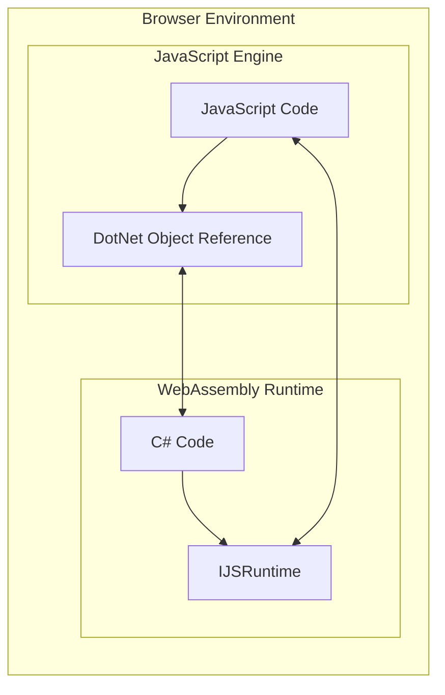
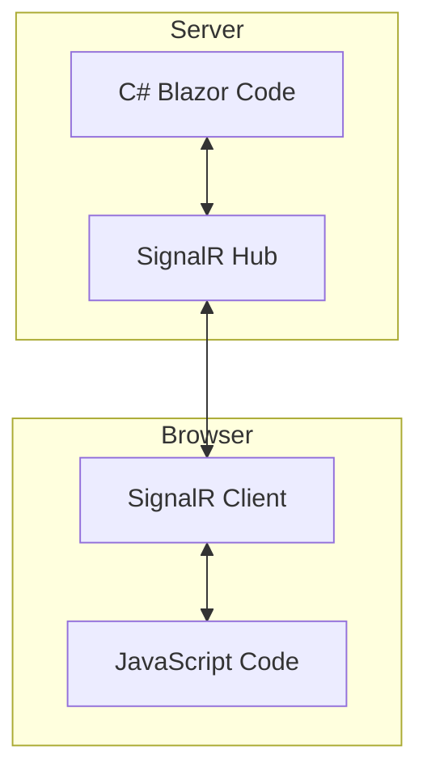
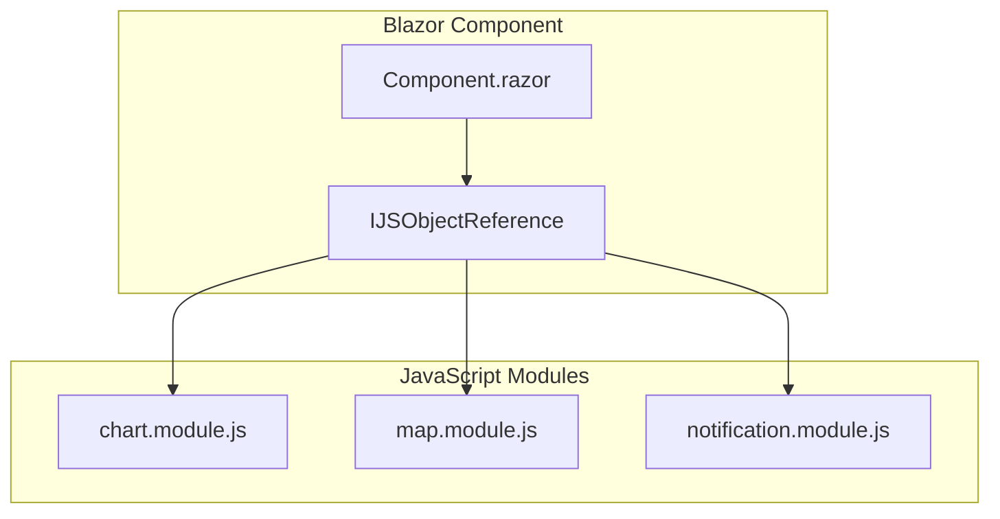
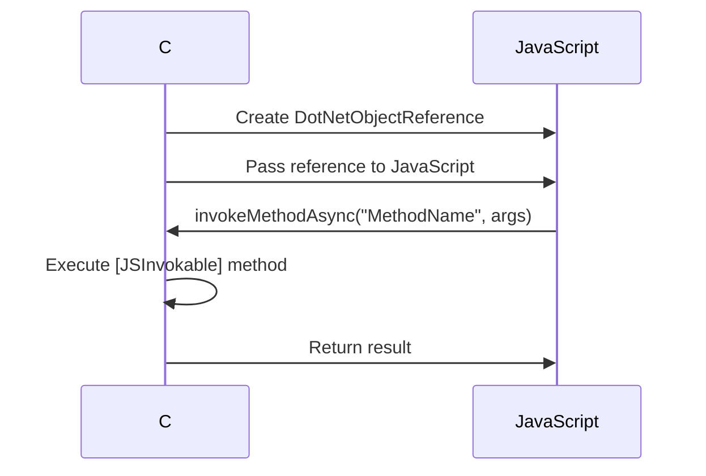
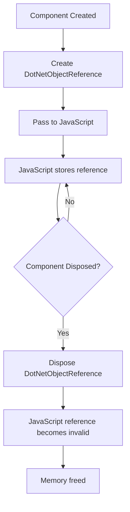

# How to Implement Custom JSInterop in Blazor

Author: [nawazdhandala](https://www.github.com/nawazdhandala)

Tags: Blazor, JavaScript, JSInterop, C#, .NET, WebAssembly, Web Development

Description: Learn how to build custom JavaScript interoperability in Blazor applications with production-ready patterns including typed wrappers, module isolation, memory management, and bidirectional communication.

---

Blazor lets you build interactive web applications using C#, but sometimes you need to reach into the JavaScript ecosystem. Whether you are integrating a charting library, accessing browser APIs, or working with existing JavaScript code, JSInterop bridges the gap between your C# code and the browser's JavaScript runtime.

This guide covers practical patterns for building robust JSInterop implementations that you can use in production applications.

## Understanding JSInterop Architecture

Before diving into code, let us understand how JSInterop works under the hood. In Blazor WebAssembly, your C# code runs in the browser's WebAssembly runtime, while JavaScript runs in the browser's JavaScript engine. JSInterop provides the communication layer between these two environments.



In Blazor Server, the architecture is slightly different. Your C# code runs on the server, and JavaScript runs in the browser. SignalR handles the communication between them.



## Basic JSInterop Patterns

The simplest form of JSInterop involves calling global JavaScript functions from C#. Let us start with the fundamentals.

### Calling JavaScript from C#

The IJSRuntime interface provides methods for invoking JavaScript functions. Here is how to use it.

The following code demonstrates basic JavaScript invocations including void functions, functions with return values, and passing complex objects.

```csharp
// File: Pages/BasicJsInterop.razor
@page "/basic-interop"
@inject IJSRuntime JS

<h2>Basic JSInterop Examples</h2>

<button class="btn btn-primary" @onclick="ShowAlert">Show Alert</button>
<button class="btn btn-secondary" @onclick="GetWindowWidth">Get Window Width</button>
<button class="btn btn-info" @onclick="LogToConsole">Log to Console</button>

@if (windowWidth > 0)
{
    <p>Window width: @windowWidth pixels</p>
}

@code {
    private int windowWidth = 0;

    // InvokeVoidAsync is used when you do not need a return value
    // This calls the built-in browser alert function
    private async Task ShowAlert()
    {
        await JS.InvokeVoidAsync("alert", "Hello from Blazor!");
    }

    // InvokeAsync<T> is used when you need a return value
    // The generic type parameter specifies the expected return type
    private async Task GetWindowWidth()
    {
        windowWidth = await JS.InvokeAsync<int>("eval", "window.innerWidth");
    }

    // You can pass multiple arguments to JavaScript functions
    // Arguments are serialized to JSON and deserialized on the JavaScript side
    private async Task LogToConsole()
    {
        var data = new { Message = "Hello", Timestamp = DateTime.UtcNow };
        await JS.InvokeVoidAsync("console.log", "Blazor says:", data);
    }
}
```

### Creating Custom JavaScript Functions

Instead of using eval or inline JavaScript, create dedicated functions in a JavaScript file.

This JavaScript file defines utility functions that Blazor components can call. Each function is attached to the window object to make it globally accessible.

```javascript
// File: wwwroot/js/interop.js

// Store element dimensions for later retrieval
// This pattern is useful for measuring elements before animations
window.blazorInterop = {

    // Get the bounding rectangle of an element
    // Returns an object with position and size information
    getElementBounds: function(element) {
        if (!element) {
            return null;
        }
        const rect = element.getBoundingClientRect();
        return {
            x: rect.x,
            y: rect.y,
            width: rect.width,
            height: rect.height,
            top: rect.top,
            right: rect.right,
            bottom: rect.bottom,
            left: rect.left
        };
    },

    // Scroll to a specific element with smooth animation
    // The behavior parameter controls whether scrolling is instant or animated
    scrollToElement: function(elementId, behavior) {
        const element = document.getElementById(elementId);
        if (element) {
            element.scrollIntoView({
                behavior: behavior || 'smooth',
                block: 'start'
            });
            return true;
        }
        return false;
    },

    // Copy text to the clipboard using the modern Clipboard API
    // Returns a promise that resolves to true on success
    copyToClipboard: async function(text) {
        try {
            await navigator.clipboard.writeText(text);
            return true;
        } catch (err) {
            console.error('Failed to copy text:', err);
            return false;
        }
    },

    // Download a file from a byte array
    // This is useful for generating files on the server and downloading them
    downloadFile: function(filename, contentType, content) {
        // Convert base64 to blob
        const byteCharacters = atob(content);
        const byteNumbers = new Array(byteCharacters.length);
        for (let i = 0; i < byteCharacters.length; i++) {
            byteNumbers[i] = byteCharacters.charCodeAt(i);
        }
        const byteArray = new Uint8Array(byteNumbers);
        const blob = new Blob([byteArray], { type: contentType });

        // Create download link and trigger click
        const url = URL.createObjectURL(blob);
        const link = document.createElement('a');
        link.href = url;
        link.download = filename;
        document.body.appendChild(link);
        link.click();
        document.body.removeChild(link);
        URL.revokeObjectURL(url);
    }
};
```

Reference this script in your index.html or _Host.cshtml file.

```html
<!-- File: wwwroot/index.html -->
<!DOCTYPE html>
<html>
<head>
    <title>Blazor App</title>
</head>
<body>
    <div id="app">Loading...</div>

    <!-- Load your custom interop script before the Blazor script -->
    <script src="js/interop.js"></script>
    <script src="_framework/blazor.webassembly.js"></script>
</body>
</html>
```

## Building Typed JSInterop Wrappers

Calling JavaScript through string-based function names is error-prone. A better approach is to create strongly-typed C# wrappers that encapsulate the JavaScript calls.

### Creating a Clipboard Service

This service wraps the clipboard JavaScript functions with a clean C# API. The interface allows for easy mocking in tests.

```csharp
// File: Services/IClipboardService.cs

// Define an interface for the clipboard service
// This enables dependency injection and makes testing easier
public interface IClipboardService
{
    Task<bool> CopyTextAsync(string text);
    Task<string> ReadTextAsync();
}
```

The implementation uses IJSRuntime to call the JavaScript functions while providing proper error handling and null safety.

```csharp
// File: Services/ClipboardService.cs

using Microsoft.JSInterop;

public class ClipboardService : IClipboardService
{
    private readonly IJSRuntime _jsRuntime;

    // IJSRuntime is injected through the constructor
    // This follows the standard dependency injection pattern
    public ClipboardService(IJSRuntime jsRuntime)
    {
        _jsRuntime = jsRuntime;
    }

    // Copy text to the clipboard
    // Returns true if successful, false otherwise
    public async Task<bool> CopyTextAsync(string text)
    {
        if (string.IsNullOrEmpty(text))
        {
            return false;
        }

        try
        {
            return await _jsRuntime.InvokeAsync<bool>(
                "blazorInterop.copyToClipboard",
                text
            );
        }
        catch (JSException ex)
        {
            // Log the error and return false
            // In production, use a proper logging framework
            Console.WriteLine($"Clipboard copy failed: {ex.Message}");
            return false;
        }
    }

    // Read text from the clipboard
    // Requires user permission in most browsers
    public async Task<string> ReadTextAsync()
    {
        try
        {
            return await _jsRuntime.InvokeAsync<string>(
                "navigator.clipboard.readText"
            );
        }
        catch (JSException)
        {
            // Reading clipboard may fail due to permissions
            return string.Empty;
        }
    }
}
```

Register the service in Program.cs and use it in components.

```csharp
// File: Program.cs

// Register the clipboard service as scoped
// Scoped services have one instance per user session in Blazor
builder.Services.AddScoped<IClipboardService, ClipboardService>();
```

### Creating a Browser Storage Service

Local storage and session storage are commonly needed in web applications. Here is a complete wrapper.

```csharp
// File: Services/IBrowserStorageService.cs

// Interface for browser storage operations
// Supports both localStorage and sessionStorage
public interface IBrowserStorageService
{
    Task SetItemAsync<T>(string key, T value);
    Task<T?> GetItemAsync<T>(string key);
    Task RemoveItemAsync(string key);
    Task ClearAsync();
    Task<int> GetLengthAsync();
    Task<string?> GetKeyAsync(int index);
}
```

The implementation handles JSON serialization and deserialization automatically, making it easy to store complex objects.

```csharp
// File: Services/LocalStorageService.cs

using Microsoft.JSInterop;
using System.Text.Json;

public class LocalStorageService : IBrowserStorageService
{
    private readonly IJSRuntime _jsRuntime;
    private readonly JsonSerializerOptions _jsonOptions;

    public LocalStorageService(IJSRuntime jsRuntime)
    {
        _jsRuntime = jsRuntime;

        // Configure JSON serialization options
        // These options ensure consistent serialization behavior
        _jsonOptions = new JsonSerializerOptions
        {
            PropertyNamingPolicy = JsonNamingPolicy.CamelCase,
            WriteIndented = false
        };
    }

    // Store a value in localStorage
    // The value is serialized to JSON before storage
    public async Task SetItemAsync<T>(string key, T value)
    {
        if (string.IsNullOrEmpty(key))
        {
            throw new ArgumentNullException(nameof(key));
        }

        var json = JsonSerializer.Serialize(value, _jsonOptions);
        await _jsRuntime.InvokeVoidAsync("localStorage.setItem", key, json);
    }

    // Retrieve a value from localStorage
    // Returns default(T) if the key does not exist
    public async Task<T?> GetItemAsync<T>(string key)
    {
        if (string.IsNullOrEmpty(key))
        {
            throw new ArgumentNullException(nameof(key));
        }

        var json = await _jsRuntime.InvokeAsync<string?>(
            "localStorage.getItem",
            key
        );

        if (string.IsNullOrEmpty(json))
        {
            return default;
        }

        try
        {
            return JsonSerializer.Deserialize<T>(json, _jsonOptions);
        }
        catch (JsonException)
        {
            // Return default if deserialization fails
            // This handles cases where the stored format has changed
            return default;
        }
    }

    // Remove an item from localStorage
    public async Task RemoveItemAsync(string key)
    {
        await _jsRuntime.InvokeVoidAsync("localStorage.removeItem", key);
    }

    // Clear all items from localStorage
    // Use with caution as this affects all stored data
    public async Task ClearAsync()
    {
        await _jsRuntime.InvokeVoidAsync("localStorage.clear");
    }

    // Get the number of items in localStorage
    public async Task<int> GetLengthAsync()
    {
        return await _jsRuntime.InvokeAsync<int>("eval", "localStorage.length");
    }

    // Get a key by its index
    // Useful for iterating through all stored items
    public async Task<string?> GetKeyAsync(int index)
    {
        return await _jsRuntime.InvokeAsync<string?>("localStorage.key", index);
    }
}
```

## JavaScript Module Isolation

Modern JavaScript development uses ES modules for better code organization. Blazor supports importing JavaScript modules, which provides several benefits including encapsulation and lazy loading.



### Creating an ES Module

This module exports functions that can be imported and called from Blazor. The module pattern keeps functions private unless explicitly exported.

```javascript
// File: wwwroot/js/modules/notification.module.js

// Private state for tracking notifications
let notificationCount = 0;
const activeNotifications = new Map();

// Request permission for browser notifications
// Returns 'granted', 'denied', or 'default'
export async function requestPermission() {
    if (!('Notification' in window)) {
        return 'unsupported';
    }
    return await Notification.requestPermission();
}

// Show a browser notification
// Returns the notification ID for later reference
export function show(title, options) {
    if (Notification.permission !== 'granted') {
        console.warn('Notification permission not granted');
        return null;
    }

    const id = ++notificationCount;

    const notification = new Notification(title, {
        body: options.body || '',
        icon: options.icon || '/favicon.ico',
        tag: options.tag || `notification-${id}`,
        requireInteraction: options.requireInteraction || false
    });

    // Store reference for later operations
    activeNotifications.set(id, notification);

    // Set up event handlers
    notification.onclick = () => {
        window.focus();
        notification.close();
        activeNotifications.delete(id);
    };

    notification.onclose = () => {
        activeNotifications.delete(id);
    };

    // Auto-close after timeout if specified
    if (options.autoClose && options.autoCloseMs > 0) {
        setTimeout(() => {
            notification.close();
            activeNotifications.delete(id);
        }, options.autoCloseMs);
    }

    return id;
}

// Close a specific notification by ID
export function close(id) {
    const notification = activeNotifications.get(id);
    if (notification) {
        notification.close();
        activeNotifications.delete(id);
        return true;
    }
    return false;
}

// Close all active notifications
export function closeAll() {
    activeNotifications.forEach((notification, id) => {
        notification.close();
    });
    activeNotifications.clear();
}

// Check if notifications are supported
export function isSupported() {
    return 'Notification' in window;
}

// Get the current permission status
export function getPermissionStatus() {
    if (!('Notification' in window)) {
        return 'unsupported';
    }
    return Notification.permission;
}
```

### Importing Modules in C#

Use IJSRuntime.InvokeAsync with the "import" identifier to load ES modules. The returned IJSObjectReference lets you call the module's exported functions.

```csharp
// File: Services/NotificationService.cs

using Microsoft.JSInterop;

public class NotificationService : IAsyncDisposable
{
    private readonly IJSRuntime _jsRuntime;
    private IJSObjectReference? _module;
    private bool _isInitialized;

    public NotificationService(IJSRuntime jsRuntime)
    {
        _jsRuntime = jsRuntime;
    }

    // Initialize the service by importing the JavaScript module
    // This should be called once before using other methods
    private async Task EnsureInitializedAsync()
    {
        if (_isInitialized)
        {
            return;
        }

        // Import the ES module
        // The path is relative to wwwroot
        _module = await _jsRuntime.InvokeAsync<IJSObjectReference>(
            "import",
            "./js/modules/notification.module.js"
        );

        _isInitialized = true;
    }

    // Request notification permission from the user
    public async Task<string> RequestPermissionAsync()
    {
        await EnsureInitializedAsync();
        return await _module!.InvokeAsync<string>("requestPermission");
    }

    // Show a notification with the specified options
    public async Task<int?> ShowAsync(
        string title,
        NotificationOptions? options = null)
    {
        await EnsureInitializedAsync();

        var jsOptions = new
        {
            body = options?.Body ?? "",
            icon = options?.Icon ?? "/favicon.ico",
            tag = options?.Tag,
            requireInteraction = options?.RequireInteraction ?? false,
            autoClose = options?.AutoClose ?? true,
            autoCloseMs = options?.AutoCloseMs ?? 5000
        };

        return await _module!.InvokeAsync<int?>("show", title, jsOptions);
    }

    // Close a specific notification
    public async Task<bool> CloseAsync(int notificationId)
    {
        await EnsureInitializedAsync();
        return await _module!.InvokeAsync<bool>("close", notificationId);
    }

    // Close all active notifications
    public async Task CloseAllAsync()
    {
        await EnsureInitializedAsync();
        await _module!.InvokeVoidAsync("closeAll");
    }

    // Check if browser notifications are supported
    public async Task<bool> IsSupportedAsync()
    {
        await EnsureInitializedAsync();
        return await _module!.InvokeAsync<bool>("isSupported");
    }

    // Get the current permission status
    public async Task<string> GetPermissionStatusAsync()
    {
        await EnsureInitializedAsync();
        return await _module!.InvokeAsync<string>("getPermissionStatus");
    }

    // Dispose the module reference when the service is disposed
    // This is important for preventing memory leaks
    public async ValueTask DisposeAsync()
    {
        if (_module != null)
        {
            await _module.DisposeAsync();
        }
    }
}

// Options class for notification configuration
public class NotificationOptions
{
    public string? Body { get; set; }
    public string? Icon { get; set; }
    public string? Tag { get; set; }
    public bool RequireInteraction { get; set; }
    public bool AutoClose { get; set; } = true;
    public int AutoCloseMs { get; set; } = 5000;
}
```

## Calling C# from JavaScript

JSInterop works in both directions. JavaScript can call methods on your C# objects using DotNetObjectReference.



### Setting Up Bidirectional Communication

The following example demonstrates a scroll tracker that notifies Blazor when the user scrolls.

Create the JavaScript module that will call back into C#.

```javascript
// File: wwwroot/js/modules/scroll-tracker.module.js

let dotNetReference = null;
let isTracking = false;
let lastScrollY = 0;
let throttleTimeout = null;

// Initialize the scroll tracker with a DotNet object reference
// The reference allows JavaScript to call methods on the C# object
export function initialize(dotNetRef, options) {
    dotNetReference = dotNetRef;

    if (isTracking) {
        return;
    }

    const throttleMs = options?.throttleMs || 100;

    // Add scroll event listener with throttling
    // Throttling prevents performance issues from rapid scroll events
    window.addEventListener('scroll', () => {
        if (throttleTimeout) {
            return;
        }

        throttleTimeout = setTimeout(() => {
            throttleTimeout = null;
            handleScroll();
        }, throttleMs);
    });

    isTracking = true;
}

// Handle scroll events and notify the C# component
function handleScroll() {
    if (!dotNetReference) {
        return;
    }

    const scrollY = window.scrollY;
    const scrollHeight = document.documentElement.scrollHeight;
    const clientHeight = document.documentElement.clientHeight;
    const scrollPercent = (scrollY / (scrollHeight - clientHeight)) * 100;

    // Determine scroll direction
    const direction = scrollY > lastScrollY ? 'down' : 'up';
    lastScrollY = scrollY;

    // Call the C# method with scroll data
    // The method name must match a [JSInvokable] method on the C# object
    dotNetReference.invokeMethodAsync('OnScroll', {
        scrollY: scrollY,
        scrollPercent: Math.min(100, Math.max(0, scrollPercent)),
        direction: direction,
        isAtTop: scrollY <= 0,
        isAtBottom: scrollY + clientHeight >= scrollHeight - 10
    });
}

// Stop tracking and clean up
export function dispose() {
    dotNetReference = null;
    isTracking = false;
    lastScrollY = 0;

    if (throttleTimeout) {
        clearTimeout(throttleTimeout);
        throttleTimeout = null;
    }
}
```

Now create the C# component that uses this tracker.

```csharp
// File: Components/ScrollTracker.razor
@implements IAsyncDisposable
@inject IJSRuntime JS

<div class="scroll-info @(ScrollData.IsAtTop ? "" : "visible")">
    <p>Scroll: @ScrollData.ScrollPercent.ToString("F0")%</p>
    <p>Direction: @ScrollData.Direction</p>
    @if (ScrollData.IsAtBottom)
    {
        <p>You have reached the bottom!</p>
    }
</div>

@code {
    // DotNetObjectReference allows JavaScript to call methods on this component
    private DotNetObjectReference<ScrollTracker>? _dotNetRef;
    private IJSObjectReference? _module;

    // Public property to expose scroll data to parent components
    public ScrollInfo ScrollData { get; private set; } = new();

    // Event callback for parent components to subscribe to scroll events
    [Parameter]
    public EventCallback<ScrollInfo> OnScrollChanged { get; set; }

    protected override async Task OnAfterRenderAsync(bool firstRender)
    {
        if (firstRender)
        {
            // Create a reference to this component that JavaScript can use
            _dotNetRef = DotNetObjectReference.Create(this);

            // Import the scroll tracker module
            _module = await JS.InvokeAsync<IJSObjectReference>(
                "import",
                "./js/modules/scroll-tracker.module.js"
            );

            // Initialize the tracker with the DotNet reference
            await _module.InvokeVoidAsync("initialize", _dotNetRef, new
            {
                throttleMs = 50
            });
        }
    }

    // This method is called from JavaScript
    // The JSInvokable attribute makes it accessible to JavaScript code
    [JSInvokable]
    public async Task OnScroll(ScrollInfo scrollInfo)
    {
        ScrollData = scrollInfo;

        // Notify parent components of the scroll event
        await OnScrollChanged.InvokeAsync(scrollInfo);

        // Trigger a re-render to update the UI
        StateHasChanged();
    }

    // Clean up resources when the component is disposed
    public async ValueTask DisposeAsync()
    {
        if (_module != null)
        {
            await _module.InvokeVoidAsync("dispose");
            await _module.DisposeAsync();
        }

        _dotNetRef?.Dispose();
    }
}

// Data class for scroll information
public class ScrollInfo
{
    public double ScrollY { get; set; }
    public double ScrollPercent { get; set; }
    public string Direction { get; set; } = "none";
    public bool IsAtTop { get; set; } = true;
    public bool IsAtBottom { get; set; }
}
```

## Memory Management and Disposal

Proper memory management is critical when using JSInterop. Failing to dispose of references can cause memory leaks that degrade performance over time.



### Best Practices for Resource Management

Follow these patterns to ensure proper cleanup.

```csharp
// File: Components/ResourceManagedComponent.razor
@implements IAsyncDisposable

@code {
    // Track all disposable resources
    private IJSObjectReference? _jsModule;
    private DotNetObjectReference<ResourceManagedComponent>? _dotNetRef;
    private readonly List<IJSObjectReference> _jsReferences = new();
    private bool _disposed;

    protected override async Task OnAfterRenderAsync(bool firstRender)
    {
        if (firstRender && !_disposed)
        {
            await InitializeAsync();
        }
    }

    private async Task InitializeAsync()
    {
        // Create and store the DotNet reference
        _dotNetRef = DotNetObjectReference.Create(this);

        // Import the JavaScript module
        _jsModule = await JS.InvokeAsync<IJSObjectReference>(
            "import",
            "./js/modules/my-module.js"
        );
    }

    // Helper method to track additional JS references
    // Call this whenever you receive an IJSObjectReference from JavaScript
    protected void TrackJsReference(IJSObjectReference reference)
    {
        _jsReferences.Add(reference);
    }

    // Implement IAsyncDisposable for proper cleanup
    public async ValueTask DisposeAsync()
    {
        if (_disposed)
        {
            return;
        }

        _disposed = true;

        // Dispose all tracked JS references
        foreach (var jsRef in _jsReferences)
        {
            try
            {
                await jsRef.DisposeAsync();
            }
            catch (JSDisconnectedException)
            {
                // Ignore errors if the circuit is already disconnected
                // This can happen in Blazor Server when the user navigates away
            }
        }
        _jsReferences.Clear();

        // Dispose the module reference
        if (_jsModule != null)
        {
            try
            {
                await _jsModule.DisposeAsync();
            }
            catch (JSDisconnectedException)
            {
                // Ignore disconnection errors
            }
        }

        // Dispose the DotNet reference
        // This allows the garbage collector to reclaim the C# object
        _dotNetRef?.Dispose();
    }
}
```

## Integrating Third-Party JavaScript Libraries

Many projects need to integrate existing JavaScript libraries. Here is a complete example of wrapping a charting library.

### Creating a Chart Component Wrapper

This wrapper provides a type-safe way to use Chart.js from Blazor.

First, create the JavaScript module that wraps Chart.js.

```javascript
// File: wwwroot/js/modules/chart-wrapper.module.js

// Store chart instances by container ID
const chartInstances = new Map();

// Initialize a new chart in the specified container
export function createChart(container, config) {
    // Destroy existing chart if one exists
    destroyChart(container);

    // Get or create canvas element
    let canvas = container.querySelector('canvas');
    if (!canvas) {
        canvas = document.createElement('canvas');
        container.appendChild(canvas);
    }

    const ctx = canvas.getContext('2d');

    // Create the Chart.js instance
    const chart = new Chart(ctx, {
        type: config.type,
        data: {
            labels: config.labels,
            datasets: config.datasets.map(ds => ({
                label: ds.label,
                data: ds.data,
                backgroundColor: ds.backgroundColor,
                borderColor: ds.borderColor,
                borderWidth: ds.borderWidth || 1,
                fill: ds.fill || false,
                tension: ds.tension || 0.1
            }))
        },
        options: {
            responsive: true,
            maintainAspectRatio: config.maintainAspectRatio ?? true,
            plugins: {
                legend: {
                    display: config.showLegend ?? true,
                    position: config.legendPosition || 'top'
                },
                title: {
                    display: !!config.title,
                    text: config.title || ''
                }
            },
            scales: config.scales || {}
        }
    });

    // Store the instance for later updates
    chartInstances.set(container, chart);

    return true;
}

// Update chart data without recreating the entire chart
export function updateChartData(container, labels, datasets) {
    const chart = chartInstances.get(container);
    if (!chart) {
        return false;
    }

    chart.data.labels = labels;
    chart.data.datasets.forEach((dataset, index) => {
        if (datasets[index]) {
            dataset.data = datasets[index].data;
            if (datasets[index].label) {
                dataset.label = datasets[index].label;
            }
        }
    });

    chart.update('active');
    return true;
}

// Destroy a chart and free its resources
export function destroyChart(container) {
    const chart = chartInstances.get(container);
    if (chart) {
        chart.destroy();
        chartInstances.delete(container);
        return true;
    }
    return false;
}

// Destroy all chart instances
export function destroyAllCharts() {
    chartInstances.forEach((chart) => {
        chart.destroy();
    });
    chartInstances.clear();
}

// Export chart as base64 image
export function exportAsImage(container, type) {
    const chart = chartInstances.get(container);
    if (!chart) {
        return null;
    }
    return chart.toBase64Image(type || 'image/png');
}
```

Now create the Blazor component.

```csharp
// File: Components/Chart.razor
@implements IAsyncDisposable
@inject IJSRuntime JS

<div @ref="_containerRef" class="chart-container" style="@ContainerStyle">
</div>

@code {
    private ElementReference _containerRef;
    private IJSObjectReference? _module;
    private bool _isInitialized;
    private bool _disposed;

    // Chart configuration parameters
    [Parameter]
    public ChartType Type { get; set; } = ChartType.Line;

    [Parameter]
    public string[] Labels { get; set; } = Array.Empty<string>();

    [Parameter]
    public List<ChartDataset> Datasets { get; set; } = new();

    [Parameter]
    public string? Title { get; set; }

    [Parameter]
    public bool ShowLegend { get; set; } = true;

    [Parameter]
    public string LegendPosition { get; set; } = "top";

    [Parameter]
    public bool MaintainAspectRatio { get; set; } = true;

    [Parameter]
    public string ContainerStyle { get; set; } = "width: 100%; height: 400px;";

    protected override async Task OnAfterRenderAsync(bool firstRender)
    {
        if (firstRender)
        {
            await InitializeChartAsync();
        }
    }

    private async Task InitializeChartAsync()
    {
        if (_disposed)
        {
            return;
        }

        // Import the chart wrapper module
        _module = await JS.InvokeAsync<IJSObjectReference>(
            "import",
            "./js/modules/chart-wrapper.module.js"
        );

        // Build the chart configuration
        var config = new
        {
            type = Type.ToString().ToLower(),
            labels = Labels,
            datasets = Datasets.Select(ds => new
            {
                label = ds.Label,
                data = ds.Data,
                backgroundColor = ds.BackgroundColor,
                borderColor = ds.BorderColor,
                borderWidth = ds.BorderWidth,
                fill = ds.Fill,
                tension = ds.Tension
            }).ToArray(),
            title = Title,
            showLegend = ShowLegend,
            legendPosition = LegendPosition,
            maintainAspectRatio = MaintainAspectRatio
        };

        // Create the chart
        await _module.InvokeVoidAsync("createChart", _containerRef, config);
        _isInitialized = true;
    }

    // Update chart data when parameters change
    protected override async Task OnParametersSetAsync()
    {
        if (_isInitialized && _module != null && !_disposed)
        {
            var datasets = Datasets.Select(ds => new
            {
                label = ds.Label,
                data = ds.Data
            }).ToArray();

            await _module.InvokeVoidAsync(
                "updateChartData",
                _containerRef,
                Labels,
                datasets
            );
        }
    }

    // Export the chart as an image
    public async Task<string?> ExportAsImageAsync(string imageType = "image/png")
    {
        if (_module == null || !_isInitialized)
        {
            return null;
        }

        return await _module.InvokeAsync<string?>(
            "exportAsImage",
            _containerRef,
            imageType
        );
    }

    public async ValueTask DisposeAsync()
    {
        if (_disposed)
        {
            return;
        }

        _disposed = true;

        if (_module != null)
        {
            try
            {
                await _module.InvokeVoidAsync("destroyChart", _containerRef);
                await _module.DisposeAsync();
            }
            catch (JSDisconnectedException)
            {
                // Ignore if already disconnected
            }
        }
    }
}

// Supporting types for chart configuration
public enum ChartType
{
    Line,
    Bar,
    Pie,
    Doughnut,
    Radar,
    PolarArea,
    Scatter,
    Bubble
}

public class ChartDataset
{
    public string Label { get; set; } = "";
    public double[] Data { get; set; } = Array.Empty<double>();
    public string? BackgroundColor { get; set; }
    public string? BorderColor { get; set; }
    public int BorderWidth { get; set; } = 1;
    public bool Fill { get; set; }
    public double Tension { get; set; } = 0.1;
}
```

Use the chart component in your pages.

```csharp
// File: Pages/ChartDemo.razor
@page "/charts"

<h2>Sales Dashboard</h2>

<Chart Type="ChartType.Line"
       Labels="@_months"
       Datasets="@_salesData"
       Title="Monthly Sales"
       ShowLegend="true"
       LegendPosition="bottom" />

<button class="btn btn-primary mt-3" @onclick="RefreshData">
    Refresh Data
</button>

@code {
    private string[] _months = { "Jan", "Feb", "Mar", "Apr", "May", "Jun" };

    private List<ChartDataset> _salesData = new()
    {
        new ChartDataset
        {
            Label = "2025",
            Data = new double[] { 65, 59, 80, 81, 56, 55 },
            BorderColor = "#4e73df",
            BackgroundColor = "rgba(78, 115, 223, 0.1)",
            Fill = true
        },
        new ChartDataset
        {
            Label = "2024",
            Data = new double[] { 45, 49, 60, 71, 46, 45 },
            BorderColor = "#1cc88a",
            BackgroundColor = "rgba(28, 200, 138, 0.1)",
            Fill = true
        }
    };

    private void RefreshData()
    {
        // Simulate data refresh
        var random = new Random();

        _salesData[0].Data = Enumerable
            .Range(0, 6)
            .Select(_ => (double)random.Next(40, 100))
            .ToArray();

        _salesData[1].Data = Enumerable
            .Range(0, 6)
            .Select(_ => (double)random.Next(30, 80))
            .ToArray();
    }
}
```

## Error Handling and Resilience

Production applications need robust error handling for JSInterop calls.

```csharp
// File: Services/ResilientJsInterop.cs

using Microsoft.JSInterop;

public class ResilientJsInterop
{
    private readonly IJSRuntime _jsRuntime;
    private readonly ILogger<ResilientJsInterop> _logger;

    public ResilientJsInterop(
        IJSRuntime jsRuntime,
        ILogger<ResilientJsInterop> logger)
    {
        _jsRuntime = jsRuntime;
        _logger = logger;
    }

    // Invoke a JavaScript function with automatic retry
    // Useful for operations that may fail due to timing issues
    public async Task<T?> InvokeWithRetryAsync<T>(
        string identifier,
        int maxRetries = 3,
        int delayMs = 100,
        params object?[] args)
    {
        var lastException = default(Exception);

        for (int attempt = 0; attempt < maxRetries; attempt++)
        {
            try
            {
                return await _jsRuntime.InvokeAsync<T>(identifier, args);
            }
            catch (JSException ex)
            {
                lastException = ex;
                _logger.LogWarning(
                    ex,
                    "JSInterop call failed (attempt {Attempt}/{MaxRetries}): {Identifier}",
                    attempt + 1,
                    maxRetries,
                    identifier
                );

                if (attempt < maxRetries - 1)
                {
                    await Task.Delay(delayMs * (attempt + 1));
                }
            }
            catch (TaskCanceledException)
            {
                // Request was cancelled, do not retry
                throw;
            }
        }

        _logger.LogError(
            lastException,
            "JSInterop call failed after {MaxRetries} attempts: {Identifier}",
            maxRetries,
            identifier
        );

        return default;
    }

    // Invoke a JavaScript function with a timeout
    // Prevents hanging if JavaScript never returns
    public async Task<T?> InvokeWithTimeoutAsync<T>(
        string identifier,
        TimeSpan timeout,
        params object?[] args)
    {
        using var cts = new CancellationTokenSource(timeout);

        try
        {
            // Use the cancellation token overload
            return await _jsRuntime.InvokeAsync<T>(
                identifier,
                cts.Token,
                args
            );
        }
        catch (TaskCanceledException) when (cts.IsCancellationRequested)
        {
            _logger.LogWarning(
                "JSInterop call timed out after {Timeout}ms: {Identifier}",
                timeout.TotalMilliseconds,
                identifier
            );
            return default;
        }
    }

    // Safely invoke a void JavaScript function
    // Logs errors but does not throw
    public async Task InvokeSafeAsync(
        string identifier,
        params object?[] args)
    {
        try
        {
            await _jsRuntime.InvokeVoidAsync(identifier, args);
        }
        catch (JSException ex)
        {
            _logger.LogError(
                ex,
                "JSInterop call failed: {Identifier}",
                identifier
            );
        }
        catch (JSDisconnectedException)
        {
            // Circuit is disconnected, nothing we can do
            _logger.LogDebug(
                "JSInterop call skipped (disconnected): {Identifier}",
                identifier
            );
        }
    }
}
```

## Performance Optimization

JSInterop calls have overhead because data must be serialized and deserialized. Here are strategies to improve performance.

### Batching Multiple Calls

Instead of making many small JSInterop calls, batch them into a single call.

```javascript
// File: wwwroot/js/modules/batch-operations.module.js

// Execute multiple DOM operations in a single call
// This reduces the number of round trips between C# and JavaScript
export function executeBatch(operations) {
    const results = [];

    for (const op of operations) {
        try {
            let result = null;

            switch (op.type) {
                case 'setAttribute':
                    const setEl = document.getElementById(op.elementId);
                    if (setEl) {
                        setEl.setAttribute(op.attribute, op.value);
                        result = true;
                    }
                    break;

                case 'getAttribute':
                    const getEl = document.getElementById(op.elementId);
                    result = getEl ? getEl.getAttribute(op.attribute) : null;
                    break;

                case 'addClass':
                    const addEl = document.getElementById(op.elementId);
                    if (addEl) {
                        addEl.classList.add(op.className);
                        result = true;
                    }
                    break;

                case 'removeClass':
                    const removeEl = document.getElementById(op.elementId);
                    if (removeEl) {
                        removeEl.classList.remove(op.className);
                        result = true;
                    }
                    break;

                case 'setStyle':
                    const styleEl = document.getElementById(op.elementId);
                    if (styleEl) {
                        styleEl.style[op.property] = op.value;
                        result = true;
                    }
                    break;

                case 'getText':
                    const textEl = document.getElementById(op.elementId);
                    result = textEl ? textEl.textContent : null;
                    break;

                case 'focus':
                    const focusEl = document.getElementById(op.elementId);
                    if (focusEl) {
                        focusEl.focus();
                        result = true;
                    }
                    break;
            }

            results.push({ success: true, result: result });
        } catch (error) {
            results.push({ success: false, error: error.message });
        }
    }

    return results;
}
```

Use the batch operations from C#.

```csharp
// File: Services/BatchDomService.cs

using Microsoft.JSInterop;

public class BatchDomService
{
    private readonly IJSRuntime _jsRuntime;
    private IJSObjectReference? _module;
    private readonly List<DomOperation> _pendingOperations = new();

    public BatchDomService(IJSRuntime jsRuntime)
    {
        _jsRuntime = jsRuntime;
    }

    private async Task EnsureModuleLoadedAsync()
    {
        _module ??= await _jsRuntime.InvokeAsync<IJSObjectReference>(
            "import",
            "./js/modules/batch-operations.module.js"
        );
    }

    // Queue a set attribute operation
    public BatchDomService SetAttribute(
        string elementId,
        string attribute,
        string value)
    {
        _pendingOperations.Add(new DomOperation
        {
            Type = "setAttribute",
            ElementId = elementId,
            Attribute = attribute,
            Value = value
        });
        return this;
    }

    // Queue an add class operation
    public BatchDomService AddClass(string elementId, string className)
    {
        _pendingOperations.Add(new DomOperation
        {
            Type = "addClass",
            ElementId = elementId,
            ClassName = className
        });
        return this;
    }

    // Queue a remove class operation
    public BatchDomService RemoveClass(string elementId, string className)
    {
        _pendingOperations.Add(new DomOperation
        {
            Type = "removeClass",
            ElementId = elementId,
            ClassName = className
        });
        return this;
    }

    // Queue a set style operation
    public BatchDomService SetStyle(
        string elementId,
        string property,
        string value)
    {
        _pendingOperations.Add(new DomOperation
        {
            Type = "setStyle",
            ElementId = elementId,
            Property = property,
            Value = value
        });
        return this;
    }

    // Execute all pending operations in a single JSInterop call
    public async Task<List<BatchResult>> ExecuteAsync()
    {
        if (_pendingOperations.Count == 0)
        {
            return new List<BatchResult>();
        }

        await EnsureModuleLoadedAsync();

        var operations = _pendingOperations.ToList();
        _pendingOperations.Clear();

        var results = await _module!.InvokeAsync<List<BatchResult>>(
            "executeBatch",
            operations
        );

        return results;
    }

    // Clear pending operations without executing
    public void Clear()
    {
        _pendingOperations.Clear();
    }
}

public class DomOperation
{
    public string Type { get; set; } = "";
    public string ElementId { get; set; } = "";
    public string? Attribute { get; set; }
    public string? ClassName { get; set; }
    public string? Property { get; set; }
    public string? Value { get; set; }
}

public class BatchResult
{
    public bool Success { get; set; }
    public object? Result { get; set; }
    public string? Error { get; set; }
}
```

## Summary

Custom JSInterop in Blazor enables you to leverage the full power of the JavaScript ecosystem while writing most of your application in C#. Here are the key points to remember:

1. Use typed wrappers instead of raw string-based function calls for better maintainability and compile-time safety.

2. Prefer ES modules over global functions for better code organization and isolation.

3. Always implement IAsyncDisposable to properly clean up JavaScript resources and DotNetObjectReferences.

4. Use DotNetObjectReference for bidirectional communication when JavaScript needs to call back into C#.

5. Batch multiple operations into single calls to reduce round-trip overhead.

6. Implement proper error handling with retries and timeouts for production reliability.

7. Consider the hosting model differences between Blazor WebAssembly and Blazor Server when designing your JSInterop layer.

These patterns provide a solid foundation for building production-ready Blazor applications that seamlessly integrate with JavaScript libraries and browser APIs. Start with simple wrappers and evolve your architecture as your needs grow.
