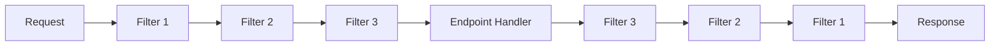
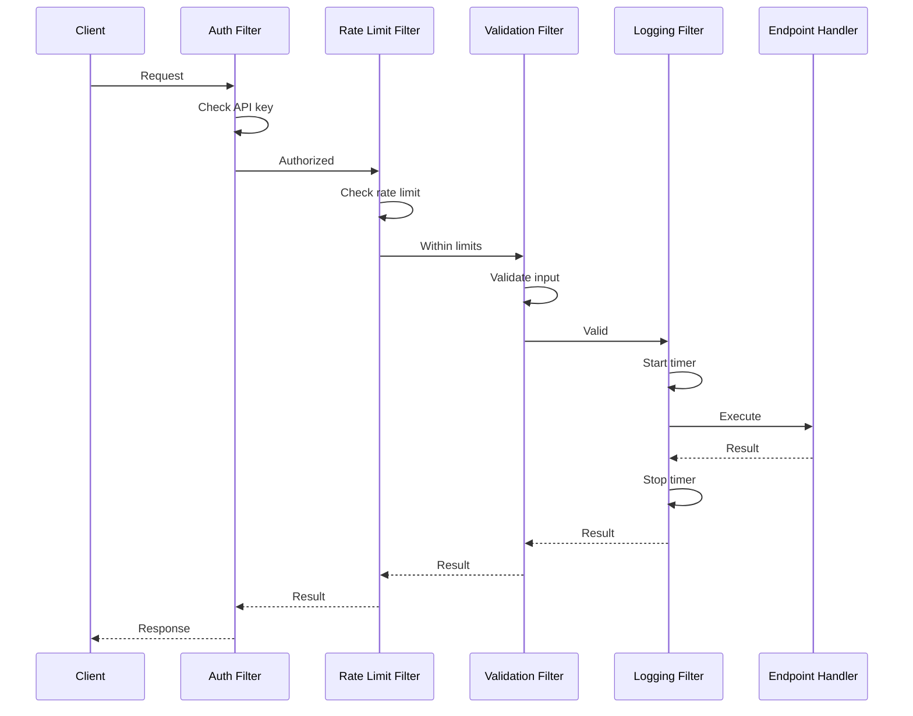

# How to Create Custom Minimal API Endpoint Filters

Author: [nawazdhandala](https://github.com/nawazdhandala)

Tags: .NET, C#, ASP.NET Core, Minimal APIs, Endpoint Filters, Web API

Description: Learn how to build custom endpoint filters for ASP.NET Core Minimal APIs. This guide covers validation, logging, authentication, rate limiting, and response transformation with production-ready examples.

---

Minimal APIs in ASP.NET Core provide a lightweight way to build HTTP APIs. While they skip the controller overhead, they still need cross-cutting concerns like validation, logging, and authentication. That's where endpoint filters come in.

Endpoint filters are the Minimal API equivalent of MVC action filters. They let you run code before and after your endpoint handlers execute, without cluttering your route definitions.

## Understanding Endpoint Filters

Endpoint filters implement the `IEndpointFilter` interface and wrap around your endpoint handlers. They form a pipeline where each filter can:

- Inspect or modify the request before the handler runs
- Short-circuit the request and return early
- Inspect or modify the response after the handler runs
- Handle exceptions from the handler



Filters execute in order on the way in and reverse order on the way out, similar to middleware but scoped to specific endpoints.

## Basic Filter Structure

The `IEndpointFilter` interface has a single method that receives the invocation context and a delegate to call the next filter or handler.

This filter demonstrates the basic structure. It logs when the endpoint starts and finishes, measuring the total execution time.

```csharp
// Filters/LoggingEndpointFilter.cs
using System.Diagnostics;

public class LoggingEndpointFilter : IEndpointFilter
{
    private readonly ILogger<LoggingEndpointFilter> _logger;

    public LoggingEndpointFilter(ILogger<LoggingEndpointFilter> logger)
    {
        _logger = logger;
    }

    public async ValueTask<object?> InvokeAsync(
        EndpointFilterInvocationContext context,
        EndpointFilterDelegate next)
    {
        // Code before the handler runs
        var stopwatch = Stopwatch.StartNew();
        var endpoint = context.HttpContext.GetEndpoint()?.DisplayName ?? "Unknown";

        _logger.LogInformation("Starting {Endpoint}", endpoint);

        try
        {
            // Call the next filter or the handler
            var result = await next(context);

            // Code after the handler runs
            stopwatch.Stop();
            _logger.LogInformation(
                "{Endpoint} completed in {ElapsedMs}ms",
                endpoint,
                stopwatch.ElapsedMilliseconds);

            return result;
        }
        catch (Exception ex)
        {
            // Handle exceptions
            stopwatch.Stop();
            _logger.LogError(ex,
                "{Endpoint} failed after {ElapsedMs}ms",
                endpoint,
                stopwatch.ElapsedMilliseconds);
            throw;
        }
    }
}
```

## Applying Filters to Endpoints

You can apply filters in several ways depending on your needs.

Register the filter with the DI container and apply it to individual endpoints using `AddEndpointFilter<T>`.

```csharp
// Program.cs
var builder = WebApplication.CreateBuilder(args);

// Register filters with DI
builder.Services.AddScoped<LoggingEndpointFilter>();
builder.Services.AddScoped<ValidationFilter>();

var app = builder.Build();

// Apply filter to a single endpoint
app.MapGet("/api/products/{id}", async (int id, ProductService service) =>
{
    var product = await service.GetByIdAsync(id);
    return product is null ? Results.NotFound() : Results.Ok(product);
})
.AddEndpointFilter<LoggingEndpointFilter>();

// Apply multiple filters - they execute in order
app.MapPost("/api/products", async (CreateProductRequest request, ProductService service) =>
{
    var product = await service.CreateAsync(request);
    return Results.Created($"/api/products/{product.Id}", product);
})
.AddEndpointFilter<LoggingEndpointFilter>()
.AddEndpointFilter<ValidationFilter>();

app.Run();
```

## Validation Filter

Input validation is one of the most common uses for endpoint filters. This filter validates any argument that has data annotation attributes.

This filter inspects all endpoint arguments and validates any that have validation attributes. It returns a 400 response with detailed error information if validation fails.

```csharp
// Filters/ValidationFilter.cs
using System.ComponentModel.DataAnnotations;
using System.Reflection;

public class ValidationFilter : IEndpointFilter
{
    public async ValueTask<object?> InvokeAsync(
        EndpointFilterInvocationContext context,
        EndpointFilterDelegate next)
    {
        var errors = new Dictionary<string, string[]>();

        // Validate each argument that has validation attributes
        for (int i = 0; i < context.Arguments.Count; i++)
        {
            var argument = context.Arguments[i];
            if (argument is null) continue;

            var validationResults = new List<ValidationResult>();
            var validationContext = new ValidationContext(argument);

            if (!Validator.TryValidateObject(
                argument,
                validationContext,
                validationResults,
                validateAllProperties: true))
            {
                foreach (var result in validationResults)
                {
                    var memberNames = result.MemberNames.Any()
                        ? result.MemberNames
                        : new[] { "General" };

                    foreach (var memberName in memberNames)
                    {
                        if (!errors.ContainsKey(memberName))
                        {
                            errors[memberName] = Array.Empty<string>();
                        }
                        errors[memberName] = errors[memberName]
                            .Append(result.ErrorMessage ?? "Invalid value")
                            .ToArray();
                    }
                }
            }
        }

        if (errors.Any())
        {
            return Results.ValidationProblem(errors);
        }

        return await next(context);
    }
}

// Request model with validation attributes
public record CreateProductRequest
{
    [Required(ErrorMessage = "Product name is required")]
    [StringLength(100, MinimumLength = 3, ErrorMessage = "Name must be 3-100 characters")]
    public string Name { get; init; } = string.Empty;

    [Required(ErrorMessage = "Price is required")]
    [Range(0.01, 999999.99, ErrorMessage = "Price must be between 0.01 and 999999.99")]
    public decimal Price { get; init; }

    [StringLength(500, ErrorMessage = "Description cannot exceed 500 characters")]
    public string? Description { get; init; }
}
```

## Authentication Filter

This filter checks for valid API key authentication and short-circuits the request if the key is missing or invalid.

The filter extracts the API key from the request header and validates it against configured values. Invalid requests get a 401 response before reaching the handler.

```csharp
// Filters/ApiKeyAuthFilter.cs
public class ApiKeyAuthFilter : IEndpointFilter
{
    private const string ApiKeyHeader = "X-Api-Key";
    private readonly IConfiguration _configuration;
    private readonly ILogger<ApiKeyAuthFilter> _logger;

    public ApiKeyAuthFilter(
        IConfiguration configuration,
        ILogger<ApiKeyAuthFilter> logger)
    {
        _configuration = configuration;
        _logger = logger;
    }

    public async ValueTask<object?> InvokeAsync(
        EndpointFilterInvocationContext context,
        EndpointFilterDelegate next)
    {
        var httpContext = context.HttpContext;

        // Check for API key header
        if (!httpContext.Request.Headers.TryGetValue(ApiKeyHeader, out var providedKey))
        {
            _logger.LogWarning(
                "Missing API key for {Path}",
                httpContext.Request.Path);

            return Results.Problem(
                title: "Unauthorized",
                detail: "API key is required",
                statusCode: 401);
        }

        // Validate the API key
        var validKey = _configuration["ApiSettings:ApiKey"];
        if (string.IsNullOrEmpty(validKey) || providedKey != validKey)
        {
            _logger.LogWarning(
                "Invalid API key for {Path}",
                httpContext.Request.Path);

            return Results.Problem(
                title: "Unauthorized",
                detail: "Invalid API key",
                statusCode: 401);
        }

        // API key is valid, continue to handler
        return await next(context);
    }
}

// Usage: protect specific endpoints
app.MapPost("/api/webhooks", async (WebhookPayload payload, WebhookService service) =>
{
    await service.ProcessAsync(payload);
    return Results.Accepted();
})
.AddEndpointFilter<ApiKeyAuthFilter>();
```

## Rate Limiting Filter

Control request rates per client to prevent abuse. This filter uses distributed caching for rate limiting across multiple instances.

The filter tracks request counts per client IP address and endpoint. Once the limit is reached, subsequent requests receive a 429 response with a Retry-After header.

```csharp
// Filters/RateLimitFilter.cs
using Microsoft.Extensions.Caching.Distributed;
using System.Text.Json;

public class RateLimitFilter : IEndpointFilter
{
    private readonly IDistributedCache _cache;
    private readonly ILogger<RateLimitFilter> _logger;
    private readonly int _maxRequests;
    private readonly TimeSpan _window;

    public RateLimitFilter(
        IDistributedCache cache,
        ILogger<RateLimitFilter> logger,
        int maxRequests = 100,
        int windowSeconds = 60)
    {
        _cache = cache;
        _logger = logger;
        _maxRequests = maxRequests;
        _window = TimeSpan.FromSeconds(windowSeconds);
    }

    public async ValueTask<object?> InvokeAsync(
        EndpointFilterInvocationContext context,
        EndpointFilterDelegate next)
    {
        var httpContext = context.HttpContext;
        var clientId = GetClientIdentifier(httpContext);
        var endpoint = httpContext.GetEndpoint()?.DisplayName ?? "unknown";
        var cacheKey = $"rate-limit:{clientId}:{endpoint}";

        // Get current request count
        var countData = await _cache.GetStringAsync(cacheKey);
        var requestCount = string.IsNullOrEmpty(countData) ? 0 : int.Parse(countData);

        if (requestCount >= _maxRequests)
        {
            _logger.LogWarning(
                "Rate limit exceeded for {ClientId} on {Endpoint}",
                clientId,
                endpoint);

            httpContext.Response.Headers.Append("Retry-After", _window.TotalSeconds.ToString());

            return Results.Problem(
                title: "Too Many Requests",
                detail: $"Rate limit of {_maxRequests} requests per {_window.TotalSeconds} seconds exceeded",
                statusCode: 429);
        }

        // Increment counter
        await _cache.SetStringAsync(
            cacheKey,
            (requestCount + 1).ToString(),
            new DistributedCacheEntryOptions
            {
                AbsoluteExpirationRelativeToNow = _window
            });

        // Add rate limit headers
        httpContext.Response.Headers.Append("X-RateLimit-Limit", _maxRequests.ToString());
        httpContext.Response.Headers.Append("X-RateLimit-Remaining", (_maxRequests - requestCount - 1).ToString());

        return await next(context);
    }

    private static string GetClientIdentifier(HttpContext context)
    {
        // Try to get client IP, fall back to connection ID
        var forwardedFor = context.Request.Headers["X-Forwarded-For"].FirstOrDefault();
        if (!string.IsNullOrEmpty(forwardedFor))
        {
            return forwardedFor.Split(',')[0].Trim();
        }

        return context.Connection.RemoteIpAddress?.ToString() ?? context.Connection.Id;
    }
}

// Configurable rate limit filter factory
public static class RateLimitFilterExtensions
{
    public static RouteHandlerBuilder AddRateLimit(
        this RouteHandlerBuilder builder,
        int maxRequests = 100,
        int windowSeconds = 60)
    {
        return builder.AddEndpointFilterFactory((filterContext, next) =>
        {
            var cache = filterContext.ApplicationServices.GetRequiredService<IDistributedCache>();
            var logger = filterContext.ApplicationServices.GetRequiredService<ILogger<RateLimitFilter>>();
            var filter = new RateLimitFilter(cache, logger, maxRequests, windowSeconds);

            return async (context) =>
            {
                return await filter.InvokeAsync(context, next);
            };
        });
    }
}

// Usage with custom limits
app.MapPost("/api/emails/send", async (SendEmailRequest request, EmailService service) =>
{
    await service.SendAsync(request);
    return Results.Accepted();
})
.AddRateLimit(maxRequests: 10, windowSeconds: 60); // 10 emails per minute
```

## Response Transformation Filter

Transform responses to provide consistent API output formats. This filter wraps successful responses in a standard envelope.

The filter wraps handler results in a consistent response format with metadata like timestamps and request IDs.

```csharp
// Filters/ResponseWrapperFilter.cs
public class ResponseWrapperFilter : IEndpointFilter
{
    public async ValueTask<object?> InvokeAsync(
        EndpointFilterInvocationContext context,
        EndpointFilterDelegate next)
    {
        var result = await next(context);

        // Skip wrapping for certain result types
        if (result is IResult httpResult)
        {
            // Don't wrap error results or file results
            return result;
        }

        // Wrap successful data responses
        return Results.Ok(new ApiResponse<object>
        {
            Success = true,
            Data = result,
            Timestamp = DateTime.UtcNow,
            RequestId = context.HttpContext.TraceIdentifier
        });
    }
}

public class ApiResponse<T>
{
    public bool Success { get; init; }
    public T? Data { get; init; }
    public DateTime Timestamp { get; init; }
    public string? RequestId { get; init; }
    public ErrorDetails? Error { get; init; }
}

public class ErrorDetails
{
    public string Code { get; init; } = string.Empty;
    public string Message { get; init; } = string.Empty;
}
```

## Exception Handling Filter

Catch and handle exceptions consistently across all endpoints. This filter converts exceptions to appropriate HTTP responses.

The filter catches specific exception types and converts them to problem details responses. Unknown exceptions return a 500 response without exposing internal details.

```csharp
// Filters/ExceptionHandlingFilter.cs
public class ExceptionHandlingFilter : IEndpointFilter
{
    private readonly ILogger<ExceptionHandlingFilter> _logger;
    private readonly IHostEnvironment _environment;

    public ExceptionHandlingFilter(
        ILogger<ExceptionHandlingFilter> logger,
        IHostEnvironment environment)
    {
        _logger = logger;
        _environment = environment;
    }

    public async ValueTask<object?> InvokeAsync(
        EndpointFilterInvocationContext context,
        EndpointFilterDelegate next)
    {
        try
        {
            return await next(context);
        }
        catch (NotFoundException ex)
        {
            _logger.LogWarning(ex, "Resource not found: {Message}", ex.Message);
            return Results.Problem(
                title: "Not Found",
                detail: ex.Message,
                statusCode: 404);
        }
        catch (ValidationException ex)
        {
            _logger.LogWarning(ex, "Validation failed: {Message}", ex.Message);
            return Results.Problem(
                title: "Validation Error",
                detail: ex.Message,
                statusCode: 400);
        }
        catch (UnauthorizedAccessException ex)
        {
            _logger.LogWarning(ex, "Unauthorized access attempt");
            return Results.Problem(
                title: "Forbidden",
                detail: "You do not have permission to access this resource",
                statusCode: 403);
        }
        catch (Exception ex)
        {
            _logger.LogError(ex, "Unhandled exception in endpoint");

            // Only include exception details in development
            var detail = _environment.IsDevelopment()
                ? ex.ToString()
                : "An unexpected error occurred";

            return Results.Problem(
                title: "Internal Server Error",
                detail: detail,
                statusCode: 500);
        }
    }
}

// Custom exceptions
public class NotFoundException : Exception
{
    public NotFoundException(string message) : base(message) { }
}

public class ValidationException : Exception
{
    public ValidationException(string message) : base(message) { }
}
```

## Filter Pipeline Execution Order

Understanding the filter execution order is important when combining multiple filters.



Filters run in the order they are added, and the response flows back through them in reverse order.

```csharp
// The filter chain executes in order: Auth -> RateLimit -> Validation -> Logging -> Handler
// Then returns: Handler -> Logging -> Validation -> RateLimit -> Auth -> Client
app.MapPost("/api/orders", async (CreateOrderRequest request, OrderService service) =>
{
    var order = await service.CreateAsync(request);
    return Results.Created($"/api/orders/{order.Id}", order);
})
.AddEndpointFilter<ApiKeyAuthFilter>()      // 1st: Check authentication
.AddEndpointFilter<RateLimitFilter>()       // 2nd: Check rate limits
.AddEndpointFilter<ValidationFilter>()      // 3rd: Validate input
.AddEndpointFilter<LoggingEndpointFilter>(); // 4th: Log execution
```

## Applying Filters to Route Groups

Apply filters to entire route groups for consistent behavior across related endpoints.

Register filters on a route group to apply them to all endpoints within that group. Individual endpoints can add more filters on top of the group filters.

```csharp
// Program.cs
var builder = WebApplication.CreateBuilder(args);

builder.Services.AddScoped<ApiKeyAuthFilter>();
builder.Services.AddScoped<RateLimitFilter>();
builder.Services.AddScoped<LoggingEndpointFilter>();
builder.Services.AddScoped<ValidationFilter>();
builder.Services.AddScoped<ExceptionHandlingFilter>();

var app = builder.Build();

// Create a route group with shared filters
var api = app.MapGroup("/api")
    .AddEndpointFilter<ExceptionHandlingFilter>()
    .AddEndpointFilter<LoggingEndpointFilter>();

// Protected endpoints group
var protectedApi = api.MapGroup("/protected")
    .AddEndpointFilter<ApiKeyAuthFilter>()
    .AddEndpointFilter<RateLimitFilter>();

// Public endpoints inherit only base filters
api.MapGet("/health", () => Results.Ok(new { Status = "Healthy" }));

api.MapGet("/products", async (ProductService service) =>
{
    var products = await service.GetAllAsync();
    return Results.Ok(products);
});

// Protected endpoints have authentication and rate limiting
protectedApi.MapPost("/products", async (CreateProductRequest request, ProductService service) =>
{
    var product = await service.CreateAsync(request);
    return Results.Created($"/api/products/{product.Id}", product);
})
.AddEndpointFilter<ValidationFilter>(); // Additional filter for this endpoint

protectedApi.MapDelete("/products/{id}", async (int id, ProductService service) =>
{
    await service.DeleteAsync(id);
    return Results.NoContent();
});

app.Run();
```

## Typed Endpoint Filters

Create filters that work with specific argument types for type-safe operations.

Typed filters can access specific handler arguments directly by position or type. This filter validates that an ID parameter is positive.

```csharp
// Filters/IdValidationFilter.cs
public class IdValidationFilter : IEndpointFilter
{
    public async ValueTask<object?> InvokeAsync(
        EndpointFilterInvocationContext context,
        EndpointFilterDelegate next)
    {
        // Get the id parameter (first argument)
        if (context.Arguments.Count > 0 && context.Arguments[0] is int id)
        {
            if (id <= 0)
            {
                return Results.Problem(
                    title: "Invalid ID",
                    detail: "ID must be a positive integer",
                    statusCode: 400);
            }
        }

        return await next(context);
    }
}

// Type-safe filter for specific request types
public class AuditFilter<TRequest> : IEndpointFilter where TRequest : class
{
    private readonly IAuditService _auditService;

    public AuditFilter(IAuditService auditService)
    {
        _auditService = auditService;
    }

    public async ValueTask<object?> InvokeAsync(
        EndpointFilterInvocationContext context,
        EndpointFilterDelegate next)
    {
        // Find the request object of the expected type
        var request = context.Arguments
            .OfType<TRequest>()
            .FirstOrDefault();

        var result = await next(context);

        // Log the audit entry after successful execution
        if (request != null)
        {
            await _auditService.LogAsync(new AuditEntry
            {
                UserId = context.HttpContext.User.FindFirst("sub")?.Value,
                Action = context.HttpContext.GetEndpoint()?.DisplayName,
                RequestData = request,
                Timestamp = DateTime.UtcNow
            });
        }

        return result;
    }
}
```

## Filter Factory Pattern

Use filter factories when you need to pass configuration to filters at registration time.

Filter factories provide access to the application services and can create configured filter instances dynamically.

```csharp
// Extensions/FilterExtensions.cs
public static class FilterExtensions
{
    // Caching filter with configurable duration
    public static RouteHandlerBuilder WithCaching(
        this RouteHandlerBuilder builder,
        int durationSeconds = 60)
    {
        return builder.AddEndpointFilterFactory((context, next) =>
        {
            var cache = context.ApplicationServices.GetRequiredService<IMemoryCache>();
            var logger = context.ApplicationServices.GetRequiredService<ILogger<CachingFilter>>();

            return async (invocationContext) =>
            {
                // Only cache GET requests
                if (invocationContext.HttpContext.Request.Method != "GET")
                {
                    return await next(invocationContext);
                }

                var cacheKey = GenerateCacheKey(invocationContext.HttpContext.Request);

                if (cache.TryGetValue(cacheKey, out object? cachedResult))
                {
                    logger.LogDebug("Cache hit for {Key}", cacheKey);
                    return cachedResult;
                }

                var result = await next(invocationContext);

                var cacheOptions = new MemoryCacheEntryOptions()
                    .SetAbsoluteExpiration(TimeSpan.FromSeconds(durationSeconds));

                cache.Set(cacheKey, result, cacheOptions);
                logger.LogDebug("Cached response for {Key}", cacheKey);

                return result;
            };
        });
    }

    private static string GenerateCacheKey(HttpRequest request)
    {
        return $"endpoint-cache:{request.Path}{request.QueryString}";
    }

    // Require specific role
    public static RouteHandlerBuilder RequireRole(
        this RouteHandlerBuilder builder,
        params string[] roles)
    {
        return builder.AddEndpointFilterFactory((context, next) =>
        {
            return async (invocationContext) =>
            {
                var user = invocationContext.HttpContext.User;

                if (!user.Identity?.IsAuthenticated ?? true)
                {
                    return Results.Problem(
                        title: "Unauthorized",
                        detail: "Authentication required",
                        statusCode: 401);
                }

                var hasRole = roles.Any(role => user.IsInRole(role));
                if (!hasRole)
                {
                    return Results.Problem(
                        title: "Forbidden",
                        detail: $"Required role: {string.Join(" or ", roles)}",
                        statusCode: 403);
                }

                return await next(invocationContext);
            };
        });
    }
}

// Usage with extension methods
app.MapGet("/api/products", async (ProductService service) =>
{
    return await service.GetAllAsync();
})
.WithCaching(durationSeconds: 300);

app.MapDelete("/api/products/{id}", async (int id, ProductService service) =>
{
    await service.DeleteAsync(id);
    return Results.NoContent();
})
.RequireRole("Admin", "Manager");
```

## Complete Production Example

Here is a complete example combining multiple filters for a production API.

```csharp
// Program.cs
using Microsoft.Extensions.Caching.Distributed;

var builder = WebApplication.CreateBuilder(args);

// Configure services
builder.Services.AddStackExchangeRedisCache(options =>
{
    options.Configuration = builder.Configuration.GetConnectionString("Redis");
});

builder.Services.AddMemoryCache();

// Register filters
builder.Services.AddScoped<ExceptionHandlingFilter>();
builder.Services.AddScoped<LoggingEndpointFilter>();
builder.Services.AddScoped<ApiKeyAuthFilter>();
builder.Services.AddScoped<RateLimitFilter>();
builder.Services.AddScoped<ValidationFilter>();

// Register services
builder.Services.AddScoped<ProductService>();
builder.Services.AddScoped<OrderService>();

var app = builder.Build();

// Base API group with common filters
var api = app.MapGroup("/api/v1")
    .AddEndpointFilter<ExceptionHandlingFilter>()
    .AddEndpointFilter<LoggingEndpointFilter>();

// Public endpoints
var publicApi = api.MapGroup("/public");

publicApi.MapGet("/health", () => Results.Ok(new
{
    Status = "Healthy",
    Timestamp = DateTime.UtcNow
}));

publicApi.MapGet("/products", async (ProductService service) =>
{
    var products = await service.GetAllAsync();
    return Results.Ok(products);
})
.WithCaching(durationSeconds: 60);

publicApi.MapGet("/products/{id:int}", async (int id, ProductService service) =>
{
    var product = await service.GetByIdAsync(id);
    return product is null ? Results.NotFound() : Results.Ok(product);
})
.AddEndpointFilter<IdValidationFilter>()
.WithCaching(durationSeconds: 300);

// Protected endpoints
var protectedApi = api.MapGroup("/admin")
    .AddEndpointFilter<ApiKeyAuthFilter>();

protectedApi.MapPost("/products", async (CreateProductRequest request, ProductService service) =>
{
    var product = await service.CreateAsync(request);
    return Results.Created($"/api/v1/public/products/{product.Id}", product);
})
.AddEndpointFilter<ValidationFilter>()
.AddRateLimit(maxRequests: 50, windowSeconds: 60);

protectedApi.MapPut("/products/{id:int}", async (int id, UpdateProductRequest request, ProductService service) =>
{
    var product = await service.UpdateAsync(id, request);
    return product is null ? Results.NotFound() : Results.Ok(product);
})
.AddEndpointFilter<IdValidationFilter>()
.AddEndpointFilter<ValidationFilter>();

protectedApi.MapDelete("/products/{id:int}", async (int id, ProductService service) =>
{
    var deleted = await service.DeleteAsync(id);
    return deleted ? Results.NoContent() : Results.NotFound();
})
.AddEndpointFilter<IdValidationFilter>()
.RequireRole("Admin");

app.Run();
```

## Summary

Endpoint filters provide a clean way to handle cross-cutting concerns in Minimal APIs:

| Filter Use Case | What It Does |
|-----------------|--------------|
| Validation | Validates input before handler executes |
| Authentication | Checks credentials and short-circuits if invalid |
| Rate Limiting | Controls request rates per client |
| Logging | Records request/response timing and details |
| Exception Handling | Converts exceptions to HTTP responses |
| Response Wrapping | Standardizes API response format |
| Caching | Returns cached responses for repeated requests |

Key points to remember:

- Filters execute in the order they are added to the endpoint
- Use `AddEndpointFilter<T>` for DI-resolved filters
- Use `AddEndpointFilterFactory` for configurable filters
- Apply filters to route groups for consistent behavior
- Short-circuit requests by returning early without calling `next`
- Filters can access and modify both requests and responses

Endpoint filters keep your route handlers focused on business logic while handling infrastructure concerns in a reusable, testable way.
