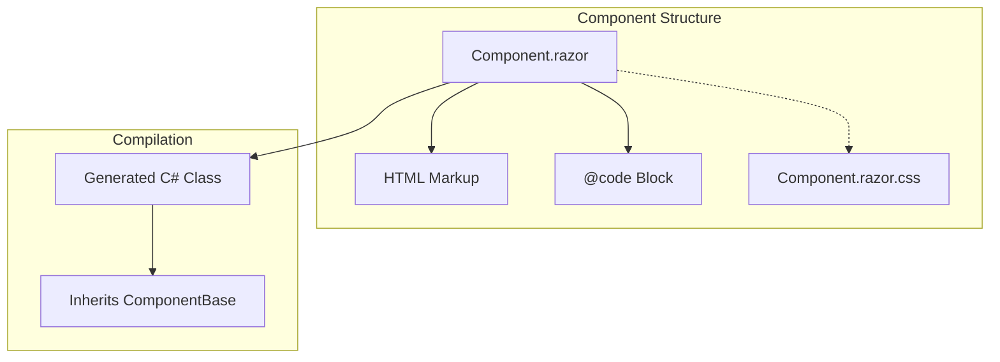
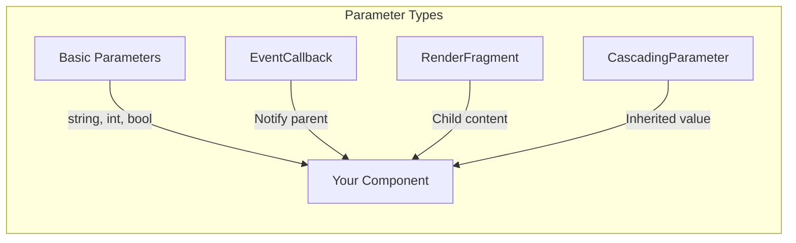
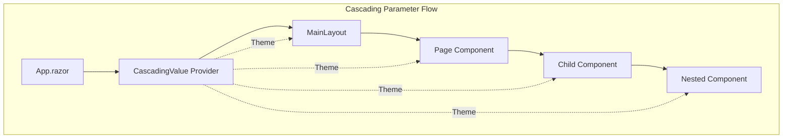
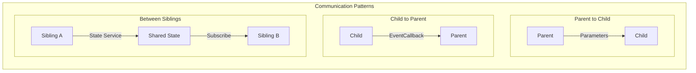
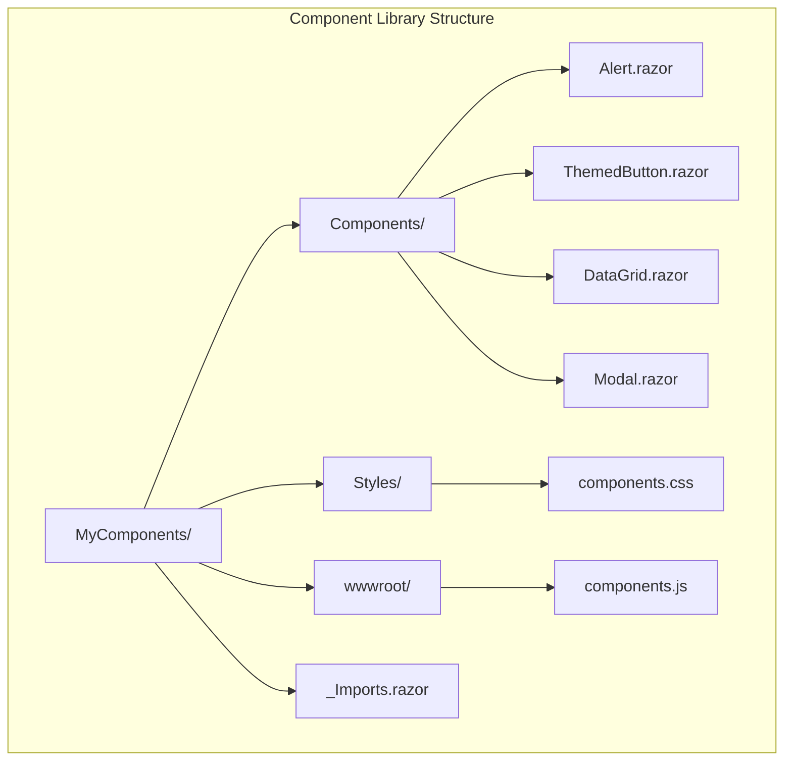

# How to Create Custom Razor Components in Blazor

Author: [nawazdhandala](https://github.com/nawazdhandala)

Tags: Blazor, C#, .NET, Razor Components, Web Development, Component Design

Description: Learn how to build reusable, production-ready custom Razor components in Blazor with advanced patterns like templated components, cascading parameters, and component libraries.

---

Razor components are the foundation of every Blazor application. While Blazor ships with built-in components, real-world applications need custom components tailored to specific business requirements. This guide walks you through building production-ready custom components that you can reuse across your projects.

## Understanding Component Architecture

Before diving into code, let's understand how Razor components work in Blazor.



Every `.razor` file compiles into a C# class that inherits from `ComponentBase`. This class handles rendering, lifecycle management, and state updates.

## Building Your First Custom Component

Let's start with a practical example: a reusable alert component for displaying notifications.

The component accepts a type parameter to control the visual style (success, warning, error, info) and supports dismissible functionality.

```csharp
// File: Components/Alert.razor

@namespace MyApp.Components

<div class="alert alert-@Type.ToString().ToLower() @(Dismissible ? "alert-dismissible" : "")"
     role="alert"
     style="@(IsVisible ? "" : "display: none;")">

    @* Render the icon based on alert type *@
    @if (ShowIcon)
    {
        <span class="alert-icon">@GetIconForType()</span>
    }

    @* Main content area for the alert message *@
    <div class="alert-content">
        @if (!string.IsNullOrEmpty(Title))
        {
            <strong class="alert-title">@Title</strong>
        }
        @ChildContent
    </div>

    @* Optional dismiss button *@
    @if (Dismissible)
    {
        <button type="button"
                class="btn-close"
                aria-label="Close"
                @onclick="Dismiss">
        </button>
    }
</div>

@code {
    // The type of alert determines styling (Success, Warning, Error, Info)
    [Parameter]
    public AlertType Type { get; set; } = AlertType.Info;

    // Optional title displayed in bold at the start
    [Parameter]
    public string? Title { get; set; }

    // Whether the alert can be dismissed by the user
    [Parameter]
    public bool Dismissible { get; set; } = false;

    // Show an icon matching the alert type
    [Parameter]
    public bool ShowIcon { get; set; } = true;

    // The content to display inside the alert
    [Parameter]
    public RenderFragment? ChildContent { get; set; }

    // Callback fired when the alert is dismissed
    [Parameter]
    public EventCallback OnDismissed { get; set; }

    // Internal state for visibility
    private bool IsVisible { get; set; } = true;

    // Handle the dismiss button click
    private async Task Dismiss()
    {
        IsVisible = false;
        await OnDismissed.InvokeAsync();
    }

    // Reset visibility (call from parent to show alert again)
    public void Show()
    {
        IsVisible = true;
        StateHasChanged();
    }

    // Return appropriate icon markup based on type
    private string GetIconForType() => Type switch
    {
        AlertType.Success => "check-circle",
        AlertType.Warning => "exclamation-triangle",
        AlertType.Error => "x-circle",
        AlertType.Info => "info-circle",
        _ => "info-circle"
    };
}
```

Define the enum in a separate file for clean organization.

```csharp
// File: Components/AlertType.cs

namespace MyApp.Components;

public enum AlertType
{
    Info,
    Success,
    Warning,
    Error
}
```

Now you can use the alert component throughout your application.

```csharp
// File: Pages/Dashboard.razor

@page "/dashboard"

<Alert Type="AlertType.Success" Title="Welcome!" Dismissible="true">
    Your account has been activated successfully.
</Alert>

<Alert Type="AlertType.Warning" ShowIcon="true">
    Your subscription expires in 7 days.
    <a href="/billing">Renew now</a> to avoid interruption.
</Alert>

<Alert Type="AlertType.Error"
       Title="Payment Failed"
       Dismissible="true"
       OnDismissed="HandleAlertDismissed">
    We could not process your payment. Please update your card details.
</Alert>

@code {
    private async Task HandleAlertDismissed()
    {
        // Log dismissal or perform cleanup
        Console.WriteLine("Alert was dismissed by user");
    }
}
```

## Component Parameters Deep Dive

Parameters are how data flows into components. Understanding the different parameter types helps you design flexible APIs.



Here's a complete example showing all parameter types in action.

```csharp
// File: Components/DataCard.razor

@typeparam TItem

<div class="data-card @CssClass">
    @* Header section with optional custom template *@
    <div class="card-header">
        @if (HeaderTemplate != null)
        {
            @HeaderTemplate
        }
        else
        {
            <h3>@Title</h3>
        }
    </div>

    @* Body section renders items using the provided template *@
    <div class="card-body">
        @if (Items != null && Items.Any())
        {
            foreach (var item in Items)
            {
                @* ItemTemplate is required and renders each item *@
                @ItemTemplate(item)
            }
        }
        else
        {
            @* Show empty state when no items *@
            @if (EmptyTemplate != null)
            {
                @EmptyTemplate
            }
            else
            {
                <p class="text-muted">No items to display.</p>
            }
        }
    </div>

    @* Footer with action buttons *@
    <div class="card-footer">
        @if (FooterTemplate != null)
        {
            @FooterTemplate
        }
        else
        {
            <button class="btn btn-primary" @onclick="HandleRefresh">
                Refresh
            </button>
        }
    </div>
</div>

@code {
    // Basic string parameter for the card title
    [Parameter]
    public string Title { get; set; } = "Data Card";

    // Collection of items to display
    [Parameter]
    public IEnumerable<TItem>? Items { get; set; }

    // Additional CSS classes to apply
    [Parameter]
    public string? CssClass { get; set; }

    // Required template for rendering each item
    [Parameter, EditorRequired]
    public RenderFragment<TItem> ItemTemplate { get; set; } = default!;

    // Optional custom header template
    [Parameter]
    public RenderFragment? HeaderTemplate { get; set; }

    // Optional custom footer template
    [Parameter]
    public RenderFragment? FooterTemplate { get; set; }

    // Optional template shown when Items is empty
    [Parameter]
    public RenderFragment? EmptyTemplate { get; set; }

    // Event fired when refresh is requested
    [Parameter]
    public EventCallback OnRefresh { get; set; }

    // Cascading parameter receives theme from parent
    [CascadingParameter]
    public ThemeInfo? Theme { get; set; }

    private async Task HandleRefresh()
    {
        await OnRefresh.InvokeAsync();
    }
}
```

Use the generic component with any data type.

```csharp
// File: Pages/Products.razor

@page "/products"

<DataCard TItem="Product"
          Title="Product Catalog"
          Items="products"
          OnRefresh="LoadProducts">

    <ItemTemplate Context="product">
        <div class="product-item">
            
            <h4>@product.Name</h4>
            <p class="price">$@product.Price.ToString("F2")</p>
            <button @onclick="() => AddToCart(product)">Add to Cart</button>
        </div>
    </ItemTemplate>

    <EmptyTemplate>
        <div class="empty-state">
            <p>No products found.</p>
            <button @onclick="LoadProducts">Load Products</button>
        </div>
    </EmptyTemplate>

</DataCard>

@code {
    private List<Product> products = new();

    protected override async Task OnInitializedAsync()
    {
        await LoadProducts();
    }

    private async Task LoadProducts()
    {
        // Fetch products from API
        products = await ProductService.GetAllAsync();
    }

    private void AddToCart(Product product)
    {
        CartService.Add(product);
    }
}
```

## Cascading Parameters for Shared State

Cascading parameters let you share data with all descendant components without passing it through every level.



First, define a class to hold the cascading data.

```csharp
// File: Services/ThemeInfo.cs

namespace MyApp.Services;

public class ThemeInfo
{
    public string PrimaryColor { get; set; } = "#007bff";
    public string SecondaryColor { get; set; } = "#6c757d";
    public bool IsDarkMode { get; set; } = false;
    public string FontFamily { get; set; } = "system-ui, sans-serif";

    public string BackgroundColor => IsDarkMode ? "#1a1a2e" : "#ffffff";
    public string TextColor => IsDarkMode ? "#eaeaea" : "#212529";
}
```

Set up the cascading value provider at the app level.

```csharp
// File: App.razor

<CascadingValue Value="theme" Name="AppTheme">
    <Router AppAssembly="@typeof(App).Assembly">
        <Found Context="routeData">
            <RouteView RouteData="@routeData" DefaultLayout="@typeof(MainLayout)" />
        </Found>
        <NotFound>
            <PageTitle>Not Found</PageTitle>
            <p>Sorry, there's nothing at this address.</p>
        </NotFound>
    </Router>
</CascadingValue>

@code {
    private ThemeInfo theme = new();

    protected override void OnInitialized()
    {
        // Load saved theme preferences
        var savedTheme = LocalStorage.GetItem<ThemeInfo>("theme");
        if (savedTheme != null)
        {
            theme = savedTheme;
        }
    }
}
```

Now any component can access the theme through a cascading parameter.

```csharp
// File: Components/ThemedButton.razor

<button class="themed-btn @SizeClass"
        style="background-color: @Theme?.PrimaryColor;
               color: @(Theme?.IsDarkMode == true ? "#fff" : "#fff");
               font-family: @Theme?.FontFamily;"
        @onclick="HandleClick"
        disabled="@IsLoading">

    @if (IsLoading)
    {
        <span class="spinner"></span>
        <span>@LoadingText</span>
    }
    else
    {
        @ChildContent
    }
</button>

@code {
    // Receive the theme from any ancestor component
    [CascadingParameter(Name = "AppTheme")]
    public ThemeInfo? Theme { get; set; }

    [Parameter]
    public RenderFragment? ChildContent { get; set; }

    [Parameter]
    public ButtonSize Size { get; set; } = ButtonSize.Medium;

    [Parameter]
    public bool IsLoading { get; set; } = false;

    [Parameter]
    public string LoadingText { get; set; } = "Loading...";

    [Parameter]
    public EventCallback OnClick { get; set; }

    private string SizeClass => Size switch
    {
        ButtonSize.Small => "btn-sm",
        ButtonSize.Large => "btn-lg",
        _ => "btn-md"
    };

    private async Task HandleClick()
    {
        if (!IsLoading)
        {
            await OnClick.InvokeAsync();
        }
    }
}

public enum ButtonSize { Small, Medium, Large }
```

## Building Templated Components

Templated components give consumers complete control over rendering while your component handles behavior.

```csharp
// File: Components/DataGrid.razor

@typeparam TItem

<div class="data-grid">
    @* Table header with sortable columns *@
    <table class="table @(Striped ? "table-striped" : "")">
        <thead>
            <tr>
                @foreach (var column in Columns)
                {
                    <th @onclick="() => SortBy(column)"
                        class="@(column.Sortable ? "sortable" : "")">
                        @column.Title
                        @if (currentSortColumn == column.PropertyName)
                        {
                            <span class="sort-indicator">
                                @(sortAscending ? "arrow-up" : "arrow-down")
                            </span>
                        }
                    </th>
                }
                @if (RowActions != null)
                {
                    <th>Actions</th>
                }
            </tr>
        </thead>
        <tbody>
            @if (isLoading)
            {
                <tr>
                    <td colspan="@(Columns.Count + (RowActions != null ? 1 : 0))">
                        @if (LoadingTemplate != null)
                        {
                            @LoadingTemplate
                        }
                        else
                        {
                            <div class="loading-spinner">Loading...</div>
                        }
                    </td>
                </tr>
            }
            else if (sortedItems?.Any() != true)
            {
                <tr>
                    <td colspan="@(Columns.Count + (RowActions != null ? 1 : 0))">
                        @if (EmptyTemplate != null)
                        {
                            @EmptyTemplate
                        }
                        else
                        {
                            <p>No data available.</p>
                        }
                    </td>
                </tr>
            }
            else
            {
                @foreach (var item in sortedItems)
                {
                    <tr class="@(SelectedItem?.Equals(item) == true ? "selected" : "")"
                        @onclick="() => SelectRow(item)">
                        @foreach (var column in Columns)
                        {
                            <td>@column.Template(item)</td>
                        }
                        @if (RowActions != null)
                        {
                            <td>@RowActions(item)</td>
                        }
                    </tr>
                }
            }
        </tbody>
    </table>

    @* Pagination controls *@
    @if (EnablePagination && totalPages > 1)
    {
        <div class="pagination">
            <button disabled="@(currentPage == 1)"
                    @onclick="() => GoToPage(currentPage - 1)">
                Previous
            </button>
            <span>Page @currentPage of @totalPages</span>
            <button disabled="@(currentPage == totalPages)"
                    @onclick="() => GoToPage(currentPage + 1)">
                Next
            </button>
        </div>
    }
</div>

@code {
    // Column definitions for the grid
    [Parameter, EditorRequired]
    public List<GridColumn<TItem>> Columns { get; set; } = new();

    // Data source for the grid
    [Parameter]
    public IEnumerable<TItem>? Items { get; set; }

    // Enable zebra striping on rows
    [Parameter]
    public bool Striped { get; set; } = true;

    // Enable pagination
    [Parameter]
    public bool EnablePagination { get; set; } = true;

    // Items per page when pagination is enabled
    [Parameter]
    public int PageSize { get; set; } = 10;

    // Template for row action buttons
    [Parameter]
    public RenderFragment<TItem>? RowActions { get; set; }

    // Custom loading template
    [Parameter]
    public RenderFragment? LoadingTemplate { get; set; }

    // Custom empty state template
    [Parameter]
    public RenderFragment? EmptyTemplate { get; set; }

    // Currently selected item
    [Parameter]
    public TItem? SelectedItem { get; set; }

    // Callback when selection changes
    [Parameter]
    public EventCallback<TItem> SelectedItemChanged { get; set; }

    // Callback when data needs to be loaded
    [Parameter]
    public EventCallback<GridState> OnStateChanged { get; set; }

    // Internal state
    private bool isLoading = false;
    private string? currentSortColumn;
    private bool sortAscending = true;
    private int currentPage = 1;
    private int totalPages => (int)Math.Ceiling((Items?.Count() ?? 0) / (double)PageSize);

    private IEnumerable<TItem>? sortedItems => GetSortedAndPagedItems();

    private IEnumerable<TItem>? GetSortedAndPagedItems()
    {
        if (Items == null) return null;

        var query = Items.AsQueryable();

        // Apply sorting if a column is selected
        if (!string.IsNullOrEmpty(currentSortColumn))
        {
            var column = Columns.FirstOrDefault(c => c.PropertyName == currentSortColumn);
            if (column?.SortExpression != null)
            {
                query = sortAscending
                    ? query.OrderBy(column.SortExpression)
                    : query.OrderByDescending(column.SortExpression);
            }
        }

        // Apply pagination
        if (EnablePagination)
        {
            query = query.Skip((currentPage - 1) * PageSize).Take(PageSize);
        }

        return query.ToList();
    }

    private async Task SortBy(GridColumn<TItem> column)
    {
        if (!column.Sortable) return;

        if (currentSortColumn == column.PropertyName)
        {
            sortAscending = !sortAscending;
        }
        else
        {
            currentSortColumn = column.PropertyName;
            sortAscending = true;
        }

        await NotifyStateChanged();
    }

    private async Task SelectRow(TItem item)
    {
        SelectedItem = item;
        await SelectedItemChanged.InvokeAsync(item);
    }

    private async Task GoToPage(int page)
    {
        currentPage = Math.Clamp(page, 1, totalPages);
        await NotifyStateChanged();
    }

    private async Task NotifyStateChanged()
    {
        await OnStateChanged.InvokeAsync(new GridState
        {
            SortColumn = currentSortColumn,
            SortAscending = sortAscending,
            CurrentPage = currentPage,
            PageSize = PageSize
        });
    }

    // Public method to trigger reload
    public async Task RefreshAsync()
    {
        isLoading = true;
        StateHasChanged();

        await OnStateChanged.InvokeAsync(new GridState
        {
            SortColumn = currentSortColumn,
            SortAscending = sortAscending,
            CurrentPage = currentPage,
            PageSize = PageSize
        });

        isLoading = false;
        StateHasChanged();
    }
}
```

Define supporting classes for the grid.

```csharp
// File: Components/GridColumn.cs

using System.Linq.Expressions;

namespace MyApp.Components;

public class GridColumn<TItem>
{
    public string Title { get; set; } = "";
    public string PropertyName { get; set; } = "";
    public bool Sortable { get; set; } = false;
    public RenderFragment<TItem> Template { get; set; } = default!;
    public Expression<Func<TItem, object>>? SortExpression { get; set; }
}

public class GridState
{
    public string? SortColumn { get; set; }
    public bool SortAscending { get; set; } = true;
    public int CurrentPage { get; set; } = 1;
    public int PageSize { get; set; } = 10;
}
```

Here's how to use the data grid component.

```csharp
// File: Pages/Orders.razor

@page "/orders"
@inject IOrderService OrderService

<h1>Order Management</h1>

<DataGrid TItem="Order"
          Items="orders"
          Columns="columns"
          SelectedItem="selectedOrder"
          SelectedItemChanged="HandleOrderSelected"
          OnStateChanged="HandleGridStateChanged"
          PageSize="20">

    <RowActions Context="order">
        <button class="btn btn-sm btn-info" @onclick="() => ViewOrder(order)">
            View
        </button>
        <button class="btn btn-sm btn-warning" @onclick="() => EditOrder(order)">
            Edit
        </button>
        @if (order.Status != OrderStatus.Shipped)
        {
            <button class="btn btn-sm btn-danger" @onclick="() => CancelOrder(order)">
                Cancel
            </button>
        }
    </RowActions>

    <LoadingTemplate>
        <div class="skeleton-loader">
            <div class="skeleton-row"></div>
            <div class="skeleton-row"></div>
            <div class="skeleton-row"></div>
        </div>
    </LoadingTemplate>

    <EmptyTemplate>
        <div class="empty-orders">
            <h3>No orders found</h3>
            <p>Create your first order to get started.</p>
            <button class="btn btn-primary" @onclick="CreateOrder">
                Create Order
            </button>
        </div>
    </EmptyTemplate>

</DataGrid>

@code {
    private List<Order> orders = new();
    private Order? selectedOrder;

    // Define columns with templates
    private List<GridColumn<Order>> columns = new()
    {
        new GridColumn<Order>
        {
            Title = "Order #",
            PropertyName = "OrderNumber",
            Sortable = true,
            SortExpression = o => o.OrderNumber,
            Template = order => @<span class="order-number">@order.OrderNumber</span>
        },
        new GridColumn<Order>
        {
            Title = "Customer",
            PropertyName = "CustomerName",
            Sortable = true,
            SortExpression = o => o.CustomerName,
            Template = order => @<span>@order.CustomerName</span>
        },
        new GridColumn<Order>
        {
            Title = "Total",
            PropertyName = "Total",
            Sortable = true,
            SortExpression = o => o.Total,
            Template = order => @<span class="currency">$@order.Total.ToString("F2")</span>
        },
        new GridColumn<Order>
        {
            Title = "Status",
            PropertyName = "Status",
            Sortable = true,
            SortExpression = o => o.Status,
            Template = order => @<span class="badge badge-@order.Status.ToString().ToLower()">
                @order.Status
            </span>
        },
        new GridColumn<Order>
        {
            Title = "Date",
            PropertyName = "CreatedAt",
            Sortable = true,
            SortExpression = o => o.CreatedAt,
            Template = order => @<span>@order.CreatedAt.ToString("MMM dd, yyyy")</span>
        }
    };

    protected override async Task OnInitializedAsync()
    {
        orders = await OrderService.GetOrdersAsync();
    }

    private async Task HandleGridStateChanged(GridState state)
    {
        // Optionally fetch from server with state parameters
        orders = await OrderService.GetOrdersAsync(
            sortBy: state.SortColumn,
            ascending: state.SortAscending,
            page: state.CurrentPage,
            pageSize: state.PageSize
        );
    }

    private void HandleOrderSelected(Order order)
    {
        selectedOrder = order;
    }

    private void ViewOrder(Order order) { /* Navigate to detail view */ }
    private void EditOrder(Order order) { /* Open edit modal */ }
    private void CancelOrder(Order order) { /* Cancel the order */ }
    private void CreateOrder() { /* Navigate to create form */ }
}
```

## Component Communication Patterns

Components need to communicate with each other. Here are the common patterns.



For sibling communication, use a shared state service.

```csharp
// File: Services/NotificationService.cs

namespace MyApp.Services;

public class NotificationService
{
    // List of active notifications
    private List<Notification> _notifications = new();

    // Public read-only access
    public IReadOnlyList<Notification> Notifications => _notifications.AsReadOnly();

    // Event for components to subscribe to
    public event Action? OnChange;

    // Add a new notification
    public void Show(string message, NotificationType type = NotificationType.Info, int durationMs = 5000)
    {
        var notification = new Notification
        {
            Id = Guid.NewGuid(),
            Message = message,
            Type = type,
            CreatedAt = DateTime.Now
        };

        _notifications.Add(notification);
        NotifyStateChanged();

        // Auto-dismiss after duration
        if (durationMs > 0)
        {
            _ = Task.Delay(durationMs).ContinueWith(_ => Dismiss(notification.Id));
        }
    }

    // Convenience methods for different types
    public void Success(string message) => Show(message, NotificationType.Success);
    public void Warning(string message) => Show(message, NotificationType.Warning);
    public void Error(string message) => Show(message, NotificationType.Error, 0); // Errors don't auto-dismiss

    // Remove a notification
    public void Dismiss(Guid id)
    {
        var notification = _notifications.FirstOrDefault(n => n.Id == id);
        if (notification != null)
        {
            _notifications.Remove(notification);
            NotifyStateChanged();
        }
    }

    // Clear all notifications
    public void Clear()
    {
        _notifications.Clear();
        NotifyStateChanged();
    }

    private void NotifyStateChanged() => OnChange?.Invoke();
}

public class Notification
{
    public Guid Id { get; set; }
    public string Message { get; set; } = "";
    public NotificationType Type { get; set; }
    public DateTime CreatedAt { get; set; }
}

public enum NotificationType { Info, Success, Warning, Error }
```

Create a notification display component.

```csharp
// File: Components/NotificationContainer.razor

@inject NotificationService NotificationService
@implements IDisposable

<div class="notification-container">
    @foreach (var notification in NotificationService.Notifications)
    {
        <div class="notification notification-@notification.Type.ToString().ToLower()"
             @key="notification.Id">
            <span class="notification-message">@notification.Message</span>
            <button class="notification-close"
                    @onclick="() => NotificationService.Dismiss(notification.Id)">
                x
            </button>
        </div>
    }
</div>

@code {
    protected override void OnInitialized()
    {
        NotificationService.OnChange += StateHasChanged;
    }

    public void Dispose()
    {
        NotificationService.OnChange -= StateHasChanged;
    }
}
```

Use notifications from any component.

```csharp
// File: Pages/Settings.razor

@page "/settings"
@inject NotificationService Notifications
@inject ISettingsService SettingsService

<h1>Settings</h1>

<EditForm Model="settings" OnValidSubmit="SaveSettings">
    <DataAnnotationsValidator />

    <div class="form-group">
        <label>Display Name</label>
        <InputText @bind-Value="settings.DisplayName" class="form-control" />
    </div>

    <div class="form-group">
        <label>Email Notifications</label>
        <InputCheckbox @bind-Value="settings.EmailNotifications" />
    </div>

    <button type="submit" class="btn btn-primary" disabled="@isSaving">
        @(isSaving ? "Saving..." : "Save Settings")
    </button>
</EditForm>

@code {
    private UserSettings settings = new();
    private bool isSaving = false;

    protected override async Task OnInitializedAsync()
    {
        settings = await SettingsService.GetSettingsAsync();
    }

    private async Task SaveSettings()
    {
        isSaving = true;

        try
        {
            await SettingsService.SaveSettingsAsync(settings);
            Notifications.Success("Settings saved successfully!");
        }
        catch (Exception ex)
        {
            Notifications.Error($"Failed to save settings: {ex.Message}");
        }
        finally
        {
            isSaving = false;
        }
    }
}
```

## Building a Component Library

When you have reusable components, package them into a class library for use across projects.



Create the library project.

```bash
# Create a Razor class library
dotnet new razorclasslib -o MyComponents

# Navigate to the library
cd MyComponents
```

Set up the project file for proper packaging.

```xml
<!-- File: MyComponents.csproj -->

<Project Sdk="Microsoft.NET.Sdk.Razor">

  <PropertyGroup>
    <TargetFramework>net8.0</TargetFramework>
    <Nullable>enable</Nullable>
    <ImplicitUsings>enable</ImplicitUsings>

    <!-- Package information -->
    <PackageId>MyComponents</PackageId>
    <Version>1.0.0</Version>
    <Authors>Your Name</Authors>
    <Description>A collection of reusable Blazor components</Description>
    <PackageTags>blazor;components;razor</PackageTags>

    <!-- Include static assets in the package -->
    <StaticWebAssetBasePath>_content/MyComponents</StaticWebAssetBasePath>
  </PropertyGroup>

  <ItemGroup>
    <SupportedPlatform Include="browser" />
  </ItemGroup>

  <ItemGroup>
    <PackageReference Include="Microsoft.AspNetCore.Components.Web" Version="8.0.0" />
  </ItemGroup>

</Project>
```

Create the imports file to simplify usage.

```csharp
// File: _Imports.razor

@using Microsoft.AspNetCore.Components.Web
@using Microsoft.AspNetCore.Components.Forms
@using Microsoft.JSInterop
@using MyComponents.Components
@using MyComponents.Services
```

Add the service registration extension.

```csharp
// File: ServiceCollectionExtensions.cs

using Microsoft.Extensions.DependencyInjection;
using MyComponents.Services;

namespace MyComponents;

public static class ServiceCollectionExtensions
{
    public static IServiceCollection AddMyComponents(this IServiceCollection services)
    {
        // Register all component services
        services.AddScoped<NotificationService>();
        services.AddScoped<ModalService>();
        services.AddScoped<ThemeService>();

        return services;
    }
}
```

Consumers can now use your library easily.

```csharp
// File: Program.cs (in consuming application)

using MyComponents;

var builder = WebAssemblyHostBuilder.CreateDefault(args);

// Register all component services
builder.Services.AddMyComponents();

await builder.Build().RunAsync();
```

```csharp
// File: _Imports.razor (in consuming application)

@using MyComponents.Components
```

## Performance Optimization Techniques

Custom components should be efficient. Here are key optimization patterns.

Use `ShouldRender` to prevent unnecessary re-renders.

```csharp
// File: Components/ExpensiveComponent.razor

<div class="expensive-component">
    <h3>@Title</h3>
    <div class="computed-content">
        @ComputedValue
    </div>
</div>

@code {
    [Parameter]
    public string Title { get; set; } = "";

    [Parameter]
    public int[] Data { get; set; } = Array.Empty<int>();

    private string _previousTitle = "";
    private int _previousDataHash = 0;

    // Only used for display, not comparison
    private string ComputedValue => ExpensiveCalculation(Data);

    protected override bool ShouldRender()
    {
        var currentDataHash = Data.GetHashCode();

        // Only re-render if Title or Data actually changed
        var shouldRender = Title != _previousTitle || currentDataHash != _previousDataHash;

        if (shouldRender)
        {
            _previousTitle = Title;
            _previousDataHash = currentDataHash;
        }

        return shouldRender;
    }

    private string ExpensiveCalculation(int[] data)
    {
        // Simulate expensive computation
        return $"Sum: {data.Sum()}, Avg: {(data.Any() ? data.Average() : 0):F2}";
    }
}
```

Use virtualization for large lists.

```csharp
// File: Components/VirtualizedList.razor

@typeparam TItem

<div class="virtualized-list" style="height: @Height; overflow-y: auto;">
    <Virtualize Items="@Items"
                Context="item"
                ItemSize="@ItemHeight"
                OverscanCount="@OverscanCount">
        <ItemContent>
            @ItemTemplate(item)
        </ItemContent>
        <Placeholder>
            <div class="list-item-placeholder" style="height: @(ItemHeight)px;">
                <div class="skeleton"></div>
            </div>
        </Placeholder>
    </Virtualize>
</div>

@code {
    [Parameter, EditorRequired]
    public ICollection<TItem> Items { get; set; } = new List<TItem>();

    [Parameter, EditorRequired]
    public RenderFragment<TItem> ItemTemplate { get; set; } = default!;

    [Parameter]
    public string Height { get; set; } = "400px";

    [Parameter]
    public int ItemHeight { get; set; } = 50;

    [Parameter]
    public int OverscanCount { get; set; } = 3;
}
```

Implement proper disposal for components with resources.

```csharp
// File: Components/LiveDataComponent.razor

@implements IAsyncDisposable

<div class="live-data">
    <span class="status @(isConnected ? "connected" : "disconnected")">
        @(isConnected ? "Live" : "Disconnected")
    </span>
    <span class="value">@currentValue</span>
</div>

@code {
    [Parameter]
    public string DataSource { get; set; } = "";

    private HubConnection? hubConnection;
    private string currentValue = "Loading...";
    private bool isConnected = false;
    private CancellationTokenSource? cts;

    protected override async Task OnInitializedAsync()
    {
        cts = new CancellationTokenSource();

        hubConnection = new HubConnectionBuilder()
            .WithUrl($"/datahub?source={DataSource}")
            .WithAutomaticReconnect()
            .Build();

        hubConnection.On<string>("ReceiveData", data =>
        {
            currentValue = data;
            InvokeAsync(StateHasChanged);
        });

        hubConnection.Reconnecting += _ =>
        {
            isConnected = false;
            return InvokeAsync(StateHasChanged);
        };

        hubConnection.Reconnected += _ =>
        {
            isConnected = true;
            return InvokeAsync(StateHasChanged);
        };

        try
        {
            await hubConnection.StartAsync(cts.Token);
            isConnected = true;
        }
        catch (Exception ex)
        {
            currentValue = $"Connection failed: {ex.Message}";
        }
    }

    public async ValueTask DisposeAsync()
    {
        // Cancel any pending operations
        cts?.Cancel();
        cts?.Dispose();

        // Close the SignalR connection
        if (hubConnection != null)
        {
            await hubConnection.DisposeAsync();
        }
    }
}
```

## Testing Custom Components

Write tests for your components using bUnit.

```csharp
// File: Tests/AlertTests.cs

using Bunit;
using MyComponents.Components;
using Xunit;

public class AlertTests : TestContext
{
    [Fact]
    public void Alert_RendersWithCorrectType()
    {
        // Arrange and Act
        var cut = RenderComponent<Alert>(parameters => parameters
            .Add(p => p.Type, AlertType.Success)
            .AddChildContent("Test message"));

        // Assert
        cut.Find(".alert").ClassList.Should().Contain("alert-success");
        cut.Find(".alert-content").TextContent.Should().Contain("Test message");
    }

    [Fact]
    public void Alert_DismissButton_HidesAlert()
    {
        // Arrange
        var dismissed = false;
        var cut = RenderComponent<Alert>(parameters => parameters
            .Add(p => p.Dismissible, true)
            .Add(p => p.OnDismissed, () => dismissed = true)
            .AddChildContent("Dismissible alert"));

        // Act
        cut.Find(".btn-close").Click();

        // Assert
        dismissed.Should().BeTrue();
        cut.Find(".alert").GetAttribute("style").Should().Contain("display: none");
    }

    [Fact]
    public void Alert_ShowMethod_MakesAlertVisible()
    {
        // Arrange
        var cut = RenderComponent<Alert>(parameters => parameters
            .Add(p => p.Dismissible, true)
            .AddChildContent("Test"));

        // Dismiss first
        cut.Find(".btn-close").Click();
        cut.Find(".alert").GetAttribute("style").Should().Contain("display: none");

        // Act
        cut.Instance.Show();

        // Assert
        cut.Find(".alert").GetAttribute("style").Should().NotContain("display: none");
    }

    [Theory]
    [InlineData(AlertType.Info, "info-circle")]
    [InlineData(AlertType.Success, "check-circle")]
    [InlineData(AlertType.Warning, "exclamation-triangle")]
    [InlineData(AlertType.Error, "x-circle")]
    public void Alert_ShowsCorrectIcon_ForType(AlertType type, string expectedIcon)
    {
        // Arrange and Act
        var cut = RenderComponent<Alert>(parameters => parameters
            .Add(p => p.Type, type)
            .Add(p => p.ShowIcon, true)
            .AddChildContent("Test"));

        // Assert
        cut.Find(".alert-icon").TextContent.Should().Contain(expectedIcon);
    }
}
```

```csharp
// File: Tests/DataGridTests.cs

using Bunit;
using MyComponents.Components;
using Xunit;

public class DataGridTests : TestContext
{
    private readonly List<TestItem> _testItems = new()
    {
        new TestItem { Id = 1, Name = "Item 1", Value = 100 },
        new TestItem { Id = 2, Name = "Item 2", Value = 200 },
        new TestItem { Id = 3, Name = "Item 3", Value = 300 }
    };

    private readonly List<GridColumn<TestItem>> _columns = new()
    {
        new GridColumn<TestItem>
        {
            Title = "Name",
            PropertyName = "Name",
            Sortable = true,
            Template = item => builder => builder.AddContent(0, item.Name)
        },
        new GridColumn<TestItem>
        {
            Title = "Value",
            PropertyName = "Value",
            Sortable = true,
            Template = item => builder => builder.AddContent(0, item.Value.ToString())
        }
    };

    [Fact]
    public void DataGrid_RendersAllItems()
    {
        // Arrange and Act
        var cut = RenderComponent<DataGrid<TestItem>>(parameters => parameters
            .Add(p => p.Items, _testItems)
            .Add(p => p.Columns, _columns)
            .Add(p => p.EnablePagination, false));

        // Assert
        var rows = cut.FindAll("tbody tr");
        rows.Should().HaveCount(3);
    }

    [Fact]
    public void DataGrid_EmptyTemplate_ShownWhenNoItems()
    {
        // Arrange and Act
        var cut = RenderComponent<DataGrid<TestItem>>(parameters => parameters
            .Add(p => p.Items, new List<TestItem>())
            .Add(p => p.Columns, _columns)
            .Add(p => p.EmptyTemplate, builder =>
                builder.AddContent(0, "No items found")));

        // Assert
        cut.Markup.Should().Contain("No items found");
    }

    [Fact]
    public void DataGrid_SortingChanges_OnHeaderClick()
    {
        // Arrange
        GridState? capturedState = null;
        var cut = RenderComponent<DataGrid<TestItem>>(parameters => parameters
            .Add(p => p.Items, _testItems)
            .Add(p => p.Columns, _columns)
            .Add(p => p.OnStateChanged, state => capturedState = state));

        // Act
        cut.FindAll("th.sortable").First().Click();

        // Assert
        capturedState.Should().NotBeNull();
        capturedState!.SortColumn.Should().Be("Name");
        capturedState.SortAscending.Should().BeTrue();
    }
}

public class TestItem
{
    public int Id { get; set; }
    public string Name { get; set; } = "";
    public int Value { get; set; }
}
```

## Summary

Building custom Razor components in Blazor lets you create reusable, maintainable UI elements tailored to your application's needs. The key concepts covered include:

1. Basic component structure with parameters and event callbacks
2. Using RenderFragment for templated components that give consumers control over rendering
3. Cascading parameters for sharing state across component hierarchies
4. Building production-ready components like data grids with sorting and pagination
5. Component communication through services for sibling components
6. Packaging components into libraries for reuse across projects
7. Performance optimization with ShouldRender, virtualization, and proper disposal
8. Testing components with bUnit

Start with simple components and gradually add complexity as needed. Focus on clear APIs, proper parameter validation, and comprehensive documentation. Your future self (and your team) will thank you for building components that are easy to understand and maintain.
