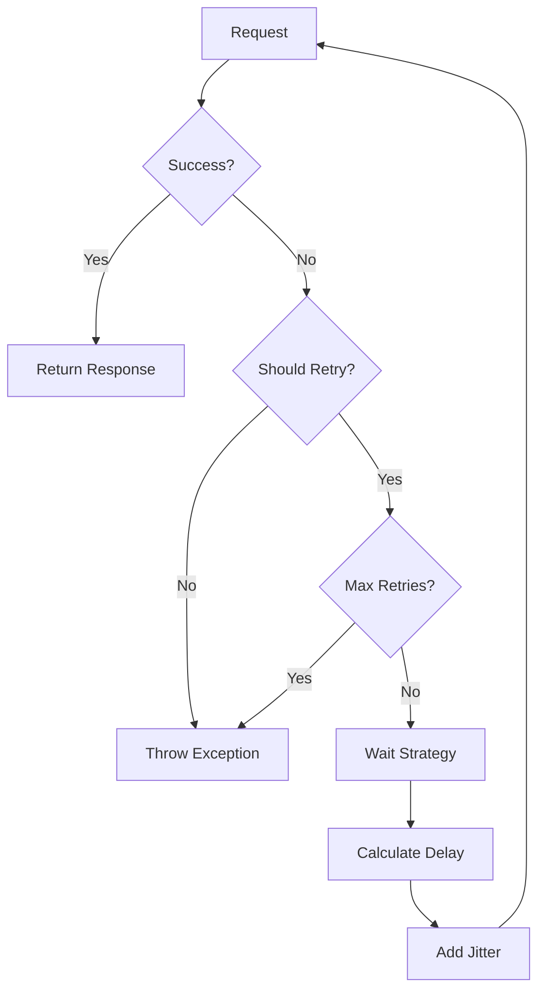
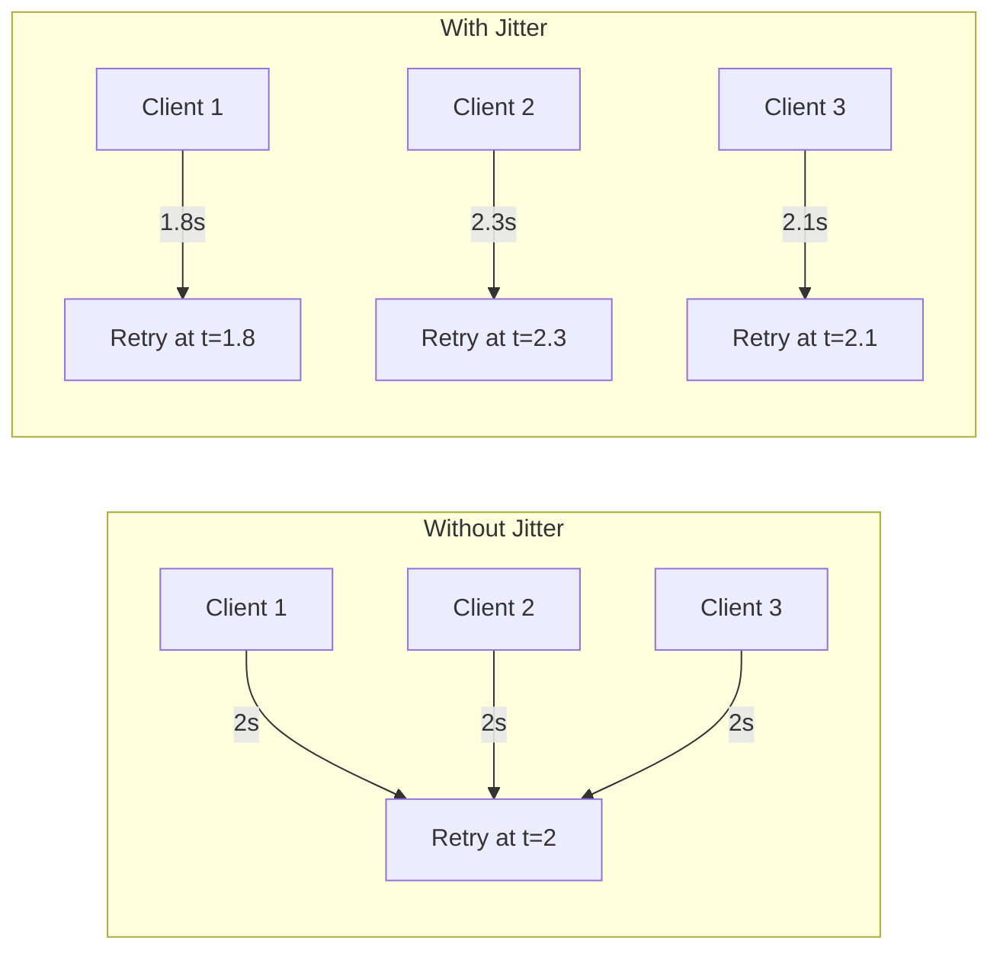
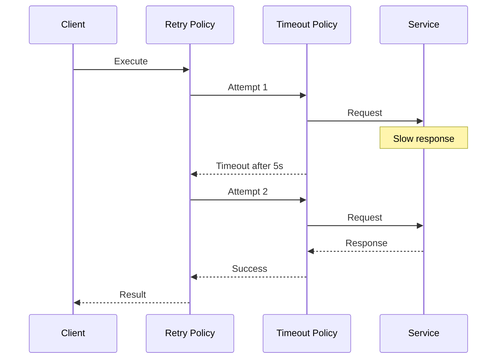

# How to Implement Custom Retry Policies with Polly

Author: [nawazdhandala](https://github.com/nawazdhandala)

Tags: .NET, Polly, Retry Policies, Resilience, C#, Error Handling

Description: Learn how to implement custom retry policies with Polly in .NET applications. This guide covers exponential backoff, jitter, conditional retries, and production-ready patterns for handling transient failures.

---

Transient failures happen. Network timeouts, database deadlocks, rate limiting responses, and temporary service unavailability are facts of life in distributed systems. The difference between a fragile application and a resilient one often comes down to how it handles these temporary hiccups. Polly provides a powerful framework for implementing retry logic, but the real power comes from customizing retry behavior to match your specific needs.

## Why Custom Retry Policies Matter

Default retry strategies rarely fit real-world scenarios. A payment service needs different retry behavior than a logging service. Some failures should trigger immediate retries while others need exponential backoff. Certain status codes mean "try again" while others mean "stop immediately."



## Setting Up Polly

Install the required packages:

```bash
dotnet add package Polly
dotnet add package Microsoft.Extensions.Http.Polly
```

## Basic Retry with Custom Exception Handling

The simplest custom retry handles specific exception types differently.

This policy retries HTTP exceptions and timeouts up to 3 times with a fixed delay:

```csharp
using Polly;
using Polly.Retry;

// Create a retry policy that handles multiple exception types
var retryPolicy = Policy
    .Handle<HttpRequestException>()
    .Or<TaskCanceledException>() // Timeouts
    .Or<SocketException>()
    .WaitAndRetryAsync(
        retryCount: 3,
        sleepDurationProvider: retryAttempt => TimeSpan.FromSeconds(2),
        onRetry: (exception, timeSpan, retryCount, context) =>
        {
            Console.WriteLine(
                $"Retry {retryCount} after {timeSpan.TotalSeconds}s due to: {exception.Message}");
        });
```

## Exponential Backoff with Jitter

Exponential backoff prevents thundering herd problems when services recover. Adding jitter spreads out retry attempts across multiple clients.



This implementation adds randomized jitter to exponential backoff delays:

```csharp
// Exponential backoff with decorrelated jitter
// This prevents synchronized retry storms from multiple clients
var jitteredBackoff = Policy
    .Handle<HttpRequestException>()
    .WaitAndRetryAsync(
        retryCount: 5,
        sleepDurationProvider: (retryAttempt, context) =>
        {
            // Base delay doubles with each attempt: 1s, 2s, 4s, 8s, 16s
            var baseDelay = TimeSpan.FromSeconds(Math.Pow(2, retryAttempt - 1));

            // Add jitter: +/- 25% of the base delay
            var jitter = baseDelay.TotalMilliseconds * 0.25;
            var random = new Random();
            var actualDelay = baseDelay.TotalMilliseconds +
                (random.NextDouble() * 2 - 1) * jitter;

            return TimeSpan.FromMilliseconds(Math.Max(actualDelay, 100));
        },
        onRetry: (exception, delay, retryCount, context) =>
        {
            Console.WriteLine($"Attempt {retryCount}: waiting {delay.TotalMilliseconds:F0}ms");
        });
```

A cleaner approach uses Polly's built-in decorrelated jitter calculation:

```csharp
// Using Polly's recommended decorrelated jitter algorithm
// Based on the "Decorrelated Jitter" formula from AWS architecture blog
public static class JitterCalculator
{
    private static readonly Random Random = new();

    public static IEnumerable<TimeSpan> DecorrelatedJitter(
        int maxRetries,
        TimeSpan seedDelay,
        TimeSpan maxDelay)
    {
        var current = seedDelay.TotalMilliseconds;

        for (int i = 0; i < maxRetries; i++)
        {
            // Decorrelated jitter formula
            current = Math.Min(
                maxDelay.TotalMilliseconds,
                Random.NextDouble() * (current * 3 - seedDelay.TotalMilliseconds) +
                    seedDelay.TotalMilliseconds);

            yield return TimeSpan.FromMilliseconds(current);
        }
    }
}

// Using the custom jitter calculator
var delays = JitterCalculator.DecorrelatedJitter(
    maxRetries: 5,
    seedDelay: TimeSpan.FromSeconds(1),
    maxDelay: TimeSpan.FromSeconds(30));

var decorrelatedPolicy = Policy
    .Handle<HttpRequestException>()
    .WaitAndRetryAsync(delays);
```

## Conditional Retry Based on Response Content

Sometimes you need to inspect the response body to decide whether to retry. Rate limiting responses often include retry-after headers.

This policy checks HTTP status codes and respects Retry-After headers:

```csharp
// Retry policy that handles specific HTTP status codes
// and respects Retry-After headers from rate limiting
var httpRetryPolicy = Policy<HttpResponseMessage>
    .HandleResult(response =>
    {
        // Retry on these status codes
        var retryStatusCodes = new[]
        {
            HttpStatusCode.RequestTimeout,      // 408
            HttpStatusCode.TooManyRequests,     // 429
            HttpStatusCode.BadGateway,          // 502
            HttpStatusCode.ServiceUnavailable,  // 503
            HttpStatusCode.GatewayTimeout       // 504
        };

        return retryStatusCodes.Contains(response.StatusCode);
    })
    .Or<HttpRequestException>()
    .WaitAndRetryAsync(
        retryCount: 4,
        sleepDurationProvider: (retryAttempt, result, context) =>
        {
            // Check for Retry-After header
            if (result.Result?.Headers.RetryAfter != null)
            {
                var retryAfter = result.Result.Headers.RetryAfter;

                if (retryAfter.Delta.HasValue)
                {
                    return retryAfter.Delta.Value;
                }

                if (retryAfter.Date.HasValue)
                {
                    var waitTime = retryAfter.Date.Value - DateTimeOffset.UtcNow;
                    return waitTime > TimeSpan.Zero ? waitTime : TimeSpan.FromSeconds(1);
                }
            }

            // Default exponential backoff
            return TimeSpan.FromSeconds(Math.Pow(2, retryAttempt));
        },
        onRetryAsync: async (outcome, delay, retryCount, context) =>
        {
            var statusCode = outcome.Result?.StatusCode.ToString() ?? "Exception";
            Console.WriteLine($"Retry {retryCount}: {statusCode}, waiting {delay.TotalSeconds}s");
            await Task.CompletedTask;
        });
```

## Context-Aware Retry Policies

Pass context through retry attempts for logging, correlation IDs, or dynamic behavior.

This example shows how to use Polly Context to pass data through retries:

```csharp
// Create a policy that uses context for correlation and logging
var contextAwarePolicy = Policy
    .Handle<Exception>()
    .WaitAndRetryAsync(
        retryCount: 3,
        sleepDurationProvider: (retryAttempt, context) =>
        {
            // Check if this operation is high priority
            var isHighPriority = context.TryGetValue("priority", out var priority) &&
                priority?.ToString() == "high";

            // High priority operations retry faster
            var multiplier = isHighPriority ? 0.5 : 1.0;
            return TimeSpan.FromSeconds(Math.Pow(2, retryAttempt) * multiplier);
        },
        onRetry: (exception, delay, retryCount, context) =>
        {
            var correlationId = context.TryGetValue("correlationId", out var id)
                ? id?.ToString()
                : "unknown";

            var operationName = context.OperationKey ?? "UnnamedOperation";

            Console.WriteLine(
                $"[{correlationId}] {operationName} retry {retryCount}, " +
                $"waiting {delay.TotalSeconds}s: {exception.Message}");
        });

// Using the policy with context
var context = new Context("FetchUserData")
{
    { "correlationId", Guid.NewGuid().ToString() },
    { "priority", "high" }
};

await contextAwarePolicy.ExecuteAsync(
    async ctx =>
    {
        // Your operation here
        return await FetchDataAsync();
    },
    context);
```

## Custom Retry Strategy Factory

For large applications, centralize retry policy creation in a factory.

```csharp
// Services/RetryPolicyFactory.cs
public interface IRetryPolicyFactory
{
    AsyncRetryPolicy<HttpResponseMessage> CreateHttpRetryPolicy(RetryOptions options);
    AsyncRetryPolicy CreateGenericRetryPolicy(RetryOptions options);
}

public class RetryOptions
{
    public int MaxRetries { get; set; } = 3;
    public TimeSpan InitialDelay { get; set; } = TimeSpan.FromSeconds(1);
    public TimeSpan MaxDelay { get; set; } = TimeSpan.FromSeconds(30);
    public bool UseJitter { get; set; } = true;
    public double JitterFactor { get; set; } = 0.25;
    public string ServiceName { get; set; } = "Unknown";
}

public class RetryPolicyFactory : IRetryPolicyFactory
{
    private readonly ILogger<RetryPolicyFactory> _logger;
    private readonly Random _random = new();

    public RetryPolicyFactory(ILogger<RetryPolicyFactory> logger)
    {
        _logger = logger;
    }

    public AsyncRetryPolicy<HttpResponseMessage> CreateHttpRetryPolicy(RetryOptions options)
    {
        return Policy<HttpResponseMessage>
            .HandleResult(r => IsTransientError(r.StatusCode))
            .Or<HttpRequestException>()
            .Or<TaskCanceledException>()
            .WaitAndRetryAsync(
                retryCount: options.MaxRetries,
                sleepDurationProvider: (attempt, result, ctx) =>
                    CalculateDelay(attempt, result.Result, options),
                onRetryAsync: (outcome, delay, attempt, ctx) =>
                {
                    LogRetry(options.ServiceName, attempt, delay, outcome.Exception,
                        outcome.Result?.StatusCode);
                    return Task.CompletedTask;
                });
    }

    public AsyncRetryPolicy CreateGenericRetryPolicy(RetryOptions options)
    {
        return Policy
            .Handle<Exception>(ex => IsTransientException(ex))
            .WaitAndRetryAsync(
                retryCount: options.MaxRetries,
                sleepDurationProvider: attempt => CalculateDelay(attempt, null, options),
                onRetry: (exception, delay, attempt, ctx) =>
                {
                    LogRetry(options.ServiceName, attempt, delay, exception, null);
                });
    }

    private TimeSpan CalculateDelay(
        int attempt,
        HttpResponseMessage? response,
        RetryOptions options)
    {
        // Check Retry-After header first
        if (response?.Headers.RetryAfter?.Delta is TimeSpan retryAfter)
        {
            return retryAfter;
        }

        // Exponential backoff
        var exponentialDelay = options.InitialDelay.TotalMilliseconds * Math.Pow(2, attempt - 1);

        // Apply jitter
        if (options.UseJitter)
        {
            var jitterRange = exponentialDelay * options.JitterFactor;
            exponentialDelay += (_random.NextDouble() * 2 - 1) * jitterRange;
        }

        // Clamp to max delay
        var finalDelay = Math.Min(exponentialDelay, options.MaxDelay.TotalMilliseconds);
        return TimeSpan.FromMilliseconds(Math.Max(finalDelay, 100));
    }

    private bool IsTransientError(HttpStatusCode statusCode)
    {
        return statusCode == HttpStatusCode.RequestTimeout ||
               statusCode == HttpStatusCode.TooManyRequests ||
               (int)statusCode >= 500;
    }

    private bool IsTransientException(Exception ex)
    {
        return ex is HttpRequestException ||
               ex is TaskCanceledException ||
               ex is SocketException ||
               ex is IOException;
    }

    private void LogRetry(
        string serviceName,
        int attempt,
        TimeSpan delay,
        Exception? exception,
        HttpStatusCode? statusCode)
    {
        _logger.LogWarning(
            "Service {ServiceName} retry attempt {Attempt} after {Delay}ms. " +
            "Status: {StatusCode}, Error: {Error}",
            serviceName,
            attempt,
            delay.TotalMilliseconds,
            statusCode?.ToString() ?? "N/A",
            exception?.Message ?? "N/A");
    }
}
```

Registering and using the factory:

```csharp
// Program.cs
var builder = WebApplication.CreateBuilder(args);

// Register the factory
builder.Services.AddSingleton<IRetryPolicyFactory, RetryPolicyFactory>();

// Create typed clients with custom retry policies
builder.Services.AddHttpClient<PaymentServiceClient>()
    .AddPolicyHandler((services, request) =>
    {
        var factory = services.GetRequiredService<IRetryPolicyFactory>();
        return factory.CreateHttpRetryPolicy(new RetryOptions
        {
            ServiceName = "PaymentService",
            MaxRetries = 5,
            InitialDelay = TimeSpan.FromMilliseconds(500),
            MaxDelay = TimeSpan.FromSeconds(10)
        });
    });
```

## Database Retry with Deadlock Handling

Database operations often require retry logic for deadlocks and connection failures.

This policy handles SQL-specific transient errors:

```csharp
using Microsoft.Data.SqlClient;
using Polly;

// SQL Server transient error numbers
// These indicate temporary issues that may succeed on retry
public static class SqlTransientErrors
{
    public static readonly int[] TransientErrorNumbers =
    {
        -2,     // Timeout
        -1,     // Connection error
        2,      // Instance not found
        53,     // Network path not found
        121,    // Semaphore timeout
        1205,   // Deadlock
        1222,   // Lock request timeout
        8645,   // Memory grant timeout
        8651,   // Memory grant failed
        10053,  // Transport-level error
        10054,  // Connection reset
        10060,  // Connection timeout
        40143,  // Connection could not be established
        40197,  // Service error processing request
        40501,  // Service busy
        40613,  // Database unavailable
        49918,  // Not enough resources
        49919,  // Not enough resources to process request
        49920   // Too many requests
    };

    public static bool IsTransient(int errorNumber)
    {
        return TransientErrorNumbers.Contains(errorNumber);
    }
}

// Create a database retry policy that handles deadlocks and connection issues
var databaseRetryPolicy = Policy
    .Handle<SqlException>(ex =>
        ex.Errors.Cast<SqlError>().Any(e => SqlTransientErrors.IsTransient(e.Number)))
    .Or<TimeoutException>()
    .WaitAndRetryAsync(
        retryCount: 4,
        sleepDurationProvider: (attempt, exception, context) =>
        {
            // Deadlocks get shorter delays with jitter
            if (exception is SqlException sqlEx &&
                sqlEx.Errors.Cast<SqlError>().Any(e => e.Number == 1205))
            {
                var random = new Random();
                return TimeSpan.FromMilliseconds(100 + random.Next(0, 100) * attempt);
            }

            // Other errors use exponential backoff
            return TimeSpan.FromSeconds(Math.Pow(2, attempt));
        },
        onRetryAsync: (exception, delay, attempt, context) =>
        {
            var sqlEx = exception as SqlException;
            var errorNumbers = sqlEx?.Errors.Cast<SqlError>()
                .Select(e => e.Number.ToString()) ?? Array.Empty<string>();

            Console.WriteLine(
                $"Database retry {attempt}, waiting {delay.TotalMilliseconds}ms. " +
                $"Errors: {string.Join(", ", errorNumbers)}");

            return Task.CompletedTask;
        });
```

Using the database policy with Entity Framework:

```csharp
// Services/UserRepository.cs
public class UserRepository
{
    private readonly ApplicationDbContext _context;
    private readonly AsyncRetryPolicy _retryPolicy;
    private readonly ILogger<UserRepository> _logger;

    public UserRepository(
        ApplicationDbContext context,
        ILogger<UserRepository> logger)
    {
        _context = context;
        _logger = logger;
        _retryPolicy = CreateDatabaseRetryPolicy();
    }

    public async Task<User?> GetByIdAsync(int id)
    {
        return await _retryPolicy.ExecuteAsync(async () =>
        {
            return await _context.Users.FindAsync(id);
        });
    }

    public async Task<bool> UpdateUserAsync(User user)
    {
        return await _retryPolicy.ExecuteAsync(async () =>
        {
            _context.Users.Update(user);
            await _context.SaveChangesAsync();
            return true;
        });
    }

    private AsyncRetryPolicy CreateDatabaseRetryPolicy()
    {
        return Policy
            .Handle<DbUpdateException>(ex =>
                ex.InnerException is SqlException sqlEx &&
                SqlTransientErrors.IsTransient(sqlEx.Number))
            .Or<SqlException>(ex =>
                ex.Errors.Cast<SqlError>().Any(e => SqlTransientErrors.IsTransient(e.Number)))
            .WaitAndRetryAsync(
                retryCount: 3,
                sleepDurationProvider: attempt => TimeSpan.FromMilliseconds(100 * Math.Pow(2, attempt)),
                onRetry: (ex, delay, attempt, ctx) =>
                {
                    _logger.LogWarning(ex,
                        "Database operation retry {Attempt} after {Delay}ms",
                        attempt, delay.TotalMilliseconds);
                });
    }
}
```

## Retry with Timeout Wrapper

Combine retry with per-attempt timeouts to prevent long waits.



This example wraps a timeout policy inside a retry policy:

```csharp
using Polly;
using Polly.Timeout;

// Per-attempt timeout: each retry attempt gets 5 seconds
var timeoutPolicy = Policy
    .TimeoutAsync<HttpResponseMessage>(
        timeout: TimeSpan.FromSeconds(5),
        timeoutStrategy: TimeoutStrategy.Optimistic,
        onTimeoutAsync: async (context, timeout, task) =>
        {
            Console.WriteLine($"Timeout after {timeout.TotalSeconds}s");
            await Task.CompletedTask;
        });

// Retry policy wraps timeout
var retryPolicy = Policy<HttpResponseMessage>
    .Handle<TimeoutRejectedException>()
    .Or<HttpRequestException>()
    .WaitAndRetryAsync(
        retryCount: 3,
        sleepDurationProvider: attempt => TimeSpan.FromSeconds(Math.Pow(2, attempt)));

// Wrap: retry wraps timeout
// This means each retry attempt has its own timeout
var resilientPolicy = Policy.WrapAsync(retryPolicy, timeoutPolicy);

// Usage
var httpClient = new HttpClient();
var response = await resilientPolicy.ExecuteAsync(async ct =>
{
    return await httpClient.GetAsync(
        "https://api.example.com/data",
        ct);
}, CancellationToken.None);
```

## Testing Custom Retry Policies

Verify your retry logic works correctly with unit tests.

```csharp
using Xunit;
using Polly;

public class RetryPolicyTests
{
    [Fact]
    public async Task RetryPolicy_RetriesOnTransientError()
    {
        // Arrange
        var attempts = 0;
        var policy = Policy
            .Handle<HttpRequestException>()
            .WaitAndRetryAsync(
                retryCount: 3,
                sleepDurationProvider: _ => TimeSpan.FromMilliseconds(10));

        // Act
        await policy.ExecuteAsync(() =>
        {
            attempts++;
            if (attempts < 3)
            {
                throw new HttpRequestException("Transient error");
            }
            return Task.CompletedTask;
        });

        // Assert
        Assert.Equal(3, attempts);
    }

    [Fact]
    public async Task RetryPolicy_DoesNotRetryOnNonTransientError()
    {
        // Arrange
        var attempts = 0;
        var policy = Policy
            .Handle<HttpRequestException>()
            .WaitAndRetryAsync(
                retryCount: 3,
                sleepDurationProvider: _ => TimeSpan.FromMilliseconds(10));

        // Act & Assert
        await Assert.ThrowsAsync<InvalidOperationException>(async () =>
        {
            await policy.ExecuteAsync(() =>
            {
                attempts++;
                throw new InvalidOperationException("Not transient");
            });
        });

        Assert.Equal(1, attempts);
    }

    [Fact]
    public async Task RetryPolicy_RespectsMaxRetries()
    {
        // Arrange
        var attempts = 0;
        var policy = Policy
            .Handle<Exception>()
            .WaitAndRetryAsync(
                retryCount: 3,
                sleepDurationProvider: _ => TimeSpan.FromMilliseconds(10));

        // Act & Assert
        await Assert.ThrowsAsync<Exception>(async () =>
        {
            await policy.ExecuteAsync(() =>
            {
                attempts++;
                throw new Exception("Always fails");
            });
        });

        // Initial attempt + 3 retries = 4 attempts
        Assert.Equal(4, attempts);
    }

    [Fact]
    public async Task RetryPolicy_IncrementsDelayWithExponentialBackoff()
    {
        // Arrange
        var delays = new List<TimeSpan>();
        var policy = Policy
            .Handle<Exception>()
            .WaitAndRetryAsync(
                retryCount: 3,
                sleepDurationProvider: attempt => TimeSpan.FromSeconds(Math.Pow(2, attempt)),
                onRetry: (_, delay, _, _) => delays.Add(delay));

        // Act
        try
        {
            await policy.ExecuteAsync(() => throw new Exception());
        }
        catch { }

        // Assert
        Assert.Equal(3, delays.Count);
        Assert.Equal(TimeSpan.FromSeconds(2), delays[0]);
        Assert.Equal(TimeSpan.FromSeconds(4), delays[1]);
        Assert.Equal(TimeSpan.FromSeconds(8), delays[2]);
    }
}
```

## Monitoring Retry Metrics

Track retry behavior with OpenTelemetry metrics.

```csharp
// Metrics/RetryMetrics.cs
using System.Diagnostics.Metrics;

public class RetryMetrics
{
    private readonly Counter<long> _retryAttempts;
    private readonly Counter<long> _retrySuccesses;
    private readonly Counter<long> _retryExhausted;
    private readonly Histogram<double> _retryDuration;

    public RetryMetrics(IMeterFactory meterFactory)
    {
        var meter = meterFactory.Create("Application.Resilience");

        _retryAttempts = meter.CreateCounter<long>(
            "resilience.retry.attempts",
            description: "Number of retry attempts");

        _retrySuccesses = meter.CreateCounter<long>(
            "resilience.retry.successes",
            description: "Number of successful retries");

        _retryExhausted = meter.CreateCounter<long>(
            "resilience.retry.exhausted",
            description: "Number of times retries were exhausted");

        _retryDuration = meter.CreateHistogram<double>(
            "resilience.retry.duration",
            unit: "ms",
            description: "Total time spent in retry attempts");
    }

    public void RecordRetryAttempt(string serviceName, int attempt)
    {
        _retryAttempts.Add(1,
            new KeyValuePair<string, object?>("service", serviceName),
            new KeyValuePair<string, object?>("attempt", attempt));
    }

    public void RecordRetrySuccess(string serviceName, int totalAttempts)
    {
        _retrySuccesses.Add(1,
            new KeyValuePair<string, object?>("service", serviceName),
            new KeyValuePair<string, object?>("total_attempts", totalAttempts));
    }

    public void RecordRetryExhausted(string serviceName)
    {
        _retryExhausted.Add(1,
            new KeyValuePair<string, object?>("service", serviceName));
    }

    public void RecordRetryDuration(string serviceName, double durationMs)
    {
        _retryDuration.Record(durationMs,
            new KeyValuePair<string, object?>("service", serviceName));
    }
}

// Integration with retry policy
public class InstrumentedRetryPolicy
{
    private readonly RetryMetrics _metrics;

    public InstrumentedRetryPolicy(RetryMetrics metrics)
    {
        _metrics = metrics;
    }

    public AsyncRetryPolicy CreatePolicy(string serviceName, int maxRetries)
    {
        var totalAttempts = 0;
        var startTime = DateTime.UtcNow;

        return Policy
            .Handle<Exception>()
            .WaitAndRetryAsync(
                retryCount: maxRetries,
                sleepDurationProvider: attempt => TimeSpan.FromSeconds(Math.Pow(2, attempt)),
                onRetry: (exception, delay, attempt, context) =>
                {
                    totalAttempts = attempt;
                    _metrics.RecordRetryAttempt(serviceName, attempt);
                })
            .WrapAsync(Policy.NoOpAsync()
                .WithPolicyKey(serviceName))
            .AsAsyncPolicy();
    }
}
```

## Best Practices Summary

| Practice | Description |
|----------|-------------|
| Use exponential backoff | Prevents overwhelming recovering services |
| Add jitter | Spreads retry storms across time |
| Set max retries | Avoid infinite loops, typically 3-5 retries |
| Respect Retry-After | Honor rate limiting headers |
| Log retry attempts | Essential for debugging production issues |
| Track metrics | Monitor retry rates to detect systemic problems |
| Test failure scenarios | Verify retry logic works as expected |
| Different policies per service | Payment APIs need different handling than logging |

## Summary

Custom retry policies let you handle transient failures in ways that match your application's specific requirements. Start with basic exponential backoff and jitter for most HTTP calls. Add conditional logic for services that return Retry-After headers. Use shorter delays with more randomization for database deadlocks. Centralize policy creation in a factory for consistency across your application.

The key is matching retry behavior to the failure mode. A rate-limited API needs patience and header inspection. A deadlocked database needs quick retries with jitter. A flaky network connection needs exponential backoff. Polly gives you the building blocks to handle all these scenarios effectively.
