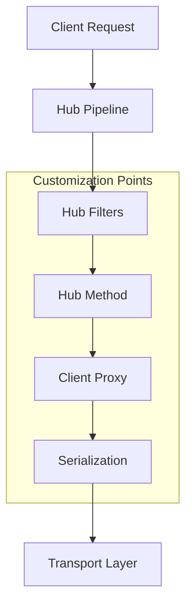
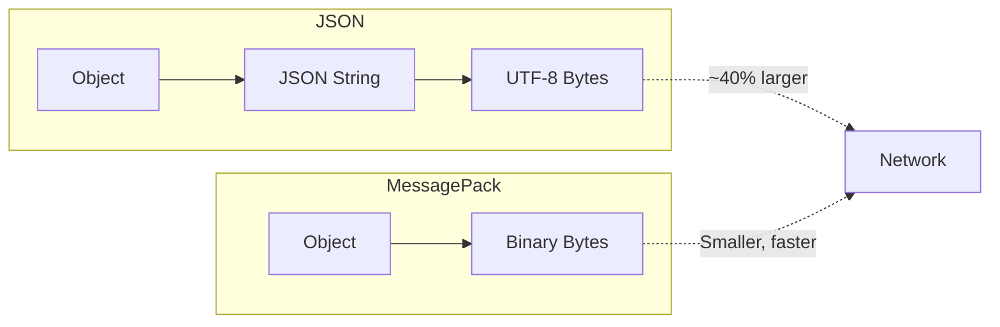

# How to Build Custom SignalR Hubs in .NET

Author: [nawazdhandala](https://www.github.com/nawazdhandala)

Tags: .NET, SignalR, ASP.NET Core, C#, WebSockets, Real-Time, Hub Filters, MessagePack

Description: Learn advanced techniques for building custom SignalR hubs in .NET. This guide covers hub filters, custom protocols, user providers, validation patterns, and production-ready practices for real-time applications.

---

SignalR hubs handle the basics out of the box, but production applications need more. You need logging, validation, custom authentication, and performance optimizations. This guide shows you how to build custom SignalR hubs that handle real-world requirements.

## Hub Architecture Overview

Before diving into customization, understand how SignalR processes requests through your hubs.



Each stage in this pipeline offers opportunities for customization. Hub filters intercept method calls. Custom serialization improves performance. User providers control how SignalR identifies connected users.

## Hub Filters for Cross-Cutting Concerns

Hub filters work like middleware but for SignalR hubs. They intercept hub method invocations, letting you add logging, validation, or authorization logic in one place.

### Creating a Logging Filter

This filter logs every hub method call with timing information.

```csharp
using Microsoft.AspNetCore.SignalR;
using System.Diagnostics;

// Hub filter that logs method invocations with timing
public class LoggingHubFilter : IHubFilter
{
    private readonly ILogger<LoggingHubFilter> _logger;

    public LoggingHubFilter(ILogger<LoggingHubFilter> logger)
    {
        _logger = logger;
    }

    // Called before the hub method executes
    public async ValueTask<object?> InvokeMethodAsync(
        HubInvocationContext invocationContext,
        Func<HubInvocationContext, ValueTask<object?>> next)
    {
        var hubName = invocationContext.Hub.GetType().Name;
        var methodName = invocationContext.HubMethodName;
        var connectionId = invocationContext.Context.ConnectionId;

        var stopwatch = Stopwatch.StartNew();

        _logger.LogInformation(
            "Hub method starting: {Hub}.{Method} for connection {ConnectionId}",
            hubName,
            methodName,
            connectionId);

        try
        {
            // Call the actual hub method
            var result = await next(invocationContext);

            stopwatch.Stop();

            _logger.LogInformation(
                "Hub method completed: {Hub}.{Method} in {ElapsedMs}ms",
                hubName,
                methodName,
                stopwatch.ElapsedMilliseconds);

            return result;
        }
        catch (Exception ex)
        {
            stopwatch.Stop();

            _logger.LogError(
                ex,
                "Hub method failed: {Hub}.{Method} after {ElapsedMs}ms",
                hubName,
                methodName,
                stopwatch.ElapsedMilliseconds);

            throw;
        }
    }

    // Called when a connection is established
    public Task OnConnectedAsync(
        HubLifetimeContext context,
        Func<HubLifetimeContext, Task> next)
    {
        _logger.LogInformation(
            "Client connected: {ConnectionId} to {Hub}",
            context.Context.ConnectionId,
            context.Hub.GetType().Name);

        return next(context);
    }

    // Called when a connection is closed
    public Task OnDisconnectedAsync(
        HubLifetimeContext context,
        Exception? exception,
        Func<HubLifetimeContext, Exception?, Task> next)
    {
        if (exception != null)
        {
            _logger.LogWarning(
                exception,
                "Client disconnected with error: {ConnectionId}",
                context.Context.ConnectionId);
        }
        else
        {
            _logger.LogInformation(
                "Client disconnected: {ConnectionId}",
                context.Context.ConnectionId);
        }

        return next(context, exception);
    }
}
```

### Creating a Validation Filter

This filter validates hub method arguments using data annotations.

```csharp
using System.ComponentModel.DataAnnotations;
using Microsoft.AspNetCore.SignalR;

// Hub filter that validates method arguments using data annotations
public class ValidationHubFilter : IHubFilter
{
    public async ValueTask<object?> InvokeMethodAsync(
        HubInvocationContext invocationContext,
        Func<HubInvocationContext, ValueTask<object?>> next)
    {
        // Validate each argument that has validation attributes
        var arguments = invocationContext.HubMethodArguments;

        foreach (var argument in arguments)
        {
            if (argument == null) continue;

            var validationContext = new ValidationContext(argument);
            var validationResults = new List<ValidationResult>();

            if (!Validator.TryValidateObject(
                argument,
                validationContext,
                validationResults,
                validateAllProperties: true))
            {
                var errors = string.Join(", ", validationResults.Select(r => r.ErrorMessage));
                throw new HubException($"Validation failed: {errors}");
            }
        }

        return await next(invocationContext);
    }
}

// Example message class with validation
public class ChatMessage
{
    [Required(ErrorMessage = "Content is required")]
    [StringLength(2000, MinimumLength = 1, ErrorMessage = "Message must be between 1 and 2000 characters")]
    public string Content { get; set; } = string.Empty;

    [StringLength(100, ErrorMessage = "Room name cannot exceed 100 characters")]
    public string? RoomName { get; set; }

    [Range(1, 10, ErrorMessage = "Priority must be between 1 and 10")]
    public int Priority { get; set; } = 5;
}
```

### Creating a Rate Limiting Filter

Protect your hubs from abuse with a rate limiting filter.

```csharp
using Microsoft.AspNetCore.SignalR;
using System.Collections.Concurrent;

// Hub filter that limits how frequently clients can invoke methods
public class RateLimitingHubFilter : IHubFilter
{
    private readonly ConcurrentDictionary<string, RateLimitInfo> _rateLimits = new();
    private readonly int _maxRequestsPerMinute;
    private readonly ILogger<RateLimitingHubFilter> _logger;

    public RateLimitingHubFilter(
        ILogger<RateLimitingHubFilter> logger,
        int maxRequestsPerMinute = 60)
    {
        _logger = logger;
        _maxRequestsPerMinute = maxRequestsPerMinute;
    }

    public async ValueTask<object?> InvokeMethodAsync(
        HubInvocationContext invocationContext,
        Func<HubInvocationContext, ValueTask<object?>> next)
    {
        var connectionId = invocationContext.Context.ConnectionId;
        var now = DateTime.UtcNow;

        var rateLimitInfo = _rateLimits.GetOrAdd(
            connectionId,
            _ => new RateLimitInfo());

        lock (rateLimitInfo)
        {
            // Reset counter if a minute has passed
            if ((now - rateLimitInfo.WindowStart).TotalMinutes >= 1)
            {
                rateLimitInfo.WindowStart = now;
                rateLimitInfo.RequestCount = 0;
            }

            rateLimitInfo.RequestCount++;

            if (rateLimitInfo.RequestCount > _maxRequestsPerMinute)
            {
                _logger.LogWarning(
                    "Rate limit exceeded for connection {ConnectionId}",
                    connectionId);

                throw new HubException("Rate limit exceeded. Please slow down.");
            }
        }

        return await next(invocationContext);
    }

    public Task OnDisconnectedAsync(
        HubLifetimeContext context,
        Exception? exception,
        Func<HubLifetimeContext, Exception?, Task> next)
    {
        // Clean up rate limit info when client disconnects
        _rateLimits.TryRemove(context.Context.ConnectionId, out _);
        return next(context, exception);
    }

    private class RateLimitInfo
    {
        public DateTime WindowStart { get; set; } = DateTime.UtcNow;
        public int RequestCount { get; set; }
    }
}
```

### Registering Hub Filters

Register filters in Program.cs. They execute in the order they are added.

```csharp
// Program.cs
var builder = WebApplication.CreateBuilder(args);

// Add SignalR with hub filters
builder.Services.AddSignalR(options =>
{
    // Global filters apply to all hubs
    options.AddFilter<LoggingHubFilter>();
    options.AddFilter<ValidationHubFilter>();
    options.AddFilter<RateLimitingHubFilter>();
});

// Register filter dependencies
builder.Services.AddSingleton<LoggingHubFilter>();
builder.Services.AddSingleton<ValidationHubFilter>();
builder.Services.AddSingleton<RateLimitingHubFilter>();

var app = builder.Build();

app.MapHub<ChatHub>("/hubs/chat");

app.Run();
```

## Custom User ID Provider

By default, SignalR uses `ClaimTypes.NameIdentifier` to identify users. Custom providers let you use different claims or lookup strategies.

```csharp
using Microsoft.AspNetCore.SignalR;
using System.Security.Claims;

// Custom provider that uses email claim as the user identifier
public class EmailUserIdProvider : IUserIdProvider
{
    public string? GetUserId(HubConnectionContext connection)
    {
        // Use email as the user identifier
        return connection.User?.FindFirst(ClaimTypes.Email)?.Value;
    }
}

// Provider that looks up user ID from a custom header
public class HeaderUserIdProvider : IUserIdProvider
{
    private readonly IUserService _userService;

    public HeaderUserIdProvider(IUserService userService)
    {
        _userService = userService;
    }

    public string? GetUserId(HubConnectionContext connection)
    {
        // Check for API key in headers
        var apiKey = connection.GetHttpContext()?.Request.Headers["X-API-Key"].FirstOrDefault();

        if (string.IsNullOrEmpty(apiKey))
        {
            return null;
        }

        // Look up user by API key
        var user = _userService.GetUserByApiKey(apiKey);
        return user?.Id.ToString();
    }
}

// Provider that combines multiple identification strategies
public class CompositeUserIdProvider : IUserIdProvider
{
    public string? GetUserId(HubConnectionContext connection)
    {
        // Try JWT claim first
        var userId = connection.User?.FindFirst(ClaimTypes.NameIdentifier)?.Value;
        if (!string.IsNullOrEmpty(userId))
        {
            return userId;
        }

        // Fall back to custom header
        var customId = connection.GetHttpContext()?.Request.Headers["X-User-Id"].FirstOrDefault();
        if (!string.IsNullOrEmpty(customId))
        {
            return customId;
        }

        // Fall back to connection ID for anonymous users
        return $"anonymous:{connection.ConnectionId}";
    }
}
```

Register the custom provider in Program.cs.

```csharp
// Program.cs
builder.Services.AddSingleton<IUserIdProvider, EmailUserIdProvider>();
```

## MessagePack Protocol for Performance

JSON serialization works fine, but MessagePack is faster and produces smaller payloads. For high-throughput applications, the difference matters.



### Setting Up MessagePack

Install the required package.

```bash
dotnet add package Microsoft.AspNetCore.SignalR.Protocols.MessagePack
```

Configure the server to use MessagePack.

```csharp
// Program.cs
builder.Services.AddSignalR()
    .AddMessagePackProtocol(options =>
    {
        // Configure MessagePack options
        options.SerializerOptions = MessagePackSerializerOptions.Standard
            .WithSecurity(MessagePackSecurity.UntrustedData)
            .WithCompression(MessagePackCompression.Lz4BlockArray);
    });
```

Configure the JavaScript client.

```javascript
// Install @microsoft/signalr-protocol-msgpack package first
import * as signalR from "@microsoft/signalr";
import { MessagePackHubProtocol } from "@microsoft/signalr-protocol-msgpack";

const connection = new signalR.HubConnectionBuilder()
    .withUrl("/hubs/data")
    .withHubProtocol(new MessagePackHubProtocol())
    .build();
```

Configure the .NET client.

```csharp
// Install Microsoft.AspNetCore.SignalR.Protocols.MessagePack package
using Microsoft.AspNetCore.SignalR.Client;
using Microsoft.AspNetCore.SignalR.Protocol;

var connection = new HubConnectionBuilder()
    .WithUrl("https://myapp.com/hubs/data")
    .AddMessagePackProtocol()
    .Build();
```

## Hub Lifetime and Dependency Injection

Hubs are transient by default. A new instance is created for each method call. Understanding this helps you manage state and dependencies correctly.

```csharp
// Hubs are transient - new instance per method call
public class StatefulHub : Hub
{
    // BAD: Instance state is lost between calls
    private int _callCount = 0;

    public int GetCallCount()
    {
        _callCount++; // Always returns 1
        return _callCount;
    }
}

// Use injected services for shared state
public class BetterHub : Hub
{
    private readonly IConnectionStateService _stateService;

    public BetterHub(IConnectionStateService stateService)
    {
        _stateService = stateService;
    }

    public int GetCallCount()
    {
        return _stateService.IncrementAndGet(Context.ConnectionId);
    }
}

// Connection state service using concurrent dictionary
public interface IConnectionStateService
{
    int IncrementAndGet(string connectionId);
    void Remove(string connectionId);
}

public class ConnectionStateService : IConnectionStateService
{
    private readonly ConcurrentDictionary<string, int> _callCounts = new();

    public int IncrementAndGet(string connectionId)
    {
        return _callCounts.AddOrUpdate(connectionId, 1, (_, count) => count + 1);
    }

    public void Remove(string connectionId)
    {
        _callCounts.TryRemove(connectionId, out _);
    }
}
```

### Scoped Services in Hubs

Access scoped services using `IServiceScopeFactory`.

```csharp
public class DatabaseHub : Hub
{
    private readonly IServiceScopeFactory _scopeFactory;

    public DatabaseHub(IServiceScopeFactory scopeFactory)
    {
        _scopeFactory = scopeFactory;
    }

    public async Task<List<Message>> GetMessages(string roomId)
    {
        // Create a scope for database access
        using var scope = _scopeFactory.CreateScope();
        var dbContext = scope.ServiceProvider.GetRequiredService<AppDbContext>();

        return await dbContext.Messages
            .Where(m => m.RoomId == roomId)
            .OrderByDescending(m => m.CreatedAt)
            .Take(50)
            .ToListAsync();
    }
}
```

## Building a Production-Ready Hub

Combining all these patterns creates a robust, production-ready hub.

```csharp
using Microsoft.AspNetCore.Authorization;
using Microsoft.AspNetCore.SignalR;
using System.ComponentModel.DataAnnotations;

// Interface for strongly-typed client methods
public interface IChatClient
{
    Task ReceiveMessage(MessageDto message);
    Task UserJoined(string userId, string roomId);
    Task UserLeft(string userId, string roomId);
    Task TypingIndicator(string userId, bool isTyping);
    Task Error(string message);
}

// Message data transfer object with validation
public class MessageDto
{
    public string Id { get; set; } = Guid.NewGuid().ToString();

    [Required]
    [StringLength(2000, MinimumLength = 1)]
    public string Content { get; set; } = string.Empty;

    public string SenderId { get; set; } = string.Empty;
    public string SenderName { get; set; } = string.Empty;
    public string RoomId { get; set; } = string.Empty;
    public DateTime Timestamp { get; set; } = DateTime.UtcNow;
}

// Join room request with validation
public class JoinRoomRequest
{
    [Required]
    [StringLength(100, MinimumLength = 1)]
    public string RoomId { get; set; } = string.Empty;
}

// Production-ready chat hub with authentication and logging
[Authorize]
public class ChatHub : Hub<IChatClient>
{
    private readonly ILogger<ChatHub> _logger;
    private readonly IMessageService _messageService;
    private readonly IUserService _userService;
    private readonly IConnectionTracker _connectionTracker;

    public ChatHub(
        ILogger<ChatHub> logger,
        IMessageService messageService,
        IUserService userService,
        IConnectionTracker connectionTracker)
    {
        _logger = logger;
        _messageService = messageService;
        _userService = userService;
        _connectionTracker = connectionTracker;
    }

    // Get the current user's ID from claims
    private string UserId => Context.User?.FindFirst("sub")?.Value
        ?? throw new HubException("User not authenticated");

    // Get the current user's display name
    private string UserName => Context.User?.FindFirst("name")?.Value
        ?? "Unknown";

    public override async Task OnConnectedAsync()
    {
        await _connectionTracker.AddConnectionAsync(UserId, Context.ConnectionId);

        _logger.LogInformation(
            "User {UserId} connected with connection {ConnectionId}",
            UserId,
            Context.ConnectionId);

        await base.OnConnectedAsync();
    }

    public override async Task OnDisconnectedAsync(Exception? exception)
    {
        // Get rooms the user was in before removing connection
        var rooms = await _connectionTracker.GetUserRoomsAsync(Context.ConnectionId);

        await _connectionTracker.RemoveConnectionAsync(UserId, Context.ConnectionId);

        // Notify rooms that user left
        foreach (var roomId in rooms)
        {
            await Clients.Group(roomId).UserLeft(UserId, roomId);
        }

        if (exception != null)
        {
            _logger.LogWarning(
                exception,
                "User {UserId} disconnected with error",
                UserId);
        }

        await base.OnDisconnectedAsync(exception);
    }

    // Join a chat room
    public async Task JoinRoom(JoinRoomRequest request)
    {
        // Check if user has access to this room
        var hasAccess = await _userService.CanAccessRoomAsync(UserId, request.RoomId);
        if (!hasAccess)
        {
            throw new HubException("Access denied to this room");
        }

        await Groups.AddToGroupAsync(Context.ConnectionId, request.RoomId);
        await _connectionTracker.AddToRoomAsync(Context.ConnectionId, request.RoomId);

        // Notify others in the room
        await Clients.OthersInGroup(request.RoomId).UserJoined(UserId, request.RoomId);

        _logger.LogInformation(
            "User {UserId} joined room {RoomId}",
            UserId,
            request.RoomId);
    }

    // Leave a chat room
    public async Task LeaveRoom(string roomId)
    {
        await Groups.RemoveFromGroupAsync(Context.ConnectionId, roomId);
        await _connectionTracker.RemoveFromRoomAsync(Context.ConnectionId, roomId);

        await Clients.OthersInGroup(roomId).UserLeft(UserId, roomId);
    }

    // Send a message to a room
    public async Task SendMessage(MessageDto message)
    {
        // Enrich message with sender info
        message.SenderId = UserId;
        message.SenderName = UserName;
        message.Timestamp = DateTime.UtcNow;

        // Persist the message
        await _messageService.SaveMessageAsync(message);

        // Broadcast to room
        await Clients.Group(message.RoomId).ReceiveMessage(message);

        _logger.LogDebug(
            "Message sent to room {RoomId} by {UserId}",
            message.RoomId,
            UserId);
    }

    // Send typing indicator
    public async Task SendTyping(string roomId, bool isTyping)
    {
        await Clients.OthersInGroup(roomId).TypingIndicator(UserId, isTyping);
    }

    // Get message history for a room
    public async Task<List<MessageDto>> GetHistory(string roomId, int count = 50)
    {
        var hasAccess = await _userService.CanAccessRoomAsync(UserId, roomId);
        if (!hasAccess)
        {
            throw new HubException("Access denied to this room");
        }

        return await _messageService.GetMessagesAsync(roomId, count);
    }
}
```

## Connection Tracker Service

Track which users are in which rooms for presence features.

```csharp
// Service interface for tracking connections
public interface IConnectionTracker
{
    Task AddConnectionAsync(string userId, string connectionId);
    Task RemoveConnectionAsync(string userId, string connectionId);
    Task AddToRoomAsync(string connectionId, string roomId);
    Task RemoveFromRoomAsync(string connectionId, string roomId);
    Task<IEnumerable<string>> GetUserRoomsAsync(string connectionId);
    Task<IEnumerable<string>> GetRoomUsersAsync(string roomId);
    Task<bool> IsUserOnlineAsync(string userId);
}

// In-memory implementation for single-server deployments
public class InMemoryConnectionTracker : IConnectionTracker
{
    private readonly ConcurrentDictionary<string, HashSet<string>> _userConnections = new();
    private readonly ConcurrentDictionary<string, HashSet<string>> _connectionRooms = new();
    private readonly ConcurrentDictionary<string, HashSet<string>> _roomConnections = new();
    private readonly object _lock = new();

    public Task AddConnectionAsync(string userId, string connectionId)
    {
        lock (_lock)
        {
            var connections = _userConnections.GetOrAdd(userId, _ => new HashSet<string>());
            connections.Add(connectionId);
        }
        return Task.CompletedTask;
    }

    public Task RemoveConnectionAsync(string userId, string connectionId)
    {
        lock (_lock)
        {
            if (_userConnections.TryGetValue(userId, out var connections))
            {
                connections.Remove(connectionId);
                if (connections.Count == 0)
                {
                    _userConnections.TryRemove(userId, out _);
                }
            }

            // Clean up room memberships for this connection
            if (_connectionRooms.TryRemove(connectionId, out var rooms))
            {
                foreach (var roomId in rooms)
                {
                    if (_roomConnections.TryGetValue(roomId, out var roomConns))
                    {
                        roomConns.Remove(connectionId);
                    }
                }
            }
        }
        return Task.CompletedTask;
    }

    public Task AddToRoomAsync(string connectionId, string roomId)
    {
        lock (_lock)
        {
            var rooms = _connectionRooms.GetOrAdd(connectionId, _ => new HashSet<string>());
            rooms.Add(roomId);

            var connections = _roomConnections.GetOrAdd(roomId, _ => new HashSet<string>());
            connections.Add(connectionId);
        }
        return Task.CompletedTask;
    }

    public Task RemoveFromRoomAsync(string connectionId, string roomId)
    {
        lock (_lock)
        {
            if (_connectionRooms.TryGetValue(connectionId, out var rooms))
            {
                rooms.Remove(roomId);
            }

            if (_roomConnections.TryGetValue(roomId, out var connections))
            {
                connections.Remove(connectionId);
            }
        }
        return Task.CompletedTask;
    }

    public Task<IEnumerable<string>> GetUserRoomsAsync(string connectionId)
    {
        if (_connectionRooms.TryGetValue(connectionId, out var rooms))
        {
            return Task.FromResult<IEnumerable<string>>(rooms.ToList());
        }
        return Task.FromResult<IEnumerable<string>>(Array.Empty<string>());
    }

    public Task<IEnumerable<string>> GetRoomUsersAsync(string roomId)
    {
        if (_roomConnections.TryGetValue(roomId, out var connections))
        {
            return Task.FromResult<IEnumerable<string>>(connections.ToList());
        }
        return Task.FromResult<IEnumerable<string>>(Array.Empty<string>());
    }

    public Task<bool> IsUserOnlineAsync(string userId)
    {
        return Task.FromResult(_userConnections.ContainsKey(userId));
    }
}
```

## Testing SignalR Hubs

Test hubs using mock clients and the test server.

```csharp
using Microsoft.AspNetCore.SignalR;
using Microsoft.Extensions.Logging;
using Moq;
using Xunit;

public class ChatHubTests
{
    private readonly Mock<ILogger<ChatHub>> _loggerMock;
    private readonly Mock<IMessageService> _messageServiceMock;
    private readonly Mock<IUserService> _userServiceMock;
    private readonly Mock<IConnectionTracker> _connectionTrackerMock;
    private readonly Mock<IHubCallerClients<IChatClient>> _clientsMock;
    private readonly Mock<IChatClient> _clientProxyMock;
    private readonly Mock<HubCallerContext> _contextMock;
    private readonly Mock<IGroupManager> _groupsMock;

    public ChatHubTests()
    {
        _loggerMock = new Mock<ILogger<ChatHub>>();
        _messageServiceMock = new Mock<IMessageService>();
        _userServiceMock = new Mock<IUserService>();
        _connectionTrackerMock = new Mock<IConnectionTracker>();
        _clientsMock = new Mock<IHubCallerClients<IChatClient>>();
        _clientProxyMock = new Mock<IChatClient>();
        _contextMock = new Mock<HubCallerContext>();
        _groupsMock = new Mock<IGroupManager>();
    }

    private ChatHub CreateHub()
    {
        var hub = new ChatHub(
            _loggerMock.Object,
            _messageServiceMock.Object,
            _userServiceMock.Object,
            _connectionTrackerMock.Object);

        // Set up the hub context
        hub.Clients = _clientsMock.Object;
        hub.Context = _contextMock.Object;
        hub.Groups = _groupsMock.Object;

        return hub;
    }

    [Fact]
    public async Task SendMessage_BroadcastsToRoom()
    {
        // Arrange
        var hub = CreateHub();
        var message = new MessageDto
        {
            Content = "Hello",
            RoomId = "room1"
        };

        var claims = new[]
        {
            new System.Security.Claims.Claim("sub", "user1"),
            new System.Security.Claims.Claim("name", "Test User")
        };
        var identity = new System.Security.Claims.ClaimsIdentity(claims, "test");
        var principal = new System.Security.Claims.ClaimsPrincipal(identity);

        _contextMock.Setup(c => c.User).Returns(principal);
        _contextMock.Setup(c => c.ConnectionId).Returns("conn1");
        _clientsMock.Setup(c => c.Group("room1")).Returns(_clientProxyMock.Object);

        // Act
        await hub.SendMessage(message);

        // Assert
        _messageServiceMock.Verify(
            s => s.SaveMessageAsync(It.Is<MessageDto>(m =>
                m.Content == "Hello" &&
                m.SenderId == "user1")),
            Times.Once);

        _clientProxyMock.Verify(
            c => c.ReceiveMessage(It.Is<MessageDto>(m => m.Content == "Hello")),
            Times.Once);
    }

    [Fact]
    public async Task JoinRoom_DeniesAccessWhenUnauthorized()
    {
        // Arrange
        var hub = CreateHub();
        var request = new JoinRoomRequest { RoomId = "private-room" };

        var claims = new[] { new System.Security.Claims.Claim("sub", "user1") };
        var identity = new System.Security.Claims.ClaimsIdentity(claims, "test");
        var principal = new System.Security.Claims.ClaimsPrincipal(identity);

        _contextMock.Setup(c => c.User).Returns(principal);
        _userServiceMock
            .Setup(s => s.CanAccessRoomAsync("user1", "private-room"))
            .ReturnsAsync(false);

        // Act & Assert
        await Assert.ThrowsAsync<HubException>(() => hub.JoinRoom(request));
    }
}
```

## Complete Program.cs Configuration

Putting it all together in your application.

```csharp
using Microsoft.AspNetCore.Authentication.JwtBearer;
using Microsoft.IdentityModel.Tokens;
using System.Text;

var builder = WebApplication.CreateBuilder(args);

// Configure authentication
builder.Services.AddAuthentication(JwtBearerDefaults.AuthenticationScheme)
    .AddJwtBearer(options =>
    {
        options.TokenValidationParameters = new TokenValidationParameters
        {
            ValidateIssuer = true,
            ValidateAudience = true,
            ValidateLifetime = true,
            ValidateIssuerSigningKey = true,
            ValidIssuer = builder.Configuration["Jwt:Issuer"],
            ValidAudience = builder.Configuration["Jwt:Audience"],
            IssuerSigningKey = new SymmetricSecurityKey(
                Encoding.UTF8.GetBytes(builder.Configuration["Jwt:Key"]!))
        };

        // Allow JWT in query string for WebSocket connections
        options.Events = new JwtBearerEvents
        {
            OnMessageReceived = context =>
            {
                var accessToken = context.Request.Query["access_token"];
                var path = context.HttpContext.Request.Path;

                if (!string.IsNullOrEmpty(accessToken) && path.StartsWithSegments("/hubs"))
                {
                    context.Token = accessToken;
                }
                return Task.CompletedTask;
            }
        };
    });

// Configure SignalR with hub filters and MessagePack
builder.Services.AddSignalR(options =>
{
    options.EnableDetailedErrors = builder.Environment.IsDevelopment();
    options.MaximumReceiveMessageSize = 64 * 1024; // 64KB
    options.StreamBufferCapacity = 20;
    options.KeepAliveInterval = TimeSpan.FromSeconds(15);
    options.ClientTimeoutInterval = TimeSpan.FromSeconds(30);

    // Add global hub filters
    options.AddFilter<LoggingHubFilter>();
    options.AddFilter<ValidationHubFilter>();
    options.AddFilter<RateLimitingHubFilter>();
})
.AddMessagePackProtocol();

// Register services
builder.Services.AddSingleton<IUserIdProvider, CompositeUserIdProvider>();
builder.Services.AddSingleton<IConnectionTracker, InMemoryConnectionTracker>();
builder.Services.AddSingleton<LoggingHubFilter>();
builder.Services.AddSingleton<ValidationHubFilter>();
builder.Services.AddSingleton<RateLimitingHubFilter>();
builder.Services.AddScoped<IMessageService, MessageService>();
builder.Services.AddScoped<IUserService, UserService>();

var app = builder.Build();

app.UseAuthentication();
app.UseAuthorization();

// Map hubs
app.MapHub<ChatHub>("/hubs/chat");

app.Run();
```

## Key Takeaways

Building custom SignalR hubs involves understanding the pipeline and extension points.

| Pattern | Use Case |
|---------|----------|
| Hub Filters | Logging, validation, rate limiting, metrics |
| Custom User Provider | Custom authentication, API key support |
| MessagePack Protocol | High-throughput applications, reduced bandwidth |
| Connection Tracker | Presence features, room management |
| Strongly-Typed Hubs | Compile-time safety, better tooling support |

Start with basic hubs and add customizations as your requirements grow. Hub filters provide the cleanest way to add cross-cutting concerns without cluttering your hub methods. Use MessagePack when performance matters, and always implement proper connection tracking for presence-aware features.
