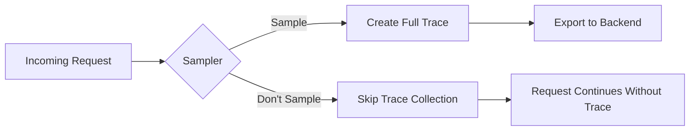
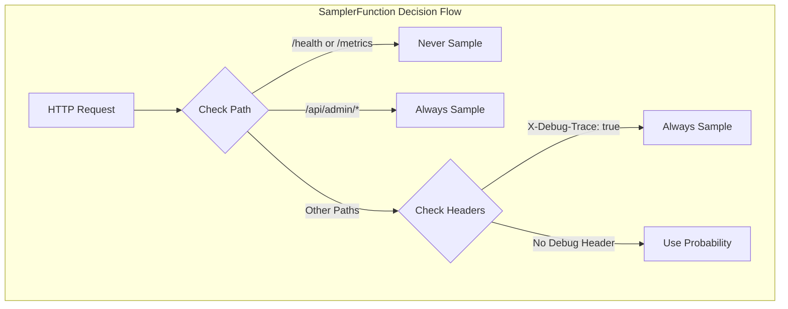
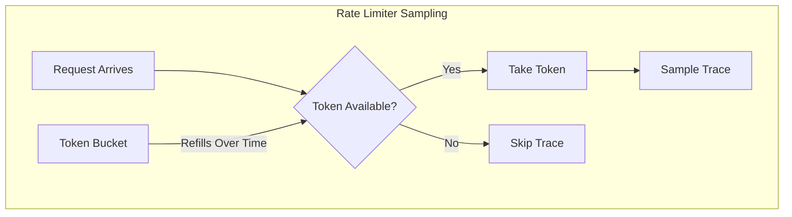
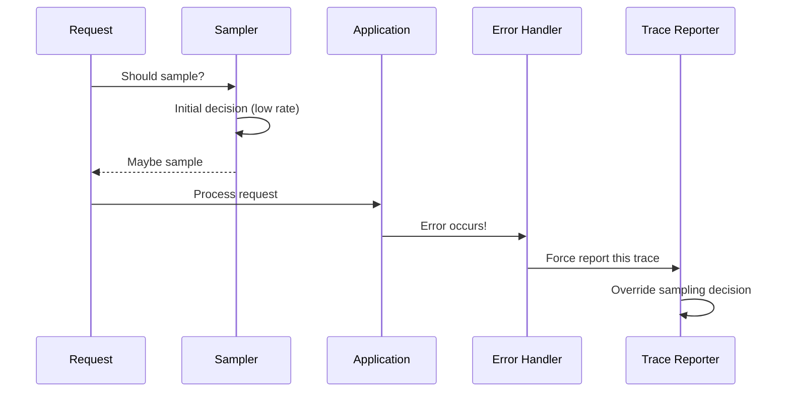

# How to Build Custom Sleuth Samplers

Author: [nawazdhandala](https://github.com/nawazdhandala)

Tags: Spring Boot, Java, Spring Cloud Sleuth, Distributed Tracing, Sampling, Observability, Microservices, Performance

Description: Learn how to build custom samplers in Spring Cloud Sleuth for intelligent trace sampling, including priority-based, rule-based, and adaptive sampling strategies with production-ready implementations.

---

Distributed tracing generates massive amounts of data in production systems. A microservices application handling 10,000 requests per second can easily produce millions of spans per minute. Storing and analyzing all this data becomes expensive and impractical. Samplers solve this problem by deciding which traces to keep and which to discard.

Spring Cloud Sleuth provides default probability-based sampling, but real-world applications often need smarter sampling strategies. You might want to always trace error responses, sample more from premium customers, or reduce sampling during traffic spikes. Custom samplers give you this control.

## How Sleuth Sampling Works

Before building custom samplers, you need to understand where sampling fits in the tracing pipeline.



The sampler runs early in the request lifecycle. It receives information about the incoming request and returns a sampling decision. This decision affects whether spans are created and exported for that trace.

Sleuth uses the Brave tracing library internally. The key interface is `brave.sampler.Sampler`, which has a single method.

```java
// The Sampler interface from Brave tracing library
// Returns true to sample (collect) the trace, false to skip it
public abstract class Sampler {
    public abstract boolean isSampled(long traceId);
}
```

## Setting Up the Project

Start with a Spring Boot application that has Sleuth configured.

```xml
<!-- pom.xml dependencies for Spring Cloud Sleuth with custom samplers -->
<dependencies>
    <dependency>
        <groupId>org.springframework.boot</groupId>
        <artifactId>spring-boot-starter-web</artifactId>
    </dependency>

    <dependency>
        <groupId>org.springframework.cloud</groupId>
        <artifactId>spring-cloud-starter-sleuth</artifactId>
    </dependency>

    <dependency>
        <groupId>org.springframework.cloud</groupId>
        <artifactId>spring-cloud-sleuth-zipkin</artifactId>
    </dependency>
</dependencies>

<dependencyManagement>
    <dependencies>
        <dependency>
            <groupId>org.springframework.cloud</groupId>
            <artifactId>spring-cloud-dependencies</artifactId>
            <version>2023.0.0</version>
            <type>pom</type>
            <scope>import</scope>
        </dependency>
    </dependencies>
</dependencyManagement>
```

## Building a Simple Custom Sampler

The simplest custom sampler overrides the default behavior entirely. This example creates a sampler that always traces requests to specific endpoints.

```java
import brave.sampler.Sampler;
import org.springframework.context.annotation.Bean;
import org.springframework.context.annotation.Configuration;

@Configuration
public class SamplerConfig {

    // This sampler always returns true for sampling
    // Use this only for debugging or low-traffic endpoints
    @Bean
    public Sampler alwaysSampler() {
        return Sampler.ALWAYS_SAMPLE;
    }
}
```

For production, you need something more sophisticated. Here is a probability-based sampler with configurable rate.

```java
import brave.sampler.Sampler;
import org.springframework.beans.factory.annotation.Value;
import org.springframework.context.annotation.Bean;
import org.springframework.context.annotation.Configuration;

@Configuration
public class ProbabilitySamplerConfig {

    // Read sampling probability from configuration
    // Default to 10% if not specified
    @Value("${tracing.sampling.probability:0.1}")
    private float probability;

    @Bean
    public Sampler probabilitySampler() {
        // Sampler.create() builds a probability-based sampler
        // 0.1 means 10% of traces will be sampled
        return Sampler.create(probability);
    }
}
```

## Request-Aware Sampling with SamplerFunction

The basic Sampler only sees the trace ID. To make decisions based on request attributes, use `SamplerFunction<HttpRequest>` from Sleuth.



Implement this logic with a custom SamplerFunction.

```java
import brave.http.HttpRequest;
import brave.sampler.SamplerFunction;
import brave.sampler.SamplerFunctions;
import org.springframework.context.annotation.Bean;
import org.springframework.context.annotation.Configuration;

@Configuration
public class HttpSamplerConfig {

    // SamplerFunction receives the full HTTP request
    // This enables path-based and header-based sampling decisions
    @Bean
    public SamplerFunction<HttpRequest> httpSamplerFunction() {
        return request -> {
            String path = request.path();

            // Skip tracing for health checks and metrics endpoints
            // These endpoints are called frequently and add noise
            if (path != null && (path.startsWith("/actuator") ||
                                 path.equals("/health") ||
                                 path.equals("/metrics"))) {
                return false;
            }

            // Always trace admin endpoints for security auditing
            if (path != null && path.startsWith("/api/admin")) {
                return true;
            }

            // Check for debug header that forces tracing
            String debugHeader = request.header("X-Debug-Trace");
            if ("true".equalsIgnoreCase(debugHeader)) {
                return true;
            }

            // Return null to fall back to default sampling behavior
            // This uses the probability sampler configured elsewhere
            return null;
        };
    }
}
```

Register this as both server and client sampler.

```java
import brave.http.HttpRequest;
import brave.sampler.SamplerFunction;
import org.springframework.cloud.sleuth.instrument.web.HttpServerSampler;
import org.springframework.cloud.sleuth.instrument.web.HttpClientSampler;
import org.springframework.context.annotation.Bean;
import org.springframework.context.annotation.Configuration;

@Configuration
public class CompleteSamplerConfig {

    private final SamplerFunction<HttpRequest> samplerFunction;

    public CompleteSamplerConfig() {
        this.samplerFunction = createSamplerFunction();
    }

    private SamplerFunction<HttpRequest> createSamplerFunction() {
        return request -> {
            String path = request.path();

            if (path != null && path.startsWith("/actuator")) {
                return false;
            }

            if (path != null && path.startsWith("/api/admin")) {
                return true;
            }

            return null;
        };
    }

    // Apply sampler to incoming requests
    @Bean(name = HttpServerSampler.NAME)
    public SamplerFunction<HttpRequest> serverSampler() {
        return samplerFunction;
    }

    // Apply sampler to outgoing requests
    @Bean(name = HttpClientSampler.NAME)
    public SamplerFunction<HttpRequest> clientSampler() {
        return samplerFunction;
    }
}
```

## Priority-Based Sampling

Production systems often need to prioritize certain requests. This sampler gives higher sampling rates to premium customers and error responses.

```java
import brave.http.HttpRequest;
import brave.sampler.SamplerFunction;
import org.springframework.beans.factory.annotation.Value;
import org.springframework.cloud.sleuth.instrument.web.HttpServerSampler;
import org.springframework.context.annotation.Bean;
import org.springframework.context.annotation.Configuration;

import java.util.Random;
import java.util.Set;
import java.util.concurrent.ThreadLocalRandom;

@Configuration
public class PrioritySamplerConfig {

    // Different sampling rates for different priority levels
    @Value("${tracing.sampling.premium:0.5}")
    private float premiumRate;

    @Value("${tracing.sampling.standard:0.1}")
    private float standardRate;

    @Value("${tracing.sampling.internal:0.01}")
    private float internalRate;

    // Premium customer IDs (in production, load from database or config service)
    private final Set<String> premiumCustomers = Set.of(
        "customer-001", "customer-002", "customer-vip"
    );

    @Bean(name = HttpServerSampler.NAME)
    public SamplerFunction<HttpRequest> prioritySampler() {
        return request -> {
            // Always trace error paths for debugging
            String errorHeader = request.header("X-Request-Failed");
            if ("true".equalsIgnoreCase(errorHeader)) {
                return true;
            }

            // Determine customer tier from header or path
            String customerId = request.header("X-Customer-Id");
            float samplingRate = determineSamplingRate(customerId, request.path());

            // Make probabilistic decision based on tier rate
            return ThreadLocalRandom.current().nextFloat() < samplingRate;
        };
    }

    private float determineSamplingRate(String customerId, String path) {
        // Internal service calls get lowest sampling
        if (path != null && path.startsWith("/internal")) {
            return internalRate;
        }

        // Premium customers get higher sampling
        if (customerId != null && premiumCustomers.contains(customerId)) {
            return premiumRate;
        }

        // Standard rate for everyone else
        return standardRate;
    }
}
```

## Rate-Limited Sampling

High-traffic services need protection against trace floods. This sampler limits traces to a maximum rate regardless of traffic volume.



Implement a token bucket rate limiter for sampling.

```java
import brave.sampler.Sampler;
import org.springframework.context.annotation.Bean;
import org.springframework.context.annotation.Configuration;

import java.util.concurrent.atomic.AtomicLong;

@Configuration
public class RateLimitedSamplerConfig {

    // Maximum traces per second
    private static final int MAX_TRACES_PER_SECOND = 100;

    @Bean
    public Sampler rateLimitedSampler() {
        return new RateLimitedSampler(MAX_TRACES_PER_SECOND);
    }

    // Token bucket implementation for rate limiting
    // Allows bursts up to the limit, then throttles
    static class RateLimitedSampler extends Sampler {
        private final int maxTracesPerSecond;
        private final AtomicLong tokens;
        private final AtomicLong lastRefillTime;

        RateLimitedSampler(int maxTracesPerSecond) {
            this.maxTracesPerSecond = maxTracesPerSecond;
            this.tokens = new AtomicLong(maxTracesPerSecond);
            this.lastRefillTime = new AtomicLong(System.currentTimeMillis());
        }

        @Override
        public boolean isSampled(long traceId) {
            refillTokens();

            // Try to take a token
            long currentTokens;
            do {
                currentTokens = tokens.get();
                if (currentTokens <= 0) {
                    return false;
                }
            } while (!tokens.compareAndSet(currentTokens, currentTokens - 1));

            return true;
        }

        private void refillTokens() {
            long now = System.currentTimeMillis();
            long lastRefill = lastRefillTime.get();
            long elapsed = now - lastRefill;

            // Refill tokens based on elapsed time
            if (elapsed >= 1000) {
                if (lastRefillTime.compareAndSet(lastRefill, now)) {
                    tokens.set(maxTracesPerSecond);
                }
            } else if (elapsed > 0) {
                // Partial refill for sub-second intervals
                long tokensToAdd = (elapsed * maxTracesPerSecond) / 1000;
                if (tokensToAdd > 0 && lastRefillTime.compareAndSet(lastRefill, now)) {
                    tokens.updateAndGet(t -> Math.min(t + tokensToAdd, maxTracesPerSecond));
                }
            }
        }
    }
}
```

## Adaptive Sampling Based on Load

Smart systems adjust sampling based on current conditions. This sampler reduces sampling when the system is under heavy load.

```java
import brave.sampler.Sampler;
import org.springframework.beans.factory.annotation.Autowired;
import org.springframework.boot.actuate.health.HealthEndpoint;
import org.springframework.boot.actuate.health.Status;
import org.springframework.context.annotation.Bean;
import org.springframework.context.annotation.Configuration;
import org.springframework.scheduling.annotation.EnableScheduling;
import org.springframework.scheduling.annotation.Scheduled;

import java.lang.management.ManagementFactory;
import java.lang.management.OperatingSystemMXBean;
import java.util.concurrent.atomic.AtomicReference;

@Configuration
@EnableScheduling
public class AdaptiveSamplerConfig {

    // Sampling rates for different load levels
    private static final float LOW_LOAD_RATE = 0.5f;    // 50% when system is idle
    private static final float MEDIUM_LOAD_RATE = 0.2f; // 20% under normal load
    private static final float HIGH_LOAD_RATE = 0.05f;  // 5% when overloaded

    // CPU thresholds for load classification
    private static final double LOW_LOAD_THRESHOLD = 0.3;
    private static final double HIGH_LOAD_THRESHOLD = 0.7;

    private final AtomicReference<Float> currentRate =
        new AtomicReference<>(MEDIUM_LOAD_RATE);

    @Bean
    public Sampler adaptiveSampler() {
        return new Sampler() {
            @Override
            public boolean isSampled(long traceId) {
                float rate = currentRate.get();
                // Use trace ID for consistent sampling decisions
                // Same trace ID always gets same decision
                return (traceId & 0xFFFFFFFFL) < (rate * 0xFFFFFFFFL);
            }
        };
    }

    // Update sampling rate every 10 seconds based on system load
    @Scheduled(fixedRate = 10000)
    public void adjustSamplingRate() {
        double cpuLoad = getSystemCpuLoad();

        float newRate;
        if (cpuLoad < LOW_LOAD_THRESHOLD) {
            newRate = LOW_LOAD_RATE;
        } else if (cpuLoad > HIGH_LOAD_THRESHOLD) {
            newRate = HIGH_LOAD_RATE;
        } else {
            newRate = MEDIUM_LOAD_RATE;
        }

        Float oldRate = currentRate.getAndSet(newRate);
        if (!oldRate.equals(newRate)) {
            System.out.printf("Adjusted sampling rate: %.0f%% -> %.0f%% (CPU: %.1f%%)%n",
                oldRate * 100, newRate * 100, cpuLoad * 100);
        }
    }

    private double getSystemCpuLoad() {
        OperatingSystemMXBean osBean = ManagementFactory.getOperatingSystemMXBean();
        if (osBean instanceof com.sun.management.OperatingSystemMXBean) {
            return ((com.sun.management.OperatingSystemMXBean) osBean).getCpuLoad();
        }
        return osBean.getSystemLoadAverage() / osBean.getAvailableProcessors();
    }
}
```

## Error-Aware Sampling with Post-Processing

Sometimes you want to sample based on the response, not just the request. This requires a different approach since the sampler runs before the response exists.



Implement error-aware tracing with a SpanHandler.

```java
import brave.handler.MutableSpan;
import brave.handler.SpanHandler;
import brave.propagation.TraceContext;
import org.springframework.context.annotation.Bean;
import org.springframework.context.annotation.Configuration;

import java.util.Set;

@Configuration
public class ErrorAwareSamplerConfig {

    // HTTP status codes that should always be traced
    private static final Set<String> ERROR_STATUSES = Set.of(
        "500", "502", "503", "504", "400", "401", "403", "404"
    );

    @Bean
    public SpanHandler errorCapturingHandler() {
        return new SpanHandler() {
            @Override
            public boolean end(TraceContext context, MutableSpan span, Cause cause) {
                // Check if this span has an error status
                String httpStatus = span.tag("http.status_code");

                if (httpStatus != null && ERROR_STATUSES.contains(httpStatus)) {
                    // Force this trace to be reported by not dropping it
                    // Note: This only works if the trace was already being collected
                    // For completely unsampled traces, we need a different approach
                    return true;
                }

                // Let normal sampling decision stand
                return true;
            }
        };
    }
}
```

For true error-based sampling, use a deferred sampling strategy.

```java
import brave.Span;
import brave.Tracer;
import org.springframework.stereotype.Component;
import org.springframework.web.servlet.HandlerInterceptor;

import javax.servlet.http.HttpServletRequest;
import javax.servlet.http.HttpServletResponse;

@Component
public class ErrorSamplingInterceptor implements HandlerInterceptor {

    private final Tracer tracer;

    public ErrorSamplingInterceptor(Tracer tracer) {
        this.tracer = tracer;
    }

    @Override
    public void afterCompletion(HttpServletRequest request,
                                HttpServletResponse response,
                                Object handler,
                                Exception ex) {
        Span currentSpan = tracer.currentSpan();
        if (currentSpan == null) {
            return;
        }

        // Tag errors for later analysis
        if (response.getStatus() >= 500) {
            currentSpan.tag("error", "true");
            currentSpan.tag("error.type", "server_error");
            currentSpan.tag("http.status_code", String.valueOf(response.getStatus()));
        } else if (response.getStatus() >= 400) {
            currentSpan.tag("error", "true");
            currentSpan.tag("error.type", "client_error");
        }

        if (ex != null) {
            currentSpan.tag("exception.type", ex.getClass().getName());
            currentSpan.tag("exception.message", ex.getMessage());
        }
    }
}
```

## Rule-Based Sampling with Configuration

Production systems benefit from externalized sampling rules that can be changed without deployment.

```yaml
# application.yml - Externalized sampling rules
tracing:
  sampling:
    default-rate: 0.1
    rules:
      - name: "admin-endpoints"
        path-pattern: "/api/admin/**"
        rate: 1.0
      - name: "health-checks"
        path-pattern: "/actuator/**"
        rate: 0.0
      - name: "payment-api"
        path-pattern: "/api/payments/**"
        rate: 0.5
      - name: "high-value-customers"
        header: "X-Customer-Tier"
        header-value: "premium"
        rate: 0.8
```

Implement a rule-based sampler that reads from configuration.

```java
import brave.http.HttpRequest;
import brave.sampler.SamplerFunction;
import org.springframework.boot.context.properties.ConfigurationProperties;
import org.springframework.cloud.sleuth.instrument.web.HttpServerSampler;
import org.springframework.context.annotation.Bean;
import org.springframework.context.annotation.Configuration;
import org.springframework.util.AntPathMatcher;

import java.util.ArrayList;
import java.util.List;
import java.util.concurrent.ThreadLocalRandom;

@Configuration
@ConfigurationProperties(prefix = "tracing.sampling")
public class RuleBasedSamplerConfig {

    private float defaultRate = 0.1f;
    private List<SamplingRule> rules = new ArrayList<>();

    // Getters and setters for configuration binding
    public float getDefaultRate() { return defaultRate; }
    public void setDefaultRate(float defaultRate) { this.defaultRate = defaultRate; }
    public List<SamplingRule> getRules() { return rules; }
    public void setRules(List<SamplingRule> rules) { this.rules = rules; }

    // Sampling rule definition
    public static class SamplingRule {
        private String name;
        private String pathPattern;
        private String header;
        private String headerValue;
        private float rate;

        // Getters and setters
        public String getName() { return name; }
        public void setName(String name) { this.name = name; }
        public String getPathPattern() { return pathPattern; }
        public void setPathPattern(String pathPattern) { this.pathPattern = pathPattern; }
        public String getHeader() { return header; }
        public void setHeader(String header) { this.header = header; }
        public String getHeaderValue() { return headerValue; }
        public void setHeaderValue(String headerValue) { this.headerValue = headerValue; }
        public float getRate() { return rate; }
        public void setRate(float rate) { this.rate = rate; }
    }

    @Bean(name = HttpServerSampler.NAME)
    public SamplerFunction<HttpRequest> ruleBasedSampler() {
        AntPathMatcher pathMatcher = new AntPathMatcher();

        return request -> {
            String path = request.path();

            // Evaluate rules in order, first match wins
            for (SamplingRule rule : rules) {
                if (matchesRule(rule, request, path, pathMatcher)) {
                    return ThreadLocalRandom.current().nextFloat() < rule.getRate();
                }
            }

            // No rule matched, use default rate
            return ThreadLocalRandom.current().nextFloat() < defaultRate;
        };
    }

    private boolean matchesRule(SamplingRule rule, HttpRequest request,
                                String path, AntPathMatcher matcher) {
        // Check path pattern if specified
        if (rule.getPathPattern() != null && path != null) {
            if (!matcher.match(rule.getPathPattern(), path)) {
                return false;
            }
        }

        // Check header if specified
        if (rule.getHeader() != null) {
            String headerValue = request.header(rule.getHeader());
            if (rule.getHeaderValue() != null) {
                return rule.getHeaderValue().equals(headerValue);
            }
            return headerValue != null;
        }

        return rule.getPathPattern() != null;
    }
}
```

## Composite Sampler Pattern

Combine multiple sampling strategies into a single sampler using the composite pattern.

```java
import brave.http.HttpRequest;
import brave.sampler.SamplerFunction;
import org.springframework.cloud.sleuth.instrument.web.HttpServerSampler;
import org.springframework.context.annotation.Bean;
import org.springframework.context.annotation.Configuration;

import java.util.List;

@Configuration
public class CompositeSamplerConfig {

    @Bean(name = HttpServerSampler.NAME)
    public SamplerFunction<HttpRequest> compositeSampler(
            List<SamplerFunction<HttpRequest>> samplers) {

        return request -> {
            // Try each sampler in order
            // First definitive answer (true/false) wins
            // null means "I don't have an opinion, ask the next sampler"
            for (SamplerFunction<HttpRequest> sampler : samplers) {
                Boolean decision = sampler.trySample(request);
                if (decision != null) {
                    return decision;
                }
            }

            // No sampler had an opinion, default to sampling
            return true;
        };
    }

    // Individual samplers as separate beans for composition
    @Bean
    public SamplerFunction<HttpRequest> skipHealthChecks() {
        return request -> {
            String path = request.path();
            if (path != null && path.startsWith("/actuator")) {
                return false;
            }
            return null; // No opinion
        };
    }

    @Bean
    public SamplerFunction<HttpRequest> alwaysTraceErrors() {
        return request -> {
            if ("true".equals(request.header("X-Request-Failed"))) {
                return true;
            }
            return null; // No opinion
        };
    }

    @Bean
    public SamplerFunction<HttpRequest> debugHeaderSampler() {
        return request -> {
            if ("true".equals(request.header("X-Debug-Trace"))) {
                return true;
            }
            return null; // No opinion
        };
    }
}
```

## Testing Custom Samplers

Write tests to verify sampling behavior.

```java
import brave.http.HttpRequest;
import brave.sampler.SamplerFunction;
import org.junit.jupiter.api.BeforeEach;
import org.junit.jupiter.api.Test;

import static org.junit.jupiter.api.Assertions.*;
import static org.mockito.Mockito.*;

class CustomSamplerTest {

    private SamplerFunction<HttpRequest> sampler;

    @BeforeEach
    void setUp() {
        // Create the sampler under test
        CompleteSamplerConfig config = new CompleteSamplerConfig();
        sampler = config.serverSampler();
    }

    @Test
    void shouldSkipHealthCheckEndpoints() {
        HttpRequest request = mockRequest("/actuator/health", null);

        Boolean result = sampler.trySample(request);

        assertEquals(false, result);
    }

    @Test
    void shouldAlwaysSampleAdminEndpoints() {
        HttpRequest request = mockRequest("/api/admin/users", null);

        Boolean result = sampler.trySample(request);

        assertEquals(true, result);
    }

    @Test
    void shouldSampleWhenDebugHeaderPresent() {
        HttpRequest request = mockRequest("/api/orders", "true");

        Boolean result = sampler.trySample(request);

        assertEquals(true, result);
    }

    @Test
    void shouldDeferToDefaultForNormalRequests() {
        HttpRequest request = mockRequest("/api/orders", null);

        Boolean result = sampler.trySample(request);

        // null means defer to default sampler
        assertNull(result);
    }

    private HttpRequest mockRequest(String path, String debugHeader) {
        HttpRequest request = mock(HttpRequest.class);
        when(request.path()).thenReturn(path);
        when(request.header("X-Debug-Trace")).thenReturn(debugHeader);
        return request;
    }
}
```

## Monitoring Sampler Performance

Track how your sampler is performing in production.

```java
import brave.http.HttpRequest;
import brave.sampler.SamplerFunction;
import io.micrometer.core.instrument.Counter;
import io.micrometer.core.instrument.MeterRegistry;
import org.springframework.cloud.sleuth.instrument.web.HttpServerSampler;
import org.springframework.context.annotation.Bean;
import org.springframework.context.annotation.Configuration;

@Configuration
public class MonitoredSamplerConfig {

    @Bean(name = HttpServerSampler.NAME)
    public SamplerFunction<HttpRequest> monitoredSampler(
            MeterRegistry meterRegistry,
            SamplerFunction<HttpRequest> delegateSampler) {

        Counter sampledCounter = Counter.builder("tracing.sampler.decisions")
            .tag("decision", "sampled")
            .register(meterRegistry);

        Counter notSampledCounter = Counter.builder("tracing.sampler.decisions")
            .tag("decision", "not_sampled")
            .register(meterRegistry);

        Counter deferredCounter = Counter.builder("tracing.sampler.decisions")
            .tag("decision", "deferred")
            .register(meterRegistry);

        return request -> {
            Boolean decision = delegateSampler.trySample(request);

            if (Boolean.TRUE.equals(decision)) {
                sampledCounter.increment();
            } else if (Boolean.FALSE.equals(decision)) {
                notSampledCounter.increment();
            } else {
                deferredCounter.increment();
            }

            return decision;
        };
    }
}
```

## Production Recommendations

When deploying custom samplers in production, follow these guidelines.

Keep sampling decisions fast. The sampler runs on every request, so even small delays add up.

```java
// Bad: Making external calls in sampler
public Boolean trySample(HttpRequest request) {
    // This blocks the request thread!
    boolean isPremium = remoteService.checkCustomerTier(request.header("X-Customer-Id"));
    return isPremium ? true : null;
}

// Good: Use cached or local data
public Boolean trySample(HttpRequest request) {
    String customerId = request.header("X-Customer-Id");
    // Local cache lookup is fast
    boolean isPremium = localCache.isPremiumCustomer(customerId);
    return isPremium ? true : null;
}
```

Make sampling decisions deterministic for the same trace.

```java
// Good: Use trace ID for consistent decisions
// The same trace ID always gets the same sampling decision
// This is important for distributed systems where multiple services
// need to make the same decision for the same trace
public boolean isSampled(long traceId) {
    float rate = 0.1f;
    // Convert trace ID to a number between 0 and 1
    float traceValue = (traceId & 0xFFFFFFFFL) / (float) 0xFFFFFFFFL;
    return traceValue < rate;
}
```

Log sampling decisions for debugging.

```java
import org.slf4j.Logger;
import org.slf4j.LoggerFactory;

public class LoggingSamplerFunction implements SamplerFunction<HttpRequest> {
    private static final Logger log = LoggerFactory.getLogger(LoggingSamplerFunction.class);

    @Override
    public Boolean trySample(HttpRequest request) {
        Boolean decision = makeSamplingDecision(request);

        if (log.isDebugEnabled()) {
            log.debug("Sampling decision for {}: {}",
                request.path(), decision == null ? "deferred" : decision);
        }

        return decision;
    }
}
```

## Summary

| Sampler Type | Use Case | Trade-offs |
|-------------|----------|------------|
| **Probability** | General traffic sampling | Simple but not context-aware |
| **Rate-Limited** | Protecting against trace floods | Consistent cost, may miss important traces |
| **Priority-Based** | Premium customer visibility | More complexity, needs customer data |
| **Adaptive** | Handling variable load | Self-tuning, may drop traces under load |
| **Rule-Based** | Complex sampling requirements | Flexible but needs configuration management |
| **Error-Aware** | Debugging production issues | Captures problems but requires post-processing |

Custom samplers give you control over which traces to collect. Start with simple probability sampling, then add complexity as your needs grow. The key is balancing observability with cost and performance. Always test your samplers thoroughly and monitor their behavior in production.
