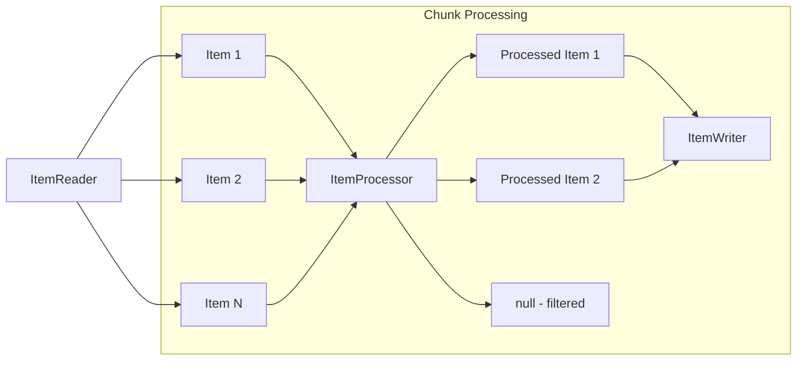
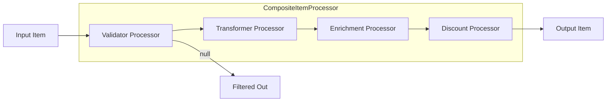
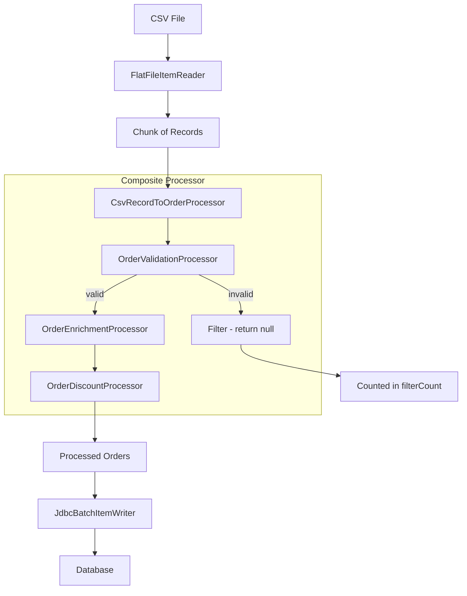

# How to Create Custom Spring Batch ItemProcessors

Author: [nawazdhandala](https://www.github.com/nawazdhandala)

Tags: Spring Batch, Java, Batch Processing, ETL, Spring Boot, ItemProcessor

Description: Learn how to build custom ItemProcessors in Spring Batch for data transformation, validation, filtering, and enrichment with production-ready patterns and composable processor chains.

---

Spring Batch ItemProcessors sit at the heart of your batch job pipeline, transforming data between the read and write phases. While Spring Batch provides basic processors out of the box, real-world applications demand custom logic for validation, transformation, enrichment, and filtering.

This guide covers everything you need to build production-grade ItemProcessors, from simple transformations to composable processor chains that handle complex business requirements.

## Understanding the ItemProcessor Interface

The ItemProcessor interface is deceptively simple. It takes an input item and returns an output item, which may be of a different type.

```java
// The core ItemProcessor interface
// In = Input type, O = Output type
public interface ItemProcessor<In, O> {

    // Process a single item
    // Return null to filter out the item
    // Throw an exception to trigger skip/retry logic
    O process(In item) throws Exception;
}
```

Here is how the processor fits into the chunk-oriented processing model:



Key behaviors to understand:

- **Return transformed item**: The item continues to the writer
- **Return null**: The item is filtered out silently (counted in filterCount)
- **Throw exception**: Triggers skip/retry policies based on your configuration

## Building Your First Custom Processor

Let's start with a practical example. Suppose you are processing order records and need to apply discounts based on customer tier.

```java
// OrderDiscountProcessor.java
// Applies discount rules based on customer loyalty tier
@Component
public class OrderDiscountProcessor implements ItemProcessor<Order, Order> {

    private static final Logger log = LoggerFactory.getLogger(OrderDiscountProcessor.class);

    // Discount percentages by customer tier
    private static final Map<CustomerTier, BigDecimal> DISCOUNT_RATES = Map.of(
        CustomerTier.BRONZE, new BigDecimal("0.05"),
        CustomerTier.SILVER, new BigDecimal("0.10"),
        CustomerTier.GOLD, new BigDecimal("0.15"),
        CustomerTier.PLATINUM, new BigDecimal("0.20")
    );

    @Override
    public Order process(Order order) throws Exception {
        // Skip orders that already have a discount applied
        if (order.getDiscountApplied() != null && order.getDiscountApplied()) {
            log.debug("Order {} already has discount, skipping", order.getId());
            return order;
        }

        CustomerTier tier = order.getCustomerTier();
        BigDecimal discountRate = DISCOUNT_RATES.getOrDefault(tier, BigDecimal.ZERO);

        // Calculate the discount amount
        BigDecimal originalTotal = order.getTotalAmount();
        BigDecimal discountAmount = originalTotal.multiply(discountRate)
            .setScale(2, RoundingMode.HALF_UP);

        // Apply the discount
        order.setDiscountAmount(discountAmount);
        order.setFinalAmount(originalTotal.subtract(discountAmount));
        order.setDiscountApplied(true);

        log.debug("Applied {}% discount to order {}: ${} off",
            discountRate.multiply(new BigDecimal("100")),
            order.getId(),
            discountAmount);

        return order;
    }
}
```

## Processors That Transform Types

Often you need to convert between different data representations. For example, transforming a raw CSV record into a domain entity or converting between internal and external formats.

```java
// CsvRecordToOrderProcessor.java
// Transforms raw CSV data into Order domain objects
@Component
public class CsvRecordToOrderProcessor implements ItemProcessor<OrderCsvRecord, Order> {

    private static final Logger log = LoggerFactory.getLogger(CsvRecordToOrderProcessor.class);

    private final CustomerRepository customerRepository;
    private final ProductRepository productRepository;

    public CsvRecordToOrderProcessor(CustomerRepository customerRepository,
                                      ProductRepository productRepository) {
        this.customerRepository = customerRepository;
        this.productRepository = productRepository;
    }

    @Override
    public Order process(OrderCsvRecord record) throws Exception {
        // Look up the customer by their external ID
        Customer customer = customerRepository
            .findByExternalId(record.getCustomerId())
            .orElseThrow(() -> new CustomerNotFoundException(
                "Customer not found: " + record.getCustomerId()));

        // Build the order entity
        Order order = new Order();
        order.setExternalOrderId(record.getOrderNumber());
        order.setCustomer(customer);
        order.setCustomerTier(customer.getTier());
        order.setOrderDate(parseOrderDate(record.getOrderDate()));

        // Process line items
        List<OrderLine> lines = new ArrayList<>();
        for (String productCode : record.getProductCodes()) {
            Product product = productRepository.findByCode(productCode)
                .orElseThrow(() -> new ProductNotFoundException(
                    "Product not found: " + productCode));

            OrderLine line = new OrderLine();
            line.setOrder(order);
            line.setProduct(product);
            line.setQuantity(1);
            line.setUnitPrice(product.getCurrentPrice());
            lines.add(line);
        }

        order.setOrderLines(lines);
        order.setTotalAmount(calculateTotal(lines));

        log.debug("Transformed CSV record {} into Order with {} lines",
            record.getOrderNumber(), lines.size());

        return order;
    }

    private LocalDate parseOrderDate(String dateString) {
        try {
            return LocalDate.parse(dateString, DateTimeFormatter.ISO_DATE);
        } catch (DateTimeParseException e) {
            // Try alternative format
            return LocalDate.parse(dateString, DateTimeFormatter.ofPattern("MM/dd/yyyy"));
        }
    }

    private BigDecimal calculateTotal(List<OrderLine> lines) {
        return lines.stream()
            .map(line -> line.getUnitPrice().multiply(BigDecimal.valueOf(line.getQuantity())))
            .reduce(BigDecimal.ZERO, BigDecimal::add);
    }
}
```

## Validation Processors

Data quality is critical in batch processing. Build dedicated validation processors that enforce business rules and filter out invalid records.

```java
// OrderValidationProcessor.java
// Validates orders against business rules
// Returns null to filter invalid orders
@Component
public class OrderValidationProcessor implements ItemProcessor<Order, Order> {

    private static final Logger log = LoggerFactory.getLogger(OrderValidationProcessor.class);

    private static final BigDecimal MIN_ORDER_AMOUNT = new BigDecimal("10.00");
    private static final BigDecimal MAX_ORDER_AMOUNT = new BigDecimal("50000.00");
    private static final int MAX_LINE_ITEMS = 100;

    private final Validator validator;
    private final OrderValidationMetrics metrics;

    public OrderValidationProcessor(Validator validator,
                                     OrderValidationMetrics metrics) {
        this.validator = validator;
        this.metrics = metrics;
    }

    @Override
    public Order process(Order order) throws Exception {
        List<String> violations = new ArrayList<>();

        // Run JSR-380 bean validation
        Set<ConstraintViolation<Order>> constraintViolations = validator.validate(order);
        if (!constraintViolations.isEmpty()) {
            constraintViolations.forEach(v ->
                violations.add(v.getPropertyPath() + ": " + v.getMessage()));
        }

        // Custom business rule validations
        validateOrderAmount(order, violations);
        validateLineItems(order, violations);
        validateCustomerStatus(order, violations);

        // If violations exist, log them and filter the order
        if (!violations.isEmpty()) {
            log.warn("Order {} failed validation with {} violations: {}",
                order.getExternalOrderId(),
                violations.size(),
                String.join("; ", violations));

            metrics.recordValidationFailure(order.getExternalOrderId(), violations);

            // Returning null filters the item from processing
            return null;
        }

        metrics.recordValidationSuccess();
        return order;
    }

    private void validateOrderAmount(Order order, List<String> violations) {
        BigDecimal total = order.getTotalAmount();

        if (total == null) {
            violations.add("Order total is required");
            return;
        }

        if (total.compareTo(MIN_ORDER_AMOUNT) < 0) {
            violations.add(String.format(
                "Order total $%s is below minimum of $%s",
                total, MIN_ORDER_AMOUNT));
        }

        if (total.compareTo(MAX_ORDER_AMOUNT) > 0) {
            violations.add(String.format(
                "Order total $%s exceeds maximum of $%s",
                total, MAX_ORDER_AMOUNT));
        }
    }

    private void validateLineItems(Order order, List<String> violations) {
        List<OrderLine> lines = order.getOrderLines();

        if (lines == null || lines.isEmpty()) {
            violations.add("Order must have at least one line item");
            return;
        }

        if (lines.size() > MAX_LINE_ITEMS) {
            violations.add(String.format(
                "Order has %d line items, exceeding maximum of %d",
                lines.size(), MAX_LINE_ITEMS));
        }

        // Validate each line item
        for (int i = 0; i < lines.size(); i++) {
            OrderLine line = lines.get(i);
            if (line.getQuantity() <= 0) {
                violations.add(String.format(
                    "Line item %d has invalid quantity: %d", i + 1, line.getQuantity()));
            }
            if (line.getUnitPrice() == null || line.getUnitPrice().compareTo(BigDecimal.ZERO) <= 0) {
                violations.add(String.format(
                    "Line item %d has invalid price", i + 1));
            }
        }
    }

    private void validateCustomerStatus(Order order, List<String> violations) {
        Customer customer = order.getCustomer();

        if (customer == null) {
            violations.add("Order must be associated with a customer");
            return;
        }

        if (customer.getStatus() == CustomerStatus.SUSPENDED) {
            violations.add("Cannot process orders for suspended customers");
        }

        if (customer.getStatus() == CustomerStatus.CLOSED) {
            violations.add("Cannot process orders for closed accounts");
        }
    }
}
```

## Enrichment Processors

Enrichment processors add data from external sources like databases, APIs, or caches. Handle failures gracefully since external calls can be unreliable.

```java
// OrderEnrichmentProcessor.java
// Enriches orders with additional data from external services
@Component
public class OrderEnrichmentProcessor implements ItemProcessor<Order, Order> {

    private static final Logger log = LoggerFactory.getLogger(OrderEnrichmentProcessor.class);

    private final InventoryService inventoryService;
    private final PricingService pricingService;
    private final ShippingService shippingService;

    public OrderEnrichmentProcessor(InventoryService inventoryService,
                                     PricingService pricingService,
                                     ShippingService shippingService) {
        this.inventoryService = inventoryService;
        this.pricingService = pricingService;
        this.shippingService = shippingService;
    }

    @Override
    public Order process(Order order) throws Exception {
        // Enrich with current inventory status
        enrichInventoryStatus(order);

        // Enrich with latest pricing
        enrichPricing(order);

        // Calculate shipping options
        enrichShippingOptions(order);

        // Mark as enriched
        order.setEnrichedAt(LocalDateTime.now());

        return order;
    }

    private void enrichInventoryStatus(Order order) {
        for (OrderLine line : order.getOrderLines()) {
            try {
                InventoryStatus status = inventoryService
                    .checkAvailability(line.getProduct().getSku(), line.getQuantity());

                line.setInStock(status.isAvailable());
                line.setEstimatedShipDate(status.getEstimatedAvailableDate());

                if (!status.isAvailable()) {
                    log.info("Product {} is out of stock for order {}",
                        line.getProduct().getSku(), order.getExternalOrderId());
                }
            } catch (InventoryServiceException e) {
                // Log but continue - inventory status is not critical
                log.warn("Failed to check inventory for product {}: {}",
                    line.getProduct().getSku(), e.getMessage());
                line.setInStock(null);  // Unknown status
            }
        }
    }

    private void enrichPricing(Order order) {
        try {
            // Get promotional pricing if available
            PricingResult pricing = pricingService.calculatePricing(
                order.getCustomer().getId(),
                order.getOrderLines().stream()
                    .map(line -> new PricingRequest(
                        line.getProduct().getSku(),
                        line.getQuantity()))
                    .collect(Collectors.toList()));

            // Apply promotional pricing to line items
            for (OrderLine line : order.getOrderLines()) {
                BigDecimal promoPrice = pricing.getPromotionalPrice(line.getProduct().getSku());
                if (promoPrice != null && promoPrice.compareTo(line.getUnitPrice()) < 0) {
                    line.setOriginalPrice(line.getUnitPrice());
                    line.setUnitPrice(promoPrice);
                    line.setPromotionApplied(true);
                }
            }

            // Recalculate totals
            order.recalculateTotals();

        } catch (PricingServiceException e) {
            // Pricing enrichment failure is acceptable - use original prices
            log.warn("Failed to fetch promotional pricing for order {}: {}",
                order.getExternalOrderId(), e.getMessage());
        }
    }

    private void enrichShippingOptions(Order order) {
        try {
            List<ShippingOption> options = shippingService.getShippingOptions(
                order.getCustomer().getShippingAddress(),
                order.calculateTotalWeight());

            order.setAvailableShippingOptions(options);

            // Set default shipping if not already selected
            if (order.getSelectedShippingOption() == null && !options.isEmpty()) {
                order.setSelectedShippingOption(options.get(0));
            }

        } catch (ShippingServiceException e) {
            log.warn("Failed to fetch shipping options for order {}: {}",
                order.getExternalOrderId(), e.getMessage());
            // Set empty list - shipping will need manual assignment
            order.setAvailableShippingOptions(Collections.emptyList());
        }
    }
}
```

## Composing Multiple Processors

Spring Batch provides `CompositeItemProcessor` to chain processors together. This keeps each processor focused on a single responsibility.



```java
// ProcessorConfiguration.java
// Configures composite processor that chains multiple processors
@Configuration
public class ProcessorConfiguration {

    // Create a composite processor that runs processors in sequence
    // If any processor returns null, the item is filtered
    @Bean
    public CompositeItemProcessor<OrderCsvRecord, Order> orderProcessor(
            CsvRecordToOrderProcessor transformProcessor,
            OrderValidationProcessor validationProcessor,
            OrderEnrichmentProcessor enrichmentProcessor,
            OrderDiscountProcessor discountProcessor) {

        CompositeItemProcessor<OrderCsvRecord, Order> composite =
            new CompositeItemProcessor<>();

        // Processors run in order - the output of one becomes input to the next
        composite.setDelegates(List.of(
            transformProcessor,      // CSV -> Order
            validationProcessor,     // Validate order
            enrichmentProcessor,     // Add external data
            discountProcessor        // Apply discounts
        ));

        return composite;
    }
}
```

## Using Processor Adapters

Spring Batch provides adapters that let you use existing service methods as processors without implementing the interface directly.

```java
// Using ItemProcessorAdapter to delegate to existing service methods
@Configuration
public class AdapterConfiguration {

    // Adapt an existing service method as a processor
    // The service method must take one argument and return a value
    @Bean
    public ItemProcessorAdapter<Order, Order> taxCalculationProcessor(
            TaxCalculationService taxService) {

        ItemProcessorAdapter<Order, Order> adapter = new ItemProcessorAdapter<>();
        adapter.setTargetObject(taxService);
        adapter.setTargetMethod("calculateTax");
        return adapter;
    }
}

// The service being adapted
@Service
public class TaxCalculationService {

    private final TaxRateProvider taxRateProvider;

    public TaxCalculationService(TaxRateProvider taxRateProvider) {
        this.taxRateProvider = taxRateProvider;
    }

    // This method will be called by the adapter
    // Method signature: takes Order, returns Order
    public Order calculateTax(Order order) {
        String state = order.getCustomer().getShippingAddress().getState();
        BigDecimal taxRate = taxRateProvider.getTaxRate(state);

        BigDecimal taxableAmount = order.getFinalAmount();
        BigDecimal taxAmount = taxableAmount.multiply(taxRate)
            .setScale(2, RoundingMode.HALF_UP);

        order.setTaxAmount(taxAmount);
        order.setGrandTotal(taxableAmount.add(taxAmount));

        return order;
    }
}
```

## Conditional Processing with ClassifierCompositeItemProcessor

When different items need different processing logic, use `ClassifierCompositeItemProcessor` to route items to appropriate processors.

```java
// Routing processor that sends items to different processors
// based on classification logic
@Configuration
public class ClassifierProcessorConfiguration {

    @Bean
    public ClassifierCompositeItemProcessor<Order, Order> routingProcessor(
            DomesticOrderProcessor domesticProcessor,
            InternationalOrderProcessor internationalProcessor,
            WholesaleOrderProcessor wholesaleProcessor) {

        ClassifierCompositeItemProcessor<Order, Order> processor =
            new ClassifierCompositeItemProcessor<>();

        // Define classification logic
        processor.setClassifier(new Classifier<Order, ItemProcessor<?, ? extends Order>>() {
            @Override
            public ItemProcessor<?, ? extends Order> classify(Order order) {
                // Route wholesale orders to wholesale processor
                if (order.getOrderType() == OrderType.WHOLESALE) {
                    return wholesaleProcessor;
                }

                // Route international orders to international processor
                if (isInternationalOrder(order)) {
                    return internationalProcessor;
                }

                // All other orders go to domestic processor
                return domesticProcessor;
            }

            private boolean isInternationalOrder(Order order) {
                String country = order.getCustomer()
                    .getShippingAddress()
                    .getCountry();
                return !"US".equalsIgnoreCase(country) &&
                       !"USA".equalsIgnoreCase(country);
            }
        });

        return processor;
    }
}

// Domestic order processor
@Component
public class DomesticOrderProcessor implements ItemProcessor<Order, Order> {

    private final DomesticShippingCalculator shippingCalculator;
    private final StateTaxCalculator taxCalculator;

    public DomesticOrderProcessor(DomesticShippingCalculator shippingCalculator,
                                   StateTaxCalculator taxCalculator) {
        this.shippingCalculator = shippingCalculator;
        this.taxCalculator = taxCalculator;
    }

    @Override
    public Order process(Order order) throws Exception {
        // Calculate domestic shipping
        BigDecimal shipping = shippingCalculator.calculate(order);
        order.setShippingCost(shipping);

        // Apply state sales tax
        BigDecimal tax = taxCalculator.calculate(order);
        order.setTaxAmount(tax);

        order.recalculateGrandTotal();
        return order;
    }
}

// International order processor with customs handling
@Component
public class InternationalOrderProcessor implements ItemProcessor<Order, Order> {

    private final InternationalShippingCalculator shippingCalculator;
    private final CustomsDutyCalculator customsCalculator;
    private final ExportComplianceChecker complianceChecker;

    public InternationalOrderProcessor(
            InternationalShippingCalculator shippingCalculator,
            CustomsDutyCalculator customsCalculator,
            ExportComplianceChecker complianceChecker) {
        this.shippingCalculator = shippingCalculator;
        this.customsCalculator = customsCalculator;
        this.complianceChecker = complianceChecker;
    }

    @Override
    public Order process(Order order) throws Exception {
        // Check export compliance
        ComplianceResult compliance = complianceChecker.check(order);
        if (!compliance.isAllowed()) {
            throw new ExportComplianceException(
                "Order cannot be shipped: " + compliance.getReason());
        }

        // Calculate international shipping
        BigDecimal shipping = shippingCalculator.calculate(order);
        order.setShippingCost(shipping);

        // Calculate customs duties (paid by recipient)
        BigDecimal duties = customsCalculator.estimate(order);
        order.setEstimatedCustomsDuties(duties);

        // Generate customs documentation info
        order.setHsCode(customsCalculator.determineHsCode(order));
        order.setExportDeclaration(generateExportDeclaration(order));

        order.recalculateGrandTotal();
        return order;
    }

    private String generateExportDeclaration(Order order) {
        // Generate customs declaration content
        return String.format("Commercial Invoice - Order %s - Value: %s USD",
            order.getExternalOrderId(), order.getGrandTotal());
    }
}
```

## Async Processing for External Calls

When processors make slow external calls, you can use `AsyncItemProcessor` to parallelize processing within a chunk.

```java
// Async processor configuration for parallel external calls
@Configuration
public class AsyncProcessorConfiguration {

    // Thread pool for async processing
    @Bean
    public TaskExecutor processorTaskExecutor() {
        ThreadPoolTaskExecutor executor = new ThreadPoolTaskExecutor();
        executor.setCorePoolSize(10);
        executor.setMaxPoolSize(20);
        executor.setQueueCapacity(100);
        executor.setThreadNamePrefix("batch-processor-");
        executor.setRejectedExecutionHandler(new CallerRunsPolicy());
        executor.initialize();
        return executor;
    }

    // Wrap your processor with AsyncItemProcessor
    @Bean
    public AsyncItemProcessor<Order, Order> asyncEnrichmentProcessor(
            OrderEnrichmentProcessor enrichmentProcessor,
            TaskExecutor processorTaskExecutor) {

        AsyncItemProcessor<Order, Order> asyncProcessor = new AsyncItemProcessor<>();
        asyncProcessor.setDelegate(enrichmentProcessor);
        asyncProcessor.setTaskExecutor(processorTaskExecutor);
        return asyncProcessor;
    }

    // AsyncItemWriter to unwrap the Future results
    @Bean
    public AsyncItemWriter<Order> asyncOrderWriter(
            JdbcBatchItemWriter<Order> orderWriter) {

        AsyncItemWriter<Order> asyncWriter = new AsyncItemWriter<>();
        asyncWriter.setDelegate(orderWriter);
        return asyncWriter;
    }
}
```

## Processor with Step Scope for Job Parameters

When processors need access to job parameters, use step scope to inject runtime values.

```java
// Step-scoped processor that uses job parameters
@Component
@StepScope
public class ConfigurableDiscountProcessor implements ItemProcessor<Order, Order> {

    private static final Logger log = LoggerFactory.getLogger(ConfigurableDiscountProcessor.class);

    // Injected from job parameters at runtime
    private final BigDecimal discountPercentage;
    private final LocalDate promotionStartDate;
    private final LocalDate promotionEndDate;

    public ConfigurableDiscountProcessor(
            @Value("#{jobParameters['discountPercentage']}") BigDecimal discountPercentage,
            @Value("#{jobParameters['promotionStartDate']}") LocalDate promotionStartDate,
            @Value("#{jobParameters['promotionEndDate']}") LocalDate promotionEndDate) {
        this.discountPercentage = discountPercentage;
        this.promotionStartDate = promotionStartDate;
        this.promotionEndDate = promotionEndDate;
    }

    @Override
    public Order process(Order order) throws Exception {
        LocalDate orderDate = order.getOrderDate();

        // Check if order date falls within promotion period
        boolean inPromotionPeriod = !orderDate.isBefore(promotionStartDate) &&
                                     !orderDate.isAfter(promotionEndDate);

        if (inPromotionPeriod && discountPercentage != null) {
            BigDecimal discountRate = discountPercentage.divide(
                new BigDecimal("100"), 4, RoundingMode.HALF_UP);

            BigDecimal discountAmount = order.getTotalAmount()
                .multiply(discountRate)
                .setScale(2, RoundingMode.HALF_UP);

            order.setPromotionalDiscount(discountAmount);
            order.setPromotionCode("BATCH_PROMO_" + promotionStartDate);

            log.debug("Applied {}% promotional discount to order {}: ${}",
                discountPercentage, order.getExternalOrderId(), discountAmount);
        }

        return order;
    }
}
```

Launch the job with parameters:

```java
// Running job with parameters that the processor will use
@Service
public class PromotionalBatchService {

    private final JobLauncher jobLauncher;
    private final Job orderProcessingJob;

    public PromotionalBatchService(JobLauncher jobLauncher,
                                    @Qualifier("orderProcessingJob") Job orderProcessingJob) {
        this.jobLauncher = jobLauncher;
        this.orderProcessingJob = orderProcessingJob;
    }

    public JobExecution runPromotionalBatch(BigDecimal discountPercentage,
                                             LocalDate startDate,
                                             LocalDate endDate) throws Exception {

        JobParameters params = new JobParametersBuilder()
            .addLocalDateTime("runTime", LocalDateTime.now())
            .addString("discountPercentage", discountPercentage.toString())
            .addLocalDate("promotionStartDate", startDate)
            .addLocalDate("promotionEndDate", endDate)
            .toJobParameters();

        return jobLauncher.run(orderProcessingJob, params);
    }
}
```

## Testing Custom Processors

Processors are easy to unit test since they have a simple interface. Here is a comprehensive testing approach:

```java
// OrderDiscountProcessorTest.java
@ExtendWith(MockitoExtension.class)
class OrderDiscountProcessorTest {

    private OrderDiscountProcessor processor;

    @BeforeEach
    void setUp() {
        processor = new OrderDiscountProcessor();
    }

    @Test
    void shouldApplyBronzeDiscount() throws Exception {
        // Given: An order with bronze tier customer
        Order order = createOrder(CustomerTier.BRONZE, new BigDecimal("100.00"));

        // When: Processing the order
        Order result = processor.process(order);

        // Then: 5% discount is applied
        assertNotNull(result);
        assertEquals(new BigDecimal("5.00"), result.getDiscountAmount());
        assertEquals(new BigDecimal("95.00"), result.getFinalAmount());
        assertTrue(result.getDiscountApplied());
    }

    @Test
    void shouldApplyPlatinumDiscount() throws Exception {
        // Given: An order with platinum tier customer
        Order order = createOrder(CustomerTier.PLATINUM, new BigDecimal("500.00"));

        // When: Processing the order
        Order result = processor.process(order);

        // Then: 20% discount is applied
        assertNotNull(result);
        assertEquals(new BigDecimal("100.00"), result.getDiscountAmount());
        assertEquals(new BigDecimal("400.00"), result.getFinalAmount());
    }

    @Test
    void shouldNotApplyDiscountIfAlreadyApplied() throws Exception {
        // Given: An order that already has a discount
        Order order = createOrder(CustomerTier.GOLD, new BigDecimal("200.00"));
        order.setDiscountApplied(true);
        order.setDiscountAmount(new BigDecimal("20.00"));
        order.setFinalAmount(new BigDecimal("180.00"));

        // When: Processing the order
        Order result = processor.process(order);

        // Then: The existing discount is preserved
        assertNotNull(result);
        assertEquals(new BigDecimal("20.00"), result.getDiscountAmount());
        assertEquals(new BigDecimal("180.00"), result.getFinalAmount());
    }

    private Order createOrder(CustomerTier tier, BigDecimal amount) {
        Order order = new Order();
        order.setId(1L);
        order.setExternalOrderId("ORD-001");
        order.setCustomerTier(tier);
        order.setTotalAmount(amount);
        order.setDiscountApplied(false);
        return order;
    }
}

// Test validation processor with various scenarios
@ExtendWith(MockitoExtension.class)
class OrderValidationProcessorTest {

    @Mock
    private Validator validator;

    @Mock
    private OrderValidationMetrics metrics;

    private OrderValidationProcessor processor;

    @BeforeEach
    void setUp() {
        processor = new OrderValidationProcessor(validator, metrics);
    }

    @Test
    void shouldReturnNullForOrderBelowMinimum() throws Exception {
        // Given: An order below minimum amount
        Order order = createValidOrder();
        order.setTotalAmount(new BigDecimal("5.00"));
        when(validator.validate(order)).thenReturn(Collections.emptySet());

        // When: Processing the order
        Order result = processor.process(order);

        // Then: Order is filtered (null returned)
        assertNull(result);
        verify(metrics).recordValidationFailure(anyString(), anyList());
    }

    @Test
    void shouldReturnNullForOrderWithNoLineItems() throws Exception {
        // Given: An order with no line items
        Order order = createValidOrder();
        order.setOrderLines(Collections.emptyList());
        when(validator.validate(order)).thenReturn(Collections.emptySet());

        // When: Processing the order
        Order result = processor.process(order);

        // Then: Order is filtered
        assertNull(result);
    }

    @Test
    void shouldPassValidOrder() throws Exception {
        // Given: A valid order
        Order order = createValidOrder();
        when(validator.validate(order)).thenReturn(Collections.emptySet());

        // When: Processing the order
        Order result = processor.process(order);

        // Then: Order passes through
        assertNotNull(result);
        assertEquals(order.getExternalOrderId(), result.getExternalOrderId());
        verify(metrics).recordValidationSuccess();
    }

    private Order createValidOrder() {
        Customer customer = new Customer();
        customer.setStatus(CustomerStatus.ACTIVE);

        OrderLine line = new OrderLine();
        line.setQuantity(1);
        line.setUnitPrice(new BigDecimal("50.00"));

        Order order = new Order();
        order.setExternalOrderId("ORD-001");
        order.setTotalAmount(new BigDecimal("50.00"));
        order.setCustomer(customer);
        order.setOrderLines(List.of(line));

        return order;
    }
}
```

## Handling Processor Exceptions

Decide how exceptions should affect job execution:

```java
// Configure step with processor exception handling
@Bean
public Step orderProcessingStep(
        JobRepository jobRepository,
        PlatformTransactionManager transactionManager,
        ItemReader<OrderCsvRecord> reader,
        CompositeItemProcessor<OrderCsvRecord, Order> processor,
        ItemWriter<Order> writer) {

    return new StepBuilder("orderProcessingStep", jobRepository)
        .<OrderCsvRecord, Order>chunk(100, transactionManager)
        .reader(reader)
        .processor(processor)
        .writer(writer)
        .faultTolerant()
        // Skip validation and transformation exceptions
        .skipLimit(50)
        .skip(ValidationException.class)
        .skip(TransformationException.class)
        .skip(CustomerNotFoundException.class)
        .skip(ProductNotFoundException.class)
        // Do not skip system errors
        .noSkip(OutOfMemoryError.class)
        .noSkip(DatabaseException.class)
        // Retry transient external service failures
        .retryLimit(3)
        .retry(InventoryServiceException.class)
        .retry(PricingServiceException.class)
        // Add listener for monitoring processor exceptions
        .listener(new ItemProcessListener<OrderCsvRecord, Order>() {
            @Override
            public void onProcessError(OrderCsvRecord item, Exception e) {
                log.error("Failed to process order {}: {}",
                    item.getOrderNumber(), e.getMessage());
            }
        })
        .build();
}
```

## Processor Flow Summary

Here is the complete flow showing how custom processors work together:



## Best Practices for Production Processors

Follow these guidelines when building processors for production systems:

1. **Keep processors focused**: Each processor should do one thing well. Use composition to combine capabilities.

2. **Make processors stateless**: Avoid storing state between process() calls. Use step scope for configuration that varies per job run.

3. **Handle null inputs gracefully**: Check for null before processing, especially when items come from external sources.

4. **Log at appropriate levels**: Use DEBUG for successful processing, WARN for filtered items, ERROR for exceptions.

5. **Return null to filter, throw to fail**: Returning null filters an item silently. Throwing an exception triggers skip/retry logic.

6. **Test processors in isolation**: Processors have a simple interface that is easy to unit test. Cover edge cases thoroughly.

7. **Consider idempotency**: If a job restarts, items may be reprocessed. Design processors to produce the same output for the same input.

8. **Monitor processor performance**: Track processing time and filter rates. Slow processors become bottlenecks in chunk processing.

Custom ItemProcessors give you full control over data transformation in your Spring Batch jobs. Start with simple processors for straightforward transformations, then compose them into pipelines as your requirements grow. The patterns in this guide handle most production scenarios you will encounter.
