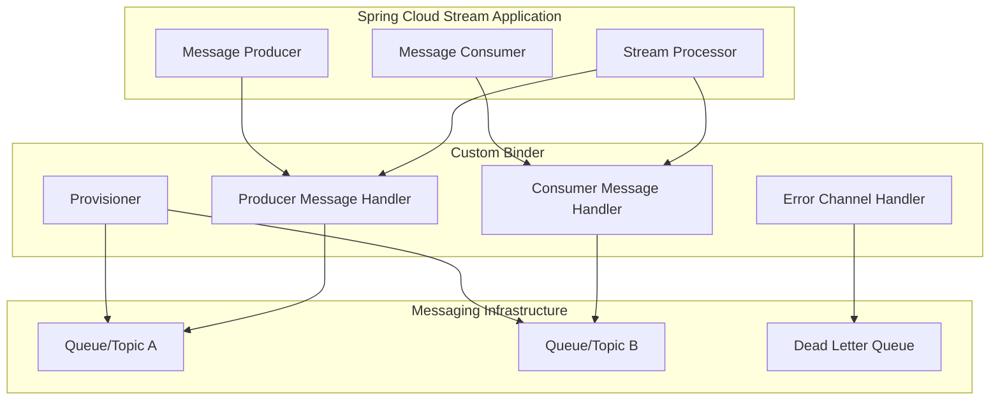
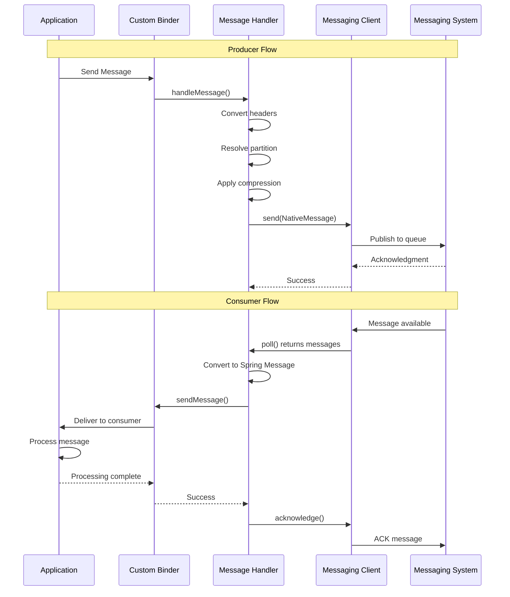

# How to Create Custom Spring Cloud Stream Binders

Author: [nawazdhandala](https://github.com/nawazdhandala)

Tags: Spring Cloud Stream, Java, Microservices, Event-Driven Architecture, Messaging, Spring Boot

Description: A complete guide to building custom Spring Cloud Stream binders for proprietary messaging systems, legacy queues, or specialized protocols, with production-ready code examples.

---

Spring Cloud Stream provides excellent binders for Kafka, RabbitMQ, and other popular messaging systems out of the box. But what happens when your organization uses a proprietary messaging system, a legacy queue, or a specialized protocol that does not have an official binder? You build your own.

This guide walks through creating a custom binder from scratch, covering the core interfaces, configuration management, message conversion, and error handling patterns that make a binder production-ready.

## Understanding the Binder Architecture

Before writing code, you need to understand how Spring Cloud Stream binders work internally. The binder acts as a bridge between your application's logical channels and the actual messaging infrastructure.



The binder consists of several key components:

- **Binder**: The main entry point that creates bindings for inputs and outputs
- **Provisioner**: Creates and configures destinations (queues, topics) in the messaging system
- **MessageHandler**: Sends messages to the messaging system
- **MessageProducer**: Receives messages from the messaging system and delivers them to the application

## Project Setup

Start with a Maven project that includes the necessary Spring Cloud Stream dependencies.

```xml
<?xml version="1.0" encoding="UTF-8"?>
<project xmlns="http://maven.apache.org/POM/4.0.0"
         xmlns:xsi="http://www.w3.org/2001/XMLSchema-instance"
         xsi:schemaLocation="http://maven.apache.org/POM/4.0.0
         http://maven.apache.org/xsd/maven-4.0.0.xsd">
    <modelVersion>4.0.0</modelVersion>

    <groupId>com.example</groupId>
    <artifactId>custom-messaging-binder</artifactId>
    <version>1.0.0</version>
    <packaging>jar</packaging>

    <parent>
        <groupId>org.springframework.boot</groupId>
        <artifactId>spring-boot-starter-parent</artifactId>
        <version>3.2.0</version>
        <relativePath/>
    </parent>

    <properties>
        <java.version>17</java.version>
        <spring-cloud.version>2023.0.0</spring-cloud.version>
    </properties>

    <dependencies>
        <!-- Core Spring Cloud Stream dependency for building binders -->
        <dependency>
            <groupId>org.springframework.cloud</groupId>
            <artifactId>spring-cloud-stream</artifactId>
        </dependency>

        <!-- For configuration properties binding -->
        <dependency>
            <groupId>org.springframework.boot</groupId>
            <artifactId>spring-boot-configuration-processor</artifactId>
            <optional>true</optional>
        </dependency>

        <!-- Testing support -->
        <dependency>
            <groupId>org.springframework.boot</groupId>
            <artifactId>spring-boot-starter-test</artifactId>
            <scope>test</scope>
        </dependency>
        <dependency>
            <groupId>org.springframework.cloud</groupId>
            <artifactId>spring-cloud-stream-test-binder</artifactId>
            <scope>test</scope>
        </dependency>
    </dependencies>

    <dependencyManagement>
        <dependencies>
            <dependency>
                <groupId>org.springframework.cloud</groupId>
                <artifactId>spring-cloud-dependencies</artifactId>
                <version>${spring-cloud.version}</version>
                <type>pom</type>
                <scope>import</scope>
            </dependency>
        </dependencies>
    </dependencyManagement>
</project>
```

## Defining Configuration Properties

Create configuration classes that hold all the settings your binder needs. These properties will be injected from application.yml or application.properties.

This class defines the top-level binder properties like connection host, port, and authentication credentials.

```java
package com.example.binder.config;

import org.springframework.boot.context.properties.ConfigurationProperties;
import org.springframework.validation.annotation.Validated;
import jakarta.validation.constraints.NotBlank;
import jakarta.validation.constraints.Positive;

/**
 * Top-level configuration properties for the custom messaging binder.
 * These properties configure the connection to the messaging infrastructure.
 *
 * Example configuration in application.yml:
 * spring:
 *   cloud:
 *     stream:
 *       custommessaging:
 *         host: messaging.example.com
 *         port: 5672
 *         username: admin
 *         password: secret
 *         connectionTimeout: 30000
 */
@ConfigurationProperties(prefix = "spring.cloud.stream.custommessaging")
@Validated
public class CustomMessagingBinderProperties {

    @NotBlank(message = "Host is required")
    private String host = "localhost";

    @Positive(message = "Port must be positive")
    private int port = 5672;

    private String username;
    private String password;

    // Connection pool settings for high-throughput scenarios
    private int connectionPoolSize = 10;
    private long connectionTimeout = 30000;
    private long idleTimeout = 60000;

    // Retry settings for resilience
    private int maxRetries = 3;
    private long retryBackoffMs = 1000;

    // Getters and setters
    public String getHost() { return host; }
    public void setHost(String host) { this.host = host; }

    public int getPort() { return port; }
    public void setPort(int port) { this.port = port; }

    public String getUsername() { return username; }
    public void setUsername(String username) { this.username = username; }

    public String getPassword() { return password; }
    public void setPassword(String password) { this.password = password; }

    public int getConnectionPoolSize() { return connectionPoolSize; }
    public void setConnectionPoolSize(int connectionPoolSize) {
        this.connectionPoolSize = connectionPoolSize;
    }

    public long getConnectionTimeout() { return connectionTimeout; }
    public void setConnectionTimeout(long connectionTimeout) {
        this.connectionTimeout = connectionTimeout;
    }

    public long getIdleTimeout() { return idleTimeout; }
    public void setIdleTimeout(long idleTimeout) { this.idleTimeout = idleTimeout; }

    public int getMaxRetries() { return maxRetries; }
    public void setMaxRetries(int maxRetries) { this.maxRetries = maxRetries; }

    public long getRetryBackoffMs() { return retryBackoffMs; }
    public void setRetryBackoffMs(long retryBackoffMs) {
        this.retryBackoffMs = retryBackoffMs;
    }
}
```

Producer-specific properties control how messages are sent, including batching and acknowledgment modes.

```java
package com.example.binder.config;

/**
 * Producer-specific configuration properties.
 * These can be set per-binding to customize producer behavior.
 *
 * Example:
 * spring:
 *   cloud:
 *     stream:
 *       bindings:
 *         output-out-0:
 *           producer:
 *             custom-messaging:
 *               batchSize: 100
 *               compressionEnabled: true
 */
public class CustomMessagingProducerProperties {

    // Batching for throughput optimization
    private int batchSize = 16;
    private long batchTimeout = 100; // milliseconds

    // Compression reduces network bandwidth
    private boolean compressionEnabled = false;
    private String compressionType = "gzip";

    // Delivery guarantees
    private boolean syncSend = false;
    private long sendTimeout = 5000;

    // Message TTL (time-to-live)
    private long messageTtlMs = 0; // 0 means no expiration

    // Partition key expression for ordered delivery
    private String partitionKeyExpression;

    public int getBatchSize() { return batchSize; }
    public void setBatchSize(int batchSize) { this.batchSize = batchSize; }

    public long getBatchTimeout() { return batchTimeout; }
    public void setBatchTimeout(long batchTimeout) { this.batchTimeout = batchTimeout; }

    public boolean isCompressionEnabled() { return compressionEnabled; }
    public void setCompressionEnabled(boolean compressionEnabled) {
        this.compressionEnabled = compressionEnabled;
    }

    public String getCompressionType() { return compressionType; }
    public void setCompressionType(String compressionType) {
        this.compressionType = compressionType;
    }

    public boolean isSyncSend() { return syncSend; }
    public void setSyncSend(boolean syncSend) { this.syncSend = syncSend; }

    public long getSendTimeout() { return sendTimeout; }
    public void setSendTimeout(long sendTimeout) { this.sendTimeout = sendTimeout; }

    public long getMessageTtlMs() { return messageTtlMs; }
    public void setMessageTtlMs(long messageTtlMs) { this.messageTtlMs = messageTtlMs; }

    public String getPartitionKeyExpression() { return partitionKeyExpression; }
    public void setPartitionKeyExpression(String partitionKeyExpression) {
        this.partitionKeyExpression = partitionKeyExpression;
    }
}
```

Consumer properties handle polling intervals, concurrency, and acknowledgment strategies.

```java
package com.example.binder.config;

/**
 * Consumer-specific configuration properties.
 * These control how messages are received and processed.
 *
 * Example:
 * spring:
 *   cloud:
 *     stream:
 *       bindings:
 *         input-in-0:
 *           consumer:
 *             custom-messaging:
 *               concurrency: 4
 *               prefetchCount: 250
 *               autoAck: false
 */
public class CustomMessagingConsumerProperties {

    // Concurrency for parallel processing
    private int concurrency = 1;

    // Prefetch controls how many messages are buffered
    private int prefetchCount = 100;

    // Acknowledgment mode
    private boolean autoAck = true;
    private long ackTimeout = 30000;

    // Polling configuration for pull-based systems
    private long pollTimeout = 1000;
    private int maxPollRecords = 500;

    // Error handling
    private int maxAttempts = 3;
    private long backoffInitialInterval = 1000;
    private double backoffMultiplier = 2.0;
    private long backoffMaxInterval = 10000;

    // Dead letter queue configuration
    private boolean dlqEnabled = false;
    private String dlqName;

    public int getConcurrency() { return concurrency; }
    public void setConcurrency(int concurrency) { this.concurrency = concurrency; }

    public int getPrefetchCount() { return prefetchCount; }
    public void setPrefetchCount(int prefetchCount) { this.prefetchCount = prefetchCount; }

    public boolean isAutoAck() { return autoAck; }
    public void setAutoAck(boolean autoAck) { this.autoAck = autoAck; }

    public long getAckTimeout() { return ackTimeout; }
    public void setAckTimeout(long ackTimeout) { this.ackTimeout = ackTimeout; }

    public long getPollTimeout() { return pollTimeout; }
    public void setPollTimeout(long pollTimeout) { this.pollTimeout = pollTimeout; }

    public int getMaxPollRecords() { return maxPollRecords; }
    public void setMaxPollRecords(int maxPollRecords) {
        this.maxPollRecords = maxPollRecords;
    }

    public int getMaxAttempts() { return maxAttempts; }
    public void setMaxAttempts(int maxAttempts) { this.maxAttempts = maxAttempts; }

    public long getBackoffInitialInterval() { return backoffInitialInterval; }
    public void setBackoffInitialInterval(long backoffInitialInterval) {
        this.backoffInitialInterval = backoffInitialInterval;
    }

    public double getBackoffMultiplier() { return backoffMultiplier; }
    public void setBackoffMultiplier(double backoffMultiplier) {
        this.backoffMultiplier = backoffMultiplier;
    }

    public long getBackoffMaxInterval() { return backoffMaxInterval; }
    public void setBackoffMaxInterval(long backoffMaxInterval) {
        this.backoffMaxInterval = backoffMaxInterval;
    }

    public boolean isDlqEnabled() { return dlqEnabled; }
    public void setDlqEnabled(boolean dlqEnabled) { this.dlqEnabled = dlqEnabled; }

    public String getDlqName() { return dlqName; }
    public void setDlqName(String dlqName) { this.dlqName = dlqName; }
}
```

## Creating the Extended Binding Properties

Spring Cloud Stream uses extended binding properties to merge your custom properties with the standard binding configuration. This class acts as a container for both producer and consumer properties.

```java
package com.example.binder.config;

import org.springframework.cloud.stream.binder.BinderSpecificPropertiesProvider;

/**
 * Container class that provides access to extended producer and consumer properties.
 * Spring Cloud Stream uses this to resolve custom properties for each binding.
 */
public class CustomMessagingExtendedBindingProperties
        implements BinderSpecificPropertiesProvider {

    private CustomMessagingConsumerProperties consumer =
        new CustomMessagingConsumerProperties();
    private CustomMessagingProducerProperties producer =
        new CustomMessagingProducerProperties();

    public CustomMessagingConsumerProperties getConsumer() {
        return consumer;
    }

    public void setConsumer(CustomMessagingConsumerProperties consumer) {
        this.consumer = consumer;
    }

    public CustomMessagingProducerProperties getProducer() {
        return producer;
    }

    public void setProducer(CustomMessagingProducerProperties producer) {
        this.producer = producer;
    }
}
```

## Building the Provisioner

The provisioner is responsible for creating and configuring destinations in your messaging system. It runs when the application starts and ensures the required queues or topics exist.

```java
package com.example.binder.provisioner;

import com.example.binder.config.CustomMessagingConsumerProperties;
import com.example.binder.config.CustomMessagingProducerProperties;
import org.slf4j.Logger;
import org.slf4j.LoggerFactory;
import org.springframework.cloud.stream.binder.ExtendedConsumerProperties;
import org.springframework.cloud.stream.binder.ExtendedProducerProperties;
import org.springframework.cloud.stream.provisioning.ConsumerDestination;
import org.springframework.cloud.stream.provisioning.ProducerDestination;
import org.springframework.cloud.stream.provisioning.ProvisioningException;
import org.springframework.cloud.stream.provisioning.ProvisioningProvider;

/**
 * Provisioner that creates and configures destinations in the messaging system.
 * This is called during application startup to ensure destinations exist.
 *
 * For production systems, this should handle:
 * - Creating queues/topics if they don't exist
 * - Configuring destination properties (TTL, max size, etc.)
 * - Setting up dead letter queues
 * - Handling partitioned destinations
 */
public class CustomMessagingProvisioner implements ProvisioningProvider<
        ExtendedConsumerProperties<CustomMessagingConsumerProperties>,
        ExtendedProducerProperties<CustomMessagingProducerProperties>> {

    private static final Logger logger =
        LoggerFactory.getLogger(CustomMessagingProvisioner.class);

    private final CustomMessagingClient messagingClient;

    public CustomMessagingProvisioner(CustomMessagingClient messagingClient) {
        this.messagingClient = messagingClient;
    }

    @Override
    public ProducerDestination provisionProducerDestination(
            String name,
            ExtendedProducerProperties<CustomMessagingProducerProperties> properties)
            throws ProvisioningException {

        logger.info("Provisioning producer destination: {}", name);

        try {
            // Check if destination exists, create if not
            if (!messagingClient.destinationExists(name)) {
                logger.info("Creating destination: {}", name);

                DestinationConfig config = DestinationConfig.builder()
                    .name(name)
                    .type(DestinationType.QUEUE)
                    .durable(true)
                    .build();

                messagingClient.createDestination(config);
            }

            // Handle partitioned destinations
            if (properties.isPartitioned()) {
                int partitionCount = properties.getPartitionCount();
                logger.info("Setting up {} partitions for destination: {}",
                    partitionCount, name);

                for (int i = 0; i < partitionCount; i++) {
                    String partitionedName = name + "-" + i;
                    if (!messagingClient.destinationExists(partitionedName)) {
                        DestinationConfig partitionConfig = DestinationConfig.builder()
                            .name(partitionedName)
                            .type(DestinationType.QUEUE)
                            .durable(true)
                            .build();
                        messagingClient.createDestination(partitionConfig);
                    }
                }

                return new PartitionedProducerDestination(name, partitionCount);
            }

            return new CustomMessagingProducerDestination(name);

        } catch (Exception e) {
            throw new ProvisioningException(
                "Failed to provision producer destination: " + name, e);
        }
    }

    @Override
    public ConsumerDestination provisionConsumerDestination(
            String name,
            String group,
            ExtendedConsumerProperties<CustomMessagingConsumerProperties> properties)
            throws ProvisioningException {

        // Construct the full destination name including consumer group
        String destinationName = group != null ? name + "." + group : name;

        logger.info("Provisioning consumer destination: {} (group: {})",
            name, group);

        try {
            if (!messagingClient.destinationExists(destinationName)) {
                logger.info("Creating destination: {}", destinationName);

                DestinationConfig config = DestinationConfig.builder()
                    .name(destinationName)
                    .type(DestinationType.QUEUE)
                    .durable(group != null) // Durable if using consumer groups
                    .build();

                messagingClient.createDestination(config);
            }

            // Set up dead letter queue if enabled
            CustomMessagingConsumerProperties consumerProps = properties.getExtension();
            if (consumerProps.isDlqEnabled()) {
                String dlqName = consumerProps.getDlqName() != null
                    ? consumerProps.getDlqName()
                    : destinationName + ".dlq";

                if (!messagingClient.destinationExists(dlqName)) {
                    logger.info("Creating DLQ: {}", dlqName);

                    DestinationConfig dlqConfig = DestinationConfig.builder()
                        .name(dlqName)
                        .type(DestinationType.QUEUE)
                        .durable(true)
                        .build();

                    messagingClient.createDestination(dlqConfig);
                }
            }

            // Handle partitioned consumers
            if (properties.isPartitioned()) {
                int instanceIndex = properties.getInstanceIndex();
                int instanceCount = properties.getInstanceCount();

                logger.info("Consumer instance {} of {} for partitioned destination: {}",
                    instanceIndex, instanceCount, destinationName);

                return new CustomMessagingConsumerDestination(
                    destinationName + "-" + instanceIndex);
            }

            return new CustomMessagingConsumerDestination(destinationName);

        } catch (Exception e) {
            throw new ProvisioningException(
                "Failed to provision consumer destination: " + destinationName, e);
        }
    }
}
```

Create simple destination classes that hold the destination name.

```java
package com.example.binder.provisioner;

import org.springframework.cloud.stream.provisioning.ConsumerDestination;
import org.springframework.cloud.stream.provisioning.ProducerDestination;

/**
 * Represents a provisioned producer destination.
 */
public class CustomMessagingProducerDestination implements ProducerDestination {

    private final String name;

    public CustomMessagingProducerDestination(String name) {
        this.name = name;
    }

    @Override
    public String getName() {
        return name;
    }

    @Override
    public String getNameForPartition(int partition) {
        return name + "-" + partition;
    }
}

/**
 * Represents a provisioned consumer destination.
 */
public class CustomMessagingConsumerDestination implements ConsumerDestination {

    private final String name;

    public CustomMessagingConsumerDestination(String name) {
        this.name = name;
    }

    @Override
    public String getName() {
        return name;
    }
}
```

## Implementing the Message Handler (Producer)

The message handler sends messages from your application to the messaging system. It needs to handle serialization, headers, and error scenarios.

```java
package com.example.binder.handler;

import com.example.binder.config.CustomMessagingProducerProperties;
import org.slf4j.Logger;
import org.slf4j.LoggerFactory;
import org.springframework.cloud.stream.binder.ExtendedProducerProperties;
import org.springframework.context.Lifecycle;
import org.springframework.integration.handler.AbstractMessageHandler;
import org.springframework.messaging.Message;
import org.springframework.messaging.MessageHeaders;

import java.util.HashMap;
import java.util.Map;
import java.util.concurrent.CompletableFuture;
import java.util.concurrent.TimeUnit;

/**
 * Message handler that sends messages to the custom messaging system.
 * This is the producer side of the binder.
 *
 * Key responsibilities:
 * - Convert Spring Message to native message format
 * - Handle message headers and metadata
 * - Implement sync/async sending based on configuration
 * - Handle partitioning for ordered delivery
 */
public class CustomMessagingMessageHandler extends AbstractMessageHandler
        implements Lifecycle {

    private static final Logger logger =
        LoggerFactory.getLogger(CustomMessagingMessageHandler.class);

    private final String destination;
    private final CustomMessagingClient messagingClient;
    private final ExtendedProducerProperties<CustomMessagingProducerProperties> properties;

    private volatile boolean running = false;

    public CustomMessagingMessageHandler(
            String destination,
            CustomMessagingClient messagingClient,
            ExtendedProducerProperties<CustomMessagingProducerProperties> properties) {
        this.destination = destination;
        this.messagingClient = messagingClient;
        this.properties = properties;
    }

    @Override
    protected void handleMessageInternal(Message<?> message) {
        CustomMessagingProducerProperties producerProps = properties.getExtension();

        try {
            // Convert message headers to native format
            Map<String, Object> headers = convertHeaders(message.getHeaders());

            // Determine target destination (may be partitioned)
            String targetDestination = resolveDestination(message);

            // Create native message
            NativeMessage nativeMessage = NativeMessage.builder()
                .destination(targetDestination)
                .payload(message.getPayload())
                .headers(headers)
                .timestamp(System.currentTimeMillis())
                .build();

            // Apply compression if enabled
            if (producerProps.isCompressionEnabled()) {
                nativeMessage = compressMessage(nativeMessage,
                    producerProps.getCompressionType());
            }

            // Apply TTL if configured
            if (producerProps.getMessageTtlMs() > 0) {
                nativeMessage.setExpiration(
                    System.currentTimeMillis() + producerProps.getMessageTtlMs());
            }

            // Send synchronously or asynchronously based on configuration
            if (producerProps.isSyncSend()) {
                sendSync(nativeMessage, producerProps.getSendTimeout());
            } else {
                sendAsync(nativeMessage);
            }

            logger.debug("Message sent to destination: {}", targetDestination);

        } catch (Exception e) {
            logger.error("Failed to send message to destination: {}", destination, e);
            throw new MessagingException("Failed to send message", e);
        }
    }

    /**
     * Resolves the target destination, handling partitioning if configured.
     */
    private String resolveDestination(Message<?> message) {
        if (properties.isPartitioned()) {
            // Get partition key from message headers or compute from payload
            Object partitionKey = message.getHeaders().get("partitionKey");

            if (partitionKey == null) {
                // Use partition key expression if configured
                String expression = properties.getExtension().getPartitionKeyExpression();
                if (expression != null) {
                    partitionKey = evaluateExpression(expression, message);
                }
            }

            if (partitionKey != null) {
                int partition = Math.abs(partitionKey.hashCode())
                    % properties.getPartitionCount();
                return destination + "-" + partition;
            }
        }
        return destination;
    }

    /**
     * Converts Spring message headers to native header format.
     */
    private Map<String, Object> convertHeaders(MessageHeaders springHeaders) {
        Map<String, Object> headers = new HashMap<>();

        springHeaders.forEach((key, value) -> {
            // Skip internal Spring headers
            if (!key.startsWith("spring.") && !key.equals("id")
                    && !key.equals("timestamp")) {
                headers.put(key, value);
            }
        });

        // Add tracing headers if present
        if (springHeaders.containsKey("traceparent")) {
            headers.put("traceparent", springHeaders.get("traceparent"));
        }
        if (springHeaders.containsKey("tracestate")) {
            headers.put("tracestate", springHeaders.get("tracestate"));
        }

        return headers;
    }

    private void sendSync(NativeMessage message, long timeout) throws Exception {
        CompletableFuture<Void> future = messagingClient.send(message);
        future.get(timeout, TimeUnit.MILLISECONDS);
    }

    private void sendAsync(NativeMessage message) {
        messagingClient.send(message)
            .whenComplete((result, error) -> {
                if (error != null) {
                    logger.error("Async send failed for destination: {}",
                        message.getDestination(), error);
                }
            });
    }

    private NativeMessage compressMessage(NativeMessage message, String compressionType) {
        // Implementation depends on your compression library
        byte[] compressed = CompressionUtils.compress(
            message.getPayloadAsBytes(), compressionType);
        message.setPayload(compressed);
        message.getHeaders().put("compression", compressionType);
        return message;
    }

    private Object evaluateExpression(String expression, Message<?> message) {
        // Use SpEL to evaluate partition key expression
        // Simplified for demonstration
        return message.getPayload().hashCode();
    }

    @Override
    public void start() {
        running = true;
        logger.info("Started message handler for destination: {}", destination);
    }

    @Override
    public void stop() {
        running = false;
        logger.info("Stopped message handler for destination: {}", destination);
    }

    @Override
    public boolean isRunning() {
        return running;
    }
}
```

## Implementing the Message Producer (Consumer)

The message producer receives messages from the messaging system and delivers them to your Spring Cloud Stream application. This component handles polling, acknowledgment, and error recovery.

```java
package com.example.binder.handler;

import com.example.binder.config.CustomMessagingConsumerProperties;
import org.slf4j.Logger;
import org.slf4j.LoggerFactory;
import org.springframework.cloud.stream.binder.ExtendedConsumerProperties;
import org.springframework.integration.endpoint.MessageProducerSupport;
import org.springframework.messaging.Message;
import org.springframework.messaging.support.MessageBuilder;

import java.util.List;
import java.util.concurrent.ExecutorService;
import java.util.concurrent.Executors;
import java.util.concurrent.atomic.AtomicBoolean;

/**
 * Message producer that receives messages from the custom messaging system
 * and forwards them to the Spring Cloud Stream application.
 *
 * Key responsibilities:
 * - Poll or subscribe to the messaging system
 * - Convert native messages to Spring Messages
 * - Handle acknowledgments
 * - Implement error handling and DLQ routing
 */
public class CustomMessagingMessageProducer extends MessageProducerSupport {

    private static final Logger logger =
        LoggerFactory.getLogger(CustomMessagingMessageProducer.class);

    private final String destination;
    private final CustomMessagingClient messagingClient;
    private final ExtendedConsumerProperties<CustomMessagingConsumerProperties> properties;

    private ExecutorService executorService;
    private final AtomicBoolean running = new AtomicBoolean(false);
    private MessageConsumer messageConsumer;

    public CustomMessagingMessageProducer(
            String destination,
            CustomMessagingClient messagingClient,
            ExtendedConsumerProperties<CustomMessagingConsumerProperties> properties) {
        this.destination = destination;
        this.messagingClient = messagingClient;
        this.properties = properties;
    }

    @Override
    protected void doStart() {
        CustomMessagingConsumerProperties consumerProps = properties.getExtension();
        int concurrency = consumerProps.getConcurrency();

        logger.info("Starting message producer for destination: {} with concurrency: {}",
            destination, concurrency);

        // Create thread pool for concurrent message processing
        executorService = Executors.newFixedThreadPool(concurrency, r -> {
            Thread thread = new Thread(r);
            thread.setName("custom-messaging-consumer-" + destination);
            thread.setDaemon(true);
            return thread;
        });

        running.set(true);

        // Start consumer threads
        for (int i = 0; i < concurrency; i++) {
            executorService.submit(this::consumeMessages);
        }
    }

    /**
     * Main consumption loop. Polls for messages and processes them.
     */
    private void consumeMessages() {
        CustomMessagingConsumerProperties consumerProps = properties.getExtension();

        while (running.get()) {
            try {
                // Poll for messages
                List<NativeMessage> messages = messagingClient.poll(
                    destination,
                    consumerProps.getMaxPollRecords(),
                    consumerProps.getPollTimeout()
                );

                for (NativeMessage nativeMessage : messages) {
                    processMessage(nativeMessage, consumerProps);
                }

            } catch (Exception e) {
                if (running.get()) {
                    logger.error("Error polling messages from destination: {}",
                        destination, e);

                    // Back off before retrying
                    try {
                        Thread.sleep(consumerProps.getBackoffInitialInterval());
                    } catch (InterruptedException ie) {
                        Thread.currentThread().interrupt();
                        break;
                    }
                }
            }
        }
    }

    /**
     * Processes a single message with retry and error handling.
     */
    private void processMessage(NativeMessage nativeMessage,
            CustomMessagingConsumerProperties consumerProps) {

        int attempts = 0;
        long backoffInterval = consumerProps.getBackoffInitialInterval();
        Exception lastException = null;

        while (attempts < consumerProps.getMaxAttempts()) {
            attempts++;

            try {
                // Convert native message to Spring message
                Message<?> springMessage = convertToSpringMessage(nativeMessage);

                // Send to the output channel (this triggers the user's consumer)
                sendMessage(springMessage);

                // Acknowledge if not in auto-ack mode
                if (!consumerProps.isAutoAck()) {
                    messagingClient.acknowledge(nativeMessage.getMessageId());
                }

                logger.debug("Successfully processed message: {}",
                    nativeMessage.getMessageId());
                return;

            } catch (Exception e) {
                lastException = e;
                logger.warn("Failed to process message (attempt {}/{}): {}",
                    attempts, consumerProps.getMaxAttempts(), e.getMessage());

                if (attempts < consumerProps.getMaxAttempts()) {
                    // Wait before retrying
                    try {
                        Thread.sleep(backoffInterval);
                    } catch (InterruptedException ie) {
                        Thread.currentThread().interrupt();
                        break;
                    }

                    // Exponential backoff
                    backoffInterval = Math.min(
                        (long) (backoffInterval * consumerProps.getBackoffMultiplier()),
                        consumerProps.getBackoffMaxInterval()
                    );
                }
            }
        }

        // All retries exhausted
        handleFailedMessage(nativeMessage, lastException, consumerProps);
    }

    /**
     * Handles messages that failed after all retry attempts.
     */
    private void handleFailedMessage(NativeMessage nativeMessage,
            Exception exception, CustomMessagingConsumerProperties consumerProps) {

        logger.error("Message processing failed after {} attempts: {}",
            consumerProps.getMaxAttempts(), nativeMessage.getMessageId());

        if (consumerProps.isDlqEnabled()) {
            // Route to dead letter queue
            String dlqName = consumerProps.getDlqName() != null
                ? consumerProps.getDlqName()
                : destination + ".dlq";

            try {
                // Add error information to headers
                nativeMessage.getHeaders().put("x-original-destination", destination);
                nativeMessage.getHeaders().put("x-exception-message",
                    exception != null ? exception.getMessage() : "Unknown error");
                nativeMessage.getHeaders().put("x-exception-type",
                    exception != null ? exception.getClass().getName() : "Unknown");
                nativeMessage.getHeaders().put("x-failed-timestamp",
                    System.currentTimeMillis());

                messagingClient.send(NativeMessage.builder()
                    .destination(dlqName)
                    .payload(nativeMessage.getPayload())
                    .headers(nativeMessage.getHeaders())
                    .build()).get();

                logger.info("Message routed to DLQ: {}", dlqName);

            } catch (Exception dlqException) {
                logger.error("Failed to route message to DLQ: {}", dlqName, dlqException);
            }
        }

        // Negative acknowledge to trigger redelivery or rejection
        try {
            messagingClient.negativeAcknowledge(nativeMessage.getMessageId());
        } catch (Exception nackException) {
            logger.error("Failed to nack message: {}",
                nativeMessage.getMessageId(), nackException);
        }
    }

    /**
     * Converts a native message to a Spring Message.
     */
    private Message<?> convertToSpringMessage(NativeMessage nativeMessage) {
        MessageBuilder<?> builder = MessageBuilder
            .withPayload(nativeMessage.getPayload())
            .setHeader("nativeMessageId", nativeMessage.getMessageId())
            .setHeader("nativeTimestamp", nativeMessage.getTimestamp());

        // Copy native headers
        nativeMessage.getHeaders().forEach((key, value) -> {
            if (value != null) {
                builder.setHeader(key, value);
            }
        });

        // Handle decompression if message was compressed
        Object compression = nativeMessage.getHeaders().get("compression");
        if (compression != null) {
            byte[] decompressed = CompressionUtils.decompress(
                (byte[]) nativeMessage.getPayload(),
                compression.toString());
            return builder.withPayload(decompressed).build();
        }

        return builder.build();
    }

    @Override
    protected void doStop() {
        logger.info("Stopping message producer for destination: {}", destination);

        running.set(false);

        if (executorService != null) {
            executorService.shutdown();
            try {
                if (!executorService.awaitTermination(30,
                        java.util.concurrent.TimeUnit.SECONDS)) {
                    executorService.shutdownNow();
                }
            } catch (InterruptedException e) {
                executorService.shutdownNow();
                Thread.currentThread().interrupt();
            }
        }
    }
}
```

## Creating the Binder

The binder class ties everything together. It extends AbstractMessageChannelBinder and implements the methods to create producer and consumer bindings.

```java
package com.example.binder;

import com.example.binder.config.CustomMessagingBinderProperties;
import com.example.binder.config.CustomMessagingConsumerProperties;
import com.example.binder.config.CustomMessagingExtendedBindingProperties;
import com.example.binder.config.CustomMessagingProducerProperties;
import com.example.binder.handler.CustomMessagingMessageHandler;
import com.example.binder.handler.CustomMessagingMessageProducer;
import com.example.binder.provisioner.CustomMessagingConsumerDestination;
import com.example.binder.provisioner.CustomMessagingProducerDestination;
import com.example.binder.provisioner.CustomMessagingProvisioner;
import org.slf4j.Logger;
import org.slf4j.LoggerFactory;
import org.springframework.cloud.stream.binder.AbstractMessageChannelBinder;
import org.springframework.cloud.stream.binder.BinderSpecificPropertiesProvider;
import org.springframework.cloud.stream.binder.ExtendedConsumerProperties;
import org.springframework.cloud.stream.binder.ExtendedProducerProperties;
import org.springframework.cloud.stream.binder.ExtendedPropertiesBinder;
import org.springframework.cloud.stream.provisioning.ConsumerDestination;
import org.springframework.cloud.stream.provisioning.ProducerDestination;
import org.springframework.integration.core.MessageProducer;
import org.springframework.messaging.MessageChannel;
import org.springframework.messaging.MessageHandler;

/**
 * The main binder class that creates bindings between Spring Cloud Stream
 * channels and the custom messaging system.
 *
 * This class:
 * - Creates producer bindings (output channels)
 * - Creates consumer bindings (input channels)
 * - Manages the lifecycle of message handlers and producers
 * - Integrates with the provisioner for destination creation
 */
public class CustomMessagingBinder extends AbstractMessageChannelBinder<
        ExtendedConsumerProperties<CustomMessagingConsumerProperties>,
        ExtendedProducerProperties<CustomMessagingProducerProperties>,
        CustomMessagingProvisioner>
    implements ExtendedPropertiesBinder<
        MessageChannel,
        CustomMessagingConsumerProperties,
        CustomMessagingProducerProperties> {

    private static final Logger logger =
        LoggerFactory.getLogger(CustomMessagingBinder.class);

    private final CustomMessagingBinderProperties binderProperties;
    private final CustomMessagingClient messagingClient;
    private CustomMessagingExtendedBindingProperties extendedBindingProperties =
        new CustomMessagingExtendedBindingProperties();

    public CustomMessagingBinder(
            String[] headersToEmbed,
            CustomMessagingProvisioner provisioner,
            CustomMessagingBinderProperties binderProperties,
            CustomMessagingClient messagingClient) {
        super(headersToEmbed, provisioner);
        this.binderProperties = binderProperties;
        this.messagingClient = messagingClient;
    }

    /**
     * Creates a message handler for producing messages to the messaging system.
     * Called when binding an output channel.
     */
    @Override
    protected MessageHandler createProducerMessageHandler(
            ProducerDestination destination,
            ExtendedProducerProperties<CustomMessagingProducerProperties> producerProperties,
            MessageChannel errorChannel) throws Exception {

        logger.info("Creating producer message handler for destination: {}",
            destination.getName());

        CustomMessagingMessageHandler handler = new CustomMessagingMessageHandler(
            destination.getName(),
            messagingClient,
            producerProperties
        );

        // Configure error channel for failed sends
        if (errorChannel != null) {
            handler.setSendFailureChannel(errorChannel);
        }

        return handler;
    }

    /**
     * Creates a message producer for consuming messages from the messaging system.
     * Called when binding an input channel.
     */
    @Override
    protected MessageProducer createConsumerEndpoint(
            ConsumerDestination destination,
            String group,
            ExtendedConsumerProperties<CustomMessagingConsumerProperties> consumerProperties)
            throws Exception {

        logger.info("Creating consumer endpoint for destination: {} (group: {})",
            destination.getName(), group);

        CustomMessagingMessageProducer producer = new CustomMessagingMessageProducer(
            destination.getName(),
            messagingClient,
            consumerProperties
        );

        // Configure error channel name for consistent error handling
        producer.setErrorChannelName(destination.getName() + ".errors");

        return producer;
    }

    /**
     * Returns the default extended consumer properties.
     */
    @Override
    public CustomMessagingConsumerProperties getExtendedConsumerProperties(
            String channelName) {
        return extendedBindingProperties.getConsumer();
    }

    /**
     * Returns the default extended producer properties.
     */
    @Override
    public CustomMessagingProducerProperties getExtendedProducerProperties(
            String channelName) {
        return extendedBindingProperties.getProducer();
    }

    @Override
    public String getDefaultsPrefix() {
        return "spring.cloud.stream.custommessaging.default";
    }

    @Override
    public Class<? extends BinderSpecificPropertiesProvider>
            getExtendedPropertiesEntryClass() {
        return CustomMessagingExtendedBindingProperties.class;
    }

    public void setExtendedBindingProperties(
            CustomMessagingExtendedBindingProperties extendedBindingProperties) {
        this.extendedBindingProperties = extendedBindingProperties;
    }
}
```

## Auto-Configuration

Create a Spring Boot auto-configuration class that wires everything together.

```java
package com.example.binder.config;

import com.example.binder.CustomMessagingBinder;
import com.example.binder.provisioner.CustomMessagingProvisioner;
import org.springframework.boot.autoconfigure.condition.ConditionalOnMissingBean;
import org.springframework.boot.context.properties.EnableConfigurationProperties;
import org.springframework.context.annotation.Bean;
import org.springframework.context.annotation.Configuration;

/**
 * Auto-configuration for the custom messaging binder.
 * This class is loaded by Spring Boot's auto-configuration mechanism.
 */
@Configuration
@EnableConfigurationProperties(CustomMessagingBinderProperties.class)
public class CustomMessagingBinderAutoConfiguration {

    /**
     * Creates the messaging client that communicates with the messaging system.
     * This is where you integrate your actual messaging SDK or protocol.
     */
    @Bean
    @ConditionalOnMissingBean
    public CustomMessagingClient customMessagingClient(
            CustomMessagingBinderProperties properties) {

        CustomMessagingClient client = new CustomMessagingClient(
            properties.getHost(),
            properties.getPort(),
            properties.getUsername(),
            properties.getPassword()
        );

        // Configure connection pool
        client.setConnectionPoolSize(properties.getConnectionPoolSize());
        client.setConnectionTimeout(properties.getConnectionTimeout());
        client.setIdleTimeout(properties.getIdleTimeout());

        // Configure retry behavior
        client.setMaxRetries(properties.getMaxRetries());
        client.setRetryBackoffMs(properties.getRetryBackoffMs());

        return client;
    }

    /**
     * Creates the provisioner that manages destinations.
     */
    @Bean
    @ConditionalOnMissingBean
    public CustomMessagingProvisioner customMessagingProvisioner(
            CustomMessagingClient messagingClient) {
        return new CustomMessagingProvisioner(messagingClient);
    }

    /**
     * Creates the binder that bridges Spring Cloud Stream and the messaging system.
     */
    @Bean
    @ConditionalOnMissingBean
    public CustomMessagingBinder customMessagingBinder(
            CustomMessagingProvisioner provisioner,
            CustomMessagingBinderProperties binderProperties,
            CustomMessagingClient messagingClient) {

        CustomMessagingBinder binder = new CustomMessagingBinder(
            new String[0], // headers to embed in payload
            provisioner,
            binderProperties,
            messagingClient
        );

        return binder;
    }
}
```

## Registering the Binder

Spring Cloud Stream discovers binders through configuration files. Create the following file structure.

Create `META-INF/spring.factories` in your resources folder for Spring Boot 2.x compatibility.

```properties
# src/main/resources/META-INF/spring.factories
org.springframework.boot.autoconfigure.EnableAutoConfiguration=\
com.example.binder.config.CustomMessagingBinderAutoConfiguration
```

For Spring Boot 3.x, also create `META-INF/spring/org.springframework.boot.autoconfigure.AutoConfiguration.imports`.

```text
com.example.binder.config.CustomMessagingBinderAutoConfiguration
```

Create `META-INF/spring.binders` to register the binder with Spring Cloud Stream.

```properties
# src/main/resources/META-INF/spring.binders
custommessaging:\
com.example.binder.config.CustomMessagingBinderAutoConfiguration
```

## Usage Example

Here is how users would configure and use your custom binder in their applications.

```yaml
# application.yml
spring:
  cloud:
    stream:
      # Select the custom binder as the default
      default-binder: custommessaging

      # Binder-level configuration
      custommessaging:
        host: messaging.example.com
        port: 5672
        username: ${MESSAGING_USERNAME}
        password: ${MESSAGING_PASSWORD}
        connectionPoolSize: 20
        connectionTimeout: 30000
        maxRetries: 5

      # Binding configuration
      bindings:
        # Output binding (producer)
        orders-out-0:
          destination: orders
          producer:
            partition-count: 3

        # Input binding (consumer)
        orders-in-0:
          destination: orders
          group: order-processor
          consumer:
            concurrency: 4
            max-attempts: 3

      # Extended properties specific to our binder
      custommessaging:
        bindings:
          orders-out-0:
            producer:
              batchSize: 50
              compressionEnabled: true
              syncSend: false
          orders-in-0:
            consumer:
              prefetchCount: 200
              autoAck: false
              dlqEnabled: true
              dlqName: orders.failed
```

Application code using the binder.

```java
package com.example.orders;

import org.springframework.boot.SpringApplication;
import org.springframework.boot.autoconfigure.SpringBootApplication;
import org.springframework.context.annotation.Bean;
import java.util.function.Consumer;
import java.util.function.Supplier;

@SpringBootApplication
public class OrderApplication {

    public static void main(String[] args) {
        SpringApplication.run(OrderApplication.class, args);
    }

    /**
     * Supplier function that produces messages to the 'orders' destination.
     * Spring Cloud Stream binds this to 'orders-out-0' based on naming conventions.
     */
    @Bean
    public Supplier<Order> orders() {
        return () -> {
            // Generate or fetch order from somewhere
            return new Order("ORD-" + System.currentTimeMillis(), "CREATED");
        };
    }

    /**
     * Consumer function that processes messages from the 'orders' destination.
     * Spring Cloud Stream binds this to 'orders-in-0' based on naming conventions.
     */
    @Bean
    public Consumer<Order> ordersIn() {
        return order -> {
            System.out.println("Processing order: " + order.getId());
            // Process the order
        };
    }
}
```

## Testing the Binder

Write comprehensive tests using the test binder support provided by Spring Cloud Stream.

```java
package com.example.binder;

import com.example.binder.config.CustomMessagingBinderProperties;
import com.example.binder.provisioner.CustomMessagingProvisioner;
import org.junit.jupiter.api.BeforeEach;
import org.junit.jupiter.api.Test;
import org.springframework.beans.factory.annotation.Autowired;
import org.springframework.boot.test.context.SpringBootTest;
import org.springframework.cloud.stream.binder.ExtendedConsumerProperties;
import org.springframework.cloud.stream.binder.ExtendedProducerProperties;
import org.springframework.cloud.stream.provisioning.ConsumerDestination;
import org.springframework.cloud.stream.provisioning.ProducerDestination;
import org.springframework.integration.channel.DirectChannel;
import org.springframework.messaging.Message;
import org.springframework.messaging.support.MessageBuilder;

import java.util.concurrent.CountDownLatch;
import java.util.concurrent.TimeUnit;
import java.util.concurrent.atomic.AtomicReference;

import static org.assertj.core.api.Assertions.assertThat;
import static org.mockito.Mockito.*;

@SpringBootTest
class CustomMessagingBinderTests {

    @Autowired
    private CustomMessagingBinder binder;

    private CustomMessagingClient mockClient;

    @BeforeEach
    void setup() {
        mockClient = mock(CustomMessagingClient.class);
        when(mockClient.destinationExists(anyString())).thenReturn(true);
    }

    @Test
    void shouldProvisionProducerDestination() {
        CustomMessagingProvisioner provisioner =
            new CustomMessagingProvisioner(mockClient);

        ExtendedProducerProperties<CustomMessagingProducerProperties> props =
            new ExtendedProducerProperties<>(new CustomMessagingProducerProperties());

        ProducerDestination destination = provisioner.provisionProducerDestination(
            "test-topic", props);

        assertThat(destination.getName()).isEqualTo("test-topic");
    }

    @Test
    void shouldProvisionConsumerDestinationWithGroup() {
        CustomMessagingProvisioner provisioner =
            new CustomMessagingProvisioner(mockClient);

        ExtendedConsumerProperties<CustomMessagingConsumerProperties> props =
            new ExtendedConsumerProperties<>(new CustomMessagingConsumerProperties());

        ConsumerDestination destination = provisioner.provisionConsumerDestination(
            "test-topic", "my-group", props);

        assertThat(destination.getName()).isEqualTo("test-topic.my-group");
    }

    @Test
    void shouldSendAndReceiveMessage() throws Exception {
        CountDownLatch latch = new CountDownLatch(1);
        AtomicReference<Message<?>> receivedMessage = new AtomicReference<>();

        // Create channels
        DirectChannel outputChannel = new DirectChannel();
        DirectChannel inputChannel = new DirectChannel();

        inputChannel.subscribe(message -> {
            receivedMessage.set(message);
            latch.countDown();
        });

        // Send a test message
        Message<String> testMessage = MessageBuilder
            .withPayload("Hello, Custom Binder!")
            .setHeader("orderId", "12345")
            .build();

        outputChannel.send(testMessage);

        // In a real test, the message would flow through the binder
        // For unit testing, you may need to mock the messaging client

        // Verify the message was processed
        assertThat(latch.await(5, TimeUnit.SECONDS)).isTrue();
        assertThat(receivedMessage.get().getPayload()).isEqualTo("Hello, Custom Binder!");
    }

    @Test
    void shouldHandleDLQRouting() {
        CustomMessagingConsumerProperties consumerProps =
            new CustomMessagingConsumerProperties();
        consumerProps.setDlqEnabled(true);
        consumerProps.setDlqName("test-topic.dlq");
        consumerProps.setMaxAttempts(1);

        // Test that messages are routed to DLQ after failures
        // This would require setting up a mock that throws exceptions

        assertThat(consumerProps.isDlqEnabled()).isTrue();
        assertThat(consumerProps.getDlqName()).isEqualTo("test-topic.dlq");
    }
}
```

## Message Flow Visualization

The following diagram shows how messages flow through the binder during production and consumption.



## Production Considerations

When deploying a custom binder in production, consider these additional requirements.

### Health Indicators

Implement health checks so your binder integrates with Spring Boot Actuator.

```java
package com.example.binder.health;

import org.springframework.boot.actuate.health.Health;
import org.springframework.boot.actuate.health.HealthIndicator;
import org.springframework.stereotype.Component;

/**
 * Health indicator that checks connectivity to the messaging system.
 * This integrates with Spring Boot Actuator's /health endpoint.
 */
@Component
public class CustomMessagingHealthIndicator implements HealthIndicator {

    private final CustomMessagingClient messagingClient;

    public CustomMessagingHealthIndicator(CustomMessagingClient messagingClient) {
        this.messagingClient = messagingClient;
    }

    @Override
    public Health health() {
        try {
            boolean connected = messagingClient.isConnected();
            long latency = messagingClient.ping();

            if (connected) {
                return Health.up()
                    .withDetail("host", messagingClient.getHost())
                    .withDetail("port", messagingClient.getPort())
                    .withDetail("latencyMs", latency)
                    .withDetail("connectionPoolActive",
                        messagingClient.getActiveConnections())
                    .build();
            } else {
                return Health.down()
                    .withDetail("reason", "Not connected to messaging system")
                    .build();
            }
        } catch (Exception e) {
            return Health.down()
                .withException(e)
                .build();
        }
    }
}
```

### Metrics

Export metrics for monitoring throughput, latency, and errors.

```java
package com.example.binder.metrics;

import io.micrometer.core.instrument.*;
import org.springframework.stereotype.Component;

import java.util.concurrent.atomic.AtomicLong;

/**
 * Metrics collector for the custom binder.
 * Integrates with Micrometer for Prometheus, DataDog, etc.
 */
@Component
public class CustomMessagingMetrics {

    private final Counter messagesSent;
    private final Counter messagesReceived;
    private final Counter messagesFailed;
    private final Timer sendLatency;
    private final Timer receiveLatency;
    private final AtomicLong activeConsumers;

    public CustomMessagingMetrics(MeterRegistry registry) {
        this.messagesSent = Counter.builder("custommessaging.messages.sent")
            .description("Total messages sent")
            .register(registry);

        this.messagesReceived = Counter.builder("custommessaging.messages.received")
            .description("Total messages received")
            .register(registry);

        this.messagesFailed = Counter.builder("custommessaging.messages.failed")
            .description("Total messages that failed processing")
            .register(registry);

        this.sendLatency = Timer.builder("custommessaging.send.latency")
            .description("Message send latency")
            .register(registry);

        this.receiveLatency = Timer.builder("custommessaging.receive.latency")
            .description("Message receive latency")
            .register(registry);

        this.activeConsumers = new AtomicLong(0);
        Gauge.builder("custommessaging.consumers.active", activeConsumers, AtomicLong::get)
            .description("Number of active consumers")
            .register(registry);
    }

    public void recordMessageSent(String destination) {
        messagesSent.increment();
    }

    public void recordMessageReceived(String destination) {
        messagesReceived.increment();
    }

    public void recordMessageFailed(String destination, String reason) {
        messagesFailed.increment();
    }

    public Timer.Sample startSendTimer() {
        return Timer.start();
    }

    public void recordSendLatency(Timer.Sample sample) {
        sample.stop(sendLatency);
    }

    public void incrementActiveConsumers() {
        activeConsumers.incrementAndGet();
    }

    public void decrementActiveConsumers() {
        activeConsumers.decrementAndGet();
    }
}
```

## Summary

Building a custom Spring Cloud Stream binder involves implementing several key components:

| Component | Purpose |
|-----------|---------|
| **Binder** | Main entry point that creates producer and consumer bindings |
| **Provisioner** | Creates destinations in the messaging system |
| **MessageHandler** | Sends messages from the application to the messaging system |
| **MessageProducer** | Receives messages from the messaging system and delivers to the application |
| **Configuration Properties** | Manages binder, producer, and consumer settings |
| **Auto-Configuration** | Wires components together for Spring Boot integration |

The key to a successful binder implementation is proper error handling, retry logic, and observability. A production-ready binder should integrate with health checks, expose metrics, and handle edge cases like network failures and message processing errors gracefully.

Once your binder is complete, applications can use it just like any other Spring Cloud Stream binder, with the familiar functional programming model and configuration-based binding setup.
