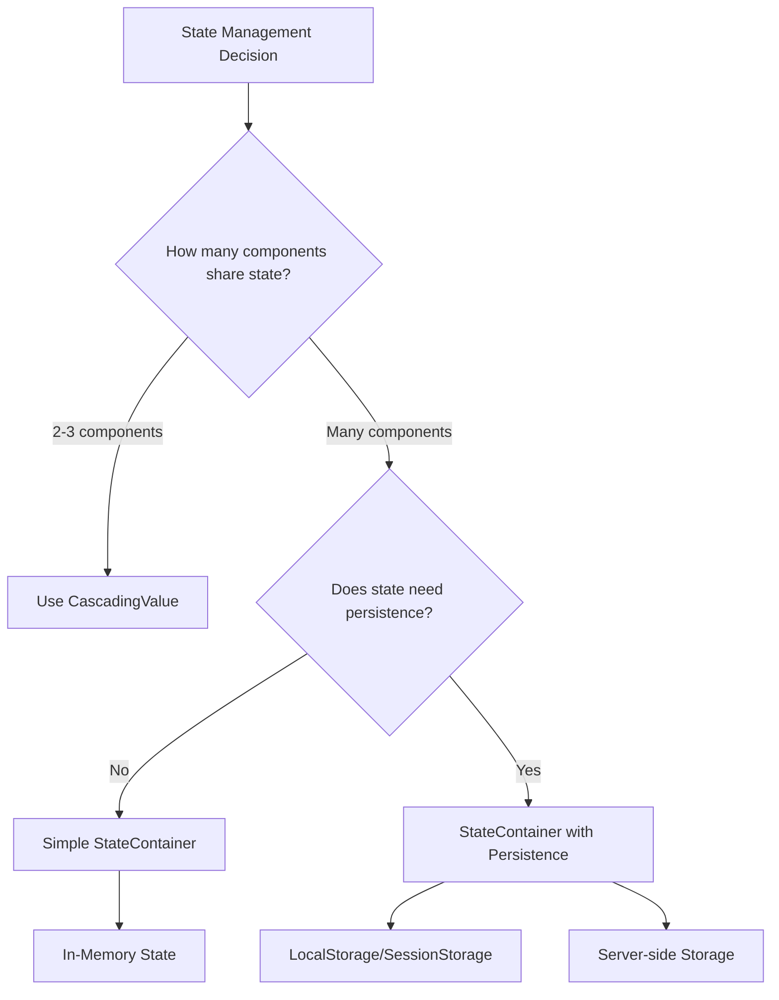
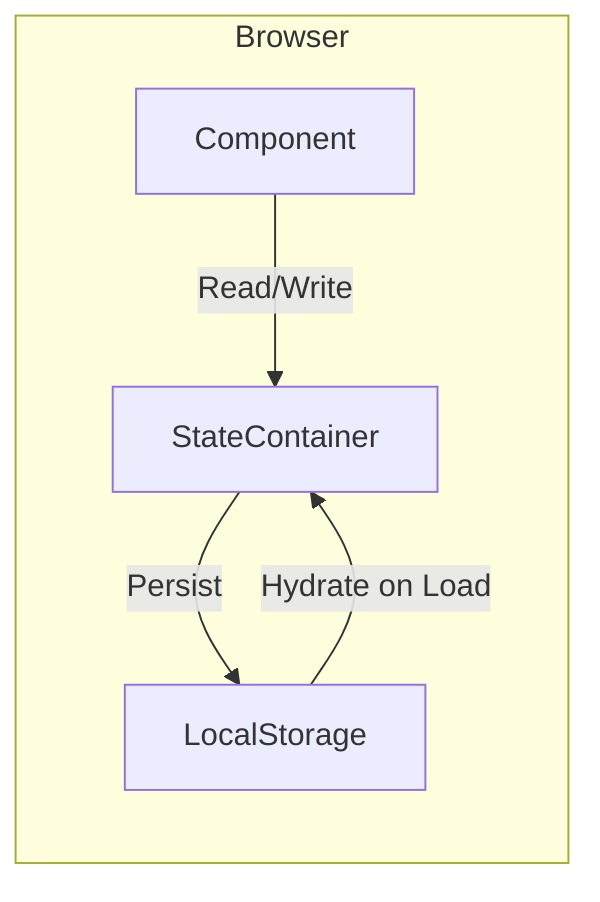
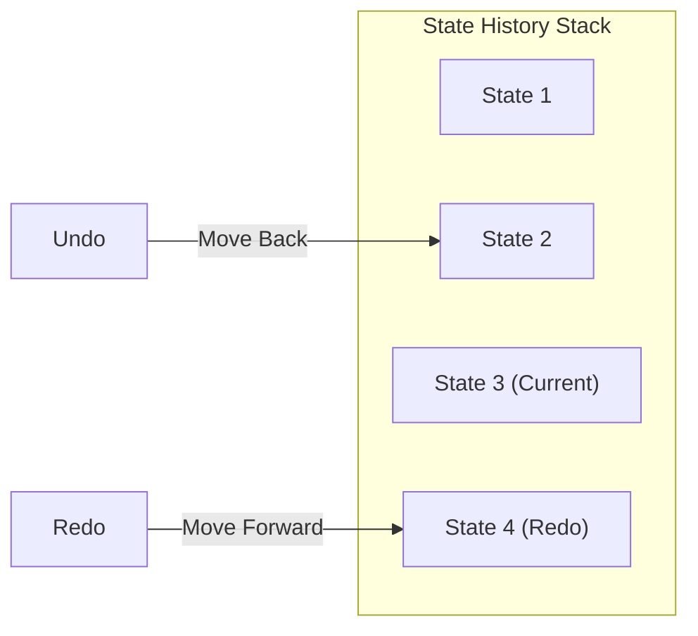
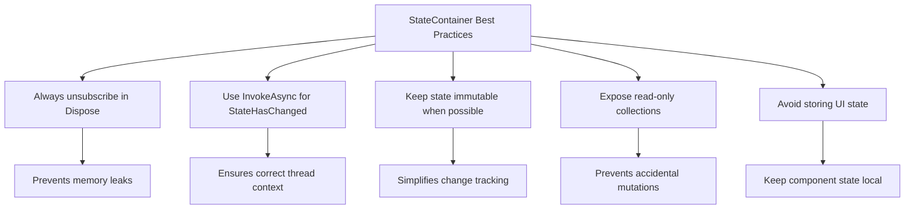

# How to Build Custom StateContainer in Blazor

Author: [nawazdhandala](https://github.com/nawazdhandala)

Tags: Blazor, C#, .NET, State Management, WebAssembly

Description: Learn how to build production-ready custom StateContainer patterns in Blazor for managing application state across components with type safety, persistence, and proper memory management.

---

State management in Blazor applications often becomes messy as projects grow. While simple apps can get by with component parameters and cascading values, real-world applications need a more structured approach. Building a custom StateContainer gives you full control over how state flows through your application, when components re-render, and how data persists across sessions.

This guide walks through building a StateContainer from scratch, covering everything from basic implementation to advanced patterns like persistence, middleware, and testing.

## Why Build a Custom StateContainer?

Before diving into code, let's understand when you actually need a custom StateContainer versus simpler alternatives.



Use a custom StateContainer when:

- Multiple unrelated components need access to the same data
- You need fine-grained control over when re-renders happen
- State needs to persist across page refreshes
- You want to implement undo/redo functionality
- You need to track state changes for debugging

## Basic StateContainer Implementation

Let's start with a minimal StateContainer that handles a shopping cart. This pattern forms the foundation for more complex implementations.

The StateContainer class encapsulates state and notifies subscribers when changes occur.

```csharp
// File: Services/CartState.cs

namespace MyApp.Services;

// Model representing an item in the cart
public record CartItem(int ProductId, string Name, decimal Price, int Quantity);

// The StateContainer manages cart state and notifies subscribers of changes
public class CartState
{
    // Private list holds the actual cart data
    private readonly List<CartItem> _items = new();

    // Event that fires whenever state changes
    // Components subscribe to this to know when to re-render
    public event Action? OnChange;

    // Public read-only access prevents external modification
    public IReadOnlyList<CartItem> Items => _items.AsReadOnly();

    // Computed property calculates total on demand
    public decimal Total => _items.Sum(x => x.Price * x.Quantity);

    public int ItemCount => _items.Sum(x => x.Quantity);

    // Method to add items with business logic
    public void AddItem(int productId, string name, decimal price, int quantity = 1)
    {
        // Check if item already exists in cart
        var existing = _items.FirstOrDefault(x => x.ProductId == productId);

        if (existing != null)
        {
            // Update quantity of existing item
            var index = _items.IndexOf(existing);
            _items[index] = existing with { Quantity = existing.Quantity + quantity };
        }
        else
        {
            // Add new item to cart
            _items.Add(new CartItem(productId, name, price, quantity));
        }

        // Notify all subscribers that state changed
        NotifyStateChanged();
    }

    public void RemoveItem(int productId)
    {
        var item = _items.FirstOrDefault(x => x.ProductId == productId);
        if (item != null)
        {
            _items.Remove(item);
            NotifyStateChanged();
        }
    }

    public void UpdateQuantity(int productId, int quantity)
    {
        var existing = _items.FirstOrDefault(x => x.ProductId == productId);
        if (existing != null)
        {
            if (quantity <= 0)
            {
                _items.Remove(existing);
            }
            else
            {
                var index = _items.IndexOf(existing);
                _items[index] = existing with { Quantity = quantity };
            }
            NotifyStateChanged();
        }
    }

    public void Clear()
    {
        _items.Clear();
        NotifyStateChanged();
    }

    // Private method encapsulates the notification logic
    private void NotifyStateChanged() => OnChange?.Invoke();
}
```

Register the StateContainer as a scoped service in Program.cs. Scoped lifetime ensures each user circuit gets its own instance.

```csharp
// File: Program.cs

var builder = WebApplication.CreateBuilder(args);

// Register StateContainer with scoped lifetime
// In Blazor Server, scoped = per circuit (per user session)
// In Blazor WebAssembly, scoped = per application instance
builder.Services.AddScoped<CartState>();

// ... rest of configuration
```

## Using StateContainer in Components

Components inject the StateContainer and subscribe to change notifications. Proper cleanup prevents memory leaks.

Here's a component that displays the cart contents.

```csharp
// File: Components/CartDisplay.razor

@inject CartState Cart
@implements IDisposable

<div class="cart-display">
    <h3>Shopping Cart (@Cart.ItemCount items)</h3>

    @if (Cart.Items.Count == 0)
    {
        <p class="empty-cart">Your cart is empty</p>
    }
    else
    {
        <ul class="cart-items">
            @foreach (var item in Cart.Items)
            {
                <li class="cart-item">
                    <span class="item-name">@item.Name</span>
                    <span class="item-quantity">
                        <button @onclick="() => DecreaseQuantity(item.ProductId)">-</button>
                        @item.Quantity
                        <button @onclick="() => IncreaseQuantity(item.ProductId)">+</button>
                    </span>
                    <span class="item-price">@((item.Price * item.Quantity).ToString("C"))</span>
                    <button class="remove-btn" @onclick="() => RemoveItem(item.ProductId)">
                        Remove
                    </button>
                </li>
            }
        </ul>

        <div class="cart-total">
            <strong>Total: @Cart.Total.ToString("C")</strong>
        </div>

        <button class="clear-btn" @onclick="ClearCart">Clear Cart</button>
    }
</div>

@code {
    // Subscribe to state changes when component initializes
    protected override void OnInitialized()
    {
        Cart.OnChange += HandleStateChange;
    }

    // Handler that triggers component re-render
    private void HandleStateChange()
    {
        // InvokeAsync ensures we're on the correct synchronization context
        InvokeAsync(StateHasChanged);
    }

    private void DecreaseQuantity(int productId)
    {
        var item = Cart.Items.FirstOrDefault(x => x.ProductId == productId);
        if (item != null)
        {
            Cart.UpdateQuantity(productId, item.Quantity - 1);
        }
    }

    private void IncreaseQuantity(int productId)
    {
        var item = Cart.Items.FirstOrDefault(x => x.ProductId == productId);
        if (item != null)
        {
            Cart.UpdateQuantity(productId, item.Quantity + 1);
        }
    }

    private void RemoveItem(int productId)
    {
        Cart.RemoveItem(productId);
    }

    private void ClearCart()
    {
        Cart.Clear();
    }

    // Unsubscribe when component is disposed to prevent memory leaks
    public void Dispose()
    {
        Cart.OnChange -= HandleStateChange;
    }
}
```

## Generic StateContainer Pattern

For applications with multiple state containers, a generic base class reduces boilerplate and ensures consistent behavior.

This generic base class provides common functionality for all state containers.

```csharp
// File: Services/StateContainerBase.cs

namespace MyApp.Services;

// Abstract base class provides common state management functionality
public abstract class StateContainerBase<TState> where TState : class, new()
{
    // Protected state allows derived classes to modify
    protected TState _state = new();

    // Event for change notifications
    public event Action? OnChange;

    // Public read-only access to state
    public TState State => _state;

    // Method to update state with a new instance
    protected void SetState(TState newState)
    {
        _state = newState;
        NotifyStateChanged();
    }

    // Method to update state using a transform function
    // This pattern works well with immutable state
    protected void UpdateState(Func<TState, TState> updateFunc)
    {
        _state = updateFunc(_state);
        NotifyStateChanged();
    }

    // Protected notify method allows derived classes to trigger updates
    protected void NotifyStateChanged() => OnChange?.Invoke();
}
```

Now create specific state containers by inheriting from the base class.

```csharp
// File: Services/UserState.cs

namespace MyApp.Services;

// State record for user information
public record UserStateData
{
    public string? UserId { get; init; }
    public string? Username { get; init; }
    public string? Email { get; init; }
    public bool IsAuthenticated { get; init; }
    public List<string> Roles { get; init; } = new();
}

// UserState container manages authentication and user profile data
public class UserState : StateContainerBase<UserStateData>
{
    public bool IsAuthenticated => State.IsAuthenticated;
    public string? Username => State.Username;

    // Check if user has a specific role
    public bool HasRole(string role) => State.Roles.Contains(role);

    // Login updates the state with user information
    public void Login(string userId, string username, string email, IEnumerable<string> roles)
    {
        SetState(new UserStateData
        {
            UserId = userId,
            Username = username,
            Email = email,
            IsAuthenticated = true,
            Roles = roles.ToList()
        });
    }

    // Logout clears all user data
    public void Logout()
    {
        SetState(new UserStateData());
    }

    // Update just the email while preserving other data
    public void UpdateEmail(string newEmail)
    {
        UpdateState(current => current with { Email = newEmail });
    }
}
```

## StateContainer with Persistence

Real applications often need state to survive page refreshes. This implementation adds browser storage integration.



First, create a service to interact with browser storage using JavaScript interop.

```csharp
// File: Services/BrowserStorageService.cs

using Microsoft.JSInterop;
using System.Text.Json;

namespace MyApp.Services;

// Interface for browser storage operations
public interface IBrowserStorage
{
    ValueTask<T?> GetAsync<T>(string key);
    ValueTask SetAsync<T>(string key, T value);
    ValueTask RemoveAsync(string key);
}

// Implementation using JavaScript interop to access localStorage
public class LocalStorageService : IBrowserStorage
{
    private readonly IJSRuntime _jsRuntime;

    public LocalStorageService(IJSRuntime jsRuntime)
    {
        _jsRuntime = jsRuntime;
    }

    public async ValueTask<T?> GetAsync<T>(string key)
    {
        try
        {
            var json = await _jsRuntime.InvokeAsync<string?>(
                "localStorage.getItem", key);

            if (string.IsNullOrEmpty(json))
                return default;

            return JsonSerializer.Deserialize<T>(json);
        }
        catch (JSException)
        {
            // Handle cases where localStorage is not available
            return default;
        }
    }

    public async ValueTask SetAsync<T>(string key, T value)
    {
        try
        {
            var json = JsonSerializer.Serialize(value);
            await _jsRuntime.InvokeVoidAsync(
                "localStorage.setItem", key, json);
        }
        catch (JSException)
        {
            // Silently fail if localStorage is not available
        }
    }

    public async ValueTask RemoveAsync(string key)
    {
        try
        {
            await _jsRuntime.InvokeVoidAsync(
                "localStorage.removeItem", key);
        }
        catch (JSException)
        {
            // Silently fail if localStorage is not available
        }
    }
}
```

Now create a persistent state container base class.

```csharp
// File: Services/PersistentStateContainer.cs

namespace MyApp.Services;

// Base class for state containers that persist to browser storage
public abstract class PersistentStateContainer<TState> where TState : class, new()
{
    private readonly IBrowserStorage _storage;
    private readonly string _storageKey;
    private bool _isInitialized;

    protected TState _state = new();

    public event Action? OnChange;
    public TState State => _state;

    protected PersistentStateContainer(IBrowserStorage storage, string storageKey)
    {
        _storage = storage;
        _storageKey = storageKey;
    }

    // Call this in OnInitializedAsync to load persisted state
    public async Task InitializeAsync()
    {
        if (_isInitialized)
            return;

        var persisted = await _storage.GetAsync<TState>(_storageKey);
        if (persisted != null)
        {
            _state = persisted;
            NotifyStateChanged();
        }

        _isInitialized = true;
    }

    protected async Task SetStateAsync(TState newState)
    {
        _state = newState;
        await PersistStateAsync();
        NotifyStateChanged();
    }

    protected async Task UpdateStateAsync(Func<TState, TState> updateFunc)
    {
        _state = updateFunc(_state);
        await PersistStateAsync();
        NotifyStateChanged();
    }

    // Persist current state to storage
    private async Task PersistStateAsync()
    {
        await _storage.SetAsync(_storageKey, _state);
    }

    // Clear persisted state
    public async Task ClearPersistedStateAsync()
    {
        await _storage.RemoveAsync(_storageKey);
        _state = new TState();
        _isInitialized = false;
        NotifyStateChanged();
    }

    protected void NotifyStateChanged() => OnChange?.Invoke();
}
```

Here's a persistent cart implementation using the base class.

```csharp
// File: Services/PersistentCartState.cs

namespace MyApp.Services;

// State data structure for the cart
public record CartStateData
{
    public List<CartItem> Items { get; init; } = new();
    public DateTime LastModified { get; init; } = DateTime.UtcNow;
}

// Persistent cart that survives page refreshes
public class PersistentCartState : PersistentStateContainer<CartStateData>
{
    // Storage key identifies this state in localStorage
    private const string StorageKey = "blazor_cart_state";

    public PersistentCartState(IBrowserStorage storage)
        : base(storage, StorageKey)
    {
    }

    // Convenience properties
    public IReadOnlyList<CartItem> Items => State.Items.AsReadOnly();
    public decimal Total => State.Items.Sum(x => x.Price * x.Quantity);
    public int ItemCount => State.Items.Sum(x => x.Quantity);

    public async Task AddItemAsync(int productId, string name, decimal price, int quantity = 1)
    {
        await UpdateStateAsync(current =>
        {
            var items = current.Items.ToList();
            var existing = items.FirstOrDefault(x => x.ProductId == productId);

            if (existing != null)
            {
                var index = items.IndexOf(existing);
                items[index] = existing with { Quantity = existing.Quantity + quantity };
            }
            else
            {
                items.Add(new CartItem(productId, name, price, quantity));
            }

            return current with
            {
                Items = items,
                LastModified = DateTime.UtcNow
            };
        });
    }

    public async Task RemoveItemAsync(int productId)
    {
        await UpdateStateAsync(current =>
        {
            var items = current.Items.Where(x => x.ProductId != productId).ToList();
            return current with
            {
                Items = items,
                LastModified = DateTime.UtcNow
            };
        });
    }

    public async Task ClearAsync()
    {
        await ClearPersistedStateAsync();
    }
}
```

## Scoped State with Multiple Instances

Sometimes you need multiple independent instances of the same state type. A factory pattern handles this elegantly.

```csharp
// File: Services/StateContainerFactory.cs

namespace MyApp.Services;

// Factory creates scoped state container instances
public class StateContainerFactory<TState> where TState : class, new()
{
    private readonly Dictionary<string, StateContainerBase<TState>> _instances = new();

    // Get or create a state container for a specific scope
    public StateContainerBase<TState> GetOrCreate(string scopeId)
    {
        if (!_instances.TryGetValue(scopeId, out var container))
        {
            container = new ScopedStateContainer<TState>();
            _instances[scopeId] = container;
        }

        return container;
    }

    // Remove a scoped instance when no longer needed
    public void Remove(string scopeId)
    {
        _instances.Remove(scopeId);
    }

    // Clear all instances
    public void Clear()
    {
        _instances.Clear();
    }
}

// Concrete implementation for factory use
public class ScopedStateContainer<TState> : StateContainerBase<TState>
    where TState : class, new()
{
    public void Set(TState state) => SetState(state);
    public void Update(Func<TState, TState> updateFunc) => UpdateState(updateFunc);
}
```

Use the factory when you need state isolated by some identifier, like a document editor where each document has its own state.

```csharp
// File: Components/DocumentEditor.razor

@inject StateContainerFactory<DocumentState> StateFactory
@implements IDisposable

<div class="document-editor">
    <h2>Editing: @_state?.State.Title</h2>
    <textarea @bind="_content" @bind:event="oninput" />
    <button @onclick="SaveChanges">Save</button>
</div>

@code {
    [Parameter]
    public string DocumentId { get; set; } = "";

    private ScopedStateContainer<DocumentState>? _state;
    private string _content = "";

    protected override void OnParametersSet()
    {
        // Unsubscribe from previous document
        if (_state != null)
        {
            _state.OnChange -= HandleStateChange;
        }

        // Get state container for this specific document
        _state = (ScopedStateContainer<DocumentState>)StateFactory.GetOrCreate(DocumentId);
        _state.OnChange += HandleStateChange;

        _content = _state.State.Content;
    }

    private void HandleStateChange()
    {
        _content = _state?.State.Content ?? "";
        InvokeAsync(StateHasChanged);
    }

    private void SaveChanges()
    {
        _state?.Update(current => current with
        {
            Content = _content,
            LastModified = DateTime.UtcNow
        });
    }

    public void Dispose()
    {
        if (_state != null)
        {
            _state.OnChange -= HandleStateChange;
        }
    }
}
```

## State History and Undo/Redo

A more advanced pattern tracks state history to enable undo and redo functionality.



```csharp
// File: Services/HistoryStateContainer.cs

namespace MyApp.Services;

// State container with undo/redo support
public class HistoryStateContainer<TState> where TState : class, new()
{
    private readonly Stack<TState> _undoStack = new();
    private readonly Stack<TState> _redoStack = new();
    private TState _currentState = new();
    private readonly int _maxHistorySize;

    public event Action? OnChange;

    public TState State => _currentState;
    public bool CanUndo => _undoStack.Count > 0;
    public bool CanRedo => _redoStack.Count > 0;

    public HistoryStateContainer(int maxHistorySize = 50)
    {
        _maxHistorySize = maxHistorySize;
    }

    // Update state and push previous state to undo stack
    public void SetState(TState newState)
    {
        // Push current state to undo stack
        _undoStack.Push(_currentState);

        // Trim undo stack if it exceeds max size
        while (_undoStack.Count > _maxHistorySize)
        {
            // Remove oldest entries
            var temp = _undoStack.ToList();
            temp.RemoveAt(temp.Count - 1);
            _undoStack.Clear();
            foreach (var item in temp.AsEnumerable().Reverse())
            {
                _undoStack.Push(item);
            }
        }

        // Clear redo stack since we have a new branch
        _redoStack.Clear();

        _currentState = newState;
        NotifyStateChanged();
    }

    // Restore previous state
    public void Undo()
    {
        if (!CanUndo)
            return;

        // Push current state to redo stack
        _redoStack.Push(_currentState);

        // Pop previous state from undo stack
        _currentState = _undoStack.Pop();

        NotifyStateChanged();
    }

    // Restore next state from redo stack
    public void Redo()
    {
        if (!CanRedo)
            return;

        // Push current state to undo stack
        _undoStack.Push(_currentState);

        // Pop next state from redo stack
        _currentState = _redoStack.Pop();

        NotifyStateChanged();
    }

    // Clear all history
    public void ClearHistory()
    {
        _undoStack.Clear();
        _redoStack.Clear();
    }

    private void NotifyStateChanged() => OnChange?.Invoke();
}
```

## Component Base Class for State Subscriptions

To reduce boilerplate in components, create a base class that handles subscription management.

```csharp
// File: Components/StateComponentBase.cs

using Microsoft.AspNetCore.Components;

namespace MyApp.Components;

// Base class for components that subscribe to state containers
public abstract class StateComponentBase : ComponentBase, IDisposable
{
    private readonly List<Action> _unsubscribeActions = new();

    // Subscribe to a state container and track for disposal
    protected void Subscribe(Action onChangeHandler, Action<Action> addHandler, Action<Action> removeHandler)
    {
        addHandler(onChangeHandler);
        _unsubscribeActions.Add(() => removeHandler(onChangeHandler));
    }

    // Helper method for common state container pattern
    protected void SubscribeTo<T>(T stateContainer) where T : class
    {
        // Use reflection to find OnChange event
        var onChangeEvent = typeof(T).GetEvent("OnChange");
        if (onChangeEvent != null)
        {
            Action handler = () => InvokeAsync(StateHasChanged);

            onChangeEvent.AddEventHandler(stateContainer, handler);
            _unsubscribeActions.Add(() =>
                onChangeEvent.RemoveEventHandler(stateContainer, handler));
        }
    }

    public virtual void Dispose()
    {
        // Unsubscribe from all state containers
        foreach (var unsubscribe in _unsubscribeActions)
        {
            unsubscribe();
        }
        _unsubscribeActions.Clear();
    }
}
```

Components inheriting from this base class have simplified subscription management.

```csharp
// File: Components/SimplifiedCartDisplay.razor

@inherits StateComponentBase
@inject CartState Cart

<div class="cart-summary">
    <span>Items: @Cart.ItemCount</span>
    <span>Total: @Cart.Total.ToString("C")</span>
</div>

@code {
    protected override void OnInitialized()
    {
        // Single line subscription with automatic cleanup
        SubscribeTo(Cart);
    }
}
```

## Testing StateContainers

Well-designed state containers are easy to unit test because they have no dependencies on Blazor infrastructure.

```csharp
// File: Tests/CartStateTests.cs

using Xunit;
using MyApp.Services;

namespace MyApp.Tests;

public class CartStateTests
{
    [Fact]
    public void AddItem_NewItem_AddsToCart()
    {
        // Arrange
        var cart = new CartState();

        // Act
        cart.AddItem(1, "Test Product", 9.99m, 1);

        // Assert
        Assert.Single(cart.Items);
        Assert.Equal("Test Product", cart.Items[0].Name);
        Assert.Equal(9.99m, cart.Items[0].Price);
    }

    [Fact]
    public void AddItem_ExistingItem_IncreasesQuantity()
    {
        // Arrange
        var cart = new CartState();
        cart.AddItem(1, "Test Product", 9.99m, 1);

        // Act
        cart.AddItem(1, "Test Product", 9.99m, 2);

        // Assert
        Assert.Single(cart.Items);
        Assert.Equal(3, cart.Items[0].Quantity);
    }

    [Fact]
    public void RemoveItem_ExistingItem_RemovesFromCart()
    {
        // Arrange
        var cart = new CartState();
        cart.AddItem(1, "Test Product", 9.99m, 1);

        // Act
        cart.RemoveItem(1);

        // Assert
        Assert.Empty(cart.Items);
    }

    [Fact]
    public void Total_MultipleItems_CalculatesCorrectly()
    {
        // Arrange
        var cart = new CartState();
        cart.AddItem(1, "Product A", 10.00m, 2);
        cart.AddItem(2, "Product B", 5.00m, 3);

        // Act
        var total = cart.Total;

        // Assert
        Assert.Equal(35.00m, total);
    }

    [Fact]
    public void OnChange_StateModified_EventFires()
    {
        // Arrange
        var cart = new CartState();
        var eventFired = false;
        cart.OnChange += () => eventFired = true;

        // Act
        cart.AddItem(1, "Test Product", 9.99m, 1);

        // Assert
        Assert.True(eventFired);
    }

    [Fact]
    public void UpdateQuantity_ZeroQuantity_RemovesItem()
    {
        // Arrange
        var cart = new CartState();
        cart.AddItem(1, "Test Product", 9.99m, 1);

        // Act
        cart.UpdateQuantity(1, 0);

        // Assert
        Assert.Empty(cart.Items);
    }
}
```

## Best Practices and Common Pitfalls

Follow these guidelines to build maintainable state management in your Blazor applications.



Key principles to follow:

1. Always implement IDisposable and unsubscribe from events
2. Use InvokeAsync when calling StateHasChanged from event handlers
3. Prefer immutable state updates using records with 'with' expressions
4. Expose state as read-only to prevent bypassing change notifications
5. Keep UI-specific state (like form input values) in components, not state containers
6. Test state containers independently from components

Common mistakes to avoid:

The pattern below causes memory leaks because the component never unsubscribes.

```csharp
// Wrong: Missing IDisposable implementation
@code {
    protected override void OnInitialized()
    {
        // This creates a memory leak
        Cart.OnChange += StateHasChanged;
    }

    // No Dispose method to unsubscribe
}
```

This pattern causes issues because StateHasChanged is called from the wrong context.

```csharp
// Wrong: Calling StateHasChanged without InvokeAsync
private void HandleStateChange()
{
    // This can fail in Blazor Server
    StateHasChanged();
}

// Correct: Use InvokeAsync
private void HandleStateChange()
{
    InvokeAsync(StateHasChanged);
}
```

## Summary

Custom StateContainers provide a flexible foundation for state management in Blazor applications. Starting with a simple implementation and adding features like persistence, history tracking, and scoped instances as needed keeps your codebase clean and maintainable.

The patterns covered in this guide handle most real-world scenarios:

- Basic StateContainer for simple shared state
- Generic base classes to reduce boilerplate
- Persistence with browser storage for state that survives refreshes
- Factory pattern for multiple scoped instances
- History tracking for undo/redo functionality
- Component base class for simplified subscriptions

Choose the level of complexity that matches your application's needs. Start simple and add features incrementally as requirements emerge.
