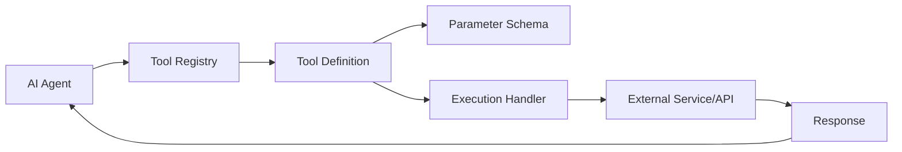
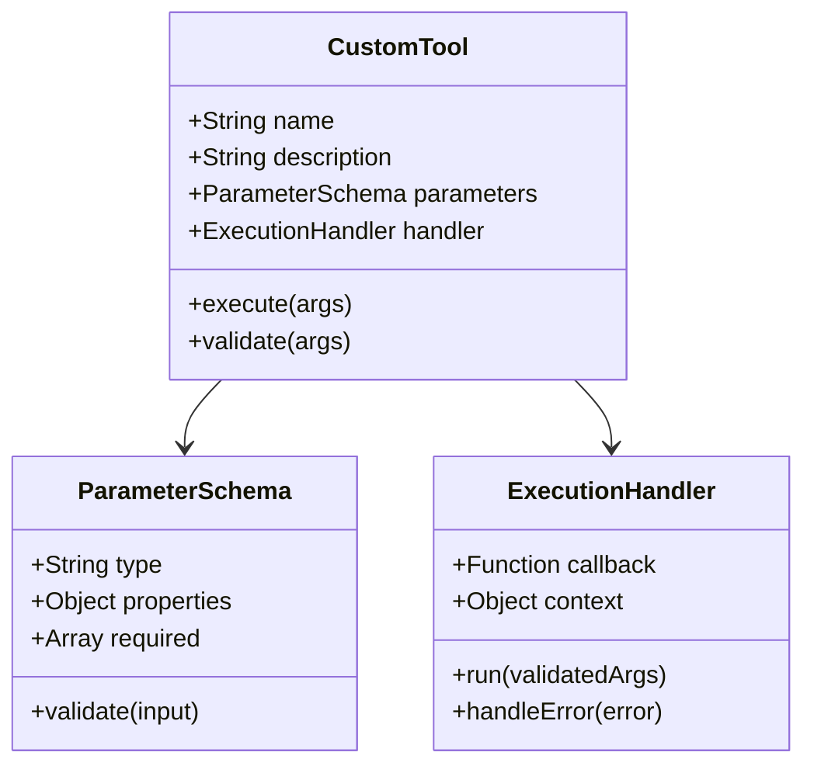
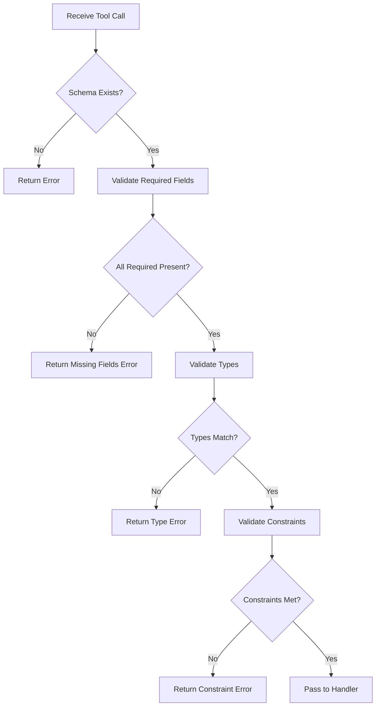
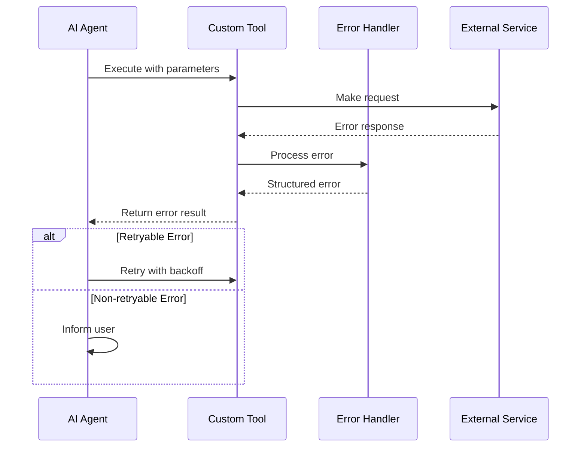
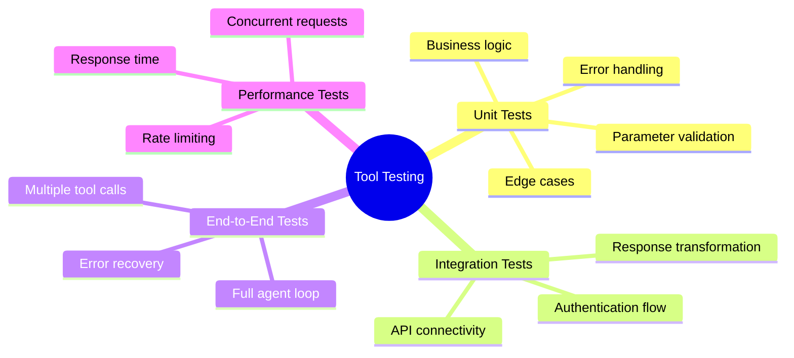

# How to Build Custom Tool Creation

Author: [nawazdhandala](https://github.com/nawazdhandala)

Tags: AI Agents, Custom Tools, API Integration, Automation

Description: Learn to create custom tools for AI agents with function definitions, parameter schemas, and execution handlers for domain-specific capabilities.

---

AI agents become truly powerful when they can interact with external systems, APIs, and services. Custom tools extend an agent's capabilities beyond its built-in functions, enabling domain-specific operations that transform a general-purpose AI into a specialized assistant. In this guide, we will walk through the complete process of building custom tools for AI agents.

## Understanding Custom Tools

Custom tools are the bridge between an AI agent's reasoning capabilities and real-world actions. They allow agents to:

- Query databases and APIs
- Perform calculations and data transformations
- Interact with external services
- Execute domain-specific operations



## Architecture of a Custom Tool

Every custom tool consists of three core components:

1. **Tool Definition** - Describes what the tool does
2. **Parameter Schema** - Defines the inputs the tool accepts
3. **Execution Handler** - Contains the logic that runs when the tool is invoked



## Step 1: Defining Your Tool

The tool definition tells the AI agent what the tool does and when to use it. A well-written definition is crucial for proper tool selection.

```typescript
interface ToolDefinition {
  name: string;
  description: string;
  parameters: JSONSchema;
}

// Example: Weather lookup tool
const weatherTool: ToolDefinition = {
  name: "get_weather",
  description: "Retrieves current weather conditions for a specified city. Use this when the user asks about weather, temperature, or atmospheric conditions for a location.",
  parameters: {
    type: "object",
    properties: {
      city: {
        type: "string",
        description: "The city name to get weather for"
      },
      units: {
        type: "string",
        enum: ["celsius", "fahrenheit"],
        description: "Temperature unit preference"
      }
    },
    required: ["city"]
  }
};
```

### Best Practices for Tool Definitions

| Aspect | Good Practice | Poor Practice |
|--------|---------------|---------------|
| Name | `search_database` | `doThing` |
| Description | Explains when and why to use | Vague or missing |
| Parameters | Clearly typed with descriptions | Missing types |

## Step 2: Creating Parameter Schemas

Parameter schemas use JSON Schema format to define and validate inputs. This ensures the AI provides correctly structured data.

```typescript
// Comprehensive schema example for a database query tool
const databaseQuerySchema = {
  type: "object",
  properties: {
    table: {
      type: "string",
      description: "The database table to query",
      enum: ["users", "orders", "products", "inventory"]
    },
    filters: {
      type: "array",
      description: "Filter conditions for the query",
      items: {
        type: "object",
        properties: {
          field: {
            type: "string",
            description: "The field to filter on"
          },
          operator: {
            type: "string",
            enum: ["equals", "contains", "greater_than", "less_than"],
            description: "Comparison operator"
          },
          value: {
            type: ["string", "number", "boolean"],
            description: "The value to compare against"
          }
        },
        required: ["field", "operator", "value"]
      }
    },
    limit: {
      type: "integer",
      description: "Maximum number of results to return",
      minimum: 1,
      maximum: 100,
      default: 10
    },
    orderBy: {
      type: "object",
      properties: {
        field: { type: "string" },
        direction: { type: "string", enum: ["asc", "desc"] }
      }
    }
  },
  required: ["table"]
};
```

### Schema Validation Flow



## Step 3: Building Execution Handlers

The execution handler contains the actual logic that runs when a tool is called. It should be robust, handle errors gracefully, and return structured responses.

```typescript
type ToolResult = {
  success: boolean;
  data?: any;
  error?: string;
};

class WeatherToolHandler {
  private apiKey: string;
  private baseUrl: string;

  constructor(apiKey: string) {
    this.apiKey = apiKey;
    this.baseUrl = "https://api.weather.example.com";
  }

  async execute(args: { city: string; units?: string }): Promise<ToolResult> {
    try {
      // Validate and sanitize inputs
      const city = this.sanitizeCity(args.city);
      const units = args.units || "celsius";

      // Make the API call
      const response = await fetch(
        `${this.baseUrl}/current?city=${encodeURIComponent(city)}&units=${units}`,
        {
          headers: {
            "Authorization": `Bearer ${this.apiKey}`,
            "Content-Type": "application/json"
          }
        }
      );

      if (!response.ok) {
        throw new Error(`API returned status ${response.status}`);
      }

      const data = await response.json();

      // Transform response to a consistent format
      return {
        success: true,
        data: {
          city: data.location.name,
          temperature: data.current.temp,
          units: units,
          conditions: data.current.condition,
          humidity: data.current.humidity,
          lastUpdated: data.current.last_updated
        }
      };

    } catch (error) {
      return {
        success: false,
        error: `Failed to fetch weather: ${error.message}`
      };
    }
  }

  private sanitizeCity(city: string): string {
    return city.trim().replace(/[^\w\s,-]/g, "");
  }
}
```

## Step 4: Implementing Error Handling

Robust error handling is essential for production tools. Implement multiple layers of error catching and provide meaningful feedback.

```typescript
enum ToolErrorCode {
  VALIDATION_ERROR = "VALIDATION_ERROR",
  AUTHENTICATION_ERROR = "AUTHENTICATION_ERROR",
  RATE_LIMIT_ERROR = "RATE_LIMIT_ERROR",
  EXTERNAL_SERVICE_ERROR = "EXTERNAL_SERVICE_ERROR",
  TIMEOUT_ERROR = "TIMEOUT_ERROR",
  UNKNOWN_ERROR = "UNKNOWN_ERROR"
}

interface ToolError {
  code: ToolErrorCode;
  message: string;
  retryable: boolean;
  details?: Record<string, any>;
}

class ToolErrorHandler {
  static handle(error: any): ToolError {
    // Handle specific error types
    if (error.name === "ValidationError") {
      return {
        code: ToolErrorCode.VALIDATION_ERROR,
        message: `Invalid parameters: ${error.message}`,
        retryable: false,
        details: { fields: error.fields }
      };
    }

    if (error.status === 401 || error.status === 403) {
      return {
        code: ToolErrorCode.AUTHENTICATION_ERROR,
        message: "Authentication failed. Check API credentials.",
        retryable: false
      };
    }

    if (error.status === 429) {
      return {
        code: ToolErrorCode.RATE_LIMIT_ERROR,
        message: "Rate limit exceeded. Please wait before retrying.",
        retryable: true,
        details: { retryAfter: error.headers?.get("Retry-After") }
      };
    }

    if (error.name === "TimeoutError" || error.code === "ETIMEDOUT") {
      return {
        code: ToolErrorCode.TIMEOUT_ERROR,
        message: "Request timed out. The service may be slow.",
        retryable: true
      };
    }

    // Default unknown error
    return {
      code: ToolErrorCode.UNKNOWN_ERROR,
      message: `An unexpected error occurred: ${error.message}`,
      retryable: false
    };
  }
}
```

### Error Handling Flow



## Step 5: Putting It All Together

Here is a complete implementation of a custom tool with all components integrated:

```typescript
import Anthropic from "@anthropic-ai/sdk";

// Define the tool
const calculatorTool = {
  name: "calculator",
  description: "Performs mathematical calculations. Supports basic arithmetic, percentages, and unit conversions. Use when the user needs precise mathematical results.",
  input_schema: {
    type: "object",
    properties: {
      operation: {
        type: "string",
        enum: ["add", "subtract", "multiply", "divide", "percentage", "convert"],
        description: "The mathematical operation to perform"
      },
      operands: {
        type: "array",
        items: { type: "number" },
        description: "Numbers to use in the calculation",
        minItems: 1,
        maxItems: 10
      },
      options: {
        type: "object",
        properties: {
          precision: {
            type: "integer",
            description: "Decimal places in result",
            default: 2
          },
          fromUnit: { type: "string" },
          toUnit: { type: "string" }
        }
      }
    },
    required: ["operation", "operands"]
  }
};

// Implement the handler
class CalculatorHandler {
  execute(args: any): { success: boolean; result?: number; error?: string } {
    const { operation, operands, options = {} } = args;
    const precision = options.precision ?? 2;

    try {
      let result: number;

      switch (operation) {
        case "add":
          result = operands.reduce((a: number, b: number) => a + b, 0);
          break;
        case "subtract":
          result = operands.reduce((a: number, b: number) => a - b);
          break;
        case "multiply":
          result = operands.reduce((a: number, b: number) => a * b, 1);
          break;
        case "divide":
          if (operands.slice(1).includes(0)) {
            throw new Error("Division by zero");
          }
          result = operands.reduce((a: number, b: number) => a / b);
          break;
        case "percentage":
          result = (operands[0] / 100) * operands[1];
          break;
        default:
          throw new Error(`Unknown operation: ${operation}`);
      }

      return {
        success: true,
        result: Number(result.toFixed(precision))
      };

    } catch (error) {
      return {
        success: false,
        error: error.message
      };
    }
  }
}

// Register and use with the AI agent
async function runAgentWithTools() {
  const client = new Anthropic();
  const calculator = new CalculatorHandler();

  const messages = [
    { role: "user", content: "What is 15% of 250?" }
  ];

  // Initial request with tool definition
  let response = await client.messages.create({
    model: "claude-sonnet-4-20250514",
    max_tokens: 1024,
    tools: [calculatorTool],
    messages: messages
  });

  // Process tool calls in a loop
  while (response.stop_reason === "tool_use") {
    const toolUse = response.content.find(
      (block) => block.type === "tool_use"
    );

    if (toolUse && toolUse.name === "calculator") {
      const toolResult = calculator.execute(toolUse.input);

      // Add assistant response and tool result to messages
      messages.push({ role: "assistant", content: response.content });
      messages.push({
        role: "user",
        content: [
          {
            type: "tool_result",
            tool_use_id: toolUse.id,
            content: JSON.stringify(toolResult)
          }
        ]
      });

      // Continue the conversation
      response = await client.messages.create({
        model: "claude-sonnet-4-20250514",
        max_tokens: 1024,
        tools: [calculatorTool],
        messages: messages
      });
    }
  }

  // Extract final text response
  const textBlock = response.content.find((block) => block.type === "text");
  console.log("Agent response:", textBlock?.text);
}
```

## Step 6: Testing Your Tools

Comprehensive testing ensures your tools work correctly in all scenarios.

```typescript
import { describe, it, expect, beforeEach, vi } from "vitest";

describe("CalculatorHandler", () => {
  let handler: CalculatorHandler;

  beforeEach(() => {
    handler = new CalculatorHandler();
  });

  describe("addition", () => {
    it("should add multiple numbers correctly", () => {
      const result = handler.execute({
        operation: "add",
        operands: [1, 2, 3, 4, 5]
      });

      expect(result.success).toBe(true);
      expect(result.result).toBe(15);
    });

    it("should handle negative numbers", () => {
      const result = handler.execute({
        operation: "add",
        operands: [-10, 5]
      });

      expect(result.success).toBe(true);
      expect(result.result).toBe(-5);
    });
  });

  describe("division", () => {
    it("should divide numbers correctly", () => {
      const result = handler.execute({
        operation: "divide",
        operands: [100, 4]
      });

      expect(result.success).toBe(true);
      expect(result.result).toBe(25);
    });

    it("should handle division by zero", () => {
      const result = handler.execute({
        operation: "divide",
        operands: [10, 0]
      });

      expect(result.success).toBe(false);
      expect(result.error).toContain("Division by zero");
    });
  });

  describe("precision", () => {
    it("should respect precision option", () => {
      const result = handler.execute({
        operation: "divide",
        operands: [10, 3],
        options: { precision: 4 }
      });

      expect(result.success).toBe(true);
      expect(result.result).toBe(3.3333);
    });
  });
});

// Integration test with mocked API
describe("WeatherToolHandler Integration", () => {
  it("should fetch and transform weather data", async () => {
    const mockResponse = {
      location: { name: "New York" },
      current: {
        temp: 72,
        condition: "Sunny",
        humidity: 45,
        last_updated: "2026-01-30 10:00"
      }
    };

    global.fetch = vi.fn().mockResolvedValue({
      ok: true,
      json: () => Promise.resolve(mockResponse)
    });

    const handler = new WeatherToolHandler("test-api-key");
    const result = await handler.execute({
      city: "New York",
      units: "fahrenheit"
    });

    expect(result.success).toBe(true);
    expect(result.data.city).toBe("New York");
    expect(result.data.temperature).toBe(72);
  });
});
```

### Test Coverage Checklist



## Advanced Patterns

### Tool Composition

Combine multiple tools to create more powerful capabilities:

```typescript
const compositeToolHandler = {
  async execute(args: { workflow: string; data: any }) {
    const workflows = {
      "analyze-and-report": async (data) => {
        // Step 1: Fetch data
        const fetchResult = await dataFetchTool.execute(data.source);

        // Step 2: Analyze
        const analysisResult = await analysisTool.execute({
          data: fetchResult.data
        });

        // Step 3: Format report
        return reportTool.execute({
          analysis: analysisResult.data,
          format: data.format
        });
      }
    };

    return workflows[args.workflow](args.data);
  }
};
```

### Caching for Performance

```typescript
class CachedToolHandler {
  private cache: Map<string, { data: any; expiry: number }> = new Map();
  private ttlMs: number = 5 * 60 * 1000; // 5 minutes

  async execute(args: any): Promise<any> {
    const cacheKey = JSON.stringify(args);
    const cached = this.cache.get(cacheKey);

    if (cached && cached.expiry > Date.now()) {
      return { ...cached.data, fromCache: true };
    }

    const result = await this.fetchFreshData(args);

    this.cache.set(cacheKey, {
      data: result,
      expiry: Date.now() + this.ttlMs
    });

    return result;
  }
}
```

## Conclusion

Building custom tools for AI agents involves careful attention to definition, schema design, handler implementation, and error handling. By following the patterns in this guide, you can create robust, reliable tools that extend your AI agent's capabilities into any domain.

Key takeaways:

1. **Clear definitions** help the AI choose the right tool
2. **Strict schemas** prevent invalid inputs
3. **Robust handlers** manage real-world complexity
4. **Comprehensive error handling** ensures graceful failures
5. **Thorough testing** validates all scenarios

Start with simple tools and iterate. As your agent grows, you can compose tools into workflows and add caching for performance. The possibilities are limited only by the APIs and services you want to integrate.

## Further Reading

- [Anthropic Tool Use Documentation](https://docs.anthropic.com/en/docs/build-with-claude/tool-use/overview)
- [JSON Schema Specification](https://json-schema.org/specification)
- [API Design Best Practices](https://swagger.io/resources/articles/best-practices-in-api-design/)
