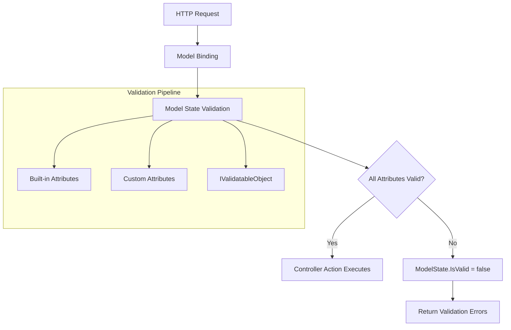
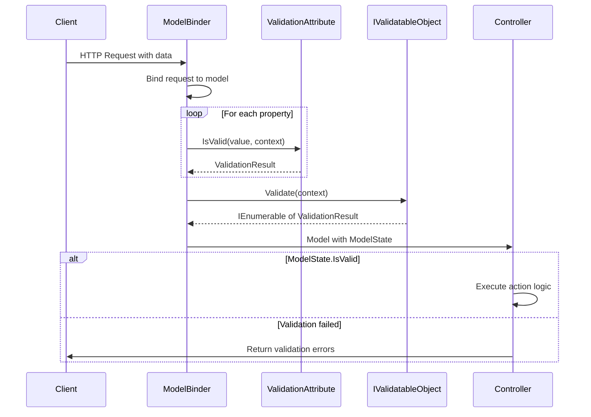

# How to Create Custom Validation Attributes in .NET

Author: [nawazdhandala](https://github.com/nawazdhandala)

Tags: .NET, C#, Validation, ASP.NET Core, Data Annotations, Backend Development

Description: Learn how to build production-ready custom validation attributes in .NET. This guide covers everything from simple validators to complex cross-property validation with dependency injection support.

---

Data annotations in .NET provide a declarative way to validate model properties. While the built-in attributes like `[Required]`, `[StringLength]`, and `[Range]` cover common scenarios, real-world applications often need custom validation logic. This post shows you how to build your own validation attributes that integrate seamlessly with ASP.NET Core's model binding and validation pipeline.

## How Validation Attributes Work

Before writing custom validators, let's understand the validation flow in ASP.NET Core.



Validation attributes inherit from `ValidationAttribute` and override the `IsValid` method. The framework calls this method during model validation, passing the value to validate and a context object containing metadata about the property and model.

## Simple Custom Validation Attribute

Let's start with a practical example: validating that a date is not in the future.

The following attribute checks if a DateTime value is today or earlier, which is useful for birth dates, start dates, and historical records.

```csharp
using System.ComponentModel.DataAnnotations;

namespace YourApp.Validation
{
    /// <summary>
    /// Validates that a DateTime value is not in the future.
    /// </summary>
    public class NotFutureDateAttribute : ValidationAttribute
    {
        public NotFutureDateAttribute()
        {
            // Default error message if none is provided
            ErrorMessage = "The date cannot be in the future.";
        }

        protected override ValidationResult? IsValid(
            object? value,
            ValidationContext validationContext)
        {
            // Null values should be handled by [Required] attribute
            if (value == null)
            {
                return ValidationResult.Success;
            }

            // Attempt to parse the value as DateTime
            if (value is DateTime dateValue)
            {
                if (dateValue.Date > DateTime.UtcNow.Date)
                {
                    // Return error with the property name for client-side binding
                    return new ValidationResult(
                        ErrorMessage,
                        new[] { validationContext.MemberName! });
                }

                return ValidationResult.Success;
            }

            // Handle DateOnly for .NET 6+
            if (value is DateOnly dateOnlyValue)
            {
                if (dateOnlyValue > DateOnly.FromDateTime(DateTime.UtcNow))
                {
                    return new ValidationResult(
                        ErrorMessage,
                        new[] { validationContext.MemberName! });
                }

                return ValidationResult.Success;
            }

            return new ValidationResult("Invalid date format.");
        }
    }
}
```

Using the attribute on a model is straightforward.

```csharp
public class EmployeeRegistrationModel
{
    [Required]
    [StringLength(100)]
    public string Name { get; set; } = string.Empty;

    [Required]
    [NotFutureDate(ErrorMessage = "Birth date cannot be in the future.")]
    public DateTime BirthDate { get; set; }

    [NotFutureDate(ErrorMessage = "Start date cannot be a future date.")]
    public DateTime? StartDate { get; set; }
}
```

## Parameterized Validation Attribute

Many validations require configuration. Here's an attribute that validates file extensions.

This attribute accepts allowed extensions as constructor parameters and validates that uploaded file names match.

```csharp
using System.ComponentModel.DataAnnotations;

namespace YourApp.Validation
{
    /// <summary>
    /// Validates that a file name has an allowed extension.
    /// </summary>
    public class AllowedExtensionsAttribute : ValidationAttribute
    {
        private readonly string[] _extensions;

        public AllowedExtensionsAttribute(params string[] extensions)
        {
            // Normalize extensions to lowercase with leading dot
            _extensions = extensions
                .Select(e => e.StartsWith(".") ? e.ToLowerInvariant() : $".{e.ToLowerInvariant()}")
                .ToArray();
        }

        protected override ValidationResult? IsValid(
            object? value,
            ValidationContext validationContext)
        {
            if (value == null)
            {
                return ValidationResult.Success;
            }

            string? fileName = null;

            // Handle IFormFile from file uploads
            if (value is IFormFile file)
            {
                fileName = file.FileName;
            }
            // Handle string file names
            else if (value is string stringValue)
            {
                fileName = stringValue;
            }

            if (string.IsNullOrEmpty(fileName))
            {
                return ValidationResult.Success;
            }

            var extension = Path.GetExtension(fileName).ToLowerInvariant();

            if (!_extensions.Contains(extension))
            {
                var allowedList = string.Join(", ", _extensions);
                return new ValidationResult(
                    ErrorMessage ?? $"Only {allowedList} files are allowed.",
                    new[] { validationContext.MemberName! });
            }

            return ValidationResult.Success;
        }
    }
}
```

Usage with file uploads.

```csharp
public class DocumentUploadModel
{
    [Required]
    [AllowedExtensions(".pdf", ".docx", ".doc")]
    public IFormFile Document { get; set; } = null!;

    [AllowedExtensions("jpg", "png", "gif", ErrorMessage = "Profile picture must be an image.")]
    public IFormFile? ProfilePicture { get; set; }
}
```

## Cross-Property Validation

Sometimes validation depends on multiple properties. Here's an attribute that compares two properties.

The following attribute validates that one property is greater than another, useful for date ranges, price ranges, and similar scenarios.

```csharp
using System.ComponentModel.DataAnnotations;
using System.Reflection;

namespace YourApp.Validation
{
    /// <summary>
    /// Validates that the decorated property value is greater than another property's value.
    /// Works with any IComparable type (DateTime, int, decimal, etc.)
    /// </summary>
    public class GreaterThanAttribute : ValidationAttribute
    {
        private readonly string _comparisonProperty;

        public GreaterThanAttribute(string comparisonProperty)
        {
            _comparisonProperty = comparisonProperty;
        }

        protected override ValidationResult? IsValid(
            object? value,
            ValidationContext validationContext)
        {
            if (value == null)
            {
                return ValidationResult.Success;
            }

            // Get the other property using reflection
            var comparisonProperty = validationContext.ObjectType
                .GetProperty(_comparisonProperty);

            if (comparisonProperty == null)
            {
                return new ValidationResult(
                    $"Property '{_comparisonProperty}' not found.");
            }

            var comparisonValue = comparisonProperty.GetValue(validationContext.ObjectInstance);

            // If comparison property is null, skip validation
            if (comparisonValue == null)
            {
                return ValidationResult.Success;
            }

            // Both values must implement IComparable
            if (value is not IComparable comparable)
            {
                return new ValidationResult(
                    $"Property '{validationContext.MemberName}' must implement IComparable.");
            }

            // Compare the values
            if (comparable.CompareTo(comparisonValue) <= 0)
            {
                var displayName = GetDisplayName(validationContext.ObjectType, _comparisonProperty);
                return new ValidationResult(
                    ErrorMessage ?? $"'{validationContext.DisplayName}' must be greater than '{displayName}'.",
                    new[] { validationContext.MemberName! });
            }

            return ValidationResult.Success;
        }

        private static string GetDisplayName(Type objectType, string propertyName)
        {
            var property = objectType.GetProperty(propertyName);
            var displayAttribute = property?.GetCustomAttribute<DisplayAttribute>();
            return displayAttribute?.Name ?? propertyName;
        }
    }
}
```

Using cross-property validation for a booking system.

```csharp
public class BookingModel
{
    [Required]
    [Display(Name = "Check-in Date")]
    public DateTime CheckInDate { get; set; }

    [Required]
    [Display(Name = "Check-out Date")]
    [GreaterThan(nameof(CheckInDate), ErrorMessage = "Check-out must be after check-in.")]
    public DateTime CheckOutDate { get; set; }

    [Display(Name = "Minimum Price")]
    public decimal? MinPrice { get; set; }

    [Display(Name = "Maximum Price")]
    [GreaterThan(nameof(MinPrice))]
    public decimal? MaxPrice { get; set; }
}
```

## Validation with Dependency Injection

Sometimes validators need access to services like databases or external APIs. ASP.NET Core's validation context provides access to the service provider.

Here's an attribute that checks if a username already exists.

```csharp
using System.ComponentModel.DataAnnotations;
using Microsoft.Extensions.DependencyInjection;

namespace YourApp.Validation
{
    /// <summary>
    /// Validates that a username is not already taken.
    /// Uses dependency injection to access the user service.
    /// </summary>
    public class UniqueUsernameAttribute : ValidationAttribute
    {
        protected override ValidationResult? IsValid(
            object? value,
            ValidationContext validationContext)
        {
            if (value == null || value is not string username)
            {
                return ValidationResult.Success;
            }

            // Get the user service from DI container
            var userService = validationContext.GetRequiredService<IUserService>();

            // Check if username exists (this is synchronous)
            // For async operations, consider using IValidatableObject instead
            var exists = userService.UsernameExistsSync(username);

            if (exists)
            {
                return new ValidationResult(
                    ErrorMessage ?? "This username is already taken.",
                    new[] { validationContext.MemberName! });
            }

            return ValidationResult.Success;
        }
    }

    // Service interface
    public interface IUserService
    {
        bool UsernameExistsSync(string username);
    }
}
```

Usage in a registration model.

```csharp
public class UserRegistrationModel
{
    [Required]
    [StringLength(50, MinimumLength = 3)]
    [UniqueUsername]
    public string Username { get; set; } = string.Empty;

    [Required]
    [EmailAddress]
    public string Email { get; set; } = string.Empty;

    [Required]
    [StringLength(100, MinimumLength = 8)]
    public string Password { get; set; } = string.Empty;
}
```

## Async Validation with IValidatableObject

Validation attributes are synchronous by design. For async validation (like checking a database), implement `IValidatableObject` on your model.

```csharp
using System.ComponentModel.DataAnnotations;

namespace YourApp.Models
{
    public class ProductModel : IValidatableObject
    {
        [Required]
        [StringLength(100)]
        public string Name { get; set; } = string.Empty;

        [Required]
        public string SKU { get; set; } = string.Empty;

        [Required]
        [Range(0.01, double.MaxValue, ErrorMessage = "Price must be greater than zero.")]
        public decimal Price { get; set; }

        public int CategoryId { get; set; }

        public IEnumerable<ValidationResult> Validate(ValidationContext validationContext)
        {
            var productService = validationContext.GetRequiredService<IProductService>();

            // Check SKU uniqueness
            if (productService.SkuExistsSync(SKU))
            {
                yield return new ValidationResult(
                    "This SKU already exists.",
                    new[] { nameof(SKU) });
            }

            // Check category exists
            if (!productService.CategoryExistsSync(CategoryId))
            {
                yield return new ValidationResult(
                    "Selected category does not exist.",
                    new[] { nameof(CategoryId) });
            }
        }
    }
}
```

## Composable Validation Attribute

For complex validation scenarios, create composable validators that can be combined.

This example validates password strength with configurable requirements.

```csharp
using System.ComponentModel.DataAnnotations;
using System.Text.RegularExpressions;

namespace YourApp.Validation
{
    /// <summary>
    /// Validates password strength with configurable requirements.
    /// </summary>
    public class StrongPasswordAttribute : ValidationAttribute
    {
        public int MinimumLength { get; set; } = 8;
        public bool RequireUppercase { get; set; } = true;
        public bool RequireLowercase { get; set; } = true;
        public bool RequireDigit { get; set; } = true;
        public bool RequireSpecialChar { get; set; } = true;
        public string SpecialCharacters { get; set; } = "!@#$%^&*()_+-=[]{}|;':\",./<>?";

        protected override ValidationResult? IsValid(
            object? value,
            ValidationContext validationContext)
        {
            if (value == null || value is not string password)
            {
                return ValidationResult.Success;
            }

            var errors = new List<string>();

            // Check minimum length
            if (password.Length < MinimumLength)
            {
                errors.Add($"at least {MinimumLength} characters");
            }

            // Check uppercase requirement
            if (RequireUppercase && !password.Any(char.IsUpper))
            {
                errors.Add("an uppercase letter");
            }

            // Check lowercase requirement
            if (RequireLowercase && !password.Any(char.IsLower))
            {
                errors.Add("a lowercase letter");
            }

            // Check digit requirement
            if (RequireDigit && !password.Any(char.IsDigit))
            {
                errors.Add("a digit");
            }

            // Check special character requirement
            if (RequireSpecialChar && !password.Any(c => SpecialCharacters.Contains(c)))
            {
                errors.Add("a special character");
            }

            if (errors.Count > 0)
            {
                var message = ErrorMessage ??
                    $"Password must contain {string.Join(", ", errors)}.";
                return new ValidationResult(message, new[] { validationContext.MemberName! });
            }

            return ValidationResult.Success;
        }
    }
}
```

Usage with different strength levels.

```csharp
public class AdminUserModel
{
    [Required]
    public string Username { get; set; } = string.Empty;

    // Strict password policy for admins
    [Required]
    [StrongPassword(
        MinimumLength = 12,
        RequireUppercase = true,
        RequireLowercase = true,
        RequireDigit = true,
        RequireSpecialChar = true)]
    public string Password { get; set; } = string.Empty;
}

public class RegularUserModel
{
    [Required]
    public string Username { get; set; } = string.Empty;

    // Relaxed password policy for regular users
    [Required]
    [StrongPassword(
        MinimumLength = 8,
        RequireSpecialChar = false)]
    public string Password { get; set; } = string.Empty;
}
```

## Client-Side Validation Support

To enable client-side validation, implement `IClientModelValidator`.

Here's an example that adds client-side validation for a maximum file size attribute.

```csharp
using System.ComponentModel.DataAnnotations;
using Microsoft.AspNetCore.Mvc.ModelBinding.Validation;

namespace YourApp.Validation
{
    /// <summary>
    /// Validates file size with client-side support.
    /// </summary>
    public class MaxFileSizeAttribute : ValidationAttribute, IClientModelValidator
    {
        private readonly int _maxSizeInBytes;

        public MaxFileSizeAttribute(int maxSizeInMB)
        {
            _maxSizeInBytes = maxSizeInMB * 1024 * 1024;
            ErrorMessage = $"File size cannot exceed {maxSizeInMB}MB.";
        }

        protected override ValidationResult? IsValid(
            object? value,
            ValidationContext validationContext)
        {
            if (value is IFormFile file)
            {
                if (file.Length > _maxSizeInBytes)
                {
                    return new ValidationResult(
                        ErrorMessage,
                        new[] { validationContext.MemberName! });
                }
            }

            return ValidationResult.Success;
        }

        // Add client-side validation attributes
        public void AddValidation(ClientModelValidationContext context)
        {
            // Add data attributes for client-side JavaScript validation
            context.Attributes.Add("data-val", "true");
            context.Attributes.Add("data-val-maxfilesize", ErrorMessage ?? "File too large.");
            context.Attributes.Add("data-val-maxfilesize-maxbytes", _maxSizeInBytes.ToString());
        }
    }
}
```

Add the corresponding JavaScript validation adapter.

```javascript
// Add this to your site.js or validation bundle
$.validator.addMethod("maxfilesize", function (value, element, params) {
    if (element.files.length === 0) {
        return true; // No file selected, let required handle it
    }

    var maxBytes = parseInt(params.maxbytes);
    var fileSize = element.files[0].size;

    return fileSize <= maxBytes;
});

$.validator.unobtrusive.adapters.add("maxfilesize", ["maxbytes"], function (options) {
    options.rules["maxfilesize"] = {
        maxbytes: options.params.maxbytes
    };
    options.messages["maxfilesize"] = options.message;
});
```

## Testing Custom Validation Attributes

Always unit test your validation attributes.

```csharp
using Xunit;
using YourApp.Validation;
using System.ComponentModel.DataAnnotations;

namespace YourApp.Tests.Validation
{
    public class NotFutureDateAttributeTests
    {
        private readonly NotFutureDateAttribute _attribute = new();

        [Fact]
        public void IsValid_WithPastDate_ReturnsSuccess()
        {
            // Arrange
            var pastDate = DateTime.UtcNow.AddDays(-1);
            var context = CreateValidationContext(pastDate);

            // Act
            var result = _attribute.GetValidationResult(pastDate, context);

            // Assert
            Assert.Equal(ValidationResult.Success, result);
        }

        [Fact]
        public void IsValid_WithTodayDate_ReturnsSuccess()
        {
            // Arrange
            var today = DateTime.UtcNow.Date;
            var context = CreateValidationContext(today);

            // Act
            var result = _attribute.GetValidationResult(today, context);

            // Assert
            Assert.Equal(ValidationResult.Success, result);
        }

        [Fact]
        public void IsValid_WithFutureDate_ReturnsError()
        {
            // Arrange
            var futureDate = DateTime.UtcNow.AddDays(1);
            var context = CreateValidationContext(futureDate);

            // Act
            var result = _attribute.GetValidationResult(futureDate, context);

            // Assert
            Assert.NotNull(result);
            Assert.NotEqual(ValidationResult.Success, result);
        }

        [Fact]
        public void IsValid_WithNull_ReturnsSuccess()
        {
            // Arrange
            var context = CreateValidationContext(null);

            // Act
            var result = _attribute.GetValidationResult(null, context);

            // Assert
            Assert.Equal(ValidationResult.Success, result);
        }

        private static ValidationContext CreateValidationContext(object? value)
        {
            var model = new TestModel { TestProperty = value as DateTime? ?? DateTime.MinValue };
            return new ValidationContext(model) { MemberName = nameof(TestModel.TestProperty) };
        }

        private class TestModel
        {
            public DateTime TestProperty { get; set; }
        }
    }
}
```

## Validation Flow Summary

Here's how validation attributes fit into the request pipeline.



## Best Practices

1. **Keep attributes focused** - Each attribute should validate one thing. Combine multiple attributes for complex validation.

2. **Handle null gracefully** - Return `ValidationResult.Success` for null values and let `[Required]` handle nullability.

3. **Provide meaningful error messages** - Include the property name and clear guidance on what's wrong.

4. **Use ValidationContext services** - Access DI services through `validationContext.GetRequiredService<T>()`.

5. **Consider localization** - Use `ErrorMessageResourceType` and `ErrorMessageResourceName` for localized messages.

6. **Test edge cases** - Test null values, boundary conditions, and invalid types.

7. **Document your attributes** - Add XML comments explaining what the attribute validates and how to use it.

---

Custom validation attributes let you enforce business rules declaratively, keeping your models clean and your validation logic reusable. Start with simple attributes for common patterns, then build more sophisticated validators as your application grows. The key is making validation obvious and maintainable for the next developer who reads your code.
