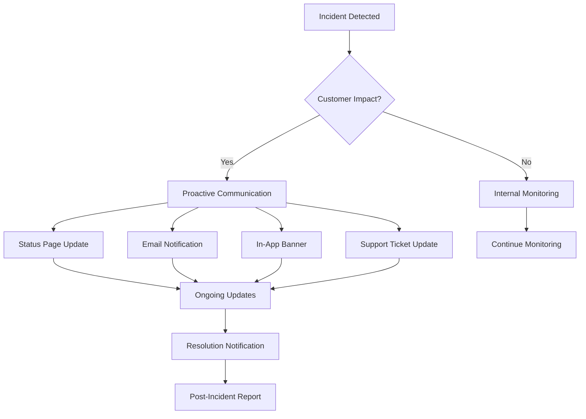
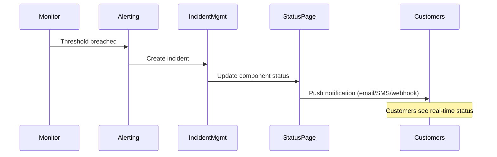
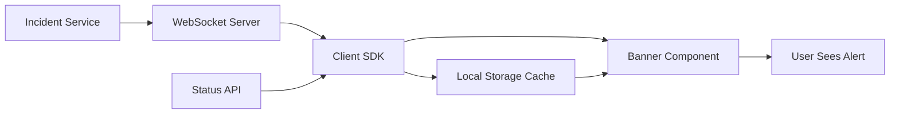
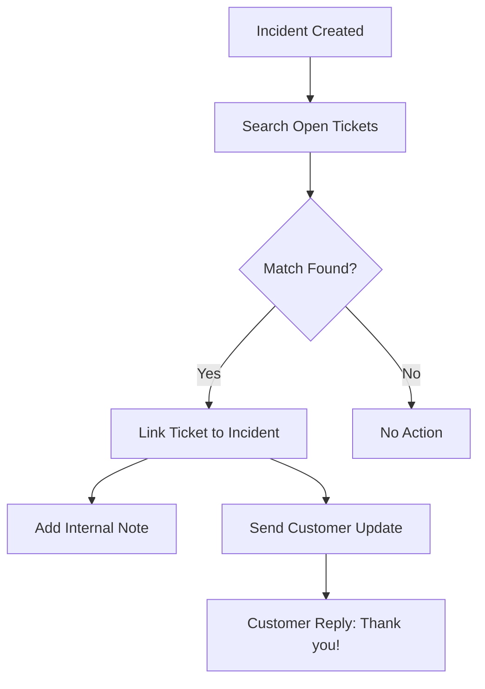
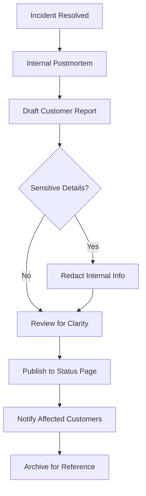
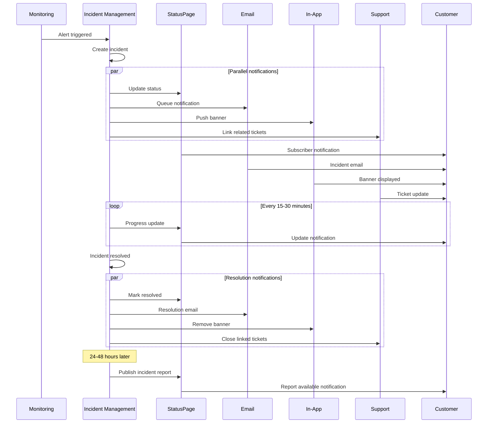

# How to Implement Customer Communication

Author: [nawazdhandala](https://github.com/nawazdhandala)

Tags: Incident Management, Communication, Customer Success, SRE

Description: Learn how to communicate effectively with customers during incidents.

---

Incidents happen. How you communicate during them defines whether customers stay or leave. The difference between a loyal customer and a churned one often comes down to transparency, speed, and clarity of communication. This guide covers practical strategies for implementing customer communication during incidents, from proactive notifications to post-incident reports.

---

## The Communication Lifecycle

Every incident follows a communication lifecycle. Understanding this flow helps you build systems that inform customers at the right moment with the right message.



---

## Proactive vs Reactive Communication

The best incident communication happens before customers notice the problem. Here is how both approaches compare:

### Reactive Communication

Customers contact support first. You scramble to explain. Trust erodes with every minute of silence.

```
Customer: "Is your service down?"
Support: "Let me check with engineering..."
[20 minutes later]
Support: "Yes, we're experiencing issues. No ETA yet."
Customer: [Already considering alternatives]
```

### Proactive Communication

You detect the issue, notify customers, and control the narrative.

```
[Automated within 2 minutes of detection]
Email: "We're aware of an issue affecting [Service].
       Our team is investigating. Next update in 15 minutes."
Customer: [Feels informed, continues other work]
```

The proactive approach requires investment in monitoring and automation, but the return in customer trust is substantial.

---

## Status Page Integration

Your status page is the single source of truth during incidents. Every other communication channel should link back to it.

### Setting Up Status Page Updates

Here is a typical integration flow for automatically updating your status page when an incident is created:



### Example: Status Page API Integration

```typescript
// Update status page when incident is created
async function updateStatusPage(incident: Incident): Promise<void> {
  const statusPageUpdate = {
    componentId: incident.affectedComponent,
    status: mapIncidentSeverityToStatus(incident.severity),
    message: incident.customerFacingMessage,
    notify: true
  };

  await statusPageClient.createIncident({
    name: incident.title,
    status: 'investigating',
    components: [statusPageUpdate],
    notifySubscribers: true
  });
}

function mapIncidentSeverityToStatus(severity: string): ComponentStatus {
  const mapping: Record<string, ComponentStatus> = {
    'critical': 'major_outage',
    'high': 'partial_outage',
    'medium': 'degraded_performance',
    'low': 'operational'
  };
  return mapping[severity] || 'operational';
}
```

### Component Organization

Structure your status page components to match how customers experience your product:

```yaml
# Status page component hierarchy
components:
  - name: "Web Application"
    children:
      - "Dashboard"
      - "User Authentication"
      - "Reporting"
  - name: "API"
    children:
      - "REST API"
      - "GraphQL API"
      - "Webhooks"
  - name: "Integrations"
    children:
      - "Slack Integration"
      - "Microsoft Teams"
      - "Email Delivery"
```

---

## Email Notification Templates

Consistency in email communication builds trust. Create templates for each incident phase.

### Template 1: Initial Notification

```typescript
const initialNotificationTemplate = {
  subject: '[{{severity}}] {{service_name}} - Issue Detected',
  body: `
Hi {{customer_name}},

We detected an issue affecting {{service_name}} at {{detection_time}}.

**What's happening:**
{{incident_summary}}

**What we're doing:**
Our team is actively investigating and working on a resolution.

**Next update:**
We'll provide an update within {{next_update_minutes}} minutes.

**Track live status:**
{{status_page_url}}

We apologize for any inconvenience this may cause.

The {{company_name}} Team
  `
};
```

### Template 2: Ongoing Update

```typescript
const ongoingUpdateTemplate = {
  subject: 'Re: [{{severity}}] {{service_name}} - Update #{{update_number}}',
  body: `
Hi {{customer_name}},

Here's the latest on the {{service_name}} incident.

**Current status:** {{current_status}}

**What we've learned:**
{{investigation_findings}}

**What we're doing now:**
{{current_actions}}

**Expected resolution:**
{{eta_message}}

**Next update:**
{{next_update_time}}

Track live: {{status_page_url}}

The {{company_name}} Team
  `
};
```

### Template 3: Resolution Notification

```typescript
const resolutionTemplate = {
  subject: '[Resolved] {{service_name}} - Issue Fixed',
  body: `
Hi {{customer_name}},

The issue affecting {{service_name}} has been resolved.

**Duration:** {{incident_duration}}

**What happened:**
{{root_cause_summary}}

**What we fixed:**
{{resolution_summary}}

**What we're doing to prevent this:**
{{prevention_measures}}

A detailed post-incident report will be available within
{{report_eta}} at: {{postmortem_url}}

Thank you for your patience during this incident.

The {{company_name}} Team
  `
};
```

### Implementation Example

```typescript
interface NotificationContext {
  customer: Customer;
  incident: Incident;
  updateNumber?: number;
}

class EmailNotificationService {
  private templates: Map<string, EmailTemplate>;

  async sendIncidentNotification(
    phase: 'initial' | 'update' | 'resolution',
    context: NotificationContext
  ): Promise<void> {
    const template = this.templates.get(phase);
    const rendered = this.renderTemplate(template, context);

    // Filter customers based on subscription preferences
    const subscribers = await this.getAffectedSubscribers(
      context.incident.affectedComponents
    );

    // Batch send with rate limiting
    await this.batchSend(subscribers, rendered, {
      rateLimit: 1000, // emails per minute
      priority: this.getPriority(context.incident.severity)
    });

    // Log for audit trail
    await this.logNotification({
      incidentId: context.incident.id,
      phase,
      recipientCount: subscribers.length,
      timestamp: new Date()
    });
  }

  private renderTemplate(
    template: EmailTemplate,
    context: NotificationContext
  ): RenderedEmail {
    return {
      subject: this.interpolate(template.subject, context),
      body: this.interpolate(template.body, context)
    };
  }
}
```

---

## In-App Notifications

For users actively using your application, in-app notifications provide immediate awareness without requiring them to check email.

### Banner Component Architecture



### Example: React Banner Component

```tsx
import React, { useEffect, useState } from 'react';

interface IncidentBanner {
  id: string;
  severity: 'info' | 'warning' | 'critical';
  message: string;
  link?: string;
  dismissible: boolean;
}

const IncidentBannerComponent: React.FC = () => {
  const [banners, setBanners] = useState<IncidentBanner[]>([]);
  const [dismissed, setDismissed] = useState<Set<string>>(new Set());

  useEffect(() => {
    // Subscribe to real-time incident updates
    const ws = new WebSocket(process.env.INCIDENT_WS_URL);

    ws.onmessage = (event) => {
      const incident = JSON.parse(event.data);
      handleIncidentUpdate(incident);
    };

    // Also fetch current incidents on mount
    fetchActiveIncidents();

    return () => ws.close();
  }, []);

  const fetchActiveIncidents = async () => {
    const response = await fetch('/api/incidents/active');
    const incidents = await response.json();
    setBanners(incidents.map(incidentToBanner));
  };

  const handleDismiss = (id: string) => {
    setDismissed(prev => new Set(prev).add(id));
    localStorage.setItem(
      'dismissed_incidents',
      JSON.stringify([...dismissed, id])
    );
  };

  const visibleBanners = banners.filter(b => !dismissed.has(b.id));

  return (
    <div className="incident-banner-container">
      {visibleBanners.map(banner => (
        <div
          key={banner.id}
          className={`incident-banner incident-banner--${banner.severity}`}
        >
          <span className="incident-banner__icon">
            {getIconForSeverity(banner.severity)}
          </span>
          <span className="incident-banner__message">
            {banner.message}
          </span>
          {banner.link && (
            <a
              href={banner.link}
              className="incident-banner__link"
              target="_blank"
              rel="noopener noreferrer"
            >
              View Status
            </a>
          )}
          {banner.dismissible && (
            <button
              onClick={() => handleDismiss(banner.id)}
              className="incident-banner__dismiss"
              aria-label="Dismiss"
            >
              ×
            </button>
          )}
        </div>
      ))}
    </div>
  );
};

function incidentToBanner(incident: Incident): IncidentBanner {
  return {
    id: incident.id,
    severity: mapSeverity(incident.severity),
    message: incident.customerMessage ||
      `We're experiencing issues with ${incident.affectedService}. Our team is investigating.`,
    link: incident.statusPageUrl,
    dismissible: incident.severity !== 'critical'
  };
}
```

### Severity-Based Styling

```css
.incident-banner {
  padding: 12px 16px;
  display: flex;
  align-items: center;
  gap: 12px;
  font-size: 14px;
}

.incident-banner--info {
  background-color: #e3f2fd;
  border-left: 4px solid #2196f3;
  color: #1565c0;
}

.incident-banner--warning {
  background-color: #fff3e0;
  border-left: 4px solid #ff9800;
  color: #e65100;
}

.incident-banner--critical {
  background-color: #ffebee;
  border-left: 4px solid #f44336;
  color: #c62828;
}
```

---

## Support Ticket Updates

When customers have open support tickets, they should receive automatic updates about relevant incidents without having to ask.

### Automated Ticket Linking



### Example: Ticket Integration Service

```typescript
interface SupportTicket {
  id: string;
  customerId: string;
  subject: string;
  description: string;
  status: 'open' | 'pending' | 'resolved';
  tags: string[];
  affectedService?: string;
}

class TicketIncidentLinker {
  constructor(
    private ticketService: TicketService,
    private notificationService: NotificationService
  ) {}

  async linkIncidentToTickets(incident: Incident): Promise<void> {
    // Find tickets that might be related to this incident
    const relatedTickets = await this.findRelatedTickets(incident);

    for (const ticket of relatedTickets) {
      // Add internal note for support agents
      await this.ticketService.addInternalNote(ticket.id, {
        message: `This ticket appears related to incident ${incident.id}: ${incident.title}`,
        incidentLink: incident.url
      });

      // Send proactive update to customer
      await this.notificationService.sendTicketUpdate(ticket, {
        subject: `Update on your support request: ${ticket.subject}`,
        message: this.buildTicketUpdateMessage(incident, ticket)
      });

      // Link ticket to incident for tracking
      await this.ticketService.linkToIncident(ticket.id, incident.id);
    }
  }

  private async findRelatedTickets(incident: Incident): Promise<SupportTicket[]> {
    const searchCriteria = {
      status: ['open', 'pending'],
      createdAfter: new Date(Date.now() - 24 * 60 * 60 * 1000), // Last 24 hours
      keywords: incident.keywords,
      affectedServices: incident.affectedComponents
    };

    const tickets = await this.ticketService.search(searchCriteria);

    // Score and filter by relevance
    return tickets
      .map(ticket => ({
        ticket,
        score: this.calculateRelevanceScore(ticket, incident)
      }))
      .filter(({ score }) => score > 0.7)
      .sort((a, b) => b.score - a.score)
      .map(({ ticket }) => ticket);
  }

  private calculateRelevanceScore(
    ticket: SupportTicket,
    incident: Incident
  ): number {
    let score = 0;

    // Check service match
    if (incident.affectedComponents.includes(ticket.affectedService)) {
      score += 0.5;
    }

    // Check keyword overlap
    const ticketText = `${ticket.subject} ${ticket.description}`.toLowerCase();
    const matchedKeywords = incident.keywords.filter(kw =>
      ticketText.includes(kw.toLowerCase())
    );
    score += (matchedKeywords.length / incident.keywords.length) * 0.3;

    // Check timing correlation
    const ticketAge = Date.now() - new Date(ticket.createdAt).getTime();
    const incidentStart = new Date(incident.startedAt).getTime();
    if (ticketAge < Date.now() - incidentStart + 30 * 60 * 1000) {
      score += 0.2;
    }

    return score;
  }

  private buildTicketUpdateMessage(
    incident: Incident,
    ticket: SupportTicket
  ): string {
    return `
Hi,

We wanted to let you know that we're aware of an issue that may be related
to your support request.

**Incident:** ${incident.title}
**Status:** ${incident.status}
**Current Update:** ${incident.latestUpdate}

You can track the live status here: ${incident.statusPageUrl}

We'll continue to keep you updated on your ticket as we make progress
on this incident.

Thank you for your patience.
    `.trim();
  }
}
```

---

## Post-Incident Customer Reports

After resolution, customers deserve a clear explanation of what happened. A well-written post-incident report builds trust and demonstrates accountability.

### Report Structure



### Customer Report Template

```typescript
interface CustomerIncidentReport {
  incidentId: string;
  title: string;
  publishedAt: Date;
  sections: {
    summary: string;
    timeline: TimelineEntry[];
    impact: ImpactAssessment;
    rootCause: string;
    resolution: string;
    prevention: string[];
  };
}

const customerReportTemplate = `
# Incident Report: {{title}}

**Date:** {{incident_date}}
**Duration:** {{duration}}
**Affected Services:** {{affected_services}}

---

## Summary

{{summary}}

---

## Timeline

{{#each timeline}}
- **{{this.time}}** - {{this.description}}
{{/each}}

---

## What Happened

{{root_cause}}

---

## Impact

- **Affected customers:** {{impact.customer_count}}
- **Error rate:** {{impact.error_rate}}
- **Duration of impact:** {{impact.duration}}

---

## Resolution

{{resolution}}

---

## Preventing Future Incidents

We are taking the following steps to prevent similar incidents:

{{#each prevention}}
- {{this}}
{{/each}}

---

## Questions?

If you have questions about this incident or its impact on your account,
please contact support@{{company_domain}}.

We apologize for any disruption this incident caused and thank you for
your continued trust.
`;
```

### Generating the Report

```typescript
class CustomerReportGenerator {
  async generateReport(
    incident: Incident,
    internalPostmortem: Postmortem
  ): Promise<CustomerIncidentReport> {
    // Extract customer-safe information from internal postmortem
    const report: CustomerIncidentReport = {
      incidentId: incident.id,
      title: incident.title,
      publishedAt: new Date(),
      sections: {
        summary: this.sanitizeSummary(internalPostmortem.summary),
        timeline: this.buildCustomerTimeline(incident.timeline),
        impact: await this.calculateCustomerImpact(incident),
        rootCause: this.simplifyRootCause(internalPostmortem.rootCause),
        resolution: this.describeResolution(internalPostmortem.resolution),
        prevention: this.extractPreventionMeasures(internalPostmortem.actionItems)
      }
    };

    // Validate report doesn't contain sensitive information
    await this.validateNoSensitiveContent(report);

    return report;
  }

  private buildCustomerTimeline(
    internalTimeline: TimelineEntry[]
  ): TimelineEntry[] {
    // Filter to customer-relevant events only
    const customerRelevantTypes = [
      'impact_started',
      'status_update',
      'mitigation_applied',
      'partial_recovery',
      'full_recovery'
    ];

    return internalTimeline
      .filter(entry => customerRelevantTypes.includes(entry.type))
      .map(entry => ({
        time: this.formatTime(entry.timestamp),
        description: entry.customerDescription || entry.description
      }));
  }

  private simplifyRootCause(technicalRootCause: string): string {
    // Convert technical root cause to customer-friendly language
    // This often requires manual review, but we can provide a starting point
    const technicalTerms: Record<string, string> = {
      'database connection pool exhaustion':
        'Our database became overwhelmed with requests',
      'memory leak in service X':
        'A software issue caused a service to consume too many resources',
      'certificate expiration':
        'A security certificate expired unexpectedly',
      'DNS propagation delay':
        'Internet routing updates took longer than expected'
    };

    let simplified = technicalRootCause;
    for (const [technical, friendly] of Object.entries(technicalTerms)) {
      simplified = simplified.replace(
        new RegExp(technical, 'gi'),
        friendly
      );
    }

    return simplified;
  }

  private extractPreventionMeasures(
    actionItems: ActionItem[]
  ): string[] {
    // Filter to items that are customer-relevant and don't expose internals
    return actionItems
      .filter(item => item.customerVisible && item.type === 'prevention')
      .map(item => item.customerDescription);
  }
}
```

---

## Putting It All Together: Communication Workflow

Here is a complete workflow showing how all communication channels work together:



---

## Best Practices Summary

### Do

- Communicate within minutes of detecting customer impact
- Use consistent templates across all channels
- Update at regular intervals, even if just to say "still investigating"
- Link all communications back to your status page
- Write in plain language that non-technical customers understand
- Include clear next steps and expected update times
- Publish post-incident reports within 24-48 hours

### Do Not

- Wait until you have all the answers to communicate
- Use technical jargon in customer-facing messages
- Make promises about resolution times you cannot keep
- Blame external vendors or third parties in customer communications
- Forget to notify customers when the incident is resolved
- Skip the post-incident report for "minor" incidents

---

## Conclusion

Effective customer communication during incidents requires preparation, automation, and empathy. Build your communication infrastructure before you need it. Create templates, set up integrations, and practice with tabletop exercises. When the next incident happens, your team will be ready to maintain customer trust through transparency and consistent updates.

The goal is not to pretend incidents do not happen. The goal is to demonstrate that when they do happen, your customers are informed, respected, and confident that you are working to resolve the issue.

Start with a status page. Add email notifications. Implement in-app banners. Connect your support system. Each layer of communication reduces customer anxiety and builds the trust that keeps them coming back.
