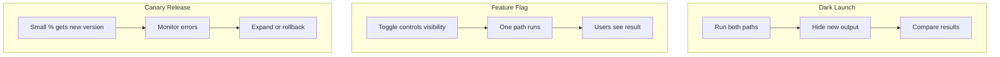
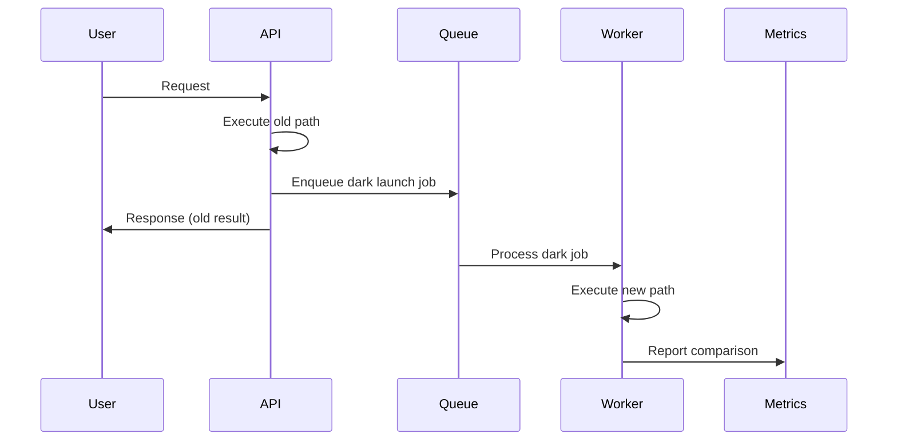
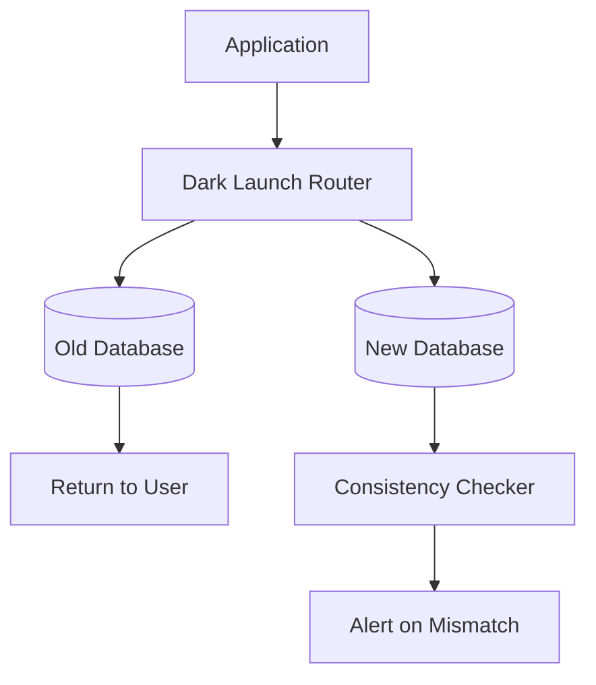
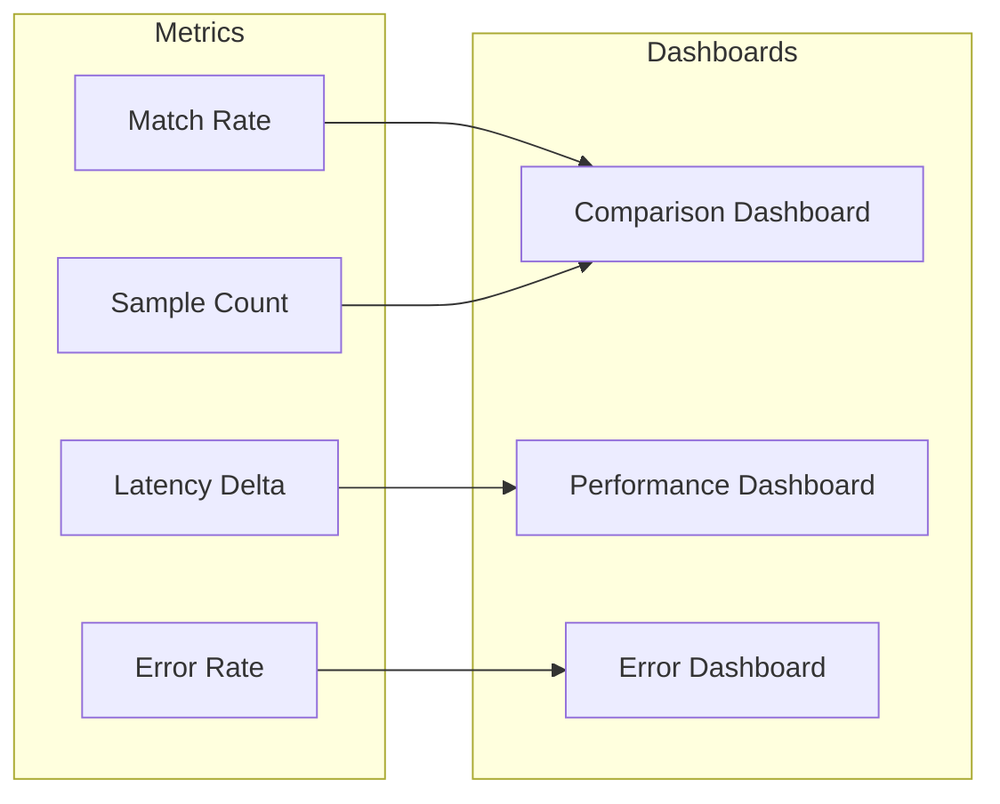
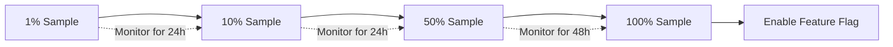

# How to Implement Dark Launch Patterns

Author: [nawazdhandala](https://github.com/nawazdhandala)

Tags: DevOps, Dark Launch, Feature Flags, Testing

Description: Learn to implement dark launch patterns for testing features in production invisibly.

---

Dark launching lets you deploy new features to production without exposing them to users. The feature runs in the background, processing real traffic, but its output stays hidden. You get production-grade validation without the risk of breaking user experience.

## What Is a Dark Launch?

A dark launch routes production traffic through new code paths while hiding the results from users. The old code path still serves responses. The new code runs in shadow mode, collecting metrics and logs without affecting what users see.

```mermaid
flowchart LR
    User[User Request] --> Router[Traffic Router]
    Router --> OldPath[Old Code Path]
    Router --> NewPath[New Code Path]
    OldPath --> Response[User Response]
    NewPath --> Metrics[Metrics & Logs]

    style NewPath fill:#333,stroke:#666
    style Metrics fill:#333,stroke:#666
```



This approach lets you:
- Test new code with real production traffic
- Compare performance between old and new implementations
- Catch bugs before users experience them
- Build confidence in your deployment

## Dark Launch vs Feature Flags vs Canary

These three patterns solve different problems.



**Dark Launch**: Both code paths execute. New output is discarded. Zero user impact during testing.

**Feature Flag**: Only one code path executes based on the flag state. Users see the result.

**Canary Release**: A subset of users gets the new version. They experience the new behavior.

Use dark launches when you need to validate correctness before any user exposure.

## Basic Implementation Pattern

Start with a simple router that executes both paths and compares results.

The following class wraps both implementations and runs them in parallel. It returns the old result while logging differences.

```typescript
// dark-launch-router.ts
interface DarkLaunchConfig {
  enabled: boolean;
  sampleRate: number; // 0.0 to 1.0
  logDifferences: boolean;
}

class DarkLaunchRouter<T> {
  private config: DarkLaunchConfig;
  private metrics: MetricsClient;

  constructor(config: DarkLaunchConfig, metrics: MetricsClient) {
    this.config = config;
    this.metrics = metrics;
  }

  // Execute both paths, return old result, log differences
  async execute(
    oldPath: () => Promise<T>,
    newPath: () => Promise<T>,
    context: Record<string, string>
  ): Promise<T> {
    // Always run the old path first
    const oldResult = await oldPath();

    // Check if dark launch is enabled and passes sampling
    if (!this.config.enabled || Math.random() > this.config.sampleRate) {
      return oldResult;
    }

    // Run new path in background without blocking response
    this.runDarkPath(newPath, oldResult, context);

    return oldResult;
  }

  private async runDarkPath(
    newPath: () => Promise<T>,
    oldResult: T,
    context: Record<string, string>
  ): Promise<void> {
    const startTime = Date.now();

    try {
      const newResult = await newPath();
      const duration = Date.now() - startTime;

      // Record performance metrics
      this.metrics.histogram('dark_launch.duration_ms', duration, context);

      // Compare results
      const match = this.compareResults(oldResult, newResult);
      this.metrics.increment('dark_launch.comparison', {
        ...context,
        match: String(match)
      });

      // Log differences for debugging
      if (!match && this.config.logDifferences) {
        console.log('Dark launch mismatch', {
          context,
          oldResult,
          newResult
        });
      }
    } catch (error) {
      // Never let dark path errors affect the main flow
      this.metrics.increment('dark_launch.error', context);
      console.error('Dark launch error', { context, error });
    }
  }

  private compareResults(old: T, newResult: T): boolean {
    return JSON.stringify(old) === JSON.stringify(newResult);
  }
}
```

## Using the Dark Launch Router

Here is how you integrate the router into an existing service. The search service runs both the old and new implementations for each request.

```typescript
// search-service.ts
class SearchService {
  private darkLaunch: DarkLaunchRouter<SearchResult[]>;
  private oldSearchEngine: OldSearchEngine;
  private newSearchEngine: NewSearchEngine;

  constructor() {
    this.darkLaunch = new DarkLaunchRouter(
      {
        enabled: true,
        sampleRate: 0.1, // Test 10% of traffic
        logDifferences: true
      },
      new MetricsClient()
    );
  }

  async search(query: string, userId: string): Promise<SearchResult[]> {
    return this.darkLaunch.execute(
      // Old path: what users currently see
      () => this.oldSearchEngine.search(query),

      // New path: what we are testing
      () => this.newSearchEngine.search(query),

      // Context for metrics and logging
      { operation: 'search', userId }
    );
  }
}
```

## Async Processing for Heavy Operations

For operations that are expensive, run the dark path asynchronously using a message queue. This prevents the dark launch from slowing down responses.



The queue-based approach ensures that even slow new implementations do not affect user latency.

```typescript
// async-dark-launch.ts
class AsyncDarkLaunch {
  private queue: JobQueue;
  private config: DarkLaunchConfig;

  async execute<T>(
    oldPath: () => Promise<T>,
    newPathJobData: Record<string, unknown>,
    context: Record<string, string>
  ): Promise<T> {
    // Run old path and capture result
    const oldResult = await oldPath();

    // Enqueue new path for async processing
    if (this.config.enabled && Math.random() <= this.config.sampleRate) {
      await this.queue.add('dark-launch', {
        jobData: newPathJobData,
        oldResult,
        context,
        enqueuedAt: Date.now()
      });
    }

    return oldResult;
  }
}

// worker.ts - processes dark launch jobs
class DarkLaunchWorker {
  async process(job: DarkLaunchJob): Promise<void> {
    const { jobData, oldResult, context, enqueuedAt } = job;

    // Track queue delay
    const queueDelay = Date.now() - enqueuedAt;
    metrics.histogram('dark_launch.queue_delay_ms', queueDelay, context);

    const startTime = Date.now();
    const newResult = await this.executeNewPath(jobData);
    const duration = Date.now() - startTime;

    metrics.histogram('dark_launch.duration_ms', duration, context);

    const match = this.compare(oldResult, newResult);
    metrics.increment('dark_launch.comparison', {
      ...context,
      match: String(match)
    });
  }
}
```

## Database Migration Dark Launch

Dark launches shine during database migrations. You can write to both databases and verify consistency without risking data loss.



The following pattern writes to both databases but only reads from the old one during the testing phase.

```typescript
// database-dark-launch.ts
class DatabaseDarkLaunch {
  private oldDb: Database;
  private newDb: Database;
  private metrics: MetricsClient;

  // Write to both databases, return old result
  async write(operation: string, data: Record<string, unknown>): Promise<void> {
    // Primary write to old database
    await this.oldDb.write(operation, data);

    // Shadow write to new database
    try {
      await this.newDb.write(operation, data);
      this.metrics.increment('dark_launch.db_write.success', { operation });
    } catch (error) {
      this.metrics.increment('dark_launch.db_write.error', { operation });
      console.error('New database write failed', { operation, error });
    }
  }

  // Read from old database, verify new database matches
  async read(query: string): Promise<unknown> {
    const oldResult = await this.oldDb.read(query);

    // Shadow read for comparison
    setImmediate(async () => {
      try {
        const newResult = await this.newDb.read(query);
        const match = this.deepCompare(oldResult, newResult);

        this.metrics.increment('dark_launch.db_read.comparison', {
          match: String(match)
        });

        if (!match) {
          console.warn('Database read mismatch', {
            query,
            oldResult,
            newResult
          });
        }
      } catch (error) {
        this.metrics.increment('dark_launch.db_read.error');
      }
    });

    return oldResult;
  }

  private deepCompare(a: unknown, b: unknown): boolean {
    return JSON.stringify(a) === JSON.stringify(b);
  }
}
```

## Monitoring Your Dark Launch

Track these metrics to evaluate your dark launch.



Build a metrics collector that tracks all the signals you need for a go/no-go decision.

```typescript
// dark-launch-metrics.ts
class DarkLaunchMetrics {
  private client: MetricsClient;

  // Track result comparison
  recordComparison(match: boolean, context: Record<string, string>): void {
    this.client.increment('dark_launch.comparison.total', context);
    if (match) {
      this.client.increment('dark_launch.comparison.match', context);
    } else {
      this.client.increment('dark_launch.comparison.mismatch', context);
    }
  }

  // Track latency difference
  recordLatency(
    oldDuration: number,
    newDuration: number,
    context: Record<string, string>
  ): void {
    this.client.histogram('dark_launch.latency.old_ms', oldDuration, context);
    this.client.histogram('dark_launch.latency.new_ms', newDuration, context);
    this.client.histogram(
      'dark_launch.latency.delta_ms',
      newDuration - oldDuration,
      context
    );
  }

  // Track errors in new path
  recordError(error: Error, context: Record<string, string>): void {
    this.client.increment('dark_launch.error', {
      ...context,
      errorType: error.name
    });
  }
}
```

## Progressive Dark Launch Strategy

Start with a small sample and increase as confidence grows.



Configure sample rates through environment variables or a config service.

```typescript
// progressive-config.ts
interface ProgressiveConfig {
  phases: Array<{
    sampleRate: number;
    durationHours: number;
    successCriteria: {
      minMatchRate: number;
      maxErrorRate: number;
      maxLatencyDeltaMs: number;
    };
  }>;
}

const darkLaunchConfig: ProgressiveConfig = {
  phases: [
    {
      sampleRate: 0.01,
      durationHours: 24,
      successCriteria: {
        minMatchRate: 0.99,
        maxErrorRate: 0.001,
        maxLatencyDeltaMs: 50
      }
    },
    {
      sampleRate: 0.10,
      durationHours: 24,
      successCriteria: {
        minMatchRate: 0.99,
        maxErrorRate: 0.001,
        maxLatencyDeltaMs: 50
      }
    },
    {
      sampleRate: 0.50,
      durationHours: 48,
      successCriteria: {
        minMatchRate: 0.999,
        maxErrorRate: 0.0001,
        maxLatencyDeltaMs: 20
      }
    }
  ]
};
```

## Best Practices

**Isolate dark path failures**: Never let errors in the new code affect the user response. Wrap everything in try/catch.

**Set timeouts**: Add timeouts to prevent slow new implementations from consuming resources.

**Use sampling wisely**: Start low (1%) and increase gradually. High sample rates multiply your compute costs.

**Compare semantically**: Simple JSON comparison misses equivalent but differently ordered results. Build domain-specific comparators.

**Clean up**: Remove dark launch code after the feature is fully rolled out. Dead code adds complexity.

**Monitor resource usage**: Dark launches double compute for sampled traffic. Watch CPU, memory, and database connections.

---

Dark launching gives you production confidence without production risk. Start with a basic router, add metrics, and gradually increase coverage. When your match rate hits 99.9% and latency stays flat, you know the new code is ready for real users.

*Want to monitor your dark launches with real-time metrics and alerting? [OneUptime](https://oneuptime.com) provides full observability for your feature rollouts.*
