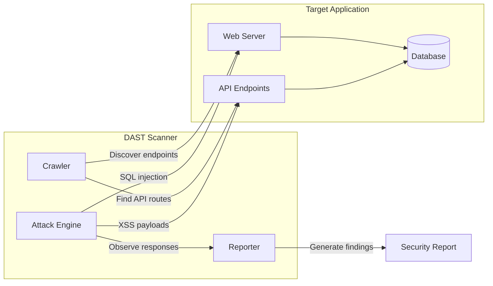
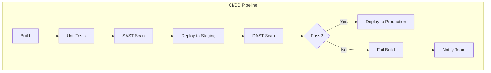
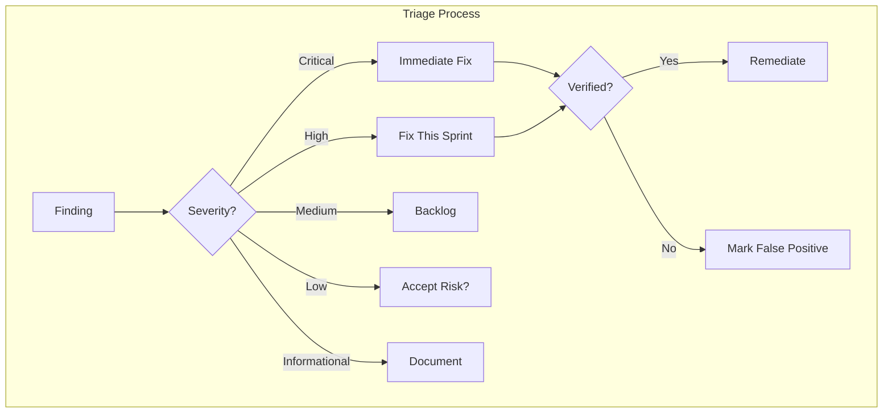

# How to Build DAST Integration

Author: [nawazdhandala](https://github.com/nawazdhandala)

Tags: Testing, Security, DAST, DevSecOps

Description: A practical guide to integrating Dynamic Application Security Testing into your CI/CD pipeline for automated vulnerability detection.

---

Static analysis catches bugs in code. Dynamic Application Security Testing (DAST) catches bugs in running applications. It simulates real attacks against your deployed services, finding vulnerabilities that only appear at runtime.

## What DAST Actually Does

DAST tools crawl your application like a malicious actor would. They probe endpoints, inject payloads, and observe responses. Unlike SAST which reads source code, DAST treats your app as a black box.



## DAST in the CI/CD Pipeline

The best time to run DAST is after deployment to a staging environment but before production release.



## Setting Up OWASP ZAP

OWASP ZAP is the most popular open-source DAST tool. Here is how to configure it for automated scanning.

### Docker-Based ZAP Setup

```yaml
# docker-compose.yml for ZAP
# This sets up ZAP in daemon mode for API-driven scanning
version: '3.8'
services:
  zap:
    image: ghcr.io/zaproxy/zaproxy:stable
    command: zap.sh -daemon -host 0.0.0.0 -port 8080 -config api.addrs.addr.name=.* -config api.addrs.addr.regex=true -config api.disablekey=true
    ports:
      - "8080:8080"
    volumes:
      # Mount directory for scan reports
      - ./zap-reports:/zap/wrk
    networks:
      - scan-network

  # Your application under test
  app:
    image: your-app:latest
    ports:
      - "3000:3000"
    networks:
      - scan-network

networks:
  scan-network:
    driver: bridge
```

### ZAP Configuration File

```yaml
# zap-config.yaml
# Automation framework configuration for ZAP
env:
  contexts:
    - name: "webapp-context"
      urls:
        - "https://staging.yourapp.com"
      includePaths:
        - "https://staging.yourapp.com/.*"
      excludePaths:
        # Exclude logout to maintain session
        - "https://staging.yourapp.com/logout"
        - "https://staging.yourapp.com/api/health"
      authentication:
        method: "form"
        parameters:
          loginUrl: "https://staging.yourapp.com/login"
          loginRequestData: "username=&password="
        verification:
          method: "response"
          loggedInRegex: "\\QWelcome\\E"
          loggedOutRegex: "\\QPlease login\\E"
      sessionManagement:
        method: "cookie"
      users:
        - name: "test-user"
          credentials:
            username: "${ZAP_AUTH_USER}"
            password: "${ZAP_AUTH_PASS}"

jobs:
  # Spider the application to discover endpoints
  - type: spider
    parameters:
      context: "webapp-context"
      user: "test-user"
      maxDuration: 10
      maxDepth: 10

  # AJAX spider for JavaScript-heavy apps
  - type: spiderAjax
    parameters:
      context: "webapp-context"
      user: "test-user"
      maxDuration: 10
      maxCrawlDepth: 5

  # Active scan with attack payloads
  - type: activeScan
    parameters:
      context: "webapp-context"
      user: "test-user"
      maxRuleDurationInMins: 5
      maxScanDurationInMins: 30

  # Generate reports
  - type: report
    parameters:
      template: "traditional-html"
      reportDir: "/zap/wrk"
      reportFile: "zap-report.html"

  - type: report
    parameters:
      template: "sarif-json"
      reportDir: "/zap/wrk"
      reportFile: "zap-report.sarif"
```

### Running ZAP from Command Line

```bash
#!/bin/bash
# run-zap-scan.sh
# Script to execute ZAP scan against target application

set -e

TARGET_URL="${TARGET_URL:-https://staging.yourapp.com}"
REPORT_DIR="${REPORT_DIR:-./reports}"

# Create reports directory
mkdir -p "$REPORT_DIR"

# Run ZAP full scan
# -t: target URL
# -r: HTML report output
# -J: JSON report output
# -I: don't fail on warnings, only errors
docker run --rm \
  -v "$(pwd)/$REPORT_DIR:/zap/wrk:rw" \
  -t ghcr.io/zaproxy/zaproxy:stable \
  zap-full-scan.py \
    -t "$TARGET_URL" \
    -r zap-report.html \
    -J zap-report.json \
    -I

echo "Scan complete. Reports saved to $REPORT_DIR"
```

## Setting Up Burp Suite for CI/CD

Burp Suite Professional includes an enterprise scanner suitable for automation.

### Burp REST API Integration

```python
# burp_scanner.py
# Python client for Burp Suite Enterprise REST API

import requests
import time
import os
from typing import Optional

class BurpScanner:
    """
    Client for Burp Suite Enterprise API.
    Handles scan creation, monitoring, and report retrieval.
    """

    def __init__(self, api_url: str, api_key: str):
        self.api_url = api_url.rstrip('/')
        self.headers = {
            'Authorization': f'Bearer {api_key}',
            'Content-Type': 'application/json'
        }

    def create_scan(self, target_url: str, scan_config: str = 'default') -> str:
        """
        Start a new scan against the target URL.
        Returns the scan ID for tracking.
        """
        payload = {
            'scan_configurations': [{'name': scan_config}],
            'urls': [target_url]
        }

        response = requests.post(
            f'{self.api_url}/v0.1/scan',
            headers=self.headers,
            json=payload
        )
        response.raise_for_status()

        scan_id = response.headers.get('Location', '').split('/')[-1]
        return scan_id

    def get_scan_status(self, scan_id: str) -> dict:
        """
        Check the current status of a scan.
        Returns status object with progress information.
        """
        response = requests.get(
            f'{self.api_url}/v0.1/scan/{scan_id}',
            headers=self.headers
        )
        response.raise_for_status()
        return response.json()

    def wait_for_completion(
        self,
        scan_id: str,
        timeout_minutes: int = 60,
        poll_interval: int = 30
    ) -> dict:
        """
        Block until scan completes or timeout is reached.
        Raises TimeoutError if scan takes too long.
        """
        start_time = time.time()
        timeout_seconds = timeout_minutes * 60

        while True:
            status = self.get_scan_status(scan_id)
            scan_status = status.get('scan_status', '')

            if scan_status in ['succeeded', 'failed', 'cancelled']:
                return status

            elapsed = time.time() - start_time
            if elapsed > timeout_seconds:
                raise TimeoutError(
                    f'Scan {scan_id} did not complete within {timeout_minutes} minutes'
                )

            print(f'Scan in progress: {scan_status}. Waiting {poll_interval}s...')
            time.sleep(poll_interval)

    def get_issues(self, scan_id: str) -> list:
        """
        Retrieve all issues found during the scan.
        Returns list of vulnerability findings.
        """
        response = requests.get(
            f'{self.api_url}/v0.1/scan/{scan_id}/issues',
            headers=self.headers
        )
        response.raise_for_status()
        return response.json().get('issues', [])


def main():
    """
    Example usage of BurpScanner for CI/CD integration.
    """
    # Load configuration from environment
    api_url = os.environ['BURP_API_URL']
    api_key = os.environ['BURP_API_KEY']
    target = os.environ['SCAN_TARGET_URL']

    scanner = BurpScanner(api_url, api_key)

    # Start scan
    print(f'Starting scan of {target}')
    scan_id = scanner.create_scan(target)
    print(f'Scan ID: {scan_id}')

    # Wait for completion
    result = scanner.wait_for_completion(scan_id, timeout_minutes=45)
    print(f'Scan completed with status: {result.get("scan_status")}')

    # Check for high severity issues
    issues = scanner.get_issues(scan_id)
    high_severity = [i for i in issues if i.get('severity') == 'high']

    if high_severity:
        print(f'Found {len(high_severity)} high severity issues!')
        for issue in high_severity:
            print(f'  - {issue.get("name")}: {issue.get("path")}')
        exit(1)

    print('No high severity issues found')
    exit(0)


if __name__ == '__main__':
    main()
```

## API Scanning Setup

Modern applications are API-first. DAST tools need API specifications to scan effectively.

### OpenAPI-Based Scanning with ZAP

```yaml
# zap-api-scan-config.yaml
# Configuration for scanning APIs using OpenAPI specification

env:
  contexts:
    - name: "api-context"
      urls:
        - "https://api.yourapp.com"
      includePaths:
        - "https://api.yourapp.com/v1/.*"
      authentication:
        method: "http"
        parameters:
          hostname: "api.yourapp.com"
          realm: ""
        verification:
          method: "response"
          loggedInRegex: ".*"
          loggedOutRegex: "\\Q401\\E"
      users:
        - name: "api-user"
          credentials:
            username: "${API_KEY}"
            password: ""

jobs:
  # Import OpenAPI specification
  - type: openapi
    parameters:
      apiUrl: "https://api.yourapp.com/openapi.json"
      context: "api-context"

  # Scan all discovered endpoints
  - type: activeScan
    parameters:
      context: "api-context"
      user: "api-user"
      policy: "API-Scan"
      maxRuleDurationInMins: 5

  # Output in SARIF format for GitHub integration
  - type: report
    parameters:
      template: "sarif-json"
      reportDir: "/zap/wrk"
      reportFile: "api-scan.sarif"
```

### GraphQL API Scanning

```python
# graphql_scanner.py
# DAST scanner for GraphQL APIs using introspection

import requests
import json
from typing import List, Dict

class GraphQLScanner:
    """
    Scanner for GraphQL APIs.
    Uses introspection to discover schema and test queries.
    """

    def __init__(self, endpoint: str, headers: Dict[str, str] = None):
        self.endpoint = endpoint
        self.headers = headers or {}
        self.headers['Content-Type'] = 'application/json'

    def get_schema(self) -> dict:
        """
        Fetch GraphQL schema using introspection query.
        Returns the full type system.
        """
        introspection_query = {
            'query': '''
                query IntrospectionQuery {
                    __schema {
                        types {
                            name
                            fields {
                                name
                                args {
                                    name
                                    type { name kind }
                                }
                            }
                        }
                        queryType { name }
                        mutationType { name }
                    }
                }
            '''
        }

        response = requests.post(
            self.endpoint,
            headers=self.headers,
            json=introspection_query
        )
        response.raise_for_status()
        return response.json()

    def test_injection(self, field_name: str, arg_name: str) -> List[dict]:
        """
        Test a field argument for injection vulnerabilities.
        Returns list of findings if any.
        """
        findings = []

        # SQL injection payloads
        sql_payloads = [
            "' OR '1'='1",
            "1; DROP TABLE users--",
            "1 UNION SELECT * FROM users--"
        ]

        for payload in sql_payloads:
            query = {
                'query': f'''
                    query {{
                        {field_name}({arg_name}: "{payload}") {{
                            id
                        }}
                    }}
                '''
            }

            try:
                response = requests.post(
                    self.endpoint,
                    headers=self.headers,
                    json=query,
                    timeout=10
                )

                # Check for SQL error messages in response
                response_text = response.text.lower()
                if any(indicator in response_text for indicator in [
                    'sql', 'syntax error', 'mysql', 'postgresql', 'sqlite'
                ]):
                    findings.append({
                        'type': 'SQL Injection',
                        'field': field_name,
                        'argument': arg_name,
                        'payload': payload,
                        'evidence': response.text[:500]
                    })
            except requests.Timeout:
                # Timeout might indicate blind SQL injection
                findings.append({
                    'type': 'Potential Blind SQL Injection',
                    'field': field_name,
                    'argument': arg_name,
                    'payload': payload,
                    'evidence': 'Request timed out'
                })

        return findings

    def scan_all_fields(self) -> List[dict]:
        """
        Scan all queryable fields for vulnerabilities.
        Returns consolidated list of findings.
        """
        schema = self.get_schema()
        all_findings = []

        types = schema.get('data', {}).get('__schema', {}).get('types', [])
        query_type = schema.get('data', {}).get('__schema', {}).get('queryType', {}).get('name')

        for type_def in types:
            if type_def.get('name') == query_type:
                fields = type_def.get('fields', [])
                for field in fields:
                    field_name = field.get('name')
                    for arg in field.get('args', []):
                        arg_name = arg.get('name')
                        arg_type = arg.get('type', {}).get('name', '')

                        # Test string arguments for injection
                        if arg_type in ['String', 'ID']:
                            findings = self.test_injection(field_name, arg_name)
                            all_findings.extend(findings)

        return all_findings
```

## Authentication Handling

Most applications require authentication. Here is how to configure DAST tools for authenticated scanning.

### Form-Based Authentication

```yaml
# zap-form-auth.yaml
# ZAP configuration for form-based login

env:
  contexts:
    - name: "authenticated-app"
      urls:
        - "https://app.example.com"
      authentication:
        method: "form"
        parameters:
          # The login page URL
          loginUrl: "https://app.example.com/login"
          # POST data format with placeholders
          loginRequestData: "email=&password=&csrf_token="
        verification:
          method: "response"
          # Regex to detect successful login
          loggedInRegex: "\\QDashboard\\E"
          # Regex to detect logged out state
          loggedOutRegex: "\\QSign In\\E"
      sessionManagement:
        method: "cookie"
        parameters:
          # Cookie name that maintains session
          cookieName: "session_id"
      users:
        - name: "test-user"
          credentials:
            username: "${DAST_USERNAME}"
            password: "${DAST_PASSWORD}"
```

### Token-Based Authentication (JWT)

```python
# jwt_auth_handler.py
# Handle JWT authentication for DAST scans

import requests
import os
from datetime import datetime, timedelta

class JWTAuthHandler:
    """
    Manages JWT token lifecycle for DAST scanning.
    Handles token acquisition and refresh.
    """

    def __init__(self, auth_endpoint: str, client_id: str, client_secret: str):
        self.auth_endpoint = auth_endpoint
        self.client_id = client_id
        self.client_secret = client_secret
        self.token = None
        self.token_expiry = None

    def get_token(self) -> str:
        """
        Get valid JWT token, refreshing if necessary.
        """
        if self.token and self.token_expiry and datetime.now() < self.token_expiry:
            return self.token

        return self._fetch_new_token()

    def _fetch_new_token(self) -> str:
        """
        Request new token from auth endpoint.
        """
        response = requests.post(
            self.auth_endpoint,
            data={
                'grant_type': 'client_credentials',
                'client_id': self.client_id,
                'client_secret': self.client_secret
            }
        )
        response.raise_for_status()

        data = response.json()
        self.token = data['access_token']

        # Set expiry with 5 minute buffer
        expires_in = data.get('expires_in', 3600)
        self.token_expiry = datetime.now() + timedelta(seconds=expires_in - 300)

        return self.token

    def get_zap_replacer_config(self) -> dict:
        """
        Generate ZAP replacer rule for injecting token.
        """
        token = self.get_token()
        return {
            'description': 'Add JWT Bearer Token',
            'enabled': True,
            'matchType': 'REQ_HEADER',
            'matchRegex': False,
            'matchString': 'Authorization',
            'replacement': f'Bearer {token}',
            'initiators': []
        }


def setup_zap_auth():
    """
    Configure ZAP to use JWT authentication.
    """
    auth_handler = JWTAuthHandler(
        auth_endpoint=os.environ['AUTH_ENDPOINT'],
        client_id=os.environ['CLIENT_ID'],
        client_secret=os.environ['CLIENT_SECRET']
    )

    # Get ZAP API URL
    zap_api = os.environ.get('ZAP_API_URL', 'http://localhost:8080')

    # Configure replacer rule
    config = auth_handler.get_zap_replacer_config()

    response = requests.get(
        f'{zap_api}/JSON/replacer/action/addRule/',
        params={
            'description': config['description'],
            'enabled': str(config['enabled']).lower(),
            'matchType': config['matchType'],
            'matchRegex': str(config['matchRegex']).lower(),
            'matchString': config['matchString'],
            'replacement': config['replacement']
        }
    )
    response.raise_for_status()
    print('JWT authentication configured in ZAP')
```

### OAuth 2.0 Flow

```yaml
# zap-oauth-config.yaml
# Configuration for OAuth 2.0 authenticated scanning

env:
  contexts:
    - name: "oauth-app"
      urls:
        - "https://app.example.com"
      authentication:
        method: "script"
        parameters:
          # Use custom script for OAuth flow
          scriptName: "oauth2-auth.js"
          scriptEngine: "ECMAScript"
      sessionManagement:
        method: "httpAuth"
      users:
        - name: "oauth-user"
          credentials:
            client_id: "${OAUTH_CLIENT_ID}"
            client_secret: "${OAUTH_CLIENT_SECRET}"
            token_url: "https://auth.example.com/oauth/token"

scripts:
  - name: "oauth2-auth.js"
    type: "authentication"
    engine: "ECMAScript"
    file: "/zap/scripts/oauth2-auth.js"
```

```javascript
// oauth2-auth.js
// ZAP authentication script for OAuth 2.0 client credentials flow

function authenticate(helper, paramsValues, credentials) {
    // Extract credentials from ZAP configuration
    var clientId = credentials.getParam("client_id");
    var clientSecret = credentials.getParam("client_secret");
    var tokenUrl = credentials.getParam("token_url");

    // Build token request
    var tokenRequest = helper.prepareMessage();
    tokenRequest.setRequestHeader(
        new org.parosproxy.paros.network.HttpRequestHeader(
            org.parosproxy.paros.network.HttpRequestHeader.POST,
            new java.net.URI(tokenUrl, false),
            "HTTP/1.1"
        )
    );

    // Set request body for client credentials grant
    var body = "grant_type=client_credentials" +
               "&client_id=" + encodeURIComponent(clientId) +
               "&client_secret=" + encodeURIComponent(clientSecret);

    tokenRequest.setRequestBody(body);
    tokenRequest.getRequestHeader().setHeader("Content-Type", "application/x-www-form-urlencoded");

    // Send token request
    helper.sendAndReceive(tokenRequest, false);

    // Parse response to get access token
    var response = JSON.parse(tokenRequest.getResponseBody().toString());
    var accessToken = response.access_token;

    // Return token for ZAP to use in subsequent requests
    return accessToken;
}

function getRequiredParamsNames() {
    return ["client_id", "client_secret", "token_url"];
}

function getCredentialsParamsNames() {
    return ["client_id", "client_secret", "token_url"];
}
```

## GitHub Actions Integration

```yaml
# .github/workflows/dast-scan.yml
# Complete DAST scanning workflow for GitHub Actions

name: DAST Security Scan

on:
  push:
    branches: [main]
  pull_request:
    branches: [main]
  schedule:
    # Run weekly full scan
    - cron: '0 2 * * 0'

jobs:
  deploy-staging:
    runs-on: ubuntu-latest
    outputs:
      staging_url: ${{ steps.deploy.outputs.url }}
    steps:
      - uses: actions/checkout@v4

      - name: Deploy to staging
        id: deploy
        run: |
          # Your deployment script here
          echo "url=https://staging-${{ github.sha }}.example.com" >> $GITHUB_OUTPUT

  dast-scan:
    needs: deploy-staging
    runs-on: ubuntu-latest
    steps:
      - uses: actions/checkout@v4

      - name: Wait for staging to be ready
        run: |
          # Poll until staging responds
          for i in {1..30}; do
            if curl -s -o /dev/null -w "%{http_code}" "${{ needs.deploy-staging.outputs.staging_url }}/health" | grep -q "200"; then
              echo "Staging is ready"
              exit 0
            fi
            echo "Waiting for staging... attempt $i"
            sleep 10
          done
          echo "Staging did not become ready"
          exit 1

      - name: Run ZAP Baseline Scan
        uses: zaproxy/action-baseline@v0.12.0
        with:
          target: ${{ needs.deploy-staging.outputs.staging_url }}
          rules_file_name: '.zap/rules.tsv'
          cmd_options: '-a'

      - name: Run ZAP Full Scan
        if: github.event_name == 'schedule'
        uses: zaproxy/action-full-scan@v0.10.0
        with:
          target: ${{ needs.deploy-staging.outputs.staging_url }}
          rules_file_name: '.zap/rules.tsv'

      - name: Run ZAP API Scan
        uses: zaproxy/action-api-scan@v0.7.0
        with:
          target: ${{ needs.deploy-staging.outputs.staging_url }}/openapi.json
          format: openapi

      - name: Upload SARIF results
        uses: github/codeql-action/upload-sarif@v3
        with:
          sarif_file: results.sarif
        if: always()

      - name: Check for high severity findings
        run: |
          # Parse ZAP report and fail if high severity issues found
          HIGH_COUNT=$(jq '[.runs[].results[] | select(.level == "error")] | length' results.sarif)
          if [ "$HIGH_COUNT" -gt 0 ]; then
            echo "Found $HIGH_COUNT high severity vulnerabilities!"
            jq '.runs[].results[] | select(.level == "error") | .message.text' results.sarif
            exit 1
          fi
          echo "No high severity vulnerabilities found"
```

### GitLab CI Integration

```yaml
# .gitlab-ci.yml
# DAST scanning in GitLab CI/CD

stages:
  - build
  - deploy
  - dast
  - report

variables:
  STAGING_URL: "https://staging.example.com"

deploy_staging:
  stage: deploy
  script:
    - ./deploy-staging.sh
  environment:
    name: staging
    url: $STAGING_URL

dast_scan:
  stage: dast
  image: ghcr.io/zaproxy/zaproxy:stable
  needs:
    - deploy_staging
  script:
    # Run ZAP scan with automation framework
    - |
      zap.sh -cmd -autorun /zap/wrk/zap-config.yaml \
        -config replacer.full_list\(0\).description="Auth Token" \
        -config replacer.full_list\(0\).enabled=true \
        -config replacer.full_list\(0\).matchtype=REQ_HEADER \
        -config replacer.full_list\(0\).matchstr=Authorization \
        -config replacer.full_list\(0\).replacement="Bearer ${DAST_AUTH_TOKEN}"
  artifacts:
    paths:
      - zap-report.html
      - zap-report.sarif
    reports:
      sast: zap-report.sarif
    when: always
  rules:
    - if: $CI_PIPELINE_SOURCE == "merge_request_event"
    - if: $CI_COMMIT_BRANCH == $CI_DEFAULT_BRANCH

process_results:
  stage: report
  needs:
    - dast_scan
  script:
    # Parse results and create issues for findings
    - |
      python3 << 'EOF'
      import json
      import os
      import requests

      with open('zap-report.sarif') as f:
          sarif = json.load(f)

      findings = sarif.get('runs', [{}])[0].get('results', [])
      high_severity = [f for f in findings if f.get('level') == 'error']

      if high_severity:
          # Create GitLab issue for each finding
          for finding in high_severity[:5]:  # Limit to 5 issues
              requests.post(
                  f"{os.environ['CI_API_V4_URL']}/projects/{os.environ['CI_PROJECT_ID']}/issues",
                  headers={'PRIVATE-TOKEN': os.environ['GITLAB_TOKEN']},
                  json={
                      'title': f"[DAST] {finding['ruleId']}",
                      'description': finding['message']['text'],
                      'labels': 'security,dast'
                  }
              )
          exit(1)
      EOF
  rules:
    - if: $CI_COMMIT_BRANCH == $CI_DEFAULT_BRANCH
```

## Results Triage and Remediation

DAST tools generate many findings. Here is how to triage effectively.

### Severity Classification



### False Positive Management

```python
# false_positive_manager.py
# Track and filter known false positives from DAST results

import json
import hashlib
from typing import List, Dict
from pathlib import Path

class FalsePositiveManager:
    """
    Manages false positive findings across DAST scans.
    Stores fingerprints of confirmed false positives.
    """

    def __init__(self, fp_file: str = '.dast-false-positives.json'):
        self.fp_file = Path(fp_file)
        self.false_positives = self._load_false_positives()

    def _load_false_positives(self) -> Dict[str, dict]:
        """Load existing false positive database."""
        if self.fp_file.exists():
            with open(self.fp_file) as f:
                return json.load(f)
        return {}

    def _save_false_positives(self):
        """Persist false positive database."""
        with open(self.fp_file, 'w') as f:
            json.dump(self.false_positives, f, indent=2)

    def _generate_fingerprint(self, finding: dict) -> str:
        """
        Create unique fingerprint for a finding.
        Based on rule, path, and parameter.
        """
        key_parts = [
            finding.get('ruleId', ''),
            finding.get('locations', [{}])[0].get('physicalLocation', {}).get('artifactLocation', {}).get('uri', ''),
            finding.get('locations', [{}])[0].get('physicalLocation', {}).get('region', {}).get('snippet', {}).get('text', '')
        ]
        key_string = '|'.join(key_parts)
        return hashlib.sha256(key_string.encode()).hexdigest()[:16]

    def mark_false_positive(self, finding: dict, reason: str, reviewer: str):
        """
        Mark a finding as false positive with justification.
        """
        fingerprint = self._generate_fingerprint(finding)
        self.false_positives[fingerprint] = {
            'rule_id': finding.get('ruleId'),
            'reason': reason,
            'reviewer': reviewer,
            'date': str(datetime.now().date()),
            'original_finding': finding
        }
        self._save_false_positives()

    def filter_findings(self, findings: List[dict]) -> List[dict]:
        """
        Remove known false positives from findings list.
        Returns only actionable findings.
        """
        filtered = []
        for finding in findings:
            fingerprint = self._generate_fingerprint(finding)
            if fingerprint not in self.false_positives:
                filtered.append(finding)
        return filtered

    def get_suppression_report(self) -> str:
        """
        Generate report of all suppressed findings for audit.
        """
        report_lines = ['# DAST False Positive Report', '']
        for fp_id, fp_data in self.false_positives.items():
            report_lines.extend([
                f"## {fp_data['rule_id']}",
                f"- **Fingerprint**: {fp_id}",
                f"- **Reason**: {fp_data['reason']}",
                f"- **Reviewed by**: {fp_data['reviewer']}",
                f"- **Date**: {fp_data['date']}",
                ''
            ])
        return '\n'.join(report_lines)


def process_sarif_results(sarif_path: str, output_path: str):
    """
    Process SARIF results, filtering false positives.
    """
    fp_manager = FalsePositiveManager()

    with open(sarif_path) as f:
        sarif = json.load(f)

    # Filter each run's results
    for run in sarif.get('runs', []):
        original_count = len(run.get('results', []))
        run['results'] = fp_manager.filter_findings(run.get('results', []))
        filtered_count = len(run['results'])
        print(f"Filtered {original_count - filtered_count} false positives")

    # Write filtered results
    with open(output_path, 'w') as f:
        json.dump(sarif, f, indent=2)

    return sarif
```

### Remediation Tracking

```yaml
# .dast-remediation.yaml
# Track remediation status for DAST findings

findings:
  - id: "10016"
    name: "Web Browser XSS Protection Not Enabled"
    status: "remediated"
    remediation:
      date: "2024-01-15"
      pr: "https://github.com/org/repo/pull/123"
      fix: "Added X-XSS-Protection header in nginx config"

  - id: "10020"
    name: "X-Frame-Options Header Not Set"
    status: "remediated"
    remediation:
      date: "2024-01-16"
      pr: "https://github.com/org/repo/pull/124"
      fix: "Added X-Frame-Options: DENY header"

  - id: "10021"
    name: "X-Content-Type-Options Header Missing"
    status: "in_progress"
    assigned_to: "security-team"
    due_date: "2024-02-01"

  - id: "90033"
    name: "Loosely Scoped Cookie"
    status: "accepted_risk"
    justification: "Cookie scope is intentional for subdomain sharing"
    approved_by: "security-lead"
    review_date: "2024-06-01"
```

## ZAP Rules Configuration

Control which checks run and their severity.

```tsv
# .zap/rules.tsv
# Tab-separated file for ZAP rule configuration
# Format: rule_id	action	name
10016	WARN	Web Browser XSS Protection Not Enabled
10017	IGNORE	Cross-Domain JavaScript Source File Inclusion
10020	FAIL	X-Frame-Options Header Not Set
10021	FAIL	X-Content-Type-Options Header Missing
10035	FAIL	Strict-Transport-Security Header Not Set
10038	WARN	Content Security Policy Header Not Set
10054	WARN	Cookie without SameSite Attribute
10055	WARN	CSP: style-src unsafe-inline
10096	WARN	Timestamp Disclosure
10098	IGNORE	Cross-Domain Misconfiguration
40012	FAIL	Cross Site Scripting (Reflected)
40014	FAIL	Cross Site Scripting (Persistent)
40016	FAIL	Cross Site Scripting (Persistent) - Prime
40017	FAIL	Cross Site Scripting (Persistent) - Spider
40018	FAIL	SQL Injection
40019	FAIL	SQL Injection - MySQL
40020	FAIL	SQL Injection - Hypersonic SQL
40021	FAIL	SQL Injection - Oracle
40022	FAIL	SQL Injection - PostgreSQL
90019	FAIL	Server Side Code Injection
90020	FAIL	Remote OS Command Injection
90021	FAIL	XPath Injection
90023	FAIL	XML External Entity Attack
```

## Complete Pipeline Example

Here is everything tied together in a production-ready configuration.

```yaml
# docker-compose.dast.yml
# Complete DAST scanning environment

version: '3.8'

services:
  # ZAP scanner in daemon mode
  zap:
    image: ghcr.io/zaproxy/zaproxy:stable
    command: >
      zap.sh -daemon
      -host 0.0.0.0
      -port 8080
      -config api.addrs.addr.name=.*
      -config api.addrs.addr.regex=true
      -config api.key=${ZAP_API_KEY}
    ports:
      - "8080:8080"
    volumes:
      - ./zap-config:/zap/wrk
      - ./zap-reports:/zap/reports
    environment:
      - ZAP_AUTH_HEADER=Authorization
      - ZAP_AUTH_HEADER_VALUE=Bearer ${DAST_TOKEN}
    networks:
      - dast-network
    healthcheck:
      test: ["CMD", "curl", "-f", "http://localhost:8080/JSON/core/view/version/"]
      interval: 10s
      timeout: 5s
      retries: 5

  # Orchestrator service
  orchestrator:
    build:
      context: ./dast-orchestrator
    environment:
      - ZAP_API_URL=http://zap:8080
      - ZAP_API_KEY=${ZAP_API_KEY}
      - TARGET_URL=${TARGET_URL}
      - SLACK_WEBHOOK=${SLACK_WEBHOOK}
    volumes:
      - ./zap-reports:/app/reports
    depends_on:
      zap:
        condition: service_healthy
    networks:
      - dast-network

networks:
  dast-network:
    driver: bridge
```

```python
# dast-orchestrator/main.py
# Main orchestration script for DAST scanning

import os
import sys
import json
import requests
import time
from datetime import datetime

class DASTOrchestrator:
    """
    Orchestrates complete DAST scanning workflow.
    Coordinates ZAP scanner, processes results, sends notifications.
    """

    def __init__(self):
        self.zap_api = os.environ['ZAP_API_URL']
        self.zap_key = os.environ['ZAP_API_KEY']
        self.target = os.environ['TARGET_URL']
        self.slack_webhook = os.environ.get('SLACK_WEBHOOK')

    def run_scan(self) -> dict:
        """
        Execute full DAST scan workflow.
        Returns scan results summary.
        """
        print(f"Starting DAST scan of {self.target}")
        start_time = datetime.now()

        # Step 1: Spider the application
        print("Phase 1: Spidering application...")
        self._run_spider()

        # Step 2: AJAX spider for JavaScript content
        print("Phase 2: AJAX spidering...")
        self._run_ajax_spider()

        # Step 3: Active scan
        print("Phase 3: Active scanning...")
        self._run_active_scan()

        # Step 4: Collect results
        print("Phase 4: Collecting results...")
        alerts = self._get_alerts()

        # Step 5: Generate reports
        print("Phase 5: Generating reports...")
        self._generate_reports()

        duration = (datetime.now() - start_time).total_seconds()

        summary = {
            'target': self.target,
            'duration_seconds': duration,
            'total_alerts': len(alerts),
            'high': len([a for a in alerts if a['risk'] == 'High']),
            'medium': len([a for a in alerts if a['risk'] == 'Medium']),
            'low': len([a for a in alerts if a['risk'] == 'Low']),
            'informational': len([a for a in alerts if a['risk'] == 'Informational'])
        }

        # Step 6: Send notifications
        if self.slack_webhook:
            self._send_slack_notification(summary)

        return summary

    def _zap_request(self, endpoint: str, params: dict = None) -> dict:
        """Make authenticated request to ZAP API."""
        params = params or {}
        params['apikey'] = self.zap_key

        response = requests.get(
            f"{self.zap_api}/JSON/{endpoint}",
            params=params
        )
        response.raise_for_status()
        return response.json()

    def _run_spider(self):
        """Run traditional spider."""
        # Start spider
        result = self._zap_request('spider/action/scan/', {
            'url': self.target,
            'maxChildren': 10
        })
        scan_id = result['scan']

        # Wait for completion
        while True:
            status = self._zap_request('spider/view/status/', {'scanId': scan_id})
            if int(status['status']) >= 100:
                break
            time.sleep(5)

    def _run_ajax_spider(self):
        """Run AJAX spider for JavaScript-heavy apps."""
        self._zap_request('ajaxSpider/action/scan/', {
            'url': self.target
        })

        # Wait for completion
        while True:
            status = self._zap_request('ajaxSpider/view/status/')
            if status['status'] == 'stopped':
                break
            time.sleep(5)

    def _run_active_scan(self):
        """Run active vulnerability scan."""
        result = self._zap_request('ascan/action/scan/', {
            'url': self.target
        })
        scan_id = result['scan']

        # Wait for completion with progress updates
        while True:
            status = self._zap_request('ascan/view/status/', {'scanId': scan_id})
            progress = int(status['status'])
            print(f"  Active scan progress: {progress}%")
            if progress >= 100:
                break
            time.sleep(30)

    def _get_alerts(self) -> list:
        """Retrieve all alerts from scan."""
        result = self._zap_request('core/view/alerts/', {
            'baseurl': self.target
        })
        return result.get('alerts', [])

    def _generate_reports(self):
        """Generate HTML and SARIF reports."""
        # HTML report
        html_report = requests.get(
            f"{self.zap_api}/OTHER/core/other/htmlreport/",
            params={'apikey': self.zap_key}
        )
        with open('/app/reports/dast-report.html', 'w') as f:
            f.write(html_report.text)

        # SARIF report for CI integration
        sarif_report = requests.get(
            f"{self.zap_api}/OTHER/reports/other/generate/",
            params={
                'apikey': self.zap_key,
                'template': 'sarif-json',
                'sites': self.target
            }
        )
        with open('/app/reports/dast-report.sarif', 'w') as f:
            f.write(sarif_report.text)

    def _send_slack_notification(self, summary: dict):
        """Send scan results to Slack."""
        color = 'good'
        if summary['high'] > 0:
            color = 'danger'
        elif summary['medium'] > 0:
            color = 'warning'

        message = {
            'attachments': [{
                'color': color,
                'title': 'DAST Scan Complete',
                'fields': [
                    {'title': 'Target', 'value': summary['target'], 'short': True},
                    {'title': 'Duration', 'value': f"{summary['duration_seconds']:.0f}s", 'short': True},
                    {'title': 'High', 'value': str(summary['high']), 'short': True},
                    {'title': 'Medium', 'value': str(summary['medium']), 'short': True},
                    {'title': 'Low', 'value': str(summary['low']), 'short': True},
                    {'title': 'Info', 'value': str(summary['informational']), 'short': True}
                ]
            }]
        }

        requests.post(self.slack_webhook, json=message)


def main():
    orchestrator = DASTOrchestrator()
    summary = orchestrator.run_scan()

    print(f"\nScan Summary:")
    print(f"  High: {summary['high']}")
    print(f"  Medium: {summary['medium']}")
    print(f"  Low: {summary['low']}")
    print(f"  Informational: {summary['informational']}")

    # Exit with error if high severity findings
    if summary['high'] > 0:
        print("\nFailing build due to high severity findings")
        sys.exit(1)

    print("\nScan passed")
    sys.exit(0)


if __name__ == '__main__':
    main()
```

---

DAST fills the gap that static analysis cannot reach. It tests your application the way attackers do, against a running system with real network calls and database queries. Start with ZAP baseline scans in your CI pipeline, graduate to full scans on a schedule, and always triage findings before they become vulnerabilities in production.
