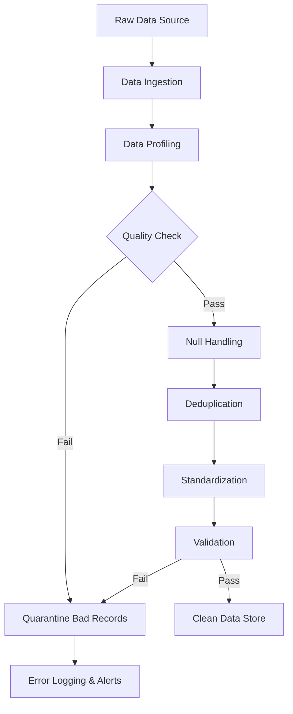
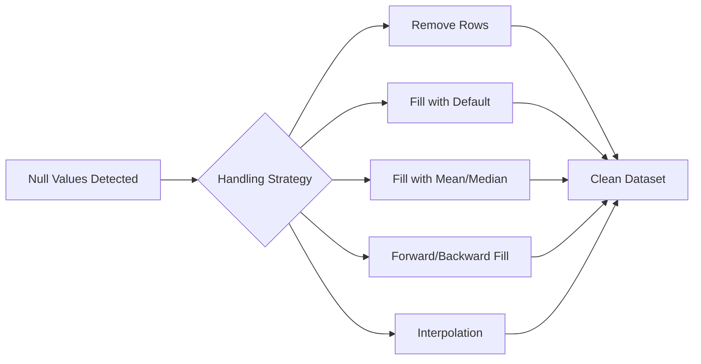
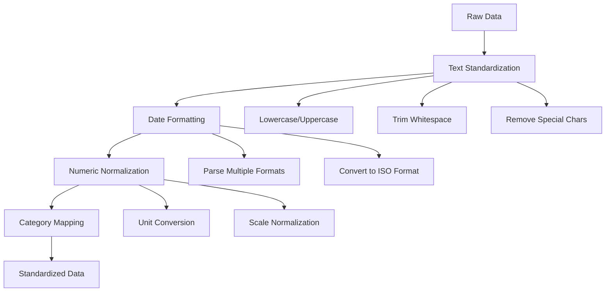

# How to Create Data Cleansing

Author: [nawazdhandala](https://github.com/nawazdhandala)

Tags: Data Quality, Data Engineering, ETL, Data Pipeline

Description: Learn how to implement data cleansing pipelines for improving data quality.

---

Data quality is the foundation of any successful data-driven organization. Poor data quality leads to unreliable analytics, flawed machine learning models, and costly business decisions. In this guide, we will walk through how to build robust data cleansing pipelines that handle null values, remove duplicates, and standardize your data.

## What is Data Cleansing?

Data cleansing (also known as data cleaning or data scrubbing) is the process of identifying and correcting errors, inconsistencies, and inaccuracies in datasets. A well-designed data cleansing pipeline automates this process, ensuring your data meets quality standards before it reaches downstream systems.

## Data Cleansing Pipeline Architecture

Before diving into implementation, let us understand the typical architecture of a data cleansing pipeline:



## Setting Up Your Environment

First, let us set up our Python environment with the necessary libraries:

```python
# Install required packages
# pip install pandas numpy great_expectations

# Import necessary libraries
import pandas as pd
import numpy as np
from typing import List, Dict, Optional
from datetime import datetime
import hashlib
import logging

# Configure logging for pipeline monitoring
logging.basicConfig(
    level=logging.INFO,
    format='%(asctime)s - %(levelname)s - %(message)s'
)
logger = logging.getLogger(__name__)
```

## Step 1: Data Profiling

Before cleansing data, you need to understand what you are working with. Data profiling helps identify quality issues:

```python
def profile_dataframe(df: pd.DataFrame) -> Dict:
    """
    Generate a comprehensive profile of the dataframe.
    This helps identify data quality issues before cleansing.

    Args:
        df: Input pandas DataFrame to profile

    Returns:
        Dictionary containing profiling statistics
    """
    profile = {
        'total_rows': len(df),
        'total_columns': len(df.columns),
        'columns': {}
    }

    for column in df.columns:
        col_profile = {
            # Count of missing values
            'null_count': df[column].isnull().sum(),
            # Percentage of missing values
            'null_percentage': (df[column].isnull().sum() / len(df)) * 100,
            # Count of unique values
            'unique_count': df[column].nunique(),
            # Data type of the column
            'dtype': str(df[column].dtype),
            # Count of duplicate values
            'duplicate_count': df[column].duplicated().sum()
        }

        # Add numeric statistics for numeric columns
        if pd.api.types.is_numeric_dtype(df[column]):
            col_profile.update({
                'mean': df[column].mean(),
                'median': df[column].median(),
                'std': df[column].std(),
                'min': df[column].min(),
                'max': df[column].max()
            })

        profile['columns'][column] = col_profile

    return profile


# Example usage
sample_data = pd.DataFrame({
    'customer_id': [1, 2, 2, 3, None, 5],
    'email': ['john@email.com', 'JANE@EMAIL.COM', 'jane@email.com', None, 'bob@test.com', 'bob@test.com'],
    'purchase_amount': [100.50, 200.00, 200.00, None, 50.25, 75.00],
    'signup_date': ['2024-01-15', '2024/02/20', '2024-02-20', '2024-03-10', None, '2024-04-05']
})

profile = profile_dataframe(sample_data)
logger.info(f"Data Profile: {profile}")
```

## Step 2: Null Handling

Null values can break downstream processes and lead to incorrect analyses. Here are several strategies for handling them:



```python
class NullHandler:
    """
    A class to handle null values in dataframes using various strategies.
    """

    def __init__(self, df: pd.DataFrame):
        """
        Initialize the NullHandler with a dataframe.

        Args:
            df: Input pandas DataFrame
        """
        self.df = df.copy()
        self.null_report = {}

    def remove_rows_with_nulls(self, columns: Optional[List[str]] = None) -> pd.DataFrame:
        """
        Remove rows that contain null values.

        Args:
            columns: List of columns to check for nulls.
                     If None, checks all columns.

        Returns:
            DataFrame with null rows removed
        """
        initial_count = len(self.df)

        if columns:
            self.df = self.df.dropna(subset=columns)
        else:
            self.df = self.df.dropna()

        removed_count = initial_count - len(self.df)
        logger.info(f"Removed {removed_count} rows containing null values")

        return self.df

    def fill_with_default(self, column: str, default_value) -> pd.DataFrame:
        """
        Fill null values with a specified default value.

        Args:
            column: Column name to fill
            default_value: Value to use for filling nulls

        Returns:
            DataFrame with nulls filled
        """
        null_count = self.df[column].isnull().sum()
        self.df[column] = self.df[column].fillna(default_value)
        logger.info(f"Filled {null_count} nulls in '{column}' with default: {default_value}")

        return self.df

    def fill_with_statistics(self, column: str, method: str = 'mean') -> pd.DataFrame:
        """
        Fill null values using statistical methods (mean, median, mode).

        Args:
            column: Column name to fill
            method: Statistical method - 'mean', 'median', or 'mode'

        Returns:
            DataFrame with nulls filled
        """
        null_count = self.df[column].isnull().sum()

        if method == 'mean':
            fill_value = self.df[column].mean()
        elif method == 'median':
            fill_value = self.df[column].median()
        elif method == 'mode':
            fill_value = self.df[column].mode()[0]
        else:
            raise ValueError(f"Unknown method: {method}. Use 'mean', 'median', or 'mode'")

        self.df[column] = self.df[column].fillna(fill_value)
        logger.info(f"Filled {null_count} nulls in '{column}' with {method}: {fill_value}")

        return self.df

    def fill_forward_backward(self, column: str, method: str = 'ffill') -> pd.DataFrame:
        """
        Fill null values using forward fill or backward fill.
        Useful for time series data.

        Args:
            column: Column name to fill
            method: 'ffill' for forward fill, 'bfill' for backward fill

        Returns:
            DataFrame with nulls filled
        """
        null_count = self.df[column].isnull().sum()

        if method == 'ffill':
            self.df[column] = self.df[column].ffill()
        elif method == 'bfill':
            self.df[column] = self.df[column].bfill()

        logger.info(f"Applied {method} to '{column}', addressing {null_count} nulls")

        return self.df


# Example usage
handler = NullHandler(sample_data)

# Fill numeric column with median
handler.fill_with_statistics('purchase_amount', method='median')

# Fill categorical column with default
handler.fill_with_default('email', 'unknown@example.com')

# Remove remaining rows with nulls in critical columns
cleaned_df = handler.remove_rows_with_nulls(columns=['customer_id'])
```

## Step 3: Deduplication

Duplicate records can skew analytics and waste storage. Here is how to identify and handle them:

```python
class Deduplicator:
    """
    A class to identify and remove duplicate records from dataframes.
    """

    def __init__(self, df: pd.DataFrame):
        """
        Initialize the Deduplicator with a dataframe.

        Args:
            df: Input pandas DataFrame
        """
        self.df = df.copy()

    def find_exact_duplicates(self, subset: Optional[List[str]] = None) -> pd.DataFrame:
        """
        Find exact duplicate rows in the dataframe.

        Args:
            subset: Columns to consider for duplicate detection.
                    If None, considers all columns.

        Returns:
            DataFrame containing only the duplicate rows
        """
        duplicates = self.df[self.df.duplicated(subset=subset, keep=False)]
        logger.info(f"Found {len(duplicates)} duplicate rows")

        return duplicates

    def remove_duplicates(
        self,
        subset: Optional[List[str]] = None,
        keep: str = 'first'
    ) -> pd.DataFrame:
        """
        Remove duplicate rows from the dataframe.

        Args:
            subset: Columns to consider for duplicate detection
            keep: Which duplicate to keep - 'first', 'last', or False (remove all)

        Returns:
            DataFrame with duplicates removed
        """
        initial_count = len(self.df)
        self.df = self.df.drop_duplicates(subset=subset, keep=keep)
        removed_count = initial_count - len(self.df)

        logger.info(f"Removed {removed_count} duplicate rows, kept '{keep}'")

        return self.df

    def fuzzy_deduplicate(
        self,
        column: str,
        similarity_threshold: float = 0.85
    ) -> pd.DataFrame:
        """
        Remove near-duplicate records based on string similarity.
        Useful for catching typos and slight variations.

        Args:
            column: Column to check for fuzzy duplicates
            similarity_threshold: Minimum similarity ratio (0 to 1)

        Returns:
            DataFrame with fuzzy duplicates removed
        """
        from difflib import SequenceMatcher

        # Create a list to track rows to keep
        rows_to_keep = []
        seen_values = []

        for idx, row in self.df.iterrows():
            value = str(row[column]).lower().strip()
            is_duplicate = False

            # Compare with previously seen values
            for seen in seen_values:
                similarity = SequenceMatcher(None, value, seen).ratio()
                if similarity >= similarity_threshold:
                    is_duplicate = True
                    break

            if not is_duplicate:
                rows_to_keep.append(idx)
                seen_values.append(value)

        initial_count = len(self.df)
        self.df = self.df.loc[rows_to_keep]
        removed_count = initial_count - len(self.df)

        logger.info(f"Removed {removed_count} fuzzy duplicates from '{column}'")

        return self.df

    def create_row_hash(self, columns: List[str]) -> pd.DataFrame:
        """
        Create a hash column for efficient duplicate detection.
        Useful for large datasets.

        Args:
            columns: Columns to include in the hash

        Returns:
            DataFrame with added hash column
        """
        def hash_row(row):
            # Concatenate values and create MD5 hash
            values = '|'.join(str(row[col]) for col in columns)
            return hashlib.md5(values.encode()).hexdigest()

        self.df['row_hash'] = self.df.apply(hash_row, axis=1)
        logger.info(f"Created row hash from columns: {columns}")

        return self.df


# Example usage
deduplicator = Deduplicator(sample_data)

# Find duplicates based on customer_id
duplicates = deduplicator.find_exact_duplicates(subset=['customer_id'])
print(f"Duplicate records:\n{duplicates}")

# Remove duplicates, keeping the first occurrence
deduped_df = deduplicator.remove_duplicates(subset=['customer_id'], keep='first')
```

## Step 4: Data Standardization

Standardization ensures consistency across your dataset. This includes formatting dates, normalizing text, and converting units:



```python
class DataStandardizer:
    """
    A class to standardize data formats across a dataframe.
    """

    def __init__(self, df: pd.DataFrame):
        """
        Initialize the DataStandardizer with a dataframe.

        Args:
            df: Input pandas DataFrame
        """
        self.df = df.copy()

    def standardize_text(
        self,
        column: str,
        lowercase: bool = True,
        strip_whitespace: bool = True,
        remove_special_chars: bool = False
    ) -> pd.DataFrame:
        """
        Standardize text data in a column.

        Args:
            column: Column name to standardize
            lowercase: Convert to lowercase
            strip_whitespace: Remove leading/trailing whitespace
            remove_special_chars: Remove non-alphanumeric characters

        Returns:
            DataFrame with standardized text
        """
        # Convert to string type first
        self.df[column] = self.df[column].astype(str)

        if strip_whitespace:
            self.df[column] = self.df[column].str.strip()

        if lowercase:
            self.df[column] = self.df[column].str.lower()

        if remove_special_chars:
            # Keep only alphanumeric characters and spaces
            self.df[column] = self.df[column].str.replace(
                r'[^a-zA-Z0-9\s@.]', '', regex=True
            )

        logger.info(f"Standardized text in column '{column}'")

        return self.df

    def standardize_dates(
        self,
        column: str,
        output_format: str = '%Y-%m-%d',
        input_formats: Optional[List[str]] = None
    ) -> pd.DataFrame:
        """
        Standardize date formats to a consistent format.

        Args:
            column: Column name containing dates
            output_format: Desired output date format
            input_formats: List of possible input formats to try

        Returns:
            DataFrame with standardized dates
        """
        if input_formats is None:
            # Common date formats to try
            input_formats = [
                '%Y-%m-%d',
                '%Y/%m/%d',
                '%d-%m-%Y',
                '%d/%m/%Y',
                '%m-%d-%Y',
                '%m/%d/%Y',
                '%B %d, %Y',
                '%b %d, %Y'
            ]

        def parse_date(value):
            if pd.isna(value):
                return None

            # Try each input format
            for fmt in input_formats:
                try:
                    parsed = datetime.strptime(str(value), fmt)
                    return parsed.strftime(output_format)
                except ValueError:
                    continue

            # If no format works, try pandas automatic parsing
            try:
                return pd.to_datetime(value).strftime(output_format)
            except Exception:
                logger.warning(f"Could not parse date: {value}")
                return None

        self.df[column] = self.df[column].apply(parse_date)
        logger.info(f"Standardized dates in '{column}' to format: {output_format}")

        return self.df

    def standardize_phone_numbers(self, column: str, country_code: str = '+1') -> pd.DataFrame:
        """
        Standardize phone numbers to a consistent format.

        Args:
            column: Column name containing phone numbers
            country_code: Default country code to add

        Returns:
            DataFrame with standardized phone numbers
        """
        import re

        def clean_phone(value):
            if pd.isna(value):
                return None

            # Remove all non-numeric characters
            digits = re.sub(r'\D', '', str(value))

            # Handle different lengths
            if len(digits) == 10:
                # Format as (XXX) XXX-XXXX
                return f"{country_code} ({digits[:3]}) {digits[3:6]}-{digits[6:]}"
            elif len(digits) == 11 and digits[0] == '1':
                # Remove leading 1 and format
                digits = digits[1:]
                return f"{country_code} ({digits[:3]}) {digits[3:6]}-{digits[6:]}"
            else:
                logger.warning(f"Invalid phone number format: {value}")
                return value

        self.df[column] = self.df[column].apply(clean_phone)
        logger.info(f"Standardized phone numbers in '{column}'")

        return self.df

    def normalize_numeric(
        self,
        column: str,
        method: str = 'minmax'
    ) -> pd.DataFrame:
        """
        Normalize numeric values using various scaling methods.

        Args:
            column: Column name to normalize
            method: 'minmax' for 0-1 scaling, 'zscore' for standard scaling

        Returns:
            DataFrame with normalized values
        """
        if method == 'minmax':
            # Min-Max normalization: scales to 0-1
            min_val = self.df[column].min()
            max_val = self.df[column].max()
            self.df[column] = (self.df[column] - min_val) / (max_val - min_val)

        elif method == 'zscore':
            # Z-score normalization: mean=0, std=1
            mean_val = self.df[column].mean()
            std_val = self.df[column].std()
            self.df[column] = (self.df[column] - mean_val) / std_val

        logger.info(f"Normalized '{column}' using {method} method")

        return self.df

    def map_categories(self, column: str, mapping: Dict) -> pd.DataFrame:
        """
        Map categorical values to standardized categories.

        Args:
            column: Column name to map
            mapping: Dictionary mapping old values to new values

        Returns:
            DataFrame with mapped categories
        """
        self.df[column] = self.df[column].map(mapping).fillna(self.df[column])
        logger.info(f"Applied category mapping to '{column}'")

        return self.df


# Example usage
standardizer = DataStandardizer(sample_data)

# Standardize email addresses to lowercase
standardizer.standardize_text('email', lowercase=True, strip_whitespace=True)

# Standardize dates to ISO format
standardizer.standardize_dates('signup_date', output_format='%Y-%m-%d')

# View the standardized data
print(standardizer.df)
```

## Step 5: Building the Complete Pipeline

Now let us put it all together into a complete, reusable data cleansing pipeline:

```python
class DataCleansingPipeline:
    """
    A comprehensive data cleansing pipeline that combines all cleansing steps.
    """

    def __init__(self, config: Optional[Dict] = None):
        """
        Initialize the pipeline with configuration.

        Args:
            config: Configuration dictionary for pipeline settings
        """
        self.config = config or {}
        self.metrics = {
            'input_rows': 0,
            'output_rows': 0,
            'nulls_handled': 0,
            'duplicates_removed': 0,
            'standardizations_applied': 0
        }

    def run(self, df: pd.DataFrame) -> pd.DataFrame:
        """
        Execute the complete data cleansing pipeline.

        Args:
            df: Input pandas DataFrame

        Returns:
            Cleaned pandas DataFrame
        """
        logger.info("Starting data cleansing pipeline")
        self.metrics['input_rows'] = len(df)

        # Step 1: Profile the data
        logger.info("Step 1: Profiling data")
        profile = profile_dataframe(df)
        logger.info(f"Input data has {profile['total_rows']} rows and {profile['total_columns']} columns")

        # Step 2: Handle null values
        logger.info("Step 2: Handling null values")
        null_handler = NullHandler(df)

        # Apply null handling strategies based on column types
        for column in df.columns:
            null_count = df[column].isnull().sum()
            if null_count > 0:
                if pd.api.types.is_numeric_dtype(df[column]):
                    null_handler.fill_with_statistics(column, method='median')
                else:
                    null_handler.fill_with_default(column, 'UNKNOWN')
                self.metrics['nulls_handled'] += null_count

        df = null_handler.df

        # Step 3: Remove duplicates
        logger.info("Step 3: Removing duplicates")
        initial_count = len(df)
        deduplicator = Deduplicator(df)
        df = deduplicator.remove_duplicates(keep='first')
        self.metrics['duplicates_removed'] = initial_count - len(df)

        # Step 4: Standardize data
        logger.info("Step 4: Standardizing data")
        standardizer = DataStandardizer(df)

        # Standardize text columns
        text_columns = df.select_dtypes(include=['object']).columns
        for column in text_columns:
            standardizer.standardize_text(column, lowercase=True, strip_whitespace=True)
            self.metrics['standardizations_applied'] += 1

        df = standardizer.df

        # Step 5: Final validation
        logger.info("Step 5: Final validation")
        self.metrics['output_rows'] = len(df)

        # Log pipeline metrics
        logger.info(f"Pipeline complete. Metrics: {self.metrics}")

        return df

    def get_metrics(self) -> Dict:
        """
        Get pipeline execution metrics.

        Returns:
            Dictionary containing pipeline metrics
        """
        return self.metrics


# Run the complete pipeline
pipeline = DataCleansingPipeline()
clean_data = pipeline.run(sample_data)

# Display results
print("\nCleaned Data:")
print(clean_data)
print(f"\nPipeline Metrics: {pipeline.get_metrics()}")
```

## Data Quality Validation

After cleansing, validate your data to ensure it meets quality standards:

```python
class DataQualityValidator:
    """
    A class to validate data quality after cleansing.
    """

    def __init__(self, df: pd.DataFrame):
        """
        Initialize the validator with a dataframe.

        Args:
            df: Input pandas DataFrame to validate
        """
        self.df = df
        self.validation_results = []

    def check_no_nulls(self, columns: List[str]) -> bool:
        """
        Verify that specified columns have no null values.

        Args:
            columns: List of column names to check

        Returns:
            True if no nulls found, False otherwise
        """
        for column in columns:
            null_count = self.df[column].isnull().sum()
            passed = null_count == 0

            self.validation_results.append({
                'check': f'No nulls in {column}',
                'passed': passed,
                'details': f'Found {null_count} nulls'
            })

        return all(r['passed'] for r in self.validation_results)

    def check_unique_values(self, column: str) -> bool:
        """
        Verify that a column contains only unique values.

        Args:
            column: Column name to check

        Returns:
            True if all values are unique, False otherwise
        """
        duplicate_count = self.df[column].duplicated().sum()
        passed = duplicate_count == 0

        self.validation_results.append({
            'check': f'Unique values in {column}',
            'passed': passed,
            'details': f'Found {duplicate_count} duplicates'
        })

        return passed

    def check_value_range(
        self,
        column: str,
        min_value: float,
        max_value: float
    ) -> bool:
        """
        Verify that numeric values fall within an expected range.

        Args:
            column: Column name to check
            min_value: Minimum allowed value
            max_value: Maximum allowed value

        Returns:
            True if all values are within range, False otherwise
        """
        out_of_range = self.df[
            (self.df[column] < min_value) | (self.df[column] > max_value)
        ]
        passed = len(out_of_range) == 0

        self.validation_results.append({
            'check': f'Value range for {column}',
            'passed': passed,
            'details': f'{len(out_of_range)} values out of range [{min_value}, {max_value}]'
        })

        return passed

    def get_report(self) -> pd.DataFrame:
        """
        Generate a validation report.

        Returns:
            DataFrame containing validation results
        """
        return pd.DataFrame(self.validation_results)


# Validate the cleaned data
validator = DataQualityValidator(clean_data)
validator.check_no_nulls(['customer_id', 'email'])
validator.check_unique_values('customer_id')

print("\nValidation Report:")
print(validator.get_report())
```

## Best Practices for Data Cleansing Pipelines

1. **Document your transformations**: Keep a clear record of all cleansing steps applied to the data for reproducibility and auditing.

2. **Preserve original data**: Always keep a copy of the raw data before applying transformations. This allows you to reprocess if requirements change.

3. **Use incremental processing**: For large datasets, process data in batches to avoid memory issues and enable recovery from failures.

4. **Implement monitoring**: Track pipeline metrics and set up alerts for unexpected data quality issues.

5. **Version your pipeline**: Use version control for your cleansing code and configuration to track changes over time.

6. **Test with edge cases**: Include unit tests that cover null values, empty strings, special characters, and boundary conditions.

7. **Handle errors gracefully**: Implement proper error handling and quarantine problematic records rather than failing the entire pipeline.

## Conclusion

Building robust data cleansing pipelines is essential for maintaining high data quality. By implementing systematic approaches to null handling, deduplication, and standardization, you can ensure your data is reliable and consistent. The modular approach demonstrated in this guide allows you to customize and extend the pipeline based on your specific needs.

Remember that data cleansing is not a one-time task but an ongoing process. As your data sources evolve and new quality issues emerge, your pipeline should adapt accordingly. Regular monitoring and validation will help you catch issues early and maintain the integrity of your data assets.
