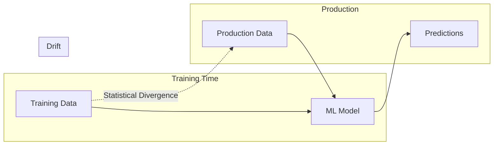
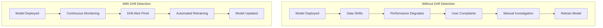
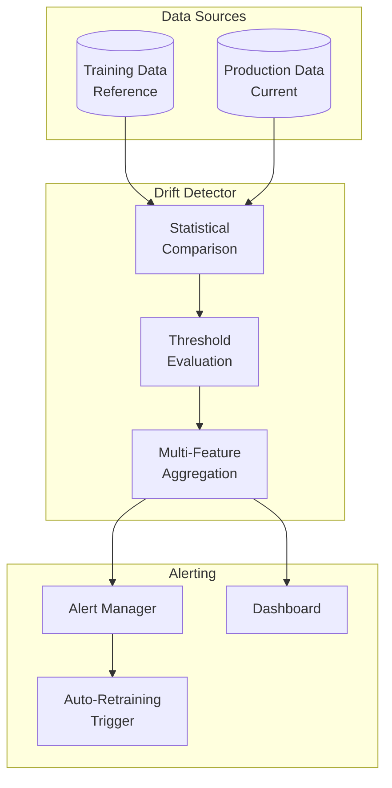
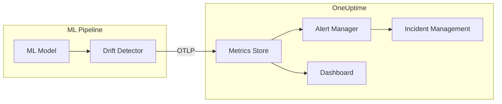

# How to Build Data Drift Detection Details

Author: [nawazdhandala](https://github.com/nawazdhandala)

Tags: MLOps, Machine Learning, Monitoring, AI

Description: A practical guide to detecting data drift in production ML systems, with statistical methods, implementation patterns, and alerting strategies to catch model degradation before it impacts users.

---

Your machine learning model worked perfectly in testing. Three months into production, prediction accuracy has quietly dropped 15%, and nobody noticed until customer complaints started rolling in. The culprit? Data drift.

Data drift is the silent killer of ML systems. Unlike traditional software where bugs manifest immediately, ML models degrade gradually as the statistical properties of incoming data shift away from training data distributions. Building robust drift detection is not optional for production ML systems; it is essential infrastructure.

This post walks you through what data drift is, how to detect it, and how to build a monitoring system that catches drift before it impacts your users.

---

## What Is Data Drift?

Data drift occurs when the statistical properties of your input data change over time. Your model was trained on data with certain distributions, and when production data deviates from those distributions, model performance degrades.



There are several types of drift to monitor:

| Drift Type | Description | Example |
|------------|-------------|---------|
| **Covariate Drift** | Input feature distributions change | User age distribution shifts younger |
| **Concept Drift** | Relationship between inputs and outputs changes | Economic recession changes spending patterns |
| **Label Drift** | Target variable distribution changes | Fraud rate increases during holidays |
| **Prediction Drift** | Model output distribution changes | More high-confidence predictions than expected |

Understanding which type of drift you are dealing with determines your detection strategy and remediation approach.

---

## Why Drift Detection Matters

Without drift detection, you are flying blind. Consider this scenario:

1. Model deployed with 95% accuracy on test set
2. User behavior slowly shifts over 6 months
3. Actual accuracy drops to 78%
4. No monitoring catches this degradation
5. Business impact: wrong recommendations, lost revenue, frustrated users



Drift detection transforms reactive firefighting into proactive maintenance.

---

## Statistical Methods for Drift Detection

Several statistical tests can quantify whether two distributions are significantly different. Choose based on your data type and sample sizes.

### Population Stability Index (PSI)

PSI is the go-to metric for measuring distribution shift. It compares the percentage of records in each bin between reference and current distributions.

This implementation calculates PSI by binning continuous features and comparing the proportion of samples in each bin between reference and current data:

```python
# psi.py
# Population Stability Index calculation for drift detection
import numpy as np
from typing import Tuple, List

def calculate_psi(
    reference: np.ndarray,
    current: np.ndarray,
    bins: int = 10,
    epsilon: float = 1e-6
) -> Tuple[float, List[dict]]:
    """
    Calculate Population Stability Index between two distributions.

    PSI < 0.1: No significant drift
    PSI 0.1-0.2: Moderate drift, investigate
    PSI > 0.2: Significant drift, action required

    Args:
        reference: Array of reference (training) values
        current: Array of current (production) values
        bins: Number of bins for histogram
        epsilon: Small value to avoid log(0)

    Returns:
        Tuple of (PSI value, per-bin breakdown)
    """
    # Create bins based on reference distribution
    # Using reference data for bin edges ensures consistent comparison
    min_val = min(reference.min(), current.min())
    max_val = max(reference.max(), current.max())
    bin_edges = np.linspace(min_val, max_val, bins + 1)

    # Calculate percentage in each bin for both distributions
    ref_counts, _ = np.histogram(reference, bins=bin_edges)
    cur_counts, _ = np.histogram(current, bins=bin_edges)

    # Convert to percentages
    ref_pct = ref_counts / len(reference) + epsilon
    cur_pct = cur_counts / len(current) + epsilon

    # Calculate PSI contribution per bin
    # PSI = sum((current_pct - reference_pct) * ln(current_pct / reference_pct))
    psi_per_bin = (cur_pct - ref_pct) * np.log(cur_pct / ref_pct)

    total_psi = np.sum(psi_per_bin)

    # Build detailed breakdown for debugging
    breakdown = []
    for i in range(bins):
        breakdown.append({
            'bin_start': bin_edges[i],
            'bin_end': bin_edges[i + 1],
            'reference_pct': ref_pct[i] - epsilon,
            'current_pct': cur_pct[i] - epsilon,
            'psi_contribution': psi_per_bin[i]
        })

    return total_psi, breakdown


def interpret_psi(psi_value: float) -> str:
    """Provide human-readable interpretation of PSI value"""
    if psi_value < 0.1:
        return "No significant drift detected"
    elif psi_value < 0.2:
        return "Moderate drift - investigate potential causes"
    else:
        return "Significant drift - model retraining recommended"
```

### Kolmogorov-Smirnov Test

The KS test measures the maximum difference between two cumulative distribution functions. It is non-parametric and works well for continuous features.

This implementation wraps scipy's KS test with drift-specific interpretation:

```python
# ks_test.py
# Kolmogorov-Smirnov test for distribution comparison
from scipy import stats
import numpy as np
from dataclasses import dataclass
from typing import Optional

@dataclass
class KSTestResult:
    """Result of Kolmogorov-Smirnov test for drift detection"""
    statistic: float      # Maximum distance between CDFs
    p_value: float        # Probability distributions are the same
    drift_detected: bool  # Whether drift exceeds threshold
    interpretation: str   # Human-readable explanation

def ks_drift_test(
    reference: np.ndarray,
    current: np.ndarray,
    significance_level: float = 0.05
) -> KSTestResult:
    """
    Perform two-sample Kolmogorov-Smirnov test for drift detection.

    The KS statistic represents the maximum vertical distance between
    the cumulative distribution functions of two samples. A large statistic
    indicates the distributions are different.

    Args:
        reference: Reference distribution (training data)
        current: Current distribution (production data)
        significance_level: Alpha level for hypothesis testing

    Returns:
        KSTestResult with statistic, p-value, and interpretation
    """
    # Run two-sample KS test
    # Null hypothesis: both samples come from same distribution
    statistic, p_value = stats.ks_2samp(reference, current)

    # Determine if drift is statistically significant
    drift_detected = p_value < significance_level

    # Build interpretation
    if not drift_detected:
        interpretation = (
            f"No significant drift (p={p_value:.4f} > {significance_level}). "
            f"KS statistic: {statistic:.4f}"
        )
    else:
        interpretation = (
            f"Significant drift detected (p={p_value:.4f} < {significance_level}). "
            f"KS statistic: {statistic:.4f} - distributions differ"
        )

    return KSTestResult(
        statistic=statistic,
        p_value=p_value,
        drift_detected=drift_detected,
        interpretation=interpretation
    )


def ks_drift_test_categorical(
    reference: np.ndarray,
    current: np.ndarray,
    significance_level: float = 0.05
) -> KSTestResult:
    """
    Chi-squared test for categorical feature drift.

    For categorical features, we use chi-squared instead of KS test
    to compare frequency distributions.
    """
    # Get unique categories from both distributions
    categories = np.union1d(np.unique(reference), np.unique(current))

    # Count occurrences in each category
    ref_counts = np.array([np.sum(reference == cat) for cat in categories])
    cur_counts = np.array([np.sum(current == cat) for cat in categories])

    # Normalize current counts to match reference sample size
    # This allows fair comparison when sample sizes differ
    expected = ref_counts * (len(current) / len(reference))

    # Avoid division by zero
    expected = np.maximum(expected, 1e-10)

    # Chi-squared test
    statistic, p_value = stats.chisquare(cur_counts, expected)

    drift_detected = p_value < significance_level

    interpretation = (
        f"{'Significant' if drift_detected else 'No significant'} drift "
        f"(chi-squared={statistic:.2f}, p={p_value:.4f})"
    )

    return KSTestResult(
        statistic=statistic,
        p_value=p_value,
        drift_detected=drift_detected,
        interpretation=interpretation
    )
```

### Jensen-Shannon Divergence

JS divergence is a symmetric measure of difference between probability distributions. Unlike KL divergence, it is bounded between 0 and 1 and always defined.

```python
# js_divergence.py
# Jensen-Shannon Divergence for distribution comparison
import numpy as np
from scipy.special import rel_entr
from typing import Tuple

def js_divergence(
    reference: np.ndarray,
    current: np.ndarray,
    bins: int = 50
) -> Tuple[float, dict]:
    """
    Calculate Jensen-Shannon Divergence between two distributions.

    JSD is the symmetric, smoothed version of KL divergence:
    JSD(P||Q) = 0.5 * KL(P||M) + 0.5 * KL(Q||M)
    where M = 0.5 * (P + Q)

    JSD ranges from 0 (identical) to 1 (completely different).

    Args:
        reference: Reference distribution
        current: Current distribution
        bins: Number of bins for histogram approximation

    Returns:
        Tuple of (JSD value, diagnostic info)
    """
    # Create probability distributions via histograms
    min_val = min(reference.min(), current.min())
    max_val = max(reference.max(), current.max())
    bin_edges = np.linspace(min_val, max_val, bins + 1)

    # Compute normalized histograms (probability distributions)
    p, _ = np.histogram(reference, bins=bin_edges, density=True)
    q, _ = np.histogram(current, bins=bin_edges, density=True)

    # Add small epsilon to avoid log(0)
    epsilon = 1e-10
    p = p + epsilon
    q = q + epsilon

    # Normalize to ensure they sum to 1
    p = p / p.sum()
    q = q / q.sum()

    # Calculate midpoint distribution
    m = 0.5 * (p + q)

    # JSD = 0.5 * KL(P||M) + 0.5 * KL(Q||M)
    # rel_entr computes element-wise KL divergence
    jsd = 0.5 * np.sum(rel_entr(p, m)) + 0.5 * np.sum(rel_entr(q, m))

    # Interpret the result
    if jsd < 0.1:
        severity = "low"
    elif jsd < 0.3:
        severity = "moderate"
    else:
        severity = "high"

    diagnostics = {
        'jsd': jsd,
        'severity': severity,
        'reference_mean': reference.mean(),
        'current_mean': current.mean(),
        'reference_std': reference.std(),
        'current_std': current.std()
    }

    return jsd, diagnostics
```

---

## Building a Complete Drift Detection System

Now let us put these statistical methods into a production-ready monitoring system.

### Architecture Overview



### The Drift Monitor Class

This core class orchestrates drift detection across all features with configurable thresholds and multiple detection methods:

```python
# drift_monitor.py
# Production drift detection system
import numpy as np
import pandas as pd
from dataclasses import dataclass, field
from typing import Dict, List, Optional, Callable
from datetime import datetime
import logging
import json

logger = logging.getLogger(__name__)

@dataclass
class DriftResult:
    """Result of drift detection for a single feature"""
    feature_name: str
    drift_detected: bool
    drift_score: float
    method: str
    threshold: float
    details: dict = field(default_factory=dict)
    timestamp: datetime = field(default_factory=datetime.utcnow)

@dataclass
class DriftReport:
    """Aggregated drift report across all features"""
    timestamp: datetime
    total_features: int
    drifted_features: int
    drift_percentage: float
    overall_drift_detected: bool
    feature_results: List[DriftResult]
    summary: str

class DriftMonitor:
    """
    Production-ready drift monitoring for ML features.

    Supports multiple detection methods, configurable thresholds,
    and integrates with alerting systems.
    """

    def __init__(
        self,
        reference_data: pd.DataFrame,
        feature_configs: Dict[str, dict] = None,
        default_method: str = 'psi',
        default_threshold: float = 0.2,
        drift_percentage_threshold: float = 0.3
    ):
        """
        Initialize drift monitor with reference data.

        Args:
            reference_data: DataFrame of training/reference data
            feature_configs: Per-feature configuration dict
            default_method: Default detection method (psi, ks, js)
            default_threshold: Default drift threshold
            drift_percentage_threshold: Fraction of features that must
                drift to trigger overall drift alert
        """
        self.reference_data = reference_data
        self.feature_configs = feature_configs or {}
        self.default_method = default_method
        self.default_threshold = default_threshold
        self.drift_percentage_threshold = drift_percentage_threshold

        # Store reference statistics for comparison
        self._compute_reference_stats()

        logger.info(
            f"DriftMonitor initialized with {len(reference_data.columns)} features"
        )

    def _compute_reference_stats(self):
        """Pre-compute reference distribution statistics"""
        self.reference_stats = {}
        for col in self.reference_data.columns:
            data = self.reference_data[col].dropna()
            self.reference_stats[col] = {
                'mean': data.mean() if data.dtype != object else None,
                'std': data.std() if data.dtype != object else None,
                'min': data.min() if data.dtype != object else None,
                'max': data.max() if data.dtype != object else None,
                'unique_count': data.nunique(),
                'dtype': str(data.dtype)
            }

    def _get_feature_config(self, feature_name: str) -> dict:
        """Get configuration for a specific feature"""
        config = self.feature_configs.get(feature_name, {})
        return {
            'method': config.get('method', self.default_method),
            'threshold': config.get('threshold', self.default_threshold),
            'enabled': config.get('enabled', True)
        }

    def detect_drift_single_feature(
        self,
        feature_name: str,
        current_data: np.ndarray
    ) -> DriftResult:
        """
        Detect drift for a single feature.

        Returns DriftResult with score, threshold comparison,
        and diagnostic details.
        """
        config = self._get_feature_config(feature_name)

        if not config['enabled']:
            return DriftResult(
                feature_name=feature_name,
                drift_detected=False,
                drift_score=0.0,
                method='disabled',
                threshold=0.0,
                details={'status': 'monitoring disabled'}
            )

        reference = self.reference_data[feature_name].dropna().values
        current = np.array(current_data)
        current = current[~pd.isna(current)]

        # Select detection method
        method = config['method']
        threshold = config['threshold']

        if method == 'psi':
            score, breakdown = calculate_psi(reference, current)
            details = {'breakdown': breakdown}

        elif method == 'ks':
            result = ks_drift_test(reference, current)
            score = result.statistic
            details = {'p_value': result.p_value}

        elif method == 'js':
            score, diagnostics = js_divergence(reference, current)
            details = diagnostics

        else:
            raise ValueError(f"Unknown drift detection method: {method}")

        drift_detected = score > threshold

        # Add comparison statistics
        details['reference_stats'] = self.reference_stats[feature_name]
        details['current_stats'] = {
            'mean': float(np.mean(current)),
            'std': float(np.std(current)),
            'count': len(current)
        }

        return DriftResult(
            feature_name=feature_name,
            drift_detected=drift_detected,
            drift_score=score,
            method=method,
            threshold=threshold,
            details=details
        )

    def detect_drift(
        self,
        current_data: pd.DataFrame,
        features: List[str] = None
    ) -> DriftReport:
        """
        Detect drift across all features in the dataset.

        Args:
            current_data: DataFrame of current production data
            features: Optional list of specific features to check

        Returns:
            DriftReport with overall and per-feature results
        """
        features = features or list(self.reference_data.columns)
        results = []

        for feature in features:
            if feature not in current_data.columns:
                logger.warning(f"Feature {feature} not in current data, skipping")
                continue

            try:
                result = self.detect_drift_single_feature(
                    feature,
                    current_data[feature].values
                )
                results.append(result)

                if result.drift_detected:
                    logger.warning(
                        f"Drift detected in {feature}: "
                        f"score={result.drift_score:.4f} > {result.threshold}"
                    )

            except Exception as e:
                logger.error(f"Error detecting drift for {feature}: {e}")
                results.append(DriftResult(
                    feature_name=feature,
                    drift_detected=False,
                    drift_score=0.0,
                    method='error',
                    threshold=0.0,
                    details={'error': str(e)}
                ))

        # Aggregate results
        total = len(results)
        drifted = sum(1 for r in results if r.drift_detected)
        drift_pct = drifted / total if total > 0 else 0

        overall_drift = drift_pct >= self.drift_percentage_threshold

        # Generate summary
        if overall_drift:
            summary = (
                f"DRIFT ALERT: {drifted}/{total} features ({drift_pct:.1%}) "
                f"show significant drift. Investigation recommended."
            )
        elif drifted > 0:
            summary = (
                f"Minor drift: {drifted}/{total} features ({drift_pct:.1%}) "
                f"show drift, below alert threshold."
            )
        else:
            summary = f"No drift detected across {total} features."

        return DriftReport(
            timestamp=datetime.utcnow(),
            total_features=total,
            drifted_features=drifted,
            drift_percentage=drift_pct,
            overall_drift_detected=overall_drift,
            feature_results=results,
            summary=summary
        )

    def to_metrics(self, report: DriftReport) -> Dict[str, float]:
        """
        Convert drift report to metrics for monitoring systems.

        Returns dict suitable for export to Prometheus/OpenTelemetry.
        """
        metrics = {
            'drift.features.total': report.total_features,
            'drift.features.drifted': report.drifted_features,
            'drift.percentage': report.drift_percentage,
            'drift.alert': 1.0 if report.overall_drift_detected else 0.0
        }

        # Per-feature metrics
        for result in report.feature_results:
            safe_name = result.feature_name.replace('.', '_')
            metrics[f'drift.feature.{safe_name}.score'] = result.drift_score
            metrics[f'drift.feature.{safe_name}.drifted'] = (
                1.0 if result.drift_detected else 0.0
            )

        return metrics
```

### Windowed Drift Detection

For streaming data, you need to detect drift over time windows rather than comparing single batches:

```python
# windowed_drift.py
# Time-windowed drift detection for streaming data
from collections import deque
from datetime import datetime, timedelta
from typing import Optional
import numpy as np

class WindowedDriftDetector:
    """
    Detect drift using sliding time windows.

    Maintains a rolling buffer of recent data and compares
    against reference distribution at regular intervals.
    """

    def __init__(
        self,
        reference_data: np.ndarray,
        window_size: timedelta = timedelta(hours=1),
        min_samples: int = 100,
        detection_method: str = 'psi',
        threshold: float = 0.2
    ):
        """
        Args:
            reference_data: Reference distribution to compare against
            window_size: Size of the sliding window
            min_samples: Minimum samples needed to run detection
            detection_method: Statistical method to use
            threshold: Drift threshold
        """
        self.reference_data = np.array(reference_data)
        self.window_size = window_size
        self.min_samples = min_samples
        self.detection_method = detection_method
        self.threshold = threshold

        # Buffer stores (timestamp, value) tuples
        self.buffer = deque()

        # Track detection history
        self.detection_history = []

    def add_sample(self, value: float, timestamp: datetime = None):
        """Add a new sample to the window buffer"""
        timestamp = timestamp or datetime.utcnow()
        self.buffer.append((timestamp, value))

        # Prune old samples outside window
        cutoff = timestamp - self.window_size
        while self.buffer and self.buffer[0][0] < cutoff:
            self.buffer.popleft()

    def add_batch(self, values: np.ndarray, timestamp: datetime = None):
        """Add a batch of samples with the same timestamp"""
        timestamp = timestamp or datetime.utcnow()
        for value in values:
            self.buffer.append((timestamp, value))

        # Prune old samples
        cutoff = timestamp - self.window_size
        while self.buffer and self.buffer[0][0] < cutoff:
            self.buffer.popleft()

    def get_window_data(self) -> np.ndarray:
        """Get all values currently in the window"""
        return np.array([v for _, v in self.buffer])

    def check_drift(self) -> Optional[dict]:
        """
        Check for drift in current window.

        Returns None if insufficient samples, otherwise returns
        drift detection result.
        """
        window_data = self.get_window_data()

        if len(window_data) < self.min_samples:
            return None

        # Run detection
        if self.detection_method == 'psi':
            score, breakdown = calculate_psi(
                self.reference_data,
                window_data
            )
        elif self.detection_method == 'ks':
            result = ks_drift_test(self.reference_data, window_data)
            score = result.statistic
        elif self.detection_method == 'js':
            score, _ = js_divergence(self.reference_data, window_data)
        else:
            raise ValueError(f"Unknown method: {self.detection_method}")

        drift_detected = score > self.threshold

        result = {
            'timestamp': datetime.utcnow(),
            'window_samples': len(window_data),
            'drift_score': score,
            'threshold': self.threshold,
            'drift_detected': drift_detected,
            'window_start': self.buffer[0][0] if self.buffer else None,
            'window_end': self.buffer[-1][0] if self.buffer else None
        }

        self.detection_history.append(result)

        return result

    def get_drift_trend(self, lookback: int = 10) -> dict:
        """
        Analyze drift trend over recent detection windows.

        Returns trend analysis to distinguish transient spikes
        from sustained drift.
        """
        recent = self.detection_history[-lookback:]

        if not recent:
            return {'status': 'insufficient_data'}

        scores = [r['drift_score'] for r in recent]
        detections = [r['drift_detected'] for r in recent]

        return {
            'windows_analyzed': len(recent),
            'drift_detections': sum(detections),
            'detection_rate': sum(detections) / len(detections),
            'mean_score': np.mean(scores),
            'max_score': np.max(scores),
            'score_trend': 'increasing' if len(scores) > 1 and scores[-1] > scores[0] else 'stable',
            'sustained_drift': sum(detections) / len(detections) > 0.5
        }
```

---

## Integrating with OneUptime

Connect your drift detection to OneUptime for centralized observability.



This integration module exports drift metrics via OpenTelemetry for OneUptime ingestion:

```python
# oneuptime_integration.py
# Export drift metrics to OneUptime via OpenTelemetry
from opentelemetry import metrics
from opentelemetry.sdk.metrics import MeterProvider
from opentelemetry.sdk.metrics.export import PeriodicExportingMetricReader
from opentelemetry.exporter.otlp.proto.grpc.metric_exporter import OTLPMetricExporter
import logging

logger = logging.getLogger(__name__)

class DriftMetricsExporter:
    """
    Export drift detection metrics to OneUptime.

    Uses OpenTelemetry for vendor-neutral metric export.
    """

    def __init__(
        self,
        endpoint: str,
        service_name: str = "ml-drift-monitor",
        export_interval_ms: int = 60000
    ):
        """
        Args:
            endpoint: OneUptime OTLP endpoint
            service_name: Name for this service in metrics
            export_interval_ms: How often to export metrics
        """
        # Configure OTLP exporter
        exporter = OTLPMetricExporter(
            endpoint=endpoint,
            insecure=False
        )

        reader = PeriodicExportingMetricReader(
            exporter,
            export_interval_millis=export_interval_ms
        )

        provider = MeterProvider(metric_readers=[reader])
        metrics.set_meter_provider(provider)

        self.meter = metrics.get_meter(service_name)

        # Create metric instruments
        self.drift_score_gauge = self.meter.create_observable_gauge(
            name="ml.drift.score",
            description="Current drift score per feature",
            unit="1"
        )

        self.drift_alert_counter = self.meter.create_counter(
            name="ml.drift.alerts.total",
            description="Total drift alerts triggered",
            unit="1"
        )

        self.features_drifted_gauge = self.meter.create_observable_gauge(
            name="ml.drift.features.drifted",
            description="Number of features currently drifted",
            unit="1"
        )

        # Store latest values for gauge callbacks
        self._latest_scores = {}
        self._features_drifted = 0

        logger.info(f"DriftMetricsExporter initialized for {endpoint}")

    def record_drift_report(self, report: DriftReport, model_name: str):
        """
        Record a drift report to metrics.

        Args:
            report: DriftReport from drift detection
            model_name: Name of the ML model being monitored
        """
        # Update feature scores
        for result in report.feature_results:
            self._latest_scores[(model_name, result.feature_name)] = result.drift_score

        # Update drifted features count
        self._features_drifted = report.drifted_features

        # Increment alert counter if drift detected
        if report.overall_drift_detected:
            self.drift_alert_counter.add(
                1,
                {
                    "model": model_name,
                    "drifted_features": str(report.drifted_features)
                }
            )
            logger.warning(
                f"Drift alert recorded for {model_name}: "
                f"{report.drifted_features} features drifted"
            )

    def get_latest_scores(self):
        """Callback for observable gauge"""
        return self._latest_scores


def create_drift_alert_rule():
    """
    Example alert rule configuration for OneUptime.

    Returns dict that can be used to configure alerts via
    OneUptime API or Terraform provider.
    """
    return {
        "name": "ML Model Drift Alert",
        "description": "Fires when significant data drift is detected",
        "condition": {
            "metric": "ml.drift.features.drifted",
            "operator": "greater_than",
            "threshold": 3,
            "duration_minutes": 5
        },
        "severity": "warning",
        "notification_channels": ["slack-ml-alerts", "pagerduty-ml-oncall"],
        "runbook_url": "https://wiki.example.com/runbooks/ml-drift-response"
    }
```

---

## Setting Up Drift Monitoring Pipeline

A complete monitoring pipeline that runs continuously:

```python
# monitoring_pipeline.py
# Complete drift monitoring pipeline
import schedule
import time
import logging
from datetime import datetime, timedelta
from typing import Callable

logger = logging.getLogger(__name__)

class DriftMonitoringPipeline:
    """
    Production pipeline for continuous drift monitoring.

    Orchestrates data fetching, drift detection, alerting,
    and optional auto-retraining triggers.
    """

    def __init__(
        self,
        drift_monitor: DriftMonitor,
        data_fetcher: Callable,
        metrics_exporter: DriftMetricsExporter,
        model_name: str,
        check_interval_minutes: int = 60,
        auto_retrain_threshold: float = 0.5
    ):
        """
        Args:
            drift_monitor: Configured DriftMonitor instance
            data_fetcher: Function that returns recent production data
            metrics_exporter: Exporter for OneUptime metrics
            model_name: Name of the model being monitored
            check_interval_minutes: How often to check for drift
            auto_retrain_threshold: Drift percentage that triggers retraining
        """
        self.drift_monitor = drift_monitor
        self.data_fetcher = data_fetcher
        self.metrics_exporter = metrics_exporter
        self.model_name = model_name
        self.check_interval = check_interval_minutes
        self.auto_retrain_threshold = auto_retrain_threshold

        self.last_check = None
        self.consecutive_drift_count = 0

    def run_check(self):
        """Execute a single drift check cycle"""
        logger.info(f"Running drift check for {self.model_name}")

        try:
            # Fetch recent production data
            current_data = self.data_fetcher()

            if current_data is None or len(current_data) == 0:
                logger.warning("No production data available for drift check")
                return

            # Run drift detection
            report = self.drift_monitor.detect_drift(current_data)

            # Log results
            logger.info(report.summary)

            # Export metrics
            self.metrics_exporter.record_drift_report(report, self.model_name)

            # Track consecutive drift for stability
            if report.overall_drift_detected:
                self.consecutive_drift_count += 1
            else:
                self.consecutive_drift_count = 0

            # Check if auto-retraining should be triggered
            if self._should_trigger_retrain(report):
                self._trigger_retraining(report)

            self.last_check = datetime.utcnow()

        except Exception as e:
            logger.error(f"Drift check failed: {e}", exc_info=True)

    def _should_trigger_retrain(self, report: DriftReport) -> bool:
        """Determine if model retraining should be triggered"""
        # Require sustained drift over multiple checks
        sustained_drift = self.consecutive_drift_count >= 3

        # Or severe drift in single check
        severe_drift = report.drift_percentage >= self.auto_retrain_threshold

        return sustained_drift or severe_drift

    def _trigger_retraining(self, report: DriftReport):
        """Trigger model retraining workflow"""
        logger.warning(
            f"Triggering retraining for {self.model_name} - "
            f"drift_pct={report.drift_percentage:.1%}, "
            f"consecutive_checks={self.consecutive_drift_count}"
        )

        # In production, this would trigger your ML pipeline
        # Examples:
        # - Send message to retraining queue
        # - Trigger Airflow DAG
        # - Call MLflow or Kubeflow pipeline
        # - Create GitHub issue/PR for manual review

        # Reset counter after triggering
        self.consecutive_drift_count = 0

    def start(self):
        """Start the monitoring pipeline on a schedule"""
        logger.info(
            f"Starting drift monitoring for {self.model_name}, "
            f"checking every {self.check_interval} minutes"
        )

        # Run immediately
        self.run_check()

        # Schedule recurring checks
        schedule.every(self.check_interval).minutes.do(self.run_check)

        while True:
            schedule.run_pending()
            time.sleep(60)


# Example usage and configuration
def main():
    """Example pipeline configuration"""
    import pandas as pd

    # Load reference data (your training data distribution)
    reference_data = pd.read_parquet("s3://ml-data/training/features.parquet")

    # Configure per-feature settings
    feature_configs = {
        'user_age': {'method': 'psi', 'threshold': 0.15},
        'transaction_amount': {'method': 'ks', 'threshold': 0.1},
        'category': {'method': 'psi', 'threshold': 0.25},  # Categorical - higher tolerance
    }

    # Initialize drift monitor
    monitor = DriftMonitor(
        reference_data=reference_data,
        feature_configs=feature_configs,
        default_method='psi',
        default_threshold=0.2,
        drift_percentage_threshold=0.3
    )

    # Data fetcher for production data
    def fetch_production_data():
        # Fetch last hour of production predictions
        return pd.read_sql(
            """
            SELECT * FROM ml_features
            WHERE created_at > NOW() - INTERVAL '1 hour'
            """,
            production_db_connection
        )

    # Metrics exporter
    exporter = DriftMetricsExporter(
        endpoint="https://otlp.oneuptime.com:4317",
        service_name="recommendation-model-drift"
    )

    # Create and start pipeline
    pipeline = DriftMonitoringPipeline(
        drift_monitor=monitor,
        data_fetcher=fetch_production_data,
        metrics_exporter=exporter,
        model_name="recommendation-model-v2",
        check_interval_minutes=60,
        auto_retrain_threshold=0.5
    )

    pipeline.start()


if __name__ == "__main__":
    main()
```

---

## Best Practices and Common Pitfalls

### Do

| Practice | Why It Matters |
|----------|----------------|
| **Start with PSI** | Simple, interpretable, works for most features |
| **Set feature-specific thresholds** | Different features tolerate different drift levels |
| **Monitor prediction distribution** | Catches model degradation even without labels |
| **Use multiple detection methods** | Cross-validate drift signals |
| **Track drift over time** | Distinguish transient noise from sustained drift |

### Avoid

| Pitfall | Better Approach |
|---------|-----------------|
| Single-point comparison | Use windowed detection with sufficient samples |
| Same threshold everywhere | Tune thresholds per feature based on sensitivity |
| Alerting on every spike | Require sustained drift before alerting |
| Ignoring categorical features | Use chi-squared or category frequency comparison |
| No baseline versioning | Store reference distributions with model versions |

---

## Testing Your Drift Detection

Verify your drift detection works before relying on it:

```python
# test_drift_detection.py
# Tests for drift detection system
import pytest
import numpy as np
import pandas as pd

class TestDriftDetection:
    """Test suite for drift detection system"""

    def test_psi_identical_distributions(self):
        """PSI should be near zero for identical distributions"""
        data = np.random.normal(0, 1, 10000)
        psi, _ = calculate_psi(data, data)
        assert psi < 0.01, f"PSI should be ~0 for identical data, got {psi}"

    def test_psi_detects_mean_shift(self):
        """PSI should detect significant mean shift"""
        reference = np.random.normal(0, 1, 10000)
        shifted = np.random.normal(2, 1, 10000)  # Mean shifted by 2 std
        psi, _ = calculate_psi(reference, shifted)
        assert psi > 0.2, f"PSI should detect mean shift, got {psi}"

    def test_psi_detects_variance_change(self):
        """PSI should detect variance changes"""
        reference = np.random.normal(0, 1, 10000)
        wider = np.random.normal(0, 3, 10000)  # 3x variance
        psi, _ = calculate_psi(reference, wider)
        assert psi > 0.1, f"PSI should detect variance change, got {psi}"

    def test_ks_test_same_distribution(self):
        """KS test should not detect drift in same distribution"""
        data = np.random.uniform(0, 1, 1000)
        result = ks_drift_test(data, data)
        assert not result.drift_detected

    def test_ks_test_different_distribution(self):
        """KS test should detect different distributions"""
        uniform = np.random.uniform(0, 1, 1000)
        normal = np.random.normal(0.5, 0.2, 1000)
        result = ks_drift_test(uniform, normal)
        assert result.drift_detected

    def test_drift_monitor_no_drift(self):
        """Monitor should not alert on stable data"""
        reference = pd.DataFrame({
            'feature_a': np.random.normal(0, 1, 10000),
            'feature_b': np.random.uniform(0, 1, 10000)
        })

        # Same distribution
        current = pd.DataFrame({
            'feature_a': np.random.normal(0, 1, 1000),
            'feature_b': np.random.uniform(0, 1, 1000)
        })

        monitor = DriftMonitor(reference)
        report = monitor.detect_drift(current)

        assert not report.overall_drift_detected
        assert report.drifted_features == 0

    def test_drift_monitor_detects_drift(self):
        """Monitor should alert on drifted data"""
        reference = pd.DataFrame({
            'feature_a': np.random.normal(0, 1, 10000),
            'feature_b': np.random.uniform(0, 1, 10000)
        })

        # Shifted distribution
        current = pd.DataFrame({
            'feature_a': np.random.normal(5, 1, 1000),  # Mean shifted
            'feature_b': np.random.uniform(0, 1, 1000)
        })

        monitor = DriftMonitor(reference, drift_percentage_threshold=0.3)
        report = monitor.detect_drift(current)

        assert report.drifted_features >= 1

        # Find the drifted feature
        drifted = [r for r in report.feature_results if r.drift_detected]
        assert any(r.feature_name == 'feature_a' for r in drifted)
```

---

## Summary

| Component | Purpose |
|-----------|---------|
| **PSI** | General-purpose drift metric, easy to interpret |
| **KS Test** | Statistical significance of distribution difference |
| **JS Divergence** | Symmetric, bounded measure of divergence |
| **DriftMonitor** | Multi-feature drift detection orchestration |
| **WindowedDetector** | Streaming drift detection with time windows |
| **OneUptime Integration** | Export metrics, create alerts, trigger incidents |

Data drift detection is not a one-time setup. It is ongoing infrastructure that evolves with your models. Start simple with PSI monitoring, add feature-specific tuning as you learn your data patterns, and integrate with your incident management so drift alerts get the same attention as any other production issue.

Your ML models are only as reliable as your ability to detect when they stop working. Build drift detection early, and sleep better knowing your models are under continuous observation.

---

**Related Reading:**
- [Logs, Metrics and Traces: Turning Three Noisy Streams into One Story](https://oneuptime.com/blog/post/2025-08-20-three-pillars-of-observability-logs-metrics-traces/view)
- [How to Build Data Pipeline Architecture](https://oneuptime.com/blog/post/2026-01-30-data-pipeline-architecture/view)
- [OpenTelemetry Collector: What It Is, When You Need It](https://oneuptime.com/blog/post/2025-09-18-what-is-opentelemetry-collector-and-why-use-one/view)
