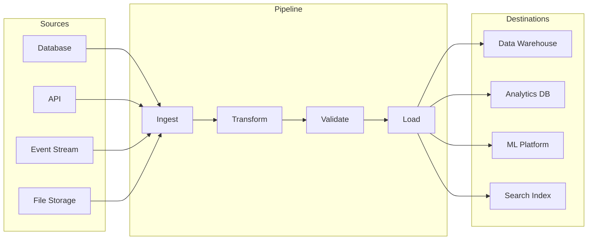
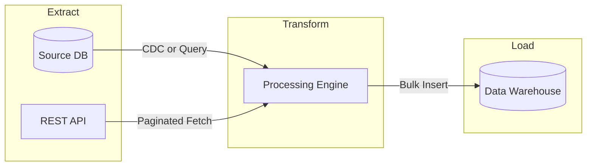
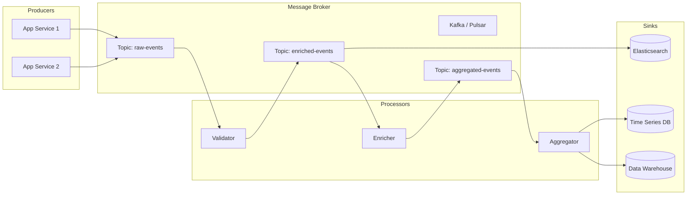
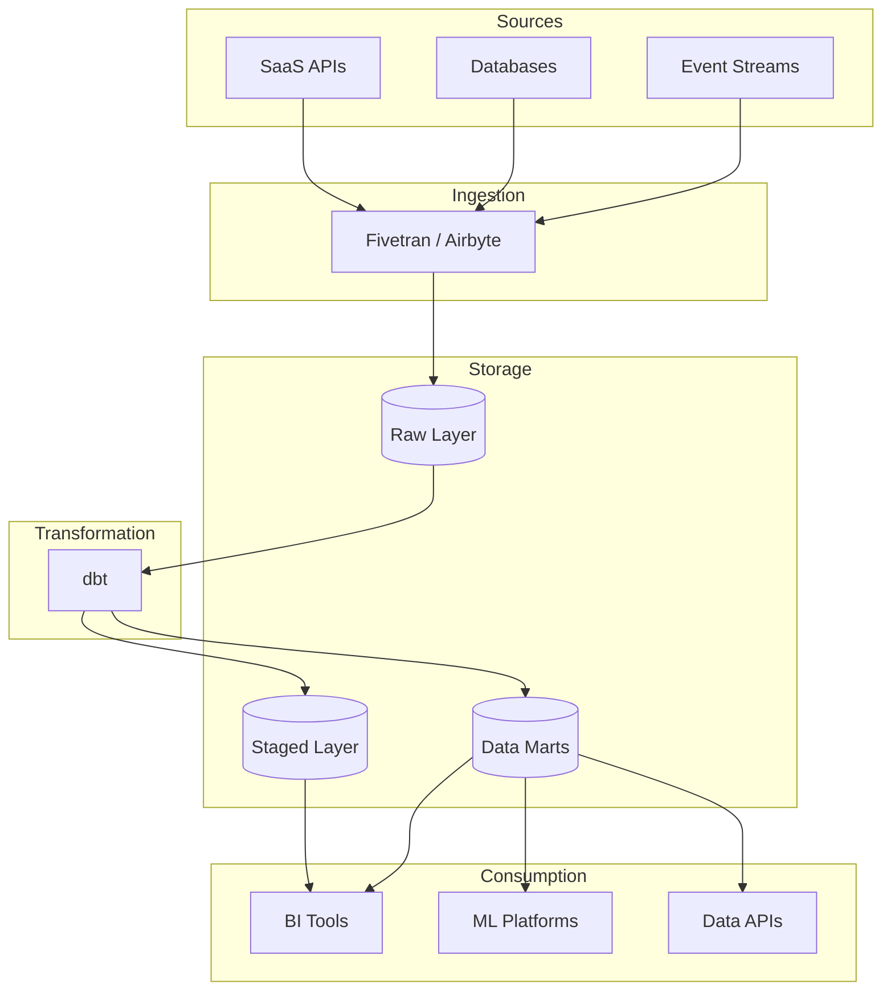
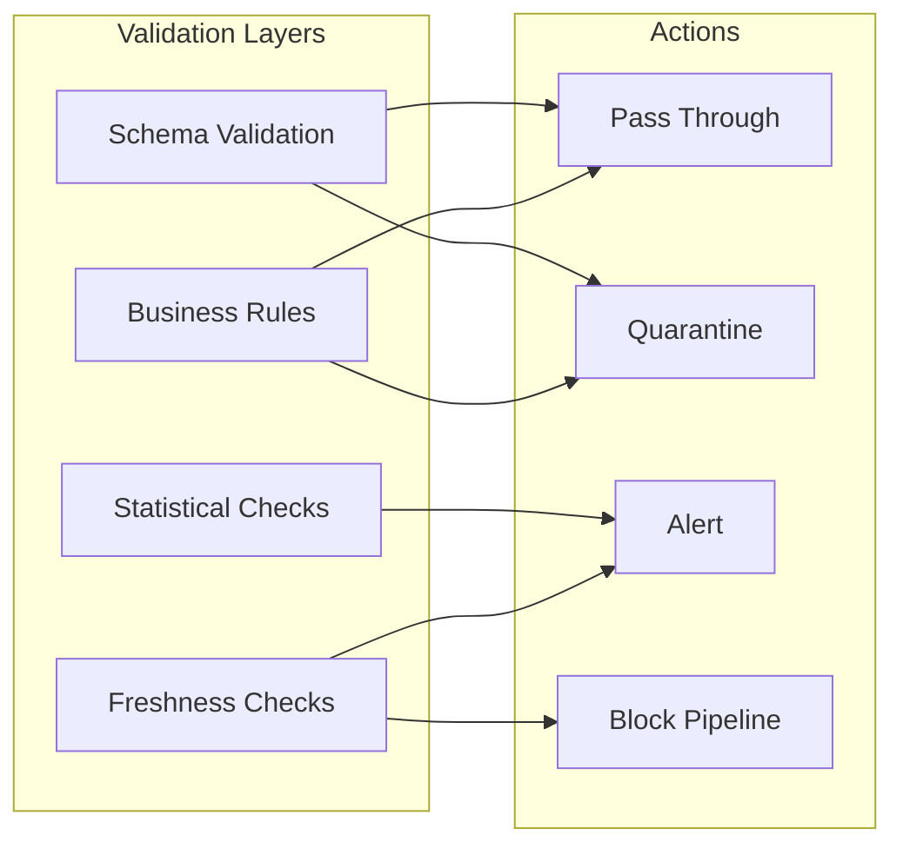
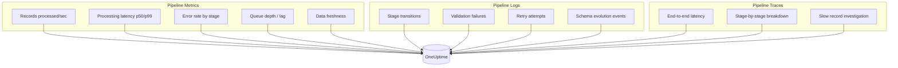
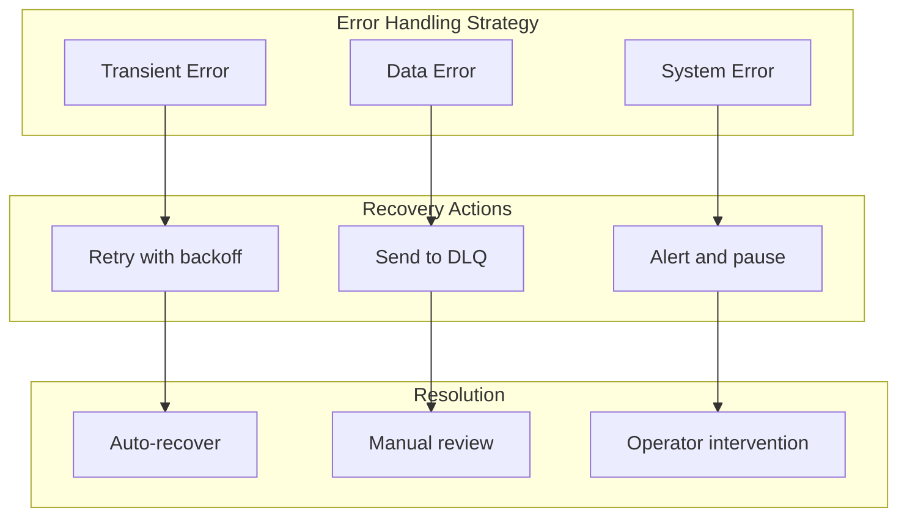
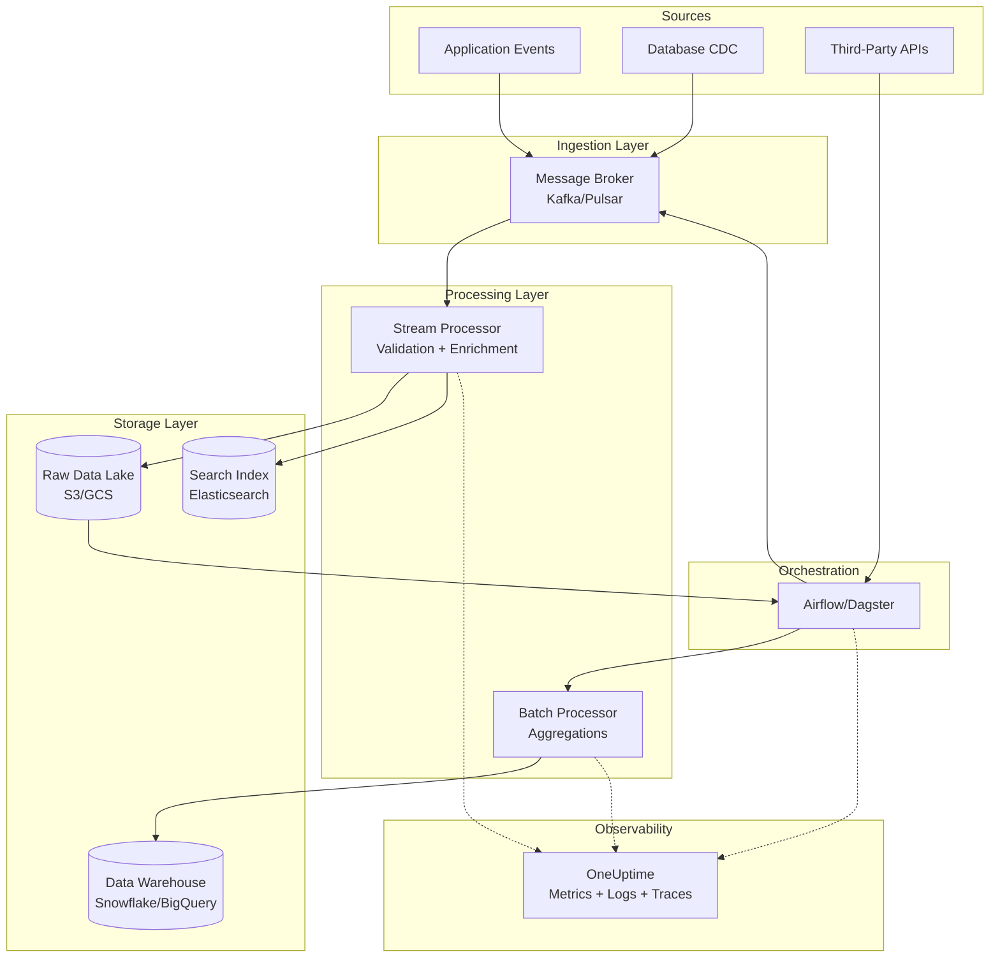

# How to Build Data Pipeline Architecture

Author: [nawazdhandala](https://github.com/nawazdhandala)

Tags: Data Pipeline, ETL, Data Engineering, DevOps

Description: A practical guide to designing, building, and operating production-grade data pipelines that scale reliably while remaining maintainable and observable.

---

Data pipelines are the circulatory system of modern software. They move information from where it is generated to where it creates value. Yet building a pipeline that works in development and one that survives production traffic are two very different challenges.

This post walks you through the architecture, patterns, and operational practices needed to build data pipelines that are reliable, scalable, and debuggable. Whether you are moving clickstream events to a warehouse, syncing databases, or powering real-time dashboards, the fundamentals stay the same.

---

## What Is a Data Pipeline?

A data pipeline is a series of processing steps that move data from one or more sources to one or more destinations, transforming it along the way.



The core phases are:

- **Ingest**: Pull or receive data from sources
- **Transform**: Clean, enrich, aggregate, and reshape
- **Validate**: Ensure data quality and schema compliance
- **Load**: Write to destination systems

Simple in concept, complex in execution. The devil lives in failure handling, ordering guarantees, exactly-once semantics, and operational visibility.

---

## Batch vs Streaming: Choosing Your Paradigm

Before diving into architecture, you need to decide: batch, streaming, or hybrid?

| Aspect | Batch Processing | Stream Processing |
|--------|------------------|-------------------|
| Latency | Minutes to hours | Milliseconds to seconds |
| Complexity | Lower | Higher |
| Cost | Compute on-demand | Always-on infrastructure |
| Use Cases | Reports, ML training, backfills | Real-time dashboards, fraud detection, alerts |
| Failure Recovery | Rerun the batch | Checkpointing, replay from offset |
| State Management | External (DB, files) | Built-in (windowing, aggregations) |

**When to choose batch:**
- Latency requirements are hours, not seconds
- Data sources only provide periodic dumps
- Transformations require full dataset context (e.g., percentile calculations)

**When to choose streaming:**
- Users expect real-time updates
- Event ordering matters
- You need to react to data as it arrives (alerting, fraud)

**Hybrid (Lambda/Kappa):**
Most production systems end up hybrid. Streaming handles the hot path; batch handles historical reprocessing and backfills.

---

## Core Architecture Patterns

### Pattern 1: Simple ETL Pipeline

The classic Extract-Transform-Load pattern. Good for periodic data movement with moderate volumes.



This Python example demonstrates a simple ETL job that extracts user data from a source database, transforms it by computing derived fields, and loads it into a warehouse. Notice the explicit transaction handling and batch sizing for reliability:

```python
# simple_etl.py
# A minimal but production-aware ETL pattern
import logging
from datetime import datetime, timedelta
from dataclasses import dataclass
from typing import Iterator, List

# Configure structured logging for observability
logging.basicConfig(
    format='%(asctime)s %(levelname)s %(message)s',
    level=logging.INFO
)
logger = logging.getLogger(__name__)

@dataclass
class UserEvent:
    """Domain model for user events being processed"""
    user_id: str
    event_type: str
    timestamp: datetime
    properties: dict

def extract_events(
    source_db,
    start_time: datetime,
    end_time: datetime,
    batch_size: int = 1000
) -> Iterator[List[UserEvent]]:
    """
    Extract events in batches to control memory usage.
    Yields batches rather than loading everything at once.
    """
    query = """
        SELECT user_id, event_type, timestamp, properties
        FROM events
        WHERE timestamp >= %s AND timestamp < %s
        ORDER BY timestamp
    """

    offset = 0
    while True:
        # Paginate through results to avoid memory issues
        batch_query = f"{query} LIMIT {batch_size} OFFSET {offset}"
        rows = source_db.execute(batch_query, (start_time, end_time))

        if not rows:
            break

        events = [
            UserEvent(
                user_id=row['user_id'],
                event_type=row['event_type'],
                timestamp=row['timestamp'],
                properties=row['properties']
            )
            for row in rows
        ]

        logger.info(f"Extracted batch of {len(events)} events at offset {offset}")
        yield events
        offset += batch_size

def transform_events(events: List[UserEvent]) -> List[dict]:
    """
    Apply business logic transformations.
    Keep transformations pure and testable.
    """
    transformed = []
    for event in events:
        # Compute derived fields
        record = {
            'user_id': event.user_id,
            'event_type': event.event_type,
            'event_date': event.timestamp.date().isoformat(),
            'event_hour': event.timestamp.hour,
            # Flatten nested properties for easier querying
            'device_type': event.properties.get('device', 'unknown'),
            'country': event.properties.get('geo', {}).get('country', 'unknown'),
            'processed_at': datetime.utcnow().isoformat()
        }
        transformed.append(record)

    return transformed

def load_to_warehouse(warehouse_db, records: List[dict], table: str):
    """
    Bulk load records to warehouse.
    Uses transactions for atomicity.
    """
    if not records:
        return

    # Start transaction for atomic batch insert
    with warehouse_db.transaction():
        warehouse_db.bulk_insert(table, records)
        logger.info(f"Loaded {len(records)} records to {table}")

def run_etl_job(source_db, warehouse_db, run_date: datetime):
    """
    Main ETL orchestration function.
    Processes one day of data with full observability.
    """
    start_time = run_date.replace(hour=0, minute=0, second=0)
    end_time = start_time + timedelta(days=1)

    logger.info(f"Starting ETL for {start_time.date()}")

    total_processed = 0
    for batch in extract_events(source_db, start_time, end_time):
        transformed = transform_events(batch)
        load_to_warehouse(warehouse_db, transformed, 'analytics.user_events')
        total_processed += len(batch)

    logger.info(f"ETL complete. Processed {total_processed} events")
    return total_processed
```

### Pattern 2: Event-Driven Streaming Pipeline

For real-time use cases, events flow through a message broker with stateless processors.



This streaming processor example uses Kafka for message transport. The key insight is idempotent processing: every message has a unique ID, and we track processed IDs to handle redeliveries gracefully:

```python
# streaming_processor.py
# Kafka-based streaming processor with exactly-once semantics
import json
import logging
from datetime import datetime
from typing import Optional
from dataclasses import dataclass
from kafka import KafkaConsumer, KafkaProducer

logger = logging.getLogger(__name__)

@dataclass
class ProcessedEvent:
    """Event after processing with enrichment data"""
    event_id: str
    user_id: str
    event_type: str
    timestamp: datetime
    enrichments: dict
    processing_timestamp: datetime

class StreamProcessor:
    """
    Stateless stream processor with at-least-once delivery.
    Uses idempotent writes to achieve effective exactly-once.
    """

    def __init__(
        self,
        bootstrap_servers: str,
        input_topic: str,
        output_topic: str,
        consumer_group: str
    ):
        # Consumer configured for manual offset management
        # This gives us control over when to commit
        self.consumer = KafkaConsumer(
            input_topic,
            bootstrap_servers=bootstrap_servers,
            group_id=consumer_group,
            auto_offset_reset='earliest',
            enable_auto_commit=False,  # Manual commit for reliability
            value_deserializer=lambda m: json.loads(m.decode('utf-8'))
        )

        # Producer with idempotence enabled
        # Kafka will deduplicate retried sends
        self.producer = KafkaProducer(
            bootstrap_servers=bootstrap_servers,
            acks='all',  # Wait for all replicas
            enable_idempotence=True,  # Exactly-once producer semantics
            value_serializer=lambda v: json.dumps(v).encode('utf-8')
        )

        self.output_topic = output_topic
        self.processed_ids = set()  # In-memory dedup (use Redis in production)

    def process_event(self, raw_event: dict) -> Optional[ProcessedEvent]:
        """
        Core processing logic. Returns None if event should be filtered.
        Keep this function pure and testable.
        """
        event_id = raw_event.get('event_id')

        # Idempotency check: skip already processed events
        if event_id in self.processed_ids:
            logger.debug(f"Skipping duplicate event {event_id}")
            return None

        # Validate required fields
        required = ['event_id', 'user_id', 'event_type', 'timestamp']
        if not all(k in raw_event for k in required):
            logger.warning(f"Invalid event missing required fields: {raw_event}")
            return None

        # Enrich the event with derived data
        enrichments = {
            'day_of_week': datetime.fromisoformat(
                raw_event['timestamp']
            ).strftime('%A'),
            'is_weekend': datetime.fromisoformat(
                raw_event['timestamp']
            ).weekday() >= 5,
        }

        return ProcessedEvent(
            event_id=event_id,
            user_id=raw_event['user_id'],
            event_type=raw_event['event_type'],
            timestamp=datetime.fromisoformat(raw_event['timestamp']),
            enrichments=enrichments,
            processing_timestamp=datetime.utcnow()
        )

    def run(self):
        """
        Main processing loop with proper error handling and commits.
        """
        logger.info("Starting stream processor")

        for message in self.consumer:
            try:
                processed = self.process_event(message.value)

                if processed:
                    # Serialize and send to output topic
                    output = {
                        'event_id': processed.event_id,
                        'user_id': processed.user_id,
                        'event_type': processed.event_type,
                        'timestamp': processed.timestamp.isoformat(),
                        'enrichments': processed.enrichments,
                        'processed_at': processed.processing_timestamp.isoformat()
                    }

                    # Send and wait for acknowledgment
                    future = self.producer.send(self.output_topic, output)
                    future.get(timeout=10)  # Block until sent

                    # Track for deduplication
                    self.processed_ids.add(processed.event_id)

                    logger.debug(f"Processed event {processed.event_id}")

                # Commit offset only after successful processing
                self.consumer.commit()

            except Exception as e:
                # Log error but don't commit - message will be reprocessed
                logger.error(f"Error processing message: {e}", exc_info=True)
                # In production: send to dead letter queue after N retries
```

### Pattern 3: Modern Data Stack (ELT)

The modern approach flips the script: load raw data first, then transform in the warehouse using SQL.



This dbt model example shows how transformations become version-controlled SQL. The model creates a clean orders fact table from raw data, with tests ensuring data quality:

```sql
-- models/marts/orders/fct_orders.sql
-- dbt model for the orders fact table
-- Transforms raw order data into analytics-ready format

{{
    config(
        materialized='incremental',
        unique_key='order_id',
        partition_by={
            "field": "order_date",
            "data_type": "date",
            "granularity": "day"
        }
    )
}}

WITH raw_orders AS (
    -- Pull from raw layer, applying basic type casts
    SELECT
        id AS order_id,
        user_id,
        CAST(created_at AS TIMESTAMP) AS order_timestamp,
        CAST(created_at AS DATE) AS order_date,
        status,
        CAST(total_cents AS DECIMAL) / 100 AS total_amount,
        currency,
        _loaded_at
    FROM {{ source('raw', 'orders') }}

    
    -- Only process new data on incremental runs
    WHERE _loaded_at > (SELECT MAX(_loaded_at) FROM {{ this }})
    
),

users AS (
    -- Join with user dimension for enrichment
    SELECT
        user_id,
        signup_date,
        country,
        customer_segment
    FROM {{ ref('dim_users') }}
),

final AS (
    SELECT
        o.order_id,
        o.user_id,
        o.order_timestamp,
        o.order_date,
        o.status,
        o.total_amount,
        o.currency,

        -- Derived fields
        u.country AS user_country,
        u.customer_segment,
        DATEDIFF('day', u.signup_date, o.order_date) AS days_since_signup,

        -- Is this user's first order?
        ROW_NUMBER() OVER (
            PARTITION BY o.user_id
            ORDER BY o.order_timestamp
        ) = 1 AS is_first_order,

        -- Processing metadata
        CURRENT_TIMESTAMP() AS processed_at

    FROM raw_orders o
    LEFT JOIN users u ON o.user_id = u.user_id
)

SELECT * FROM final
```

The schema file defines tests that run after each dbt run, catching data quality issues before they reach consumers:

```yaml
# models/marts/orders/schema.yml
# dbt schema file with tests and documentation

version: 2

models:
  - name: fct_orders
    description: "Order fact table for analytics"

    columns:
      - name: order_id
        description: "Primary key"
        tests:
          - unique
          - not_null

      - name: user_id
        description: "Foreign key to dim_users"
        tests:
          - not_null
          - relationships:
              to: ref('dim_users')
              field: user_id

      - name: total_amount
        description: "Order total in local currency"
        tests:
          - not_null
          - dbt_utils.expression_is_true:
              expression: ">= 0"

      - name: status
        description: "Order status"
        tests:
          - accepted_values:
              values: ['pending', 'confirmed', 'shipped', 'delivered', 'cancelled']
```

---

## Data Quality and Validation

Bad data in, bad decisions out. Build validation into every stage.



This validator class implements a layered validation approach. Schema validation catches structural issues, business rules catch semantic issues, and statistical checks catch distribution anomalies:

```python
# data_validator.py
# Layered data validation framework
from dataclasses import dataclass
from datetime import datetime, timedelta
from typing import List, Dict, Any, Callable
import statistics

@dataclass
class ValidationResult:
    """Result of a validation check"""
    check_name: str
    passed: bool
    severity: str  # 'error', 'warning', 'info'
    message: str
    failed_records: int = 0
    total_records: int = 0

class DataValidator:
    """
    Validates data at multiple levels:
    1. Schema - structural correctness
    2. Business rules - semantic correctness
    3. Statistical - distribution anomalies
    4. Freshness - data currency
    """

    def __init__(self, schema: dict, rules: List[Callable]):
        self.schema = schema
        self.rules = rules
        self.results: List[ValidationResult] = []

    def validate_schema(self, records: List[dict]) -> ValidationResult:
        """
        Check that all records conform to expected schema.
        Fast-fail on structural issues.
        """
        failed = 0
        required_fields = self.schema.get('required', [])
        field_types = self.schema.get('types', {})

        for record in records:
            # Check required fields exist
            if not all(f in record for f in required_fields):
                failed += 1
                continue

            # Check field types
            for field, expected_type in field_types.items():
                if field in record and not isinstance(record[field], expected_type):
                    failed += 1
                    break

        passed = failed == 0
        return ValidationResult(
            check_name='schema_validation',
            passed=passed,
            severity='error' if not passed else 'info',
            message=f"Schema validation: {failed}/{len(records)} records failed",
            failed_records=failed,
            total_records=len(records)
        )

    def validate_business_rules(self, records: List[dict]) -> List[ValidationResult]:
        """
        Apply custom business rule functions to data.
        Each rule returns (passed: bool, message: str).
        """
        results = []

        for rule_fn in self.rules:
            failed = 0
            for record in records:
                passed, msg = rule_fn(record)
                if not passed:
                    failed += 1

            rule_passed = failed == 0
            results.append(ValidationResult(
                check_name=rule_fn.__name__,
                passed=rule_passed,
                severity='warning' if not rule_passed else 'info',
                message=f"{rule_fn.__name__}: {failed} failures",
                failed_records=failed,
                total_records=len(records)
            ))

        return results

    def validate_statistics(
        self,
        records: List[dict],
        numeric_field: str,
        historical_mean: float,
        historical_stddev: float,
        threshold_sigmas: float = 3.0
    ) -> ValidationResult:
        """
        Statistical anomaly detection.
        Flags if current batch deviates significantly from historical norms.
        """
        values = [r[numeric_field] for r in records if numeric_field in r]

        if not values:
            return ValidationResult(
                check_name=f'stats_{numeric_field}',
                passed=False,
                severity='error',
                message=f"No values found for {numeric_field}"
            )

        current_mean = statistics.mean(values)
        deviation = abs(current_mean - historical_mean) / historical_stddev

        passed = deviation <= threshold_sigmas
        return ValidationResult(
            check_name=f'stats_{numeric_field}',
            passed=passed,
            severity='warning' if not passed else 'info',
            message=f"Mean {current_mean:.2f} is {deviation:.1f} sigmas from historical {historical_mean:.2f}",
            total_records=len(values)
        )

    def validate_freshness(
        self,
        records: List[dict],
        timestamp_field: str,
        max_age: timedelta
    ) -> ValidationResult:
        """
        Check that data is not stale.
        Critical for time-sensitive pipelines.
        """
        if not records:
            return ValidationResult(
                check_name='freshness',
                passed=False,
                severity='error',
                message="No records to check freshness"
            )

        # Find the most recent record
        timestamps = [
            datetime.fromisoformat(r[timestamp_field])
            for r in records
            if timestamp_field in r
        ]

        if not timestamps:
            return ValidationResult(
                check_name='freshness',
                passed=False,
                severity='error',
                message=f"No valid timestamps in {timestamp_field}"
            )

        newest = max(timestamps)
        age = datetime.utcnow() - newest

        passed = age <= max_age
        return ValidationResult(
            check_name='freshness',
            passed=passed,
            severity='error' if not passed else 'info',
            message=f"Newest record is {age} old (max allowed: {max_age})"
        )

# Example business rules
def order_amount_positive(record: dict) -> tuple:
    """Order amounts must be positive"""
    amount = record.get('total_amount', 0)
    return (amount > 0, f"Amount {amount} must be positive")

def valid_email_format(record: dict) -> tuple:
    """Email must contain @ symbol"""
    email = record.get('email', '')
    valid = '@' in email and '.' in email.split('@')[-1]
    return (valid, f"Invalid email format: {email}")
```

---

## Observability for Data Pipelines

You cannot fix what you cannot see. Instrument your pipelines like you instrument your services.



This instrumentation module shows how to add OpenTelemetry tracing and metrics to pipeline stages. Each stage creates a span with relevant attributes, making debugging straightforward:

```python
# pipeline_observability.py
# OpenTelemetry instrumentation for data pipelines
from opentelemetry import trace, metrics
from opentelemetry.trace import Status, StatusCode
from opentelemetry.sdk.trace import TracerProvider
from opentelemetry.sdk.metrics import MeterProvider
from opentelemetry.exporter.otlp.proto.grpc.trace_exporter import OTLPSpanExporter
from opentelemetry.exporter.otlp.proto.grpc.metric_exporter import OTLPMetricExporter
import time
from functools import wraps
from typing import Callable
import logging

logger = logging.getLogger(__name__)

# Initialize OpenTelemetry
trace.set_tracer_provider(TracerProvider())
tracer = trace.get_tracer("data-pipeline")

meter = metrics.get_meter("data-pipeline")

# Define pipeline metrics
records_processed = meter.create_counter(
    "pipeline.records.processed",
    description="Total records processed",
    unit="records"
)

processing_duration = meter.create_histogram(
    "pipeline.stage.duration",
    description="Time spent in each pipeline stage",
    unit="seconds"
)

validation_failures = meter.create_counter(
    "pipeline.validation.failures",
    description="Number of validation failures",
    unit="records"
)

queue_lag = meter.create_observable_gauge(
    "pipeline.queue.lag",
    description="Current lag behind source"
)

def instrument_stage(stage_name: str):
    """
    Decorator to instrument pipeline stages with tracing and metrics.
    Captures duration, record counts, and errors.
    """
    def decorator(func: Callable):
        @wraps(func)
        def wrapper(*args, **kwargs):
            # Start a span for this stage
            with tracer.start_as_current_span(
                f"pipeline.{stage_name}",
                attributes={
                    "pipeline.stage": stage_name,
                }
            ) as span:
                start_time = time.time()

                try:
                    # Execute the stage
                    result = func(*args, **kwargs)

                    # Record success metrics
                    duration = time.time() - start_time
                    record_count = len(result) if hasattr(result, '__len__') else 1

                    span.set_attribute("pipeline.records_count", record_count)
                    span.set_status(Status(StatusCode.OK))

                    records_processed.add(
                        record_count,
                        {"stage": stage_name, "status": "success"}
                    )
                    processing_duration.record(
                        duration,
                        {"stage": stage_name}
                    )

                    logger.info(
                        f"Stage {stage_name} completed",
                        extra={
                            "stage": stage_name,
                            "records": record_count,
                            "duration_ms": duration * 1000
                        }
                    )

                    return result

                except Exception as e:
                    # Record failure metrics
                    duration = time.time() - start_time

                    span.set_status(Status(StatusCode.ERROR, str(e)))
                    span.record_exception(e)

                    records_processed.add(
                        0,
                        {"stage": stage_name, "status": "error"}
                    )
                    processing_duration.record(
                        duration,
                        {"stage": stage_name}
                    )

                    logger.error(
                        f"Stage {stage_name} failed: {e}",
                        extra={"stage": stage_name},
                        exc_info=True
                    )
                    raise

        return wrapper
    return decorator

# Example usage with instrumented stages
@instrument_stage("extract")
def extract_data(source, batch_size: int):
    """Extract data from source with automatic instrumentation"""
    return source.fetch(batch_size)

@instrument_stage("transform")
def transform_data(records):
    """Transform records with automatic instrumentation"""
    return [transform_record(r) for r in records]

@instrument_stage("validate")
def validate_data(records, validator):
    """Validate records, tracking failure counts"""
    valid = []
    invalid = []

    for record in records:
        if validator.is_valid(record):
            valid.append(record)
        else:
            invalid.append(record)
            validation_failures.add(1, {"reason": validator.last_error})

    return valid, invalid

@instrument_stage("load")
def load_data(records, destination):
    """Load records to destination with automatic instrumentation"""
    destination.bulk_insert(records)
    return records
```

---

## Error Handling and Recovery

Failures are inevitable. Design for them.



This retry handler implements exponential backoff with jitter, dead letter queue routing for persistent failures, and circuit breaking to prevent cascade failures:

```python
# error_handling.py
# Robust error handling for data pipelines
import time
import random
import logging
from typing import Callable, Any, Optional
from dataclasses import dataclass
from datetime import datetime
from enum import Enum

logger = logging.getLogger(__name__)

class ErrorCategory(Enum):
    TRANSIENT = "transient"      # Network timeout, temporary unavailability
    DATA = "data"                 # Validation failure, schema mismatch
    SYSTEM = "system"             # Configuration error, resource exhaustion

@dataclass
class RetryConfig:
    """Configuration for retry behavior"""
    max_attempts: int = 3
    base_delay_seconds: float = 1.0
    max_delay_seconds: float = 60.0
    exponential_base: float = 2.0
    jitter: bool = True

class DeadLetterQueue:
    """
    Dead Letter Queue for records that fail processing.
    Stores failed records for later investigation and replay.
    """

    def __init__(self, storage_backend):
        self.storage = storage_backend

    def send(
        self,
        record: dict,
        error: Exception,
        stage: str,
        attempt_count: int
    ):
        """Send a failed record to the DLQ with context"""
        dlq_entry = {
            'original_record': record,
            'error_type': type(error).__name__,
            'error_message': str(error),
            'failed_stage': stage,
            'attempt_count': attempt_count,
            'failed_at': datetime.utcnow().isoformat(),
            'pipeline_run_id': self._get_current_run_id()
        }

        self.storage.write(dlq_entry)
        logger.warning(
            f"Record sent to DLQ after {attempt_count} attempts",
            extra={
                'stage': stage,
                'error': str(error)
            }
        )

    def replay(self, filter_criteria: dict = None):
        """Retrieve records from DLQ for reprocessing"""
        return self.storage.query(filter_criteria or {})

    def _get_current_run_id(self) -> str:
        # In production, get from context/environment
        return "run_" + datetime.utcnow().strftime("%Y%m%d_%H%M%S")

def classify_error(error: Exception) -> ErrorCategory:
    """
    Classify errors to determine appropriate handling strategy.
    Extend this based on your specific error types.
    """
    transient_errors = (
        ConnectionError,
        TimeoutError,
        # Add your transient error types
    )

    data_errors = (
        ValueError,
        KeyError,
        TypeError,
        # Add validation error types
    )

    if isinstance(error, transient_errors):
        return ErrorCategory.TRANSIENT
    elif isinstance(error, data_errors):
        return ErrorCategory.DATA
    else:
        return ErrorCategory.SYSTEM

def retry_with_backoff(
    func: Callable,
    config: RetryConfig = RetryConfig(),
    on_retry: Optional[Callable] = None
) -> Callable:
    """
    Decorator that adds retry logic with exponential backoff.
    Only retries transient errors; data errors fail fast.
    """
    def wrapper(*args, **kwargs) -> Any:
        last_error = None

        for attempt in range(1, config.max_attempts + 1):
            try:
                return func(*args, **kwargs)

            except Exception as e:
                last_error = e
                error_category = classify_error(e)

                # Don't retry data errors or system errors
                if error_category != ErrorCategory.TRANSIENT:
                    logger.error(
                        f"Non-retryable error ({error_category.value}): {e}"
                    )
                    raise

                # Check if we have attempts left
                if attempt == config.max_attempts:
                    logger.error(
                        f"Max retries ({config.max_attempts}) exceeded"
                    )
                    raise

                # Calculate delay with exponential backoff
                delay = min(
                    config.base_delay_seconds * (config.exponential_base ** (attempt - 1)),
                    config.max_delay_seconds
                )

                # Add jitter to prevent thundering herd
                if config.jitter:
                    delay = delay * (0.5 + random.random())

                logger.warning(
                    f"Attempt {attempt} failed, retrying in {delay:.2f}s: {e}"
                )

                if on_retry:
                    on_retry(attempt, e, delay)

                time.sleep(delay)

        raise last_error

    return wrapper

class CircuitBreaker:
    """
    Circuit breaker to prevent cascade failures.
    Opens after threshold failures, preventing further calls.
    """

    def __init__(
        self,
        failure_threshold: int = 5,
        recovery_timeout: float = 60.0
    ):
        self.failure_threshold = failure_threshold
        self.recovery_timeout = recovery_timeout
        self.failure_count = 0
        self.last_failure_time = None
        self.state = "closed"  # closed, open, half-open

    def can_execute(self) -> bool:
        """Check if the circuit allows execution"""
        if self.state == "closed":
            return True

        if self.state == "open":
            # Check if recovery timeout has passed
            if time.time() - self.last_failure_time >= self.recovery_timeout:
                self.state = "half-open"
                return True
            return False

        # half-open: allow one test request
        return True

    def record_success(self):
        """Record a successful call"""
        self.failure_count = 0
        self.state = "closed"

    def record_failure(self):
        """Record a failed call"""
        self.failure_count += 1
        self.last_failure_time = time.time()

        if self.failure_count >= self.failure_threshold:
            self.state = "open"
            logger.error(
                f"Circuit breaker opened after {self.failure_count} failures"
            )
```

---

## Scaling Considerations

As data volume grows, you need strategies for horizontal scaling.

| Challenge | Solution |
|-----------|----------|
| Single-threaded bottleneck | Partition data, run parallel workers |
| Memory constraints | Stream processing, batch sizing |
| Destination write limits | Write buffering, batch coalescing |
| Coordinator overhead | Stateless workers with external state |
| Uneven partition load | Dynamic rebalancing, consistent hashing |

This partitioned processor example shows how to scale horizontally by partitioning data. Each worker processes a subset of partitions, and work can be rebalanced as workers join or leave:

```python
# scaling.py
# Horizontal scaling patterns for data pipelines
import hashlib
from typing import List, Dict, Any
from concurrent.futures import ThreadPoolExecutor, ProcessPoolExecutor
import multiprocessing

def partition_key(record: dict, key_field: str, num_partitions: int) -> int:
    """
    Consistent hashing to assign records to partitions.
    Same key always goes to same partition for ordering guarantees.
    """
    key_value = str(record.get(key_field, ''))
    hash_value = int(hashlib.md5(key_value.encode()).hexdigest(), 16)
    return hash_value % num_partitions

class PartitionedProcessor:
    """
    Process data in parallel across partitions.
    Maintains ordering within each partition.
    """

    def __init__(
        self,
        num_partitions: int,
        partition_key_field: str,
        process_func
    ):
        self.num_partitions = num_partitions
        self.partition_key_field = partition_key_field
        self.process_func = process_func

    def partition_records(self, records: List[dict]) -> Dict[int, List[dict]]:
        """Split records into partitions"""
        partitions = {i: [] for i in range(self.num_partitions)}

        for record in records:
            partition_id = partition_key(
                record,
                self.partition_key_field,
                self.num_partitions
            )
            partitions[partition_id].append(record)

        return partitions

    def process_parallel(self, records: List[dict], max_workers: int = None):
        """
        Process partitions in parallel using process pool.
        CPU-bound work benefits from multiple processes.
        """
        if max_workers is None:
            max_workers = min(self.num_partitions, multiprocessing.cpu_count())

        partitions = self.partition_records(records)
        results = []

        with ProcessPoolExecutor(max_workers=max_workers) as executor:
            # Submit each partition for processing
            futures = {
                executor.submit(self.process_func, partition_records): partition_id
                for partition_id, partition_records in partitions.items()
                if partition_records  # Skip empty partitions
            }

            # Collect results
            for future in futures:
                partition_id = futures[future]
                try:
                    result = future.result()
                    results.extend(result)
                except Exception as e:
                    # Log but continue - other partitions may succeed
                    logger.error(f"Partition {partition_id} failed: {e}")

        return results

class BackpressureController:
    """
    Control processing rate based on downstream capacity.
    Prevents overwhelming sinks.
    """

    def __init__(
        self,
        initial_batch_size: int = 1000,
        min_batch_size: int = 100,
        max_batch_size: int = 10000,
        target_latency_ms: float = 1000
    ):
        self.batch_size = initial_batch_size
        self.min_batch_size = min_batch_size
        self.max_batch_size = max_batch_size
        self.target_latency_ms = target_latency_ms

    def adjust(self, actual_latency_ms: float):
        """
        Adjust batch size based on actual latency.
        Larger batches when fast, smaller when slow.
        """
        ratio = self.target_latency_ms / max(actual_latency_ms, 1)

        # Smooth adjustment - don't change too drastically
        adjustment_factor = 1 + (ratio - 1) * 0.5

        new_size = int(self.batch_size * adjustment_factor)
        self.batch_size = max(
            self.min_batch_size,
            min(new_size, self.max_batch_size)
        )

        return self.batch_size
```

---

## Testing Data Pipelines

Pipelines need testing at multiple levels.

| Test Type | What It Covers | Tools |
|-----------|----------------|-------|
| Unit Tests | Individual transformations | pytest, unittest |
| Integration Tests | Stage-to-stage flow | testcontainers, localstack |
| Data Tests | Schema, quality rules | Great Expectations, dbt tests |
| End-to-End Tests | Full pipeline execution | staging environment |
| Performance Tests | Throughput, latency | locust, custom benchmarks |

This test module demonstrates how to test pipeline components in isolation using fixtures and mocks:

```python
# test_pipeline.py
# Testing strategies for data pipelines
import pytest
from datetime import datetime, timedelta
from unittest.mock import Mock, patch

# Unit test for transformation logic
class TestTransformations:
    """Unit tests for pure transformation functions"""

    def test_transform_user_event_basic(self):
        """Test basic event transformation"""
        raw_event = {
            'user_id': 'user_123',
            'event_type': 'page_view',
            'timestamp': '2024-01-15T10:30:00',
            'properties': {
                'device': 'mobile',
                'geo': {'country': 'US'}
            }
        }

        result = transform_events([raw_event])[0]

        assert result['user_id'] == 'user_123'
        assert result['event_type'] == 'page_view'
        assert result['device_type'] == 'mobile'
        assert result['country'] == 'US'
        assert result['event_date'] == '2024-01-15'

    def test_transform_handles_missing_properties(self):
        """Test graceful handling of missing nested fields"""
        raw_event = {
            'user_id': 'user_456',
            'event_type': 'click',
            'timestamp': '2024-01-15T10:30:00',
            'properties': {}  # Empty properties
        }

        result = transform_events([raw_event])[0]

        # Should use defaults for missing fields
        assert result['device_type'] == 'unknown'
        assert result['country'] == 'unknown'

# Integration test with test containers
class TestPipelineIntegration:
    """Integration tests using real (containerized) dependencies"""

    @pytest.fixture
    def postgres_container(self):
        """Spin up a Postgres container for testing"""
        # Using testcontainers-python
        from testcontainers.postgres import PostgresContainer

        with PostgresContainer("postgres:15") as postgres:
            yield postgres.get_connection_url()

    @pytest.fixture
    def kafka_container(self):
        """Spin up Kafka for streaming tests"""
        from testcontainers.kafka import KafkaContainer

        with KafkaContainer() as kafka:
            yield kafka.get_bootstrap_server()

    def test_extract_to_transform_flow(self, postgres_container):
        """Test data flows correctly from extract to transform"""
        # Setup: insert test data
        source_db = create_connection(postgres_container)
        source_db.execute("""
            INSERT INTO events (user_id, event_type, timestamp, properties)
            VALUES ('user_1', 'login', NOW(), '{"device": "desktop"}')
        """)

        # Execute pipeline stages
        extracted = list(extract_events(
            source_db,
            datetime.utcnow() - timedelta(hours=1),
            datetime.utcnow() + timedelta(hours=1)
        ))

        transformed = transform_events(extracted[0])

        # Verify
        assert len(transformed) == 1
        assert transformed[0]['device_type'] == 'desktop'

# Data quality tests
class TestDataQuality:
    """Tests for data validation rules"""

    def test_schema_validation_passes_valid_records(self):
        """Valid records should pass schema validation"""
        schema = {
            'required': ['user_id', 'timestamp'],
            'types': {'user_id': str, 'timestamp': str}
        }

        records = [
            {'user_id': 'u1', 'timestamp': '2024-01-15T00:00:00'},
            {'user_id': 'u2', 'timestamp': '2024-01-15T00:00:01'}
        ]

        validator = DataValidator(schema, [])
        result = validator.validate_schema(records)

        assert result.passed
        assert result.failed_records == 0

    def test_schema_validation_fails_missing_required(self):
        """Missing required fields should fail validation"""
        schema = {
            'required': ['user_id', 'timestamp'],
            'types': {}
        }

        records = [
            {'user_id': 'u1'},  # Missing timestamp
        ]

        validator = DataValidator(schema, [])
        result = validator.validate_schema(records)

        assert not result.passed
        assert result.failed_records == 1

    def test_freshness_validation_catches_stale_data(self):
        """Freshness check should fail for old data"""
        records = [
            {'timestamp': (datetime.utcnow() - timedelta(hours=5)).isoformat()}
        ]

        validator = DataValidator({}, [])
        result = validator.validate_freshness(
            records,
            'timestamp',
            max_age=timedelta(hours=1)
        )

        assert not result.passed
        assert 'error' in result.severity

# Performance benchmarks
class TestPipelinePerformance:
    """Performance tests to catch regressions"""

    def test_transform_throughput(self, benchmark):
        """Transformation should process 10k records under 1 second"""
        records = [
            {
                'user_id': f'user_{i}',
                'event_type': 'page_view',
                'timestamp': datetime.utcnow().isoformat(),
                'properties': {'device': 'mobile'}
            }
            for i in range(10000)
        ]

        result = benchmark(transform_events, records)

        assert len(result) == 10000
        # benchmark fixture automatically tracks timing
```

---

## Putting It All Together: Reference Architecture

A production-ready pipeline combines all these patterns.



---

## Checklist: Building Your Pipeline

Before going to production, verify:

**Design**
- [ ] Batch vs streaming decision documented
- [ ] Data schema and contracts defined
- [ ] Failure modes and recovery strategies planned
- [ ] Scaling approach determined

**Implementation**
- [ ] Idempotent processing (safe to replay)
- [ ] Dead letter queue for failed records
- [ ] Retry logic with exponential backoff
- [ ] Validation at ingestion and transformation

**Operations**
- [ ] Metrics: throughput, latency, error rates
- [ ] Logs: structured, correlated with trace IDs
- [ ] Traces: end-to-end visibility
- [ ] Alerts: freshness, volume anomalies, error spikes

**Testing**
- [ ] Unit tests for transformations
- [ ] Integration tests for stage connections
- [ ] Data quality tests in CI
- [ ] Performance benchmarks

---

## Common Pitfalls and How to Avoid Them

| Pitfall | Symptom | Fix |
|---------|---------|-----|
| No idempotency | Duplicate records after retries | Use unique keys, dedup at write |
| Unbounded batches | OOM errors, timeouts | Paginate extracts, size batches |
| Silent failures | Missing data discovered late | Validate at every stage, alert on anomalies |
| Schema drift | Pipeline breaks on new fields | Version schemas, test compatibility |
| No backpressure | Overwhelmed destinations | Rate limit, batch coalescing |
| Missing observability | "Pipeline is slow" with no details | Instrument every stage |

---

## Final Thoughts

Building data pipelines is not about choosing the fanciest framework. It is about understanding your data, your latency requirements, and your failure modes, then engineering appropriate solutions.

Start simple. A well-instrumented batch job that you understand is better than a complex streaming system that breaks in mysterious ways. Add complexity only when you have the observability to debug it.

The best pipelines share common traits:
- They fail gracefully and recover automatically
- They tell you when something is wrong before users notice
- They can be tested, monitored, and debugged by the team that operates them

Your data infrastructure is only as good as your ability to see inside it. Invest in observability from day one.

---

**Related Reading:**
- [OpenTelemetry Collector: What It Is, When You Need It](https://oneuptime.com/blog/post/2025-09-18-what-is-opentelemetry-collector-and-why-use-one/view)
- [Logs, Metrics & Traces: Turning Three Noisy Streams into One Story](https://oneuptime.com/blog/post/2025-08-20-three-pillars-of-observability-logs-metrics-traces/view)
- [How to Structure Logs Properly in OpenTelemetry](https://oneuptime.com/blog/post/2025-08-28-how-to-structure-logs-properly-in-opentelemetry/view)
