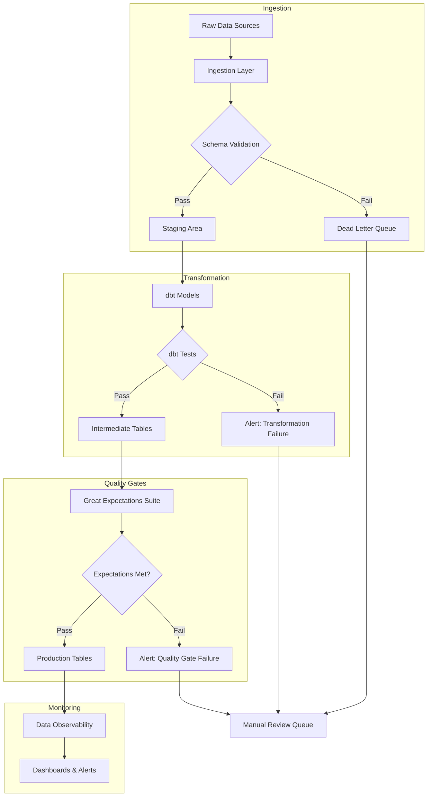
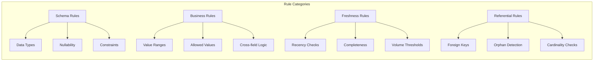
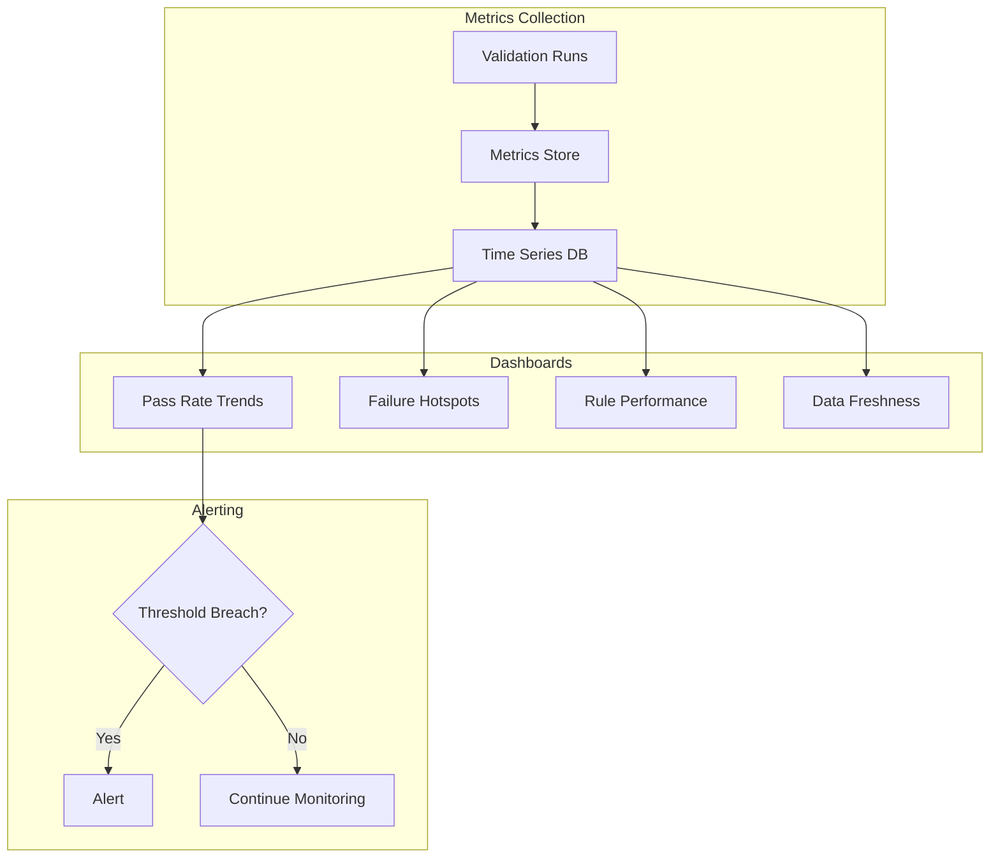

# How to Build Data Validation

Author: [nawazdhandala](https://github.com/nawazdhandala)

Tags: Data Pipeline, Data Quality, Validation, Great Expectations

Description: Learn to build data validation for ensuring data quality and integrity in data pipelines.

---

Bad data is silent. It does not crash your pipeline or throw a 500 error. It slips through, pollutes reports, breaks ML models, and erodes trust in your analytics. By the time someone notices a KPI is off, weeks of downstream damage may already be done.

Data validation is the practice of systematically checking that data conforms to expected rules, schemas, and business logic at every stage of a pipeline. It transforms "garbage in, garbage out" into "catch it early, fix it fast."

This guide walks through practical patterns for building data validation into your pipelines using Great Expectations, dbt tests, schema validation, and alerting. You will see real code, architecture diagrams, and rules you can adapt to your own systems.

---

## Why Data Validation Matters

Consider the cost of bad data:

- **Analytics Drift:** A missing currency conversion causes revenue reports to be understated by 40% for a month.
- **ML Model Collapse:** Null values in training data produce a model that predicts zeros for everyone.
- **Compliance Failures:** PII leaks through an unchecked column transformation.
- **Operational Chaos:** Duplicate records trigger double billing to customers.

Validation is not overhead. It is insurance. The earlier you catch issues, the cheaper they are to fix.

---

## Data Validation Architecture

A modern data pipeline with validation baked in looks like this:



Key stages:

1. **Ingestion Validation:** Catch malformed data before it enters your system.
2. **Transformation Tests:** Ensure business logic produces correct results.
3. **Quality Gates:** Final checks before data reaches production.
4. **Continuous Monitoring:** Detect drift and anomalies over time.

---

## Schema Validation at Ingestion

The first line of defense is validating that incoming data matches the expected schema. Use JSON Schema, Pydantic, or similar tools.

### Example: Pydantic Schema Validation

```python
# schema_validator.py
# Validates incoming data records against a strict schema
# before they enter the data pipeline

from pydantic import BaseModel, Field, validator
from typing import Optional
from datetime import datetime
from decimal import Decimal
import json


class TransactionRecord(BaseModel):
    """
    Schema for incoming transaction records.
    All fields are validated on instantiation.
    """

    # Required fields with constraints
    transaction_id: str = Field(
        ...,  # ... means required
        min_length=10,
        max_length=50,
        description="Unique transaction identifier"
    )

    customer_id: str = Field(
        ...,
        min_length=1,
        description="Customer identifier, cannot be empty"
    )

    amount: Decimal = Field(
        ...,
        gt=0,  # Must be greater than zero
        description="Transaction amount in base currency"
    )

    currency: str = Field(
        ...,
        min_length=3,
        max_length=3,
        description="ISO 4217 currency code"
    )

    timestamp: datetime = Field(
        ...,
        description="Transaction timestamp in UTC"
    )

    # Optional fields with defaults
    merchant_category: Optional[str] = Field(
        default=None,
        max_length=100
    )

    is_refund: bool = Field(
        default=False
    )

    # Custom validator: currency must be uppercase
    @validator("currency")
    def currency_must_be_uppercase(cls, v):
        if v != v.upper():
            raise ValueError("Currency code must be uppercase")
        return v

    # Custom validator: timestamp cannot be in the future
    @validator("timestamp")
    def timestamp_not_future(cls, v):
        if v > datetime.utcnow():
            raise ValueError("Transaction timestamp cannot be in the future")
        return v

    class Config:
        # Reject any fields not defined in the schema
        extra = "forbid"


def validate_record(raw_data: dict) -> tuple[bool, Optional[TransactionRecord], Optional[str]]:
    """
    Validates a single record against the schema.

    Returns:
        - (True, validated_record, None) on success
        - (False, None, error_message) on failure
    """
    try:
        validated = TransactionRecord(**raw_data)
        return True, validated, None
    except Exception as e:
        return False, None, str(e)


def process_batch(records: list[dict]) -> tuple[list, list]:
    """
    Processes a batch of records, separating valid from invalid.

    Returns:
        - List of valid TransactionRecord objects
        - List of (record, error) tuples for failed validations
    """
    valid_records = []
    failed_records = []

    for record in records:
        is_valid, validated, error = validate_record(record)
        if is_valid:
            valid_records.append(validated)
        else:
            failed_records.append((record, error))

    return valid_records, failed_records


# Example usage
if __name__ == "__main__":
    # Test data: mix of valid and invalid records
    test_records = [
        {
            "transaction_id": "TXN-2026-001234",
            "customer_id": "CUST-789",
            "amount": "99.99",
            "currency": "USD",
            "timestamp": "2026-01-15T10:30:00",
            "merchant_category": "Electronics"
        },
        {
            "transaction_id": "TXN-2026-001235",
            "customer_id": "",  # Invalid: empty customer_id
            "amount": "50.00",
            "currency": "usd",  # Invalid: lowercase
            "timestamp": "2026-01-15T11:00:00"
        },
        {
            "transaction_id": "TXN-2026-001236",
            "customer_id": "CUST-790",
            "amount": "-10.00",  # Invalid: negative amount
            "currency": "EUR",
            "timestamp": "2026-01-15T12:00:00"
        }
    ]

    valid, failed = process_batch(test_records)

    print(f"Valid records: {len(valid)}")
    print(f"Failed records: {len(failed)}")

    for record, error in failed:
        print(f"  Failed: {record.get('transaction_id', 'unknown')} - {error}")
```

### Dead Letter Queue Pattern

Records that fail schema validation should not be dropped silently. Route them to a dead letter queue for investigation.

```python
# dead_letter_queue.py
# Routes failed records to a DLQ for later investigation

import json
from datetime import datetime
from dataclasses import dataclass, asdict
from typing import Any
import boto3  # For AWS SQS example


@dataclass
class DeadLetterRecord:
    """
    Wrapper for records that failed validation.
    Includes metadata for debugging.
    """
    original_record: dict
    error_message: str
    error_type: str
    pipeline_stage: str
    timestamp: str
    source_system: str

    def to_json(self) -> str:
        return json.dumps(asdict(self))


class DeadLetterQueue:
    """
    Handles routing of failed records to appropriate storage.
    Supports multiple backends: SQS, Kafka, local file, etc.
    """

    def __init__(self, queue_url: str, region: str = "us-east-1"):
        self.queue_url = queue_url
        self.sqs_client = boto3.client("sqs", region_name=region)

    def send_to_dlq(
        self,
        record: dict,
        error: str,
        pipeline_stage: str,
        source_system: str
    ) -> bool:
        """
        Sends a failed record to the dead letter queue.

        Returns True on success, False on failure.
        """
        dlq_record = DeadLetterRecord(
            original_record=record,
            error_message=error,
            error_type=type(error).__name__ if isinstance(error, Exception) else "ValidationError",
            pipeline_stage=pipeline_stage,
            timestamp=datetime.utcnow().isoformat(),
            source_system=source_system
        )

        try:
            self.sqs_client.send_message(
                QueueUrl=self.queue_url,
                MessageBody=dlq_record.to_json(),
                MessageAttributes={
                    "PipelineStage": {
                        "DataType": "String",
                        "StringValue": pipeline_stage
                    },
                    "SourceSystem": {
                        "DataType": "String",
                        "StringValue": source_system
                    }
                }
            )
            return True
        except Exception as e:
            # Log the failure but do not crash the pipeline
            print(f"Failed to send to DLQ: {e}")
            return False


def process_with_dlq(
    records: list[dict],
    validator_func,
    dlq: DeadLetterQueue,
    pipeline_stage: str,
    source_system: str
) -> list:
    """
    Processes records with automatic DLQ routing for failures.
    """
    valid_records = []

    for record in records:
        is_valid, validated, error = validator_func(record)

        if is_valid:
            valid_records.append(validated)
        else:
            # Route to DLQ for investigation
            dlq.send_to_dlq(
                record=record,
                error=error,
                pipeline_stage=pipeline_stage,
                source_system=source_system
            )

    return valid_records
```

---

## Great Expectations: Declarative Data Quality

Great Expectations is a Python library for defining, running, and documenting data quality checks. It uses "expectations" that describe what data should look like.

### Setting Up Great Expectations

```bash
# Install Great Expectations
pip install great_expectations

# Initialize a new project
great_expectations init
```

### Defining an Expectation Suite

```python
# expectations/transaction_suite.py
# Defines quality expectations for transaction data

import great_expectations as gx
from great_expectations.core.expectation_configuration import ExpectationConfiguration


def create_transaction_suite(context: gx.DataContext) -> str:
    """
    Creates an expectation suite for transaction data.

    Returns the suite name.
    """
    suite_name = "transaction_quality_suite"

    # Create or get existing suite
    suite = context.add_or_update_expectation_suite(
        expectation_suite_name=suite_name
    )

    # Define expectations
    expectations = [
        # Primary key uniqueness
        ExpectationConfiguration(
            expectation_type="expect_column_values_to_be_unique",
            kwargs={
                "column": "transaction_id"
            },
            meta={
                "notes": "Transaction IDs must be unique across all records"
            }
        ),

        # No null values in critical columns
        ExpectationConfiguration(
            expectation_type="expect_column_values_to_not_be_null",
            kwargs={
                "column": "transaction_id"
            }
        ),
        ExpectationConfiguration(
            expectation_type="expect_column_values_to_not_be_null",
            kwargs={
                "column": "customer_id"
            }
        ),
        ExpectationConfiguration(
            expectation_type="expect_column_values_to_not_be_null",
            kwargs={
                "column": "amount"
            }
        ),

        # Amount must be positive (unless refund)
        ExpectationConfiguration(
            expectation_type="expect_column_values_to_be_between",
            kwargs={
                "column": "amount",
                "min_value": 0.01,
                "max_value": 1000000,  # Business limit
                "mostly": 0.99  # Allow 1% exceptions for edge cases
            },
            meta={
                "notes": "Normal transactions should be between $0.01 and $1M"
            }
        ),

        # Currency must be valid ISO code
        ExpectationConfiguration(
            expectation_type="expect_column_values_to_be_in_set",
            kwargs={
                "column": "currency",
                "value_set": ["USD", "EUR", "GBP", "JPY", "CAD", "AUD", "CHF"]
            }
        ),

        # Timestamp must be within reasonable range
        ExpectationConfiguration(
            expectation_type="expect_column_values_to_be_between",
            kwargs={
                "column": "timestamp",
                "min_value": "2020-01-01",
                "max_value": "2030-12-31",
                "parse_strings_as_datetimes": True
            }
        ),

        # Table-level: row count should be reasonable
        ExpectationConfiguration(
            expectation_type="expect_table_row_count_to_be_between",
            kwargs={
                "min_value": 1,
                "max_value": 10000000
            }
        ),

        # Completeness: certain columns should have high fill rates
        ExpectationConfiguration(
            expectation_type="expect_column_values_to_not_be_null",
            kwargs={
                "column": "merchant_category",
                "mostly": 0.95  # Allow 5% nulls
            }
        ),

        # Referential integrity check (custom)
        ExpectationConfiguration(
            expectation_type="expect_column_pair_values_A_to_be_greater_than_B",
            kwargs={
                "column_A": "updated_at",
                "column_B": "created_at",
                "or_equal": True,
                "mostly": 1.0
            },
            meta={
                "notes": "Updated timestamp must be >= created timestamp"
            }
        )
    ]

    # Add all expectations to the suite
    for expectation in expectations:
        suite.add_expectation(expectation_configuration=expectation)

    # Save the suite
    context.update_expectation_suite(expectation_suite=suite)

    return suite_name


def run_validation(
    context: gx.DataContext,
    suite_name: str,
    dataframe
) -> dict:
    """
    Runs validation against a pandas DataFrame.

    Returns validation results.
    """
    # Create a batch from the DataFrame
    datasource = context.sources.add_or_update_pandas(name="pandas_source")
    data_asset = datasource.add_dataframe_asset(name="transaction_data")

    batch_request = data_asset.build_batch_request(dataframe=dataframe)

    # Create a checkpoint for running validations
    checkpoint = context.add_or_update_checkpoint(
        name="transaction_checkpoint",
        validations=[
            {
                "batch_request": batch_request,
                "expectation_suite_name": suite_name
            }
        ]
    )

    # Run validation
    result = checkpoint.run()

    return result


# Example usage in a pipeline
if __name__ == "__main__":
    import pandas as pd

    # Sample data
    df = pd.DataFrame({
        "transaction_id": ["TXN001", "TXN002", "TXN003"],
        "customer_id": ["C001", "C002", "C003"],
        "amount": [99.99, 150.00, 25.50],
        "currency": ["USD", "EUR", "USD"],
        "timestamp": ["2026-01-15", "2026-01-15", "2026-01-16"],
        "merchant_category": ["Retail", "Electronics", None],
        "created_at": ["2026-01-15", "2026-01-15", "2026-01-16"],
        "updated_at": ["2026-01-15", "2026-01-15", "2026-01-16"]
    })

    # Initialize context
    context = gx.get_context()

    # Create suite and run validation
    suite_name = create_transaction_suite(context)
    results = run_validation(context, suite_name, df)

    # Check if validation passed
    if results.success:
        print("All expectations passed!")
    else:
        print("Validation failed. Check data docs for details.")
```

### Great Expectations in Airflow

Integrate validation into your DAG:

```python
# dags/transaction_pipeline.py
# Airflow DAG with Great Expectations validation

from airflow import DAG
from airflow.operators.python import PythonOperator, BranchPythonOperator
from airflow.operators.empty import EmptyOperator
from airflow.utils.trigger_rule import TriggerRule
from datetime import datetime, timedelta
import great_expectations as gx


# Default arguments for the DAG
default_args = {
    "owner": "data-engineering",
    "depends_on_past": False,
    "email_on_failure": True,
    "email_on_retry": False,
    "retries": 1,
    "retry_delay": timedelta(minutes=5)
}


def extract_data(**context):
    """Extract data from source systems."""
    # Extraction logic here
    # Store result in XCom for downstream tasks
    return {"records_extracted": 1000}


def validate_data(**context):
    """
    Run Great Expectations validation.
    Returns 'load_data' if passed, 'handle_validation_failure' if failed.
    """
    # Get context and run validation
    ge_context = gx.get_context()

    # Load data from previous step (simplified)
    import pandas as pd
    df = pd.read_parquet("/tmp/staging/transactions.parquet")

    # Run validation checkpoint
    checkpoint = ge_context.get_checkpoint("transaction_checkpoint")
    result = checkpoint.run()

    # Store validation results
    context["ti"].xcom_push(
        key="validation_success",
        value=result.success
    )
    context["ti"].xcom_push(
        key="validation_stats",
        value={
            "evaluated_expectations": result.statistics.get("evaluated_expectations", 0),
            "successful_expectations": result.statistics.get("successful_expectations", 0),
            "unsuccessful_expectations": result.statistics.get("unsuccessful_expectations", 0)
        }
    )

    # Branch based on validation result
    if result.success:
        return "load_data"
    else:
        return "handle_validation_failure"


def load_data(**context):
    """Load validated data to production tables."""
    # Only runs if validation passed
    print("Loading data to production...")


def handle_validation_failure(**context):
    """
    Handle validation failures.
    Send alerts and route data to quarantine.
    """
    stats = context["ti"].xcom_pull(
        task_ids="validate_data",
        key="validation_stats"
    )

    # Send alert (integrate with OneUptime, PagerDuty, etc.)
    send_validation_alert(
        message=f"Data validation failed: {stats['unsuccessful_expectations']} expectations failed",
        severity="warning"
    )

    # Move data to quarantine for investigation
    quarantine_data()


def send_validation_alert(message: str, severity: str):
    """Send alert to monitoring system."""
    # Integration with alerting system
    pass


def quarantine_data():
    """Move failed data to quarantine area."""
    pass


# Define the DAG
with DAG(
    dag_id="transaction_pipeline_with_validation",
    default_args=default_args,
    description="Transaction ETL pipeline with data quality gates",
    schedule_interval="@hourly",
    start_date=datetime(2026, 1, 1),
    catchup=False,
    tags=["transactions", "data-quality"]
) as dag:

    # Task definitions
    start = EmptyOperator(task_id="start")

    extract = PythonOperator(
        task_id="extract_data",
        python_callable=extract_data
    )

    validate = BranchPythonOperator(
        task_id="validate_data",
        python_callable=validate_data
    )

    load = PythonOperator(
        task_id="load_data",
        python_callable=load_data
    )

    handle_failure = PythonOperator(
        task_id="handle_validation_failure",
        python_callable=handle_validation_failure
    )

    end = EmptyOperator(
        task_id="end",
        trigger_rule=TriggerRule.NONE_FAILED_MIN_ONE_SUCCESS
    )

    # Define task dependencies
    start >> extract >> validate
    validate >> [load, handle_failure]
    [load, handle_failure] >> end
```

---

## dbt Tests: Validation in Transformation

dbt (data build tool) includes built-in testing capabilities for validating transformed data. Tests run automatically after models build.

### Schema Tests in dbt

```yaml
# models/staging/schema.yml
# Defines tests for staging models

version: 2

models:
  - name: stg_transactions
    description: "Staged transaction data with basic cleaning applied"

    # Table-level tests
    tests:
      - dbt_utils.recency:
          datepart: hour
          field: loaded_at
          interval: 2
          # Fail if no data loaded in last 2 hours

    columns:
      - name: transaction_id
        description: "Unique transaction identifier"
        tests:
          - unique
          - not_null
          - dbt_utils.not_empty_string

      - name: customer_id
        description: "Foreign key to customers table"
        tests:
          - not_null
          - relationships:
              to: ref('dim_customers')
              field: customer_id

      - name: amount
        description: "Transaction amount in base currency"
        tests:
          - not_null
          - dbt_utils.accepted_range:
              min_value: 0
              max_value: 1000000
              inclusive: true

      - name: currency_code
        description: "ISO 4217 currency code"
        tests:
          - not_null
          - accepted_values:
              values: ['USD', 'EUR', 'GBP', 'JPY', 'CAD', 'AUD']

      - name: transaction_date
        description: "Date of transaction"
        tests:
          - not_null
          - dbt_utils.accepted_range:
              min_value: "'2020-01-01'"
              max_value: "current_date + interval '1 day'"

      - name: merchant_category
        description: "Merchant category code"
        tests:
          - not_null:
              config:
                severity: warn
                # Warn but do not fail on nulls
                # Some records may legitimately lack category

  - name: fct_daily_transactions
    description: "Daily aggregated transaction facts"

    tests:
      # Custom test: ensure amounts sum correctly
      - dbt_utils.equality:
          compare_model: ref('stg_transactions')
          compare_columns:
            - total_amount

    columns:
      - name: date_key
        tests:
          - unique
          - not_null

      - name: total_transactions
        tests:
          - not_null
          - dbt_utils.accepted_range:
              min_value: 0

      - name: total_amount
        tests:
          - not_null
```

### Custom dbt Tests

```sql
-- tests/generic/test_no_orphan_records.sql
-- Generic test to check for orphan records in fact tables



/*
    Checks that all values in column_name exist in parent_model.parent_column.
    This catches referential integrity issues that relationships test might miss
    in certain edge cases.
*/

with child_records as (
    select distinct {{ column_name }} as child_key
    from {{ model }}
    where {{ column_name }} is not null
),

parent_records as (
    select distinct {{ parent_column }} as parent_key
    from {{ parent_model }}
),

orphans as (
    select child_key
    from child_records
    left join parent_records
        on child_records.child_key = parent_records.parent_key
    where parent_records.parent_key is null
)

-- Return orphan records (test fails if any rows returned)
select * from orphans


```

```sql
-- tests/singular/test_transaction_balance.sql
-- Singular test: verify daily transaction balances reconcile

/*
    Business rule: The sum of all transactions for a day
    should match the daily balance snapshot (within tolerance).
*/

with transaction_totals as (
    select
        transaction_date,
        sum(amount) as calculated_total
    from {{ ref('fct_transactions') }}
    group by transaction_date
),

balance_snapshots as (
    select
        snapshot_date,
        daily_total as reported_total
    from {{ ref('daily_balance_snapshots') }}
),

discrepancies as (
    select
        t.transaction_date,
        t.calculated_total,
        b.reported_total,
        abs(t.calculated_total - b.reported_total) as difference
    from transaction_totals t
    inner join balance_snapshots b
        on t.transaction_date = b.snapshot_date
    where abs(t.calculated_total - b.reported_total) > 0.01
    -- Tolerance of 1 cent for floating point issues
)

select * from discrepancies
```

### Running dbt Tests in CI/CD

```yaml
# .github/workflows/dbt-ci.yml
# GitHub Actions workflow for dbt testing

name: dbt CI Pipeline

on:
  pull_request:
    paths:
      - 'dbt/**'
  push:
    branches:
      - main

jobs:
  dbt-test:
    runs-on: ubuntu-latest

    env:
      DBT_PROFILES_DIR: ./dbt
      SNOWFLAKE_ACCOUNT: ${{ secrets.SNOWFLAKE_ACCOUNT }}
      SNOWFLAKE_USER: ${{ secrets.SNOWFLAKE_USER }}
      SNOWFLAKE_PASSWORD: ${{ secrets.SNOWFLAKE_PASSWORD }}

    steps:
      - name: Checkout code
        uses: actions/checkout@v4

      - name: Set up Python
        uses: actions/setup-python@v5
        with:
          python-version: '3.11'

      - name: Install dependencies
        run: |
          pip install dbt-snowflake dbt-utils

      - name: Install dbt packages
        run: |
          cd dbt && dbt deps

      - name: Run dbt build with tests
        run: |
          cd dbt
          # Build models and run tests together
          dbt build --select state:modified+ --fail-fast

      - name: Generate test report
        if: always()
        run: |
          cd dbt
          dbt docs generate

      - name: Upload test artifacts
        if: failure()
        uses: actions/upload-artifact@v4
        with:
          name: dbt-test-results
          path: dbt/target/run_results.json
```

---

## Validation Rules Catalog

Organize your validation rules in a centralized catalog for discoverability and reuse.



### Example Rule Catalog

```python
# validation_rules/catalog.py
# Centralized catalog of validation rules

from dataclasses import dataclass
from enum import Enum
from typing import Any, Optional, Callable


class RuleSeverity(Enum):
    """Severity levels for validation rules."""
    CRITICAL = "critical"  # Block pipeline, page on-call
    ERROR = "error"        # Block pipeline, send alert
    WARNING = "warning"    # Continue pipeline, send alert
    INFO = "info"          # Log only


class RuleCategory(Enum):
    """Categories of validation rules."""
    SCHEMA = "schema"
    BUSINESS = "business"
    FRESHNESS = "freshness"
    REFERENTIAL = "referential"
    STATISTICAL = "statistical"


@dataclass
class ValidationRule:
    """
    Represents a single validation rule.
    """
    rule_id: str
    name: str
    description: str
    category: RuleCategory
    severity: RuleSeverity
    table: str
    column: Optional[str]
    expectation_type: str
    parameters: dict
    owner: str
    documentation_url: Optional[str] = None

    def to_expectation(self) -> dict:
        """Convert to Great Expectations format."""
        return {
            "expectation_type": self.expectation_type,
            "kwargs": {
                "column": self.column,
                **self.parameters
            },
            "meta": {
                "rule_id": self.rule_id,
                "owner": self.owner,
                "severity": self.severity.value
            }
        }


# Rule catalog
VALIDATION_RULES = [
    # Schema rules
    ValidationRule(
        rule_id="TXN-001",
        name="Transaction ID Not Null",
        description="Every transaction must have a unique identifier",
        category=RuleCategory.SCHEMA,
        severity=RuleSeverity.CRITICAL,
        table="transactions",
        column="transaction_id",
        expectation_type="expect_column_values_to_not_be_null",
        parameters={},
        owner="data-engineering@company.com"
    ),

    ValidationRule(
        rule_id="TXN-002",
        name="Transaction ID Unique",
        description="Transaction IDs must be unique across the table",
        category=RuleCategory.SCHEMA,
        severity=RuleSeverity.CRITICAL,
        table="transactions",
        column="transaction_id",
        expectation_type="expect_column_values_to_be_unique",
        parameters={},
        owner="data-engineering@company.com"
    ),

    # Business rules
    ValidationRule(
        rule_id="TXN-010",
        name="Valid Transaction Amount",
        description="Transaction amounts must be between $0.01 and $1M",
        category=RuleCategory.BUSINESS,
        severity=RuleSeverity.ERROR,
        table="transactions",
        column="amount",
        expectation_type="expect_column_values_to_be_between",
        parameters={
            "min_value": 0.01,
            "max_value": 1000000,
            "mostly": 0.999
        },
        owner="finance@company.com",
        documentation_url="https://wiki.company.com/transaction-limits"
    ),

    ValidationRule(
        rule_id="TXN-011",
        name="Valid Currency Code",
        description="Currency must be one of our supported ISO codes",
        category=RuleCategory.BUSINESS,
        severity=RuleSeverity.ERROR,
        table="transactions",
        column="currency",
        expectation_type="expect_column_values_to_be_in_set",
        parameters={
            "value_set": ["USD", "EUR", "GBP", "JPY", "CAD", "AUD", "CHF"]
        },
        owner="finance@company.com"
    ),

    # Freshness rules
    ValidationRule(
        rule_id="TXN-020",
        name="Data Freshness Check",
        description="Transaction data should be no more than 2 hours old",
        category=RuleCategory.FRESHNESS,
        severity=RuleSeverity.WARNING,
        table="transactions",
        column="loaded_at",
        expectation_type="expect_column_max_to_be_between",
        parameters={
            "min_value": "{{ (run_time - timedelta(hours=2)).isoformat() }}",
            "max_value": "{{ run_time.isoformat() }}"
        },
        owner="data-engineering@company.com"
    ),

    # Referential rules
    ValidationRule(
        rule_id="TXN-030",
        name="Valid Customer Reference",
        description="All customer_ids must exist in the customers dimension",
        category=RuleCategory.REFERENTIAL,
        severity=RuleSeverity.ERROR,
        table="transactions",
        column="customer_id",
        expectation_type="expect_column_values_to_be_in_set",
        parameters={
            "value_set": "{{ customers_df['customer_id'].tolist() }}"
        },
        owner="data-engineering@company.com"
    ),

    # Statistical rules
    ValidationRule(
        rule_id="TXN-040",
        name="Transaction Volume Anomaly",
        description="Daily transaction count should not deviate more than 3 std devs from rolling average",
        category=RuleCategory.STATISTICAL,
        severity=RuleSeverity.WARNING,
        table="transactions",
        column=None,
        expectation_type="expect_table_row_count_to_be_between",
        parameters={
            "min_value": "{{ historical_avg - 3 * historical_std }}",
            "max_value": "{{ historical_avg + 3 * historical_std }}"
        },
        owner="analytics@company.com"
    )
]


def get_rules_by_table(table_name: str) -> list[ValidationRule]:
    """Get all rules for a specific table."""
    return [r for r in VALIDATION_RULES if r.table == table_name]


def get_rules_by_severity(severity: RuleSeverity) -> list[ValidationRule]:
    """Get all rules of a specific severity."""
    return [r for r in VALIDATION_RULES if r.severity == severity]


def get_rules_by_category(category: RuleCategory) -> list[ValidationRule]:
    """Get all rules in a specific category."""
    return [r for r in VALIDATION_RULES if r.category == category]


def generate_expectation_suite(table_name: str) -> list[dict]:
    """Generate Great Expectations suite from catalog rules."""
    rules = get_rules_by_table(table_name)
    return [rule.to_expectation() for rule in rules]
```

---

## Alerting and Monitoring

Validation is only useful if failures trigger action. Set up alerting with proper severity levels and runbooks.

### Alert Configuration

```python
# alerting/validation_alerts.py
# Configures alerts for validation failures

import requests
from dataclasses import dataclass
from enum import Enum
from typing import Optional
import json


class AlertChannel(Enum):
    """Available alert channels."""
    SLACK = "slack"
    PAGERDUTY = "pagerduty"
    ONEUPTIME = "oneuptime"
    EMAIL = "email"


@dataclass
class ValidationAlert:
    """
    Represents an alert for a validation failure.
    """
    rule_id: str
    rule_name: str
    severity: str
    table: str
    column: Optional[str]
    failure_count: int
    total_count: int
    sample_failures: list
    run_timestamp: str
    pipeline_name: str

    @property
    def failure_rate(self) -> float:
        if self.total_count == 0:
            return 0.0
        return self.failure_count / self.total_count

    def format_message(self) -> str:
        """Format alert message for human consumption."""
        return f"""
Data Validation Alert: {self.rule_name}

Severity: {self.severity.upper()}
Pipeline: {self.pipeline_name}
Table: {self.table}
Column: {self.column or 'N/A'}
Rule ID: {self.rule_id}

Failure Summary:
- Failed Records: {self.failure_count:,} / {self.total_count:,} ({self.failure_rate:.2%})
- Run Time: {self.run_timestamp}

Sample Failures (first 5):
{json.dumps(self.sample_failures[:5], indent=2)}

Runbook: https://wiki.company.com/runbooks/{self.rule_id}
        """


class AlertManager:
    """
    Manages sending alerts to various channels based on severity.
    """

    def __init__(
        self,
        slack_webhook: Optional[str] = None,
        pagerduty_key: Optional[str] = None,
        oneuptime_webhook: Optional[str] = None
    ):
        self.slack_webhook = slack_webhook
        self.pagerduty_key = pagerduty_key
        self.oneuptime_webhook = oneuptime_webhook

    def send_alert(self, alert: ValidationAlert):
        """
        Route alert to appropriate channels based on severity.
        """
        if alert.severity == "critical":
            # Critical: Page on-call + all channels
            self._send_pagerduty(alert)
            self._send_slack(alert, channel="#data-critical")
            self._send_oneuptime(alert)

        elif alert.severity == "error":
            # Error: Alert channels, no page
            self._send_slack(alert, channel="#data-alerts")
            self._send_oneuptime(alert)

        elif alert.severity == "warning":
            # Warning: Informational channel only
            self._send_slack(alert, channel="#data-warnings")

        # Info severity: log only, no external alert

    def _send_slack(self, alert: ValidationAlert, channel: str):
        """Send alert to Slack."""
        if not self.slack_webhook:
            return

        # Color coding by severity
        colors = {
            "critical": "#FF0000",
            "error": "#FFA500",
            "warning": "#FFFF00",
            "info": "#0000FF"
        }

        payload = {
            "channel": channel,
            "attachments": [
                {
                    "color": colors.get(alert.severity, "#808080"),
                    "title": f"Validation Failed: {alert.rule_name}",
                    "text": alert.format_message(),
                    "fields": [
                        {
                            "title": "Severity",
                            "value": alert.severity.upper(),
                            "short": True
                        },
                        {
                            "title": "Failure Rate",
                            "value": f"{alert.failure_rate:.2%}",
                            "short": True
                        }
                    ],
                    "footer": f"Pipeline: {alert.pipeline_name}",
                    "ts": alert.run_timestamp
                }
            ]
        }

        requests.post(self.slack_webhook, json=payload)

    def _send_pagerduty(self, alert: ValidationAlert):
        """Trigger PagerDuty incident for critical alerts."""
        if not self.pagerduty_key:
            return

        payload = {
            "routing_key": self.pagerduty_key,
            "event_action": "trigger",
            "dedup_key": f"{alert.pipeline_name}-{alert.rule_id}",
            "payload": {
                "summary": f"Critical Data Validation Failure: {alert.rule_name}",
                "severity": "critical",
                "source": alert.pipeline_name,
                "custom_details": {
                    "rule_id": alert.rule_id,
                    "table": alert.table,
                    "failure_count": alert.failure_count,
                    "failure_rate": alert.failure_rate
                }
            },
            "links": [
                {
                    "href": f"https://wiki.company.com/runbooks/{alert.rule_id}",
                    "text": "Runbook"
                }
            ]
        }

        requests.post(
            "https://events.pagerduty.com/v2/enqueue",
            json=payload
        )

    def _send_oneuptime(self, alert: ValidationAlert):
        """Send alert to OneUptime for tracking and correlation."""
        if not self.oneuptime_webhook:
            return

        payload = {
            "title": f"Validation Failed: {alert.rule_name}",
            "description": alert.format_message(),
            "severity": alert.severity,
            "labels": {
                "rule_id": alert.rule_id,
                "table": alert.table,
                "pipeline": alert.pipeline_name
            }
        }

        requests.post(self.oneuptime_webhook, json=payload)


def process_validation_results(
    results: dict,
    pipeline_name: str,
    alert_manager: AlertManager
):
    """
    Process validation results and send appropriate alerts.
    """
    for result in results.get("results", []):
        if not result.get("success", True):
            # Extract failure details
            alert = ValidationAlert(
                rule_id=result.get("meta", {}).get("rule_id", "unknown"),
                rule_name=result.get("expectation_config", {}).get("expectation_type", "unknown"),
                severity=result.get("meta", {}).get("severity", "error"),
                table=result.get("meta", {}).get("table", "unknown"),
                column=result.get("expectation_config", {}).get("kwargs", {}).get("column"),
                failure_count=result.get("result", {}).get("unexpected_count", 0),
                total_count=result.get("result", {}).get("element_count", 0),
                sample_failures=result.get("result", {}).get("partial_unexpected_list", []),
                run_timestamp=results.get("meta", {}).get("run_id", {}).get("run_time", ""),
                pipeline_name=pipeline_name
            )

            alert_manager.send_alert(alert)
```

---

## Data Quality Dashboard

Track validation metrics over time to identify trends and chronic issues.



### Metrics to Track

```python
# metrics/validation_metrics.py
# Collects and exposes validation metrics

from prometheus_client import Counter, Gauge, Histogram, Summary
from datetime import datetime


# Validation run metrics
VALIDATION_RUNS_TOTAL = Counter(
    "data_validation_runs_total",
    "Total number of validation runs",
    ["pipeline", "table", "status"]
)

VALIDATION_DURATION_SECONDS = Histogram(
    "data_validation_duration_seconds",
    "Time spent running validations",
    ["pipeline", "table"],
    buckets=[1, 5, 10, 30, 60, 120, 300]
)

# Rule-level metrics
EXPECTATION_RESULTS = Counter(
    "data_validation_expectation_results",
    "Results of individual expectations",
    ["pipeline", "table", "rule_id", "status"]
)

EXPECTATION_FAILURE_RATE = Gauge(
    "data_validation_failure_rate",
    "Current failure rate for each rule",
    ["pipeline", "table", "rule_id"]
)

# Data quality metrics
DATA_FRESHNESS_SECONDS = Gauge(
    "data_freshness_seconds",
    "Age of the most recent data",
    ["table"]
)

RECORD_COUNT = Gauge(
    "data_record_count",
    "Number of records in table",
    ["table"]
)

NULL_RATE = Gauge(
    "data_null_rate",
    "Percentage of null values",
    ["table", "column"]
)


class ValidationMetricsCollector:
    """
    Collects metrics from validation runs for monitoring.
    """

    def record_validation_run(
        self,
        pipeline: str,
        table: str,
        success: bool,
        duration_seconds: float,
        results: dict
    ):
        """Record metrics for a validation run."""

        # Run-level metrics
        status = "success" if success else "failure"
        VALIDATION_RUNS_TOTAL.labels(
            pipeline=pipeline,
            table=table,
            status=status
        ).inc()

        VALIDATION_DURATION_SECONDS.labels(
            pipeline=pipeline,
            table=table
        ).observe(duration_seconds)

        # Rule-level metrics
        for result in results.get("results", []):
            rule_id = result.get("meta", {}).get("rule_id", "unknown")
            rule_success = result.get("success", True)

            EXPECTATION_RESULTS.labels(
                pipeline=pipeline,
                table=table,
                rule_id=rule_id,
                status="pass" if rule_success else "fail"
            ).inc()

            # Calculate and record failure rate
            if not rule_success:
                unexpected = result.get("result", {}).get("unexpected_count", 0)
                total = result.get("result", {}).get("element_count", 1)
                failure_rate = unexpected / total if total > 0 else 0

                EXPECTATION_FAILURE_RATE.labels(
                    pipeline=pipeline,
                    table=table,
                    rule_id=rule_id
                ).set(failure_rate)

    def record_data_freshness(self, table: str, latest_timestamp: datetime):
        """Record data freshness metric."""
        age_seconds = (datetime.utcnow() - latest_timestamp).total_seconds()
        DATA_FRESHNESS_SECONDS.labels(table=table).set(age_seconds)

    def record_record_count(self, table: str, count: int):
        """Record table row count."""
        RECORD_COUNT.labels(table=table).set(count)

    def record_null_rate(self, table: str, column: str, null_rate: float):
        """Record null rate for a column."""
        NULL_RATE.labels(table=table, column=column).set(null_rate)
```

---

## Best Practices Summary

### 1. Validate Early and Often

- Schema validation at ingestion
- Business rules during transformation
- Quality gates before production

### 2. Use the Right Severity Levels

| Severity | Action | Example |
|----------|--------|---------|
| Critical | Block pipeline, page on-call | Primary key duplicates |
| Error | Block pipeline, send alert | Invalid currency codes |
| Warning | Continue, send alert | Higher than usual nulls |
| Info | Log only | Minor schema drift |

### 3. Make Rules Discoverable

- Maintain a centralized rule catalog
- Document rule ownership and rationale
- Link rules to runbooks

### 4. Monitor Validation Health

- Track pass/fail rates over time
- Alert on degrading data quality
- Review and update rules quarterly

### 5. Handle Failures Gracefully

- Route bad data to dead letter queues
- Preserve original records for investigation
- Automate common remediation patterns

---

## Conclusion

Data validation is not a one-time setup. It is an ongoing practice that evolves with your data and business requirements. Start with critical rules that protect downstream consumers, then expand coverage as you learn where problems occur.

The tools exist. Great Expectations provides declarative, reusable expectations. dbt tests integrate validation into transformation workflows. Schema validators catch malformed data at the edge. Alerting systems ensure failures get attention.

The hard part is not the tooling. It is building the discipline to treat data quality as a first-class concern. Every new table needs validation rules. Every new pipeline needs quality gates. Every failure needs investigation.

Bad data is silent. Good validation makes it loud.

---

## Related Reading

- [Three Pillars of Observability: Logs, Metrics, and Traces](https://oneuptime.com/blog/post/2025-08-20-three-pillars-of-observability-logs-metrics-traces/view)
- [SRE Best Practices](https://oneuptime.com/blog/post/2025-11-28-sre-best-practices/view)
- [What is Toil and How to Eliminate It](https://oneuptime.com/blog/post/2025-10-01-what-is-toil-and-how-to-eliminate-it/view)
