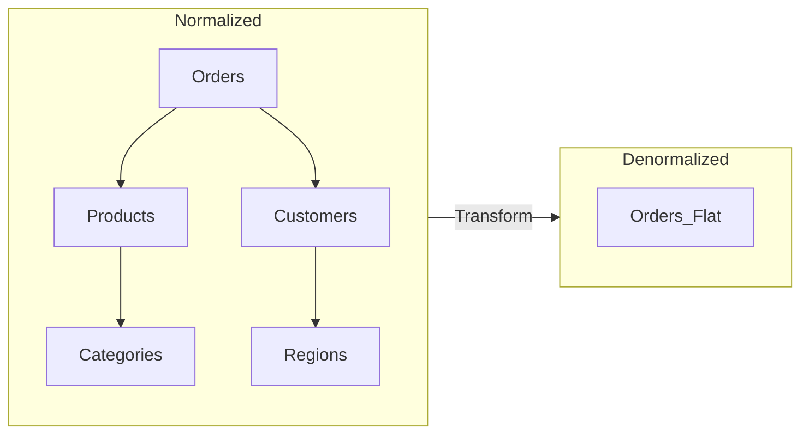
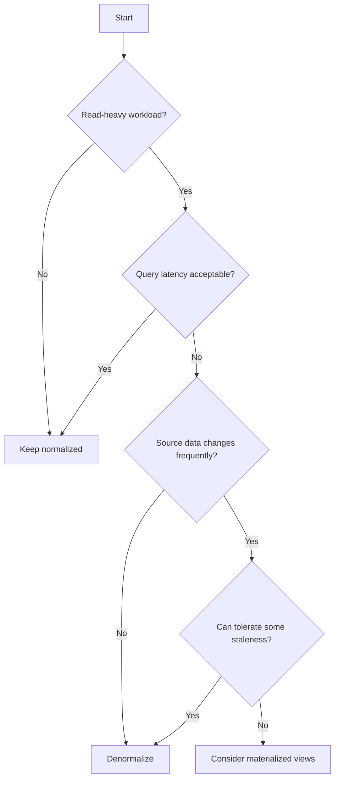
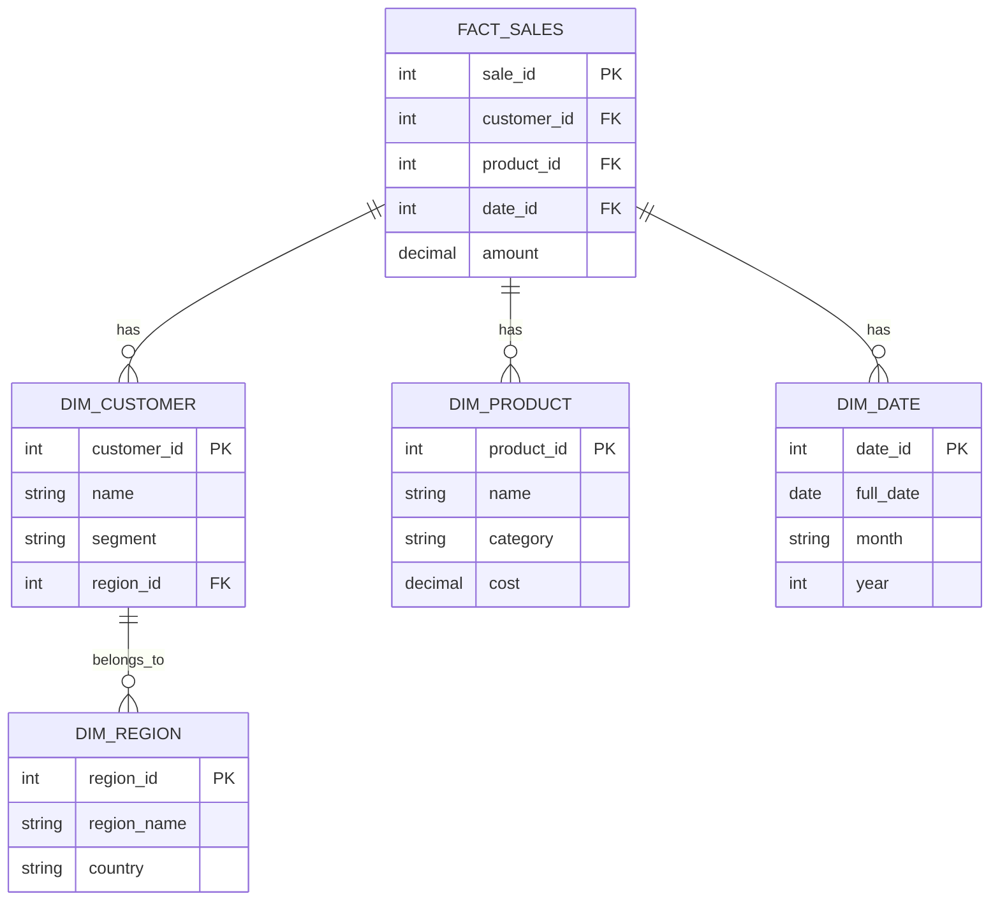
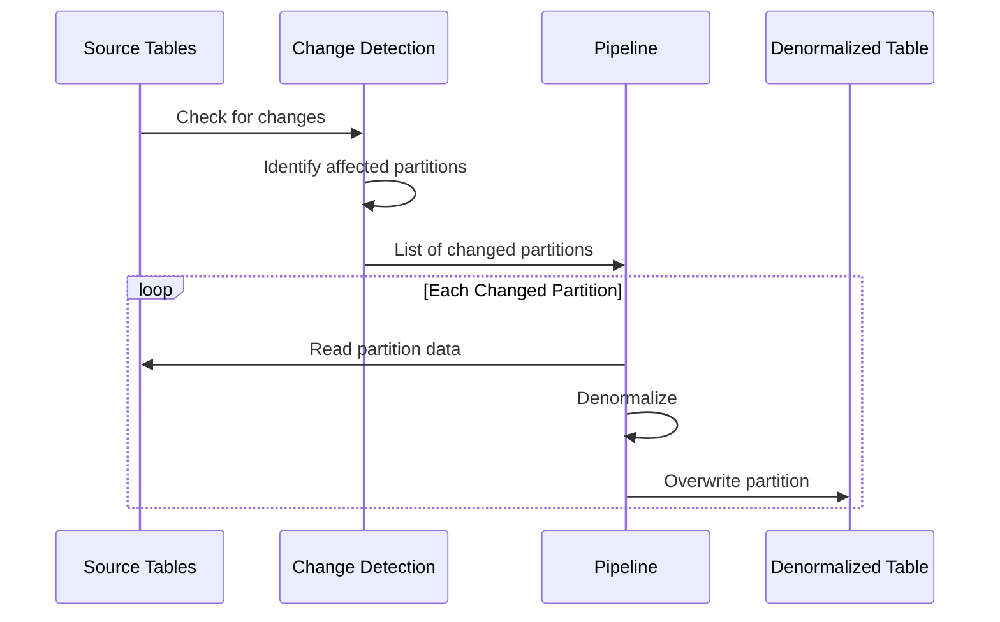
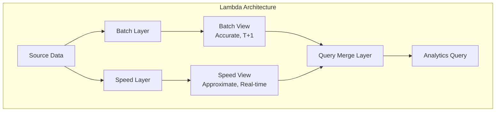

# How to Implement Data Denormalization

Author: [nawazdhandala](https://github.com/nawazdhandala)

Tags: Data Pipeline, Denormalization, Data Warehouse, Performance

Description: Learn to implement data denormalization for optimizing query performance in analytical workloads.

---

> Normalization optimizes for write efficiency. Denormalization optimizes for read efficiency. In analytical workloads, reads dominate, so the trade-off almost always favors denormalization.

Data denormalization is a deliberate design choice to reduce the number of joins required during query execution. In transactional systems, normalization prevents data anomalies and minimizes storage. But in data pipelines feeding dashboards, reports, and machine learning models, the join overhead becomes the bottleneck. This guide walks through when to denormalize, how to implement it in production pipelines, and the patterns that keep your data warehouse fast and maintainable.

---

## Table of Contents

1. Why Denormalize in Data Pipelines
2. Normalization vs Denormalization Trade-offs
3. Common Denormalization Patterns
4. Implementing Denormalization in SQL
5. Implementing Denormalization in Python/PySpark
6. Incremental Denormalization Strategies
7. Handling Late-Arriving Data
8. Schema Evolution and Maintenance
9. Monitoring and Data Quality
10. When NOT to Denormalize
11. Summary

---

## 1. Why Denormalize in Data Pipelines

Analytical queries have fundamentally different access patterns than transactional queries:

| Characteristic | Transactional (OLTP) | Analytical (OLAP) |
|---------------|---------------------|-------------------|
| Query pattern | Point lookups, small updates | Full table scans, aggregations |
| Join frequency | Occasional, small result sets | Frequent, large result sets |
| Read/Write ratio | Balanced | Read-heavy (95%+ reads) |
| Latency requirement | Low (ms) | Moderate (seconds acceptable) |
| Data freshness | Real-time | Near real-time or batch |

When your analytics query joins 5 tables with millions of rows each, the database spends most of its time shuffling data between tables. Denormalization pre-computes these joins, trading storage and write complexity for read speed.

```
Before Denormalization (5 tables, 4 joins):

SELECT
    o.order_id,
    c.customer_name,
    p.product_name,
    cat.category_name,
    r.region_name
FROM orders o
JOIN customers c ON o.customer_id = c.id
JOIN products p ON o.product_id = p.id
JOIN categories cat ON p.category_id = cat.id
JOIN regions r ON c.region_id = r.id
WHERE o.order_date >= '2026-01-01';

After Denormalization (1 table, 0 joins):

SELECT
    order_id,
    customer_name,
    product_name,
    category_name,
    region_name
FROM orders_denormalized
WHERE order_date >= '2026-01-01';
```

The performance difference can be 10x to 100x depending on data volume and join complexity.

---

## 2. Normalization vs Denormalization Trade-offs

Before denormalizing, understand what you gain and what you sacrifice:



### Benefits of Denormalization

- **Faster reads**: No join overhead at query time
- **Simpler queries**: Analysts write straightforward SELECT statements
- **Predictable performance**: Query time scales with row count, not join complexity
- **Better compression**: Columnar storage benefits from repeated values

### Costs of Denormalization

- **Increased storage**: Redundant data across rows
- **Update complexity**: Changes to dimension data require pipeline reruns
- **Data staleness**: Denormalized tables can drift from source
- **Schema rigidity**: Adding new dimensions requires pipeline changes

### Decision Framework

Use this decision tree to determine if denormalization makes sense:



---

## 3. Common Denormalization Patterns

### Pattern 1: Star Schema Flattening

The most common pattern. Flatten a star schema into a single wide table.



Flattened result:

| sale_id | customer_name | customer_segment | region_name | country | product_name | category | product_cost | sale_date | month | year | amount |
|---------|--------------|-----------------|-------------|---------|--------------|----------|--------------|-----------|-------|------|--------|
| 1 | Acme Corp | Enterprise | West | USA | Widget Pro | Hardware | 50.00 | 2026-01-15 | January | 2026 | 150.00 |

### Pattern 2: Pre-aggregated Rollups

Store pre-computed aggregations at multiple granularities.

```sql
-- Daily granularity
CREATE TABLE sales_daily AS
SELECT
    date_trunc('day', sale_date) as day,
    region_id,
    product_category,
    COUNT(*) as transaction_count,
    SUM(amount) as total_amount,
    AVG(amount) as avg_amount
FROM sales_denormalized
GROUP BY 1, 2, 3;

-- Monthly granularity
CREATE TABLE sales_monthly AS
SELECT
    date_trunc('month', day) as month,
    region_id,
    product_category,
    SUM(transaction_count) as transaction_count,
    SUM(total_amount) as total_amount
FROM sales_daily
GROUP BY 1, 2, 3;
```

### Pattern 3: Nested/Repeated Fields

For columnar formats (Parquet, BigQuery), embed related records as nested arrays.

```json
{
    "order_id": 12345,
    "customer": {
        "id": 100,
        "name": "Acme Corp",
        "segment": "Enterprise"
    },
    "line_items": [
        {"product_id": 1, "name": "Widget", "quantity": 2, "price": 50.00},
        {"product_id": 2, "name": "Gadget", "quantity": 1, "price": 75.00}
    ],
    "total_amount": 175.00
}
```

### Pattern 4: Slowly Changing Dimension (SCD) Snapshots

Capture dimension state at the time of the fact event.

```sql
-- Type 2 SCD: Store historical versions
CREATE TABLE customers_history (
    customer_id INT,
    name VARCHAR(255),
    segment VARCHAR(50),
    valid_from DATE,
    valid_to DATE,
    is_current BOOLEAN
);

-- Denormalized with point-in-time dimension values
CREATE TABLE orders_with_customer_snapshot AS
SELECT
    o.order_id,
    o.order_date,
    o.amount,
    c.name as customer_name_at_order,
    c.segment as customer_segment_at_order
FROM orders o
JOIN customers_history c
    ON o.customer_id = c.customer_id
    AND o.order_date BETWEEN c.valid_from AND COALESCE(c.valid_to, '9999-12-31');
```

---

## 4. Implementing Denormalization in SQL

Here is a complete SQL implementation for a data warehouse denormalization pipeline:

```sql
-- =============================================================================
-- Denormalization Pipeline: E-Commerce Analytics
-- This script creates a fully denormalized fact table from normalized sources
-- =============================================================================

-- Step 1: Create the denormalized target table with appropriate partitioning
-- Partitioning by date enables efficient incremental updates and pruning
CREATE TABLE IF NOT EXISTS analytics.orders_denormalized (
    -- Fact keys
    order_id BIGINT PRIMARY KEY,
    order_line_id BIGINT,

    -- Order attributes (from fact table)
    order_date DATE NOT NULL,
    order_timestamp TIMESTAMP,
    quantity INT,
    unit_price DECIMAL(10,2),
    discount_percent DECIMAL(5,2),
    line_total DECIMAL(12,2),

    -- Customer dimension (flattened)
    customer_id INT,
    customer_name VARCHAR(255),
    customer_email VARCHAR(255),
    customer_segment VARCHAR(50),
    customer_lifetime_value DECIMAL(12,2),
    customer_created_at DATE,

    -- Customer geography (nested dimension flattened)
    customer_city VARCHAR(100),
    customer_state VARCHAR(100),
    customer_country VARCHAR(100),
    customer_region VARCHAR(50),

    -- Product dimension (flattened)
    product_id INT,
    product_name VARCHAR(255),
    product_sku VARCHAR(50),
    product_cost DECIMAL(10,2),

    -- Product category hierarchy (nested dimension flattened)
    category_id INT,
    category_name VARCHAR(100),
    parent_category_name VARCHAR(100),
    category_level INT,

    -- Supplier dimension (flattened)
    supplier_id INT,
    supplier_name VARCHAR(255),
    supplier_country VARCHAR(100),

    -- Time dimension (pre-computed date parts for fast filtering)
    order_year INT,
    order_quarter INT,
    order_month INT,
    order_week INT,
    order_day_of_week INT,
    is_weekend BOOLEAN,
    is_holiday BOOLEAN,

    -- Computed metrics (pre-calculated for common queries)
    gross_profit DECIMAL(12,2),
    margin_percent DECIMAL(5,2),

    -- Metadata for pipeline management
    _extracted_at TIMESTAMP,
    _loaded_at TIMESTAMP DEFAULT CURRENT_TIMESTAMP,
    _source_system VARCHAR(50)
)
PARTITION BY RANGE (order_date);

-- Step 2: Create partitions for the current year
-- Each partition covers one month for balanced partition sizes
DO $$
DECLARE
    start_date DATE := '2026-01-01';
    end_date DATE;
    partition_name TEXT;
BEGIN
    FOR i IN 0..11 LOOP
        end_date := start_date + INTERVAL '1 month';
        partition_name := 'orders_denormalized_' || TO_CHAR(start_date, 'YYYY_MM');

        EXECUTE format(
            'CREATE TABLE IF NOT EXISTS analytics.%I
             PARTITION OF analytics.orders_denormalized
             FOR VALUES FROM (%L) TO (%L)',
            partition_name, start_date, end_date
        );

        start_date := end_date;
    END LOOP;
END $$;

-- Step 3: Create the denormalization transformation query
-- This CTE-based approach is readable and maintainable
CREATE OR REPLACE FUNCTION analytics.denormalize_orders(
    p_start_date DATE,
    p_end_date DATE
) RETURNS VOID AS $$
BEGIN
    -- Delete existing records in the date range (for idempotency)
    DELETE FROM analytics.orders_denormalized
    WHERE order_date >= p_start_date AND order_date < p_end_date;

    -- Insert denormalized records
    INSERT INTO analytics.orders_denormalized
    WITH
    -- CTE 1: Enrich customers with geography
    customer_enriched AS (
        SELECT
            c.customer_id,
            c.name AS customer_name,
            c.email AS customer_email,
            c.segment AS customer_segment,
            c.lifetime_value AS customer_lifetime_value,
            c.created_at AS customer_created_at,
            g.city AS customer_city,
            g.state AS customer_state,
            g.country AS customer_country,
            r.region_name AS customer_region
        FROM staging.customers c
        LEFT JOIN staging.geography g ON c.geography_id = g.geography_id
        LEFT JOIN staging.regions r ON g.region_id = r.region_id
    ),

    -- CTE 2: Enrich products with category hierarchy
    product_enriched AS (
        SELECT
            p.product_id,
            p.name AS product_name,
            p.sku AS product_sku,
            p.cost AS product_cost,
            p.supplier_id,
            cat.category_id,
            cat.name AS category_name,
            parent_cat.name AS parent_category_name,
            cat.level AS category_level
        FROM staging.products p
        LEFT JOIN staging.categories cat ON p.category_id = cat.category_id
        LEFT JOIN staging.categories parent_cat ON cat.parent_id = parent_cat.category_id
    ),

    -- CTE 3: Supplier dimension
    supplier_enriched AS (
        SELECT
            s.supplier_id,
            s.name AS supplier_name,
            s.country AS supplier_country
        FROM staging.suppliers s
    ),

    -- CTE 4: Time dimension with pre-computed date parts
    time_dimension AS (
        SELECT
            d.date_value,
            EXTRACT(YEAR FROM d.date_value)::INT AS order_year,
            EXTRACT(QUARTER FROM d.date_value)::INT AS order_quarter,
            EXTRACT(MONTH FROM d.date_value)::INT AS order_month,
            EXTRACT(WEEK FROM d.date_value)::INT AS order_week,
            EXTRACT(DOW FROM d.date_value)::INT AS order_day_of_week,
            EXTRACT(DOW FROM d.date_value) IN (0, 6) AS is_weekend,
            h.holiday_date IS NOT NULL AS is_holiday
        FROM staging.date_dim d
        LEFT JOIN staging.holidays h ON d.date_value = h.holiday_date
    )

    -- Main SELECT: Join everything together
    SELECT
        -- Fact keys
        o.order_id,
        ol.order_line_id,

        -- Order attributes
        o.order_date,
        o.order_timestamp,
        ol.quantity,
        ol.unit_price,
        ol.discount_percent,
        ol.quantity * ol.unit_price * (1 - COALESCE(ol.discount_percent, 0) / 100) AS line_total,

        -- Customer dimension
        ce.customer_id,
        ce.customer_name,
        ce.customer_email,
        ce.customer_segment,
        ce.customer_lifetime_value,
        ce.customer_created_at,
        ce.customer_city,
        ce.customer_state,
        ce.customer_country,
        ce.customer_region,

        -- Product dimension
        pe.product_id,
        pe.product_name,
        pe.product_sku,
        pe.product_cost,
        pe.category_id,
        pe.category_name,
        pe.parent_category_name,
        pe.category_level,

        -- Supplier dimension
        se.supplier_id,
        se.supplier_name,
        se.supplier_country,

        -- Time dimension
        td.order_year,
        td.order_quarter,
        td.order_month,
        td.order_week,
        td.order_day_of_week,
        td.is_weekend,
        td.is_holiday,

        -- Computed metrics
        (ol.quantity * ol.unit_price * (1 - COALESCE(ol.discount_percent, 0) / 100))
            - (ol.quantity * pe.product_cost) AS gross_profit,
        CASE
            WHEN ol.unit_price > 0 THEN
                ((ol.unit_price - pe.product_cost) / ol.unit_price * 100)::DECIMAL(5,2)
            ELSE 0
        END AS margin_percent,

        -- Metadata
        CURRENT_TIMESTAMP AS _extracted_at,
        CURRENT_TIMESTAMP AS _loaded_at,
        'ecommerce_db' AS _source_system

    FROM staging.orders o
    INNER JOIN staging.order_lines ol ON o.order_id = ol.order_id
    LEFT JOIN customer_enriched ce ON o.customer_id = ce.customer_id
    LEFT JOIN product_enriched pe ON ol.product_id = pe.product_id
    LEFT JOIN supplier_enriched se ON pe.supplier_id = se.supplier_id
    LEFT JOIN time_dimension td ON o.order_date = td.date_value
    WHERE o.order_date >= p_start_date
      AND o.order_date < p_end_date;

    -- Log the operation
    INSERT INTO analytics.pipeline_log (operation, table_name, rows_affected, executed_at)
    SELECT 'denormalize', 'orders_denormalized', COUNT(*), CURRENT_TIMESTAMP
    FROM analytics.orders_denormalized
    WHERE order_date >= p_start_date AND order_date < p_end_date;

END;
$$ LANGUAGE plpgsql;

-- Step 4: Create indexes for common query patterns
-- Index strategy depends on your most frequent filter/group columns
CREATE INDEX idx_orders_denorm_date ON analytics.orders_denormalized (order_date);
CREATE INDEX idx_orders_denorm_customer ON analytics.orders_denormalized (customer_id);
CREATE INDEX idx_orders_denorm_product ON analytics.orders_denormalized (product_id);
CREATE INDEX idx_orders_denorm_region ON analytics.orders_denormalized (customer_region);
CREATE INDEX idx_orders_denorm_category ON analytics.orders_denormalized (category_name);

-- Composite index for common dashboard query pattern
CREATE INDEX idx_orders_denorm_date_region_category
ON analytics.orders_denormalized (order_date, customer_region, category_name);

-- Step 5: Execute the denormalization for a date range
SELECT analytics.denormalize_orders('2026-01-01', '2026-02-01');
```

---

## 5. Implementing Denormalization in Python/PySpark

For large-scale data pipelines, PySpark provides distributed processing:

```python
"""
Denormalization Pipeline using PySpark
======================================
This module implements a scalable denormalization pipeline for analytical workloads.
Designed to run on Spark clusters for terabyte-scale datasets.
"""

from pyspark.sql import SparkSession, DataFrame
from pyspark.sql import functions as F
from pyspark.sql.types import (
    StructType, StructField, StringType, IntegerType,
    DecimalType, DateType, TimestampType, BooleanType
)
from datetime import datetime, timedelta
from typing import Optional, List, Dict
import logging

# Configure logging for pipeline observability
logging.basicConfig(level=logging.INFO)
logger = logging.getLogger(__name__)


class DenormalizationPipeline:
    """
    A reusable denormalization pipeline that flattens star schema
    into a single analytical table.

    Features:
    - Incremental processing by date range
    - Automatic partition management
    - Data quality checks
    - Idempotent operations
    """

    def __init__(self, spark: SparkSession, config: Dict):
        """
        Initialize the pipeline with Spark session and configuration.

        Args:
            spark: Active SparkSession
            config: Dictionary containing paths and settings
        """
        self.spark = spark
        self.config = config

        # Configure Spark for optimal denormalization performance
        # Broadcast join threshold: dimensions under 100MB are broadcast
        spark.conf.set("spark.sql.autoBroadcastJoinThreshold", "104857600")
        # Enable adaptive query execution for dynamic optimization
        spark.conf.set("spark.sql.adaptive.enabled", "true")
        # Coalesce shuffle partitions based on data size
        spark.conf.set("spark.sql.adaptive.coalescePartitions.enabled", "true")

    def load_dimensions(self) -> Dict[str, DataFrame]:
        """
        Load all dimension tables into memory.
        Dimensions are typically small enough to broadcast.

        Returns:
            Dictionary mapping dimension names to DataFrames
        """
        logger.info("Loading dimension tables...")

        dimensions = {}

        # Load customers with geography enrichment
        customers = self.spark.read.parquet(
            f"{self.config['source_path']}/customers"
        )
        geography = self.spark.read.parquet(
            f"{self.config['source_path']}/geography"
        )
        regions = self.spark.read.parquet(
            f"{self.config['source_path']}/regions"
        )

        # Pre-join customer dimension hierarchy
        dimensions['customers'] = (
            customers
            .join(geography, "geography_id", "left")
            .join(regions, "region_id", "left")
            .select(
                F.col("customer_id"),
                F.col("name").alias("customer_name"),
                F.col("email").alias("customer_email"),
                F.col("segment").alias("customer_segment"),
                F.col("lifetime_value").alias("customer_lifetime_value"),
                F.col("created_at").alias("customer_created_at"),
                F.col("city").alias("customer_city"),
                F.col("state").alias("customer_state"),
                F.col("country").alias("customer_country"),
                F.col("region_name").alias("customer_region")
            )
            # Cache for reuse across multiple fact table partitions
            .cache()
        )

        # Load products with category hierarchy
        products = self.spark.read.parquet(
            f"{self.config['source_path']}/products"
        )
        categories = self.spark.read.parquet(
            f"{self.config['source_path']}/categories"
        )

        # Self-join for parent category name
        parent_categories = categories.select(
            F.col("category_id").alias("parent_category_id"),
            F.col("name").alias("parent_category_name")
        )

        dimensions['products'] = (
            products
            .join(categories, "category_id", "left")
            .join(
                parent_categories,
                categories.parent_id == parent_categories.parent_category_id,
                "left"
            )
            .select(
                F.col("product_id"),
                F.col("products.name").alias("product_name"),
                F.col("sku").alias("product_sku"),
                F.col("cost").alias("product_cost"),
                F.col("supplier_id"),
                F.col("category_id"),
                F.col("categories.name").alias("category_name"),
                F.col("parent_category_name"),
                F.col("level").alias("category_level")
            )
            .cache()
        )

        # Load suppliers
        dimensions['suppliers'] = (
            self.spark.read.parquet(f"{self.config['source_path']}/suppliers")
            .select(
                F.col("supplier_id"),
                F.col("name").alias("supplier_name"),
                F.col("country").alias("supplier_country")
            )
            .cache()
        )

        # Load time dimension (or generate it)
        dimensions['time'] = self._generate_time_dimension()

        logger.info(f"Loaded {len(dimensions)} dimension tables")
        return dimensions

    def _generate_time_dimension(self) -> DataFrame:
        """
        Generate a time dimension table with useful date attributes.
        More efficient than storing as a table for date ranges.

        Returns:
            DataFrame with date attributes
        """
        # Generate date range for the pipeline scope
        start_date = datetime.strptime(self.config['min_date'], '%Y-%m-%d')
        end_date = datetime.strptime(self.config['max_date'], '%Y-%m-%d')

        # Create list of dates
        dates = []
        current = start_date
        while current <= end_date:
            dates.append((current,))
            current += timedelta(days=1)

        # Create DataFrame with date attributes
        time_df = (
            self.spark.createDataFrame(dates, ["date_value"])
            .withColumn("order_year", F.year("date_value"))
            .withColumn("order_quarter", F.quarter("date_value"))
            .withColumn("order_month", F.month("date_value"))
            .withColumn("order_week", F.weekofyear("date_value"))
            .withColumn("order_day_of_week", F.dayofweek("date_value"))
            .withColumn("is_weekend", F.dayofweek("date_value").isin([1, 7]))
        )

        # Join with holidays table if available
        try:
            holidays = self.spark.read.parquet(
                f"{self.config['source_path']}/holidays"
            )
            time_df = (
                time_df
                .join(
                    holidays.select(F.col("holiday_date"), F.lit(True).alias("is_holiday")),
                    time_df.date_value == holidays.holiday_date,
                    "left"
                )
                .withColumn("is_holiday", F.coalesce(F.col("is_holiday"), F.lit(False)))
                .drop("holiday_date")
            )
        except Exception:
            time_df = time_df.withColumn("is_holiday", F.lit(False))

        return time_df.cache()

    def denormalize_partition(
        self,
        dimensions: Dict[str, DataFrame],
        start_date: str,
        end_date: str
    ) -> DataFrame:
        """
        Denormalize fact table for a specific date range.

        Args:
            dimensions: Pre-loaded dimension DataFrames
            start_date: Start of date range (inclusive)
            end_date: End of date range (exclusive)

        Returns:
            Denormalized DataFrame for the date range
        """
        logger.info(f"Denormalizing data for {start_date} to {end_date}")

        # Load fact tables with date filter (partition pruning)
        orders = (
            self.spark.read.parquet(f"{self.config['source_path']}/orders")
            .filter(
                (F.col("order_date") >= start_date) &
                (F.col("order_date") < end_date)
            )
        )

        order_lines = self.spark.read.parquet(
            f"{self.config['source_path']}/order_lines"
        )

        # Join facts together first
        fact_joined = orders.join(order_lines, "order_id", "inner")

        # Use broadcast hints for dimension tables (typically < 100MB)
        # This avoids expensive shuffle operations
        denormalized = (
            fact_joined
            # Customer dimension (broadcast join)
            .join(
                F.broadcast(dimensions['customers']),
                "customer_id",
                "left"
            )
            # Product dimension (broadcast join)
            .join(
                F.broadcast(dimensions['products']),
                "product_id",
                "left"
            )
            # Supplier dimension (broadcast join)
            .join(
                F.broadcast(dimensions['suppliers']),
                "supplier_id",
                "left"
            )
            # Time dimension (broadcast join)
            .join(
                F.broadcast(dimensions['time']),
                orders.order_date == dimensions['time'].date_value,
                "left"
            )
            # Calculate derived metrics
            .withColumn(
                "line_total",
                F.col("quantity") * F.col("unit_price") *
                (1 - F.coalesce(F.col("discount_percent"), F.lit(0)) / 100)
            )
            .withColumn(
                "gross_profit",
                F.col("line_total") - (F.col("quantity") * F.col("product_cost"))
            )
            .withColumn(
                "margin_percent",
                F.when(
                    F.col("unit_price") > 0,
                    (F.col("unit_price") - F.col("product_cost")) / F.col("unit_price") * 100
                ).otherwise(0)
            )
            # Add metadata columns
            .withColumn("_extracted_at", F.current_timestamp())
            .withColumn("_loaded_at", F.current_timestamp())
            .withColumn("_source_system", F.lit("ecommerce_spark"))
            # Select final columns in desired order
            .select(
                "order_id", "order_line_id", "order_date", "order_timestamp",
                "quantity", "unit_price", "discount_percent", "line_total",
                "customer_id", "customer_name", "customer_email", "customer_segment",
                "customer_lifetime_value", "customer_created_at",
                "customer_city", "customer_state", "customer_country", "customer_region",
                "product_id", "product_name", "product_sku", "product_cost",
                "category_id", "category_name", "parent_category_name", "category_level",
                "supplier_id", "supplier_name", "supplier_country",
                "order_year", "order_quarter", "order_month", "order_week",
                "order_day_of_week", "is_weekend", "is_holiday",
                "gross_profit", "margin_percent",
                "_extracted_at", "_loaded_at", "_source_system"
            )
        )

        logger.info(f"Denormalized {denormalized.count()} records")
        return denormalized

    def write_output(
        self,
        df: DataFrame,
        mode: str = "overwrite"
    ) -> None:
        """
        Write denormalized data to the target location.
        Uses partitioning for efficient incremental updates.

        Args:
            df: Denormalized DataFrame to write
            mode: Write mode (overwrite, append)
        """
        output_path = f"{self.config['target_path']}/orders_denormalized"

        logger.info(f"Writing denormalized data to {output_path}")

        (
            df
            # Repartition by date for optimal file sizes (128MB target)
            .repartition(F.col("order_date"))
            .write
            .partitionBy("order_year", "order_month")
            .mode(mode)
            .parquet(output_path)
        )

        logger.info("Write completed successfully")

    def run(
        self,
        start_date: str,
        end_date: str,
        incremental: bool = True
    ) -> None:
        """
        Execute the full denormalization pipeline.

        Args:
            start_date: Start of processing window
            end_date: End of processing window
            incremental: If True, only process new/changed data
        """
        logger.info(f"Starting denormalization pipeline: {start_date} to {end_date}")

        # Step 1: Load dimensions (cached for reuse)
        dimensions = self.load_dimensions()

        # Step 2: Process in monthly chunks for memory efficiency
        current_date = datetime.strptime(start_date, '%Y-%m-%d')
        final_date = datetime.strptime(end_date, '%Y-%m-%d')

        while current_date < final_date:
            # Calculate chunk end (1 month or final_date, whichever is sooner)
            chunk_end = min(
                current_date + timedelta(days=31),
                final_date
            )
            chunk_end = chunk_end.replace(day=1) if chunk_end != final_date else chunk_end

            # Denormalize this chunk
            chunk_df = self.denormalize_partition(
                dimensions,
                current_date.strftime('%Y-%m-%d'),
                chunk_end.strftime('%Y-%m-%d')
            )

            # Write chunk (use dynamic partition overwrite for incremental)
            write_mode = "overwrite" if not incremental else "append"
            self.write_output(chunk_df, mode=write_mode)

            current_date = chunk_end

        # Step 3: Cleanup cached DataFrames
        for dim_df in dimensions.values():
            dim_df.unpersist()

        logger.info("Pipeline completed successfully")


def main():
    """
    Entry point for the denormalization pipeline.
    """
    # Initialize Spark session
    spark = (
        SparkSession.builder
        .appName("DenormalizationPipeline")
        .config("spark.sql.sources.partitionOverwriteMode", "dynamic")
        .getOrCreate()
    )

    # Pipeline configuration
    config = {
        "source_path": "s3://data-lake/bronze/ecommerce",
        "target_path": "s3://data-lake/gold/analytics",
        "min_date": "2025-01-01",
        "max_date": "2026-12-31"
    }

    # Run the pipeline
    pipeline = DenormalizationPipeline(spark, config)
    pipeline.run(
        start_date="2026-01-01",
        end_date="2026-02-01",
        incremental=True
    )

    spark.stop()


if __name__ == "__main__":
    main()
```

---

## 6. Incremental Denormalization Strategies

Full table rebuilds are expensive. These patterns enable efficient incremental updates:

### Strategy 1: Partition-Based Incremental

Only reprocess partitions that have changed:



```sql
-- Track which partitions need refresh based on source table changes
CREATE TABLE pipeline.partition_tracker (
    table_name VARCHAR(100),
    partition_key DATE,
    source_max_updated_at TIMESTAMP,
    target_last_refreshed_at TIMESTAMP,
    needs_refresh BOOLEAN GENERATED ALWAYS AS (
        source_max_updated_at > target_last_refreshed_at
    ) STORED
);

-- Update tracker with source changes
INSERT INTO pipeline.partition_tracker (table_name, partition_key, source_max_updated_at)
SELECT
    'orders',
    DATE_TRUNC('day', order_date),
    MAX(updated_at)
FROM staging.orders
GROUP BY DATE_TRUNC('day', order_date)
ON CONFLICT (table_name, partition_key)
DO UPDATE SET source_max_updated_at = EXCLUDED.source_max_updated_at;

-- Get partitions that need refresh
SELECT partition_key
FROM pipeline.partition_tracker
WHERE table_name = 'orders' AND needs_refresh = TRUE;
```

### Strategy 2: Change Data Capture (CDC) Based

Process only changed records:

```python
def process_cdc_changes(
    spark: SparkSession,
    dimensions: Dict[str, DataFrame],
    cdc_source: str
) -> DataFrame:
    """
    Process CDC events to update denormalized table incrementally.

    Args:
        spark: SparkSession
        dimensions: Dimension DataFrames
        cdc_source: Path to CDC events (e.g., Debezium output)

    Returns:
        DataFrame of changes to apply
    """
    # Read CDC events since last checkpoint
    cdc_events = (
        spark.read
        .format("delta")  # Or kafka, kinesis, etc.
        .load(cdc_source)
        .filter(F.col("_commit_timestamp") > last_checkpoint)
    )

    # Separate inserts/updates from deletes
    upserts = cdc_events.filter(F.col("_operation").isin(["INSERT", "UPDATE"]))
    deletes = cdc_events.filter(F.col("_operation") == "DELETE")

    # Denormalize the changed records
    denormalized_upserts = denormalize_records(upserts, dimensions)

    return denormalized_upserts, deletes
```

### Strategy 3: Watermark-Based Processing

Track high-water marks for each source:

```python
class WatermarkTracker:
    """
    Track processing watermarks for incremental pipelines.
    Enables exactly-once processing semantics.
    """

    def __init__(self, spark: SparkSession, state_path: str):
        self.spark = spark
        self.state_path = state_path

    def get_watermark(self, source_name: str) -> Optional[datetime]:
        """Get the last processed watermark for a source."""
        try:
            state = self.spark.read.parquet(self.state_path)
            row = state.filter(F.col("source") == source_name).first()
            return row.watermark if row else None
        except Exception:
            return None

    def update_watermark(self, source_name: str, watermark: datetime) -> None:
        """Update the watermark after successful processing."""
        new_state = self.spark.createDataFrame(
            [(source_name, watermark)],
            ["source", "watermark"]
        )
        new_state.write.mode("overwrite").parquet(
            f"{self.state_path}/{source_name}"
        )
```

---

## 7. Handling Late-Arriving Data

Late data is inevitable in distributed systems. Here are patterns to handle it:

### Pattern 1: Reprocessing Windows

Keep a buffer of recent partitions that can be reprocessed:

```python
def get_reprocessing_window(
    base_date: datetime,
    late_arrival_days: int = 3
) -> List[str]:
    """
    Calculate partitions that should be reprocessed to capture late data.

    Args:
        base_date: Current processing date
        late_arrival_days: How many days of late data to expect

    Returns:
        List of partition dates to reprocess
    """
    partitions = []
    for i in range(late_arrival_days + 1):
        partition_date = base_date - timedelta(days=i)
        partitions.append(partition_date.strftime('%Y-%m-%d'))
    return partitions
```

### Pattern 2: Lambda Architecture (Batch + Speed Layer)

Maintain two views: accurate batch and approximate real-time:



### Pattern 3: Correction Log

Track and apply corrections for late data:

```sql
-- Corrections table for late-arriving facts
CREATE TABLE analytics.order_corrections (
    order_id BIGINT,
    correction_type VARCHAR(20),  -- 'insert', 'update', 'delete'
    corrected_values JSONB,
    original_values JSONB,
    correction_timestamp TIMESTAMP DEFAULT CURRENT_TIMESTAMP,
    applied_to_denormalized BOOLEAN DEFAULT FALSE
);

-- Apply pending corrections
UPDATE analytics.orders_denormalized od
SET
    quantity = (c.corrected_values->>'quantity')::INT,
    line_total = (c.corrected_values->>'line_total')::DECIMAL,
    _loaded_at = CURRENT_TIMESTAMP
FROM analytics.order_corrections c
WHERE od.order_id = c.order_id
  AND c.applied_to_denormalized = FALSE
  AND c.correction_type = 'update';
```

---

## 8. Schema Evolution and Maintenance

Denormalized schemas need careful evolution strategies:

### Adding New Dimension Columns

```sql
-- Step 1: Add column with default value (non-blocking)
ALTER TABLE analytics.orders_denormalized
ADD COLUMN customer_tier VARCHAR(20) DEFAULT 'standard';

-- Step 2: Backfill from dimension table
UPDATE analytics.orders_denormalized od
SET customer_tier = c.tier
FROM staging.customers c
WHERE od.customer_id = c.customer_id;

-- Step 3: Update pipeline to include new column in future runs
-- (Modify the denormalization query)
```

### Removing Deprecated Columns

```sql
-- Step 1: Stop populating the column in pipeline
-- Step 2: Communicate deprecation to consumers
-- Step 3: After grace period, drop the column
ALTER TABLE analytics.orders_denormalized
DROP COLUMN deprecated_field;
```

### Handling Breaking Changes

```python
def migrate_schema_v1_to_v2(spark: SparkSession, config: Dict) -> None:
    """
    Migrate denormalized table from schema v1 to v2.
    Creates new table, migrates data, then swaps.
    """
    # Read existing data
    old_table = spark.read.parquet(f"{config['path']}/orders_denormalized")

    # Apply transformations for new schema
    new_table = (
        old_table
        # Rename columns
        .withColumnRenamed("customer_segment", "customer_tier")
        # Add new computed columns
        .withColumn(
            "order_value_bucket",
            F.when(F.col("line_total") < 100, "small")
             .when(F.col("line_total") < 1000, "medium")
             .otherwise("large")
        )
        # Drop deprecated columns
        .drop("legacy_field")
    )

    # Write to new location
    new_table.write.parquet(f"{config['path']}/orders_denormalized_v2")

    # Atomic swap (rename directories)
    # In production, use table metadata or catalog for atomic swaps
```

---

## 9. Monitoring and Data Quality

Denormalized tables need continuous validation:

### Row Count Reconciliation

```sql
-- Compare row counts between normalized and denormalized
WITH source_counts AS (
    SELECT
        DATE_TRUNC('day', o.order_date) as order_day,
        COUNT(*) as source_rows
    FROM staging.orders o
    JOIN staging.order_lines ol ON o.order_id = ol.order_id
    GROUP BY 1
),
target_counts AS (
    SELECT
        DATE_TRUNC('day', order_date) as order_day,
        COUNT(*) as target_rows
    FROM analytics.orders_denormalized
    GROUP BY 1
)
SELECT
    COALESCE(s.order_day, t.order_day) as order_day,
    s.source_rows,
    t.target_rows,
    s.source_rows - t.target_rows as row_diff,
    CASE
        WHEN s.source_rows != t.target_rows THEN 'MISMATCH'
        ELSE 'OK'
    END as status
FROM source_counts s
FULL OUTER JOIN target_counts t ON s.order_day = t.order_day
WHERE s.source_rows IS DISTINCT FROM t.target_rows
ORDER BY order_day DESC;
```

### Aggregate Reconciliation

```sql
-- Verify that totals match between source and denormalized
SELECT
    'source' as table_type,
    SUM(ol.quantity * ol.unit_price) as total_revenue
FROM staging.orders o
JOIN staging.order_lines ol ON o.order_id = ol.order_id
WHERE o.order_date >= '2026-01-01'

UNION ALL

SELECT
    'denormalized' as table_type,
    SUM(line_total) as total_revenue
FROM analytics.orders_denormalized
WHERE order_date >= '2026-01-01';
```

### Data Freshness Monitoring

```python
def check_data_freshness(
    spark: SparkSession,
    table_path: str,
    max_lag_hours: int = 24
) -> Dict:
    """
    Check if denormalized table is fresh enough.

    Returns:
        Dictionary with freshness metrics and alert status
    """
    df = spark.read.parquet(table_path)

    # Get latest loaded timestamp
    max_loaded = df.agg(F.max("_loaded_at")).collect()[0][0]

    # Calculate lag
    lag_hours = (datetime.now() - max_loaded).total_seconds() / 3600

    return {
        "last_loaded_at": max_loaded,
        "lag_hours": lag_hours,
        "is_fresh": lag_hours <= max_lag_hours,
        "alert": lag_hours > max_lag_hours
    }
```

### Completeness Checks

```sql
-- Check for NULL values in critical columns
SELECT
    'customer_name' as column_name,
    COUNT(*) FILTER (WHERE customer_name IS NULL) as null_count,
    COUNT(*) as total_count,
    ROUND(100.0 * COUNT(*) FILTER (WHERE customer_name IS NULL) / COUNT(*), 2) as null_pct
FROM analytics.orders_denormalized
WHERE order_date >= CURRENT_DATE - INTERVAL '7 days'

UNION ALL

SELECT
    'product_name',
    COUNT(*) FILTER (WHERE product_name IS NULL),
    COUNT(*),
    ROUND(100.0 * COUNT(*) FILTER (WHERE product_name IS NULL) / COUNT(*), 2)
FROM analytics.orders_denormalized
WHERE order_date >= CURRENT_DATE - INTERVAL '7 days';
```

---

## 10. When NOT to Denormalize

Denormalization is not always the right choice:

### Keep Normalized When:

1. **Data changes frequently**: If dimension values update constantly, keeping them synchronized is expensive
2. **Storage is constrained**: Denormalization multiplies storage requirements
3. **Queries are unpredictable**: Ad-hoc exploration benefits from flexible schemas
4. **Real-time consistency is required**: Denormalized tables have inherent staleness
5. **Regulatory requirements**: Some compliance frameworks require single source of truth

### Alternative Approaches:

| Scenario | Alternative to Denormalization |
|----------|-------------------------------|
| Fast reads, infrequent updates | Materialized views with refresh |
| Complex joins, real-time needs | In-memory caching (Redis) |
| Variable query patterns | Query acceleration layer (Trino) |
| Small dimension tables | Database broadcast joins |
| Near real-time analytics | Streaming aggregations (Flink) |

```sql
-- Materialized view alternative (PostgreSQL)
CREATE MATERIALIZED VIEW analytics.orders_summary AS
SELECT
    o.order_id,
    c.customer_name,
    p.product_name,
    o.order_date,
    ol.line_total
FROM orders o
JOIN customers c ON o.customer_id = c.customer_id
JOIN order_lines ol ON o.order_id = ol.order_id
JOIN products p ON ol.product_id = p.product_id;

-- Refresh on schedule
REFRESH MATERIALIZED VIEW CONCURRENTLY analytics.orders_summary;
```

---

## 11. Summary

Data denormalization is a powerful technique for optimizing analytical query performance. The key takeaways:

| Aspect | Recommendation |
|--------|----------------|
| When to use | Read-heavy workloads where join performance is the bottleneck |
| Pattern choice | Star schema flattening for most use cases; nested fields for document stores |
| Implementation | Use CTEs for readability; broadcast small dimensions; partition by date |
| Incremental updates | Partition-based or CDC-based depending on source system capabilities |
| Late data | Reprocessing windows or correction logs |
| Schema evolution | Add columns non-blocking; communicate deprecations; use atomic swaps |
| Monitoring | Row count reconciliation, aggregate validation, freshness alerts |

The trade-off is clear: you are exchanging storage and pipeline complexity for query simplicity and speed. Make this trade deliberately, measure the impact, and build robust pipelines that keep your denormalized tables accurate and fresh.

---

**Related Reading:**

- [When Performance Matters, Skip the ORM](https://oneuptime.com/blog/post/2025-11-13-when-performance-matters-skip-the-orm/view)
- [The Three Pillars of Observability: Logs, Metrics, Traces](https://oneuptime.com/blog/post/2025-08-20-three-pillars-of-observability-logs-metrics-traces/view)
