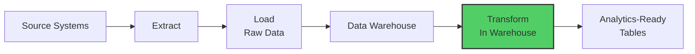
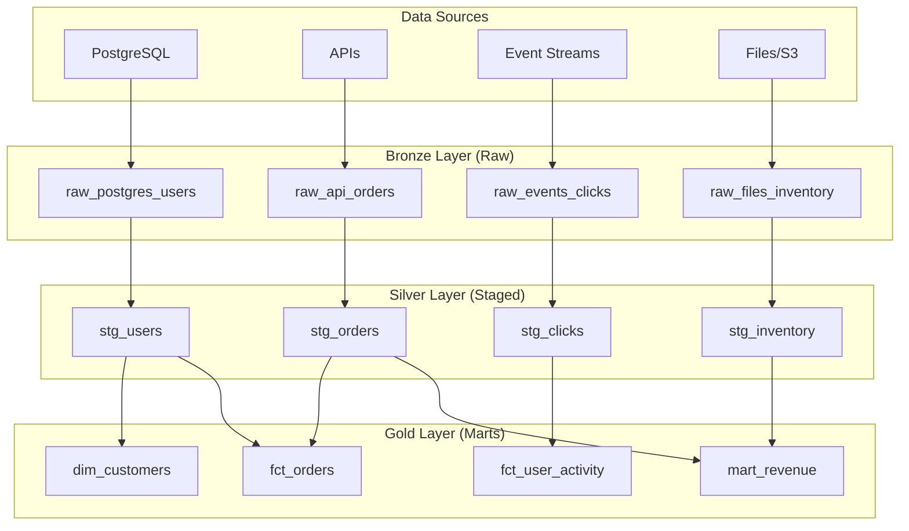
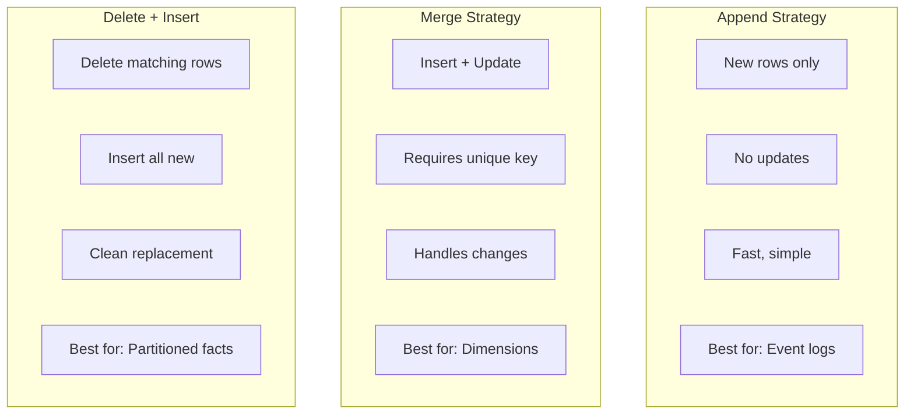
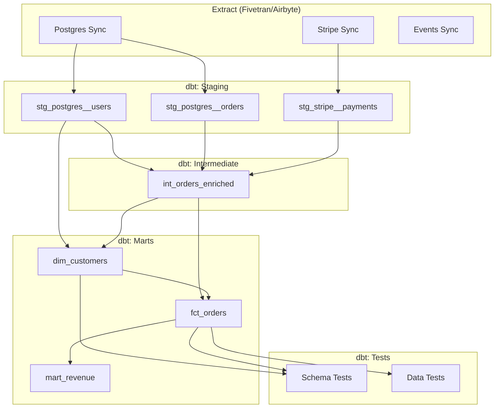
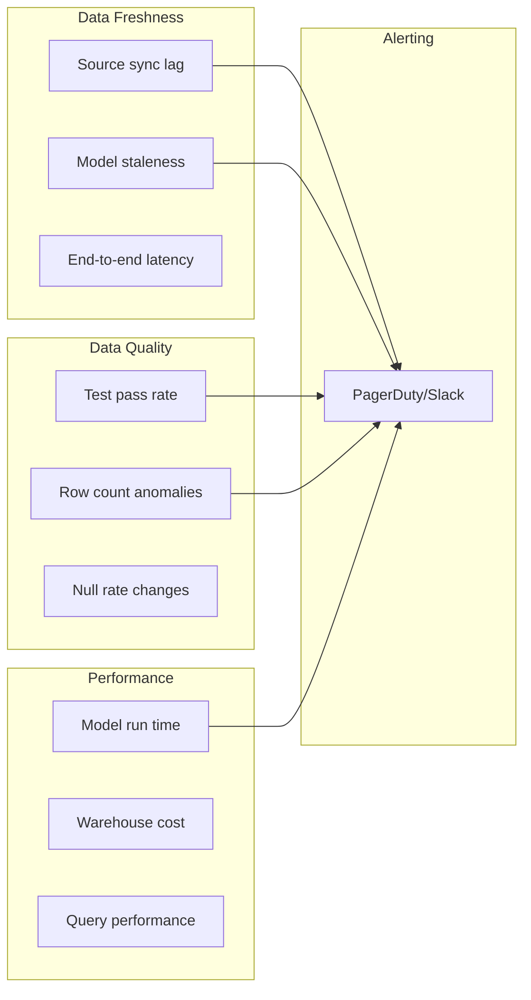

# How to Create ELT Pipeline Design

Author: [nawazdhandala](https://github.com/nawazdhandala)

Tags: Data Pipeline, ELT, Data Warehouse, dbt

Description: Learn to create ELT pipeline design for modern data warehousing with transformation in the target system.

---

Your data warehouse query takes 47 minutes. Users are refreshing dashboards hoping for yesterday's numbers. The engineering team blames "complex transformations." The analytics team blames "slow infrastructure." Meanwhile, your ETL jobs are failing silently at 3 AM because a source schema changed.

Sound familiar? You are not alone.

The shift from ETL (Extract, Transform, Load) to ELT (Extract, Load, Transform) is not just a letter swap. It is a fundamental rethinking of where computation happens, who owns transformations, and how data teams scale without drowning in pipeline spaghetti.

This guide walks you through designing production-grade ELT pipelines. We will cover architecture decisions, practical dbt examples, staging strategies, and incremental processing patterns that actually work at scale.

---

## ETL vs ELT: Understanding the Paradigm Shift

Before diving into implementation, let us understand why ELT emerged and when each approach makes sense.

### The Traditional ETL Approach


In ETL, transformations happen on a dedicated processing server before data reaches the warehouse. This made sense when:

- Data warehouses were expensive and storage-constrained
- Compute was cheaper outside the warehouse
- Data volumes were manageable on single servers

### The Modern ELT Approach



ELT pushes transformation into the warehouse itself. This works because:

- Modern warehouses (Snowflake, BigQuery, Redshift, DuckDB) have massive parallel compute
- Storage is cheap; compute is elastic
- SQL is the universal language analysts already know
- Version control and testing become straightforward with tools like dbt

### Side-by-Side Comparison

| Aspect | ETL | ELT |
|--------|-----|-----|
| Transform Location | External server | Inside warehouse |
| Raw Data Availability | Often discarded | Always preserved |
| Schema Changes | Pipeline breaks | Absorbed, transformed later |
| Scaling | Buy bigger servers | Warehouse auto-scales |
| Debugging | Check ETL logs | Query raw tables directly |
| Analyst Autonomy | Low (needs engineering) | High (SQL-based) |
| Initial Complexity | Higher | Lower |
| Best For | Legacy systems, streaming | Batch analytics, data lakes |

---

## ELT Pipeline Architecture

A well-designed ELT pipeline has distinct layers, each with clear responsibilities.

### The Medallion Architecture



**Bronze (Raw):** Exact copies of source data. No transformations. Preserves history.

**Silver (Staged):** Cleaned, typed, deduplicated. Business logic starts here.

**Gold (Marts):** Business-ready aggregates. Optimized for specific use cases.

---

## Setting Up Your dbt Project Structure

dbt (data build tool) is the standard for ELT transformations. Here is a production-ready project structure:

```
your_project/
├── dbt_project.yml          # Project configuration
├── profiles.yml             # Connection settings (keep out of git!)
├── packages.yml             # External packages
│
├── models/
│   ├── staging/             # Silver layer: source-specific cleaning
│   │   ├── postgres/
│   │   │   ├── _postgres__sources.yml
│   │   │   ├── _postgres__models.yml
│   │   │   ├── stg_postgres__users.sql
│   │   │   └── stg_postgres__orders.sql
│   │   │
│   │   └── stripe/
│   │       ├── _stripe__sources.yml
│   │       ├── _stripe__models.yml
│   │       └── stg_stripe__payments.sql
│   │
│   ├── intermediate/        # Complex joins, business logic
│   │   ├── int_orders_enriched.sql
│   │   └── int_user_sessions.sql
│   │
│   └── marts/               # Gold layer: business-ready tables
│       ├── core/
│       │   ├── dim_customers.sql
│       │   └── fct_orders.sql
│       │
│       └── finance/
│           ├── mart_monthly_revenue.sql
│           └── mart_customer_ltv.sql
│
├── tests/                   # Custom data tests
│   └── assert_positive_revenue.sql
│
├── macros/                  # Reusable SQL functions
│   ├── generate_surrogate_key.sql
│   └── cents_to_dollars.sql
│
├── seeds/                   # Static reference data
│   └── country_codes.csv
│
└── snapshots/               # Slowly changing dimensions
    └── scd_customers.sql
```

### Project Configuration

```yaml
# dbt_project.yml
# This file configures your dbt project settings

name: 'analytics'
version: '1.0.0'
config-version: 2

# Directory structure
model-paths: ["models"]
analysis-paths: ["analyses"]
test-paths: ["tests"]
seed-paths: ["seeds"]
macro-paths: ["macros"]
snapshot-paths: ["snapshots"]

# Target schema for compiled models
target-path: "target"
clean-targets:
  - "target"
  - "dbt_packages"

# Model configurations by folder
models:
  analytics:
    # Staging models: views for cost efficiency
    staging:
      +materialized: view
      +schema: staging

    # Intermediate: ephemeral (no table created, just CTEs)
    intermediate:
      +materialized: ephemeral

    # Marts: tables for query performance
    marts:
      +materialized: table
      +schema: marts
      core:
        +tags: ['core', 'daily']
      finance:
        +tags: ['finance', 'daily']

# Variables for environment-specific behavior
vars:
  # Limit data in dev for faster iteration
  dev_limit: 1000
  # Date range for incremental testing
  start_date: '2023-01-01'
```

---

## Building the Staging Layer

The staging layer is your first line of defense against messy source data. Every source system gets its own subfolder with consistent patterns.

### Source Definition

```yaml
# models/staging/postgres/_postgres__sources.yml
# Defines connections to raw data tables

version: 2

sources:
  - name: postgres
    description: "Production PostgreSQL database replicated via Fivetran"
    database: raw_db
    schema: postgres_public

    # Freshness checks alert on stale data
    freshness:
      warn_after: {count: 12, period: hour}
      error_after: {count: 24, period: hour}

    # Load time tracking for debugging
    loaded_at_field: _fivetran_synced

    tables:
      - name: users
        description: "User accounts from production app"
        columns:
          - name: id
            description: "Primary key"
            tests:
              - unique
              - not_null
          - name: email
            tests:
              - unique
              - not_null
          - name: created_at
            description: "Account creation timestamp"

      - name: orders
        description: "Customer orders"
        columns:
          - name: id
            tests:
              - unique
              - not_null
          - name: user_id
            tests:
              - not_null
              - relationships:
                  to: source('postgres', 'users')
                  field: id
```

### Staging Model Example

```sql
-- models/staging/postgres/stg_postgres__users.sql
-- Cleans and standardizes the raw users table
--
-- Transformations applied:
--   1. Rename columns to snake_case convention
--   2. Cast data types explicitly
--   3. Handle NULL values with sensible defaults
--   4. Add metadata columns for lineage tracking

{{
    config(
        materialized='view',
        tags=['staging', 'postgres']
    )
}}

with source as (
    -- Pull from raw source table
    select * from {{ source('postgres', 'users') }}
),

renamed as (
    select
        -- Primary key: cast explicitly for consistency
        id::integer as user_id,

        -- Clean email: lowercase, trim whitespace
        lower(trim(email)) as email,

        -- Split name into components (handle missing names)
        coalesce(nullif(trim(first_name), ''), 'Unknown') as first_name,
        coalesce(nullif(trim(last_name), ''), 'Unknown') as last_name,

        -- Standardize status values
        case
            when lower(status) in ('active', 'enabled', '1', 'true') then 'active'
            when lower(status) in ('inactive', 'disabled', '0', 'false') then 'inactive'
            when lower(status) in ('pending', 'unverified') then 'pending'
            else 'unknown'
        end as status,

        -- Country code standardization (uppercase ISO)
        upper(coalesce(country_code, 'XX')) as country_code,

        -- Timestamp handling: ensure timezone awareness
        created_at::timestamp with time zone as created_at,
        updated_at::timestamp with time zone as updated_at,

        -- Deleted flag for soft deletes
        coalesce(is_deleted, false) as is_deleted,

        -- Metadata: track when this row was loaded
        _fivetran_synced as _loaded_at,

        -- Metadata: track dbt run for debugging
        current_timestamp as _transformed_at

    from source

    -- Filter out test accounts in production
    where email not like '%@test.%'
      and email not like '%+test@%'
)

select * from renamed
```

### Staging Model for Orders with More Complex Logic

```sql
-- models/staging/postgres/stg_postgres__orders.sql
-- Standardizes order data with currency conversion and status mapping

{{
    config(
        materialized='view',
        tags=['staging', 'postgres']
    )
}}

with source as (
    select * from {{ source('postgres', 'orders') }}
),

-- Get exchange rates for currency normalization
exchange_rates as (
    select * from {{ ref('seed_exchange_rates') }}
),

transformed as (
    select
        -- Keys
        o.id::integer as order_id,
        o.user_id::integer as user_id,

        -- Order details
        o.order_number as order_number,

        -- Amount handling: convert cents to dollars, normalize to USD
        (o.amount_cents / 100.0) as order_amount_original,
        upper(coalesce(o.currency, 'USD')) as original_currency,

        -- Convert to USD for consistent reporting
        case
            when upper(o.currency) = 'USD' then (o.amount_cents / 100.0)
            else (o.amount_cents / 100.0) * coalesce(er.rate_to_usd, 1.0)
        end as order_amount_usd,

        -- Tax and shipping
        coalesce(o.tax_cents, 0) / 100.0 as tax_amount,
        coalesce(o.shipping_cents, 0) / 100.0 as shipping_amount,

        -- Status standardization
        case
            when o.status in ('pending', 'created', 'new') then 'pending'
            when o.status in ('paid', 'confirmed', 'accepted') then 'confirmed'
            when o.status in ('shipped', 'in_transit', 'dispatched') then 'shipped'
            when o.status in ('delivered', 'completed', 'done') then 'delivered'
            when o.status in ('cancelled', 'canceled', 'voided') then 'cancelled'
            when o.status in ('refunded', 'returned') then 'refunded'
            else 'unknown'
        end as order_status,

        -- Timestamps
        o.created_at::timestamp with time zone as ordered_at,
        o.paid_at::timestamp with time zone as paid_at,
        o.shipped_at::timestamp with time zone as shipped_at,
        o.delivered_at::timestamp with time zone as delivered_at,

        -- Calculated fields
        case
            when o.shipped_at is not null and o.paid_at is not null
            then extract(epoch from (o.shipped_at - o.paid_at)) / 3600.0
            else null
        end as hours_to_ship,

        -- Metadata
        o._fivetran_synced as _loaded_at,
        current_timestamp as _transformed_at

    from source o
    left join exchange_rates er
        on upper(o.currency) = er.currency_code
        and o.created_at::date = er.rate_date

    -- Exclude test orders
    where o.order_number not like 'TEST%'
      and o.amount_cents > 0
)

select * from transformed
```

---

## Building Intermediate Models

Intermediate models handle complex joins and business logic that span multiple sources. They are typically materialized as ephemeral (compiled as CTEs, not actual tables).

```sql
-- models/intermediate/int_orders_enriched.sql
-- Joins orders with user data and calculates order-level metrics
--
-- This model combines:
--   - Staged orders
--   - Staged users
--   - Staged payments (from Stripe)
--
-- Output: One row per order with full context

{{
    config(
        materialized='ephemeral',
        tags=['intermediate']
    )
}}

with orders as (
    select * from {{ ref('stg_postgres__orders') }}
),

users as (
    select * from {{ ref('stg_postgres__users') }}
),

payments as (
    select * from {{ ref('stg_stripe__payments') }}
),

-- Aggregate payments per order (handles partial payments)
order_payments as (
    select
        order_id,
        count(*) as payment_count,
        sum(case when status = 'succeeded' then amount_usd else 0 end) as total_paid_usd,
        min(case when status = 'succeeded' then paid_at end) as first_payment_at,
        max(case when status = 'succeeded' then paid_at end) as last_payment_at,
        bool_or(status = 'refunded') as has_refund
    from payments
    group by order_id
),

-- Calculate user order history for context
user_order_history as (
    select
        user_id,
        order_id,
        ordered_at,
        row_number() over (
            partition by user_id
            order by ordered_at
        ) as user_order_number,
        count(*) over (
            partition by user_id
        ) as user_total_orders,
        sum(order_amount_usd) over (
            partition by user_id
            order by ordered_at
            rows between unbounded preceding and current row
        ) as user_cumulative_spend
    from orders
),

enriched as (
    select
        -- Order identifiers
        o.order_id,
        o.order_number,

        -- User context
        o.user_id,
        u.email as user_email,
        u.first_name || ' ' || u.last_name as user_full_name,
        u.country_code as user_country,
        u.status as user_status,

        -- Order details
        o.order_amount_usd,
        o.tax_amount,
        o.shipping_amount,
        o.order_amount_usd + o.tax_amount + o.shipping_amount as order_total_usd,
        o.order_status,

        -- Payment details
        coalesce(p.payment_count, 0) as payment_count,
        coalesce(p.total_paid_usd, 0) as total_paid_usd,
        p.first_payment_at,
        p.has_refund,

        -- Payment status derived
        case
            when p.total_paid_usd >= (o.order_amount_usd + o.tax_amount + o.shipping_amount)
                then 'fully_paid'
            when p.total_paid_usd > 0
                then 'partially_paid'
            else 'unpaid'
        end as payment_status,

        -- User order context
        h.user_order_number,
        case when h.user_order_number = 1 then true else false end as is_first_order,
        h.user_total_orders,
        h.user_cumulative_spend,

        -- Timestamps
        o.ordered_at,
        o.shipped_at,
        o.delivered_at,
        o.hours_to_ship,

        -- User tenure at order time
        extract(day from o.ordered_at - u.created_at) as user_age_days_at_order,

        -- Metadata
        o._loaded_at,
        o._transformed_at

    from orders o
    inner join users u on o.user_id = u.user_id
    left join order_payments p on o.order_id = p.order_id
    left join user_order_history h on o.order_id = h.order_id
)

select * from enriched
```

---

## Building the Marts Layer

Marts are your final, business-ready outputs. They should be optimized for specific use cases and audiences.

### Dimension Table: Customers

```sql
-- models/marts/core/dim_customers.sql
-- Customer dimension table with current state and historical metrics
--
-- Grain: One row per customer
-- Updates: Daily refresh
-- Consumers: All teams

{{
    config(
        materialized='table',
        tags=['core', 'daily'],
        post_hook=[
            "analyze {{ this }}"
        ]
    )
}}

with users as (
    select * from {{ ref('stg_postgres__users') }}
    where is_deleted = false
),

orders as (
    select * from {{ ref('int_orders_enriched') }}
),

-- Calculate customer-level order metrics
customer_orders as (
    select
        user_id,

        -- Order counts
        count(*) as total_orders,
        count(case when order_status = 'delivered' then 1 end) as delivered_orders,
        count(case when order_status = 'cancelled' then 1 end) as cancelled_orders,
        count(case when has_refund then 1 end) as refunded_orders,

        -- Revenue metrics
        sum(order_total_usd) as gross_revenue_usd,
        sum(case when payment_status = 'fully_paid' then order_total_usd else 0 end) as net_revenue_usd,
        avg(order_total_usd) as avg_order_value_usd,

        -- Time-based metrics
        min(ordered_at) as first_order_at,
        max(ordered_at) as last_order_at,

        -- Order frequency (days between orders)
        case
            when count(*) > 1
            then extract(day from max(ordered_at) - min(ordered_at)) / (count(*) - 1.0)
            else null
        end as avg_days_between_orders

    from orders
    where order_status != 'cancelled'
    group by user_id
),

-- Determine customer segments
segmented as (
    select
        u.user_id,
        u.email,
        u.first_name,
        u.last_name,
        u.first_name || ' ' || u.last_name as full_name,
        u.country_code,
        u.status as account_status,
        u.created_at as signed_up_at,

        -- Order metrics (with defaults for customers who never ordered)
        coalesce(co.total_orders, 0) as total_orders,
        coalesce(co.delivered_orders, 0) as delivered_orders,
        coalesce(co.cancelled_orders, 0) as cancelled_orders,
        coalesce(co.refunded_orders, 0) as refunded_orders,
        coalesce(co.gross_revenue_usd, 0) as lifetime_gross_revenue_usd,
        coalesce(co.net_revenue_usd, 0) as lifetime_net_revenue_usd,
        co.avg_order_value_usd,
        co.first_order_at,
        co.last_order_at,
        co.avg_days_between_orders,

        -- Days since last order
        extract(day from current_timestamp - co.last_order_at) as days_since_last_order,

        -- Customer lifecycle stage
        case
            when co.total_orders is null then 'prospect'
            when co.total_orders = 1 then 'new_customer'
            when co.total_orders between 2 and 4 then 'developing'
            when co.total_orders >= 5 then 'loyal'
        end as lifecycle_stage,

        -- Revenue-based tier
        case
            when coalesce(co.net_revenue_usd, 0) = 0 then 'no_revenue'
            when co.net_revenue_usd < 100 then 'bronze'
            when co.net_revenue_usd < 500 then 'silver'
            when co.net_revenue_usd < 2000 then 'gold'
            else 'platinum'
        end as revenue_tier,

        -- Churn risk (simple heuristic)
        case
            when co.last_order_at is null then 'never_ordered'
            when extract(day from current_timestamp - co.last_order_at) > 180 then 'high_risk'
            when extract(day from current_timestamp - co.last_order_at) > 90 then 'medium_risk'
            else 'low_risk'
        end as churn_risk,

        -- Metadata
        current_timestamp as _dbt_updated_at

    from users u
    left join customer_orders co on u.user_id = co.user_id
)

select * from segmented
```

### Fact Table: Orders

```sql
-- models/marts/core/fct_orders.sql
-- Order fact table for transactional analysis
--
-- Grain: One row per order
-- Updates: Daily refresh
-- Consumers: Analytics, Finance, Operations

{{
    config(
        materialized='table',
        tags=['core', 'daily'],
        cluster_by=['ordered_at::date'],
        post_hook=[
            "analyze {{ this }}"
        ]
    )
}}

with enriched_orders as (
    select * from {{ ref('int_orders_enriched') }}
),

customers as (
    select user_id, lifecycle_stage, revenue_tier
    from {{ ref('dim_customers') }}
),

final as (
    select
        -- Surrogate key for fact table
        {{ dbt_utils.generate_surrogate_key(['o.order_id']) }} as order_key,

        -- Natural keys
        o.order_id,
        o.order_number,
        o.user_id,

        -- Customer attributes at time of order (for cohort analysis)
        o.user_order_number,
        o.is_first_order,
        o.user_age_days_at_order,
        c.lifecycle_stage as customer_lifecycle_stage,
        c.revenue_tier as customer_revenue_tier,

        -- Order amounts
        o.order_amount_usd,
        o.tax_amount,
        o.shipping_amount,
        o.order_total_usd,
        o.total_paid_usd,
        o.order_total_usd - o.total_paid_usd as outstanding_amount_usd,

        -- Status flags
        o.order_status,
        o.payment_status,
        o.has_refund,

        -- Fulfillment metrics
        o.hours_to_ship,
        case
            when o.delivered_at is not null and o.shipped_at is not null
            then extract(epoch from (o.delivered_at - o.shipped_at)) / 86400.0
            else null
        end as days_in_transit,

        -- Date dimensions (for joining to date spine)
        o.ordered_at::date as order_date,
        extract(year from o.ordered_at) as order_year,
        extract(month from o.ordered_at) as order_month,
        extract(dow from o.ordered_at) as order_day_of_week,
        extract(hour from o.ordered_at) as order_hour,

        -- Timestamps
        o.ordered_at,
        o.shipped_at,
        o.delivered_at,

        -- Metadata
        current_timestamp as _dbt_updated_at

    from enriched_orders o
    left join customers c on o.user_id = c.user_id
)

select * from final
```

---

## Incremental Processing

For large tables, full refreshes are expensive. Incremental models process only new or changed data.

### Basic Incremental Model

```sql
-- models/marts/core/fct_events.sql
-- Event fact table using incremental processing
--
-- Strategy: Append new events, update recent events that may have changed
-- Lookback: 3 days to catch late-arriving data

{{
    config(
        materialized='incremental',
        unique_key='event_id',
        incremental_strategy='merge',

        -- Partition by date for efficient pruning
        partition_by={
            "field": "event_date",
            "data_type": "date",
            "granularity": "day"
        },

        -- Cluster for common query patterns
        cluster_by=['event_type', 'user_id'],

        tags=['incremental', 'events']
    )
}}

with source_events as (
    select * from {{ source('events', 'raw_events') }}

    
    -- In incremental runs, only process recent data
    -- Look back 3 days to catch late-arriving events
    where event_timestamp >= (
        select dateadd(day, -3, max(event_timestamp))
        from {{ this }}
    )
    
),

transformed as (
    select
        -- Unique identifier
        event_id,

        -- Event details
        event_type,
        event_name,
        user_id,
        session_id,

        -- Event properties (JSON extraction)
        event_properties:page_url::string as page_url,
        event_properties:referrer::string as referrer,
        event_properties:device_type::string as device_type,
        event_properties:browser::string as browser,

        -- Numeric properties
        coalesce(event_properties:value::float, 0) as event_value,

        -- Timestamps
        event_timestamp,
        event_timestamp::date as event_date,

        -- Processing metadata
        current_timestamp as _dbt_processed_at

    from source_events

    -- Deduplication: keep latest version of each event
    qualify row_number() over (
        partition by event_id
        order by event_timestamp desc
    ) = 1
)

select * from transformed
```

### Incremental with Delete Detection

```sql
-- models/marts/core/dim_products.sql
-- Product dimension with soft delete handling
--
-- Strategy: Merge with delete detection
-- Handles: Inserts, updates, and soft deletes from source

{{
    config(
        materialized='incremental',
        unique_key='product_id',
        incremental_strategy='merge',
        merge_update_columns=['product_name', 'category', 'price_usd', 'is_active', '_dbt_updated_at'],
        tags=['incremental', 'products']
    )
}}

with source_products as (
    select * from {{ source('postgres', 'products') }}

    
    -- Only process products modified since last run
    where updated_at > (select max(_dbt_updated_at) from {{ this }})
    
),

transformed as (
    select
        id as product_id,
        name as product_name,
        category,
        subcategory,
        price_cents / 100.0 as price_usd,
        cost_cents / 100.0 as cost_usd,
        (price_cents - cost_cents) / 100.0 as margin_usd,

        -- Active status considers both explicit flag and soft delete
        case
            when is_deleted = true then false
            when status = 'active' then true
            else false
        end as is_active,

        created_at,
        updated_at,
        current_timestamp as _dbt_updated_at

    from source_products
)

select * from transformed
```

### Incremental Strategy Comparison



---

## Data Quality and Testing

Testing is not optional. dbt provides built-in tests and supports custom assertions.

### Schema Tests

```yaml
# models/marts/core/_core__models.yml
# Schema tests for core mart models

version: 2

models:
  - name: dim_customers
    description: "Customer dimension with lifetime metrics"

    columns:
      - name: user_id
        description: "Primary key"
        tests:
          - unique
          - not_null

      - name: email
        description: "Customer email address"
        tests:
          - unique
          - not_null

      - name: lifecycle_stage
        description: "Customer lifecycle classification"
        tests:
          - not_null
          - accepted_values:
              values: ['prospect', 'new_customer', 'developing', 'loyal']

      - name: revenue_tier
        description: "Revenue-based customer tier"
        tests:
          - accepted_values:
              values: ['no_revenue', 'bronze', 'silver', 'gold', 'platinum']

      - name: lifetime_net_revenue_usd
        description: "Total revenue from customer"
        tests:
          - not_null
          - dbt_utils.expression_is_true:
              expression: ">= 0"

  - name: fct_orders
    description: "Order fact table"

    tests:
      # Table-level test: ensure referential integrity
      - dbt_utils.expression_is_true:
          expression: "order_total_usd >= order_amount_usd"

    columns:
      - name: order_key
        tests:
          - unique
          - not_null

      - name: order_id
        tests:
          - unique
          - not_null
          - relationships:
              to: source('postgres', 'orders')
              field: id

      - name: user_id
        tests:
          - not_null
          - relationships:
              to: ref('dim_customers')
              field: user_id

      - name: order_total_usd
        tests:
          - not_null
          - dbt_utils.expression_is_true:
              expression: "> 0"
```

### Custom Data Tests

```sql
-- tests/assert_revenue_reconciliation.sql
-- Ensures our mart totals match the source system
-- This catches transformation bugs that lose or duplicate revenue

with mart_totals as (
    select
        sum(order_total_usd) as mart_revenue,
        count(distinct order_id) as mart_order_count
    from {{ ref('fct_orders') }}
    where order_date >= current_date - interval '30 days'
      and order_status != 'cancelled'
),

source_totals as (
    select
        sum(amount_cents) / 100.0 as source_revenue,
        count(distinct id) as source_order_count
    from {{ source('postgres', 'orders') }}
    where created_at::date >= current_date - interval '30 days'
      and status not in ('cancelled', 'canceled')
      and order_number not like 'TEST%'
)

-- Test fails if discrepancy exceeds 1% (allows for timing differences)
select
    'Revenue mismatch' as error_type,
    m.mart_revenue,
    s.source_revenue,
    abs(m.mart_revenue - s.source_revenue) / nullif(s.source_revenue, 0) as discrepancy_pct
from mart_totals m
cross join source_totals s
where abs(m.mart_revenue - s.source_revenue) / nullif(s.source_revenue, 0) > 0.01
```

```sql
-- tests/assert_no_orphan_orders.sql
-- Ensures every order has a valid customer

select
    o.order_id,
    o.user_id
from {{ ref('fct_orders') }} o
left join {{ ref('dim_customers') }} c on o.user_id = c.user_id
where c.user_id is null
```

---

## Reusable Macros

Macros reduce code duplication and enforce consistency across models.

```sql
-- macros/cents_to_dollars.sql
-- Converts cent amounts to dollars with proper null handling


    round(coalesce({{ column_name }}, 0) / 100.0, {{ precision }})


-- Usage in models:
-- select {{ cents_to_dollars('amount_cents') }} as amount_usd
```

```sql
-- macros/generate_date_spine.sql
-- Creates a continuous date range for time series analysis



with date_spine as (
    {{ dbt_utils.date_spine(
        datepart="day",
        start_date="cast('" ~ start_date ~ "' as date)",
        end_date="cast('" ~ end_date ~ "' as date)"
    ) }}
)

select
    date_day as date,
    extract(year from date_day) as year,
    extract(month from date_day) as month,
    extract(day from date_day) as day,
    extract(dow from date_day) as day_of_week,
    case when extract(dow from date_day) in (0, 6) then true else false end as is_weekend,
    to_char(date_day, 'YYYY-MM') as year_month
from date_spine


```

```sql
-- macros/limit_in_dev.sql
-- Limits data in development for faster iteration




    where {{ column_name }} >= current_date - interval '{{ dev_days }} days'




-- Usage:
-- select * from source_table
-- {{ limit_data_in_dev('created_at', 30) }}
```

---

## Pipeline Orchestration

Your dbt models need to run in the right order with proper dependencies.

### DAG Visualization



### Production Run Script

```bash
#!/bin/bash
# scripts/run_daily_pipeline.sh
# Daily ELT pipeline execution with proper error handling

set -euo pipefail

# Configuration
export DBT_PROFILES_DIR="${DBT_PROFILES_DIR:-~/.dbt}"
export DBT_TARGET="${DBT_TARGET:-prod}"
SLACK_WEBHOOK="${SLACK_WEBHOOK_URL:-}"

# Logging function
log() {
    echo "[$(date '+%Y-%m-%d %H:%M:%S')] $1"
}

# Alert function
send_alert() {
    local message="$1"
    local status="$2"

    if [[ -n "$SLACK_WEBHOOK" ]]; then
        curl -s -X POST "$SLACK_WEBHOOK" \
            -H 'Content-type: application/json' \
            -d "{\"text\": \"[$status] dbt Pipeline: $message\"}"
    fi
}

# Main pipeline execution
main() {
    log "Starting daily ELT pipeline"
    send_alert "Pipeline started" "INFO"

    # Step 1: Check source freshness
    log "Checking source freshness..."
    if ! dbt source freshness --target "$DBT_TARGET"; then
        send_alert "Source freshness check failed - data may be stale" "WARNING"
        # Continue anyway, but warn
    fi

    # Step 2: Run staging models
    log "Running staging models..."
    if ! dbt run --select staging --target "$DBT_TARGET"; then
        send_alert "Staging models failed" "ERROR"
        exit 1
    fi

    # Step 3: Run staging tests
    log "Testing staging models..."
    if ! dbt test --select staging --target "$DBT_TARGET"; then
        send_alert "Staging tests failed - check data quality" "ERROR"
        exit 1
    fi

    # Step 4: Run mart models
    log "Running mart models..."
    if ! dbt run --select marts --target "$DBT_TARGET"; then
        send_alert "Mart models failed" "ERROR"
        exit 1
    fi

    # Step 5: Run all tests
    log "Running all tests..."
    if ! dbt test --target "$DBT_TARGET"; then
        send_alert "Tests failed - investigate immediately" "ERROR"
        exit 1
    fi

    # Step 6: Generate docs (optional)
    log "Generating documentation..."
    dbt docs generate --target "$DBT_TARGET"

    log "Pipeline completed successfully"
    send_alert "Pipeline completed successfully" "SUCCESS"
}

# Execute main function
main "$@"
```

---

## Monitoring Your ELT Pipeline

A pipeline without monitoring is a pipeline waiting to fail silently.

### Key Metrics to Track



### dbt Artifacts for Monitoring

```sql
-- Create a table to track dbt run history
-- Query this to monitor pipeline health over time

create table if not exists analytics_meta.dbt_run_history (
    run_id varchar primary key,
    run_started_at timestamp,
    run_completed_at timestamp,
    run_status varchar,
    target_name varchar,
    models_succeeded int,
    models_failed int,
    models_skipped int,
    tests_passed int,
    tests_failed int,
    tests_warned int,
    total_run_time_seconds float
);

-- Insert after each run using dbt's run_results.json
-- This enables trend analysis and alerting on degradation
```

---

## Common Pitfalls and Solutions

| Pitfall | Symptom | Solution |
|---------|---------|----------|
| No staging layer | Business logic scattered everywhere | Always stage raw data first |
| Overly complex models | 500+ line SQL files | Break into intermediate models |
| No incremental strategy | 8-hour full refreshes | Implement merge or append patterns |
| Missing tests | Silent data quality issues | Test unique, not_null, relationships |
| Hardcoded values | Different results per environment | Use dbt variables and macros |
| No documentation | Tribal knowledge required | Use dbt docs with descriptions |
| Monolithic runs | One failure breaks everything | Tag models, run in stages |

---

## Quick Start Checklist

- [ ] Set up dbt project with proper folder structure
- [ ] Define all sources with freshness checks
- [ ] Create staging models for each source (clean, rename, type)
- [ ] Build intermediate models for complex joins
- [ ] Create mart models optimized for consumers
- [ ] Add schema tests (unique, not_null, relationships)
- [ ] Add custom data quality tests
- [ ] Implement incremental models for large tables
- [ ] Set up orchestration (Airflow, dbt Cloud, or cron)
- [ ] Configure alerting for failures and data quality issues
- [ ] Generate and publish documentation

---

## Conclusion

ELT is not just about moving letters around in an acronym. It represents a fundamental shift in how we think about data transformation:

1. **Load first, transform in place.** Modern warehouses are built for this.
2. **Preserve raw data.** You will thank yourself when requirements change.
3. **Use SQL for transformations.** It is the lingua franca of data.
4. **Test everything.** Silent failures are the worst kind.
5. **Document as you go.** Future you is a different person.

The patterns in this guide have been battle-tested across startups processing millions of events and enterprises with decades of legacy data. Start simple, add complexity only when needed, and always keep your pipeline observable.

Your data warehouse should not be a mystery. With proper ELT design, it becomes a well-lit, well-documented system that your entire organization can trust.

---

**Related Reading:**

- [Three Pillars of Observability: Logs, Metrics & Traces](https://oneuptime.com/blog/post/2025-08-20-three-pillars-of-observability-logs-metrics-traces/view)
- [How to Structure Logs Properly in OpenTelemetry](https://oneuptime.com/blog/post/2025-08-28-how-to-structure-logs-properly-in-opentelemetry/view)
- [Monitoring vs Observability for SREs](https://oneuptime.com/blog/post/2025-11-28-monitoring-vs-observability-sre/view)
