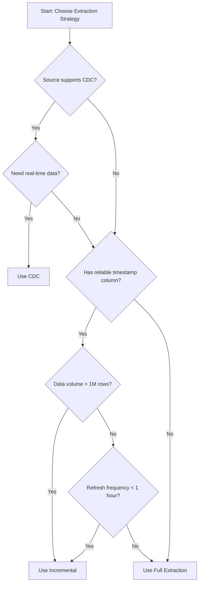
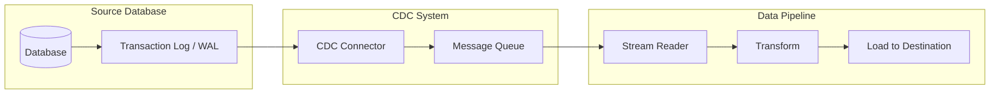
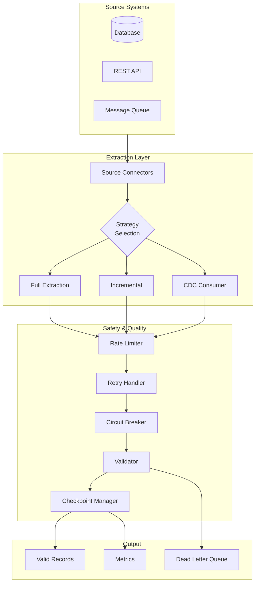

# How to Build Data Extraction Patterns

Author: [nawazdhandala](https://github.com/nawazdhandala)

Tags: Data Pipeline, ETL, Data Extraction, Integration

Description: Learn to build data extraction patterns for reliably pulling data from various source systems.

---

> The success of your data pipeline depends entirely on how well you extract data from source systems. Get extraction wrong, and everything downstream suffers.

Data extraction is the "E" in ETL (Extract, Transform, Load) and often the most challenging part of building reliable data pipelines. Source systems vary wildly in their APIs, data formats, availability windows, and rate limits. This guide covers practical patterns for building robust extraction logic that handles real-world complexity.

---

## Table of Contents

1. Extraction Strategy Overview
2. Full Extraction Pattern
3. Incremental Extraction Pattern
4. Change Data Capture (CDC) Pattern
5. Source Connector Architecture
6. Error Handling and Retry Logic
7. Rate Limiting and Backpressure
8. Checkpointing and Recovery
9. Data Validation at Extraction
10. Monitoring and Observability
11. Putting It All Together
12. Best Practices Summary

---

## 1. Extraction Strategy Overview

Before writing any code, choose the right extraction strategy based on your source system characteristics:

| Strategy | When to Use | Pros | Cons |
|----------|-------------|------|------|
| Full Extraction | Small datasets, no reliable change tracking, data warehouse refresh | Simple, consistent, catches deletes | Slow for large data, high resource usage |
| Incremental | Large datasets with timestamp/version columns | Efficient, faster runs | May miss deletes, requires tracking state |
| CDC (Change Data Capture) | Real-time requirements, database sources with log access | Near real-time, captures all changes | Complex setup, infrastructure overhead |

### Decision Flow



---

## 2. Full Extraction Pattern

Full extraction pulls all data from the source on every run. Despite being "simple," implementing it correctly requires attention to consistency and resource management.

### Basic Full Extraction

```python
# full_extractor.py
# Full extraction pattern with pagination and consistency checks

import logging
from typing import Iterator, Dict, Any, Optional
from dataclasses import dataclass
from datetime import datetime
import hashlib
import json

logger = logging.getLogger(__name__)

@dataclass
class ExtractionMetadata:
    """Tracks metadata about an extraction run."""
    extraction_id: str
    started_at: datetime
    source_name: str
    row_count: int = 0
    checksum: Optional[str] = None
    completed_at: Optional[datetime] = None

class FullExtractor:
    """
    Implements full extraction pattern with:
    - Pagination support for large datasets
    - Checksum calculation for data integrity
    - Consistent snapshot isolation where possible
    """

    def __init__(
        self,
        source_client: Any,
        page_size: int = 1000,
        enable_checksum: bool = True
    ):
        self.source = source_client
        self.page_size = page_size
        self.enable_checksum = enable_checksum
        self.hasher = hashlib.md5() if enable_checksum else None

    def extract(self, table_name: str) -> Iterator[Dict[str, Any]]:
        """
        Extract all records from a table using pagination.

        Yields records one at a time to support streaming to destination.
        Tracks row count and optional checksum for verification.
        """
        metadata = ExtractionMetadata(
            extraction_id=f"{table_name}_{datetime.utcnow().isoformat()}",
            started_at=datetime.utcnow(),
            source_name=table_name
        )

        logger.info(f"Starting full extraction: {metadata.extraction_id}")

        offset = 0
        total_rows = 0

        # Begin transaction/snapshot if source supports it
        # This ensures consistent reads across pagination
        with self.source.snapshot_context():
            while True:
                # Fetch one page of data
                page = self.source.fetch_page(
                    table=table_name,
                    offset=offset,
                    limit=self.page_size,
                    order_by="id"  # Stable ordering is critical
                )

                if not page:
                    break

                for record in page:
                    total_rows += 1

                    # Update checksum with record content
                    if self.enable_checksum:
                        record_bytes = json.dumps(
                            record,
                            sort_keys=True,
                            default=str
                        ).encode()
                        self.hasher.update(record_bytes)

                    yield record

                offset += len(page)
                logger.debug(f"Extracted {total_rows} rows so far")

                # If page is smaller than requested, we've reached the end
                if len(page) < self.page_size:
                    break

        # Finalize metadata
        metadata.row_count = total_rows
        metadata.completed_at = datetime.utcnow()
        if self.enable_checksum:
            metadata.checksum = self.hasher.hexdigest()

        logger.info(
            f"Full extraction complete: {total_rows} rows, "
            f"checksum={metadata.checksum}"
        )
```

### Handling Large Tables with Chunking

```python
# chunked_extractor.py
# Memory-efficient extraction for very large tables

from typing import Iterator, Dict, Any, List
from concurrent.futures import ThreadPoolExecutor, as_completed
import threading

class ChunkedFullExtractor:
    """
    Extracts large tables by dividing into chunks based on ID ranges.
    Supports parallel extraction for faster throughput.
    """

    def __init__(
        self,
        source_client: Any,
        chunk_size: int = 100000,
        max_workers: int = 4
    ):
        self.source = source_client
        self.chunk_size = chunk_size
        self.max_workers = max_workers
        self._lock = threading.Lock()

    def _get_id_boundaries(self, table: str) -> List[tuple]:
        """
        Determine chunk boundaries based on ID distribution.
        Returns list of (min_id, max_id) tuples for each chunk.
        """
        # Get min and max IDs from table
        stats = self.source.get_table_stats(table)
        min_id = stats['min_id']
        max_id = stats['max_id']

        # Calculate boundaries
        # Using ID ranges rather than OFFSET for better performance
        boundaries = []
        current = min_id

        while current <= max_id:
            chunk_end = min(current + self.chunk_size - 1, max_id)
            boundaries.append((current, chunk_end))
            current = chunk_end + 1

        return boundaries

    def _extract_chunk(
        self,
        table: str,
        min_id: int,
        max_id: int
    ) -> List[Dict[str, Any]]:
        """Extract a single chunk of data by ID range."""
        query = f"""
            SELECT * FROM {table}
            WHERE id >= {min_id} AND id <= {max_id}
            ORDER BY id
        """
        return self.source.execute_query(query)

    def extract_parallel(self, table: str) -> Iterator[Dict[str, Any]]:
        """
        Extract table using parallel chunk processing.

        Each chunk is extracted in a separate thread, but records
        are yielded in order to maintain consistency.
        """
        boundaries = self._get_id_boundaries(table)
        total_chunks = len(boundaries)

        logger.info(f"Extracting {table} in {total_chunks} chunks")

        # Process chunks in parallel but yield in order
        with ThreadPoolExecutor(max_workers=self.max_workers) as executor:
            # Submit all chunk extractions
            future_to_chunk = {
                executor.submit(
                    self._extract_chunk,
                    table,
                    min_id,
                    max_id
                ): idx
                for idx, (min_id, max_id) in enumerate(boundaries)
            }

            # Collect results in order
            results = [None] * total_chunks
            for future in as_completed(future_to_chunk):
                chunk_idx = future_to_chunk[future]
                results[chunk_idx] = future.result()
                logger.debug(f"Chunk {chunk_idx + 1}/{total_chunks} complete")

            # Yield records in chunk order
            for chunk_data in results:
                for record in chunk_data:
                    yield record
```

---

## 3. Incremental Extraction Pattern

Incremental extraction only pulls records that changed since the last run. This requires tracking extraction state (often called a "watermark" or "high water mark").

### Watermark-Based Incremental Extraction

```python
# incremental_extractor.py
# Incremental extraction using timestamp watermarks

from typing import Iterator, Dict, Any, Optional
from dataclasses import dataclass
from datetime import datetime, timedelta
import json

@dataclass
class Watermark:
    """Tracks the high water mark for incremental extraction."""
    table_name: str
    column_name: str
    last_value: Any
    last_extraction: datetime

    def to_dict(self) -> Dict[str, Any]:
        return {
            'table_name': self.table_name,
            'column_name': self.column_name,
            'last_value': str(self.last_value),
            'last_extraction': self.last_extraction.isoformat()
        }

    @classmethod
    def from_dict(cls, data: Dict[str, Any]) -> 'Watermark':
        return cls(
            table_name=data['table_name'],
            column_name=data['column_name'],
            last_value=data['last_value'],
            last_extraction=datetime.fromisoformat(data['last_extraction'])
        )

class WatermarkStore:
    """
    Persistent storage for watermarks.
    In production, use a database or distributed store.
    """

    def __init__(self, storage_path: str):
        self.storage_path = storage_path

    def get(self, table_name: str) -> Optional[Watermark]:
        """Retrieve the last watermark for a table."""
        try:
            with open(self.storage_path, 'r') as f:
                data = json.load(f)
                if table_name in data:
                    return Watermark.from_dict(data[table_name])
        except FileNotFoundError:
            pass
        return None

    def save(self, watermark: Watermark) -> None:
        """Persist a watermark after successful extraction."""
        try:
            with open(self.storage_path, 'r') as f:
                data = json.load(f)
        except FileNotFoundError:
            data = {}

        data[watermark.table_name] = watermark.to_dict()

        with open(self.storage_path, 'w') as f:
            json.dump(data, f, indent=2)


class IncrementalExtractor:
    """
    Extracts only records modified since the last extraction.

    Key considerations:
    - Uses overlap window to handle clock skew and late arrivals
    - Tracks max value seen during extraction for next watermark
    - Supports both timestamp and integer version columns
    """

    def __init__(
        self,
        source_client: Any,
        watermark_store: WatermarkStore,
        overlap_seconds: int = 300,  # 5 minute overlap window
        page_size: int = 1000
    ):
        self.source = source_client
        self.watermark_store = watermark_store
        self.overlap_seconds = overlap_seconds
        self.page_size = page_size

    def extract(
        self,
        table_name: str,
        watermark_column: str = 'updated_at'
    ) -> Iterator[Dict[str, Any]]:
        """
        Extract records modified since last watermark.

        The overlap window ensures we do not miss records due to:
        - Clock skew between source and extraction system
        - Transactions committed slightly after our last read
        - Replication lag in read replicas
        """
        # Get previous watermark or start from beginning
        previous_watermark = self.watermark_store.get(table_name)

        if previous_watermark:
            # Apply overlap window to catch late arrivals
            start_value = previous_watermark.last_value
            if isinstance(start_value, str):
                # Parse ISO timestamp and subtract overlap
                start_dt = datetime.fromisoformat(start_value)
                start_dt = start_dt - timedelta(seconds=self.overlap_seconds)
                start_value = start_dt.isoformat()
            logger.info(
                f"Incremental extraction from {watermark_column} > {start_value}"
            )
        else:
            start_value = None
            logger.info(f"No watermark found, performing initial full extraction")

        # Track the maximum value seen during this extraction
        max_value_seen = start_value
        row_count = 0

        offset = 0
        while True:
            # Build query with watermark filter
            if start_value:
                records = self.source.fetch_incremental(
                    table=table_name,
                    watermark_column=watermark_column,
                    after_value=start_value,
                    offset=offset,
                    limit=self.page_size
                )
            else:
                records = self.source.fetch_page(
                    table=table_name,
                    offset=offset,
                    limit=self.page_size,
                    order_by=watermark_column
                )

            if not records:
                break

            for record in records:
                row_count += 1

                # Track maximum watermark value
                record_value = record.get(watermark_column)
                if record_value and (
                    max_value_seen is None or record_value > max_value_seen
                ):
                    max_value_seen = record_value

                yield record

            offset += len(records)

            if len(records) < self.page_size:
                break

        # Save new watermark after successful extraction
        if max_value_seen:
            new_watermark = Watermark(
                table_name=table_name,
                column_name=watermark_column,
                last_value=max_value_seen,
                last_extraction=datetime.utcnow()
            )
            self.watermark_store.save(new_watermark)
            logger.info(
                f"Extraction complete: {row_count} rows, "
                f"new watermark: {max_value_seen}"
            )
```

### Handling Deletes in Incremental Extraction

```python
# soft_delete_extractor.py
# Handling soft deletes in incremental extraction

class SoftDeleteExtractor(IncrementalExtractor):
    """
    Extends incremental extraction to handle soft deletes.

    Two strategies:
    1. Soft delete column (deleted_at, is_deleted)
    2. Separate deleted records table
    """

    def __init__(
        self,
        source_client: Any,
        watermark_store: WatermarkStore,
        delete_column: str = 'deleted_at',
        **kwargs
    ):
        super().__init__(source_client, watermark_store, **kwargs)
        self.delete_column = delete_column

    def extract_with_deletes(
        self,
        table_name: str,
        watermark_column: str = 'updated_at'
    ) -> Iterator[Dict[str, Any]]:
        """
        Extract records including soft deleted ones.

        Adds a _is_deleted flag to each record for downstream handling.
        """
        for record in self.extract(table_name, watermark_column):
            # Check if record is marked as deleted
            deleted_value = record.get(self.delete_column)
            record['_is_deleted'] = deleted_value is not None
            record['_extracted_at'] = datetime.utcnow().isoformat()
            yield record


class DeleteLogExtractor:
    """
    Extracts deletes from a separate delete log table.

    Useful when source system tracks hard deletes in an audit table.
    """

    def __init__(
        self,
        source_client: Any,
        watermark_store: WatermarkStore,
        delete_log_table: str = 'deleted_records'
    ):
        self.source = source_client
        self.watermark_store = watermark_store
        self.delete_log_table = delete_log_table

    def extract_deletes(
        self,
        table_name: str
    ) -> Iterator[Dict[str, Any]]:
        """
        Extract delete events from the delete log.

        Returns records with only the primary key and deletion timestamp,
        which downstream processes can use to remove/archive records.
        """
        watermark = self.watermark_store.get(f"{table_name}_deletes")
        start_time = watermark.last_value if watermark else None

        query = f"""
            SELECT
                record_id,
                table_name,
                deleted_at,
                deleted_by
            FROM {self.delete_log_table}
            WHERE table_name = '{table_name}'
        """

        if start_time:
            query += f" AND deleted_at > '{start_time}'"

        query += " ORDER BY deleted_at"

        max_deleted_at = start_time

        for record in self.source.execute_query(query):
            if record['deleted_at'] > (max_deleted_at or ''):
                max_deleted_at = record['deleted_at']

            yield {
                '_operation': 'DELETE',
                '_record_id': record['record_id'],
                '_deleted_at': record['deleted_at'],
                '_deleted_by': record['deleted_by']
            }

        # Update watermark
        if max_deleted_at:
            new_watermark = Watermark(
                table_name=f"{table_name}_deletes",
                column_name='deleted_at',
                last_value=max_deleted_at,
                last_extraction=datetime.utcnow()
            )
            self.watermark_store.save(new_watermark)
```

---

## 4. Change Data Capture (CDC) Pattern

CDC captures changes directly from database transaction logs, providing near real-time data with complete change history (inserts, updates, deletes).

### CDC Architecture Overview



### Debezium-Style CDC Consumer

```python
# cdc_consumer.py
# Consuming CDC events from a message queue

from typing import Iterator, Dict, Any, Optional, Callable
from dataclasses import dataclass
from enum import Enum
from datetime import datetime
import json

class OperationType(Enum):
    """CDC operation types following Debezium conventions."""
    CREATE = 'c'      # Insert
    UPDATE = 'u'      # Update
    DELETE = 'd'      # Delete
    READ = 'r'        # Snapshot read (initial load)
    TRUNCATE = 't'    # Table truncate

@dataclass
class CDCEvent:
    """
    Represents a single change event from CDC stream.

    Follows Debezium envelope format:
    - before: Record state before change (null for inserts)
    - after: Record state after change (null for deletes)
    - source: Metadata about the source database
    - op: Operation type
    - ts_ms: Event timestamp in milliseconds
    """
    operation: OperationType
    before: Optional[Dict[str, Any]]
    after: Optional[Dict[str, Any]]
    source_table: str
    source_database: str
    timestamp_ms: int
    transaction_id: Optional[str]
    position: str  # Log sequence number or offset

    @property
    def primary_key(self) -> Dict[str, Any]:
        """Extract primary key from the record."""
        record = self.after or self.before
        # Assumes 'id' is the primary key; customize as needed
        return {'id': record.get('id')} if record else {}

    @classmethod
    def from_debezium(cls, payload: Dict[str, Any]) -> 'CDCEvent':
        """Parse a Debezium-format CDC event."""
        source = payload.get('source', {})
        return cls(
            operation=OperationType(payload['op']),
            before=payload.get('before'),
            after=payload.get('after'),
            source_table=source.get('table', ''),
            source_database=source.get('db', ''),
            timestamp_ms=payload.get('ts_ms', 0),
            transaction_id=payload.get('transaction', {}).get('id'),
            position=source.get('lsn', source.get('pos', ''))
        )


class CDCConsumer:
    """
    Consumes CDC events from a message queue (Kafka, etc.).

    Features:
    - Ordered processing within partitions
    - Exactly-once semantics with offset tracking
    - Dead letter queue for failed events
    - Schema evolution handling
    """

    def __init__(
        self,
        consumer_client: Any,
        offset_store: Any,
        dlq_producer: Optional[Any] = None,
        batch_size: int = 100
    ):
        self.consumer = consumer_client
        self.offset_store = offset_store
        self.dlq = dlq_producer
        self.batch_size = batch_size

    def consume(
        self,
        topic: str,
        handler: Callable[[CDCEvent], None]
    ) -> None:
        """
        Consume CDC events and process with the given handler.

        Implements at-least-once delivery with manual offset commits
        after successful processing.
        """
        # Resume from last committed offset
        last_offset = self.offset_store.get(topic)
        if last_offset:
            self.consumer.seek(topic, last_offset)

        batch = []

        for message in self.consumer.poll(topic, timeout_ms=1000):
            try:
                # Parse CDC event
                payload = json.loads(message.value)
                event = CDCEvent.from_debezium(payload)

                # Add to batch
                batch.append((message.offset, event))

                # Process batch when full
                if len(batch) >= self.batch_size:
                    self._process_batch(batch, handler)
                    batch = []

            except Exception as e:
                logger.error(f"Failed to process message: {e}")
                self._send_to_dlq(message, str(e))

        # Process remaining events
        if batch:
            self._process_batch(batch, handler)

    def _process_batch(
        self,
        batch: list,
        handler: Callable[[CDCEvent], None]
    ) -> None:
        """Process a batch of events and commit offsets."""
        max_offset = 0

        for offset, event in batch:
            handler(event)
            max_offset = max(max_offset, offset)

        # Commit offset after successful processing
        self.offset_store.save(event.source_table, max_offset)
        logger.debug(f"Committed offset {max_offset}")

    def _send_to_dlq(self, message: Any, error: str) -> None:
        """Send failed message to dead letter queue."""
        if self.dlq:
            self.dlq.send({
                'original_message': message.value,
                'error': error,
                'timestamp': datetime.utcnow().isoformat()
            })


class CDCMerger:
    """
    Merges CDC events into a target table state.

    Handles:
    - Upserts (INSERT or UPDATE based on existence)
    - Deletes (soft or hard)
    - Out-of-order event handling
    """

    def __init__(self, target_store: Any, soft_delete: bool = True):
        self.target = target_store
        self.soft_delete = soft_delete

    def apply_event(self, event: CDCEvent) -> None:
        """Apply a CDC event to the target store."""
        pk = event.primary_key

        if event.operation == OperationType.DELETE:
            if self.soft_delete:
                self.target.update(
                    pk,
                    {'_deleted': True, '_deleted_at': event.timestamp_ms}
                )
            else:
                self.target.delete(pk)

        elif event.operation in (
            OperationType.CREATE,
            OperationType.UPDATE,
            OperationType.READ
        ):
            record = event.after.copy()
            record['_cdc_timestamp'] = event.timestamp_ms
            record['_cdc_operation'] = event.operation.value
            self.target.upsert(pk, record)

        elif event.operation == OperationType.TRUNCATE:
            logger.warning(
                f"TRUNCATE event received for {event.source_table}"
            )
            # Handle based on business requirements
```

---

## 5. Source Connector Architecture

A well-designed connector architecture allows you to support multiple source types with consistent behavior.

### Connector Interface and Base Class

```python
# connectors/base.py
# Abstract base class for source connectors

from abc import ABC, abstractmethod
from typing import Iterator, Dict, Any, Optional, List
from dataclasses import dataclass
from contextlib import contextmanager
from enum import Enum

class ConnectorCapability(Enum):
    """Capabilities that a connector may support."""
    FULL_EXTRACTION = 'full'
    INCREMENTAL = 'incremental'
    CDC = 'cdc'
    SCHEMA_DISCOVERY = 'schema'
    PARALLEL_READ = 'parallel'
    SNAPSHOT_ISOLATION = 'snapshot'

@dataclass
class TableSchema:
    """Schema information for a source table."""
    name: str
    columns: List[Dict[str, Any]]
    primary_key: List[str]
    watermark_columns: List[str]
    estimated_row_count: Optional[int] = None

@dataclass
class ConnectionConfig:
    """Base configuration for connectors."""
    host: str
    port: int
    database: str
    username: str
    password: str
    ssl_enabled: bool = True
    connection_timeout: int = 30
    query_timeout: int = 300

class BaseConnector(ABC):
    """
    Abstract base class for all source connectors.

    Provides:
    - Consistent interface for extraction operations
    - Connection lifecycle management
    - Schema discovery
    - Capability introspection
    """

    def __init__(self, config: ConnectionConfig):
        self.config = config
        self._connection = None

    @property
    @abstractmethod
    def capabilities(self) -> List[ConnectorCapability]:
        """Return list of supported capabilities."""
        pass

    @abstractmethod
    def connect(self) -> None:
        """Establish connection to the source system."""
        pass

    @abstractmethod
    def disconnect(self) -> None:
        """Close connection to the source system."""
        pass

    @abstractmethod
    def test_connection(self) -> bool:
        """Test if connection can be established."""
        pass

    @abstractmethod
    def discover_schema(self) -> List[TableSchema]:
        """Discover available tables and their schemas."""
        pass

    @abstractmethod
    def fetch_page(
        self,
        table: str,
        offset: int,
        limit: int,
        order_by: str
    ) -> List[Dict[str, Any]]:
        """Fetch a page of records from a table."""
        pass

    @contextmanager
    def snapshot_context(self):
        """
        Context manager for snapshot isolation.
        Override in connectors that support it.
        """
        yield  # Default: no-op

    def has_capability(self, capability: ConnectorCapability) -> bool:
        """Check if connector supports a specific capability."""
        return capability in self.capabilities

    def __enter__(self):
        self.connect()
        return self

    def __exit__(self, exc_type, exc_val, exc_tb):
        self.disconnect()
```

### PostgreSQL Connector Implementation

```python
# connectors/postgresql.py
# PostgreSQL source connector with full feature support

import psycopg2
from psycopg2 import sql
from psycopg2.extras import RealDictCursor
from contextlib import contextmanager
from typing import List, Dict, Any, Optional

class PostgreSQLConnector(BaseConnector):
    """
    PostgreSQL source connector.

    Supports:
    - Full and incremental extraction
    - Snapshot isolation via transactions
    - Schema discovery with column types
    - Parallel reads via COPY command
    """

    @property
    def capabilities(self) -> List[ConnectorCapability]:
        return [
            ConnectorCapability.FULL_EXTRACTION,
            ConnectorCapability.INCREMENTAL,
            ConnectorCapability.SCHEMA_DISCOVERY,
            ConnectorCapability.SNAPSHOT_ISOLATION,
            ConnectorCapability.PARALLEL_READ,
        ]

    def connect(self) -> None:
        """Establish PostgreSQL connection."""
        self._connection = psycopg2.connect(
            host=self.config.host,
            port=self.config.port,
            database=self.config.database,
            user=self.config.username,
            password=self.config.password,
            sslmode='require' if self.config.ssl_enabled else 'disable',
            connect_timeout=self.config.connection_timeout,
            cursor_factory=RealDictCursor
        )
        # Use autocommit=False for transaction control
        self._connection.autocommit = False
        logger.info(f"Connected to PostgreSQL: {self.config.host}")

    def disconnect(self) -> None:
        """Close PostgreSQL connection."""
        if self._connection:
            self._connection.close()
            self._connection = None
            logger.info("Disconnected from PostgreSQL")

    def test_connection(self) -> bool:
        """Test PostgreSQL connectivity."""
        try:
            with psycopg2.connect(
                host=self.config.host,
                port=self.config.port,
                database=self.config.database,
                user=self.config.username,
                password=self.config.password,
                connect_timeout=5
            ) as conn:
                with conn.cursor() as cur:
                    cur.execute("SELECT 1")
                    return cur.fetchone() is not None
        except Exception as e:
            logger.error(f"Connection test failed: {e}")
            return False

    @contextmanager
    def snapshot_context(self):
        """
        Provide snapshot isolation using REPEATABLE READ.

        All queries within this context see the same database state,
        ensuring consistent extraction across pagination.
        """
        self._connection.set_isolation_level(
            psycopg2.extensions.ISOLATION_LEVEL_REPEATABLE_READ
        )
        try:
            yield
            self._connection.commit()
        except Exception:
            self._connection.rollback()
            raise
        finally:
            # Reset to default isolation level
            self._connection.set_isolation_level(
                psycopg2.extensions.ISOLATION_LEVEL_READ_COMMITTED
            )

    def discover_schema(self) -> List[TableSchema]:
        """
        Discover all tables and their schemas.

        Queries information_schema for column definitions,
        primary keys, and table statistics.
        """
        schemas = []

        with self._connection.cursor() as cur:
            # Get all tables
            cur.execute("""
                SELECT table_name
                FROM information_schema.tables
                WHERE table_schema = 'public'
                AND table_type = 'BASE TABLE'
            """)
            tables = [row['table_name'] for row in cur.fetchall()]

            for table in tables:
                # Get columns
                cur.execute("""
                    SELECT
                        column_name,
                        data_type,
                        is_nullable,
                        column_default
                    FROM information_schema.columns
                    WHERE table_name = %s
                    ORDER BY ordinal_position
                """, (table,))
                columns = cur.fetchall()

                # Get primary key
                cur.execute("""
                    SELECT a.attname
                    FROM pg_index i
                    JOIN pg_attribute a
                        ON a.attrelid = i.indrelid
                        AND a.attnum = ANY(i.indkey)
                    WHERE i.indrelid = %s::regclass
                    AND i.indisprimary
                """, (table,))
                pk_columns = [row['attname'] for row in cur.fetchall()]

                # Identify potential watermark columns
                watermark_cols = [
                    c['column_name'] for c in columns
                    if c['column_name'] in (
                        'updated_at', 'modified_at', 'last_modified',
                        'created_at', 'version', 'row_version'
                    )
                ]

                # Get row count estimate
                cur.execute(
                    "SELECT reltuples::bigint FROM pg_class WHERE relname = %s",
                    (table,)
                )
                row_count = cur.fetchone()

                schemas.append(TableSchema(
                    name=table,
                    columns=columns,
                    primary_key=pk_columns,
                    watermark_columns=watermark_cols,
                    estimated_row_count=row_count['reltuples'] if row_count else None
                ))

        return schemas

    def fetch_page(
        self,
        table: str,
        offset: int,
        limit: int,
        order_by: str
    ) -> List[Dict[str, Any]]:
        """Fetch a page of records using LIMIT/OFFSET."""
        query = sql.SQL("""
            SELECT * FROM {table}
            ORDER BY {order_by}
            LIMIT {limit} OFFSET {offset}
        """).format(
            table=sql.Identifier(table),
            order_by=sql.Identifier(order_by),
            limit=sql.Literal(limit),
            offset=sql.Literal(offset)
        )

        with self._connection.cursor() as cur:
            cur.execute(query)
            return cur.fetchall()

    def fetch_incremental(
        self,
        table: str,
        watermark_column: str,
        after_value: Any,
        offset: int,
        limit: int
    ) -> List[Dict[str, Any]]:
        """Fetch records modified after the watermark value."""
        query = sql.SQL("""
            SELECT * FROM {table}
            WHERE {watermark} > {value}
            ORDER BY {watermark}
            LIMIT {limit} OFFSET {offset}
        """).format(
            table=sql.Identifier(table),
            watermark=sql.Identifier(watermark_column),
            value=sql.Literal(after_value),
            limit=sql.Literal(limit),
            offset=sql.Literal(offset)
        )

        with self._connection.cursor() as cur:
            cur.execute(query)
            return cur.fetchall()
```

### REST API Connector

```python
# connectors/rest_api.py
# Generic REST API source connector

import requests
from requests.adapters import HTTPAdapter
from urllib3.util.retry import Retry
from typing import List, Dict, Any, Optional, Iterator
import time

class RestAPIConnector(BaseConnector):
    """
    Generic REST API source connector.

    Supports:
    - Pagination (offset, cursor, page number)
    - Rate limiting with backoff
    - OAuth and API key authentication
    - Response transformation
    """

    @property
    def capabilities(self) -> List[ConnectorCapability]:
        return [
            ConnectorCapability.FULL_EXTRACTION,
            ConnectorCapability.INCREMENTAL,
        ]

    def __init__(
        self,
        base_url: str,
        auth_type: str = 'api_key',
        auth_config: Dict[str, str] = None,
        rate_limit_per_second: float = 10.0,
        pagination_style: str = 'offset'  # offset, cursor, page
    ):
        self.base_url = base_url.rstrip('/')
        self.auth_type = auth_type
        self.auth_config = auth_config or {}
        self.rate_limit = rate_limit_per_second
        self.pagination_style = pagination_style
        self._session = None
        self._last_request_time = 0

    def connect(self) -> None:
        """Initialize HTTP session with retry logic."""
        self._session = requests.Session()

        # Configure retries
        retry_strategy = Retry(
            total=3,
            backoff_factor=1,
            status_forcelist=[429, 500, 502, 503, 504],
            allowed_methods=["GET", "POST"]
        )
        adapter = HTTPAdapter(max_retries=retry_strategy)
        self._session.mount("http://", adapter)
        self._session.mount("https://", adapter)

        # Set authentication headers
        if self.auth_type == 'api_key':
            header_name = self.auth_config.get('header', 'Authorization')
            api_key = self.auth_config.get('api_key', '')
            self._session.headers[header_name] = f"Bearer {api_key}"
        elif self.auth_type == 'basic':
            self._session.auth = (
                self.auth_config.get('username'),
                self.auth_config.get('password')
            )

    def disconnect(self) -> None:
        """Close HTTP session."""
        if self._session:
            self._session.close()
            self._session = None

    def _rate_limit_wait(self) -> None:
        """Enforce rate limiting between requests."""
        if self.rate_limit <= 0:
            return

        min_interval = 1.0 / self.rate_limit
        elapsed = time.time() - self._last_request_time

        if elapsed < min_interval:
            time.sleep(min_interval - elapsed)

        self._last_request_time = time.time()

    def _make_request(
        self,
        endpoint: str,
        params: Dict[str, Any] = None
    ) -> Dict[str, Any]:
        """Make rate-limited HTTP request."""
        self._rate_limit_wait()

        url = f"{self.base_url}/{endpoint.lstrip('/')}"
        response = self._session.get(url, params=params)
        response.raise_for_status()

        return response.json()

    def fetch_all(
        self,
        endpoint: str,
        data_key: str = 'data',
        page_size: int = 100
    ) -> Iterator[Dict[str, Any]]:
        """
        Fetch all records from an endpoint with automatic pagination.

        Supports multiple pagination styles:
        - offset: Uses offset/limit parameters
        - cursor: Uses cursor token from response
        - page: Uses page number parameter
        """
        if self.pagination_style == 'offset':
            yield from self._paginate_offset(endpoint, data_key, page_size)
        elif self.pagination_style == 'cursor':
            yield from self._paginate_cursor(endpoint, data_key, page_size)
        elif self.pagination_style == 'page':
            yield from self._paginate_page(endpoint, data_key, page_size)

    def _paginate_offset(
        self,
        endpoint: str,
        data_key: str,
        page_size: int
    ) -> Iterator[Dict[str, Any]]:
        """Pagination using offset/limit."""
        offset = 0

        while True:
            response = self._make_request(endpoint, {
                'offset': offset,
                'limit': page_size
            })

            records = response.get(data_key, [])
            if not records:
                break

            for record in records:
                yield record

            offset += len(records)

            if len(records) < page_size:
                break

    def _paginate_cursor(
        self,
        endpoint: str,
        data_key: str,
        page_size: int
    ) -> Iterator[Dict[str, Any]]:
        """Pagination using cursor tokens."""
        cursor = None

        while True:
            params = {'limit': page_size}
            if cursor:
                params['cursor'] = cursor

            response = self._make_request(endpoint, params)

            records = response.get(data_key, [])
            for record in records:
                yield record

            # Get next cursor from response
            cursor = response.get('next_cursor')
            if not cursor or not records:
                break

    def _paginate_page(
        self,
        endpoint: str,
        data_key: str,
        page_size: int
    ) -> Iterator[Dict[str, Any]]:
        """Pagination using page numbers."""
        page = 1

        while True:
            response = self._make_request(endpoint, {
                'page': page,
                'per_page': page_size
            })

            records = response.get(data_key, [])
            if not records:
                break

            for record in records:
                yield record

            # Check if more pages exist
            total_pages = response.get('total_pages', page)
            if page >= total_pages:
                break

            page += 1
```

---

## 6. Error Handling and Retry Logic

Robust error handling is critical for production data pipelines. Network issues, rate limits, and transient failures are inevitable.

### Retry Decorator with Exponential Backoff

```python
# error_handling.py
# Comprehensive error handling and retry logic

import time
import random
import functools
from typing import Callable, Type, Tuple, Optional
from dataclasses import dataclass
import logging

logger = logging.getLogger(__name__)

@dataclass
class RetryConfig:
    """Configuration for retry behavior."""
    max_attempts: int = 3
    initial_delay: float = 1.0
    max_delay: float = 60.0
    exponential_base: float = 2.0
    jitter: bool = True
    retryable_exceptions: Tuple[Type[Exception], ...] = (
        ConnectionError,
        TimeoutError,
    )

def calculate_backoff(
    attempt: int,
    config: RetryConfig
) -> float:
    """
    Calculate delay for next retry using exponential backoff.

    Formula: min(initial_delay * (base ^ attempt), max_delay)
    Optional jitter prevents thundering herd problem.
    """
    delay = min(
        config.initial_delay * (config.exponential_base ** attempt),
        config.max_delay
    )

    if config.jitter:
        # Add random jitter: 0.5x to 1.5x of calculated delay
        delay = delay * (0.5 + random.random())

    return delay


def retry_with_backoff(config: Optional[RetryConfig] = None):
    """
    Decorator that adds retry logic with exponential backoff.

    Usage:
        @retry_with_backoff(RetryConfig(max_attempts=5))
        def fetch_data():
            ...
    """
    if config is None:
        config = RetryConfig()

    def decorator(func: Callable):
        @functools.wraps(func)
        def wrapper(*args, **kwargs):
            last_exception = None

            for attempt in range(config.max_attempts):
                try:
                    return func(*args, **kwargs)
                except config.retryable_exceptions as e:
                    last_exception = e

                    if attempt < config.max_attempts - 1:
                        delay = calculate_backoff(attempt, config)
                        logger.warning(
                            f"Attempt {attempt + 1} failed: {e}. "
                            f"Retrying in {delay:.2f}s"
                        )
                        time.sleep(delay)
                    else:
                        logger.error(
                            f"All {config.max_attempts} attempts failed"
                        )
                except Exception as e:
                    # Non-retryable exception, raise immediately
                    logger.error(f"Non-retryable error: {e}")
                    raise

            raise last_exception

        return wrapper
    return decorator


class CircuitBreaker:
    """
    Circuit breaker pattern to prevent cascading failures.

    States:
    - CLOSED: Normal operation, requests pass through
    - OPEN: Failing fast, requests immediately rejected
    - HALF_OPEN: Testing if service recovered
    """

    CLOSED = 'closed'
    OPEN = 'open'
    HALF_OPEN = 'half_open'

    def __init__(
        self,
        failure_threshold: int = 5,
        recovery_timeout: float = 30.0,
        half_open_max_calls: int = 3
    ):
        self.failure_threshold = failure_threshold
        self.recovery_timeout = recovery_timeout
        self.half_open_max_calls = half_open_max_calls

        self._state = self.CLOSED
        self._failure_count = 0
        self._last_failure_time = 0
        self._half_open_calls = 0

    @property
    def state(self) -> str:
        """Get current circuit state, checking for recovery."""
        if self._state == self.OPEN:
            # Check if recovery timeout has passed
            if time.time() - self._last_failure_time >= self.recovery_timeout:
                self._state = self.HALF_OPEN
                self._half_open_calls = 0
                logger.info("Circuit breaker entering HALF_OPEN state")

        return self._state

    def record_success(self) -> None:
        """Record a successful call."""
        if self._state == self.HALF_OPEN:
            self._half_open_calls += 1
            if self._half_open_calls >= self.half_open_max_calls:
                self._state = self.CLOSED
                self._failure_count = 0
                logger.info("Circuit breaker CLOSED after recovery")
        elif self._state == self.CLOSED:
            self._failure_count = 0

    def record_failure(self) -> None:
        """Record a failed call."""
        self._failure_count += 1
        self._last_failure_time = time.time()

        if self._state == self.HALF_OPEN:
            # Failed during recovery test, reopen
            self._state = self.OPEN
            logger.warning("Circuit breaker reopened during half-open test")
        elif self._failure_count >= self.failure_threshold:
            self._state = self.OPEN
            logger.warning(
                f"Circuit breaker OPEN after {self._failure_count} failures"
            )

    def allow_request(self) -> bool:
        """Check if a request should be allowed."""
        state = self.state  # Triggers recovery check

        if state == self.CLOSED:
            return True
        elif state == self.HALF_OPEN:
            return True  # Allow limited test requests
        else:
            return False

    def __call__(self, func: Callable) -> Callable:
        """Use as decorator."""
        @functools.wraps(func)
        def wrapper(*args, **kwargs):
            if not self.allow_request():
                raise RuntimeError("Circuit breaker is OPEN")

            try:
                result = func(*args, **kwargs)
                self.record_success()
                return result
            except Exception as e:
                self.record_failure()
                raise

        return wrapper
```

### Dead Letter Queue Handler

```python
# dlq_handler.py
# Dead letter queue for failed extraction records

from typing import Dict, Any, Optional, Callable
from dataclasses import dataclass, asdict
from datetime import datetime
import json
import hashlib

@dataclass
class FailedRecord:
    """Represents a record that failed to extract or process."""
    record_id: str
    source_table: str
    error_message: str
    error_type: str
    original_payload: Dict[str, Any]
    attempt_count: int
    first_failure: datetime
    last_failure: datetime

    def to_dict(self) -> Dict[str, Any]:
        result = asdict(self)
        result['first_failure'] = self.first_failure.isoformat()
        result['last_failure'] = self.last_failure.isoformat()
        return result


class DeadLetterQueue:
    """
    Manages failed records for later retry or manual intervention.

    Features:
    - Automatic deduplication by record ID
    - Retry scheduling with backoff
    - Alerting integration for high failure rates
    """

    def __init__(
        self,
        storage_backend: Any,
        max_retries: int = 3,
        alert_callback: Optional[Callable] = None
    ):
        self.storage = storage_backend
        self.max_retries = max_retries
        self.alert_callback = alert_callback
        self._failure_counts: Dict[str, int] = {}

    def _generate_record_id(
        self,
        table: str,
        payload: Dict[str, Any]
    ) -> str:
        """Generate unique ID for deduplication."""
        # Use primary key if available, otherwise hash the payload
        pk = payload.get('id') or payload.get('_id')
        if pk:
            return f"{table}:{pk}"

        payload_str = json.dumps(payload, sort_keys=True, default=str)
        hash_val = hashlib.sha256(payload_str.encode()).hexdigest()[:16]
        return f"{table}:{hash_val}"

    def send(
        self,
        table: str,
        payload: Dict[str, Any],
        error: Exception
    ) -> None:
        """Send a failed record to the DLQ."""
        record_id = self._generate_record_id(table, payload)
        now = datetime.utcnow()

        # Check for existing failure record
        existing = self.storage.get(record_id)

        if existing:
            failed_record = FailedRecord(
                record_id=record_id,
                source_table=table,
                error_message=str(error),
                error_type=type(error).__name__,
                original_payload=payload,
                attempt_count=existing['attempt_count'] + 1,
                first_failure=datetime.fromisoformat(existing['first_failure']),
                last_failure=now
            )
        else:
            failed_record = FailedRecord(
                record_id=record_id,
                source_table=table,
                error_message=str(error),
                error_type=type(error).__name__,
                original_payload=payload,
                attempt_count=1,
                first_failure=now,
                last_failure=now
            )

        self.storage.put(record_id, failed_record.to_dict())

        # Track failure rate for alerting
        self._failure_counts[table] = self._failure_counts.get(table, 0) + 1

        if failed_record.attempt_count >= self.max_retries:
            logger.error(
                f"Record {record_id} exceeded max retries, "
                f"requires manual intervention"
            )
            if self.alert_callback:
                self.alert_callback(failed_record)

    def get_retryable(
        self,
        table: str,
        limit: int = 100
    ) -> list:
        """Get records eligible for retry."""
        return self.storage.query(
            table_filter=table,
            max_attempts=self.max_retries,
            limit=limit
        )

    def mark_resolved(self, record_id: str) -> None:
        """Mark a record as successfully processed."""
        self.storage.delete(record_id)
```

---

## 7. Rate Limiting and Backpressure

When extracting from APIs or shared databases, respecting rate limits is essential to avoid being blocked.

```python
# rate_limiting.py
# Rate limiting and backpressure handling

import time
import threading
from typing import Optional
from collections import deque
from dataclasses import dataclass

@dataclass
class RateLimitConfig:
    """Rate limit configuration."""
    requests_per_second: float = 10.0
    burst_size: int = 20
    adaptive: bool = True  # Adjust based on 429 responses

class TokenBucketRateLimiter:
    """
    Token bucket algorithm for rate limiting.

    Provides smooth rate limiting with support for bursts.
    Thread-safe for concurrent use.
    """

    def __init__(self, config: RateLimitConfig):
        self.rate = config.requests_per_second
        self.bucket_size = config.burst_size
        self.adaptive = config.adaptive

        self._tokens = float(config.burst_size)
        self._last_update = time.monotonic()
        self._lock = threading.Lock()

        # Adaptive rate limiting state
        self._consecutive_429s = 0
        self._original_rate = config.requests_per_second

    def _refill(self) -> None:
        """Refill tokens based on elapsed time."""
        now = time.monotonic()
        elapsed = now - self._last_update
        self._tokens = min(
            self.bucket_size,
            self._tokens + elapsed * self.rate
        )
        self._last_update = now

    def acquire(self, tokens: int = 1) -> float:
        """
        Acquire tokens, blocking if necessary.

        Returns the time spent waiting (0 if no wait needed).
        """
        with self._lock:
            self._refill()

            if self._tokens >= tokens:
                self._tokens -= tokens
                return 0.0

            # Calculate wait time
            tokens_needed = tokens - self._tokens
            wait_time = tokens_needed / self.rate

            time.sleep(wait_time)

            self._refill()
            self._tokens -= tokens

            return wait_time

    def record_429(self) -> None:
        """Record a rate limit (429) response for adaptive limiting."""
        if not self.adaptive:
            return

        with self._lock:
            self._consecutive_429s += 1

            # Reduce rate progressively
            reduction_factor = 0.5 ** self._consecutive_429s
            self.rate = max(
                self._original_rate * reduction_factor,
                0.1  # Minimum 1 request per 10 seconds
            )

            logger.warning(
                f"Rate limit hit, reducing rate to {self.rate:.2f} req/s"
            )

    def record_success(self) -> None:
        """Record a successful response, potentially increasing rate."""
        if not self.adaptive:
            return

        with self._lock:
            if self._consecutive_429s > 0:
                self._consecutive_429s = max(0, self._consecutive_429s - 1)

                # Gradually restore rate
                if self._consecutive_429s == 0:
                    self.rate = self._original_rate
                    logger.info(f"Rate restored to {self.rate:.2f} req/s")


class BackpressureHandler:
    """
    Handles backpressure from downstream systems.

    Monitors processing rates and slows extraction when
    downstream cannot keep up.
    """

    def __init__(
        self,
        window_size: int = 100,
        slowdown_threshold: float = 0.8,
        speedup_threshold: float = 0.3
    ):
        self.window_size = window_size
        self.slowdown_threshold = slowdown_threshold
        self.speedup_threshold = speedup_threshold

        self._processing_times: deque = deque(maxlen=window_size)
        self._current_delay = 0.0
        self._max_delay = 5.0
        self._lock = threading.Lock()

    def record_processing_time(self, duration: float) -> None:
        """Record time taken to process a record."""
        with self._lock:
            self._processing_times.append(duration)

    def get_delay(self) -> float:
        """
        Calculate delay to apply before next extraction.

        Uses processing time trends to determine backpressure.
        """
        with self._lock:
            if len(self._processing_times) < 10:
                return 0.0

            # Calculate recent vs historical processing times
            recent = list(self._processing_times)[-20:]
            historical = list(self._processing_times)[:-20] or recent

            recent_avg = sum(recent) / len(recent)
            historical_avg = sum(historical) / len(historical)

            # Processing is slowing down
            if recent_avg > historical_avg * (1 + self.slowdown_threshold):
                self._current_delay = min(
                    self._current_delay + 0.1,
                    self._max_delay
                )
                logger.debug(
                    f"Backpressure detected, delay={self._current_delay:.2f}s"
                )

            # Processing has recovered
            elif recent_avg < historical_avg * (1 + self.speedup_threshold):
                self._current_delay = max(0, self._current_delay - 0.05)

            return self._current_delay

    def apply_backpressure(self) -> None:
        """Sleep for the calculated backpressure delay."""
        delay = self.get_delay()
        if delay > 0:
            time.sleep(delay)
```

---

## 8. Checkpointing and Recovery

Checkpointing enables pipelines to resume from where they left off after failures.

```python
# checkpointing.py
# Checkpoint management for extraction recovery

from typing import Dict, Any, Optional
from dataclasses import dataclass, asdict
from datetime import datetime
import json
import threading
import os

@dataclass
class ExtractionCheckpoint:
    """Represents the state of an extraction job."""
    job_id: str
    source_table: str
    extraction_type: str  # full, incremental, cdc

    # Progress tracking
    records_extracted: int
    last_record_id: Optional[str]
    last_watermark: Optional[str]

    # CDC specific
    last_position: Optional[str]  # Log sequence number

    # Timing
    started_at: datetime
    last_checkpoint_at: datetime

    # State
    status: str  # running, completed, failed, paused
    error_message: Optional[str] = None

    def to_dict(self) -> Dict[str, Any]:
        result = asdict(self)
        result['started_at'] = self.started_at.isoformat()
        result['last_checkpoint_at'] = self.last_checkpoint_at.isoformat()
        return result

    @classmethod
    def from_dict(cls, data: Dict[str, Any]) -> 'ExtractionCheckpoint':
        data['started_at'] = datetime.fromisoformat(data['started_at'])
        data['last_checkpoint_at'] = datetime.fromisoformat(
            data['last_checkpoint_at']
        )
        return cls(**data)


class CheckpointManager:
    """
    Manages extraction checkpoints for fault tolerance.

    Features:
    - Periodic auto-checkpointing
    - Atomic checkpoint updates
    - Recovery from last checkpoint
    """

    def __init__(
        self,
        storage_path: str,
        checkpoint_interval: int = 1000  # Records between checkpoints
    ):
        self.storage_path = storage_path
        self.checkpoint_interval = checkpoint_interval
        self._checkpoints: Dict[str, ExtractionCheckpoint] = {}
        self._records_since_checkpoint: Dict[str, int] = {}
        self._lock = threading.Lock()

        # Load existing checkpoints
        self._load_checkpoints()

    def _load_checkpoints(self) -> None:
        """Load checkpoints from persistent storage."""
        if os.path.exists(self.storage_path):
            try:
                with open(self.storage_path, 'r') as f:
                    data = json.load(f)
                    for job_id, cp_data in data.items():
                        self._checkpoints[job_id] = ExtractionCheckpoint.from_dict(
                            cp_data
                        )
            except Exception as e:
                logger.error(f"Failed to load checkpoints: {e}")

    def _save_checkpoints(self) -> None:
        """Persist checkpoints to storage."""
        with self._lock:
            data = {
                job_id: cp.to_dict()
                for job_id, cp in self._checkpoints.items()
            }

            # Atomic write using temp file
            temp_path = f"{self.storage_path}.tmp"
            with open(temp_path, 'w') as f:
                json.dump(data, f, indent=2)
            os.replace(temp_path, self.storage_path)

    def start_extraction(
        self,
        job_id: str,
        source_table: str,
        extraction_type: str
    ) -> Optional[ExtractionCheckpoint]:
        """
        Start a new extraction or resume from checkpoint.

        Returns existing checkpoint if found, None for fresh start.
        """
        with self._lock:
            existing = self._checkpoints.get(job_id)

            if existing and existing.status in ('running', 'paused'):
                logger.info(f"Resuming extraction {job_id} from checkpoint")
                existing.status = 'running'
                self._save_checkpoints()
                return existing

            # Create new checkpoint
            checkpoint = ExtractionCheckpoint(
                job_id=job_id,
                source_table=source_table,
                extraction_type=extraction_type,
                records_extracted=0,
                last_record_id=None,
                last_watermark=None,
                last_position=None,
                started_at=datetime.utcnow(),
                last_checkpoint_at=datetime.utcnow(),
                status='running'
            )

            self._checkpoints[job_id] = checkpoint
            self._records_since_checkpoint[job_id] = 0
            self._save_checkpoints()

            return None  # Fresh start

    def update_progress(
        self,
        job_id: str,
        record_id: Optional[str] = None,
        watermark: Optional[str] = None,
        position: Optional[str] = None
    ) -> None:
        """
        Update extraction progress.

        Automatically creates checkpoint when interval is reached.
        """
        with self._lock:
            checkpoint = self._checkpoints.get(job_id)
            if not checkpoint:
                return

            checkpoint.records_extracted += 1
            if record_id:
                checkpoint.last_record_id = record_id
            if watermark:
                checkpoint.last_watermark = watermark
            if position:
                checkpoint.last_position = position

            self._records_since_checkpoint[job_id] = (
                self._records_since_checkpoint.get(job_id, 0) + 1
            )

            # Auto-checkpoint at interval
            if self._records_since_checkpoint[job_id] >= self.checkpoint_interval:
                self._create_checkpoint(job_id)

    def _create_checkpoint(self, job_id: str) -> None:
        """Create a checkpoint (internal, requires lock)."""
        checkpoint = self._checkpoints.get(job_id)
        if checkpoint:
            checkpoint.last_checkpoint_at = datetime.utcnow()
            self._records_since_checkpoint[job_id] = 0
            self._save_checkpoints()
            logger.debug(
                f"Checkpoint created: {job_id}, "
                f"records={checkpoint.records_extracted}"
            )

    def complete_extraction(self, job_id: str) -> None:
        """Mark extraction as completed."""
        with self._lock:
            checkpoint = self._checkpoints.get(job_id)
            if checkpoint:
                checkpoint.status = 'completed'
                checkpoint.last_checkpoint_at = datetime.utcnow()
                self._save_checkpoints()

    def fail_extraction(self, job_id: str, error: str) -> None:
        """Mark extraction as failed."""
        with self._lock:
            checkpoint = self._checkpoints.get(job_id)
            if checkpoint:
                checkpoint.status = 'failed'
                checkpoint.error_message = error
                checkpoint.last_checkpoint_at = datetime.utcnow()
                self._save_checkpoints()
```

---

## 9. Data Validation at Extraction

Catching data quality issues early prevents downstream problems.

```python
# validation.py
# Data validation during extraction

from typing import Dict, Any, List, Optional, Callable
from dataclasses import dataclass
from enum import Enum
import re

class ValidationSeverity(Enum):
    """Severity levels for validation issues."""
    ERROR = 'error'      # Record should be rejected
    WARNING = 'warning'  # Record accepted but flagged
    INFO = 'info'        # Informational, no action needed

@dataclass
class ValidationResult:
    """Result of validating a single record."""
    is_valid: bool
    issues: List[Dict[str, Any]]

    def add_issue(
        self,
        field: str,
        message: str,
        severity: ValidationSeverity
    ) -> None:
        self.issues.append({
            'field': field,
            'message': message,
            'severity': severity.value
        })
        if severity == ValidationSeverity.ERROR:
            self.is_valid = False

@dataclass
class FieldRule:
    """Validation rule for a single field."""
    field_name: str
    required: bool = False
    data_type: Optional[type] = None
    min_length: Optional[int] = None
    max_length: Optional[int] = None
    pattern: Optional[str] = None
    allowed_values: Optional[List[Any]] = None
    custom_validator: Optional[Callable] = None


class RecordValidator:
    """
    Validates extracted records against defined rules.

    Supports:
    - Required field checks
    - Type validation
    - Pattern matching
    - Custom validation functions
    - Configurable severity levels
    """

    def __init__(self, rules: List[FieldRule]):
        self.rules = {rule.field_name: rule for rule in rules}
        self._compiled_patterns: Dict[str, re.Pattern] = {}

        # Pre-compile regex patterns
        for rule in rules:
            if rule.pattern:
                self._compiled_patterns[rule.field_name] = re.compile(
                    rule.pattern
                )

    def validate(self, record: Dict[str, Any]) -> ValidationResult:
        """Validate a single record against all rules."""
        result = ValidationResult(is_valid=True, issues=[])

        for field_name, rule in self.rules.items():
            value = record.get(field_name)

            # Required check
            if rule.required and value is None:
                result.add_issue(
                    field_name,
                    f"Required field '{field_name}' is missing",
                    ValidationSeverity.ERROR
                )
                continue

            if value is None:
                continue

            # Type check
            if rule.data_type and not isinstance(value, rule.data_type):
                result.add_issue(
                    field_name,
                    f"Expected {rule.data_type.__name__}, got {type(value).__name__}",
                    ValidationSeverity.ERROR
                )

            # Length checks (for strings)
            if isinstance(value, str):
                if rule.min_length and len(value) < rule.min_length:
                    result.add_issue(
                        field_name,
                        f"Value too short (min: {rule.min_length})",
                        ValidationSeverity.ERROR
                    )
                if rule.max_length and len(value) > rule.max_length:
                    result.add_issue(
                        field_name,
                        f"Value too long (max: {rule.max_length})",
                        ValidationSeverity.WARNING
                    )

            # Pattern check
            if field_name in self._compiled_patterns:
                if not self._compiled_patterns[field_name].match(str(value)):
                    result.add_issue(
                        field_name,
                        f"Value does not match pattern: {rule.pattern}",
                        ValidationSeverity.ERROR
                    )

            # Allowed values check
            if rule.allowed_values and value not in rule.allowed_values:
                result.add_issue(
                    field_name,
                    f"Value not in allowed list: {rule.allowed_values}",
                    ValidationSeverity.ERROR
                )

            # Custom validator
            if rule.custom_validator:
                try:
                    is_valid, message = rule.custom_validator(value)
                    if not is_valid:
                        result.add_issue(
                            field_name,
                            message,
                            ValidationSeverity.ERROR
                        )
                except Exception as e:
                    result.add_issue(
                        field_name,
                        f"Custom validation error: {e}",
                        ValidationSeverity.ERROR
                    )

        return result


class ValidationPipeline:
    """
    Wraps extraction with validation, routing records to
    valid output or quarantine based on validation results.
    """

    def __init__(
        self,
        validator: RecordValidator,
        quarantine_handler: Callable[[Dict, ValidationResult], None],
        reject_invalid: bool = True
    ):
        self.validator = validator
        self.quarantine = quarantine_handler
        self.reject_invalid = reject_invalid

        # Statistics
        self.valid_count = 0
        self.invalid_count = 0
        self.warning_count = 0

    def process(
        self,
        records: Iterator[Dict[str, Any]]
    ) -> Iterator[Dict[str, Any]]:
        """
        Validate records and yield valid ones.

        Invalid records are sent to quarantine.
        """
        for record in records:
            result = self.validator.validate(record)

            if result.is_valid:
                self.valid_count += 1

                # Check for warnings
                warnings = [
                    i for i in result.issues
                    if i['severity'] == ValidationSeverity.WARNING.value
                ]
                if warnings:
                    self.warning_count += 1
                    record['_validation_warnings'] = warnings

                yield record
            else:
                self.invalid_count += 1
                self.quarantine(record, result)

                if not self.reject_invalid:
                    # Pass through with error flag
                    record['_validation_errors'] = result.issues
                    yield record

    def get_statistics(self) -> Dict[str, int]:
        """Get validation statistics."""
        return {
            'valid': self.valid_count,
            'invalid': self.invalid_count,
            'warnings': self.warning_count,
            'total': self.valid_count + self.invalid_count
        }
```

---

## 10. Monitoring and Observability

Comprehensive monitoring helps identify issues before they become critical.

```python
# monitoring.py
# Extraction monitoring and metrics

from typing import Dict, Any, Optional
from dataclasses import dataclass, field
from datetime import datetime, timedelta
from collections import defaultdict
import threading
import time

@dataclass
class ExtractionMetrics:
    """Metrics for a single extraction job."""
    job_id: str
    source_table: str

    # Counters
    records_extracted: int = 0
    records_failed: int = 0
    bytes_extracted: int = 0

    # Timing
    started_at: Optional[datetime] = None
    completed_at: Optional[datetime] = None

    # Rate tracking
    records_per_second: float = 0.0
    bytes_per_second: float = 0.0

    # Error tracking
    errors_by_type: Dict[str, int] = field(default_factory=dict)

    @property
    def duration_seconds(self) -> float:
        if not self.started_at:
            return 0.0
        end = self.completed_at or datetime.utcnow()
        return (end - self.started_at).total_seconds()

    @property
    def success_rate(self) -> float:
        total = self.records_extracted + self.records_failed
        if total == 0:
            return 1.0
        return self.records_extracted / total


class MetricsCollector:
    """
    Collects and aggregates extraction metrics.

    Integrates with monitoring systems (Prometheus, StatsD, etc.)
    """

    def __init__(self, export_interval: int = 10):
        self._metrics: Dict[str, ExtractionMetrics] = {}
        self._lock = threading.Lock()
        self._export_interval = export_interval
        self._callbacks: list = []

    def start_job(self, job_id: str, source_table: str) -> None:
        """Initialize metrics for a new extraction job."""
        with self._lock:
            self._metrics[job_id] = ExtractionMetrics(
                job_id=job_id,
                source_table=source_table,
                started_at=datetime.utcnow()
            )

    def record_success(
        self,
        job_id: str,
        record_size: int = 0
    ) -> None:
        """Record a successfully extracted record."""
        with self._lock:
            metrics = self._metrics.get(job_id)
            if metrics:
                metrics.records_extracted += 1
                metrics.bytes_extracted += record_size
                self._update_rates(metrics)

    def record_failure(
        self,
        job_id: str,
        error_type: str
    ) -> None:
        """Record a failed extraction attempt."""
        with self._lock:
            metrics = self._metrics.get(job_id)
            if metrics:
                metrics.records_failed += 1
                metrics.errors_by_type[error_type] = (
                    metrics.errors_by_type.get(error_type, 0) + 1
                )

    def _update_rates(self, metrics: ExtractionMetrics) -> None:
        """Update throughput rates."""
        duration = metrics.duration_seconds
        if duration > 0:
            metrics.records_per_second = metrics.records_extracted / duration
            metrics.bytes_per_second = metrics.bytes_extracted / duration

    def complete_job(self, job_id: str) -> ExtractionMetrics:
        """Mark job as complete and return final metrics."""
        with self._lock:
            metrics = self._metrics.get(job_id)
            if metrics:
                metrics.completed_at = datetime.utcnow()
                self._update_rates(metrics)
                return metrics
        return None

    def get_metrics(self, job_id: str) -> Optional[ExtractionMetrics]:
        """Get current metrics for a job."""
        with self._lock:
            return self._metrics.get(job_id)

    def export_prometheus(self, job_id: str) -> str:
        """Export metrics in Prometheus format."""
        metrics = self.get_metrics(job_id)
        if not metrics:
            return ""

        lines = [
            f'extraction_records_total{{job="{job_id}",table="{metrics.source_table}"}} {metrics.records_extracted}',
            f'extraction_failures_total{{job="{job_id}",table="{metrics.source_table}"}} {metrics.records_failed}',
            f'extraction_bytes_total{{job="{job_id}",table="{metrics.source_table}"}} {metrics.bytes_extracted}',
            f'extraction_rate_records_per_second{{job="{job_id}",table="{metrics.source_table}"}} {metrics.records_per_second:.2f}',
            f'extraction_duration_seconds{{job="{job_id}",table="{metrics.source_table}"}} {metrics.duration_seconds:.2f}',
        ]

        return '\n'.join(lines)


class HealthChecker:
    """
    Monitors extraction health and triggers alerts.
    """

    def __init__(
        self,
        metrics_collector: MetricsCollector,
        alert_callback: Callable[[str, Dict], None]
    ):
        self.metrics = metrics_collector
        self.alert = alert_callback

        # Thresholds
        self.max_failure_rate = 0.05  # 5%
        self.min_throughput = 10  # records/second
        self.max_duration_minutes = 60

    def check_health(self, job_id: str) -> Dict[str, Any]:
        """
        Check extraction health and return status.

        Triggers alerts for anomalies.
        """
        metrics = self.metrics.get_metrics(job_id)
        if not metrics:
            return {'status': 'unknown', 'job_id': job_id}

        issues = []

        # Check failure rate
        if metrics.success_rate < (1 - self.max_failure_rate):
            issues.append({
                'type': 'high_failure_rate',
                'current': 1 - metrics.success_rate,
                'threshold': self.max_failure_rate
            })

        # Check throughput (after warmup period)
        if (
            metrics.duration_seconds > 60 and
            metrics.records_per_second < self.min_throughput
        ):
            issues.append({
                'type': 'low_throughput',
                'current': metrics.records_per_second,
                'threshold': self.min_throughput
            })

        # Check duration
        if metrics.duration_seconds > self.max_duration_minutes * 60:
            issues.append({
                'type': 'long_running',
                'current_minutes': metrics.duration_seconds / 60,
                'threshold_minutes': self.max_duration_minutes
            })

        # Send alerts for issues
        for issue in issues:
            self.alert(job_id, issue)

        return {
            'status': 'healthy' if not issues else 'unhealthy',
            'job_id': job_id,
            'issues': issues,
            'metrics': {
                'records_extracted': metrics.records_extracted,
                'success_rate': metrics.success_rate,
                'throughput': metrics.records_per_second,
                'duration_seconds': metrics.duration_seconds
            }
        }
```

---

## 11. Putting It All Together

Here is a complete example that combines all patterns into a production-ready extraction pipeline.

### Complete Pipeline Example

```python
# pipeline.py
# Complete extraction pipeline combining all patterns

from typing import Iterator, Dict, Any
import logging

logger = logging.getLogger(__name__)

class ExtractionPipeline:
    """
    Production-ready extraction pipeline.

    Combines:
    - Configurable extraction strategy (full, incremental, CDC)
    - Source connector abstraction
    - Error handling with retries
    - Rate limiting
    - Checkpointing
    - Validation
    - Monitoring
    """

    def __init__(
        self,
        connector: BaseConnector,
        checkpoint_manager: CheckpointManager,
        metrics_collector: MetricsCollector,
        validator: Optional[RecordValidator] = None,
        rate_limiter: Optional[TokenBucketRateLimiter] = None,
        dlq: Optional[DeadLetterQueue] = None
    ):
        self.connector = connector
        self.checkpoints = checkpoint_manager
        self.metrics = metrics_collector
        self.validator = validator
        self.rate_limiter = rate_limiter
        self.dlq = dlq

        # Retry configuration
        self.retry_config = RetryConfig(
            max_attempts=3,
            initial_delay=1.0,
            retryable_exceptions=(
                ConnectionError,
                TimeoutError,
            )
        )

    def run_full_extraction(
        self,
        job_id: str,
        table_name: str
    ) -> Iterator[Dict[str, Any]]:
        """
        Execute full extraction with all safety features.
        """
        # Initialize metrics and checkpoint
        self.metrics.start_job(job_id, table_name)
        checkpoint = self.checkpoints.start_extraction(
            job_id, table_name, 'full'
        )

        try:
            with self.connector:
                # Use snapshot isolation if available
                with self.connector.snapshot_context():
                    # Resume from checkpoint if available
                    start_offset = 0
                    if checkpoint:
                        start_offset = checkpoint.records_extracted
                        logger.info(
                            f"Resuming from offset {start_offset}"
                        )

                    offset = start_offset
                    page_size = 1000

                    while True:
                        # Apply rate limiting
                        if self.rate_limiter:
                            self.rate_limiter.acquire()

                        # Fetch with retry
                        page = self._fetch_with_retry(
                            table_name, offset, page_size
                        )

                        if not page:
                            break

                        for record in page:
                            # Validate if validator configured
                            if self.validator:
                                result = self.validator.validate(record)
                                if not result.is_valid:
                                    if self.dlq:
                                        self.dlq.send(
                                            table_name,
                                            record,
                                            ValueError(str(result.issues))
                                        )
                                    self.metrics.record_failure(
                                        job_id, 'validation_error'
                                    )
                                    continue

                            # Update progress
                            self.checkpoints.update_progress(
                                job_id,
                                record_id=str(record.get('id'))
                            )
                            self.metrics.record_success(job_id)

                            yield record

                        offset += len(page)

                        if len(page) < page_size:
                            break

            # Mark complete
            self.checkpoints.complete_extraction(job_id)
            final_metrics = self.metrics.complete_job(job_id)

            logger.info(
                f"Extraction complete: {final_metrics.records_extracted} records "
                f"in {final_metrics.duration_seconds:.1f}s "
                f"({final_metrics.records_per_second:.1f} rec/s)"
            )

        except Exception as e:
            self.checkpoints.fail_extraction(job_id, str(e))
            self.metrics.record_failure(job_id, type(e).__name__)
            raise

    @retry_with_backoff()
    def _fetch_with_retry(
        self,
        table: str,
        offset: int,
        limit: int
    ) -> list:
        """Fetch page with automatic retry on failure."""
        return self.connector.fetch_page(
            table=table,
            offset=offset,
            limit=limit,
            order_by='id'
        )

    def run_incremental_extraction(
        self,
        job_id: str,
        table_name: str,
        watermark_column: str = 'updated_at'
    ) -> Iterator[Dict[str, Any]]:
        """
        Execute incremental extraction.

        Similar to full extraction but with watermark filtering.
        """
        # Get last watermark from checkpoint
        checkpoint = self.checkpoints.start_extraction(
            job_id, table_name, 'incremental'
        )

        last_watermark = None
        if checkpoint and checkpoint.last_watermark:
            last_watermark = checkpoint.last_watermark

        self.metrics.start_job(job_id, table_name)

        try:
            with self.connector:
                offset = 0
                page_size = 1000
                max_watermark = last_watermark

                while True:
                    if self.rate_limiter:
                        self.rate_limiter.acquire()

                    # Fetch incremental page
                    if last_watermark:
                        page = self.connector.fetch_incremental(
                            table=table_name,
                            watermark_column=watermark_column,
                            after_value=last_watermark,
                            offset=offset,
                            limit=page_size
                        )
                    else:
                        page = self.connector.fetch_page(
                            table=table_name,
                            offset=offset,
                            limit=page_size,
                            order_by=watermark_column
                        )

                    if not page:
                        break

                    for record in page:
                        # Track maximum watermark
                        record_watermark = record.get(watermark_column)
                        if record_watermark:
                            if max_watermark is None or record_watermark > max_watermark:
                                max_watermark = record_watermark

                        # Update checkpoint with watermark
                        self.checkpoints.update_progress(
                            job_id,
                            record_id=str(record.get('id')),
                            watermark=str(max_watermark) if max_watermark else None
                        )
                        self.metrics.record_success(job_id)

                        yield record

                    offset += len(page)

                    if len(page) < page_size:
                        break

            self.checkpoints.complete_extraction(job_id)
            self.metrics.complete_job(job_id)

        except Exception as e:
            self.checkpoints.fail_extraction(job_id, str(e))
            raise


# Example usage
def main():
    """Example of running the extraction pipeline."""

    # Configure components
    config = ConnectionConfig(
        host='localhost',
        port=5432,
        database='source_db',
        username='extractor',
        password='secret',
        ssl_enabled=True
    )

    connector = PostgreSQLConnector(config)

    checkpoint_mgr = CheckpointManager(
        storage_path='/var/lib/pipeline/checkpoints.json',
        checkpoint_interval=1000
    )

    metrics = MetricsCollector(export_interval=10)

    validator = RecordValidator([
        FieldRule('id', required=True, data_type=int),
        FieldRule('email', required=True, pattern=r'^[\w.-]+@[\w.-]+\.\w+$'),
        FieldRule('status', allowed_values=['active', 'inactive', 'pending']),
    ])

    rate_limiter = TokenBucketRateLimiter(
        RateLimitConfig(requests_per_second=100, burst_size=200)
    )

    dlq = DeadLetterQueue(
        storage_backend=FileStorage('/var/lib/pipeline/dlq'),
        max_retries=3
    )

    # Create pipeline
    pipeline = ExtractionPipeline(
        connector=connector,
        checkpoint_manager=checkpoint_mgr,
        metrics_collector=metrics,
        validator=validator,
        rate_limiter=rate_limiter,
        dlq=dlq
    )

    # Run extraction
    job_id = f"users_{datetime.utcnow().strftime('%Y%m%d_%H%M%S')}"

    for record in pipeline.run_incremental_extraction(
        job_id=job_id,
        table_name='users',
        watermark_column='updated_at'
    ):
        # Send to destination (data warehouse, message queue, etc.)
        print(f"Extracted: {record['id']}")

    # Check final metrics
    final = metrics.get_metrics(job_id)
    print(f"Total: {final.records_extracted} records")
    print(f"Success rate: {final.success_rate:.2%}")
    print(f"Throughput: {final.records_per_second:.1f} rec/s")


if __name__ == '__main__':
    main()
```

---

## 12. Best Practices Summary

### Extraction Strategy Selection

| Scenario | Recommended Strategy |
|----------|---------------------|
| Small reference tables (< 100K rows) | Full extraction |
| Large tables with reliable timestamps | Incremental with watermark |
| Real-time data requirements | CDC |
| No update tracking available | Full extraction with comparison |
| Mixed workload | Hybrid (full for small, incremental for large) |

### Error Handling Checklist

1. Implement retry with exponential backoff for transient failures
2. Use circuit breakers to prevent cascade failures
3. Route failed records to dead letter queue
4. Set up alerts for high failure rates
5. Log errors with sufficient context for debugging

### Performance Optimization

1. Use connection pooling for database sources
2. Implement parallel extraction for large tables
3. Tune page sizes based on record size and network latency
4. Apply rate limiting to avoid overwhelming sources
5. Use snapshot isolation to ensure consistency

### Data Quality

1. Validate records at extraction time
2. Quarantine invalid records for review
3. Track validation metrics
4. Define clear data contracts with source teams

### Operational Excellence

1. Checkpoint frequently for recovery
2. Monitor throughput and latency
3. Set up dashboards for visibility
4. Document extraction patterns and schedules
5. Test recovery procedures regularly

---

## Architecture Overview



---

## Conclusion

Building reliable data extraction patterns requires attention to multiple concerns: choosing the right strategy for your data characteristics, handling errors gracefully, respecting source system limits, and ensuring recoverability. The patterns in this guide provide a foundation you can adapt to your specific requirements.

Key takeaways:

1. Match your extraction strategy to your data and requirements
2. Always implement proper error handling and retries
3. Use checkpointing for fault tolerance
4. Monitor extraction health proactively
5. Validate data early to catch issues before they propagate

Start with the simpler patterns (full extraction) and evolve toward more sophisticated approaches (CDC) as your requirements grow.

---

*Need to monitor your data pipelines? [OneUptime](https://oneuptime.com) provides comprehensive observability for your extraction jobs with real-time alerts, metrics dashboards, and log correlation.*
