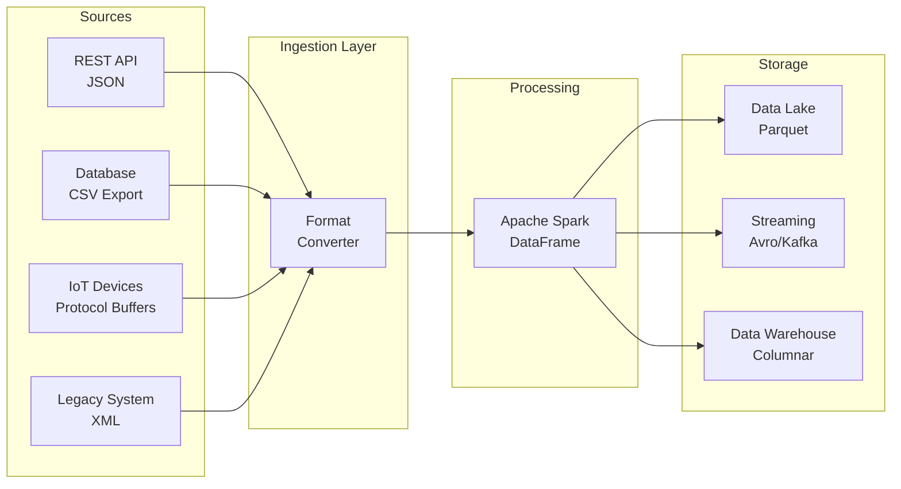
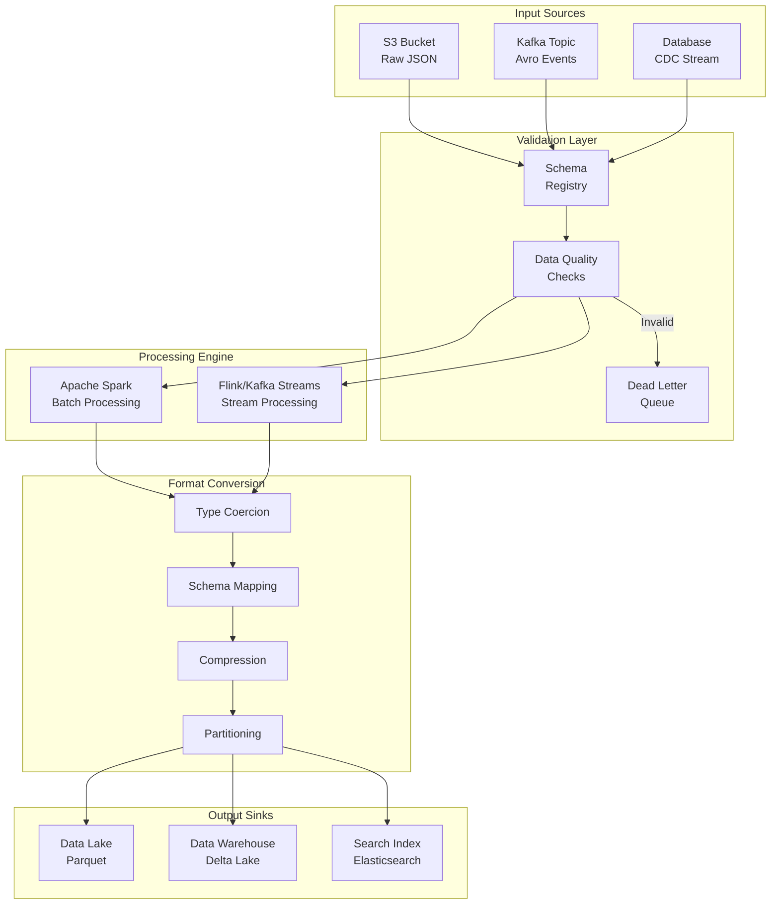

# How to Build Data Format Conversion

Author: [nawazdhandala](https://github.com/nawazdhandala)

Tags: Data Pipeline, Data Formats, JSON, Parquet

Description: Learn to build data format conversion for transforming between CSV, JSON, Parquet, Avro, and other formats.

---

> Data format conversion is the backbone of modern data pipelines. Whether you are moving data from operational databases to analytics warehouses or integrating multiple data sources, understanding how to efficiently transform between formats is essential for building robust, performant data systems.

The right format choice can mean the difference between a query that takes milliseconds versus minutes, or storage costs that scale linearly versus exponentially. This guide covers the practical patterns and code you need to build production-ready format conversion pipelines.

---

## Understanding Data Formats

Before diving into conversion techniques, let's understand the characteristics of common data formats and when to use each one.

### Format Comparison Matrix

| Format | Type | Schema | Compression | Columnar | Best For |
|--------|------|--------|-------------|----------|----------|
| CSV | Text | None | Poor | No | Human-readable interchange |
| JSON | Text | Optional | Poor | No | APIs, configuration, flexibility |
| Parquet | Binary | Required | Excellent | Yes | Analytics, data warehouses |
| Avro | Binary | Required | Good | No | Streaming, schema evolution |
| ORC | Binary | Required | Excellent | Yes | Hive ecosystem, ACID |
| Protocol Buffers | Binary | Required | Good | No | RPC, compact serialization |

### When to Use Each Format

**CSV** is best for simple data interchange where human readability matters. It lacks schema enforcement, making it error-prone for production pipelines but excellent for quick exports and imports.

**JSON** provides flexibility with nested structures and is the standard for REST APIs. However, its text-based nature makes it inefficient for large-scale analytics workloads.

**Parquet** is the gold standard for analytics. Its columnar storage enables efficient compression and allows queries to read only the columns they need, dramatically reducing I/O.

**Avro** excels in streaming scenarios where schema evolution is important. Its row-based format and schema registry integration make it ideal for Kafka-based pipelines.

---

## Data Pipeline Architecture

Here's a high-level view of how format conversion fits into a typical data pipeline:



---

## Python Implementation: Core Converters

Let's build a comprehensive format conversion library in Python. We'll start with the core converter classes.

### Base Converter Interface

This abstract base class defines the contract for all format converters. Each converter must implement methods for reading, writing, and validating data. The consistent interface allows converters to be swapped without changing pipeline code.

```python
# converters/base.py
from abc import ABC, abstractmethod
from typing import Any, Dict, List, Optional, Iterator
from dataclasses import dataclass
import logging

# Configure logging for converter operations
logging.basicConfig(level=logging.INFO)
logger = logging.getLogger(__name__)


@dataclass
class ConversionMetrics:
    """
    Tracks metrics for format conversion operations.
    Use these metrics to monitor pipeline performance and identify bottlenecks.
    """
    rows_processed: int = 0
    bytes_read: int = 0
    bytes_written: int = 0
    conversion_time_ms: float = 0.0
    errors_encountered: int = 0


@dataclass
class SchemaDefinition:
    """
    Represents a data schema for validation and conversion.
    Schema definitions ensure data consistency across format transformations.
    """
    fields: Dict[str, str]  # field_name -> data_type mapping
    nullable_fields: List[str] = None
    primary_key: Optional[str] = None

    def __post_init__(self):
        if self.nullable_fields is None:
            self.nullable_fields = []


class FormatConverter(ABC):
    """
    Abstract base class for all format converters.

    Implement this interface to add support for new data formats.
    The converter handles reading, writing, and schema validation.
    """

    def __init__(self, schema: Optional[SchemaDefinition] = None):
        self.schema = schema
        self.metrics = ConversionMetrics()

    @abstractmethod
    def read(self, source: str) -> Iterator[Dict[str, Any]]:
        """
        Read data from the source and yield records as dictionaries.

        Args:
            source: File path or connection string to read from

        Yields:
            Dictionary representing each record in the source
        """
        pass

    @abstractmethod
    def write(self, data: Iterator[Dict[str, Any]], destination: str) -> ConversionMetrics:
        """
        Write records to the destination in this converter's format.

        Args:
            data: Iterator of record dictionaries to write
            destination: File path or connection string to write to

        Returns:
            ConversionMetrics with statistics about the write operation
        """
        pass

    @abstractmethod
    def validate_record(self, record: Dict[str, Any]) -> bool:
        """
        Validate a single record against the schema.

        Args:
            record: Dictionary to validate

        Returns:
            True if the record is valid, False otherwise
        """
        pass

    def convert_to(
        self,
        target_converter: 'FormatConverter',
        source: str,
        destination: str,
        batch_size: int = 10000
    ) -> ConversionMetrics:
        """
        Convert data from this format to another format.

        This method handles the full conversion pipeline including
        validation, batching, and error handling.

        Args:
            target_converter: The converter for the target format
            source: Path to read from
            destination: Path to write to
            batch_size: Number of records to process in each batch

        Returns:
            Combined metrics from the conversion operation
        """
        import time
        start_time = time.time()

        logger.info(f"Starting conversion from {source} to {destination}")

        # Read from source format and write to target format
        data_iterator = self.read(source)
        write_metrics = target_converter.write(data_iterator, destination)

        # Calculate total conversion time
        elapsed_ms = (time.time() - start_time) * 1000
        write_metrics.conversion_time_ms = elapsed_ms

        logger.info(
            f"Conversion complete: {write_metrics.rows_processed} rows "
            f"in {elapsed_ms:.2f}ms"
        )

        return write_metrics
```

### CSV Converter

The CSV converter handles reading and writing CSV files with proper encoding, delimiter handling, and optional schema validation. It uses Python's built-in csv module for reliable parsing.

```python
# converters/csv_converter.py
import csv
from typing import Any, Dict, Iterator, Optional
from pathlib import Path
from .base import FormatConverter, ConversionMetrics, SchemaDefinition, logger


class CSVConverter(FormatConverter):
    """
    Converter for CSV (Comma-Separated Values) format.

    CSV is the most common format for data interchange but lacks
    schema enforcement. This converter adds validation and type
    coercion based on the provided schema.
    """

    def __init__(
        self,
        schema: Optional[SchemaDefinition] = None,
        delimiter: str = ',',
        encoding: str = 'utf-8',
        has_header: bool = True,
        quote_char: str = '"'
    ):
        super().__init__(schema)
        self.delimiter = delimiter
        self.encoding = encoding
        self.has_header = has_header
        self.quote_char = quote_char

    def read(self, source: str) -> Iterator[Dict[str, Any]]:
        """
        Read CSV file and yield records as dictionaries.

        Handles various CSV dialects and performs type coercion
        based on the schema if provided.
        """
        source_path = Path(source)

        if not source_path.exists():
            raise FileNotFoundError(f"CSV file not found: {source}")

        # Track bytes read for metrics
        self.metrics.bytes_read = source_path.stat().st_size

        with open(source, 'r', encoding=self.encoding, newline='') as csvfile:
            # Use DictReader for automatic header handling
            reader = csv.DictReader(
                csvfile,
                delimiter=self.delimiter,
                quotechar=self.quote_char
            )

            for row_num, row in enumerate(reader, start=1):
                try:
                    # Apply type coercion if schema is defined
                    if self.schema:
                        row = self._coerce_types(row)

                    # Validate the record
                    if self.validate_record(row):
                        self.metrics.rows_processed += 1
                        yield row
                    else:
                        self.metrics.errors_encountered += 1
                        logger.warning(f"Invalid record at row {row_num}: {row}")

                except Exception as e:
                    self.metrics.errors_encountered += 1
                    logger.error(f"Error processing row {row_num}: {e}")

    def write(self, data: Iterator[Dict[str, Any]], destination: str) -> ConversionMetrics:
        """
        Write records to a CSV file.

        Automatically determines field order from the first record
        or uses the schema if available.
        """
        metrics = ConversionMetrics()
        first_record = True
        fieldnames = None

        with open(destination, 'w', encoding=self.encoding, newline='') as csvfile:
            writer = None

            for record in data:
                # Initialize writer with field names from first record
                if first_record:
                    fieldnames = list(record.keys())
                    if self.schema:
                        # Use schema field order if available
                        fieldnames = list(self.schema.fields.keys())

                    writer = csv.DictWriter(
                        csvfile,
                        fieldnames=fieldnames,
                        delimiter=self.delimiter,
                        quotechar=self.quote_char,
                        quoting=csv.QUOTE_MINIMAL
                    )

                    if self.has_header:
                        writer.writeheader()

                    first_record = False

                # Write the record
                writer.writerow(record)
                metrics.rows_processed += 1

        # Get file size after writing
        metrics.bytes_written = Path(destination).stat().st_size

        logger.info(f"CSV write complete: {metrics.rows_processed} rows")
        return metrics

    def validate_record(self, record: Dict[str, Any]) -> bool:
        """
        Validate a record against the schema.

        Checks for required fields and basic type compatibility.
        """
        if not self.schema:
            return True  # No schema means all records are valid

        for field_name, field_type in self.schema.fields.items():
            # Check if required field is missing
            if field_name not in record:
                if field_name not in self.schema.nullable_fields:
                    return False

            # Check for null values in non-nullable fields
            value = record.get(field_name)
            if value is None or value == '':
                if field_name not in self.schema.nullable_fields:
                    return False

        return True

    def _coerce_types(self, record: Dict[str, Any]) -> Dict[str, Any]:
        """
        Convert string values to appropriate Python types based on schema.

        CSV files are always text, so this method converts values
        to integers, floats, booleans, etc. as specified in the schema.
        """
        if not self.schema:
            return record

        coerced = {}
        for field_name, value in record.items():
            if field_name in self.schema.fields:
                field_type = self.schema.fields[field_name]
                coerced[field_name] = self._convert_value(value, field_type)
            else:
                coerced[field_name] = value

        return coerced

    def _convert_value(self, value: str, target_type: str) -> Any:
        """
        Convert a string value to the specified type.
        """
        if value is None or value == '':
            return None

        type_converters = {
            'int': int,
            'integer': int,
            'float': float,
            'double': float,
            'bool': lambda v: v.lower() in ('true', '1', 'yes'),
            'boolean': lambda v: v.lower() in ('true', '1', 'yes'),
            'string': str,
            'str': str,
        }

        converter = type_converters.get(target_type.lower(), str)
        try:
            return converter(value)
        except (ValueError, TypeError):
            logger.warning(f"Could not convert '{value}' to {target_type}")
            return value
```

### JSON Converter

The JSON converter handles both line-delimited JSON (JSONL) and standard JSON arrays. It supports streaming reads for large files and nested data structures.

```python
# converters/json_converter.py
import json
from typing import Any, Dict, Iterator, Optional, List
from pathlib import Path
from .base import FormatConverter, ConversionMetrics, SchemaDefinition, logger


class JSONConverter(FormatConverter):
    """
    Converter for JSON format.

    Supports two modes:
    - JSONL (JSON Lines): One JSON object per line, best for streaming
    - JSON Array: Standard array of objects, best for small datasets

    JSON is flexible but verbose. Use for API responses and
    configuration, not for large-scale analytics.
    """

    def __init__(
        self,
        schema: Optional[SchemaDefinition] = None,
        jsonl_format: bool = True,
        indent: Optional[int] = None,
        encoding: str = 'utf-8'
    ):
        super().__init__(schema)
        self.jsonl_format = jsonl_format  # True for line-delimited JSON
        self.indent = indent  # Pretty print indent level
        self.encoding = encoding

    def read(self, source: str) -> Iterator[Dict[str, Any]]:
        """
        Read JSON file and yield records as dictionaries.

        Automatically detects JSONL vs JSON array format if not specified.
        Uses streaming for JSONL to handle large files efficiently.
        """
        source_path = Path(source)

        if not source_path.exists():
            raise FileNotFoundError(f"JSON file not found: {source}")

        self.metrics.bytes_read = source_path.stat().st_size

        with open(source, 'r', encoding=self.encoding) as jsonfile:
            if self.jsonl_format:
                # Stream line by line for JSONL format
                yield from self._read_jsonl(jsonfile)
            else:
                # Load entire array for standard JSON
                yield from self._read_json_array(jsonfile)

    def _read_jsonl(self, file_handle) -> Iterator[Dict[str, Any]]:
        """
        Read JSON Lines format (one JSON object per line).

        This format is memory-efficient for large files since
        we only parse one line at a time.
        """
        for line_num, line in enumerate(file_handle, start=1):
            line = line.strip()
            if not line:
                continue  # Skip empty lines

            try:
                record = json.loads(line)

                # Flatten nested structures if schema requires it
                if self.schema:
                    record = self._flatten_record(record)

                if self.validate_record(record):
                    self.metrics.rows_processed += 1
                    yield record
                else:
                    self.metrics.errors_encountered += 1

            except json.JSONDecodeError as e:
                self.metrics.errors_encountered += 1
                logger.error(f"JSON parse error at line {line_num}: {e}")

    def _read_json_array(self, file_handle) -> Iterator[Dict[str, Any]]:
        """
        Read standard JSON array format.

        Warning: Loads entire file into memory. Not suitable for
        files larger than available RAM.
        """
        try:
            data = json.load(file_handle)

            # Handle both array and single object
            if isinstance(data, list):
                records = data
            elif isinstance(data, dict):
                records = [data]
            else:
                raise ValueError(f"Unexpected JSON root type: {type(data)}")

            for record in records:
                if self.schema:
                    record = self._flatten_record(record)

                if self.validate_record(record):
                    self.metrics.rows_processed += 1
                    yield record
                else:
                    self.metrics.errors_encountered += 1

        except json.JSONDecodeError as e:
            logger.error(f"JSON parse error: {e}")
            raise

    def write(self, data: Iterator[Dict[str, Any]], destination: str) -> ConversionMetrics:
        """
        Write records to a JSON file.

        Uses JSONL format for streaming writes, JSON array for
        when pretty printing or standard format is needed.
        """
        metrics = ConversionMetrics()

        with open(destination, 'w', encoding=self.encoding) as jsonfile:
            if self.jsonl_format:
                # Write one object per line
                for record in data:
                    json.dump(record, jsonfile, default=str)
                    jsonfile.write('\n')
                    metrics.rows_processed += 1
            else:
                # Collect all records and write as array
                records = list(data)
                metrics.rows_processed = len(records)
                json.dump(records, jsonfile, indent=self.indent, default=str)

        metrics.bytes_written = Path(destination).stat().st_size

        logger.info(f"JSON write complete: {metrics.rows_processed} rows")
        return metrics

    def validate_record(self, record: Dict[str, Any]) -> bool:
        """
        Validate a record against the schema.
        """
        if not self.schema:
            return True

        for field_name in self.schema.fields:
            if field_name not in record:
                if field_name not in self.schema.nullable_fields:
                    return False
            elif record.get(field_name) is None:
                if field_name not in self.schema.nullable_fields:
                    return False

        return True

    def _flatten_record(
        self,
        record: Dict[str, Any],
        parent_key: str = '',
        separator: str = '.'
    ) -> Dict[str, Any]:
        """
        Flatten nested JSON structures into a flat dictionary.

        Nested objects become keys with dot notation:
        {"user": {"name": "John"}} becomes {"user.name": "John"}

        This is essential for converting JSON to columnar formats.
        """
        items = []

        for key, value in record.items():
            new_key = f"{parent_key}{separator}{key}" if parent_key else key

            if isinstance(value, dict):
                # Recursively flatten nested objects
                items.extend(
                    self._flatten_record(value, new_key, separator).items()
                )
            elif isinstance(value, list):
                # Convert lists to JSON strings for storage
                items.append((new_key, json.dumps(value)))
            else:
                items.append((new_key, value))

        return dict(items)
```

### Parquet Converter

Parquet is the preferred format for analytics workloads. This converter uses PyArrow for efficient columnar operations with full support for compression and schema evolution.

```python
# converters/parquet_converter.py
import pyarrow as pa
import pyarrow.parquet as pq
from typing import Any, Dict, Iterator, Optional, List
from pathlib import Path
from .base import FormatConverter, ConversionMetrics, SchemaDefinition, logger


class ParquetConverter(FormatConverter):
    """
    Converter for Apache Parquet format.

    Parquet is a columnar storage format optimized for analytics:
    - Excellent compression (often 10x smaller than CSV)
    - Column pruning (read only needed columns)
    - Predicate pushdown (filter at storage level)
    - Schema enforcement and evolution

    Use Parquet for data lakes, warehouses, and any analytics workload.
    """

    # Map Python types to PyArrow types
    TYPE_MAPPING = {
        'int': pa.int64(),
        'integer': pa.int64(),
        'int32': pa.int32(),
        'int64': pa.int64(),
        'float': pa.float64(),
        'double': pa.float64(),
        'float32': pa.float32(),
        'float64': pa.float64(),
        'string': pa.string(),
        'str': pa.string(),
        'bool': pa.bool_(),
        'boolean': pa.bool_(),
        'timestamp': pa.timestamp('us'),
        'date': pa.date32(),
        'binary': pa.binary(),
    }

    def __init__(
        self,
        schema: Optional[SchemaDefinition] = None,
        compression: str = 'snappy',
        row_group_size: int = 100000,
        use_dictionary: bool = True
    ):
        super().__init__(schema)
        self.compression = compression  # snappy, gzip, lz4, zstd, or none
        self.row_group_size = row_group_size  # Rows per row group
        self.use_dictionary = use_dictionary  # Enable dictionary encoding

    def read(self, source: str) -> Iterator[Dict[str, Any]]:
        """
        Read Parquet file and yield records as dictionaries.

        Reads in batches for memory efficiency. For very large files,
        consider using read_table with column selection.
        """
        source_path = Path(source)

        if not source_path.exists():
            raise FileNotFoundError(f"Parquet file not found: {source}")

        self.metrics.bytes_read = source_path.stat().st_size

        # Open Parquet file for reading
        parquet_file = pq.ParquetFile(source)

        logger.info(
            f"Reading Parquet file: {parquet_file.metadata.num_rows} rows, "
            f"{parquet_file.metadata.num_row_groups} row groups"
        )

        # Read row groups one at a time for memory efficiency
        for row_group_idx in range(parquet_file.metadata.num_row_groups):
            table = parquet_file.read_row_group(row_group_idx)

            # Convert to Python dictionaries
            for batch in table.to_batches():
                for row in batch.to_pydict().items():
                    # Reconstruct row from columnar format
                    pass

            # Use pandas for easier row iteration
            df = table.to_pandas()
            for _, row in df.iterrows():
                record = row.to_dict()

                if self.validate_record(record):
                    self.metrics.rows_processed += 1
                    yield record
                else:
                    self.metrics.errors_encountered += 1

    def write(self, data: Iterator[Dict[str, Any]], destination: str) -> ConversionMetrics:
        """
        Write records to a Parquet file.

        Batches records for efficient columnar writes. Uses PyArrow
        for optimal compression and encoding.
        """
        metrics = ConversionMetrics()

        # Collect records in batches
        batch = []
        schema = None
        writer = None

        try:
            for record in data:
                batch.append(record)
                metrics.rows_processed += 1

                # Write batch when it reaches the row group size
                if len(batch) >= self.row_group_size:
                    if writer is None:
                        # Infer or build schema from first batch
                        schema = self._build_arrow_schema(batch[0])
                        writer = pq.ParquetWriter(
                            destination,
                            schema,
                            compression=self.compression,
                            use_dictionary=self.use_dictionary
                        )

                    # Convert batch to Arrow table and write
                    table = self._batch_to_table(batch, schema)
                    writer.write_table(table)
                    batch = []

            # Write remaining records
            if batch:
                if writer is None:
                    schema = self._build_arrow_schema(batch[0])
                    writer = pq.ParquetWriter(
                        destination,
                        schema,
                        compression=self.compression,
                        use_dictionary=self.use_dictionary
                    )

                table = self._batch_to_table(batch, schema)
                writer.write_table(table)

        finally:
            if writer:
                writer.close()

        metrics.bytes_written = Path(destination).stat().st_size

        # Calculate compression ratio
        if metrics.rows_processed > 0:
            bytes_per_row = metrics.bytes_written / metrics.rows_processed
            logger.info(
                f"Parquet write complete: {metrics.rows_processed} rows, "
                f"{metrics.bytes_written} bytes ({bytes_per_row:.1f} bytes/row)"
            )

        return metrics

    def validate_record(self, record: Dict[str, Any]) -> bool:
        """
        Validate record against schema.
        """
        if not self.schema:
            return True

        for field_name in self.schema.fields:
            if field_name not in record:
                if field_name not in self.schema.nullable_fields:
                    return False

        return True

    def _build_arrow_schema(self, sample_record: Dict[str, Any]) -> pa.Schema:
        """
        Build PyArrow schema from a sample record or the defined schema.

        If a schema is defined, use those types. Otherwise, infer
        types from the sample record's values.
        """
        fields = []

        if self.schema:
            # Use defined schema
            for field_name, field_type in self.schema.fields.items():
                arrow_type = self.TYPE_MAPPING.get(field_type.lower(), pa.string())
                nullable = field_name in self.schema.nullable_fields
                fields.append(pa.field(field_name, arrow_type, nullable=nullable))
        else:
            # Infer schema from sample record
            for field_name, value in sample_record.items():
                arrow_type = self._infer_arrow_type(value)
                fields.append(pa.field(field_name, arrow_type, nullable=True))

        return pa.schema(fields)

    def _infer_arrow_type(self, value: Any) -> pa.DataType:
        """
        Infer the PyArrow type from a Python value.
        """
        if value is None:
            return pa.string()  # Default to string for null
        elif isinstance(value, bool):
            return pa.bool_()
        elif isinstance(value, int):
            return pa.int64()
        elif isinstance(value, float):
            return pa.float64()
        elif isinstance(value, bytes):
            return pa.binary()
        else:
            return pa.string()

    def _batch_to_table(
        self,
        records: List[Dict[str, Any]],
        schema: pa.Schema
    ) -> pa.Table:
        """
        Convert a batch of records to a PyArrow Table.

        Transforms row-oriented data to columnar format for
        efficient Parquet storage.
        """
        # Organize data by columns
        columns = {field.name: [] for field in schema}

        for record in records:
            for field in schema:
                value = record.get(field.name)
                columns[field.name].append(value)

        # Build Arrow arrays for each column
        arrays = []
        for field in schema:
            array = pa.array(columns[field.name], type=field.type)
            arrays.append(array)

        return pa.Table.from_arrays(arrays, schema=schema)
```

### Avro Converter

Avro is essential for streaming pipelines and systems that need schema evolution. This converter uses the fastavro library for high-performance serialization.

```python
# converters/avro_converter.py
import fastavro
from typing import Any, Dict, Iterator, Optional, List
from pathlib import Path
from .base import FormatConverter, ConversionMetrics, SchemaDefinition, logger


class AvroConverter(FormatConverter):
    """
    Converter for Apache Avro format.

    Avro is a row-based format with these key features:
    - Schema stored with data for self-describing files
    - Excellent schema evolution support
    - Compact binary encoding
    - Integration with schema registries (Confluent, AWS Glue)

    Use Avro for Kafka pipelines and when schema evolution is critical.
    """

    # Map Python types to Avro types
    TYPE_MAPPING = {
        'int': 'int',
        'integer': 'int',
        'long': 'long',
        'int64': 'long',
        'float': 'float',
        'double': 'double',
        'float64': 'double',
        'string': 'string',
        'str': 'string',
        'bool': 'boolean',
        'boolean': 'boolean',
        'bytes': 'bytes',
        'binary': 'bytes',
    }

    def __init__(
        self,
        schema: Optional[SchemaDefinition] = None,
        avro_schema: Optional[Dict] = None,
        codec: str = 'snappy'
    ):
        super().__init__(schema)
        self.avro_schema = avro_schema  # Explicit Avro schema
        self.codec = codec  # null, deflate, snappy, lz4, zstandard

    def read(self, source: str) -> Iterator[Dict[str, Any]]:
        """
        Read Avro file and yield records as dictionaries.

        Avro files are self-describing, so the schema is read
        from the file header.
        """
        source_path = Path(source)

        if not source_path.exists():
            raise FileNotFoundError(f"Avro file not found: {source}")

        self.metrics.bytes_read = source_path.stat().st_size

        with open(source, 'rb') as avro_file:
            reader = fastavro.reader(avro_file)

            # Log schema information
            logger.info(f"Avro schema: {reader.writer_schema.get('name', 'unknown')}")

            for record in reader:
                if self.validate_record(record):
                    self.metrics.rows_processed += 1
                    yield record
                else:
                    self.metrics.errors_encountered += 1

    def write(self, data: Iterator[Dict[str, Any]], destination: str) -> ConversionMetrics:
        """
        Write records to an Avro file.

        Requires either an explicit Avro schema or a SchemaDefinition
        to build the schema from.
        """
        metrics = ConversionMetrics()

        # Get or build Avro schema
        avro_schema = self.avro_schema
        records_buffer = []

        for record in data:
            # Build schema from first record if not provided
            if avro_schema is None:
                avro_schema = self._build_avro_schema(record)

            records_buffer.append(record)
            metrics.rows_processed += 1

        if not avro_schema:
            raise ValueError("No schema available and no records to infer from")

        # Write all records
        with open(destination, 'wb') as avro_file:
            fastavro.writer(
                avro_file,
                avro_schema,
                records_buffer,
                codec=self.codec
            )

        metrics.bytes_written = Path(destination).stat().st_size

        logger.info(f"Avro write complete: {metrics.rows_processed} rows")
        return metrics

    def validate_record(self, record: Dict[str, Any]) -> bool:
        """
        Validate record against schema.
        """
        if not self.schema:
            return True

        for field_name in self.schema.fields:
            if field_name not in record:
                if field_name not in self.schema.nullable_fields:
                    return False

        return True

    def _build_avro_schema(self, sample_record: Dict[str, Any]) -> Dict:
        """
        Build Avro schema from SchemaDefinition or sample record.

        Avro schemas are JSON documents that describe the data structure.
        """
        fields = []

        if self.schema:
            # Use defined schema
            for field_name, field_type in self.schema.fields.items():
                avro_type = self.TYPE_MAPPING.get(field_type.lower(), 'string')

                # Make nullable fields optional with union type
                if field_name in self.schema.nullable_fields:
                    avro_type = ['null', avro_type]

                fields.append({
                    'name': field_name,
                    'type': avro_type
                })
        else:
            # Infer from sample record
            for field_name, value in sample_record.items():
                avro_type = self._infer_avro_type(value)
                fields.append({
                    'name': field_name,
                    'type': ['null', avro_type]  # Allow nulls by default
                })

        return {
            'type': 'record',
            'name': 'Record',
            'namespace': 'com.example.pipeline',
            'fields': fields
        }

    def _infer_avro_type(self, value: Any) -> str:
        """
        Infer Avro type from a Python value.
        """
        if value is None:
            return 'string'
        elif isinstance(value, bool):
            return 'boolean'
        elif isinstance(value, int):
            # Use long for safety with large integers
            return 'long'
        elif isinstance(value, float):
            return 'double'
        elif isinstance(value, bytes):
            return 'bytes'
        else:
            return 'string'
```

---

## Apache Spark Implementation

For large-scale data processing, Apache Spark provides distributed format conversion. Here's how to build a robust conversion pipeline using PySpark.

### Spark Conversion Pipeline

This Spark-based converter handles petabyte-scale data by distributing the conversion across a cluster. It includes schema mapping, data type coercion, and partition optimization.

```python
# spark/format_converter.py
from pyspark.sql import SparkSession, DataFrame
from pyspark.sql.types import (
    StructType, StructField, StringType, IntegerType,
    LongType, FloatType, DoubleType, BooleanType,
    TimestampType, DateType, BinaryType
)
from pyspark.sql.functions import col, to_timestamp, to_date
from typing import Dict, List, Optional, Any
import logging

logging.basicConfig(level=logging.INFO)
logger = logging.getLogger(__name__)


class SparkFormatConverter:
    """
    Distributed format converter using Apache Spark.

    Handles large-scale conversions across clusters with features:
    - Automatic parallelization across executors
    - Schema enforcement and evolution
    - Partition optimization for target format
    - Support for all major data formats

    Use this for conversions involving gigabytes to petabytes of data.
    """

    # Map string type names to Spark SQL types
    TYPE_MAPPING = {
        'string': StringType(),
        'str': StringType(),
        'int': IntegerType(),
        'integer': IntegerType(),
        'long': LongType(),
        'int64': LongType(),
        'float': FloatType(),
        'double': DoubleType(),
        'float64': DoubleType(),
        'boolean': BooleanType(),
        'bool': BooleanType(),
        'timestamp': TimestampType(),
        'date': DateType(),
        'binary': BinaryType(),
    }

    def __init__(
        self,
        app_name: str = 'FormatConverter',
        master: str = None,
        config: Dict[str, str] = None
    ):
        """
        Initialize Spark session with optimal settings for format conversion.

        Args:
            app_name: Name for the Spark application
            master: Spark master URL (None for default)
            config: Additional Spark configuration options
        """
        builder = SparkSession.builder.appName(app_name)

        if master:
            builder = builder.master(master)

        # Default configurations for format conversion
        default_config = {
            # Enable adaptive query execution for optimal performance
            'spark.sql.adaptive.enabled': 'true',
            # Optimize shuffle partitions based on data size
            'spark.sql.adaptive.coalescePartitions.enabled': 'true',
            # Enable Parquet vectorized reader for speed
            'spark.sql.parquet.enableVectorizedReader': 'true',
            # Use dictionary encoding for better compression
            'spark.sql.parquet.writeLegacyFormat': 'false',
        }

        # Apply default config, then user config
        for key, value in default_config.items():
            builder = builder.config(key, value)

        if config:
            for key, value in config.items():
                builder = builder.config(key, value)

        self.spark = builder.getOrCreate()
        logger.info(f"Spark session created: {app_name}")

    def read_csv(
        self,
        path: str,
        schema: Optional[StructType] = None,
        header: bool = True,
        delimiter: str = ',',
        infer_schema: bool = True,
        null_value: str = ''
    ) -> DataFrame:
        """
        Read CSV files into a Spark DataFrame.

        For production use, always provide an explicit schema
        to avoid schema inference overhead and ensure consistency.
        """
        reader = self.spark.read.format('csv') \
            .option('header', header) \
            .option('delimiter', delimiter) \
            .option('nullValue', null_value) \
            .option('mode', 'PERMISSIVE')  # Handle malformed records

        if schema:
            reader = reader.schema(schema)
        elif infer_schema:
            reader = reader.option('inferSchema', 'true')

        df = reader.load(path)

        logger.info(f"Loaded CSV: {df.count()} rows, {len(df.columns)} columns")
        return df

    def read_json(
        self,
        path: str,
        schema: Optional[StructType] = None,
        multiline: bool = False
    ) -> DataFrame:
        """
        Read JSON files into a Spark DataFrame.

        Args:
            path: Path to JSON file(s)
            schema: Optional explicit schema
            multiline: True for standard JSON, False for JSONL
        """
        reader = self.spark.read.format('json') \
            .option('multiLine', multiline) \
            .option('mode', 'PERMISSIVE')

        if schema:
            reader = reader.schema(schema)

        df = reader.load(path)

        logger.info(f"Loaded JSON: {df.count()} rows")
        return df

    def read_parquet(self, path: str) -> DataFrame:
        """
        Read Parquet files into a Spark DataFrame.

        Parquet is self-describing, so no schema is needed.
        Spark will automatically use column pruning and
        predicate pushdown for optimal performance.
        """
        df = self.spark.read.parquet(path)

        logger.info(f"Loaded Parquet: {df.count()} rows")
        return df

    def read_avro(self, path: str) -> DataFrame:
        """
        Read Avro files into a Spark DataFrame.

        Requires spark-avro package to be available.
        """
        df = self.spark.read.format('avro').load(path)

        logger.info(f"Loaded Avro: {df.count()} rows")
        return df

    def write_csv(
        self,
        df: DataFrame,
        path: str,
        header: bool = True,
        delimiter: str = ',',
        mode: str = 'overwrite',
        partition_by: List[str] = None,
        coalesce: int = None
    ) -> None:
        """
        Write DataFrame to CSV format.

        Warning: CSV is not recommended for large datasets.
        Use for small exports or human-readable outputs only.
        """
        writer = df.write.format('csv') \
            .option('header', header) \
            .option('delimiter', delimiter) \
            .mode(mode)

        if coalesce:
            df = df.coalesce(coalesce)

        if partition_by:
            writer = writer.partitionBy(*partition_by)

        writer.save(path)
        logger.info(f"Wrote CSV to {path}")

    def write_parquet(
        self,
        df: DataFrame,
        path: str,
        mode: str = 'overwrite',
        compression: str = 'snappy',
        partition_by: List[str] = None,
        coalesce: int = None
    ) -> None:
        """
        Write DataFrame to Parquet format.

        Recommended settings:
        - Use snappy compression for balanced speed/size
        - Partition by date or high-cardinality columns
        - Target 128MB-1GB files for optimal read performance
        """
        writer = df.write.format('parquet') \
            .option('compression', compression) \
            .mode(mode)

        if coalesce:
            df = df.coalesce(coalesce)

        if partition_by:
            writer = writer.partitionBy(*partition_by)

        writer.save(path)
        logger.info(f"Wrote Parquet to {path}")

    def write_avro(
        self,
        df: DataFrame,
        path: str,
        mode: str = 'overwrite',
        compression: str = 'snappy',
        partition_by: List[str] = None
    ) -> None:
        """
        Write DataFrame to Avro format.

        Avro is ideal for streaming pipelines and when
        schema evolution is required.
        """
        writer = df.write.format('avro') \
            .option('compression', compression) \
            .mode(mode)

        if partition_by:
            writer = writer.partitionBy(*partition_by)

        writer.save(path)
        logger.info(f"Wrote Avro to {path}")

    def convert(
        self,
        source_path: str,
        source_format: str,
        dest_path: str,
        dest_format: str,
        schema: Optional[Dict[str, str]] = None,
        partition_by: List[str] = None,
        transformations: List[callable] = None
    ) -> Dict[str, Any]:
        """
        Convert data between formats with optional transformations.

        This is the main entry point for format conversion pipelines.

        Args:
            source_path: Path to source data
            source_format: Source format (csv, json, parquet, avro)
            dest_path: Path to write converted data
            dest_format: Target format
            schema: Optional schema as {field_name: type_name}
            partition_by: Columns to partition output by
            transformations: List of functions to apply to DataFrame

        Returns:
            Dictionary with conversion statistics
        """
        # Build Spark schema if provided
        spark_schema = None
        if schema:
            spark_schema = self._build_spark_schema(schema)

        # Read source data
        read_methods = {
            'csv': lambda: self.read_csv(source_path, schema=spark_schema),
            'json': lambda: self.read_json(source_path, schema=spark_schema),
            'parquet': lambda: self.read_parquet(source_path),
            'avro': lambda: self.read_avro(source_path),
        }

        if source_format not in read_methods:
            raise ValueError(f"Unsupported source format: {source_format}")

        df = read_methods[source_format]()

        # Apply transformations
        if transformations:
            for transform in transformations:
                df = transform(df)

        # Get row count before write
        row_count = df.count()

        # Write to destination format
        write_methods = {
            'csv': lambda: self.write_csv(df, dest_path, partition_by=partition_by),
            'json': lambda: df.write.json(dest_path, mode='overwrite'),
            'parquet': lambda: self.write_parquet(df, dest_path, partition_by=partition_by),
            'avro': lambda: self.write_avro(df, dest_path, partition_by=partition_by),
        }

        if dest_format not in write_methods:
            raise ValueError(f"Unsupported destination format: {dest_format}")

        write_methods[dest_format]()

        return {
            'rows_converted': row_count,
            'source_format': source_format,
            'dest_format': dest_format,
            'source_path': source_path,
            'dest_path': dest_path,
        }

    def _build_spark_schema(self, schema_dict: Dict[str, str]) -> StructType:
        """
        Build a Spark StructType from a dictionary schema.
        """
        fields = []
        for field_name, field_type in schema_dict.items():
            spark_type = self.TYPE_MAPPING.get(field_type.lower(), StringType())
            fields.append(StructField(field_name, spark_type, nullable=True))

        return StructType(fields)

    def stop(self):
        """Stop the Spark session."""
        self.spark.stop()
        logger.info("Spark session stopped")
```

### Spark Usage Example

Here's a complete example showing how to use the Spark converter for a real-world ETL pipeline:

```python
# spark/example_pipeline.py
from pyspark.sql.functions import (
    col, when, trim, lower, to_timestamp,
    year, month, dayofmonth, current_timestamp
)
from spark.format_converter import SparkFormatConverter


def clean_user_data(df):
    """
    Transformation function to clean and standardize user data.

    This function demonstrates common data cleaning operations
    that happen during format conversion.
    """
    return df \
        .withColumn('email', lower(trim(col('email')))) \
        .withColumn('name', trim(col('name'))) \
        .withColumn('status', when(col('status').isNull(), 'unknown')
                            .otherwise(col('status'))) \
        .withColumn('created_at', to_timestamp(col('created_at'))) \
        .withColumn('processed_at', current_timestamp())


def add_partition_columns(df):
    """
    Add partition columns based on timestamp for efficient querying.

    Partitioning by year/month/day allows Spark to skip irrelevant
    partitions when filtering by date.
    """
    return df \
        .withColumn('year', year(col('created_at'))) \
        .withColumn('month', month(col('created_at'))) \
        .withColumn('day', dayofmonth(col('created_at')))


def main():
    """
    Example pipeline: Convert JSON user data to Parquet with transformations.
    """
    # Initialize converter with cluster settings
    converter = SparkFormatConverter(
        app_name='UserDataPipeline',
        config={
            'spark.executor.memory': '4g',
            'spark.executor.cores': '4',
            'spark.sql.shuffle.partitions': '200',
        }
    )

    # Define schema for type safety
    schema = {
        'id': 'long',
        'email': 'string',
        'name': 'string',
        'status': 'string',
        'created_at': 'string',
        'login_count': 'integer',
    }

    try:
        # Run the conversion pipeline
        result = converter.convert(
            source_path='s3://data-lake/raw/users/*.json',
            source_format='json',
            dest_path='s3://data-lake/processed/users/',
            dest_format='parquet',
            schema=schema,
            partition_by=['year', 'month', 'day'],
            transformations=[
                clean_user_data,
                add_partition_columns,
            ]
        )

        print(f"Conversion complete: {result['rows_converted']} rows processed")

    finally:
        converter.stop()


if __name__ == '__main__':
    main()
```

---

## Conversion Pipeline Architecture

Here's a detailed view of a production-grade format conversion pipeline:



---

## Performance Optimization Strategies

### Compression Comparison

Choose the right compression codec based on your use case:

| Codec | Compression Ratio | Write Speed | Read Speed | CPU Usage | Best For |
|-------|------------------|-------------|------------|-----------|----------|
| None | 1x | Fastest | Fastest | None | Testing, SSD storage |
| Snappy | 2-3x | Fast | Fast | Low | General purpose |
| LZ4 | 2-3x | Very Fast | Very Fast | Low | Speed critical |
| GZIP | 5-8x | Slow | Medium | High | Cold storage |
| ZSTD | 4-6x | Medium | Fast | Medium | Balanced |

### Optimization Code Example

```python
# optimization/performance_tuning.py
from pyspark.sql import DataFrame, SparkSession
from pyspark.sql.functions import col, spark_partition_id
from typing import List, Dict, Any
import logging

logger = logging.getLogger(__name__)


class PerformanceOptimizer:
    """
    Utilities for optimizing format conversion performance.

    Key optimization strategies:
    1. Right-size partitions (128MB - 1GB files)
    2. Use appropriate compression
    3. Partition data for query patterns
    4. Enable predicate pushdown
    """

    def __init__(self, spark: SparkSession):
        self.spark = spark

    def analyze_partitions(self, df: DataFrame) -> Dict[str, Any]:
        """
        Analyze DataFrame partition distribution.

        Uneven partitions cause stragglers that slow down the entire job.
        Use this to identify partition skew before writing.
        """
        # Add partition ID column
        df_with_partition = df.withColumn('_partition_id', spark_partition_id())

        # Count rows per partition
        partition_counts = df_with_partition.groupBy('_partition_id').count()
        stats = partition_counts.agg({
            'count': 'min',
            'count': 'max',
            'count': 'avg',
            'count': 'stddev'
        }).collect()[0]

        return {
            'num_partitions': df.rdd.getNumPartitions(),
            'min_rows': stats[0],
            'max_rows': stats[1],
            'avg_rows': stats[2],
            'stddev_rows': stats[3],
        }

    def optimize_partition_count(
        self,
        df: DataFrame,
        target_file_size_mb: int = 256
    ) -> DataFrame:
        """
        Repartition DataFrame for optimal file sizes.

        Target 128MB-1GB files for best read performance.
        Too many small files hurt metadata operations.
        Too few large files reduce parallelism.
        """
        # Estimate current data size
        row_count = df.count()
        sample_size = min(1000, row_count)

        # Sample to estimate row size
        sample_df = df.limit(sample_size)
        sample_bytes = len(sample_df.toPandas().to_json())
        bytes_per_row = sample_bytes / sample_size

        total_bytes = bytes_per_row * row_count
        target_bytes = target_file_size_mb * 1024 * 1024

        optimal_partitions = max(1, int(total_bytes / target_bytes))

        logger.info(
            f"Optimizing partitions: {df.rdd.getNumPartitions()} -> {optimal_partitions} "
            f"(target {target_file_size_mb}MB files)"
        )

        return df.repartition(optimal_partitions)

    def add_sort_columns(
        self,
        df: DataFrame,
        sort_columns: List[str]
    ) -> DataFrame:
        """
        Sort data within partitions for better compression.

        Sorting groups similar values together, which dramatically
        improves dictionary encoding and run-length encoding.
        """
        return df.sortWithinPartitions(*sort_columns)

    def enable_predicate_pushdown(self, path: str) -> DataFrame:
        """
        Read Parquet with predicate pushdown enabled.

        Predicate pushdown filters data at the storage level,
        reducing I/O and improving query performance.
        """
        # Enable all pushdown optimizations
        self.spark.conf.set('spark.sql.parquet.filterPushdown', 'true')
        self.spark.conf.set('spark.sql.parquet.aggregatePushdown', 'true')

        return self.spark.read.parquet(path)


def benchmark_compression(spark: SparkSession, df: DataFrame, path_prefix: str):
    """
    Benchmark different compression codecs for a dataset.

    Run this on a sample of your data to choose the best codec.
    """
    import time
    import os

    codecs = ['none', 'snappy', 'gzip', 'lz4', 'zstd']
    results = []

    for codec in codecs:
        output_path = f"{path_prefix}_{codec}"

        # Time the write
        start = time.time()
        df.write.parquet(output_path, compression=codec, mode='overwrite')
        write_time = time.time() - start

        # Measure file size
        # Note: In production, use proper filesystem APIs
        file_size = sum(
            os.path.getsize(os.path.join(output_path, f))
            for f in os.listdir(output_path)
            if f.endswith('.parquet')
        )

        # Time the read
        start = time.time()
        spark.read.parquet(output_path).count()
        read_time = time.time() - start

        results.append({
            'codec': codec,
            'write_time_s': write_time,
            'read_time_s': read_time,
            'file_size_mb': file_size / (1024 * 1024),
        })

        logger.info(f"{codec}: {file_size/1024/1024:.1f}MB, "
                   f"write {write_time:.1f}s, read {read_time:.1f}s")

    return results
```

---

## Schema Evolution Handling

Schema evolution is critical for long-running pipelines. Here's how to handle schema changes gracefully:

```python
# schema/evolution.py
from typing import Dict, List, Optional, Any
from dataclasses import dataclass
import logging

logger = logging.getLogger(__name__)


@dataclass
class SchemaChange:
    """Represents a single schema change."""
    change_type: str  # 'add', 'remove', 'rename', 'type_change'
    field_name: str
    old_value: Optional[Any] = None
    new_value: Optional[Any] = None


class SchemaEvolutionHandler:
    """
    Handles schema evolution for format conversions.

    Schema evolution strategies:
    1. Backward compatible: New schema can read old data
    2. Forward compatible: Old schema can read new data
    3. Full compatible: Both directions work

    Parquet and Avro support schema evolution natively.
    CSV and JSON require explicit handling.
    """

    def __init__(self):
        self.changes: List[SchemaChange] = []

    def compare_schemas(
        self,
        old_schema: Dict[str, str],
        new_schema: Dict[str, str]
    ) -> List[SchemaChange]:
        """
        Compare two schemas and identify differences.

        Returns a list of changes needed to evolve from old to new.
        """
        changes = []

        old_fields = set(old_schema.keys())
        new_fields = set(new_schema.keys())

        # Find added fields
        for field in new_fields - old_fields:
            changes.append(SchemaChange(
                change_type='add',
                field_name=field,
                new_value=new_schema[field]
            ))

        # Find removed fields
        for field in old_fields - new_fields:
            changes.append(SchemaChange(
                change_type='remove',
                field_name=field,
                old_value=old_schema[field]
            ))

        # Find type changes
        for field in old_fields & new_fields:
            if old_schema[field] != new_schema[field]:
                changes.append(SchemaChange(
                    change_type='type_change',
                    field_name=field,
                    old_value=old_schema[field],
                    new_value=new_schema[field]
                ))

        self.changes = changes
        return changes

    def is_backward_compatible(self, changes: List[SchemaChange]) -> bool:
        """
        Check if schema changes are backward compatible.

        Backward compatible means new code can read old data.
        - Adding nullable fields: OK
        - Removing fields: OK (new code ignores them)
        - Type changes: Usually NOT OK
        """
        for change in changes:
            if change.change_type == 'type_change':
                if not self._is_safe_type_change(
                    change.old_value,
                    change.new_value
                ):
                    logger.warning(
                        f"Incompatible type change: {change.field_name} "
                        f"{change.old_value} -> {change.new_value}"
                    )
                    return False

        return True

    def _is_safe_type_change(self, old_type: str, new_type: str) -> bool:
        """
        Check if a type change is safe (widening only).

        Safe changes (widening):
        - int -> long
        - float -> double
        - any -> string
        """
        safe_changes = {
            ('int', 'long'),
            ('int', 'double'),
            ('float', 'double'),
            ('int', 'string'),
            ('long', 'string'),
            ('float', 'string'),
            ('double', 'string'),
        }

        return (old_type, new_type) in safe_changes

    def generate_migration_code(
        self,
        changes: List[SchemaChange]
    ) -> str:
        """
        Generate PySpark code to migrate data between schemas.
        """
        lines = ['# Auto-generated schema migration code']
        lines.append('from pyspark.sql.functions import col, lit, when')
        lines.append('')
        lines.append('def migrate_schema(df):')

        for change in changes:
            if change.change_type == 'add':
                # Add new column with default value
                lines.append(
                    f"    df = df.withColumn('{change.field_name}', lit(None))"
                )
            elif change.change_type == 'remove':
                # Drop removed column
                lines.append(
                    f"    df = df.drop('{change.field_name}')"
                )
            elif change.change_type == 'type_change':
                # Cast to new type
                lines.append(
                    f"    df = df.withColumn('{change.field_name}', "
                    f"col('{change.field_name}').cast('{change.new_value}'))"
                )

        lines.append('    return df')

        return '\n'.join(lines)
```

---

## Error Handling and Data Quality

Robust format conversion requires proper error handling and data quality checks:

```python
# quality/data_quality.py
from typing import Dict, List, Any, Callable
from dataclasses import dataclass, field
from enum import Enum
import logging

logger = logging.getLogger(__name__)


class QualityCheckResult(Enum):
    """Result of a data quality check."""
    PASSED = 'passed'
    FAILED = 'failed'
    WARNING = 'warning'


@dataclass
class QualityReport:
    """Report from data quality validation."""
    total_records: int = 0
    valid_records: int = 0
    invalid_records: int = 0
    check_results: Dict[str, QualityCheckResult] = field(default_factory=dict)
    errors: List[Dict[str, Any]] = field(default_factory=list)

    @property
    def pass_rate(self) -> float:
        if self.total_records == 0:
            return 0.0
        return self.valid_records / self.total_records


class DataQualityValidator:
    """
    Validates data quality during format conversion.

    Quality checks ensure data integrity across format transformations.
    Failed records can be routed to a dead letter queue for investigation.
    """

    def __init__(self):
        self.checks: List[Callable] = []
        self.dead_letter_records: List[Dict[str, Any]] = []

    def add_check(self, name: str, check_fn: Callable[[Dict], bool]):
        """
        Add a quality check function.

        Check functions receive a record and return True if valid.
        """
        self.checks.append((name, check_fn))

    def add_null_check(self, field_name: str):
        """Add a check for null values in a required field."""
        def check(record):
            value = record.get(field_name)
            return value is not None and value != ''

        self.add_check(f'not_null_{field_name}', check)

    def add_type_check(self, field_name: str, expected_type: type):
        """Add a type validation check."""
        def check(record):
            value = record.get(field_name)
            if value is None:
                return True  # Nulls handled by null checks
            return isinstance(value, expected_type)

        self.add_check(f'type_{field_name}', check)

    def add_range_check(
        self,
        field_name: str,
        min_value: Any = None,
        max_value: Any = None
    ):
        """Add a range validation check for numeric fields."""
        def check(record):
            value = record.get(field_name)
            if value is None:
                return True
            if min_value is not None and value < min_value:
                return False
            if max_value is not None and value > max_value:
                return False
            return True

        self.add_check(f'range_{field_name}', check)

    def add_pattern_check(self, field_name: str, pattern: str):
        """Add a regex pattern validation check."""
        import re
        compiled_pattern = re.compile(pattern)

        def check(record):
            value = record.get(field_name)
            if value is None:
                return True
            return bool(compiled_pattern.match(str(value)))

        self.add_check(f'pattern_{field_name}', check)

    def validate_record(self, record: Dict[str, Any]) -> tuple[bool, List[str]]:
        """
        Validate a single record against all checks.

        Returns:
            Tuple of (is_valid, list_of_failed_checks)
        """
        failed_checks = []

        for name, check_fn in self.checks:
            try:
                if not check_fn(record):
                    failed_checks.append(name)
            except Exception as e:
                failed_checks.append(f"{name}_error: {str(e)}")

        return len(failed_checks) == 0, failed_checks

    def validate_batch(
        self,
        records: List[Dict[str, Any]],
        fail_threshold: float = 0.1
    ) -> QualityReport:
        """
        Validate a batch of records and generate a quality report.

        Args:
            records: List of records to validate
            fail_threshold: Maximum allowed failure rate (0-1)

        Returns:
            QualityReport with validation results
        """
        report = QualityReport(total_records=len(records))
        check_stats = {name: 0 for name, _ in self.checks}

        for record in records:
            is_valid, failed_checks = self.validate_record(record)

            if is_valid:
                report.valid_records += 1
            else:
                report.invalid_records += 1
                self.dead_letter_records.append({
                    'record': record,
                    'failed_checks': failed_checks
                })

                # Track which checks failed
                for check_name in failed_checks:
                    if check_name in check_stats:
                        check_stats[check_name] += 1

        # Determine check results
        for name, failures in check_stats.items():
            failure_rate = failures / len(records) if records else 0
            if failure_rate == 0:
                report.check_results[name] = QualityCheckResult.PASSED
            elif failure_rate < fail_threshold:
                report.check_results[name] = QualityCheckResult.WARNING
            else:
                report.check_results[name] = QualityCheckResult.FAILED

        return report

    def get_dead_letter_records(self) -> List[Dict[str, Any]]:
        """Get records that failed validation for investigation."""
        return self.dead_letter_records


# Example usage
def create_user_validator() -> DataQualityValidator:
    """
    Create a validator for user data with common checks.
    """
    validator = DataQualityValidator()

    # Required fields
    validator.add_null_check('id')
    validator.add_null_check('email')

    # Type checks
    validator.add_type_check('id', (int, str))
    validator.add_type_check('login_count', int)

    # Business rule checks
    validator.add_pattern_check('email', r'^[\w\.-]+@[\w\.-]+\.\w+$')
    validator.add_range_check('login_count', min_value=0)

    return validator
```

---

## Complete Pipeline Example

Here's a production-ready pipeline that ties everything together:

```python
# pipeline/complete_example.py
"""
Complete format conversion pipeline example.

This pipeline demonstrates:
1. Reading from multiple source formats
2. Schema validation and evolution
3. Data quality checks
4. Optimized writes to Parquet
5. Error handling and dead letter queues
"""

from converters.csv_converter import CSVConverter
from converters.json_converter import JSONConverter
from converters.parquet_converter import ParquetConverter
from converters.base import SchemaDefinition
from quality.data_quality import DataQualityValidator, create_user_validator
from schema.evolution import SchemaEvolutionHandler
import logging
from pathlib import Path
from typing import Iterator, Dict, Any

logging.basicConfig(
    level=logging.INFO,
    format='%(asctime)s - %(name)s - %(levelname)s - %(message)s'
)
logger = logging.getLogger(__name__)


def run_conversion_pipeline(
    source_path: str,
    source_format: str,
    dest_path: str,
    dest_format: str = 'parquet'
):
    """
    Run a complete format conversion pipeline.

    Args:
        source_path: Path to source data
        source_format: Source format (csv, json)
        dest_path: Path for converted output
        dest_format: Target format (parquet, avro)
    """
    logger.info(f"Starting pipeline: {source_format} -> {dest_format}")

    # Define the target schema
    schema = SchemaDefinition(
        fields={
            'id': 'long',
            'email': 'string',
            'name': 'string',
            'status': 'string',
            'login_count': 'integer',
            'created_at': 'string',
        },
        nullable_fields=['name', 'status'],
        primary_key='id'
    )

    # Initialize source converter based on format
    if source_format == 'csv':
        source_converter = CSVConverter(schema=schema)
    elif source_format == 'json':
        source_converter = JSONConverter(schema=schema, jsonl_format=True)
    else:
        raise ValueError(f"Unsupported source format: {source_format}")

    # Initialize destination converter
    if dest_format == 'parquet':
        dest_converter = ParquetConverter(
            schema=schema,
            compression='snappy',
            row_group_size=100000
        )
    else:
        raise ValueError(f"Unsupported destination format: {dest_format}")

    # Initialize data quality validator
    validator = create_user_validator()

    # Create validated record generator
    def validated_records() -> Iterator[Dict[str, Any]]:
        """Generate records that pass validation."""
        batch = []
        batch_size = 1000

        for record in source_converter.read(source_path):
            batch.append(record)

            if len(batch) >= batch_size:
                # Validate batch
                report = validator.validate_batch(batch)
                logger.info(
                    f"Batch validation: {report.pass_rate:.1%} pass rate "
                    f"({report.valid_records}/{report.total_records})"
                )

                # Yield valid records
                for rec in batch:
                    is_valid, _ = validator.validate_record(rec)
                    if is_valid:
                        yield rec

                batch = []

        # Process remaining records
        if batch:
            report = validator.validate_batch(batch)
            for rec in batch:
                is_valid, _ = validator.validate_record(rec)
                if is_valid:
                    yield rec

    # Run the conversion
    metrics = dest_converter.write(validated_records(), dest_path)

    # Log results
    logger.info(f"Conversion complete:")
    logger.info(f"  - Rows processed: {metrics.rows_processed}")
    logger.info(f"  - Bytes written: {metrics.bytes_written}")
    logger.info(f"  - Conversion time: {metrics.conversion_time_ms:.2f}ms")

    # Handle dead letter records
    dead_letters = validator.get_dead_letter_records()
    if dead_letters:
        dead_letter_path = f"{dest_path}.dead_letter.json"
        dlq_converter = JSONConverter(jsonl_format=True)
        dlq_converter.write(iter(dead_letters), dead_letter_path)
        logger.warning(f"  - Dead letter records: {len(dead_letters)} "
                      f"(written to {dead_letter_path})")

    return metrics


def main():
    """Main entry point for the pipeline."""
    import argparse

    parser = argparse.ArgumentParser(
        description='Convert data between formats'
    )
    parser.add_argument('source', help='Source file path')
    parser.add_argument('dest', help='Destination file path')
    parser.add_argument(
        '--source-format',
        choices=['csv', 'json'],
        required=True,
        help='Source data format'
    )
    parser.add_argument(
        '--dest-format',
        choices=['parquet', 'avro'],
        default='parquet',
        help='Destination data format'
    )

    args = parser.parse_args()

    run_conversion_pipeline(
        source_path=args.source,
        source_format=args.source_format,
        dest_path=args.dest,
        dest_format=args.dest_format
    )


if __name__ == '__main__':
    main()
```

---

## Key Takeaways

Building robust data format conversion requires understanding both the technical characteristics of each format and the operational requirements of your pipeline:

1. **Choose formats based on use case**: CSV for interchange, JSON for APIs, Parquet for analytics, Avro for streaming

2. **Always define schemas**: Explicit schemas prevent data quality issues and enable optimization

3. **Implement proper validation**: Catch data quality issues early with comprehensive checks

4. **Plan for schema evolution**: Your schemas will change; design for it from the start

5. **Optimize for your workload**: Compression, partitioning, and file sizes dramatically impact performance

6. **Handle errors gracefully**: Use dead letter queues to capture and investigate failures

7. **Monitor your pipelines**: Track metrics like rows processed, conversion time, and error rates

Format conversion is not just about changing file types. It is about building reliable data infrastructure that scales with your organization's needs. The patterns shown here provide a foundation for production-grade pipelines that handle real-world data challenges.

---

*Building data pipelines that need monitoring? [OneUptime](https://oneuptime.com) provides comprehensive observability for your data infrastructure, including pipeline health monitoring, alerting on failures, and performance tracking to ensure your format conversions run reliably at scale.*

**Related Reading:**

- [What is OpenTelemetry Collector and Why Use One](https://oneuptime.com/blog/post/2025-09-18-what-is-opentelemetry-collector-and-why-use-one/view)
- [How to Structure Logs Properly in OpenTelemetry](https://oneuptime.com/blog/post/2025-08-28-how-to-structure-logs-properly-in-opentelemetry/view)
- [Monitoring vs Observability for SRE Teams](https://oneuptime.com/blog/post/2025-11-28-monitoring-vs-observability-sre/view)
