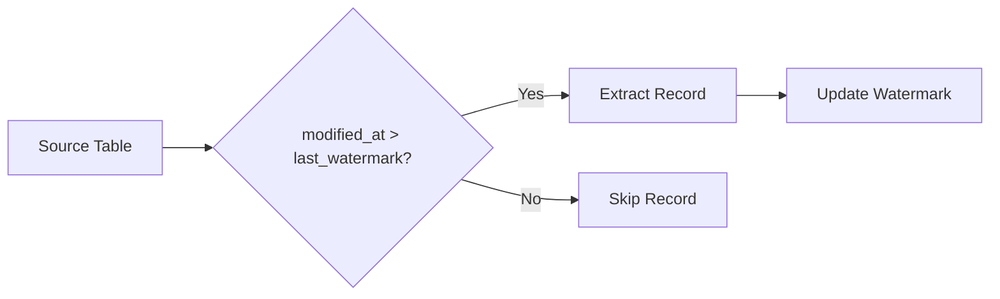
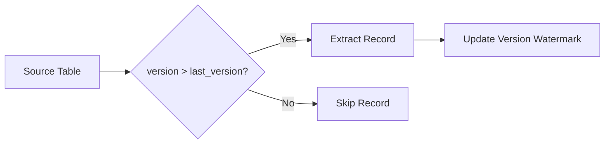
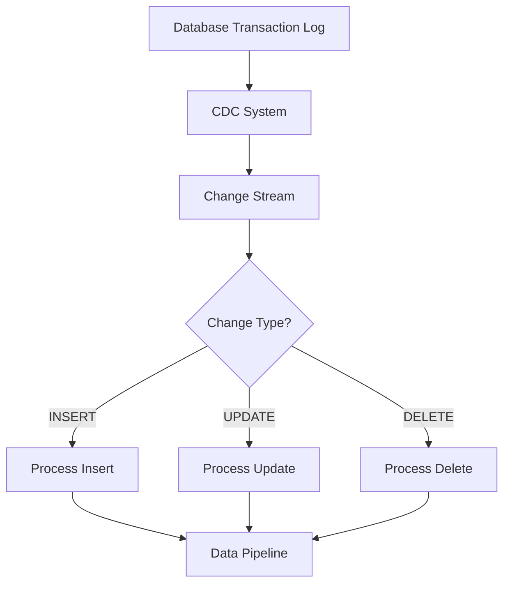
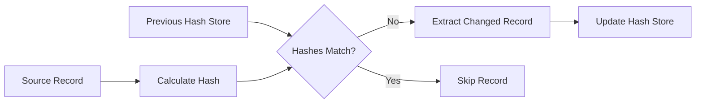
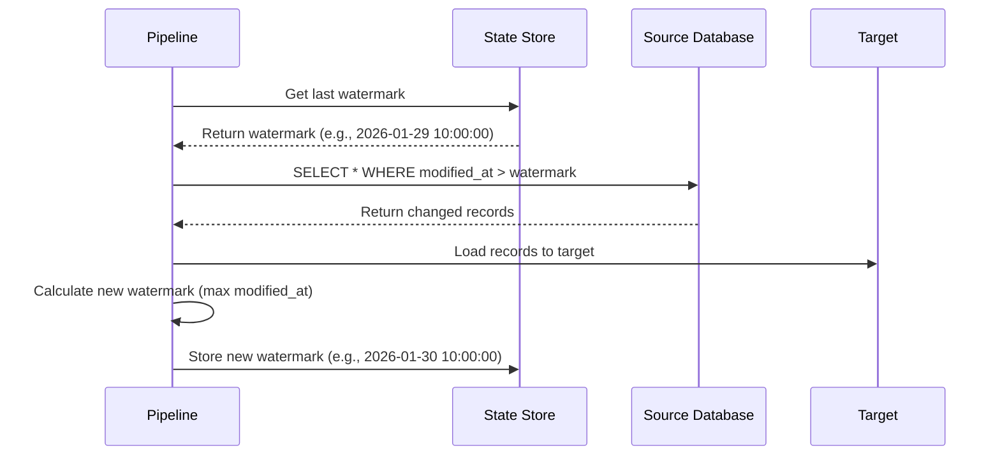
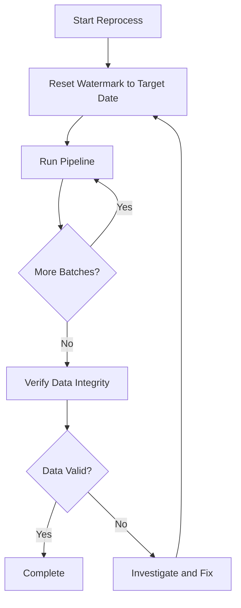
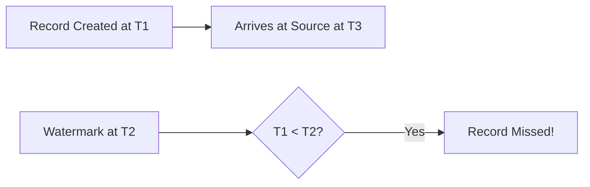
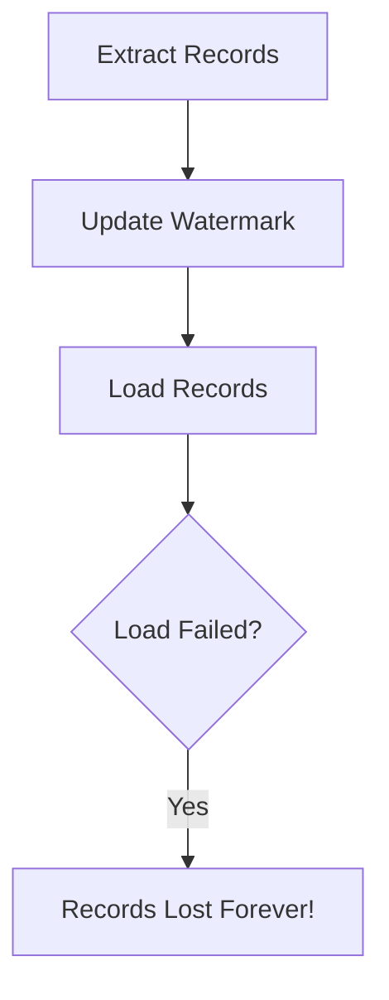
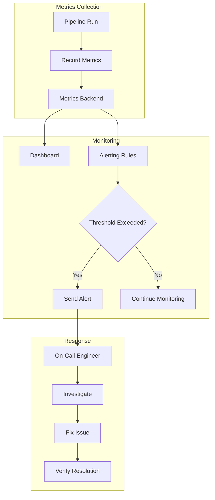

# How to Create Incremental Extraction

Author: [nawazdhandala](https://github.com/nawazdhandala)

Tags: Data Pipeline, ETL, Incremental Load, Data Integration

Description: Learn to create incremental extraction for efficient data pipeline processing of changed records only.

---

> Full extractions move all data every time. Incremental extractions move only what changed. The difference can be hours versus seconds, gigabytes versus kilobytes.

Incremental extraction is a fundamental pattern for building efficient, scalable data pipelines. Instead of reprocessing entire datasets on every run, you identify and extract only the records that have been created, updated, or deleted since the last successful extraction.

This guide walks through the core concepts, implementation patterns, and practical code examples you need to build reliable incremental extraction pipelines in production.

---

## Table of Contents

1. Why Incremental Extraction Matters
2. Core Concepts
3. Change Detection Methods
4. High Watermark Pattern
5. Implementation in Python
6. Handling Deletes
7. Recovery and Reprocessing
8. Common Pitfalls
9. Monitoring Your Pipeline
10. Summary

---

## 1. Why Incremental Extraction Matters

| Full Extraction | Incremental Extraction |
|-----------------|------------------------|
| Moves all records every run | Moves only changed records |
| Processing time grows with total data | Processing time grows with change rate |
| High resource consumption | Low resource consumption |
| Simple to implement | Requires change tracking |
| No state management | Requires watermark persistence |

For a table with 100 million rows where 10,000 records change daily:

- **Full extraction**: Process 100M rows every day
- **Incremental extraction**: Process 10K rows every day

That is a 10,000x reduction in data movement. At scale, this translates to significant cost savings in compute, storage, and network bandwidth.

---

## 2. Core Concepts

| Concept | Description |
|---------|-------------|
| Watermark | A marker indicating the last successfully processed point (timestamp, ID, or version) |
| High Watermark | The maximum value seen in the current extraction batch |
| Low Watermark | The starting point for the current extraction (previous high watermark) |
| Change Data Capture (CDC) | Techniques for identifying changed records in source systems |
| Idempotency | The ability to run the same extraction multiple times without duplicating data |
| Exactly-once semantics | Guaranteeing each record is processed exactly one time |

---

## 3. Change Detection Methods

There are several approaches to detecting which records have changed since the last extraction.

### Method 1: Timestamp-Based Detection

Use a `modified_at` or `updated_at` column to identify recently changed records.



**Pros:**
- Simple to implement
- Works with most databases
- Minimal source system changes required

**Cons:**
- Requires reliable timestamp columns
- Cannot detect hard deletes
- Clock skew can cause issues

### Method 2: Version/Sequence Number

Use an auto-incrementing version or sequence number that increases with each change.



**Pros:**
- Guaranteed ordering
- No clock synchronization issues
- Works well for append-only data

**Cons:**
- Requires sequence column on source
- Cannot detect hard deletes
- May require schema changes

### Method 3: Change Data Capture (CDC)

Capture changes directly from database transaction logs or change tables.



**Pros:**
- Captures all change types including deletes
- Real-time or near-real-time
- No impact on source queries

**Cons:**
- Requires CDC infrastructure
- More complex setup
- Vendor-specific implementations

### Method 4: Hash Comparison

Calculate hashes of records and compare with previously stored hashes.



**Pros:**
- Detects any change to any column
- Works without timestamp columns
- Can detect data corruption

**Cons:**
- Requires storing hashes for all records
- Compute-intensive for large datasets
- Still cannot detect deletes easily

---

## 4. High Watermark Pattern

The high watermark pattern is the most common approach for timestamp or sequence-based incremental extraction.

### How It Works



### Watermark Storage Options

| Storage | Pros | Cons |
|---------|------|------|
| Database table | Reliable, transactional | Additional infrastructure |
| File (JSON/YAML) | Simple, portable | Risk of file loss |
| Environment variable | Works in serverless | Lost on restart |
| Metadata table in target | Co-located with data | Tight coupling |

---

## 5. Implementation in Python

Here is a complete implementation of an incremental extraction pipeline using the high watermark pattern.

### Project Structure

```
incremental_pipeline/
    __init__.py
    watermark.py      # Watermark management
    extractor.py      # Data extraction logic
    loader.py         # Data loading logic
    pipeline.py       # Main pipeline orchestration
    config.py         # Configuration settings
```

### Watermark Manager

```python
# watermark.py
# Manages watermark state for incremental extraction
# Supports multiple storage backends

import json
import os
from datetime import datetime
from typing import Optional
from abc import ABC, abstractmethod


class WatermarkStore(ABC):
    """Abstract base class for watermark storage backends."""

    @abstractmethod
    def get_watermark(self, pipeline_id: str) -> Optional[datetime]:
        """Retrieve the last watermark for a pipeline."""
        pass

    @abstractmethod
    def set_watermark(self, pipeline_id: str, watermark: datetime) -> None:
        """Store the new watermark for a pipeline."""
        pass


class FileWatermarkStore(WatermarkStore):
    """
    File-based watermark storage.
    Stores watermarks as JSON for easy inspection and debugging.
    """

    def __init__(self, file_path: str = "watermarks.json"):
        self.file_path = file_path
        self._ensure_file_exists()

    def _ensure_file_exists(self) -> None:
        """Create the watermark file if it does not exist."""
        if not os.path.exists(self.file_path):
            with open(self.file_path, 'w') as f:
                json.dump({}, f)

    def _load_watermarks(self) -> dict:
        """Load all watermarks from the file."""
        with open(self.file_path, 'r') as f:
            return json.load(f)

    def _save_watermarks(self, watermarks: dict) -> None:
        """Save all watermarks to the file."""
        with open(self.file_path, 'w') as f:
            json.dump(watermarks, f, indent=2, default=str)

    def get_watermark(self, pipeline_id: str) -> Optional[datetime]:
        """
        Retrieve the last watermark for a pipeline.

        Args:
            pipeline_id: Unique identifier for the pipeline

        Returns:
            The last watermark datetime, or None if not found
        """
        watermarks = self._load_watermarks()
        value = watermarks.get(pipeline_id)

        if value is None:
            return None

        # Parse ISO format datetime string
        return datetime.fromisoformat(value)

    def set_watermark(self, pipeline_id: str, watermark: datetime) -> None:
        """
        Store the new watermark for a pipeline.

        Args:
            pipeline_id: Unique identifier for the pipeline
            watermark: The new watermark datetime to store
        """
        watermarks = self._load_watermarks()
        watermarks[pipeline_id] = watermark.isoformat()
        self._save_watermarks(watermarks)


class DatabaseWatermarkStore(WatermarkStore):
    """
    Database-based watermark storage.
    Uses a dedicated table for reliable, transactional storage.
    """

    def __init__(self, connection):
        self.connection = connection
        self._ensure_table_exists()

    def _ensure_table_exists(self) -> None:
        """Create the watermark table if it does not exist."""
        cursor = self.connection.cursor()
        cursor.execute("""
            CREATE TABLE IF NOT EXISTS pipeline_watermarks (
                pipeline_id VARCHAR(255) PRIMARY KEY,
                watermark_value TIMESTAMP NOT NULL,
                updated_at TIMESTAMP DEFAULT CURRENT_TIMESTAMP
            )
        """)
        self.connection.commit()

    def get_watermark(self, pipeline_id: str) -> Optional[datetime]:
        """Retrieve the last watermark from the database."""
        cursor = self.connection.cursor()
        cursor.execute(
            "SELECT watermark_value FROM pipeline_watermarks WHERE pipeline_id = %s",
            (pipeline_id,)
        )
        result = cursor.fetchone()
        return result[0] if result else None

    def set_watermark(self, pipeline_id: str, watermark: datetime) -> None:
        """Store the new watermark in the database using upsert."""
        cursor = self.connection.cursor()
        cursor.execute("""
            INSERT INTO pipeline_watermarks (pipeline_id, watermark_value, updated_at)
            VALUES (%s, %s, CURRENT_TIMESTAMP)
            ON CONFLICT (pipeline_id)
            DO UPDATE SET watermark_value = %s, updated_at = CURRENT_TIMESTAMP
        """, (pipeline_id, watermark, watermark))
        self.connection.commit()
```

### Data Extractor

```python
# extractor.py
# Handles incremental data extraction from source systems

from datetime import datetime
from typing import List, Dict, Any, Optional
import logging

logger = logging.getLogger(__name__)


class IncrementalExtractor:
    """
    Extracts records that have changed since the last watermark.
    Supports timestamp-based and sequence-based extraction.
    """

    def __init__(self, connection, table_name: str, watermark_column: str):
        """
        Initialize the extractor.

        Args:
            connection: Database connection object
            table_name: Name of the source table to extract from
            watermark_column: Column used for change detection (timestamp or sequence)
        """
        self.connection = connection
        self.table_name = table_name
        self.watermark_column = watermark_column

    def extract(
        self,
        low_watermark: Optional[datetime],
        batch_size: int = 10000
    ) -> tuple[List[Dict[str, Any]], Optional[datetime]]:
        """
        Extract changed records since the low watermark.

        Args:
            low_watermark: Starting point for extraction (exclusive)
            batch_size: Maximum number of records to extract

        Returns:
            Tuple of (extracted_records, new_high_watermark)
        """
        cursor = self.connection.cursor()

        # Build the extraction query
        # Use parameterized queries to prevent SQL injection
        if low_watermark is None:
            # First run: extract everything (bootstrap)
            query = f"""
                SELECT * FROM {self.table_name}
                ORDER BY {self.watermark_column} ASC
                LIMIT %s
            """
            params = (batch_size,)
            logger.info(f"Bootstrap extraction from {self.table_name}")
        else:
            # Incremental: extract only changes after watermark
            query = f"""
                SELECT * FROM {self.table_name}
                WHERE {self.watermark_column} > %s
                ORDER BY {self.watermark_column} ASC
                LIMIT %s
            """
            params = (low_watermark, batch_size)
            logger.info(f"Incremental extraction from {self.table_name} after {low_watermark}")

        cursor.execute(query, params)

        # Fetch column names for dict conversion
        columns = [desc[0] for desc in cursor.description]

        # Convert rows to dictionaries
        records = []
        high_watermark = None

        for row in cursor.fetchall():
            record = dict(zip(columns, row))
            records.append(record)

            # Track the highest watermark value seen
            record_watermark = record[self.watermark_column]
            if high_watermark is None or record_watermark > high_watermark:
                high_watermark = record_watermark

        logger.info(f"Extracted {len(records)} records, new watermark: {high_watermark}")

        return records, high_watermark

    def get_record_count(self, since: Optional[datetime] = None) -> int:
        """
        Get count of records to be extracted.
        Useful for progress reporting and batch planning.

        Args:
            since: Optional watermark to count records after

        Returns:
            Number of records matching the criteria
        """
        cursor = self.connection.cursor()

        if since is None:
            query = f"SELECT COUNT(*) FROM {self.table_name}"
            params = ()
        else:
            query = f"SELECT COUNT(*) FROM {self.table_name} WHERE {self.watermark_column} > %s"
            params = (since,)

        cursor.execute(query, params)
        return cursor.fetchone()[0]
```

### Data Loader

```python
# loader.py
# Handles loading extracted data into target systems

from typing import List, Dict, Any
import logging

logger = logging.getLogger(__name__)


class IncrementalLoader:
    """
    Loads extracted records into the target system.
    Supports upsert operations for idempotent loading.
    """

    def __init__(self, connection, table_name: str, primary_key: str):
        """
        Initialize the loader.

        Args:
            connection: Database connection object for target
            table_name: Name of the target table
            primary_key: Column name used as primary key for upserts
        """
        self.connection = connection
        self.table_name = table_name
        self.primary_key = primary_key

    def load(self, records: List[Dict[str, Any]]) -> int:
        """
        Load records into the target table using upsert.

        Upsert ensures idempotency: running the same load multiple
        times produces the same result without duplicates.

        Args:
            records: List of record dictionaries to load

        Returns:
            Number of records processed
        """
        if not records:
            logger.info("No records to load")
            return 0

        cursor = self.connection.cursor()

        # Get column names from first record
        columns = list(records[0].keys())

        # Build upsert query (PostgreSQL syntax)
        # Other databases have different syntax for upsert
        placeholders = ', '.join(['%s'] * len(columns))
        column_names = ', '.join(columns)

        # Build update clause for non-primary-key columns
        update_columns = [col for col in columns if col != self.primary_key]
        update_clause = ', '.join([f"{col} = EXCLUDED.{col}" for col in update_columns])

        query = f"""
            INSERT INTO {self.table_name} ({column_names})
            VALUES ({placeholders})
            ON CONFLICT ({self.primary_key})
            DO UPDATE SET {update_clause}
        """

        # Execute batch insert
        processed = 0
        for record in records:
            values = [record[col] for col in columns]
            cursor.execute(query, values)
            processed += 1

        self.connection.commit()
        logger.info(f"Loaded {processed} records into {self.table_name}")

        return processed

    def load_batch(self, records: List[Dict[str, Any]], batch_size: int = 1000) -> int:
        """
        Load records in batches for better performance.

        Args:
            records: List of record dictionaries to load
            batch_size: Number of records per batch

        Returns:
            Total number of records processed
        """
        total_processed = 0

        for i in range(0, len(records), batch_size):
            batch = records[i:i + batch_size]
            processed = self.load(batch)
            total_processed += processed
            logger.info(f"Batch progress: {total_processed}/{len(records)}")

        return total_processed
```

### Pipeline Orchestration

```python
# pipeline.py
# Main pipeline orchestration with error handling and metrics

from datetime import datetime
from typing import Optional
import logging
import time

from watermark import WatermarkStore, FileWatermarkStore
from extractor import IncrementalExtractor
from loader import IncrementalLoader

logger = logging.getLogger(__name__)


class IncrementalPipeline:
    """
    Orchestrates the incremental extraction pipeline.
    Manages the full cycle: read watermark, extract, load, update watermark.
    """

    def __init__(
        self,
        pipeline_id: str,
        extractor: IncrementalExtractor,
        loader: IncrementalLoader,
        watermark_store: Optional[WatermarkStore] = None
    ):
        """
        Initialize the pipeline.

        Args:
            pipeline_id: Unique identifier for this pipeline
            extractor: Configured extractor instance
            loader: Configured loader instance
            watermark_store: Storage backend for watermarks (default: file-based)
        """
        self.pipeline_id = pipeline_id
        self.extractor = extractor
        self.loader = loader
        self.watermark_store = watermark_store or FileWatermarkStore()

        # Metrics for monitoring
        self.metrics = {
            'records_extracted': 0,
            'records_loaded': 0,
            'extraction_time_ms': 0,
            'load_time_ms': 0,
            'total_time_ms': 0
        }

    def run(self, batch_size: int = 10000) -> dict:
        """
        Execute one run of the incremental pipeline.

        Args:
            batch_size: Maximum records to process per run

        Returns:
            Dictionary containing run metrics and status
        """
        start_time = time.time()

        try:
            # Step 1: Get the last watermark
            low_watermark = self.watermark_store.get_watermark(self.pipeline_id)
            logger.info(f"Starting pipeline {self.pipeline_id} from watermark: {low_watermark}")

            # Step 2: Extract changed records
            extract_start = time.time()
            records, high_watermark = self.extractor.extract(low_watermark, batch_size)
            self.metrics['extraction_time_ms'] = int((time.time() - extract_start) * 1000)
            self.metrics['records_extracted'] = len(records)

            if not records:
                logger.info("No new records to process")
                return self._build_result('success', 'No new records')

            # Step 3: Load records to target
            load_start = time.time()
            loaded_count = self.loader.load_batch(records)
            self.metrics['load_time_ms'] = int((time.time() - load_start) * 1000)
            self.metrics['records_loaded'] = loaded_count

            # Step 4: Update watermark only after successful load
            # This is critical for exactly-once semantics
            if high_watermark is not None:
                self.watermark_store.set_watermark(self.pipeline_id, high_watermark)
                logger.info(f"Updated watermark to: {high_watermark}")

            self.metrics['total_time_ms'] = int((time.time() - start_time) * 1000)

            return self._build_result('success', f'Processed {loaded_count} records')

        except Exception as e:
            logger.error(f"Pipeline failed: {str(e)}", exc_info=True)
            self.metrics['total_time_ms'] = int((time.time() - start_time) * 1000)
            return self._build_result('failed', str(e))

    def run_until_complete(self, batch_size: int = 10000) -> dict:
        """
        Run the pipeline repeatedly until all changes are processed.
        Useful for catching up after extended downtime.

        Args:
            batch_size: Maximum records per batch

        Returns:
            Aggregated metrics for all runs
        """
        total_records = 0
        run_count = 0

        while True:
            result = self.run(batch_size)
            run_count += 1

            if result['status'] == 'failed':
                return result

            records_processed = self.metrics['records_extracted']
            total_records += records_processed

            # If we processed fewer than batch_size, we are caught up
            if records_processed < batch_size:
                break

        return {
            'status': 'success',
            'message': f'Completed {run_count} runs, processed {total_records} total records',
            'total_records': total_records,
            'run_count': run_count
        }

    def _build_result(self, status: str, message: str) -> dict:
        """Build a standardized result dictionary."""
        return {
            'status': status,
            'message': message,
            'pipeline_id': self.pipeline_id,
            'metrics': self.metrics.copy(),
            'timestamp': datetime.utcnow().isoformat()
        }


# Example usage
if __name__ == '__main__':
    import psycopg2

    # Configure logging
    logging.basicConfig(level=logging.INFO)

    # Set up database connections
    source_conn = psycopg2.connect(
        host='source-db.example.com',
        database='source_db',
        user='reader',
        password='secret'
    )

    target_conn = psycopg2.connect(
        host='target-db.example.com',
        database='target_db',
        user='writer',
        password='secret'
    )

    # Create pipeline components
    extractor = IncrementalExtractor(
        connection=source_conn,
        table_name='orders',
        watermark_column='updated_at'
    )

    loader = IncrementalLoader(
        connection=target_conn,
        table_name='orders_replica',
        primary_key='order_id'
    )

    # Create and run pipeline
    pipeline = IncrementalPipeline(
        pipeline_id='orders_sync',
        extractor=extractor,
        loader=loader
    )

    result = pipeline.run_until_complete(batch_size=5000)
    print(f"Pipeline completed: {result}")
```

---

## 6. Handling Deletes

Detecting deleted records is one of the trickiest parts of incremental extraction. Here are the common approaches.

### Soft Deletes

Use a `deleted_at` or `is_deleted` column instead of physically removing records.

```python
# extractor_with_deletes.py
# Handles soft delete detection in incremental extraction

class SoftDeleteExtractor(IncrementalExtractor):
    """
    Extractor that handles soft deletes.
    Records are marked as deleted rather than physically removed.
    """

    def __init__(
        self,
        connection,
        table_name: str,
        watermark_column: str,
        delete_flag_column: str = 'is_deleted'
    ):
        super().__init__(connection, table_name, watermark_column)
        self.delete_flag_column = delete_flag_column

    def extract(self, low_watermark, batch_size=10000):
        """
        Extract records including those marked as deleted.
        The loader should handle the delete flag appropriately.
        """
        cursor = self.connection.cursor()

        if low_watermark is None:
            query = f"""
                SELECT *, {self.delete_flag_column} as _is_deleted
                FROM {self.table_name}
                ORDER BY {self.watermark_column} ASC
                LIMIT %s
            """
            params = (batch_size,)
        else:
            query = f"""
                SELECT *, {self.delete_flag_column} as _is_deleted
                FROM {self.table_name}
                WHERE {self.watermark_column} > %s
                ORDER BY {self.watermark_column} ASC
                LIMIT %s
            """
            params = (low_watermark, batch_size)

        cursor.execute(query, params)
        columns = [desc[0] for desc in cursor.description]

        records = []
        high_watermark = None

        for row in cursor.fetchall():
            record = dict(zip(columns, row))
            records.append(record)

            record_watermark = record[self.watermark_column]
            if high_watermark is None or record_watermark > high_watermark:
                high_watermark = record_watermark

        return records, high_watermark
```

### Full Snapshot Comparison (for Hard Deletes)

Periodically compare current records with target to detect deletions.

```python
# delete_detector.py
# Detects hard deletes by comparing source and target

from typing import Set
import logging

logger = logging.getLogger(__name__)


class HardDeleteDetector:
    """
    Detects hard deletes by comparing primary keys between source and target.
    Should be run periodically (e.g., daily) rather than every sync.
    """

    def __init__(
        self,
        source_connection,
        target_connection,
        source_table: str,
        target_table: str,
        primary_key: str
    ):
        self.source_conn = source_connection
        self.target_conn = target_connection
        self.source_table = source_table
        self.target_table = target_table
        self.primary_key = primary_key

    def get_source_keys(self) -> Set:
        """Get all primary keys from source."""
        cursor = self.source_conn.cursor()
        cursor.execute(f"SELECT {self.primary_key} FROM {self.source_table}")
        return {row[0] for row in cursor.fetchall()}

    def get_target_keys(self) -> Set:
        """Get all primary keys from target."""
        cursor = self.target_conn.cursor()
        cursor.execute(f"SELECT {self.primary_key} FROM {self.target_table}")
        return {row[0] for row in cursor.fetchall()}

    def detect_deletes(self) -> Set:
        """
        Find records that exist in target but not in source.
        These are records that were deleted from the source.

        Returns:
            Set of primary key values for deleted records
        """
        source_keys = self.get_source_keys()
        target_keys = self.get_target_keys()

        deleted_keys = target_keys - source_keys

        logger.info(f"Detected {len(deleted_keys)} deleted records")
        return deleted_keys

    def apply_deletes(self, deleted_keys: Set) -> int:
        """
        Remove deleted records from target or mark them as deleted.

        Args:
            deleted_keys: Set of primary keys to delete

        Returns:
            Number of records deleted
        """
        if not deleted_keys:
            return 0

        cursor = self.target_conn.cursor()

        # Option 1: Hard delete from target
        # placeholders = ','.join(['%s'] * len(deleted_keys))
        # cursor.execute(
        #     f"DELETE FROM {self.target_table} WHERE {self.primary_key} IN ({placeholders})",
        #     tuple(deleted_keys)
        # )

        # Option 2: Soft delete (mark as deleted)
        placeholders = ','.join(['%s'] * len(deleted_keys))
        cursor.execute(
            f"""
            UPDATE {self.target_table}
            SET is_deleted = true, deleted_at = CURRENT_TIMESTAMP
            WHERE {self.primary_key} IN ({placeholders})
            """,
            tuple(deleted_keys)
        )

        self.target_conn.commit()
        deleted_count = cursor.rowcount

        logger.info(f"Applied {deleted_count} deletes to target")
        return deleted_count
```

---

## 7. Recovery and Reprocessing

Sometimes you need to reprocess data due to bugs, schema changes, or data corrections.

### Resetting Watermarks

```python
# recovery.py
# Tools for pipeline recovery and reprocessing

from datetime import datetime
from typing import Optional
import logging

from watermark import WatermarkStore

logger = logging.getLogger(__name__)


class PipelineRecovery:
    """
    Utilities for recovering from pipeline failures and reprocessing data.
    """

    def __init__(self, watermark_store: WatermarkStore):
        self.watermark_store = watermark_store

    def reset_watermark(self, pipeline_id: str, new_watermark: Optional[datetime] = None) -> None:
        """
        Reset the watermark to reprocess data.

        Args:
            pipeline_id: Pipeline to reset
            new_watermark: Specific datetime to reset to, or None for full reprocess
        """
        if new_watermark is None:
            # Full reprocess: set to epoch
            new_watermark = datetime(1970, 1, 1)
            logger.warning(f"Resetting {pipeline_id} for full reprocess")
        else:
            logger.info(f"Resetting {pipeline_id} to {new_watermark}")

        self.watermark_store.set_watermark(pipeline_id, new_watermark)

    def reprocess_time_range(
        self,
        pipeline_id: str,
        start_time: datetime,
        end_time: datetime
    ) -> None:
        """
        Set up reprocessing for a specific time range.

        Note: This sets the watermark to start_time. You may need to
        implement additional logic to stop at end_time.

        Args:
            pipeline_id: Pipeline to reprocess
            start_time: Beginning of range to reprocess
            end_time: End of range (for documentation/validation)
        """
        logger.info(f"Setting up reprocess for {pipeline_id}: {start_time} to {end_time}")
        self.watermark_store.set_watermark(pipeline_id, start_time)
```

### Idempotent Reprocessing

The key to safe reprocessing is idempotent loading. Using upserts instead of inserts ensures that running the same data multiple times produces consistent results.



---

## 8. Common Pitfalls

### Pitfall 1: Late-Arriving Data

Records may have timestamps earlier than your watermark due to replication lag or batch processing.



**Solution:** Use a lookback window.

```python
# Apply a safety buffer when querying
# This catches records that arrived late
from datetime import timedelta

def extract_with_lookback(self, low_watermark, lookback_minutes=5):
    """Extract with a lookback window for late-arriving data."""
    if low_watermark is not None:
        # Subtract lookback period from watermark
        adjusted_watermark = low_watermark - timedelta(minutes=lookback_minutes)
    else:
        adjusted_watermark = None

    return self.extract(adjusted_watermark)
```

### Pitfall 2: Non-Monotonic Timestamps

If timestamps can be updated to earlier values, records may be missed.

**Solution:** Use a combination of timestamp and sequence number, or use CDC.

### Pitfall 3: Missing Index on Watermark Column

Queries become slow as the table grows.

```sql
-- Always index your watermark column
CREATE INDEX idx_orders_updated_at ON orders(updated_at);

-- For high-volume tables, consider a partial index
CREATE INDEX idx_orders_recent ON orders(updated_at)
WHERE updated_at > '2026-01-01';
```

### Pitfall 4: Watermark Updated Before Load Completes

If you update the watermark before data is safely loaded, failures cause data loss.



**Solution:** Always update watermark after successful load.

```python
# WRONG: Update watermark before load
records, watermark = extractor.extract()
watermark_store.set_watermark(watermark)  # Danger!
loader.load(records)  # If this fails, data is lost

# CORRECT: Update watermark after load
records, watermark = extractor.extract()
loader.load(records)  # Load first
watermark_store.set_watermark(watermark)  # Then update
```

### Pitfall 5: Clock Skew Between Systems

Different servers may have slightly different clocks, causing records to be processed multiple times or skipped.

**Solution:** Use sequence numbers when possible, or implement NTP synchronization across all systems.

---

## 9. Monitoring Your Pipeline

Effective monitoring is crucial for incremental pipelines. Track these metrics.

### Key Metrics

| Metric | Description | Alert Threshold |
|--------|-------------|-----------------|
| records_per_run | Number of records extracted | Sudden spikes or drops |
| extraction_latency_ms | Time to extract data | > 5x normal duration |
| load_latency_ms | Time to load data | > 5x normal duration |
| watermark_lag | Time between watermark and now | > expected interval |
| error_rate | Failed runs / total runs | > 1% |

### Monitoring Implementation

```python
# monitoring.py
# Pipeline monitoring and alerting

from datetime import datetime, timedelta
from typing import Dict, Any
import logging

logger = logging.getLogger(__name__)


class PipelineMonitor:
    """
    Monitors pipeline health and sends alerts.
    Integrates with external monitoring systems.
    """

    def __init__(self, pipeline_id: str, metrics_backend=None):
        self.pipeline_id = pipeline_id
        self.metrics_backend = metrics_backend
        self.thresholds = {
            'max_watermark_lag_hours': 2,
            'max_extraction_time_ms': 60000,
            'max_load_time_ms': 120000,
            'min_expected_records': 0,
            'max_error_rate_percent': 1
        }

    def record_run(self, metrics: Dict[str, Any]) -> None:
        """
        Record metrics from a pipeline run.

        Args:
            metrics: Dictionary containing run metrics
        """
        # Send to metrics backend (e.g., Prometheus, DataDog, OneUptime)
        if self.metrics_backend:
            self.metrics_backend.gauge(
                f'pipeline.{self.pipeline_id}.records_extracted',
                metrics.get('records_extracted', 0)
            )
            self.metrics_backend.histogram(
                f'pipeline.{self.pipeline_id}.extraction_time_ms',
                metrics.get('extraction_time_ms', 0)
            )
            self.metrics_backend.histogram(
                f'pipeline.{self.pipeline_id}.load_time_ms',
                metrics.get('load_time_ms', 0)
            )

        # Check for anomalies
        self._check_thresholds(metrics)

    def check_watermark_health(self, current_watermark: datetime) -> bool:
        """
        Verify the watermark is not too far behind.

        Args:
            current_watermark: The current watermark datetime

        Returns:
            True if healthy, False if lagging
        """
        if current_watermark is None:
            logger.warning(f"Pipeline {self.pipeline_id} has no watermark (not started?)")
            return False

        lag = datetime.utcnow() - current_watermark
        max_lag = timedelta(hours=self.thresholds['max_watermark_lag_hours'])

        if lag > max_lag:
            logger.error(
                f"Pipeline {self.pipeline_id} watermark lag: {lag} exceeds threshold {max_lag}"
            )
            self._send_alert(f"Watermark lag critical: {lag}")
            return False

        return True

    def _check_thresholds(self, metrics: Dict[str, Any]) -> None:
        """Check metrics against thresholds and alert if exceeded."""
        extraction_time = metrics.get('extraction_time_ms', 0)
        if extraction_time > self.thresholds['max_extraction_time_ms']:
            self._send_alert(f"Extraction time high: {extraction_time}ms")

        load_time = metrics.get('load_time_ms', 0)
        if load_time > self.thresholds['max_load_time_ms']:
            self._send_alert(f"Load time high: {load_time}ms")

    def _send_alert(self, message: str) -> None:
        """Send an alert to the monitoring system."""
        logger.warning(f"ALERT [{self.pipeline_id}]: {message}")
        # Integration point for alerting (PagerDuty, Slack, email, etc.)
```

### Pipeline Health Dashboard



---

## 10. Summary

| Component | Purpose |
|-----------|---------|
| Watermark | Tracks extraction progress |
| Change Detection | Identifies modified records |
| Extractor | Pulls changed data from source |
| Loader | Pushes data to target with upserts |
| Monitor | Tracks health and alerts on issues |

### Best Practices Checklist

1. **Always index your watermark column** for query performance
2. **Update watermark after successful load** to prevent data loss
3. **Use upserts for idempotent loading** to handle retries safely
4. **Implement a lookback window** to catch late-arriving data
5. **Monitor watermark lag** to detect pipeline stalls
6. **Plan for delete handling** based on your use case
7. **Test your recovery procedures** before you need them
8. **Document your pipeline dependencies** and data lineage

### When to Use Each Change Detection Method

| Method | Best For |
|--------|----------|
| Timestamp | General purpose, existing schemas |
| Sequence | Append-heavy workloads, strict ordering |
| CDC | Real-time needs, delete detection |
| Hash | Any-column change detection, integrity |

---

*Building reliable data pipelines requires careful attention to edge cases. Start simple with timestamp-based extraction, add monitoring early, and evolve to CDC when your scale or latency requirements demand it.*

---

### See Also

- [What is OpenTelemetry Collector and Why Use One](/blog/post/2025-09-18-what-is-opentelemetry-collector-and-why-use-one) - Learn about collecting and processing telemetry data at scale
- [How to Structure Logs Properly in OpenTelemetry](/blog/post/2025-08-28-how-to-structure-logs-properly-in-opentelemetry) - Best practices for structured logging in data systems
