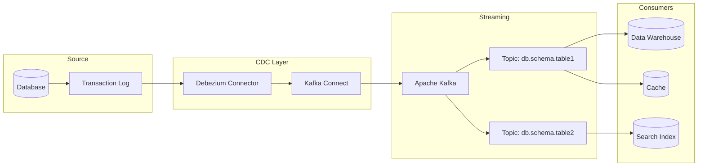
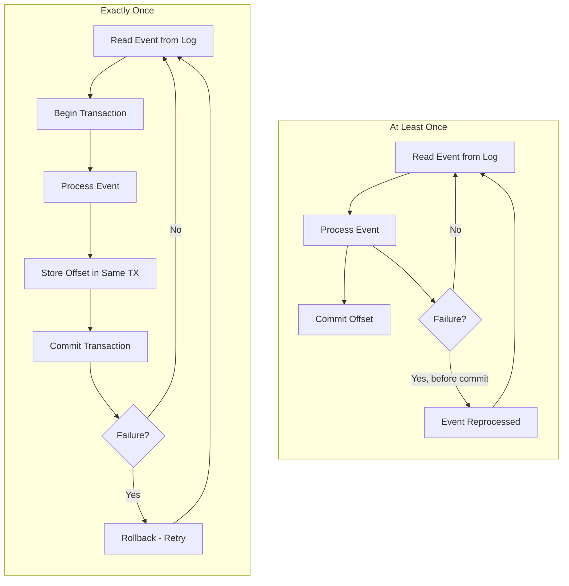

# How to Implement Log-Based CDC

Author: [nawazdhandala](https://github.com/nawazdhandala)

Tags: Data Pipeline, CDC, Debezium, Real-Time

Description: Learn to implement log-based CDC (Change Data Capture) for real-time data replication from database transaction logs.

---

Change Data Capture (CDC) is a critical pattern for building real-time data pipelines. Log-based CDC reads changes directly from database transaction logs, providing a low-impact and reliable way to capture every data modification as it happens. In this guide, we will walk through implementing log-based CDC using Debezium and Kafka Connect.

## What is Log-Based CDC?

Log-based CDC captures data changes by reading the database's internal transaction log (also known as write-ahead log, binary log, or redo log depending on the database). Unlike query-based CDC that polls tables for changes, log-based CDC:

- Captures all changes including deletes
- Has minimal impact on source database performance
- Preserves the exact order of operations
- Captures changes in near real-time

## Architecture Overview

Here is a high-level view of a log-based CDC pipeline:



## Prerequisites

Before implementing log-based CDC, ensure you have:

1. A database with transaction logging enabled
2. Apache Kafka cluster running
3. Kafka Connect deployed
4. Debezium connector installed

## Step 1: Configure Database for CDC

### PostgreSQL Configuration

For PostgreSQL, enable logical replication in `postgresql.conf`:

```properties
# Enable logical decoding for CDC
wal_level = logical

# Retain enough WAL segments for CDC to read
max_wal_senders = 4
max_replication_slots = 4

# Plugin for logical decoding (pgoutput is built-in for PostgreSQL 10+)
wal_sender_timeout = 0
```

Create a replication slot and publication:

```sql
-- Create a dedicated user for CDC with replication privileges
CREATE USER cdc_user WITH REPLICATION LOGIN PASSWORD 'secure_password';

-- Grant read access to tables you want to capture
GRANT SELECT ON ALL TABLES IN SCHEMA public TO cdc_user;

-- Create a publication for the tables to capture
-- This tells PostgreSQL which tables to include in logical replication
CREATE PUBLICATION cdc_publication FOR TABLE
    customers,
    orders,
    order_items;

-- Verify the publication was created
SELECT * FROM pg_publication;
```

### MySQL Configuration

For MySQL, enable binary logging in `my.cnf`:

```properties
# Enable binary logging with row-based format
# ROW format captures actual data changes, not just SQL statements
server-id = 1
log_bin = mysql-bin
binlog_format = ROW

# Include actual row data before and after changes
# This is essential for CDC to capture full change context
binlog_row_image = FULL

# Retention period for binary logs (in seconds)
expire_logs_days = 7

# Enable GTID for reliable replication tracking
gtid_mode = ON
enforce_gtid_consistency = ON
```

Create a CDC user with required permissions:

```sql
-- Create dedicated user for Debezium connector
CREATE USER 'cdc_user'@'%' IDENTIFIED BY 'secure_password';

-- Grant privileges needed for reading binary logs
-- REPLICATION SLAVE: Required to read binary log events
-- REPLICATION CLIENT: Required to use SHOW MASTER STATUS, SHOW SLAVE STATUS
GRANT SELECT, REPLICATION SLAVE, REPLICATION CLIENT ON *.* TO 'cdc_user'@'%';

-- Apply the privilege changes
FLUSH PRIVILEGES;
```

## Step 2: Set Up Kafka Connect

Create a Docker Compose file for Kafka Connect with Debezium:

```yaml
# docker-compose.yml
# Complete CDC infrastructure setup
version: '3.8'

services:
  # Zookeeper for Kafka cluster coordination
  zookeeper:
    image: confluentinc/cp-zookeeper:7.5.0
    environment:
      ZOOKEEPER_CLIENT_PORT: 2181
      ZOOKEEPER_TICK_TIME: 2000
    ports:
      - "2181:2181"

  # Kafka broker for streaming CDC events
  kafka:
    image: confluentinc/cp-kafka:7.5.0
    depends_on:
      - zookeeper
    ports:
      - "9092:9092"
    environment:
      KAFKA_BROKER_ID: 1
      KAFKA_ZOOKEEPER_CONNECT: zookeeper:2181
      # Listeners for internal and external access
      KAFKA_LISTENER_SECURITY_PROTOCOL_MAP: PLAINTEXT:PLAINTEXT,PLAINTEXT_HOST:PLAINTEXT
      KAFKA_ADVERTISED_LISTENERS: PLAINTEXT://kafka:29092,PLAINTEXT_HOST://localhost:9092
      KAFKA_OFFSETS_TOPIC_REPLICATION_FACTOR: 1
      # Topic for storing Kafka Connect configurations
      KAFKA_TRANSACTION_STATE_LOG_REPLICATION_FACTOR: 1
      KAFKA_TRANSACTION_STATE_LOG_MIN_ISR: 1

  # Kafka Connect with Debezium connectors pre-installed
  connect:
    image: debezium/connect:2.4
    depends_on:
      - kafka
    ports:
      - "8083:8083"
    environment:
      # Unique name for this Connect cluster
      GROUP_ID: cdc-connect-cluster
      # Kafka bootstrap servers
      BOOTSTRAP_SERVERS: kafka:29092
      # Topic for storing connector configurations
      CONFIG_STORAGE_TOPIC: connect-configs
      # Topic for storing connector offsets (position in source)
      OFFSET_STORAGE_TOPIC: connect-offsets
      # Topic for storing connector status
      STATUS_STORAGE_TOPIC: connect-status
      # Replication factor (use 3 in production)
      CONFIG_STORAGE_REPLICATION_FACTOR: 1
      OFFSET_STORAGE_REPLICATION_FACTOR: 1
      STATUS_STORAGE_REPLICATION_FACTOR: 1
      # Key and value converters for CDC events
      KEY_CONVERTER: org.apache.kafka.connect.json.JsonConverter
      VALUE_CONVERTER: org.apache.kafka.connect.json.JsonConverter
```

Start the infrastructure:

```bash
# Start all services in detached mode
docker-compose up -d

# Wait for services to be healthy
echo "Waiting for Kafka Connect to start..."
while ! curl -s http://localhost:8083/connectors > /dev/null; do
    sleep 5
done
echo "Kafka Connect is ready!"

# Verify available connector plugins
curl -s http://localhost:8083/connector-plugins | jq '.[].class'
```

## Step 3: Create Debezium Connector

### PostgreSQL Connector Configuration

Create a connector configuration file:

```json
{
  "name": "postgres-cdc-connector",
  "config": {
    "connector.class": "io.debezium.connector.postgresql.PostgresConnector",

    "database.hostname": "postgres-host",
    "database.port": "5432",
    "database.user": "cdc_user",
    "database.password": "secure_password",
    "database.dbname": "production_db",

    "topic.prefix": "cdc",

    "plugin.name": "pgoutput",
    "publication.name": "cdc_publication",

    "slot.name": "debezium_slot",

    "table.include.list": "public.customers,public.orders,public.order_items",

    "snapshot.mode": "initial",

    "tombstones.on.delete": true,

    "transforms": "unwrap",
    "transforms.unwrap.type": "io.debezium.transforms.ExtractNewRecordState",
    "transforms.unwrap.drop.tombstones": false,
    "transforms.unwrap.delete.handling.mode": "rewrite",
    "transforms.unwrap.add.fields": "op,source.ts_ms",

    "heartbeat.interval.ms": 10000
  }
}
```

Register the connector with Kafka Connect:

```bash
# Register the PostgreSQL CDC connector
# This sends the configuration to Kafka Connect REST API
curl -X POST http://localhost:8083/connectors \
  -H "Content-Type: application/json" \
  -d @postgres-connector.json

# Check connector status
curl -s http://localhost:8083/connectors/postgres-cdc-connector/status | jq

# Expected output shows connector and task are running:
# {
#   "name": "postgres-cdc-connector",
#   "connector": { "state": "RUNNING", "worker_id": "connect:8083" },
#   "tasks": [{ "id": 0, "state": "RUNNING", "worker_id": "connect:8083" }]
# }
```

### MySQL Connector Configuration

```json
{
  "name": "mysql-cdc-connector",
  "config": {
    "connector.class": "io.debezium.connector.mysql.MySqlConnector",

    "database.hostname": "mysql-host",
    "database.port": "3306",
    "database.user": "cdc_user",
    "database.password": "secure_password",

    "database.server.id": "184054",

    "topic.prefix": "cdc",

    "database.include.list": "ecommerce",
    "table.include.list": "ecommerce.customers,ecommerce.orders",

    "include.schema.changes": true,

    "snapshot.mode": "when_needed",

    "schema.history.internal.kafka.bootstrap.servers": "kafka:29092",
    "schema.history.internal.kafka.topic": "schema-changes.ecommerce",

    "decimal.handling.mode": "string",
    "time.precision.mode": "adaptive_time_microseconds"
  }
}
```

## Step 4: Understanding CDC Event Format

When a change occurs in the database, Debezium produces a structured event. Here is the anatomy of a CDC event:

```mermaid
flowchart TB
    subgraph CDC Event Structure
        direction TB
        E[CDC Event]

        subgraph Before State
            B1[id: 1001]
            B2[name: John Doe]
            B3[email: john@old.com]
        end

        subgraph After State
            A1[id: 1001]
            A2[name: John Doe]
            A3[email: john@new.com]
        end

        subgraph Source Metadata
            S1[connector: postgres]
            S2[db: production]
            S3[table: customers]
            S4[ts_ms: 1706612400000]
            S5[lsn: 23456789]
        end

        subgraph Operation
            O1[op: u for update]
            O2[op: c for create]
            O3[op: d for delete]
            O4[op: r for read/snapshot]
        end
    end

    E --> Before State
    E --> After State
    E --> Source Metadata
    E --> Operation
```

Example CDC event for an UPDATE operation:

```json
{
  "schema": { },
  "payload": {
    "before": {
      "id": 1001,
      "name": "John Doe",
      "email": "john@old-email.com",
      "updated_at": 1706612300000
    },
    "after": {
      "id": 1001,
      "name": "John Doe",
      "email": "john@new-email.com",
      "updated_at": 1706612400000
    },
    "source": {
      "version": "2.4.0.Final",
      "connector": "postgresql",
      "name": "cdc",
      "ts_ms": 1706612400123,
      "snapshot": "false",
      "db": "production_db",
      "sequence": "[\"23456789\",\"23456790\"]",
      "schema": "public",
      "table": "customers",
      "txId": 5678,
      "lsn": 23456790
    },
    "op": "u",
    "ts_ms": 1706612400456,
    "transaction": {
      "id": "5678",
      "total_order": 1,
      "data_collection_order": 1
    }
  }
}
```

## Step 5: Consume CDC Events

### Python Consumer Example

Here is a comprehensive Python consumer that processes CDC events:

```python
#!/usr/bin/env python3
"""
CDC Event Consumer
Processes change data capture events from Kafka topics
and routes them to appropriate downstream systems.
"""

import json
import logging
from datetime import datetime
from typing import Optional, Dict, Any
from dataclasses import dataclass
from enum import Enum

from kafka import KafkaConsumer
from kafka.errors import KafkaError

# Configure logging
logging.basicConfig(
    level=logging.INFO,
    format='%(asctime)s - %(name)s - %(levelname)s - %(message)s'
)
logger = logging.getLogger(__name__)


class Operation(Enum):
    """CDC operation types as defined by Debezium."""
    CREATE = 'c'      # Insert operation
    UPDATE = 'u'      # Update operation
    DELETE = 'd'      # Delete operation
    READ = 'r'        # Snapshot read (initial load)
    TRUNCATE = 't'    # Table truncate


@dataclass
class CDCEvent:
    """
    Represents a parsed CDC event with all relevant metadata.

    Attributes:
        operation: The type of database operation
        table: Source table name
        schema: Source schema name
        before: Row state before the change (None for inserts)
        after: Row state after the change (None for deletes)
        timestamp: When the change occurred in the database
        transaction_id: Database transaction ID
        lsn: Log sequence number for ordering
    """
    operation: Operation
    table: str
    schema: str
    before: Optional[Dict[str, Any]]
    after: Optional[Dict[str, Any]]
    timestamp: datetime
    transaction_id: Optional[str]
    lsn: Optional[int]

    @classmethod
    def from_debezium(cls, message: Dict[str, Any]) -> 'CDCEvent':
        """
        Parse a Debezium event message into a CDCEvent.

        Args:
            message: Raw Debezium event payload

        Returns:
            Parsed CDCEvent instance
        """
        payload = message.get('payload', message)
        source = payload.get('source', {})

        # Parse the timestamp from milliseconds
        ts_ms = source.get('ts_ms', 0)
        timestamp = datetime.fromtimestamp(ts_ms / 1000.0)

        return cls(
            operation=Operation(payload.get('op', 'r')),
            table=source.get('table', 'unknown'),
            schema=source.get('schema', 'public'),
            before=payload.get('before'),
            after=payload.get('after'),
            timestamp=timestamp,
            transaction_id=str(source.get('txId')) if source.get('txId') else None,
            lsn=source.get('lsn')
        )

    def get_primary_key(self, pk_fields: list) -> tuple:
        """
        Extract primary key value from the event.
        Uses 'after' state for creates/updates, 'before' for deletes.
        """
        data = self.after if self.after else self.before
        if not data:
            return tuple()
        return tuple(data.get(field) for field in pk_fields)


class CDCProcessor:
    """
    Processes CDC events and routes them to downstream systems.

    This processor implements idempotent event handling to ensure
    exactly-once semantics even when events are replayed.
    """

    def __init__(
        self,
        bootstrap_servers: str,
        topics: list,
        group_id: str,
        handlers: dict
    ):
        """
        Initialize the CDC processor.

        Args:
            bootstrap_servers: Kafka bootstrap servers
            topics: List of CDC topics to consume
            group_id: Consumer group ID for offset tracking
            handlers: Dict mapping table names to handler functions
        """
        self.consumer = KafkaConsumer(
            *topics,
            bootstrap_servers=bootstrap_servers,
            group_id=group_id,
            # Start from earliest if no committed offset exists
            auto_offset_reset='earliest',
            # Disable auto-commit for manual offset management
            enable_auto_commit=False,
            # Deserialize JSON messages
            value_deserializer=lambda m: json.loads(m.decode('utf-8')),
            # Wait up to 1 second for batch of messages
            fetch_max_wait_ms=1000,
            # Process up to 500 messages per poll
            max_poll_records=500
        )
        self.handlers = handlers
        self.processed_count = 0
        self.error_count = 0

    def process_events(self):
        """
        Main event processing loop.
        Consumes CDC events and routes them to appropriate handlers.
        """
        logger.info("Starting CDC event processor...")

        try:
            for message in self.consumer:
                try:
                    # Parse the CDC event
                    event = CDCEvent.from_debezium(message.value)

                    logger.debug(
                        f"Processing {event.operation.name} on "
                        f"{event.schema}.{event.table}"
                    )

                    # Route to appropriate handler
                    handler = self.handlers.get(event.table)
                    if handler:
                        handler(event)
                        self.processed_count += 1
                    else:
                        logger.warning(f"No handler for table: {event.table}")

                    # Commit offset after successful processing
                    # This ensures at-least-once delivery
                    self.consumer.commit()

                except json.JSONDecodeError as e:
                    logger.error(f"Failed to parse message: {e}")
                    self.error_count += 1
                except Exception as e:
                    logger.error(f"Error processing event: {e}")
                    self.error_count += 1
                    # Continue processing other events
                    # In production, consider dead letter queue

        except KafkaError as e:
            logger.error(f"Kafka error: {e}")
            raise
        finally:
            self.consumer.close()
            logger.info(
                f"Processor stopped. Processed: {self.processed_count}, "
                f"Errors: {self.error_count}"
            )


def handle_customer_change(event: CDCEvent):
    """
    Handle changes to the customers table.
    Routes to appropriate action based on operation type.
    """
    if event.operation == Operation.CREATE:
        # New customer created
        logger.info(f"New customer: {event.after.get('email')}")
        # Example: Update search index, send welcome email
        update_search_index('customers', event.after)

    elif event.operation == Operation.UPDATE:
        # Customer updated
        logger.info(f"Customer updated: {event.after.get('id')}")
        # Example: Invalidate cache, update search index
        invalidate_cache('customer', event.after.get('id'))
        update_search_index('customers', event.after)

    elif event.operation == Operation.DELETE:
        # Customer deleted
        logger.info(f"Customer deleted: {event.before.get('id')}")
        # Example: Remove from cache and search index
        invalidate_cache('customer', event.before.get('id'))
        remove_from_search_index('customers', event.before.get('id'))


def handle_order_change(event: CDCEvent):
    """
    Handle changes to the orders table.
    Maintains materialized views and triggers downstream processing.
    """
    if event.operation in (Operation.CREATE, Operation.READ):
        # New order or snapshot load
        order = event.after
        logger.info(f"Order {order.get('id')}: {order.get('status')}")

        # Update customer order count materialized view
        update_customer_order_stats(order.get('customer_id'))

        # Trigger order processing workflow
        if order.get('status') == 'pending':
            trigger_order_processing(order)

    elif event.operation == Operation.UPDATE:
        # Order status change
        before_status = event.before.get('status') if event.before else None
        after_status = event.after.get('status')

        if before_status != after_status:
            logger.info(
                f"Order {event.after.get('id')} status: "
                f"{before_status} -> {after_status}"
            )
            # Trigger status change notifications
            notify_order_status_change(event.after)


# Placeholder functions for downstream systems
def update_search_index(index: str, document: dict):
    """Update Elasticsearch or similar search index."""
    pass

def invalidate_cache(entity: str, entity_id: int):
    """Invalidate Redis cache entry."""
    pass

def remove_from_search_index(index: str, doc_id: int):
    """Remove document from search index."""
    pass

def update_customer_order_stats(customer_id: int):
    """Update materialized view of customer order statistics."""
    pass

def trigger_order_processing(order: dict):
    """Trigger order processing workflow."""
    pass

def notify_order_status_change(order: dict):
    """Send notifications for order status changes."""
    pass


if __name__ == '__main__':
    # Configure handlers for each table
    handlers = {
        'customers': handle_customer_change,
        'orders': handle_order_change,
    }

    # Create and run the processor
    processor = CDCProcessor(
        bootstrap_servers='localhost:9092',
        topics=['cdc.public.customers', 'cdc.public.orders'],
        group_id='cdc-processor-group',
        handlers=handlers
    )

    processor.process_events()
```

## Step 6: Ensure Delivery Guarantees

CDC pipelines must handle various failure scenarios. Here is how different guarantees work:



### Implementing Idempotent Processing

```python
"""
Idempotent CDC Event Processor
Ensures events are processed exactly once using LSN tracking.
"""

import psycopg2
from contextlib import contextmanager
from typing import Optional

class IdempotentProcessor:
    """
    Processes CDC events with exactly-once semantics.

    Uses a watermark table to track the last processed LSN
    for each source table. Events are processed within
    a transaction that also updates the watermark.
    """

    def __init__(self, connection_string: str):
        """
        Initialize the processor with database connection.

        Args:
            connection_string: PostgreSQL connection string
        """
        self.conn_string = connection_string
        self._ensure_watermark_table()

    def _ensure_watermark_table(self):
        """Create the watermark tracking table if it doesn't exist."""
        with self._get_connection() as conn:
            with conn.cursor() as cur:
                cur.execute("""
                    CREATE TABLE IF NOT EXISTS cdc_watermarks (
                        source_table VARCHAR(255) PRIMARY KEY,
                        last_lsn BIGINT NOT NULL,
                        last_processed_at TIMESTAMP DEFAULT NOW(),
                        events_processed BIGINT DEFAULT 0
                    )
                """)
            conn.commit()

    @contextmanager
    def _get_connection(self):
        """Context manager for database connections."""
        conn = psycopg2.connect(self.conn_string)
        try:
            yield conn
        finally:
            conn.close()

    def get_last_processed_lsn(self, table: str) -> Optional[int]:
        """
        Get the last processed LSN for a source table.

        Args:
            table: Source table name

        Returns:
            Last processed LSN or None if never processed
        """
        with self._get_connection() as conn:
            with conn.cursor() as cur:
                cur.execute(
                    "SELECT last_lsn FROM cdc_watermarks WHERE source_table = %s",
                    (table,)
                )
                row = cur.fetchone()
                return row[0] if row else None

    def process_event_idempotently(
        self,
        event: 'CDCEvent',
        process_func: callable
    ) -> bool:
        """
        Process a CDC event with exactly-once guarantee.

        The event processing and watermark update happen in the
        same database transaction, ensuring atomicity.

        Args:
            event: The CDC event to process
            process_func: Function that performs the actual processing

        Returns:
            True if event was processed, False if already processed
        """
        # Skip events we have already processed
        last_lsn = self.get_last_processed_lsn(event.table)
        if last_lsn and event.lsn and event.lsn <= last_lsn:
            logger.debug(
                f"Skipping already processed event: "
                f"table={event.table}, lsn={event.lsn}"
            )
            return False

        with self._get_connection() as conn:
            try:
                with conn.cursor() as cur:
                    # Process the event within transaction
                    process_func(event, cur)

                    # Update watermark in same transaction
                    cur.execute("""
                        INSERT INTO cdc_watermarks
                            (source_table, last_lsn, events_processed)
                        VALUES (%s, %s, 1)
                        ON CONFLICT (source_table) DO UPDATE SET
                            last_lsn = EXCLUDED.last_lsn,
                            last_processed_at = NOW(),
                            events_processed = cdc_watermarks.events_processed + 1
                    """, (event.table, event.lsn))

                # Commit both the processing and watermark update
                conn.commit()
                return True

            except Exception as e:
                # Rollback on any error
                conn.rollback()
                logger.error(f"Failed to process event: {e}")
                raise


def process_customer_to_warehouse(event: 'CDCEvent', cursor):
    """
    Sync customer changes to data warehouse.

    Uses UPSERT pattern to handle both inserts and updates.
    Maintains SCD Type 2 history for tracking changes over time.
    """
    if event.operation == Operation.DELETE:
        # Soft delete in warehouse (maintain history)
        cursor.execute("""
            UPDATE warehouse.dim_customers
            SET is_deleted = TRUE,
                deleted_at = %s,
                updated_at = NOW()
            WHERE customer_id = %s
              AND is_current = TRUE
        """, (event.timestamp, event.before['id']))
    else:
        # Upsert customer record
        customer = event.after
        cursor.execute("""
            INSERT INTO warehouse.dim_customers (
                customer_id, name, email, created_at,
                source_updated_at, is_current, is_deleted
            ) VALUES (
                %s, %s, %s, %s, %s, TRUE, FALSE
            )
            ON CONFLICT (customer_id) WHERE is_current = TRUE
            DO UPDATE SET
                name = EXCLUDED.name,
                email = EXCLUDED.email,
                source_updated_at = EXCLUDED.source_updated_at,
                updated_at = NOW()
        """, (
            customer['id'],
            customer['name'],
            customer['email'],
            customer.get('created_at'),
            event.timestamp
        ))
```

## Step 7: Monitor Your CDC Pipeline

Effective monitoring is crucial for CDC pipelines. Track these key metrics:

```mermaid
flowchart TB
    subgraph Metrics to Monitor
        direction TB

        subgraph Lag Metrics
            L1[Replication Lag]
            L2[Consumer Lag]
            L3[End-to-End Latency]
        end

        subgraph Throughput Metrics
            T1[Events per Second]
            T2[Bytes per Second]
            T3[Transactions per Second]
        end

        subgraph Health Metrics
            H1[Connector Status]
            H2[Task Status]
            H3[Error Rate]
            H4[Restart Count]
        end
    end

    subgraph Alerting Rules
        A1[Lag > 60 seconds]
        A2[Error Rate > 1%]
        A3[Connector DOWN]
        A4[Slot Size Growing]
    end

    Lag Metrics --> A1
    Throughput Metrics --> A2
    Health Metrics --> A3
    Health Metrics --> A4
```

### Monitoring Script

```python
#!/usr/bin/env python3
"""
CDC Pipeline Monitor
Collects and reports metrics for Debezium CDC pipelines.
"""

import requests
import time
from dataclasses import dataclass
from typing import List, Dict, Any


@dataclass
class ConnectorMetrics:
    """Metrics for a single Debezium connector."""
    name: str
    status: str
    task_count: int
    tasks_running: int
    tasks_failed: int
    lag_ms: float
    events_processed: int
    last_event_time: float


class CDCMonitor:
    """
    Monitors Debezium connectors and Kafka consumer lag.
    """

    def __init__(
        self,
        connect_url: str = 'http://localhost:8083',
        kafka_bootstrap: str = 'localhost:9092'
    ):
        self.connect_url = connect_url
        self.kafka_bootstrap = kafka_bootstrap

    def get_connector_status(self, connector_name: str) -> Dict[str, Any]:
        """
        Get detailed status for a connector.

        Returns connector state, task states, and any error messages.
        """
        response = requests.get(
            f"{self.connect_url}/connectors/{connector_name}/status"
        )
        response.raise_for_status()
        return response.json()

    def get_all_connectors(self) -> List[str]:
        """Get list of all registered connectors."""
        response = requests.get(f"{self.connect_url}/connectors")
        response.raise_for_status()
        return response.json()

    def collect_metrics(self) -> List[ConnectorMetrics]:
        """
        Collect metrics for all CDC connectors.

        Returns list of ConnectorMetrics for each connector.
        """
        metrics = []

        for connector_name in self.get_all_connectors():
            status = self.get_connector_status(connector_name)

            # Count task states
            tasks = status.get('tasks', [])
            tasks_running = sum(
                1 for t in tasks if t.get('state') == 'RUNNING'
            )
            tasks_failed = sum(
                1 for t in tasks if t.get('state') == 'FAILED'
            )

            metrics.append(ConnectorMetrics(
                name=connector_name,
                status=status['connector']['state'],
                task_count=len(tasks),
                tasks_running=tasks_running,
                tasks_failed=tasks_failed,
                lag_ms=self._get_lag_ms(connector_name),
                events_processed=self._get_events_processed(connector_name),
                last_event_time=time.time()
            ))

        return metrics

    def _get_lag_ms(self, connector_name: str) -> float:
        """
        Calculate replication lag for a connector.

        Compares source database timestamp to Kafka timestamp.
        """
        # In production, query Debezium metrics endpoint
        # or calculate from source/sink timestamps
        return 0.0

    def _get_events_processed(self, connector_name: str) -> int:
        """Get total events processed by connector."""
        # Query JMX metrics or connector metrics endpoint
        return 0

    def check_health(self) -> Dict[str, Any]:
        """
        Perform health check on CDC pipeline.

        Returns health status and any issues found.
        """
        issues = []
        metrics = self.collect_metrics()

        for m in metrics:
            # Check connector status
            if m.status != 'RUNNING':
                issues.append({
                    'severity': 'critical',
                    'connector': m.name,
                    'message': f'Connector is {m.status}'
                })

            # Check for failed tasks
            if m.tasks_failed > 0:
                issues.append({
                    'severity': 'critical',
                    'connector': m.name,
                    'message': f'{m.tasks_failed} tasks have failed'
                })

            # Check replication lag
            if m.lag_ms > 60000:  # 60 seconds
                issues.append({
                    'severity': 'warning',
                    'connector': m.name,
                    'message': f'Replication lag is {m.lag_ms/1000:.1f}s'
                })

        return {
            'healthy': len(issues) == 0,
            'connectors': len(metrics),
            'issues': issues,
            'timestamp': time.time()
        }

    def restart_failed_tasks(self, connector_name: str):
        """
        Restart any failed tasks for a connector.

        This is useful for recovering from transient failures.
        """
        status = self.get_connector_status(connector_name)

        for task in status.get('tasks', []):
            if task.get('state') == 'FAILED':
                task_id = task['id']
                print(f"Restarting task {task_id} for {connector_name}")

                response = requests.post(
                    f"{self.connect_url}/connectors/{connector_name}"
                    f"/tasks/{task_id}/restart"
                )
                response.raise_for_status()


if __name__ == '__main__':
    monitor = CDCMonitor()

    # Run continuous health checks
    while True:
        health = monitor.check_health()

        if not health['healthy']:
            print("CDC Pipeline Issues Detected:")
            for issue in health['issues']:
                print(f"  [{issue['severity']}] {issue['connector']}: "
                      f"{issue['message']}")
        else:
            print(f"CDC Pipeline Healthy - "
                  f"{health['connectors']} connectors running")

        time.sleep(30)
```

## Best Practices

### 1. Schema Evolution

Handle schema changes gracefully by configuring Debezium's schema history:

```json
{
  "schema.history.internal.kafka.bootstrap.servers": "kafka:29092",
  "schema.history.internal.kafka.topic": "schema-history.production",

  "include.schema.changes": true,

  "column.exclude.list": "public.users.password_hash,public.users.ssn"
}
```

### 2. Handling Large Tables

For initial snapshots of large tables, use chunked snapshots:

```json
{
  "snapshot.mode": "initial",

  "snapshot.fetch.size": 10000,

  "snapshot.max.threads": 4,

  "signal.enabled.channels": "source",
  "incremental.snapshot.chunk.size": 10000
}
```

### 3. Securing CDC Credentials

Never store credentials in plain text. Use secret management:

```json
{
  "database.password": "${file:/secrets/db-password.txt}",

  "config.providers": "file",
  "config.providers.file.class":
    "org.apache.kafka.common.config.provider.FileConfigProvider"
}
```

## Conclusion

Log-based CDC provides a robust foundation for real-time data pipelines. By reading directly from database transaction logs, you get reliable, ordered, and complete change capture with minimal impact on your source systems.

Key takeaways:

1. Configure your database for logical replication before deploying CDC
2. Use Debezium connectors for reliable log reading across different databases
3. Design consumers with idempotent processing for exactly-once semantics
4. Monitor replication lag and connector health continuously
5. Plan for schema evolution from the start

With these patterns in place, you can build data pipelines that keep your downstream systems in sync with your operational databases in near real-time.

## Further Reading

- [Debezium Documentation](https://debezium.io/documentation/)
- [Kafka Connect Documentation](https://kafka.apache.org/documentation/#connect)
- [PostgreSQL Logical Replication](https://www.postgresql.org/docs/current/logical-replication.html)
- [MySQL Binary Log](https://dev.mysql.com/doc/refman/8.0/en/binary-log.html)
