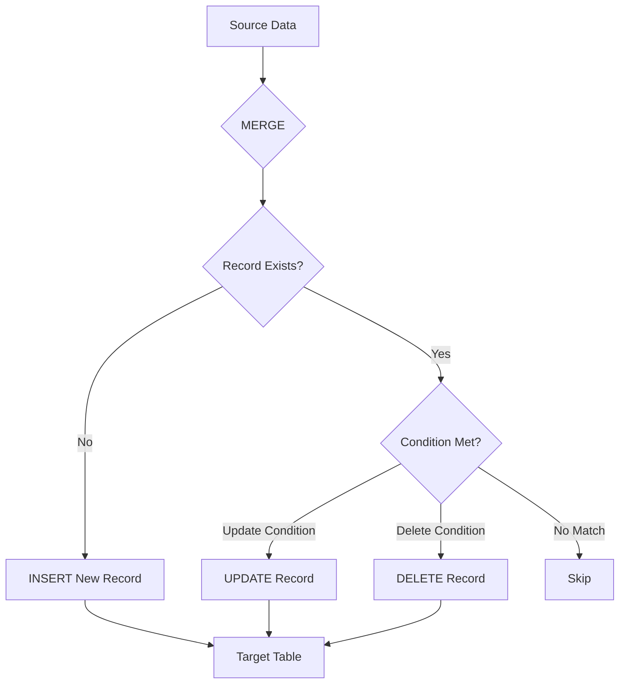
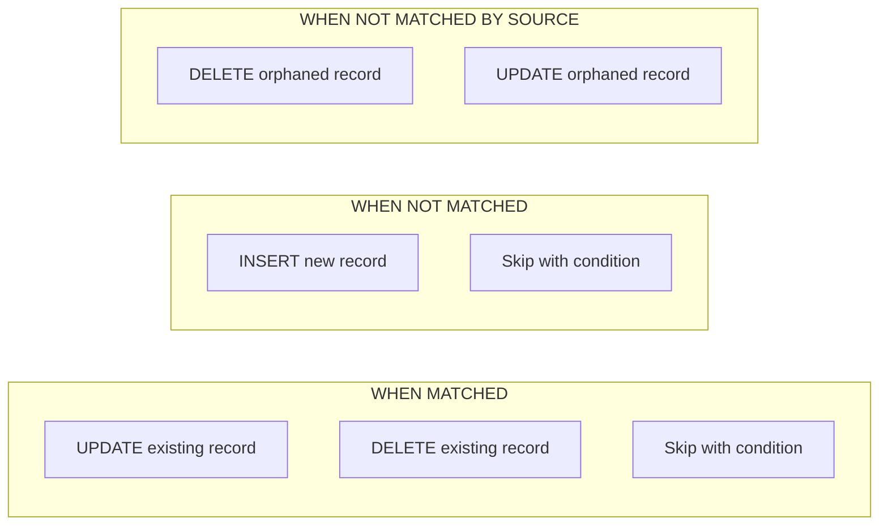
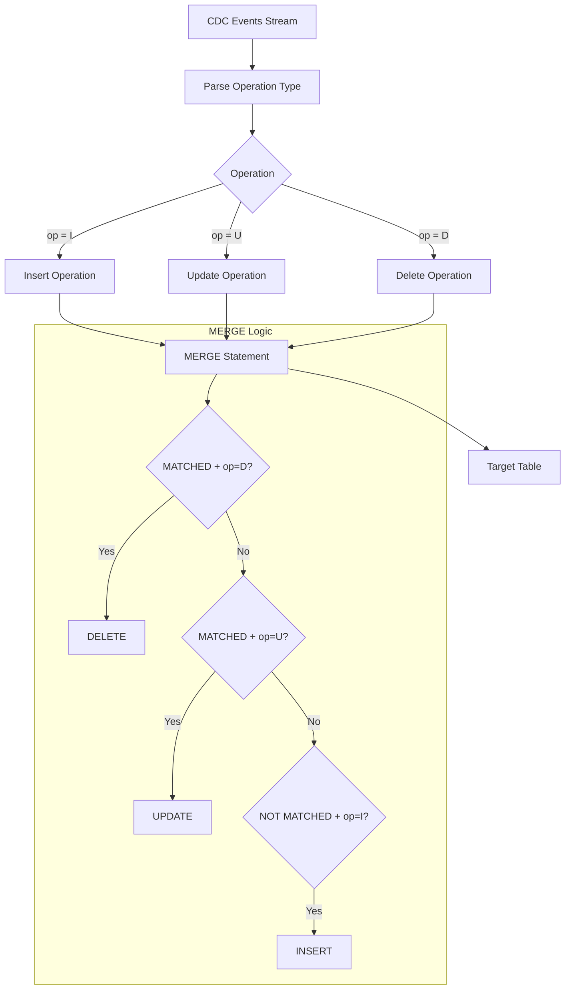
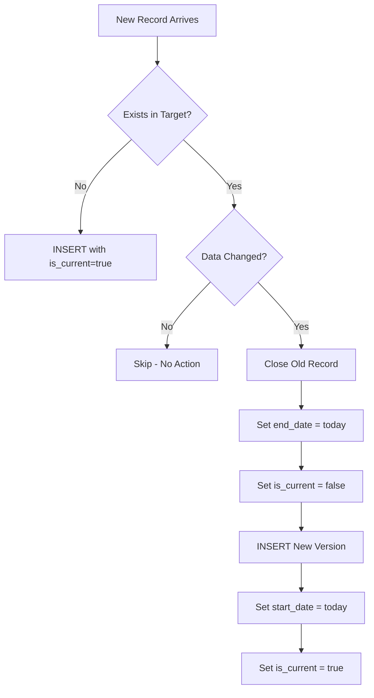

# How to Create Merge Patterns

Author: [nawazdhandala](https://github.com/nawazdhandala)

Tags: Data Pipeline, MERGE, SQL, Delta Lake

Description: Learn to create merge patterns for complex insert, update, and delete operations in a single statement.

---

The MERGE statement is one of the most powerful tools in a data engineer's toolkit. It allows you to perform insert, update, and delete operations in a single atomic statement, making it essential for building efficient data pipelines. This guide covers practical merge patterns using SQL and Apache Spark with Delta Lake.

## What Is a MERGE Statement?

A MERGE statement (also called UPSERT in some contexts) combines INSERT, UPDATE, and DELETE operations into one atomic transaction. Instead of writing three separate statements and managing transaction boundaries yourself, MERGE handles everything in a single pass.



## Basic MERGE Syntax in SQL

The standard SQL MERGE syntax follows this structure:

```sql
-- Basic MERGE pattern for upserting records
-- This handles both new records and updates to existing ones
MERGE INTO target_table AS target
USING source_table AS source
ON target.id = source.id
-- When a matching record exists, update it
WHEN MATCHED THEN
    UPDATE SET
        target.name = source.name,
        target.value = source.value,
        target.updated_at = CURRENT_TIMESTAMP
-- When no matching record exists, insert a new one
WHEN NOT MATCHED THEN
    INSERT (id, name, value, created_at, updated_at)
    VALUES (source.id, source.name, source.value, CURRENT_TIMESTAMP, CURRENT_TIMESTAMP);
```

## Understanding MATCHED and NOT MATCHED Clauses

The power of MERGE comes from its conditional clauses. Here is how they work:



### Multiple MATCHED Conditions

You can specify multiple conditions for matched records:

```sql
-- Advanced MERGE with multiple match conditions
-- This pattern handles different update scenarios based on record state
MERGE INTO inventory AS target
USING daily_shipments AS source
ON target.product_id = source.product_id
-- Update quantity if the shipment is newer than our last update
WHEN MATCHED AND source.shipment_date > target.last_updated THEN
    UPDATE SET
        target.quantity = target.quantity + source.quantity,
        target.last_updated = source.shipment_date
-- Mark as reviewed if shipment is older (already processed)
WHEN MATCHED AND source.shipment_date <= target.last_updated THEN
    UPDATE SET
        target.review_flag = TRUE
-- New products get inserted with initial quantity
WHEN NOT MATCHED THEN
    INSERT (product_id, quantity, last_updated, review_flag)
    VALUES (source.product_id, source.quantity, source.shipment_date, FALSE);
```

## Delta Lake MERGE with PySpark

Delta Lake provides powerful MERGE capabilities that work at scale. Here is how to implement merge patterns in PySpark:

```python
from delta.tables import DeltaTable
from pyspark.sql import SparkSession
from pyspark.sql.functions import col, current_timestamp, lit

# Initialize Spark session with Delta Lake support
spark = SparkSession.builder \
    .appName("MergePatterns") \
    .config("spark.sql.extensions", "io.delta.sql.DeltaSparkSessionExtension") \
    .config("spark.sql.catalog.spark_catalog", "org.apache.spark.sql.delta.catalog.DeltaCatalog") \
    .getOrCreate()

# Load the target Delta table
target_table = DeltaTable.forPath(spark, "/data/warehouse/customers")

# Load source data (could be from Kafka, files, or another table)
source_df = spark.read.parquet("/data/staging/customer_updates")

# Execute the MERGE operation
# This pattern upserts customers based on customer_id
target_table.alias("target").merge(
    source_df.alias("source"),
    # Join condition: match on customer_id
    "target.customer_id = source.customer_id"
).whenMatchedUpdate(
    # Only update if the source record is newer
    condition="source.updated_at > target.updated_at",
    set={
        "name": col("source.name"),
        "email": col("source.email"),
        "phone": col("source.phone"),
        "updated_at": col("source.updated_at")
    }
).whenNotMatchedInsert(
    values={
        "customer_id": col("source.customer_id"),
        "name": col("source.name"),
        "email": col("source.email"),
        "phone": col("source.phone"),
        "created_at": current_timestamp(),
        "updated_at": col("source.updated_at")
    }
).execute()
```

## Change Data Capture (CDC) Merge Pattern

CDC is a common pattern where you receive a stream of changes with operation types (INSERT, UPDATE, DELETE). Here is how to handle all three in a single MERGE:



### SQL CDC Merge Pattern

```sql
-- CDC MERGE pattern for handling insert, update, and delete operations
-- The source contains records with an 'operation' column: 'I', 'U', or 'D'
MERGE INTO customers AS target
USING (
    -- Deduplicate CDC events, keeping only the latest per key
    SELECT *
    FROM (
        SELECT
            *,
            ROW_NUMBER() OVER (
                PARTITION BY customer_id
                ORDER BY event_timestamp DESC
            ) AS rn
        FROM cdc_events
        WHERE event_timestamp > @last_processed_timestamp
    ) ranked
    WHERE rn = 1
) AS source
ON target.customer_id = source.customer_id

-- Handle DELETE operations: remove matching records marked for deletion
WHEN MATCHED AND source.operation = 'D' THEN
    DELETE

-- Handle UPDATE operations: update matching records
WHEN MATCHED AND source.operation = 'U' THEN
    UPDATE SET
        target.name = source.name,
        target.email = source.email,
        target.address = source.address,
        target.updated_at = source.event_timestamp

-- Handle INSERT operations: insert new records
WHEN NOT MATCHED AND source.operation = 'I' THEN
    INSERT (customer_id, name, email, address, created_at, updated_at)
    VALUES (
        source.customer_id,
        source.name,
        source.email,
        source.address,
        source.event_timestamp,
        source.event_timestamp
    );
```

### PySpark CDC Merge Pattern

```python
from delta.tables import DeltaTable
from pyspark.sql import SparkSession
from pyspark.sql.functions import col, row_number, current_timestamp
from pyspark.sql.window import Window

def process_cdc_merge(spark, target_path, cdc_df):
    """
    Process CDC events and merge them into the target Delta table.

    Args:
        spark: SparkSession instance
        target_path: Path to the target Delta table
        cdc_df: DataFrame containing CDC events with columns:
                - customer_id: Primary key
                - operation: 'I' (insert), 'U' (update), or 'D' (delete)
                - event_timestamp: When the event occurred
                - Other data columns (name, email, etc.)
    """
    # Step 1: Deduplicate CDC events
    # Keep only the latest event per customer_id
    window_spec = Window.partitionBy("customer_id").orderBy(col("event_timestamp").desc())

    deduped_df = cdc_df \
        .withColumn("rn", row_number().over(window_spec)) \
        .filter(col("rn") == 1) \
        .drop("rn")

    # Step 2: Load the target Delta table
    target_table = DeltaTable.forPath(spark, target_path)

    # Step 3: Execute the CDC MERGE
    target_table.alias("target").merge(
        deduped_df.alias("source"),
        "target.customer_id = source.customer_id"
    ).whenMatchedDelete(
        # Delete records where operation is 'D'
        condition="source.operation = 'D'"
    ).whenMatchedUpdate(
        # Update records where operation is 'U'
        condition="source.operation = 'U'",
        set={
            "name": col("source.name"),
            "email": col("source.email"),
            "address": col("source.address"),
            "updated_at": col("source.event_timestamp")
        }
    ).whenNotMatchedInsert(
        # Insert records where operation is 'I'
        condition="source.operation = 'I'",
        values={
            "customer_id": col("source.customer_id"),
            "name": col("source.name"),
            "email": col("source.email"),
            "address": col("source.address"),
            "created_at": col("source.event_timestamp"),
            "updated_at": col("source.event_timestamp")
        }
    ).execute()

# Usage example
cdc_events = spark.readStream \
    .format("kafka") \
    .option("kafka.bootstrap.servers", "localhost:9092") \
    .option("subscribe", "customer_cdc") \
    .load()

# Process each micro-batch with the CDC merge
cdc_events.writeStream \
    .foreachBatch(lambda df, epoch: process_cdc_merge(spark, "/data/customers", df)) \
    .start()
```

## Slowly Changing Dimension (SCD) Type 2 Merge

SCD Type 2 preserves historical data by creating new records instead of updating in place:



```sql
-- SCD Type 2 MERGE pattern
-- This preserves full history by versioning records instead of overwriting
-- Step 1: Close existing current records that have changed
MERGE INTO dim_customer AS target
USING (
    SELECT
        s.customer_id,
        s.name,
        s.email,
        s.address,
        s.effective_date
    FROM staging_customers s
    INNER JOIN dim_customer d
        ON s.customer_id = d.customer_id
        AND d.is_current = TRUE
    WHERE s.name != d.name
       OR s.email != d.email
       OR s.address != d.address
) AS changed_source
ON target.customer_id = changed_source.customer_id
   AND target.is_current = TRUE
-- Close the current version by setting end_date and is_current flag
WHEN MATCHED THEN
    UPDATE SET
        target.end_date = changed_source.effective_date,
        target.is_current = FALSE;

-- Step 2: Insert new versions for changed records and brand new records
INSERT INTO dim_customer (
    customer_id,
    name,
    email,
    address,
    start_date,
    end_date,
    is_current
)
SELECT
    s.customer_id,
    s.name,
    s.email,
    s.address,
    s.effective_date AS start_date,
    '9999-12-31' AS end_date,  -- Far future date for current records
    TRUE AS is_current
FROM staging_customers s
LEFT JOIN dim_customer d
    ON s.customer_id = d.customer_id
    AND d.is_current = TRUE
WHERE d.customer_id IS NULL  -- New customer
   OR s.name != d.name       -- Changed name
   OR s.email != d.email     -- Changed email
   OR s.address != d.address;  -- Changed address
```

## Performance Optimization Tips

### 1. Partition Pruning

Always include partition columns in your merge conditions when possible:

```python
# Optimized merge with partition pruning
# This reduces the amount of data scanned significantly
target_table.alias("target").merge(
    source_df.alias("source"),
    # Include partition column (date) in the join condition
    "target.customer_id = source.customer_id AND target.date = source.date"
).whenMatchedUpdateAll() \
 .whenNotMatchedInsertAll() \
 .execute()
```

### 2. Z-Ordering for Better Data Clustering

```sql
-- Optimize the target table for merge performance
-- Z-ordering clusters data by frequently joined columns
OPTIMIZE customers
ZORDER BY (customer_id);
```

### 3. Broadcast Small Tables

```python
from pyspark.sql.functions import broadcast

# When source is small, broadcast it to all executors
# This avoids expensive shuffle operations
small_source_df = spark.read.parquet("/data/small_updates")

target_table.alias("target").merge(
    broadcast(small_source_df).alias("source"),
    "target.id = source.id"
).whenMatchedUpdateAll() \
 .whenNotMatchedInsertAll() \
 .execute()
```

## Common Merge Patterns Summary

| Pattern | Use Case | Key Consideration |
|---------|----------|-------------------|
| Basic Upsert | Simple insert or update | Most common pattern |
| CDC Merge | Stream processing with operation types | Handle I/U/D flags |
| SCD Type 2 | Historical tracking | Requires two-step process |
| Conditional Update | Update only when conditions met | Add conditions to WHEN MATCHED |
| Delete Merge | Remove records from target | Use WHEN MATCHED THEN DELETE |
| Full Sync | Replace entire partitions | Combine with NOT MATCHED BY SOURCE |

## Error Handling and Idempotency

Make your merge operations idempotent to handle retries safely:

```python
def idempotent_merge(spark, target_path, source_df, watermark_path):
    """
    Perform an idempotent merge operation that can be safely retried.
    Uses a watermark to track the last successfully processed timestamp.
    """
    # Read the last processed watermark
    try:
        watermark_df = spark.read.json(watermark_path)
        last_watermark = watermark_df.collect()[0]["last_processed"]
    except Exception:
        # First run, no watermark exists
        last_watermark = "1970-01-01T00:00:00Z"

    # Filter source to only new events
    filtered_source = source_df.filter(
        col("event_timestamp") > last_watermark
    )

    # Skip if no new data
    if filtered_source.count() == 0:
        print("No new data to process")
        return

    # Get the max timestamp from this batch
    new_watermark = filtered_source.agg({"event_timestamp": "max"}).collect()[0][0]

    # Execute the merge
    target_table = DeltaTable.forPath(spark, target_path)
    target_table.alias("target").merge(
        filtered_source.alias("source"),
        "target.id = source.id"
    ).whenMatchedUpdateAll() \
     .whenNotMatchedInsertAll() \
     .execute()

    # Update the watermark only after successful merge
    spark.createDataFrame([{"last_processed": str(new_watermark)}]) \
         .write.mode("overwrite").json(watermark_path)

    print(f"Processed events up to {new_watermark}")
```

## Conclusion

MERGE patterns are essential for building robust data pipelines. The key takeaways are:

1. Use MERGE for atomic upsert operations instead of separate INSERT/UPDATE/DELETE statements
2. Leverage conditional clauses (WHEN MATCHED, WHEN NOT MATCHED) to handle complex business logic
3. For CDC pipelines, handle all operation types (I/U/D) in a single MERGE statement
4. Optimize performance with partition pruning, Z-ordering, and broadcasting small tables
5. Make your merges idempotent to handle failures and retries gracefully

Whether you are building batch ETL jobs or streaming pipelines, mastering merge patterns will help you create more efficient, maintainable, and reliable data systems.
