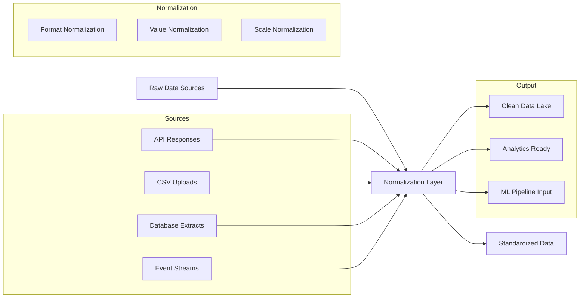
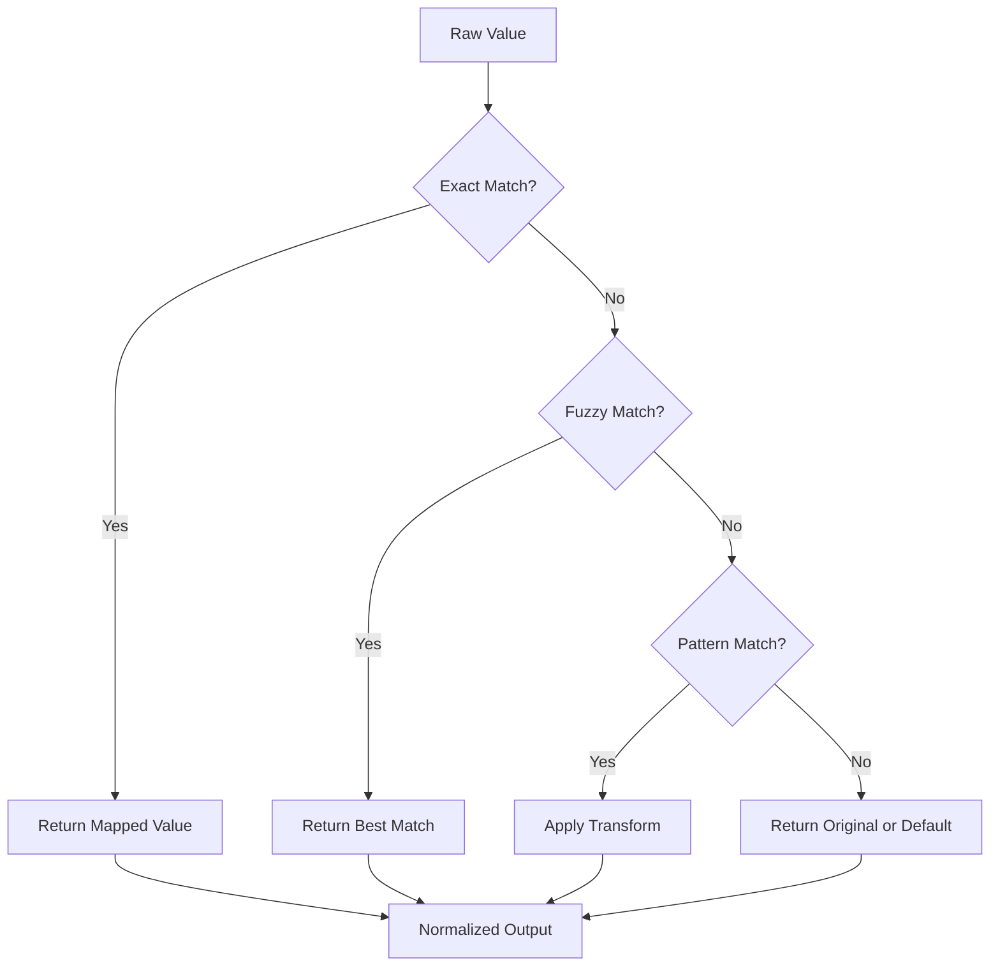
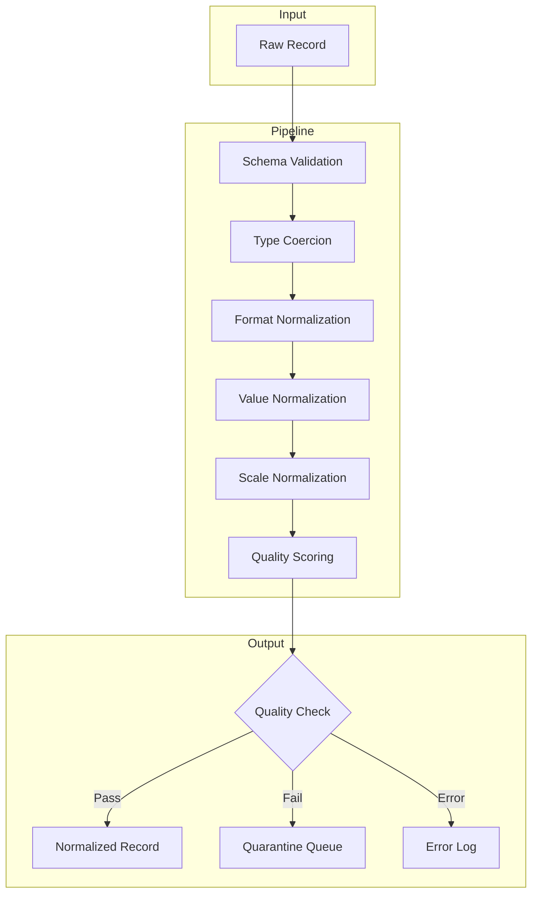

# How to Build Data Normalization

Author: [nawazdhandala](https://github.com/nawazdhandala)

Tags: Data Pipeline, Normalization, Data Modeling, ETL

Description: Learn to build data normalization for standardizing data formats and values in data pipelines.

---

Data arrives messy. Different sources send timestamps in different formats. Currency values come with or without symbols. Names appear as "JOHN DOE", "john doe", or "John Doe". Phone numbers show up as "+1-555-123-4567", "5551234567", or "(555) 123-4567".

Without normalization, your downstream analytics break. Your machine learning models produce garbage. Your reports become unreliable. Data normalization transforms this chaos into consistency.

This guide walks you through building robust data normalization layers for production data pipelines.

## What is Data Normalization?

Data normalization is the process of transforming raw data into a standardized format. It ensures consistency across different data sources, making downstream processing reliable and predictable.



Normalization differs from validation. Validation rejects bad data. Normalization transforms data into an acceptable form when possible.

## The Three Types of Normalization

### 1. Format Normalization

Format normalization standardizes how data is represented structurally.

**Dates and Timestamps**

```python
from datetime import datetime
from typing import Optional
import re

class DateNormalizer:
    """
    Normalizes various date formats to ISO 8601 standard.
    Handles common formats from different data sources.
    """

    # Define patterns for common date formats
    PATTERNS = [
        # ISO format: 2024-01-15T10:30:00Z
        (r'^\d{4}-\d{2}-\d{2}T\d{2}:\d{2}:\d{2}', '%Y-%m-%dT%H:%M:%S'),
        # US format: 01/15/2024
        (r'^\d{2}/\d{2}/\d{4}$', '%m/%d/%Y'),
        # European format: 15-01-2024
        (r'^\d{2}-\d{2}-\d{4}$', '%d-%m-%Y'),
        # Written format: January 15, 2024
        (r'^[A-Za-z]+ \d{1,2}, \d{4}$', '%B %d, %Y'),
        # Compact format: 20240115
        (r'^\d{8}$', '%Y%m%d'),
        # Unix timestamp (seconds)
        (r'^\d{10}$', 'unix_seconds'),
        # Unix timestamp (milliseconds)
        (r'^\d{13}$', 'unix_millis'),
    ]

    def normalize(self, value: str) -> Optional[str]:
        """
        Convert any recognized date format to ISO 8601.

        Args:
            value: Raw date string from source system

        Returns:
            ISO 8601 formatted string or None if unparseable
        """
        if not value or not isinstance(value, str):
            return None

        value = value.strip()

        for pattern, fmt in self.PATTERNS:
            if re.match(pattern, value):
                try:
                    if fmt == 'unix_seconds':
                        # Handle Unix timestamp in seconds
                        dt = datetime.fromtimestamp(int(value))
                    elif fmt == 'unix_millis':
                        # Handle Unix timestamp in milliseconds
                        dt = datetime.fromtimestamp(int(value) / 1000)
                    else:
                        # Handle standard datetime formats
                        # Strip timezone indicator if present
                        clean_value = value.rstrip('Z')
                        dt = datetime.strptime(clean_value, fmt)

                    # Return standardized ISO format
                    return dt.strftime('%Y-%m-%dT%H:%M:%S')
                except (ValueError, OSError):
                    continue

        return None  # Could not parse the date


# Usage example
normalizer = DateNormalizer()

test_dates = [
    "2024-01-15T10:30:00Z",
    "01/15/2024",
    "15-01-2024",
    "January 15, 2024",
    "20240115",
    "1705312200",       # Unix seconds
    "1705312200000",    # Unix milliseconds
]

for date_str in test_dates:
    result = normalizer.normalize(date_str)
    print(f"{date_str:25} -> {result}")
```

**Phone Numbers**

```python
import re
from typing import Optional, Dict

class PhoneNormalizer:
    """
    Normalizes phone numbers to E.164 international format.
    Handles various input formats from different regions.
    """

    # Country code mappings for common formats
    COUNTRY_CODES: Dict[str, str] = {
        'US': '+1',
        'UK': '+44',
        'DE': '+49',
        'FR': '+33',
        'IN': '+91',
    }

    def __init__(self, default_country: str = 'US'):
        """
        Initialize with a default country for numbers without country codes.

        Args:
            default_country: ISO country code for numbers without prefix
        """
        self.default_country = default_country

    def normalize(self, phone: str) -> Optional[str]:
        """
        Convert phone number to E.164 format (+[country][number]).

        Args:
            phone: Raw phone number string

        Returns:
            E.164 formatted phone number or None if invalid
        """
        if not phone:
            return None

        # Remove all non-digit characters except leading +
        has_plus = phone.strip().startswith('+')
        digits = re.sub(r'\D', '', phone)

        if not digits:
            return None

        # Handle numbers that already have country code
        if has_plus:
            # Assume the digits include the country code
            return f'+{digits}'

        # Handle US numbers (10 digits)
        if len(digits) == 10:
            country_code = self.COUNTRY_CODES.get(self.default_country, '+1')
            return f'{country_code}{digits}'

        # Handle US numbers with leading 1 (11 digits)
        if len(digits) == 11 and digits.startswith('1'):
            return f'+{digits}'

        # For other lengths, assume digits are complete with country code
        if len(digits) > 10:
            return f'+{digits}'

        return None  # Invalid phone number length


# Usage example
normalizer = PhoneNormalizer(default_country='US')

test_phones = [
    "+1-555-123-4567",
    "(555) 123-4567",
    "555.123.4567",
    "5551234567",
    "1-800-555-0199",
    "+44 20 7946 0958",
]

for phone in test_phones:
    result = normalizer.normalize(phone)
    print(f"{phone:20} -> {result}")
```

### 2. Value Normalization

Value normalization standardizes the actual content of data fields using lookup tables and mapping rules.



**Lookup Table Implementation**

```python
from typing import Dict, Optional, List, Tuple
from difflib import SequenceMatcher

class LookupNormalizer:
    """
    Normalizes values using lookup tables with fuzzy matching support.
    Useful for standardizing categories, status codes, and enumerated values.
    """

    def __init__(
        self,
        mappings: Dict[str, str],
        case_sensitive: bool = False,
        fuzzy_threshold: float = 0.85
    ):
        """
        Initialize the normalizer with a mapping dictionary.

        Args:
            mappings: Dictionary mapping raw values to normalized values
            case_sensitive: Whether to match case exactly
            fuzzy_threshold: Minimum similarity score for fuzzy matching (0-1)
        """
        self.case_sensitive = case_sensitive
        self.fuzzy_threshold = fuzzy_threshold

        # Build the lookup table
        if case_sensitive:
            self.mappings = mappings.copy()
        else:
            # Store lowercase keys for case-insensitive matching
            self.mappings = {k.lower(): v for k, v in mappings.items()}

    def _get_key(self, value: str) -> str:
        """Normalize key for lookup based on case sensitivity setting."""
        return value if self.case_sensitive else value.lower()

    def _fuzzy_match(self, value: str) -> Optional[Tuple[str, float]]:
        """
        Find the best fuzzy match for a value.

        Returns:
            Tuple of (matched_value, similarity_score) or None
        """
        best_match = None
        best_score = 0.0

        search_value = self._get_key(value)

        for key in self.mappings.keys():
            # Calculate similarity using SequenceMatcher
            score = SequenceMatcher(None, search_value, key).ratio()

            if score > best_score and score >= self.fuzzy_threshold:
                best_score = score
                best_match = key

        if best_match:
            return (self.mappings[best_match], best_score)
        return None

    def normalize(
        self,
        value: str,
        default: Optional[str] = None,
        use_fuzzy: bool = True
    ) -> Optional[str]:
        """
        Normalize a value using the lookup table.

        Args:
            value: Raw value to normalize
            default: Value to return if no match found
            use_fuzzy: Whether to attempt fuzzy matching

        Returns:
            Normalized value, default, or None
        """
        if not value:
            return default

        # Try exact match first
        lookup_key = self._get_key(value.strip())
        if lookup_key in self.mappings:
            return self.mappings[lookup_key]

        # Try fuzzy match if enabled
        if use_fuzzy:
            fuzzy_result = self._fuzzy_match(value.strip())
            if fuzzy_result:
                return fuzzy_result[0]

        return default


# Example: Country name normalization
country_mappings = {
    # Standard names
    'united states': 'US',
    'united states of america': 'US',
    'usa': 'US',
    'america': 'US',
    'united kingdom': 'GB',
    'great britain': 'GB',
    'uk': 'GB',
    'england': 'GB',
    'germany': 'DE',
    'deutschland': 'DE',
    'france': 'FR',
    'canada': 'CA',
    'australia': 'AU',
    'india': 'IN',
}

country_normalizer = LookupNormalizer(country_mappings, fuzzy_threshold=0.8)

test_countries = [
    "United States",
    "USA",
    "U.S.A.",
    "United Staets",    # Typo - fuzzy match
    "Great Britain",
    "Deutschland",
    "Frnace",           # Typo - fuzzy match
]

print("Country Normalization:")
for country in test_countries:
    result = country_normalizer.normalize(country, default='UNKNOWN')
    print(f"  {country:20} -> {result}")
```

**Status Code Normalization**

```python
class StatusNormalizer:
    """
    Normalizes various status representations to a standard set.
    Handles multiple input formats from different source systems.
    """

    # Define canonical status values and their aliases
    STATUS_MAPPINGS = {
        # Active statuses
        'ACTIVE': ['active', 'enabled', 'on', 'yes', 'true', '1', 'live', 'running'],
        # Inactive statuses
        'INACTIVE': ['inactive', 'disabled', 'off', 'no', 'false', '0', 'stopped'],
        # Pending statuses
        'PENDING': ['pending', 'waiting', 'queued', 'processing', 'in_progress'],
        # Completed statuses
        'COMPLETED': ['completed', 'done', 'finished', 'success', 'successful'],
        # Failed statuses
        'FAILED': ['failed', 'error', 'failure', 'unsuccessful', 'rejected'],
        # Cancelled statuses
        'CANCELLED': ['cancelled', 'canceled', 'aborted', 'terminated', 'stopped'],
    }

    def __init__(self):
        """Build reverse lookup from aliases to canonical values."""
        self._lookup = {}
        for canonical, aliases in self.STATUS_MAPPINGS.items():
            for alias in aliases:
                self._lookup[alias.lower()] = canonical

    def normalize(self, status: str, default: str = 'UNKNOWN') -> str:
        """
        Convert any status representation to canonical form.

        Args:
            status: Raw status value from source system
            default: Value to return if status is not recognized

        Returns:
            Canonical status string
        """
        if not status:
            return default

        # Clean and lowercase for lookup
        clean_status = status.strip().lower().replace('-', '_').replace(' ', '_')

        return self._lookup.get(clean_status, default)


# Usage example
status_norm = StatusNormalizer()

test_statuses = [
    "active",
    "ENABLED",
    "In Progress",
    "success",
    "CANCELED",
    "true",
    "1",
]

print("\nStatus Normalization:")
for status in test_statuses:
    result = status_norm.normalize(status)
    print(f"  {status:15} -> {result}")
```

### 3. Scale Normalization

Scale normalization transforms numeric data to consistent ranges or units. This is critical for machine learning pipelines and cross-source analytics.

```python
from typing import List, Tuple, Optional
from dataclasses import dataclass
import math

@dataclass
class ScaleConfig:
    """Configuration for scale normalization."""
    min_val: float = 0.0
    max_val: float = 1.0


class ScaleNormalizer:
    """
    Normalizes numeric values to standard scales.
    Supports min-max scaling, z-score standardization, and unit conversion.
    """

    # Unit conversion factors to base units
    UNIT_CONVERSIONS = {
        # Length to meters
        'length': {
            'm': 1.0,
            'km': 1000.0,
            'cm': 0.01,
            'mm': 0.001,
            'ft': 0.3048,
            'in': 0.0254,
            'mi': 1609.34,
        },
        # Weight to kilograms
        'weight': {
            'kg': 1.0,
            'g': 0.001,
            'mg': 0.000001,
            'lb': 0.453592,
            'oz': 0.0283495,
        },
        # Temperature (special handling needed)
        'temperature': {
            'c': 'celsius',
            'f': 'fahrenheit',
            'k': 'kelvin',
        },
        # Currency to USD (example rates - use live rates in production)
        'currency': {
            'usd': 1.0,
            'eur': 1.08,
            'gbp': 1.27,
            'jpy': 0.0067,
            'inr': 0.012,
        },
    }

    def min_max_scale(
        self,
        value: float,
        data_min: float,
        data_max: float,
        target_min: float = 0.0,
        target_max: float = 1.0
    ) -> float:
        """
        Scale value to target range using min-max normalization.

        Formula: (value - min) / (max - min) * (target_max - target_min) + target_min

        Args:
            value: The value to normalize
            data_min: Minimum value in the dataset
            data_max: Maximum value in the dataset
            target_min: Desired minimum of output range
            target_max: Desired maximum of output range

        Returns:
            Scaled value in target range
        """
        if data_max == data_min:
            # Avoid division by zero
            return (target_max + target_min) / 2

        # Apply min-max scaling formula
        scaled = (value - data_min) / (data_max - data_min)
        return scaled * (target_max - target_min) + target_min

    def z_score(
        self,
        value: float,
        mean: float,
        std_dev: float
    ) -> float:
        """
        Standardize value using z-score normalization.

        Formula: (value - mean) / standard_deviation

        Args:
            value: The value to standardize
            mean: Mean of the dataset
            std_dev: Standard deviation of the dataset

        Returns:
            Z-score (number of standard deviations from mean)
        """
        if std_dev == 0:
            return 0.0

        return (value - mean) / std_dev

    def convert_unit(
        self,
        value: float,
        from_unit: str,
        to_unit: str,
        unit_type: str
    ) -> Optional[float]:
        """
        Convert value between units of the same type.

        Args:
            value: Numeric value to convert
            from_unit: Source unit abbreviation
            to_unit: Target unit abbreviation
            unit_type: Category of units (length, weight, currency, etc.)

        Returns:
            Converted value or None if conversion not possible
        """
        if unit_type not in self.UNIT_CONVERSIONS:
            return None

        conversions = self.UNIT_CONVERSIONS[unit_type]
        from_unit = from_unit.lower()
        to_unit = to_unit.lower()

        # Special handling for temperature
        if unit_type == 'temperature':
            return self._convert_temperature(value, from_unit, to_unit)

        if from_unit not in conversions or to_unit not in conversions:
            return None

        # Convert to base unit, then to target unit
        base_value = value * conversions[from_unit]
        return base_value / conversions[to_unit]

    def _convert_temperature(
        self,
        value: float,
        from_unit: str,
        to_unit: str
    ) -> Optional[float]:
        """Handle temperature conversions which are not simple multiplications."""
        # Convert to Celsius first
        if from_unit == 'f':
            celsius = (value - 32) * 5 / 9
        elif from_unit == 'k':
            celsius = value - 273.15
        elif from_unit == 'c':
            celsius = value
        else:
            return None

        # Convert from Celsius to target
        if to_unit == 'c':
            return celsius
        elif to_unit == 'f':
            return celsius * 9 / 5 + 32
        elif to_unit == 'k':
            return celsius + 273.15
        else:
            return None

    def log_scale(self, value: float, base: float = 10) -> Optional[float]:
        """
        Apply logarithmic scaling for values with large ranges.

        Args:
            value: Value to transform (must be positive)
            base: Logarithm base (default 10)

        Returns:
            Log-scaled value or None if value is not positive
        """
        if value <= 0:
            return None

        return math.log(value, base)


# Usage examples
scaler = ScaleNormalizer()

# Min-max scaling example
print("Min-Max Scaling (0-100 to 0-1):")
raw_scores = [25, 50, 75, 100, 0]
for score in raw_scores:
    scaled = scaler.min_max_scale(score, data_min=0, data_max=100)
    print(f"  {score:3} -> {scaled:.2f}")

# Unit conversion examples
print("\nUnit Conversions:")
print(f"  100 km to miles: {scaler.convert_unit(100, 'km', 'mi', 'length'):.2f}")
print(f"  150 lbs to kg: {scaler.convert_unit(150, 'lb', 'kg', 'weight'):.2f}")
print(f"  98.6 F to C: {scaler.convert_unit(98.6, 'f', 'c', 'temperature'):.1f}")
print(f"  100 EUR to USD: {scaler.convert_unit(100, 'eur', 'usd', 'currency'):.2f}")
```

## Building a Complete Normalization Pipeline

Now let us combine these techniques into a production-ready normalization pipeline.



```python
from dataclasses import dataclass, field
from typing import Dict, Any, List, Optional, Callable
from datetime import datetime
import json

@dataclass
class NormalizationResult:
    """Result of normalizing a single record."""
    success: bool
    normalized_data: Dict[str, Any]
    original_data: Dict[str, Any]
    quality_score: float
    issues: List[str] = field(default_factory=list)
    transformations: List[str] = field(default_factory=list)


@dataclass
class FieldConfig:
    """Configuration for normalizing a single field."""
    field_name: str
    field_type: str  # 'string', 'date', 'phone', 'number', 'enum'
    required: bool = False
    default: Any = None
    normalizer: Optional[Callable] = None
    lookup_table: Optional[Dict[str, str]] = None
    scale_config: Optional[Dict[str, float]] = None


class DataNormalizationPipeline:
    """
    Complete data normalization pipeline for ETL workflows.
    Handles format, value, and scale normalization with quality tracking.
    """

    def __init__(self, field_configs: List[FieldConfig]):
        """
        Initialize the pipeline with field configurations.

        Args:
            field_configs: List of FieldConfig objects defining normalization rules
        """
        self.field_configs = {cfg.field_name: cfg for cfg in field_configs}

        # Initialize specialized normalizers
        self.date_normalizer = DateNormalizer()
        self.phone_normalizer = PhoneNormalizer()
        self.scale_normalizer = ScaleNormalizer()

    def normalize_record(self, record: Dict[str, Any]) -> NormalizationResult:
        """
        Normalize a single data record according to configured rules.

        Args:
            record: Raw data record as dictionary

        Returns:
            NormalizationResult with normalized data and metadata
        """
        normalized = {}
        issues = []
        transformations = []
        fields_processed = 0
        fields_successful = 0

        for field_name, config in self.field_configs.items():
            raw_value = record.get(field_name)

            # Handle missing required fields
            if raw_value is None or raw_value == '':
                if config.required:
                    issues.append(f"Missing required field: {field_name}")
                    normalized[field_name] = config.default
                else:
                    normalized[field_name] = config.default
                continue

            fields_processed += 1

            try:
                # Apply type-specific normalization
                norm_value = self._normalize_field(raw_value, config)

                if norm_value is not None:
                    normalized[field_name] = norm_value
                    fields_successful += 1

                    # Track if transformation occurred
                    if str(norm_value) != str(raw_value):
                        transformations.append(
                            f"{field_name}: '{raw_value}' -> '{norm_value}'"
                        )
                else:
                    # Normalization returned None - use default
                    normalized[field_name] = config.default
                    issues.append(
                        f"Could not normalize {field_name}: '{raw_value}'"
                    )

            except Exception as e:
                issues.append(f"Error normalizing {field_name}: {str(e)}")
                normalized[field_name] = config.default

        # Calculate quality score
        quality_score = (
            fields_successful / fields_processed
            if fields_processed > 0
            else 0.0
        )

        return NormalizationResult(
            success=len(issues) == 0,
            normalized_data=normalized,
            original_data=record,
            quality_score=quality_score,
            issues=issues,
            transformations=transformations
        )

    def _normalize_field(
        self,
        value: Any,
        config: FieldConfig
    ) -> Optional[Any]:
        """Apply appropriate normalization based on field type."""

        # Use custom normalizer if provided
        if config.normalizer:
            return config.normalizer(value)

        # Type-specific normalization
        if config.field_type == 'date':
            return self.date_normalizer.normalize(str(value))

        elif config.field_type == 'phone':
            return self.phone_normalizer.normalize(str(value))

        elif config.field_type == 'enum' and config.lookup_table:
            normalizer = LookupNormalizer(config.lookup_table)
            return normalizer.normalize(str(value), default=config.default)

        elif config.field_type == 'number':
            # Convert to float and optionally scale
            try:
                num_value = float(value)

                if config.scale_config:
                    return self.scale_normalizer.min_max_scale(
                        num_value,
                        data_min=config.scale_config.get('min', 0),
                        data_max=config.scale_config.get('max', 100),
                        target_min=config.scale_config.get('target_min', 0),
                        target_max=config.scale_config.get('target_max', 1)
                    )
                return num_value
            except (ValueError, TypeError):
                return None

        elif config.field_type == 'string':
            # Basic string normalization: strip whitespace, normalize case
            return str(value).strip()

        return value

    def normalize_batch(
        self,
        records: List[Dict[str, Any]],
        min_quality: float = 0.7
    ) -> Dict[str, List]:
        """
        Normalize a batch of records with quality filtering.

        Args:
            records: List of raw data records
            min_quality: Minimum quality score to accept record

        Returns:
            Dictionary with 'accepted', 'rejected', and 'stats' keys
        """
        accepted = []
        rejected = []
        total_quality = 0.0

        for record in records:
            result = self.normalize_record(record)
            total_quality += result.quality_score

            if result.quality_score >= min_quality:
                accepted.append(result.normalized_data)
            else:
                rejected.append({
                    'original': result.original_data,
                    'issues': result.issues,
                    'quality_score': result.quality_score
                })

        return {
            'accepted': accepted,
            'rejected': rejected,
            'stats': {
                'total_records': len(records),
                'accepted_count': len(accepted),
                'rejected_count': len(rejected),
                'acceptance_rate': len(accepted) / len(records) if records else 0,
                'average_quality': total_quality / len(records) if records else 0
            }
        }


# Example usage: Customer data normalization pipeline
customer_config = [
    FieldConfig(
        field_name='customer_id',
        field_type='string',
        required=True
    ),
    FieldConfig(
        field_name='full_name',
        field_type='string',
        required=True
    ),
    FieldConfig(
        field_name='email',
        field_type='string',
        required=True,
        normalizer=lambda x: x.lower().strip() if x else None
    ),
    FieldConfig(
        field_name='phone',
        field_type='phone',
        required=False
    ),
    FieldConfig(
        field_name='signup_date',
        field_type='date',
        required=True
    ),
    FieldConfig(
        field_name='country',
        field_type='enum',
        lookup_table=country_mappings,
        default='UNKNOWN'
    ),
    FieldConfig(
        field_name='status',
        field_type='enum',
        lookup_table={
            'active': 'ACTIVE',
            'enabled': 'ACTIVE',
            'inactive': 'INACTIVE',
            'disabled': 'INACTIVE',
            'pending': 'PENDING',
        },
        default='PENDING'
    ),
    FieldConfig(
        field_name='credit_score',
        field_type='number',
        scale_config={'min': 300, 'max': 850, 'target_min': 0, 'target_max': 1}
    ),
]

# Create pipeline
pipeline = DataNormalizationPipeline(customer_config)

# Sample raw data
raw_customers = [
    {
        'customer_id': 'CUST001',
        'full_name': '  John Doe  ',
        'email': 'JOHN.DOE@EXAMPLE.COM',
        'phone': '(555) 123-4567',
        'signup_date': '01/15/2024',
        'country': 'United States',
        'status': 'enabled',
        'credit_score': 720,
    },
    {
        'customer_id': 'CUST002',
        'full_name': 'Jane Smith',
        'email': 'jane@example.com',
        'phone': '+44 20 7946 0958',
        'signup_date': '2024-01-20T14:30:00Z',
        'country': 'Great Britain',
        'status': 'active',
        'credit_score': 680,
    },
    {
        'customer_id': 'CUST003',
        'full_name': 'Hans Mueller',
        'email': 'hans@example.de',
        'phone': '',
        'signup_date': 'January 25, 2024',
        'country': 'Deutschland',
        'status': 'pending',
        'credit_score': 550,
    },
]

# Process batch
results = pipeline.normalize_batch(raw_customers, min_quality=0.7)

print("\n" + "="*60)
print("NORMALIZATION PIPELINE RESULTS")
print("="*60)

print(f"\nStatistics:")
print(f"  Total Records: {results['stats']['total_records']}")
print(f"  Accepted: {results['stats']['accepted_count']}")
print(f"  Rejected: {results['stats']['rejected_count']}")
print(f"  Acceptance Rate: {results['stats']['acceptance_rate']:.1%}")
print(f"  Average Quality: {results['stats']['average_quality']:.2f}")

print(f"\nAccepted Records:")
for record in results['accepted']:
    print(f"  {json.dumps(record, indent=4)}")
```

## Handling Edge Cases

Production pipelines must handle edge cases gracefully.

```python
class RobustNormalizer:
    """
    Normalizer with comprehensive edge case handling.
    Designed for production data pipelines with messy input.
    """

    # Common null representations across different systems
    NULL_VALUES = {
        '', 'null', 'none', 'nil', 'na', 'n/a', '-', '--',
        'undefined', 'missing', '#n/a', '#null!', '\\n'
    }

    @staticmethod
    def is_null(value: Any) -> bool:
        """
        Check if a value represents null/missing data.

        Handles various null representations from different source systems.
        """
        if value is None:
            return True

        if isinstance(value, str):
            return value.strip().lower() in RobustNormalizer.NULL_VALUES

        if isinstance(value, float) and math.isnan(value):
            return True

        return False

    @staticmethod
    def safe_string(value: Any, max_length: int = 1000) -> Optional[str]:
        """
        Safely convert value to string with length limit.

        Args:
            value: Any value to convert
            max_length: Maximum allowed string length

        Returns:
            Cleaned string or None
        """
        if RobustNormalizer.is_null(value):
            return None

        try:
            # Convert to string
            str_value = str(value).strip()

            # Remove control characters
            str_value = ''.join(
                char for char in str_value
                if ord(char) >= 32 or char in '\n\t'
            )

            # Truncate if too long
            if len(str_value) > max_length:
                str_value = str_value[:max_length - 3] + '...'

            return str_value if str_value else None

        except Exception:
            return None

    @staticmethod
    def safe_number(
        value: Any,
        min_val: Optional[float] = None,
        max_val: Optional[float] = None,
        default: Optional[float] = None
    ) -> Optional[float]:
        """
        Safely convert value to number with bounds checking.

        Args:
            value: Value to convert
            min_val: Minimum allowed value
            max_val: Maximum allowed value
            default: Default value if conversion fails

        Returns:
            Numeric value within bounds, or default
        """
        if RobustNormalizer.is_null(value):
            return default

        try:
            # Handle string numbers with currency symbols, commas, etc.
            if isinstance(value, str):
                # Remove common formatting characters
                clean = value.strip()
                clean = clean.replace(',', '')  # Remove thousands separator
                clean = clean.replace('$', '')  # Remove currency symbols
                clean = clean.replace('EUR', '').replace('USD', '')
                clean = clean.replace('%', '')  # Remove percentage
                clean = clean.strip()

                num = float(clean)
            else:
                num = float(value)

            # Check for infinity
            if math.isinf(num):
                return default

            # Apply bounds
            if min_val is not None and num < min_val:
                return min_val
            if max_val is not None and num > max_val:
                return max_val

            return num

        except (ValueError, TypeError):
            return default

    @staticmethod
    def normalize_email(email: str) -> Optional[str]:
        """
        Normalize and validate email address.

        Applies standard normalization rules:
        - Lowercase the entire address
        - Strip whitespace
        - Remove plus addressing (optional)
        """
        if RobustNormalizer.is_null(email):
            return None

        try:
            email = str(email).strip().lower()

            # Basic format validation
            if '@' not in email or '.' not in email.split('@')[-1]:
                return None

            # Split into local and domain parts
            local, domain = email.rsplit('@', 1)

            # Remove leading/trailing dots from local part
            local = local.strip('.')

            # Reconstruct
            normalized = f"{local}@{domain}"

            # Length check
            if len(normalized) > 254:
                return None

            return normalized

        except Exception:
            return None


# Example: Edge case handling
robust = RobustNormalizer()

edge_cases = [
    # Null variations
    ("String null", robust.safe_string("NULL")),
    ("Empty string", robust.safe_string("")),
    ("Whitespace", robust.safe_string("   ")),

    # Number edge cases
    ("Currency string", robust.safe_number("$1,234.56")),
    ("Percentage", robust.safe_number("85%")),
    ("Out of bounds", robust.safe_number(150, max_val=100)),
    ("Invalid number", robust.safe_number("not a number", default=0)),

    # Email edge cases
    ("Valid email", robust.normalize_email("  TEST@Example.COM  ")),
    ("Invalid email", robust.normalize_email("not-an-email")),
]

print("\nEdge Case Handling:")
for name, result in edge_cases:
    print(f"  {name:20}: {result}")
```

## Integration with Data Pipeline Frameworks

Here is how to integrate normalization into popular pipeline frameworks.

**Apache Beam / Dataflow**

```python
# Apache Beam integration example
import apache_beam as beam
from apache_beam.options.pipeline_options import PipelineOptions

class NormalizeRecordFn(beam.DoFn):
    """
    Beam DoFn for normalizing records in a streaming pipeline.
    Stateless transformation suitable for parallel processing.
    """

    def __init__(self, field_configs):
        self.field_configs = field_configs
        self.pipeline = None

    def setup(self):
        """Initialize normalizer once per worker."""
        self.pipeline = DataNormalizationPipeline(self.field_configs)

    def process(self, record):
        """
        Process a single record through normalization.

        Yields:
            Tuple of (status, data) where status is 'accepted' or 'rejected'
        """
        result = self.pipeline.normalize_record(record)

        if result.quality_score >= 0.7:
            yield beam.pvalue.TaggedOutput('accepted', result.normalized_data)
        else:
            yield beam.pvalue.TaggedOutput('rejected', {
                'original': record,
                'issues': result.issues
            })


def run_beam_pipeline(input_path, output_path, field_configs):
    """
    Run a Beam pipeline with normalization.

    Args:
        input_path: Path to input data (JSON lines)
        output_path: Base path for output files
        field_configs: List of FieldConfig objects
    """
    options = PipelineOptions()

    with beam.Pipeline(options=options) as p:
        # Read input data
        records = (
            p
            | 'ReadInput' >> beam.io.ReadFromText(input_path)
            | 'ParseJSON' >> beam.Map(json.loads)
        )

        # Apply normalization with multiple outputs
        normalized = (
            records
            | 'Normalize' >> beam.ParDo(
                NormalizeRecordFn(field_configs)
            ).with_outputs('accepted', 'rejected')
        )

        # Write accepted records
        (
            normalized.accepted
            | 'FormatAccepted' >> beam.Map(json.dumps)
            | 'WriteAccepted' >> beam.io.WriteToText(
                f'{output_path}/accepted'
            )
        )

        # Write rejected records for review
        (
            normalized.rejected
            | 'FormatRejected' >> beam.Map(json.dumps)
            | 'WriteRejected' >> beam.io.WriteToText(
                f'{output_path}/rejected'
            )
        )
```

**PySpark Integration**

```python
# PySpark integration example
from pyspark.sql import SparkSession
from pyspark.sql.functions import udf, col
from pyspark.sql.types import StringType, StructType, StructField

def create_spark_normalizer(field_configs):
    """
    Create a broadcast-friendly normalizer for Spark.

    Returns UDF functions for use in Spark DataFrames.
    """

    # Create normalizer instances
    date_norm = DateNormalizer()
    phone_norm = PhoneNormalizer()

    # Define UDFs for each normalization type
    @udf(returnType=StringType())
    def normalize_date_udf(value):
        if value is None:
            return None
        return date_norm.normalize(str(value))

    @udf(returnType=StringType())
    def normalize_phone_udf(value):
        if value is None:
            return None
        return phone_norm.normalize(str(value))

    @udf(returnType=StringType())
    def normalize_email_udf(value):
        if value is None:
            return None
        return RobustNormalizer.normalize_email(value)

    return {
        'date': normalize_date_udf,
        'phone': normalize_phone_udf,
        'email': normalize_email_udf,
    }


def apply_spark_normalization(df, normalizers, column_types):
    """
    Apply normalization to a Spark DataFrame.

    Args:
        df: Input Spark DataFrame
        normalizers: Dictionary of UDF normalizers
        column_types: Dictionary mapping column names to normalizer types

    Returns:
        DataFrame with normalized columns
    """
    for column_name, norm_type in column_types.items():
        if norm_type in normalizers and column_name in df.columns:
            df = df.withColumn(
                column_name,
                normalizers[norm_type](col(column_name))
            )

    return df


# Usage example:
# spark = SparkSession.builder.appName("Normalization").getOrCreate()
# normalizers = create_spark_normalizer(customer_config)
#
# column_types = {
#     'signup_date': 'date',
#     'phone': 'phone',
#     'email': 'email',
# }
#
# normalized_df = apply_spark_normalization(raw_df, normalizers, column_types)
```

## Monitoring and Observability

Track normalization quality metrics in production.

```python
from dataclasses import dataclass
from datetime import datetime
from typing import Dict, List
import time

@dataclass
class NormalizationMetrics:
    """Metrics collected during normalization processing."""
    timestamp: datetime
    total_records: int
    successful_records: int
    failed_records: int
    average_quality_score: float
    processing_time_ms: float
    field_success_rates: Dict[str, float]
    common_issues: List[str]


class MetricsCollector:
    """
    Collects and reports normalization pipeline metrics.
    Integrates with observability platforms like OneUptime.
    """

    def __init__(self):
        self.batch_metrics: List[NormalizationMetrics] = []
        self.field_failures: Dict[str, int] = {}
        self.issue_counts: Dict[str, int] = {}

    def record_batch(
        self,
        results: Dict[str, List],
        processing_time_ms: float
    ) -> NormalizationMetrics:
        """
        Record metrics for a processed batch.

        Args:
            results: Output from normalize_batch()
            processing_time_ms: Time taken to process batch

        Returns:
            NormalizationMetrics for this batch
        """
        stats = results['stats']

        # Calculate field-level success rates from rejected records
        field_failures = {}
        for rejected in results['rejected']:
            for issue in rejected['issues']:
                # Extract field name from issue message
                if ':' in issue:
                    field = issue.split(':')[0].split()[-1]
                    field_failures[field] = field_failures.get(field, 0) + 1

        # Track common issues
        for rejected in results['rejected']:
            for issue in rejected['issues']:
                self.issue_counts[issue] = self.issue_counts.get(issue, 0) + 1

        # Get top 5 most common issues
        sorted_issues = sorted(
            self.issue_counts.items(),
            key=lambda x: x[1],
            reverse=True
        )[:5]

        metrics = NormalizationMetrics(
            timestamp=datetime.utcnow(),
            total_records=stats['total_records'],
            successful_records=stats['accepted_count'],
            failed_records=stats['rejected_count'],
            average_quality_score=stats['average_quality'],
            processing_time_ms=processing_time_ms,
            field_success_rates={
                field: 1 - (count / stats['total_records'])
                for field, count in field_failures.items()
            },
            common_issues=[issue for issue, count in sorted_issues]
        )

        self.batch_metrics.append(metrics)
        return metrics

    def get_summary(self) -> Dict[str, Any]:
        """Get summary statistics across all batches."""
        if not self.batch_metrics:
            return {}

        total_records = sum(m.total_records for m in self.batch_metrics)
        total_successful = sum(m.successful_records for m in self.batch_metrics)

        return {
            'total_batches': len(self.batch_metrics),
            'total_records_processed': total_records,
            'overall_success_rate': total_successful / total_records if total_records else 0,
            'average_quality_score': sum(m.average_quality_score for m in self.batch_metrics) / len(self.batch_metrics),
            'average_processing_time_ms': sum(m.processing_time_ms for m in self.batch_metrics) / len(self.batch_metrics),
            'top_issues': sorted(
                self.issue_counts.items(),
                key=lambda x: x[1],
                reverse=True
            )[:10]
        }

    def export_for_monitoring(self) -> Dict[str, Any]:
        """
        Export metrics in a format suitable for observability platforms.

        Returns format compatible with OpenTelemetry metrics.
        """
        summary = self.get_summary()

        return {
            'metrics': [
                {
                    'name': 'normalization.records.total',
                    'value': summary.get('total_records_processed', 0),
                    'type': 'counter'
                },
                {
                    'name': 'normalization.success_rate',
                    'value': summary.get('overall_success_rate', 0),
                    'type': 'gauge'
                },
                {
                    'name': 'normalization.quality_score',
                    'value': summary.get('average_quality_score', 0),
                    'type': 'gauge'
                },
                {
                    'name': 'normalization.processing_time_ms',
                    'value': summary.get('average_processing_time_ms', 0),
                    'type': 'histogram'
                }
            ],
            'timestamp': datetime.utcnow().isoformat()
        }


# Example usage with metrics collection
collector = MetricsCollector()

# Simulate processing multiple batches
for batch_num in range(3):
    start_time = time.time()

    # Process batch
    results = pipeline.normalize_batch(raw_customers)

    # Record metrics
    processing_time = (time.time() - start_time) * 1000
    metrics = collector.record_batch(results, processing_time)

    print(f"\nBatch {batch_num + 1} Metrics:")
    print(f"  Records: {metrics.total_records}")
    print(f"  Success Rate: {metrics.successful_records / metrics.total_records:.1%}")
    print(f"  Quality Score: {metrics.average_quality_score:.2f}")

# Print summary
print("\n" + "="*60)
print("PIPELINE SUMMARY")
print("="*60)
summary = collector.get_summary()
print(f"Total Batches: {summary['total_batches']}")
print(f"Total Records: {summary['total_records_processed']}")
print(f"Overall Success Rate: {summary['overall_success_rate']:.1%}")
print(f"Average Quality: {summary['average_quality_score']:.2f}")
```

## Best Practices for Production

1. **Version Your Normalization Rules**
   - Store lookup tables and configurations in version control
   - Track changes to normalization logic with your data lineage

2. **Test Edge Cases Extensively**
   - Build comprehensive test suites for each normalizer
   - Include real-world messy data samples from production

3. **Implement Graceful Degradation**
   - Return sensible defaults when normalization fails
   - Never let a single bad record crash your pipeline

4. **Monitor Quality Metrics**
   - Track acceptance rates, quality scores, and common failure modes
   - Set alerts for sudden drops in data quality

5. **Document Your Standards**
   - Maintain a data dictionary with expected formats
   - Share normalization rules with data producers

6. **Plan for Schema Evolution**
   - Design normalizers to handle new fields gracefully
   - Use feature flags to roll out normalization changes

## Conclusion

Data normalization is the foundation of reliable data pipelines. By implementing format, value, and scale normalization with proper error handling and monitoring, you transform chaotic source data into consistent, analytics-ready datasets.

Start with the normalizers that address your most common data quality issues. Build up your lookup tables over time as you encounter new variations. Monitor quality metrics to catch problems early.

The code examples in this guide provide a solid foundation. Adapt them to your specific data sources and quality requirements. Clean data is not a luxury. It is a prerequisite for trustworthy analytics and machine learning.

---

**Related Reading:**
- [How to Structure Logs Properly in OpenTelemetry](https://oneuptime.com/blog/post/2025-08-28-how-to-structure-logs-properly-in-opentelemetry/view)
- [Three Pillars of Observability: Logs, Metrics, Traces](https://oneuptime.com/blog/post/2025-08-20-three-pillars-of-observability-logs-metrics-traces/view)
- [Keep PII Out of Observability Telemetry](https://oneuptime.com/blog/post/2025-11-13-keep-pii-out-of-observability-telemetry/view)
