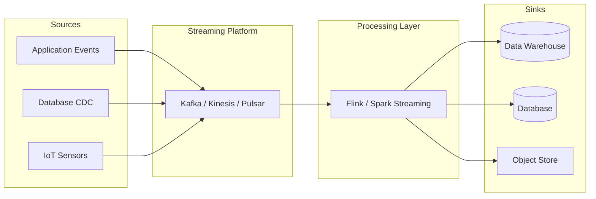
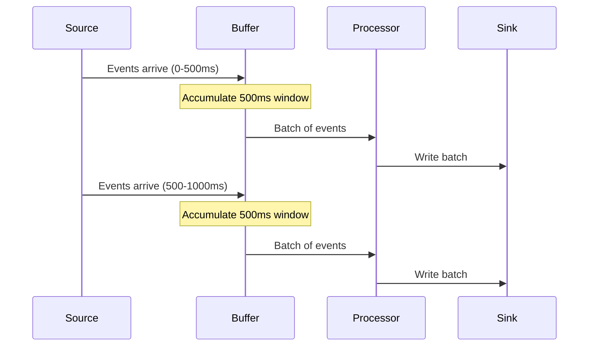
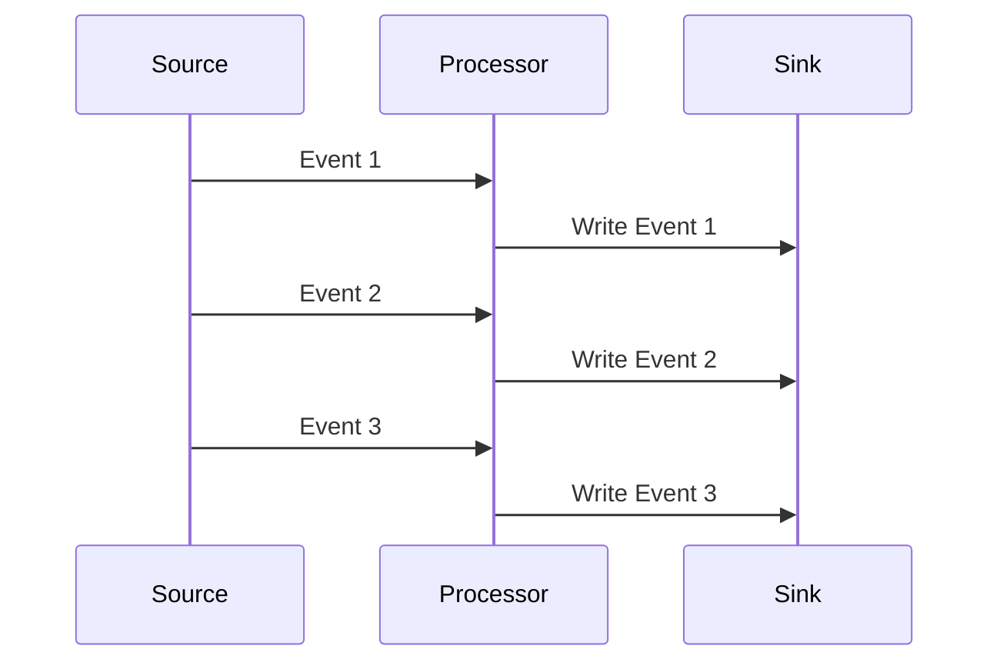
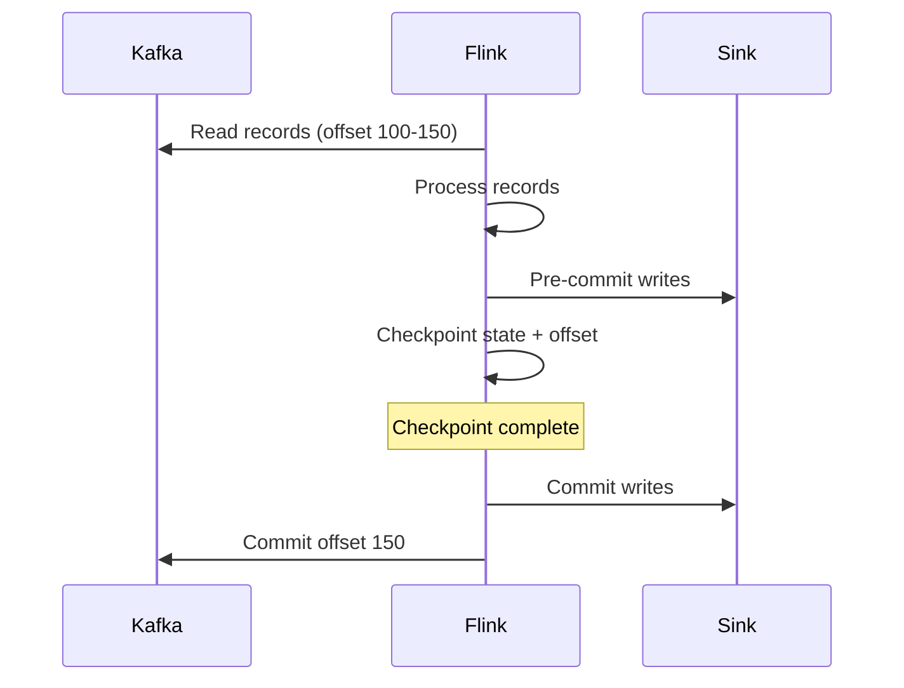
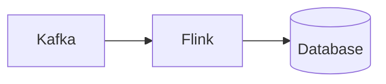
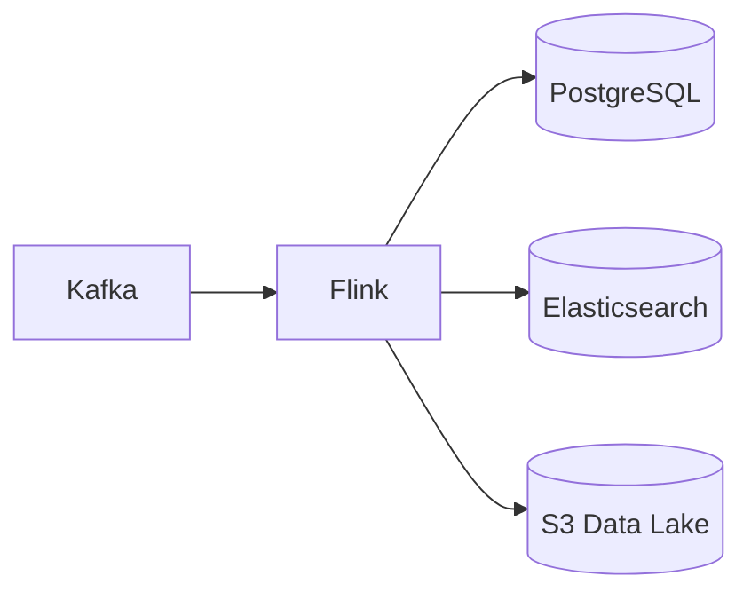
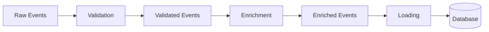
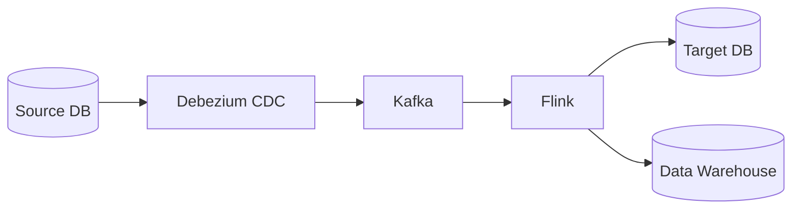

# How to Build Streaming Loading

Author: [nawazdhandala](https://github.com/nawazdhandala)

Tags: Data Pipeline, Streaming, Real-Time, Kafka

Description: Learn to build streaming loading for continuous data ingestion into target systems.

---

You have a batch pipeline. It runs every hour. Data arrives at 10:01 AM, but users see it at 11:00 AM. Leadership asks why the dashboard is "always an hour behind." You explain batch windows. They nod politely. The ticket stays open.

Streaming loading solves this. Instead of waiting for a batch window to close, data flows continuously from source to sink. Records appear in your target system within seconds of being produced. No more "wait for the next run." No more stale dashboards.

This guide walks through building streaming loading pipelines from first principles. We will cover architecture patterns, exactly-once semantics, sink connectors, and practical code examples using Kafka and Flink.

## What Is Streaming Loading?

Streaming loading is the process of continuously ingesting data into a target system (database, data warehouse, object store, or search index) as events arrive. Unlike batch loading, which accumulates data and writes it periodically, streaming loading processes each record or micro-batch immediately.



The core components:

1. **Sources**: Applications, databases (via CDC), or devices emitting events
2. **Message Broker**: Kafka, Kinesis, or Pulsar acting as the durable buffer
3. **Stream Processor**: Flink, Spark Streaming, or Kafka Streams transforming and routing data
4. **Sinks**: Target systems receiving the processed data

## Micro-Batch vs Continuous Processing

There are two approaches to streaming: micro-batch and continuous (true streaming). Understanding the tradeoffs helps you choose the right tool.

### Micro-Batch Processing

Micro-batch systems (Spark Structured Streaming) collect events for a short interval (100ms to several seconds), then process them as a small batch.



**Advantages:**
- Easier exactly-once semantics (checkpoint per batch)
- Higher throughput for high-volume workloads
- Simpler failure recovery (replay the batch)

**Disadvantages:**
- Latency is bounded by batch interval (typically 100ms-10s)
- Spiky resource usage (idle, then burst)

### Continuous Processing

Continuous systems (Flink, Kafka Streams) process each event as it arrives, without artificial batching boundaries.



**Advantages:**
- Sub-second latency (often single-digit milliseconds)
- Smooth, consistent resource usage
- True event-time processing with watermarks

**Disadvantages:**
- More complex exactly-once implementation
- Requires careful state management

### Choosing Between Them

| Requirement | Micro-Batch | Continuous |
|-------------|-------------|------------|
| Latency < 100ms | No | Yes |
| High throughput (millions/sec) | Yes | Yes |
| Exactly-once critical | Easier | Possible |
| Event-time windowing | Supported | Native |
| Operational simplicity | Higher | Lower |

For most streaming loading use cases, either works. Choose continuous when latency requirements are strict (fraud detection, real-time recommendations). Choose micro-batch when throughput matters more than latency.

## Exactly-Once Semantics

The hardest problem in streaming is delivering each record exactly once to the sink. Network failures, process crashes, and retries can cause duplicates or data loss.

### The Three Delivery Guarantees

1. **At-most-once**: Fire and forget. Fast but lossy.
2. **At-least-once**: Retry until acknowledged. Duplicates possible.
3. **Exactly-once**: Each record processed precisely once. Requires coordination.

### How Exactly-Once Works

Exactly-once requires atomic commits across the source offset, processing state, and sink write. Two common patterns:

**Pattern 1: Two-Phase Commit (Kafka + Flink)**



**Pattern 2: Idempotent Writes**

If your sink supports idempotent writes (upserts with unique keys), you can achieve exactly-once with at-least-once delivery:

```mermaid
flowchart LR
    A[Record with ID=123] --> B{Sink}
    B --> C[Upsert: INSERT or UPDATE]
    A2[Retry: ID=123] --> B
    Note: Duplicate writes have no effect
```

### Implementing Exactly-Once in Flink

Here is a complete Flink job that reads from Kafka, processes events, and writes to PostgreSQL with exactly-once guarantees:

```java
// StreamingLoadingJob.java
// Demonstrates exactly-once streaming loading from Kafka to PostgreSQL using Flink

import org.apache.flink.api.common.eventtime.WatermarkStrategy;
import org.apache.flink.api.common.serialization.SimpleStringSchema;
import org.apache.flink.connector.jdbc.JdbcConnectionOptions;
import org.apache.flink.connector.jdbc.JdbcExecutionOptions;
import org.apache.flink.connector.jdbc.JdbcSink;
import org.apache.flink.connector.kafka.source.KafkaSource;
import org.apache.flink.connector.kafka.source.enumerator.initializer.OffsetsInitializer;
import org.apache.flink.streaming.api.CheckpointingMode;
import org.apache.flink.streaming.api.datastream.DataStream;
import org.apache.flink.streaming.api.environment.StreamExecutionEnvironment;
import com.fasterxml.jackson.databind.ObjectMapper;

public class StreamingLoadingJob {

    public static void main(String[] args) throws Exception {
        // Create the execution environment
        StreamExecutionEnvironment env = StreamExecutionEnvironment.getExecutionEnvironment();

        // Enable exactly-once checkpointing every 10 seconds
        // This coordinates state snapshots across the pipeline
        env.enableCheckpointing(10000, CheckpointingMode.EXACTLY_ONCE);

        // Configure checkpoint storage (use S3 or HDFS in production)
        env.getCheckpointConfig().setCheckpointStorage("file:///tmp/flink-checkpoints");

        // Build the Kafka source
        // Reads from the "events" topic starting from the last committed offset
        KafkaSource<String> kafkaSource = KafkaSource.<String>builder()
            .setBootstrapServers("kafka:9092")
            .setTopics("events")
            .setGroupId("streaming-loader")
            .setStartingOffsets(OffsetsInitializer.committedOffsets())
            .setValueOnlyDeserializer(new SimpleStringSchema())
            .build();

        // Create the data stream with event-time processing
        DataStream<String> eventStream = env.fromSource(
            kafkaSource,
            WatermarkStrategy.forMonotonousTimestamps(),
            "Kafka Source"
        );

        // Parse JSON events into Event objects
        ObjectMapper mapper = new ObjectMapper();
        DataStream<Event> parsedEvents = eventStream
            .map(json -> mapper.readValue(json, Event.class))
            .name("Parse JSON");

        // Filter and transform events
        // Only process events that have valid user IDs
        DataStream<Event> validEvents = parsedEvents
            .filter(event -> event.getUserId() != null && !event.getUserId().isEmpty())
            .name("Filter Valid Events");

        // Define the JDBC sink with exactly-once guarantees
        // Uses upsert (ON CONFLICT) for idempotent writes
        validEvents.addSink(
            JdbcSink.sink(
                // SQL statement with upsert for idempotency
                // If a duplicate event ID arrives, we update instead of failing
                "INSERT INTO events (event_id, user_id, event_type, payload, created_at) " +
                "VALUES (?, ?, ?, ?::jsonb, ?) " +
                "ON CONFLICT (event_id) DO UPDATE SET " +
                "payload = EXCLUDED.payload, updated_at = NOW()",

                // Statement builder: maps Event fields to SQL parameters
                (statement, event) -> {
                    statement.setString(1, event.getEventId());
                    statement.setString(2, event.getUserId());
                    statement.setString(3, event.getEventType());
                    statement.setString(4, event.getPayload());
                    statement.setTimestamp(5, event.getCreatedAt());
                },

                // Execution options: batch writes for efficiency
                // Writes are flushed every 1000 records or every 5 seconds
                JdbcExecutionOptions.builder()
                    .withBatchSize(1000)
                    .withBatchIntervalMs(5000)
                    .withMaxRetries(3)
                    .build(),

                // Connection options for PostgreSQL
                new JdbcConnectionOptions.JdbcConnectionOptionsBuilder()
                    .withUrl("jdbc:postgresql://postgres:5432/analytics")
                    .withDriverName("org.postgresql.Driver")
                    .withUsername("loader")
                    .withPassword("${DB_PASSWORD}")
                    .build()
            )
        ).name("PostgreSQL Sink");

        // Execute the job
        env.execute("Streaming Loading Pipeline");
    }
}

// Event.java
// Data class representing an incoming event
public class Event {
    private String eventId;      // Unique identifier for idempotency
    private String userId;       // User who triggered the event
    private String eventType;    // Type of event (click, purchase, etc.)
    private String payload;      // JSON payload with event details
    private Timestamp createdAt; // Event timestamp

    // Getters and setters omitted for brevity
}
```

Key points in the code:

1. **Checkpointing enabled**: `enableCheckpointing(10000, CheckpointingMode.EXACTLY_ONCE)` ensures periodic state snapshots
2. **Idempotent writes**: The `ON CONFLICT DO UPDATE` clause handles duplicate deliveries gracefully
3. **Batch flushing**: JDBC sink batches writes for efficiency while respecting checkpoint boundaries

## Kafka Producer: Generating Events

Before loading, you need to produce events. Here is a Python producer that generates events for the pipeline:

```python
# event_producer.py
# Produces sample events to Kafka for the streaming loading pipeline

from kafka import KafkaProducer
from kafka.errors import KafkaError
import json
import uuid
import time
from datetime import datetime
import logging

# Configure logging for visibility into producer behavior
logging.basicConfig(level=logging.INFO)
logger = logging.getLogger(__name__)

def create_producer():
    """
    Create a Kafka producer with reliability settings.

    Key configurations:
    - acks='all': Wait for all replicas to acknowledge (strongest durability)
    - retries=3: Retry failed sends up to 3 times
    - enable_idempotence=True: Prevent duplicate messages from retries
    """
    return KafkaProducer(
        bootstrap_servers=['kafka:9092'],
        value_serializer=lambda v: json.dumps(v).encode('utf-8'),
        key_serializer=lambda k: k.encode('utf-8') if k else None,
        acks='all',                    # Wait for all replicas
        retries=3,                     # Retry on transient failures
        enable_idempotence=True,       # Exactly-once producer semantics
        max_in_flight_requests_per_connection=5,  # Allow pipelining
        compression_type='lz4',        # Compress for network efficiency
    )

def generate_event(user_id: str, event_type: str, details: dict) -> dict:
    """
    Generate a structured event with a unique ID for idempotency tracking.

    The event_id is critical: it allows downstream systems to deduplicate
    if the same event is delivered multiple times.
    """
    return {
        'event_id': str(uuid.uuid4()),  # Unique ID for deduplication
        'user_id': user_id,
        'event_type': event_type,
        'payload': details,
        'created_at': datetime.utcnow().isoformat(),
        'source': 'web_app',
        'version': '1.0'
    }

def send_event(producer: KafkaProducer, topic: str, event: dict):
    """
    Send an event to Kafka with proper error handling.

    Uses the user_id as the partition key to ensure all events
    for a user go to the same partition (preserving order per user).
    """
    try:
        # Use user_id as key for partition affinity
        # All events for the same user go to the same partition
        future = producer.send(
            topic,
            key=event['user_id'],
            value=event
        )

        # Block until the message is sent (or timeout after 10s)
        # In high-throughput scenarios, you might batch these
        record_metadata = future.get(timeout=10)

        logger.info(
            f"Event sent: topic={record_metadata.topic}, "
            f"partition={record_metadata.partition}, "
            f"offset={record_metadata.offset}"
        )

    except KafkaError as e:
        logger.error(f"Failed to send event: {e}")
        raise

def main():
    """
    Main loop: continuously generate and send sample events.

    In production, this would be integrated into your application
    code, sending events when user actions occur.
    """
    producer = create_producer()
    topic = 'events'

    event_types = ['page_view', 'click', 'purchase', 'signup', 'logout']

    try:
        event_count = 0
        while True:
            # Generate a sample event
            user_id = f"user_{event_count % 1000}"  # Simulate 1000 users
            event_type = event_types[event_count % len(event_types)]

            event = generate_event(
                user_id=user_id,
                event_type=event_type,
                details={
                    'page': f'/products/{event_count % 100}',
                    'session_id': str(uuid.uuid4()),
                    'user_agent': 'Mozilla/5.0'
                }
            )

            send_event(producer, topic, event)
            event_count += 1

            # Rate limit to ~100 events per second
            time.sleep(0.01)

    except KeyboardInterrupt:
        logger.info("Shutting down producer")
    finally:
        # Ensure all buffered messages are sent before exiting
        producer.flush()
        producer.close()

if __name__ == '__main__':
    main()
```

## Sink Connectors: Where Data Lands

Streaming pipelines need to write data somewhere. Here are implementations for common sinks.

### PostgreSQL Sink (Flink SQL)

For simpler use cases, Flink SQL provides a declarative way to define sinks:

```sql
-- Create the Kafka source table
-- This maps the Kafka topic to a Flink table for SQL queries
CREATE TABLE kafka_events (
    event_id STRING,
    user_id STRING,
    event_type STRING,
    payload STRING,
    created_at TIMESTAMP(3),
    -- Define the watermark for event-time processing
    -- Allows 5 seconds of late data before considering window complete
    WATERMARK FOR created_at AS created_at - INTERVAL '5' SECOND
) WITH (
    'connector' = 'kafka',
    'topic' = 'events',
    'properties.bootstrap.servers' = 'kafka:9092',
    'properties.group.id' = 'flink-sql-loader',
    'scan.startup.mode' = 'latest-offset',
    'format' = 'json',
    'json.timestamp-format.standard' = 'ISO-8601'
);

-- Create the PostgreSQL sink table
-- Uses JDBC connector with upsert mode for exactly-once semantics
CREATE TABLE postgres_events (
    event_id STRING,
    user_id STRING,
    event_type STRING,
    payload STRING,
    created_at TIMESTAMP(3),
    -- Primary key enables upsert mode (INSERT or UPDATE on conflict)
    PRIMARY KEY (event_id) NOT ENFORCED
) WITH (
    'connector' = 'jdbc',
    'url' = 'jdbc:postgresql://postgres:5432/analytics',
    'table-name' = 'events',
    'username' = 'loader',
    'password' = '${DB_PASSWORD}',
    -- Sink options for batching and retries
    'sink.buffer-flush.max-rows' = '1000',
    'sink.buffer-flush.interval' = '5s',
    'sink.max-retries' = '3'
);

-- Stream data from Kafka to PostgreSQL
-- This runs continuously, loading each event as it arrives
INSERT INTO postgres_events
SELECT
    event_id,
    user_id,
    event_type,
    payload,
    created_at
FROM kafka_events
WHERE user_id IS NOT NULL;
```

### Elasticsearch Sink

For search and analytics workloads, Elasticsearch is a common destination:

```java
// ElasticsearchSinkExample.java
// Writes streaming events to Elasticsearch for real-time search

import org.apache.flink.connector.elasticsearch.sink.Elasticsearch7SinkBuilder;
import org.apache.flink.connector.elasticsearch.sink.FlushBackoffType;
import org.apache.http.HttpHost;
import org.elasticsearch.action.index.IndexRequest;
import org.elasticsearch.client.Requests;

// Build the Elasticsearch sink with retry and batching configuration
ElasticsearchSink<Event> esSink = new Elasticsearch7SinkBuilder<Event>()
    // Elasticsearch cluster hosts
    .setHosts(new HttpHost("elasticsearch", 9200, "http"))

    // Define how to convert each Event into an Elasticsearch document
    .setEmitter((event, context, indexer) -> {
        // Create the document as a map
        Map<String, Object> document = new HashMap<>();
        document.put("event_id", event.getEventId());
        document.put("user_id", event.getUserId());
        document.put("event_type", event.getEventType());
        document.put("payload", event.getPayload());
        document.put("created_at", event.getCreatedAt().toInstant().toString());
        document.put("indexed_at", Instant.now().toString());

        // Create an index request
        // Uses event_id as document ID for idempotent writes
        IndexRequest request = Requests.indexRequest()
            .index("events")           // Target index
            .id(event.getEventId())    // Document ID (enables upsert)
            .source(document);

        indexer.add(request);
    })

    // Batching configuration for efficiency
    // Flush every 1000 documents or every 5 seconds
    .setBulkFlushMaxActions(1000)
    .setBulkFlushInterval(5000)

    // Retry configuration for transient failures
    // Exponential backoff: wait 1s, then 2s, then 4s...
    .setBulkFlushBackoffStrategy(FlushBackoffType.EXPONENTIAL, 5, 1000)

    .build();

// Attach the sink to your data stream
validEvents.sinkTo(esSink).name("Elasticsearch Sink");
```

### S3 / Object Store Sink (Parquet)

For data lake architectures, writing to object storage in columnar formats is common:

```java
// S3ParquetSinkExample.java
// Writes streaming events to S3 as Parquet files for analytics

import org.apache.flink.connector.file.sink.FileSink;
import org.apache.flink.core.fs.Path;
import org.apache.flink.formats.parquet.avro.AvroParquetWriters;
import org.apache.flink.streaming.api.functions.sink.filesystem.rollingpolicies.OnCheckpointRollingPolicy;
import org.apache.flink.streaming.api.functions.sink.filesystem.bucketassigners.DateTimeBucketAssigner;

// Build the S3 Parquet sink
// Files are organized by date partitions: s3://bucket/events/2026/01/30/
FileSink<Event> s3Sink = FileSink
    // Write to S3 bucket with Parquet format
    .forBulkFormat(
        new Path("s3://data-lake/events"),
        AvroParquetWriters.forReflectRecord(Event.class)
    )

    // Partition files by date for efficient querying
    // Creates paths like: /events/2026/01/30/part-0-0.parquet
    .withBucketAssigner(
        new DateTimeBucketAssigner<>("yyyy/MM/dd")
    )

    // Roll files on checkpoint for exactly-once semantics
    // Each checkpoint creates a new file, ensuring no partial writes
    .withRollingPolicy(OnCheckpointRollingPolicy.build())

    // File naming: part-{subtask}-{sequence}.parquet
    .withOutputFileConfig(
        OutputFileConfig.builder()
            .withPartPrefix("part")
            .withPartSuffix(".parquet")
            .build()
    )
    .build();

// Attach the sink to your data stream
validEvents.sinkTo(s3Sink).name("S3 Parquet Sink");
```

## Architecture Patterns

Different use cases call for different streaming loading architectures.

### Pattern 1: Direct Loading

Simple and fast. Events flow directly from Kafka to the sink.



**When to use:** Low complexity, single sink, minimal transformation needed.

### Pattern 2: Fan-Out Loading

One stream feeds multiple sinks for different use cases.



**When to use:** Multiple consumers need the same data in different formats or systems.

### Pattern 3: Staged Loading

Events pass through multiple processing stages before loading.



**When to use:** Complex transformations, need replay capability at each stage, different teams own different stages.

### Pattern 4: CDC-Based Loading

Capture database changes and replicate to downstream systems.



**When to use:** Database replication, building read replicas, migrating data between systems.

## Monitoring Your Streaming Pipeline

A streaming pipeline is only as good as its observability. Key metrics to track:

### Lag Monitoring

Consumer lag tells you how far behind your pipeline is:

```yaml
# Prometheus alert for Kafka consumer lag
# Fires if any consumer group is more than 10000 messages behind
groups:
  - name: streaming_pipeline
    rules:
      - alert: HighConsumerLag
        expr: kafka_consumer_group_lag > 10000
        for: 5m
        labels:
          severity: warning
        annotations:
          summary: "High consumer lag detected"
          description: "Consumer group {{ $labels.group }} has lag of {{ $value }} messages"
```

### Throughput and Latency

Track records processed per second and end-to-end latency:

```java
// Add custom metrics to your Flink job
// Track processing latency from event creation to sink write

public class MetricsMapper extends RichMapFunction<Event, Event> {

    private transient Histogram latencyHistogram;
    private transient Counter eventsProcessed;

    @Override
    public void open(Configuration parameters) {
        // Register metrics with Flink's metric system
        // These will be exported to your monitoring backend
        this.latencyHistogram = getRuntimeContext()
            .getMetricGroup()
            .histogram("processing_latency_ms", new DescriptiveStatisticsHistogram(1000));

        this.eventsProcessed = getRuntimeContext()
            .getMetricGroup()
            .counter("events_processed_total");
    }

    @Override
    public Event map(Event event) {
        // Calculate latency from event creation to now
        long latencyMs = System.currentTimeMillis() - event.getCreatedAt().getTime();

        // Record the latency in the histogram
        latencyHistogram.update(latencyMs);
        eventsProcessed.inc();

        return event;
    }
}
```

### Health Checks

Integrate with OneUptime for pipeline monitoring:

```python
# health_check.py
# Exposes pipeline health for monitoring systems

from flask import Flask, jsonify
from kafka import KafkaConsumer, KafkaAdminClient
from kafka.admin import ConsumerGroupDescription

app = Flask(__name__)

@app.route('/health')
def health_check():
    """
    Health endpoint for monitoring systems.

    Checks:
    1. Kafka connectivity
    2. Consumer group lag
    3. Recent processing activity
    """
    try:
        # Check Kafka connectivity
        admin = KafkaAdminClient(bootstrap_servers=['kafka:9092'])

        # Get consumer group lag
        consumer_groups = admin.describe_consumer_groups(['streaming-loader'])

        # Check if lag is acceptable (under 10000 messages)
        # In production, query the actual lag from Kafka metrics
        lag_acceptable = True  # Replace with actual lag check

        if lag_acceptable:
            return jsonify({
                'status': 'healthy',
                'kafka': 'connected',
                'lag': 'acceptable'
            }), 200
        else:
            return jsonify({
                'status': 'degraded',
                'kafka': 'connected',
                'lag': 'high'
            }), 503

    except Exception as e:
        return jsonify({
            'status': 'unhealthy',
            'error': str(e)
        }), 503

if __name__ == '__main__':
    app.run(host='0.0.0.0', port=8080)
```

## Failure Handling and Recovery

Streaming systems must handle failures gracefully. Common failure scenarios and solutions:

### Scenario 1: Sink Unavailable

If the sink goes down, the pipeline should pause and retry without losing data.

```java
// Configure retries and backoff for sink failures
JdbcExecutionOptions executionOptions = JdbcExecutionOptions.builder()
    .withMaxRetries(5)           // Retry up to 5 times
    .withBatchIntervalMs(5000)   // Batch interval
    .build();

// For more control, wrap the sink with a retry mechanism
// This example uses Flink's async I/O with retries
AsyncDataStream.unorderedWait(
    eventStream,
    new RetryingAsyncSinkFunction(maxRetries, backoffMs),
    30, TimeUnit.SECONDS,  // Timeout per request
    100                    // Max concurrent requests
);
```

### Scenario 2: Schema Changes

Handle schema evolution gracefully with a registry:

```java
// Use Confluent Schema Registry for schema evolution
// New fields can be added without breaking existing consumers

KafkaSource<GenericRecord> source = KafkaSource.<GenericRecord>builder()
    .setBootstrapServers("kafka:9092")
    .setTopics("events")
    .setDeserializer(
        KafkaRecordDeserializationSchema.of(
            ConfluentRegistryAvroDeserializationSchema.forGeneric(
                "events-value",
                "http://schema-registry:8081"
            )
        )
    )
    .build();
```

### Scenario 3: Backpressure

When the sink cannot keep up, the pipeline should apply backpressure to the source:

```java
// Flink handles backpressure automatically through the runtime
// Configure buffer settings to tune behavior

Configuration config = new Configuration();
// Buffer timeout: how long to wait before flushing incomplete buffers
config.setString("taskmanager.network.memory.buffer-debloat.enabled", "true");
// Enable buffer debloating for adaptive backpressure
config.setString("taskmanager.network.memory.buffer-debloat.target", "1s");
```

## Production Checklist

Before deploying your streaming loading pipeline to production:

- [ ] **Exactly-once configured**: Checkpointing enabled, sinks support idempotent writes
- [ ] **Monitoring in place**: Lag alerts, throughput dashboards, latency histograms
- [ ] **Failure handling tested**: Simulated sink outages, verified recovery
- [ ] **Backpressure behavior validated**: Sink slowdowns do not cause data loss
- [ ] **Schema evolution strategy**: Registry configured, backward compatibility ensured
- [ ] **Resource limits set**: Memory, CPU, and parallelism tuned for expected load
- [ ] **Dead letter queue configured**: Failed records routed for inspection
- [ ] **Runbooks documented**: On-call knows how to restart, scale, and debug

## Summary

Streaming loading transforms how data flows through your organization. Instead of waiting for batch windows, data arrives continuously in your target systems.

Key takeaways:

1. **Choose your processing model**: Micro-batch for simplicity, continuous for low latency
2. **Implement exactly-once**: Checkpointing plus idempotent sinks prevent duplicates
3. **Use appropriate sink connectors**: Match the connector to your target system's capabilities
4. **Monitor relentlessly**: Lag, throughput, and latency are your early warning system
5. **Plan for failures**: Retries, backpressure, and recovery must be designed in

Start small. Pick one dataset. Build the pipeline. Measure the improvement. Then expand.

The best time to start streaming was when you first felt batch latency pain. The second best time is now.

---

**Related Reading:**

- [What Is OpenTelemetry Collector and Why Use One](https://oneuptime.com/blog/post/2025-09-18-what-is-opentelemetry-collector-and-why-use-one/view)
- [Three Pillars of Observability: Logs, Metrics, Traces](https://oneuptime.com/blog/post/2025-08-20-three-pillars-of-observability-logs-metrics-traces/view)
- [Monitoring Backup Jobs with OneUptime](https://oneuptime.com/blog/post/2025-09-25-monitoring-backup-jobs-with-oneuptime/view)
