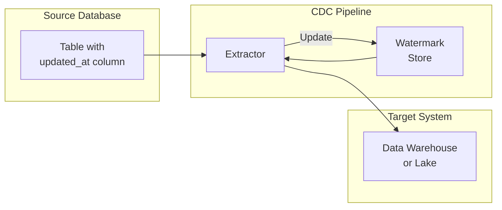
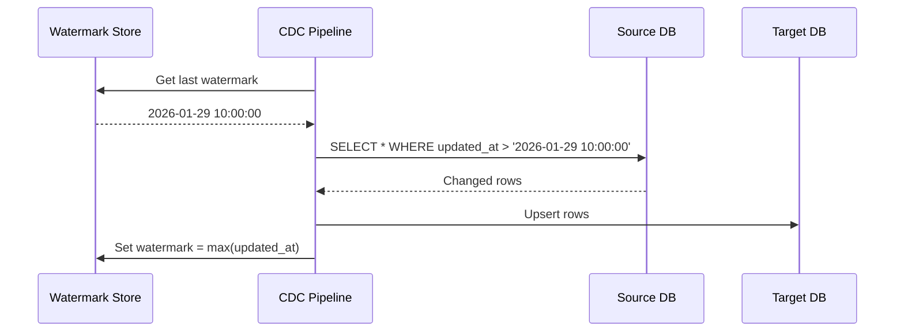
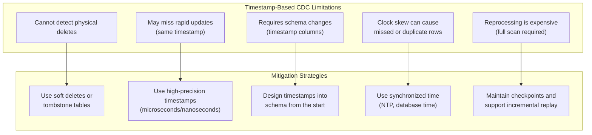

# How to Build Timestamp-Based CDC

Author: [nawazdhandala](https://github.com/nawazdhandala)

Tags: Data Pipeline, CDC, Timestamp, Incremental

Description: Learn to build timestamp-based CDC for detecting changes using modified timestamp columns.

---

> Change Data Capture (CDC) is essential for keeping data pipelines in sync. Timestamp-based CDC offers a simple, database-agnostic approach that works with any system supporting timestamp columns. This guide covers the architecture, implementation patterns, and trade-offs you need to know.

Timestamp-based CDC detects changes by comparing modification timestamps between pipeline runs. It is one of the simplest forms of CDC to implement and works across virtually all databases.

---

## Overview

Timestamp-based CDC relies on a column that tracks when each row was last modified. By storing a high watermark (the maximum timestamp from the previous run), subsequent queries can fetch only rows that changed since then.



---

## How Timestamp-Based CDC Works

The core algorithm is straightforward:

1. Read the last processed timestamp (high watermark) from persistent storage
2. Query source table for all rows where `updated_at > high_watermark`
3. Process and load the changed rows into the target system
4. Update the high watermark to the maximum `updated_at` value from the batch
5. Repeat on schedule



---

## Designing Timestamp Columns

### Basic Schema Design

Every table that participates in CDC needs proper timestamp columns. Here is a recommended schema pattern:

```sql
-- Example table with CDC-friendly timestamp columns
CREATE TABLE customers (
    -- Primary key for identifying records
    id BIGSERIAL PRIMARY KEY,

    -- Business data columns
    email VARCHAR(255) NOT NULL UNIQUE,
    name VARCHAR(255) NOT NULL,
    status VARCHAR(50) DEFAULT 'active',

    -- CDC timestamp columns
    -- created_at: Set once when row is inserted, never updated
    created_at TIMESTAMP WITH TIME ZONE NOT NULL DEFAULT NOW(),

    -- updated_at: Automatically updated on every modification
    -- This is the column used for CDC detection
    updated_at TIMESTAMP WITH TIME ZONE NOT NULL DEFAULT NOW()
);

-- Create index on updated_at for efficient CDC queries
-- This index is critical for performance as CDC queries filter by this column
CREATE INDEX idx_customers_updated_at ON customers(updated_at);
```

### Automatic Timestamp Updates

Use database triggers to ensure `updated_at` is always current:

```sql
-- PostgreSQL trigger function to auto-update the updated_at column
-- This ensures the timestamp is updated even if application code forgets
CREATE OR REPLACE FUNCTION update_modified_column()
RETURNS TRIGGER AS $$
BEGIN
    -- Set updated_at to current timestamp whenever row is modified
    NEW.updated_at = NOW();
    RETURN NEW;
END;
$$ LANGUAGE plpgsql;

-- Attach the trigger to the customers table
-- BEFORE UPDATE ensures the timestamp is set before the row is written
CREATE TRIGGER customers_updated_at
    BEFORE UPDATE ON customers
    FOR EACH ROW
    EXECUTE FUNCTION update_modified_column();
```

For MySQL, use a built-in feature:

```sql
-- MySQL automatic timestamp update
-- ON UPDATE CURRENT_TIMESTAMP handles this natively
CREATE TABLE customers (
    id BIGINT AUTO_INCREMENT PRIMARY KEY,
    email VARCHAR(255) NOT NULL UNIQUE,
    name VARCHAR(255) NOT NULL,
    status VARCHAR(50) DEFAULT 'active',
    created_at TIMESTAMP NOT NULL DEFAULT CURRENT_TIMESTAMP,
    updated_at TIMESTAMP NOT NULL DEFAULT CURRENT_TIMESTAMP ON UPDATE CURRENT_TIMESTAMP,

    INDEX idx_updated_at (updated_at)
);
```

---

## Basic CDC Extractor Implementation

### Python CDC Extractor

Here is a complete implementation of a timestamp-based CDC extractor:

```python
# cdc_extractor.py
import logging
from datetime import datetime, timezone
from typing import Optional, Iterator, Dict, Any
import psycopg2
from psycopg2.extras import RealDictCursor

logger = logging.getLogger(__name__)


class TimestampCDCExtractor:
    """
    Extracts changed rows from a source table using timestamp-based CDC.

    This extractor queries rows where updated_at is greater than the last
    processed watermark, enabling incremental data extraction.
    """

    def __init__(
        self,
        connection_string: str,
        table_name: str,
        timestamp_column: str = "updated_at",
        primary_key: str = "id",
        batch_size: int = 10000
    ):
        """
        Initialize the CDC extractor.

        Args:
            connection_string: PostgreSQL connection string
            table_name: Name of the source table to extract from
            timestamp_column: Column containing the modification timestamp
            primary_key: Primary key column for ordering results
            batch_size: Number of rows to fetch per batch
        """
        self.connection_string = connection_string
        self.table_name = table_name
        self.timestamp_column = timestamp_column
        self.primary_key = primary_key
        self.batch_size = batch_size

    def extract_changes(
        self,
        watermark: Optional[datetime] = None
    ) -> Iterator[Dict[str, Any]]:
        """
        Extract all rows changed since the given watermark.

        Args:
            watermark: Only extract rows modified after this timestamp.
                      If None, extracts all rows (full load).

        Yields:
            Dictionary representing each changed row
        """
        # Build the extraction query with parameterized watermark
        # Using >= instead of > to handle rows with identical timestamps
        query = f"""
            SELECT *
            FROM {self.table_name}
            WHERE {self.timestamp_column} >= %s
            ORDER BY {self.timestamp_column}, {self.primary_key}
        """

        # Default watermark to epoch if not provided (full extraction)
        if watermark is None:
            watermark = datetime(1970, 1, 1, tzinfo=timezone.utc)

        logger.info(
            f"Extracting changes from {self.table_name} "
            f"since {watermark.isoformat()}"
        )

        row_count = 0

        # Use server-side cursor for memory-efficient streaming
        # This prevents loading all rows into memory at once
        with psycopg2.connect(self.connection_string) as conn:
            with conn.cursor(
                name="cdc_cursor",  # Named cursor enables server-side cursor
                cursor_factory=RealDictCursor
            ) as cursor:
                cursor.itersize = self.batch_size
                cursor.execute(query, (watermark,))

                for row in cursor:
                    row_count += 1
                    yield dict(row)

        logger.info(f"Extracted {row_count} changed rows from {self.table_name}")

    def get_current_max_timestamp(self) -> Optional[datetime]:
        """
        Get the maximum timestamp currently in the source table.

        Useful for determining the initial watermark or validating
        that extraction captured all changes up to a known point.

        Returns:
            Maximum updated_at timestamp, or None if table is empty
        """
        query = f"SELECT MAX({self.timestamp_column}) FROM {self.table_name}"

        with psycopg2.connect(self.connection_string) as conn:
            with conn.cursor() as cursor:
                cursor.execute(query)
                result = cursor.fetchone()
                return result[0] if result and result[0] else None
```

### Watermark Storage

Store watermarks persistently to track pipeline progress:

```python
# watermark_store.py
import json
import logging
from datetime import datetime, timezone
from pathlib import Path
from typing import Optional
from abc import ABC, abstractmethod

logger = logging.getLogger(__name__)


class WatermarkStore(ABC):
    """Abstract base class for watermark storage backends."""

    @abstractmethod
    def get_watermark(self, pipeline_id: str) -> Optional[datetime]:
        """Retrieve the last processed watermark for a pipeline."""
        pass

    @abstractmethod
    def set_watermark(self, pipeline_id: str, watermark: datetime) -> None:
        """Store the watermark after successful processing."""
        pass


class FileWatermarkStore(WatermarkStore):
    """
    Simple file-based watermark storage.

    Suitable for development and single-node deployments.
    For production, use a database-backed store.
    """

    def __init__(self, storage_path: str = "./watermarks"):
        """
        Initialize file-based watermark store.

        Args:
            storage_path: Directory to store watermark files
        """
        self.storage_path = Path(storage_path)
        self.storage_path.mkdir(parents=True, exist_ok=True)

    def _get_file_path(self, pipeline_id: str) -> Path:
        """Get the file path for a pipeline's watermark."""
        # Sanitize pipeline_id to prevent path traversal
        safe_id = pipeline_id.replace("/", "_").replace("\\", "_")
        return self.storage_path / f"{safe_id}.json"

    def get_watermark(self, pipeline_id: str) -> Optional[datetime]:
        """
        Retrieve the last processed watermark.

        Args:
            pipeline_id: Unique identifier for the pipeline

        Returns:
            Last processed timestamp, or None if no watermark exists
        """
        file_path = self._get_file_path(pipeline_id)

        if not file_path.exists():
            logger.info(f"No watermark found for pipeline {pipeline_id}")
            return None

        with open(file_path, "r") as f:
            data = json.load(f)
            # Parse ISO format timestamp back to datetime
            watermark = datetime.fromisoformat(data["watermark"])
            logger.info(
                f"Loaded watermark for {pipeline_id}: {watermark.isoformat()}"
            )
            return watermark

    def set_watermark(self, pipeline_id: str, watermark: datetime) -> None:
        """
        Store the watermark after successful processing.

        Args:
            pipeline_id: Unique identifier for the pipeline
            watermark: Timestamp to store as the new high watermark
        """
        file_path = self._get_file_path(pipeline_id)

        data = {
            "pipeline_id": pipeline_id,
            "watermark": watermark.isoformat(),
            "updated_at": datetime.now(timezone.utc).isoformat()
        }

        # Write atomically by writing to temp file first
        temp_path = file_path.with_suffix(".tmp")
        with open(temp_path, "w") as f:
            json.dump(data, f, indent=2)
        temp_path.rename(file_path)

        logger.info(f"Updated watermark for {pipeline_id}: {watermark.isoformat()}")


class PostgresWatermarkStore(WatermarkStore):
    """
    PostgreSQL-backed watermark storage.

    Recommended for production use as it provides durability
    and supports concurrent pipeline instances.
    """

    def __init__(self, connection_string: str):
        """
        Initialize PostgreSQL watermark store.

        Args:
            connection_string: PostgreSQL connection string
        """
        self.connection_string = connection_string
        self._ensure_table_exists()

    def _ensure_table_exists(self) -> None:
        """Create the watermarks table if it does not exist."""
        import psycopg2

        create_table_sql = """
            CREATE TABLE IF NOT EXISTS cdc_watermarks (
                pipeline_id VARCHAR(255) PRIMARY KEY,
                watermark TIMESTAMP WITH TIME ZONE NOT NULL,
                updated_at TIMESTAMP WITH TIME ZONE NOT NULL DEFAULT NOW()
            )
        """

        with psycopg2.connect(self.connection_string) as conn:
            with conn.cursor() as cursor:
                cursor.execute(create_table_sql)
            conn.commit()

    def get_watermark(self, pipeline_id: str) -> Optional[datetime]:
        """Retrieve the last processed watermark from PostgreSQL."""
        import psycopg2

        query = """
            SELECT watermark FROM cdc_watermarks WHERE pipeline_id = %s
        """

        with psycopg2.connect(self.connection_string) as conn:
            with conn.cursor() as cursor:
                cursor.execute(query, (pipeline_id,))
                result = cursor.fetchone()
                return result[0] if result else None

    def set_watermark(self, pipeline_id: str, watermark: datetime) -> None:
        """Store the watermark in PostgreSQL using upsert."""
        import psycopg2

        # Use INSERT ... ON CONFLICT for atomic upsert
        upsert_sql = """
            INSERT INTO cdc_watermarks (pipeline_id, watermark, updated_at)
            VALUES (%s, %s, NOW())
            ON CONFLICT (pipeline_id)
            DO UPDATE SET watermark = EXCLUDED.watermark, updated_at = NOW()
        """

        with psycopg2.connect(self.connection_string) as conn:
            with conn.cursor() as cursor:
                cursor.execute(upsert_sql, (pipeline_id, watermark))
            conn.commit()
```

---

## Complete CDC Pipeline

### Pipeline Orchestrator

Combine the extractor and watermark store into a complete pipeline:

```python
# cdc_pipeline.py
import logging
from datetime import datetime, timezone
from typing import Callable, Dict, Any, List, Optional

from cdc_extractor import TimestampCDCExtractor
from watermark_store import WatermarkStore, PostgresWatermarkStore

logger = logging.getLogger(__name__)


class CDCPipeline:
    """
    Orchestrates timestamp-based CDC extraction and loading.

    This pipeline:
    1. Reads the last watermark from persistent storage
    2. Extracts changed rows from the source
    3. Transforms and loads data to the target
    4. Updates the watermark on successful completion
    """

    def __init__(
        self,
        pipeline_id: str,
        extractor: TimestampCDCExtractor,
        watermark_store: WatermarkStore,
        loader: Callable[[List[Dict[str, Any]]], None],
        transformer: Optional[Callable[[Dict[str, Any]], Dict[str, Any]]] = None,
        batch_size: int = 1000
    ):
        """
        Initialize the CDC pipeline.

        Args:
            pipeline_id: Unique identifier for this pipeline instance
            extractor: CDC extractor for the source table
            watermark_store: Persistent storage for watermarks
            loader: Function to load transformed rows to target
            transformer: Optional function to transform each row
            batch_size: Number of rows to accumulate before loading
        """
        self.pipeline_id = pipeline_id
        self.extractor = extractor
        self.watermark_store = watermark_store
        self.loader = loader
        self.transformer = transformer or (lambda x: x)
        self.batch_size = batch_size

    def run(self) -> Dict[str, Any]:
        """
        Execute the CDC pipeline.

        Returns:
            Dictionary containing pipeline execution statistics
        """
        start_time = datetime.now(timezone.utc)
        logger.info(f"Starting CDC pipeline: {self.pipeline_id}")

        # Get the last processed watermark
        watermark = self.watermark_store.get_watermark(self.pipeline_id)
        logger.info(f"Starting watermark: {watermark}")

        # Track statistics
        rows_processed = 0
        batches_loaded = 0
        max_timestamp: Optional[datetime] = None

        # Accumulate rows into batches for efficient loading
        batch: List[Dict[str, Any]] = []

        try:
            for row in self.extractor.extract_changes(watermark):
                # Apply transformation
                transformed_row = self.transformer(row)
                batch.append(transformed_row)

                # Track the maximum timestamp seen
                row_timestamp = row.get(self.extractor.timestamp_column)
                if row_timestamp:
                    if max_timestamp is None or row_timestamp > max_timestamp:
                        max_timestamp = row_timestamp

                # Load batch when it reaches the configured size
                if len(batch) >= self.batch_size:
                    self.loader(batch)
                    rows_processed += len(batch)
                    batches_loaded += 1
                    batch = []
                    logger.debug(f"Loaded batch {batches_loaded}, total rows: {rows_processed}")

            # Load any remaining rows
            if batch:
                self.loader(batch)
                rows_processed += len(batch)
                batches_loaded += 1

            # Update watermark only after successful processing
            if max_timestamp:
                self.watermark_store.set_watermark(self.pipeline_id, max_timestamp)
                logger.info(f"Updated watermark to: {max_timestamp.isoformat()}")

            end_time = datetime.now(timezone.utc)
            duration = (end_time - start_time).total_seconds()

            stats = {
                "pipeline_id": self.pipeline_id,
                "status": "success",
                "rows_processed": rows_processed,
                "batches_loaded": batches_loaded,
                "start_watermark": watermark.isoformat() if watermark else None,
                "end_watermark": max_timestamp.isoformat() if max_timestamp else None,
                "duration_seconds": duration,
                "rows_per_second": rows_processed / duration if duration > 0 else 0
            }

            logger.info(f"Pipeline completed: {stats}")
            return stats

        except Exception as e:
            logger.error(f"Pipeline failed: {e}", exc_info=True)
            # Do NOT update watermark on failure
            # Next run will reprocess from the same point
            raise


def create_bigquery_loader(project_id: str, dataset: str, table: str):
    """
    Factory function to create a BigQuery loader.

    Args:
        project_id: GCP project ID
        dataset: BigQuery dataset name
        table: Target table name

    Returns:
        Loader function compatible with CDCPipeline
    """
    from google.cloud import bigquery

    client = bigquery.Client(project=project_id)
    table_ref = f"{project_id}.{dataset}.{table}"

    def loader(rows: List[Dict[str, Any]]) -> None:
        """Load rows to BigQuery using streaming insert."""
        if not rows:
            return

        errors = client.insert_rows_json(table_ref, rows)
        if errors:
            raise RuntimeError(f"BigQuery insert failed: {errors}")

        logger.debug(f"Loaded {len(rows)} rows to BigQuery")

    return loader
```

### Running the Pipeline

```python
# run_pipeline.py
import os
import logging
from cdc_extractor import TimestampCDCExtractor
from watermark_store import PostgresWatermarkStore
from cdc_pipeline import CDCPipeline, create_bigquery_loader

# Configure logging
logging.basicConfig(
    level=logging.INFO,
    format="%(asctime)s - %(name)s - %(levelname)s - %(message)s"
)

def main():
    # Source database connection
    source_conn = os.getenv("SOURCE_DATABASE_URL")

    # Watermark storage connection (can be same or different database)
    watermark_conn = os.getenv("WATERMARK_DATABASE_URL", source_conn)

    # Create the extractor for the customers table
    extractor = TimestampCDCExtractor(
        connection_string=source_conn,
        table_name="customers",
        timestamp_column="updated_at",
        primary_key="id",
        batch_size=10000
    )

    # Create watermark store
    watermark_store = PostgresWatermarkStore(watermark_conn)

    # Create BigQuery loader
    loader = create_bigquery_loader(
        project_id=os.getenv("GCP_PROJECT"),
        dataset="analytics",
        table="customers"
    )

    # Define transformation (add metadata columns)
    def transform(row):
        """Add pipeline metadata to each row."""
        row["_extracted_at"] = datetime.now(timezone.utc).isoformat()
        row["_source"] = "production_db"
        return row

    # Create and run the pipeline
    pipeline = CDCPipeline(
        pipeline_id="customers_to_bigquery",
        extractor=extractor,
        watermark_store=watermark_store,
        loader=loader,
        transformer=transform,
        batch_size=1000
    )

    stats = pipeline.run()
    print(f"Pipeline completed: {stats['rows_processed']} rows in {stats['duration_seconds']:.2f}s")


if __name__ == "__main__":
    main()
```

---

## Handling Edge Cases

### Duplicate Detection

Rows can be processed multiple times due to failures or timestamp collisions. Handle duplicates at the target:

```python
# deduplication.py
from typing import Dict, Any, List
import hashlib
import json


def compute_row_hash(row: Dict[str, Any], key_columns: List[str]) -> str:
    """
    Compute a hash of the key columns for deduplication.

    Args:
        row: The row dictionary
        key_columns: Columns that uniquely identify the row

    Returns:
        SHA256 hash of the key values
    """
    # Extract key values in consistent order
    key_values = [str(row.get(col, "")) for col in sorted(key_columns)]
    key_string = "|".join(key_values)
    return hashlib.sha256(key_string.encode()).hexdigest()


def create_deduplicating_loader(
    base_loader: callable,
    key_columns: List[str],
    seen_hashes: set = None
):
    """
    Wrap a loader with in-memory deduplication.

    This prevents loading the same row multiple times within
    a single pipeline run. For cross-run deduplication, use
    MERGE/UPSERT at the target database.

    Args:
        base_loader: The underlying loader function
        key_columns: Columns that uniquely identify rows
        seen_hashes: Optional set to track seen hashes

    Returns:
        Deduplicating loader function
    """
    if seen_hashes is None:
        seen_hashes = set()

    def dedup_loader(rows: List[Dict[str, Any]]) -> None:
        unique_rows = []

        for row in rows:
            row_hash = compute_row_hash(row, key_columns)

            if row_hash not in seen_hashes:
                seen_hashes.add(row_hash)
                unique_rows.append(row)

        if unique_rows:
            base_loader(unique_rows)

    return dedup_loader
```

### Target Upsert Pattern

Use MERGE or upsert statements to handle duplicates at the target:

```sql
-- PostgreSQL upsert pattern for CDC data
-- This handles both new rows and updates to existing rows
INSERT INTO target_customers (
    id, email, name, status, created_at, updated_at, _extracted_at
)
SELECT
    id, email, name, status, created_at, updated_at, _extracted_at
FROM staging_customers
ON CONFLICT (id)
DO UPDATE SET
    email = EXCLUDED.email,
    name = EXCLUDED.name,
    status = EXCLUDED.status,
    updated_at = EXCLUDED.updated_at,
    _extracted_at = EXCLUDED._extracted_at
WHERE target_customers.updated_at < EXCLUDED.updated_at;
-- The WHERE clause prevents older data from overwriting newer data
```

```sql
-- BigQuery MERGE pattern for CDC
MERGE target_dataset.customers AS target
USING staging_dataset.customers_staging AS source
ON target.id = source.id
WHEN MATCHED AND source.updated_at > target.updated_at THEN
    UPDATE SET
        email = source.email,
        name = source.name,
        status = source.status,
        updated_at = source.updated_at,
        _extracted_at = source._extracted_at
WHEN NOT MATCHED THEN
    INSERT (id, email, name, status, created_at, updated_at, _extracted_at)
    VALUES (source.id, source.email, source.name, source.status,
            source.created_at, source.updated_at, source._extracted_at);
```

---

## Handling Deletes

Timestamp-based CDC cannot detect deletes by default. Here are common solutions:

### Soft Deletes

Add a deleted_at column instead of physically removing rows:

```sql
-- Soft delete schema
ALTER TABLE customers ADD COLUMN deleted_at TIMESTAMP WITH TIME ZONE;

-- Create index for efficient CDC queries including deleted rows
CREATE INDEX idx_customers_updated_deleted
ON customers(updated_at, deleted_at);

-- Soft delete a customer (triggers updated_at update)
UPDATE customers
SET deleted_at = NOW(), status = 'deleted'
WHERE id = 123;
```

```python
# Transformer that handles soft deletes
def transform_with_soft_delete(row: Dict[str, Any]) -> Dict[str, Any]:
    """Transform row and mark as deleted if applicable."""
    row["_extracted_at"] = datetime.now(timezone.utc).isoformat()

    # Check if row was soft deleted
    if row.get("deleted_at"):
        row["_is_deleted"] = True
    else:
        row["_is_deleted"] = False

    return row
```

### Tombstone Table

Maintain a separate table to track deletions:

```sql
-- Tombstone table to track deleted records
CREATE TABLE customer_tombstones (
    customer_id BIGINT PRIMARY KEY,
    deleted_at TIMESTAMP WITH TIME ZONE NOT NULL DEFAULT NOW()
);

-- Create index for efficient CDC queries
CREATE INDEX idx_tombstones_deleted_at ON customer_tombstones(deleted_at);

-- Trigger to record deletions
CREATE OR REPLACE FUNCTION record_customer_deletion()
RETURNS TRIGGER AS $$
BEGIN
    INSERT INTO customer_tombstones (customer_id, deleted_at)
    VALUES (OLD.id, NOW());
    RETURN OLD;
END;
$$ LANGUAGE plpgsql;

CREATE TRIGGER customer_delete_trigger
    AFTER DELETE ON customers
    FOR EACH ROW
    EXECUTE FUNCTION record_customer_deletion();
```

```python
# Extractor that includes tombstones
class CDCExtractorWithTombstones(TimestampCDCExtractor):
    """Extractor that also fetches deletion records from tombstone table."""

    def __init__(self, *args, tombstone_table: str = None, **kwargs):
        super().__init__(*args, **kwargs)
        self.tombstone_table = tombstone_table or f"{self.table_name}_tombstones"

    def extract_changes(self, watermark):
        """Extract both changes and deletions."""
        # First yield all changed rows
        for row in super().extract_changes(watermark):
            row["_operation"] = "upsert"
            yield row

        # Then yield tombstone records
        for tombstone in self._extract_tombstones(watermark):
            tombstone["_operation"] = "delete"
            yield tombstone

    def _extract_tombstones(self, watermark):
        """Extract deletion records from tombstone table."""
        query = f"""
            SELECT * FROM {self.tombstone_table}
            WHERE deleted_at >= %s
            ORDER BY deleted_at
        """

        if watermark is None:
            watermark = datetime(1970, 1, 1, tzinfo=timezone.utc)

        with psycopg2.connect(self.connection_string) as conn:
            with conn.cursor(cursor_factory=RealDictCursor) as cursor:
                cursor.execute(query, (watermark,))
                for row in cursor:
                    yield dict(row)
```

---

## Scheduling and Orchestration

### Airflow DAG

```python
# dags/cdc_pipeline_dag.py
from datetime import datetime, timedelta
from airflow import DAG
from airflow.operators.python import PythonOperator
from airflow.models import Variable


# Default arguments for all tasks in this DAG
default_args = {
    "owner": "data-engineering",
    "depends_on_past": False,
    "email_on_failure": True,
    "email_on_retry": False,
    "retries": 3,
    "retry_delay": timedelta(minutes=5),
}


def run_cdc_pipeline(table_name: str, **context):
    """
    Execute CDC pipeline for a specific table.

    This function is called by the Airflow PythonOperator.
    """
    from cdc_extractor import TimestampCDCExtractor
    from watermark_store import PostgresWatermarkStore
    from cdc_pipeline import CDCPipeline, create_bigquery_loader

    # Get connection strings from Airflow Variables
    source_conn = Variable.get("source_database_url")
    watermark_conn = Variable.get("watermark_database_url")
    gcp_project = Variable.get("gcp_project_id")

    extractor = TimestampCDCExtractor(
        connection_string=source_conn,
        table_name=table_name,
        timestamp_column="updated_at"
    )

    watermark_store = PostgresWatermarkStore(watermark_conn)

    loader = create_bigquery_loader(
        project_id=gcp_project,
        dataset="raw",
        table=table_name
    )

    pipeline = CDCPipeline(
        pipeline_id=f"{table_name}_to_bigquery",
        extractor=extractor,
        watermark_store=watermark_store,
        loader=loader
    )

    stats = pipeline.run()

    # Push statistics to XCom for downstream tasks
    context["ti"].xcom_push(key="pipeline_stats", value=stats)

    return stats


# Create the DAG
with DAG(
    dag_id="cdc_incremental_load",
    default_args=default_args,
    description="Incremental CDC load from source database to BigQuery",
    schedule_interval="*/15 * * * *",  # Run every 15 minutes
    start_date=datetime(2026, 1, 1),
    catchup=False,  # Do not backfill missed runs
    max_active_runs=1,  # Prevent concurrent runs
    tags=["cdc", "bigquery", "production"]
) as dag:

    # Define tables to sync
    tables = ["customers", "orders", "products", "inventory"]

    # Create a task for each table
    # Tasks run in parallel since they are independent
    for table in tables:
        PythonOperator(
            task_id=f"cdc_{table}",
            python_callable=run_cdc_pipeline,
            op_kwargs={"table_name": table},
            provide_context=True
        )
```

---

## Monitoring and Alerting

### Pipeline Metrics

```python
# metrics.py
from dataclasses import dataclass
from datetime import datetime
from typing import Optional
import json


@dataclass
class PipelineMetrics:
    """Metrics collected during pipeline execution."""

    pipeline_id: str
    run_id: str
    start_time: datetime
    end_time: Optional[datetime] = None
    rows_extracted: int = 0
    rows_loaded: int = 0
    bytes_processed: int = 0
    errors: int = 0
    watermark_start: Optional[datetime] = None
    watermark_end: Optional[datetime] = None

    @property
    def duration_seconds(self) -> float:
        """Calculate pipeline duration in seconds."""
        if self.end_time and self.start_time:
            return (self.end_time - self.start_time).total_seconds()
        return 0.0

    @property
    def rows_per_second(self) -> float:
        """Calculate throughput in rows per second."""
        if self.duration_seconds > 0:
            return self.rows_loaded / self.duration_seconds
        return 0.0

    def to_dict(self) -> dict:
        """Convert metrics to dictionary for serialization."""
        return {
            "pipeline_id": self.pipeline_id,
            "run_id": self.run_id,
            "start_time": self.start_time.isoformat(),
            "end_time": self.end_time.isoformat() if self.end_time else None,
            "duration_seconds": self.duration_seconds,
            "rows_extracted": self.rows_extracted,
            "rows_loaded": self.rows_loaded,
            "rows_per_second": self.rows_per_second,
            "bytes_processed": self.bytes_processed,
            "errors": self.errors,
            "watermark_start": self.watermark_start.isoformat() if self.watermark_start else None,
            "watermark_end": self.watermark_end.isoformat() if self.watermark_end else None
        }


class MetricsPublisher:
    """Publish pipeline metrics to monitoring systems."""

    def __init__(self, statsd_host: str = "localhost", statsd_port: int = 8125):
        """Initialize metrics publisher with StatsD backend."""
        import statsd
        self.client = statsd.StatsClient(statsd_host, statsd_port)

    def publish(self, metrics: PipelineMetrics) -> None:
        """
        Publish metrics to StatsD for visualization in Grafana.

        Metrics are tagged with pipeline_id for per-pipeline dashboards.
        """
        prefix = f"cdc.{metrics.pipeline_id}"

        # Publish gauges for current values
        self.client.gauge(f"{prefix}.rows_extracted", metrics.rows_extracted)
        self.client.gauge(f"{prefix}.rows_loaded", metrics.rows_loaded)
        self.client.gauge(f"{prefix}.duration_seconds", metrics.duration_seconds)
        self.client.gauge(f"{prefix}.rows_per_second", metrics.rows_per_second)

        # Publish counter for cumulative tracking
        self.client.incr(f"{prefix}.runs")

        if metrics.errors > 0:
            self.client.incr(f"{prefix}.errors", metrics.errors)
```

### Alerting Rules

```yaml
# prometheus_alerts.yaml
groups:
  - name: cdc_pipeline_alerts
    rules:
      # Alert if pipeline has not run recently
      - alert: CDCPipelineStale
        expr: time() - cdc_pipeline_last_success_timestamp > 3600
        for: 15m
        labels:
          severity: warning
        annotations:
          summary: "CDC pipeline {{ $labels.pipeline_id }} has not run in over 1 hour"
          description: "The pipeline may be stuck or failing repeatedly."

      # Alert on high error rate
      - alert: CDCPipelineHighErrorRate
        expr: rate(cdc_pipeline_errors_total[5m]) > 0.1
        for: 10m
        labels:
          severity: critical
        annotations:
          summary: "CDC pipeline {{ $labels.pipeline_id }} has high error rate"
          description: "Error rate is {{ $value }} errors per second."

      # Alert on processing lag
      - alert: CDCPipelineLag
        expr: cdc_pipeline_watermark_lag_seconds > 1800
        for: 15m
        labels:
          severity: warning
        annotations:
          summary: "CDC pipeline {{ $labels.pipeline_id }} is lagging"
          description: "Pipeline is {{ $value }} seconds behind source."

      # Alert on slow throughput
      - alert: CDCPipelineSlowThroughput
        expr: cdc_pipeline_rows_per_second < 100
        for: 30m
        labels:
          severity: warning
        annotations:
          summary: "CDC pipeline {{ $labels.pipeline_id }} has slow throughput"
          description: "Processing only {{ $value }} rows per second."
```

---

## Performance Optimization

### Index Optimization

```sql
-- Composite index for common CDC query patterns
-- Include primary key in index for covering queries
CREATE INDEX idx_customers_cdc
ON customers(updated_at, id);

-- Partial index if you filter by status during extraction
CREATE INDEX idx_customers_cdc_active
ON customers(updated_at)
WHERE status = 'active';

-- Analyze table to update statistics for query planner
ANALYZE customers;
```

### Parallel Extraction

```python
# parallel_extractor.py
import concurrent.futures
from datetime import datetime, timedelta
from typing import List, Dict, Any, Iterator
import logging

logger = logging.getLogger(__name__)


class ParallelCDCExtractor:
    """
    Extract changes in parallel using time-based partitioning.

    Splits the extraction time range into chunks and processes
    them concurrently for improved throughput.
    """

    def __init__(
        self,
        base_extractor: 'TimestampCDCExtractor',
        num_workers: int = 4,
        chunk_interval: timedelta = timedelta(hours=1)
    ):
        """
        Initialize parallel extractor.

        Args:
            base_extractor: The underlying sequential extractor
            num_workers: Number of parallel workers
            chunk_interval: Time interval for each chunk
        """
        self.base_extractor = base_extractor
        self.num_workers = num_workers
        self.chunk_interval = chunk_interval

    def _generate_time_chunks(
        self,
        start: datetime,
        end: datetime
    ) -> List[tuple]:
        """Generate time range chunks for parallel processing."""
        chunks = []
        current = start

        while current < end:
            chunk_end = min(current + self.chunk_interval, end)
            chunks.append((current, chunk_end))
            current = chunk_end

        return chunks

    def _extract_chunk(self, chunk: tuple) -> List[Dict[str, Any]]:
        """Extract rows for a single time chunk."""
        start, end = chunk

        logger.info(f"Extracting chunk: {start} to {end}")

        rows = []
        for row in self.base_extractor.extract_changes(start):
            # Filter to only include rows within the chunk
            row_ts = row.get(self.base_extractor.timestamp_column)
            if row_ts and row_ts < end:
                rows.append(row)
            elif row_ts and row_ts >= end:
                # Stop once we pass the chunk boundary
                break

        logger.info(f"Extracted {len(rows)} rows from chunk")
        return rows

    def extract_changes(
        self,
        watermark: datetime,
        end_time: datetime = None
    ) -> Iterator[Dict[str, Any]]:
        """
        Extract changes in parallel across time chunks.

        Args:
            watermark: Start time for extraction
            end_time: End time (defaults to current time)

        Yields:
            Changed rows in timestamp order
        """
        if end_time is None:
            end_time = datetime.now(timezone.utc)

        # Generate time chunks
        chunks = self._generate_time_chunks(watermark, end_time)

        if not chunks:
            return

        logger.info(f"Processing {len(chunks)} chunks with {self.num_workers} workers")

        # Process chunks in parallel
        all_rows = []
        with concurrent.futures.ThreadPoolExecutor(max_workers=self.num_workers) as executor:
            future_to_chunk = {
                executor.submit(self._extract_chunk, chunk): chunk
                for chunk in chunks
            }

            for future in concurrent.futures.as_completed(future_to_chunk):
                chunk = future_to_chunk[future]
                try:
                    rows = future.result()
                    all_rows.extend(rows)
                except Exception as e:
                    logger.error(f"Chunk {chunk} failed: {e}")
                    raise

        # Sort all rows by timestamp to maintain order
        all_rows.sort(key=lambda r: r.get(self.base_extractor.timestamp_column))

        for row in all_rows:
            yield row
```

---

## Limitations and Trade-offs

### What Timestamp-Based CDC Cannot Do



### Comparison with Other CDC Methods

| Aspect | Timestamp-Based | Log-Based (Debezium) | Trigger-Based |
|--------|----------------|---------------------|---------------|
| Setup complexity | Low | Medium | Medium |
| Schema changes required | Yes (timestamp column) | No | Yes (trigger/audit table) |
| Detects deletes | No (without soft delete) | Yes | Yes |
| Performance impact on source | Medium (queries) | Low (reads logs) | High (triggers) |
| Captures all changes | No (may miss rapid updates) | Yes | Yes |
| Database support | Any SQL database | Limited (requires log access) | Any with triggers |
| Ordering guarantee | Weak | Strong | Medium |

### When to Use Timestamp-Based CDC

**Good fit:**
- Simple use cases with moderate change rates
- Cross-database replication where log access is not available
- Brownfield systems where you can add timestamp columns
- Analytics pipelines where eventual consistency is acceptable

**Poor fit:**
- High-frequency updates to the same rows
- Systems requiring delete detection without schema changes
- Real-time streaming requirements (sub-second latency)
- Audit trails requiring every intermediate state

---

## Conclusion

Timestamp-based CDC provides a pragmatic approach to incremental data extraction that works across virtually any database system. While it has limitations compared to log-based CDC, its simplicity and broad compatibility make it an excellent choice for many data pipeline scenarios.

Key takeaways:

- **Design timestamp columns carefully** with proper indexes and automatic updates
- **Store watermarks persistently** to enable reliable incremental processing
- **Handle edge cases** including duplicates and soft deletes
- **Monitor pipeline health** with metrics and alerts
- **Understand the trade-offs** and choose the right CDC approach for your needs

---

*Building data pipelines? [OneUptime](https://oneuptime.com) provides comprehensive monitoring for your data infrastructure, including pipeline health checks, latency tracking, and alerting when your CDC jobs fall behind.*
