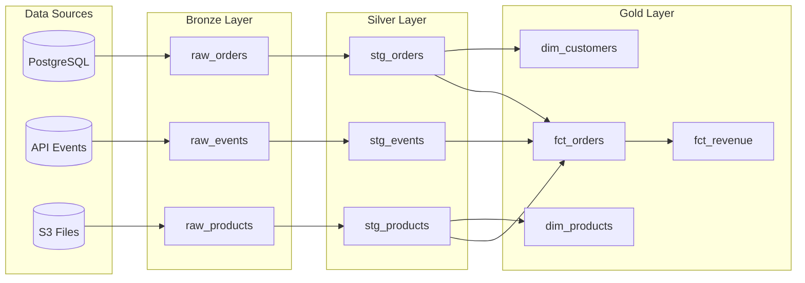
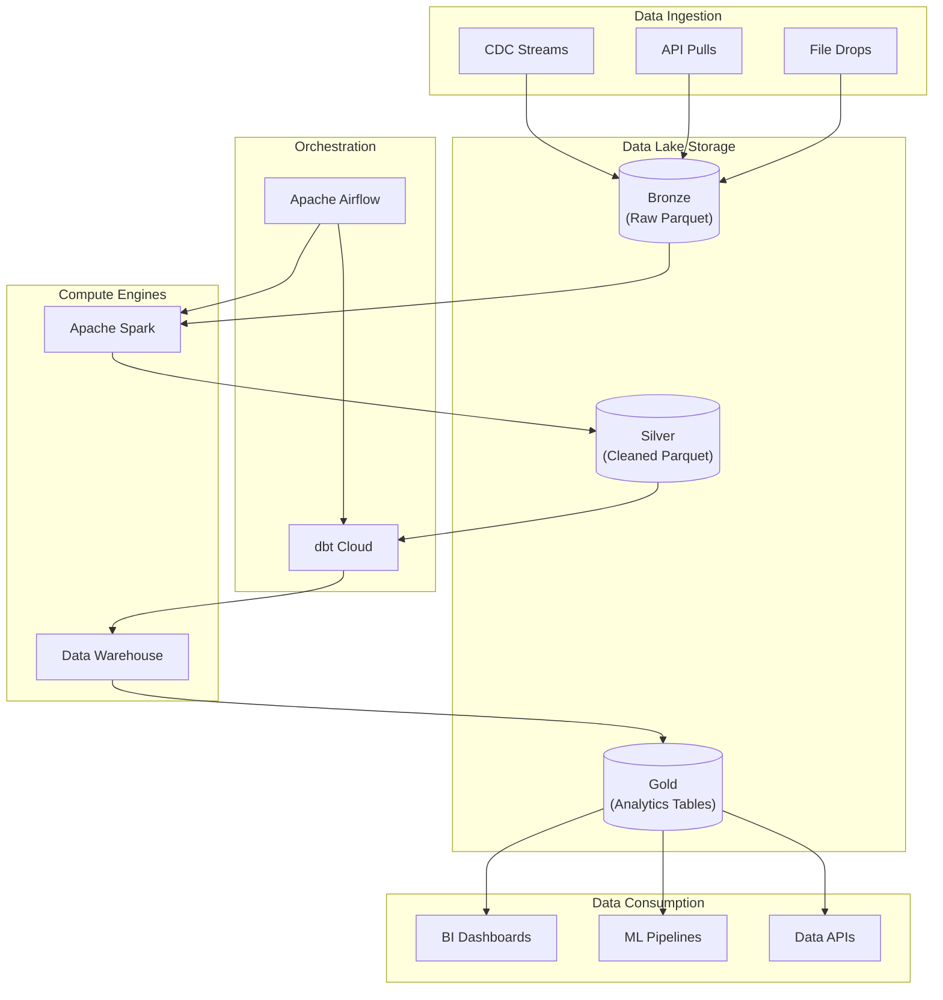
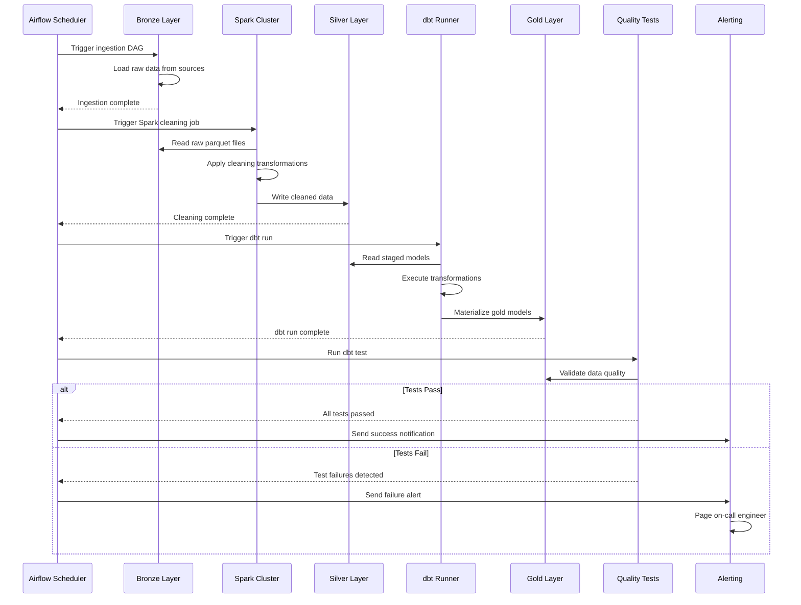

# How to Implement Data Transformation Patterns

Author: [nawazdhandala](https://github.com/nawazdhandala)

Tags: Data Pipeline, ETL, Data Transformation, dbt

Description: Learn to implement data transformation patterns for converting raw data into analytics-ready formats.

---

Raw data is rarely useful in its original form. It arrives messy, inconsistent, and scattered across dozens of sources. The transformation layer is where chaos becomes insight. Whether you are building a modern data lakehouse or migrating from legacy ETL, understanding transformation patterns is essential for creating reliable, maintainable data pipelines.

This guide covers the core patterns, practical implementations in dbt and Spark, and testing strategies that catch errors before they reach production.

## Why Transformation Patterns Matter

Data transformation is not just about moving data from A to B. It is about creating a consistent, trustworthy foundation for analytics. Without proper patterns:

- Analysts waste hours reconciling conflicting definitions
- Business logic gets duplicated across dozens of queries
- Schema changes break downstream reports
- Data quality issues propagate silently

Transformation patterns provide:

- **Consistency**: Same logic applied the same way everywhere
- **Reusability**: Write once, reference many times
- **Testability**: Validate data quality at every layer
- **Maintainability**: Clear structure that new team members can understand

---

## The Medallion Architecture

The most widely adopted pattern organizes transformations into distinct layers, often called the medallion architecture (bronze, silver, gold) or staging layers.



### Bronze Layer (Raw)

The bronze layer is a direct copy of source data with minimal transformation. The goal is to preserve the original data exactly as it arrived.

```sql
-- dbt model: models/bronze/raw_orders.sql
-- Bronze layer: Load raw orders exactly as received from source
-- Only add metadata columns for lineage tracking

{{
    config(
        materialized='incremental',
        unique_key='_source_id',
        partition_by={
            "field": "_loaded_at",
            "data_type": "timestamp",
            "granularity": "day"
        }
    )
}}

SELECT
    -- Preserve all source columns exactly as received
    *,

    -- Add lineage metadata for tracking and debugging
    CURRENT_TIMESTAMP() AS _loaded_at,
    '{{ invocation_id }}' AS _dbt_invocation_id,

    -- Create a unique identifier combining source system and record id
    CONCAT('orders_', CAST(id AS STRING)) AS _source_id

FROM {{ source('ecommerce', 'orders') }}


    -- Only load new or updated records
    WHERE updated_at > (SELECT MAX(updated_at) FROM {{ this }})

```

**Key principles for bronze layer:**

- Preserve source data types (do not cast or convert)
- Add metadata columns for lineage (_loaded_at, _source_system)
- Use incremental loading to avoid full refreshes
- Never apply business logic here

### Silver Layer (Cleaned and Standardized)

The silver layer standardizes data types, handles nulls, and applies basic cleaning rules. This is where you establish consistent naming conventions.

```sql
-- dbt model: models/silver/stg_orders.sql
-- Silver layer: Clean, standardize, and deduplicate order data
-- Apply consistent naming conventions and data types

{{
    config(
        materialized='view'
    )
}}

WITH source AS (
    SELECT * FROM {{ ref('raw_orders') }}
),

-- Remove exact duplicates that may have been loaded multiple times
deduplicated AS (
    SELECT
        *,
        ROW_NUMBER() OVER (
            PARTITION BY id
            ORDER BY _loaded_at DESC
        ) AS _row_num
    FROM source
),

-- Apply cleaning and standardization rules
cleaned AS (
    SELECT
        -- Standardize column names to snake_case
        id AS order_id,
        customer_id,

        -- Cast to appropriate data types with null handling
        CAST(order_date AS DATE) AS order_date,
        CAST(total_amount AS DECIMAL(18, 2)) AS order_total,

        -- Standardize categorical values
        LOWER(TRIM(status)) AS order_status,

        -- Handle null values with explicit defaults
        COALESCE(shipping_method, 'standard') AS shipping_method,
        COALESCE(discount_code, 'none') AS discount_code,

        -- Parse JSON fields if present
        JSON_EXTRACT_SCALAR(metadata, '$.source') AS order_source,
        JSON_EXTRACT_SCALAR(metadata, '$.device') AS order_device,

        -- Preserve audit columns
        _loaded_at,
        _source_id

    FROM deduplicated
    WHERE _row_num = 1  -- Keep only the most recent version
)

SELECT * FROM cleaned
```

**Silver layer transformations include:**

- Data type casting and standardization
- Null handling with explicit defaults
- Deduplication
- Column renaming to consistent conventions
- Basic data quality filters

### Gold Layer (Business Logic and Aggregations)

The gold layer contains business-ready models organized as dimensional tables (facts and dimensions).

```sql
-- dbt model: models/gold/fct_orders.sql
-- Gold layer: Business-ready order fact table
-- Contains calculated metrics and dimension keys for analytics

{{
    config(
        materialized='table',
        partition_by={
            "field": "order_date",
            "data_type": "date",
            "granularity": "month"
        },
        cluster_by=['customer_key', 'product_key']
    )
}}

WITH orders AS (
    SELECT * FROM {{ ref('stg_orders') }}
),

order_items AS (
    SELECT * FROM {{ ref('stg_order_items') }}
),

customers AS (
    SELECT * FROM {{ ref('dim_customers') }}
),

products AS (
    SELECT * FROM {{ ref('dim_products') }}
),

-- Calculate order-level metrics
order_metrics AS (
    SELECT
        o.order_id,
        o.order_date,
        o.order_status,
        o.shipping_method,

        -- Join to dimension tables for surrogate keys
        c.customer_key,

        -- Aggregate line items to order level
        COUNT(DISTINCT oi.product_id) AS distinct_products,
        SUM(oi.quantity) AS total_quantity,
        SUM(oi.unit_price * oi.quantity) AS gross_revenue,
        SUM(oi.discount_amount) AS total_discount,
        SUM(oi.unit_price * oi.quantity) - SUM(oi.discount_amount) AS net_revenue,

        -- Calculate order-level flags
        CASE
            WHEN o.order_total > 100 THEN TRUE
            ELSE FALSE
        END AS is_high_value_order,

        -- Determine first order flag for customer
        CASE
            WHEN o.order_date = c.first_order_date THEN TRUE
            ELSE FALSE
        END AS is_first_order,

        -- Calculate days since customer's previous order
        DATE_DIFF(
            o.order_date,
            LAG(o.order_date) OVER (
                PARTITION BY o.customer_id
                ORDER BY o.order_date
            ),
            DAY
        ) AS days_since_last_order

    FROM orders o
    LEFT JOIN order_items oi ON o.order_id = oi.order_id
    LEFT JOIN customers c ON o.customer_id = c.customer_id
    GROUP BY 1, 2, 3, 4, 5, c.first_order_date
)

SELECT
    -- Generate surrogate key for the fact table
    {{ dbt_utils.generate_surrogate_key(['order_id']) }} AS order_key,
    *,
    CURRENT_TIMESTAMP() AS _processed_at

FROM order_metrics
```

---

## Core Transformation Patterns

### Pattern 1: Slowly Changing Dimensions (SCD Type 2)

Track historical changes to dimension attributes over time.

```sql
-- dbt model: models/gold/dim_customers_scd2.sql
-- Slowly Changing Dimension Type 2 for customers
-- Tracks full history of customer attribute changes

{{
    config(
        materialized='incremental',
        unique_key='customer_key'
    )
}}

WITH source AS (
    SELECT * FROM {{ ref('stg_customers') }}
),


-- Get current active records from the existing dimension
current_records AS (
    SELECT * FROM {{ this }}
    WHERE is_current = TRUE
),

-- Identify records that have changed
changed_records AS (
    SELECT
        s.*,
        c.customer_key AS existing_key,
        -- Check if any tracked attributes have changed
        CASE
            WHEN c.customer_key IS NULL THEN 'new'
            WHEN s.email != c.email
                OR s.segment != c.segment
                OR s.loyalty_tier != c.loyalty_tier
            THEN 'changed'
            ELSE 'unchanged'
        END AS record_status
    FROM source s
    LEFT JOIN current_records c ON s.customer_id = c.customer_id
),

-- Close out changed records by setting end date
records_to_close AS (
    SELECT
        c.customer_key,
        c.customer_id,
        c.customer_name,
        c.email,
        c.segment,
        c.loyalty_tier,
        c.valid_from,
        CURRENT_TIMESTAMP() AS valid_to,
        FALSE AS is_current
    FROM current_records c
    INNER JOIN changed_records ch
        ON c.customer_id = ch.customer_id
    WHERE ch.record_status = 'changed'
),

-- Insert new versions for changed and new records
records_to_insert AS (
    SELECT
        {{ dbt_utils.generate_surrogate_key(['customer_id', 'CURRENT_TIMESTAMP()']) }} AS customer_key,
        customer_id,
        customer_name,
        email,
        segment,
        loyalty_tier,
        CURRENT_TIMESTAMP() AS valid_from,
        CAST(NULL AS TIMESTAMP) AS valid_to,
        TRUE AS is_current
    FROM changed_records
    WHERE record_status IN ('new', 'changed')
)

SELECT * FROM records_to_close
UNION ALL
SELECT * FROM records_to_insert


-- Initial load: all records are new
SELECT
    {{ dbt_utils.generate_surrogate_key(['customer_id', 'CURRENT_TIMESTAMP()']) }} AS customer_key,
    customer_id,
    customer_name,
    email,
    segment,
    loyalty_tier,
    CURRENT_TIMESTAMP() AS valid_from,
    CAST(NULL AS TIMESTAMP) AS valid_to,
    TRUE AS is_current
FROM source


```

### Pattern 2: Snapshot Tables for Point-in-Time Analysis

Capture the state of a table at specific intervals for historical reporting.

```yaml
# dbt snapshot: snapshots/orders_snapshot.yml
# Captures daily snapshots of order status for SLA tracking

snapshots:
  - name: orders_snapshot
    relation: ref('stg_orders')
    config:
      strategy: timestamp
      unique_key: order_id
      updated_at: updated_at
      # Invalidate records that change
      invalidate_hard_deletes: true
```

```sql
-- dbt snapshot: snapshots/orders_snapshot.sql
-- Track order status changes over time for SLA analysis



{{
    config(
        target_schema='snapshots',
        unique_key='order_id',
        strategy='timestamp',
        updated_at='updated_at',
        invalidate_hard_deletes=true
    )
}}

SELECT
    order_id,
    customer_id,
    order_status,
    order_total,
    shipping_method,
    updated_at

FROM {{ ref('stg_orders') }}


```

### Pattern 3: Denormalization for Analytics

Flatten nested structures and pre-join tables for query performance.

```sql
-- dbt model: models/gold/wide_order_details.sql
-- Denormalized order view for analytics dashboards
-- Pre-joins all related dimensions to avoid runtime joins

{{
    config(
        materialized='table',
        partition_by={"field": "order_date", "data_type": "date"}
    )
}}

SELECT
    -- Order facts
    f.order_key,
    f.order_id,
    f.order_date,
    f.order_status,
    f.net_revenue,
    f.total_quantity,

    -- Customer dimension (flattened)
    c.customer_key,
    c.customer_id,
    c.customer_name,
    c.email AS customer_email,
    c.segment AS customer_segment,
    c.loyalty_tier,
    c.lifetime_value AS customer_ltv,
    c.first_order_date AS customer_first_order,

    -- Product dimension (flattened from line items)
    p.product_key,
    p.product_name,
    p.category AS product_category,
    p.subcategory AS product_subcategory,
    p.brand AS product_brand,

    -- Date dimension (for easy filtering)
    d.day_of_week,
    d.week_of_year,
    d.month_name,
    d.quarter,
    d.fiscal_year,
    d.is_weekend,
    d.is_holiday,

    -- Geography dimension
    g.city,
    g.state,
    g.country,
    g.region,
    g.timezone

FROM {{ ref('fct_orders') }} f
LEFT JOIN {{ ref('dim_customers') }} c ON f.customer_key = c.customer_key
LEFT JOIN {{ ref('dim_products') }} p ON f.product_key = p.product_key
LEFT JOIN {{ ref('dim_date') }} d ON f.order_date = d.date_day
LEFT JOIN {{ ref('dim_geography') }} g ON c.geography_key = g.geography_key
```

---

## Apache Spark Transformation Patterns

For large-scale data processing, Apache Spark provides powerful transformation capabilities.

### Spark DataFrame Transformations

```python
# spark_transformations.py
# Common transformation patterns implemented in PySpark
# Designed for processing large-scale event data

from pyspark.sql import SparkSession, DataFrame
from pyspark.sql import functions as F
from pyspark.sql.window import Window
from typing import List, Dict


def create_spark_session(app_name: str) -> SparkSession:
    """
    Initialize a Spark session with optimized configurations
    for data transformation workloads.
    """
    return (
        SparkSession.builder
        .appName(app_name)
        .config("spark.sql.adaptive.enabled", "true")  # Enable adaptive query execution
        .config("spark.sql.adaptive.coalescePartitions.enabled", "true")
        .config("spark.sql.shuffle.partitions", "200")  # Adjust based on cluster size
        .getOrCreate()
    )


def clean_and_standardize(
    df: DataFrame,
    string_columns: List[str],
    date_columns: Dict[str, str]
) -> DataFrame:
    """
    Apply standard cleaning transformations to a DataFrame.

    Args:
        df: Input DataFrame
        string_columns: Columns to trim and lowercase
        date_columns: Dict mapping column names to date formats

    Returns:
        Cleaned DataFrame with standardized values
    """
    result = df

    # Standardize string columns: trim whitespace, lowercase
    for col in string_columns:
        result = result.withColumn(
            col,
            F.lower(F.trim(F.col(col)))
        )

    # Parse date columns with specified formats
    for col, fmt in date_columns.items():
        result = result.withColumn(
            col,
            F.to_date(F.col(col), fmt)
        )

    return result


def deduplicate_with_window(
    df: DataFrame,
    partition_cols: List[str],
    order_col: str,
    keep: str = "last"
) -> DataFrame:
    """
    Remove duplicates keeping either first or last record
    based on ordering column.

    Args:
        df: Input DataFrame with potential duplicates
        partition_cols: Columns that define duplicate groups
        order_col: Column to order by within each group
        keep: Either 'first' or 'last'

    Returns:
        Deduplicated DataFrame
    """
    # Create window specification for ranking duplicates
    window_spec = Window.partitionBy(partition_cols)

    if keep == "last":
        window_spec = window_spec.orderBy(F.col(order_col).desc())
    else:
        window_spec = window_spec.orderBy(F.col(order_col).asc())

    return (
        df
        .withColumn("_row_num", F.row_number().over(window_spec))
        .filter(F.col("_row_num") == 1)
        .drop("_row_num")
    )


def calculate_rolling_metrics(
    df: DataFrame,
    partition_col: str,
    order_col: str,
    value_col: str,
    windows: List[int]
) -> DataFrame:
    """
    Calculate rolling aggregations over multiple window sizes.
    Useful for time-series feature engineering.

    Args:
        df: Input DataFrame with time-series data
        partition_col: Column to partition by (e.g., customer_id)
        order_col: Column to order by (e.g., event_date)
        value_col: Column to aggregate
        windows: List of window sizes in days

    Returns:
        DataFrame with rolling metric columns added
    """
    result = df

    for window_size in windows:
        # Define window: previous N days including current row
        window_spec = (
            Window
            .partitionBy(partition_col)
            .orderBy(F.col(order_col).cast("long"))
            .rangeBetween(-window_size * 86400, 0)  # Convert days to seconds
        )

        # Add rolling sum
        result = result.withColumn(
            f"{value_col}_sum_{window_size}d",
            F.sum(value_col).over(window_spec)
        )

        # Add rolling average
        result = result.withColumn(
            f"{value_col}_avg_{window_size}d",
            F.avg(value_col).over(window_spec)
        )

        # Add rolling count
        result = result.withColumn(
            f"{value_col}_count_{window_size}d",
            F.count(value_col).over(window_spec)
        )

    return result


def pivot_events_to_features(
    df: DataFrame,
    entity_col: str,
    event_type_col: str,
    value_col: str,
    agg_func: str = "sum"
) -> DataFrame:
    """
    Pivot event data into a wide feature table.
    Converts rows of events into columns of features.

    Args:
        df: Input DataFrame with event data
        entity_col: Column identifying the entity (e.g., user_id)
        event_type_col: Column containing event types to pivot
        value_col: Column containing values to aggregate
        agg_func: Aggregation function ('sum', 'count', 'avg')

    Returns:
        Wide DataFrame with one row per entity
    """
    # Get distinct event types for pivot columns
    event_types = (
        df
        .select(event_type_col)
        .distinct()
        .rdd
        .flatMap(lambda x: x)
        .collect()
    )

    # Pivot the DataFrame
    pivoted = (
        df
        .groupBy(entity_col)
        .pivot(event_type_col, event_types)
        .agg(
            F.sum(value_col) if agg_func == "sum"
            else F.count(value_col) if agg_func == "count"
            else F.avg(value_col)
        )
    )

    # Fill nulls with zeros for missing event types
    for event_type in event_types:
        pivoted = pivoted.withColumn(
            event_type,
            F.coalesce(F.col(event_type), F.lit(0))
        )

    return pivoted


def apply_scd_type2(
    current_dim: DataFrame,
    updates: DataFrame,
    key_col: str,
    tracked_cols: List[str]
) -> DataFrame:
    """
    Apply SCD Type 2 logic to a dimension table.
    Tracks historical changes by versioning records.

    Args:
        current_dim: Current dimension table with is_current flag
        updates: New/updated records from source
        key_col: Natural key column
        tracked_cols: Columns to track for changes

    Returns:
        Updated dimension table with history preserved
    """
    # Get current active records
    active_records = current_dim.filter(F.col("is_current") == True)

    # Join to find changed records
    joined = updates.alias("upd").join(
        active_records.alias("cur"),
        F.col(f"upd.{key_col}") == F.col(f"cur.{key_col}"),
        "left"
    )

    # Build change detection expression
    change_conditions = [
        F.col(f"upd.{col}") != F.col(f"cur.{col}")
        for col in tracked_cols
    ]
    has_changed = change_conditions[0]
    for cond in change_conditions[1:]:
        has_changed = has_changed | cond

    # Records to close (existing records that changed)
    records_to_close = (
        joined
        .filter(F.col(f"cur.{key_col}").isNotNull() & has_changed)
        .select(
            *[F.col(f"cur.{c}").alias(c) for c in current_dim.columns if c not in ["valid_to", "is_current"]],
            F.current_timestamp().alias("valid_to"),
            F.lit(False).alias("is_current")
        )
    )

    # New records to insert
    new_records = (
        joined
        .filter(
            F.col(f"cur.{key_col}").isNull() | has_changed
        )
        .select(
            *[F.col(f"upd.{c}") for c in updates.columns],
            F.current_timestamp().alias("valid_from"),
            F.lit(None).cast("timestamp").alias("valid_to"),
            F.lit(True).alias("is_current")
        )
    )

    # Unchanged current records
    unchanged = (
        joined
        .filter(~has_changed | F.col(f"cur.{key_col}").isNull())
        .select(*[F.col(f"cur.{c}") for c in current_dim.columns])
    )

    # Historical records (not current)
    historical = current_dim.filter(F.col("is_current") == False)

    return historical.union(unchanged).union(records_to_close).union(new_records)


# Example usage demonstrating the transformation pipeline
if __name__ == "__main__":
    spark = create_spark_session("DataTransformationPipeline")

    # Load raw events
    raw_events = spark.read.parquet("s3://data-lake/bronze/events/")

    # Step 1: Clean and standardize
    cleaned_events = clean_and_standardize(
        df=raw_events,
        string_columns=["event_type", "user_agent", "country"],
        date_columns={"event_timestamp": "yyyy-MM-dd HH:mm:ss"}
    )

    # Step 2: Deduplicate
    deduped_events = deduplicate_with_window(
        df=cleaned_events,
        partition_cols=["event_id"],
        order_col="processed_at",
        keep="last"
    )

    # Step 3: Calculate rolling metrics per user
    events_with_metrics = calculate_rolling_metrics(
        df=deduped_events,
        partition_col="user_id",
        order_col="event_timestamp",
        value_col="event_value",
        windows=[7, 30, 90]
    )

    # Step 4: Pivot to feature table
    user_features = pivot_events_to_features(
        df=events_with_metrics,
        entity_col="user_id",
        event_type_col="event_type",
        value_col="event_value",
        agg_func="sum"
    )

    # Write to gold layer
    user_features.write.mode("overwrite").parquet("s3://data-lake/gold/user_features/")
```

---

## Data Flow Architecture

Here is how transformations fit into a complete data pipeline architecture:



---

## Testing Strategies

Data quality testing is critical for maintaining trust in your transformations.

### Schema Tests in dbt

```yaml
# models/gold/schema.yml
# Define data quality tests for gold layer models

version: 2

models:
  - name: fct_orders
    description: "Order fact table with calculated metrics"

    # Model-level tests
    tests:
      # Ensure row count is reasonable (not empty, not duplicated)
      - dbt_utils.expression_is_true:
          expression: "count(*) > 0"

      # Ensure no future dates
      - dbt_utils.expression_is_true:
          expression: "max(order_date) <= current_date()"

    columns:
      - name: order_key
        description: "Surrogate key for the order"
        tests:
          - unique
          - not_null

      - name: order_id
        description: "Natural key from source system"
        tests:
          - unique
          - not_null

      - name: customer_key
        description: "Foreign key to dim_customers"
        tests:
          - not_null
          - relationships:
              to: ref('dim_customers')
              field: customer_key

      - name: order_status
        description: "Current status of the order"
        tests:
          - not_null
          - accepted_values:
              values: ['pending', 'confirmed', 'shipped', 'delivered', 'cancelled', 'refunded']

      - name: net_revenue
        description: "Order revenue after discounts"
        tests:
          - not_null
          - dbt_utils.expression_is_true:
              expression: ">= 0"
              config:
                severity: error

      - name: order_date
        description: "Date the order was placed"
        tests:
          - not_null
          # Ensure reasonable date range
          - dbt_utils.accepted_range:
              min_value: "'2020-01-01'"
              max_value: "current_date()"

  - name: dim_customers
    description: "Customer dimension with current attributes"

    columns:
      - name: customer_key
        tests:
          - unique
          - not_null

      - name: email
        tests:
          - unique
          - not_null
          # Validate email format
          - dbt_utils.expression_is_true:
              expression: "regexp_contains(email, r'^[a-zA-Z0-9._%+-]+@[a-zA-Z0-9.-]+\\.[a-zA-Z]{2,}$')"

      - name: segment
        tests:
          - accepted_values:
              values: ['enterprise', 'mid_market', 'smb', 'consumer']

      - name: lifetime_value
        tests:
          - dbt_utils.expression_is_true:
              expression: ">= 0"
```

### Custom Data Quality Tests

```sql
-- tests/assert_order_totals_match.sql
-- Custom test: Verify that order totals match sum of line items
-- Returns rows where there is a mismatch (test fails if any rows returned)

WITH order_totals AS (
    SELECT
        order_id,
        net_revenue AS fact_total
    FROM {{ ref('fct_orders') }}
),

line_item_totals AS (
    SELECT
        order_id,
        SUM(quantity * unit_price - discount_amount) AS calculated_total
    FROM {{ ref('stg_order_items') }}
    GROUP BY order_id
),

mismatches AS (
    SELECT
        o.order_id,
        o.fact_total,
        l.calculated_total,
        ABS(o.fact_total - l.calculated_total) AS difference
    FROM order_totals o
    INNER JOIN line_item_totals l ON o.order_id = l.order_id
    -- Allow for small floating point differences
    WHERE ABS(o.fact_total - l.calculated_total) > 0.01
)

SELECT * FROM mismatches
```

```sql
-- tests/assert_no_orphan_facts.sql
-- Custom test: Ensure all fact records have valid dimension references
-- Critical for referential integrity in star schemas

WITH orphaned_orders AS (
    SELECT
        f.order_key,
        f.order_id,
        f.customer_key,
        'missing_customer' AS issue
    FROM {{ ref('fct_orders') }} f
    LEFT JOIN {{ ref('dim_customers') }} c ON f.customer_key = c.customer_key
    WHERE c.customer_key IS NULL

    UNION ALL

    SELECT
        f.order_key,
        f.order_id,
        f.product_key,
        'missing_product' AS issue
    FROM {{ ref('fct_orders') }} f
    LEFT JOIN {{ ref('dim_products') }} p ON f.product_key = p.product_key
    WHERE p.product_key IS NULL
)

SELECT * FROM orphaned_orders
```

### Great Expectations Integration

For more sophisticated data quality checks, integrate Great Expectations with your pipeline:

```python
# great_expectations_suite.py
# Define comprehensive data quality expectations for the gold layer

import great_expectations as gx
from great_expectations.core.expectation_configuration import ExpectationConfiguration


def create_order_expectations_suite():
    """
    Create a Great Expectations suite for validating order data.
    These expectations run after dbt transformations complete.
    """
    context = gx.get_context()

    suite = context.add_expectation_suite(
        expectation_suite_name="fct_orders_suite"
    )

    # Expect table to have data
    suite.add_expectation(
        ExpectationConfiguration(
            expectation_type="expect_table_row_count_to_be_between",
            kwargs={
                "min_value": 1000,  # Minimum expected orders
                "max_value": 10000000  # Sanity check upper bound
            }
        )
    )

    # Expect no duplicate order keys
    suite.add_expectation(
        ExpectationConfiguration(
            expectation_type="expect_column_values_to_be_unique",
            kwargs={"column": "order_key"}
        )
    )

    # Expect order dates within valid range
    suite.add_expectation(
        ExpectationConfiguration(
            expectation_type="expect_column_values_to_be_between",
            kwargs={
                "column": "order_date",
                "min_value": "2020-01-01",
                "max_value": "2026-12-31",
                "parse_strings_as_datetimes": True
            }
        )
    )

    # Expect revenue to be positive
    suite.add_expectation(
        ExpectationConfiguration(
            expectation_type="expect_column_values_to_be_between",
            kwargs={
                "column": "net_revenue",
                "min_value": 0,
                "max_value": 1000000  # Flag unusually large orders
            }
        )
    )

    # Expect order status distribution to be reasonable
    suite.add_expectation(
        ExpectationConfiguration(
            expectation_type="expect_column_distinct_values_to_be_in_set",
            kwargs={
                "column": "order_status",
                "value_set": ["pending", "confirmed", "shipped", "delivered", "cancelled", "refunded"]
            }
        )
    )

    # Expect customer key to never be null
    suite.add_expectation(
        ExpectationConfiguration(
            expectation_type="expect_column_values_to_not_be_null",
            kwargs={"column": "customer_key"}
        )
    )

    # Expect reasonable percentage of high-value orders (business logic check)
    suite.add_expectation(
        ExpectationConfiguration(
            expectation_type="expect_column_proportion_of_unique_values_to_be_between",
            kwargs={
                "column": "is_high_value_order",
                "min_value": 0.05,  # At least 5% high value
                "max_value": 0.50   # No more than 50% high value
            }
        )
    )

    context.save_expectation_suite(suite)
    return suite
```

---

## Transformation Pipeline Orchestration



### Airflow DAG Example

```python
# dags/data_transformation_pipeline.py
# Orchestrates the complete transformation pipeline
# Runs daily to process new data through all layers

from datetime import datetime, timedelta
from airflow import DAG
from airflow.operators.python import PythonOperator
from airflow.providers.apache.spark.operators.spark_submit import SparkSubmitOperator
from airflow.providers.dbt.cloud.operators.dbt import DbtCloudRunJobOperator
from airflow.operators.bash import BashOperator
from airflow.utils.task_group import TaskGroup


# Default arguments for all tasks
default_args = {
    "owner": "data-engineering",
    "depends_on_past": False,
    "email_on_failure": True,
    "email_on_retry": False,
    "email": ["data-alerts@company.com"],
    "retries": 2,
    "retry_delay": timedelta(minutes=5),
}

# DAG definition
with DAG(
    dag_id="data_transformation_pipeline",
    default_args=default_args,
    description="Daily data transformation pipeline: Bronze -> Silver -> Gold",
    schedule_interval="0 6 * * *",  # Run at 6 AM UTC daily
    start_date=datetime(2026, 1, 1),
    catchup=False,
    tags=["transformation", "dbt", "spark"],
) as dag:

    # Task Group: Bronze layer ingestion
    with TaskGroup(group_id="bronze_ingestion") as bronze_tasks:

        ingest_orders = BashOperator(
            task_id="ingest_orders",
            bash_command="python /opt/airflow/scripts/ingest_orders.py --date {{ ds }}",
        )

        ingest_events = BashOperator(
            task_id="ingest_events",
            bash_command="python /opt/airflow/scripts/ingest_events.py --date {{ ds }}",
        )

        ingest_products = BashOperator(
            task_id="ingest_products",
            bash_command="python /opt/airflow/scripts/ingest_products.py --date {{ ds }}",
        )

    # Task Group: Silver layer cleaning with Spark
    with TaskGroup(group_id="silver_transformation") as silver_tasks:

        clean_orders = SparkSubmitOperator(
            task_id="clean_orders",
            application="/opt/airflow/spark_jobs/clean_orders.py",
            conn_id="spark_default",
            conf={
                "spark.executor.memory": "4g",
                "spark.executor.cores": "2",
                "spark.dynamicAllocation.enabled": "true",
            },
            application_args=["--date", "{{ ds }}"],
        )

        clean_events = SparkSubmitOperator(
            task_id="clean_events",
            application="/opt/airflow/spark_jobs/clean_events.py",
            conn_id="spark_default",
            conf={
                "spark.executor.memory": "8g",
                "spark.executor.cores": "4",
            },
            application_args=["--date", "{{ ds }}"],
        )

    # Task: Run dbt models for gold layer
    run_dbt_models = DbtCloudRunJobOperator(
        task_id="run_dbt_gold_models",
        dbt_cloud_conn_id="dbt_cloud_default",
        job_id=12345,  # dbt Cloud job ID
        check_interval=30,
        timeout=3600,
    )

    # Task: Run dbt tests
    run_dbt_tests = DbtCloudRunJobOperator(
        task_id="run_dbt_tests",
        dbt_cloud_conn_id="dbt_cloud_default",
        job_id=12346,  # dbt Cloud test job ID
        check_interval=30,
        timeout=1800,
    )

    # Task: Run Great Expectations validation
    run_great_expectations = PythonOperator(
        task_id="run_great_expectations",
        python_callable=lambda: __import__("great_expectations_suite").run_validation(),
    )

    # Task: Send success notification
    notify_success = BashOperator(
        task_id="notify_success",
        bash_command='echo "Pipeline completed successfully for {{ ds }}"',
        trigger_rule="all_success",
    )

    # Define task dependencies
    bronze_tasks >> silver_tasks >> run_dbt_models >> run_dbt_tests >> run_great_expectations >> notify_success
```

---

## Common Transformation Patterns Reference

| Pattern | Use Case | Implementation |
|---------|----------|----------------|
| **Deduplication** | Remove duplicate records from sources | Window functions with ROW_NUMBER |
| **SCD Type 1** | Overwrite dimension attributes | Simple UPDATE or MERGE |
| **SCD Type 2** | Track attribute history | Version records with valid_from/valid_to |
| **Pivot** | Convert rows to columns | PIVOT or CASE WHEN aggregations |
| **Unpivot** | Convert columns to rows | UNPIVOT or UNION ALL |
| **Surrogate Keys** | Generate stable primary keys | Hash functions or sequences |
| **Late Arriving Facts** | Handle out-of-order data | Idempotent incremental loads |
| **Bridge Tables** | Handle many-to-many relationships | Separate association tables |
| **Junk Dimensions** | Consolidate low-cardinality flags | Single dimension for flags |
| **Conforming Dimensions** | Share dimensions across fact tables | Central dimension models |

---

## Best Practices Summary

**Design Principles:**

1. **Layer your transformations**: Bronze (raw), Silver (cleaned), Gold (business-ready)
2. **Make transformations idempotent**: Running twice should produce the same result
3. **Document business logic**: Future you will thank present you
4. **Version control everything**: Models, tests, and configurations

**Performance Tips:**

1. **Partition by date**: Most queries filter by time
2. **Cluster by high-cardinality join keys**: Speeds up joins significantly
3. **Materialize heavy transformations**: Views are not always the answer
4. **Use incremental models**: Avoid full table scans when possible

**Testing Strategy:**

1. **Schema tests**: Uniqueness, not null, accepted values
2. **Referential integrity**: Foreign keys should always resolve
3. **Business logic tests**: Calculated fields should match expectations
4. **Freshness tests**: Data should arrive on schedule

**Monitoring:**

1. **Track row counts**: Sudden drops indicate ingestion issues
2. **Monitor test failures**: Set up alerts for quality degradation
3. **Log transformation metadata**: Know what ran, when, and how long

---

## Conclusion

Data transformation is where raw data becomes business value. By implementing consistent patterns, you create a maintainable, testable, and scalable data platform. Start with the medallion architecture, add comprehensive testing, and iterate based on your specific needs.

The patterns in this guide provide a foundation, but every organization has unique requirements. Adapt these patterns to fit your data volumes, latency requirements, and team capabilities. The goal is not perfection on day one, but continuous improvement toward reliable, trustworthy data.

**Next Steps:**

- Set up your bronze/silver/gold layer structure
- Implement schema tests for your most critical models
- Add data freshness monitoring to catch ingestion delays
- Document your transformation logic for team onboarding

---

**Related Reading:**

- [Three Pillars of Observability: Logs, Metrics, and Traces](https://oneuptime.com/blog/post/2025-08-20-three-pillars-of-observability-logs-metrics-traces/view)
- [Monitoring vs Observability for SRE](https://oneuptime.com/blog/post/2025-11-28-monitoring-vs-observability-sre/view)
- [What is OpenTelemetry Collector and Why Use One](https://oneuptime.com/blog/post/2025-09-18-what-is-opentelemetry-collector-and-why-use-one/view)
