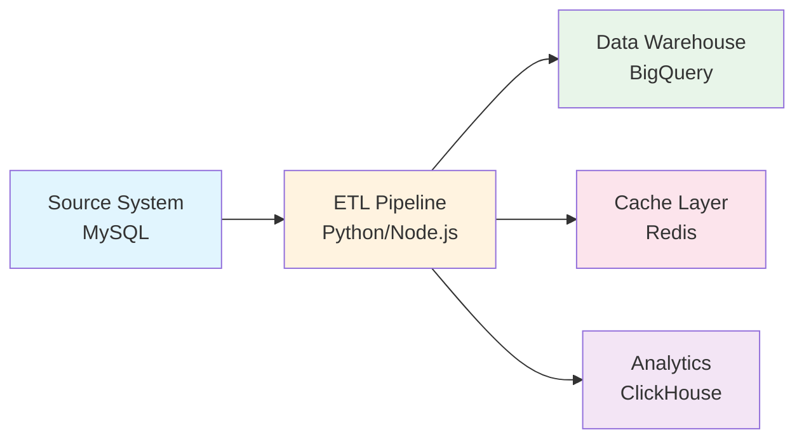
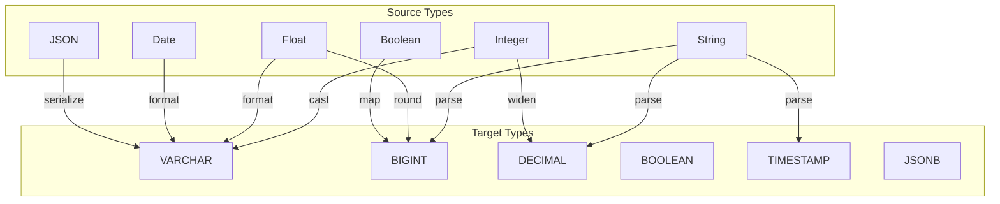
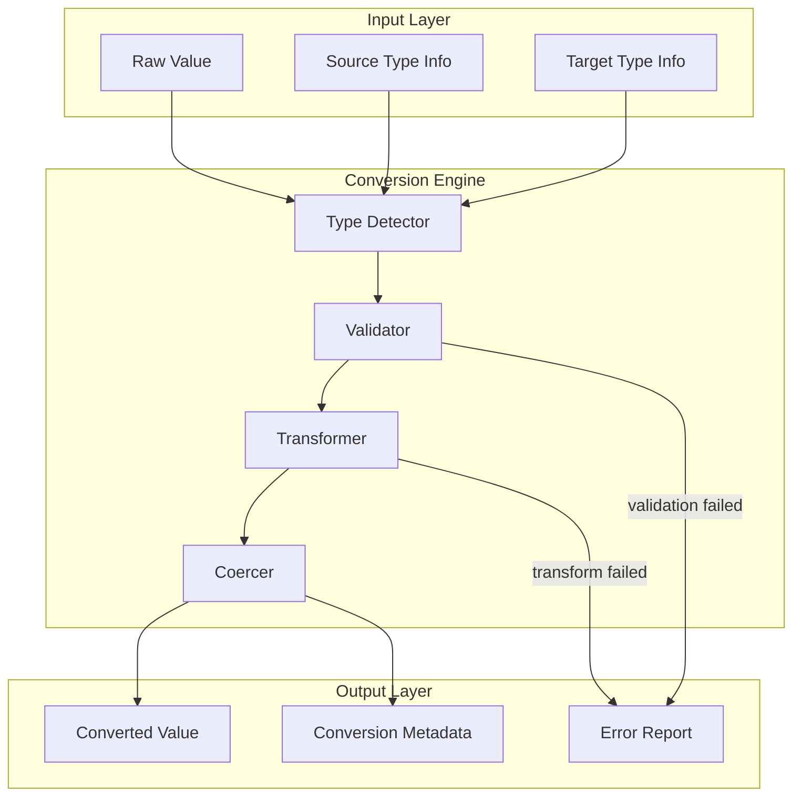
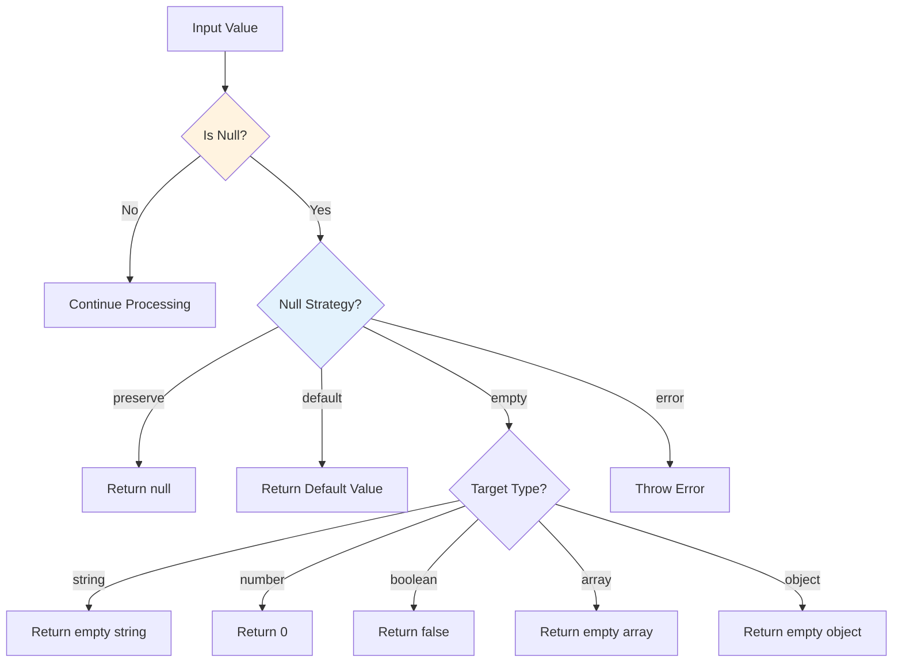
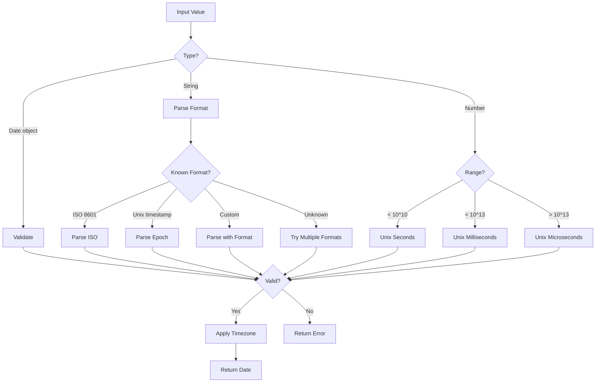
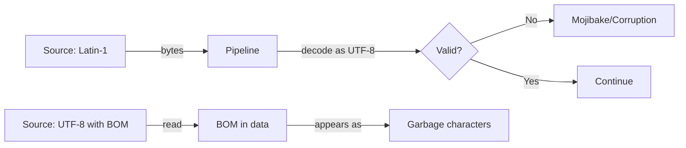
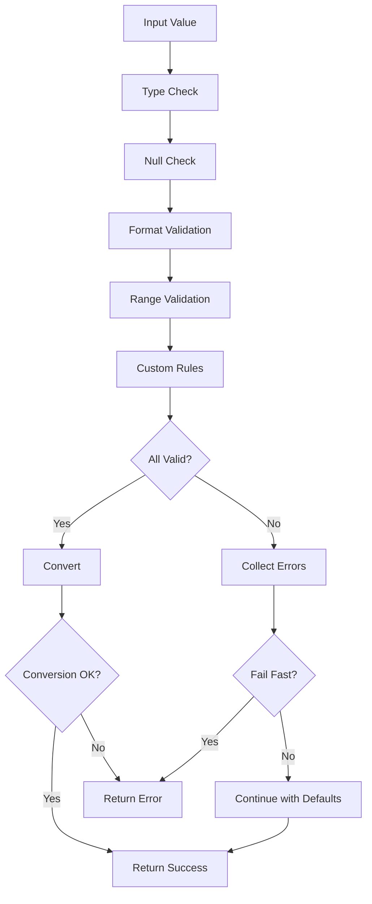

# How to Create Data Type Conversion

Author: [nawazdhandala](https://github.com/nawazdhandala)

Tags: Data Pipeline, Data Types, Type Conversion, ETL

Description: Learn to create data type conversion for handling type mismatches between source and target systems.

---

> Data pipelines fail silently when types do not match. A string that looks like a number, a date in an unexpected format, or a null where you expected a value can corrupt downstream analytics and break production systems.

Type conversion is one of the most critical yet underappreciated aspects of building robust data pipelines. Whether you are moving data between databases, ingesting from APIs, or processing event streams, you will inevitably encounter type mismatches that require careful handling.

This guide provides practical patterns, code examples, and strategies for implementing type conversion that handles edge cases gracefully and maintains data integrity across your pipeline.

---

## Table of Contents

1. Why Type Conversion Matters
2. Common Type Mismatch Scenarios
3. Type Mapping Reference Tables
4. Building a Type Conversion Framework
5. Primitive Type Conversions
6. Complex Type Conversions
7. Handling Null and Missing Values
8. Date and Time Conversions
9. Numeric Precision and Scale
10. String Encoding and Normalization
11. Type Coercion Strategies
12. Validation and Error Handling
13. Performance Considerations
14. Testing Type Conversions
15. Putting It All Together

---

## 1. Why Type Conversion Matters

Data flows through multiple systems, each with its own type system:



Each transition is a potential failure point:

| Transition | Common Issues |
|------------|---------------|
| Database to Application | DECIMAL loses precision as float, DATE becomes string |
| API to Database | JSON numbers have no integer/float distinction |
| CSV Import | Everything is a string, nulls are empty strings |
| Cross-database Migration | BOOLEAN vs TINYINT, TIMESTAMP vs DATETIME |

Without proper conversion:
- Silent data corruption (12.99 becomes 12.989999999999998)
- Failed inserts (string "null" into NOT NULL column)
- Incorrect aggregations (string concatenation instead of numeric sum)
- Timezone disasters (UTC stored as local time)

---

## 2. Common Type Mismatch Scenarios

### Source to Target Type Matrix



### Real-World Examples

| Source Value | Source Type | Target Type | Challenge |
|--------------|-------------|-------------|-----------|
| "123.45" | String | DECIMAL(10,2) | Parse and validate precision |
| 1706659200 | Integer | TIMESTAMP | Unix epoch to datetime |
| "true" | String | BOOLEAN | Case-insensitive parsing |
| "" | String | INTEGER | Empty string vs null vs zero |
| "2024-01-30" | String | DATE | Multiple format possibilities |
| null | null | VARCHAR(255) | Null handling strategy |
| 9999999999999999 | BigInt | INTEGER | Overflow detection |

---

## 3. Type Mapping Reference Tables

### Cross-Database Type Mappings

| MySQL | PostgreSQL | BigQuery | ClickHouse | Python | TypeScript |
|-------|------------|----------|------------|--------|------------|
| TINYINT | SMALLINT | INT64 | Int8 | int | number |
| INT | INTEGER | INT64 | Int32 | int | number |
| BIGINT | BIGINT | INT64 | Int64 | int | bigint |
| FLOAT | REAL | FLOAT64 | Float32 | float | number |
| DOUBLE | DOUBLE PRECISION | FLOAT64 | Float64 | float | number |
| DECIMAL(p,s) | NUMERIC(p,s) | NUMERIC | Decimal(p,s) | Decimal | string |
| VARCHAR(n) | VARCHAR(n) | STRING | String | str | string |
| TEXT | TEXT | STRING | String | str | string |
| BOOLEAN | BOOLEAN | BOOL | UInt8 | bool | boolean |
| DATE | DATE | DATE | Date | date | Date |
| DATETIME | TIMESTAMP | DATETIME | DateTime | datetime | Date |
| JSON | JSONB | JSON | String | dict | object |
| BLOB | BYTEA | BYTES | String | bytes | Uint8Array |

### JSON to SQL Type Inference

| JSON Value | Inferred SQL Type | Notes |
|------------|-------------------|-------|
| true/false | BOOLEAN | Direct mapping |
| 123 | BIGINT | No decimal point |
| 123.45 | DECIMAL(38,18) or FLOAT | Precision matters |
| "hello" | VARCHAR(255) | Default length |
| "2024-01-30T12:00:00Z" | TIMESTAMP | ISO 8601 detection |
| null | Nullable column | Must handle explicitly |
| [] | JSON/ARRAY | Nested structure |
| {} | JSON/JSONB | Nested structure |

---

## 4. Building a Type Conversion Framework

### Architecture Overview



### Core Type Converter Interface (TypeScript)

```typescript
// types/converter.ts

/**
 * Represents the result of a type conversion operation.
 * Contains the converted value, success status, and any error information.
 */
interface ConversionResult<T> {
    success: boolean;           // Whether conversion succeeded
    value: T | null;            // The converted value (null if failed)
    originalValue: unknown;     // The input value for debugging
    sourceType: string;         // Detected or specified source type
    targetType: string;         // The target type we converted to
    warnings: string[];         // Non-fatal issues (e.g., precision loss)
    error?: string;             // Error message if success is false
}

/**
 * Configuration options for type conversion behavior.
 * Controls how edge cases and ambiguous values are handled.
 */
interface ConversionOptions {
    strict: boolean;            // If true, fail on any ambiguity
    nullValue: 'null' | 'empty' | 'default';  // How to handle nulls
    defaultValue?: unknown;     // Default when nullValue is 'default'
    trimStrings: boolean;       // Trim whitespace from strings
    dateFormat?: string;        // Expected date format (e.g., 'YYYY-MM-DD')
    timezone?: string;          // Timezone for date conversions
    decimalPrecision?: number;  // Max decimal places to preserve
    decimalScale?: number;      // Fixed decimal places
    truncateStrings?: number;   // Max string length
    booleanTrueValues?: string[];   // Values to interpret as true
    booleanFalseValues?: string[];  // Values to interpret as false
}

/**
 * Base interface for all type converters.
 * Each converter handles conversion to a specific target type.
 */
interface TypeConverter<T> {
    // The target type this converter produces
    targetType: string;

    // Check if this converter can handle the given source type
    canConvert(sourceType: string): boolean;

    // Perform the conversion with full result metadata
    convert(value: unknown, options?: Partial<ConversionOptions>): ConversionResult<T>;

    // Quick conversion that throws on failure
    convertOrThrow(value: unknown, options?: Partial<ConversionOptions>): T;
}
```

### Default Conversion Options

```typescript
// config/defaults.ts

/**
 * Default configuration for type conversions.
 * These defaults prioritize safety over convenience.
 */
const DEFAULT_CONVERSION_OPTIONS: ConversionOptions = {
    strict: false,              // Allow reasonable coercions
    nullValue: 'null',          // Preserve nulls as null
    trimStrings: true,          // Remove leading/trailing whitespace
    decimalPrecision: 18,       // High precision by default
    decimalScale: undefined,    // No fixed scale
    truncateStrings: undefined, // No truncation by default

    // Common boolean representations
    booleanTrueValues: [
        'true', 'yes', 'on', '1',
        't', 'y', 'enabled', 'active'
    ],
    booleanFalseValues: [
        'false', 'no', 'off', '0',
        'f', 'n', 'disabled', 'inactive'
    ],
};

/**
 * Merge user options with defaults.
 * User options take precedence over defaults.
 */
function mergeOptions(
    userOptions?: Partial<ConversionOptions>
): ConversionOptions {
    return {
        ...DEFAULT_CONVERSION_OPTIONS,
        ...userOptions,
    };
}

export { DEFAULT_CONVERSION_OPTIONS, mergeOptions };
```

---

## 5. Primitive Type Conversions

### String Converter

```typescript
// converters/string-converter.ts

import { ConversionResult, ConversionOptions, TypeConverter } from '../types/converter';
import { mergeOptions } from '../config/defaults';

/**
 * Converts values to string type.
 * Handles: numbers, booleans, dates, objects, arrays.
 */
class StringConverter implements TypeConverter<string> {
    targetType = 'string';

    canConvert(sourceType: string): boolean {
        // We can convert almost anything to a string
        return true;
    }

    convert(
        value: unknown,
        userOptions?: Partial<ConversionOptions>
    ): ConversionResult<string> {
        const options = mergeOptions(userOptions);
        const warnings: string[] = [];

        // Handle null/undefined based on options
        if (value === null || value === undefined) {
            return this.handleNull(value, options);
        }

        // Already a string
        if (typeof value === 'string') {
            return this.processString(value, options, warnings);
        }

        // Numbers - be careful with precision
        if (typeof value === 'number') {
            return this.convertNumber(value, options, warnings);
        }

        // Booleans
        if (typeof value === 'boolean') {
            return this.createSuccess(String(value), value, warnings);
        }

        // BigInt
        if (typeof value === 'bigint') {
            return this.createSuccess(value.toString(), value, warnings);
        }

        // Date objects
        if (value instanceof Date) {
            return this.convertDate(value, options, warnings);
        }

        // Arrays and objects - serialize to JSON
        if (typeof value === 'object') {
            return this.convertObject(value, options, warnings);
        }

        // Fallback - try toString()
        try {
            const result = String(value);
            warnings.push('Used fallback String() conversion');
            return this.createSuccess(result, value, warnings);
        } catch (error) {
            return this.createError(value, `Cannot convert to string: ${error}`);
        }
    }

    convertOrThrow(
        value: unknown,
        options?: Partial<ConversionOptions>
    ): string {
        const result = this.convert(value, options);
        if (!result.success) {
            throw new Error(result.error);
        }
        return result.value!;
    }

    // --- Private helper methods ---

    private handleNull(
        value: unknown,
        options: ConversionOptions
    ): ConversionResult<string> {
        switch (options.nullValue) {
            case 'empty':
                return this.createSuccess('', value, ['Null converted to empty string']);
            case 'default':
                const defaultVal = String(options.defaultValue ?? '');
                return this.createSuccess(defaultVal, value, ['Null converted to default']);
            case 'null':
            default:
                return {
                    success: true,
                    value: null,
                    originalValue: value,
                    sourceType: 'null',
                    targetType: this.targetType,
                    warnings: [],
                };
        }
    }

    private processString(
        value: string,
        options: ConversionOptions,
        warnings: string[]
    ): ConversionResult<string> {
        let result = value;

        // Trim whitespace if configured
        if (options.trimStrings) {
            const trimmed = result.trim();
            if (trimmed !== result) {
                warnings.push('Whitespace trimmed');
                result = trimmed;
            }
        }

        // Truncate if configured
        if (options.truncateStrings && result.length > options.truncateStrings) {
            warnings.push(`Truncated from ${result.length} to ${options.truncateStrings} chars`);
            result = result.substring(0, options.truncateStrings);
        }

        return this.createSuccess(result, value, warnings);
    }

    private convertNumber(
        value: number,
        options: ConversionOptions,
        warnings: string[]
    ): ConversionResult<string> {
        // Check for special values
        if (Number.isNaN(value)) {
            if (options.strict) {
                return this.createError(value, 'Cannot convert NaN to string in strict mode');
            }
            warnings.push('NaN converted to string');
            return this.createSuccess('NaN', value, warnings);
        }

        if (!Number.isFinite(value)) {
            if (options.strict) {
                return this.createError(value, 'Cannot convert Infinity to string in strict mode');
            }
            warnings.push('Infinity converted to string');
            return this.createSuccess(value > 0 ? 'Infinity' : '-Infinity', value, warnings);
        }

        // Use fixed precision if specified
        let result: string;
        if (options.decimalScale !== undefined) {
            result = value.toFixed(options.decimalScale);
        } else {
            // Avoid scientific notation for reasonable numbers
            result = value.toString();
            if (result.includes('e')) {
                result = value.toFixed(options.decimalPrecision ?? 18);
                // Remove trailing zeros
                result = result.replace(/\.?0+$/, '');
                warnings.push('Scientific notation converted to decimal');
            }
        }

        return this.createSuccess(result, value, warnings);
    }

    private convertDate(
        value: Date,
        options: ConversionOptions,
        warnings: string[]
    ): ConversionResult<string> {
        if (isNaN(value.getTime())) {
            return this.createError(value, 'Invalid Date object');
        }

        // Use ISO format by default for maximum compatibility
        const result = value.toISOString();
        return this.createSuccess(result, value, warnings);
    }

    private convertObject(
        value: object,
        options: ConversionOptions,
        warnings: string[]
    ): ConversionResult<string> {
        try {
            const result = JSON.stringify(value);
            warnings.push('Object serialized to JSON string');
            return this.createSuccess(result, value, warnings);
        } catch (error) {
            return this.createError(value, `Cannot serialize object: ${error}`);
        }
    }

    private createSuccess(
        converted: string,
        original: unknown,
        warnings: string[]
    ): ConversionResult<string> {
        return {
            success: true,
            value: converted,
            originalValue: original,
            sourceType: typeof original,
            targetType: this.targetType,
            warnings,
        };
    }

    private createError(
        original: unknown,
        error: string
    ): ConversionResult<string> {
        return {
            success: false,
            value: null,
            originalValue: original,
            sourceType: typeof original,
            targetType: this.targetType,
            warnings: [],
            error,
        };
    }
}

export { StringConverter };
```

### Integer Converter

```typescript
// converters/integer-converter.ts

import { ConversionResult, ConversionOptions, TypeConverter } from '../types/converter';
import { mergeOptions } from '../config/defaults';

/**
 * Converts values to integer type.
 * Handles: strings, floats, booleans, BigInts.
 *
 * Important considerations:
 * - JavaScript numbers are 64-bit floats, safe integer range is +/- 2^53
 * - For larger integers, consider using BigInt
 * - Decimal values require explicit rounding strategy
 */
class IntegerConverter implements TypeConverter<number> {
    targetType = 'integer';

    // JavaScript safe integer bounds
    private static readonly MIN_SAFE = Number.MIN_SAFE_INTEGER;  // -9007199254740991
    private static readonly MAX_SAFE = Number.MAX_SAFE_INTEGER;  //  9007199254740991

    canConvert(sourceType: string): boolean {
        const convertible = [
            'string', 'number', 'boolean', 'bigint'
        ];
        return convertible.includes(sourceType);
    }

    convert(
        value: unknown,
        userOptions?: Partial<ConversionOptions>
    ): ConversionResult<number> {
        const options = mergeOptions(userOptions);
        const warnings: string[] = [];

        // Handle null/undefined
        if (value === null || value === undefined) {
            return this.handleNull(value, options);
        }

        // Already a number
        if (typeof value === 'number') {
            return this.convertNumber(value, options, warnings);
        }

        // String to integer
        if (typeof value === 'string') {
            return this.convertString(value, options, warnings);
        }

        // Boolean to integer (true=1, false=0)
        if (typeof value === 'boolean') {
            return this.createSuccess(value ? 1 : 0, value, warnings);
        }

        // BigInt to number (may lose precision)
        if (typeof value === 'bigint') {
            return this.convertBigInt(value, options, warnings);
        }

        return this.createError(value, `Cannot convert ${typeof value} to integer`);
    }

    convertOrThrow(
        value: unknown,
        options?: Partial<ConversionOptions>
    ): number {
        const result = this.convert(value, options);
        if (!result.success) {
            throw new Error(result.error);
        }
        return result.value!;
    }

    // --- Private helper methods ---

    private handleNull(
        value: unknown,
        options: ConversionOptions
    ): ConversionResult<number> {
        switch (options.nullValue) {
            case 'default':
                const defaultVal = Number(options.defaultValue ?? 0);
                if (!Number.isInteger(defaultVal)) {
                    return this.createError(value, 'Default value is not an integer');
                }
                return this.createSuccess(defaultVal, value, ['Null converted to default']);
            case 'null':
            default:
                return {
                    success: true,
                    value: null,
                    originalValue: value,
                    sourceType: 'null',
                    targetType: this.targetType,
                    warnings: [],
                };
        }
    }

    private convertNumber(
        value: number,
        options: ConversionOptions,
        warnings: string[]
    ): ConversionResult<number> {
        // Check for special values
        if (Number.isNaN(value)) {
            return this.createError(value, 'Cannot convert NaN to integer');
        }

        if (!Number.isFinite(value)) {
            return this.createError(value, 'Cannot convert Infinity to integer');
        }

        // Check if already an integer
        if (Number.isInteger(value)) {
            return this.checkSafeBounds(value, value, options, warnings);
        }

        // Has decimal component - need rounding strategy
        if (options.strict) {
            return this.createError(
                value,
                `Strict mode: ${value} has decimal component`
            );
        }

        // Use truncation (toward zero) as default
        // Other strategies: Math.round(), Math.floor(), Math.ceil()
        const truncated = Math.trunc(value);
        warnings.push(`Decimal truncated: ${value} -> ${truncated}`);

        return this.checkSafeBounds(truncated, value, options, warnings);
    }

    private convertString(
        value: string,
        options: ConversionOptions,
        warnings: string[]
    ): ConversionResult<number> {
        // Trim whitespace
        let str = options.trimStrings ? value.trim() : value;

        // Handle empty string
        if (str === '') {
            if (options.strict) {
                return this.createError(value, 'Cannot convert empty string to integer');
            }
            return this.handleNull(null, options);
        }

        // Try parsing as integer first
        // parseInt stops at first non-digit, which can hide issues
        // Use Number() for stricter parsing, then validate
        const parsed = Number(str);

        if (Number.isNaN(parsed)) {
            return this.createError(value, `Cannot parse "${value}" as integer`);
        }

        // Check for trailing non-numeric characters that parseInt would ignore
        // e.g., "123abc" should fail in strict mode
        if (options.strict) {
            const strict = /^-?\d+$/.test(str);
            if (!strict) {
                return this.createError(
                    value,
                    `Strict mode: "${value}" contains non-integer characters`
                );
            }
        }

        return this.convertNumber(parsed, options, warnings);
    }

    private convertBigInt(
        value: bigint,
        options: ConversionOptions,
        warnings: string[]
    ): ConversionResult<number> {
        // Check if BigInt is within safe integer range
        if (value > BigInt(IntegerConverter.MAX_SAFE) ||
            value < BigInt(IntegerConverter.MIN_SAFE)) {
            if (options.strict) {
                return this.createError(
                    value,
                    `BigInt ${value} exceeds safe integer range`
                );
            }
            warnings.push(`BigInt ${value} may lose precision when converted to number`);
        }

        const result = Number(value);
        return this.createSuccess(result, value, warnings);
    }

    private checkSafeBounds(
        converted: number,
        original: unknown,
        options: ConversionOptions,
        warnings: string[]
    ): ConversionResult<number> {
        if (converted > IntegerConverter.MAX_SAFE ||
            converted < IntegerConverter.MIN_SAFE) {
            if (options.strict) {
                return this.createError(
                    original,
                    `Value ${converted} exceeds safe integer range`
                );
            }
            warnings.push('Value exceeds safe integer range, precision may be lost');
        }

        return this.createSuccess(converted, original, warnings);
    }

    private createSuccess(
        converted: number,
        original: unknown,
        warnings: string[]
    ): ConversionResult<number> {
        return {
            success: true,
            value: converted,
            originalValue: original,
            sourceType: typeof original,
            targetType: this.targetType,
            warnings,
        };
    }

    private createError(
        original: unknown,
        error: string
    ): ConversionResult<number> {
        return {
            success: false,
            value: null,
            originalValue: original,
            sourceType: typeof original,
            targetType: this.targetType,
            warnings: [],
            error,
        };
    }
}

export { IntegerConverter };
```

### Boolean Converter

```typescript
// converters/boolean-converter.ts

import { ConversionResult, ConversionOptions, TypeConverter } from '../types/converter';
import { mergeOptions } from '../config/defaults';

/**
 * Converts values to boolean type.
 * Handles: strings, numbers, null/undefined.
 *
 * Supports configurable truthy/falsy value lists for string parsing.
 */
class BooleanConverter implements TypeConverter<boolean> {
    targetType = 'boolean';

    canConvert(sourceType: string): boolean {
        return ['string', 'number', 'boolean', 'null', 'undefined'].includes(sourceType);
    }

    convert(
        value: unknown,
        userOptions?: Partial<ConversionOptions>
    ): ConversionResult<boolean> {
        const options = mergeOptions(userOptions);
        const warnings: string[] = [];

        // Handle null/undefined
        if (value === null || value === undefined) {
            return this.handleNull(value, options);
        }

        // Already a boolean
        if (typeof value === 'boolean') {
            return this.createSuccess(value, value, warnings);
        }

        // String to boolean
        if (typeof value === 'string') {
            return this.convertString(value, options, warnings);
        }

        // Number to boolean
        if (typeof value === 'number') {
            return this.convertNumber(value, options, warnings);
        }

        return this.createError(value, `Cannot convert ${typeof value} to boolean`);
    }

    convertOrThrow(
        value: unknown,
        options?: Partial<ConversionOptions>
    ): boolean {
        const result = this.convert(value, options);
        if (!result.success) {
            throw new Error(result.error);
        }
        return result.value!;
    }

    // --- Private helper methods ---

    private handleNull(
        value: unknown,
        options: ConversionOptions
    ): ConversionResult<boolean> {
        switch (options.nullValue) {
            case 'default':
                const defaultVal = Boolean(options.defaultValue ?? false);
                return this.createSuccess(defaultVal, value, ['Null converted to default']);
            case 'null':
            default:
                return {
                    success: true,
                    value: null,
                    originalValue: value,
                    sourceType: 'null',
                    targetType: this.targetType,
                    warnings: [],
                };
        }
    }

    private convertString(
        value: string,
        options: ConversionOptions,
        warnings: string[]
    ): ConversionResult<boolean> {
        // Normalize the string
        const normalized = options.trimStrings
            ? value.trim().toLowerCase()
            : value.toLowerCase();

        // Handle empty string
        if (normalized === '') {
            if (options.strict) {
                return this.createError(value, 'Cannot convert empty string to boolean');
            }
            return this.handleNull(null, options);
        }

        // Check against configured true values
        const trueValues = options.booleanTrueValues ?? [];
        if (trueValues.map(v => v.toLowerCase()).includes(normalized)) {
            return this.createSuccess(true, value, warnings);
        }

        // Check against configured false values
        const falseValues = options.booleanFalseValues ?? [];
        if (falseValues.map(v => v.toLowerCase()).includes(normalized)) {
            return this.createSuccess(false, value, warnings);
        }

        // Not a recognized boolean string
        if (options.strict) {
            return this.createError(
                value,
                `Cannot parse "${value}" as boolean. ` +
                `Expected one of: ${[...trueValues, ...falseValues].join(', ')}`
            );
        }

        // Non-strict: use JavaScript truthiness
        warnings.push(`Unrecognized boolean string "${value}", using JS truthiness`);
        return this.createSuccess(Boolean(value), value, warnings);
    }

    private convertNumber(
        value: number,
        options: ConversionOptions,
        warnings: string[]
    ): ConversionResult<boolean> {
        // Check for special values
        if (Number.isNaN(value)) {
            return this.createError(value, 'Cannot convert NaN to boolean');
        }

        // In strict mode, only accept 0 and 1
        if (options.strict) {
            if (value === 0) {
                return this.createSuccess(false, value, warnings);
            }
            if (value === 1) {
                return this.createSuccess(true, value, warnings);
            }
            return this.createError(
                value,
                `Strict mode: only 0 and 1 can be converted to boolean, got ${value}`
            );
        }

        // Non-strict: 0 is false, everything else is true
        if (value !== 0 && value !== 1) {
            warnings.push(`Non-standard boolean number: ${value} -> ${value !== 0}`);
        }
        return this.createSuccess(value !== 0, value, warnings);
    }

    private createSuccess(
        converted: boolean,
        original: unknown,
        warnings: string[]
    ): ConversionResult<boolean> {
        return {
            success: true,
            value: converted,
            originalValue: original,
            sourceType: typeof original,
            targetType: this.targetType,
            warnings,
        };
    }

    private createError(
        original: unknown,
        error: string
    ): ConversionResult<boolean> {
        return {
            success: false,
            value: null,
            originalValue: original,
            sourceType: typeof original,
            targetType: this.targetType,
            warnings: [],
            error,
        };
    }
}

export { BooleanConverter };
```

---

## 6. Complex Type Conversions

### Decimal/Numeric Converter (Python)

For financial and scientific data, floating-point errors are unacceptable. Use decimal types:

```python
# converters/decimal_converter.py

from decimal import Decimal, InvalidOperation, ROUND_HALF_UP, ROUND_DOWN
from dataclasses import dataclass
from typing import Any, Optional, List, Union
from enum import Enum


class RoundingMode(Enum):
    """Rounding strategies for decimal conversion."""
    HALF_UP = ROUND_HALF_UP      # Standard rounding (0.5 -> 1)
    DOWN = ROUND_DOWN            # Truncation toward zero
    BANKER = 'ROUND_HALF_EVEN'   # Banker's rounding (0.5 -> nearest even)


@dataclass
class DecimalConversionResult:
    """Result of a decimal conversion operation."""
    success: bool
    value: Optional[Decimal]
    original_value: Any
    source_type: str
    warnings: List[str]
    error: Optional[str] = None


class DecimalConverter:
    """
    Converts values to Decimal type with configurable precision and scale.

    Precision: Total number of digits (e.g., DECIMAL(10,2) has precision 10)
    Scale: Number of digits after decimal point (e.g., DECIMAL(10,2) has scale 2)

    Example:
        DECIMAL(10,2) can store: 12345678.90 (8 digits before, 2 after)
        DECIMAL(5,4) can store: 1.2345 (1 digit before, 4 after)
    """

    def __init__(
        self,
        precision: int = 38,
        scale: Optional[int] = None,
        rounding: RoundingMode = RoundingMode.HALF_UP,
        strict: bool = False
    ):
        """
        Initialize the decimal converter.

        Args:
            precision: Maximum total digits (default 38 for wide compatibility)
            scale: Fixed decimal places (None for variable)
            rounding: How to round when scale forces truncation
            strict: If True, reject values that require rounding
        """
        self.precision = precision
        self.scale = scale
        self.rounding = rounding
        self.strict = strict

    def convert(self, value: Any) -> DecimalConversionResult:
        """
        Convert a value to Decimal.

        Args:
            value: The value to convert (string, int, float, or Decimal)

        Returns:
            DecimalConversionResult with conversion details
        """
        warnings: List[str] = []
        source_type = type(value).__name__

        # Handle None
        if value is None:
            return DecimalConversionResult(
                success=True,
                value=None,
                original_value=value,
                source_type='NoneType',
                warnings=[]
            )

        # Convert to Decimal
        try:
            decimal_value = self._to_decimal(value, warnings)
        except (InvalidOperation, ValueError, TypeError) as e:
            return DecimalConversionResult(
                success=False,
                value=None,
                original_value=value,
                source_type=source_type,
                warnings=warnings,
                error=f"Cannot convert to Decimal: {e}"
            )

        # Apply scale if specified
        if self.scale is not None:
            decimal_value = self._apply_scale(decimal_value, warnings)

        # Validate precision
        if not self._check_precision(decimal_value):
            return DecimalConversionResult(
                success=False,
                value=None,
                original_value=value,
                source_type=source_type,
                warnings=warnings,
                error=f"Value exceeds precision {self.precision}"
            )

        return DecimalConversionResult(
            success=True,
            value=decimal_value,
            original_value=value,
            source_type=source_type,
            warnings=warnings
        )

    def _to_decimal(self, value: Any, warnings: List[str]) -> Decimal:
        """Convert raw value to Decimal."""

        # Already a Decimal
        if isinstance(value, Decimal):
            return value

        # String - safest conversion path
        if isinstance(value, str):
            cleaned = value.strip()
            if cleaned == '':
                raise ValueError("Empty string cannot be converted to Decimal")
            return Decimal(cleaned)

        # Integer - safe, no precision loss
        if isinstance(value, int):
            return Decimal(value)

        # Float - DANGER: floats have inherent imprecision
        # Convert via string to avoid float artifacts
        if isinstance(value, float):
            if value != value:  # NaN check
                raise ValueError("Cannot convert NaN to Decimal")
            if abs(value) == float('inf'):
                raise ValueError("Cannot convert Infinity to Decimal")

            # Use repr() for maximum precision preservation
            # str() rounds, repr() preserves the actual float value
            string_repr = repr(value)
            decimal_value = Decimal(string_repr)

            # Check if float representation introduced artifacts
            # e.g., 0.1 -> 0.1000000000000000055511151231257827021181583404541015625
            if len(string_repr) > 20:
                warnings.append(
                    f"Float {value} has limited precision. "
                    f"Consider using string input for exact values."
                )

            return decimal_value

        raise TypeError(f"Cannot convert {type(value).__name__} to Decimal")

    def _apply_scale(self, value: Decimal, warnings: List[str]) -> Decimal:
        """Apply fixed scale (decimal places) to the value."""

        # Create quantize pattern (e.g., Decimal('0.01') for scale=2)
        quantize_pattern = Decimal(10) ** -self.scale

        # Check if rounding will occur
        original_tuple = value.as_tuple()
        original_scale = -original_tuple.exponent if original_tuple.exponent < 0 else 0

        if original_scale > self.scale:
            if self.strict:
                raise ValueError(
                    f"Value {value} has {original_scale} decimal places, "
                    f"but scale is {self.scale} (strict mode)"
                )
            warnings.append(
                f"Rounded from {original_scale} to {self.scale} decimal places"
            )

        # Apply rounding
        rounding_mode = self.rounding.value
        return value.quantize(quantize_pattern, rounding=rounding_mode)

    def _check_precision(self, value: Decimal) -> bool:
        """Check if value fits within precision limits."""

        # Get the tuple representation
        sign, digits, exponent = value.as_tuple()

        # Count total significant digits
        total_digits = len(digits)

        return total_digits <= self.precision


# Example usage
if __name__ == '__main__':
    # Financial data: DECIMAL(10,2)
    financial_converter = DecimalConverter(precision=10, scale=2)

    # Convert various inputs
    test_values = [
        '123.45',           # String - ideal
        123.45,             # Float - watch for precision
        12345,              # Integer
        '123.456',          # Will be rounded to 123.46
        Decimal('99.99'),   # Already Decimal
        None,               # Null handling
    ]

    for val in test_values:
        result = financial_converter.convert(val)
        print(f"{val!r:20} -> {result.value} (warnings: {result.warnings})")
```

### JSON/Object Converter

```typescript
// converters/json-converter.ts

import { ConversionResult, ConversionOptions, TypeConverter } from '../types/converter';
import { mergeOptions } from '../config/defaults';

/**
 * Converts values to JSON object type.
 * Handles: strings (parsing), objects (passthrough), arrays.
 */
class JsonConverter implements TypeConverter<object> {
    targetType = 'json';

    canConvert(sourceType: string): boolean {
        return ['string', 'object'].includes(sourceType);
    }

    convert(
        value: unknown,
        userOptions?: Partial<ConversionOptions>
    ): ConversionResult<object> {
        const options = mergeOptions(userOptions);
        const warnings: string[] = [];

        // Handle null/undefined
        if (value === null || value === undefined) {
            return this.handleNull(value, options);
        }

        // String - attempt JSON parse
        if (typeof value === 'string') {
            return this.parseJsonString(value, options, warnings);
        }

        // Already an object or array
        if (typeof value === 'object') {
            // Validate it's JSON-serializable (no circular refs, functions, etc.)
            return this.validateObject(value, options, warnings);
        }

        // Primitives can be wrapped in an object if needed
        if (options.strict) {
            return this.createError(value, `Cannot convert ${typeof value} to JSON object`);
        }

        warnings.push('Primitive wrapped in object');
        return this.createSuccess({ value }, value, warnings);
    }

    convertOrThrow(
        value: unknown,
        options?: Partial<ConversionOptions>
    ): object {
        const result = this.convert(value, options);
        if (!result.success) {
            throw new Error(result.error);
        }
        return result.value!;
    }

    // --- Private helper methods ---

    private handleNull(
        value: unknown,
        options: ConversionOptions
    ): ConversionResult<object> {
        switch (options.nullValue) {
            case 'empty':
                return this.createSuccess({}, value, ['Null converted to empty object']);
            case 'default':
                const defaultVal = options.defaultValue as object ?? {};
                return this.createSuccess(defaultVal, value, ['Null converted to default']);
            case 'null':
            default:
                return {
                    success: true,
                    value: null,
                    originalValue: value,
                    sourceType: 'null',
                    targetType: this.targetType,
                    warnings: [],
                };
        }
    }

    private parseJsonString(
        value: string,
        options: ConversionOptions,
        warnings: string[]
    ): ConversionResult<object> {
        const str = options.trimStrings ? value.trim() : value;

        // Handle empty string
        if (str === '') {
            if (options.strict) {
                return this.createError(value, 'Cannot parse empty string as JSON');
            }
            return this.handleNull(null, options);
        }

        try {
            const parsed = JSON.parse(str);

            // JSON.parse can return primitives for valid JSON like "123" or "true"
            if (typeof parsed !== 'object' || parsed === null) {
                if (options.strict) {
                    return this.createError(
                        value,
                        `JSON parsed to ${typeof parsed}, expected object`
                    );
                }
                warnings.push(`JSON parsed to ${typeof parsed}, wrapped in object`);
                return this.createSuccess({ value: parsed }, value, warnings);
            }

            return this.createSuccess(parsed, value, warnings);

        } catch (error) {
            return this.createError(value, `Invalid JSON: ${error}`);
        }
    }

    private validateObject(
        value: object,
        options: ConversionOptions,
        warnings: string[]
    ): ConversionResult<object> {
        try {
            // Round-trip through JSON to validate and clean
            // This removes functions, undefined values, and detects circular refs
            const serialized = JSON.stringify(value);
            const cleaned = JSON.parse(serialized);

            // Check if anything was lost
            const originalKeys = this.countKeys(value);
            const cleanedKeys = this.countKeys(cleaned);

            if (originalKeys !== cleanedKeys) {
                warnings.push(
                    `Object cleaned during JSON validation ` +
                    `(${originalKeys} -> ${cleanedKeys} properties)`
                );
            }

            return this.createSuccess(cleaned, value, warnings);

        } catch (error) {
            return this.createError(value, `Object is not JSON-serializable: ${error}`);
        }
    }

    private countKeys(obj: unknown): number {
        if (typeof obj !== 'object' || obj === null) return 0;

        let count = 0;
        const stack: object[] = [obj];

        while (stack.length > 0) {
            const current = stack.pop()!;
            const keys = Object.keys(current);
            count += keys.length;

            for (const key of keys) {
                const val = (current as Record<string, unknown>)[key];
                if (typeof val === 'object' && val !== null && !Array.isArray(val)) {
                    stack.push(val);
                }
            }
        }

        return count;
    }

    private createSuccess(
        converted: object,
        original: unknown,
        warnings: string[]
    ): ConversionResult<object> {
        return {
            success: true,
            value: converted,
            originalValue: original,
            sourceType: typeof original,
            targetType: this.targetType,
            warnings,
        };
    }

    private createError(
        original: unknown,
        error: string
    ): ConversionResult<object> {
        return {
            success: false,
            value: null,
            originalValue: original,
            sourceType: typeof original,
            targetType: this.targetType,
            warnings: [],
            error,
        };
    }
}

export { JsonConverter };
```

---

## 7. Handling Null and Missing Values

### Null Handling Strategy Diagram



### Comprehensive Null Handler

```typescript
// handlers/null-handler.ts

/**
 * Strategies for handling null/undefined/missing values.
 */
type NullStrategy =
    | 'preserve'    // Keep null as null
    | 'default'     // Use a default value
    | 'empty'       // Use type-appropriate empty value
    | 'error'       // Throw an error
    | 'skip';       // Skip this field entirely (for batch processing)

/**
 * Configuration for null handling.
 */
interface NullHandlerConfig {
    strategy: NullStrategy;
    defaultValue?: unknown;
    treatAsNull?: unknown[];  // Additional values to treat as null
}

/**
 * Default values considered "null-like" in various source systems.
 */
const DEFAULT_NULL_VALUES = [
    null,
    undefined,
    '',             // Empty string (common in CSV)
    'null',         // String "null" (common in JSON dumps)
    'NULL',         // Uppercase variant
    'None',         // Python None as string
    'undefined',    // JavaScript undefined as string
    '\\N',          // PostgreSQL NULL in CSV
    'NA',           // R/statistical null
    'N/A',          // Human-readable null
    '#N/A',         // Excel null
];

/**
 * Type-appropriate empty values.
 */
const EMPTY_VALUES: Record<string, unknown> = {
    string: '',
    number: 0,
    integer: 0,
    float: 0.0,
    boolean: false,
    array: [],
    object: {},
    json: {},
    date: null,     // No meaningful empty date
    timestamp: null,
};

/**
 * Handles null values according to configured strategy.
 */
class NullHandler {
    private config: NullHandlerConfig;
    private nullValues: Set<unknown>;

    constructor(config: Partial<NullHandlerConfig> = {}) {
        this.config = {
            strategy: config.strategy ?? 'preserve',
            defaultValue: config.defaultValue,
            treatAsNull: config.treatAsNull ?? [],
        };

        // Build set of values to treat as null
        this.nullValues = new Set([
            ...DEFAULT_NULL_VALUES,
            ...this.config.treatAsNull,
        ]);
    }

    /**
     * Check if a value should be treated as null.
     */
    isNull(value: unknown): boolean {
        // Direct null/undefined check
        if (value === null || value === undefined) {
            return true;
        }

        // Check against configured null values
        if (this.nullValues.has(value)) {
            return true;
        }

        // String comparison for values that might be objects
        if (typeof value === 'string') {
            const normalized = value.trim().toLowerCase();
            for (const nullVal of this.nullValues) {
                if (typeof nullVal === 'string' &&
                    nullVal.toLowerCase() === normalized) {
                    return true;
                }
            }
        }

        return false;
    }

    /**
     * Handle a null value according to strategy.
     *
     * @param targetType - The type we're converting to (for empty values)
     * @returns The handled value, or throws if strategy is 'error'
     */
    handle(targetType: string): unknown {
        switch (this.config.strategy) {
            case 'preserve':
                return null;

            case 'default':
                return this.config.defaultValue ?? null;

            case 'empty':
                return EMPTY_VALUES[targetType] ?? null;

            case 'error':
                throw new Error(`Null value encountered (strategy: error)`);

            case 'skip':
                // Return a special symbol to indicate skipping
                return Symbol.for('NULL_SKIP');

            default:
                return null;
        }
    }

    /**
     * Process a value, handling null if necessary.
     *
     * @param value - The input value
     * @param targetType - The target type for empty value lookup
     * @param processor - Function to process non-null values
     */
    process<T>(
        value: unknown,
        targetType: string,
        processor: (val: unknown) => T
    ): T | null | symbol {
        if (this.isNull(value)) {
            return this.handle(targetType) as T | null | symbol;
        }
        return processor(value);
    }
}

/**
 * Create a null handler with common presets.
 */
const NullHandlerPresets = {
    // Preserve nulls as-is (safest default)
    preserve: () => new NullHandler({ strategy: 'preserve' }),

    // Use type-appropriate empty values (good for analytics)
    empty: () => new NullHandler({ strategy: 'empty' }),

    // Fail fast on nulls (good for required fields)
    strict: () => new NullHandler({ strategy: 'error' }),

    // CSV-specific: treat empty strings and common null markers as null
    csv: () => new NullHandler({
        strategy: 'preserve',
        treatAsNull: ['', 'null', 'NULL', 'N/A', '#N/A', '\\N'],
    }),

    // Database migration: preserve nulls but recognize DB-specific markers
    database: () => new NullHandler({
        strategy: 'preserve',
        treatAsNull: ['\\N', '<NULL>'],
    }),
};

export { NullHandler, NullHandlerPresets, NullStrategy };
```

---

## 8. Date and Time Conversions

### Date Conversion Flow



### Date Converter Implementation

```typescript
// converters/date-converter.ts

import { ConversionResult, ConversionOptions, TypeConverter } from '../types/converter';
import { mergeOptions } from '../config/defaults';

/**
 * Common date format patterns with their regex and parsing logic.
 */
interface DateFormat {
    name: string;
    regex: RegExp;
    parse: (match: RegExpMatchArray) => Date;
}

/**
 * Supported date formats in order of preference.
 */
const DATE_FORMATS: DateFormat[] = [
    // ISO 8601 (most specific first)
    {
        name: 'ISO 8601 with timezone',
        regex: /^(\d{4})-(\d{2})-(\d{2})T(\d{2}):(\d{2}):(\d{2})(?:\.(\d{1,6}))?([+-]\d{2}:?\d{2}|Z)$/,
        parse: (m) => new Date(m[0]),
    },
    {
        name: 'ISO 8601 no timezone',
        regex: /^(\d{4})-(\d{2})-(\d{2})T(\d{2}):(\d{2}):(\d{2})(?:\.(\d{1,6}))?$/,
        parse: (m) => new Date(m[0] + 'Z'),  // Assume UTC if no timezone
    },
    {
        name: 'ISO 8601 date only',
        regex: /^(\d{4})-(\d{2})-(\d{2})$/,
        parse: (m) => new Date(`${m[0]}T00:00:00Z`),
    },
    // US format
    {
        name: 'US format (MM/DD/YYYY)',
        regex: /^(\d{1,2})\/(\d{1,2})\/(\d{4})$/,
        parse: (m) => new Date(Date.UTC(parseInt(m[3]), parseInt(m[1]) - 1, parseInt(m[2]))),
    },
    // European format
    {
        name: 'European format (DD.MM.YYYY)',
        regex: /^(\d{1,2})\.(\d{1,2})\.(\d{4})$/,
        parse: (m) => new Date(Date.UTC(parseInt(m[3]), parseInt(m[2]) - 1, parseInt(m[1]))),
    },
    // MySQL DATETIME
    {
        name: 'MySQL DATETIME',
        regex: /^(\d{4})-(\d{2})-(\d{2}) (\d{2}):(\d{2}):(\d{2})$/,
        parse: (m) => new Date(Date.UTC(
            parseInt(m[1]), parseInt(m[2]) - 1, parseInt(m[3]),
            parseInt(m[4]), parseInt(m[5]), parseInt(m[6])
        )),
    },
];

/**
 * Converts values to Date type.
 * Handles: strings (various formats), numbers (timestamps), Date objects.
 */
class DateConverter implements TypeConverter<Date> {
    targetType = 'date';

    canConvert(sourceType: string): boolean {
        return ['string', 'number', 'object'].includes(sourceType);
    }

    convert(
        value: unknown,
        userOptions?: Partial<ConversionOptions>
    ): ConversionResult<Date> {
        const options = mergeOptions(userOptions);
        const warnings: string[] = [];

        // Handle null/undefined
        if (value === null || value === undefined) {
            return this.handleNull(value, options);
        }

        // Already a Date
        if (value instanceof Date) {
            return this.validateDate(value, options, warnings);
        }

        // Number (timestamp)
        if (typeof value === 'number') {
            return this.convertTimestamp(value, options, warnings);
        }

        // String
        if (typeof value === 'string') {
            return this.convertString(value, options, warnings);
        }

        return this.createError(value, `Cannot convert ${typeof value} to Date`);
    }

    convertOrThrow(
        value: unknown,
        options?: Partial<ConversionOptions>
    ): Date {
        const result = this.convert(value, options);
        if (!result.success) {
            throw new Error(result.error);
        }
        return result.value!;
    }

    // --- Private helper methods ---

    private handleNull(
        value: unknown,
        options: ConversionOptions
    ): ConversionResult<Date> {
        switch (options.nullValue) {
            case 'default':
                const defaultVal = options.defaultValue;
                if (defaultVal instanceof Date) {
                    return this.createSuccess(new Date(defaultVal), value, ['Null converted to default']);
                }
                return this.createError(value, 'Default value is not a Date');
            case 'null':
            default:
                return {
                    success: true,
                    value: null,
                    originalValue: value,
                    sourceType: 'null',
                    targetType: this.targetType,
                    warnings: [],
                };
        }
    }

    private validateDate(
        value: Date,
        options: ConversionOptions,
        warnings: string[]
    ): ConversionResult<Date> {
        // Check for Invalid Date
        if (isNaN(value.getTime())) {
            return this.createError(value, 'Invalid Date object');
        }

        // Check for reasonable date range (1000 AD to 3000 AD)
        const year = value.getUTCFullYear();
        if (year < 1000 || year > 3000) {
            if (options.strict) {
                return this.createError(value, `Date year ${year} is outside reasonable range`);
            }
            warnings.push(`Unusual date year: ${year}`);
        }

        return this.createSuccess(value, value, warnings);
    }

    private convertTimestamp(
        value: number,
        options: ConversionOptions,
        warnings: string[]
    ): ConversionResult<Date> {
        // Check for special values
        if (!Number.isFinite(value)) {
            return this.createError(value, 'Cannot convert non-finite number to Date');
        }

        // Detect timestamp precision
        // Unix seconds: ~1.7 billion (10 digits)
        // Unix milliseconds: ~1.7 trillion (13 digits)
        // Unix microseconds: ~1.7 quadrillion (16 digits)

        let milliseconds: number;

        if (value < 1e10) {
            // Likely seconds
            milliseconds = value * 1000;
            warnings.push('Interpreted as Unix seconds');
        } else if (value < 1e13) {
            // Likely milliseconds
            milliseconds = value;
        } else if (value < 1e16) {
            // Likely microseconds
            milliseconds = value / 1000;
            warnings.push('Interpreted as Unix microseconds');
        } else {
            // Likely nanoseconds
            milliseconds = value / 1e6;
            warnings.push('Interpreted as Unix nanoseconds');
        }

        const date = new Date(milliseconds);
        return this.validateDate(date, options, warnings);
    }

    private convertString(
        value: string,
        options: ConversionOptions,
        warnings: string[]
    ): ConversionResult<Date> {
        const str = options.trimStrings ? value.trim() : value;

        // Handle empty string
        if (str === '') {
            if (options.strict) {
                return this.createError(value, 'Cannot convert empty string to Date');
            }
            return this.handleNull(null, options);
        }

        // If a specific format is provided, use it first
        if (options.dateFormat) {
            const parsed = this.parseWithFormat(str, options.dateFormat);
            if (parsed) {
                return this.validateDate(parsed, options, warnings);
            }
            if (options.strict) {
                return this.createError(
                    value,
                    `Date "${value}" does not match format "${options.dateFormat}"`
                );
            }
            warnings.push(`Did not match expected format "${options.dateFormat}", trying auto-detect`);
        }

        // Check if it's a numeric string (timestamp)
        const numericValue = Number(str);
        if (!isNaN(numericValue) && /^\d+$/.test(str)) {
            return this.convertTimestamp(numericValue, options, warnings);
        }

        // Try each known format
        for (const format of DATE_FORMATS) {
            const match = str.match(format.regex);
            if (match) {
                try {
                    const date = format.parse(match);
                    if (!isNaN(date.getTime())) {
                        warnings.push(`Parsed as ${format.name}`);
                        return this.validateDate(date, options, warnings);
                    }
                } catch {
                    // Try next format
                    continue;
                }
            }
        }

        // Last resort: native Date parsing
        const nativeDate = new Date(str);
        if (!isNaN(nativeDate.getTime())) {
            warnings.push('Parsed using native Date constructor (may be ambiguous)');
            return this.validateDate(nativeDate, options, warnings);
        }

        return this.createError(value, `Cannot parse "${value}" as Date`);
    }

    private parseWithFormat(value: string, format: string): Date | null {
        // Simple format parser for common patterns
        // For production, consider using a library like date-fns or luxon

        const tokens: Record<string, string> = {
            'YYYY': '(\\d{4})',
            'MM': '(\\d{2})',
            'DD': '(\\d{2})',
            'HH': '(\\d{2})',
            'mm': '(\\d{2})',
            'ss': '(\\d{2})',
        };

        let regexPattern = format;
        const groups: string[] = [];

        for (const [token, pattern] of Object.entries(tokens)) {
            if (format.includes(token)) {
                regexPattern = regexPattern.replace(token, pattern);
                groups.push(token);
            }
        }

        const regex = new RegExp(`^${regexPattern}$`);
        const match = value.match(regex);

        if (!match) {
            return null;
        }

        const parts: Record<string, number> = {
            YYYY: 1970,
            MM: 1,
            DD: 1,
            HH: 0,
            mm: 0,
            ss: 0,
        };

        groups.forEach((group, index) => {
            parts[group] = parseInt(match[index + 1], 10);
        });

        return new Date(Date.UTC(
            parts.YYYY,
            parts.MM - 1,
            parts.DD,
            parts.HH,
            parts.mm,
            parts.ss
        ));
    }

    private createSuccess(
        converted: Date,
        original: unknown,
        warnings: string[]
    ): ConversionResult<Date> {
        return {
            success: true,
            value: converted,
            originalValue: original,
            sourceType: typeof original === 'object' ? 'Date' : typeof original,
            targetType: this.targetType,
            warnings,
        };
    }

    private createError(
        original: unknown,
        error: string
    ): ConversionResult<Date> {
        return {
            success: false,
            value: null,
            originalValue: original,
            sourceType: typeof original === 'object' ? 'Date' : typeof original,
            targetType: this.targetType,
            warnings: [],
            error,
        };
    }
}

export { DateConverter, DATE_FORMATS };
```

---

## 9. Numeric Precision and Scale

### Precision Loss Scenarios

| Source | Target | Issue | Solution |
|--------|--------|-------|----------|
| float 0.1 | DECIMAL(10,2) | 0.1 cannot be exactly represented in binary | Use string input: "0.1" |
| BIGINT 2^60 | JavaScript number | Exceeds safe integer range | Use BigInt or string |
| DECIMAL(38,18) | float | Loses precision beyond ~15 digits | Keep as string or Decimal |
| 123.456789 | DECIMAL(10,2) | Truncation required | Define rounding strategy |

### Precision-Safe Numeric Converter

```typescript
// converters/precision-numeric.ts

/**
 * Handles numeric conversions with explicit precision control.
 * Uses string representation internally to avoid floating-point errors.
 */
class PrecisionNumericConverter {
    private precision: number;
    private scale: number;

    /**
     * Create a precision-aware numeric converter.
     *
     * @param precision - Total number of digits
     * @param scale - Digits after decimal point
     *
     * Example: (10, 2) allows 12345678.90
     */
    constructor(precision: number, scale: number) {
        if (scale > precision) {
            throw new Error('Scale cannot exceed precision');
        }
        this.precision = precision;
        this.scale = scale;
    }

    /**
     * Convert a value to a precision-controlled string representation.
     * This is the safest way to handle decimals across systems.
     */
    convert(value: unknown): {
        success: boolean;
        value: string | null;
        error?: string
    } {
        // Handle null
        if (value === null || value === undefined) {
            return { success: true, value: null };
        }

        // Convert to string representation
        let strValue: string;

        if (typeof value === 'string') {
            strValue = value.trim();
        } else if (typeof value === 'number') {
            // IMPORTANT: Use toString() not toFixed() to preserve precision
            // toFixed can introduce rounding errors
            if (!Number.isFinite(value)) {
                return { success: false, value: null, error: 'Non-finite number' };
            }
            strValue = value.toString();
        } else if (typeof value === 'bigint') {
            strValue = value.toString();
        } else {
            return { success: false, value: null, error: `Unsupported type: ${typeof value}` };
        }

        // Validate format
        if (!/^-?\d*\.?\d+$/.test(strValue)) {
            return { success: false, value: null, error: `Invalid numeric format: ${strValue}` };
        }

        // Parse components
        const isNegative = strValue.startsWith('-');
        const absValue = isNegative ? strValue.slice(1) : strValue;
        const [intPart, decPart = ''] = absValue.split('.');

        // Check precision limits
        const intDigits = intPart.replace(/^0+/, '') || '0';
        const maxIntDigits = this.precision - this.scale;

        if (intDigits.length > maxIntDigits) {
            return {
                success: false,
                value: null,
                error: `Integer part ${intDigits} exceeds max ${maxIntDigits} digits`
            };
        }

        // Round decimal part if necessary
        let roundedDec = decPart;
        if (decPart.length > this.scale) {
            roundedDec = this.roundDecimal(decPart, this.scale);
            // Handle carry-over from rounding
            if (roundedDec.length > this.scale) {
                // Rounding caused carry (e.g., 0.999 rounded to 1 decimal = 1.0)
                const carry = parseInt(roundedDec[0]);
                roundedDec = roundedDec.slice(1);
                const newInt = (BigInt(intDigits) + BigInt(carry)).toString();
                if (newInt.length > maxIntDigits) {
                    return {
                        success: false,
                        value: null,
                        error: `Overflow after rounding: ${newInt}`
                    };
                }
                const result = `${isNegative ? '-' : ''}${newInt}.${roundedDec.padEnd(this.scale, '0')}`;
                return { success: true, value: result };
            }
        }

        // Pad decimal part to exact scale
        roundedDec = roundedDec.padEnd(this.scale, '0');

        // Construct final value
        const result = `${isNegative ? '-' : ''}${intDigits}.${roundedDec}`;
        return { success: true, value: result };
    }

    /**
     * Round decimal string to specified number of places.
     * Uses banker's rounding (round half to even).
     */
    private roundDecimal(decimal: string, places: number): string {
        if (decimal.length <= places) {
            return decimal;
        }

        const kept = decimal.slice(0, places);
        const dropped = decimal.slice(places);

        // Determine if we need to round up
        const firstDropped = parseInt(dropped[0]);
        let roundUp = false;

        if (firstDropped > 5) {
            roundUp = true;
        } else if (firstDropped === 5) {
            // Banker's rounding: if exactly 5, round to even
            const hasMore = dropped.slice(1).split('').some(d => d !== '0');
            if (hasMore) {
                roundUp = true;
            } else {
                // Round to even
                const lastKept = parseInt(kept[kept.length - 1] || '0');
                roundUp = lastKept % 2 !== 0;
            }
        }

        if (!roundUp) {
            return kept;
        }

        // Add 1 to the kept portion
        const keptNum = BigInt(kept || '0') + 1n;
        const keptStr = keptNum.toString();

        // Check for overflow (e.g., 999 + 1 = 1000)
        if (keptStr.length > places) {
            return keptStr;  // Caller handles carry
        }

        return keptStr.padStart(places, '0');
    }
}

// Example usage
const financialConverter = new PrecisionNumericConverter(10, 2);

console.log(financialConverter.convert('123.456'));    // "123.46"
console.log(financialConverter.convert(0.1));          // "0.10"
console.log(financialConverter.convert('99999999.99'));// "99999999.99"
console.log(financialConverter.convert('999999999.99'));// Error: overflow

export { PrecisionNumericConverter };
```

---

## 10. String Encoding and Normalization

### Encoding Issues in Data Pipelines



### String Normalizer

```typescript
// converters/string-normalizer.ts

/**
 * Unicode normalization forms.
 *
 * NFC: Composed form (e.g., e + combining acute = e-acute character)
 * NFD: Decomposed form (e.g., e-acute = e + combining acute)
 * NFKC: Compatibility composed (e.g., fullwidth A = regular A)
 * NFKD: Compatibility decomposed
 */
type NormalizationForm = 'NFC' | 'NFD' | 'NFKC' | 'NFKD';

interface StringNormalizationOptions {
    // Unicode normalization form
    normalization?: NormalizationForm;

    // Remove leading/trailing whitespace
    trim?: boolean;

    // Collapse multiple spaces to single space
    collapseSpaces?: boolean;

    // Remove zero-width characters
    removeZeroWidth?: boolean;

    // Remove control characters (except newlines/tabs)
    removeControl?: boolean;

    // Handle BOM (Byte Order Mark)
    removeBom?: boolean;

    // Convert to specific case
    caseConvert?: 'lower' | 'upper' | 'none';

    // Replace smart quotes with straight quotes
    normalizeQuotes?: boolean;

    // Maximum length (truncate if exceeded)
    maxLength?: number;
}

/**
 * Zero-width and invisible characters to remove.
 */
const ZERO_WIDTH_CHARS = [
    '\u200B',  // Zero-width space
    '\u200C',  // Zero-width non-joiner
    '\u200D',  // Zero-width joiner
    '\uFEFF',  // Zero-width no-break space (BOM)
    '\u2060',  // Word joiner
    '\u180E',  // Mongolian vowel separator
];

/**
 * Smart quote to straight quote mappings.
 */
const QUOTE_MAPPINGS: Record<string, string> = {
    '\u2018': "'",  // Left single quote
    '\u2019': "'",  // Right single quote
    '\u201C': '"',  // Left double quote
    '\u201D': '"',  // Right double quote
    '\u00AB': '"',  // Left-pointing guillemet
    '\u00BB': '"',  // Right-pointing guillemet
    '\u2039': "'",  // Single left-pointing angle quote
    '\u203A': "'",  // Single right-pointing angle quote
};

/**
 * Normalizes strings for consistent data processing.
 */
class StringNormalizer {
    private options: StringNormalizationOptions;

    constructor(options: Partial<StringNormalizationOptions> = {}) {
        this.options = {
            normalization: 'NFC',
            trim: true,
            collapseSpaces: true,
            removeZeroWidth: true,
            removeControl: true,
            removeBom: true,
            caseConvert: 'none',
            normalizeQuotes: false,
            maxLength: undefined,
            ...options,
        };
    }

    /**
     * Normalize a string according to configured options.
     */
    normalize(input: string): string {
        if (!input) return input;

        let result = input;

        // Remove BOM first (must be before other processing)
        if (this.options.removeBom) {
            result = this.removeBom(result);
        }

        // Unicode normalization
        if (this.options.normalization) {
            result = result.normalize(this.options.normalization);
        }

        // Remove zero-width characters
        if (this.options.removeZeroWidth) {
            result = this.removeZeroWidthChars(result);
        }

        // Remove control characters
        if (this.options.removeControl) {
            result = this.removeControlChars(result);
        }

        // Normalize quotes
        if (this.options.normalizeQuotes) {
            result = this.normalizeQuotesInString(result);
        }

        // Collapse spaces
        if (this.options.collapseSpaces) {
            result = result.replace(/\s+/g, ' ');
        }

        // Trim
        if (this.options.trim) {
            result = result.trim();
        }

        // Case conversion
        if (this.options.caseConvert === 'lower') {
            result = result.toLowerCase();
        } else if (this.options.caseConvert === 'upper') {
            result = result.toUpperCase();
        }

        // Truncate
        if (this.options.maxLength && result.length > this.options.maxLength) {
            result = result.substring(0, this.options.maxLength);
        }

        return result;
    }

    private removeBom(str: string): string {
        // UTF-8 BOM
        if (str.charCodeAt(0) === 0xFEFF) {
            return str.slice(1);
        }
        return str;
    }

    private removeZeroWidthChars(str: string): string {
        const pattern = new RegExp(`[${ZERO_WIDTH_CHARS.join('')}]`, 'g');
        return str.replace(pattern, '');
    }

    private removeControlChars(str: string): string {
        // Remove control chars except tab (0x09), newline (0x0A), carriage return (0x0D)
        return str.replace(/[\x00-\x08\x0B\x0C\x0E-\x1F\x7F]/g, '');
    }

    private normalizeQuotesInString(str: string): string {
        let result = str;
        for (const [smart, straight] of Object.entries(QUOTE_MAPPINGS)) {
            result = result.split(smart).join(straight);
        }
        return result;
    }
}

// Preset normalizers for common use cases
const StringNormalizerPresets = {
    // Default: safe normalization for most use cases
    default: () => new StringNormalizer(),

    // Database: prepare for database storage
    database: () => new StringNormalizer({
        normalization: 'NFC',
        trim: true,
        collapseSpaces: true,
        removeZeroWidth: true,
        removeControl: true,
        removeBom: true,
    }),

    // Search: normalize for search indexing
    search: () => new StringNormalizer({
        normalization: 'NFKC',  // Compatibility normalization
        trim: true,
        collapseSpaces: true,
        removeZeroWidth: true,
        removeControl: true,
        caseConvert: 'lower',
        normalizeQuotes: true,
    }),

    // Minimal: preserve as much as possible
    minimal: () => new StringNormalizer({
        normalization: 'NFC',
        trim: false,
        collapseSpaces: false,
        removeZeroWidth: false,
        removeControl: false,
        removeBom: true,  // BOM is almost never wanted
    }),
};

export { StringNormalizer, StringNormalizerPresets };
```

---

## 11. Type Coercion Strategies

### Coercion Decision Matrix

| Source Type | Target Type | Safe Coercion | Lossy Coercion | Never Coerce |
|-------------|-------------|---------------|----------------|--------------|
| string | integer | "123" | "123.9" (truncate) | "hello" |
| float | integer | 5.0 | 5.7 (round) | NaN |
| boolean | integer | true->1 | - | - |
| integer | boolean | 0/1 | other ints | - |
| string | boolean | "true" | "yes" | "maybe" |
| date | string | any | - | - |
| string | date | ISO format | other formats | garbage |
| null | any | depends on strategy | - | - |

### Coercion Engine

```typescript
// engine/coercion-engine.ts

import { StringConverter } from '../converters/string-converter';
import { IntegerConverter } from '../converters/integer-converter';
import { BooleanConverter } from '../converters/boolean-converter';
import { DateConverter } from '../converters/date-converter';
import { JsonConverter } from '../converters/json-converter';
import { ConversionOptions, ConversionResult, TypeConverter } from '../types/converter';

/**
 * Coercion modes determine how aggressive type conversion should be.
 */
type CoercionMode =
    | 'strict'      // Only exact type matches or safe conversions
    | 'standard'    // Common coercions allowed (default)
    | 'aggressive'; // Try hard to convert, accept data loss

/**
 * Schema definition for a field in the data pipeline.
 */
interface FieldSchema {
    name: string;
    type: 'string' | 'integer' | 'float' | 'boolean' | 'date' | 'json';
    nullable?: boolean;
    defaultValue?: unknown;
    coercionMode?: CoercionMode;
}

/**
 * Central coercion engine that routes values to appropriate converters.
 */
class CoercionEngine {
    private converters: Map<string, TypeConverter<unknown>>;
    private defaultMode: CoercionMode;

    constructor(defaultMode: CoercionMode = 'standard') {
        this.defaultMode = defaultMode;
        this.converters = new Map();

        // Register built-in converters
        this.converters.set('string', new StringConverter());
        this.converters.set('integer', new IntegerConverter());
        this.converters.set('boolean', new BooleanConverter());
        this.converters.set('date', new DateConverter());
        this.converters.set('json', new JsonConverter());
    }

    /**
     * Register a custom converter for a type.
     */
    registerConverter(type: string, converter: TypeConverter<unknown>): void {
        this.converters.set(type, converter);
    }

    /**
     * Coerce a single value according to a field schema.
     */
    coerce(
        value: unknown,
        schema: FieldSchema
    ): ConversionResult<unknown> {
        const converter = this.converters.get(schema.type);

        if (!converter) {
            return {
                success: false,
                value: null,
                originalValue: value,
                sourceType: typeof value,
                targetType: schema.type,
                warnings: [],
                error: `No converter registered for type: ${schema.type}`,
            };
        }

        // Build conversion options based on schema and mode
        const mode = schema.coercionMode ?? this.defaultMode;
        const options = this.buildOptions(schema, mode);

        return converter.convert(value, options);
    }

    /**
     * Coerce an entire record according to a schema.
     */
    coerceRecord(
        record: Record<string, unknown>,
        schema: FieldSchema[]
    ): {
        success: boolean;
        data: Record<string, unknown>;
        errors: Array<{ field: string; error: string }>;
        warnings: Array<{ field: string; warnings: string[] }>;
    } {
        const data: Record<string, unknown> = {};
        const errors: Array<{ field: string; error: string }> = [];
        const warnings: Array<{ field: string; warnings: string[] }> = [];

        for (const fieldSchema of schema) {
            const value = record[fieldSchema.name];
            const result = this.coerce(value, fieldSchema);

            if (result.success) {
                data[fieldSchema.name] = result.value;

                if (result.warnings.length > 0) {
                    warnings.push({
                        field: fieldSchema.name,
                        warnings: result.warnings,
                    });
                }
            } else {
                errors.push({
                    field: fieldSchema.name,
                    error: result.error ?? 'Unknown error',
                });

                // Use null or default for failed conversions
                data[fieldSchema.name] = fieldSchema.nullable
                    ? null
                    : fieldSchema.defaultValue ?? null;
            }
        }

        return {
            success: errors.length === 0,
            data,
            errors,
            warnings,
        };
    }

    /**
     * Build conversion options based on coercion mode.
     */
    private buildOptions(
        schema: FieldSchema,
        mode: CoercionMode
    ): Partial<ConversionOptions> {
        const baseOptions: Partial<ConversionOptions> = {
            defaultValue: schema.defaultValue,
        };

        switch (mode) {
            case 'strict':
                return {
                    ...baseOptions,
                    strict: true,
                    nullValue: schema.nullable ? 'null' : 'error' as any,
                    trimStrings: false,
                };

            case 'standard':
                return {
                    ...baseOptions,
                    strict: false,
                    nullValue: schema.nullable ? 'null' : 'default',
                    trimStrings: true,
                };

            case 'aggressive':
                return {
                    ...baseOptions,
                    strict: false,
                    nullValue: 'default',
                    trimStrings: true,
                };

            default:
                return baseOptions;
        }
    }
}

export { CoercionEngine, CoercionMode, FieldSchema };
```

---

## 12. Validation and Error Handling

### Validation Pipeline



### Validation Framework

```typescript
// validation/validator.ts

/**
 * Validation rule definition.
 */
interface ValidationRule {
    name: string;
    validate: (value: unknown) => boolean;
    message: string;
}

/**
 * Validation result for a single field.
 */
interface FieldValidationResult {
    field: string;
    valid: boolean;
    errors: string[];
    warnings: string[];
}

/**
 * Common validation rules.
 */
const ValidationRules = {
    // Not null or undefined
    required: (): ValidationRule => ({
        name: 'required',
        validate: (v) => v !== null && v !== undefined,
        message: 'Field is required',
    }),

    // String length range
    stringLength: (min: number, max: number): ValidationRule => ({
        name: 'stringLength',
        validate: (v) => typeof v === 'string' && v.length >= min && v.length <= max,
        message: `String length must be between ${min} and ${max}`,
    }),

    // Numeric range
    numberRange: (min: number, max: number): ValidationRule => ({
        name: 'numberRange',
        validate: (v) => typeof v === 'number' && v >= min && v <= max,
        message: `Number must be between ${min} and ${max}`,
    }),

    // Regex pattern
    pattern: (regex: RegExp, description: string): ValidationRule => ({
        name: 'pattern',
        validate: (v) => typeof v === 'string' && regex.test(v),
        message: `Must match pattern: ${description}`,
    }),

    // Email format
    email: (): ValidationRule => ({
        name: 'email',
        validate: (v) => typeof v === 'string' && /^[^\s@]+@[^\s@]+\.[^\s@]+$/.test(v),
        message: 'Must be a valid email address',
    }),

    // ISO date format
    isoDate: (): ValidationRule => ({
        name: 'isoDate',
        validate: (v) => typeof v === 'string' && /^\d{4}-\d{2}-\d{2}/.test(v),
        message: 'Must be an ISO date format (YYYY-MM-DD)',
    }),

    // In allowed values
    oneOf: <T>(allowed: T[]): ValidationRule => ({
        name: 'oneOf',
        validate: (v) => allowed.includes(v as T),
        message: `Must be one of: ${allowed.join(', ')}`,
    }),

    // Custom validation function
    custom: (fn: (v: unknown) => boolean, message: string): ValidationRule => ({
        name: 'custom',
        validate: fn,
        message,
    }),
};

/**
 * Validates values according to defined rules.
 */
class FieldValidator {
    private rules: ValidationRule[] = [];

    constructor(private fieldName: string) {}

    /**
     * Add a validation rule.
     */
    addRule(rule: ValidationRule): this {
        this.rules.push(rule);
        return this;
    }

    /**
     * Convenience methods for common rules.
     */
    required(): this {
        return this.addRule(ValidationRules.required());
    }

    stringLength(min: number, max: number): this {
        return this.addRule(ValidationRules.stringLength(min, max));
    }

    numberRange(min: number, max: number): this {
        return this.addRule(ValidationRules.numberRange(min, max));
    }

    pattern(regex: RegExp, description: string): this {
        return this.addRule(ValidationRules.pattern(regex, description));
    }

    email(): this {
        return this.addRule(ValidationRules.email());
    }

    oneOf<T>(allowed: T[]): this {
        return this.addRule(ValidationRules.oneOf(allowed));
    }

    /**
     * Validate a value against all rules.
     */
    validate(value: unknown): FieldValidationResult {
        const errors: string[] = [];
        const warnings: string[] = [];

        for (const rule of this.rules) {
            // Skip other rules if value is null/undefined and not required
            if ((value === null || value === undefined) && rule.name !== 'required') {
                continue;
            }

            if (!rule.validate(value)) {
                errors.push(`${rule.name}: ${rule.message}`);
            }
        }

        return {
            field: this.fieldName,
            valid: errors.length === 0,
            errors,
            warnings,
        };
    }
}

/**
 * Record-level validator that combines multiple field validators.
 */
class RecordValidator {
    private validators: Map<string, FieldValidator> = new Map();

    /**
     * Add a field validator.
     */
    field(name: string): FieldValidator {
        const validator = new FieldValidator(name);
        this.validators.set(name, validator);
        return validator;
    }

    /**
     * Validate an entire record.
     */
    validate(record: Record<string, unknown>): {
        valid: boolean;
        results: FieldValidationResult[];
    } {
        const results: FieldValidationResult[] = [];

        for (const [fieldName, validator] of this.validators) {
            const value = record[fieldName];
            results.push(validator.validate(value));
        }

        return {
            valid: results.every(r => r.valid),
            results,
        };
    }
}

export { ValidationRules, FieldValidator, RecordValidator };
```

---

## 13. Performance Considerations

### Batch Processing Optimization

```typescript
// performance/batch-converter.ts

import { CoercionEngine, FieldSchema } from '../engine/coercion-engine';

/**
 * Batch conversion statistics.
 */
interface BatchStats {
    totalRecords: number;
    successfulRecords: number;
    failedRecords: number;
    totalWarnings: number;
    processingTimeMs: number;
    recordsPerSecond: number;
}

/**
 * Optimized batch converter for high-volume data processing.
 *
 * Optimizations:
 * - Pre-compiled schema validation
 * - Streaming support for memory efficiency
 * - Parallel processing option
 * - Early termination on error threshold
 */
class BatchConverter {
    private engine: CoercionEngine;
    private schema: FieldSchema[];
    private errorThreshold: number;

    constructor(
        schema: FieldSchema[],
        options: {
            errorThreshold?: number;  // Stop if error rate exceeds this (0-1)
        } = {}
    ) {
        this.engine = new CoercionEngine('standard');
        this.schema = schema;
        this.errorThreshold = options.errorThreshold ?? 1.0;  // Default: never stop
    }

    /**
     * Convert a batch of records.
     */
    convertBatch(records: Record<string, unknown>[]): {
        data: Record<string, unknown>[];
        stats: BatchStats;
        errors: Array<{ index: number; field: string; error: string }>;
    } {
        const startTime = performance.now();
        const data: Record<string, unknown>[] = [];
        const errors: Array<{ index: number; field: string; error: string }> = [];
        let warningCount = 0;

        for (let i = 0; i < records.length; i++) {
            const result = this.engine.coerceRecord(records[i], this.schema);

            data.push(result.data);

            for (const err of result.errors) {
                errors.push({ index: i, ...err });
            }

            warningCount += result.warnings.reduce((sum, w) => sum + w.warnings.length, 0);

            // Check error threshold
            const errorRate = errors.length / (i + 1);
            if (errorRate > this.errorThreshold) {
                console.warn(`Error threshold exceeded at record ${i + 1}`);
                break;
            }
        }

        const endTime = performance.now();
        const processingTimeMs = endTime - startTime;

        return {
            data,
            stats: {
                totalRecords: records.length,
                successfulRecords: records.length - errors.length,
                failedRecords: errors.length,
                totalWarnings: warningCount,
                processingTimeMs,
                recordsPerSecond: records.length / (processingTimeMs / 1000),
            },
            errors,
        };
    }

    /**
     * Convert records as an async generator for streaming.
     * Memory-efficient for large datasets.
     */
    async *convertStream(
        records: AsyncIterable<Record<string, unknown>>
    ): AsyncGenerator<{
        data: Record<string, unknown>;
        index: number;
        errors: Array<{ field: string; error: string }>;
    }> {
        let index = 0;
        let errorCount = 0;

        for await (const record of records) {
            const result = this.engine.coerceRecord(record, this.schema);

            yield {
                data: result.data,
                index,
                errors: result.errors,
            };

            errorCount += result.errors.length > 0 ? 1 : 0;
            const errorRate = errorCount / (index + 1);

            if (errorRate > this.errorThreshold) {
                throw new Error(`Error threshold exceeded at record ${index + 1}`);
            }

            index++;
        }
    }
}

// Example: Efficient CSV processing
async function processLargeCsv(
    csvPath: string,
    schema: FieldSchema[]
): Promise<BatchStats> {
    const converter = new BatchConverter(schema, { errorThreshold: 0.05 });

    // Simulated CSV reading (in practice, use a CSV parser with streaming)
    const records: Record<string, unknown>[] = [
        { id: '1', name: 'Alice', age: '30' },
        { id: '2', name: 'Bob', age: '25' },
        // ... millions of rows
    ];

    const result = converter.convertBatch(records);

    console.log(`Processed ${result.stats.totalRecords} records`);
    console.log(`Success rate: ${(result.stats.successfulRecords / result.stats.totalRecords * 100).toFixed(2)}%`);
    console.log(`Throughput: ${result.stats.recordsPerSecond.toFixed(0)} records/sec`);

    return result.stats;
}

export { BatchConverter, BatchStats };
```

---

## 14. Testing Type Conversions

### Test Strategy

```typescript
// tests/converter.test.ts

import { IntegerConverter } from '../converters/integer-converter';
import { DateConverter } from '../converters/date-converter';
import { BooleanConverter } from '../converters/boolean-converter';

describe('IntegerConverter', () => {
    const converter = new IntegerConverter();

    describe('valid conversions', () => {
        it('should convert integer numbers', () => {
            const result = converter.convert(42);
            expect(result.success).toBe(true);
            expect(result.value).toBe(42);
        });

        it('should convert numeric strings', () => {
            const result = converter.convert('123');
            expect(result.success).toBe(true);
            expect(result.value).toBe(123);
        });

        it('should convert negative numbers', () => {
            const result = converter.convert(-99);
            expect(result.success).toBe(true);
            expect(result.value).toBe(-99);
        });

        it('should convert booleans', () => {
            expect(converter.convert(true).value).toBe(1);
            expect(converter.convert(false).value).toBe(0);
        });
    });

    describe('edge cases', () => {
        it('should truncate decimals in non-strict mode', () => {
            const result = converter.convert(3.7);
            expect(result.success).toBe(true);
            expect(result.value).toBe(3);
            expect(result.warnings).toContain(expect.stringContaining('truncated'));
        });

        it('should reject decimals in strict mode', () => {
            const result = converter.convert(3.7, { strict: true });
            expect(result.success).toBe(false);
            expect(result.error).toContain('decimal');
        });

        it('should handle MAX_SAFE_INTEGER', () => {
            const result = converter.convert(Number.MAX_SAFE_INTEGER);
            expect(result.success).toBe(true);
            expect(result.value).toBe(Number.MAX_SAFE_INTEGER);
        });

        it('should warn on unsafe integers', () => {
            const unsafe = Number.MAX_SAFE_INTEGER + 100;
            const result = converter.convert(unsafe);
            expect(result.warnings).toContain(expect.stringContaining('safe integer'));
        });
    });

    describe('null handling', () => {
        it('should preserve null by default', () => {
            const result = converter.convert(null);
            expect(result.success).toBe(true);
            expect(result.value).toBeNull();
        });

        it('should use default value when configured', () => {
            const result = converter.convert(null, {
                nullValue: 'default',
                defaultValue: 0
            });
            expect(result.value).toBe(0);
        });
    });

    describe('invalid inputs', () => {
        it('should reject non-numeric strings', () => {
            const result = converter.convert('hello');
            expect(result.success).toBe(false);
        });

        it('should reject NaN', () => {
            const result = converter.convert(NaN);
            expect(result.success).toBe(false);
        });

        it('should reject Infinity', () => {
            const result = converter.convert(Infinity);
            expect(result.success).toBe(false);
        });
    });
});

describe('DateConverter', () => {
    const converter = new DateConverter();

    describe('ISO 8601 parsing', () => {
        it('should parse full ISO datetime', () => {
            const result = converter.convert('2024-01-30T12:30:45Z');
            expect(result.success).toBe(true);
            expect(result.value?.toISOString()).toBe('2024-01-30T12:30:45.000Z');
        });

        it('should parse date-only ISO', () => {
            const result = converter.convert('2024-01-30');
            expect(result.success).toBe(true);
            expect(result.value?.getUTCFullYear()).toBe(2024);
        });
    });

    describe('timestamp parsing', () => {
        it('should parse Unix seconds', () => {
            const result = converter.convert(1706616645);
            expect(result.success).toBe(true);
            expect(result.warnings).toContain(expect.stringContaining('seconds'));
        });

        it('should parse Unix milliseconds', () => {
            const result = converter.convert(1706616645000);
            expect(result.success).toBe(true);
        });
    });

    describe('format detection', () => {
        it('should detect US format', () => {
            const result = converter.convert('01/30/2024');
            expect(result.success).toBe(true);
            expect(result.warnings).toContain(expect.stringContaining('US format'));
        });

        it('should detect European format', () => {
            const result = converter.convert('30.01.2024');
            expect(result.success).toBe(true);
            expect(result.warnings).toContain(expect.stringContaining('European'));
        });
    });
});

describe('BooleanConverter', () => {
    const converter = new BooleanConverter();

    describe('string parsing', () => {
        const trueStrings = ['true', 'True', 'TRUE', 'yes', 'Yes', '1', 'on'];
        const falseStrings = ['false', 'False', 'FALSE', 'no', 'No', '0', 'off'];

        trueStrings.forEach(str => {
            it(`should parse "${str}" as true`, () => {
                expect(converter.convert(str).value).toBe(true);
            });
        });

        falseStrings.forEach(str => {
            it(`should parse "${str}" as false`, () => {
                expect(converter.convert(str).value).toBe(false);
            });
        });
    });

    describe('number parsing', () => {
        it('should convert 0 to false', () => {
            expect(converter.convert(0).value).toBe(false);
        });

        it('should convert 1 to true', () => {
            expect(converter.convert(1).value).toBe(true);
        });

        it('should reject other numbers in strict mode', () => {
            const result = converter.convert(42, { strict: true });
            expect(result.success).toBe(false);
        });
    });
});
```

---

## 15. Putting It All Together

### Complete Pipeline Example

```typescript
// pipeline/complete-example.ts

import { CoercionEngine, FieldSchema } from '../engine/coercion-engine';
import { RecordValidator, ValidationRules } from '../validation/validator';
import { NullHandler, NullHandlerPresets } from '../handlers/null-handler';
import { StringNormalizer, StringNormalizerPresets } from '../converters/string-normalizer';
import { BatchConverter } from '../performance/batch-converter';

/**
 * Complete data pipeline with type conversion, validation, and error handling.
 *
 * This example processes user data from a CSV source to a database target.
 */

// Define the target schema
const userSchema: FieldSchema[] = [
    { name: 'id', type: 'integer', nullable: false },
    { name: 'email', type: 'string', nullable: false },
    { name: 'name', type: 'string', nullable: true },
    { name: 'age', type: 'integer', nullable: true },
    { name: 'is_active', type: 'boolean', nullable: false, defaultValue: true },
    { name: 'created_at', type: 'date', nullable: false },
    { name: 'metadata', type: 'json', nullable: true },
];

// Configure validation
const validator = new RecordValidator();
validator.field('id').required().numberRange(1, Number.MAX_SAFE_INTEGER);
validator.field('email').required().email();
validator.field('name').stringLength(1, 255);
validator.field('age').numberRange(0, 150);

// Configure null handling
const nullHandler = NullHandlerPresets.csv();

// Configure string normalization
const stringNormalizer = StringNormalizerPresets.database();

/**
 * Process a single record through the pipeline.
 */
function processRecord(
    rawRecord: Record<string, unknown>
): {
    success: boolean;
    data: Record<string, unknown> | null;
    errors: string[];
    warnings: string[];
} {
    const errors: string[] = [];
    const warnings: string[] = [];

    // Step 1: Null normalization
    const normalizedRecord: Record<string, unknown> = {};
    for (const [key, value] of Object.entries(rawRecord)) {
        if (nullHandler.isNull(value)) {
            normalizedRecord[key] = null;
        } else if (typeof value === 'string') {
            normalizedRecord[key] = stringNormalizer.normalize(value);
        } else {
            normalizedRecord[key] = value;
        }
    }

    // Step 2: Type coercion
    const engine = new CoercionEngine('standard');
    const coercionResult = engine.coerceRecord(normalizedRecord, userSchema);

    for (const err of coercionResult.errors) {
        errors.push(`Coercion error in ${err.field}: ${err.error}`);
    }

    for (const warn of coercionResult.warnings) {
        warnings.push(`${warn.field}: ${warn.warnings.join(', ')}`);
    }

    // Step 3: Validation
    const validationResult = validator.validate(coercionResult.data);

    for (const fieldResult of validationResult.results) {
        if (!fieldResult.valid) {
            errors.push(...fieldResult.errors.map(e => `${fieldResult.field}: ${e}`));
        }
    }

    return {
        success: errors.length === 0,
        data: errors.length === 0 ? coercionResult.data : null,
        errors,
        warnings,
    };
}

/**
 * Process a batch of records from CSV.
 */
async function processCsvBatch(
    csvRecords: Record<string, unknown>[]
): Promise<{
    successful: Record<string, unknown>[];
    failed: Array<{ record: Record<string, unknown>; errors: string[] }>;
    stats: {
        total: number;
        successful: number;
        failed: number;
        warnings: number;
    };
}> {
    const successful: Record<string, unknown>[] = [];
    const failed: Array<{ record: Record<string, unknown>; errors: string[] }> = [];
    let warningCount = 0;

    for (const record of csvRecords) {
        const result = processRecord(record);

        if (result.success && result.data) {
            successful.push(result.data);
        } else {
            failed.push({ record, errors: result.errors });
        }

        warningCount += result.warnings.length;
    }

    return {
        successful,
        failed,
        stats: {
            total: csvRecords.length,
            successful: successful.length,
            failed: failed.length,
            warnings: warningCount,
        },
    };
}

// Example usage
async function main() {
    // Simulated CSV data (what you might get from a CSV parser)
    const csvData: Record<string, unknown>[] = [
        {
            id: '1',
            email: 'alice@example.com',
            name: 'Alice Smith',
            age: '30',
            is_active: 'true',
            created_at: '2024-01-15T10:30:00Z',
            metadata: '{"role": "admin"}',
        },
        {
            id: '2',
            email: 'bob@example.com',
            name: '  Bob Jones  ',  // Has whitespace
            age: '',                // Empty = null
            is_active: '1',
            created_at: '1705312200',  // Unix timestamp
            metadata: null,
        },
        {
            id: 'invalid',          // Not a number
            email: 'not-an-email',  // Invalid email
            name: 'Charlie',
            age: '200',             // Out of range
            is_active: 'maybe',     // Not a boolean
            created_at: 'yesterday', // Invalid date
            metadata: '{invalid}',   // Invalid JSON
        },
    ];

    console.log('Processing CSV batch...\n');
    const result = await processCsvBatch(csvData);

    console.log('=== Statistics ===');
    console.log(`Total records: ${result.stats.total}`);
    console.log(`Successful: ${result.stats.successful}`);
    console.log(`Failed: ${result.stats.failed}`);
    console.log(`Warnings: ${result.stats.warnings}`);

    console.log('\n=== Successful Records ===');
    for (const record of result.successful) {
        console.log(JSON.stringify(record, null, 2));
    }

    console.log('\n=== Failed Records ===');
    for (const { record, errors } of result.failed) {
        console.log('Original:', record);
        console.log('Errors:', errors);
        console.log('---');
    }
}

main().catch(console.error);
```

### Output Example

```
Processing CSV batch...

=== Statistics ===
Total records: 3
Successful: 2
Failed: 1
Warnings: 3

=== Successful Records ===
{
  "id": 1,
  "email": "alice@example.com",
  "name": "Alice Smith",
  "age": 30,
  "is_active": true,
  "created_at": "2024-01-15T10:30:00.000Z",
  "metadata": {"role": "admin"}
}
{
  "id": 2,
  "email": "bob@example.com",
  "name": "Bob Jones",
  "age": null,
  "is_active": true,
  "created_at": "2024-01-15T10:30:00.000Z",
  "metadata": null
}

=== Failed Records ===
Original: { id: 'invalid', email: 'not-an-email', ... }
Errors: [
  'Coercion error in id: Cannot parse "invalid" as integer',
  'Coercion error in created_at: Cannot parse "yesterday" as Date',
  'email: Must be a valid email address',
  'age: Number must be between 0 and 150'
]
---
```

---

## Summary

| Challenge | Solution |
|-----------|----------|
| Type mismatches across systems | Explicit type mapping and conversion framework |
| Floating-point precision loss | Use string or Decimal for financial data |
| Null handling inconsistency | Configurable null strategies per field |
| Date format ambiguity | Format detection with configurable precedence |
| String encoding issues | Unicode normalization and BOM handling |
| Validation requirements | Layered validation before and after conversion |
| Performance at scale | Batch processing with streaming support |

Building robust type conversion is not glamorous work, but it prevents silent data corruption that can take months to discover and hours to debug. Invest in a solid conversion layer early, and your data pipelines will be more reliable, maintainable, and trustworthy.

---

*Need to monitor your data pipeline health? [OneUptime](https://oneuptime.com) provides end-to-end observability for your ETL processes, alerting you when conversion errors spike or data quality degrades.*

---

### Related Reading

- [How to Structure Logs Properly in OpenTelemetry](https://oneuptime.com/blog/post/2025-08-28-how-to-structure-logs-properly-in-opentelemetry/view)
- [Traces and Spans in OpenTelemetry](https://oneuptime.com/blog/post/2025-08-27-traces-and-spans-in-opentelemetry/view)
- [What is OpenTelemetry Collector and Why Use One](https://oneuptime.com/blog/post/2025-09-18-what-is-opentelemetry-collector-and-why-use-one/view)
