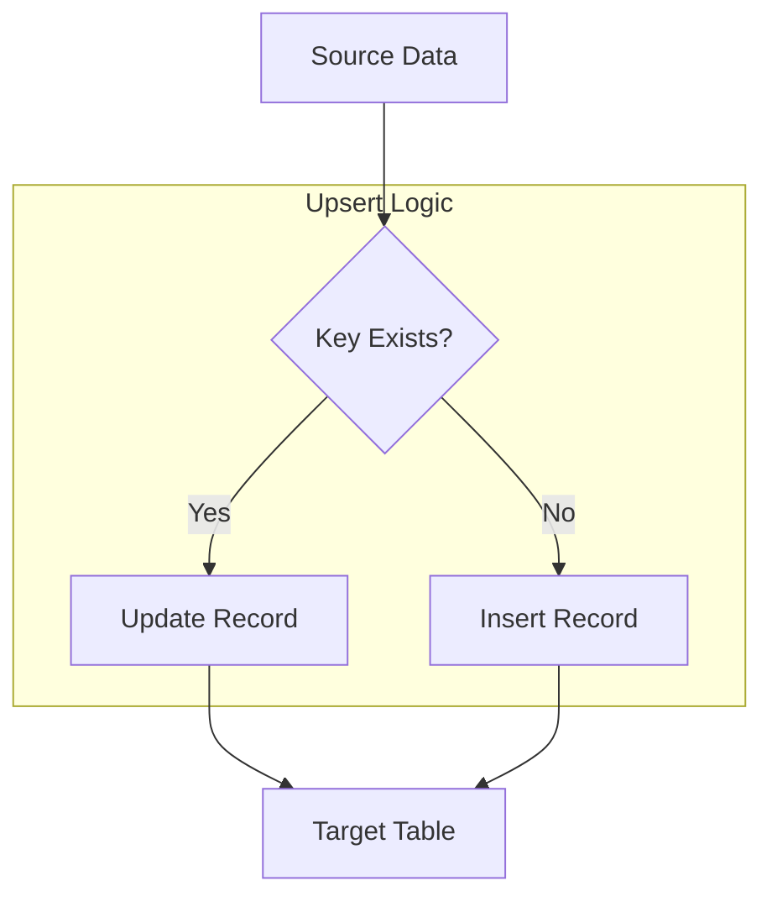
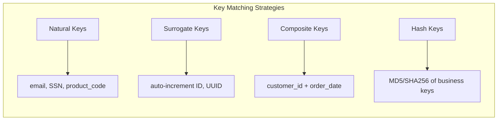
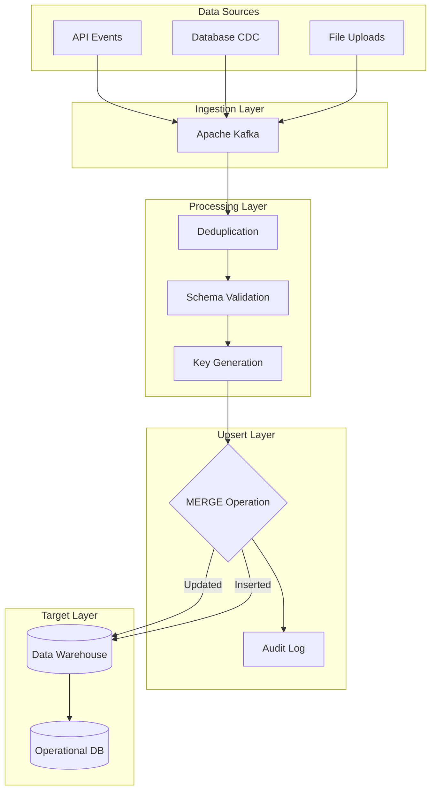

# How to Implement Upsert Patterns

Author: [nawazdhandala](https://github.com/nawazdhandala)

Tags: Data Pipeline, Upsert, MERGE, Data Integration

Description: Learn to implement upsert patterns for efficiently handling insert-or-update operations in data pipelines.

---

## Introduction

In data engineering, the upsert operation (a combination of "update" and "insert") is a fundamental pattern for maintaining data consistency. When processing incoming records, you often need to either update existing rows if they match certain criteria or insert new rows if no match exists. This guide covers practical implementations across different technologies.

## What is an Upsert?

An upsert operation performs the following logic:

1. Check if a record with matching key(s) already exists
2. If it exists, update the record with new values
3. If it does not exist, insert the record as a new row

This pattern is essential for:

- Incremental data loading
- Real-time data synchronization
- Handling late-arriving data
- Maintaining slowly changing dimensions (SCD)

## Architecture Overview



## SQL MERGE Statement

The MERGE statement is the ANSI SQL standard for implementing upserts. Here is how it works across different databases:

### PostgreSQL Implementation

```sql
-- PostgreSQL upsert using INSERT ... ON CONFLICT
-- This approach uses PostgreSQL's native conflict resolution

-- Create target table with primary key constraint
CREATE TABLE customers (
    customer_id    INTEGER PRIMARY KEY,
    customer_name  VARCHAR(100) NOT NULL,
    email          VARCHAR(255),
    created_at     TIMESTAMP DEFAULT CURRENT_TIMESTAMP,
    updated_at     TIMESTAMP DEFAULT CURRENT_TIMESTAMP
);

-- Create unique index on email for conflict detection
CREATE UNIQUE INDEX idx_customers_email ON customers(email);

-- Upsert operation: insert or update on conflict
INSERT INTO customers (customer_id, customer_name, email, updated_at)
VALUES (101, 'John Smith', 'john.smith@example.com', CURRENT_TIMESTAMP)
ON CONFLICT (customer_id)
DO UPDATE SET
    -- Update only the fields that should change
    customer_name = EXCLUDED.customer_name,
    email = EXCLUDED.email,
    updated_at = EXCLUDED.updated_at
WHERE
    -- Optional: only update if values actually changed
    customers.customer_name != EXCLUDED.customer_name
    OR customers.email != EXCLUDED.email;
```

### SQL Server / Azure SQL MERGE

```sql
-- SQL Server MERGE statement for upsert operations
-- This is the most comprehensive MERGE syntax

MERGE INTO target_customers AS target
USING source_customers AS source
ON target.customer_id = source.customer_id

-- When keys match: update existing record
WHEN MATCHED AND (
    target.customer_name != source.customer_name
    OR target.email != source.email
) THEN
    UPDATE SET
        target.customer_name = source.customer_name,
        target.email = source.email,
        target.updated_at = GETDATE()

-- When source has records not in target: insert
WHEN NOT MATCHED BY TARGET THEN
    INSERT (customer_id, customer_name, email, created_at, updated_at)
    VALUES (
        source.customer_id,
        source.customer_name,
        source.email,
        GETDATE(),
        GETDATE()
    )

-- Optional: delete records in target not in source
WHEN NOT MATCHED BY SOURCE THEN
    DELETE

-- Output clause for logging changes
OUTPUT
    $action AS operation,
    COALESCE(inserted.customer_id, deleted.customer_id) AS customer_id,
    inserted.customer_name AS new_name,
    deleted.customer_name AS old_name;
```

## Delta Lake Upsert Pattern

Delta Lake provides powerful MERGE capabilities for data lakes:

```python
# Delta Lake upsert implementation in PySpark
# This pattern is commonly used in Databricks and Apache Spark environments

from delta.tables import DeltaTable
from pyspark.sql import SparkSession
from pyspark.sql.functions import col, current_timestamp, lit

# Initialize Spark session with Delta Lake support
spark = SparkSession.builder \
    .appName("UpsertPatterns") \
    .config("spark.sql.extensions", "io.delta.sql.DeltaSparkSessionExtension") \
    .config("spark.sql.catalog.spark_catalog",
            "org.apache.spark.sql.delta.catalog.DeltaCatalog") \
    .getOrCreate()

# Define paths for target and source data
target_path = "/data/warehouse/customers"
source_path = "/data/staging/customers_update"

def perform_upsert(target_path: str, source_df, merge_keys: list):
    """
    Perform an upsert operation on a Delta table.

    Args:
        target_path: Path to the Delta table
        source_df: DataFrame containing records to upsert
        merge_keys: List of column names to use as matching keys

    Returns:
        Dictionary containing operation metrics
    """

    # Load the target Delta table
    delta_table = DeltaTable.forPath(spark, target_path)

    # Build the merge condition dynamically from key columns
    # Example: "target.customer_id = source.customer_id"
    merge_condition = " AND ".join(
        [f"target.{key} = source.{key}" for key in merge_keys]
    )

    # Add metadata columns to source data
    source_with_metadata = source_df \
        .withColumn("updated_at", current_timestamp()) \
        .withColumn("_merge_timestamp", current_timestamp())

    # Execute the MERGE operation
    merge_result = delta_table.alias("target") \
        .merge(
            source_with_metadata.alias("source"),
            merge_condition
        ) \
        .whenMatchedUpdate(
            # Update all columns except the primary keys
            set={
                "customer_name": col("source.customer_name"),
                "email": col("source.email"),
                "phone": col("source.phone"),
                "address": col("source.address"),
                "updated_at": col("source.updated_at")
            }
        ) \
        .whenNotMatchedInsert(
            # Insert all columns including metadata
            values={
                "customer_id": col("source.customer_id"),
                "customer_name": col("source.customer_name"),
                "email": col("source.email"),
                "phone": col("source.phone"),
                "address": col("source.address"),
                "created_at": current_timestamp(),
                "updated_at": col("source.updated_at")
            }
        ) \
        .execute()

    return merge_result

# Example usage
source_data = spark.read.parquet(source_path)
perform_upsert(target_path, source_data, merge_keys=["customer_id"])
```

## Key Matching Strategies

Choosing the right key matching strategy is critical for upsert operations:



### Composite Key Matching

```sql
-- Composite key upsert for order line items
-- Uses multiple columns to identify unique records

MERGE INTO order_items AS target
USING staging_order_items AS source
ON (
    -- Composite key: order_id + line_number uniquely identifies each item
    target.order_id = source.order_id
    AND target.line_number = source.line_number
)

WHEN MATCHED THEN
    UPDATE SET
        target.product_id = source.product_id,
        target.quantity = source.quantity,
        target.unit_price = source.unit_price,
        target.discount = source.discount,
        target.updated_at = CURRENT_TIMESTAMP

WHEN NOT MATCHED THEN
    INSERT (
        order_id,
        line_number,
        product_id,
        quantity,
        unit_price,
        discount,
        created_at
    )
    VALUES (
        source.order_id,
        source.line_number,
        source.product_id,
        source.quantity,
        source.unit_price,
        source.discount,
        CURRENT_TIMESTAMP
    );
```

### Hash-Based Key Matching

```python
# Hash-based key matching for data pipelines
# Useful when dealing with wide tables or variable key combinations

from pyspark.sql.functions import sha2, concat_ws, col

def create_hash_key(df, key_columns: list, hash_column_name: str = "_hash_key"):
    """
    Create a hash key from multiple columns for efficient matching.

    Args:
        df: Input DataFrame
        key_columns: List of columns to include in hash
        hash_column_name: Name for the resulting hash column

    Returns:
        DataFrame with added hash key column
    """

    # Concatenate key columns with a delimiter
    # Use coalesce to handle nulls consistently
    concat_expr = concat_ws(
        "|",  # Delimiter between values
        *[col(c).cast("string") for c in key_columns]
    )

    # Create SHA-256 hash of concatenated values
    return df.withColumn(
        hash_column_name,
        sha2(concat_expr, 256)
    )

# Apply hash key to source and target
source_df = create_hash_key(
    raw_source_df,
    key_columns=["customer_id", "order_date", "product_id"]
)

# Merge using hash key for faster comparisons
delta_table.alias("target").merge(
    source_df.alias("source"),
    "target._hash_key = source._hash_key"
)
```

## Data Pipeline Integration

Here is a complete pipeline architecture incorporating upsert patterns:



## Performance Tuning

### Partitioning Strategy

```sql
-- Create partitioned table for efficient upserts
-- Partition by date to limit scan scope during MERGE

CREATE TABLE transactions (
    transaction_id    BIGINT,
    customer_id       INTEGER,
    transaction_date  DATE,
    amount            DECIMAL(18, 2),
    status            VARCHAR(20),
    created_at        TIMESTAMP,
    updated_at        TIMESTAMP
)
-- Partition by month for efficient pruning
PARTITION BY RANGE (transaction_date);

-- Create monthly partitions
CREATE TABLE transactions_2026_01 PARTITION OF transactions
    FOR VALUES FROM ('2026-01-01') TO ('2026-02-01');

CREATE TABLE transactions_2026_02 PARTITION OF transactions
    FOR VALUES FROM ('2026-02-01') TO ('2026-03-01');

-- Add index on merge keys within each partition
CREATE INDEX idx_transactions_customer
    ON transactions (customer_id, transaction_date);
```

### Delta Lake Optimization

```python
# Optimize Delta Lake tables for upsert performance

from delta.tables import DeltaTable

def optimize_for_upserts(table_path: str, partition_cols: list, z_order_cols: list):
    """
    Apply optimizations to Delta table for better upsert performance.

    Args:
        table_path: Path to Delta table
        partition_cols: Columns used for partitioning
        z_order_cols: Columns frequently used in merge conditions
    """

    delta_table = DeltaTable.forPath(spark, table_path)

    # Compact small files into larger ones (improves read performance)
    # Target file size: 1GB for better parallelism
    delta_table.optimize() \
        .executeCompaction()

    # Z-order by merge key columns for data locality
    # This clusters related data together, speeding up lookups
    delta_table.optimize() \
        .executeZOrderBy(z_order_cols)

    # Vacuum old files (retain 7 days for time travel)
    delta_table.vacuum(retentionHours=168)

    # Set table properties for auto-optimization
    spark.sql(f"""
        ALTER TABLE delta.`{table_path}`
        SET TBLPROPERTIES (
            'delta.autoOptimize.optimizeWrite' = 'true',
            'delta.autoOptimize.autoCompact' = 'true',
            'delta.dataSkippingNumIndexedCols' = '10'
        )
    """)

# Apply optimizations
optimize_for_upserts(
    table_path="/data/warehouse/customers",
    partition_cols=["region", "signup_date"],
    z_order_cols=["customer_id", "email"]
)
```

### Batch Size Tuning

```python
# Batch processing for large-scale upserts
# Process data in chunks to manage memory and improve throughput

def batch_upsert(source_df, target_path: str, batch_size: int = 100000):
    """
    Perform upsert in batches for large datasets.

    Args:
        source_df: Source DataFrame with records to upsert
        target_path: Path to target Delta table
        batch_size: Number of records per batch
    """

    # Get total count for progress tracking
    total_records = source_df.count()
    num_batches = (total_records // batch_size) + 1

    print(f"Processing {total_records} records in {num_batches} batches")

    # Add row number for batching
    from pyspark.sql.window import Window
    from pyspark.sql.functions import row_number, monotonically_increasing_id

    source_with_id = source_df.withColumn(
        "_row_id",
        monotonically_increasing_id()
    )

    # Process each batch
    for batch_num in range(num_batches):
        start_id = batch_num * batch_size
        end_id = start_id + batch_size

        # Filter to current batch
        batch_df = source_with_id.filter(
            (col("_row_id") >= start_id) &
            (col("_row_id") < end_id)
        ).drop("_row_id")

        # Skip empty batches
        if batch_df.count() == 0:
            continue

        # Perform upsert for this batch
        delta_table = DeltaTable.forPath(spark, target_path)

        delta_table.alias("target").merge(
            batch_df.alias("source"),
            "target.customer_id = source.customer_id"
        ).whenMatchedUpdateAll() \
         .whenNotMatchedInsertAll() \
         .execute()

        print(f"Completed batch {batch_num + 1}/{num_batches}")
```

## Error Handling and Idempotency

```python
# Idempotent upsert with error handling and retry logic

import time
from functools import wraps

def retry_on_conflict(max_retries: int = 3, backoff_seconds: float = 1.0):
    """
    Decorator to retry upsert operations on concurrent modification conflicts.

    Args:
        max_retries: Maximum number of retry attempts
        backoff_seconds: Initial backoff time between retries
    """
    def decorator(func):
        @wraps(func)
        def wrapper(*args, **kwargs):
            last_exception = None

            for attempt in range(max_retries):
                try:
                    return func(*args, **kwargs)
                except Exception as e:
                    error_msg = str(e).lower()

                    # Check if this is a retryable error
                    if "concurrent" in error_msg or "conflict" in error_msg:
                        last_exception = e
                        wait_time = backoff_seconds * (2 ** attempt)
                        print(f"Conflict detected, retrying in {wait_time}s...")
                        time.sleep(wait_time)
                    else:
                        # Non-retryable error, raise immediately
                        raise

            # Max retries exceeded
            raise last_exception
        return wrapper
    return decorator

@retry_on_conflict(max_retries=3)
def safe_upsert(delta_table, source_df, merge_condition: str):
    """
    Perform upsert with conflict handling and validation.

    Args:
        delta_table: Target DeltaTable object
        source_df: Source DataFrame
        merge_condition: SQL condition for matching records
    """

    # Validate source data before merge
    null_key_count = source_df.filter(col("customer_id").isNull()).count()
    if null_key_count > 0:
        raise ValueError(f"Source contains {null_key_count} records with null keys")

    # Check for duplicates in source
    source_count = source_df.count()
    distinct_count = source_df.select("customer_id").distinct().count()
    if source_count != distinct_count:
        print(f"Warning: Source has {source_count - distinct_count} duplicate keys")
        # Deduplicate, keeping latest record
        source_df = source_df.dropDuplicates(["customer_id"])

    # Execute merge with optimistic concurrency
    delta_table.alias("target").merge(
        source_df.alias("source"),
        merge_condition
    ).whenMatchedUpdateAll() \
     .whenNotMatchedInsertAll() \
     .execute()
```

## Monitoring and Observability

```python
# Capture and log upsert metrics for monitoring

from dataclasses import dataclass
from datetime import datetime
import json

@dataclass
class UpsertMetrics:
    """Metrics captured from upsert operations."""

    pipeline_name: str
    execution_time: datetime
    records_inserted: int
    records_updated: int
    records_deleted: int
    duration_seconds: float
    source_record_count: int
    target_table: str

def capture_upsert_metrics(
    delta_table_path: str,
    operation_name: str
) -> UpsertMetrics:
    """
    Extract metrics from the last Delta Lake operation.

    Args:
        delta_table_path: Path to Delta table
        operation_name: Name for logging purposes

    Returns:
        UpsertMetrics object with operation details
    """

    # Read operation history from Delta log
    history_df = spark.sql(f"""
        DESCRIBE HISTORY delta.`{delta_table_path}`
        LIMIT 1
    """)

    latest_op = history_df.collect()[0]

    # Parse operation metrics
    op_metrics = latest_op["operationMetrics"]

    metrics = UpsertMetrics(
        pipeline_name=operation_name,
        execution_time=latest_op["timestamp"],
        records_inserted=int(op_metrics.get("numTargetRowsInserted", 0)),
        records_updated=int(op_metrics.get("numTargetRowsUpdated", 0)),
        records_deleted=int(op_metrics.get("numTargetRowsDeleted", 0)),
        duration_seconds=float(op_metrics.get("executionTimeMs", 0)) / 1000,
        source_record_count=int(op_metrics.get("numSourceRows", 0)),
        target_table=delta_table_path
    )

    # Log metrics as JSON for observability platforms
    print(json.dumps({
        "event": "upsert_complete",
        "metrics": {
            "pipeline": metrics.pipeline_name,
            "inserted": metrics.records_inserted,
            "updated": metrics.records_updated,
            "deleted": metrics.records_deleted,
            "duration_s": metrics.duration_seconds
        }
    }))

    return metrics
```

## Best Practices Summary

1. **Choose the right key strategy**: Use natural keys when stable, surrogate keys for performance, composite keys for complex uniqueness requirements

2. **Partition your data**: Align partitions with your merge conditions to limit scan scope

3. **Optimize file sizes**: Use compaction to maintain optimal file sizes (128MB to 1GB)

4. **Handle duplicates explicitly**: Always deduplicate source data before merging

5. **Implement idempotency**: Design upserts to produce the same result regardless of how many times they run

6. **Monitor operations**: Track insert/update/delete counts and execution times

7. **Use conditional updates**: Only update when values actually change to reduce write amplification

8. **Test with realistic data volumes**: Performance characteristics change significantly at scale

## Conclusion

Upsert patterns are essential for building reliable data pipelines. By understanding the various implementation options across SQL databases and Delta Lake, you can choose the right approach for your specific use case. Remember to focus on key matching strategies, performance optimization, and proper error handling to build production-grade data pipelines.

## Further Reading

- Delta Lake MERGE documentation
- PostgreSQL UPSERT guide
- SQL Server MERGE statement reference
- Apache Spark optimization techniques
