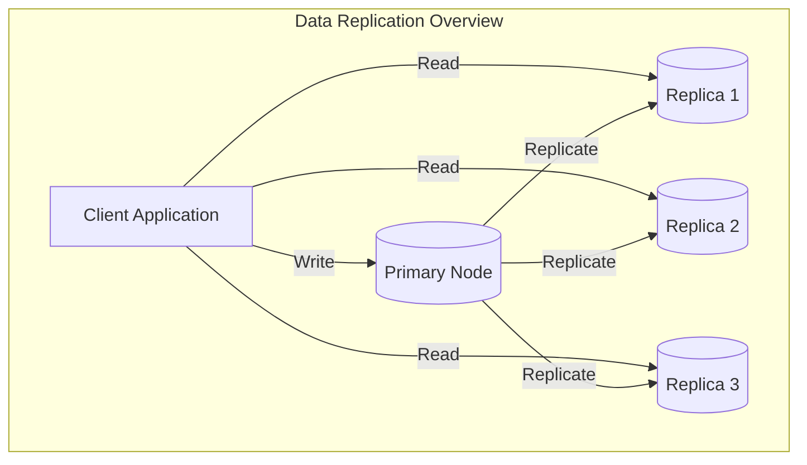
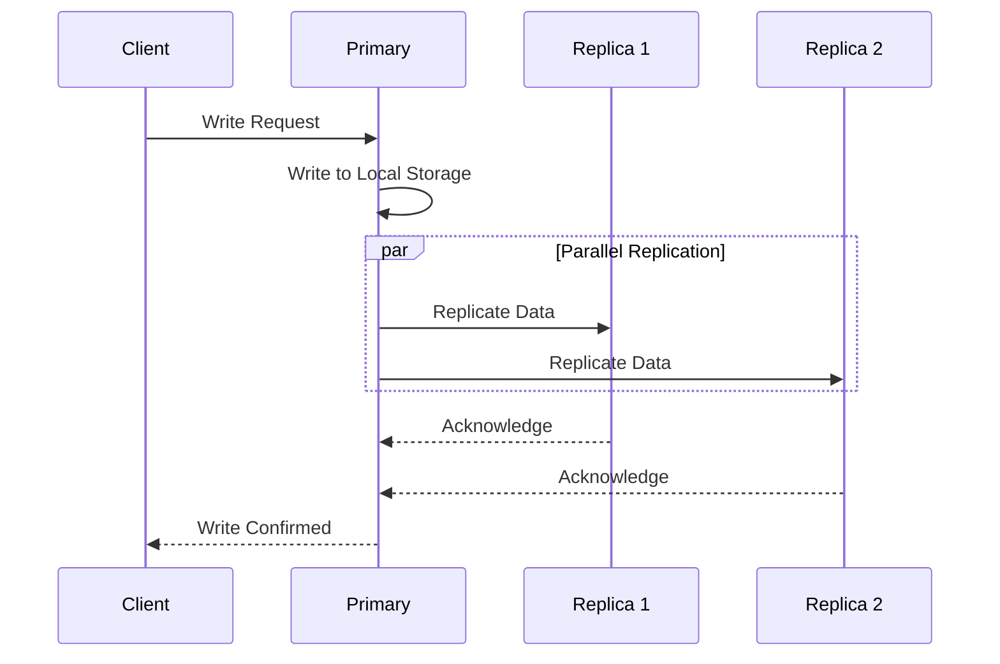
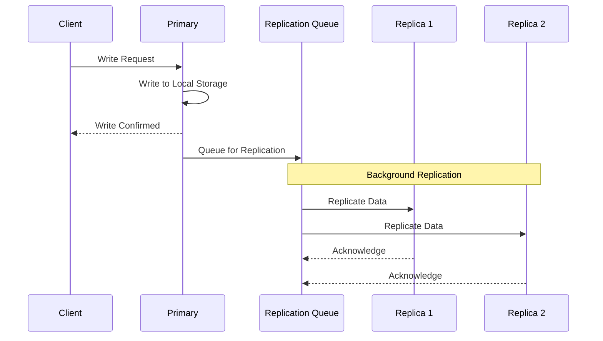
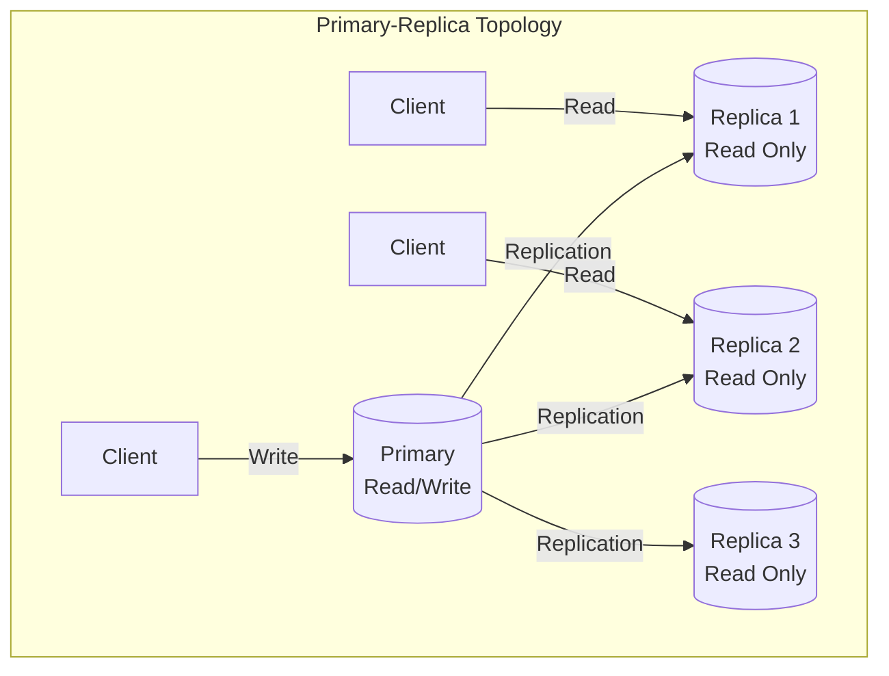
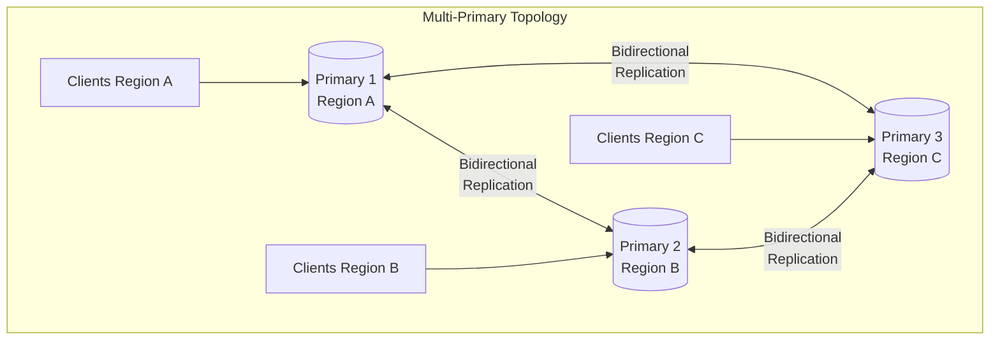
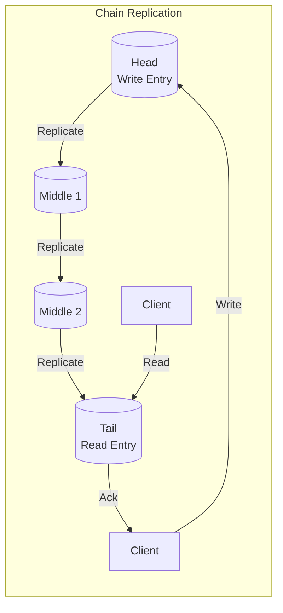
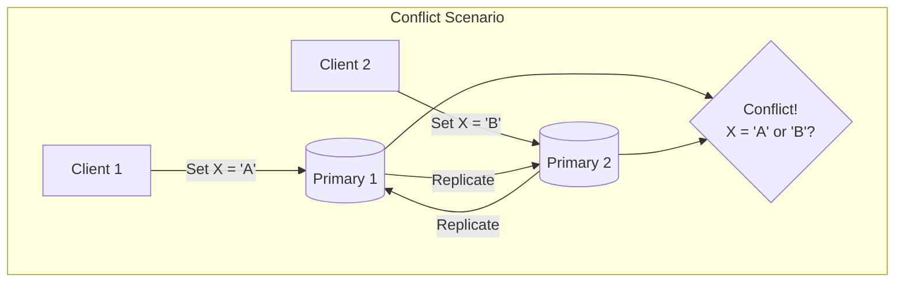
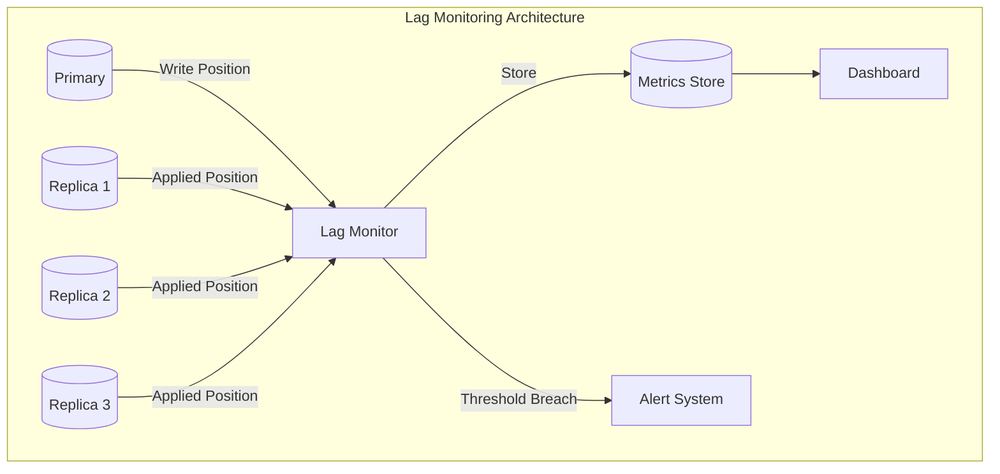
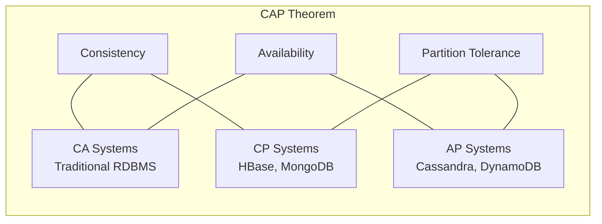
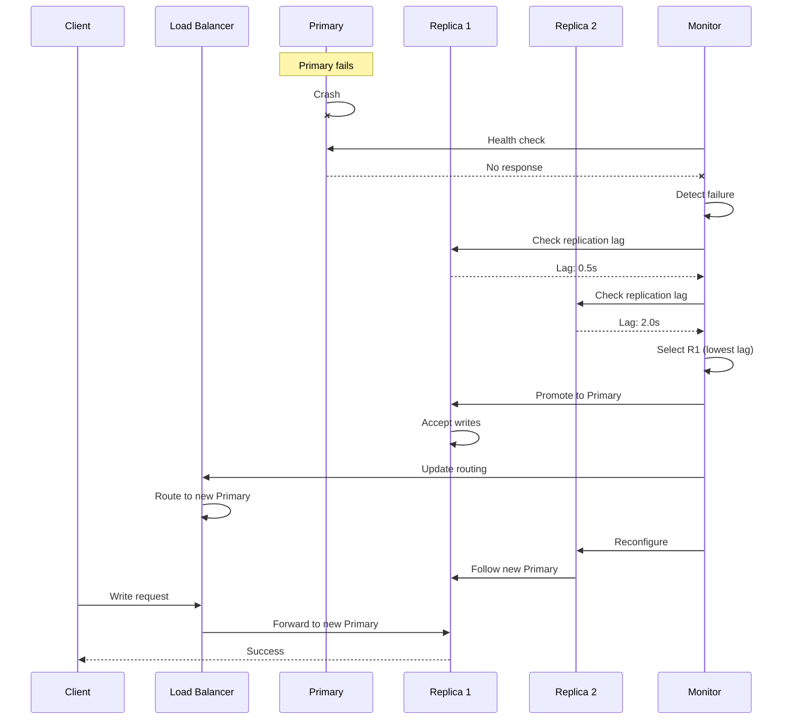

# How to Implement Data Replication Details

Author: [nawazdhandala](https://github.com/nawazdhandala)

Tags: Data Replication, High Availability, Databases, Distributed Systems

Description: Learn detailed data replication strategies for high availability systems.

---

Data replication is a fundamental technique for building highly available systems. By maintaining copies of data across multiple nodes, organizations can ensure service continuity, reduce latency, and protect against data loss. This comprehensive guide explores the intricacies of implementing data replication for high availability.

## Understanding Data Replication

Data replication involves copying and maintaining data across multiple storage locations or nodes. The primary goals include:

- **High Availability**: Ensuring system uptime even when individual nodes fail
- **Disaster Recovery**: Protecting against data center or regional failures
- **Read Scalability**: Distributing read load across multiple replicas
- **Geographic Distribution**: Reducing latency by serving data closer to users



## Synchronous vs Asynchronous Replication

The choice between synchronous and asynchronous replication represents one of the most critical decisions in designing a replicated system.

### Synchronous Replication

In synchronous replication, the primary node waits for acknowledgment from replicas before confirming a write operation to the client.



**Advantages:**
- Strong consistency guarantees
- Zero data loss on primary failure
- Replicas always have current data

**Disadvantages:**
- Higher write latency
- Reduced availability if replicas are slow or unreachable
- Performance limited by slowest replica

Here is a Python implementation demonstrating synchronous replication:

```python
import asyncio
from typing import List, Dict, Any
from dataclasses import dataclass
from enum import Enum
import logging

logging.basicConfig(level=logging.INFO)
logger = logging.getLogger(__name__)


class ReplicationMode(Enum):
    SYNCHRONOUS = "synchronous"
    ASYNCHRONOUS = "asynchronous"
    SEMI_SYNCHRONOUS = "semi_synchronous"


@dataclass
class WriteOperation:
    key: str
    value: Any
    timestamp: float
    sequence_number: int


class ReplicaNode:
    def __init__(self, node_id: str, latency_ms: float = 10):
        self.node_id = node_id
        self.latency_ms = latency_ms
        self.data: Dict[str, Any] = {}
        self.last_sequence: int = 0
        self.is_healthy = True

    async def apply_write(self, operation: WriteOperation) -> bool:
        """Apply a write operation to this replica."""
        if not self.is_healthy:
            raise ConnectionError(f"Replica {self.node_id} is unavailable")

        # Simulate network latency
        await asyncio.sleep(self.latency_ms / 1000)

        # Apply the write
        self.data[operation.key] = operation.value
        self.last_sequence = operation.sequence_number

        logger.info(f"Replica {self.node_id}: Applied write {operation.key}={operation.value}")
        return True


class SynchronousReplicationManager:
    def __init__(self, replicas: List[ReplicaNode], timeout_seconds: float = 5.0):
        self.replicas = replicas
        self.timeout = timeout_seconds
        self.primary_data: Dict[str, Any] = {}
        self.sequence_number = 0

    async def write(self, key: str, value: Any) -> bool:
        """
        Perform a synchronous write to all replicas.
        Returns True only if ALL replicas acknowledge the write.
        """
        self.sequence_number += 1
        operation = WriteOperation(
            key=key,
            value=value,
            timestamp=asyncio.get_event_loop().time(),
            sequence_number=self.sequence_number
        )

        # Write to primary first
        self.primary_data[key] = value
        logger.info(f"Primary: Written {key}={value}")

        # Replicate to all nodes synchronously
        try:
            replication_tasks = [
                asyncio.wait_for(
                    replica.apply_write(operation),
                    timeout=self.timeout
                )
                for replica in self.replicas
            ]

            results = await asyncio.gather(*replication_tasks, return_exceptions=True)

            # Check if all replications succeeded
            failures = [r for r in results if isinstance(r, Exception)]
            if failures:
                logger.error(f"Replication failed: {failures}")
                # In strict synchronous mode, we might rollback
                return False

            logger.info(f"Synchronous write completed for {key}")
            return True

        except asyncio.TimeoutError:
            logger.error("Replication timeout - some replicas did not respond")
            return False


# Example usage
async def main():
    replicas = [
        ReplicaNode("replica-1", latency_ms=5),
        ReplicaNode("replica-2", latency_ms=10),
        ReplicaNode("replica-3", latency_ms=15),
    ]

    manager = SynchronousReplicationManager(replicas)

    # Perform synchronous writes
    await manager.write("user:1001", {"name": "Alice", "email": "alice@example.com"})
    await manager.write("user:1002", {"name": "Bob", "email": "bob@example.com"})

    # Verify all replicas have the data
    for replica in replicas:
        print(f"{replica.node_id}: {replica.data}")


if __name__ == "__main__":
    asyncio.run(main())
```

### Asynchronous Replication

In asynchronous replication, the primary confirms writes immediately after local persistence, with replication happening in the background.



**Advantages:**
- Lower write latency
- Higher availability (writes succeed even if replicas are down)
- Better performance under high load

**Disadvantages:**
- Potential data loss if primary fails before replication completes
- Replicas may serve stale data
- Replication lag must be monitored

Here is a Python implementation for asynchronous replication:

```python
import asyncio
from collections import deque
from typing import List, Dict, Any, Optional
from dataclasses import dataclass, field
from datetime import datetime
import logging

logging.basicConfig(level=logging.INFO)
logger = logging.getLogger(__name__)


@dataclass
class ReplicationEvent:
    key: str
    value: Any
    timestamp: datetime
    sequence_number: int
    retries: int = 0
    max_retries: int = 3


class AsyncReplicaNode:
    def __init__(self, node_id: str, latency_ms: float = 10):
        self.node_id = node_id
        self.latency_ms = latency_ms
        self.data: Dict[str, Any] = {}
        self.last_applied_sequence: int = 0
        self.is_healthy = True
        self.replication_lag_ms: float = 0

    async def apply_write(self, event: ReplicationEvent) -> bool:
        """Apply a replication event to this replica."""
        if not self.is_healthy:
            raise ConnectionError(f"Replica {self.node_id} is unavailable")

        # Simulate network latency
        await asyncio.sleep(self.latency_ms / 1000)

        # Check for out-of-order delivery
        if event.sequence_number <= self.last_applied_sequence:
            logger.warning(
                f"Replica {self.node_id}: Skipping duplicate/old event "
                f"seq={event.sequence_number}"
            )
            return True

        # Apply the write
        self.data[event.key] = event.value
        self.last_applied_sequence = event.sequence_number

        # Calculate replication lag
        self.replication_lag_ms = (
            datetime.now() - event.timestamp
        ).total_seconds() * 1000

        logger.info(
            f"Replica {self.node_id}: Applied {event.key}={event.value} "
            f"(lag: {self.replication_lag_ms:.2f}ms)"
        )
        return True


class AsynchronousReplicationManager:
    def __init__(
        self,
        replicas: List[AsyncReplicaNode],
        batch_size: int = 100,
        flush_interval_ms: float = 100
    ):
        self.replicas = replicas
        self.batch_size = batch_size
        self.flush_interval = flush_interval_ms / 1000
        self.primary_data: Dict[str, Any] = {}
        self.sequence_number = 0
        self.replication_queue: deque = deque()
        self.failed_events: Dict[str, List[ReplicationEvent]] = {
            r.node_id: [] for r in replicas
        }
        self._running = False
        self._replication_task: Optional[asyncio.Task] = None

    async def start(self):
        """Start the background replication process."""
        self._running = True
        self._replication_task = asyncio.create_task(self._replication_loop())
        logger.info("Asynchronous replication started")

    async def stop(self):
        """Stop the background replication process."""
        self._running = False
        if self._replication_task:
            await self._replication_task
        logger.info("Asynchronous replication stopped")

    async def write(self, key: str, value: Any) -> bool:
        """
        Perform an asynchronous write.
        Returns immediately after writing to primary.
        """
        self.sequence_number += 1

        # Write to primary immediately
        self.primary_data[key] = value

        # Queue for background replication
        event = ReplicationEvent(
            key=key,
            value=value,
            timestamp=datetime.now(),
            sequence_number=self.sequence_number
        )
        self.replication_queue.append(event)

        logger.info(f"Primary: Written {key}={value} (queued for replication)")
        return True

    async def _replication_loop(self):
        """Background loop that processes the replication queue."""
        while self._running or self.replication_queue:
            batch: List[ReplicationEvent] = []

            # Collect a batch of events
            while self.replication_queue and len(batch) < self.batch_size:
                batch.append(self.replication_queue.popleft())

            if batch:
                await self._replicate_batch(batch)

            # Also retry failed events
            await self._retry_failed_events()

            await asyncio.sleep(self.flush_interval)

    async def _replicate_batch(self, batch: List[ReplicationEvent]):
        """Replicate a batch of events to all replicas."""
        for replica in self.replicas:
            for event in batch:
                try:
                    await replica.apply_write(event)
                except Exception as e:
                    logger.error(
                        f"Failed to replicate to {replica.node_id}: {e}"
                    )
                    if event.retries < event.max_retries:
                        event.retries += 1
                        self.failed_events[replica.node_id].append(event)

    async def _retry_failed_events(self):
        """Retry failed replication events."""
        for replica in self.replicas:
            failed = self.failed_events[replica.node_id]
            if failed and replica.is_healthy:
                events_to_retry = failed[:self.batch_size]
                self.failed_events[replica.node_id] = failed[self.batch_size:]

                for event in events_to_retry:
                    try:
                        await replica.apply_write(event)
                    except Exception:
                        if event.retries < event.max_retries:
                            event.retries += 1
                            self.failed_events[replica.node_id].append(event)

    def get_replication_status(self) -> Dict[str, Any]:
        """Get current replication status for monitoring."""
        return {
            "queue_size": len(self.replication_queue),
            "primary_sequence": self.sequence_number,
            "replicas": {
                r.node_id: {
                    "last_sequence": r.last_applied_sequence,
                    "lag_ms": r.replication_lag_ms,
                    "is_healthy": r.is_healthy,
                    "pending_retries": len(self.failed_events[r.node_id])
                }
                for r in self.replicas
            }
        }


# Example usage
async def main():
    replicas = [
        AsyncReplicaNode("replica-1", latency_ms=5),
        AsyncReplicaNode("replica-2", latency_ms=20),
        AsyncReplicaNode("replica-3", latency_ms=50),
    ]

    manager = AsynchronousReplicationManager(replicas)
    await manager.start()

    # Perform multiple writes quickly
    for i in range(10):
        await manager.write(f"key:{i}", f"value-{i}")

    # Wait for replication to complete
    await asyncio.sleep(1)

    # Check status
    status = manager.get_replication_status()
    print(f"Replication Status: {status}")

    await manager.stop()


if __name__ == "__main__":
    asyncio.run(main())
```

### Semi-Synchronous Replication

Semi-synchronous replication offers a middle ground, requiring acknowledgment from at least one replica before confirming writes.

```python
class SemiSynchronousReplicationManager:
    def __init__(
        self,
        replicas: List[ReplicaNode],
        min_acks: int = 1,
        timeout_seconds: float = 2.0
    ):
        self.replicas = replicas
        self.min_acks = min_acks
        self.timeout = timeout_seconds
        self.primary_data: Dict[str, Any] = {}
        self.sequence_number = 0

    async def write(self, key: str, value: Any) -> bool:
        """
        Perform a semi-synchronous write.
        Returns True if at least min_acks replicas acknowledge.
        """
        self.sequence_number += 1
        operation = WriteOperation(
            key=key,
            value=value,
            timestamp=asyncio.get_event_loop().time(),
            sequence_number=self.sequence_number
        )

        # Write to primary
        self.primary_data[key] = value

        # Wait for minimum acknowledgments
        ack_count = 0
        pending_tasks = []

        for replica in self.replicas:
            task = asyncio.create_task(
                self._replicate_with_timeout(replica, operation)
            )
            pending_tasks.append(task)

        # Wait for minimum acks or all tasks to complete
        while pending_tasks and ack_count < self.min_acks:
            done, pending_tasks = await asyncio.wait(
                pending_tasks,
                return_when=asyncio.FIRST_COMPLETED
            )

            for task in done:
                if task.result():
                    ack_count += 1

        success = ack_count >= self.min_acks

        if success:
            logger.info(
                f"Semi-sync write completed: {ack_count}/{len(self.replicas)} acks"
            )
        else:
            logger.warning(
                f"Semi-sync write degraded: only {ack_count}/{self.min_acks} required acks"
            )

        # Let remaining replications complete in background
        if pending_tasks:
            asyncio.gather(*pending_tasks, return_exceptions=True)

        return success

    async def _replicate_with_timeout(
        self,
        replica: ReplicaNode,
        operation: WriteOperation
    ) -> bool:
        try:
            return await asyncio.wait_for(
                replica.apply_write(operation),
                timeout=self.timeout
            )
        except (asyncio.TimeoutError, Exception):
            return False
```

## Replication Topologies

The arrangement of nodes in a replication system significantly impacts performance, consistency, and fault tolerance.

### Primary-Replica (Master-Slave) Topology

The most common topology where one primary handles all writes and replicas handle reads.



### Multi-Primary (Master-Master) Topology

Multiple nodes can accept writes, requiring conflict resolution mechanisms.



### Chain Replication Topology

Replicas are arranged in a chain, with writes propagating sequentially.



Here is a Python implementation of chain replication:

```python
from typing import List, Dict, Any, Optional
from dataclasses import dataclass
from enum import Enum
import asyncio
import logging

logging.basicConfig(level=logging.INFO)
logger = logging.getLogger(__name__)


class NodeRole(Enum):
    HEAD = "head"
    MIDDLE = "middle"
    TAIL = "tail"


@dataclass
class ChainNode:
    node_id: str
    role: NodeRole
    data: Dict[str, Any] = None
    successor: Optional['ChainNode'] = None
    pending_writes: Dict[int, 'WriteRequest'] = None

    def __post_init__(self):
        self.data = self.data or {}
        self.pending_writes = self.pending_writes or {}


@dataclass
class WriteRequest:
    sequence: int
    key: str
    value: Any
    client_callback: Optional[asyncio.Future] = None


class ChainReplicationManager:
    def __init__(self, num_nodes: int = 4):
        self.nodes: List[ChainNode] = []
        self.sequence_number = 0
        self._setup_chain(num_nodes)

    def _setup_chain(self, num_nodes: int):
        """Set up the replication chain."""
        for i in range(num_nodes):
            if i == 0:
                role = NodeRole.HEAD
            elif i == num_nodes - 1:
                role = NodeRole.TAIL
            else:
                role = NodeRole.MIDDLE

            node = ChainNode(node_id=f"node-{i}", role=role)
            self.nodes.append(node)

        # Link nodes in chain
        for i in range(len(self.nodes) - 1):
            self.nodes[i].successor = self.nodes[i + 1]

        logger.info(f"Chain setup: {[n.node_id for n in self.nodes]}")

    @property
    def head(self) -> ChainNode:
        return self.nodes[0]

    @property
    def tail(self) -> ChainNode:
        return self.nodes[-1]

    async def write(self, key: str, value: Any) -> bool:
        """
        Perform a write using chain replication.
        Write enters at head and acknowledgment comes from tail.
        """
        self.sequence_number += 1

        # Create a future to wait for tail acknowledgment
        ack_future = asyncio.get_event_loop().create_future()

        request = WriteRequest(
            sequence=self.sequence_number,
            key=key,
            value=value,
            client_callback=ack_future
        )

        # Start replication at head
        asyncio.create_task(self._propagate_write(self.head, request))

        # Wait for acknowledgment from tail
        try:
            await asyncio.wait_for(ack_future, timeout=10.0)
            logger.info(f"Write {key}={value} acknowledged by tail")
            return True
        except asyncio.TimeoutError:
            logger.error(f"Write {key} timed out waiting for tail ack")
            return False

    async def _propagate_write(self, node: ChainNode, request: WriteRequest):
        """Propagate write down the chain."""
        # Apply write locally
        node.data[request.key] = request.value
        logger.info(f"{node.node_id} ({node.role.value}): Applied {request.key}")

        if node.role == NodeRole.TAIL:
            # Tail sends acknowledgment back to client
            if request.client_callback and not request.client_callback.done():
                request.client_callback.set_result(True)
        elif node.successor:
            # Forward to successor
            node.pending_writes[request.sequence] = request
            await asyncio.sleep(0.01)  # Simulate network delay
            await self._propagate_write(node.successor, request)
            # Clean up pending write after propagation
            del node.pending_writes[request.sequence]

    def read(self, key: str) -> Optional[Any]:
        """
        Read from the tail node.
        Tail has the most consistent view of committed data.
        """
        return self.tail.data.get(key)

    def read_from_any(self, key: str) -> Optional[Any]:
        """
        Read from any node (may return uncommitted data).
        Useful when eventual consistency is acceptable.
        """
        for node in self.nodes:
            if key in node.data:
                return node.data[key]
        return None


# Example usage
async def main():
    chain = ChainReplicationManager(num_nodes=4)

    # Perform writes
    await chain.write("user:1", {"name": "Alice"})
    await chain.write("user:2", {"name": "Bob"})

    # Read from tail (strongly consistent)
    print(f"Read from tail: {chain.read('user:1')}")

    # Verify all nodes have the data
    for node in chain.nodes:
        print(f"{node.node_id}: {node.data}")


if __name__ == "__main__":
    asyncio.run(main())
```

## Conflict Resolution

In multi-primary setups, concurrent writes to the same data can create conflicts that must be resolved.



### Conflict Resolution Strategies

```python
from typing import Any, Dict, List, Tuple, Optional
from dataclasses import dataclass, field
from datetime import datetime
from enum import Enum
import hashlib
import json
import logging

logging.basicConfig(level=logging.INFO)
logger = logging.getLogger(__name__)


class ConflictStrategy(Enum):
    LAST_WRITE_WINS = "lww"
    FIRST_WRITE_WINS = "fww"
    HIGHEST_NODE_ID_WINS = "node_priority"
    MERGE = "merge"
    CUSTOM = "custom"


@dataclass
class VersionedValue:
    value: Any
    timestamp: datetime
    node_id: str
    vector_clock: Dict[str, int] = field(default_factory=dict)

    def to_dict(self) -> dict:
        return {
            "value": self.value,
            "timestamp": self.timestamp.isoformat(),
            "node_id": self.node_id,
            "vector_clock": self.vector_clock
        }


class VectorClock:
    """Vector clock for tracking causality."""

    def __init__(self, node_id: str):
        self.node_id = node_id
        self.clock: Dict[str, int] = {}

    def increment(self) -> Dict[str, int]:
        """Increment this node's counter."""
        self.clock[self.node_id] = self.clock.get(self.node_id, 0) + 1
        return self.clock.copy()

    def merge(self, other: Dict[str, int]):
        """Merge another vector clock into this one."""
        for node, count in other.items():
            self.clock[node] = max(self.clock.get(node, 0), count)

    @staticmethod
    def compare(vc1: Dict[str, int], vc2: Dict[str, int]) -> str:
        """
        Compare two vector clocks.
        Returns: 'before', 'after', 'concurrent', or 'equal'
        """
        all_nodes = set(vc1.keys()) | set(vc2.keys())

        vc1_before = False
        vc1_after = False

        for node in all_nodes:
            v1 = vc1.get(node, 0)
            v2 = vc2.get(node, 0)

            if v1 < v2:
                vc1_before = True
            elif v1 > v2:
                vc1_after = True

        if vc1_before and vc1_after:
            return "concurrent"
        elif vc1_before:
            return "before"
        elif vc1_after:
            return "after"
        else:
            return "equal"


class ConflictResolver:
    """Handles conflict resolution for replicated data."""

    def __init__(self, strategy: ConflictStrategy = ConflictStrategy.LAST_WRITE_WINS):
        self.strategy = strategy
        self.conflict_log: List[Dict] = []

    def resolve(
        self,
        key: str,
        values: List[VersionedValue]
    ) -> Tuple[VersionedValue, bool]:
        """
        Resolve conflicts between multiple versions of a value.
        Returns: (winning_value, had_conflict)
        """
        if len(values) == 1:
            return values[0], False

        # Check for true conflicts using vector clocks
        conflicts = self._find_conflicts(values)

        if not conflicts:
            # No true conflicts, just return the latest
            return max(values, key=lambda v: v.timestamp), False

        # Log the conflict
        self.conflict_log.append({
            "key": key,
            "timestamp": datetime.now().isoformat(),
            "values": [v.to_dict() for v in conflicts],
            "strategy": self.strategy.value
        })

        # Resolve based on strategy
        winner = self._apply_strategy(key, conflicts)
        logger.warning(
            f"Conflict resolved for '{key}' using {self.strategy.value}: "
            f"winner from {winner.node_id}"
        )

        return winner, True

    def _find_conflicts(self, values: List[VersionedValue]) -> List[VersionedValue]:
        """Find values that are truly concurrent (conflicting)."""
        conflicts = []

        for i, v1 in enumerate(values):
            is_concurrent = False
            for j, v2 in enumerate(values):
                if i != j:
                    relation = VectorClock.compare(v1.vector_clock, v2.vector_clock)
                    if relation == "concurrent":
                        is_concurrent = True
                        break
            if is_concurrent:
                conflicts.append(v1)

        return conflicts if conflicts else values

    def _apply_strategy(
        self,
        key: str,
        conflicts: List[VersionedValue]
    ) -> VersionedValue:
        """Apply the conflict resolution strategy."""

        if self.strategy == ConflictStrategy.LAST_WRITE_WINS:
            return max(conflicts, key=lambda v: v.timestamp)

        elif self.strategy == ConflictStrategy.FIRST_WRITE_WINS:
            return min(conflicts, key=lambda v: v.timestamp)

        elif self.strategy == ConflictStrategy.HIGHEST_NODE_ID_WINS:
            return max(conflicts, key=lambda v: v.node_id)

        elif self.strategy == ConflictStrategy.MERGE:
            return self._merge_values(key, conflicts)

        else:
            # Default to LWW
            return max(conflicts, key=lambda v: v.timestamp)

    def _merge_values(
        self,
        key: str,
        conflicts: List[VersionedValue]
    ) -> VersionedValue:
        """
        Attempt to merge conflicting values.
        Works for dictionaries and sets; falls back to LWW for other types.
        """
        values = [c.value for c in conflicts]

        # Check if all values are dictionaries
        if all(isinstance(v, dict) for v in values):
            merged = {}
            for v in values:
                merged.update(v)

            return VersionedValue(
                value=merged,
                timestamp=datetime.now(),
                node_id="merged",
                vector_clock=self._merge_vector_clocks(conflicts)
            )

        # Check if all values are lists/sets
        elif all(isinstance(v, (list, set)) for v in values):
            merged = set()
            for v in values:
                merged.update(v if isinstance(v, set) else set(v))

            return VersionedValue(
                value=list(merged),
                timestamp=datetime.now(),
                node_id="merged",
                vector_clock=self._merge_vector_clocks(conflicts)
            )

        # Fall back to LWW for non-mergeable types
        return max(conflicts, key=lambda v: v.timestamp)

    def _merge_vector_clocks(
        self,
        values: List[VersionedValue]
    ) -> Dict[str, int]:
        """Merge all vector clocks from conflicting values."""
        merged = {}
        for v in values:
            for node, count in v.vector_clock.items():
                merged[node] = max(merged.get(node, 0), count)
        return merged


# CRDTs for automatic conflict resolution
class GCounter:
    """Grow-only counter CRDT."""

    def __init__(self, node_id: str):
        self.node_id = node_id
        self.counts: Dict[str, int] = {}

    def increment(self, amount: int = 1):
        self.counts[self.node_id] = self.counts.get(self.node_id, 0) + amount

    def value(self) -> int:
        return sum(self.counts.values())

    def merge(self, other: 'GCounter'):
        for node, count in other.counts.items():
            self.counts[node] = max(self.counts.get(node, 0), count)


class LWWRegister:
    """Last-Write-Wins Register CRDT."""

    def __init__(self, node_id: str):
        self.node_id = node_id
        self._value: Any = None
        self._timestamp: float = 0

    def set(self, value: Any, timestamp: Optional[float] = None):
        ts = timestamp or datetime.now().timestamp()
        if ts > self._timestamp:
            self._value = value
            self._timestamp = ts

    def get(self) -> Any:
        return self._value

    def merge(self, other: 'LWWRegister'):
        if other._timestamp > self._timestamp:
            self._value = other._value
            self._timestamp = other._timestamp


# Example usage
def demonstrate_conflict_resolution():
    resolver = ConflictResolver(ConflictStrategy.MERGE)

    # Simulate concurrent writes from different nodes
    value1 = VersionedValue(
        value={"name": "Alice", "role": "admin"},
        timestamp=datetime(2024, 1, 1, 10, 0, 0),
        node_id="node-1",
        vector_clock={"node-1": 1}
    )

    value2 = VersionedValue(
        value={"name": "Alice", "email": "alice@example.com"},
        timestamp=datetime(2024, 1, 1, 10, 0, 1),
        node_id="node-2",
        vector_clock={"node-2": 1}
    )

    winner, had_conflict = resolver.resolve("user:alice", [value1, value2])

    print(f"Had conflict: {had_conflict}")
    print(f"Resolved value: {winner.value}")
    # Output: {'name': 'Alice', 'role': 'admin', 'email': 'alice@example.com'}


if __name__ == "__main__":
    demonstrate_conflict_resolution()
```

## Lag Monitoring

Monitoring replication lag is critical for maintaining data consistency and detecting issues early.



```python
import asyncio
from typing import Dict, List, Optional
from dataclasses import dataclass, field
from datetime import datetime, timedelta
from collections import deque
import statistics
import logging

logging.basicConfig(level=logging.INFO)
logger = logging.getLogger(__name__)


@dataclass
class LagMetrics:
    timestamp: datetime
    lag_bytes: int
    lag_seconds: float
    lag_transactions: int


@dataclass
class ReplicaHealth:
    node_id: str
    is_healthy: bool
    current_lag_seconds: float
    current_lag_bytes: int
    current_lag_transactions: int
    avg_lag_seconds: float
    max_lag_seconds: float
    p99_lag_seconds: float
    trend: str  # 'improving', 'stable', 'degrading'
    last_updated: datetime


class ReplicationLagMonitor:
    """Monitors replication lag across all replicas."""

    def __init__(
        self,
        lag_threshold_seconds: float = 5.0,
        lag_threshold_bytes: int = 1_000_000,
        history_size: int = 1000,
        check_interval_seconds: float = 1.0
    ):
        self.lag_threshold_seconds = lag_threshold_seconds
        self.lag_threshold_bytes = lag_threshold_bytes
        self.history_size = history_size
        self.check_interval = check_interval_seconds

        self.replica_metrics: Dict[str, deque] = {}
        self.alerts: List[Dict] = []
        self._running = False
        self._callbacks: List[callable] = []

    def register_alert_callback(self, callback: callable):
        """Register a callback for lag alerts."""
        self._callbacks.append(callback)

    async def start_monitoring(self, replicas: List[str]):
        """Start the monitoring loop."""
        for replica_id in replicas:
            self.replica_metrics[replica_id] = deque(maxlen=self.history_size)

        self._running = True
        logger.info(f"Started monitoring {len(replicas)} replicas")

    async def stop_monitoring(self):
        """Stop the monitoring loop."""
        self._running = False
        logger.info("Stopped lag monitoring")

    async def record_lag(
        self,
        replica_id: str,
        lag_bytes: int,
        lag_seconds: float,
        lag_transactions: int
    ):
        """Record a lag measurement for a replica."""
        if replica_id not in self.replica_metrics:
            self.replica_metrics[replica_id] = deque(maxlen=self.history_size)

        metrics = LagMetrics(
            timestamp=datetime.now(),
            lag_bytes=lag_bytes,
            lag_seconds=lag_seconds,
            lag_transactions=lag_transactions
        )

        self.replica_metrics[replica_id].append(metrics)

        # Check thresholds and trigger alerts
        await self._check_thresholds(replica_id, metrics)

    async def _check_thresholds(self, replica_id: str, metrics: LagMetrics):
        """Check if lag exceeds thresholds and trigger alerts."""
        alerts_triggered = []

        if metrics.lag_seconds > self.lag_threshold_seconds:
            alert = {
                "type": "lag_seconds_exceeded",
                "replica_id": replica_id,
                "value": metrics.lag_seconds,
                "threshold": self.lag_threshold_seconds,
                "timestamp": datetime.now().isoformat(),
                "severity": "warning" if metrics.lag_seconds < self.lag_threshold_seconds * 2 else "critical"
            }
            alerts_triggered.append(alert)

        if metrics.lag_bytes > self.lag_threshold_bytes:
            alert = {
                "type": "lag_bytes_exceeded",
                "replica_id": replica_id,
                "value": metrics.lag_bytes,
                "threshold": self.lag_threshold_bytes,
                "timestamp": datetime.now().isoformat(),
                "severity": "warning" if metrics.lag_bytes < self.lag_threshold_bytes * 2 else "critical"
            }
            alerts_triggered.append(alert)

        for alert in alerts_triggered:
            self.alerts.append(alert)
            logger.warning(f"Alert: {alert}")

            for callback in self._callbacks:
                try:
                    await callback(alert)
                except Exception as e:
                    logger.error(f"Alert callback failed: {e}")

    def get_replica_health(self, replica_id: str) -> Optional[ReplicaHealth]:
        """Get health status for a specific replica."""
        if replica_id not in self.replica_metrics:
            return None

        metrics = list(self.replica_metrics[replica_id])
        if not metrics:
            return None

        recent = metrics[-1]
        lag_values = [m.lag_seconds for m in metrics]

        # Calculate trend
        if len(metrics) >= 10:
            recent_avg = statistics.mean([m.lag_seconds for m in metrics[-10:]])
            older_avg = statistics.mean([m.lag_seconds for m in metrics[-20:-10]]) if len(metrics) >= 20 else recent_avg

            if recent_avg < older_avg * 0.9:
                trend = "improving"
            elif recent_avg > older_avg * 1.1:
                trend = "degrading"
            else:
                trend = "stable"
        else:
            trend = "unknown"

        return ReplicaHealth(
            node_id=replica_id,
            is_healthy=recent.lag_seconds <= self.lag_threshold_seconds,
            current_lag_seconds=recent.lag_seconds,
            current_lag_bytes=recent.lag_bytes,
            current_lag_transactions=recent.lag_transactions,
            avg_lag_seconds=statistics.mean(lag_values),
            max_lag_seconds=max(lag_values),
            p99_lag_seconds=self._percentile(lag_values, 99),
            trend=trend,
            last_updated=recent.timestamp
        )

    def get_all_health(self) -> Dict[str, ReplicaHealth]:
        """Get health status for all replicas."""
        return {
            replica_id: self.get_replica_health(replica_id)
            for replica_id in self.replica_metrics
            if self.get_replica_health(replica_id) is not None
        }

    def get_lag_report(self) -> Dict:
        """Generate a comprehensive lag report."""
        all_health = self.get_all_health()

        return {
            "timestamp": datetime.now().isoformat(),
            "summary": {
                "total_replicas": len(all_health),
                "healthy_replicas": sum(1 for h in all_health.values() if h.is_healthy),
                "unhealthy_replicas": sum(1 for h in all_health.values() if not h.is_healthy),
                "max_lag_seconds": max((h.current_lag_seconds for h in all_health.values()), default=0),
                "avg_lag_seconds": statistics.mean([h.current_lag_seconds for h in all_health.values()]) if all_health else 0,
            },
            "replicas": {
                replica_id: {
                    "is_healthy": health.is_healthy,
                    "current_lag_seconds": health.current_lag_seconds,
                    "current_lag_bytes": health.current_lag_bytes,
                    "avg_lag_seconds": health.avg_lag_seconds,
                    "p99_lag_seconds": health.p99_lag_seconds,
                    "trend": health.trend,
                }
                for replica_id, health in all_health.items()
            },
            "recent_alerts": self.alerts[-10:],
            "thresholds": {
                "lag_seconds": self.lag_threshold_seconds,
                "lag_bytes": self.lag_threshold_bytes,
            }
        }

    @staticmethod
    def _percentile(values: List[float], percentile: int) -> float:
        """Calculate the nth percentile of a list of values."""
        if not values:
            return 0
        sorted_values = sorted(values)
        index = int(len(sorted_values) * percentile / 100)
        return sorted_values[min(index, len(sorted_values) - 1)]


# Lag monitoring integration with replication
class MonitoredReplicationManager:
    """Replication manager with built-in lag monitoring."""

    def __init__(self, replicas: List[str]):
        self.monitor = ReplicationLagMonitor(
            lag_threshold_seconds=2.0,
            lag_threshold_bytes=500_000
        )
        self.replicas = replicas
        self.primary_position = 0
        self.replica_positions: Dict[str, int] = {r: 0 for r in replicas}

    async def start(self):
        await self.monitor.start_monitoring(self.replicas)

        # Register alert callback
        self.monitor.register_alert_callback(self._handle_alert)

        # Start background lag collection
        asyncio.create_task(self._collect_lag_metrics())

    async def _collect_lag_metrics(self):
        """Periodically collect lag metrics from replicas."""
        while True:
            for replica_id in self.replicas:
                # In real implementation, query replica for position
                position = self.replica_positions[replica_id]
                lag_bytes = self.primary_position - position
                lag_seconds = lag_bytes / 10000  # Simplified calculation
                lag_transactions = lag_bytes // 100

                await self.monitor.record_lag(
                    replica_id=replica_id,
                    lag_bytes=lag_bytes,
                    lag_seconds=lag_seconds,
                    lag_transactions=lag_transactions
                )

            await asyncio.sleep(1)

    async def _handle_alert(self, alert: Dict):
        """Handle lag alerts."""
        if alert["severity"] == "critical":
            logger.critical(
                f"Critical lag alert for {alert['replica_id']}: "
                f"{alert['type']} = {alert['value']}"
            )
            # Could trigger automatic failover or traffic rerouting
        else:
            logger.warning(
                f"Lag warning for {alert['replica_id']}: "
                f"{alert['type']} = {alert['value']}"
            )


# Example usage
async def main():
    monitor = ReplicationLagMonitor(
        lag_threshold_seconds=5.0,
        lag_threshold_bytes=1_000_000
    )

    await monitor.start_monitoring(["replica-1", "replica-2", "replica-3"])

    # Simulate lag measurements
    import random
    for _ in range(50):
        for replica_id in ["replica-1", "replica-2", "replica-3"]:
            await monitor.record_lag(
                replica_id=replica_id,
                lag_bytes=random.randint(1000, 500000),
                lag_seconds=random.uniform(0.1, 4.0),
                lag_transactions=random.randint(1, 100)
            )
        await asyncio.sleep(0.1)

    # Generate report
    report = monitor.get_lag_report()
    print(f"Lag Report: {report}")


if __name__ == "__main__":
    asyncio.run(main())
```

## Consistency Trade-offs

Understanding consistency trade-offs is essential for designing replicated systems that meet specific requirements.



### Consistency Levels

```python
from enum import Enum
from typing import List, Dict, Any, Optional
from dataclasses import dataclass
import asyncio
import random
import logging

logging.basicConfig(level=logging.INFO)
logger = logging.getLogger(__name__)


class ConsistencyLevel(Enum):
    ONE = "one"              # At least one replica
    QUORUM = "quorum"        # Majority of replicas
    ALL = "all"              # All replicas
    LOCAL_QUORUM = "local_quorum"  # Quorum in local datacenter
    EACH_QUORUM = "each_quorum"    # Quorum in each datacenter


@dataclass
class ReadResult:
    value: Any
    consistency_achieved: ConsistencyLevel
    replicas_contacted: int
    replicas_responded: int
    read_repair_triggered: bool


class TunableConsistencyStore:
    """
    A key-value store with tunable consistency levels.
    Demonstrates consistency/availability trade-offs.
    """

    def __init__(self, replication_factor: int = 3):
        self.replication_factor = replication_factor
        self.replicas: Dict[str, Dict[str, Any]] = {
            f"replica-{i}": {} for i in range(replication_factor)
        }
        self.replica_health: Dict[str, bool] = {
            f"replica-{i}": True for i in range(replication_factor)
        }

    def _get_quorum_size(self) -> int:
        """Calculate quorum size."""
        return (self.replication_factor // 2) + 1

    def _healthy_replicas(self) -> List[str]:
        """Get list of healthy replicas."""
        return [r for r, healthy in self.replica_health.items() if healthy]

    async def write(
        self,
        key: str,
        value: Any,
        consistency: ConsistencyLevel = ConsistencyLevel.QUORUM
    ) -> bool:
        """
        Write with specified consistency level.
        """
        healthy = self._healthy_replicas()
        required_acks = self._get_required_acks(consistency, len(healthy))

        if len(healthy) < required_acks:
            logger.error(
                f"Insufficient replicas for {consistency.value}: "
                f"need {required_acks}, have {len(healthy)}"
            )
            return False

        # Write to replicas
        ack_count = 0
        for replica_id in healthy:
            try:
                await self._write_to_replica(replica_id, key, value)
                ack_count += 1

                if ack_count >= required_acks:
                    logger.info(
                        f"Write {key}: achieved {consistency.value} "
                        f"({ack_count}/{len(healthy)} acks)"
                    )
                    return True
            except Exception as e:
                logger.warning(f"Write to {replica_id} failed: {e}")

        return ack_count >= required_acks

    async def read(
        self,
        key: str,
        consistency: ConsistencyLevel = ConsistencyLevel.QUORUM
    ) -> Optional[ReadResult]:
        """
        Read with specified consistency level.
        """
        healthy = self._healthy_replicas()
        required_responses = self._get_required_acks(consistency, len(healthy))

        if len(healthy) < required_responses:
            logger.error(
                f"Insufficient replicas for {consistency.value} read"
            )
            return None

        # Read from replicas
        responses: List[tuple] = []
        for replica_id in healthy:
            try:
                value = await self._read_from_replica(replica_id, key)
                responses.append((replica_id, value))

                if len(responses) >= required_responses:
                    break
            except Exception as e:
                logger.warning(f"Read from {replica_id} failed: {e}")

        if len(responses) < required_responses:
            return None

        # Check for consistency and trigger read repair if needed
        values = [v for _, v in responses if v is not None]
        unique_values = set(str(v) for v in values)
        read_repair_needed = len(unique_values) > 1

        if read_repair_needed:
            logger.warning(f"Inconsistent reads for {key}, triggering read repair")
            await self._read_repair(key, responses)

        # Return the most recent value (simplified - would use timestamps)
        final_value = values[0] if values else None

        return ReadResult(
            value=final_value,
            consistency_achieved=consistency,
            replicas_contacted=len(healthy),
            replicas_responded=len(responses),
            read_repair_triggered=read_repair_needed
        )

    def _get_required_acks(self, consistency: ConsistencyLevel, available: int) -> int:
        """Get required acknowledgments for consistency level."""
        if consistency == ConsistencyLevel.ONE:
            return 1
        elif consistency == ConsistencyLevel.QUORUM:
            return self._get_quorum_size()
        elif consistency == ConsistencyLevel.ALL:
            return self.replication_factor
        else:
            return self._get_quorum_size()

    async def _write_to_replica(self, replica_id: str, key: str, value: Any):
        """Write to a single replica."""
        await asyncio.sleep(random.uniform(0.001, 0.01))
        self.replicas[replica_id][key] = value

    async def _read_from_replica(self, replica_id: str, key: str) -> Any:
        """Read from a single replica."""
        await asyncio.sleep(random.uniform(0.001, 0.01))
        return self.replicas[replica_id].get(key)

    async def _read_repair(self, key: str, responses: List[tuple]):
        """Repair inconsistent data across replicas."""
        # Find the most recent value (simplified)
        values = [(r, v) for r, v in responses if v is not None]
        if not values:
            return

        correct_value = values[0][1]

        # Update all replicas with correct value
        for replica_id in self.replicas:
            self.replicas[replica_id][key] = correct_value

        logger.info(f"Read repair completed for {key}")


class ConsistencyCalculator:
    """
    Helper class to understand consistency trade-offs.
    """

    @staticmethod
    def analyze_consistency(
        replication_factor: int,
        write_consistency: int,
        read_consistency: int
    ) -> Dict[str, Any]:
        """
        Analyze the consistency guarantees based on R + W vs N.

        If R + W > N, strong consistency is guaranteed.
        If R + W <= N, eventual consistency.
        """
        n = replication_factor
        r = read_consistency
        w = write_consistency

        strong_consistency = (r + w) > n

        # Calculate fault tolerance
        read_fault_tolerance = n - r
        write_fault_tolerance = n - w

        return {
            "replication_factor": n,
            "read_quorum": r,
            "write_quorum": w,
            "strong_consistency": strong_consistency,
            "consistency_type": "strong" if strong_consistency else "eventual",
            "read_fault_tolerance": read_fault_tolerance,
            "write_fault_tolerance": write_fault_tolerance,
            "explanation": (
                f"With R={r} and W={w} against N={n} replicas: "
                f"R+W={'>' if strong_consistency else '<='}{n}. "
                f"This provides {'strong' if strong_consistency else 'eventual'} consistency. "
                f"Can tolerate {read_fault_tolerance} replica failures for reads and "
                f"{write_fault_tolerance} for writes."
            )
        }

    @staticmethod
    def recommend_settings(
        priority: str,
        replication_factor: int = 3
    ) -> Dict[str, int]:
        """
        Recommend R and W settings based on priority.

        Priorities:
        - 'consistency': Maximize consistency guarantees
        - 'read_performance': Optimize for read-heavy workloads
        - 'write_performance': Optimize for write-heavy workloads
        - 'balanced': Balance between consistency and performance
        """
        n = replication_factor
        quorum = (n // 2) + 1

        recommendations = {
            "consistency": {"read": n, "write": n},
            "read_performance": {"read": 1, "write": n},
            "write_performance": {"read": n, "write": 1},
            "balanced": {"read": quorum, "write": quorum},
        }

        return recommendations.get(priority, recommendations["balanced"])


# Example usage
async def demonstrate_consistency_tradeoffs():
    store = TunableConsistencyStore(replication_factor=3)

    # Write with different consistency levels
    await store.write("user:1", {"name": "Alice"}, ConsistencyLevel.ALL)
    await store.write("user:2", {"name": "Bob"}, ConsistencyLevel.QUORUM)
    await store.write("user:3", {"name": "Charlie"}, ConsistencyLevel.ONE)

    # Read with different consistency levels
    result = await store.read("user:1", ConsistencyLevel.QUORUM)
    print(f"Read result: {result}")

    # Analyze consistency settings
    calculator = ConsistencyCalculator()

    analysis = calculator.analyze_consistency(
        replication_factor=3,
        write_consistency=2,
        read_consistency=2
    )
    print(f"Consistency analysis: {analysis}")

    # Get recommendations
    for priority in ["consistency", "read_performance", "write_performance", "balanced"]:
        settings = calculator.recommend_settings(priority, replication_factor=3)
        print(f"{priority}: R={settings['read']}, W={settings['write']}")


if __name__ == "__main__":
    asyncio.run(demonstrate_consistency_tradeoffs())
```

## Failover with Replication

Implementing automatic failover ensures high availability when the primary node fails.



```python
import asyncio
from typing import Dict, List, Optional, Callable
from dataclasses import dataclass, field
from datetime import datetime, timedelta
from enum import Enum
import logging

logging.basicConfig(level=logging.INFO)
logger = logging.getLogger(__name__)


class NodeState(Enum):
    PRIMARY = "primary"
    REPLICA = "replica"
    CANDIDATE = "candidate"
    OFFLINE = "offline"


@dataclass
class ReplicationNode:
    node_id: str
    host: str
    port: int
    state: NodeState = NodeState.REPLICA
    last_heartbeat: datetime = field(default_factory=datetime.now)
    replication_lag_seconds: float = 0.0
    data: Dict = field(default_factory=dict)
    applied_sequence: int = 0

    def is_healthy(self, timeout_seconds: float = 5.0) -> bool:
        return (datetime.now() - self.last_heartbeat).total_seconds() < timeout_seconds


class FailoverManager:
    """
    Manages automatic failover for a replicated system.
    """

    def __init__(
        self,
        nodes: List[ReplicationNode],
        heartbeat_interval: float = 1.0,
        failure_threshold: int = 3,
        min_replicas_for_failover: int = 1
    ):
        self.nodes = {n.node_id: n for n in nodes}
        self.heartbeat_interval = heartbeat_interval
        self.failure_threshold = failure_threshold
        self.min_replicas = min_replicas_for_failover

        self._primary_id: Optional[str] = None
        self._missed_heartbeats: Dict[str, int] = {n.node_id: 0 for n in nodes}
        self._running = False
        self._failover_in_progress = False
        self._failover_callbacks: List[Callable] = []

    @property
    def primary(self) -> Optional[ReplicationNode]:
        return self.nodes.get(self._primary_id)

    @property
    def replicas(self) -> List[ReplicationNode]:
        return [n for n in self.nodes.values() if n.state == NodeState.REPLICA]

    def register_failover_callback(self, callback: Callable):
        """Register callback to be notified of failover events."""
        self._failover_callbacks.append(callback)

    async def initialize(self, primary_id: str):
        """Initialize the cluster with a designated primary."""
        if primary_id not in self.nodes:
            raise ValueError(f"Node {primary_id} not found")

        self._primary_id = primary_id
        self.nodes[primary_id].state = NodeState.PRIMARY

        for node_id, node in self.nodes.items():
            if node_id != primary_id:
                node.state = NodeState.REPLICA

        logger.info(f"Cluster initialized with primary: {primary_id}")

    async def start_monitoring(self):
        """Start the health monitoring loop."""
        self._running = True
        asyncio.create_task(self._monitoring_loop())
        logger.info("Failover monitoring started")

    async def stop_monitoring(self):
        """Stop the health monitoring loop."""
        self._running = False
        logger.info("Failover monitoring stopped")

    async def _monitoring_loop(self):
        """Main monitoring loop."""
        while self._running:
            await self._check_all_nodes()
            await asyncio.sleep(self.heartbeat_interval)

    async def _check_all_nodes(self):
        """Check health of all nodes."""
        for node_id, node in self.nodes.items():
            is_healthy = await self._check_node_health(node)

            if is_healthy:
                self._missed_heartbeats[node_id] = 0
                node.last_heartbeat = datetime.now()
            else:
                self._missed_heartbeats[node_id] += 1
                logger.warning(
                    f"Node {node_id} missed heartbeat "
                    f"({self._missed_heartbeats[node_id]}/{self.failure_threshold})"
                )

        # Check if primary has failed
        if self._primary_id and self._missed_heartbeats[self._primary_id] >= self.failure_threshold:
            await self._handle_primary_failure()

    async def _check_node_health(self, node: ReplicationNode) -> bool:
        """Check if a node is healthy."""
        # In real implementation, this would send actual health check requests
        # Simulating with random failures for demonstration
        await asyncio.sleep(0.01)
        return node.state != NodeState.OFFLINE

    async def _handle_primary_failure(self):
        """Handle primary node failure by triggering failover."""
        if self._failover_in_progress:
            return

        self._failover_in_progress = True
        logger.critical(f"Primary {self._primary_id} has failed! Initiating failover...")

        try:
            # Mark old primary as offline
            old_primary = self.nodes[self._primary_id]
            old_primary.state = NodeState.OFFLINE

            # Select new primary
            new_primary = await self._select_new_primary()

            if new_primary:
                await self._promote_to_primary(new_primary)
                await self._reconfigure_replicas(new_primary)
                await self._notify_callbacks(old_primary, new_primary)
            else:
                logger.error("No suitable replica found for failover!")

        finally:
            self._failover_in_progress = False

    async def _select_new_primary(self) -> Optional[ReplicationNode]:
        """Select the best replica to promote to primary."""
        candidates = [
            n for n in self.nodes.values()
            if n.state == NodeState.REPLICA and n.is_healthy()
        ]

        if not candidates:
            return None

        # Sort by replication lag (lowest first), then by applied sequence (highest first)
        candidates.sort(
            key=lambda n: (n.replication_lag_seconds, -n.applied_sequence)
        )

        best_candidate = candidates[0]
        logger.info(
            f"Selected {best_candidate.node_id} for promotion "
            f"(lag: {best_candidate.replication_lag_seconds}s, "
            f"seq: {best_candidate.applied_sequence})"
        )

        return best_candidate

    async def _promote_to_primary(self, node: ReplicationNode):
        """Promote a replica to primary."""
        logger.info(f"Promoting {node.node_id} to primary...")

        node.state = NodeState.CANDIDATE

        # Wait for any pending replication to complete
        await asyncio.sleep(0.1)

        # Promote to primary
        node.state = NodeState.PRIMARY
        self._primary_id = node.node_id

        logger.info(f"Node {node.node_id} is now the primary")

    async def _reconfigure_replicas(self, new_primary: ReplicationNode):
        """Reconfigure remaining replicas to follow new primary."""
        for node_id, node in self.nodes.items():
            if node_id != new_primary.node_id and node.state != NodeState.OFFLINE:
                node.state = NodeState.REPLICA
                logger.info(f"Reconfigured {node_id} to follow new primary")

    async def _notify_callbacks(
        self,
        old_primary: ReplicationNode,
        new_primary: ReplicationNode
    ):
        """Notify registered callbacks of failover."""
        event = {
            "type": "failover_completed",
            "timestamp": datetime.now().isoformat(),
            "old_primary": old_primary.node_id,
            "new_primary": new_primary.node_id,
            "data_loss_risk": old_primary.applied_sequence - new_primary.applied_sequence
        }

        for callback in self._failover_callbacks:
            try:
                await callback(event)
            except Exception as e:
                logger.error(f"Failover callback failed: {e}")

    async def manual_failover(self, target_node_id: str):
        """Perform a planned failover to a specific node."""
        if target_node_id not in self.nodes:
            raise ValueError(f"Node {target_node_id} not found")

        target = self.nodes[target_node_id]
        if target.state == NodeState.OFFLINE:
            raise ValueError(f"Node {target_node_id} is offline")

        logger.info(f"Initiating planned failover to {target_node_id}")

        old_primary = self.primary

        # Promote target
        await self._promote_to_primary(target)

        # Demote old primary to replica
        if old_primary:
            old_primary.state = NodeState.REPLICA

        await self._reconfigure_replicas(target)

        logger.info(f"Planned failover to {target_node_id} completed")

    def get_cluster_status(self) -> Dict:
        """Get current cluster status."""
        return {
            "primary": self._primary_id,
            "nodes": {
                node_id: {
                    "state": node.state.value,
                    "is_healthy": node.is_healthy(),
                    "replication_lag": node.replication_lag_seconds,
                    "applied_sequence": node.applied_sequence,
                    "missed_heartbeats": self._missed_heartbeats[node_id]
                }
                for node_id, node in self.nodes.items()
            },
            "failover_in_progress": self._failover_in_progress
        }


# Example usage
async def demonstrate_failover():
    # Create nodes
    nodes = [
        ReplicationNode("node-1", "10.0.0.1", 5432, applied_sequence=1000),
        ReplicationNode("node-2", "10.0.0.2", 5432, applied_sequence=998, replication_lag_seconds=0.5),
        ReplicationNode("node-3", "10.0.0.3", 5432, applied_sequence=995, replication_lag_seconds=1.2),
    ]

    # Initialize failover manager
    manager = FailoverManager(nodes)
    await manager.initialize("node-1")

    # Register callback
    async def on_failover(event):
        print(f"Failover event: {event}")

    manager.register_failover_callback(on_failover)

    # Start monitoring
    await manager.start_monitoring()

    print(f"Initial status: {manager.get_cluster_status()}")

    # Simulate primary failure
    await asyncio.sleep(2)
    nodes[0].state = NodeState.OFFLINE

    # Wait for failover
    await asyncio.sleep(5)

    print(f"After failover: {manager.get_cluster_status()}")

    await manager.stop_monitoring()


if __name__ == "__main__":
    asyncio.run(demonstrate_failover())
```

## Best Practices Summary

1. **Choose the Right Replication Mode**
   - Use synchronous replication for critical data requiring zero loss
   - Use asynchronous replication for high-throughput, latency-sensitive workloads
   - Consider semi-synchronous for a balance of both

2. **Design for Failure**
   - Implement comprehensive health monitoring
   - Automate failover procedures
   - Test failover regularly in non-production environments

3. **Monitor Replication Lag**
   - Set appropriate alerting thresholds
   - Track lag trends over time
   - Consider lag in read routing decisions

4. **Handle Conflicts Appropriately**
   - Use vector clocks or similar mechanisms to detect conflicts
   - Choose conflict resolution strategies based on data semantics
   - Consider CRDTs for automatically convergent data types

5. **Tune Consistency Levels**
   - Understand the CAP theorem trade-offs
   - Match consistency requirements to business needs
   - Use tunable consistency where appropriate

6. **Plan for Network Partitions**
   - Design for the reality that partitions will occur
   - Decide between availability and consistency during partitions
   - Implement proper partition detection and healing

By implementing these data replication strategies thoughtfully, you can build systems that maintain high availability while meeting your specific consistency and performance requirements. The key is understanding the trade-offs and choosing the right approach for your use case.
