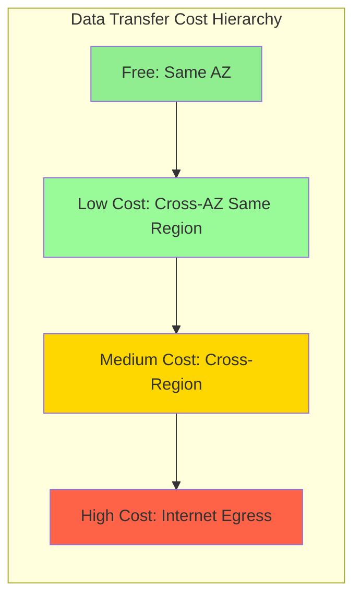
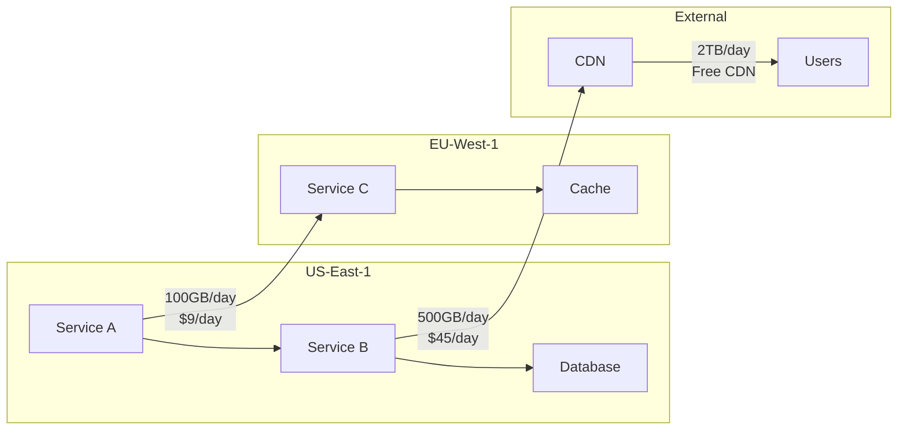
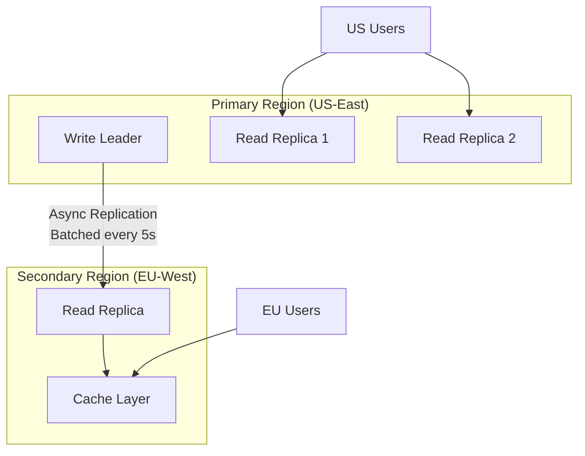
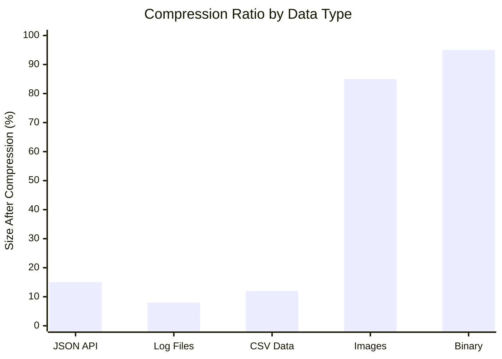
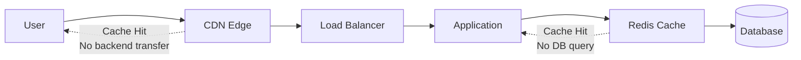
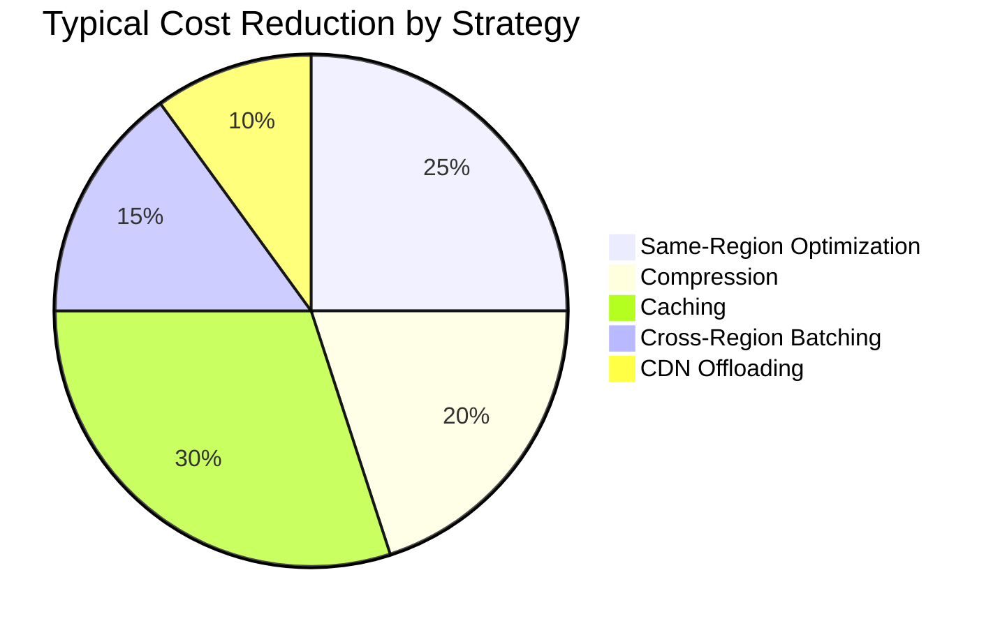

# How to Implement Data Transfer Optimization

Author: [nawazdhandala](https://github.com/nawazdhandala)

Tags: Networking, Cost Optimization, Cloud, Performance

Description: Learn how to optimize data transfer costs between cloud services and regions.

---

Data transfer costs are often the silent killer of cloud budgets. While compute and storage costs are visible and predictable, data transfer charges can spiral out of control, sometimes exceeding the cost of the infrastructure itself. This guide covers practical strategies to optimize data transfer and significantly reduce your cloud bills.

## Understanding Data Transfer Costs

Before optimizing, you need to understand where your money goes. Cloud providers charge differently based on the transfer type.



### Typical Cloud Provider Pricing

| Transfer Type | AWS | GCP | Azure |
|--------------|-----|-----|-------|
| Same AZ | Free | Free | Free |
| Cross-AZ | $0.01/GB | $0.01/GB | Free |
| Cross-Region | $0.02-0.09/GB | $0.01-0.08/GB | $0.02-0.05/GB |
| Internet Egress | $0.09-0.12/GB | $0.08-0.12/GB | $0.05-0.08/GB |

At scale, these costs add up quickly. Transferring 100TB monthly to the internet costs approximately $9,000-12,000 per month.

## Data Transfer Cost Analysis

The first step is understanding where your data flows. You cannot optimize what you cannot measure.

### AWS Cost Analysis

```bash
# Get data transfer costs from AWS Cost Explorer
aws ce get-cost-and-usage \
  --time-period Start=2026-01-01,End=2026-01-31 \
  --granularity MONTHLY \
  --metrics "BlendedCost" "UsageQuantity" \
  --group-by Type=DIMENSION,Key=USAGE_TYPE \
  --filter '{
    "Dimensions": {
      "Key": "USAGE_TYPE",
      "Values": ["DataTransfer-Out-Bytes", "DataTransfer-Regional-Bytes"]
    }
  }'
```

### Kubernetes Traffic Analysis with OpenTelemetry

Track data transfer at the application level.

```yaml
# OpenTelemetry Collector configuration for network metrics
apiVersion: v1
kind: ConfigMap
metadata:
  name: otel-collector-config
  namespace: monitoring
data:
  config.yaml: |
    receivers:
      hostmetrics:
        collection_interval: 30s
        scrapers:
          network:
            include:
              interfaces: ["eth0", "eth1"]
            metrics:
              system.network.io:
                enabled: true
              system.network.packets:
                enabled: true

    processors:
      batch:
        timeout: 10s
      attributes:
        actions:
          - key: cloud.region
            value: ${CLOUD_REGION}
            action: upsert
          - key: cloud.availability_zone
            value: ${CLOUD_AZ}
            action: upsert

    exporters:
      prometheus:
        endpoint: "0.0.0.0:8889"

    service:
      pipelines:
        metrics:
          receivers: [hostmetrics]
          processors: [batch, attributes]
          exporters: [prometheus]
```

### Network Flow Visualization



## Same-Region Strategies

The cheapest data transfer is the one that never crosses availability zone boundaries.

### Co-locate Related Services

Design your architecture to keep chatty services in the same availability zone.

```yaml
# Kubernetes pod affinity to co-locate services
apiVersion: apps/v1
kind: Deployment
metadata:
  name: api-server
spec:
  replicas: 3
  selector:
    matchLabels:
      app: api-server
  template:
    metadata:
      labels:
        app: api-server
    spec:
      affinity:
        podAffinity:
          preferredDuringSchedulingIgnoredDuringExecution:
            - weight: 100
              podAffinityTerm:
                labelSelector:
                  matchLabels:
                    app: cache
                topologyKey: topology.kubernetes.io/zone
      containers:
        - name: api
          image: api-server:latest
          env:
            - name: CACHE_HOST
              value: cache-service
```

### Zone-Aware Service Discovery

Configure your service mesh to prefer same-zone endpoints.

```yaml
# Istio DestinationRule for locality load balancing
apiVersion: networking.istio.io/v1beta1
kind: DestinationRule
metadata:
  name: cache-locality
spec:
  host: cache-service
  trafficPolicy:
    connectionPool:
      tcp:
        maxConnections: 100
    loadBalancer:
      localityLbSetting:
        enabled: true
        failoverPriority:
          - "topology.kubernetes.io/zone"
          - "topology.kubernetes.io/region"
    outlierDetection:
      consecutive5xxErrors: 5
      interval: 30s
      baseEjectionTime: 30s
```

### Topology-Aware Routing in Kubernetes

```yaml
# Enable topology-aware hints for services
apiVersion: v1
kind: Service
metadata:
  name: backend-service
  annotations:
    service.kubernetes.io/topology-mode: Auto
spec:
  selector:
    app: backend
  ports:
    - port: 8080
      targetPort: 8080
```

### Node Topology Labels

Ensure your nodes have proper topology labels.

```bash
# Check node topology labels
kubectl get nodes -o custom-columns=\
NAME:.metadata.name,\
ZONE:.metadata.labels."topology\.kubernetes\.io/zone",\
REGION:.metadata.labels."topology\.kubernetes\.io/region"
```

## Cross-Region Optimization

When data must cross regions, minimize the volume and frequency.

### Implement Data Aggregation

Instead of streaming raw data, aggregate before transfer.

```python
# Python example: Aggregate metrics before cross-region transfer
import asyncio
from dataclasses import dataclass, field
from typing import Dict, List
from datetime import datetime, timedelta
import aiohttp

@dataclass
class MetricAggregator:
    """Aggregates metrics to reduce cross-region transfer volume."""

    buffer: Dict[str, List[float]] = field(default_factory=dict)
    flush_interval: int = 60  # seconds
    remote_endpoint: str = ""

    def record(self, metric_name: str, value: float) -> None:
        """Buffer individual metric values."""
        if metric_name not in self.buffer:
            self.buffer[metric_name] = []
        self.buffer[metric_name].append(value)

    def aggregate(self) -> Dict[str, Dict[str, float]]:
        """Compute aggregates from buffered values."""
        aggregates = {}
        for metric_name, values in self.buffer.items():
            if values:
                aggregates[metric_name] = {
                    "min": min(values),
                    "max": max(values),
                    "avg": sum(values) / len(values),
                    "count": len(values),
                    "sum": sum(values)
                }
        return aggregates

    async def flush(self) -> None:
        """Send aggregated data to remote region."""
        aggregates = self.aggregate()
        if not aggregates:
            return

        # Single request instead of thousands
        async with aiohttp.ClientSession() as session:
            await session.post(
                self.remote_endpoint,
                json={
                    "timestamp": datetime.utcnow().isoformat(),
                    "metrics": aggregates
                }
            )

        self.buffer.clear()

    async def run(self) -> None:
        """Periodically flush aggregated metrics."""
        while True:
            await asyncio.sleep(self.flush_interval)
            await self.flush()


# Usage: Reduces 1000s of individual transfers to 1
aggregator = MetricAggregator(
    flush_interval=60,
    remote_endpoint="https://metrics.eu-west-1.example.com/ingest"
)

# Instead of sending each metric immediately
for i in range(10000):
    aggregator.record("request_latency_ms", 45.2)
    aggregator.record("cpu_utilization", 0.67)

# Sends single aggregated payload
await aggregator.flush()
```

### Cross-Region Replication Strategy



### Selective Replication

Only replicate data that is actually needed in remote regions.

```sql
-- PostgreSQL: Create publication for selective replication
CREATE PUBLICATION eu_region_pub
FOR TABLE
    users,
    products,
    orders
WHERE (region = 'EU' OR is_global = true);

-- On EU replica
CREATE SUBSCRIPTION eu_region_sub
CONNECTION 'host=primary.us-east-1.rds.amazonaws.com dbname=app'
PUBLICATION eu_region_pub;
```

## Compression Techniques

Compression reduces transfer volume but adds CPU overhead. The tradeoff is almost always worth it for cross-region and internet traffic.

### HTTP Compression Configuration

```nginx
# Nginx compression configuration
http {
    # Enable gzip compression
    gzip on;
    gzip_vary on;
    gzip_proxied any;
    gzip_comp_level 6;
    gzip_min_length 1000;
    gzip_types
        application/json
        application/javascript
        application/xml
        application/rss+xml
        text/css
        text/javascript
        text/plain
        text/xml
        image/svg+xml;

    # Enable Brotli compression (better ratios)
    brotli on;
    brotli_comp_level 6;
    brotli_types
        application/json
        application/javascript
        text/css
        text/javascript
        text/plain;
}
```

### Application-Level Compression

```javascript
// Node.js: Compress data before transfer
const zlib = require('zlib');
const { promisify } = require('util');

const gzip = promisify(zlib.gzip);
const gunzip = promisify(zlib.gunzip);

class CompressedTransfer {
    constructor(options = {}) {
        this.compressionLevel = options.compressionLevel || 6;
        this.minSizeForCompression = options.minSize || 1024; // 1KB
    }

    async compress(data) {
        const jsonString = JSON.stringify(data);
        const buffer = Buffer.from(jsonString);

        // Skip compression for small payloads
        if (buffer.length < this.minSizeForCompression) {
            return {
                compressed: false,
                data: buffer,
                originalSize: buffer.length
            };
        }

        const compressed = await gzip(buffer, {
            level: this.compressionLevel
        });

        const ratio = compressed.length / buffer.length;
        console.log(`Compression ratio: ${(ratio * 100).toFixed(1)}%`);
        console.log(`Saved: ${buffer.length - compressed.length} bytes`);

        return {
            compressed: true,
            data: compressed,
            originalSize: buffer.length,
            compressedSize: compressed.length
        };
    }

    async decompress(data, isCompressed) {
        if (!isCompressed) {
            return JSON.parse(data.toString());
        }

        const decompressed = await gunzip(data);
        return JSON.parse(decompressed.toString());
    }
}

// Usage example
const transfer = new CompressedTransfer({ compressionLevel: 6 });

const largePayload = {
    events: Array(10000).fill({
        timestamp: Date.now(),
        type: 'page_view',
        properties: { page: '/home', referrer: 'google.com' }
    })
};

const result = await transfer.compress(largePayload);
// Typical result: 95% compression for JSON data
```

### Protocol Buffers for Structured Data

```protobuf
// metrics.proto - Define efficient binary format
syntax = "proto3";

package metrics;

message MetricBatch {
    int64 timestamp = 1;
    string source_region = 2;
    repeated Metric metrics = 3;
}

message Metric {
    string name = 1;
    double value = 2;
    map<string, string> labels = 3;
}
```

```javascript
// Node.js: Use Protocol Buffers
const protobuf = require('protobufjs');

async function sendMetrics(metrics) {
    const root = await protobuf.load('metrics.proto');
    const MetricBatch = root.lookupType('metrics.MetricBatch');

    const payload = {
        timestamp: Date.now(),
        sourceRegion: 'us-east-1',
        metrics: metrics
    };

    // Encode to binary - much smaller than JSON
    const buffer = MetricBatch.encode(
        MetricBatch.create(payload)
    ).finish();

    // JSON: ~500KB, Protobuf: ~50KB for same data
    console.log(`Protobuf size: ${buffer.length} bytes`);

    return buffer;
}
```

### Compression Comparison



## Caching Strategies

Caching eliminates redundant transfers. Every cache hit is a transfer avoided.

### Multi-Layer Caching Architecture



### Redis Caching with TTL Strategy

```python
# Python: Intelligent caching with cost awareness
import redis
import json
import hashlib
from typing import Optional, Any, Callable
from functools import wraps
from dataclasses import dataclass

@dataclass
class CacheConfig:
    """Cache configuration based on data transfer cost."""

    # Higher TTL for expensive cross-region data
    cross_region_ttl: int = 3600  # 1 hour
    same_region_ttl: int = 300    # 5 minutes
    local_ttl: int = 60           # 1 minute

class CostAwareCache:
    def __init__(self, redis_client: redis.Redis, config: CacheConfig):
        self.redis = redis_client
        self.config = config

    def _get_ttl(self, source_region: str, current_region: str) -> int:
        """Determine TTL based on data source location."""
        if source_region == current_region:
            return self.config.same_region_ttl
        elif source_region.split('-')[0] == current_region.split('-')[0]:
            # Same cloud provider region prefix (e.g., us-east vs us-west)
            return self.config.same_region_ttl * 2
        else:
            return self.config.cross_region_ttl

    def cache_key(self, prefix: str, *args, **kwargs) -> str:
        """Generate deterministic cache key."""
        key_data = json.dumps({'args': args, 'kwargs': kwargs}, sort_keys=True)
        hash_value = hashlib.sha256(key_data.encode()).hexdigest()[:16]
        return f"{prefix}:{hash_value}"

    def cached(
        self,
        prefix: str,
        source_region: str,
        current_region: str = "us-east-1"
    ) -> Callable:
        """Decorator for caching function results."""
        def decorator(func: Callable) -> Callable:
            @wraps(func)
            async def wrapper(*args, **kwargs) -> Any:
                key = self.cache_key(prefix, *args, **kwargs)

                # Try cache first
                cached = self.redis.get(key)
                if cached:
                    return json.loads(cached)

                # Execute function
                result = await func(*args, **kwargs)

                # Cache with cost-aware TTL
                ttl = self._get_ttl(source_region, current_region)
                self.redis.setex(key, ttl, json.dumps(result))

                return result
            return wrapper
        return decorator


# Usage example
redis_client = redis.Redis(host='localhost', port=6379)
cache = CostAwareCache(redis_client, CacheConfig())

@cache.cached(prefix="product", source_region="eu-west-1")
async def get_product_from_eu(product_id: str) -> dict:
    """Fetch product data from EU region - expensive transfer."""
    # This would normally call EU region API
    return {"id": product_id, "name": "Example Product"}
```

### CDN Configuration for API Responses

```yaml
# CloudFront configuration for API caching
AWSTemplateFormatVersion: '2010-09-09'
Resources:
  ApiCacheDistribution:
    Type: AWS::CloudFront::Distribution
    Properties:
      DistributionConfig:
        Origins:
          - Id: ApiOrigin
            DomainName: api.example.com
            CustomOriginConfig:
              HTTPSPort: 443
              OriginProtocolPolicy: https-only
        DefaultCacheBehavior:
          TargetOriginId: ApiOrigin
          ViewerProtocolPolicy: redirect-to-https
          CachePolicyId: !Ref ApiCachePolicy

  ApiCachePolicy:
    Type: AWS::CloudFront::CachePolicy
    Properties:
      CachePolicyConfig:
        Name: api-cache-policy
        DefaultTTL: 300
        MaxTTL: 3600
        MinTTL: 60
        ParametersInCacheKeyAndForwardedToOrigin:
          CookiesConfig:
            CookieBehavior: none
          HeadersConfig:
            HeaderBehavior: whitelist
            Headers:
              - Authorization
              - Accept-Encoding
          QueryStringsConfig:
            QueryStringBehavior: whitelist
            QueryStrings:
              - page
              - limit
          EnableAcceptEncodingGzip: true
          EnableAcceptEncodingBrotli: true
```

### Cache Invalidation Strategy

```javascript
// Node.js: Smart cache invalidation
class CacheInvalidator {
    constructor(redis, pubsub) {
        this.redis = redis;
        this.pubsub = pubsub;
    }

    async invalidate(pattern, options = {}) {
        const {
            propagateToRegions = true,
            delay = 0
        } = options;

        // Find matching keys
        const keys = await this.scanKeys(pattern);

        if (keys.length === 0) return;

        // Batch delete for efficiency
        const pipeline = this.redis.pipeline();
        keys.forEach(key => pipeline.del(key));
        await pipeline.exec();

        console.log(`Invalidated ${keys.length} cache keys`);

        // Propagate to other regions via pub/sub
        if (propagateToRegions) {
            await this.pubsub.publish('cache-invalidation', {
                pattern,
                timestamp: Date.now(),
                sourceRegion: process.env.AWS_REGION
            });
        }
    }

    async scanKeys(pattern) {
        const keys = [];
        let cursor = '0';

        do {
            const [newCursor, batch] = await this.redis.scan(
                cursor,
                'MATCH', pattern,
                'COUNT', 1000
            );
            cursor = newCursor;
            keys.push(...batch);
        } while (cursor !== '0');

        return keys;
    }
}
```

## Transfer Monitoring

You cannot optimize what you do not measure. Implement comprehensive monitoring for data transfer.

### Prometheus Metrics for Transfer Tracking

```yaml
# Prometheus recording rules for transfer costs
groups:
  - name: data_transfer_costs
    interval: 1m
    rules:
      # Track outbound bytes by destination
      - record: data_transfer:outbound_bytes:rate5m
        expr: |
          sum by (destination_region, service) (
            rate(network_transmit_bytes_total[5m])
          )

      # Estimate costs based on destination
      - record: data_transfer:estimated_cost_per_hour
        expr: |
          (
            # Internet egress at $0.09/GB
            sum by (service) (
              data_transfer:outbound_bytes:rate5m{destination_region="internet"}
            ) * 3600 / 1073741824 * 0.09
          ) + (
            # Cross-region at $0.02/GB
            sum by (service) (
              data_transfer:outbound_bytes:rate5m{destination_region=~".*", destination_region!="internet", destination_region!~".*-local"}
            ) * 3600 / 1073741824 * 0.02
          )

      # Alert threshold
      - alert: HighDataTransferCost
        expr: data_transfer:estimated_cost_per_hour > 10
        for: 15m
        labels:
          severity: warning
        annotations:
          summary: "High data transfer cost detected"
          description: "Service {{ $labels.service }} is transferring data at ${{ $value }}/hour"
```

### Grafana Dashboard Configuration

```json
{
  "dashboard": {
    "title": "Data Transfer Cost Dashboard",
    "panels": [
      {
        "title": "Transfer Volume by Type",
        "type": "timeseries",
        "targets": [
          {
            "expr": "sum by (transfer_type) (rate(network_transmit_bytes_total[5m])) * 300",
            "legendFormat": "{{ transfer_type }}"
          }
        ],
        "fieldConfig": {
          "defaults": {
            "unit": "bytes"
          }
        }
      },
      {
        "title": "Estimated Hourly Cost",
        "type": "stat",
        "targets": [
          {
            "expr": "sum(data_transfer:estimated_cost_per_hour)"
          }
        ],
        "fieldConfig": {
          "defaults": {
            "unit": "currencyUSD",
            "thresholds": {
              "steps": [
                { "value": 0, "color": "green" },
                { "value": 5, "color": "yellow" },
                { "value": 20, "color": "red" }
              ]
            }
          }
        }
      },
      {
        "title": "Top Services by Transfer Cost",
        "type": "table",
        "targets": [
          {
            "expr": "topk(10, sum by (service) (data_transfer:estimated_cost_per_hour))",
            "format": "table"
          }
        ]
      }
    ]
  }
}
```

### Custom Transfer Metrics Collector

```python
# Python: Custom metrics collector for transfer tracking
from prometheus_client import Counter, Gauge, Histogram
import psutil
from typing import Dict

# Define metrics
transfer_bytes = Counter(
    'app_data_transfer_bytes_total',
    'Total bytes transferred',
    ['direction', 'destination_type', 'service']
)

transfer_cost_estimate = Gauge(
    'app_data_transfer_cost_estimate',
    'Estimated transfer cost in USD per hour',
    ['destination_type']
)

transfer_latency = Histogram(
    'app_data_transfer_latency_seconds',
    'Data transfer latency',
    ['destination_region'],
    buckets=[0.01, 0.05, 0.1, 0.5, 1.0, 5.0]
)

class TransferMetricsCollector:
    # Cost per GB by destination type
    COST_PER_GB: Dict[str, float] = {
        'same_az': 0.0,
        'cross_az': 0.01,
        'cross_region': 0.02,
        'internet': 0.09
    }

    def __init__(self, service_name: str):
        self.service_name = service_name
        self.hourly_bytes: Dict[str, int] = {
            'same_az': 0,
            'cross_az': 0,
            'cross_region': 0,
            'internet': 0
        }

    def record_transfer(
        self,
        bytes_count: int,
        destination_type: str,
        direction: str = 'outbound'
    ) -> None:
        """Record a data transfer event."""
        transfer_bytes.labels(
            direction=direction,
            destination_type=destination_type,
            service=self.service_name
        ).inc(bytes_count)

        self.hourly_bytes[destination_type] += bytes_count

    def calculate_hourly_cost(self) -> float:
        """Calculate estimated hourly transfer cost."""
        total_cost = 0.0

        for dest_type, bytes_count in self.hourly_bytes.items():
            gb = bytes_count / (1024 ** 3)
            cost = gb * self.COST_PER_GB.get(dest_type, 0.09)

            transfer_cost_estimate.labels(
                destination_type=dest_type
            ).set(cost)

            total_cost += cost

        return total_cost

    def reset_hourly_counters(self) -> None:
        """Reset hourly counters (call from scheduled job)."""
        self.hourly_bytes = {k: 0 for k in self.hourly_bytes}


# Usage
collector = TransferMetricsCollector(service_name='api-gateway')

# Record transfers
collector.record_transfer(1024 * 1024 * 100, 'cross_region')  # 100MB cross-region
collector.record_transfer(1024 * 1024 * 500, 'internet')       # 500MB to internet

# Get cost estimate
hourly_cost = collector.calculate_hourly_cost()
print(f"Estimated hourly cost: ${hourly_cost:.2f}")
```

## Implementation Checklist

Use this checklist to systematically optimize your data transfer costs.

### Analysis Phase
- [ ] Enable detailed billing and tag resources by service
- [ ] Identify top data transfer cost sources
- [ ] Map data flows between services and regions
- [ ] Calculate baseline transfer volumes and costs

### Same-Region Optimization
- [ ] Co-locate related services in the same availability zone
- [ ] Enable topology-aware routing in Kubernetes
- [ ] Configure service mesh for locality-aware load balancing
- [ ] Use zone-aware database read replicas

### Cross-Region Optimization
- [ ] Implement data aggregation before transfer
- [ ] Use selective replication for databases
- [ ] Set up regional caches for frequently accessed data
- [ ] Batch API calls to remote regions

### Compression
- [ ] Enable gzip/brotli compression on all HTTP endpoints
- [ ] Use Protocol Buffers or MessagePack for internal APIs
- [ ] Compress log data before shipping to central location
- [ ] Implement compression for database replication streams

### Caching
- [ ] Deploy CDN for static assets and cacheable API responses
- [ ] Implement application-level caching with Redis/Memcached
- [ ] Configure appropriate TTLs based on data volatility
- [ ] Set up cache invalidation mechanisms

### Monitoring
- [ ] Deploy network metrics collection
- [ ] Create cost estimation dashboards
- [ ] Set up alerts for unusual transfer patterns
- [ ] Schedule monthly cost reviews

## Cost Savings Summary



Implementing these strategies typically reduces data transfer costs by 40-70%. For a company spending $50,000/month on data transfer, that translates to $20,000-35,000 in monthly savings.

---

Data transfer optimization requires ongoing attention. Costs creep up as traffic grows and new services deploy. Build monitoring into your infrastructure from day one, and review transfer patterns monthly. The investment in optimization pays dividends that compound as your infrastructure scales.
