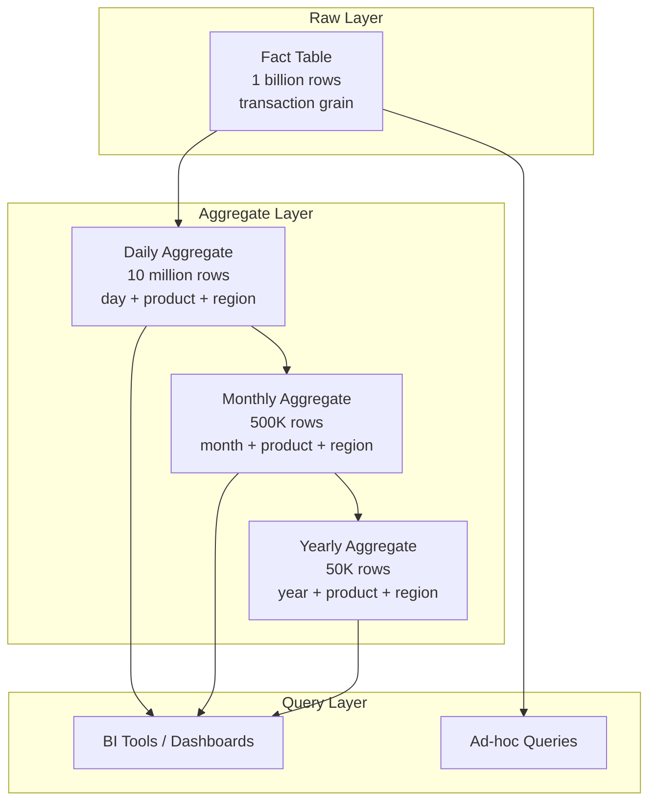
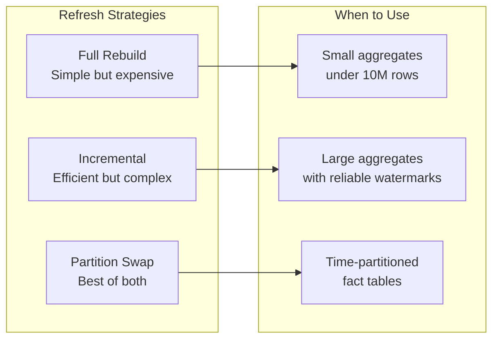
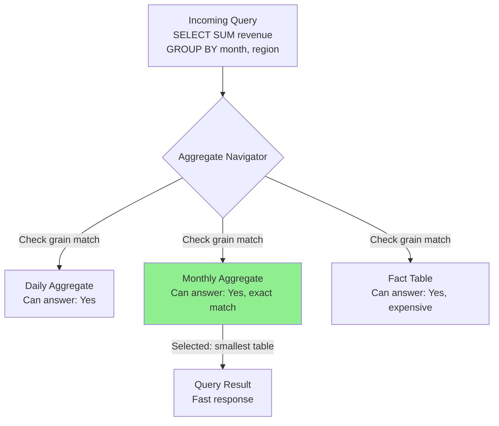

# How to Create Aggregate Tables

Author: [nawazdhandala](https://github.com/nawazdhandala)

Tags: Data Warehouse, Aggregates, Performance, Query Optimization

Description: Learn to create aggregate tables for pre-computed summaries that accelerate analytical queries.

---

Analytical queries against large fact tables are slow. A single dashboard tile requesting "total revenue by region for the last quarter" might scan billions of rows, burn CPU cycles, and keep your users waiting. Aggregate tables solve this by storing pre-computed summaries at coarser grains, so the database reads thousands of rows instead of billions.

This guide walks through designing, building, and maintaining aggregate tables in a data warehouse environment.

## Why Aggregate Tables Matter

Every data warehouse hits a performance wall eventually. You add more data, more users, and more dashboards until queries that once took seconds now take minutes. Aggregate tables let you:

- **Cut query latency by orders of magnitude.** Scanning a 10 million row aggregate beats scanning a 10 billion row fact table.
- **Reduce compute costs.** Fewer rows scanned means smaller cloud bills on pay-per-query engines like BigQuery and Snowflake.
- **Improve user experience.** Dashboards that load in under two seconds get used; dashboards that spin for 30 seconds get abandoned.

The trade-off is maintenance complexity. You must decide what to aggregate, how often to refresh, and how to route queries to the right table.

## Aggregate Table Architecture



The pattern is straightforward: build progressively coarser summaries on top of your raw fact table, then route queries to the smallest table that can answer them.

## Step 1: Choose the Right Grain

The grain of an aggregate table determines what questions it can answer. Pick too fine a grain and you save little; pick too coarse and the table cannot answer common queries.

### Common Grain Choices

| Grain Level | Typical Row Count | Good For |
| --- | --- | --- |
| Hourly | High | Real-time dashboards, intraday trends |
| Daily | Medium | Most operational reporting |
| Weekly | Medium-Low | Week-over-week comparisons |
| Monthly | Low | Financial close, executive dashboards |
| Yearly | Very Low | Long-term trend analysis |

### Grain Selection Checklist

1. **List your top 10 queries.** What time granularity do they need?
2. **Check filter patterns.** If users always filter by region and product, include those dimensions in the aggregate.
3. **Estimate cardinality.** Multiply dimension cardinalities to predict row counts. A daily aggregate with 365 days x 100 products x 50 regions = 1.8 million rows.

```sql
-- Example: Estimate cardinality for a proposed aggregate
SELECT
    COUNT(DISTINCT DATE_TRUNC('day', order_timestamp)) AS distinct_days,
    COUNT(DISTINCT product_id) AS distinct_products,
    COUNT(DISTINCT region_id) AS distinct_regions,
    COUNT(DISTINCT DATE_TRUNC('day', order_timestamp))
        * COUNT(DISTINCT product_id)
        * COUNT(DISTINCT region_id) AS estimated_agg_rows
FROM sales_fact;
```

## Step 2: Define Aggregate Measures

Aggregate tables store pre-computed metrics. The measures you include depend on the aggregation functions your queries need.

### Additive vs. Non-Additive Measures

| Measure Type | Examples | Aggregation Behavior |
| --- | --- | --- |
| Fully Additive | SUM(revenue), SUM(quantity) | Can roll up across any dimension |
| Semi-Additive | Balance, Inventory Level | Can roll up across some dimensions, not time |
| Non-Additive | AVG(price), COUNT(DISTINCT user) | Cannot roll up; store components instead |

For non-additive measures, store the components:

```sql
-- Store components for average calculation
-- Instead of storing AVG(order_value), store:
--   total_order_value (SUM)
--   order_count (COUNT)
-- Then compute: total_order_value / order_count

-- Store components for count distinct approximation
-- Use HyperLogLog sketches if your warehouse supports them
```

## Step 3: Create the Aggregate Table

Here is a complete example that builds a daily sales aggregate.

```sql
-- Create the aggregate table structure
-- This table summarizes sales at the day + product + region grain

CREATE TABLE sales_daily_agg (
    -- Grain columns (the "group by" of the aggregate)
    sale_date           DATE NOT NULL,
    product_id          INT NOT NULL,
    region_id           INT NOT NULL,

    -- Dimension attributes for filtering
    -- Denormalize frequently filtered columns to avoid joins
    product_category    VARCHAR(100),
    region_name         VARCHAR(100),

    -- Additive measures
    total_revenue       DECIMAL(18, 2),
    total_quantity      INT,
    total_discount      DECIMAL(18, 2),
    order_count         INT,

    -- Components for non-additive measures
    total_order_value   DECIMAL(18, 2),  -- For calculating average order value
    distinct_customers  INT,              -- Approximation or exact depending on volume

    -- Metadata for maintenance
    created_at          TIMESTAMP DEFAULT CURRENT_TIMESTAMP,
    updated_at          TIMESTAMP DEFAULT CURRENT_TIMESTAMP,

    -- Primary key on grain columns
    PRIMARY KEY (sale_date, product_id, region_id)
);

-- Add indexes for common filter patterns
CREATE INDEX idx_sales_daily_agg_date ON sales_daily_agg(sale_date);
CREATE INDEX idx_sales_daily_agg_category ON sales_daily_agg(product_category);
CREATE INDEX idx_sales_daily_agg_region ON sales_daily_agg(region_name);
```

### Initial Population

```sql
-- Populate the aggregate table from the fact table
-- Run this once for historical data

INSERT INTO sales_daily_agg (
    sale_date,
    product_id,
    region_id,
    product_category,
    region_name,
    total_revenue,
    total_quantity,
    total_discount,
    order_count,
    total_order_value,
    distinct_customers
)
SELECT
    DATE_TRUNC('day', sf.order_timestamp)::DATE AS sale_date,
    sf.product_id,
    sf.region_id,

    -- Denormalized attributes
    p.category AS product_category,
    r.name AS region_name,

    -- Additive measures
    SUM(sf.revenue) AS total_revenue,
    SUM(sf.quantity) AS total_quantity,
    SUM(sf.discount) AS total_discount,
    COUNT(*) AS order_count,

    -- Components for averages
    SUM(sf.order_value) AS total_order_value,
    COUNT(DISTINCT sf.customer_id) AS distinct_customers

FROM sales_fact sf
JOIN products p ON sf.product_id = p.product_id
JOIN regions r ON sf.region_id = r.region_id
GROUP BY
    DATE_TRUNC('day', sf.order_timestamp)::DATE,
    sf.product_id,
    sf.region_id,
    p.category,
    r.name;
```

## Step 4: Build a Refresh Strategy

Aggregates become stale when the underlying fact table changes. Your refresh strategy must balance freshness against cost.



### Full Rebuild

The simplest approach: truncate and reload.

```sql
-- Full rebuild strategy
-- Best for: Small aggregates, daily batch loads, development

BEGIN TRANSACTION;

-- Truncate existing data
TRUNCATE TABLE sales_daily_agg;

-- Reload everything
INSERT INTO sales_daily_agg (...)
SELECT ...
FROM sales_fact sf
JOIN products p ON sf.product_id = p.product_id
JOIN regions r ON sf.region_id = r.region_id
GROUP BY ...;

COMMIT;
```

### Incremental Refresh

Process only new or changed data using a watermark.

```sql
-- Incremental refresh strategy
-- Best for: Large aggregates with append-only or slowly changing fact tables

-- Step 1: Identify the last processed timestamp
-- Store this in a control table or derive from the aggregate

SELECT COALESCE(MAX(updated_at), '1900-01-01') AS last_watermark
FROM sales_daily_agg;

-- Step 2: Delete affected date partitions
-- (New data might update existing days)

DELETE FROM sales_daily_agg
WHERE sale_date IN (
    SELECT DISTINCT DATE_TRUNC('day', order_timestamp)::DATE
    FROM sales_fact
    WHERE loaded_at > :last_watermark
);

-- Step 3: Insert refreshed aggregates for affected dates

INSERT INTO sales_daily_agg (...)
SELECT ...
FROM sales_fact sf
JOIN products p ON sf.product_id = p.product_id
JOIN regions r ON sf.region_id = r.region_id
WHERE sf.loaded_at > :last_watermark
   OR DATE_TRUNC('day', sf.order_timestamp)::DATE IN (
       SELECT DISTINCT DATE_TRUNC('day', order_timestamp)::DATE
       FROM sales_fact
       WHERE loaded_at > :last_watermark
   )
GROUP BY ...;

-- Step 4: Update the watermark
UPDATE refresh_control
SET last_watermark = CURRENT_TIMESTAMP
WHERE table_name = 'sales_daily_agg';
```

### Partition Swap

The cleanest approach for time-series data: build new partitions in a staging table, then swap.

```sql
-- Partition swap strategy (PostgreSQL example)
-- Best for: Large time-partitioned aggregates

-- Step 1: Create the aggregate as a partitioned table
CREATE TABLE sales_daily_agg (
    sale_date DATE NOT NULL,
    product_id INT NOT NULL,
    region_id INT NOT NULL,
    total_revenue DECIMAL(18, 2),
    -- ... other columns
    PRIMARY KEY (sale_date, product_id, region_id)
) PARTITION BY RANGE (sale_date);

-- Step 2: Create partitions for each month
CREATE TABLE sales_daily_agg_2026_01
    PARTITION OF sales_daily_agg
    FOR VALUES FROM ('2026-01-01') TO ('2026-02-01');

-- Step 3: To refresh January 2026, build in a staging table
CREATE TABLE sales_daily_agg_2026_01_new AS
SELECT ...
FROM sales_fact
WHERE order_timestamp >= '2026-01-01'
  AND order_timestamp < '2026-02-01'
GROUP BY ...;

-- Step 4: Swap partitions atomically
BEGIN;
ALTER TABLE sales_daily_agg DETACH PARTITION sales_daily_agg_2026_01;
DROP TABLE sales_daily_agg_2026_01;
ALTER TABLE sales_daily_agg ATTACH PARTITION sales_daily_agg_2026_01_new
    FOR VALUES FROM ('2026-01-01') TO ('2026-02-01');
COMMIT;
```

## Step 5: Implement Aggregate Navigation

Aggregate navigation routes queries to the best available aggregate table. This can happen at the BI tool layer, the query rewrite layer, or through views.



### View-Based Navigation

Create a view that unions multiple aggregates and let the optimizer choose.

```sql
-- Create a unified view over multiple aggregate levels
-- The query optimizer may push predicates and pick the right partition

CREATE VIEW sales_summary AS

-- Yearly grain
SELECT
    'yearly' AS agg_level,
    DATE_TRUNC('year', sale_date)::DATE AS period_start,
    'year' AS period_type,
    product_category,
    region_name,
    SUM(total_revenue) AS revenue,
    SUM(total_quantity) AS quantity,
    SUM(order_count) AS orders
FROM sales_yearly_agg
GROUP BY DATE_TRUNC('year', sale_date), product_category, region_name

UNION ALL

-- Monthly grain
SELECT
    'monthly' AS agg_level,
    DATE_TRUNC('month', sale_date)::DATE AS period_start,
    'month' AS period_type,
    product_category,
    region_name,
    SUM(total_revenue) AS revenue,
    SUM(total_quantity) AS quantity,
    SUM(order_count) AS orders
FROM sales_monthly_agg
GROUP BY DATE_TRUNC('month', sale_date), product_category, region_name

UNION ALL

-- Daily grain (most detailed)
SELECT
    'daily' AS agg_level,
    sale_date AS period_start,
    'day' AS period_type,
    product_category,
    region_name,
    total_revenue AS revenue,
    total_quantity AS quantity,
    order_count AS orders
FROM sales_daily_agg;

-- Query the view with the grain you need
-- A smart BI tool will filter to the right agg_level

SELECT
    period_start,
    region_name,
    SUM(revenue) AS total_revenue
FROM sales_summary
WHERE agg_level = 'monthly'
  AND period_start >= '2026-01-01'
GROUP BY period_start, region_name;
```

### Application-Level Navigation

For more control, implement routing logic in your application or semantic layer.

```sql
-- Pseudocode for aggregate navigation logic

-- Function: select_aggregate_table(requested_grain, dimensions, measures)

-- 1. List candidate aggregates that contain required dimensions and measures
-- 2. Filter to aggregates whose grain is equal to or finer than requested
-- 3. Sort by row count ascending
-- 4. Return the smallest qualifying aggregate

-- Example mapping table for navigation logic
CREATE TABLE aggregate_registry (
    table_name          VARCHAR(100),
    grain_level         VARCHAR(20),  -- 'daily', 'monthly', 'yearly'
    grain_rank          INT,          -- 1=finest, 3=coarsest
    dimensions          TEXT[],       -- ['product_id', 'region_id', 'sale_date']
    measures            TEXT[],       -- ['total_revenue', 'total_quantity']
    estimated_rows      BIGINT
);

INSERT INTO aggregate_registry VALUES
('sales_daily_agg', 'daily', 1,
 ARRAY['product_id', 'region_id', 'product_category', 'region_name', 'sale_date'],
 ARRAY['total_revenue', 'total_quantity', 'order_count'],
 10000000),
('sales_monthly_agg', 'monthly', 2,
 ARRAY['product_id', 'region_id', 'product_category', 'region_name', 'sale_month'],
 ARRAY['total_revenue', 'total_quantity', 'order_count'],
 500000),
('sales_yearly_agg', 'yearly', 3,
 ARRAY['product_id', 'region_id', 'product_category', 'region_name', 'sale_year'],
 ARRAY['total_revenue', 'total_quantity', 'order_count'],
 50000);
```

## Step 6: Monitor and Maintain

Aggregate tables require ongoing attention. Set up monitoring to catch drift and staleness.

### Key Metrics to Track

```sql
-- Monitor aggregate freshness
-- Alert if the aggregate is more than N hours behind the fact table

SELECT
    'sales_daily_agg' AS aggregate_table,
    MAX(updated_at) AS last_refresh,
    (SELECT MAX(loaded_at) FROM sales_fact) AS fact_latest,
    EXTRACT(EPOCH FROM (
        (SELECT MAX(loaded_at) FROM sales_fact) - MAX(updated_at)
    )) / 3600 AS hours_behind
FROM sales_daily_agg;

-- Monitor row count growth
-- Unexpected growth may indicate grain drift or duplicate keys

SELECT
    'sales_daily_agg' AS table_name,
    COUNT(*) AS current_rows,
    pg_total_relation_size('sales_daily_agg') AS size_bytes
FROM sales_daily_agg;

-- Validate aggregate accuracy (sample check)
-- Compare aggregate totals to fact table totals for a random date

WITH fact_totals AS (
    SELECT
        DATE_TRUNC('day', order_timestamp)::DATE AS sale_date,
        SUM(revenue) AS fact_revenue
    FROM sales_fact
    WHERE order_timestamp >= '2026-01-15'
      AND order_timestamp < '2026-01-16'
    GROUP BY DATE_TRUNC('day', order_timestamp)::DATE
),
agg_totals AS (
    SELECT
        sale_date,
        SUM(total_revenue) AS agg_revenue
    FROM sales_daily_agg
    WHERE sale_date = '2026-01-15'
    GROUP BY sale_date
)
SELECT
    f.sale_date,
    f.fact_revenue,
    a.agg_revenue,
    ABS(f.fact_revenue - a.agg_revenue) AS difference
FROM fact_totals f
JOIN agg_totals a ON f.sale_date = a.sale_date;
```

## Best Practices Summary

1. **Start with your slowest queries.** Profile before optimizing. Build aggregates that solve real pain points.

2. **Document the grain explicitly.** Every aggregate table should have a comment or README explaining what each row represents.

3. **Include metadata columns.** Always add `created_at` and `updated_at` so you can debug freshness issues.

4. **Test refresh logic in staging.** A broken incremental refresh can corrupt your aggregate silently.

5. **Version your aggregates.** When changing grain or measures, create a new table (e.g., `sales_daily_agg_v2`) rather than altering in place.

6. **Set up alerts.** Monitor for staleness, row count anomalies, and accuracy drift.

7. **Plan for backfills.** When the fact table gets corrected historically, you need a process to rebuild affected aggregate partitions.

## Conclusion

Aggregate tables are one of the oldest tricks in data warehousing, and they remain effective because physics has not changed: reading fewer rows is faster than reading more rows. The modern twist is automation. Instead of manually maintaining aggregates, invest in orchestration (dbt, Airflow, Dagster), monitoring (track freshness and accuracy), and semantic layers (automatic aggregate navigation).

Start with one aggregate that cuts your slowest dashboard query from 30 seconds to under one second. Once you see the impact, you will find more candidates. Just remember that every aggregate is technical debt until you automate its refresh and monitor its health.

**Related Reading:**

- [When Performance Matters, Skip the ORM](https://oneuptime.com/blog/post/2025-11-13-when-performance-matters-skip-the-orm/view)
- [SRE Metrics to Track](https://oneuptime.com/blog/post/2025-11-28-sre-metrics-to-track/view)
- [Logs, Metrics and Traces: Turning Three Noisy Streams into One Story](https://oneuptime.com/blog/post/2025-08-20-three-pillars-of-observability-logs-metrics-traces/view)
