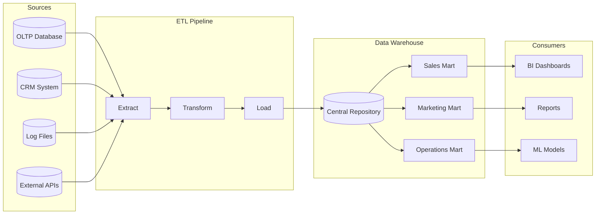
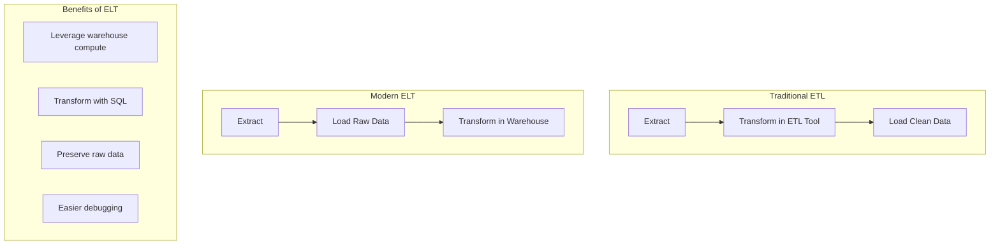
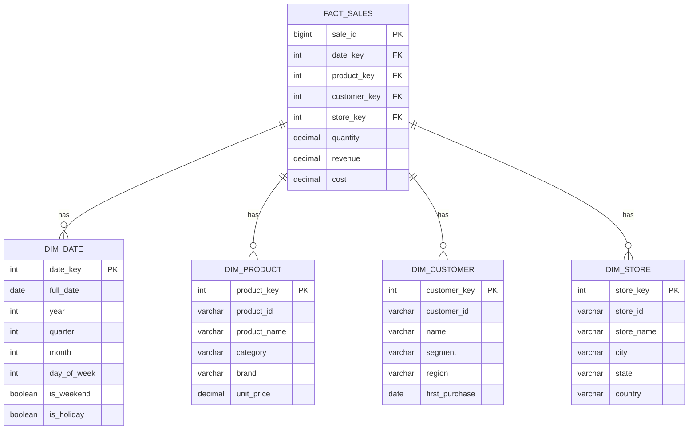
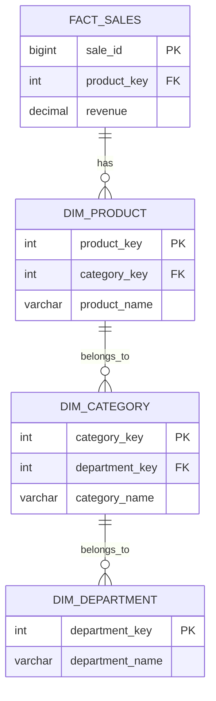
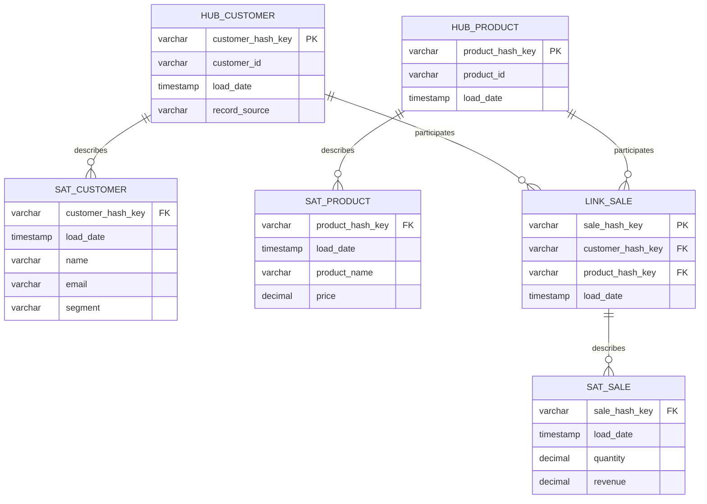
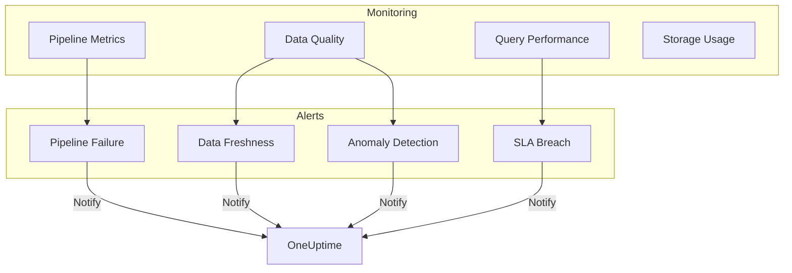

# How to Build Data Warehouse Architecture

Author: [nawazdhandala](https://github.com/nawazdhandala)

Tags: Data Warehouse, Analytics, Data Engineering, DevOps

Description: A practical guide to designing and building modern data warehouse architecture with ETL pipelines, schema design patterns, and real-world implementation examples.

---

Data warehouses are the backbone of business intelligence. They transform raw operational data into structured, queryable insights that drive decisions. Building one correctly from the start saves months of painful refactoring later. This guide walks through the architecture, components, and implementation patterns you need.

## What is a Data Warehouse?

A data warehouse is a centralized repository optimized for analytical queries rather than transactional workloads. Unlike operational databases that handle real-time transactions, data warehouses consolidate historical data from multiple sources for reporting and analysis.



## Key Architectural Components

### 1. Data Sources Layer

Your warehouse ingests data from multiple systems. Each source has different characteristics you need to handle.

| Source Type | Example | Ingestion Pattern |
|-------------|---------|-------------------|
| Transactional DB | PostgreSQL, MySQL | CDC or batch export |
| SaaS Applications | Salesforce, HubSpot | API polling |
| Event Streams | Kafka, Kinesis | Real-time streaming |
| Files | CSV, JSON, Parquet | Batch upload |
| Logs | Application logs | Streaming or batch |

### 2. Staging Area

Raw data lands here first before transformation. This preserves the original data and enables reprocessing if transformations change.

The following SQL creates staging tables that mirror source schemas while tracking when each record was ingested.

```sql
-- Staging table for raw order data
-- Preserves original structure with metadata columns for lineage
CREATE TABLE staging.orders_raw (
    -- Original columns from source
    order_id VARCHAR(50),
    customer_id VARCHAR(50),
    order_date TIMESTAMP,
    total_amount DECIMAL(10,2),
    status VARCHAR(20),
    raw_payload JSONB,

    -- Metadata for tracking
    source_system VARCHAR(50),
    ingestion_timestamp TIMESTAMP DEFAULT CURRENT_TIMESTAMP,
    batch_id VARCHAR(100)
);

-- Index for efficient batch processing
CREATE INDEX idx_staging_orders_batch
ON staging.orders_raw(batch_id, ingestion_timestamp);
```

### 3. ETL/ELT Pipeline

Modern architectures often use ELT (Extract, Load, Transform) where raw data is loaded first, then transformed in the warehouse using SQL. This leverages the warehouse's compute power.



### 4. Data Warehouse Core

This is where transformed, cleaned data lives in an optimized schema for analytics.

## Schema Design Patterns

### Star Schema

The most common pattern. A central fact table connects to dimension tables through foreign keys. Simple to understand and query.



The following SQL creates a star schema with a fact table and dimension tables.

```sql
-- Dimension: Date
-- Pre-populated with all dates for efficient joins
CREATE TABLE dim_date (
    date_key INT PRIMARY KEY,
    full_date DATE NOT NULL,
    year INT,
    quarter INT,
    month INT,
    month_name VARCHAR(20),
    day_of_week INT,
    day_name VARCHAR(20),
    is_weekend BOOLEAN,
    is_holiday BOOLEAN,
    fiscal_year INT,
    fiscal_quarter INT
);

-- Dimension: Product with slowly changing dimension support
CREATE TABLE dim_product (
    product_key SERIAL PRIMARY KEY,
    product_id VARCHAR(50) NOT NULL,
    product_name VARCHAR(200),
    category VARCHAR(100),
    subcategory VARCHAR(100),
    brand VARCHAR(100),
    unit_price DECIMAL(10,2),
    -- SCD Type 2 columns for tracking history
    effective_date DATE,
    expiration_date DATE,
    is_current BOOLEAN DEFAULT TRUE
);

-- Dimension: Customer
CREATE TABLE dim_customer (
    customer_key SERIAL PRIMARY KEY,
    customer_id VARCHAR(50) NOT NULL,
    customer_name VARCHAR(200),
    email VARCHAR(200),
    segment VARCHAR(50),
    region VARCHAR(100),
    country VARCHAR(100),
    first_purchase_date DATE,
    effective_date DATE,
    expiration_date DATE,
    is_current BOOLEAN DEFAULT TRUE
);

-- Fact: Sales
-- Contains measures and foreign keys to dimensions
CREATE TABLE fact_sales (
    sale_key BIGSERIAL PRIMARY KEY,
    date_key INT REFERENCES dim_date(date_key),
    product_key INT REFERENCES dim_product(product_key),
    customer_key INT REFERENCES dim_customer(customer_key),
    -- Measures
    quantity INT,
    unit_price DECIMAL(10,2),
    discount_amount DECIMAL(10,2),
    revenue DECIMAL(12,2),
    cost DECIMAL(12,2),
    profit DECIMAL(12,2)
);

-- Indexes for common query patterns
CREATE INDEX idx_fact_sales_date ON fact_sales(date_key);
CREATE INDEX idx_fact_sales_product ON fact_sales(product_key);
CREATE INDEX idx_fact_sales_customer ON fact_sales(customer_key);
```

### Snowflake Schema

Dimensions are normalized into sub-dimensions. Saves storage but requires more joins.



### Data Vault

Best for environments with frequent source changes. Separates structure (hubs and links) from descriptive data (satellites).



## Building the ETL Pipeline

### Step 1: Extract Data

This Python script extracts data from a PostgreSQL source database, handling connection pooling and batch processing for large tables.

```python
# extract.py
# Extracts data from source systems with incremental loading support

import psycopg2
from datetime import datetime, timedelta
import json
import logging

logging.basicConfig(level=logging.INFO)
logger = logging.getLogger(__name__)


class DataExtractor:
    """
    Handles extraction from source databases.
    Supports full and incremental loads based on watermark tracking.
    """

    def __init__(self, source_config: dict, watermark_table: str):
        self.source_config = source_config
        self.watermark_table = watermark_table
        self.connection = None

    def connect(self):
        """Establish connection to source database."""
        self.connection = psycopg2.connect(
            host=self.source_config['host'],
            port=self.source_config['port'],
            database=self.source_config['database'],
            user=self.source_config['user'],
            password=self.source_config['password']
        )
        return self.connection

    def get_last_watermark(self, table_name: str) -> datetime:
        """
        Retrieve the last successful extraction timestamp.
        Returns epoch if no previous extraction exists.
        """
        cursor = self.connection.cursor()
        cursor.execute(f"""
            SELECT last_extracted_at
            FROM {self.watermark_table}
            WHERE table_name = %s
        """, (table_name,))
        result = cursor.fetchone()
        return result[0] if result else datetime(1970, 1, 1)

    def extract_incremental(
        self,
        table_name: str,
        timestamp_column: str,
        batch_size: int = 10000
    ):
        """
        Extract records modified since last watermark.
        Yields batches for memory-efficient processing.
        """
        last_watermark = self.get_last_watermark(table_name)
        current_time = datetime.now()

        logger.info(
            f"Extracting {table_name} from {last_watermark} to {current_time}"
        )

        cursor = self.connection.cursor()

        # Use server-side cursor for large result sets
        cursor.execute(f"""
            SELECT * FROM {table_name}
            WHERE {timestamp_column} > %s
            AND {timestamp_column} <= %s
            ORDER BY {timestamp_column}
        """, (last_watermark, current_time))

        columns = [desc[0] for desc in cursor.description]
        batch = []

        for row in cursor:
            batch.append(dict(zip(columns, row)))
            if len(batch) >= batch_size:
                yield batch
                batch = []

        if batch:
            yield batch

        # Update watermark after successful extraction
        self.update_watermark(table_name, current_time)

    def update_watermark(self, table_name: str, timestamp: datetime):
        """Record successful extraction timestamp."""
        cursor = self.connection.cursor()
        cursor.execute(f"""
            INSERT INTO {self.watermark_table} (table_name, last_extracted_at)
            VALUES (%s, %s)
            ON CONFLICT (table_name)
            DO UPDATE SET last_extracted_at = EXCLUDED.last_extracted_at
        """, (table_name, timestamp))
        self.connection.commit()


# Example usage
if __name__ == "__main__":
    config = {
        'host': 'source-db.example.com',
        'port': 5432,
        'database': 'production',
        'user': 'etl_user',
        'password': 'secure_password'
    }

    extractor = DataExtractor(config, 'etl.watermarks')
    extractor.connect()

    for batch in extractor.extract_incremental('orders', 'updated_at'):
        logger.info(f"Extracted batch of {len(batch)} records")
        # Process batch...
```

### Step 2: Transform Data

Transformations clean, standardize, and enrich raw data. This step applies business logic and prepares data for the dimensional model.

```python
# transform.py
# Data transformation logic for the warehouse

from typing import List, Dict, Any
from datetime import datetime
import hashlib


class DataTransformer:
    """
    Applies business transformations to raw data.
    Handles data quality, standardization, and enrichment.
    """

    def __init__(self, dimension_lookups: dict):
        """
        Initialize with dimension lookup tables for surrogate key mapping.
        """
        self.dimension_lookups = dimension_lookups

    def transform_order(self, raw_order: dict) -> dict:
        """
        Transform a raw order record into fact table format.

        Transformations applied:
        - Map natural keys to surrogate keys
        - Calculate derived measures
        - Standardize data formats
        - Apply business rules
        """
        # Look up surrogate keys from dimensions
        date_key = self.get_date_key(raw_order['order_date'])
        customer_key = self.get_customer_key(raw_order['customer_id'])
        product_key = self.get_product_key(raw_order['product_id'])

        # Calculate derived measures
        quantity = int(raw_order['quantity'])
        unit_price = float(raw_order['unit_price'])
        discount_pct = float(raw_order.get('discount_percent', 0))

        gross_revenue = quantity * unit_price
        discount_amount = gross_revenue * (discount_pct / 100)
        net_revenue = gross_revenue - discount_amount

        # Apply cost calculation (example: 60% of unit price)
        cost = quantity * (unit_price * 0.6)
        profit = net_revenue - cost

        return {
            'date_key': date_key,
            'customer_key': customer_key,
            'product_key': product_key,
            'quantity': quantity,
            'unit_price': unit_price,
            'discount_amount': round(discount_amount, 2),
            'revenue': round(net_revenue, 2),
            'cost': round(cost, 2),
            'profit': round(profit, 2),
            'source_order_id': raw_order['order_id'],
            'loaded_at': datetime.now()
        }

    def get_date_key(self, date_value) -> int:
        """
        Convert date to integer key format YYYYMMDD.
        This format enables efficient range queries.
        """
        if isinstance(date_value, str):
            date_value = datetime.fromisoformat(date_value)
        return int(date_value.strftime('%Y%m%d'))

    def get_customer_key(self, customer_id: str) -> int:
        """
        Look up surrogate key for customer.
        Creates new dimension record if customer is new.
        """
        if customer_id in self.dimension_lookups['customer']:
            return self.dimension_lookups['customer'][customer_id]
        # Handle new customer - would insert into dimension
        return -1  # Unknown customer placeholder

    def get_product_key(self, product_id: str) -> int:
        """Look up surrogate key for product."""
        if product_id in self.dimension_lookups['product']:
            return self.dimension_lookups['product'][product_id]
        return -1  # Unknown product placeholder

    def apply_data_quality_rules(self, record: dict) -> tuple:
        """
        Validate record against quality rules.
        Returns (is_valid, error_messages).
        """
        errors = []

        # Check required fields
        required_fields = ['order_id', 'customer_id', 'order_date', 'quantity']
        for field in required_fields:
            if not record.get(field):
                errors.append(f"Missing required field: {field}")

        # Validate numeric ranges
        if record.get('quantity', 0) <= 0:
            errors.append("Quantity must be positive")

        if record.get('unit_price', 0) < 0:
            errors.append("Unit price cannot be negative")

        # Check date is reasonable
        order_date = record.get('order_date')
        if order_date:
            if isinstance(order_date, str):
                order_date = datetime.fromisoformat(order_date)
            if order_date > datetime.now():
                errors.append("Order date is in the future")

        return (len(errors) == 0, errors)


def transform_batch(
    raw_records: List[dict],
    transformer: DataTransformer
) -> tuple:
    """
    Transform a batch of records.
    Separates valid records from those that fail quality checks.
    """
    transformed = []
    rejected = []

    for record in raw_records:
        is_valid, errors = transformer.apply_data_quality_rules(record)

        if is_valid:
            try:
                transformed_record = transformer.transform_order(record)
                transformed.append(transformed_record)
            except Exception as e:
                rejected.append({
                    'record': record,
                    'error': str(e),
                    'stage': 'transformation'
                })
        else:
            rejected.append({
                'record': record,
                'errors': errors,
                'stage': 'validation'
            })

    return transformed, rejected
```

### Step 3: Load Data

The load step writes transformed data to the warehouse, handling upserts and maintaining referential integrity.

```python
# load.py
# Loads transformed data into the data warehouse

import psycopg2
from psycopg2.extras import execute_values
from typing import List, Dict
import logging

logger = logging.getLogger(__name__)


class DataLoader:
    """
    Handles loading transformed data into the warehouse.
    Supports bulk inserts and upsert patterns.
    """

    def __init__(self, warehouse_config: dict):
        self.config = warehouse_config
        self.connection = None

    def connect(self):
        """Establish connection to data warehouse."""
        self.connection = psycopg2.connect(
            host=self.config['host'],
            port=self.config['port'],
            database=self.config['database'],
            user=self.config['user'],
            password=self.config['password']
        )
        return self.connection

    def load_fact_sales(self, records: List[dict], batch_size: int = 5000):
        """
        Bulk load records into fact_sales table.
        Uses PostgreSQL's execute_values for efficient bulk insert.
        """
        if not records:
            logger.info("No records to load")
            return 0

        cursor = self.connection.cursor()

        columns = [
            'date_key', 'customer_key', 'product_key',
            'quantity', 'unit_price', 'discount_amount',
            'revenue', 'cost', 'profit'
        ]

        insert_sql = f"""
            INSERT INTO fact_sales ({', '.join(columns)})
            VALUES %s
        """

        # Prepare values as tuples
        values = [
            tuple(record[col] for col in columns)
            for record in records
        ]

        total_loaded = 0

        # Load in batches to manage memory
        for i in range(0, len(values), batch_size):
            batch = values[i:i + batch_size]
            execute_values(cursor, insert_sql, batch)
            total_loaded += len(batch)
            logger.info(f"Loaded {total_loaded} of {len(values)} records")

        self.connection.commit()
        return total_loaded

    def upsert_dimension(
        self,
        table_name: str,
        records: List[dict],
        key_column: str,
        update_columns: List[str]
    ):
        """
        Upsert records into a dimension table.
        Updates existing records, inserts new ones.
        """
        if not records:
            return 0

        cursor = self.connection.cursor()

        columns = list(records[0].keys())

        # Build upsert SQL with ON CONFLICT
        insert_sql = f"""
            INSERT INTO {table_name} ({', '.join(columns)})
            VALUES %s
            ON CONFLICT ({key_column})
            DO UPDATE SET
                {', '.join(f'{col} = EXCLUDED.{col}' for col in update_columns)}
        """

        values = [tuple(record[col] for col in columns) for record in records]
        execute_values(cursor, insert_sql, values)

        self.connection.commit()
        return len(records)

    def load_with_scd_type2(
        self,
        table_name: str,
        records: List[dict],
        business_key: str
    ):
        """
        Load records with Slowly Changing Dimension Type 2 logic.
        Preserves historical versions of dimension records.
        """
        cursor = self.connection.cursor()

        for record in records:
            # Check if record exists and has changed
            cursor.execute(f"""
                SELECT * FROM {table_name}
                WHERE {business_key} = %s AND is_current = TRUE
            """, (record[business_key],))

            existing = cursor.fetchone()

            if existing:
                # Compare relevant columns (excluding metadata)
                existing_dict = dict(
                    zip([desc[0] for desc in cursor.description], existing)
                )

                has_changes = any(
                    record.get(col) != existing_dict.get(col)
                    for col in record.keys()
                    if col not in ['effective_date', 'expiration_date', 'is_current']
                )

                if has_changes:
                    # Expire old record
                    cursor.execute(f"""
                        UPDATE {table_name}
                        SET is_current = FALSE,
                            expiration_date = CURRENT_DATE - INTERVAL '1 day'
                        WHERE {business_key} = %s AND is_current = TRUE
                    """, (record[business_key],))

                    # Insert new version
                    record['effective_date'] = 'CURRENT_DATE'
                    record['is_current'] = True
                    self._insert_record(cursor, table_name, record)
            else:
                # New record
                record['effective_date'] = 'CURRENT_DATE'
                record['is_current'] = True
                self._insert_record(cursor, table_name, record)

        self.connection.commit()

    def _insert_record(self, cursor, table_name: str, record: dict):
        """Helper to insert a single record."""
        columns = list(record.keys())
        placeholders = ', '.join(['%s'] * len(columns))

        cursor.execute(
            f"INSERT INTO {table_name} ({', '.join(columns)}) VALUES ({placeholders})",
            tuple(record.values())
        )
```

## Complete Pipeline Orchestration

Use a workflow orchestrator like Apache Airflow to schedule and monitor your ETL pipeline.

```python
# dags/etl_pipeline.py
# Airflow DAG for the data warehouse ETL pipeline

from airflow import DAG
from airflow.operators.python import PythonOperator
from airflow.operators.dummy import DummyOperator
from airflow.utils.dates import days_ago
from datetime import timedelta

# Default arguments for all tasks
default_args = {
    'owner': 'data-engineering',
    'depends_on_past': False,
    'email_on_failure': True,
    'email_on_retry': False,
    'retries': 3,
    'retry_delay': timedelta(minutes=5),
}

# Define the DAG
dag = DAG(
    'data_warehouse_etl',
    default_args=default_args,
    description='ETL pipeline for the data warehouse',
    schedule_interval='0 2 * * *',  # Run daily at 2 AM
    start_date=days_ago(1),
    catchup=False,
    tags=['etl', 'warehouse'],
)


def extract_orders(**context):
    """Extract orders from source system."""
    from extract import DataExtractor

    extractor = DataExtractor(
        source_config=context['params']['source_config'],
        watermark_table='etl.watermarks'
    )
    extractor.connect()

    all_records = []
    for batch in extractor.extract_incremental('orders', 'updated_at'):
        all_records.extend(batch)

    # Push to XCom for downstream tasks
    context['ti'].xcom_push(key='extracted_orders', value=all_records)
    return len(all_records)


def transform_orders(**context):
    """Transform extracted orders."""
    from transform import DataTransformer, transform_batch

    # Pull extracted data
    raw_records = context['ti'].xcom_pull(
        task_ids='extract_orders',
        key='extracted_orders'
    )

    # Load dimension lookups
    dimension_lookups = load_dimension_lookups()
    transformer = DataTransformer(dimension_lookups)

    transformed, rejected = transform_batch(raw_records, transformer)

    context['ti'].xcom_push(key='transformed_orders', value=transformed)
    context['ti'].xcom_push(key='rejected_orders', value=rejected)

    return {'transformed': len(transformed), 'rejected': len(rejected)}


def load_orders(**context):
    """Load transformed orders to warehouse."""
    from load import DataLoader

    transformed = context['ti'].xcom_pull(
        task_ids='transform_orders',
        key='transformed_orders'
    )

    loader = DataLoader(context['params']['warehouse_config'])
    loader.connect()

    loaded_count = loader.load_fact_sales(transformed)
    return loaded_count


def update_aggregates(**context):
    """Refresh aggregate tables and materialized views."""
    from load import DataLoader

    loader = DataLoader(context['params']['warehouse_config'])
    loader.connect()

    cursor = loader.connection.cursor()

    # Refresh daily sales aggregate
    cursor.execute("""
        INSERT INTO agg_daily_sales (date_key, total_revenue, total_orders)
        SELECT
            date_key,
            SUM(revenue) as total_revenue,
            COUNT(*) as total_orders
        FROM fact_sales
        WHERE loaded_at >= CURRENT_DATE
        GROUP BY date_key
        ON CONFLICT (date_key)
        DO UPDATE SET
            total_revenue = EXCLUDED.total_revenue,
            total_orders = EXCLUDED.total_orders
    """)

    # Refresh materialized views
    cursor.execute("REFRESH MATERIALIZED VIEW CONCURRENTLY mv_sales_by_category")
    cursor.execute("REFRESH MATERIALIZED VIEW CONCURRENTLY mv_customer_metrics")

    loader.connection.commit()


# Define task dependencies
start = DummyOperator(task_id='start', dag=dag)
end = DummyOperator(task_id='end', dag=dag)

extract_task = PythonOperator(
    task_id='extract_orders',
    python_callable=extract_orders,
    params={
        'source_config': {
            'host': '{{ var.value.source_db_host }}',
            'port': 5432,
            'database': 'production',
            'user': '{{ var.value.source_db_user }}',
            'password': '{{ var.value.source_db_password }}'
        }
    },
    dag=dag,
)

transform_task = PythonOperator(
    task_id='transform_orders',
    python_callable=transform_orders,
    dag=dag,
)

load_task = PythonOperator(
    task_id='load_orders',
    python_callable=load_orders,
    params={
        'warehouse_config': {
            'host': '{{ var.value.warehouse_host }}',
            'port': 5432,
            'database': 'warehouse',
            'user': '{{ var.value.warehouse_user }}',
            'password': '{{ var.value.warehouse_password }}'
        }
    },
    dag=dag,
)

aggregate_task = PythonOperator(
    task_id='update_aggregates',
    python_callable=update_aggregates,
    params={
        'warehouse_config': {
            'host': '{{ var.value.warehouse_host }}',
            'port': 5432,
            'database': 'warehouse',
            'user': '{{ var.value.warehouse_user }}',
            'password': '{{ var.value.warehouse_password }}'
        }
    },
    dag=dag,
)

# Set task order
start >> extract_task >> transform_task >> load_task >> aggregate_task >> end
```

## Query Patterns and Optimization

### Pre-Aggregated Tables

Create aggregate tables for common queries to improve dashboard performance.

```sql
-- Daily sales aggregate
-- Dramatically speeds up daily/weekly/monthly reports
CREATE TABLE agg_daily_sales (
    date_key INT PRIMARY KEY,
    total_revenue DECIMAL(15,2),
    total_cost DECIMAL(15,2),
    total_profit DECIMAL(15,2),
    total_orders INT,
    unique_customers INT
);

-- Populate from fact table
INSERT INTO agg_daily_sales
SELECT
    date_key,
    SUM(revenue) as total_revenue,
    SUM(cost) as total_cost,
    SUM(profit) as total_profit,
    COUNT(*) as total_orders,
    COUNT(DISTINCT customer_key) as unique_customers
FROM fact_sales
GROUP BY date_key;

-- Category performance aggregate
CREATE TABLE agg_category_performance (
    date_key INT,
    category VARCHAR(100),
    total_revenue DECIMAL(15,2),
    total_units INT,
    avg_order_value DECIMAL(10,2),
    PRIMARY KEY (date_key, category)
);
```

### Materialized Views for Complex Analytics

```sql
-- Customer lifetime value materialized view
CREATE MATERIALIZED VIEW mv_customer_ltv AS
SELECT
    c.customer_key,
    c.customer_id,
    c.customer_name,
    c.segment,
    COUNT(DISTINCT f.date_key) as purchase_days,
    COUNT(*) as total_orders,
    SUM(f.revenue) as lifetime_revenue,
    AVG(f.revenue) as avg_order_value,
    MIN(d.full_date) as first_purchase,
    MAX(d.full_date) as last_purchase,
    MAX(d.full_date) - MIN(d.full_date) as customer_tenure_days
FROM dim_customer c
JOIN fact_sales f ON c.customer_key = f.customer_key
JOIN dim_date d ON f.date_key = d.date_key
WHERE c.is_current = TRUE
GROUP BY c.customer_key, c.customer_id, c.customer_name, c.segment;

-- Index for fast lookups
CREATE INDEX idx_mv_customer_ltv_segment ON mv_customer_ltv(segment);

-- Refresh schedule (run after ETL completes)
-- REFRESH MATERIALIZED VIEW CONCURRENTLY mv_customer_ltv;
```

### Common Analytical Queries

```sql
-- Year-over-year revenue comparison
SELECT
    d.year,
    d.month,
    SUM(f.revenue) as revenue,
    LAG(SUM(f.revenue)) OVER (
        PARTITION BY d.month
        ORDER BY d.year
    ) as prev_year_revenue,
    ROUND(
        (SUM(f.revenue) - LAG(SUM(f.revenue)) OVER (
            PARTITION BY d.month ORDER BY d.year
        )) / NULLIF(LAG(SUM(f.revenue)) OVER (
            PARTITION BY d.month ORDER BY d.year
        ), 0) * 100,
        2
    ) as yoy_growth_pct
FROM fact_sales f
JOIN dim_date d ON f.date_key = d.date_key
GROUP BY d.year, d.month
ORDER BY d.year, d.month;

-- Top products by category with running totals
SELECT
    p.category,
    p.product_name,
    SUM(f.revenue) as total_revenue,
    SUM(SUM(f.revenue)) OVER (
        PARTITION BY p.category
        ORDER BY SUM(f.revenue) DESC
    ) as running_total,
    RANK() OVER (
        PARTITION BY p.category
        ORDER BY SUM(f.revenue) DESC
    ) as category_rank
FROM fact_sales f
JOIN dim_product p ON f.product_key = p.product_key
WHERE p.is_current = TRUE
GROUP BY p.category, p.product_name
ORDER BY p.category, total_revenue DESC;

-- Customer cohort analysis
WITH first_purchase AS (
    SELECT
        customer_key,
        MIN(date_key) as cohort_date_key
    FROM fact_sales
    GROUP BY customer_key
),
cohort_data AS (
    SELECT
        fp.cohort_date_key,
        d.year as cohort_year,
        d.month as cohort_month,
        f.customer_key,
        f.date_key,
        d2.year as purchase_year,
        d2.month as purchase_month
    FROM first_purchase fp
    JOIN fact_sales f ON fp.customer_key = f.customer_key
    JOIN dim_date d ON fp.cohort_date_key = d.date_key
    JOIN dim_date d2 ON f.date_key = d2.date_key
)
SELECT
    cohort_year,
    cohort_month,
    COUNT(DISTINCT customer_key) as cohort_size,
    COUNT(DISTINCT CASE
        WHEN (purchase_year - cohort_year) * 12 + (purchase_month - cohort_month) = 1
        THEN customer_key
    END) as month_1_retained,
    COUNT(DISTINCT CASE
        WHEN (purchase_year - cohort_year) * 12 + (purchase_month - cohort_month) = 3
        THEN customer_key
    END) as month_3_retained
FROM cohort_data
GROUP BY cohort_year, cohort_month
ORDER BY cohort_year, cohort_month;
```

## Monitoring Your Data Warehouse

Track pipeline health and data quality with these monitoring patterns.



### Data Quality Checks

```sql
-- Create a data quality checks table
CREATE TABLE dq_check_results (
    check_id SERIAL PRIMARY KEY,
    check_name VARCHAR(200),
    check_type VARCHAR(50),
    table_name VARCHAR(100),
    check_timestamp TIMESTAMP DEFAULT CURRENT_TIMESTAMP,
    passed BOOLEAN,
    details JSONB
);

-- Freshness check: ensure data was loaded today
INSERT INTO dq_check_results (check_name, check_type, table_name, passed, details)
SELECT
    'fact_sales_freshness',
    'freshness',
    'fact_sales',
    MAX(loaded_at) >= CURRENT_DATE as passed,
    jsonb_build_object(
        'last_load', MAX(loaded_at),
        'expected_after', CURRENT_DATE
    )
FROM fact_sales;

-- Completeness check: no null keys
INSERT INTO dq_check_results (check_name, check_type, table_name, passed, details)
SELECT
    'fact_sales_null_keys',
    'completeness',
    'fact_sales',
    COUNT(*) FILTER (WHERE customer_key IS NULL OR product_key IS NULL) = 0,
    jsonb_build_object(
        'null_customer_key', COUNT(*) FILTER (WHERE customer_key IS NULL),
        'null_product_key', COUNT(*) FILTER (WHERE product_key IS NULL)
    )
FROM fact_sales
WHERE loaded_at >= CURRENT_DATE;

-- Referential integrity check
INSERT INTO dq_check_results (check_name, check_type, table_name, passed, details)
SELECT
    'fact_sales_orphan_customers',
    'integrity',
    'fact_sales',
    COUNT(*) = 0,
    jsonb_build_object('orphan_count', COUNT(*))
FROM fact_sales f
LEFT JOIN dim_customer c ON f.customer_key = c.customer_key
WHERE c.customer_key IS NULL
AND f.loaded_at >= CURRENT_DATE;
```

## Technology Options

Choose your warehouse technology based on scale, budget, and team expertise.

| Option | Best For | Pros | Cons |
|--------|----------|------|------|
| PostgreSQL | Small to medium scale | Free, familiar SQL, JSONB support | Limited horizontal scaling |
| Snowflake | Cloud-native, variable workloads | Auto-scaling, separation of compute/storage | Cost at scale, vendor lock-in |
| BigQuery | Google Cloud shops | Serverless, great for ML | Query-based pricing surprises |
| Redshift | AWS-centric organizations | Tight AWS integration | Requires cluster management |
| ClickHouse | Real-time analytics | Extremely fast, open source | Steeper learning curve |
| Databricks | ML-heavy workloads | Unified analytics, Delta Lake | Complex, expensive |

## Best Practices Summary

1. **Design for change**: Business requirements evolve. Use flexible schemas like Data Vault for volatile sources.

2. **Automate everything**: Manual ETL breaks. Use orchestration tools and CI/CD.

3. **Monitor data quality**: Bad data in means bad decisions out. Check freshness, completeness, and consistency.

4. **Document lineage**: Know where every field comes from. Future you will thank present you.

5. **Optimize incrementally**: Start with full loads, then add incremental processing for large tables.

6. **Separate concerns**: Keep staging, transformation, and serving layers distinct.

7. **Plan for recovery**: Idempotent pipelines enable reruns without duplicates.

8. **Test transformations**: Unit test your business logic before deploying.

---

Building a data warehouse is not a one-time project but an ongoing practice. Start simple with a star schema, establish reliable ETL patterns, and iterate based on actual query patterns. The architecture should serve your analytical needs, not the other way around.

For monitoring your ETL pipelines and data freshness, tools like OneUptime can alert you when jobs fail or data becomes stale, keeping your analytics reliable and your stakeholders happy.
