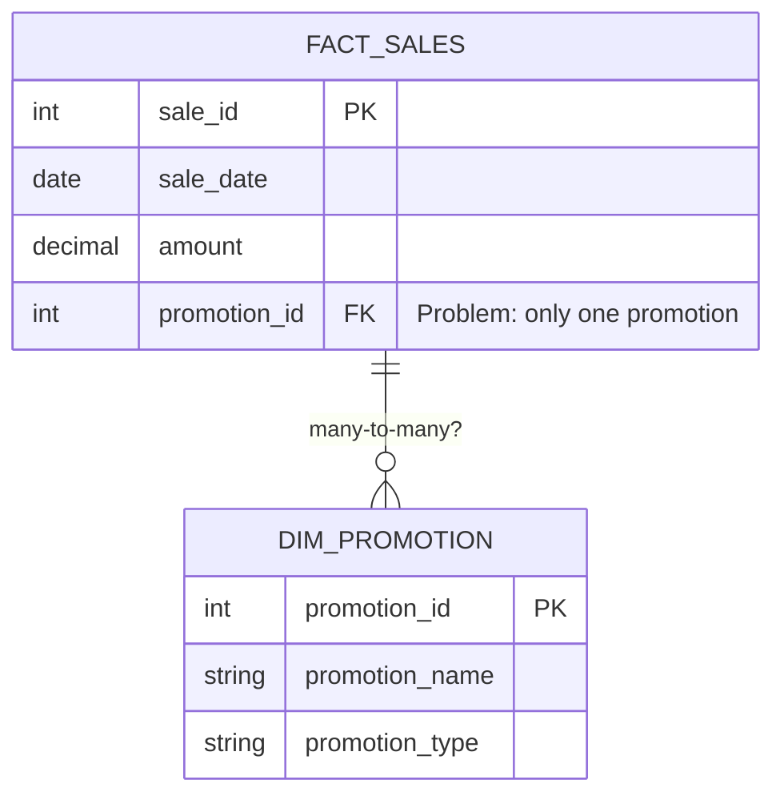
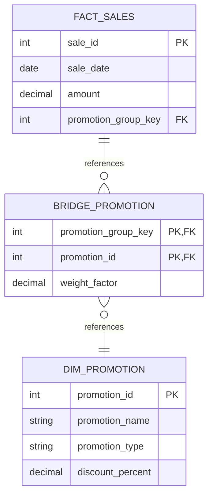
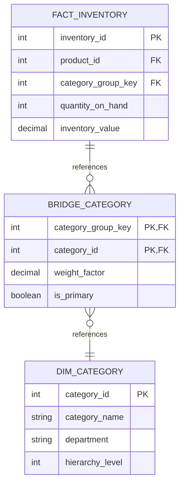
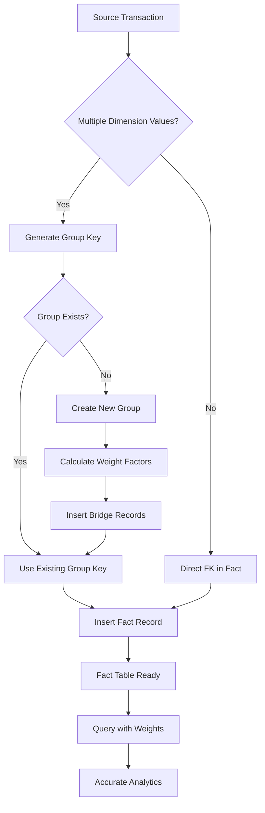

# How to Implement Bridge Tables

Author: [nawazdhandala](https://github.com/nawazdhandala)

Tags: Data Warehouse, Bridge Tables, Many-to-Many, Dimensional Modeling

Description: Learn to implement bridge tables for handling many-to-many relationships in dimensional models.

---

## Introduction

In dimensional modeling, bridge tables solve one of the most challenging problems: representing many-to-many relationships between fact tables and dimension tables. When a single transaction or event relates to multiple dimension members simultaneously, bridge tables provide an elegant solution that preserves query performance and analytical flexibility.

This guide walks you through implementing bridge tables with practical SQL examples, weighting factors for accurate aggregations, and query patterns you can use in production data warehouses.

## Understanding the Problem

Consider a common scenario: an e-commerce order can have multiple promotions applied to it. A single promotion can also apply to many orders. This creates a many-to-many relationship that cannot be modeled with a simple foreign key in either table.



The diagram above shows the limitation. With a single foreign key, you can only associate one promotion per sale. Bridge tables solve this by introducing an intermediate structure.

## Bridge Table Architecture

A bridge table sits between the fact table and the dimension table, enabling the many-to-many relationship while maintaining star schema query patterns.



The key insight is the `promotion_group_key`. Each unique combination of promotions gets its own group key, and the bridge table maps each group to its constituent promotions.

## Step-by-Step Implementation

### Step 1: Create the Dimension Table

First, create the dimension table that holds the individual promotion records.

```sql
-- Create the promotion dimension table
-- This stores all individual promotions available in the system
CREATE TABLE dim_promotion (
    promotion_id        INT PRIMARY KEY,
    promotion_name      VARCHAR(100) NOT NULL,
    promotion_type      VARCHAR(50) NOT NULL,
    discount_percent    DECIMAL(5,2),
    start_date          DATE,
    end_date            DATE,
    is_stackable        BOOLEAN DEFAULT FALSE,
    created_at          TIMESTAMP DEFAULT CURRENT_TIMESTAMP
);

-- Insert sample promotion data
INSERT INTO dim_promotion (promotion_id, promotion_name, promotion_type, discount_percent, start_date, end_date, is_stackable) VALUES
(1, 'Summer Sale 2026',      'Seasonal',   15.00, '2026-06-01', '2026-08-31', TRUE),
(2, 'New Customer 10%',      'Acquisition', 10.00, '2026-01-01', '2026-12-31', TRUE),
(3, 'Loyalty Reward',        'Retention',   5.00,  '2026-01-01', '2026-12-31', TRUE),
(4, 'Flash Sale',            'Limited',    25.00, '2026-07-15', '2026-07-16', FALSE),
(5, 'Free Shipping',         'Shipping',    0.00,  '2026-01-01', '2026-12-31', TRUE),
(6, 'Bundle Discount',       'Cross-sell', 12.00, '2026-01-01', '2026-12-31', TRUE);
```

### Step 2: Create the Bridge Table

The bridge table contains the promotion group key, individual promotion keys, and weighting factors.

```sql
-- Create the bridge table for promotions
-- Each row represents one promotion within a promotion group
CREATE TABLE bridge_promotion (
    promotion_group_key INT NOT NULL,
    promotion_id        INT NOT NULL,
    weight_factor       DECIMAL(10,6) NOT NULL DEFAULT 1.0,

    -- Composite primary key ensures uniqueness
    PRIMARY KEY (promotion_group_key, promotion_id),

    -- Foreign key to the dimension table
    FOREIGN KEY (promotion_id) REFERENCES dim_promotion(promotion_id)
);

-- Create index for efficient lookups from fact table
CREATE INDEX idx_bridge_promotion_group
    ON bridge_promotion(promotion_group_key);
```

### Step 3: Create the Fact Table

The fact table references the bridge through the promotion group key.

```sql
-- Create the sales fact table
-- References the bridge table via promotion_group_key
CREATE TABLE fact_sales (
    sale_id             INT PRIMARY KEY,
    sale_date           DATE NOT NULL,
    customer_id         INT NOT NULL,
    product_id          INT NOT NULL,
    quantity            INT NOT NULL,
    unit_price          DECIMAL(10,2) NOT NULL,
    gross_amount        DECIMAL(12,2) NOT NULL,
    discount_amount     DECIMAL(12,2) DEFAULT 0,
    net_amount          DECIMAL(12,2) NOT NULL,
    promotion_group_key INT,

    -- Foreign key to bridge table group
    FOREIGN KEY (promotion_group_key)
        REFERENCES bridge_promotion(promotion_group_key)
);

-- Create index for joining to bridge table
CREATE INDEX idx_fact_sales_promo_group
    ON fact_sales(promotion_group_key);
```

### Step 4: Populate the Bridge Table

Here is where the logic gets interesting. You need to generate unique group keys for each distinct combination of promotions.

```sql
-- Create a helper table to track promotion group assignments
CREATE TABLE promotion_group_lookup (
    promotion_group_key INT PRIMARY KEY AUTO_INCREMENT,
    promotion_set_hash  VARCHAR(64) UNIQUE NOT NULL,
    promotion_count     INT NOT NULL,
    created_at          TIMESTAMP DEFAULT CURRENT_TIMESTAMP
);

-- Stored procedure to get or create a promotion group
-- This ensures each unique combination gets a consistent group key
DELIMITER //

CREATE PROCEDURE get_or_create_promotion_group(
    IN p_promotion_ids VARCHAR(255),  -- Comma-separated promotion IDs
    OUT p_group_key INT
)
BEGIN
    DECLARE v_hash VARCHAR(64);
    DECLARE v_count INT;

    -- Create a deterministic hash of the sorted promotion IDs
    -- Sorting ensures '1,2,3' and '3,1,2' produce the same hash
    SET v_hash = MD5(
        (SELECT GROUP_CONCAT(promotion_id ORDER BY promotion_id)
         FROM dim_promotion
         WHERE FIND_IN_SET(promotion_id, p_promotion_ids))
    );

    -- Count promotions in this group
    SET v_count = (
        SELECT COUNT(*)
        FROM dim_promotion
        WHERE FIND_IN_SET(promotion_id, p_promotion_ids)
    );

    -- Check if this combination already exists
    SELECT promotion_group_key INTO p_group_key
    FROM promotion_group_lookup
    WHERE promotion_set_hash = v_hash;

    -- If not found, create new group
    IF p_group_key IS NULL THEN
        -- Insert into lookup table
        INSERT INTO promotion_group_lookup (promotion_set_hash, promotion_count)
        VALUES (v_hash, v_count);

        SET p_group_key = LAST_INSERT_ID();

        -- Populate bridge table with equal weighting
        INSERT INTO bridge_promotion (promotion_group_key, promotion_id, weight_factor)
        SELECT p_group_key, promotion_id, 1.0 / v_count
        FROM dim_promotion
        WHERE FIND_IN_SET(promotion_id, p_promotion_ids);
    END IF;
END //

DELIMITER ;
```

### Step 5: Insert Sample Data with Bridge Relationships

```sql
-- Example: Insert sales with various promotion combinations
-- Sale 1: Single promotion (Summer Sale)
CALL get_or_create_promotion_group('1', @group1);
INSERT INTO fact_sales VALUES (1001, '2026-07-15', 101, 501, 2, 49.99, 99.98, 15.00, 84.98, @group1);

-- Sale 2: Two promotions (Summer Sale + Loyalty Reward)
CALL get_or_create_promotion_group('1,3', @group2);
INSERT INTO fact_sales VALUES (1002, '2026-07-16', 102, 502, 1, 199.99, 199.99, 39.99, 159.99, @group2);

-- Sale 3: Three promotions (New Customer + Loyalty + Free Shipping)
CALL get_or_create_promotion_group('2,3,5', @group3);
INSERT INTO fact_sales VALUES (1003, '2026-07-17', 103, 503, 3, 29.99, 89.97, 13.50, 76.47, @group3);

-- Sale 4: No promotions (NULL group key)
INSERT INTO fact_sales VALUES (1004, '2026-07-18', 104, 504, 1, 79.99, 79.99, 0, 79.99, NULL);

-- Sale 5: Same combination as Sale 2 (reuses existing group)
CALL get_or_create_promotion_group('1,3', @group4);
INSERT INTO fact_sales VALUES (1005, '2026-07-19', 105, 501, 1, 49.99, 49.99, 10.00, 39.99, @group4);
```

## Understanding Weighting Factors

Weighting factors prevent double-counting when aggregating measures across multi-valued dimensions. Without weights, a sale with three promotions would be counted three times when joining through the bridge table.

### Equal Weighting

The simplest approach distributes weight equally among all promotions in a group.

```sql
-- Equal weighting: each promotion gets 1/n of the credit
-- For a sale with 3 promotions, each gets weight_factor = 0.333333

SELECT
    bp.promotion_group_key,
    bp.promotion_id,
    dp.promotion_name,
    bp.weight_factor,
    -- Verify weights sum to 1.0 per group
    SUM(bp.weight_factor) OVER (PARTITION BY bp.promotion_group_key) as group_total
FROM bridge_promotion bp
JOIN dim_promotion dp ON bp.promotion_id = dp.promotion_id
ORDER BY bp.promotion_group_key, bp.promotion_id;
```

### Custom Weighting Based on Business Rules

Sometimes equal weighting does not reflect business reality. You might want to weight based on discount contribution or business priority.

```sql
-- Update bridge table with custom weights based on discount percentage
-- Higher discount promotions get proportionally more credit
UPDATE bridge_promotion bp
SET weight_factor = (
    SELECT
        -- Calculate this promotion's share of total discount in group
        CASE
            WHEN group_total_discount = 0 THEN 1.0 / group_count
            ELSE dp.discount_percent / group_total_discount
        END
    FROM dim_promotion dp
    CROSS JOIN (
        -- Calculate totals for this group
        SELECT
            bp2.promotion_group_key,
            SUM(dp2.discount_percent) as group_total_discount,
            COUNT(*) as group_count
        FROM bridge_promotion bp2
        JOIN dim_promotion dp2 ON bp2.promotion_id = dp2.promotion_id
        WHERE bp2.promotion_group_key = bp.promotion_group_key
        GROUP BY bp2.promotion_group_key
    ) totals
    WHERE dp.promotion_id = bp.promotion_id
);
```

### Weighting Factor Validation

Always validate that weights sum to 1.0 for each group.

```sql
-- Validation query: find groups where weights do not sum to 1.0
-- Use a small tolerance for floating-point precision
SELECT
    promotion_group_key,
    SUM(weight_factor) as total_weight,
    COUNT(*) as promotion_count
FROM bridge_promotion
GROUP BY promotion_group_key
HAVING ABS(SUM(weight_factor) - 1.0) > 0.0001;
```

## Query Patterns for Bridge Tables

### Basic Query: Sales by Promotion Type

```sql
-- Aggregate sales by promotion type using weight factors
-- This prevents double-counting across multi-valued dimensions
SELECT
    dp.promotion_type,
    COUNT(DISTINCT fs.sale_id) as total_sales,

    -- Weighted sum prevents inflation from multi-promotion sales
    SUM(fs.net_amount * bp.weight_factor) as weighted_revenue,

    -- Unweighted sum shows total exposure (useful for reach metrics)
    SUM(fs.net_amount) as total_exposure_revenue,

    -- Average discount per weighted sale
    SUM(fs.discount_amount * bp.weight_factor) as weighted_discount
FROM fact_sales fs
-- Left join preserves sales without promotions
LEFT JOIN bridge_promotion bp
    ON fs.promotion_group_key = bp.promotion_group_key
LEFT JOIN dim_promotion dp
    ON bp.promotion_id = dp.promotion_id
GROUP BY dp.promotion_type
ORDER BY weighted_revenue DESC;
```

### Query: Promotion Effectiveness Analysis

```sql
-- Analyze individual promotion performance
-- Compare weighted metrics to understand true contribution
SELECT
    dp.promotion_id,
    dp.promotion_name,
    dp.promotion_type,
    dp.discount_percent,

    -- Count of sales where this promotion was applied
    COUNT(fs.sale_id) as sales_count,

    -- Weighted revenue attribution
    SUM(fs.net_amount * bp.weight_factor) as attributed_revenue,

    -- Average weighted sale value
    AVG(fs.net_amount * bp.weight_factor) as avg_attributed_value,

    -- Weighted discount given
    SUM(fs.discount_amount * bp.weight_factor) as attributed_discount,

    -- ROI calculation: revenue generated per discount dollar
    CASE
        WHEN SUM(fs.discount_amount * bp.weight_factor) > 0
        THEN SUM(fs.net_amount * bp.weight_factor) /
             SUM(fs.discount_amount * bp.weight_factor)
        ELSE NULL
    END as revenue_per_discount_dollar

FROM dim_promotion dp
LEFT JOIN bridge_promotion bp
    ON dp.promotion_id = bp.promotion_id
LEFT JOIN fact_sales fs
    ON bp.promotion_group_key = fs.promotion_group_key
GROUP BY
    dp.promotion_id,
    dp.promotion_name,
    dp.promotion_type,
    dp.discount_percent
ORDER BY attributed_revenue DESC;
```

### Query: Promotion Combination Analysis

```sql
-- Find which promotion combinations are most effective
-- This helps identify synergies between promotions
WITH promotion_combinations AS (
    SELECT
        fs.promotion_group_key,
        pgl.promotion_count,

        -- Create readable list of promotions in group
        (SELECT GROUP_CONCAT(dp.promotion_name ORDER BY dp.promotion_name SEPARATOR ' + ')
         FROM bridge_promotion bp2
         JOIN dim_promotion dp ON bp2.promotion_id = dp.promotion_id
         WHERE bp2.promotion_group_key = fs.promotion_group_key
        ) as promotion_combo,

        COUNT(*) as sales_count,
        SUM(fs.net_amount) as total_revenue,
        SUM(fs.discount_amount) as total_discount,
        AVG(fs.net_amount) as avg_sale_value

    FROM fact_sales fs
    JOIN promotion_group_lookup pgl
        ON fs.promotion_group_key = pgl.promotion_group_key
    WHERE fs.promotion_group_key IS NOT NULL
    GROUP BY
        fs.promotion_group_key,
        pgl.promotion_count
)
SELECT
    promotion_combo,
    promotion_count,
    sales_count,
    total_revenue,
    total_discount,
    avg_sale_value,

    -- Discount efficiency: how much revenue per discount dollar
    CASE
        WHEN total_discount > 0
        THEN total_revenue / total_discount
        ELSE NULL
    END as discount_efficiency

FROM promotion_combinations
ORDER BY sales_count DESC
LIMIT 20;
```

### Query: Time-Based Promotion Analysis

```sql
-- Analyze promotion performance over time with proper weighting
SELECT
    DATE_TRUNC('month', fs.sale_date) as sale_month,
    dp.promotion_type,

    -- Distinct sale count (not inflated)
    COUNT(DISTINCT fs.sale_id) as unique_sales,

    -- Weighted metrics for accurate attribution
    SUM(fs.net_amount * bp.weight_factor) as weighted_revenue,
    SUM(fs.discount_amount * bp.weight_factor) as weighted_discount,

    -- Calculate month-over-month growth
    LAG(SUM(fs.net_amount * bp.weight_factor)) OVER (
        PARTITION BY dp.promotion_type
        ORDER BY DATE_TRUNC('month', fs.sale_date)
    ) as prev_month_revenue

FROM fact_sales fs
JOIN bridge_promotion bp
    ON fs.promotion_group_key = bp.promotion_group_key
JOIN dim_promotion dp
    ON bp.promotion_id = dp.promotion_id
GROUP BY
    DATE_TRUNC('month', fs.sale_date),
    dp.promotion_type
ORDER BY
    sale_month,
    weighted_revenue DESC;
```

## Handling Multi-Valued Dimensions

Bridge tables excel at handling multi-valued dimensions beyond promotions. Here are common use cases with implementation patterns.

### Example: Products with Multiple Categories

A product can belong to multiple categories (cross-merchandising).



```sql
-- Bridge table for product categories with primary flag
CREATE TABLE bridge_product_category (
    category_group_key  INT NOT NULL,
    category_id         INT NOT NULL,
    weight_factor       DECIMAL(10,6) NOT NULL,
    is_primary          BOOLEAN DEFAULT FALSE,  -- Marks primary category

    PRIMARY KEY (category_group_key, category_id),
    FOREIGN KEY (category_id) REFERENCES dim_category(category_id)
);

-- Query using primary category for some metrics, weighted for others
SELECT
    dc.department,
    dc.category_name,

    -- Primary category gets full credit for unit counts
    SUM(CASE WHEN bc.is_primary THEN fi.quantity_on_hand ELSE 0 END)
        as primary_units,

    -- Weighted value for financial metrics
    SUM(fi.inventory_value * bc.weight_factor)
        as weighted_inventory_value

FROM fact_inventory fi
JOIN bridge_product_category bc
    ON fi.category_group_key = bc.category_group_key
JOIN dim_category dc
    ON bc.category_id = dc.category_id
GROUP BY dc.department, dc.category_name;
```

### Example: Employees with Multiple Skills

```sql
-- Bridge table for employee skills with proficiency weighting
CREATE TABLE bridge_employee_skill (
    skill_group_key     INT NOT NULL,
    skill_id            INT NOT NULL,
    proficiency_level   INT NOT NULL,  -- 1=Basic, 2=Intermediate, 3=Expert
    weight_factor       DECIMAL(10,6) NOT NULL,

    PRIMARY KEY (skill_group_key, skill_id),
    FOREIGN KEY (skill_id) REFERENCES dim_skill(skill_id)
);

-- Weight based on proficiency level
-- Expert skills get more attribution than basic skills
UPDATE bridge_employee_skill bes
SET weight_factor = (
    SELECT bes.proficiency_level / SUM(bes2.proficiency_level)
    FROM bridge_employee_skill bes2
    WHERE bes2.skill_group_key = bes.skill_group_key
);
```

## Performance Optimization

### Indexing Strategy

```sql
-- Essential indexes for bridge table performance
-- 1. Primary key index (created automatically)
-- 2. Index for fact table lookups
CREATE INDEX idx_bridge_group_key
    ON bridge_promotion(promotion_group_key);

-- 3. Index for dimension table lookups
CREATE INDEX idx_bridge_promotion_id
    ON bridge_promotion(promotion_id);

-- 4. Covering index for common query patterns
CREATE INDEX idx_bridge_covering
    ON bridge_promotion(promotion_group_key, promotion_id, weight_factor);
```

### Materialized Views for Common Aggregations

```sql
-- Pre-aggregate weighted metrics for dashboard queries
CREATE MATERIALIZED VIEW mv_promotion_daily_metrics AS
SELECT
    fs.sale_date,
    dp.promotion_id,
    dp.promotion_name,
    dp.promotion_type,
    COUNT(DISTINCT fs.sale_id) as sale_count,
    SUM(fs.net_amount * bp.weight_factor) as weighted_revenue,
    SUM(fs.discount_amount * bp.weight_factor) as weighted_discount
FROM fact_sales fs
JOIN bridge_promotion bp
    ON fs.promotion_group_key = bp.promotion_group_key
JOIN dim_promotion dp
    ON bp.promotion_id = dp.promotion_id
GROUP BY
    fs.sale_date,
    dp.promotion_id,
    dp.promotion_name,
    dp.promotion_type;

-- Refresh strategy: daily after ETL completes
-- REFRESH MATERIALIZED VIEW mv_promotion_daily_metrics;
```

### Partition Strategy for Large Bridge Tables

```sql
-- For very large bridge tables, consider range partitioning
-- Partition by group_key ranges for even distribution
CREATE TABLE bridge_promotion_partitioned (
    promotion_group_key INT NOT NULL,
    promotion_id        INT NOT NULL,
    weight_factor       DECIMAL(10,6) NOT NULL,
    PRIMARY KEY (promotion_group_key, promotion_id)
)
PARTITION BY RANGE (promotion_group_key) (
    PARTITION p0 VALUES LESS THAN (100000),
    PARTITION p1 VALUES LESS THAN (200000),
    PARTITION p2 VALUES LESS THAN (300000),
    PARTITION p3 VALUES LESS THAN (MAXVALUE)
);
```

## Common Pitfalls and Solutions

### Pitfall 1: Forgetting to Apply Weights

```sql
-- WRONG: This double-counts multi-promotion sales
SELECT
    dp.promotion_type,
    SUM(fs.net_amount) as total_revenue  -- Inflated!
FROM fact_sales fs
JOIN bridge_promotion bp ON fs.promotion_group_key = bp.promotion_group_key
JOIN dim_promotion dp ON bp.promotion_id = dp.promotion_id
GROUP BY dp.promotion_type;

-- CORRECT: Apply weight factors
SELECT
    dp.promotion_type,
    SUM(fs.net_amount * bp.weight_factor) as total_revenue  -- Accurate
FROM fact_sales fs
JOIN bridge_promotion bp ON fs.promotion_group_key = bp.promotion_group_key
JOIN dim_promotion dp ON bp.promotion_id = dp.promotion_id
GROUP BY dp.promotion_type;
```

### Pitfall 2: Weights Not Summing to 1.0

```sql
-- Automated fix for weight normalization
UPDATE bridge_promotion bp
SET weight_factor = weight_factor / (
    SELECT SUM(weight_factor)
    FROM bridge_promotion bp2
    WHERE bp2.promotion_group_key = bp.promotion_group_key
)
WHERE promotion_group_key IN (
    SELECT promotion_group_key
    FROM bridge_promotion
    GROUP BY promotion_group_key
    HAVING ABS(SUM(weight_factor) - 1.0) > 0.0001
);
```

### Pitfall 3: NULL Handling in Joins

```sql
-- Handle sales without promotions properly
SELECT
    COALESCE(dp.promotion_type, 'No Promotion') as promotion_type,
    COUNT(DISTINCT fs.sale_id) as sale_count,
    SUM(fs.net_amount * COALESCE(bp.weight_factor, 1.0)) as revenue
FROM fact_sales fs
LEFT JOIN bridge_promotion bp
    ON fs.promotion_group_key = bp.promotion_group_key
LEFT JOIN dim_promotion dp
    ON bp.promotion_id = dp.promotion_id
GROUP BY COALESCE(dp.promotion_type, 'No Promotion');
```

## Bridge Table Data Flow

Here is the complete data flow for bridge table implementation:



## Summary

Bridge tables are essential tools for handling many-to-many relationships in dimensional models. The key principles to remember:

1. **Use group keys** to link facts to unique combinations of dimension values
2. **Apply weight factors** to prevent double-counting in aggregations
3. **Validate weights** sum to 1.0 for each group
4. **Index strategically** for query performance
5. **Document weight logic** so analysts understand attribution rules

By following these patterns, you can model complex relationships while maintaining the query simplicity that makes dimensional models powerful for analytics.

**Related Reading:**

- [Star Schema vs Snowflake Schema: Choosing the Right Design](https://oneuptime.com/blog)
- [Slowly Changing Dimensions: Implementation Patterns](https://oneuptime.com/blog)
- [Data Warehouse Performance Tuning Best Practices](https://oneuptime.com/blog)
